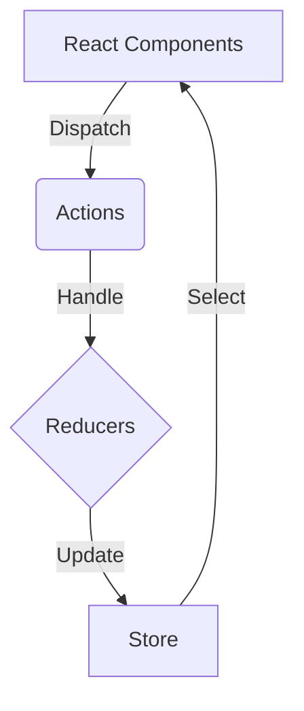

# Redux: Еволюція управління станом

Ласкаво просимо до найповнішого посібника з **Redux** українською мовою. Цей курс розроблено так, щоб ви не просто вивчили синтаксис бібліотеки, а зрозуміли **філософію** управління даними у складних застосунках.

Ми пройдемо шлях еволюції: від ручного написання кожного редюсера та екшену в "класичному" Redux до елегантної лаконічності сучасного **Redux Toolkit**.

## Чому саме цей курс?

Більшість туторіалів одразу показують Redux Toolkit. Це швидко, але це приховує розуміння того, _як_ все працює під капотом. Ми підемо іншим шляхом:

1.  **Спочатку біль**: Ми напишемо код на "старому" Redux, щоб ви відчули, чому він був складним.
2.  **Потім полегшення**: Ми перепишемо цей код на Redux Toolkit, і ви зрозумієте цінність кожної функції.

::alert{type="info"}
Розуміння "старого" Redux є критичним для дебагінгу та підтримки legacy-проєктів, яких все ще дуже багато на ринку.
::

## Структура курсу

Ми розділили матеріал на логічні блоки, які варто проходити послідовно:

::card-group
::card{title="1. Фундаментальні концепції" icon="heroicons:academic-cap" to="./01.fundamentals/01.intro-state-management"}
Що таке State Management? Архітектура Flux, чисті функції та іммутабельність. Чому `state.value = 5` — це погано?
::
::card{title="2. Класичний Redux" icon="heroicons:archive-box" to="./02.classic-redux/01.store-setup"}
Створення Store, написання Actions та Reducers вручну. `connect` vs Hooks. Як працює асинхронність з Redux Thunk.
::
::card{title="3. Перехід до Toolkit" icon="heroicons:arrow-path" to="./03.transition-to-rtk/01.problems-with-classic"}
Аналіз проблем класичного підходу. Boilerplate, складність налаштування та типізації. Вступ до філософії RTK.
::
::card{title="4. Modern Redux (Toolkit)" icon="heroicons:bolt" to="./04.redux-toolkit/01.configure-store"}
`configureStore`, `createSlice`, вбудований Immer. Як писати код в 3 рази швидше і безпечніше.
::
::card{title="5. Advanced Patterns" icon="heroicons:beaker" to="./05.advanced/01.selectors-reselect"}
Селектори та мемоізація. RTK Query для кешування API. Оптимізація продуктивності та архітектура великих проєктів.
::
::

## Що ви будете вміти?

Після проходження цього модулю ви зможете:

- ✅ Проєктувати глобальний стан для Enterprise-додатків.
- ✅ Розуміти різницю між Client State та Server State.
- ✅ Використовувати Redux DevTools на рівні "Бог".
- ✅ Писати чистий, тестований та підтримуваний код.
- ✅ Аргументовано вибирати між Context API, Zustand та Redux.

## Необхідні знання

Перед початком переконайтеся, що ви впевнено володієте:

- **Modern JavaScript**: ES6+ (Arrow functions, Destructuring, Spread operator, Modules).
- **React Fundamentals**: Props, State, Hooks (`useState`, `useEffect`, `useContext`).
- **Asynchronous JS**: Promises, async/await.

::mermaid

::

Почнімо нашу подорож з фундаментального питання: **Навіщо нам взагалі потрібен менеджер стану?**

👉 [Перейти до першого уроку: Вступ до State Management](./01.fundamentals/01.intro-state-management.md)
