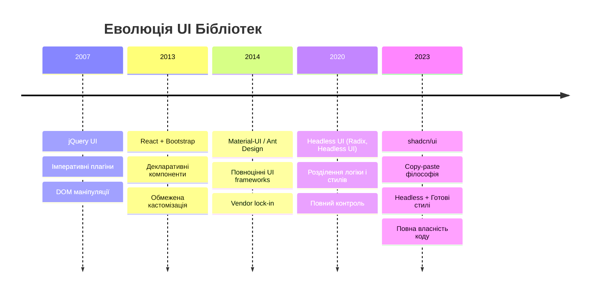
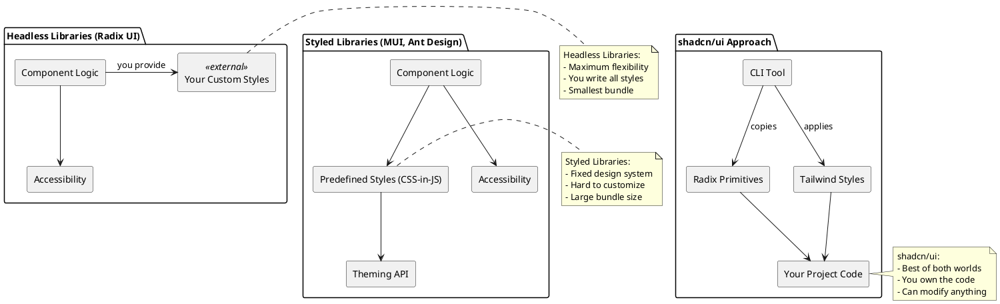
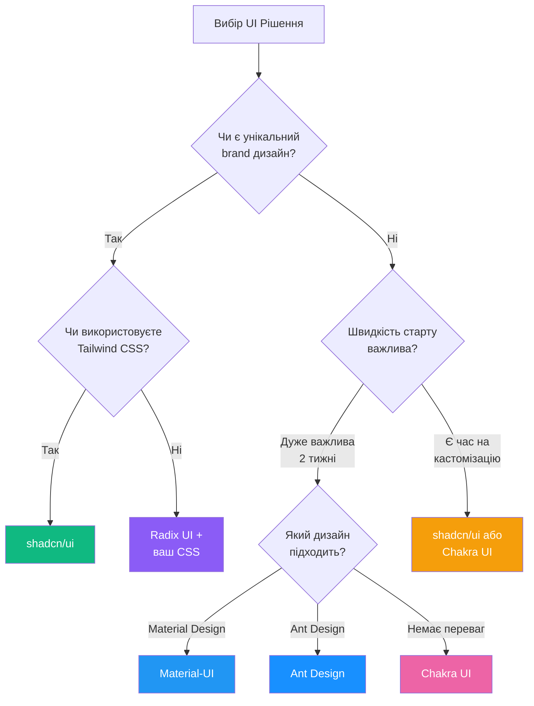

# Вступ до UI Бібліотек: Навіщо Винаходити Велосипед Двічі?

Уявіть собі, що кожного разу, коли ви хочете створити веб-додаток, вам потрібно писати кнопку з нуля. Не просто `<button>`, а кнопку, яка:

- Працює з клавіатури (Enter/Space)
- Має візуальний feedback (hover, active, focus states)
- Доступна для screen readers
- Підтримує різні варіанти (primary, secondary, destructive)
- Адаптивна до різних розмірів екрану
- Має плавні transitions та animations

Якщо ви напишете це один раз, вам знадобиться близько 150-200 рядків CSS та JavaScript. А тепер помножте це на 50+ компонентів, які потрібні для створення сучасного додатку (inputs, modals, dropdowns, tables, tooltips тощо).

**Саме тому існують UI бібліотеки** — щоб ви могли сфокусуватися на бізнес-логіці, а не переписувати checkbox у сотий раз.

Але тут виникає питання: **яку UI бібліотеку обрати?** І чи взагалі потрібна бібліотека, чи можна обійтися utility-first CSS на кшталт Tailwind?

У цій главі ми розберемо фундаментальні типи UI рішень, зрозуміємо їх архітектуру, порівняємо підходи та навчимося приймати свідомі рішення.

## Історична Еволюція: Від jQuery UI до shadcn/ui

Щоб зрозуміти, чому ландшафт UI бібліотек виглядає саме так, давайте подивимося, як ми до цього дійшли.

### Епоха 1: jQuery UI (2007-2015)

У доволіберативному світі (до React, Vue, Angular) найпопулярнішою UI бібліотекою була **jQuery UI**.

```html
<!-- jQuery UI: Imperативний підхід -->
<div id="accordion">
    <h3>Section 1</h3>
    <div>Content 1</div>
    <h3>Section 2</h3>
    <div>Content 2</div>
</div>

<script>
    $(function () {
        $('#accordion').accordion()
    })
</script>
```

**Проблеми**:

- **Імперативність**: Ви маніпулюєте DOM напряму
- **Глобальний стан**: Важко керувати складністю
- **Немає реактивності**: Зміна даних не оновлює UI автоматично

### Епоха 2: Bootstrap + React (2013-2018)

З появою React розробники спробували адаптувати Bootstrap:

```jsx
// react-bootstrap: Обгортка над jQuery плагінами
import { Modal, Button } from 'react-bootstrap'

function MyModal() {
    const [show, setShow] = useState(false)

    return (
        <>
            <Button onClick={() => setShow(true)}>Open</Button>
            <Modal show={show} onHide={() => setShow(false)}>
                <Modal.Header closeButton>
                    <Modal.Title>Modal heading</Modal.Title>
                </Modal.Header>
                <Modal.Body>Woohoo, you're reading this text in a modal!</Modal.Body>
            </Modal>
        </>
    )
}
```

**Прогрес**:

- Реактивність та декларативність
- Компонентна архітектура

**Проблеми**:

- Ви "прив'язані" до стилів Bootstrap
- Важко кастомізувати без `!important` та перезапису CSS
- Bundle size (завантажуєте весь Bootstrap, навіть якщо використовуєте 3 компоненти)

### Епоха 3: Material-UI, Ant Design (2014-2020)

Поява повноцінних **component libraries** для React:

```jsx
// Material-UI: Все в коробці
import { Button, TextField, Dialog } from '@mui/material'

function MyForm() {
    return (
        <Dialog open>
            <TextField label="Name" variant="outlined" />
            <Button variant="contained" color="primary">
                Submit
            </Button>
        </Dialog>
    )
}
```

**Плюси**:

- Готові, красиві компоненти з коробки
- Узгоджений design system (Material Design, Ant Design)
- Багато документації та прикладів

**Мінуси**:

- **Vendor Lock-in**: Ваш додаток виглядає "як MUI" або "як Ant"
- **Важка кастомізація**: Theming API складний
- **Великий bundle size**: 200-300KB (gzip) базової бібліотеки
- **Перезапис стилів**: Боротьба з CSS specificity

### Епоха 4: Headless UI (2020-теперішній час)

Рішення: **розділити логіку та стилізацію**.

```jsx
// Radix UI: Headless primitive
import * as Dialog from '@radix-ui/react-dialog'

function MyDialog() {
    return (
        <Dialog.Root>
            <Dialog.Trigger className="my-button">Open</Dialog.Trigger>
            <Dialog.Portal>
                <Dialog.Overlay className="my-overlay" />
                <Dialog.Content className="my-content">
                    <Dialog.Title>My Dialog</Dialog.Title>
                    <Dialog.Description>This is a description</Dialog.Description>
                    <Dialog.Close className="my-close">Close</Dialog.Close>
                </Dialog.Content>
            </Dialog.Portal>
        </Dialog.Root>
    )
}
```

**Революція**:

- **Нуль стилів**: Ви отримуєте лише функціонал та accessibility
- **Повний контроль**: Стилізуєте як хочете (CSS, Tailwind, Styled Components)
- **Маленький розмір**: Кожен компонент 2-5KB

**Проблема**:

- Треба писати всі стилі самостійно
- Час на початкову настройку

### Епоха 5: shadcn/ui (2023-теперішній час)

**Синтез**: Беремо headless UI (Radix) + додаємо готові стилі (Tailwind) + даємо код у власність.

```jsx
// shadcn/ui: Copy-paste компонент
import { Button } from '@/components/ui/button'
import {
    Dialog,
    DialogContent,
    DialogDescription,
    DialogHeader,
    DialogTitle,
    DialogTrigger,
} from '@/components/ui/dialog'

function MyDialog() {
    return (
        <Dialog>
            <DialogTrigger asChild>
                <Button variant="outline">Open Dialog</Button>
            </DialogTrigger>
            <DialogContent>
                <DialogHeader>
                    <DialogTitle>Are you absolutely sure?</DialogTitle>
                    <DialogDescription>This action cannot be undone.</DialogDescription>
                </DialogHeader>
            </DialogContent>
        </Dialog>
    )
}
```

**Філософія**: Ви не встановлюєте пакунок з NPM. Ви **копіюєте код компонента у свій проєкт** та можете змінювати його як завгодно.

::mermaid



::

::note
**Ключова думка**: Кожна епоха вирішує проблеми попередньої, але створює нові. shadcn/ui — це спроба знайти баланс між "все готове" та "повний контроль".
::

## Типологія UI Рішень

Давайте систематизуємо те, що існує на ринку. UI рішення можна класифікувати за кількома осями.

### Класифікація 1: За Рівнем Стилізації

#### Styled Component Libraries (Стилізовані Бібліотеки)

**Суть**: Ви отримуєте компоненти з готовими стилями.

**Приклади**: Material-UI, Ant Design, Chakra UI, Mantine

**Характеристики**:

```jsx
// Все стилі вже є
import { Button } from '@mui/material'
;<Button variant="contained" color="primary">
    Click me
</Button>
// Результат: Синя кнопка з Material Design стилем
```

**Переваги**:

- ✅ Швидкий старт (компоненти працюють з коробки)
- ✅ Узгоджений дизайн з коробки
- ✅ Багато документації та прикладів
- ✅ Підтримка accessibility

**Недоліки**:

- ❌ Важко відійти від базового дизайну
- ❌ Великий bundle size
- ❌ Складний theming API
- ❌ Ваш додаток "виглядає як MUI"

**Коли використовувати**:

- Адмін-панелі та internal tools
- MVP та прототипи
- Команда без дизайнера
- Потрібен швидкий результат

#### Headless Component Libraries (Безстильові Бібліотеки)

**Суть**: Ви отримуєте логіку, behavior та accessibility — без жодного CSS.

**Приклади**: Radix UI, Headless UI, React Aria, Ariakit

**Характеристики**:

```jsx
// Нуль стилів, тільки логіка
import * as Tabs from '@radix-ui/react-tabs'
;<Tabs.Root defaultValue="tab1">
    <Tabs.List className="YOUR_CUSTOM_CLASS">
        <Tabs.Trigger value="tab1" className="YOUR_TAB_CLASS">
            Tab 1
        </Tabs.Trigger>
    </Tabs.List>
    <Tabs.Content value="tab1" className="YOUR_CONTENT_CLASS">
        Content 1
    </Tabs.Content>
</Tabs.Root>
```

**Переваги**:

- ✅ Повний контроль над стилями
- ✅ Маленький bundle size (2-5KB на компонент)
- ✅ Accessibility з коробки (WAI-ARIA compliant)
- ✅ Немає CSS конфліктів

**Недоліки**:

- ❌ Треба писати всі стилі самостійно
- ❌ Більше часу на початкову настройку
- ❌ Потрібен дизайнер або навички дизайну

**Коли використовувати**:

- У вас є унікальний brand/design
- Критичний performance (маленький bundle)
- Потрібна гнучкість
- Довгостроковий продукт

#### Utility-First CSS + Components (shadcn/ui, Flowbite)

**Суть**: Headless UI + Готові стилі на Tailwind + Копіювання коду.

**Приклади**: shadcn/ui, daisyUI (Tailwind plugin), Flowbite

**Характеристики**:

```bash
# Ви не робите npm install shadcn-ui
# Натомість копіюєте код
npx shadcn@latest add button

# Це створить файл src/components/ui/button.tsx у ВАШОМУ проєкті
```

```jsx
// Компонент у ВАШІЙ кодовій базі цілком
import { Button } from '@/components/ui/button'
;<Button variant="destructive" size="lg">
    Delete
</Button>
```

**Переваги**:

- ✅ Готові стилі (не треба писати з нуля)
- ✅ Повна власність коду (можна змінювати що завгодно)
- ✅ Маленький bundle (тільки те, що використовуєте)
- ✅ Accessibility з коробки
- ✅ Легко кастомізувати (просто відредагуйте файл)

**Недоліки**:

- ❌ Потрібно знати Tailwind CSS
- ❌ Код у вашому репозиторії (не оновлюється автоматично)
- ❌ Початкова настройка (Tailwind + TypeScript)

**Коли використовувати**:

- Потрібен баланс між швидкістю та контролем
- Використовуєте Tailwind CSS
- Хочете красивий дизайн без lock-in
- Довгостроковий проєкт з можливістю еволюції

::plant-uml



::

### Класифікація 2: За Способом Доставки

#### NPM Package (Традиційний підхід)

```bash
npm install @mui/material @emotion/react @emotion/styled
```

-**Плюси**: Легке оновлення (просто `npm update`)

- **Мінуси**: Складно кастомізуватислід, код у `node_modules`

#### Copy-Paste (shadcn/ui підхід)

```bash
npx shadcn@latest add dialog
```

- **Плюси**: Повна власність коду, легко змінювати
- **Мінуси**: Оновлення вручну (але ви платите за контроль)

#### Tailwind Plugin (daisyUI, Headless UI)

```js
// tailwind.config.js
plugins: [require('daisyui')]
```

- **Плюси**: Інтеграція з Tailwind, класи через className
- **Мінуси**: Обмежена кастомізація порівняно з copy-paste

## Порівняльний Аналіз: Вибір Рішення

Розглянемо реальний сценарій: нам потрібно створити **Dialog (модальне вікно)** з формою.

::tabs
::div{label="Material-UI"}

```jsx
import { Dialog, DialogTitle, DialogContent, DialogActions, Button, TextField } from '@mui/material'

function MyDialog({ open, onClose }) {
    return (
        <Dialog open={open} onClose={onClose}>
            <DialogTitle>Edit Profile</DialogTitle>
            <DialogContent>
                <TextField autoFocus margin="dense" label="Email Address" type="email" fullWidth variant="standard" />
            </DialogContent>
            <DialogActions>
                <Button onClick={onClose}>Cancel</Button>
                <Button onClick={onClose} variant="contained">
                    Save
                </Button>
            </DialogActions>
        </Dialog>
    )
}
```

**Що отримуємо**:

- ✅ Працює з коробки
- ✅ Material Design стиль
- ❌ Виглядає "як Google"
- ❌ +89KB до bundle (лише Dialog + Button + TextField)

**Кастомізація простого кольору кнопки**:

```jsx
// Потрібен ThemeProvider та складний конфіг
import { createTheme, ThemeProvider } from '@mui/material/styles'

const theme = createTheme({
    palette: {
        primary: {
            main: '#your-color',
        },
    },
})

// Обгорнути весь додаток
;<ThemeProvider theme={theme}>
    <MyDialog />
</ThemeProvider>
```

::
::div{label="Radix UI (Headless)"}

```jsx
import * as Dialog from '@radix-ui/react-dialog'

function MyDialog({ open, onClose }) {
    return (
        <Dialog.Root open={open} onOpenChange={onClose}>
            <Dialog.Portal>
                <Dialog.Overlay className="fixed inset-0 bg-black/50" />
                <Dialog.Content className="fixed top-1/2 left-1/2 -translate-x-1/2 -translate-y-1/2 bg-white rounded-lg p-6 w-[450px]">
                    <Dialog.Title className="text-lg font-semibold mb-4">Edit Profile</Dialog.Title>
                    <input
                        type="email"
                        className="w-full border border-gray-300 rounded px-3 py-2 mb-4"
                        placeholder="Email Address"
                    />
                    <div className="flex justify-end gap-2">
                        <button onClick={onClose} className="px-4 py-2 rounded hover:bg-gray-100">
                            Cancel
                        </button>
                        <button
                            onClick={onClose}
                            className="px-4 py-2 bg-blue-600 text-white rounded hover:bg-blue-700"
                        >
                            Save
                        </button>
                    </div>
                    <Dialog.Close className="absolute top-4 right-4">✕</Dialog.Close>
                </Dialog.Content>
            </Dialog.Portal>
        </Dialog.Root>
    )
}
```

**Що отримуємо**:

- ✅ Повний контроль над стилями
- ✅ +5KB до bundle
- ✅ Accessibility (focus trap, Esc key, ARIA)
- ❌ Треба писати всі класи вручну
- ❌ Більше коду

**Кастомізація кольору кнопки**:

```jsx
// Просто змініть клас
className = 'px-4 py-2 bg-purple-600 text-white rounded'
```

::
::div{label="shadcn/ui"}

```jsx
import { Dialog, DialogContent, DialogDescription, DialogHeader, DialogTitle } from '@/components/ui/dialog'
import { Button } from '@/components/ui/button'
import { Input } from '@/components/ui/input'
import { Label } from '@/components/ui/label'

function MyDialog({ open, onClose }) {
    return (
        <Dialog open={open} onOpenChange={onClose}>
            <DialogContent className="sm:max-w-[425px]">
                <DialogHeader>
                    <DialogTitle>Edit Profile</DialogTitle>
                    <DialogDescription>Make changes to your profile here.</DialogDescription>
                </DialogHeader>
                <div className="grid gap-4 py-4">
                    <div className="grid grid-cols-4 items-center gap-4">
                        <Label htmlFor="email" className="text-right">
                            Email
                        </Label>
                        <Input id="email" type="email" className="col-span-3" />
                    </div>
                </div>
                <div className="flex justify-end gap-2">
                    <Button variant="outline" onClick={onClose}>
                        Cancel
                    </Button>
                    <Button onClick={onClose}>Save</Button>
                </div>
            </DialogContent>
        </Dialog>
    )
}
```

**Що отримуємо**:

- ✅ Красивий дизайн з коробки
- ✅ Код у вашому проєкті (можна змінювати)
- ✅ +7KB до bundle (Dialog + Button + Input)
- ✅ Accessibility
- ✅ Responsive design

**Кастомізація кольору кнопки**:

```jsx
// Варіант 1: Використати variant
<Button variant="destructive">Delete</Button>

// Варіант 2: Відкрити src/components/ui/button.tsx та додати свій variant
const buttonVariants = cva(
  "...",
  {
    variants: {
      variant: {
        default: "bg-primary text-primary-foreground hover:bg-primary/90",
        destructive: "...",
        purple: "bg-purple-600 text-white hover:bg-purple-700", // ← додали
      },
    },
  }
)

// Використати
<Button variant="purple">My Button</Button>
```

::
::

### Порівня таблиця: Ключові Метрики

| Критерій                 | Material-UI              | Radix UI            | shadcn/ui                      |
| ------------------------ | ------------------------ | ------------------- | ------------------------------ |
| **Bundle Size (Dialog)** | ~89 KB                   | ~5 KB               | ~7 KB                          |
| **Готові стилі**         | ✅ Так                   | ❌ Ні               | ✅ Так                         |
| **Кастомізація**         | ⚠️ Складна (theming API) | ✅ Повна (ваш CSS)  | ✅ Легка (редагуйте файл)      |
| **Accessibility**        | ✅ Так                   | ✅ Так              | ✅ Так (через Radix)           |
| **Час старту**           | 🚀 5 хвилин              | ⏱️ 30 хвилин        | ⏱️ 15 хвилин                   |
| **Learning Curve**       | Помірна                  | Низька              | Низька                         |
| **Власність коду**       | ❌ Ні (у node_modules)   | ✅ Так (ваші стилі) | ✅ Так (весь компонент)        |
| **Оновлення**            | ✅ Автоматичні (npm)     | ✅ Автоматичні      | ⚠️ Вручну (але ви контролюєте) |
| **TypeScript**           | ✅ Вбудований            | ✅ Вбудований       | ✅ Вбудований                  |
| **Унікальний дизайн**    | ❌ Виглядає як MUI       | ✅ Повністю ваш     | ✅ Базисний + ваш              |

::note
**Висновок**: Немає "найкращого" рішення. Є trade-offs:

- **MUI**: Швидкість старту ⚡ vs Lock-in 🔒
- **Radix**: Контроль ✨ vs Більше роботи 🛠️
- **shadcn/ui**: Баланс ⚖️ (готові компоненти + власність коду)

::

## Accessibility (a11y): Чому це Критично

Усі сучасні UI бібліотеки акцентують на accessibility, але що це означає насправді?

### Що таке Accessibility?

**Accessibility** (скорочено **a11y**: "a" + 11 букв + "y") — це практика створення інтерфейсів,доступних для всіх користувачів, включно з людьми з обмеженими можливостями.

**Категорії користувачів**:

- 👁️ **Зорові обмеження**: повна або часткова сліпота (screen readers)
- ⌨️ **Моторні обмеження**: використовують лише клавіатуру (без миші)
- 🎨 **Колірова сліпота**: не розрізняють певні кольори
- 🧠 **Когнітивні обмеження**: потребують простих, зрозумілих інтерфейсів

### ARIA Attributes та Роль Headless UI

**WAI-ARIA** (Web Accessibility Initiative – Accessible Rich Internet Applications) — стандарт для доступності веб-додатків.

**Приклад недоступного Dialog**:

```jsx
// ❌ ПОГАНИЙ приклад:код без accessibility
function BadDialog({ open, onClose, children }) {
    if (!open) return null

    return (
        <div onClick={onClose}>
            <div onClick={(e) => e.stopPropagation()}>
                {children}
                <button onClick={onClose}>×</button>
            </div>
        </div>
    )
}
```

**Проблеми**:

1. ❌ Screen reader не знає, що це діалог
2. ❌ Фокус не переміщається в діалог (користувач клавіатури не може взаємодіяти)
3. ❌ Escape не закриває діалог
4. ❌ Фокус не повертається до trigger кнопки після закриття
5. ❌ Немає `aria-labelledby` для title
6. ❌ Фон можна прокручувати

**Приклад доступного Dialog (Radix UI)**:

```jsx
// ✅ ГАРНИЙ приклад: Radix робить це автоматично
import * as Dialog from '@radix-ui/react-dialog'
;<Dialog.Root open={open} onOpenChange={onClose}>
    <Dialog.Portal>
        <Dialog.Overlay /> {/* Блокує фон */}
        <Dialog.Content>
            {' '}
            {/* Має role="dialog", aria-modal="true" */}
            <Dialog.Title>
                {' '}
                {/* aria-labelledby="title-id" */}
                My Dialog
            </Dialog.Title>
            <Dialog.Description>
                {' '}
                {/* aria-describedby="desc-id" */}
                Description
            </Dialog.Description>
            <Dialog.Close /> {/* Закриває на Escape */}
        </Dialog.Content>
    </Dialog.Portal>
</Dialog.Root>
```

**Що Radix робить під капотом**:

```html
<!-- Згенерований HTML -->
<div
    role="dialog"
    aria-modal="true"
    aria-labelledby="radix-:r0:"
    aria-describedby="radix-:r1:"
    data-state="open"
    tabindex="-1"
    style="pointer-events: auto;"
>
    <h2 id="radix-:r0:">My Dialog</h2>
    <p id="radix-:r1:">Description</p>
</div>
```

**А також JavaScript логіка**:

- Focus trap (фокус не може вийти з діалогу)
- Автоматичне фокусування першого інтерактивного елемента
- Закриття на Escape
- Повернення фокусу до trigger після закриття
- Блокування scroll на body

::warning
**Важливо**: Писати accessibility вручну — це складно та легко зробити помилки. Саме тому headless бібліотеки (Radix, Headless UI) так цінні — вони вже реалізували всі ці складні моменти згідно з WAI-ARIA стандартами.
::

### Checklist: Що має бути в доступному компоненті

Якщо ви пишете компонент з нуля або оцінюєте бібліотеку, перевірте:

**Клавіатурна навігація**:

- [ ] Tab/Shift+Tab переміщує фокус
- [ ] Enter/Space активує кнопки/чекбокси
- [ ] Arrow keys для списків, radio groups, tabs
- [ ] Escape закриває модальні вікна

**ARIA атрибути**:

- [ ] `role` (dialog, button, checkbox, menuitem тощо)
- [ ] `aria-label` або `aria-labelledby` (опис елемента)
- [ ] `aria-describedby` (додатковий опис)
- [ ] `aria-expanded`, `aria-selected`, `aria-checked` (стани)
- [ ] `aria-hidden` для декоративних елементів

**Focus Management**:

- [ ] Видимий focus indicator (outline/ring)
- [ ] Focus trap для модальних вікон
- [ ] Автофокус на першому елементі
- [ ] Повернення фокусу після закриття

**Screen Reader Support**:

- [ ] Осмислені labels для всіх input
- [ ] Live regions (`aria-live`) для динамічних оновлень
- [ ] Правильна структура заголовків (h1, h2, h3)

::tip
**Порада**: Використовуйте інструменти для аудиту accessibility:

- [axe DevTools](https://www.deque.com/axe/devtools/) (Chrome extension)
- [WAVE](https://wave.webaim.org/) (онлайн аналізатор)
- Lighthouse у Chrome DevTools (вкладка Accessibility)
- Тестуйте з клавіатури (відключіть мишу!)
- Увімкніть screen reader (VoiceOver на Mac, NVDA на Windows)

::

## Критерії Вибору UI Бібліотеки

Як приймати свідоме рішення? Задайте собі ці питання:

### 1. Хто я? ваша команда?

::accordion
:::accordion-item{label="Стартап"}
**Пріоритет**: Швидкість виходу на ринок

**Рекомендація**: Material-UI або Chakra UI

- Готові компоненти
- Багато прикладів
- Не треба дизайнера

:::

:::accordion-item{label="Продуктова компанія з брендом"}
**Пріоритет**: Унікальний дизайн, довгострокове масштабування

**Рекомендація**: shadcn/ui або Radix UI + Tailwind

- Повний контроль над дизайном
- Маленький bundle
- Легко підтримувати

:::

:::accordion-item{label="Enterprise додаток"}
**Пріоритет**: Стабільність, багато функцій з коробки, підтримка

**Рекомендація**: Ant Design або Material-UI

- Багато складних компонентів (Tables, Forms, Charts)
- Long-term support
- Велика спільнота

:::

:::accordion-item{label="Розробник-ентузіаст / Pet Project"}
**Пріоритет**: Вивчення нових технологій, експерименти

**Рекомендація**: shadcn/ui

- Навчитесь Radix + Tailwind
- Побачите, як компоненти працюють під капотом
- Створите власну бібліотеку

:::
::

### 2. Який ваш stack?

| Якщо використовуєте...                 | Тоді підходить...                            |
| -------------------------------------- | -------------------------------------------- |
| Tailwind CSS                           | shadcn/ui, Headless UI, daisyUI              |
| CSS-in-JS (Emotion, Styled Components) | Material-UI, Chakra UI                       |
| Plain CSS / CSS Modules                | Radix UI, Mantine                            |
| Next.js                                | shadcn/ui (ідеальна інтеграція), Material-UI |
| Vite + React                           | Будь-що (усі підтримують)                    |

### 3. Чи критичний performance?

**Якщо так** (публічний продукт, мобільні користувачі):

- ✅ shadcn/ui (7-15KB на компонент)
- ✅ Radix UI (2-5KB на компонент)
- ⚠️ Material-UI (~300KB base + ~50KB на компонент)

**Якщо ні** (internal tools, адмін-панелі):

- Material-UI, Ant Design (багато функцій важливіше за розмір)

### 4. Наскільки унікальний ваш дизайн?

**Повністю кастомний brand**:

- Radix UI + Tailwind (пишете стилі з нуля)

**Базові кольори/шрифти, але стандартні патерни**:

- shadcn/ui (змінюєте theming, компоненти вже є)

**Підходить Material Design / Ant Design**:

- Material-UI, Ant Design (найшвидший варіант)

### 5. Скільки часу на початкову настройку?

::card-group
::card
**5 хвилин**

Material-UI, Chakra UI

```bash
npm install @mui/material
# Працює одразу
```

::

::card
**15-30 хвилин**

shadcn/ui

```bash
# Настроїти Tailwind
# Запустити shadcn init
# Додати компоненти
```

::

::card
**1-2 години**

Radix UI з нуля

```bash
# Настроїти Tailwind
# Написати стилі для кожного компонента
# Створити design system
```

::
::

## Use Cases: Коли Що Використовувати

Розглянемо реальні сценарії:

### Сценарій 1: Адмін-панель для SaaS

**Задача**: Створити dashboard для керування користувачами, аналітики, налаштувань.

**Вимоги**:

- Таблиці з сортуванням, пагінацією
- Форми з валідацією
- Графіки
- Швидкий розробка (дедлайн 2 тижні)
- Дизайн не критичний (internal tool)

**Рішення**: **Ant Design** або **Material-UI**

**Чому**:

```jsx
// Ant Design має готовий Table з усім функціоналом
import { Table, Button, Modal, Form, Input } from 'antd';

const columns = [
  { title: 'Name', dataIndex: 'name', sorter: true, filters: [...] },
  { title: 'Email', dataIndex: 'email' },
  { title: 'Actions', render: (_, record) => <Button>Edit</Button> },
];

<Table
  columns={columns}
  dataSource={users}
  pagination={{ pageSize: 10 }}
  onChange={handleTableChange}
/>
```

**Альтернатива**: Зі shadcn/ui це потребує інтеграції з TanStack Table + написання логіки сортування/фільтрації.

### Сценарій 2: Лендинг для Стартапу

**Задача**: Красива посадкова сторінка з анімаціями, формами, hero section.

**Вимоги**:

- Унікальний дизайн (бренд)
- Швидкий load time (SEO)
- Responsive
- Анімації та transitions

**Рішення**: **shadcn/ui** або **Radix UI + Tailwind**

**Чому**:

- Повний контроль над стилями (унікальний дизайн)
- Маленький bundle (кращий performance для SEO)
- Tailwind для швидкої розробки responsive дизайну
- Легко додати Framer Motion для анімацій

### Сценарій 3: Мобільний Додаток (React Native або PWA)

**Задача**: Кросплатформенний мобільний додаток.

**Вимоги**:

- Native look & feel
- Максимальна performance
- Маленький bundle size

**Рішення**: **Radix UI** (веб) або **React Native Paper** (native)

**Чому**:

- У мобільних apps кожний кілобайт критичний
- Headless дає контроль для створення native-like UX

### Сценарій 4: Open Source Project

**Задача**: Створити бібліотеку UI компонентів для спільноти.

**Вимоги**:

- Легко кастомізувати для різних брендів
- Добра документація
- TypeScript підтримка

**Рішення**: **Створіть Wrapper над Radix UI** (як зробив shadcn)

**Чому**:

- Radix — надійний фундамент (accessibility, behavior)
- Ви додаєте стилі як вам потрібно
- Користувачі можуть легко змінювати theming

## Підсумок: Дерево Рішень

::mermaid



::

## Що далі?

Тепер, коли ви розумієте ландшафт UI бібліотек, ми готові заглибитися в **shadcn/ui** — рішення, яке поєднує найкраще з обох світів.

У наступній главі ми детально розберемо:

- Філософію "not a component library"
- Як працює архітектура: Radix + Tailwind + Type Script
- Чому copy-paste підхід — це feature, а не bug
- Порівняння з MUI та іншими бібліотеками на глибшому рівні

::tip
**Практичне завдання**: Перед переходом до наступної глави, спробуйте відповісти:

1. Який UI підхід ви б обрали для **вашого поточного/минулого проєкту**?
2. Які trade-offs ви б прийняли?
3. Чому саме це рішення оптимальне для ваших вимог?

Запишіть відповіді — по завершенню курсу ви зможете переоцінити свій вибір.
::

[Далі: Філософія shadcn/ui →](./02.shadcn-philosophy.md)
