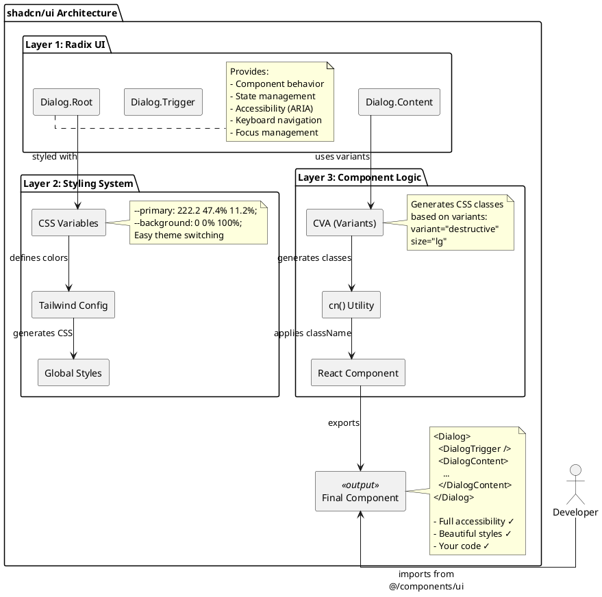
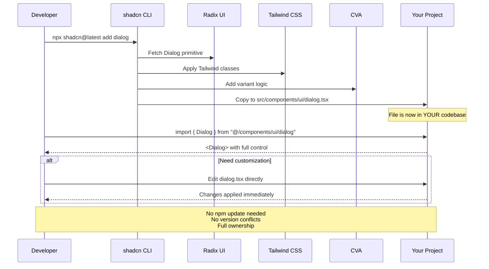
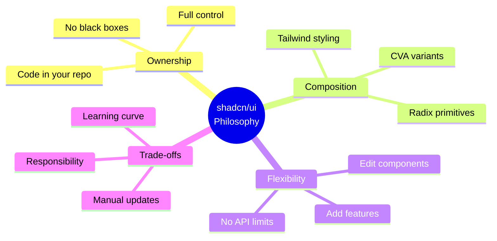

# Філософія shadcn/ui: "Not a Component Library"

Коли відкриваєш офіційний сайт shadcn/ui, перше, що бачиш — провокаційне твердження:

> **"This is NOT a component library. It's a collection of re-usable components that you can copy and paste into your apps."**

Для людини, яка звикла робити `npm install @mui/material`, це звучить як жарт. Копіювати код вручну? У 2025 році? Хіба це не повернення до епохи до пакетних менеджерів?

Але якщо заглибитися, виявляється, що **copy-paste підхід — це не баг, а feature**. Це свідомий архітектурний вибір, який розв'язує фундаментальні проблеми традиційних UI бібліотек.

У цій главі ми розберемо:

- Чому NPM бібліотеки створюють проблеми
- Що означає "власність коду" і чому це важливо
- Як працює архітектура shadcn/ui (Radix + Tailwind + TypeScript)
- Порівняння з Material-UI, Chakra UI та чистим Radix
- Коли shadcn/ui — правильний вибір, а коли ні

## Проблема Традиційних Component Libraries

Почнемо з болю. Уявіть типовий сценарій з Material-UI:

### Сценарій: "Просто змініть колір кнопки"

Дизайнер приносить макет. Усе виглядає чудово, крім однієї деталі: primary кнопка має бути не синьою (#1976d2), а фірмовим purple (#7c3aed).

**Спроба 1: Inline стилі**

```jsx
import { Button } from '@mui/material'
;<Button variant="contained" style={{ backgroundColor: '#7c3aed' }}>
    Click me
</Button>
```

❌ **Не працює**: Hover state залишається синім, ripple effect синій, disabled state має неправильний колір.

**Спроба 2: sx prop**

```jsx
<Button
    variant="contained"
    sx={{
        backgroundColor: '#7c3aed',
        '&:hover': {
            backgroundColor: '#6d28d9',
        },
    }}
>
    Click me
</Button>
```

⚠️ **Працює, але**: Треба прописувати для кожної кнопки. А що з іншими варіантами (outlined, text)? А з focus state?

**Спроба 3: Theming API**

```jsx
import { createTheme, ThemeProvider } from '@mui/material/styles'

const theme = createTheme({
    palette: {
        primary: {
            main: '#7c3aed',
            light: '#8b5cf6',
            dark: '#6d28d9',
            contrastText: '#fff',
        },
    },
})

function App() {
    return (
        <ThemeProvider theme={theme}>
            <Button variant="contained">Click me</Button>
        </ThemeProvider>
    )
}
```

✅ **Працює!** Але тепер треба:

- Вивчити MUI theming API (palette, typography, spacing, breakpoints)
- Обгорнути весь додаток у ThemeProvider
- Мати окремий конфіг для theme
- Боротися з CSS specificity, якщо щось не перезаписалося

**А тепер уявіть**: вам потрібен custom варіант кнопки (наприклад, "gradient button").

```jsx
const theme = createTheme({
  components: {
    MuiButton: {
      variants: [
        {
          props: { variant: 'gradient' },
          style: {
            background: 'linear-gradient(45deg, #7c3aed 30%, #ec4899 90%)',
            border: 0,
            color: 'white',
            height: 48,
            padding: '0 30px',
            boxShadow: '0 3px 5px 2px rgba(124, 58, 237, .3)',
          },
        },
      ],
    },
  },
});

// TypeScript ще й кричить, що 'gradient' не існує у MuiButton['variant']
// Треба розширювати types вручну:
declare module '@mui/material/Button' {
  interface ButtonPropsVariantOverrides {
    gradient: true;
  }
}
```

**Проблема**: Ви боретеся з API бібліотеки, а не пишете свій код.

### А тепер подивіться, як це в shadcn/ui:

**Крок 1**: Відкрийте файл `src/components/ui/button.tsx` (він у ВАШОМУ проєкті)

```tsx
// src/components/ui/button.tsx
import { cva } from 'class-variance-authority'

const buttonVariants = cva('inline-flex items-center justify-center rounded-md text-sm font-medium', {
    variants: {
        variant: {
            default: 'bg-primary text-primary-foreground hover:bg-primary/90',
            destructive: 'bg-destructive text-destructive-foreground hover:bg-destructive/90',
            outline: 'border border-input hover:bg-accent hover:text-accent-foreground',
            // ↓ Просто додайте рядок:
            gradient: 'bg-gradient-to-r from-purple-600 to-pink-600 text-white shadow-lg shadow-purple-500/50',
        },
    },
})
```

**Крок 2**: Використовуйте

```jsx
<Button variant="gradient">Click me</Button>
```

**Ось і все.** Жодного ThemeProvider, жодних module augmentation для TypeScript, жодної документації API.

Ви просто відкрили файл та додали CSS клас.

::tip
**Ключова різниця**:

- **MUI**: Ви працюєте з API, яке хтось інший створив
- **shadcn/ui**: Ви редагуєте свій власний код

::

## Філософія: Composition Over Configuration

У світі програмування є дві філософії:

### Configuration (Конфігурація)

**Суть**: Бібліотека надає API для налаштування поведінки.

**Приклад**: Material-UI theming

```jsx
const theme = createTheme({
    palette: {
        /* конфіг */
    },
    typography: {
        /* конфіг */
    },
    spacing: (factor) => `${0.25 * factor}rem`,
    breakpoints: {
        /* конфіг */
    },
    components: {
        /* конфіг */
    },
})
```

**Плюси**:

- Узгоджений API
- Документований спосіб кастомізації

**Мінуси**:

- Обмежений тим, що передбачила бібліотека
- Складно добавити щось нестандартне

### Composition (Композиція)

**Суть**: Бібліотека надає примітиви (building blocks), ви їх компонуєте.

**Приклад**: shadcn/ui Button

```tsx
// Це просто функція, яка генерує CSS classes
const buttonVariants = cva(/* ... */)

// Компонент — це звичайний React компонент
export const Button = React.forwardRef<HTMLButtonElement, ButtonProps>(
    ({ className, variant, size, ...props }, ref) => {
        return <button className={cn(buttonVariants({ variant, size, className }))} ref={ref} {...props} />
    },
)
```

**Плюси**:

- Повний контроль (це ваш код)
- Легко розширювати (просто додайте логіку)
- Немає обмежень API

**Мінуси**:

- Більше свободи = більше відповідальності
- Треба розуміти, як працює компонент

::note
**shadcn/ui обирає Composition**: Замість складного конфігураційного API, ви отримуєте простий, зрозумілий код, який можете змінювати напряму.
::

## Архітектура shadcn/ (Radix + Tailwind + TypeScript)

shadcn/ui — це не магія. Це три технології, які працюють разом:

### Шар 1: Radix UI (Behavior and Accessibility)

**Radix UI** — це headless бібліотека, яка надає:

- Поведінку компонентів (відкрити/закрити діалог, навігація клавіатурою тощо)
- Accessibility (ARIA attributes, focus management)
- Композицію (складні компоненти зі маленьких примітивів)

**Приклад**: Dialog компонент у Radix

```jsx
import * as Dialog from '@radix-ui/react-dialog'
;<Dialog.Root>
    {' '}
    {/* Контекст, стан (open/close) */}
    <Dialog.Trigger /> {/* Кнопка, яка відкриває */}
    <Dialog.Portal>
        {' '}
        {/* Рендер у body (поза DOM ієрархією) */}
        <Dialog.Overlay /> {/* Затемнення фону */}
        <Dialog.Content>
            {' '}
            {/* Саме вікно діалогу */}
            <Dialog.Title /> {/* Заголовок (aria-labelledby) */}
            <Dialog.Description /> {/* Опис (aria-describedby) */}
            <Dialog.Close /> {/* Кнопка закриття */}
        </Dialog.Content>
    </Dialog.Portal>
</Dialog.Root>
```

**Що Radix робить під капотом**:

- Керує станом (відкритий/закритий)
- Focus trap (фокус не може вийти з діалогу)
- Закриття на Escape
- Блокування скролу на body
- Правильні ARIA атрибути
- Повертає фокус до trigger після закриття

**Що Radix НЕ робить**:

- Не додає жодного CSS
- Ви отримуєте компонент без стилів

### Шар 2: Tailwind CSS (Styling)

shadcn/ui використовує **Tailwind CSS** для стилізації. Але не просто utility classes, а systematic design system.

**CSS Variables для теми**:

```css
/* app/globals.css */
@layer base {
    :root {
        --background: 0 0% 100%;
        --foreground: 222.2 47.4% 11.2%;
        --primary: 222.2 47.4% 11.2%;
        --primary-foreground: 210 40% 98%;
        --destructive: 0 84.2% 60.2%;
        /* ... */
    }

    .dark {
        --background: 222.2 84% 4.9%;
        --foreground: 210 40% 98%;
        /* ... */
    }
}
```

**Чому CSS variables, а не жорстко прописані кольори?**

❌ Жорстко:

```tsx
className = 'bg-blue-600 text-white'
```

Проблема: Змінити тему = переписати кожен компонент.

✅ З CSS variables:

```tsx
className = 'bg-primary text-primary-foreground'
```

Перевага: Змінити тему = змінити `--primary` в одному місці.

**Tailwind конфігурація**:

```js
// tailwind.config.ts
export default {
    theme: {
        extend: {
            colors: {
                border: 'hsl(var(--border))',
                input: 'hsl(var(--input))',
                ring: 'hsl(var(--ring))',
                background: 'hsl(var(--background))',
                foreground: 'hsl(var(--foreground))',
                primary: {
                    DEFAULT: 'hsl(var(--primary))',
                    foreground: 'hsl(var(--primary-foreground))',
                },
                // ...
            },
        },
    },
}
```

Тепер `bg-primary` у Tailwind використовує `--primary` CSS variable.

### Шар 3: Class Variance Authority (Variants)

Як shadcn/ui створює варіанти компонентів (variant="default" vs variant="destructive")?

Використовується бібліотека **class-variance-authority (CVA)**.

**Приклад: Button variants**

```tsx
import { cva, type VariantProps } from 'class-variance-authority'

const buttonVariants = cva(
    // Базові класи (завжди присутні)
    'inline-flex items-center justify-center rounded-md text-sm font-medium ring-offset-background transition-colors focus-visible:outline-none focus-visible:ring-2',
    {
        variants: {
            // Варіанти кольору
            variant: {
                default: 'bg-primary text-primary-foreground hover:bg-primary/90',
                destructive: 'bg-destructive text-destructive-foreground hover:bg-destructive/90',
                outline: 'border border-input bg-background hover:bg-accent',
                ghost: 'hover:bg-accent hover:text-accent-foreground',
            },
            // Варіанти розміру
            size: {
                default: 'h-10 px-4 py-2',
                sm: 'h-9 rounded-md px-3',
                lg: 'h-11 rounded-md px-8',
                icon: 'h-10 w-10',
            },
        },
        defaultVariants: {
            variant: 'default',
            size: 'default',
        },
    },
)

// TypeScript тип для props
export interface ButtonProps
    extends React.ButtonHTMLAttributes<HTMLButtonElement>, VariantProps<typeof buttonVariants> {}

export const Button = React.forwardRef<HTMLButtonElement, ButtonProps>(
    ({ className, variant, size, ...props }, ref) => {
        return <button className={cn(buttonVariants({ variant, size, className }))} ref={ref} {...props} />
    },
)
```

**Як це працює**:

```jsx
<Button variant="destructive" size="lg">
    Delete
</Button>
```

CVA генерує рядок:

```
"inline-flex items-center justify-center rounded-md text-sm font-medium ring-offset-background transition-colors focus-visible:outline-none focus-visible:ring-2 bg-destructive text-destructive-foreground hover:bg-destructive/90 h-11 rounded-md px-8"
```

::plant-uml



::

### Чому саме така комбінація?

| Технологія       | Що надає                  | Альтернативи                                      |
| ---------------- | ------------------------- | ------------------------------------------------- |
| **Radix UI**     | Behavior + A11y           | Headless UI, React Aria, Ariakit                  |
| **Tailwind CSS** | Utility-first styling     | CSS Modules, Styled Components, Emotion           |
| **CVA**          | Генерація variant classes | Вручну (template literals), tailwind-merge + clsx |
| **TypeScript**   | Type safety               | JavaScript (але чому?)                            |

**Чому Radix, а не Headless UI?**

- Radix: Більше компонентів, краща композиція
- Headless UI: Менше примітивів, тісніша інтеграція з Tailwind Labs

**Чому Tailwind, а не CSS-in-JS?**

- Tailwind: Zero runtime, маленький bundle, utility-first
- CSS-in-JS: Runtime overhead, складніший SSR

**Чому CVA?**

- Альтернатива: Писати вручну логіку для варіантів
- CVA: Декларативний API, TypeScript автокомпліт

::mermaid



::

## shadcn/ui vs Традиційні Бібліотеки

Розглянемо детальне порівняння на реальних сценаріях.

### Порівняння 1: Кастомізація Компонента

**Задача**: Додати "loading state" до кнопки (spinner + disabled).

::tabs
::div{label="Material-UI"}

```jsx
import { Button, CircularProgress } from '@mui/material'

function LoadingButton({ loading, children, ...props }) {
    return (
        <Button
            {...props}
            disabled={loading || props.disabled}
            startIcon={loading ? <CircularProgress size={20} /> : props.startIcon}
        >
            {children}
        </Button>
    )
}
```

**Проблеми**:

- CircularProgress додає ~15KB до bundle
- Важко змінити позицію спіннера
- Треба створювати wrapper компонент

**Альтернатива**: Використати `@mui/lab/LoadingButton`

- ❌ Додатковий пакунок
- ❌ Інший API
- ❌ Може бути deprecated (як багато Lab компонентів)

::

::div{label="shadcn/ui"}
Відкрийте `src/components/ui/button.tsx`:

```tsx {15-18}
export const Button = React.forwardRef<HTMLButtonElement, ButtonProps>(
    ({ className, variant, size, children, ...props }, ref) => {
        const [isPending, startTransition] = useTransition()

        return (
            <button
                className={cn(buttonVariants({ variant, size, className }))}
                ref={ref}
                disabled={props.disabled || isPending}
                {...props}
            >
                {isPending && (
                    <svg className="mr-2 h-4 w-4 animate-spin" /* spinner SVG */>
                        <circle className="opacity-25" cx="12" cy="12" r="10" />
                        <path className="opacity-75" d="M4 12a8 8 0 018-8V0..." />
                    </svg>
                )}
                {children}
            </button>
        )
    },
)
```

**Або створіть окремий variant**:

```tsx
const buttonVariants = cva('...', {
    variants: {
        variant: {
            // ... інші варіанти
            loading: 'bg-primary/50 cursor-not-allowed',
        },
    },
})

;<Button variant="loading">
    <Loader2 className="mr-2 h-4 w-4 animate-spin" />
    Please wait
</Button>
```

**Переваги**:

- Нульові додаткові залежності (SVG inline)
- Повний контроль над позицією та стилем
- Можете додати будь-яку логіку

::

::

### Порівняння 2: Темна Тема

**Задача**: Додати dark mode.

::tabs
::div{label="Material-UI"}

```jsx
import { ThemeProvider, createTheme } from '@mui/material/styles'
import { useMemo, useState } from 'react'

function App() {
    const [mode, setMode] = useState('light')

    const theme = useMemo(
        () =>
            createTheme({
                palette: {
                    mode,
                    ...(mode === 'light'
                        ? {
                              // Light mode colors
                              primary: { main: '#1976d2' },
                              background: { default: '#fff', paper: '#f5f5f5' },
                          }
                        : {
                              // Dark mode colors
                              primary: { main: '#90caf9' },
                              background: { default: '#121212', paper: '#1e1e1e' },
                          }),
                },
            }),
        [mode],
    )

    return (
        <ThemeProvider theme={theme}>
            <YourApp />
        </ThemeProvider>
    )
}
```

**Що потрібно**:

- ThemeProvider
- createTheme конфіг
- useMemo для оптимізації
- Окремі палітри для light/dark

::

::div{label="shadcn/ui"}

```tsx
// app/globals.css (вже налаштовано)
@layer base {
  :root {
    --background: 0 0% 100%;
    --foreground: 222.2 47.4% 11.2%;
  }

  .dark {
    --background: 222.2 84% 4.9%;
    --foreground: 210 40% 98%;
  }
}
```

```tsx
// app/layout.tsx або компонент
import { useTheme } from 'next-themes'

function ThemeToggle() {
    const { setTheme, theme } = useTheme()

    return <button onClick={() => setTheme(theme === 'dark' ? 'light' : 'dark')}>Toggle</button>
}
```

**Переваги**:

- CSS variables (нативний браузерний функціонал)
- Мелодика змінити тему = змінюється клас `dark` на `<html>`
- Працює з SSR (Next.js) без flash

::

::

### Порівняння 3: Bundle Size

Створимо простий додаток з 5 компонентами: Button, Dialog, Input, Select, Table.

| Бібліотека       | Bundle Size (gzip) | Компоненти включені                      |
| ---------------- | ------------------ | ---------------------------------------- |
| **Material-UI**  | ~290 KB            | Button, Dialog, TextField, Select, Table |
| **Chakra UI**    | ~180 KB            | Button, Modal, Input, Select, Table      |
| **shadcn/ui**    | ~25 KB             | Button, Dialog, Input, Select, Table     |
| **Чистий Radix** | ~15 KB             | Radix primitives лише (без стилів)       |

**Чому така різниця?**

**MUI**:

- Emotion (CSS-in-JS runtime): ~50 KB
- MUI Core: ~150 KB
- MUI Icons (якщо використовуєте): ~90 KB

**Chakra UI**:

- Emotion: ~50 KB
- Chakra Core: ~100 KB
- Framer Motion (animations): ~30 KB

**shadcn/ui**:

- Radix primitives: ~12 KB (тільки використані)
- CVA: ~2 KB
- Ваш CSS (Tailwind): ~10 KB (purged)
- Немає runtime CSS-in-JS

::note
**Важливо**: shadcn/ui використовує **Tailwind CSS**, який purge-ується build-time. Ви отримуєте лише ті класи, які використовуєте. Material-UI shipped весь runtime незалежно від того, чи ви використовуєте 1 компонент чи 50.
::

### Порівняння 4: Оновлення та Підтримка

**Сценарій**: Виходить нова версія бібліотеки з breaking changes.

**Material-UI v4 → v5** (2021):

```bash
npm install @mui/material@latest

# Breaking changes:
# - ThemeProvider API змінився
# - makeStyles deprecated (перехід на styled або sx)
# - Іконки в окремий пакунок
# - Color system refactored
```

Результат: Тижні роботи на міграцію великого проєкту.

**shadcn/ui**:

```bash
# Ви нічого не оновлюєте
# Код у вашому проєкті, ви контролюєте версії
```

Якщо хочете нову фічу:

```bash
# Перевірте changelog на GitHub
# Скопіюйте зміни вручну (якщо потрібно)
# Або залиште як є (ваш код працює)
```

**Trade-off**:

- ✅ Немає несподіваних breaking changes
- ❌ Оновлення не автоматичні (але ви контролюєте, коли і як)

### Порівняння 5: Learning Curve

**Початківець встановлює бібліотеку та створює форму:**

| Бібліотека    | Час на перший результат | Що треба вивчити                              |
| ------------- | ----------------------- | --------------------------------------------- |
| **MUI**       | 10 хвилин               | `npm install`, імпорт компонента              |
| **Chakra UI** | 15 хвилин               | Setup provider, імпорт компонента             |
| **shadcn/ui** | 20-30 хвилин            | Tailwind setup, shadcn init, базові концепції |
| **Radix UI**  | 1-2 години              | Radix API, написати всі стилі вручну          |

**Але після 1 місяця роботи:**

| Бібліотека    | Швидкість кастомізації      | Контроль  |
| ------------- | --------------------------- | --------- |
| **MUI**       | Повільно (theming API)      | Обмежений |
| **Chakra UI** | Середньо (style props)      | Середній  |
| **shadcn/ui** | Швидко (відредагувати файл) | Повний    |
| **Radix UI**  | Швидко (ваш CSS)            | Повний    |

::tip
**Висновок**: shadcn/ui має трохи вищий поріг входу, але після освоєння Tailwind ви працюєте швидше, ніж з MUI.
::

## Коли shadcn/ui — Правильний Вибір?

### ✅ Використовуйте shadcn/ui, якщо:

1. **Ви вже використовуєте Tailwind CSS**
    - shadcn/ui — природне розширення вашого workflow

2. **Потрібен унікальний дизайн**
    - Не хочете, щоб додаток "виглядав як Google" (MUI) або "як Chakra"

3. **Performance критичний**
    - Публічний продукт, SEO важливо, мобільні користувачі

4. **Довгостроковий проект**
    - Контроль над кодом окупиться через рік+

5. **Є час на початкову настройку**
    - 1-2 дні на setup (Tailwind + shadcn + your theme)

6. **Команда знає React та TypeScript**
    - Ви комфортно читаєте та редагуєте компонентний код

### ❌ НЕ використовуйте shadcn/ui, якщо:

1. **MVP за 2 тижні**
    - MUI/Chakra дадуть швидший старт

2. **Команда не знає Tailwind**
    - Learning curve буде занадто крутий

3. **Потрібні складні компоненти (Charts, Data Grids, Date Pickers)**
    - shadcn/ui має базові компоненти, для складних доведеться інтегрувати інші бібліотеки

4. **Не хочете підтримувати код компонентів**
    - З MUI ви просто робите `npm update`

5. **Немає дизайнера, і вас влаштовує Material Design**
    - MUI — готове рішення з коробки

## Альтернативи та Екосистема

shadcn/ui — не єдине рішення у цій категорії.

### Схожі проєкти:

| Проєкт                                     | Підхід               | Відмінності від shadcn/ui             |
| ------------------------------------------ | -------------------- | ------------------------------------- |
| **[daisyUI](https://daisyui.com/)**        | Tailwind plugin      | NPM пакунок, не copy-paste            |
| **[Flowbite](https://flowbite.com/)**      | Tailwind components  | Більше focus на marketing sites       |
| **[Headless UI](https://headlessui.com/)** | Чистий headless      | Без стилів взагалі                    |
| **[Park UI](https://park-ui.com/)**        | Copy-paste як shadcn | Підтримує Ark UI (альтернатива Radix) |

### Коли обрати альтернативу:

**daisyUI**: Якщо хочете Tailwind plugin (не копіювати код)
**Flowbite**: Для лендингів та маркетингових сайтів
**Headless UI**: Якщо використовуєте Tailwind Labs ecosystem
**Park UI**: Якщо вам більше подобається Ark UI замість Radix

## Підсумок: Філософія Власності

shadcn/ui змінює парадигму:

**Традиційні бібліотеки**:

- Ви **споживач** API
- Бібліотека — чорна скринька
- Кастомізація через конфігурацію

**shadcn/ui**:

- Ви **власник** коду
- Компоненти — відкрита книга
- Кастомізація через редагування

::mermaid



::

**Ключова думка**: З великою владою приходить велика відповідальність. shadcn/ui дає вам владу над кодом, але ви відповідаєте за його підтримку.

Якщо ви готові до цієї відповідальності — ви отримаєте інструмент, який масштабується разом з вашим проєктом, а не обмежує його.

::note
**Чи замінить shadcn/ui усі UI бібліотеки?** Ні. MUI, Chakra, Ant Design залишаться для сценаріїв, де швидкість та готові рішення важливіші за контроль. Але для проєктів, де дизайн - частина продукту, shadcn/ui — революція.
::

У наступній главі ми перейдемо від теорії до практики: встановимо shadcn/ui, налаштуємо проєкт та додамо перші компоненти.

[Далі: Установка та Налаштування →](./03.shadcn-installation.md)
