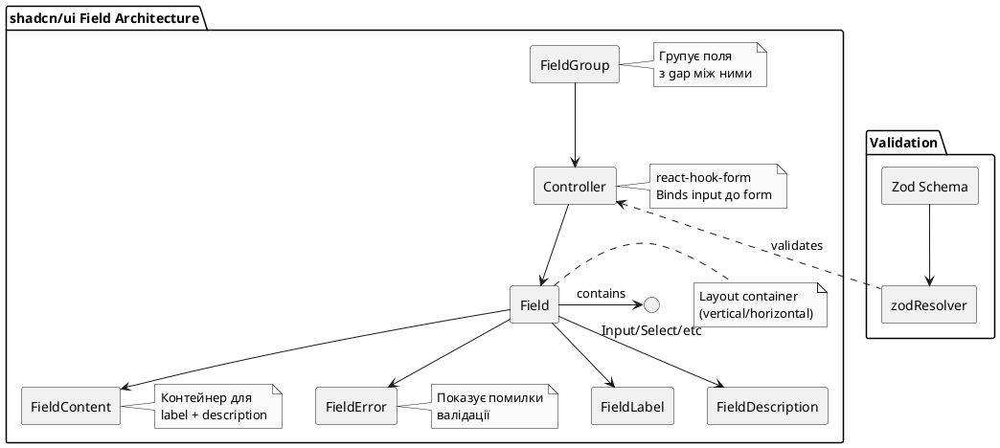

# Компоненти Форм: Побудова Інтерактивних Form

Форми — серце будь-якого веб-додатку. shadcn/ui надає потужні компоненти для створення форм з підтримкою **React Hook Form** та **Zod** валідації.

У цій главі ми вивчимо:

- Input, Textarea, Label
- Select та Combobox
- Checkbox, Radio Group, Switch
- Slider для числових значень
- **Form Component** — інтеграція з React Hook Form
- Валідація з Zod
- Обробка помилок та UX

## Input та Textarea: Текстові Поляші

Починаємо з найбазовішого елемента форми.

### Додавання

```bash
npx shadcn@latest add input label
```

### Input Компонент

```tsx
// src/components/ui/input.tsx
const Input = React.forwardRef<HTMLInputElement, InputProps>(({ className, type, ...props }, ref) => {
    return (
        <input
            type={type}
            className={cn(
                'flex h-9 w-full rounded-md border border-input bg-transparent px-3 py-1 text-sm shadow-sm transition-colors file:border-0 file:bg-transparent file:text-sm file:font-medium file:text-foreground placeholder:text-muted-foreground focus-visible:outline-none focus-visible:ring-1 focus-visible:ring-ring disabled:cursor-not-allowed disabled:opacity-50',
                className,
            )}
            ref={ref}
            {...props}
        />
    )
})
```

**Ключові класи**:

- `border border-input`: Рамка neutral кольору
- `focus-visible:ring-1`: Ring при фокусі (accessibility)
- `disabled:cursor-not-allowed disabled:opacity-50`: Disabled state
- `file:*`: Стилі для `<input type="file">`
- `placeholder:text-muted-foreground`: Колір placeholder

### Використання

```tsx
import { Input } from '@/components/ui/input'
import { Label } from '@/components/ui/label'

export function InputDemo() {
    return (
        <div className="grid w-full max-w-sm items-center gap-1.5">
            <Label htmlFor="email">Email</Label>
            <Input type="email" id="email" placeholder="Email" />
        </div>
    )
}
```

### Типи Input

```tsx
{
    /* Text */
}
;<Input type="text" placeholder="Your name" />

{
    /* Email */
}
;<Input type="email" placeholder="email@example.com" />

{
    /* Password */
}
;<Input type="password" placeholder="••••••••" />

{
    /* Number */
}
;<Input type="number" placeholder="42" />

{
    /* File */
}
;<Input type="file" />

{
    /* Disabled */
}
;<Input disabled placeholder="Disabled" />
```

### Textarea

```bash
npx shadcn@latest add textarea
```

```tsx
import { Textarea } from '@/components/ui/textarea'
;<div className="grid w-full gap-1.5">
    <Label htmlFor="message">Your message</Label>
    <Textarea
        id="message"
        placeholder="Type your message here."
        className="resize-none" // Заборонити resize
    />
</div>
```

{.diagram-img}

<!-- TODO: Скріншот input fields -->

---

## Select: Випадаюче Меню

Select використовує Radix UI для accessibility та кастомізації.

### Додавання

```bash
npx shadcn@latest add select
```

### Складна Композиція

```tsx
import {
    Select,
    SelectContent,
    SelectGroup,
    SelectItem,
    SelectLabel,
    SelectTrigger,
    SelectValue,
} from '@/components/ui/select'

export function SelectDemo() {
    return (
        <Select>
            <SelectTrigger className="w-[180px]">
                <SelectValue placeholder="Select a fruit" />
            </SelectTrigger>
            <SelectContent>
                <SelectGroup>
                    <SelectLabel>Fruits</SelectLabel>
                    <SelectItem value="apple">Apple</SelectItem>
                    <SelectItem value="banana">Banana</SelectItem>
                    <SelectItem value="orange">Orange</SelectItem>
                </SelectGroup>
            </SelectContent>
        </Select>
    )
}
```

**Розбір**:

- `Select`: Root component (контекст)
- `SelectTrigger`: Кнопка, яка відкриває меню
- `SelectValue`: Відображає обране значення або placeholder
- `SelectContent`: Випадає меню (Portal)
- `SelectGroup` + `SelectLabel`: Групування опцій
- `SelectItem`: Окрема опція

### Controlled Select

```tsx
function ControlledSelect() {
    const [value, setValue] = useState('')

    return (
        <Select value={value} onValueChange={setValue}>
            <SelectTrigger>
                <SelectValue placeholder="Choose" />
            </SelectTrigger>
            <SelectContent>
                <SelectItem value="light">Light</SelectItem>
                <SelectItem value="dark">Dark</SelectItem>
                <SelectItem value="system">System</SelectItem>
            </SelectContent>
        </Select>
    )
}
```

---

## Combobox: Select з Пошуком

Combobox = Select + фільтрація. Корисно для великих списків.

### Додавання

```bash
npx shadcn@latest add popover command
```

### Код

```tsx
'use client'

import * as React from 'react'
import { Check, ChevronsUpDown } from 'lucide-react'
import { Button } from '@/components/ui/button'
import { Command, CommandEmpty, CommandGroup, CommandInput, CommandItem, CommandList } from '@/components/ui/command'
import { Popover, PopoverContent, PopoverTrigger } from '@/components/ui/popover'
import { cn } from '@/lib/utils'

const frameworks = [
    { value: 'next.js', label: 'Next.js' },
    { value: 'sveltekit', label: 'SvelteKit' },
    { value: 'nuxt.js', label: 'Nuxt.js' },
    { value: 'remix', label: 'Remix' },
    { value: 'astro', label: 'Astro' },
]

export function ComboboxDemo() {
    const [open, setOpen] = React.useState(false)
    const [value, setValue] = React.useState('')

    return (
        <Popover open={open} onOpenChange={setOpen}>
            <PopoverTrigger asChild>
                <Button variant="outline" role="combobox" aria-expanded={open} className="w-[200px] justify-between">
                    {value ? frameworks.find((framework) => framework.value === value)?.label : 'Select framework...'}
                    <ChevronsUpDown className="ml-2 h-4 w-4 shrink-0 opacity-50" />
                </Button>
            </PopoverTrigger>
            <PopoverContent className="w-[200px] p-0">
                <Command>
                    <CommandInput placeholder="Search framework..." />
                    <CommandList>
                        <CommandEmpty>No framework found.</CommandEmpty>
                        <CommandGroup>
                            {frameworks.map((framework) => (
                                <CommandItem
                                    key={framework.value}
                                    value={framework.value}
                                    onSelect={(currentValue) => {
                                        setValue(currentValue === value ? '' : currentValue)
                                        setOpen(false)
                                    }}
                                >
                                    <Check
                                        className={cn(
                                            'mr-2 h-4 w-4',
                                            value === framework.value ? 'opacity-100' : 'opacity-0',
                                        )}
                                    />
                                    {framework.label}
                                </CommandItem>
                            ))}
                        </CommandGroup>
                    </CommandList>
                </Command>
            </PopoverContent>
        </Popover>
    )
}
```

**Чому так складно?**

shadcn/ui комбінує:

- **Popover** (Radix) для dropdown
- **Command** (cmdk) для пошуку та keyboard navigation

Це дає потужну функціональність:

- ⌨️ Keyboard navigation (Arrow keys)
- 🔍 Fuzzy search
- ♿ Full accessibility

{.diagram-img}

<!-- TODO: Скріншот combobox -->

---

## Checkbox та Radio Group

### Checkbox

```bash
npx shadcn@latest add checkbox
```

```tsx
import { Checkbox } from '@/components/ui/checkbox'

export function CheckboxDemo() {
    return (
        <div className="flex items-center space-x-2">
            <Checkbox id="terms" />
            <label
                htmlFor="terms"
                className="text-sm font-medium leading-none peer-disabled:cursor-not-allowed peer-disabled:opacity-70"
            >
                Accept terms and conditions
            </label>
        </div>
    )
}
```

**Controlled Checkbox**:

```tsx
const [checked, setChecked] = useState(false)

<Checkbox
  checked={checked}
  onCheckedChange={setChecked}
/>
```

### Radio Group

```bash
npx shadcn@latest add radio-group
```

```tsx
import { Label } from '@/components/ui/label'
import { RadioGroup, RadioGroupItem } from '@/components/ui/radio-group'

export function RadioGroupDemo() {
    return (
        <RadioGroup defaultValue="comfortable">
            <div className="flex items-center space-x-2">
                <RadioGroupItem value="default" id="r1" />
                <Label htmlFor="r1">Default</Label>
            </div>
            <div className="flex items-center space-x-2">
                <RadioGroupItem value="comfortable" id="r2" />
                <Label htmlFor="r2">Comfortable</Label>
            </div>
            <div className="flex items-center space-x-2">
                <RadioGroupItem value="compact" id="r3" />
                <Label htmlFor="r3">Compact</Label>
            </div>
        </RadioGroup>
    )
}
```

---

## Switch: Перемикач

Switch — альтернатива checkbox для binary choices.

### Додавання

```bash
npx shadcn@latest add switch
```

### Використання

```tsx
import { Label } from '@/components/ui/label'
import { Switch } from '@/components/ui/switch'

export function SwitchDemo() {
    return (
        <div className="flex items-center space-x-2">
            <Switch id="airplane-mode" />
            <Label htmlFor="airplane-mode">Airplane Mode</Label>
        </div>
    )
}
```

**Коли Switch, коли Checkbox?**

| Сценарій                              | Компонент    |
| ------------------------------------- | ------------ |
| Миттєва зміна (toggles, settings)     | **Switch**   |
| Підтвердження умов (terms of service) | **Checkbox** |
| Множинний вибір                       | **Checkbox** |
| Одиночний вибір з 2 опцій             | **Switch**   |

{.diagram-img}

<!-- TODO: Скріншот switch vs checkbox -->

---

## Slider: Діапазон Значень

### Додавання

```bash
npx shadcn@latest add slider
```

### Використання

```tsx
import { Slider } from '@/components/ui/slider'

export function SliderDemo() {
    const [value, setValue] = useState([50])

    return (
        <div className="space-y-4">
            <Label>Volume: {value[0]}%</Label>
            <Slider value={value} onValueChange={setValue} max={100} step={1} />
        </div>
    )
}
```

### Range Slider (два thumbs)

```tsx
const [range, setRange] = useState([20, 80])

<Slider
  value={range}
  onValueChange={setRange}
  max={100}
  step={1}
/>

<p>Price: ${range[0]} - ${range[1]}</p>
```

{.diagram-img}

<!-- TODO: Скріншот slider -->

---

## Field Component: Інтеграція з React Hook Form

Найпотужніша частина shadcn/ui — **Field component**, який спрощує інтеграцію React Hook Form + Zod.

### Установка Залежностей

```bash
npm install react-hook-form @hookform/resolvers zod
npx shadcn@latest add field
```

### Архітектура Field

shadcn/ui Field складається з:

- `Field`: Layout container для одного поля (label + input + messages)
- `FieldGroup`: Групує кілька `Field` разом
- `FieldLabel`: Accessible label для поля
- `FieldContent`: Контейнер для label + description (використовується в horizontal layouts)
- `FieldDescription`: Опис поля
- `FieldError`: Повідомлення про помилку
- `FieldSet` / `FieldLegend`: Для групування radio/checkbox (як HTML `fieldset`)

Для прив'язки до React Hook Form використовується `Controller` напряму з `react-hook-form`.

::plant-uml



::

### Простий Приклад: Login Form

```tsx
'use client'

import { zodResolver } from '@hookform/resolvers/zod'
import { Controller, useForm } from 'react-hook-form'
import * as z from 'zod'

import { Button } from '@/components/ui/button'
import { Card, CardContent, CardDescription, CardFooter, CardHeader, CardTitle } from '@/components/ui/card'
import { Field, FieldDescription, FieldError, FieldGroup, FieldLabel } from '@/components/ui/field'
import { Input } from '@/components/ui/input'
import { toast } from 'sonner'

// 1. Визначаємо Zod schema
const formSchema = z.object({
    email: z.string().email({
        message: 'Please enter a valid email address.',
    }),
    password: z.string().min(8, {
        message: 'Password must be at least 8 characters.',
    }),
})

export function LoginForm() {
    // 2. Ініціалізуємо form з useForm
    const form = useForm<z.infer<typeof formSchema>>({
        resolver: zodResolver(formSchema),
        defaultValues: {
            email: '',
            password: '',
        },
    })

    // 3. Submit handler
    function onSubmit(values: z.infer<typeof formSchema>) {
        // values типізовані!
        console.log(values)
        toast.success('Logged in successfully!')
    }

    return (
        <Card className="w-full sm:max-w-md">
            <CardHeader>
                <CardTitle>Sign In</CardTitle>
                <CardDescription>Enter your credentials to continue.</CardDescription>
            </CardHeader>
            <CardContent>
                <form id="login-form" onSubmit={form.handleSubmit(onSubmit)}>
                    <FieldGroup>
                        {/* Email field */}
                        <Controller
                            name="email"
                            control={form.control}
                            render={({ field, fieldState }) => (
                                <Field data-invalid={fieldState.invalid}>
                                    <FieldLabel htmlFor="login-email">Email</FieldLabel>
                                    <Input
                                        {...field}
                                        id="login-email"
                                        aria-invalid={fieldState.invalid}
                                        placeholder="you@example.com"
                                        autoComplete="email"
                                    />
                                    <FieldDescription>We'll never share your email.</FieldDescription>
                                    {fieldState.invalid && <FieldError errors={[fieldState.error]} />}
                                </Field>
                            )}
                        />

                        {/* Password field */}
                        <Controller
                            name="password"
                            control={form.control}
                            render={({ field, fieldState }) => (
                                <Field data-invalid={fieldState.invalid}>
                                    <FieldLabel htmlFor="login-password">Password</FieldLabel>
                                    <Input
                                        {...field}
                                        id="login-password"
                                        type="password"
                                        aria-invalid={fieldState.invalid}
                                        placeholder="••••••••"
                                        autoComplete="current-password"
                                    />
                                    {fieldState.invalid && <FieldError errors={[fieldState.error]} />}
                                </Field>
                            )}
                        />
                    </FieldGroup>
                </form>
            </CardContent>
            <CardFooter>
                <Button type="submit" form="login-form" disabled={form.formState.isSubmitting}>
                    {form.formState.isSubmitting ? 'Loading...' : 'Sign In'}
                </Button>
            </CardFooter>
        </Card>
    )
}
```

### Розбір Коду

**1. Zod Schema**:

```tsx
const formSchema = z.object({
    email: z.string().email({ message: '...' }),
    password: z.string().min(8, { message: '...' }),
})
```

Zod валідує:

- `email` — має бути valid email
- `password` — мінімум 8 символів

**2. useForm Hook**:

```tsx
const form = useForm<z.infer<typeof formSchema>>({
    resolver: zodResolver(formSchema), // Підключаємо Zod
    defaultValues: { email: '', password: '' },
})
```

`zodResolver` інтегрує Zod з React Hook Form.

**3. Controller + Field Pattern**:

```tsx
<Controller
    name="email" // Прив'язка до схеми
    control={form.control}
    render={({ field, fieldState }) => (
        <Field data-invalid={fieldState.invalid}>
            <FieldLabel htmlFor="login-email">Email</FieldLabel>
            <Input
                {...field} // Спредимо field props (value, onChange, onBlur, name, ref)
                id="login-email"
                aria-invalid={fieldState.invalid}
            />
            {fieldState.invalid && <FieldError errors={[fieldState.error]} />}
        </Field>
    )}
/>
```

`field` містить:

- `value`: Поточне значення
- `onChange`: Handler зміни
- `onBlur`: Handler втрати фокусу
- `name`: Ім'я поля
- `ref`: Ref для input

`fieldState` містить:

- `invalid`: Чи є помилка
- `error`: Об'єкт помилки з Zod

**4. Обробка Помилок**:

`<FieldError>` показує помилки з Zod:

```tsx
// Якщо email невалідний:
{
    fieldState.invalid && <FieldError errors={[fieldState.error]} />
}
// → Renders: "Please enter a valid email address."
```

::note
**Різниця від старого API**: В попередніх версіях shadcn/ui використовувався патерн `Form`/`FormField`/`FormItem`/`FormControl`/`FormMessage`. В новій версії цей підхід замінено на `Field`/`Controller` — простіший, з меншою кількістю вкладених компонентів і прямою інтеграцією з `react-hook-form`.

::

{.diagram-img}

<!-- TODO: Скріншот форми з помилками -->

### Складніша Форма: Select, Checkbox, Switch

```tsx
'use client'

import { zodResolver } from '@hookform/resolvers/zod'
import { Controller, useForm } from 'react-hook-form'
import * as z from 'zod'

import { Button } from '@/components/ui/button'
import { Card, CardContent, CardFooter, CardHeader, CardTitle } from '@/components/ui/card'
import { Checkbox } from '@/components/ui/checkbox'
import { Field, FieldContent, FieldDescription, FieldError, FieldGroup, FieldLabel } from '@/components/ui/field'
import { Input } from '@/components/ui/input'
import { Select, SelectContent, SelectItem, SelectTrigger, SelectValue } from '@/components/ui/select'
import { Switch } from '@/components/ui/switch'
import { Textarea } from '@/components/ui/textarea'

const profileSchema = z.object({
    username: z.string().min(3).max(20),
    bio: z.string().max(200).optional(),
    role: z.enum(['admin', 'user', 'guest']),
    emailNotifications: z.boolean(),
    marketingEmails: z.boolean(),
})

function ProfileForm() {
    const form = useForm<z.infer<typeof profileSchema>>({
        resolver: zodResolver(profileSchema),
        defaultValues: {
            username: '',
            bio: '',
            role: 'user',
            emailNotifications: true,
            marketingEmails: false,
        },
    })

    function onSubmit(values: z.infer<typeof profileSchema>) {
        console.log(values)
    }

    return (
        <Card className="w-full sm:max-w-md">
            <CardHeader>
                <CardTitle>Profile Settings</CardTitle>
            </CardHeader>
            <CardContent>
                <form id="profile-form" onSubmit={form.handleSubmit(onSubmit)}>
                    <FieldGroup>
                        {/* Username */}
                        <Controller
                            name="username"
                            control={form.control}
                            render={({ field, fieldState }) => (
                                <Field data-invalid={fieldState.invalid}>
                                    <FieldLabel htmlFor="profile-username">Username</FieldLabel>
                                    <Input
                                        {...field}
                                        id="profile-username"
                                        aria-invalid={fieldState.invalid}
                                        placeholder="johndoe"
                                    />
                                    <FieldDescription>This is your public display name.</FieldDescription>
                                    {fieldState.invalid && <FieldError errors={[fieldState.error]} />}
                                </Field>
                            )}
                        />

                        {/* Bio (Textarea) */}
                        <Controller
                            name="bio"
                            control={form.control}
                            render={({ field, fieldState }) => (
                                <Field data-invalid={fieldState.invalid}>
                                    <FieldLabel htmlFor="profile-bio">Bio</FieldLabel>
                                    <Textarea
                                        {...field}
                                        id="profile-bio"
                                        aria-invalid={fieldState.invalid}
                                        placeholder="Tell us about yourself"
                                        className="resize-none min-h-[120px]"
                                    />
                                    {fieldState.invalid && <FieldError errors={[fieldState.error]} />}
                                </Field>
                            )}
                        />

                        {/* Role (Select) */}
                        <Controller
                            name="role"
                            control={form.control}
                            render={({ field, fieldState }) => (
                                <Field data-invalid={fieldState.invalid}>
                                    <FieldLabel htmlFor="profile-role">Role</FieldLabel>
                                    <Select name={field.name} value={field.value} onValueChange={field.onChange}>
                                        <SelectTrigger id="profile-role" aria-invalid={fieldState.invalid}>
                                            <SelectValue placeholder="Select a role" />
                                        </SelectTrigger>
                                        <SelectContent>
                                            <SelectItem value="admin">Admin</SelectItem>
                                            <SelectItem value="user">User</SelectItem>
                                            <SelectItem value="guest">Guest</SelectItem>
                                        </SelectContent>
                                    </Select>
                                    {fieldState.invalid && <FieldError errors={[fieldState.error]} />}
                                </Field>
                            )}
                        />

                        {/* Email Notifications (Switch) */}
                        <Controller
                            name="emailNotifications"
                            control={form.control}
                            render={({ field, fieldState }) => (
                                <Field orientation="horizontal" data-invalid={fieldState.invalid}>
                                    <FieldContent>
                                        <FieldLabel htmlFor="profile-notifications">Email Notifications</FieldLabel>
                                        <FieldDescription>Receive emails about your account activity.</FieldDescription>
                                    </FieldContent>
                                    <Switch
                                        id="profile-notifications"
                                        name={field.name}
                                        checked={field.value}
                                        onCheckedChange={field.onChange}
                                        aria-invalid={fieldState.invalid}
                                    />
                                </Field>
                            )}
                        />

                        {/* Marketing (Checkbox) */}
                        <Controller
                            name="marketingEmails"
                            control={form.control}
                            render={({ field, fieldState }) => (
                                <Field orientation="horizontal" data-invalid={fieldState.invalid}>
                                    <Checkbox
                                        id="profile-marketing"
                                        name={field.name}
                                        checked={field.value}
                                        onCheckedChange={field.onChange}
                                        aria-invalid={fieldState.invalid}
                                    />
                                    <FieldContent>
                                        <FieldLabel htmlFor="profile-marketing">Marketing emails</FieldLabel>
                                        <FieldDescription>
                                            Receive emails about new products and features.
                                        </FieldDescription>
                                    </FieldContent>
                                </Field>
                            )}
                        />
                    </FieldGroup>
                </form>
            </CardContent>
            <CardFooter>
                <Field orientation="horizontal">
                    <Button type="button" variant="outline" onClick={() => form.reset()}>
                        Reset
                    </Button>
                    <Button type="submit" form="profile-form">
                        Update profile
                    </Button>
                </Field>
            </CardFooter>
        </Card>
    )
}
```

### Async Validation (Server-Side)

Перевірка унікальності username на сервері:

```tsx
const schema = z.object({
    username: z
        .string()
        .min(3)
        .refine(
            async (username) => {
                const response = await fetch(`/api/check-username?username=${username}`)
                const data = await response.json()
                return data.available
            },
            { message: 'Username is already taken' },
        ),
})
```

### Складна Валідація

**Пароль та підтвердження мають співпадати**:

```tsx
const schema = z
    .object({
        password: z.string().min(8),
        confirmPassword: z.string(),
    })
    .refine((data) => data.password === data.confirmPassword, {
        message: "Passwords don't match",
        path: ['confirmPassword'], // Помилка на confirmPassword полі
    })
```

## Підсумок

Ми розібрали всі компоненти форм:

| Компонент          | Призначення                | Key Features                      |
| ------------------ | -------------------------- | --------------------------------- |
| **Input/Textarea** | Текстові поля              | Різні types, disabled states      |
| **Select**         | Випадаюче меню             | Radix primitives, групування      |
| **Combobox**       | Select з пошуком           | Keyboard navigation, fuzzy search |
| **Checkbox/Radio** | Множинний/одиночний вибір  | Controlled/uncontrolled           |
| **Switch**         | Binary toggle              | Instant feedback                  |
| **Slider**         | Числовий range             | Single/range mode                 |
| **Field**          | React Hook Form інтеграція | Controller + Zod, error handling  |

**Наступна глава**: Складні компоненти — Dialog, Dropdown Menu, Table, Command Palette та advanced patterns.

[Далі: Складні Компоненти →](./06.shadcn-components-advanced.md)
