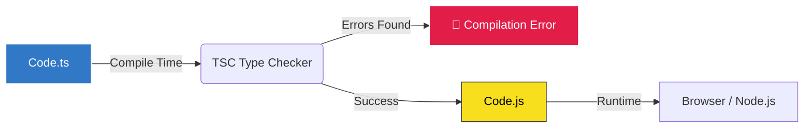

# Розділ 1: Вступ та Базові Типи

## 1. Ера "Undefined is not a function"

Уявіть ситуацію. П'ятниця, 17:00. Ви заливаєте хотфікс на продакшн. Все протестовано локально. Менеджер киває. Ви натискаєте "Deploy".
Через 5 хвилин у Slack починається пекло. Користувачі скаржаться, що сторінка оплати "біла". В консолі браузера червоним світиться легендарна помилка:

::card{type="error" icon="i-heroicons-exclamation-triangle"}
`Uncaught TypeError: Cannot read properties of undefined (reading 'price')`
::

Ви відкриваєте код і бачите це:

```javascript
function calculateTotal(cart) {
    return cart.items.reduce((sum, item) => sum + item.price, 0)
}
```

Виявляється, в одному з випадків `cart` прийшов не як об'єкт, а як `null`. Або `item` не мав поля `price`. JavaScript "проковтнув" це на етапі написання, але "вибухнув" на етапі виконання (Runtime).

JavaScript — це **динамічно типізована** мова. Це означає, що ви можете покласти кота в коробку з написом "собака", і JS скаже "Окей", поки ви не спробуєте змусити цього кота гавкати.

::quote
"TypeScript doesn't prevent bugs. It prevents you from writing code that looks like it works but inevitably fails."
::

TypeScript — це **статичний аналізатор** і надбудова над JavaScript. Він змушує вас чітко сказати: "В цій змінній має бути число, і нічого більше". Якщо ви спробуєте запхнути туди рядок — код навіть не скомпілюється. Ви дізнаєтесь про помилку в редакторі, а не від розлюченого клієнта.

### Історія та Еволюція

JavaScript створювався за 10 днів у 1995 році для простих скриптів (дзвонити дзвіночком, коли натискаєш кнопку). Ніхто не думав, що на ньому будуть писати:

- Банківські системи (Node.js)
- Офісні пакети (Google Docs)
- 3D ігри (Three.js)

Коли проєкти розрослися до мільйонів рядків, підтримувати "динамічний хаос" стало неможливо.
Google намагався зробити **Dart**. Facebook — **Flow**. Але переміг Microsoft з **TypeScript** (реліз у 2012), тому що:

1.  **Це просто JavaScript з типами**. Будь-який JS код є валідним TS кодом (майже).
2.  **Неймовірний Tooling**. Автодоповнення, рефакторинг, навігація — все це працює завдяки TS.

---

## 2. Налаштування Ментальної Моделі та Оточення

Перш ніж писати код, давайте зрозуміємо, як TS працює. Браузери **НЕ РОЗУМІЮТЬ** TypeScript. Node.js (без спеціальних прапорів) **НЕ РОЗУМІЄ** TypeScript.

TypeScript — це інструмент розробки. Він існує тільки до моменту "компіляції" (транспіляції).

1.  Ви пишете `.ts` файл.
2.  Компілятор (`tsc`) перевіряє типи.
    - Якщо є помилки -> СТОП. Червона хвиляста лінія.
    - Якщо все ОК -> **Emit** (Генерація) `.js` файлу.
3.  Браузер/Node виконує `.js` файл. В цьому файлі типів вже немає. Вони "розчинилися" (erased).

::mermaid



::

### Крок 1: Знайомство з `tsc` (TypeScript Compiler)

Давайте зробимо це "руками", без магії Vite, щоб відчути різницю.

Встановіть TypeScript глобально (або використовуйте `npx`):

```bash
npm install -g typescript
tsc --version
```

Створіть файл `index.ts`:

```typescript
const greeting: string = 'Hello, World!'
console.log(greeting)
```

Тепер скомпілюйте його:

```bash
tsc index.ts
```

Ви побачите новий файл `index.js`. За замовчуванням TS компілює в старий стандарт ES3 (щоб працювало навіть в IE6):

```javascript
// index.js (Output)
var greeting = 'Hello, World!'
console.log(greeting)
```

Бачите? `const` перетворився на `var`, а тип `: string` зник.

Спробуйте змінити стандарт.

```bash
tsc index.ts --target ES2020
```

Тепер `index.js` залишить `const`, бо ES2020 це підтримує.

### Крок 2: Детальний розбір `tsconfig.json`

Щоб не писати довгі аргументи в консолі, ми використовуємо `tsconfig.json`. Це "пульт керування" проектом.

```json
{
    "compilerOptions": {
        "target": "ES2020",
        "module": "ESNext",
        "strict": true,
        "noEmit": true // <-- Про це нижче
    }
}
```

#### Довідник основних налаштувань (Cheatsheet)

| Опція                  | Значення                         | Опис                                                                                         |
| :--------------------- | :------------------------------- | :------------------------------------------------------------------------------------------- |
| **`target`**           | `ES5`, `ES2020`, `ESNext`        | У яку версію JS компілювати код. Якщо треба підтримати старі браузери, ставимо `ES5`.        |
| **`module`**           | `CommonJS`, `ESNext`, `NodeNext` | Яку систему модулів використовувати. Для сучасних фронтенд-проектів ставимо `ESNext`.        |
| **`lib`**              | `["DOM", "ESNext"]`              | Які глобальні типи доступні (наприклад, `document`, `window`, `Array.flat`).                 |
| **`strict`**           | `true`                           | Вмикає "Суворий режим". **Обов'язково для всіх нових проектів.**                             |
| **`noImplicitAny`**    | `true`                           | Забороняє змінні без типу, які автоматично стають `any`. Не дає лінитися.                    |
| **`strictNullChecks`** | `true`                           | Робить `null` та `undefined` окремими типами. Рятує від "Cannot read property of undefined". |
| **`outDir`**           | `./dist`                         | Куди складати скомпільовані `.js` файли.                                                     |
| **`rootDir`**          | `./src`                          | Де лежить ваш вихідний код.                                                                  |

### Крок 3: Еволюція до Vite (Чому `noEmit: true`?)

У реальному сучасному проекті ми **рідко** використовуємо `tsc` для генерації файлів.
Чому? Тому що `tsc` повільний як збирач (bundler).

Ми використовуємо **Vite**.

- **Vite** використовує `esbuild` (написаний на Go), який в 10-100 разів швидший за `tsc` для транспіляції файлів.
- **Vite** займається збіркою, мініфікацією, HMR (Hot Module Replacement).
- **TypeScript (`tsc`)** залишається тільки як **поліцейський** (Type Checker).

Ось чому в `tsconfig.json` для Vite проектів ви побачите:

```json
"noEmit": true
```

Це означає: _"TypeScript, будь ласка, тільки перевіряй помилки і не створюй жодних .js файлів. Цим займеться Vite."_

#### Як це працює разом?

1.  **Dev Server**: Vite запускає сервер i транспілює код "на льоту" (без перевірки типів для швидкості).
2.  **IDE**: VS Code (використовуючи `tsserver`) підсвічує помилки в реальному часі.
3.  **Build**: Коли ви робите `npm run build`, запускається скрипт:
    ```bash
    tsc -b && vite build
    ```
    Спочатку `tsc` перевіряє типи (`-b` - build mode). Якщо є помилки, білд падає. Якщо все ОК, Vite збирає бандл.

### Крок 4: Розбір `tsconfig.json` для Vite

Коли ви створюєте проєкт через Vite, ви бачите трохи інший конфіг. Давайте розберемо його.

#### Стандартний Vite Config (`tsconfig.app.json`)

```json
{
    "compilerOptions": {
        "target": "ES2020",
        "useDefineForClassFields": true,
        "module": "ESNext",
        "lib": ["ES2020", "DOM", "DOM.Iterable"],
        "skipLibCheck": true,

        /* Bundler mode */
        "moduleResolution": "bundler",
        "allowImportingTsExtensions": true,
        "resolveJsonModule": true,
        "isolatedModules": true, // Важливо для esbuild, який компілює файли окремо
        "noEmit": true, // Vite збирає, TS перевіряє
        "jsx": "react-jsx",

        /* Linting */
        "strict": true,
        "noUnusedLocals": true,
        "noUnusedParameters": true,
        "noFallthroughCasesInSwitch": true
    },
    "include": ["src"]
}
```

#### Professional / Production Config (Hardcore Mode)

Якщо ви хочете максимальної безпеки і комфорту, ось розширена версія, яку використовують у великих ентерпрайз проєктах.

```jsonc
{
    "compilerOptions": {
        /* Base Options */
        "target": "ES2022", // Сучасні браузери (підтримка Top-level await)
        "module": "ESNext",
        "moduleResolution": "bundler", // Найкращий варіант для Vite/Webpack 5
        "lib": ["ESNext", "DOM", "DOM.Iterable"],

        /* Strict Type-Checking (The Armor) */
        "strict": true,
        "noImplicitAny": true,
        "strictNullChecks": true,
        "strictFunctionTypes": true,
        "strictBindCallApply": true,
        "strictPropertyInitialization": true,
        "noImplicitThis": true,
        "useUnknownInCatchVariables": true, // catch(e) -> e is unknown (not any)

        /* Code Quality (The Linting) */
        "noUnusedLocals": true, // Невикористані змінні - це сміття
        "noUnusedParameters": true, // Невикористані аргументи - це помилка
        "noImplicitReturns": true, // Функція маж повертати значення у всіх гілках
        "noFallthroughCasesInSwitch": true, // Захист від забутого break
        "forceConsistentCasingInFileNames": true, // Windows/Linux сумісність (File.ts != file.ts)

        /* Bundler Integration */
        "noEmit": true, // Віддаємо збірку Vite
        "allowImportingTsExtensions": true, // Дозволяє import X from './file.ts'
        "resolveJsonModule": true, // import config from './config.json'
        "isolatedModules": true, // Захист від features, які не підтримує esbuild (наприклад const enum)
        "esModuleInterop": true, // Дозволяє import React from 'react' (CommonJS сумісність)
        "skipLibCheck": true, // Прискорює збірку, ігноруючи типи в node_modules (ми їх не правимо)
    },
    "include": ["src/**/*"],
}
```

Цей конфіг не дозволить вам написати "брудний" код. Спочатку буде боляче, але потім він врятує вам години дебаггингу.

---

## 3. Основи Синтаксису: Як писати типи?

Перш ніж ми пірнемо в типи даних, давайте розберемося з граматикою.
У TypeScript типи пишуться після назви змінної через двокрапку. Це називається **Type Annotation**.

```typescript
// Змінна
let variableName: Type = value

// Функція
function functionName(param: Type): ReturnType {
    // ...
}
```

### Приклади

```typescript
let age: number = 25
let userName: string = 'Alice'
let isActive: boolean = true

function multiply(a: number, b: number): number {
    return a * b
}
```

### Оператор `typeof`

У JavaScript (і TypeScript) є оператор `typeof`, який повертає тип значення у вигляді рядка.
У TypeScript він стає ще потужнішим, бо дозволяє нам робити "Type Guards" (Захисники Типу).

```typescript
console.log(typeof 'Hello') // "string"
console.log(typeof 42) // "number"
console.log(typeof true) // "boolean"
console.log(typeof {}) // "object"
console.log(typeof undefined) // "undefined"
console.log(typeof null) // "object" (Це відомий баг JS, з яким ми живемо)
```

Ми будемо часто використовувати `typeof` для перевірок:

```typescript
function printId(id: number | string) {
    if (typeof id === 'string') {
        // Тут TS знає, що id - це string
        console.log(id.toUpperCase())
    } else {
        // А тут - що це number
        console.log(id.toFixed(2))
    }
}
```

---

## 4. Функції: Анатомія Типізації

Функції — це основний будівельний блок будь-якого застосунку. У TypeScript ми типізуємо не тільки те, що функція приймає, але й те, що вона повертає.

### Базова типізація

```typescript
// (a: number, b: number) -> це параметри
// : number -> це тип значення, яке повертається
function sum(a: number, b: number): number {
    return a + b
}
```

### Стрілкові функції (Arrow Functions)

Синтаксис трохи відрізняється, але суть та сама.

```typescript
const multiply = (a: number, b: number): number => {
    return a * b
}

// Скорочений запис (Implicit return)
const divide = (a: number, b: number): number => a / b
```

### Необов'язкові параметри (Optional Parameters)

Іноді аргумент можна не передавати. Ми позначаємо це знаком питання `?`.

```typescript
function greet(name: string, title?: string): string {
    // title має тип "string | undefined"
    if (title) {
        return `Hello, ${title} ${name}`
    }
    return `Hello, ${name}`
}

greet('Alice') // ✅
greet('Bob', 'Mr.') // ✅
```

### Параметри за замовчуванням (Default Parameters)

Якщо значення не передано, використовується дефолтне.

```typescript
// role автоматично стає string. Знак ? не потрібен.
function createUser(name: string, role: string = 'guest') {
    console.log(`User ${name} has role ${role}`)
}

createUser('Alice') // role: "guest"
createUser('Bob', 'admin') // role: "admin"
```

### REST параметри (...args)

Для функцій, які приймають довільну кількість аргументів.

```typescript
// ...numbers збирає всі аргументи в масив чисел
function total(...numbers: number[]): number {
    return numbers.reduce((acc, curr) => acc + curr, 0)
}

total(10, 20, 30) // 60
```

### Тип функції (Function Type Expressions)

Іноді нам треба передати функцію як аргумент (Callback). Як описати її тип?

```typescript
// Тип: функція, яка приймає рядок і нічого не повертає
type LogCallback = (message: string) => void

function processData(data: string, onComplete: LogCallback) {
    // ... logic
    onComplete('Process finished')
}

processData('file.txt', (msg) => console.log(msg))
```

---

## 5. Примітиви: Це не просто дані

У JavaScript типи "м'які". У TypeScript вони "тверді", але розумні.
Давайте розглянемо базові будівельні блоки, але з точки зору продакшн-коду.

### String (Рядок)

Це не просто текст. Це ідентифікатори, повідомлення, ключі.

```typescript
// ❌ Погано: Неявне визначення (хоча TS це розуміє - Type Inference)
const userName: string = 'Oleksandr'

// ✅ Добре: TS сам розуміє, що це string (Inference)
const userName = 'Oleksandr'

// 🛑 ПОМИЛКА
userName = 42 // Error: Type 'number' is not assignable to type 'string'.
```

Але що робити з рядками, які використовуються для форматування? **Template Literal Types** (ми розглянемо їх глибше пізніше, але ось анонс).

```typescript
const currency = 'UAH'
const amount = 100

// Тип message автоматично стає string
const message = `Total: ${amount} ${currency}`
```

### Number (Число)

У JS (і TS) всі числа — це числа з плаваючою крапкою (IEEE 754). Це джерело нескінченного болю у фінансах.

```typescript
const price: number = 0.1 + 0.2 // 0.30000000000000004
```

::warning
**Фінансові розрахунки**
Ніколи не використовуйте тип `number` для зберігання грошей, якщо ви робите математичні операції на фронтенді.
Використовуйте цілі числа (копійки замість гривень) або спеціальні бібліотеки (`decimal.js`).
А ще краще — новий тип `bigint` для великих цілих чисел.
::

### BigInt

Для дуже великих чисел (більше $2^{53} - 1$). Це важливо для Id з бази даних, криптографії та точних фінансів.

```typescript
// Потрібно target: ES2020+
const reallyBigNumber: bigint = 9007199254740991n // суфікс 'n'
```

---

## 6. Union Types (Об'єднання) — Або те, або інше

Це одна з найпотужніших фіч TS. Часто змінна може бути не одного типу, а кількох.
Ми використовуємо символ `|` (pipe), щоб сказати "АБО".

```typescript
let id: number | string

id = 101 // ✅
id = 'user_101' // ✅
// id = true; // 🛑 Error
```

### Проблема спільного доступу

Якщо ви маєте `string | number`, ви можете використовувати лише ті методи, які є **спільними** для обох типів (наприклад `toString()`).

```typescript
function printId(id: number | string) {
    // console.log(id.toUpperCase()); // 🛑 Помилка! У number немає toUpperCase().
    console.log(id.toString()) // ✅ ОК, бо це є і там, і там.
}
```

### Звуження типів (Narrowing)

Щоб працювати зі специфічними методами, нам треба "звузити" тип. Тут нам допомагає `typeof`, який ми вчили раніше.

```typescript
function formatPrice(price: number | string) {
    if (typeof price === 'string') {
        // У цьому блоці price — це string
        return parseFloat(price).toFixed(2)
    } else {
        // У цьому блоці price — це number
        return price.toFixed(2)
    }
}
```

### Literal Types (Літеральні типи)

Ми можемо об'єднувати не просто типи, а конкретні значення.

```typescript
// Тільки ці три рядки дозволені
type WindowState = 'open' | 'closed' | 'minimized'

let state: WindowState = 'open'
// state = "broken"; // 🛑 Error
```

Це часто замінює `enum` (перелічення), бо простіше і працює швидше.

---

## 7. Просунуті Типи: Aliases, Templates, Symbols

Ми розглянули `string`, `number`, `boolean`. Але диявол криється в деталях.

### Type Aliases (Псевдоніми Типів)

Перш ніж йти далі, розберемо ключове слово `type`.
Часто типи стають довгими і складними. Щоб не писати їх усюди, ми даємо їм ім'я.

```typescript
// Створюємо псевдонім для типу string
type Name = string

// Створюємо псевдонім для складнішого типу (Union)
type ID = string | number

let userId: ID = 123
userId = 'user_456'
```

Це як змінна, але для типів. Вона зникає при компіляції.

### String: Template Literal Types (Вступ)

TypeScript дозволяє робити магію з рядками. Ви можете обмежити рядок шаблоном.

```typescript
type Protocol = 'http' | 'https'
type Domain = 'kostyl.dev' | 'google.com'
type URL = `${Protocol}://${Domain}`

const mySite: URL = 'https://kostyl.dev' // ✅
// const wrong: URL = "ftp://kostyl.dev"; // ❌ Error
```

Це надзвичайно потужно для типізації API ендпоінтів, CSS класів (наприклад, Tailwind) або форматів дат.

### Symbol: Унікальність

Тип `symbol` використовується для створення унікальних ключів об'єктів. Це рідко потрібно в бізнес-логіці, але часто в бібліотеках.

```typescript
const key1: symbol = Symbol('key')
const key2: symbol = Symbol('key')

// console.log(key1 === key2); // false! Навіть якщо опис однаковий.
```

### BigInt: Робота з грошима

Чому `0.1 + 0.2 !== 0.3`? Тому що комп'ютери зберігають числа у двійковій системі.
Якщо ви робите фінансовий додаток, `number` — це ризик.

```typescript
// Проблема number
const price = 19.99
const quantity = 3
const total = price * quantity // 59.96999999999999 😱

// Рішення BigInt (працюємо в копійках)
const priceBig = 1999n // 19.99 грн -> 1999 копійок
const qtyBig = 3n
const totalBig = priceBig * qtyBig // 5997n -> 59.97 грн. Ідеально точно.
```

::warning
`BigInt` не можна змішувати з `number`.
`10n + 10` видасть помилку. Вам потрібно явно перетворити типи: `10n + BigInt(10)`.
::

### Boolean

Істина чи брехня. Усе просто, так?
Hе зовсім. У JS є концепція `truthy` та `falsy` значень. TS допомагає не вистрілити собі в ногу.

```typescript
const isError: boolean = false

if (isError) {
    // Цей код ніколи не виконається (Dead Code)
    // TS може підсвітити це, якщо налаштований правильно
    console.error('Boom!')
}
```

---

## 8. "Порожнеча": Null, Undefined, Void

Тут починається найцікавіше. Початківці часто плутають ці поняття.

### Null vs Undefined

- **`undefined`**: Значення ще не було присвоєно. Змінна оголошена, але пуста. Це "ненавмисна" відсутність.
- **`null`**: Значення **відсутнє навмисно**. Ми явно сказали "тут нічого немає".

```typescript
interface UserProfile {
    id: string
    bio: string | null // Користувач може стерти біографію
    website?: string // Користувач може навіть не заповнювати це поле (буде undefined)
}

function printBio(user: UserProfile) {
    if (user.bio === null) {
        console.log('No bio provided')
        return
    }
    // Тут TS знає, що user.bio - це точно string!
    console.log(user.bio.toUpperCase())
}
```

::note
**Чому `strictNullChecks` рятує життя?**
Якби це налаштування було вимкнене, ми могли б викликати `toUpperCase()` на `null`, і TS промовчав би. У Runtime ми б отримали краш.
Зі `strictNullChecks`, TS змушує нас перевірити на `null` перед використанням.
::

### Void

Використовується виключно для функцій, які **нічого не повертають**.

```typescript
// Аналіз коду:
// 1. Функція логує повідомлення (Side effect).
// 2. Вона не має return.
// 3. Її результат - void (хоча технічно в JS це undefined).

function logError(message: string): void {
    console.error(`[SYSTEM ERROR]: ${message}`)
}

const result = logError('DB Timeout') // Тип result - void. З ним нічого не можна зробити.
```

---

## 9. Типи "Анархії" та "Безвиході"

### Any — Зло в чистому вигляді

Тип `any` вимикає перевірку типів для змінної. Це "Escape Hatch".
Використовувати `any` — це як їздити без паска безпеки на швидкості 200 км/год.

```typescript
// ❌ НІКОЛИ ТАК НЕ РОБІТЬ (хіба що під час міграції старого JS коду)
let data: any = 'Hello'
data = 42 // ОК
data.methodHuh() // ОК в редакторі -> Crash в браузері 💥
```

TypeScript дозволяє вам це зробити, але ви втрачаєте весь сенс використання TS.
Якщо ви бачите `any` в коді — це **Technical Debt**.

### Unknown — Безпечний Any

Якщо ви дійсно не знаєте, що прийде (наприклад, відповідь від стороннього API або парсинг JSON), використовуйте `unknown`.
Він каже: "Я не знаю, що це, тому **не дозволю** тобі це використовувати, поки ти не перевіриш тип".

```typescript
function safeParse(json: string): unknown {
    return JSON.parse(json)
}

const result = safeParse('{"name": "Alice"}')

// 🛑 Error: Object is of type 'unknown'.
// console.log(result.name);
// Ми не можемо просто звернутися до поля, бо не знаємо, чи це об'єкт.

// ✅ Треба зробити звуження типу (Type Narrowing)
if (typeof result === 'object' && result !== null && 'name' in result) {
    // Тепер це безпечно, але TS все ще обережний.
    // Для реальних задач краще використовувати Zod/Yup або Type Guards (про це пізніше).
    console.log((result as any).name) // Все ще брудно, але це ілюстрація обмеження
}
```

### Never — Тупик

Тип `never` означає, що значення **ніколи** не може статися.
Це звучить дивно, але це супер-корисно для:

1.  Функцій, які кидають помилки (вони не повертають значення, вони переривають потік).
2.  Функцій з нескінченним циклом.
3.  **Вичерпної перевірки (Exhaustive Checks)** у switch-case.

```typescript
// Сценарій 1: Функція-бомба
function throwError(msg: string): never {
    throw new Error(msg)
}

// Сценарій 2: Вичерпна перевірка
type Status = 'success' | 'error' | 'loading'

function getMessage(s: Status): string {
    switch (s) {
        case 'success':
            return 'Done!'
        case 'error':
            return 'Oops!'
        case 'loading':
            return 'Loading...'
        default:
            // Якщо ми додамо новий статус в type Status, але забудемо тут case,
            // TS видасть помилку тут, бо s не буде never.
            const _exhaustiveCheck: never = s
            return _exhaustiveCheck
    }
}
```

---

## 10. Масиви та Кортежі (Arrays & Tuples)

Список друзів, товари в кошику, історія повідомлень — усе це масиви.

### Типізація масивів

Є два синтаксиси:

```typescript
const scores: number[] = [1, 2, 3] // Більш поширений
const names: Array<string> = ['Alice', 'Bob'] // Дженерик синтаксис (стара школа)
```

А що, як масив такий важливий, що ми не хочемо, щоб його змінювали?
**Immutability** (незмінність) — це ключ до стабільного React коду.

```typescript
// ReadonlyArray
const sensors: readonly number[] = [22.5, 23.1, 22.8]

// 🛑 Error: Property 'push' does not exist on type 'readonly number[]'.
// sensors.push(24.0);

// Ми можемо тільки читати або створювати нові масиви на основі цього
const newSensors = [...sensors, 24.0]
```

### Tuples (Кортежі)

Іноді нам потрібен масив фіксованої довжини з різними типами на конкретних позиціях.
Найкласичніший приклад — React `useState`.

```typescript
// Це Tuple: [string, number]
// Перший елемент ЗАВЖДИ рядок, Другий ЗАВЖДИ число.
type UserRecord = [string, number]

const record: UserRecord = ['Alice', 1]

// Деструктуризація працює ідеально
const [username, id] = record
```

Якщо вийди за межі довжини або переплутати типи — буде помилка.

::caution
**Tuple не є на 100% безпечним у Runtime**
TypeScript дозволяє робити `.push()` у звичайний Tuple (це давня особливість/баг дизайну TS).
Але при доступі за індексом, якого не має бути, він сваритиметься.
Щоб зробити Tuple справді фіксованим, додайте `readonly`.
::

```typescript
const point: readonly [number, number] = [10, 20]
// point.push(30); // Тепер це помилка!
```

## 11. Практичний Кейс: Типізація API Відповіді

Давайте зберемо все разом. Ми отримуємо дані про користувача з бекенду.
Ось як виглядав би JS код:

```javascript
async function getUser(id) {
    const res = await fetch(`/api/users/${id}`)
    return res.json()
}
// Хто знає, що там повертається? Ніхто.
```

Ось TypeScript підхід (Рівень 1: Базові типи):

```typescript
// 1. Визначаємо форму даних (Shape)
// Поки використовуємо type, про interface поговоримо пізніше
type Address = {
    city: string
    zip: number // краще string для zip, але для прикладу number
    street?: string // Необов'язкове поле
}

type UserResponse = {
    id: number
    username: string
    isActive: boolean
    tags: string[] // Масив рядків
    address: Address // Вкладений об'єкт
    lastLogin: string | null // Може бути null
}

// 2. Типізуємо функцію
async function getUser(id: number): Promise<UserResponse> {
    const res = await fetch(`/api/users/${id}`)

    // ПРИМІТКА: fetch не кидає помилку на 404/500, треба перевіряти ok
    if (!res.ok) {
        throw new Error('Network response was not ok')
    }

    // cast result as UserResponse
    // (Увага: це "довіра" розробника, TS не може перевірити рантайм відповідь тут)
    return res.json() as Promise<UserResponse>
}

// 3. Використання
async function main() {
    try {
        const user = await getUser(101)

        console.log(`Hello, ${user.username.toUpperCase()}`)

        if (user.lastLogin) {
            console.log(`Last login: ${user.lastLogin}`)
        }

        // Автодоповнення працює! user.address.city
    } catch (e) {
        console.error(e)
    }
}
```

Це лише верхівка айсберга. Ми типізували "щасливий шлях". Але що таке `Promise`? Чому `as Promise<UserResponse>` це трохи небезпечно? Про це далі.

## 12. Виведення Типів (Type Inference)

TypeScript розумний. Йому не завжди потрібно казати очевидне.

```typescript
// TS бачить: це рядок. Йому не треба писати ': string'
let framework = 'React'

// TS бачить: це число
let version = 18

// TS "виводить" тип результату функції
// add має тип (a: number, b: number) => number
function add(a: number, b: number) {
    return a + b
}
```

### Найкраща практика: "Inference where possible, explicit where needed"

- **Змінні**: Довіряйте Inference. `const x = 10` краще, ніж `const x: number = 10`.
- **Аргументи функцій**: Завжди явно.
- **Повертаємі значення функцій**: Бажано явно. Це захищає від випадкових змін контракту функції.

```typescript
// ✅ Explicit return type
// Якщо ми випадково повернемо рядок, TS одразу це підсвітить ТУТ.
function getUserName(user: User): string {
    return user.firstName + ' ' + user.lastName
}
```

### Contextual Typing

TS розуміє контекст.

```typescript
const buttons = ['Save', 'Cancel', 'Delete']

// TS знає, що 'btn' - це string, тому що масив рядків.
// Вам не треба писати (btn: string)
buttons.forEach((btn) => {
    console.log(btn.toUpperCase()) // ✅ Метод string доступний
})
```

---

## 13. Type Assertions (Приведення Типів)

Іноді ви знаєте про тип більше, ніж TypeScript.
Наприклад, ви отримуєте елемент з DOM. TS знає, що це `HTMLElement` або `null`. Ви знаєте, що це `HTMLInputElement`, бо ви його туди поклали.

### Синтаксис `as`

```typescript
// 1. Отримуємо елемент (він може бути null, і TS думає, що це просто HTMLElement)
const input = document.getElementById('user-email')

// 2. Ми кажемо: "Повір мені, це HTMLInputElement"
const emailInput = input as HTMLInputElement

// Тепер доступні специфічні методи
console.log(emailInput.value)
```

### Небезпека `as`

`as` — це спосіб **вимкнути** перевірку. Ви берете відповідальність на себе.

```typescript
const safeData = 'Hello' as number // 🛑 TS Error: Conversion of type 'string' to type 'number' may be a mistake...

// АЛЕ через unknown можна зламати все
const dangerousData = 'Hello' as unknown as number // ✅ TS мовчить
// dangerousData.toFixed(2); // 💥 Runtime Crash!
```

Використовуйте `as` тільки тоді, коли ви на 100% впевнені.
Кращий шлях — **Type Guards** (про це в розділі 5).

### Const Assertions (`as const`)

Це супер-фіча для Redux actions, конфігів та незмінних об'єктів.
Вона робить дві речі:

1.  Усі поля об'єкта стають `readonly`.
2.  Усі примітиви (рядки, числа) звужуються до їх **Literal Types** (конкретних значень), а не загальних типів (`string`, `number`).

```typescript
// Без as const
const config = {
    endpoint: 'https://api.example.com',
    retries: 3,
}
// Тип config: { endpoint: string; retries: number; }
// config.endpoint = "oops"; // Дозволено (хоча це може зламати app)

// З as const
const strictConfig = {
    endpoint: 'https://api.example.com',
    retries: 3,
} as const

// Тип strictConfig:
// {
//    readonly endpoint: "https://api.example.com"; // Тип не string, а саме цей рядок!
//    readonly retries: 3; // Тип не number, а саме 3!
// }

// strictConfig.retries = 5; // 🛑 Error: Read-only!
```

Це критично важливо, коли значення саме по собі є типом.

---

## 14. Ambient Declarations (`declare`)

Що робити, якщо ви використовуєте бібліотеку JS, яка не має типів (наприклад, старий jQuery плагін або змінна, яку сервер вставляє в `window`)?

TS буде кричати: "Я не знаю, що таке `MY_GLOBAL_VAR`!".
Ви можете використати `declare`, щоб сказати: "Ця змінна існує, повір мені".

```typescript
// global.d.ts або прямо у файлі
declare const MY_ANALYTICS_ID: string

function track() {
    console.log(MY_ANALYTICS_ID) // Тепер помилки немає
}
```

Це часто використовується для типізації `window`.

```typescript
// Розширення інтерфейсу Window
declare global {
    interface Window {
        __REDUX_DEVTOOLS_EXTENSION__: any
    }
}

const devTools = window.__REDUX_DEVTOOLS_EXTENSION__ // ✅
```

---

## 15. Практика: Побудова безпечного логера

Давайте закріпимо знання про `void`, `unknown` та `never`, створивши утиліту для логування.

```typescript
// Рівень логування (Union Type)
type LogLevel = 'info' | 'warn' | 'error'

interface LogConfig {
    debugMode: boolean
    appVersion: string
}

// Функція, яка форматує повідомлення (повертає string)
function formatMessage(level: LogLevel, msg: string, config: LogConfig): string {
    const timestamp = new Date().toISOString()
    return `[${timestamp}] [${level.toUpperCase()}] (v${config.appVersion}): ${msg}`
}

// Функція, яка відправляє лог (повертає void)
function transport(formattedMsg: string): void {
    console.log(formattedMsg)
    // Тут міг би бути sendToSentry(formattedMsg);
}

// Головна функція (параметри явно типізовані)
function log(level: LogLevel, message: unknown, config: LogConfig): void {
    if (!config.debugMode && level === 'info') {
        return // Early return
    }

    // Безпечна обробка unknown
    let safeMessage: string

    if (typeof message === 'string') {
        safeMessage = message
    } else if (message instanceof Error) {
        safeMessage = message.message
    } else {
        // Fallback для об'єктів
        try {
            safeMessage = JSON.stringify(message)
        } catch {
            safeMessage = 'Unknown Object'
        }
    }

    const output = formatMessage(level, safeMessage, config)
    transport(output)
}

// Тест
const appConfig = { debugMode: true, appVersion: '1.0.0' } as const

log('error', new Error('DB Connection Failed'), appConfig)
log('warn', { userId: 123, action: 'drop_table' }, appConfig)
log('info', 'App started', appConfig)
// log("fatal", "Boom", appConfig); // 🛑 Error: Argument of type '"fatal"' is not assignable to parameter of type 'LogLevel'.
```

Цей приклад ілюструє:

1.  **Union Types** (`LogLevel`) для обмеження варіантів.
2.  **Unknown** (`message`) для безпечного прийому будь-яких даних.
3.  **Type Narrowing** (`typeof`, `instanceof`) для перетворення `unknown` -> `string`.
4.  **Void** для функцій з сайд-ефектами.
5.  **as const** для конфігурації.

---

## 16. Типові пастки та Анти-патерни

Навіть досвідчені розробники роблять ці помилки. Давайте розберемо їх, щоб ви не наступали на ті ж граблі.

### Пастка 1: `Number`, `String`, `Boolean` (З великої літери)

У JS є примітиви (`string`) і об'єкти-обгортки (`String`).
У TS **завжди** використовуйте примітиви (з малої літери).

```typescript
// ❌ НЕПРАВИЛЬНО
function reverse(str: String): String {
    return new String(str).split('').reverse().join('')
}

// ✅ ПРАВИЛЬНО
function reverse(str: string): string {
    return str.split('').reverse().join('')
}
```

Тип `String` — це об'єкт. Він масивніший і веде себе інакше при порівнянні.

### Пастка 2: Тип `Function` і `Object`

TypeScript має глобальні типи `Function` і `Object`. Вони майже марні і небезпечні.

- `Function`: Приймає будь-які аргументи і повертає `any`. Це діра в безпеці.
- `Object`: Це будь-яке значення, яке не є nil (тобто не null/undefined). Це включає масиви, функції і, власне, об'єкти.

```typescript
// ❌ Погано
function doSomething(cb: Function) {
    cb(1, 2, 3) // Ніякої перевірки аргументів
}

// ✅ Добре
function doSomething(cb: (a: number, b: number) => void) {
    // ...
}
```

### Пастка 3: Надмірне використання `any` при міграції

Коли люди переносять JS проект на TS, вони часто ставлять `any` всюди, "щоб просто запрацювало".
Це називається `AnyScript`.

**Краща стратегія:**

1.  Увімкніть `allowJs: true` в `tsconfig`.
2.  Мігруйте файл за файлом.
3.  Якщо не знаєте тип — ставте `unknown` і пишіть коментар `// TODO: Fix type`.

---

## 17. TypeScript в Екосистемі: Чому це стандарт?

Ви можете запитати: "Навіщо мені це вчити, якщо я можу писати на JS?".
Відповідь проста: **Інструменти**.

Сучасний веб тримається на трьох китах, які існують завдяки TS:

### 1. Zod / Valibot (Runtime Validation)

TS перевіряє типи під час написання. Але що, якщо API пришле не те, що ми чекали?
Zod дозволяє описати схему, яка працює і як валідатор, і як джерело типів.

```typescript
import { z } from 'zod'

// Схема
const UserSchema = z.object({
    id: z.number(),
    email: z.string().email(),
})

// Автоматичний вивід типу (Don't Repeat Yourself)
type User = z.infer<typeof UserSchema>

// Використання
const result = UserSchema.safeParse(apiResponse)
if (!result.success) {
    console.error(result.error)
}
```

### 2. tRPC (End-to-end Type Safety)

Якщо у вас TS на бекенді і TS на фронтенді, навіщо вам ручні типи API?
tRPC дозволяє викликати функції бекенду на клієнті так, ніби вони локальні, з повним автодоповненням.

### 3. Prisma / Drizzle (Database ORM)

Забудьте про SQL помилки в рядках. Ці ORM генерують типи на основі вашої БД.

```typescript
// Якщо ви змінили ім'я колонки в БД, цей код підсвітиться червоним!
const user = await db.user.findFirst({
    where: { email: 'test@example.com' },
})
```

---

## 18. Історична Довідка: Шлях до Домінування

Розуміння історії допомагає зрозуміти "чому все так".

::steps

### 2012: Народження

Microsoft (Андерс Хейлсберг, творець C#) випускає TypeScript 0.8.
Спільнота JS налаштована скептично: "Microsoft знову хоче захопити веб?".

### 2015: Angular 2

Google приймає доленосне рішення: повністю переписати Angular на TypeScript.
Це дало TS величезний поштовх.

### 2016: @types

З'являється `DefinitelyTyped` і пакет `@types/...`.
Тепер не треба писати файли декларацій вручну для кожної бібліотеки.

### 2018: Babel support

Babel додає підтримку парсингу TS. Тепер не обов'язково використовувати компілятор MS для збірки.
Це відкрило двері для інтеграції у Create React App.

### 2020+: Тотальна гегемонія

Сьогодні важко знайти вакансію React/Node.js розробника без вимоги TypeScript.
::

---

## 19. Практичне Завдання: Safe Storage

Ми багато говорили про теорію. Час написати код.
Ваше завдання — створити безпечну обгортку над `localStorage`.

### Вимоги

1.  Створити файл `storage.ts`.
2.  Написати функцію `saveItem(key: string, value: unknown): void`.
    - Вона має серіалізувати дані в JSON.
    - Вона має обробляти помилки (наприклад, `QuotaExceededError`).
3.  Написати функцію `readItem(key: string): unknown`.
    - Вона має повертати розпарсений об'єкт або `null`, якщо ключа немає.
    - Вона має безпечно обробляти битий JSON (try-catch).
4.  **Bonus**: Використати Discriminated Union для результату читання:
    ```typescript
    type Result = { status: 'success'; value: unknown } | { status: 'error'; error: Error }
    ```

### Кроки Реалізації

::steps

### Крок 1: Підготовка

Ініціалізуйте проєкт (якщо ще ні):

```bash
npm create vite@latest storage-app -- --template vanilla-ts
```

### Крок 2: Типізація

Спочатку опишіть типи функцій (Signatures). Не пишіть реалізацію одразу.
Думайте про те, що функція приймає і що повертає.

### Крок 3: Обробка помилок

`JSON.parse` може впасти. `localStorage.setItem` може впасти (якщо пам'ять закінчилась).
Використовуйте `try-catch`.

### Крок 4: Перевірка

Спробуйте зберегти:

- Рядок
- Число
- Об'єкт
- `BigInt` (Увага! `JSON.stringify` впаде на BigInt. Як це виправити? Додайте перевірку на BigInt і киньте помилку, або конвертуйте в рядок).

::

---

## 20. Шпаргалка (Cheatsheet)

Збережіть це собі.

| Тип          | JS Еквівалент | Приклад      | Опис                                      |
| :----------- | :------------ | :----------- | :---------------------------------------- |
| `string`     | Pядок         | `"Hello"`    | Текст.                                    |
| `number`     | Число         | `42`, `3.14` | Числа (float). Обережно з грошима.        |
| `boolean`    | Булеве        | `true`       | Істина/Брехня.                            |
| `text[]`     | Масив         | `["a", "b"]` | Список однотипних елементів.              |
| `[str, num]` | Масив         | `["a", 1]`   | Tuple (Кортеж). Фіксована довжина і типи. |
| `any`        | Усе           | `...`        | **НЕ ВИКОРИТОВУВАТИ**. Вимикає TS.        |
| `unknown`    | Усе           | `...`        | Безпечний any. Вимагає перевірки.         |
| `void`       | `undefined`   | `fn()`       | Функція нічого не повертає.               |
| `never`      | -             | `throw`      | Функція ніколи не завершується успішно.   |
| `object`     | Об'єкт        | `{}`         | Будь-що, що не є примітивом.              |
| `null`       | `null`        | `null`       | Явна відсутність значення.                |
| `undefined`  | `undefined`   | `undefined`  | Значення ще не присвоєно.                 |

### Топ-5 команд CLI

1.  `tsc --init`: Створити `tsconfig.json`.
2.  `tsc --noEmit`: Перевірити типи без генерації файлів.
3.  `tsc --watch`: Запустити в режимі спостереження.
4.  `tsc --project tsconfig.prod.json`: Використати інший конфіг.
5.  `npx tset`: (Жарт, такої команди немає, але було б круто).

---

## 21. Часті питання (FAQ)

### Чи сповільнює TypeScript роботу браузера?

**Ні.** Браузер виконує JavaScript. TypeScript повністю видаляється перед запуском.
Єдине сповільнення — це етап збірки (Build time), але з сучасними інструментами (esbuild, swc) це мілісекунди.

### Чи замінить JSDoc TypeScript?

Є тренд (наприклад, у Svelte або деяких бібліотеках Google) використовувати JSDoc замість `.ts` файлів, щоб уникнути кроку компіляції.
Але:

1.  Це все ще TypeScript "під капотом" (аналізатор той самий).
2.  Синтаксис JSDoc дуже громіздкий для складних типів.
    Для прикладних програм `.ts` залишається золотим стандартом.

### Коли НЕ варто використовувати TypeScript?

1.  **Прототипи "на серветці"**: Якщо вам треба перевірити гіпотезу за 5 хвилин.
2.  **Дуже маленькі скрипти**: Скріпт на 50 рядків для перейменування файлів.
3.  **Навчання новачків**: Іноді краще зрозуміти логіку JS без "шуму" типів (але це спірно).

---

## Резюме Розділу (Фінальне)

Ми заклали фундамент. Ви тепер знаєте не просто "як оголосити змінну", а як налаштовувати компілятор і думати типами.

1.  **Налаштування**: `noEmit`, `strict`, `isolatedModules` — база сучасного стеку.
2.  **Inference**: Довіряйте TS, але перевіряйте границі систем (функції, API).
3.  **Assertions**: `as` — це небезпечно, `as const` — це корисно.
4.  **Unknown vs Any**: Завжди обирайте `unknown`. Це змусить вас написати код обробки, який врятує продакшн.
5.  **Екосистема**: TS — це не просто мова, це екосистема інструментів (IDE, лінтери, ORM), яка робить вас у 10 разів продуктивнішим.

У наступному розділі ми пірнемо в **Інтерфейси**, **Об'єктні типи** та магію **Union Types**, щоб моделювати складні стани UI. Ми навчимося робити так, щоб неправильний стан інтерфейсу був неможливим на рівні коду.
