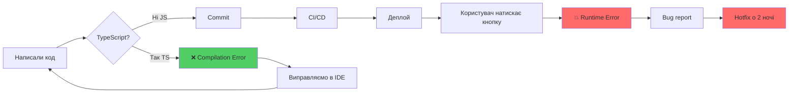
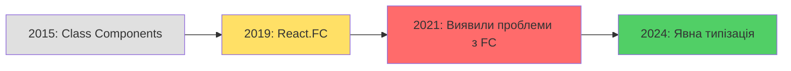
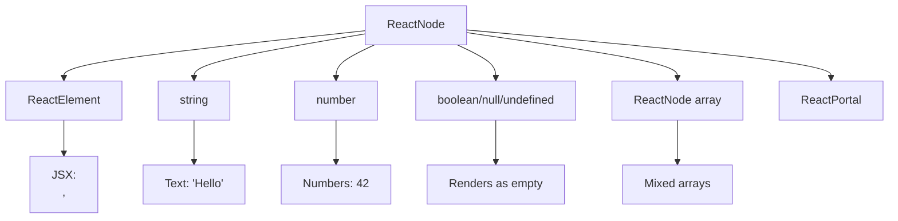
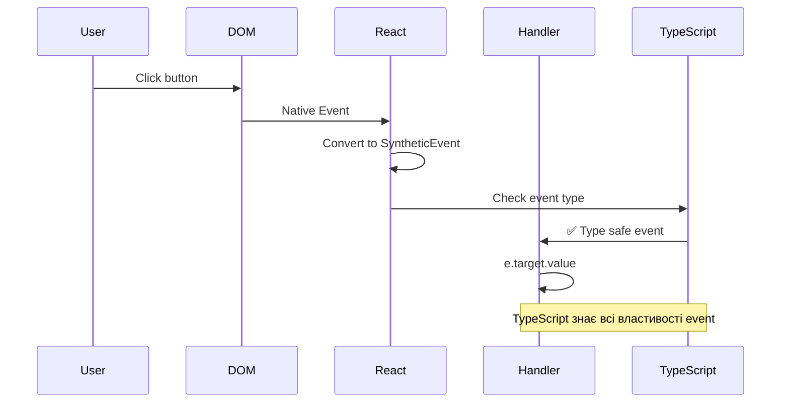

# TypeScript у світі React

::lead
П'ятниця, 17:45. Ви готуєтеся йти додому. Раптом Slack вибухає повідомленнями: "Продакшен впав!", "Користувачі не можуть залогінитись!", "Що сталося?!". Ви відкриваєте логи і бачите: `Cannot read property 'id' of undefined`. Виявляється, хтось змінив API контракт і передав `null` замість об'єкта користувача. Компоненти React радісно приняли `null`, рендер просп� успішно виконався, і тільки при спробі звернутися до `user.id` все полетіло.

**TypeScript запобіг би цьому ще на етапі написання коду.**
::

---

## Навіщо TypeScript у React: Реальна історія

### Проблема: Невидимі контракти

У JavaScript React ваші компоненти працюють на довірі:

```javascript
// UserCard.jsx
function UserCard({ user }) {
    return (
        <div>
            <h2>{user.name}</h2>
            <p>{user.email}</p>
            <span>ID: {user.id}</span>
        </div>
    )
}

// Де-інде в додатку
;<UserCard user={currentUser} />
```

**Питання, на які JavaScript не може відповісти:**

- Що таке `user`? Об'єкт? Який саме?
- Які поля він має містити?
- Що якщо `currentUser` буде `null`?
- Хтось створює `UserCard` вперше — звідки йому знати, що передавати?

::tabs
::div{label="JavaScript Reality"}

```javascript
// Два тижні по тому хтось робить це:
<UserCard user={null} />  // 💥 Runtime error

// Або це:
<UserCard user={{ name: "Alice" }} />  // 💥 email undefined

// Або це:
<UserCard user={currentUser} userId={123} />  // userId ігнорується, але ніхто не помітив
```

::

::div{label="TypeScript Reality"}

```typescript
interface User {
  id: string;
  name: string;
  email: string;
}

interface UserCardProps {
  user: User;
}

function UserCard({ user }: UserCardProps) {
  return (
    <div>
      <h2>{user.name}</h2>
      <p>{user.email}</p>
      <span>ID: {user.id}</span>
    </div>
  );
}

// ❌ TypeScript Error: Type 'null' is not assignable to type 'User'
<UserCard user={null} />

// ❌ TypeScript Error: Property 'email' is missing
<UserCard user={{ name: "Alice" }} />

// ✅ TypeScript Success
<UserCard user={currentUser} />
```

::
::

### Мета цього розділу

Ви навчитеся писати React код, який:

1. **Сам себе документує** — тип замість коментарів
2. **Ловить помилки до commit** — не в продакшені
3. **Дає розумний autocomplete** — IDE знає, що ви хочете
4. **Спрощує refactoring** — перейменували поле в API? TypeScript покаже всі місця, де треба оновити код

::note
**Prerequisite знання:**

- React basics (компоненти, props, hooks)
- JavaScript ES6+ (destructuring, spread, arrow functions)
- TypeScript fundamentals (interfaces, types, generics) — див. [попередні розділи](./01.basics.md)

::

---

## Життєвий цикл помилки: JS vs TS

Давайте подивимося, де саме TypeScript зупиняє помилки:

::mermaid



::

**Ключова різниця:**

- **JavaScript:** помилка живе тижні/місяці, поки хтось не натрапить на неї в продакшені
- **TypeScript:** помилка не дає вам навіть зберегти файл

::warning
**Розвіюємо міф:**
TypeScript НЕ робить ваш додаток швидшим у runtime. Він робить **вашу команду** швидшою у development.
::

---

## Налаштування: Створюємо React + TypeScript проєкт

### Варіант 1: Vite (Рекомендовано 2024+)

::steps

### Створити проєкт

```bash
npm create vite@latest my-app -- --template react-ts
cd my-app
npm install
```

Що відбувається під капотом:

- Vite створює структуру проєкту
- Встановлює React + TypeScript dependencies
- Генерує `tsconfig.json` з правильними опціями

### Запустити dev server

```bash
npm run dev
```

Vite компілює TypeScript в браузері через esbuild (надшвидко).

### Відкрити в IDE

Відкрийте проєкт у VS Code або WebStorm. IDE миттєво побачить TypeScript і увімкне autocomplete.
::

### Варіант 2: Create React App (Legacy)

```bash
npx create-react-app my-app --template typescript
```

::tip
**Чому Vite краще за CRA у 2024?**

- Швидший cold start (секунди vs хвилини)
- Швидший HMR (Hot Module Replacement)
- Менший bundle size
- CRA більше не підтримується активно

::

---

## Анатомія `tsconfig.json`: Чому кожна опція важлива

Коли ви створюєте React + TS проєкт, генерується `tsconfig.json`. Давайте розберемо ключові опції через призму **проблем, які вони вирішують**.

```json
{
    "compilerOptions": {
        "target": "ES2020",
        "lib": ["ES2020", "DOM", "DOM.Iterable"],
        "jsx": "react-jsx",
        "strict": true,
        "module Resolution": "bundler",
        "allowImportingTsExtensions": true,
        "resolveJsonModule": true,
        "isolatedModules": true,
        "noEmit": true,
        "noUnusedLocals": true,
        "noUnusedParameters": true,
        "noFallthroughCasesInSwitch": true
    }
}
```

::accordion
:::accordion-item{title="\"jsx\": \"react-jsx\" — Нова JSX трансформація"}

**Проблема (React 16 і старіше):**

```typescript
// Потрібно було імпортувати React в кожному файлі
import React from 'react'

function App() {
    return <div>Hello < /div>; / / JSX
}
```

Якщо ви забували `import React`, отримували помилку: `'React' is not defined`.

**Рішення (React 17+):**

```typescript
// Імпорт не потрібен! 🎉
function App() {
  return <div>Hello</div>;
}
```

Опція `"jsx": "react-jsx"` вмикає нову трансформацію. React автоматично імпортується під капотом.

:::

:::accordion-item{title="\"strict\": true — Суворий режим (КРИТИЧНО)"}

Ця опція вмикає **всі** строгі перевірки TypeScript одразу:

- `strictNullChecks` — ловить помилки з `null`/`undefined`
- `strictFunctionTypes` — перевіряє коректність типів функцій
- `strictBindCallApply` — перевіряє `bind`, `call`, `apply`
- ...та інші

**Без `strict: true`:**

```typescript
const user: User = null // ✅ OK (але це помилка!)
console.log(user.name) // 💥 Runtime error
```

**З `strict: true`:**

```typescript
const user: User = null // ❌ Error: Type 'null' is not assignable to type 'User'
```

::caution
**Увага:** Якщо `strict: false`, ви втрачаєте 80% переваг TypeScript. Завжди використовуйте `strict: true`.
::

:::

:::accordion-item{title="\"noUnusedLocals\" та \"noUnusedParameters\" — Чистота коду"}

**Без цих опцій:**

```typescript
function calculate(a: number, b: number, c: number) {
    return a + b // c не використовується, але TypeScript мовчить
}
```

Через місяць ви забули, навіщо `c`, але видалити боїтеся — а раптом він десь використовується?

**З опціями:**

```typescript
// ❌ Error: 'c' is declared but its value is never read
function calculate(a: number, b: number, c: number) {
    return a + b
}
```

TypeScript каже: "Або використовуй, або видали".

:::

:::accordion-item{title="\"noFallthroughCasesInSwitch\" — Ловимо забуті break"}

**Класична помилка:**

```typescript
switch (status) {
    case 'loading':
        showSpinner()
    // Забули break!
    case 'success':
        showData()
        break
}
```

При `status = 'loading'` виконається **і** `showSpinner()`, **і** `showData()`.

**TypeScript з опцією:**

```typescript
// ❌ Error: Fallthrough case in switch
switch (status) {
    case 'loading':
        showSpinner()
    // TypeScript вимагає break або return
    case 'success':
        showData()
        break
}
```

:::
::

---

## Типізація React компонентів: Еволюція підходів

Якщо ви читали старі туторіали, могли бачити різні способи типізації компонентів. Давайте пройдемо шлях еволюції, щоб зрозуміти, **чому** зараз ми пишемо саме так.

::mermaid



::

### Етап 1: Class Components (2015-2018)

```typescript
interface ButtonProps {
  label: string;
  onClick: () => void;
}

class Button extends React.Component<ButtonProps> {
  render() {
    return <button onClick={this.props.onClick}>{this.props.label}</button>;
  }
}
```

**Проблеми:** багато boilerplate, складність з `this`, погана performance.

### Етап 2: React.FC (2019-2021)

```typescript
import { FC } from 'react';

interface ButtonProps {
  label: string;
  onClick: () => void;
}

const Button: FC<ButtonProps> = ({ label, onClick }) => {
  return <button onClick={onClick}>{label}</button>;
};
```

**Що дав `FC`:**

- ✅ Автоматичний тип повернення (`JSX.Element`)
- ✅ Автоматично додається `children?: ReactNode`

**Проблема:**
До React 18, `FC` **завжди** додавав `children`, навіть якщо компонент їх не приймав:

```typescript
const Button: FC<ButtonProps> = ({ label, onClick }) => {
  return <button onClick={onClick}>{label}</button>;
};

// ✅ TypeScript не скаржиться (але це помилка!)
<Button label="Click" onClick={() => {}}>
  This will be ignored!
</Button>
```

### Етап 3: Явна типізація (2024+, рекомендовано)

```typescript
interface ButtonProps {
  label: string;
  onClick: () => void;
}

function Button({ label, onClick }: ButtonProps): JSX.Element {
  return <button onClick={onClick}>{label}</button>;
}
```

**Переваги:**

- ✅ Повна прозорість — ви бачите всі типи
- ✅ Ви контролюєте, чи приймає компонент `children`
- ✅ Немає магії від `FC`

::tip
**Рекомендація 2024:**
Використовуйте явну типізацію. `FC` — це legacy підхід, який залишився зі старих навичок.
::

---

## Props з children: Три підходи

Часто компонент має приймати вкладені елементи:

```typescript
<Card title="User Info">
  <p>Name: Alice</p>
  <p>Email: alice@example.com</p>
</Card>
```

Як типізувати `children`?

::tabs
::div{label="Варіант 1: Вручну"}

```typescript
import { ReactNode } from 'react';

interface CardProps {
  title: string;
  children: ReactNode; // Найбільш гнучкий тип
}

function Card({ title, children }: CardProps) {
  return (
    <div className="card">
      <h2>{title}</h2>
      <div className="card-body">{children}</div>
    </div>
  );
}
```

**Коли використовувати:** Коли ви хочете бачити `children` явно в інтерфейсі.
::

::div{label="Варіант 2: PropsWithChildren"}

```typescript
import { PropsWithChildren } from 'react';

interface CardProps {
  title: string;
}

function Card({ title, children }: PropsWithChildren<CardProps>) {
  return (
    <div className="card">
      <h2>{title}</h2>
      <div className="card-body">{children}</div>
    </div>
  );
}
```

**Що робить `PropsWithChildren`:**

```typescript
type PropsWithChildren<P> = P & { children?: ReactNode }
```

Просто додає `children?: ReactNode` до ваших пропсів.

**Коли використовувати:** Коли не хочете писати `children` вручну кожного разу.
::

::div{label="Варіант 3: Без children (явна заборона)"}

```typescript
interface ButtonProps {
  label: string;
  onClick: () => void;
}

function Button({ label, onClick }: ButtonProps) {
  return <button onClick={onClick}>{label}</button>;
}

// ❌ TypeScript Error: Property 'children' does not exist
<Button label="Click" onClick={() => {}}>
  Invalid children
</Button>
```

Якщо ви **не** додаєте `children` до типу, TypeScript забороняє їх передавати.
::
::

### Що таке ReactNode?

::collapsible{summary="Детальний розбір типу ReactNode"}

`ReactNode` — це Union тип, який включає **все**, що можна рендерити у React:

```typescript
type ReactNode =
    | ReactElement // <div>, <MyComponent />
    | string // "Hello"
    | number // 42
    | boolean // true, false (рендеріться як порожнє)
    | null // (рендеріться як порожнє)
    | undefined // (рендеріться як порожнє)
    | ReactNode[] // [<div />, "text", 123]
    | ReactPortal // Портали React
```

**Приклади:**

```typescript
function Display({ content }: { content: ReactNode }) {
  return <div>{content}</div>;
}

<Display content="Text" />               // ✅ string
<Display content={42} />                 // ✅ number
<Display content={<span>Hi</span>} />    // ✅ ReactElement
<Display content={null} />               // ✅ null (нічого не рендериться)
<Display content={[1, "two", <div />]} />// ✅ array
```

::

::mermaid



::

---

## Props Patterns: Від простого до професійного

Давайте побудуємо компонент кнопки, поступово ускладнюючи його та вивчаючи нові патерни.

### Рівень 1: Базові пропси

```typescript
interface ButtonProps {
  label: string;
  onClick: () => void;
}

function Button({ label, onClick }: ButtonProps) {
  return <button onClick={onClick}>{label}</button>;
}

// Використання
<Button label="Submit" onClick={() => console.log('Clicked')} />
```

**Проблема:** Що якщо ми хочемо передати стандартні HTML атрибути? `disabled`, `type`, `aria-label`?

### Рівень 2: Додаємо опціональні пропси

```typescript
interface ButtonProps {
  label: string;
  onClick: () => void;
  disabled?: boolean;
  type?: 'button' | 'submit' | 'reset';
  className?: string;
}

function Button({ label, onClick, disabled, type = 'button', className }: ButtonProps) {
  return (
    <button
      type={type}
      onClick={onClick}
      disabled={disabled}
      className={className}
    >
      {label}
    </button>
  );
}
```

**Проблема:** Якщо HTML button має 40+ атрибутів, ми будемо додавати їх всі вручну?

### Рівень 3: ComponentProps — наслідування всіх HTML атрибутів

```typescript
import { ComponentProps } from 'react';

type ButtonProps = ComponentProps<'button'> & {
  variant?: 'primary' | 'secondary' | 'danger';
};

function Button({ variant = 'primary', className, ...props }: ButtonProps) {
  const variantClass = `btn-${variant}`;
  const combinedClassName = [variantClass, className].filter(Boolean).join(' ');

  return <button className={combinedClassName} {...props} />;
}

// Тепер працюють ВСІ атрибути button:
<Button
  variant="primary"
  onClick={() => {}}
  disabled
  aria-label="Close dialog"
  type="submit"
  onMouseEnter={() => {}}
>
  Click me
</Button>
```

**Магія `ComponentProps<'button'>`:**

TypeScript витягує **всі** стандартні атрибути HTML елемента `<button>`:

- `onClick`, `onMouseEnter`, `onFocus`...
- `disabled`, `type`, `form`...
- `aria-*`, `data-*`...
- `className`, `style`, `id`...

::tip
**Best Practice:**
Використовуйте `ComponentProps` для компонентів, які є обгортками навколо HTML елементів. Це економить час та робить компонент максимально гнучким.
::

::code-group

```typescript [Погано: Дублювання]
interface ButtonProps {
    onClick?: () => void
    disabled?: boolean
    type?: 'button' | 'submit'
    className?: string
    id?: string
    // ... ще 35 атрибутів
}
```

```typescript [Добре: Наслідування]
type ButtonProps = ComponentProps<'button'> & {
    variant?: 'primary' | 'secondary'
}
```

::

---

## useState: Від автоматичного inference до складних станів

Hook `useState` — найчастіше використовуваний hook у React. TypeScript чудово виводить типи автоматично, але є нюанси.

### Сценарій 1: Автоматичний inference (найпростіший кейс)

```typescript
function Counter() {
  // ✅ TypeScript знає: count — це number
  const [count, setCount] = useState(0);

  // ✅ TypeScript знає: name — це string
  const [name, setName] = useState('');

  // ✅ TypeScript знає: isOpen — це boolean
  const [isOpen, setIsOpen] = useState(false);

  return (
    <div>
      <p>Count: {count}</p>
      <button onClick={() => setCount(count + 1)}>+</button>

      {/* ❌ TypeScript Error: Argument of type 'string' is not assignable to parameter of type 'number' */}
      <button onClick={() => setCount('invalid')}>Wrong</button>
    </div>
  );
}
```

**Правило:** Якщо початкове значення — не `null`/`undefined`, TypeScript виведе тип автоматично.

### Сценарій 2: Початкове значення — null (потрібен Generic)

```typescript
interface User {
    id: string
    name: string
    email: string
}

function UserProfile() {
    // ❌ Без Generic: user має тип 'null' назавжди
    const [user, setUser] = useState(null)

    useEffect(() => {
        fetchUser().then((data) => {
            // ❌ Error: Type '{ id: string; name: string; ... }' is not assignable to type 'null'
            setUser(data)
        })
    }, [])

    return null
}
```

**Рішення — Явний Generic:**

```typescript
function UserProfile() {
  // ✅ Явно вказуємо: user може бути User або null
  const [user, setUser] = useState<User | null>(null);

  useEffect(() => {
    fetchUser().then(data => {
      setUser(data); // ✅ OK
    });
  }, []);

  // ✅ Type narrowing через if
  if (!user) {
    return <div>Loading...</div>;
  }

  // Тут TypeScript знає: user — це User (не null)
  return (
    <div>
      <h1>{user.name}</h1>
      <p>{user.email}</p>
    </div>
  );
}
```

### Сценарій 3: Складні стани — Boolean Flags vs Discriminated Union

Уявіть, що завантажуєте дані з API. Є три можливі стани:

1. Завантаження (loading)
2. Успіх (success) з даними
3. Помилка (error) з повідомленням

#### ❌ Поганий спосіб: B oolean прапорці

```typescript
function UserList() {
    const [isLoading, setIsLoading] = useState(false)
    const [error, setError] = useState<string | null>(null)
    const [users, setUsers] = useState<User[] | null>(null)

    // ❌ Можливі НЕВАЛІДНІ стани:
    // isLoading: true, error: "Failed", users: [...]
    // isLoading: false, error: null, users: null (що показувати?)
    // isLoading: true, error: null, users: [...] (завантаження з даними?!)
}
```

**Проблема:** Ці три змінні незалежні, тому можуть опинитися в суперечливих станах.

#### ✅ Хороший спосіб: Discriminated Union

```typescript
type DataState<T> =
  | { status: 'idle' }
  | { status: 'loading' }
  | { status: 'success'; data: T }
  | { status: 'error'; error: string };

function UserList() {
  const [state, setState] = useState<DataState<User[]>>({ status: 'idle' });

  useEffect(() => {
    setState({ status: 'loading' });

    fetchUsers()
      .then(data => setState({ status: 'success', data }))
      .catch(err => setState({ status: 'error', error: err.message }));
  }, []);

  // ✅ Type narrowing через switch
  switch (state.status) {
    case 'idle':
      return <div>Click to load</div>;

    case 'loading':
      return <div>Loading...</div>;

    case 'success':
      // TypeScript знає: state.data існує
      return <ul>{state.data.map(user => <li key={user.id}>{user.name}</li>)}</ul>;

    case 'error':
      // TypeScript знає: state.error існує
      return <div>Error: {state.error}</div>;
  }
}
```

**Чому це краще:**

::mermaid

````mermaid
stateDiagram-v2
[*] --> idle
idle --> loading
loading --> success
loading --> error
success --> loading: retry
error --> loading: retry

    note right of success: state.data доступний
    note right of error: state.error доступний

```mermaid
::

::tip
**Pattern:** Використовуйте Discriminated Union для будь-якого стану, який має кілька взаємовиключних варіантів. TypeScript гарантує, що ви не опинитеся в невалідному стані.
::

---

## useRef: DOM маніпуляції та мутабельні значення

`useRef` має два абсолютно різні use case, і типізація відрізняється.

### Use Case 1: Доступ до DOM елементів

```typescript
import { useRef } from 'react';

function AutoFocusInput() {
  // ✅ Тип: RefObject<HTMLInputElement | null>
  const inputRef = useRef<HTMLInputElement>(null);

  const focusInput = () => {
    // ⚠️ current може бути null (елемент ще не змонтований)
    inputRef.current?.focus(); // Optional chaining
  };

  return (
    <>
      <input ref={inputRef} type="text" />
      <button onClick={focusInput}>Focus Input</button>
    </>
  );
}
````

**Чому `null` як початкове значення?**

На момент виклику `useRef`, компонент ще не змонтований → DOM елемент не існує → `ref.current` буде `null` до першого рендеру.

::steps

### React монтує компонент

```typescript
const inputRef = useRef<HTMLInputElement>(null)
// ref.current === null
```

### React рендерить JSX і прикріплює ref

```typescript
<input ref={inputRef} />
// Під капотом React робить: inputRef.current = <DOM node>
```

### Тепер ref.current містить реальний DOM елемент

```typescript
inputRef.current?.focus() // ✅ Працює
```

::

### Use Case 2: Зберігання мутабельних значень (не DOM)

Іноді потрібно зберегти значення, яке:

- Не повинно викликати ре-рендер при зміні
- Має зберігатися між рендерами
- Можна змінювати безпосередньо

**Приклад: Interval ID**

```typescript
function Timer() {
  const [seconds, setSeconds] = useState(0);

  // ✅ Зберігаємо ID інтервалу (не DOM ref!)
  const intervalRef = useRef<number | null>(null);

  const startTimer = () => {
    // Якщо вже запущено, не запускаємо знову
    if (intervalRef.current !== null) return;

    intervalRef.current = window.setInterval(() => {
      setSeconds(prev => prev + 1);
    }, 1000);
  };

  const stopTimer = () => {
    if (intervalRef.current) {
      clearInterval(intervalRef.current);
      intervalRef.current = null;
    }
  };

  return (
    <div>
      <p>Seconds: {seconds}</p>
      <button onClick={start Timer}>Start</button>
      <button onClick={stopTimer}>Stop</button>
    </div>
  );
}
```

**Чому не `useState`?**

Якби ми використали `const [intervalId, setIntervalId] = useState(null)`, кожна зміна викликала б ре-рендер. Ref дозволяє змінювати значення **без** ре-рендеру.

::code-group

```typescript [useRef (правильно)]
const intervalRef = useRef<number | null>(null)

intervalRef.current = 123 // Без ре-рендеру
```

```typescript [useState (надлишково)]
const [intervalId, setIntervalId] = useState<number | null>(null)

setIntervalId(123) // Викликає ре-рендер (не потрібно)
```

::

---

## Events: Типізація подій у React

Ось де новачки найчастіше стикаються з TypeScript помилками.

### Проблема: Generic EventTarget

```typescript
function MyForm() {
  const handleChange = (e) => {
    // ❌ Error: Parameter 'e' implicitly has an 'any' type
    console.log(e.target.value);
  };

  return <input onChange={handleChange} />;
}
```

TypeScript не знає, що таке `e`. Треба вказати тип явно.

### Рішення: Використати правильний Event тип

React має спеціальні типи для всіх подій:

::field-group
::field{name="ChangeEvent<T>" type="type"}
Для `<input>`, `<textarea>`, `<select>` (зміна значення)

```typescript
import { ChangeEvent } from 'react'

const handleChange = (e: ChangeEvent<HTMLInputElement>) => {
    console.log(e.target.value) // ✅ string
}
```

::

::field{name="FormEvent<T>" type="type"}
Для `<form>` submit

```typescript
import { FormEvent } from 'react'

const handleSubmit = (e: FormEvent<HTMLFormElement>) => {
    e.preventDefault()
    const formData = new FormData(e.currentTarget)
}
```

::

::field{name="MouseEvent<T>" type="type"}
Для кліків, hover, mouse events

```typescript
import { MouseEvent } from 'react'

const handleClick = (e: MouseEvent<HTMLButtonElement>) => {
    console.log(e.clientX, e.clientY) // Координати миші
}
```

::

::field{name="KeyboardEvent<T>" type="type"}
Для обробки клавіатури

```typescript
import { KeyboardEvent } from 'react'

const handleKeyDown = (e: KeyboardEvent<HTMLInputElement>) => {
    if (e.key === 'Enter') {
        console.log('Enter pressed!')
    }
}
```

::

::field{name="FocusEvent<T>" type="type"}
Для `onFocus`, `onBlur`

```typescript
import { FocusEvent } from 'react'

const handleBlur = (e: FocusEvent<HTMLInputElement>) => {
    console.log('Input lost focus')
}
```

::
::

### Event Flow у React + TypeScript

::mermaid



::

### Практичний приклад: Форма з типізацією

Давайте створимо форму логіну з повною типізацією:

```typescript
import { FormEvent, ChangeEvent, useState } from 'react';

interface FormData {
  email: string;
  password: string;
}

interface FormErrors {
  email?: string;
  password?: string;
}

function LoginForm() {
  const [formData, setFormData] = useState<FormData>({
    email: '',
    password: '',
  });

  const [errors, setErrors] = useState<FormErrors>({});

  // ✅ Типізація: ChangeEvent для input
  const handleChange = (e: ChangeEvent<HTMLInputElement>) => {
    const { name, value } = e.target;

    // TypeScript знає: name — це keyof FormData
    setFormData(prev => ({ ...prev, [name]: value }));

    // Очищаємо помилку при зміні поля
    if (errors[name as keyof FormErrors]) {
      setErrors(prev => ({ ...prev, [name]: undefined }));
    }
  };

  const validate = (): boolean => {
    const newErrors: FormErrors = {};

    if (!formData.email.includes('@')) {
      newErrors.email = 'Email має містити @';
    }

    if (formData.password.length < 6) {
      newErrors.password = 'Пароль має містити мінімум 6 символів';
    }

    setErrors(newErrors);
    return Object.keys(newErrors).length === 0;
  };

  // ✅ Типізація: FormEvent для form submit
  const handleSubmit = (e: FormEvent<HTMLFormElement>) => {
    e.preventDefault();

    if (validate()) {
      console.log('Форма валідна:', formData);
      // Тут можна відправити дані на сервер
    }
  };

  return (
    <form onSubmit={handleSubmit}>
      <div>
        <input
          type="email"
          name="email"
          value={formData.email}
          onChange={handleChange}
          placeholder="Email"
        />
        {errors.email && <span style={{ color: 'red' }}>{errors.email}</span>}
      </div>

      <div>
        <input
          type="password"
          name="password"
          value={formData.password}
          onChange={handleChange}
          placeholder="Password"
        />
        {errors.password && <span style={{ color: 'red' }}>{errors.password}</span>}
      </div>

      <button type="submit">Login</button>
    </form>
  );
}
```

---

## CSSProperties та Style типізація

### Inline styles з TypeScript

```typescript
import { CSSProperties } from 'react';

interface BoxProps {
  style?: CSSProperties;
  children: ReactNode;
}

function Box({ style, children }: BoxProps) {
  const defaultStyle: CSSProperties = {
    padding: '20px',
    borderRadius: '8px',
    backgroundColor: '#f0f0f0',
  };

  return <div style={{ ...defaultStyle, ...style }}>{children}</div>;
}

// Використання
<Box style={{ backgroundColor: 'blue', fontSize: '18px' }}>
  Content
</Box>

// ❌ TypeScript Error: Type 'number' is not assignable to type 'string | undefined'
<Box style={{ padding: 20 }}>Invalid</Box>
```

**Що таке `CSSProperties`?**

Це TypeScript тип з React, який містить всі валідні CSS властивості у camelCase форматі:

```typescript
const styles: CSSProperties = {
    backgroundColor: 'red', // background-color
    marginTop: '10px', // margin-top
    fontSize: '16px', // font-size
    zIndex: 10, // z-index може бути number
}
```

---

## Реальний кейс: Todo App з TypeScript

Давайте об'єднаємо все, що вивчили, у повноцінному додатку.

::code-collapse{summary="Повний код Todo App"}

```typescript
import { useState, ChangeEvent, FormEvent, KeyboardEvent } from 'react';

// ========== TYPES ==========

interface Todo {
  id: string;
  text: string;
  completed: boolean;
  createdAt: Date;
}

type Filter = 'all' | 'active' | 'completed';

// ========== COMPONENT ==========

function TodoApp() {
  const [todos, setTodos] = useState<Todo[]>([]);
  const [inputValue, setInputValue] = useState('');
  const [filter, setFilter] = useState<Filter>('all');

  // ===== HANDLERS =====

  const handleInputChange = (e: ChangeEvent<HTMLInputElement>) => {
    setInputValue(e.target.value);
  };

  const handleSubmit = (e: FormEvent<HTMLFormElement>) => {
    e.preventDefault();

    if (inputValue.trim() === '') return;

    const newTodo: Todo = {
      id: crypto.randomUUID(),
      text: inputValue,
      completed: false,
      createdAt: new Date(),
    };

    setTodos(prev => [...prev, newTodo]);
    setInputValue('');
  };

  const handleKeyDown = (e: KeyboardEvent<HTMLInputElement>) => {
    if (e.key === 'Escape') {
      setInputValue('');
    }
  };

  const toggleTodo = (id: string) => {
    setTodos(prev =>
      prev.map(todo =>
        todo.id === id ? { ...todo, completed: !todo.completed } : todo
      )
    );
  };

  const deleteTodo = (id: string) => {
    setTodos(prev => prev.filter(todo => todo.id !== id));
  };

  // ===== COMPUTED =====

  const filteredTodos = todos.filter(todo => {
    if (filter === 'active') return !todo.completed;
    if (filter === 'completed') return todo.completed;
    return true; // 'all'
  });

  const stats = {
    total: todos.length,
    active: todos.filter(t => !t.completed).length,
    completed: todos.filter(t => t.completed).length,
  };

  // ===== RENDER =====

  return (
    <div className="todo-app">
      <h1>Todo App</h1>

      <form onSubmit={handleSubmit}>
        <input
          type="text"
          value={inputValue}
          onChange={handleInputChange}
          onKeyDown={handleKeyDown}
          placeholder="What needs to be done?"
        />
        <button type="submit">Add</button>
      </form>

      <div className="filters">
        <button onClick={() => setFilter('all')}>
          All ({stats.total})
        </button>
        <button onClick={() => setFilter('active')}>
          Active ({stats.active})
        </button>
        <button onClick={() => setFilter('completed')}>
          Completed ({stats.completed})
        </button>
      </div>

      <ul>
        {filteredTodos.map(todo => (
          <li key={todo.id}>
            <input
              type="checkbox"
              checked={todo.completed}
              onChange={() => toggleTodo(todo.id)}
            />
            <span style={{ textDecoration: todo.completed ? 'line-through' : 'none' }}>
              {todo.text}
            </span>
            <button onClick={() => deleteTodo(todo.id)}>Delete</button>
          </li>
        ))}
      </ul>
    </div>
  );
}

export default TodoApp;
```

::

**Що ми використали:**

- ✅ `interface Todo` — структура даних
- ✅ `type Filter` — union тип для фільтрів
- ✅ `useState<Todo[]>` — явна типізація масиву
- ✅ `ChangeEvent`, `FormEvent`, `KeyboardEvent` — типізація подій
- ✅ Type-safe callbacks — `toggleTodo(id: string)`

---

## Типові помилки та їх рішення

::accordion
:::accordion-item{title="Помилка 1: \"Type 'string' is not assignable to type 'never'\""}

```typescript
// ❌ Проблема
const [data, setData] = useState({})
data.name = 'Alice' // Error!
```

**Причина:** TypeScript вивів тип `{}` (порожній об'єкт), який не може мати властивостей.

**Рішення:**

```typescript
// ✅ Явно вказати тип
interface Data {
    name: string
}

const [data, setData] = useState<Data>({ name: '' })
data.name = 'Alice' // OK
```

:::

:::accordion-item{title="Помилка 2: \"Object is possibly 'null'\""}

```typescript
// ❌ Проблема
const ref = useRef<HTMLDivElement>(null)
ref.current.scrollIntoView() // Error!
```

**Причина:** `ref.current` може бути `null` до монтування.

**Рішення 1: Optional chaining**

```typescript
ref.current?.scrollIntoView()
```

**Рішення 2: Guard clause**

```typescript
if (ref.current) {
    ref.current.scrollIntoView()
}
```

**Рішення 3: Non-null assertion (якщо впевнені)**

```typescript
ref.current!.scrollIntoView() // ⚠️ Використовуйте обережно!
```

:::

:::accordion-item{title="Помилка 3: \"Property 'value' does not exist on type 'EventTarget'\""}

```typescript
// ❌ Проблема
const handleChange = (e) => {
    console.log(e.target.value) // Error!
}
```

**Причина:** TypeScript не знає тип події.

**Рішення:**

```typescript
const handleChange = (e: ChangeEvent<HTMLInputElement>) => {
    console.log(e.target.value) // ✅ OK
}
```

:::

:::accordion-item{title="Помилка 4: \"Cannot find name 'JSX'\""}

**Причина:** Не налаштовано `tsconfig.json`.

**Рішення:**

```json
{
    "compilerOptions": {
        "jsx": "react-jsx" // або "react-jsxdev"
    }
}
```

:::
::

---

## Best Practices: Як писати чистий React + TS код

::card-group
::card

### 1. Завжди використовуйте `strict: true`

Без цього ви втрачаєте 80% переваг TypeScript.

```json
{
    "compilerOptions": {
        "strict": true
    }
}
```

::

::card

### 2. Уникайте `any`

Кожен `any` — це "дірка" у вашій типовій безпеці.

```typescript
// ❌ Погано
const data: any = fetchData()

// ✅ Добре
const data: unknown = fetchData()
if (typeof data === 'object') {
    /* ... */
}
```

::

::card

### 3. Не типізуйте очевидне

TypeScript чудово виводить типи.

```typescript
// ❌ Надлишково
const count: number = 0

// ✅ Краще
const count = 0 // TypeScript знає: number
```

::

::card

### 4. Використовуйте Utility Types

`Partial`, `Pick`, `Omit`, `Record` — ваші друзі.

```typescript
interface User {
    id: string
    name: string
    email: string
}

// Тільки name та email
type UserForm = Omit<User, 'id'>

// Всі поля опціональні
type PartialUser = Partial<User>
```

::

::card

### 5. Discriminated Unions для стану

Замість boolean прапорців.

```typescript
// ❌ Погано
const [isLoading, setIsLoading] = useState(false)
const [error, setError] = useState(null)

// ✅ Добре
type State = { status: 'loading' } | { status: 'error'; error: string } | { status: 'success'; data: Data }
```

::

::card

### 6. Props типи поряд із компонентом

Не створюйте `types/` для всього.

```typescript
// ✅ У тому ж файлі
interface ButtonProps {
    label: string
}

function Button({ label }: ButtonProps) {
    // ...
}
```

::
::

---

## Cheat Sheet: Імпорти з React

```typescript
import {
    // === Типи компонентів ===
    FC, // React.FC<Props> (legacy)
    ComponentType, // Тип будь-якого компонента
    ComponentProps, // Витягує props HTML елемента

    // === Типи пропсів ===
    PropsWithChildren, // Додає children?: ReactNode
    ReactNode, // Все, що можна рендерити
    ReactElement, // Результат JSX (<div />)

    // === Події ===
    ChangeEvent, // onChange для inputs
    FormEvent, // onSubmit для forms
    MouseEvent, // onClick, onMouseEnter...
    KeyboardEvent, // onKeyDown, onKeyUp...
    FocusEvent, // onFocus, onBlur

    // === Hooks ===
    Dispatch, // Тип для setX з useState
    SetStateAction, // Тип аргументу для setX
    MutableRefObject, // Тип ref для мутабельних значень
    RefObject, // Тип ref для DOM елементів

    // === Стилі ===
    CSSProperties, // Тип для style prop

    // === Інше ===
    JSX, // Namespace з JSX типами
} from 'react'
```

---

## Підсумок

Ви навчилися:

- ✅ **Типізувати функціональні компоненти** через явну типізацію (сучасний підхід) замість `FC`
- ✅ **Працювати з props:** опціональні поля, деструктуризація, `ComponentProps` для наслідування HTML атрибутів
- ✅ **Типізувати hooks** (`useState`, `useRef`) з автоматичним inference та явними Generic
- ✅ **Використовувати Discriminated Union** для складних станів замість boolean flags
- ✅ **Правильно типізувати React події:** `ChangeEvent`, `MouseEvent`, `FormEvent`, `KeyboardEvent`
- ✅ **Застосовувати Utility Types** (`ComponentProps`, `PropsWithChildren`, `CSSProperties`)
- ✅ **Розуміти різницю між `interface` та `type`** та коли кожен використовувати
- ✅ **Уникати типових помилок** з `null`, `any`, events

::note
**Наступний крок:** У наступному розділі [07.react-advanced.md](./07.react-advanced.md) ми розглянемо Context API з TypeScript, Generic Components та Polymorphic Components — найскладніші та найпотужніші патерни React + TypeScript.
::

---

## Додаткові ресурси

- [Офіційна документація React + TypeScript](https://react.dev/learn/typescript)
- [TypeScript Handbook](https://www.typescriptlang.org/docs/handbook/intro.html)
- [React TypeScript Cheatsheet](https://react-typescript-cheatsheet.netlify.app/)
- [Total TypeScript - React Course](https://www.totaltypescript.com/tutorials/react-with-typescript)
