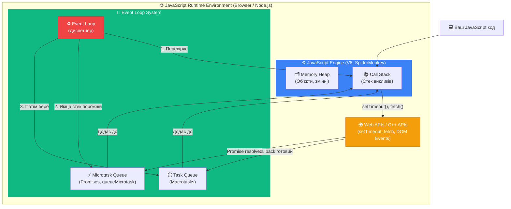
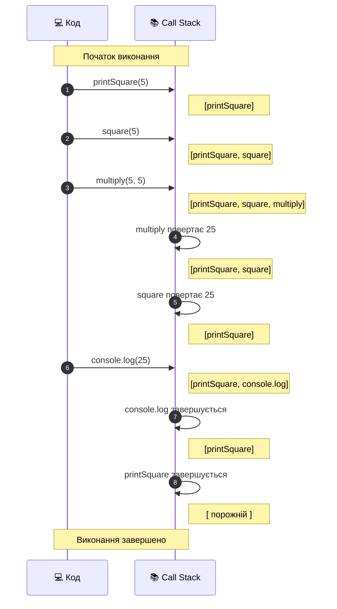
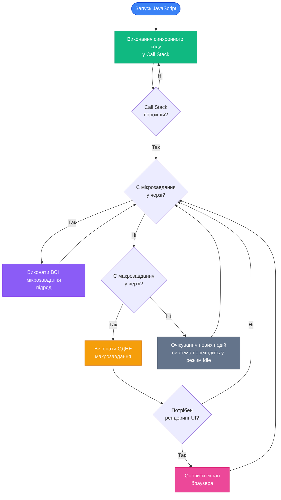
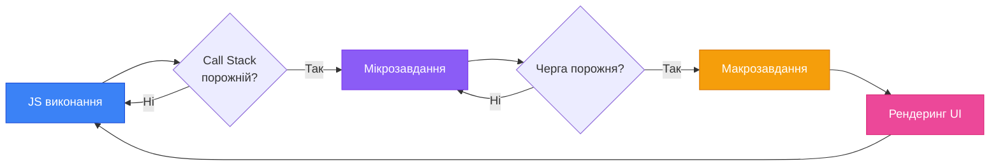

# Event Loop: серце асинхронності в JavaScript

## Чому JavaScript однопотоковий, але не блокується?

Уявіть типову веб-сторінку: користувач натискає кнопку, яка надсилає запит на сервер для завантаження даних. Якби JavaScript працював синхронно, інтерфейс повністю заморожувався б на час очікування відповіді — неможливо було б натиснути інші кнопки, прокрутити сторінку або навіть побачити анімацію завантаження.

Але ми знаємо, що насправді цього не відбувається. Браузер залишається відгукуючим навіть під час виконання тривалих операцій. Секрет цієї магії криється в **Event Loop** (*цикл подій*) — фундаментальному механізмі, який дозволяє JavaScript бути **однопотоковим** (*single-threaded*), але при цьому **асинхронним** (*asynchronous*).

::tip
**Ключова відмінність:**

- **Однопотоковий** означає, що JavaScript виконує код послідовно, по одній інструкції за раз у межах одного потоку.
- **Асинхронний** означає, що тривалі операції (мережеві запити, таймери, читання файлів) не блокують виконання іншого коду.

Ці два поняття здаються суперечливими, але Event Loop дозволяє їм співіснувати.

::

## Архітектурний контекст: JavaScript Runtime Environment

Перш ніж занурюватися в деталі Event Loop, важливо зрозуміти екосистему, в якій він працює. JavaScript-код не виконується у вакуумі — він функціонує у середовищі виконання (*runtime environment*), яке надає всі необхідні інструменти для асинхронної роботи.

### Компоненти JavaScript Runtime

::mermaid



::

Розберемо кожен компонент детально.

### Call Stack (Стек викликів функцій)

**Call Stack** — це структура даних типу стек (*Last In, First Out — LIFO*), яка відстежує поточне виконання коду. Коли викликається функція, вона додається на вершину стеку. Коли функція завершується, вона знімається зі стеку.

::card-group

::card{title="📥 Push (Додавання)" icon="i-lucide-arrow-down"}
Коли викликається функція, в стек додається **фрейм виконання** (*execution context*) з локальними змінними, аргументами та адресою повернення.

::

::card{title="📤 Pop (Видалення)" icon="i-lucide-arrow-up"}
Коли функція досягає `return` або завершується, її фрейм видаляється зі стеку, і керування повертається до попередньої функції.

::

::card{title="🔝 Вершина стеку" icon="i-lucide-layers"}
Функція на вершині стеку — це та, яка виконується **прямо зараз**. JavaScript може виконувати лише одну функцію одночасно.

::

::

**Приклад роботи стеку:**

```javascript
function multiply(a, b) {
    return a * b
}

function square(n) {
    return multiply(n, n)
}

function printSquare(num) {
    const result = square(num)
    console.log(result)
}

printSquare(5)
```

**Візуалізація виконання:**

::mermaid



::

::note
**Важлива властивість:** Call Stack є **синхронним** — код виконується послідовно, рядок за рядком. Якщо функція займає багато часу (наприклад, складні обчислення у циклі), весь інтерфейс браузера заблокується до завершення цієї функції.

::


### Stack Overflow: коли стек переповнюється

Оскільки Call Stack має обмежений розмір (зазвичай близько 10 000–50 000 фреймів, залежно від середовища), занадто глибока рекурсія може призвести до помилки **Stack Overflow** (*переповнення стеку*).

```javascript
function recursiveFunction() {
    recursiveFunction() // Викликає саму себе нескінченно
}

recursiveFunction()
// RangeError: Maximum call stack size exceeded
```

::warning
**Небезпека нескінченної рекурсії:**

Коли функція викликає саму себе без базового випадку (*base case*), стек продовжує зростати доти, доки не вичерпає доступну пам'ять. Це призводить до аварійного завершення скрипта.

**Правильна рекурсія завжди має умову виходу:**

```javascript
function factorial(n) {
    if (n <= 1) return 1 // Базовий випадок — зупиняє рекурсію
    return n * factorial(n - 1)
}

console.log(factorial(5)) // 120
```

::

### Memory Heap (Купа пам'яті)

На відміну від стеку, **Memory Heap** — це неструктурована область пам'яті, де зберігаються об'єкти, масиви, функції та інші складні структури даних. Примітивні значення (числа, рядки, булеві) зазвичай зберігаються безпосередньо у Call Stack, тоді як об'єкти створюються у купі, а у стеку зберігаються лише **посилання** (*references*) на них.

```javascript
function createUser() {
    const user = { name: 'Alice', age: 25 } // Об'єкт створюється у Heap
    return user // Повертається посилання на об'єкт
}

const alice = createUser() // alice містить посилання, а не сам об'єкт
```

::note
**Автоматичне управління пам'яттю:**

JavaScript використовує **Garbage Collector** (*збирач сміття*), який автоматично звільняє пам'ять від об'єктів, на які більше не посилається жодна змінна. Це відбувається у фоновому режимі та не блокує Event Loop.

::

### Web APIs: міст між JavaScript та браузером

JavaScript Engine (V8, SpiderMonkey, JavaScriptCore) сам по собі **не знає** про DOM, мережеві запити, таймери або події миші. Ці можливості надає **середовище виконання** — браузер (у випадку веб-застосунків) або Node.js (для серверного коду).

**Приклади Web APIs:**

::field-group

::field{name="setTimeout / setInterval" type="Timing API"}
Відкладене виконання коду. Таймер працює **поза** JavaScript Engine — у браузері або у C++ API Node.js.

::

::field{name="fetch / XMLHttpRequest" type="Network API"}
Мережеві запити виконуються у окремому потоці браузера, не блокуючи Call Stack.

::

::field{name="DOM Events (addEventListener)" type="Event API"}
Події миші, клавіатури, фокуса обробляються браузером. Коли подія спрацьовує, callback додається у чергу завдань.

::

::field{name="IndexedDB / Web Workers" type="Storage & Threading"}
Асинхронне сховище даних та можливість виконання JavaScript у окремих потоках (Web Workers).

::

::

**Ключовий момент:** Коли ви викликаєте `setTimeout()` або `fetch()`, JavaScript Engine **делегує** цю роботу Web API, звільняючи Call Stack для виконання іншого коду. Після завершення операції Web API розміщує callback-функцію у **чергу завдань** (*Task Queue*), звідки Event Loop згодом перенесе її назад у Call Stack.

::mermaid

```mermaid
sequenceDiagram
    participant JS as 💻 JavaScript Code
    participant Stack as 📚 Call Stack
    participant Web as 🌍 Web API (Browser)
    participant Queue as ⏱️ Task Queue
    participant Loop as ♻️ Event Loop
    
    JS->>Stack: setTimeout(callback, 1000)
    Stack->>Web: Передає таймер (1 секунда)
    Note over Stack: setTimeout завершився<br/>Stack порожній
    
    JS->>Stack: console.log('Hello')
    Note over Stack: Виконується одразу
    Stack->>Stack: Завершено
    
    Note over Web: ...Чекає 1 секунду...
    Web->>Queue: Таймер спрацював → додає callback
    
    Loop->>Stack: Перевіряє — порожній?
    Loop->>Queue: Бере callback з черги
    Queue->>Stack: Додає callback до стеку
    
    Stack->>Stack: Виконує callback
    Note over Stack: console.log('Timeout!')
```

::

## Event Loop: диригент оркестру

Тепер, коли ми розуміємо структуру середовища виконання, можемо перейти до самого **Event Loop**. Це безкінечний цикл, який постійно моніторить стан Call Stack та черг завдань, виконуючи просту, але критично важливу роль:

> **Якщо Call Stack порожній, Event Loop бере наступне завдання з черги та додає його до стеку.**

Це і є вся суть Event Loop — він **синхронізує** асинхронні операції, забезпечуючи, що callback-функції виконуються у правильний момент, не блокуючи основний потік.

### Псевдокод Event Loop

```javascript
// Спрощена модель Event Loop
while (true) {
    // Фаза 1: Виконати всі мікрозавдання (Microtasks)
    while (microtaskQueue.length > 0) {
        const microtask = microtaskQueue.shift()
        executeInCallStack(microtask)
    }

    // Фаза 2: Перевірити, чи є макрозавдання (Macrotasks)
    if (taskQueue.length > 0) {
        const task = taskQueue.shift()
        executeInCallStack(task)
    }

    // Фаза 3: Рендеринг (якщо потрібно оновити UI)
    if (needsRendering()) {
        renderUI()
    }

    // Якщо немає завдань — очікувати нових подій
    if (taskQueue.length === 0 && microtaskQueue.length === 0) {
        waitForEvents()
    }
}
```

::note
**Важливо розуміти:**

Event Loop — це **не частина JavaScript Engine**. Це механізм **середовища виконання** (браузера або Node.js), який координує роботу JavaScript з асинхронними API.

У браузері Event Loop також відповідає за оновлення UI (рендеринг), тоді як у Node.js він керує файловою системою, мережевими сокетами та іншими системними ресурсами.

::

### Дві категорії завдань: Macrotasks та Microtasks

Event Loop працює з **двома чергами завдань**, які мають різні пріоритети виконання:


::card-group

::card{title="⏱️ Macrotasks (Макрозавдання)" icon="i-lucide-clock"}

**Важкі** асинхронні операції, які виконуються **по одному за ітерацію** Event Loop:

- `setTimeout`, `setInterval`
- `setImmediate` (Node.js)
- UI рендеринг (браузер)
- I/O операції (читання файлів у Node.js)
- DOM Events callbacks

::

::card{title="⚡ Microtasks (Мікрозавдання)" icon="i-lucide-zap"}

**Легкі** завдання з **вищим пріоритетом**, які виконуються **всі підряд** перед наступним макрозавданням:

- `Promise.then()`, `Promise.catch()`, `Promise.finally()`
- `queueMicrotask(callback)`
- `MutationObserver` (браузер)
- `process.nextTick()` (Node.js — навіть вищий пріоритет за проміси)

::

::

**Ключове правило:**

::tip
**Пріоритет виконання Event Loop:**

1. **Call Stack** — виконується поточний синхронний код до кінця
2. **Microtask Queue** — виконуються **всі** мікрозавдання підряд
3. **Macrotask Queue** — виконується **одне** макрозавдання
4. Повернення до кроку 2 (знову всі мікрозавдання)
5. Рендеринг (якщо потрібно)
6. Перехід до наступного макрозавдання

**Висновок:** Мікрозавдання завжди виконуються раніше за макрозавдання, навіть якщо макрозавдання було додане першим!

::

### Практичний приклад: порядок виконання

Розгляньмо складний приклад, який демонструє взаємодію всіх компонентів Event Loop:

```javascript
console.log('1: Синхронний код - Start')

setTimeout(() => {
    console.log('2: setTimeout (Macrotask)')
}, 0)

Promise.resolve()
    .then(() => {
        console.log('3: Promise.then (Microtask 1)')
        return Promise.resolve()
    })
    .then(() => {
        console.log('4: Promise.then (Microtask 2)')
    })

queueMicrotask(() => {
    console.log('5: queueMicrotask (Microtask 3)')
})

console.log('6: Синхронний код - End')
```

**Який буде порядок виводу?**

::accordion

::accordion-item{label="❓ Спробуйте вгадати порядок самостійно" icon="i-lucide-help-circle"}

Перш ніж переглядати відповідь, спробуйте проаналізувати код та передбачити послідовність виконання. Згадайте про пріоритети: синхронний код → мікрозавдання → макрозавдання.

::

::accordion-item{label="✅ Правильна відповідь та пояснення" icon="i-lucide-check-circle"}

**Фактичний вивід:**

```
1: Синхронний код - Start
6: Синхронний код - End
3: Promise.then (Microtask 1)
5: queueMicrotask (Microtask 3)
4: Promise.then (Microtask 2)
2: setTimeout (Macrotask)
```

**Покрокове пояснення:**

**Крок 1: Виконання синхронного коду**

- `console.log('1: ...')` — виводиться одразу
- `setTimeout(...)` — callback відправляється до Web API, таймер стартує
- `Promise.resolve().then(...)` — проміс вже виконаний, `.then()` додається до **Microtask Queue**
- `queueMicrotask(...)` — додається до **Microtask Queue**
- `console.log('6: ...')` — виводиться одразу

**Стан після синхронного коду:**

- Call Stack: **порожній**
- Microtask Queue: `[Promise.then (3), queueMicrotask (5)]`
- Macrotask Queue: `[setTimeout (2)]` — чекає завершення таймера

**Крок 2: Event Loop виконує ВСІ мікрозавдання**

- Виконується перший `.then()` → виводить `'3: ...'`
- Цей `.then()` повертає новий проміс → другий `.then()` додається до черги мікрозавдань
- Виконується `queueMicrotask` → виводить `'5: ...'`
- Виконується другий `.then()` → виводить `'4: ...'`

**Крок 3: Event Loop бере ОДНЕ макрозавдання**

- Таймер завершився (0 мс пройшло) → callback `setTimeout` виконується
- Виводить `'2: ...'`

**Важливо:** Навіть якщо `setTimeout` був викликаний раніше за проміси, він виконується **останнім**, бо макрозавдання мають нижчий пріоритет.

::

::

### Візуалізація життєвого циклу Event Loop

::mermaid



::

## Реальний приклад: завантаження даних з API

Тепер застосуємо знання про Event Loop до практичного сценарію — асинхронного завантаження даних з API.

```javascript
console.log('🚀 Початок завантаження даних')

// Симуляція API запиту
function fetchUser(userId) {
    return fetch(`https://jsonplaceholder.typicode.com/users/${userId}`)
        .then((response) => response.json())
        .then((user) => {
            console.log(`✅ Користувач отриманий: ${user.name}`)
            return user
        })
}

// Виконання
fetchUser(1).then((user) => {
    console.log(`📧 Email: ${user.email}`)
})

setTimeout(() => {
    console.log('⏰ Таймер спрацював (500 мс)')
}, 500)

console.log('🔄 Код продовжує виконуватися')
```

**Порядок виконання:**

::steps

### Крок 1: Синхронний код

Виконується `console.log('🚀 ...')`, потім викликається `fetchUser(1)`. Функція `fetch()` делегує HTTP-запит браузеру (Web API), а сама одразу повертає проміс у стані `pending`.

Далі реєструється таймер `setTimeout` (також делегується Web API) та виводиться `console.log('🔄 ...')`.

**Вивід:**

```
🚀 Початок завантаження даних
🔄 Код продовжує виконуватися
```

### Крок 2: Очікування відповіді сервера

Call Stack порожній. Event Loop перевіряє черги — поки що вони теж порожні. JavaScript "спить" у режимі очікування подій.

### Крок 3: Відповідь від сервера (припустимо, через 200 мс)

Браузер отримує відповідь від API. Callback з першого `.then()` (парсинг JSON) додається до **Microtask Queue**.

Event Loop виконує мікрозавдання:

- Парситься JSON
- Виводиться `console.log('✅ Користувач отриманий: ...')`
- Повертається об'єкт `user`, що запускає наступний `.then()`

Другий callback також є мікрозавданням і виконується одразу:

- Виводиться `console.log('📧 Email: ...')`

### Крок 4: Таймер спрацьовує (через 500 мс)

Callback з `setTimeout` додається до **Macrotask Queue**. Event Loop бере його після того, як всі мікрозавдання завершені.

**Вивід:**

```
⏰ Таймер спрацював (500 мс)
```

::

**Повний вивід програми:**

::terminal-preview{title="node app.js"}

<div class="line"><span class="opacity-40">$</span> <strong class="font-bold">node app.js</strong></div>
<div class="line"><span class="text-blue-400">🚀</span> Початок завантаження даних</div>
<div class="line"><span class="text-blue-400">🔄</span> Код продовжує виконуватися</div>
<div class="line"><span class="text-green-400">✅</span> Користувач отриманий: Leanne Graham</div>
<div class="line"><span class="text-blue-400">📧</span> Email: Sincere@april.biz</div>
<div class="line"><span class="text-yellow-400">⏰</span> Таймер спрацював (500 мс)</div>

::


## Типові помилки розуміння Event Loop

Навіть досвідчені розробники іноді припускаються концептуальних помилок при роботі з асинхронним кодом. Розгляньмо найпоширеніші непорозуміння.

### Помилка 1: "setTimeout з нульовою затримкою виконається одразу"

```javascript
console.log('1')

setTimeout(() => {
    console.log('2')
}, 0) // Затримка 0 мілісекунд!

console.log('3')
```

**Що виведе цей код?**

::accordion

::accordion-item{label="❓ Чому не '1', '2', '3'?" icon="i-lucide-help-circle"}

Багато початківців очікують, що затримка `0` означає "виконати негайно". Але насправді `setTimeout` **завжди** є макрозавданням і потрапляє до черги.

**Фактичний вивід:**

```
1
3
2
```

**Пояснення:**

1. `console.log('1')` — синхронний код, виконується одразу
2. `setTimeout(..., 0)` — callback відправляється до **Macrotask Queue**
3. `console.log('3')` — синхронний код, виконується одразу
4. Call Stack порожній → Event Loop бере callback з черги макрозавдань
5. Виконується `console.log('2')`

**Висновок:** Мінімальна затримка `setTimeout` — це не гарантія часу виконання, а лише час, після якого callback **може бути доданий до черги**. Реальне виконання відбудеться, коли Event Loop дійде до цього завдання.

::

::

### Помилка 2: "Проміси виконуються паралельно"

```javascript
console.log('Start')

Promise.resolve()
    .then(() => {
        console.log('Promise 1')
        // Важкі обчислення
        for (let i = 0; i < 1e9; i++) {}
    })
    .then(() => {
        console.log('Promise 2')
    })

console.log('End')
```

**Чи заблокується основний потік під час виконання циклу у промісі?**

::accordion

::accordion-item{label="❓ Відповідь та пояснення" icon="i-lucide-help-circle"}

**Так, заблокується!**

Проміси **не створюють паралельності**. Коли `.then()` виконується, його код потрапляє у Call Stack і працює **синхронно**. Важкий цикл `for` заблокує Event Loop доти, доки не завершиться.

**Порядок виводу:**

```
Start
End
Promise 1
(довга пауза — UI заморожується)
Promise 2
```

**Як уникнути блокування:**

1. **Розбити роботу на шматки** через `setTimeout`:

```javascript
function heavyTask(iterations) {
    const chunkSize = 1e6
    let processed = 0

    function processChunk() {
        const end = Math.min(processed + chunkSize, iterations)

        for (let i = processed; i < end; i++) {
            // Обчислення
        }

        processed = end

        if (processed < iterations) {
            setTimeout(processChunk, 0) // Дає Event Loop "подихати"
        } else {
            console.log('Завершено')
        }
    }

    processChunk()
}
```

2. **Використовувати Web Workers** для справжньої паралельності (окремий потік):

```javascript
// main.js
const worker = new Worker('worker.js')
worker.postMessage({ iterations: 1e9 })
worker.onmessage = (e) => {
    console.log('Результат:', e.data)
}

// worker.js
self.onmessage = (e) => {
    let sum = 0
    for (let i = 0; i < e.data.iterations; i++) {
        sum += i
    }
    self.postMessage(sum)
}
```

::

::

### Помилка 3: "Рекурсивні проміси безпечніші за рекурсивні функції"

```javascript
function recursivePromise(n) {
    if (n === 0) return Promise.resolve('Done')

    return Promise.resolve(n).then(() => {
        return recursivePromise(n - 1)
    })
}

recursivePromise(100000) // Чи призведе до Stack Overflow?
```

::accordion

::accordion-item{label="❓ Аналіз проблеми" icon="i-lucide-help-circle"}

**Ні, Stack Overflow не відбудеться** (у більшості сучасних движків).

**Чому?**

Кожен виклик `.then()` створює **нове мікрозавдання**, яке додається до черги. Коли мікрозавдання виконується, попередній фрейм вже знятий зі стеку.

**Візуалізація:**

```javascript
// Ітерація 1:
recursivePromise(3) // Додає .then() до Microtask Queue, завершується

// Event Loop виконує мікрозавдання:
// → .then() викликає recursivePromise(2)
// → Новий .then() додається до черги
// → Call Stack знову порожній

// Ітерація 2:
// → .then() викликає recursivePromise(1)
// → Черга зростає, але стек не накопичується

// Ітерація 3:
// → .then() викликає recursivePromise(0)
// → Повертається 'Done', рекурсія завершується
```

**Але є пастка!**

Хоча Stack Overflow не відбудеться, **Microtask Queue переповниться**, і Event Loop заблокується. Браузер не зможе обробити нові події, оновити UI або виконати макрозавдання — сторінка зависне.

**Правильний підхід — використовувати `async/await` з перервами:**

```javascript
async function safeRecursion(n) {
    for (let i = n; i > 0; i--) {
        if (i % 1000 === 0) {
            await new Promise((resolve) => setTimeout(resolve, 0)) // Даємо Event Loop опрацювати інші задачі
        }
    }
    return 'Done'
}
```

::

::

## Взаємодія Event Loop з рендерингом браузера

Одна з найважливіших особливостей Event Loop у браузері — його зв'язок з **оновленням UI** (*rendering*). Браузер не може оновити екран під час виконання JavaScript-коду — він чекає, доки Call Stack стане порожнім.

### Цикл "JavaScript → Rendering"

::mermaid



::

**Що це означає на практиці?**

```javascript
const button = document.getElementById('btn')
const status = document.getElementById('status')

button.addEventListener('click', () => {
    status.textContent = 'Обробка...'

    // Важкі обчислення
    for (let i = 0; i < 1e9; i++) {}

    status.textContent = 'Завершено'
})
```

**Проблема:** Користувач **ніколи не побачить** текст "Обробка...", бо браузер не встигне оновити DOM до завершення циклу. Він одразу відобразить "Завершено".

**Рішення — дати браузеру час на рендеринг:**

```javascript
button.addEventListener('click', async () => {
    status.textContent = 'Обробка...'

    // Даємо Event Loop виконати рендеринг
    await new Promise((resolve) => setTimeout(resolve, 0))

    // Тепер важкі обчислення
    for (let i = 0; i < 1e9; i++) {}

    status.textContent = 'Завершено'
})
```

::tip
**requestAnimationFrame для анімацій:**

Якщо потрібно синхронізувати код з оновленням екрана (60 FPS), використовуйте `requestAnimationFrame`:

```javascript
function animate() {
    // Код анімації виконується перед наступним кадром
    element.style.transform = `translateX(${position}px)`

    if (position < 500) {
        requestAnimationFrame(animate)
    }
}

requestAnimationFrame(animate)
```

`requestAnimationFrame` має **вищий пріоритет за setTimeout** та виконується синхронізовано з частотою оновлення екрана.

::

## Підсумок: ключові висновки

::card-group

::card{title="🧵 Однопотоковість" icon="i-lucide-layers"}
JavaScript виконує код послідовно у Call Stack. Паралельність досягається делегуванням роботи Web APIs та Event Loop.

::

::card{title="♻️ Event Loop — це диспетчер" icon="i-lucide-refresh-cw"}
Цикл подій координує виконання асинхронних операцій, забираючи завдання з черг та додаючи їх до стеку.

::

::card{title="⚡ Мікрозавдання мають пріоритет" icon="i-lucide-zap"}
Проміси та `queueMicrotask` виконуються **раніше** за `setTimeout`, навіть якщо додані пізніше.

::

::card{title="🎨 Рендеринг чекає на порожній стек" icon="i-lucide-monitor"}
Браузер оновлює UI лише коли Call Stack порожній. Тривалий синхронний код блокує інтерфейс.

::

::

::note
**Наступні кроки:**

У наступній статті ми детальніше розглянемо **Task Queue та Microtask Queue**: чому існують дві черги, як працює `process.nextTick()` у Node.js, та які підводні камені можуть виникнути при складних сценаріях взаємодії макрозавдань і мікрозавдань.

::
