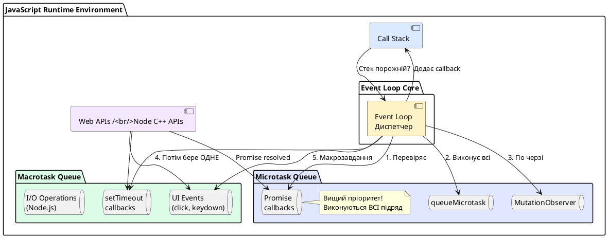
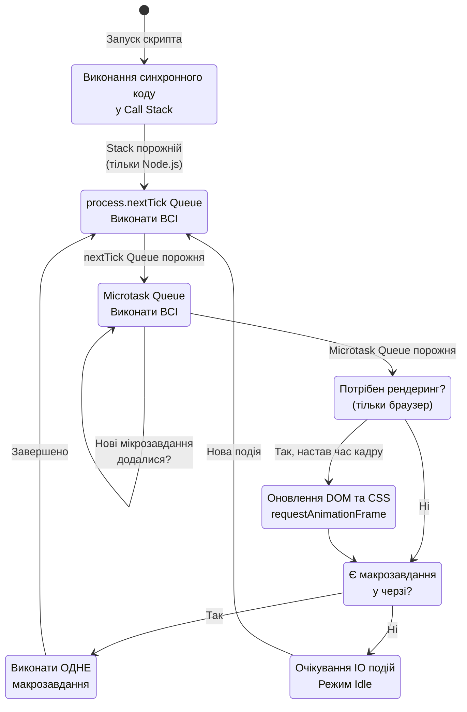

# Task Queue та Microtask Queue: пріоритети виконання

## Навіщо дві черги завдань?

У попередній лекції ми дізналися, що Event Loop працює з двома типами завдань: **macrotasks** (*макрозавдання*) та **microtasks** (*мікрозавдання*). На перший погляд це може здатися надлишковою складністю — чому б просто не мати одну чергу завдань за принципом FIFO (*First In, First Out*)?

Відповідь криється у **різних вимогах до продуктивності та реактивності**. Асинхронні операції мають різні характеристики:

::card-group

::card{title="⏱️ Macrotasks: важкі операції" icon="i-lucide-clock"}

**Призначення:** Обробка зовнішніх подій та тривалих операцій

**Характеристики:**

- Можуть тривати довго (десятки мілісекунд)
- Пов'язані з IO операціями
- Можуть викликати рендеринг UI між виконанням

**Приклади:** `setTimeout`, події миші/клавіатури, мережеві запити

::

::card{title="⚡ Microtasks: швидкі реакції" icon="i-lucide-zap"}

**Призначення:** Негайна реакція на зміни стану

**Характеристики:**

- Мають виконуватися якнайшвидше (мікросекунди)
- Не повинні блокувати надовго
- Виконуються **всі підряд** перед рендерингом

**Приклади:** `Promise.then()`, `queueMicrotask()`, `MutationObserver`

::

::

**Історична причина:** Коли ECMAScript 2015 (ES6) представив `Promise`, виникла потреба у механізмі, який гарантував би **негайне** виконання `.then()` callbacks після резолвінгу проміса. Додавати їх до звичайної черги макрозавдань (разом з `setTimeout`) означало б непередбачувані затримки.

::note
**Аналогія з реального світа:**

Уявіть відділення банку:

- **Macrotasks** — звичайна черга клієнтів, яких обслуговують по одному. Між клієнтами співробітник може виконати інші справи (аналог рендерингу UI).
- **Microtasks** — термінові повідомлення, які співробітник зобов'язаний опрацювати **всі підряд** відразу після завершення обслуговування клієнта, перш ніж взяти наступного.

::

## Детальна архітектура черг завдань

Для глибшого розуміння розгляньмо внутрішню структуру Event Loop з точки зору управління чергами.

::plant-uml{alt="Архітектура черг Event Loop"}



::

### Життєвий цикл однієї ітерації Event Loop

Розгляньмо детально, що відбувається за одну повну ітерацію (*tick*) Event Loop:

::steps

### Фаза 1: Виконання поточного завдання у Call Stack

Event Loop чекає, доки Call Stack повністю не звільниться. Жоден callback не може бути доданий до стеку, поки там виконується код.

**Приклад:**

```javascript
function processData() {
    console.log('Processing...')
    // Складні обчислення
    for (let i = 0; i < 1e6; i++) {}
    console.log('Done')
}

processData() // Виконується до кінця, Event Loop чекає
```

### Фаза 2: Спустошення Microtask Queue (Checkpoint)

Коли стек стає порожнім, Event Loop **обов'язково** виконує **всі** мікрозавдання, які є у черзі. Це називається **microtask checkpoint** (*контрольна точка мікрозавдань*).

::warning
**Критично важливо:** Якщо під час виконання мікрозавдання додаються нові мікрозавдання, вони теж виконуються у цій же фазі. Це може призвести до **безкінечного циклу мікрозавдань**, що заблокує Event Loop!

::

**Приклад нескінченного циклу:**

```javascript
function recursiveMicrotask() {
    queueMicrotask(() => {
        console.log('Microtask')
        recursiveMicrotask() // Додає нове мікрозавдання
    })
}

recursiveMicrotask()
// Консоль буде спамитися "Microtask", браузер зависне
// Макрозавдання НІКОЛИ не виконаються
```

### Фаза 3: Перевірка необхідності рендерингу (тільки браузер)

Після завершення всіх мікрозавдань браузер оцінює, чи потрібно оновити екран. Рендеринг не відбувається після кожного макрозавдання — браузер намагається підтримувати 60 FPS (один кадр кожні ~16.67 мс).

**Умови рендерингу:**

- Минуло достатньо часу з попереднього кадру
- Є зміни у DOM або CSS
- Є анімації через `requestAnimationFrame`

### Фаза 4: Виконання ОДНОГО макрозавдання

Event Loop бере **перше** завдання з Macrotask Queue та додає його до Call Stack. Після завершення цього макрозавдання цикл повертається до **Фази 2** (знову перевіряє мікрозавдання).

**Важливо:** Лише **одне** макрозавдання за ітерацію. Це гарантує, що мікрозавдання та рендеринг мають шанс виконатися між важкими операціями.

::

### Псевдокод повного циклу

```javascript
while (eventLoop.isRunning) {
    // Фаза 1: Чекаємо на порожній Call Stack
    if (!callStack.isEmpty()) {
        continue // Повертаємося на початок циклу
    }

    // Фаза 2: Microtask Checkpoint
    while (microtaskQueue.hasTasks()) {
        const microtask = microtaskQueue.dequeue()
        callStack.execute(microtask)

        // Якщо під час виконання додалися нові мікрозавдання — виконуємо їх теж
    }

    // Фаза 3: Рендеринг (тільки браузер)
    if (browser.needsRendering()) {
        browser.performRender()
    }

    // Фаза 4: Одне макрозавдання
    if (macrotaskQueue.hasTasks()) {
        const macrotask = macrotaskQueue.dequeue()
        callStack.execute(macrotask)
    } else {
        // Немає завдань — очікуємо нових подій
        eventLoop.waitForEvents()
    }
}
```

## Порівняння типів завдань

Для кращого розуміння розгляньмо детальну таблицю відмінностей:

| Характеристика | Macrotasks | Microtasks |
|:---|:---|:---|
| **Джерела** | `setTimeout`, `setInterval`, `setImmediate` (Node.js), IO callbacks, UI events | `Promise.then()`, `queueMicrotask()`, `async/await`, `MutationObserver`, `process.nextTick()` (Node.js) |
| **Кількість за ітерацію** | **Одне** завдання | **Всі** завдання підряд |
| **Пріоритет** | Нижчий | Вищий |
| **Рендеринг після виконання** | Може відбутися (якщо настав час кадру) | Ні, рендеринг лише після макрозавдання |
| **Ризик блокування** | Низький (одне за раз) | Високий (якщо генерують нові мікрозавдання) |
| **Типовий час виконання** | 4–10 мс (залежить від операції) | < 1 мс (має бути швидким) |
| **Призначення** | Важкі асинхронні операції | Швидка реакція на зміни стану |


## Складні сценарії взаємодії черг

Тепер, коли ми розуміємо базові принципи, розгляньмо реальні приклади, які часто спантеличують навіть досвідчених розробників.

### Сценарій 1: Вкладені проміси та таймери

```javascript
console.log('Start')

setTimeout(() => {
    console.log('Timeout 1')

    Promise.resolve().then(() => {
        console.log('Promise inside Timeout 1')
    })

    setTimeout(() => {
        console.log('Timeout 2')
    }, 0)
}, 0)

Promise.resolve()
    .then(() => {
        console.log('Promise 1')

        setTimeout(() => {
            console.log('Timeout 3')
        }, 0)
    })
    .then(() => {
        console.log('Promise 2')
    })

console.log('End')
```

**Який буде порядок виводу?**

::accordion

::accordion-item{label="🤔 Спробуйте передбачити результат" icon="i-lucide-brain"}

Перш ніж дивитися відповідь, проаналізуйте код покроково. Пам'ятайте:

1. Синхронний код виконується першим
2. Потім **всі** мікрозавдання
3. Потім **одне** макрозавдання
4. Знову всі мікрозавдання (якщо з'явилися нові)
5. І так далі...

::

::accordion-item{label="✅ Покрокове пояснення" icon="i-lucide-list-checks"}

**Фактичний вивід:**

```
Start
End
Promise 1
Promise 2
Timeout 1
Promise inside Timeout 1
Timeout 3
Timeout 2
```

**Детальний розбір:**

**Ітерація 0 (синхронний код):**

```javascript
console.log('Start') // Виводить "Start"
// setTimeout Timeout 1 → Macrotask Queue
// Promise 1 → Microtask Queue
console.log('End') // Виводить "End"
```

**Стан черг:**

- Call Stack: порожній
- Microtask Queue: `[Promise 1]`
- Macrotask Queue: `[Timeout 1]`

**Ітерація 1 (мікрозавдання):**

Event Loop виконує **всі** мікрозавдання:

```javascript
// Виконується Promise 1
console.log('Promise 1') // Виводить "Promise 1"
// setTimeout Timeout 3 → додається до Macrotask Queue
// .then() Promise 2 → додається до Microtask Queue

// Виконується Promise 2 (з'явився під час виконання мікрозавдань)
console.log('Promise 2') // Виводить "Promise 2"
```

**Стан черг:**

- Microtask Queue: порожня
- Macrotask Queue: `[Timeout 1, Timeout 3]`

**Ітерація 2 (макрозавдання Timeout 1):**

Виконується **перше** макрозавдання:

```javascript
console.log('Timeout 1') // Виводить "Timeout 1"
// Promise inside Timeout 1 → Microtask Queue
// setTimeout Timeout 2 → Macrotask Queue
```

**Стан черг:**

- Microtask Queue: `[Promise inside Timeout 1]`
- Macrotask Queue: `[Timeout 3, Timeout 2]`

**Ітерація 3 (мікрозавдання знову):**

Перш ніж взяти наступне макрозавдання, Event Loop виконує мікрозавдання:

```javascript
console.log('Promise inside Timeout 1') // Виводить "Promise inside Timeout 1"
```

**Ітерація 4 (макрозавдання Timeout 3):**

```javascript
console.log('Timeout 3') // Виводить "Timeout 3"
```

**Ітерація 5 (макрозавдання Timeout 2):**

```javascript
console.log('Timeout 2') // Виводить "Timeout 2"
```

**Ключовий висновок:**

Навіть якщо `Timeout 2` був створений раніше `Timeout 3` (у тілі `Timeout 1`), він виконується **пізніше**, бо `Timeout 3` вже був у черзі макрозавдань на момент завершення мікрозавдань після `Timeout 1`.

::

::

### Сценарій 2: Ланцюжок промісів з async/await

```javascript
console.log('1: Start')

async function asyncFunc() {
    console.log('2: Async function start')

    await Promise.resolve()

    console.log('3: After await')

    return 'Result'
}

asyncFunc().then((result) => {
    console.log('4: Then -', result)
})

Promise.resolve().then(() => {
    console.log('5: Promise 1')
})

console.log('6: End')
```

**Порядок виконання:**

::terminal-preview{title="node script.js"}

<div class="line"><span class="opacity-40">$</span> <strong class="font-bold">node script.js</strong></div>
<div class="line">1: Start</div>
<div class="line">2: Async function start</div>
<div class="line">6: End</div>
<div class="line">5: Promise 1</div>
<div class="line">3: After await</div>
<div class="line">4: Then - Result</div>

::

**Чому саме такий порядок?**

::accordion

::accordion-item{label="❓ Магія async/await" icon="i-lucide-wand-2"}

**Ключове розуміння:** `await` перетворюється на `.then()` під капотом.

Код:

```javascript
async function asyncFunc() {
    console.log('2: Async function start')
    await Promise.resolve()
    console.log('3: After await')
    return 'Result'
}
```

Приблизно еквівалентний:

```javascript
function asyncFunc() {
    console.log('2: Async function start')

    return Promise.resolve().then(() => {
        console.log('3: After await')
        return 'Result'
    })
}
```

**Покроковий розбір:**

1. `console.log('1: Start')` — синхронно
2. Викликається `asyncFunc()` → виконується синхронна частина до `await`
3. `console.log('2: Async function start')` — синхронно
4. `await Promise.resolve()` — додає наступний код у Microtask Queue
5. `Promise.resolve().then(...)` з "5: Promise 1" → Microtask Queue
6. `console.log('6: End')` — синхронно

**Стан Microtask Queue:** `[afterAwait, Promise1]`

7. Event Loop виконує мікрозавдання у порядку додавання:
    - Але! `Promise.resolve()` у `await` вже виконаний (resolved), тому його `.then()` додається **першим**
    - Фактична черга: `[Promise1, afterAwait]`

::warning
**Тонкість порядку:** У старих версіях V8 (до 2018) порядок міг відрізнятися. Сучасні специфікації ECMAScript гарантують, що `await` не додає зайвих мікрозавдань.

::

::

::

### Сценарій 3: Node.js — особливий випадок process.nextTick

У Node.js є додатковий API для роботи з чергами — `process.nextTick()`. Це **не мікрозавдання** у класичному розумінні, а окрема черга з **вищим пріоритетом** за проміси.

```javascript
console.log('Start')

setTimeout(() => {
    console.log('setTimeout')
}, 0)

Promise.resolve().then(() => {
    console.log('Promise')
})

process.nextTick(() => {
    console.log('nextTick')
})

console.log('End')
```

**Вивід у Node.js:**

::terminal-preview{title="node app.js"}

<div class="line"><span class="opacity-40">$</span> <strong class="font-bold">node app.js</strong></div>
<div class="line">Start</div>
<div class="line">End</div>
<div class="line"><span class="text-yellow-400 font-bold">nextTick</span></div>
<div class="line"><span class="text-blue-400">Promise</span></div>
<div class="line"><span class="text-green-400">setTimeout</span></div>

::

**Пріоритет у Node.js:**

1. **Синхронний код**
2. **nextTick Queue** — `process.nextTick()`
3. **Microtask Queue** — `Promise.then()`, `queueMicrotask()`
4. **Macrotask Queue** — `setTimeout`, `setImmediate`

::caution
**Небезпека nextTick:**

Оскільки `process.nextTick()` має найвищий пріоритет, рекурсивний виклик може **повністю заблокувати** Event Loop:

```javascript
function recursiveNextTick() {
    process.nextTick(() => {
        console.log('Tick')
        recursiveNextTick()
    })
}

recursiveNextTick()
// Макрозавдання, мікрозавдання та IO операції НІКОЛИ не виконаються
// Node.js process "зависне"
```

**Коли використовувати:**

- Коли потрібна гарантована послідовність виконання **перед** будь-якими IO операціями
- Для емуляції синхронного API через асинхронний (рідкісні випадки)

**Найкраща практика:** Використовуйте `queueMicrotask()` або `Promise.resolve().then()` замість `nextTick`, якщо немає специфічних причин.

::

## Візуалізація повного життєвого циклу Event Loop

Об'єднаймо всі знання у одну комплексну діаграму:

::mermaid



::


## Практичні патерни роботи з чергами

Розуміння механізмів черг дозволяє писати більш ефективний та передбачуваний асинхронний код. Розгляньмо корисні патерни.

### Патерн 1: Розбиття важкої роботи на шматки

Коли потрібно виконати ресурсомістку операцію (обробка великого масиву, складні обчислення), краще розбити її на частини, даючи Event Loop змогу обслуговувати інші події.

```javascript
async function processLargeArray(array, processItem) {
    const chunkSize = 100 // Обробляємо по 100 елементів за раз
    let index = 0

    while (index < array.length) {
        // Обробляємо шматок даних
        const chunk = array.slice(index, index + chunkSize)

        for (const item of chunk) {
            processItem(item)
        }

        index += chunkSize

        // Даємо Event Loop обробити інші завдання
        await new Promise((resolve) => setTimeout(resolve, 0))

        // Оновлюємо прогрес-бар (якщо є)
        updateProgressBar((index / array.length) * 100)
    }

    console.log('Обробка завершена')
}

// Використання
const data = Array.from({ length: 10000 }, (_, i) => i)

processLargeArray(data, (item) => {
    // Складна операція з кожним елементом
    Math.sqrt(item) * Math.PI
})
```

**Чому це працює?**

- `await new Promise(resolve => setTimeout(resolve, 0))` створює макрозавдання
- Між макрозавданнями Event Loop може виконати:
    - Мікрозавдання (проміси)
    - Оновлення UI (рендеринг)
    - Обробку подій користувача (кліки, прокрутка)

::tip
**Альтернатива для браузерів:** Використовуйте `requestIdleCallback` для виконання роботи у "вільний" час:

```javascript
function processWhenIdle(tasks) {
    function work(deadline) {
        while (tasks.length > 0 && deadline.timeRemaining() > 0) {
            const task = tasks.shift()
            task()
        }

        if (tasks.length > 0) {
            requestIdleCallback(work)
        }
    }

    requestIdleCallback(work)
}
```

::

### Патерн 2: Гарантований порядок виконання через мікрозавдання

Коли потрібно виконати код **одразу після** поточної операції, але **до** будь-яких макрозавдань, використовуйте `queueMicrotask`.

```javascript
class DataStore {
    constructor() {
        this.data = []
        this.listeners = []
    }

    add(item) {
        this.data.push(item)

        // Сповіщаємо підписників через мікрозавдання
        // Це гарантує, що всі синхронні операції завершилися
        queueMicrotask(() => {
            this.listeners.forEach((listener) => listener(item))
        })
    }

    subscribe(callback) {
        this.listeners.push(callback)
    }
}

// Використання
const store = new DataStore()

store.subscribe((item) => {
    console.log('Додано:', item)
})

store.add('Item 1')
store.add('Item 2')
store.add('Item 3')

console.log('Всі додавання завершені')

// Вивід:
// Всі додавання завершені
// Додано: Item 1
// Додано: Item 2
// Додано: Item 3
```

**Переваги мікрозавдань:**

- Всі синхронні операції (`add`) завершаться першими
- Listeners будуть викликані **до** будь-яких таймерів або IO операцій
- Batch-обробка подій (можна накопичити зміни та сповістити один раз)

### Патерн 3: Debounce через проміси

Класичний `debounce` з таймерами можна покращити за допомогою промісів для кращої інтеграції з `async/await`:

```javascript
function debounce(fn, delay) {
    let timeoutId
    let pendingPromise

    return function debounced(...args) {
        // Скасовуємо попередній виклик
        clearTimeout(timeoutId)

        // Створюємо новий проміс, якщо немає активного
        if (!pendingPromise) {
            pendingPromise = new Promise((resolve) => {
                timeoutId = setTimeout(async () => {
                    const result = await fn.apply(this, args)
                    resolve(result)
                    pendingPromise = null
                }, delay)
            })
        }

        return pendingPromise
    }
}

// Використання
const searchAPI = debounce(async (query) => {
    const response = await fetch(`/api/search?q=${query}`)
    return response.json()
}, 300)

// У обробнику input
input.addEventListener('input', async (e) => {
    const results = await searchAPI(e.target.value)
    displayResults(results)
})
```

**Переваги:**

- Можна використовувати `await` для отримання результату
- Автоматична обробка помилок через `.catch()`
- Краща інтеграція з сучасним асинхронним кодом

## Типові підводні камені та як їх уникати

### Пастка 1: Зациклювання мікрозавдань

```javascript
// ❌ НЕПРАВИЛЬНО — безкінечний цикл
let counter = 0

function infiniteMicrotasks() {
    queueMicrotask(() => {
        console.log(counter++)
        infiniteMicrotasks() // Додає нове мікрозавдання
    })
}

infiniteMicrotasks()

setTimeout(() => {
    console.log('Це НІКОЛИ не виконається')
}, 0)
```

**Проблема:** Microtask Queue ніколи не стане порожньою, тому Event Loop не дійде до макрозавдань.

**Рішення:**

```javascript
// ✅ ПРАВИЛЬНО — додаємо умову виходу
let counter = 0
const MAX_ITERATIONS = 1000

function safeMicrotasks() {
    queueMicrotask(() => {
        console.log(counter++)

        if (counter < MAX_ITERATIONS) {
            safeMicrotasks()
        }
    })
}
```

### Пастка 2: Очікування негайного виконання setTimeout(0)

```javascript
let value = 0

setTimeout(() => {
    value = 100
}, 0)

console.log(value) // 0, а не 100!
```

**Пояснення:** `setTimeout` додає callback до **Macrotask Queue**. Синхронний код (`console.log`) виконується **до** будь-яких макрозавдань.

**Правильний підхід:**

```javascript
let value = 0

Promise.resolve().then(() => {
    value = 100
    console.log(value) // 100
})

// Або async/await
async function updateValue() {
    await Promise.resolve()
    value = 100
    console.log(value)
}
```

### Пастка 3: Очікування рендерингу після зміни DOM

```javascript
// ❌ НЕПРАВИЛЬНО
button.addEventListener('click', () => {
    loadingSpinner.style.display = 'block'

    // Важкі обчислення
    for (let i = 0; i < 1e9; i++) {}

    loadingSpinner.style.display = 'none'
})

// Користувач НІКОЛИ не побачить спінер, бо рендеринг відбувається після завершення обробника
```

**Рішення:**

```javascript
// ✅ ПРАВИЛЬНО
button.addEventListener('click', async () => {
    loadingSpinner.style.display = 'block'

    // Даємо браузеру час відрендерити спінер
    await new Promise((resolve) => setTimeout(resolve, 0))

    // Важкі обчислення
    for (let i = 0; i < 1e9; i++) {}

    loadingSpinner.style.display = 'none'
})
```

::note
**Ще краще:** Винести важкі обчислення у Web Worker:

```javascript
button.addEventListener('click', () => {
    loadingSpinner.style.display = 'block'

    const worker = new Worker('heavy-task.js')

    worker.onmessage = (e) => {
        console.log('Результат:', e.data)
        loadingSpinner.style.display = 'none'
    }

    worker.postMessage({ iterations: 1e9 })
})
```

::

## Інструменти для діагностики черг

### Chrome DevTools: Performance Profiler

Chrome дозволяє візуалізувати роботу Event Loop через вкладку **Performance**:

::steps

### Крок 1: Відкрийте DevTools

Натисніть `F12` або `Cmd+Option+I` (macOS)

### Крок 2: Перейдіть до вкладки Performance

Натисніть кнопку **Record** (червоне коло)

### Крок 3: Виконайте операцію

Виконайте код, який потрібно проаналізувати (наприклад, натисніть кнопку на сторінці)

### Крок 4: Зупиніть запис

Натисніть **Stop**. Ви побачите timeline з:

- **Call Stack** — які функції виконувалися
- **Microtasks** — помічені як `Promise.then`
- **Macrotasks** — `setTimeout`, `Event listeners`
- **Rendering** — коли браузер оновлював екран

::

### Node.js: --trace-events

У Node.js можна увімкнути трейсинг подій:

```bash
node --trace-events-enabled --trace-event-categories v8,node.async_hooks script.js
```

Це створить файл `node_trace.*.log`, який можна відкрити у Chrome DevTools → **Performance** → **Load profile**.

## Підсумок: майстерність роботи з чергами

::card-group

::card{title="⚡ Мікрозавдання для швидкості" icon="i-lucide-zap"}

Використовуйте `Promise.then()` або `queueMicrotask()` для операцій, які мають виконатися якнайшвидше після поточного коду.

::

::card{title="⏱️ Макрозавдання для поділу роботи" icon="i-lucide-clock"}

Використовуйте `setTimeout(fn, 0)` для розбиття важких операцій та надання часу на рендеринг UI.

::

::card{title="🚫 Уникайте зациклювань" icon="i-lucide-alert-triangle"}

Завжди додавайте умови виходу для рекурсивних мікрозавдань. Пам'ятайте, що мікрозавдання можуть заблокувати Event Loop.

::

::card{title="🔍 Профілюйте продуктивність" icon="i-lucide-search"}

Використовуйте DevTools для виявлення вузьких місць. Довгі макрозавдання (>50 мс) — це червоний прапорець для оптимізації.

::

::

::note
**Наступна стаття:**

У фінальній лекції ми розглянемо **асинхронні патерни та Best Practices**: від callbacks до async/await, обробку помилок, паралельне виконання промісів, race conditions та архітектурні підходи до побудови масштабованих асинхронних систем.

::
