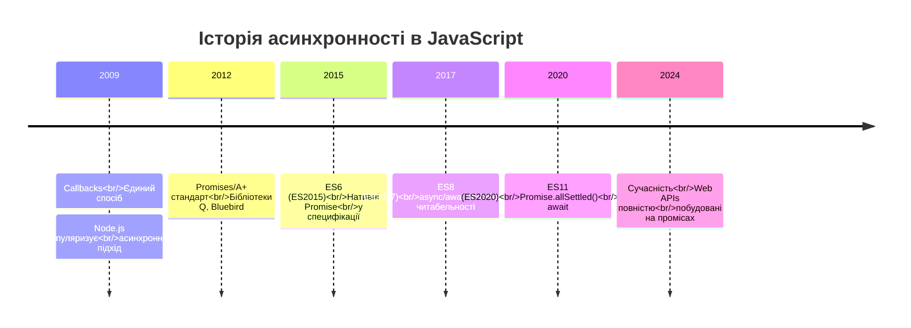
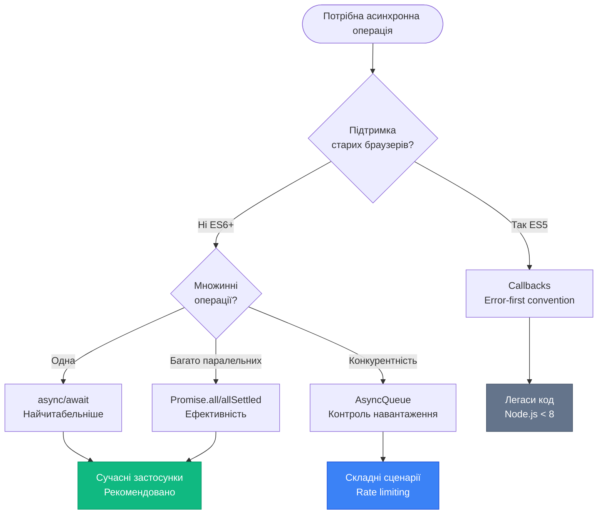

# Асинхронні патерни: від Callbacks до Async/Await

## Еволюція асинхронності в JavaScript

JavaScript пройшов довгий шлях у розвитку підходів до роботи з асинхронним кодом. Кожен новий патерн вирішував проблеми попереднього, поступово наближаючись до ідеалу — коду, який читається як синхронний, але працює асинхронно.

::mermaid



::

Розгляньмо кожен підхід детально, аналізуючи переваги, недоліки та сценарії використання.

## Callbacks: фундамент асинхронності

**Callback** (*функція зворотного виклику*) — це функція, яка передається як аргумент іншій функції та викликається після завершення асинхронної операції.

### Базовий приклад

```javascript
// Читання файлу у Node.js
const fs = require('fs')

fs.readFile('data.txt', 'utf8', (error, data) => {
    if (error) {
        console.error('Помилка читання файлу:', error)
        return
    }

    console.log('Вміст файлу:', data)
})

console.log('Файл читається...')
```

**Порядок виконання:**

1. `fs.readFile()` ініціює асинхронне читання файлу (делегує файловій системі)
2. `console.log('Файл читається...')` виконується одразу (синхронно)
3. Коли файл прочитаний, callback додається до **Macrotask Queue**
4. Event Loop викликає callback з результатом (`error` або `data`)

### Конвенція Error-First Callbacks

У Node.js та багатьох бібліотеках прийнято передавати **помилку першим аргументом**:

```javascript
function asyncOperation(params, callback) {
    // Симуляція асинхронної операції
    setTimeout(() => {
        const success = Math.random() > 0.5

        if (success) {
            callback(null, 'Результат операції') // Помилки немає
        } else {
            callback(new Error('Операція не вдалася'), null)
        }
    }, 1000)
}

// Використання
asyncOperation({ id: 1 }, (error, result) => {
    if (error) {
        console.error('Сталася помилка:', error.message)
        return
    }

    console.log('Успіх:', result)
})
```

**Переваги конвенції:**

- Уніфікований спосіб обробки помилок
- Неможливо забути перевірити помилку (вона завжди перший параметр)
- Легко інтегрується з проміс-обгортками

### Callback Hell (Пекло колбеків)

Головна проблема callbacks — **вкладеність**. Коли потрібно виконати кілька асинхронних операцій послідовно, код перетворюється на нечитабельну піраміду:

```javascript
// ❌ Приклад "Callback Hell"
getUser(userId, (userError, user) => {
    if (userError) {
        console.error(userError)
        return
    }

    getOrders(user.id, (ordersError, orders) => {
        if (ordersError) {
            console.error(ordersError)
            return
        }

        getOrderDetails(orders[0].id, (detailsError, details) => {
            if (detailsError) {
                console.error(detailsError)
                return
            }

            getShippingInfo(details.trackingId, (shippingError, shipping) => {
                if (shippingError) {
                    console.error(shippingError)
                    return
                }

                console.log('Інформація про доставку:', shipping)
                // І так далі... піраміда зростає
            })
        })
    })
})
```

**Проблеми цього підходу:**

::field-group

::field{name="Читабельність" type="Problem"}
Код "тече" вправо замість вниз. Важко відстежити логіку виконання.

::

::field{name="Обробка помилок" type="Problem"}
Кожен рівень потребує окремої перевірки `if (error)`. Легко пропустити помилку.

::

::field{name="Повторне використання" type="Problem"}
Важко виділити частину логіки у окрему функцію без передачі множини callbacks.

::

::field{name="Композиція" type="Problem"}
Неможливо елегантно комбінувати асинхронні операції (паралельне виконання, обробка масиву тощо).

::

::

### Рішення через іменовані функції

Один зі способів покращити читабельність — винести кожен callback у іменовану функцію:

```javascript
// ✅ Покращення через іменовані функції
function handleShippingInfo(shippingError, shipping) {
    if (shippingError) {
        console.error(shippingError)
        return
    }
    console.log('Інформація про доставку:', shipping)
}

function handleOrderDetails(detailsError, details) {
    if (detailsError) {
        console.error(detailsError)
        return
    }
    getShippingInfo(details.trackingId, handleShippingInfo)
}

function handleOrders(ordersError, orders) {
    if (ordersError) {
        console.error(ordersError)
        return
    }
    getOrderDetails(orders[0].id, handleOrderDetails)
}

function handleUser(userError, user) {
    if (userError) {
        console.error(userError)
        return
    }
    getOrders(user.id, handleOrders)
}

// Точка входу
getUser(userId, handleUser)
```

**Покращення:** Код тепер читається зверху вниз. Кожна функція має одну відповідальність.

**Але:** Все одно залишаються проблеми з повторною обробкою помилок та складністю композиції операцій.

## Promises: революція асинхронності

**Promise** (*обіцянка*) — це об'єкт, який представляє майбутній результат асинхронної операції. Проміс може знаходитися у трьох станах:

::card-group

::card{title="⏳ Pending (Очікування)" icon="i-lucide-clock"}
Початковий стан. Операція ще не завершена.

::

::card{title="✅ Fulfilled (Виконано)" icon="i-lucide-check-circle"}
Операція успішно завершена, результат доступний.

::

::card{title="❌ Rejected (Відхилено)" icon="i-lucide-x-circle"}
Операція завершилася з помилкою.

::

::

### Створення промісів

```javascript
// Базовий приклад
const promise = new Promise((resolve, reject) => {
    // Асинхронна операція
    setTimeout(() => {
        const success = Math.random() > 0.5

        if (success) {
            resolve('Операція успішна') // Переводить проміс у стан Fulfilled
        } else {
            reject(new Error('Операція не вдалася')) // Переводить у стан Rejected
        }
    }, 1000)
})

// Обробка результату
promise
    .then((result) => {
        console.log('Успіх:', result)
    })
    .catch((error) => {
        console.error('Помилка:', error.message)
    })
    .finally(() => {
        console.log('Операція завершена (успішно чи ні)')
    })
```

**Ключові особливості:**

- Проміс завжди знаходиться у **одному** з трьох станів
- Стан змінюється **один раз** (неможливо "перевиконати" проміс)
- `.then()`, `.catch()`, `.finally()` завжди повертають **новий** проміс (ланцюжок)

### Переписуємо Callback Hell через проміси

```javascript
// ✅ Плоский ланцюжок промісів
getUser(userId)
    .then((user) => {
        console.log('Користувач:', user.name)
        return getOrders(user.id) // Повертаємо новий проміс
    })
    .then((orders) => {
        console.log('Замовлення:', orders.length)
        return getOrderDetails(orders[0].id)
    })
    .then((details) => {
        console.log('Деталі:', details)
        return getShippingInfo(details.trackingId)
    })
    .then((shipping) => {
        console.log('Доставка:', shipping)
    })
    .catch((error) => {
        // Централізована обробка помилок на будь-якому етапі
        console.error('Помилка у ланцюжку:', error)
    })
    .finally(() => {
        console.log('Завершення обробки замовлення')
    })
```

**Переваги:**

1. **Плоска структура** — код читається зверху вниз
2. **Централізована обробка помилок** — один `.catch()` для всього ланцюжка
3. **Композиція** — легко додавати нові етапи у ланцюжок


### Комбінування промісів

Promise API надає потужні методи для роботи з множинними асинхронними операціями:

::tabs

::tabs-item{label="Promise.all()"}

Чекає завершення **всіх** промісів. Якщо хоча б один відхиляється — відхиляє весь результат.

```javascript
// Паралельне завантаження даних
Promise.all([
    fetch('/api/user/1').then((r) => r.json()),
    fetch('/api/user/2').then((r) => r.json()),
    fetch('/api/user/3').then((r) => r.json()),
])
    .then(([user1, user2, user3]) => {
        console.log('Всі користувачі завантажені:', user1, user2, user3)
    })
    .catch((error) => {
        console.error('Помилка завантаження:', error)
        // Якщо хоча б один запит не вдався — потрапимо сюди
    })
```

**Коли використовувати:** Всі операції критично важливі, і якщо одна не вдається — не має сенсу продовжувати.

::

::tabs-item{label="Promise.allSettled()"}

Чекає завершення **всіх** промісів незалежно від результату (виконано чи відхилено).

```javascript
Promise.allSettled([
    fetch('/api/user/1').then((r) => r.json()),
    fetch('/api/user/2').then((r) => r.json()), // Припустимо, цей запит не вдасться
    fetch('/api/user/3').then((r) => r.json()),
]).then((results) => {
    results.forEach((result, index) => {
        if (result.status === 'fulfilled') {
            console.log(`User ${index + 1}:`, result.value)
        } else {
            console.error(`User ${index + 1} failed:`, result.reason)
        }
    })
})
```

**Результат:**

```javascript
;[
    { status: 'fulfilled', value: { id: 1, name: 'Alice' } },
    { status: 'rejected', reason: Error('Network error') },
    { status: 'fulfilled', value: { id: 3, name: 'Charlie' } },
]
```

**Коли використовувати:** Потрібно отримати всі результати, навіть якщо частина операцій не вдалася.

::

::tabs-item{label="Promise.race()"}

Повертає результат **першого** завершеного проміса (неважливо, успішно чи з помилкою).

```javascript
Promise.race([
    fetch('/api/fast-server/data'),
    fetch('/api/slow-server/data'),
    new Promise((_, reject) => setTimeout(() => reject(new Error('Timeout')), 5000)),
])
    .then((data) => {
        console.log('Отримано від найшвидшого сервера:', data)
    })
    .catch((error) => {
        console.error('Найшвидша операція не вдалася:', error)
    })
```

**Коли використовувати:** Реалізація timeout, вибір найшвидшого джерела даних, скасування затримлених операцій.

::

::tabs-item{label="Promise.any()"}

Повертає результат **першого успішного** проміса. Відхиляє лише якщо **всі** проміси відхилені.

```javascript
Promise.any([
    fetch('/api/server1/data').catch(() => Promise.reject('Server 1 offline')),
    fetch('/api/server2/data').catch(() => Promise.reject('Server 2 offline')),
    fetch('/api/server3/data'),
])
    .then((data) => {
        console.log('Дані отримано від одного з серверів:', data)
    })
    .catch((errors) => {
        console.error('Всі сервери недоступні:', errors) // AggregateError
    })
```

**Коли використовувати:** Резервні джерела даних (fallback mechanism), де достатньо успіху хоча б одного.

::

::

### Обробка помилок у промісах

Критично важливо правильно обробляти помилки, щоб уникнути "неперехоплених" (*unhandled*) відхилень промісів.

```javascript
// ❌ НЕПРАВИЛЬНО — помилка не обробляється
fetch('/api/data')
    .then((response) => response.json())
    .then((data) => {
        console.log(data)
    })
// Якщо запит не вдасться — отримаємо "Unhandled Promise Rejection"

// ✅ ПРАВИЛЬНО — завжди додавайте .catch()
fetch('/api/data')
    .then((response) => response.json())
    .then((data) => {
        console.log(data)
    })
    .catch((error) => {
        console.error('Помилка завантаження:', error)
    })
```

**Важливо:** Помилки "спливають" по ланцюжку промісів:

```javascript
fetchUser(id)
    .then((user) => {
        if (!user.active) {
            throw new Error('Користувач неактивний') // Помилка у .then()
        }
        return user
    })
    .then((user) => {
        // Цей .then() НЕ виконається через throw вище
        return processUser(user)
    })
    .catch((error) => {
        // Сюди потраплять ВСІ помилки з попередніх .then()
        console.error('Обробка не вдалася:', error.message)
    })
```

::warning
**Типова помилка — "проковтування" помилок:**

```javascript
// ❌ Помилка буде проігнорована
promise
    .then((data) => {
        // ...
    })
    .catch((error) => {
        console.log('Помилка:', error)
        // Не повертаємо та не кидаємо помилку далі
    })
    .then((data) => {
        // Цей .then() виконається навіть після помилки!
        // data буде undefined
    })

// ✅ Правильно — пробросити помилку далі
promise
    .then((data) => {
        // ...
    })
    .catch((error) => {
        console.log('Помилка:', error)
        throw error // Або return Promise.reject(error)
    })
    .then((data) => {
        // Цей .then() НЕ виконається
    })
    .catch((error) => {
        // Фінальна обробка помилки
    })
```

::

## Async/Await: синтаксичний цукор над промісами

**ES2017** представив `async/await` — найсучасніший спосіб роботи з асинхронним кодом, який виглядає як синхронний.

### Базовий синтаксис

```javascript
// Функція, яка повертає проміс
function fetchUser(id) {
    return fetch(`/api/users/${id}`).then((r) => r.json())
}

// ❌ Підхід через .then()
function getUserData(id) {
    fetchUser(id)
        .then((user) => {
            console.log(user)
            return fetchOrders(user.id)
        })
        .then((orders) => {
            console.log(orders)
        })
}

// ✅ Підхід через async/await
async function getUserData(id) {
    const user = await fetchUser(id)
    console.log(user)

    const orders = await fetchOrders(user.id)
    console.log(orders)
}
```

**Ключові правила:**

1. `async` перед функцією перетворює її у **async function**, яка завжди повертає проміс
2. `await` можна використовувати **лише всередині** async функції
3. `await` "чекає" на резолвінг проміса, але **не блокує** Event Loop

### Як це працює під капотом?

```javascript
async function example() {
    console.log('1')
    const result = await Promise.resolve('2')
    console.log(result)
    console.log('3')
}

example()
console.log('4')
```

**Порядок виконання:**

::terminal-preview{title="node script.js"}

<div class="line"><span class="opacity-40">$</span> <strong class="font-bold">node script.js</strong></div>
<div class="line">1</div>
<div class="line">4</div>
<div class="line">2</div>
<div class="line">3</div>

::

**Пояснення:**

```javascript
// Код вище приблизно еквівалентний:
function example() {
    console.log('1') // Синхронна частина

    return Promise.resolve('2').then((result) => {
        // Код після await перетворюється на .then()
        console.log(result)
        console.log('3')
    })
}

example()
console.log('4') // Виконується синхронно
```

**Висновок:** `await` не "зупиняє" виконання коду — він лише відкладає виконання **наступного** коду у цій функції до **Microtask Queue**.

### Обробка помилок через try/catch

```javascript
async function loadUserData(id) {
    try {
        const user = await fetchUser(id)
        console.log('Користувач:', user)

        const orders = await fetchOrders(user.id)
        console.log('Замовлення:', orders)

        return { user, orders }
    } catch (error) {
        // Ловимо помилки з будь-якого await
        console.error('Помилка завантаження даних:', error)

        // Можемо повернути fallback значення
        return null
    } finally {
        console.log('Завершення завантаження')
    }
}
```

**Переваги перед `.catch()`:**

- Використовуємо знайомий синтаксис `try/catch` (як для синхронних помилок)
- Легше обробляти помилки локально на кожному етапі
- Чіткіша структура коду

::tip
**Обробка конкретних помилок:**

```javascript
async function smartFetch(url) {
    try {
        const response = await fetch(url)

        if (!response.ok) {
            throw new Error(`HTTP ${response.status}: ${response.statusText}`)
        }

        return await response.json()
    } catch (error) {
        if (error.name === 'TypeError') {
            console.error('Мережева помилка:', error)
        } else if (error.message.includes('HTTP 404')) {
            console.error('Ресурс не знайдено')
        } else {
            console.error('Невідома помилка:', error)
        }

        throw error // Пробросити далі, якщо потрібно
    }
}
```

::

### Паралельне виконання з async/await

```javascript
// ❌ НЕПРАВИЛЬНО — послідовне виконання (повільно)
async function loadData() {
    const user1 = await fetchUser(1) // Чекаємо 500 мс
    const user2 = await fetchUser(2) // Чекаємо ще 500 мс
    const user3 = await fetchUser(3) // Чекаємо ще 500 мс
    // Загальний час: 1500 мс
}

// ✅ ПРАВИЛЬНО — паралельне виконання
async function loadData() {
    const [user1, user2, user3] = await Promise.all([
        fetchUser(1),
        fetchUser(2),
        fetchUser(3),
    ])
    // Загальний час: ~500 мс (всі запити одночасно)
}
```

**Альтернативний синтаксис:**

```javascript
async function loadData() {
    // Запускаємо всі запити одразу (не чекаємо)
    const promise1 = fetchUser(1)
    const promise2 = fetchUser(2)
    const promise3 = fetchUser(3)

    // Тепер чекаємо на всі результати
    const user1 = await promise1
    const user2 = await promise2
    const user3 = await promise3

    return { user1, user2, user3 }
}
```


## Розширені асинхронні патерни

Після опанування базових підходів розгляньмо практичні патерни для реальних застосунків.

### Патерн 1: Retry (повторні спроби)

Корисний для мережевих запитів, які можуть тимчасово не вдаватися.

```javascript
async function fetchWithRetry(url, options = {}, maxRetries = 3) {
    let lastError

    for (let attempt = 0; attempt < maxRetries; attempt++) {
        try {
            console.log(`Спроба ${attempt + 1} з ${maxRetries}`)

            const response = await fetch(url, options)

            if (!response.ok) {
                throw new Error(`HTTP ${response.status}`)
            }

            return await response.json()
        } catch (error) {
            lastError = error
            console.error(`Спроба ${attempt + 1} не вдалася:`, error.message)

            // Якщо це остання спроба — кидаємо помилку
            if (attempt === maxRetries - 1) {
                throw new Error(
                    `Не вдалося завантажити після ${maxRetries} спроб: ${lastError.message}`
                )
            }

            // Exponential backoff: чекаємо довше після кожної невдалої спроби
            const delay = Math.pow(2, attempt) * 1000 // 1s, 2s, 4s, 8s...
            console.log(`Очікування ${delay / 1000} секунд перед наступною спробою`)
            await new Promise((resolve) => setTimeout(resolve, delay))
        }
    }
}

// Використання
try {
    const data = await fetchWithRetry('https://api.example.com/data')
    console.log('Дані отримано:', data)
} catch (error) {
    console.error('Всі спроби вичерпані:', error)
}
```

**Покращення — прогресивна затримка:**

```javascript
// Exponential backoff з jitter (випадкове відхилення)
function calculateDelay(attempt, baseDelay = 1000) {
    const exponentialDelay = Math.pow(2, attempt) * baseDelay
    const jitter = Math.random() * 0.3 * exponentialDelay // ±30%
    return exponentialDelay + jitter
}
```

### Патерн 2: Timeout (обмеження часу виконання)

Гарантує, що операція не триватиме занадто довго.

```javascript
function withTimeout(promise, timeoutMs) {
    return Promise.race([
        promise,
        new Promise((_, reject) =>
            setTimeout(() => reject(new Error(`Timeout after ${timeoutMs}ms`)), timeoutMs)
        ),
    ])
}

// Використання
try {
    const data = await withTimeout(fetch('https://slow-api.com/data'), 5000)
    console.log('Дані отримано вчасно:', data)
} catch (error) {
    if (error.message.includes('Timeout')) {
        console.error('Запит завис — скасовано')
    } else {
        console.error('Інша помилка:', error)
    }
}
```

**Варіант з AbortController (сучасний підхід):**

```javascript
async function fetchWithTimeout(url, timeoutMs) {
    const controller = new AbortController()

    const timeoutId = setTimeout(() => {
        controller.abort() // Справжнє скасування запиту
    }, timeoutMs)

    try {
        const response = await fetch(url, { signal: controller.signal })
        clearTimeout(timeoutId)
        return await response.json()
    } catch (error) {
        clearTimeout(timeoutId)

        if (error.name === 'AbortError') {
            throw new Error(`Запит скасовано після ${timeoutMs}ms`)
        }

        throw error
    }
}
```

### Патерн 3: Queue (послідовна обробка черги)

Виконання асинхронних операцій по черзі з контролем конкурентності (*concurrency*).

```javascript
class AsyncQueue {
    constructor(concurrency = 1) {
        this.concurrency = concurrency // Кількість одночасних операцій
        this.running = 0
        this.queue = []
    }

    async add(asyncFunction) {
        // Якщо досягнуто ліміт — чекаємо звільнення
        while (this.running >= this.concurrency) {
            await new Promise((resolve) => setTimeout(resolve, 10))
        }

        this.running++

        try {
            return await asyncFunction()
        } finally {
            this.running--
            this.processQueue()
        }
    }

    processQueue() {
        if (this.queue.length > 0 && this.running < this.concurrency) {
            const next = this.queue.shift()
            next()
        }
    }
}

// Використання
const queue = new AsyncQueue(2) // Максимум 2 одночасні операції

const tasks = Array.from({ length: 10 }, (_, i) => () =>
    queue.add(async () => {
        console.log(`Завдання ${i + 1} стартувало`)
        await new Promise((resolve) => setTimeout(resolve, 1000))
        console.log(`Завдання ${i + 1} завершено`)
        return i
    })
)

// Запускаємо всі завдання
await Promise.all(tasks.map((task) => task()))
```

**Вивід:**

::terminal-preview{title="node queue.js"}

<div class="line"><span class="opacity-40">$</span> <strong class="font-bold">node queue.js</strong></div>
<div class="line"><span class="text-blue-400">Завдання 1 стартувало</span></div>
<div class="line"><span class="text-blue-400">Завдання 2 стартувало</span></div>
<div class="line"><span class="text-green-400">Завдання 1 завершено</span></div>
<div class="line"><span class="text-blue-400">Завдання 3 стартувало</span></div>
<div class="line"><span class="text-green-400">Завдання 2 завершено</span></div>
<div class="line"><span class="text-blue-400">Завдання 4 стартувало</span></div>
<div class="line">...</div>

::

### Патерн 4: Cache (кешування промісів)

Запобігає дублюванню ідентичних запитів.

```javascript
class PromiseCache {
    constructor(ttl = 60000) {
        // Time to live (час життя кешу)
        this.cache = new Map()
        this.ttl = ttl
    }

    async get(key, fetchFunction) {
        // Перевіряємо, чи є в кеші
        if (this.cache.has(key)) {
            const cached = this.cache.get(key)

            // Перевіряємо, чи не застарів кеш
            if (Date.now() - cached.timestamp < this.ttl) {
                console.log(`Повернуто з кешу: ${key}`)
                return cached.promise
            }

            // Кеш застарів — видаляємо
            this.cache.delete(key)
        }

        // Виконуємо запит та зберігаємо проміс (не результат!)
        console.log(`Виконується запит: ${key}`)
        const promise = fetchFunction()

        this.cache.set(key, {
            promise,
            timestamp: Date.now(),
        })

        try {
            const result = await promise
            return result
        } catch (error) {
            // Якщо запит не вдався — видаляємо з кешу
            this.cache.delete(key)
            throw error
        }
    }

    clear() {
        this.cache.clear()
    }
}

// Використання
const cache = new PromiseCache(5000) // Кеш на 5 секунд

async function getUser(id) {
    return cache.get(`user:${id}`, () => fetch(`/api/users/${id}`).then((r) => r.json()))
}

// Перший виклик — робить запит
await getUser(1)

// Другий виклик протягом 5 секунд — повертає з кешу
await getUser(1)
```

**Чому кешуємо проміс, а не результат?**

Якщо два виклики `getUser(1)` відбудуться одночасно, без кешування проміса обидва зроблять запит до API. Кешування проміса гарантує, що навіть паралельні виклики отримають один і той же проміс.

### Патерн 5: Debounce/Throttle для промісів

Обмеження частоти викликів асинхронних функцій.

```javascript
function debounceAsync(fn, delay) {
    let timeoutId
    let pendingPromise

    return function debounced(...args) {
        clearTimeout(timeoutId)

        if (!pendingPromise) {
            pendingPromise = new Promise((resolve, reject) => {
                timeoutId = setTimeout(async () => {
                    try {
                        const result = await fn.apply(this, args)
                        resolve(result)
                    } catch (error) {
                        reject(error)
                    } finally {
                        pendingPromise = null
                    }
                }, delay)
            })
        }

        return pendingPromise
    }
}

// Використання для пошуку
const searchAPI = debounceAsync(async (query) => {
    const response = await fetch(`/api/search?q=${query}`)
    return response.json()
}, 300)

// Обробник input
searchInput.addEventListener('input', async (e) => {
    try {
        const results = await searchAPI(e.target.value)
        displayResults(results)
    } catch (error) {
        console.error('Помилка пошуку:', error)
    }
})
```

## Race Conditions та їх уникнення

**Race condition** (*стан гонки*) виникає, коли результат залежить від порядку виконання асинхронних операцій.

### Приклад проблеми

```javascript
let currentUserId = null

async function loadUserProfile(userId) {
    currentUserId = userId

    // Симуляція затримки запиту
    await new Promise((resolve) => setTimeout(resolve, Math.random() * 1000))

    const user = await fetchUser(userId)

    // Проблема: currentUserId міг змінитися під час очікування
    if (currentUserId === userId) {
        displayUser(user)
    } else {
        console.log(`Проігноровано застарілий результат для userId=${userId}`)
    }
}

// Швидке переключення між користувачами
loadUserProfile(1) // Запит триватиме 800 мс
setTimeout(() => loadUserProfile(2), 100) // Запит триватиме 200 мс

// Результат: користувач 2 відобразиться першим (300 мс),
// потім результат для користувача 1 буде проігнорований (800 мс)
```

### Рішення через AbortController

```javascript
let currentAbortController = null

async function loadUserProfile(userId) {
    // Скасовуємо попередній запит
    if (currentAbortController) {
        currentAbortController.abort()
    }

    currentAbortController = new AbortController()
    const signal = currentAbortController.signal

    try {
        const user = await fetchUser(userId, { signal })

        // Перевіряємо, чи запит не був скасований
        if (!signal.aborted) {
            displayUser(user)
        }
    } catch (error) {
        if (error.name === 'AbortError') {
            console.log('Запит скасовано користувачем')
        } else {
            console.error('Помилка завантаження:', error)
        }
    }
}
```

## Best Practices: узагальнені рекомендації

::card-group

::card{title="✅ Завжди обробляйте помилки" icon="i-lucide-shield-check"}

Кожен проміс має мати `.catch()` або бути обернений у `try/catch`. Неперехоплені помилки можуть призвести до збоїв.

::

::card{title="⚡ Паралельність замість послідовності" icon="i-lucide-zap"}

Використовуйте `Promise.all()` для незалежних операцій. Не змушуйте код чекати на операції, які можна виконати одночасно.

::

::card{title="🔄 Уникайте блокування Event Loop" icon="i-lucide-refresh-cw"}

Розбивайте важкі обчислення на шматки або виносіть у Web Workers. Асинхронність не допоможе, якщо код блокує стек.

::

::card{title="🎯 async/await для читабельності" icon="i-lucide-target"}

Віддавайте перевагу `async/await` замість `.then()` для послідовних операцій. Код стане простішим для розуміння та підтримки.

::

::card{title="🚫 Не змішуйте підходи" icon="i-lucide-x-circle"}

Не поєднуйте callbacks та проміси в одному коді без обгорток. Виберіть один підхід для всього проєкту.

::

::card{title="📊 Моніторинг продуктивності" icon="i-lucide-activity"}

Використовуйте Performance API для вимірювання часу виконання асинхронних операцій. Оптимізуйте критичні шляхи.

::

::

## Підсумок: вибір правильного підходу

::mermaid



::

::note
**Золоте правило асинхронності:**

> Пишіть асинхронний код так, ніби він синхронний. Використовуйте `async/await` для послідовних операцій, `Promise.all()` для паралельних, та завжди обробляйте помилки через `try/catch` або `.catch()`.

Event Loop подбає про решту — ваше завдання написати зрозумілий та передбачуваний код.

::
