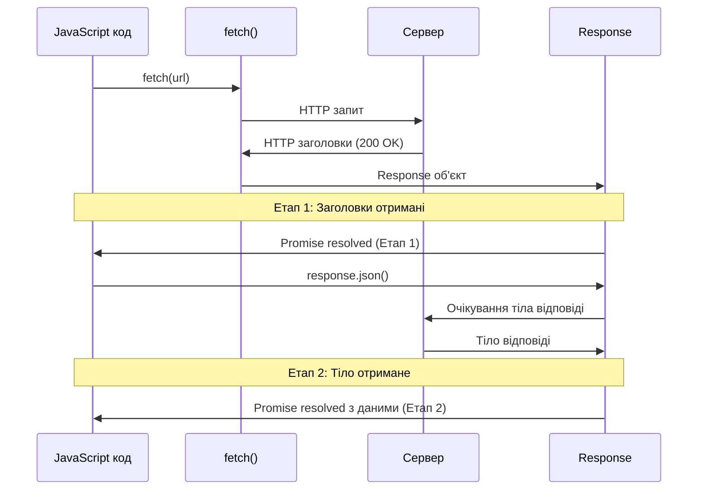

# Fetch API - Сучасний підхід до HTTP-запитів

## Вступ та Контекст

Уявіть сучасний веб-застосунок: ви натискаєте кнопку "Додати до кошика", і товар миттєво з'являється у вашому списку покупок — **без перезавантаження сторінки**. Ви скролите стрічку новин, і контент підвантажується автоматично. Ви вводите назву міста, і система одразу підказує варіанти. Усе це стає можливим завдяки асинхронним мережевим запитам.

У минулому для цього використовували `XMLHttpRequest` — громіздкий та незручний API. Сьогодні ми маємо **Fetch API** — сучасний, елегантний та потужний інструмент для роботи з HTTP-запитами, який побудований на промісах та підтримується всіма сучасними браузерами.

::tip
**AJAX (Asynchronous JavaScript And XML)** — це загальний термін для технологій, що дозволяють оновлювати частини веб-сторінки без повного перезавантаження. Незважаючи на те, що в назві присутній XML, сьогодні найчастіше використовується формат JSON.
::

### Що ми навчимося робити?

-   Відправляти GET-запити для отримання даних з сервера
-   Відправляти POST-запити для створення нових ресурсів
-   Працювати з різними форматами відповідей (JSON, текст, бінарні дані)
-   Правильно обробляти помилки HTTP та мережеві збої
-   Налаштовувати заголовки запитів для розширених сценаріїв

## Фундаментальні Концепції

### Що таке Fetch API?

**Fetch API** — це сучасний веб-стандарт для виконання HTTP-запитів, який надає простий та логічний спосіб отримання ресурсів асинхронно через мережу. Він повертає `Promise`, що дозволяє писати чистіший та зрозуміліший асинхронний код порівняно з колбеками.

```javascript
// Базовий синтаксис
let promise = fetch(url, [options])
```

**Параметри:**

-   `url` — URL для відправлення запиту (обов'язковий)
-   `options` — об'єкт налаштувань: HTTP-метод, заголовки, тіло запиту тощо (опціональний)

### Двоетапна природа Fetch

Fetch працює у **два етапи**, що важливо розуміти для правильної обробки відповідей:

::mermaid



::

**Етап 1 - Отримання заголовків:**

`Promise` завершується з об'єктом `Response` одразу після того, як сервер надішле заголовки відповіді. На цьому етапі ми можемо:

-   Перевірити HTTP-статус (`response.status`)
-   Перевірити успішність запиту (`response.ok`)
-   Переглянути заголовки відповіді (`response.headers`)

**Етап 2 - Отримання тіла відповіді:**

Для читання тіла відповіді потрібен додатковий виклик методу (наприклад, `response.json()`), який також повертає `Promise`.

## Архітектура та Механіка

### Об'єкт Response

Коли проміс від `fetch()` завершується успішно, ми отримуємо об'єкт класу [`Response`](https://fetch.spec.whatwg.org/#response-class). Розгляньмо його ключові властивості:

::field-group
::field{name="status" type="number"}
Код HTTP-статусу відповіді (наприклад, `200`, `404`, `500`)
::

::field{name="ok" type="boolean"}
Логічне значення: `true`, якщо HTTP-статус у діапазоні 200-299, інакше `false`
::

::field{name="statusText" type="string"}
Текстове повідомлення HTTP-статусу (наприклад, `"OK"`, `"Not Found"`)
::

::field{name="headers" type="Headers"}
Об'єкт заголовків відповіді, схожий на `Map`
::

::field{name="url" type="string"}
URL фінальної відповіді (може відрізнятися через редиректи)
::
::

### Методи читання тіла відповіді

`Response` надає кілька методів для читання тіла у різних форматах. **Важливо:** можна використати тільки один метод на одну відповідь.

| Метод                    | Повертає               | Використання                                     |
| :----------------------- | :--------------------- | :----------------------------------------------- |
| `response.json()`        | `Promise<any>`         | Декодування JSON-даних (API-відповіді)           |
| `response.text()`        | `Promise<string>`      | Отримання текстової відповіді (HTML, plain text) |
| `response.blob()`        | `Promise<Blob>`        | Бінарні дані з типом (зображення, відео)         |
| `response.arrayBuffer()` | `Promise<ArrayBuffer>` | Низькорівневе представлення бінарних даних       |
| `response.formData()`    | `Promise<FormData>`    | Дані форми (multipart/form-data)                 |

::warning
**Одноразове читання відповіді** Тіло відповіді можна прочитати тільки **один раз**. Після виклику `response.json()` повторний виклік `response.text()` або інших методів призведе до помилки, оскільки дані вже були оброблені.

```javascript
let text = await response.text() // працює
let parsed = await response.json() // помилка: дані вже прочитані!
```

::

### Життєвий цикл HTTP-запиту через Fetch

::steps

### Крок 1: Ініціація запиту

JavaScript викликає `fetch(url, options)`, браузер розпочинає HTTP-запит

### Крок 2: Відправка заголовків

Браузер відправляє заголовки запиту на сервер

### Крок 3: Отримання заголовків відповіді

Сервер відповідає заголовками. Проміс завершується з об'єктом `Response`

### Крок 4: Перевірка статусу

Ми перевіряємо `response.ok` або `response.status` для валідації відповіді

### Крок 5: Читання тіла

Викликаємо відповідний метод (`json()`, `text()` тощо) для отримання даних

### Крок 6: Обробка даних

Працюємо з отриманими даними або обробляємо помилки

::

## Практична Реалізація

### Простий GET-запит

Почнемо з базового прикладу отримання даних про користувача з публічного API:

```javascript showLineNumbers
// Отримання даних про користувача GitHub
async function getUserInfo(username) {
    const url = `https://api.github.com/users/${username}`

    // Етап 1: Отримуємо заголовки відповіді
    const response = await fetch(url)

    // Перевіряємо успішність запиту
    if (!response.ok) {
        throw new Error(`HTTP помилка! Статус: ${response.status}`)
    }

    // Етап 2: Парсимо JSON
    const userData = await response.json()

    return userData
}

// Використання
try {
    const user = await getUserInfo('octocat')
    console.log("Ім'я:", user.name)
    console.log('Репозиторіїв:', user.public_repos)
    console.log('Підписників:', user.followers)
} catch (error) {
    console.error('Помилка отримання даних:', error.message)
}
```

**Розбір коду:**

-   **Рядок 6:** `fetch(url)` повертає проміс, який ми очікуємо (`await`)
-   **Рядок 9:** Перевіряємо `response.ok` — це властивість, яка `true` для статусів 200-299
-   **Рядок 10:** Викидаємо помилку для негативних сценаріїв (404, 500 тощо)
-   **Рядок 14:** `response.json()` асинхронно парсить JSON та повертає JavaScript-об'єкт

### Правильна обробка помилок

Важливо розуміти: **проміс від `fetch` відхиляється лише при мережевих помилках** (відсутність інтернету, неможливість з'єднатися з сервером). HTTP-помилки (404, 500) **НЕ** відхиляють проміс.

::code-group

```javascript [Погана практика] {3}
try {
    const response = await fetch(url)
    const data = await response.json() // Помилка: може бути 404!
    console.log(data)
} catch (error) {
    // Цей catch НЕ спрацює для HTTP-помилок
    console.error(error)
}
```

```javascript [Добра практика] {7-12}
async function fetchWithErrorHandling(url) {
    try {
        const response = await fetch(url)

        // Перевіряємо HTTP-статус
        if (!response.ok) {
            // Створюємо власну помилку для HTTP-помилок
            const error = new Error(`HTTP ${response.status}: ${response.statusText}`)
            error.status = response.status
            error.response = response
            throw error
        }

        return await response.json()
    } catch (error) {
        // Цей блок обробляє ОБА типи помилок:
        // 1. Мережеві помилки (від fetch)
        // 2. HTTP-помилки (наші власні)

        if (error.status) {
            console.error(`Помилка сервера ${error.status}:`, error.message)
        } else {
            console.error('Мережева помилка:', error.message)
        }

        throw error // Пробрасываем дальше
    }
}
```

::

::note
**Типи помилок у Fetch**

1.  **Мережеві помилки** — відсутність з'єднання, DNS-помилки, CORS блокування. Проміс відхиляється.
2.  **HTTP-помилки** — статуси 4xx, 5xx. Проміс **НЕ** відхиляється, потрібна ручна перевірка `response.ok`.

::

### POST-запит із JSON

Розглянемо відправлення даних на сервер через POST-запит:

```javascript showLineNumbers
async function createProduct(productData) {
    const url = 'https://api.escuelajs.co/api/v1/products'

    const response = await fetch(url, {
        method: 'POST', // HTTP-метод
        headers: {
            'Content-Type': 'application/json', // Вказуємо тип даних
        },
        body: JSON.stringify(productData), // Серіалізуємо об'єкт у JSON
    })

    if (!response.ok) {
        throw new Error(`Помилка створення продукту: ${response.status}`)
    }

    return await response.json()
}

// Використання
const newProduct = {
    title: 'Бездротові навушники',
    price: 1299,
    description: 'Високоякісні навушники з шумозаглушенням',
    categoryId: 2,
    images: ['https://placehold.co/600x400'],
}

try {
    const created = await createProduct(newProduct)
    console.log('Продукт створено:', created)
    console.log('ID:', created.id)
    console.log('Назва:', created.title)
} catch (error) {
    console.error('Помилка:', error.message)
}
```

**Важливі моменти:**

-   **Рядок 5:** Вказуємо HTTP-метод `POST` в об'єкті `options`
-   **Рядок 7:** Заголовок `Content-Type: application/json` повідомляє серверу, що ми надсилаємо JSON
-   **Рядок 9:** `JSON.stringify()` перетворює JavaScript-об'єкт у JSON-рядок

::warning
**Не забувайте серіалізацію**

`body` очікує рядок, а не об'єкт. Якщо надіслати об'єкт напряму, він буде перетворений у `"[object Object]"`, що призведе до помилки сервера.

```javascript
// ❌ Неправильно
body: {
    name: 'Іван'
} // Надішле "[object Object]"

// ✅ Правильно
body: JSON.stringify({ name: 'Іван' })
```

::

### Типи даних для body

Параметр `body` може приймати різні типи даних залежно від того, що ви відправляєте на сервер:

::field-group
::field{name="string (JSON)" type="String"}
Рядок, зазвичай JSON. Використовується для API-запитів. Потрібно встановити `Content-Type: application/json`
::

::field{name="FormData" type="FormData"}
Дані HTML-форми з файлами та без. Заголовок `Content-Type: multipart/form-data` встановлюється автоматично
::

::field{name="Blob / BufferSource" type="Blob | ArrayBuffer | TypedArray"}
Бінарні дані: зображення, відео, аудіо файли. Браузер автоматично встановить `Content-Type`
::

::field{name="URLSearchParams" type="URLSearchParams"}
Дані у кодуванні `application/x-www-form-urlencoded`. Використовується рідко, переважно для legacy API
::
::

Розглянемо кожен тип детальніше:

::tabs
::tabs-item{label="JSON (String)"}

    ```javascript
    // Найпопулярніший формат для API
    const userData = {
    name: 'Олена',
    email: 'olena@example.com',
    age: 25
    };

        const response = await fetch('https://api.example.com/users', {
        method: 'POST',
        headers: {
            'Content-Type': 'application/json' // Обов'язковий заголовок
        },
        body: JSON.stringify(userData) // Конвертуємо об'єкт у JSON-рядок
        });

        const result = await response.json();
        console.log('Створено користувача:', result);
    ```

    **Коли використовувати:** REST API, GraphQL, будь-які JSON-based сервіси

::

::tabs-item{label="FormData"}

```javascript
// Відправлення форми з файлом
const formData = new FormData()
formData.append('username', 'maria_dev')
formData.append('email', 'maria@example.com')

// Додавання файлу з input[type="file"]
const fileInput = document.querySelector('#avatar')
formData.append('avatar', fileInput.files[0])

const response = await fetch('https://api.example.com/profile', {
    method: 'POST',
    // Не встановлюємо Content-Type! Браузер зробить це автоматично
    // з правильним boundary для multipart/form-data
    body: formData,
})

const result = await response.json()
console.log('Профіль оновлено:', result)
```

**Коли використовувати:** Завантаження файлів, форми з змішаним контентом (текст + файли)

::note
FormData автоматично встановлює `Content-Type: multipart/form-data` з `boundary`. НЕ встановлюйте цей заголовок вручну, інакше запит не спрацює!
::

::

::tabs-item{label="Blob / Binary"}

    ```javascript
    // Відправлення зображення з canvas
    const canvas = document.querySelector('#drawing-canvas');

    // Конвертуємо canvas у Blob
    canvas.toBlob(async (blob) => {
    const response = await fetch('https://api.example.com/upload', {
        method: 'POST',
        // Content-Type встановиться автоматично: image/png
        body: blob
            });

    const result = await response.json();
    console.log('Зображення завантажено:', result);
    }, 'image/png');

    // Або відправлення буфера
    const audioData = new Uint8Array([/* audio bytes */]);
    const response = await fetch('https://api.example.com/audio', {
    method: 'POST',
    headers: {
        'Content-Type': 'audio/wav'
    },
    body: audioData
    });
    ```

    **Коли використовувати:** Завантаження згенерованих зображень (canvas), аудіо/відео даних, будь-яких бінарних файлів

::

::tabs-item{label="URLSearchParams"}

```javascript
// Формат application/x-www-form-urlencoded
const params = new URLSearchParams()
params.append('username', 'john_doe')
params.append('password', 'secret123')
params.append('remember', 'true')

const response = await fetch('https://api.example.com/login', {
    method: 'POST',
    headers: {
        'Content-Type': 'application/x-www-form-urlencoded',
    },
    body: params, // Автоматично конвертується у "username=john_doe&password=secret123&remember=true"
})

const result = await response.json()
console.log('Авторизація:', result)
```

**Коли використовувати:** Legacy API, OAuth flows, деякі старі сервери, що очікують URL-encoded дані

::tip
Сьогодні цей формат використовується рідко. Більшість сучасних API віддають перевагу JSON. Використовуйте `URLSearchParams` лише якщо API явно вимагає `application/x-www-form-urlencoded`.
::

::
::

### Порівняння форматів body

| Формат              | Content-Type                        | Використання      | Підтримка файлів    |
| :------------------ | :---------------------------------- | :---------------- | :------------------ |
| **JSON (string)**   | `application/json`                  | REST API, GraphQL | ❌ Ні               |
| **FormData**        | `multipart/form-data`               | Форми з файлами   | ✅ Так              |
| **Blob/Buffer**     | Автоматично визначається            | Бінарні дані      | ✅ Тільки один файл |
| **URLSearchParams** | `application/x-www-form-urlencoded` | Legacy API        | ❌ Ні               |

### Робота з різними форматами відповідей

::tabs
::tabs-item{label="JSON"}

```javascript
// API повертає JSON
const response = await fetch('https://api.github.com/users/octocat')
const data = await response.json() // Автоматичний парсинг JSON

console.log(data.login) // "octocat"
console.log(data.name) // "The Octocat"
```

::

::tabs-item{label="Текст"}

```javascript
// Отримання HTML або plain text
const response = await fetch('https://example.com/page.html')
const html = await response.text() // Отримуємо як текст

console.log(html.slice(0, 100)) // Перші 100 символів
```

::

::tabs-item{label="Зображення (Blob)"}

```javascript
// Завантаження та відображення зображення
const response = await fetch('https://via.placeholder.com/300')

if (!response.ok) {
    throw new Error('Не вдалося завантажити зображення')
}

const blob = await response.blob() // Отримуємо як Blob

// Створюємо URL для blob
const imageUrl = URL.createObjectURL(blob)

// Відображаємо у браузері
const img = document.createElement('img')
img.src = imageUrl
img.alt = 'Завантажене зображення'
document.body.appendChild(img)

// Очищення пам'яті після використання
img.onload = () => {
    URL.revokeObjectURL(imageUrl)
}
```

::

::tabs-item{label="Бінарні дані"}

```javascript
// Робота з ArrayBuffer (низькорівневі дані)
const response = await fetch('https://example.com/data.bin')
const buffer = await response.arrayBuffer()

console.log('Розмір даних:', buffer.byteLength, 'байт')

// Робота з типізованими масивами
const uint8View = new Uint8Array(buffer)
console.log('Перший байт:', uint8View[0])
```

::
::

## Заголовки HTTP

### Читання заголовків відповіді

Об'єкт `response.headers` надає доступ до заголовків відповіді через Map-подібний інтерфейс:

```javascript
const response = await fetch('https://api.github.com/users/octocat')

// Отримання одного заголовка
console.log('Content-Type:', response.headers.get('Content-Type'))
// "application/json; charset=utf-8"

console.log('Дата:', response.headers.get('Date'))

// Ітерація по всіх заголовках
for (const [key, value] of response.headers) {
    console.log(`${key}: ${value}`)
}

// Перевірка наявності заголовка
if (response.headers.has('ETag')) {
    console.log('ETag присутній:', response.headers.get('ETag'))
}
```

### Встановлення заголовків запиту

Для налаштування заголовків запиту використовуємо властивість `headers` в `options`:

```javascript
const response = await fetch('https://api.escuelajs.co/api/v1/products/10', {
    headers: {
        Accept: 'application/json',
        'X-Request-ID': 'unique-request-id-123',
    },
})
```

::caution
**Заборонені заголовки** Деякі заголовки контролюються виключно браузером і не можуть бути встановлені вручну з міркувань безпеки: `Cookie`, `Host`, `Origin`, `Referer`, `Content-Length`, `Connection` та інші. Повний список доступний у [специфікації](https://fetch.spec.whatwg.org/#forbidden-header-name).
::

## Comparison: Fetch vs XMLHttpRequest

Порівняння двох підходів до HTTP-запитів:

| Критерій                 | Fetch API                             | XMLHttpRequest                    |
| :----------------------- | :------------------------------------ | :-------------------------------- |
| **Синтаксис**            | Сучасний, побудований на промісах     | Застарілий, базується на колбеках |
| **Читабельність**        | Висока (async/await)                  | Низька (callback hell)            |
| **Обробка помилок**      | Проміси (.catch)                      | Обробники події (onerror)         |
| **Підтримка CORS**       | Вбудована                             | Потребує додаткових налаштувань   |
| **Відстеження прогресу** | Через ReadableStream                  | Через події (onprogress)          |
| **Сумісність**           | Сучасні браузери (поліфіл для старих) | Всі браузери (включно зі старими) |
| **Розмір API**           | Малий, простий                        | Великий, складний                 |

::tip
**Коли використовувати XMLHttpRequest?**

У 2024 році XMLHttpRequest слід використовувати лише для:

1.  Підтримки дуже старих браузерів (IE10 та нижче)
2.  Відстеження прогресу **відвантаження** (upload progress), оскільки Fetch поки що не підтримує цю функцію нативно

Для всіх інших сценаріїв **віддавайте перевагу Fetch API**.
::

## Практичні Сценарії

### Паралельні запити

Використання `Promise.all()` для одночасного виконання кількох запитів:

```javascript
async function loadMultipleUsers(usernames) {
    // Створюємо масив промісів
    const promises = usernames.map((username) =>
        fetch(`https://api.github.com/users/${username}`).then((response) => {
            if (!response.ok) throw new Error(`Не знайдено: ${username}`)
            return response.json()
        }),
    )

    try {
        // Чекаємо завершення всіх запитів
        const users = await Promise.all(promises)
        return users
    } catch (error) {
        console.error('Помилка при завантаженні користувачів:', error)
        throw error
    }
}

// Використання
const usernames = ['octocat', 'torvalds', 'gaearon']
const users = await loadMultipleUsers(usernames)

users.forEach((user) => {
    console.log(`${user.login}: ${user.public_repos} репозиторіїв`)
})
```

### Таймаут для запитів

Fetch не має вбудованого механізму таймауту, але ми можемо реалізувати його через `Promise.race()`:

```javascript
function fetchWithTimeout(url, options = {}, timeout = 5000) {
    // Створюємо проміс таймауту
    const timeoutPromise = new Promise((_, reject) => {
        setTimeout(() => reject(new Error('Запит перевищив час очікування')), timeout)
    })

    // Змагаємося між fetch та таймаутом
    return Promise.race([fetch(url, options), timeoutPromise])
}

// Використання
try {
    const response = await fetchWithTimeout(
        'https://api.escuelajs.co/api/v1/products',
        {},
        3000, // Максимум 3 секунди
    )
    const data = await response.json()
    console.log(data)
} catch (error) {
    if (error.message.includes('таймауту')) {
        console.error('Запит занадто довгий!')
    } else {
        console.error('Інша помилка:', error)
    }
}
```

::note
У майбутньому планується додати вбудовану підтримку таймаутів через нову властивість `signal` та `AbortController` з параметром timeout. Детальніше про це у наступному розділі про [переривання запитів](/javascript/fetch-abort).
::

### Retry-механізм

Автоматичне повторення запиту при помилці:

```javascript
async function fetchWithRetry(url, options = {}, maxRetries = 3) {
    let lastError

    for (let attempt = 1; attempt <= maxRetries; attempt++) {
        try {
            const response = await fetch(url, options)

            if (!response.ok) {
                throw new Error(`HTTP ${response.status}`)
            }

            return response // Успішний запит
        } catch (error) {
            lastError = error
            console.warn(`Спроба ${attempt}/${maxRetries} не вдалася:`, error.message)

            // Не чекаємо після останньої спроби
            if (attempt < maxRetries) {
                // Експоненційна затримка: 1s, 2s, 4s...
                const delay = Math.pow(2, attempt - 1) * 1000
                await new Promise((resolve) => setTimeout(resolve, delay))
            }
        }
    }

    throw new Error(`Не вдалося виконати запит після ${maxRetries} спроб: ${lastError.message}`)
}

// Використання
try {
    const response = await fetchWithRetry('https://api.escuelajs.co/api/v1/products/10')
    const data = await response.json()
    console.log(data)
} catch (error) {
    console.error('Остаточна помилка:', error.message)
}
```

## Підсумки

Fetch API — це сучасний стандарт для виконання HTTP-запитів у JavaScript:

::card-group
::card{title="Ключові переваги" icon="i-lucide-check-circle"}

-   Побудований на промісах → чистий асинхронний код
-   Простий та інтуїтивний API
-   Нативна підтримка у всіх сучасних браузерах
-   Вбудована підтримка CORS

::

::card{title="Основні концепції" icon="i-lucide-book-open"}

-   Двоетапна природа: заголовки → тіло
-   Проміс відхиляється лише при мережевих помилках
-   `response.ok` для перевірки HTTP-статусу (200-299)
-   Одноразове читання тіла відповіді

::

::card{title="Базовий синтаксис" icon="i-lucide-code"}

```javascript
// GET-запит
const response = await fetch(url)
const data = await response.json()

// POST-запит
const response = await fetch(url, {
    method: 'POST',
    headers: { 'Content-Type': 'application/json' },
    body: JSON.stringify(data),
})
```

::

::card{title="Обробка помилок" icon="i-lucide-shield-alert"}
Завжди перевіряйте статус:

```javascript
if (!response.ok) {
    throw new Error(`HTTP ${response.status}`)
}
```

Та обгортайте у try-catch для мережевих помилок

::
::

### Методи Response для різних форматів

| Метод                    | Використання               |
| :----------------------- | :------------------------- |
| `response.json()`        | API-дані у форматі JSON    |
| `response.text()`        | HTML, текстові файли       |
| `response.blob()`        | Зображення, відео, файли   |
| `response.arrayBuffer()` | Низькорівневі бінарні дані |
| `response.formData()`    | Дані форм                  |

### Опції fetch()

```javascript
fetch(url, {
    method: 'POST', // HTTP-метод: GET, POST, PUT, DELETE...
    headers: {
        // Заголовки запиту
        'Content-Type': 'application/json',
    },
    body: JSON.stringify(data), // Тіло запиту (string, FormData, Blob...)
})
```

У наступних розділах ми розглянемо більш просунуті можливості Fetch API: роботу з `FormData`, відстеження прогресу завантаження, переривання запитів та CORS.

## Перевірка знань

Закріпіть отримані знання, пройшовши короткий тест:

::tally-embed{id="w2JQOb" title="Fetch API - Тест на розуміння"}
::

::note
**Примітка**: Якщо тест не відображається, перейдіть за [прямим посиланням](https://tally.so/r/w2JQOb).
::

## Додаткові ресурси

-   [Офіційна специфікація Fetch API](https://fetch.spec.whatwg.org/) — повна технічна специфікація
-   [MDN Web Docs: Using Fetch](https://developer.mozilla.org/en-US/docs/Web/API/Fetch_API/Using_Fetch) — детальна документація від Mozilla
-   [Can I Use: Fetch](https://caniuse.com/fetch) — перевірка підтримки браузерами
-   [GitHub Fetch Polyfill](https://github.com/github/fetch) — поліфіл для старих браузерів
