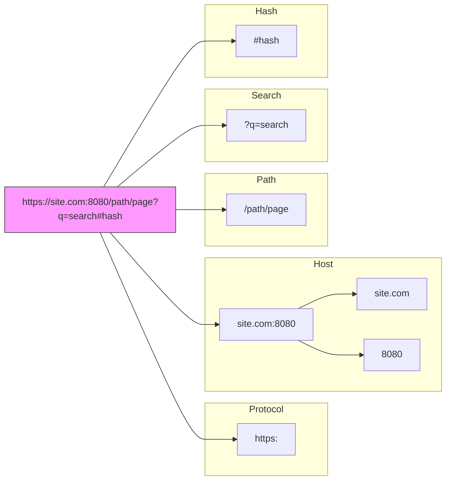

# URL Objects - Професійна робота з посиланнями

## Вступ

У веб-розробці ми постійно працюємо з URL-адресами. Раніше для зміни параметрів запиту (query params) доводилося маніпулювати рядками, "клеїти" їх через `+` або шаблони, і вручну кодувати спецсимволи.

Це було незручно і призводило до помилок:

```javascript
// ❌ Старий, "ручний" підхід
const base = 'https://api.com'
const query = 'hello world'
const url = base + '/search?q=' + encodeURIComponent(query) + '&page=1'
```

Сучасний JavaScript пропонує вбудований клас `URL`, який робить цю роботу елегантною та безпечною.

## Клас URL

Створити об'єкт URL дуже просто:

```javascript
const url = new URL(url_string, [base_url])
```

-   **`url_string`** — абсолютний URL або шлях
-   **`base_url`** — (опціонально) базовий URL, якщо перший аргумент — це відносний шлях

### Компоненти URL

Клас `URL` автоматично розбирає (парсить) адресу на складові. Розгляньмо це на діаграмі:

::mermaid



::

### Властивості об'єкта URL

::field-group
::field{name="href" type="string"}
Повний URL (те саме, що `toString()`)
::

::field{name="protocol" type="string"}
Протокол з двокрапкою (наприклад, `https:`)
::

::field{name="host" type="string"}
Домен і порт (наприклад, `site.com:8080`)
::

::field{name="hostname" type="string"}
Лише домен (наприклад, `site.com`)
::

::field{name="port" type="string"}
Порт (наприклад, `8080`)
::

::field{name="pathname" type="string"}
Шлях від кореня (наприклад, `/profile/admin`)
::

::field{name="search" type="string"}
Рядок параметрів з `?` (наприклад, `?id=1&ref=google`)
::

::field{name="hash" type="string"}
Якір з `#` (наприклад, `#top`)
::
::

### Приклади використання

**1. Розбір існуючого URL:**

```javascript
const url = new URL('https://javascript.info/profile/admin')

console.log(url.host) // javascript.info
console.log(url.pathname) // /profile/admin
```

**2. Створення відносного URL:**

Це дуже зручно, коли у вас є базовий API URL:

```javascript
const base = 'https://api.escuelajs.co/api/v1'

// Автоматично склеює шляхи
const productsUrl = new URL('/products', base)
// https://api.escuelajs.co/api/v1/products

const userUrl = new URL('users/1', base)
// https://api.escuelajs.co/api/v1/users/1
```

::tip
**URL в Fetch API**

Ви можете передавати об'єкт `URL` безпосередньо у `fetch`:

```javascript
const url = new URL('https://api.com/data')
fetch(url) // Працює так само, як fetch(string)
```

::

## URLSearchParams - Робота з параметрами

Властивість `url.searchParams` повертає об'єкт типу `URLSearchParams`. Це потужний інструмент для керування query-параметрами (`?key=value`).

### Основні методи

| Метод                 | Опис                                     | Приклад             |
| :-------------------- | :--------------------------------------- | :------------------ |
| `append(name, value)` | Додає параметр (навіть якщо такий вже є) | `?tag=js&tag=react` |
| `set(name, value)`    | Встановлює параметр (змінює існуючий)    | `?q=new_search`     |
| `delete(name)`        | Видаляє параметр                         | `delete('page')`    |
| `get(name)`           | Отримує перше значення                   | `get('sort')`       |
| `getAll(name)`        | Отримує всі значення масивом             | `['js', 'react']`   |
| `has(name)`           | Перевіряє наявність                      | `has('id')` // true |

### Практичний приклад: Фільтрація товарів

Уявімо, ми будуємо URL для фільтрації товарів в інтернет-магазині:

```javascript
const url = new URL('https://shop.com/products')

// Додаємо параметри
url.searchParams.set('category', 'laptops')
url.searchParams.set('sort', 'price_asc')
url.searchParams.append('brand', 'apple')
url.searchParams.append('brand', 'dell') // Можна кілька значень!

console.log(url.toString())
// https://shop.com/products?category=laptops&sort=price_asc&brand=apple&brand=dell
```

### Автоматичне кодування

Найбільший плюс `URLSearchParams` — він **автоматично** кодує спеціальні символи. Вам не треба думати про пробіли, кирилицю чи `&`.

```javascript
const url = new URL('https://google.com/search')

url.searchParams.set('q', 'JavaScript tutorial & guide') // Символи ' ' та '&'

console.log(url.toString())
// https://google.com/search?q=JavaScript+tutorial+%26+guide
```

## Кодування: encodeURI vs encodeURIComponent

Іноді нам все ж доводиться працювати з рядками вручну. Для цього в JavaScript є дві схожі функції, які новачки часто плутають.

### 1. encodeURI

Використовується, коли треба закодувати **весь URL повністю**.
Він **НЕ** кодує символи, що мають спеціальне значення в URL: `: / ? # & =`.

```javascript
const url = 'https://site.com/привіт світ'
console.log(encodeURI(url))
// https://site.com/%D0%BF%D1%80%D0%B8%D0%B2%D1%96%D1%82%20%D1%81%D0%B2%D1%96%D1%82
// Кирилицю та пробіли закодовано, але :// залишились
```

### 2. encodeURIComponent

Використовується для кодування **окремого компонента** (наприклад, значення параметра пошуку).
Він кодує **ВСЕ**, включаючи `/ ? & =`.

```javascript
const param = 'Rock&Roll'

// ❌ Неправильно (URL зламається через &)
// const url = `https://site.com?q=${param}`;
// q=Rock&Roll -> q=Rock, Roll=undefined

// ✅ Правильно
const url = `https://site.com?q=${encodeURIComponent(param)}`
// q=Rock%26Roll -> q="Rock&Roll"
```

### Порівняльна таблиця

|      Символ      |   encodeURI   |       encodeURIComponent       |
| :--------------: | :-----------: | :----------------------------: |
|   `a-z`, `0-9`   |      ✅       |               ✅               |
| `:` `/` `?` `#`  | ✅ (не кодує) | 🔒 **Кодує** (`%3A`, `%2F`...) |
|   `&` `+` `=`    | ✅ (не кодує) | 🔒 **Кодує** (`%26`, `%2B`...) |
| Кирилиця, пробіл | 🔒 **Кодує**  |          🔒 **Кодує**          |

::warning
**IPv6 та encodeURI**

`encodeURI` має відомий баг із IPv6 адресами, які використовують квадратні дужки `[]`. Він помилково кодує їх, хоча вони дозволені в URL. Клас `URL` обробляє це коректно.
::

## Підсумки

::card-group
::card{title="Class URL" icon="i-lucide-link"}
Використовуйте `new URL()` для парсингу та створення посилань. Це зручніше та надійніше за склеювання рядків.

```javascript
new URL('/path', 'https://base.com')
```

::

::card{title="URLSearchParams" icon="i-lucide-list-filter"}
Ідеальний інструмент для query-параметрів. Підтримує додавання, видалення, сортування та повторювані ключі.

```javascript
url.searchParams.set('q', 'val')
```

::

::card{title="Encoding" icon="i-lucide-file-code"}

-   **`encodeURI`**: для всього URL
-   **`encodeURIComponent`**: для частини (параметра)
-   `URL` клас робить це **автоматично**! 🚀

::
::

Використання об'єкта `URL` — це стандарт сучасної розробки. Він робить код чистішим, читабельнішим і захищає від типових помилок кодування URL-алрес.
