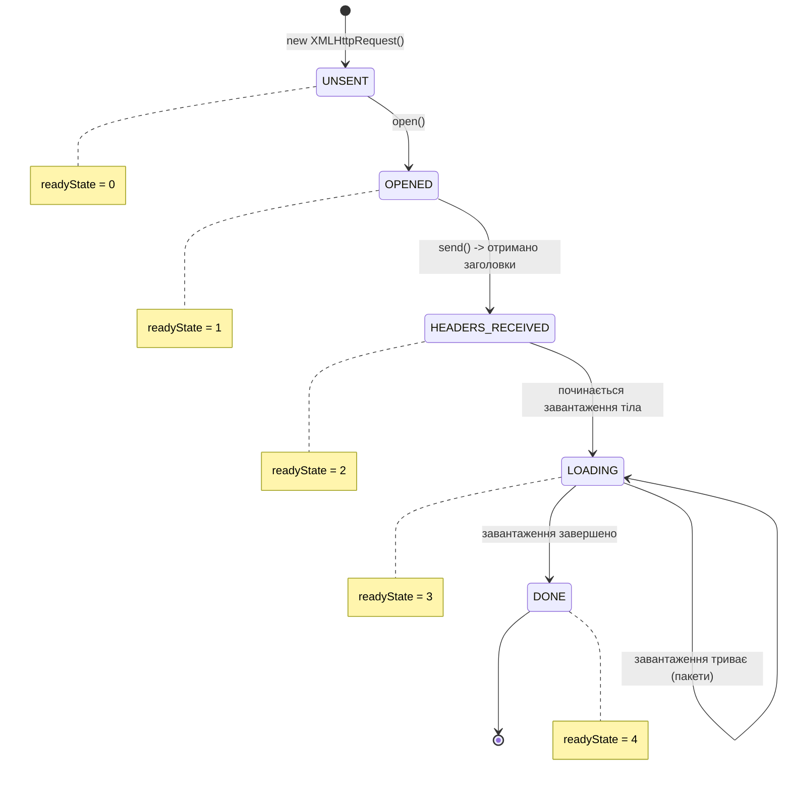

# XMLHttpRequest: Фундамент сучасного вебу

## Вступ: Чому ми це вчимо?

Можливо, ви запитуєте себе: _"Навіщо мені вчити `XMLHttpRequest` у 2025 році, коли є `fetch`?"_

Це слушне питання. `fetch` — це сучасний стандарт, зручний та потужний. Однак, `XMLHttpRequest` (часто скорочують як **XHR**) залишається критично важливою частиною веб-екосистеми з кількох причин:

1.  **Legacy Code:** Мільйони рядків коду в існуючих проектах написані на XHR. Ви неминуче зустрінете його в `jQuery.ajax`, `axios` (під капотом) або старих ентерпрайз-системах.
2.  **Upload Progress:** XHR має вбудовану підтримку відстеження прогресу завантаження файлів _на сервер_. У `fetch` це досі реалізується складно (через Streams), а в XHR це працює "з коробки" вже 15 років.
3.  **Низькорівневий контроль:** XHR дає доступ до станів з'єднання, які `fetch` абстрагує. Розуміння XHR допомагає зрозуміти, як насправді працює HTTP у браузері.
4.  **Синхронні запити:** Хоча це "зло", іноді (в Web Workers або специфічних сценаріях блокування) синхронні запити все ще використовуються.

> [!NOTE]
> Цей матеріал — це не просто "як зробити запит". Це енциклопедія по роботі з мережею в браузері на низькому рівні. Ми заглибимося в деталі, які зроблять вас _інженером_, а не просто _кодером_.

## Коротка історія AJAX революції

Щоб зрозуміти XHR, треба повернутися у часі.

::steps

### До 1999: "Перезавантаж мене"

У ранньому вебі будь-яка дія (відправка форми, клік на посилання) вимагала **повного перезавантаження сторінки**. Сервер генерував новий HTML, браузер скидав старий і малював новий. Це було повільно, блимало і дратувало.

### 1999: Народження в Microsoft

ActiveX компонент `XMLHTTP` з'явився в Internet Explorer 5. Спочатку він був створений для Outlook Web Access, щоб перевіряти пошту без перезавантаження.

### 2004-2005: Революція Google

Google випускає **Gmail** (2004) і **Google Maps** (2005). Це шокувало світ. Карта рухалася без перезавантаження! Листи приходили миттєво!
Термін **AJAX** (Asynchronous JavaScript and XML) був придуманий Джессі Джеймсом Гарреттом у 2005 році. XHR став двигуном Веб 2.0.

### 2015: Прихід Fetch

Стандарт Fetch API з'явився як сучасна, заснована на Promise заміна для XHR.

::

Незважаючи на назву, `XMLHttpRequest`:

-   **Не обмежується XML:** може працювати з JSON, HTML, TXT, файлами.
-   **Не обмежується HTTP:** може працювати з `file://` та `ftp://`.

## Основи роботи

Робота з XHR завжди складається з 4 етапів. Це як відправити посилку поштою:

1.  **Купити конверт** (Створити об'єкт)
2.  **Написати адресу** (Відкрити/Налаштувати)
3.  **Покласти лист та відправити** (Відправити)
4.  **Чекати відповідь** (Слухати події)

```javascript
// 1. Створення
const xhr = new XMLHttpRequest()

// 2. Ініціалізація (Метод, URL, async)
xhr.open('GET', 'https://api.escuelajs.co/api/v1/products/1')

// 4. Підписка на події (до відправки!)
xhr.onload = function () {
    if (xhr.status === 200) {
        console.log('Успіх:', xhr.response)
    } else {
        console.error('Помилка сервера:', xhr.status)
    }
}

xhr.onerror = function () {
    console.error('Помилка мережі (інтернет зник або CORS)')
}

// 3. Відправка
xhr.send()
```

### Детально про xhr.open()

Метод `open` не відкриває з'єднання! Він лише **налаштовує** об'єкт запиту.

```javascript
xhr.open(method, url, [async, user, password])
```

-   `method`: HTTP метод (`GET`, `POST`, `PUT`, `DELETE`, etc).
-   `url`: Адреса запиту.
-   `async`: `true` (за замовчуванням) або `false` (синхронно).
-   `user`, `password`: Для HTTP Basic Auth.

## Асинхронність vs Синхронність

Це критичний момент. XHR дозволяє робити **синхронні** запити, які блокують потік виконання JS.

### Синхронний запит (ЗЛО 😈)

Якщо передати `false` третім аргументом:

```javascript
console.log('Початок')

const xhr = new XMLHttpRequest()
xhr.open('GET', 'https://api.escuelajs.co/api/v1/products', false) // <--- FALSE

try {
    xhr.send() // ТУТ ВЕСЬ БРАУЗЕР ЗАВИСНЕ

    if (xhr.status === 200) {
        console.log('Отримано дані')
    }
} catch (e) {
    console.log('Помилка')
}

console.log('Кінець')
```

**Що станеться?**

1.  Інтерфейс браузера "замерзне". Кнопки не натискаються, анімації зупиняться.
2.  Якщо сервер відповідає 10 секунд — користувач думатиме, що браузер зламався.
3.  Сучасні браузери (Chrome, Firefox) видають попередження в консолі про те, що синхронний XHR у головному потоці застарів (deprecated).

> [!WARNING]
> Ніколи не використовуйте синхронний XHR у головному потоці. Це вбиває UX.

### Асинхронний запит (ДОБРО 😇)

Якщо `async = true` (або пропущено), браузер відправляє запит у фоні, а ваш JS продовжує виконуватися. Коли відповідь прийде, спрацює колбек (подія).

```javascript
xhr.open('GET', 'url', true)
xhr.send()
console.log('Я виконуюсь відразу, не чекаючи сервера!')
```

## Життєвий цикл та Події

На відміну від `fetch`, який має лише Promise (pending -> resolved/rejected), XHR має складний життєвий цикл з багатьма станами.

### Діаграма станів (readyState)

Кожен об'єкт XHR має властивість `readyState`, яка змінюється від 0 до 4.

::mermaid



::

### Список подій

| Подія              | Коли спрацьовує                | Опис                                         |
| :----------------- | :----------------------------- | :------------------------------------------- |
| `readystatechange` | При зміні `readyState`         | Найстаріша подія, працює всюди               |
| `loadstart`        | Початок запиту                 | Перша подія при `send()`                     |
| `progress`         | Періодично при отриманні даних | Дозволяє бачити, скільки завантажено         |
| `load`             | Успішне завершення             | Запит завершено (навіть з 404/500 помилкою!) |
| `error`            | Помилка мережі                 | DNS помилка, відсутність інтернету           |
| `abort`            | Скасування                     | Викликано `xhr.abort()`                      |
| `timeout`          | Тайм-аут                       | Час очікування вийшов                        |
| `loadend`          | Завжди в кінці                 | Після `load`, `error`, `abort` або `timeout` |

### Modern Pattern: load, error, progress

Раніше (в епоху IE6) використовували тiльки `onreadystatechange`. Зараз краще використовувати конкретні події:

```javascript
const xhr = new XMLHttpRequest()
xhr.open('GET', 'https://api.escuelajs.co/api/v1/products')

// 1. Успішне (з точки зору мережі) завершення
xhr.onload = function () {
    // Важливо: 404 Not Found - це теж onload!
    if (xhr.status >= 200 && xhr.status < 300) {
        console.log('Дані:', xhr.response)
    } else {
        console.log('Помилка HTTP:', xhr.status, xhr.statusText)
    }
}

// 2. Проблеми з мережею
xhr.onerror = function () {
    console.log('Fatal Error: Немає інтернету або блокування CORS')
}

// 3. Прогрес завантаження
xhr.onprogress = function (event) {
    if (event.lengthComputable) {
        const percent = Math.round((event.loaded / event.total) * 100)
        console.log(`Завантажено ${percent}%`)
    } else {
        console.log(`Завантажено ${event.loaded} байт (загальний розмір невідомий)`)
    }
}

xhr.send()
```

> [!TIP] > **Помилка 404 != `onerror`**
>
> Пам'ятайте: якщо сервер повернув "404 Not Found", це технічно успішний HTTP обмін. Тому спрацює `onload`, а не `onerror`. Подія `onerror` викликається тільки при помилках **мережевого рівня** (DNS, відмова у з'єднанні).

## Типи відповідей (responseType)

XHR вміє автоматично парсити дані. Вам не обов'язково робити `JSON.parse()`. Властивість `responseType` вказує браузеру, як обробити відповідь.

| responseType    | `xhr.response` буде містити | Опис                            |
| :-------------- | :-------------------------- | :------------------------------ |
| `""` (default)  | `String`                    | Звичайний текст                 |
| `"text"`        | `String`                    | Те саме, що default             |
| `"json"`        | `Object` / `Array`          | **Автоматичний JSON.parse!**    |
| `"blob"`        | `Blob`                      | Бінарні дані (файли, картинки)  |
| `"arraybuffer"` | `ArrayBuffer`               | Сирі байти для бінарної обробки |
| `"document"`    | `XML Document`              | HTML/XML дерево (для парсингу)  |

### Приклад 1: Отримання JSON

```javascript
const xhr = new XMLHttpRequest()
xhr.open('GET', 'https://api.escuelajs.co/api/v1/products/1')
xhr.responseType = 'json' // ! Магія тут

xhr.onload = function () {
    // xhr.response - це вже об'єкт!
    const product = xhr.response
    console.log(product.title) // Можна відразу звертатися до полів
}

xhr.send()
```

### Приклад 2: Завантаження картинки (Blob)

```javascript
const xhr = new XMLHttpRequest()
xhr.open('GET', 'https://i.imgur.com/example.jpg')
xhr.responseType = 'blob' // Хочемо отримати файл

xhr.onload = function () {
    if (xhr.status === 200) {
        const blob = xhr.response

        // Створюємо URL для картинки
        const imgUrl = URL.createObjectURL(blob)

        // Показуємо на сторінці
        const img = document.createElement('img')
        img.src = imgUrl
        document.body.appendChild(img)
    }
}

xhr.send()
```

## Відправка даних (POST) і Заголовки

### Встановлення заголовків

Використовуйте `setRequestHeader(name, value)`.
**Важливо:** викликати _після_ `open()`, але _перед_ `send()`.

```javascript
xhr.open('POST', '/api/data')
// ✅ Правильно:
xhr.setRequestHeader('Content-Type', 'application/json')
xhr.setRequestHeader('Authorization', 'Bearer token123')
```

Неможливо скасувати або видалити встановлений заголовок. `setRequestHeader` лише додає значення.

### Reading Response Headers

-   `xhr.getResponseHeader('Content-Type')` — отримати один.
-   `xhr.getAllResponseHeaders()` — отримати всі (одним великим рядком).

### POST запит з JSON

```javascript
const xhr = new XMLHttpRequest()
xhr.open('POST', 'https://api.escuelajs.co/api/v1/products/')

// 1. Обов'язково вказати тип контенту
xhr.setRequestHeader('Content-Type', 'application/json; charset=UTF-8')

xhr.responseType = 'json'

xhr.onload = function () {
    console.log('Створено продукт ID:', xhr.response.id)
}

// 2. Перетворити об'єкт у рядок
const body = JSON.stringify({
    title: 'New Product',
    price: 100,
    description: 'Description...',
    categoryId: 1,
    images: ['https://placeimg.com/640/480/any'],
})

xhr.send(body)
```

### POST запит з FormData

XHR ідеально дружить з `FormData`. Браузер сам встановить заголовок `Content-Type: multipart/form-data` і boundary. Не робіть це вручну — це часта помилка!

```javascript
const formData = new FormData()
formData.append('file', fileInput.files[0])
formData.append('description', 'User avatar')

const xhr = new XMLHttpRequest()
xhr.open('POST', 'https://api.escuelajs.co/api/v1/files/upload')

// ❌ НЕ РОБІТЬ ЦЬОГО з FormData:
// xhr.setRequestHeader('Content-Type', 'multipart/form-data');

xhr.send(formData) // Браузер все зробить сам
```

## Головна фішка: Upload Progress 🚀

Це те, заради чого ми тут. XHR має **окремий** механізм для відстеження завантаження даних _на сервер_.

У об'єкта `xhr` є властивість `upload`. Це об'єкт подій, що має свої `onload`, `onerror`, `onprogress`.

::mermaid

```mermaid
graph TD
    XHR[XMLHttpRequest Object]

    subgraph DownloadEvents [Download Events]
        DL_Progress[xhr.onprogress]
        DL_Load[xhr.onload]
        style DL_Progress fill:#e1f5fe
        style DL_Load fill:#e1f5fe
    end

    subgraph UploadEvents [Upload Events (xhr.upload)]
        UP_Progress[xhr.upload.onprogress]
        UP_Load[xhr.upload.onload]
        style UP_Progress fill:#e8f5e9
        style UP_Load fill:#e8f5e9
    end

    XHR --> DownloadEvents
    XHR --> UploadEvents

    UploadEvents -- "1. Відправка даних" --> Server[Server]
    Server -- "2. Відповідь" --> DownloadEvents
```

::

### Практичний приклад: File Uploader

Створимо повний приклад з HTML/CSS для завантаження файлу з прогрес-баром.

```html
<input type="file" id="fileInput" />
<button onclick="uploadFile()">Завантажити</button>

<div id="progressContainer" style="width: 300px; border: 1px solid #ccc; display: none;">
    <div id="progressBar" style="width: 0%; height: 20px; background: #4caf50; transition: width 0.2s;"></div>
</div>
<div id="status"></div>

<script>
    function uploadFile() {
        const file = document.getElementById('fileInput').files[0]
        if (!file) return

        const xhr = new XMLHttpRequest()

        // 1. Налаштування прогресу ЗАВАНТАЖЕННЯ (UPLOAD)
        xhr.upload.onprogress = function (event) {
            document.getElementById('progressContainer').style.display = 'block'

            if (event.lengthComputable) {
                const percent = Math.round((event.loaded / event.total) * 100)

                const bar = document.getElementById('progressBar')
                bar.style.width = percent + '%'
                bar.textContent = percent + '%'
            }
        }

        // 2. Успішне завантаження на сервер (але ще не відповідь!)
        xhr.upload.onload = function () {
            document.getElementById('status').innerText = 'Файл відправлено, чекаємо відповідь...'
        }

        // 3. Відповідь від сервера
        xhr.onload = function () {
            if (xhr.status === 201 || xhr.status === 200) {
                document.getElementById('status').innerText = 'Успіх! Файл збережено.'
                document.getElementById('progressBar').style.background = '#2196f3'
            } else {
                document.getElementById('status').innerText = 'Помилка сервера: ' + xhr.status
                document.getElementById('progressBar').style.background = '#f44336'
            }
        }

        xhr.onerror = function () {
            document.getElementById('status').innerText = 'Помилка мережі!'
        }

        xhr.open('POST', 'https://api.escuelajs.co/api/v1/files/upload')

        const formData = new FormData()
        formData.append('file', file)

        xhr.send(formData)
    }
</script>
```

> [!important] > **xhr.onprogress vs xhr.upload.onprogress**
>
> -   `xhr.onprogress` = скільки ми **скачали** (Download). Спрацьовує, коли сервер надсилає відповідь.
> -   `xhr.upload.onprogress` = скільки ми **відправили** (Upload). Спрацьовує, поки ми надсилаємо файл.

## Timeout і Abort

### Timeout (Тайм-аут)

Якщо ми не хочемо чекати відповідь вічно, можна встановити ліміт часу.

```javascript
xhr.timeout = 5000 // 5000 мс = 5 секунд

xhr.ontimeout = function () {
    console.error('Запит тривав занадто довго і був скасований!')
}
```

Цікаво, що `fetch` не має властивості `timeout`. Там це треба реалізовувати через `AbortController` і `setTimeout` вручну. XHR тут перемагає у простоті.

### Abort (Скасування)

Ви можете скасувати запит у будь-який момент.

```javascript
xhr.abort()
```

Це викличе подію `abort` на об'єкті, а `readyState` стане `0` (UNSENT) або `4` (DONE) залежно від браузера, а `status` стане `0`.

## Cross-Origin (CORS) в XHR

Запити на інші домени працюють так само, як у `fetch`. Браузер автоматично відправляє `Origin` заголовок, а сервер повинен відповісти `Access-Control-Allow-Origin`.

### withCredentials

Це важлива відмінність. У `fetch` ми пишемо `credentials: 'include'`. В XHR ми використовуємо властивість `withCredentials`.

```javascript
const xhr = new XMLHttpRequest()
xhr.withCredentials = true // Відправляти cookies та auth headers на інший домен

xhr.open('GET', 'https://api.another-domain.com/profile')
xhr.send()
```

Якщо це не встановити, браузер ігноруватиме Cookies для cross-origin запитів.

## Порівняння: XHR vs Fetch

Давайте зберемо все разом і подивимось правді в очі.

| Характеристика        | XMLHttpRequest                  | Fetch API                      |
| :-------------------- | :------------------------------ | :----------------------------- |
| **Стиль коду**        | Callback-based (пекло колбеків) | Promise-based (async/await)    |
| **Синхронність**      | ✅ Підтримує (але не треба)     | ❌ Тільки асинхронно           |
| **Progress Upload**   | ✅ `xhr.upload.onprogress`      | ❌ Складно (треба Streams)     |
| **Progress Download** | ✅ `xhr.onprogress`             | ✅ Через `ReadableStream`      |
| **Timeout**           | ✅ `xhr.timeout`                | ⚠️ Через `AbortController`     |
| **Cookies**           | `xhr.withCredentials = true`    | `credentials: 'include'`       |
| **Response JSON**     | `xhr.responseType = 'json'`     | `response.json()` (Promise)    |
| **Обробка 404**       | Не вважає помилкою (`onload`)   | Не вважає помилкою (`resolve`) |
| **Скасування**        | `xhr.abort()`                   | `AbortController`              |

### Приклад "Переписування"

**Задача:** Отримати JSON і обробити помилку.

**XMLHttpRequest:**

```javascript
const xhr = new XMLHttpRequest()
xhr.open('GET', '/api/users')
xhr.responseType = 'json'

xhr.onload = function () {
    if (xhr.status === 200) {
        console.log(xhr.response)
    } else {
        console.error('Error:', xhr.status)
    }
}

xhr.onerror = () => console.error('Network Error')
xhr.send()
```

**Fetch:**

```javascript
try {
    const response = await fetch('/api/users')
    if (!response.ok) {
        throw new Error(`Error: ${response.status}`)
    }
    const data = await response.json()
    console.log(data)
} catch (error) {
    console.error('Network Error', error)
}
```

Fetch виглядає чистішим, особливо якщо треба зробити ланцюжок запитів (chaining).

## Advanced: Створення XHR Wrapper (Promise-based)

Щоб зрозуміти, як працюють бібліотеки типу `Axios` (які досі часто використовують XHR під капотом для Node.js або сумісності), напишемо свою обгортку, яка перетворює XHR у Promise.

Це чудова вправа для розуміння обох технологій.

```javascript
function request(method, url, data = null) {
    return new Promise((resolve, reject) => {
        const xhr = new XMLHttpRequest()
        xhr.open(method, url)

        // Автоматичний JSON
        xhr.responseType = 'json'
        if (data) {
            xhr.setRequestHeader('Content-Type', 'application/json')
        }

        xhr.onload = () => {
            if (xhr.status >= 200 && xhr.status < 300) {
                resolve({
                    status: xhr.status,
                    data: xhr.response,
                    headers: xhr.getAllResponseHeaders(),
                })
            } else {
                reject({
                    status: xhr.status,
                    statusText: xhr.statusText,
                    data: xhr.response,
                })
            }
        }

        xhr.onerror = () => {
            reject({
                status: 0,
                statusText: 'Network Error',
            })
        }

        // Обробка даних перед відправкою
        xhr.send(data ? JSON.stringify(data) : null)
    })
}

// Використання:
request('GET', 'https://api.escuelajs.co/api/v1/products/1')
    .then((response) => {
        console.log('Product:', response.data.title)
        return request('GET', `https://api.escuelajs.co/api/v1/categories/${response.data.category.id}`)
    })
    .then((categoryResponse) => {
        console.log('Category:', categoryResponse.data.name)
    })
    .catch((error) => {
        console.error('Something went wrong:', error)
    })
```

Цей код фактично відтворює поведінку `fetch` або `axios`, використовуючи старий добрий `XMLHttpRequest`.

## Підсумки

XMLHttpRequest — ветеран вебу. Він старий, має дивний API з колбеками, але він **надійний** і вміє речі, які досі є викликом для нових стандартів (Upload Progress).

::card-group
::card{title="Legacy King" icon="i-lucide-history"}
XHR започаткував еру AJAX. Ви будете зустрічати його в старому коді ще багато років. Знати його = поважати історію і розуміти "підкапотне" життя браузера.
::

::card{title="Upload Hero" icon="i-lucide-upload-cloud"}
Якщо вам треба зробити завантаження файлу з красивим прогрес-баром — `xhr.upload` ваш найкращий друг. Це все ще найпростіший спосіб реалізації.
::

::card{title="Sync Support" icon="i-lucide-arrow-right-left"}
Єдиний спосіб зробити синхронний запит (хоча ми вас попереджали, що це погана ідея з точки зору UX!).
::

::card{title="Low Level" icon="i-lucide-settings-2"}
`readyState`, `timeout`, `abort` — XHR дає прямий контроль над станами. Fetch більш абстрагований.

::
::

Отже, чи варто використовувати XHR у новому проекті?

-   Для **звичайних запитів**: Ні, беріть `fetch` або `axios`.
-   Для **завантаження файлів з прогресом**: Так, XHR тут досі король (або axios, який використовує XHR).
-   Для **підтримки IE11**: Так (якщо ви нещасна людина, яка це підтримує).

Тепер ви знаєте про мережеві запити в браузері ВСЕ.
