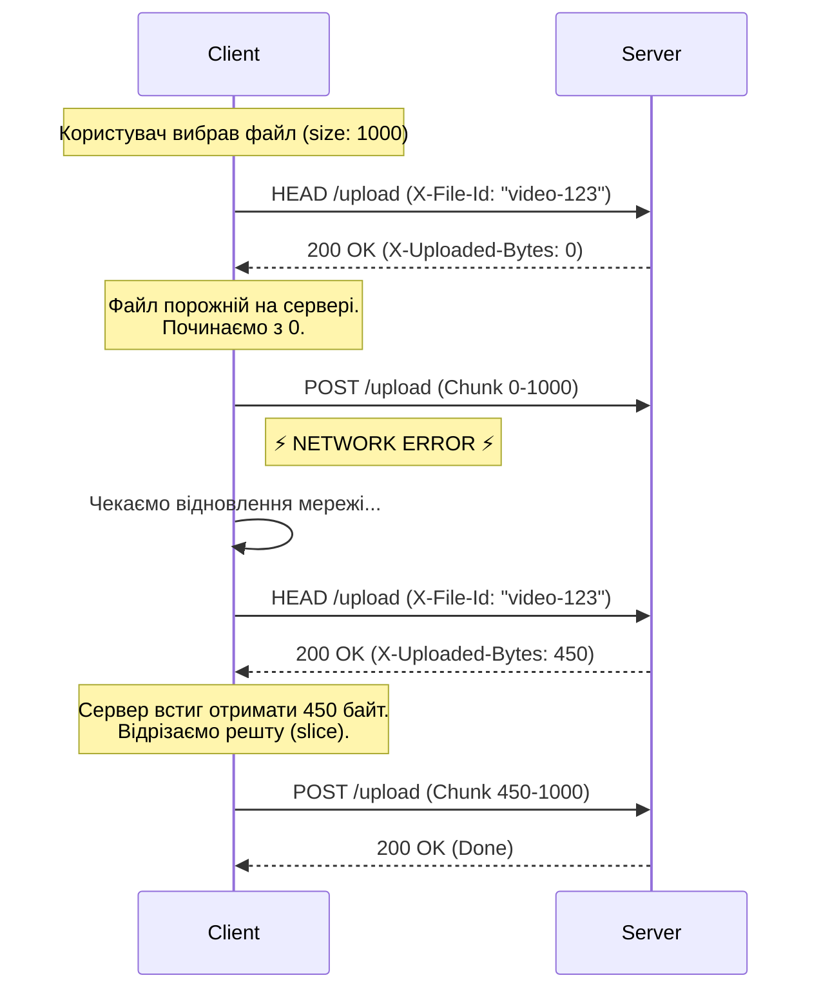

# Відновлюване завантаження файлів

## Проблема

Уявіть, що ви завантажуєте відеофайл розміром 2 ГБ. На 99% інтернет зникає на секунду.
Зі стандартним `fetch` або `submit` форми вам доведеться починати все спочатку. Це поганий UX, особливо на мобільних мережах.

Вбудованого "resume" у браузерах немає. Але ми можемо реалізувати його самі, використовуючи простий алгоритм: розрізати файл і домовлятися з сервером.

## Алгоритм відновлення

Ідея проста: "Запитай сервер, що він має, і дошли решту".

::mermaid

::

::steps
### 1. Генерація File ID
Нам потрібен унікальний ідентифікатор файлу, щоб сервер розумів, про який файл йде мова при наступному запиті.
Надійна комбінація: `name + size + lastModified`.

### 2. Перевірка статусу
Перед відправкою (або після помилки) питаємо сервер: "Скільки байт цього файлу ти вже маєш?".

### 3. Відправка залишку
Використовуємо `file.slice(startByte)` щоб відрізати вже завантажену частину і відправити тільки те, що залишилось.
::

## Реалізація Uploader

Ми створимо клас `Uploader`, який капсулює цю логіку. Ми використаємо `XMLHttpRequest` для progress bar, оскільки `fetch` поки не вміє відстежувати upload progress.

### Код класу

```javascript
class Uploader {
  constructor(file, options) {
    this.file = file;
    this.options = options || {};
    // Унікальний ID файлу
    this.fileId = file.name + '-' + file.size + '-' + file.lastModified;
  }

  // Запитуємо у сервера, скільки байт вже завантажено
  async getUploadedBytes() {
    const response = await fetch('/status', {
      headers: {
        'X-File-Id': this.fileId
      }
    });

    if (response.status !== 200) {
      throw new Error("Can't get uploaded bytes: " + response.statusText);
    }

    const text = await response.text();
    return +text; // Перетворюємо рядок "1024" в число 1024
  }

  // Головний метод завантаження
  async upload() {
    // 1. Скільки ми вже завантажили?
    this.startByte = await this.getUploadedBytes();

    console.log(`Відновлюємо з ${this.startByte} байт`);

    if (this.startByte >= this.file.size) {
        console.log("Файл вже повністю завантажено!");
        return;
    }

    // 2. Створюємо запит
    const xhr = new XMLHttpRequest();
    this.xhr = xhr;
    
    xhr.open("POST", "/upload", true);
    
    // IDs для сервера
    xhr.setRequestHeader('X-File-Id', this.fileId);
    xhr.setRequestHeader('X-Start-Byte', this.startByte);

    // 3. Відстежуємо прогрес (Upload Events)
    xhr.upload.onprogress = (e) => {
        // e.loaded - скільки відправлено в ЦЬОМУ запиті
        // this.startByte - скільки вже БУЛО на сервері
        // totalLoaded - реальний прогрес
        const totalLoaded = this.startByte + e.loaded;
        const totalSize = this.file.size; // Важливо використовувати original file size
        
        const percent = Math.round((totalLoaded / totalSize) * 100);
        console.log(`Прогрес: ${percent}%`);
        
        // Викликаємо колбек, якщо передали
        if (this.options.onProgress) {
            this.options.onProgress(percent, totalLoaded, totalSize);
        }
    };

    // 4. Відправляємо тільки залишок!
    // Метод file.slice() працює миттєво і не копіює дані в пам'ять
    const chunk = this.file.slice(this.startByte);
    
    return new Promise((resolve, reject) => {
        xhr.onload = () => {
             if (xhr.status === 200) {
                 resolve("Success");
             } else {
                 reject(new Error("Upload failed: " + xhr.statusText));
             }
        };

        xhr.onerror = () => reject(new Error("Network Error"));
        xhr.onabort = () => resolve("Aborted");

        xhr.send(chunk); 
    });
  }

  stop() {
    if (this.xhr) {
      this.xhr.abort();
    }
  }
}
```

## Використання

Ось як це виглядає в інтерфейсі:

```html
<input type="file" id="fileInput">
<button id="uploadBtn">Upload</button>
<button id="stopBtn">Stop</button>
<div id="progress">0%</div>

<script>
  let uploader;

  document.getElementById('uploadBtn').onclick = async () => {
    const file = document.getElementById('fileInput').files[0];
    if (!file) return;

    uploader = new Uploader(file, {
      onProgress: (percent) => {
        document.getElementById('progress').innerText = percent + '%';
      }
    });

    try {
      await uploader.upload();
      console.log('Завантаження завершено!');
    } catch (err) {
      console.error('Помилка:', err);
      // Тут можна автоматично спробувати ще раз через 3 сек
      // setTimeout(() => uploader.upload(), 3000);
    }
  };

  document.getElementById('stopBtn').onclick = () => {
    if (uploader) uploader.stop();
  };
</script>
```

## Серверна логіка

Звісно, це працюватиме тільки якщо сервер підтримує таку логіку. Сервер повинен:

1.  Приймати заголовки `X-File-Id` та `X-Start-Byte`.
2.  Якщо `X-Start-Byte > 0`, відкривати файл у режимі **append** (дописування).
3.  Якщо це новий файл (`startByte === 0`), створювати його.

::warning
**Проксі та буферизація**
Сервери типу Nginx часто буферизують весь запит перед тим, як передати його додатку (Node.js/PHP). Це вбиває ідею прогресу та відновлення в реальному часі. 
Для коректної роботи потрібно налаштувати сервер на вимкнення буферизації тіла запиту (`proxy_request_buffering off;` у Nginx).
::

## Підсумки

::card-group

:::card{icon="lucide:scissors"}
#title
File Slice

#description
Метод `blob.slice()` — це магія, що дозволяє нам відправляти файл шматками без завантаження всього файлу в оперативну пам'ять.
:::

:::card{icon="lucide:repeat"}
#title
Resumable

#description
Ключ до відновлення — знати, на якому байті ми зупинилися. Ніколи не покладайтеся на клієнтський прогрес для цього. Завжди запитуйте сервер.
:::

:::card{icon="lucide:server"}
#title
Server Side

#description
Клієнтська частина — це лише половина справи. Сервер повинен вміти приймати "дописані" шматки даних.
:::

::
