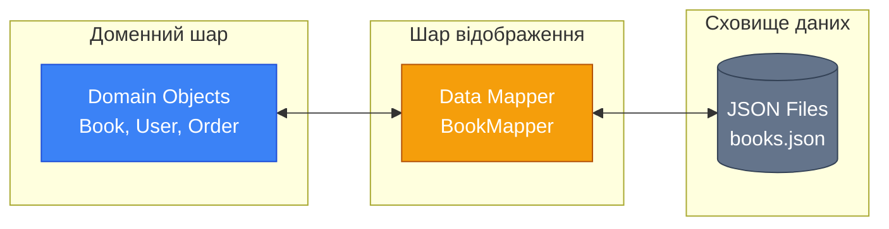
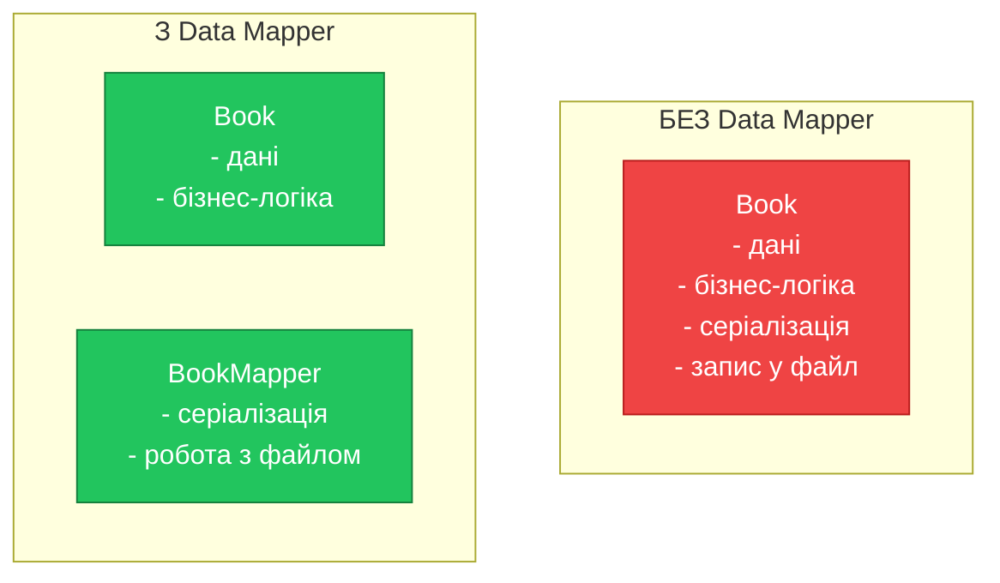
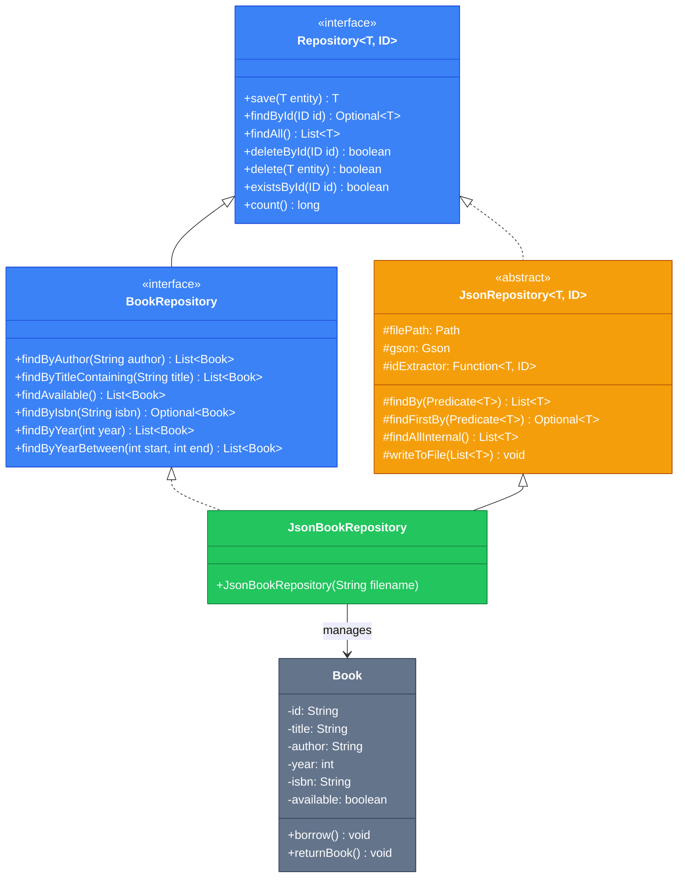

# Data Mapper: Repository та DAO патерни (Частина 1)

## Вступ: Проблема змішування відповідальностей

Уявіть, що ви розробляєте систему управління бібліотекою. У вас є клас `Book`, і вам потрібно зберігати книги у JSON-файл та читати їх звідти. Найпростіший підхід — додати методи `save()` та `load()` прямо в клас `Book`:

```java showLineNumbers
public class Book {
    private String id;
    private String title;
    private String author;

    public void saveToFile(String filename) {
        // Логіка серіалізації в JSON
        // Запис у файл
    }

    public static Book loadFromFile(String filename, String id) {
        // Читання з файлу
        // Десеріалізація з JSON
        return book;
    }
}
```

На перший погляд, це зручно. Але що відбувається, коли система росте?

::warning
**Проблеми такого підходу:**

- Клас `Book` знає занадто багато: і про свою бізнес-логіку, і про формат зберігання, і про файлову систему
- Неможливо змінити формат зберігання (наприклад, з JSON на XML) без зміни класу `Book`
- Неможливо тестувати бізнес-логіку окремо від логіки персистентності
- Порушення принципу єдиної відповідальності (Single Responsibility Principle)

::

Саме для вирішення цих проблем Мартін Фаулер у своїй книзі **"Patterns of Enterprise Application Architecture" (2002)** описав патерн **Data Mapper** — один із ключових архітектурних патернів для розділення доменної моделі від логіки персистентності.

> "A layer of Mappers that moves data between objects and a database while keeping them independent of each other and the mapper itself."
> — Martin Fowler, [P of EAA](https://martinfowler.com/eaaCatalog/dataMapper.html)

## Фундаментальні концепції

### Що таке Data Mapper?

**Data Mapper** (Відображувач даних) — це патерн, який створює прошарок між доменними об'єктами (Domain Objects) та сховищем даних. Цей прошарок відповідає за:

1. **Перетворення** об'єктів у формат, придатний для зберігання
2. **Читання** даних зі сховища та створення об'єктів
3. **Ізоляцію** доменної моделі від деталей персистентності

::mermaid



::

### Repository vs DAO: Історичний контекст

Перш ніж заглибитися в реалізацію, важливо розуміти різницю між двома спорідненими патернами:

| Аспект                | DAO (Data Access Object)                    | Repository                                         |
| :-------------------- | :------------------------------------------ | :------------------------------------------------- |
| **Походження**        | Core J2EE Patterns (Sun, 2001)              | Domain-Driven Design (Eric Evans, 2003)            |
| **Рівень абстракції** | Низький — близький до сховища               | Високий — близький до домену                       |
| **Мова інтерфейсу**   | CRUD-операції: `insert`, `update`, `delete` | Доменна мова: `findActiveUsers`, `getOverdueBooks` |
| **Фокус**             | Технічний доступ до даних                   | Колекція доменних об'єктів                         |

::tip
У сучасній розробці ці терміни часто використовуються як синоніми. Головне — розуміти принцип: **відокремлення доменної логіки від логіки персистентності**.
::

### Чому JSON та плоскі файли?

Використання JSON-файлів як сховища даних — це чудовий спосіб:

1. **Вивчити патерни** без накладних витрат на налаштування бази даних
2. **Зрозуміти суть** відображення об'єктів на дані
3. **Створити прототип** перед переходом на повноцінну БД
4. **Розробити десктопні застосунки**, де JSON — природний формат зберігання

У цьому матеріалі ми використовуємо бібліотеку **GSON** від Google для серіалізації/десеріалізації об'єктів.

## Практична реалізація: від простого до складного

### Крок 1: Доменна модель

Почнемо з простої доменної моделі. Створимо клас `Book`, який нічого не знає про те, як і де він буде зберігатися:

```java showLineNumbers
package com.example.domain;

import java.util.Objects;
import java.util.UUID;

/**
 * Доменна модель книги.
 * Цей клас повністю ізольований від логіки персистентності.
 */
public class Book {
    private final String id;
    private String title;
    private String author;
    private int year;
    private String isbn;
    private boolean available;

    // Конструктор для створення нової книги
    public Book(String title, String author, int year, String isbn) {
        this.id = UUID.randomUUID().toString();
        this.title = title;
        this.author = author;
        this.year = year;
        this.isbn = isbn;
        this.available = true;
    }

    // Конструктор для відновлення з персистентного сховища
    public Book(String id, String title, String author, int year, String isbn, boolean available) {
        this.id = id;
        this.title = title;
        this.author = author;
        this.year = year;
        this.isbn = isbn;
        this.available = available;
    }

    // Бізнес-логіка
    public void borrow() {
        if (!available) {
            throw new IllegalStateException("Книга вже видана");
        }
        this.available = false;
    }

    public void returnBook() {
        if (available) {
            throw new IllegalStateException("Книга не була видана");
        }
        this.available = true;
    }

    // Геттери
    public String getId() { return id; }
    public String getTitle() { return title; }
    public String getAuthor() { return author; }
    public int getYear() { return year; }
    public String getIsbn() { return isbn; }
    public boolean isAvailable() { return available; }

    // Сеттери для зміни даних
    public void setTitle(String title) { this.title = title; }
    public void setAuthor(String author) { this.author = author; }
    public void setYear(int year) { this.year = year; }
    public void setIsbn(String isbn) { this.isbn = isbn; }

    @Override
    public boolean equals(Object o) {
        if (this == o) return true;
        if (o == null || getClass() != o.getClass()) return false;
        Book book = (Book) o;
        return Objects.equals(id, book.id);
    }

    @Override
    public int hashCode() {
        return Objects.hash(id);
    }

    @Override
    public String toString() {
        return "Book{" +
                "id='" + id + '\'' +
                ", title='" + title + '\'' +
                ", author='" + author + '\'' +
                ", year=" + year +
                ", available=" + available +
                '}';
    }
}
```

**Зверніть увагу на ключові моменти:**

- **Рядок 12**: `id` є `final` — ідентифікатор незмінний після створення
- **Рядки 18-26**: Конструктор для нових об'єктів генерує UUID автоматично
- **Рядки 28-35**: Окремий конструктор для відновлення об'єкта зі сховища
- **Рядки 38-48**: Бізнес-логіка інкапсульована в методах `borrow()` та `returnBook()`
- Клас не має жодних залежностей від бібліотек персистентності

### Крок 2: Найпростіший Data Mapper

Тепер створимо Data Mapper, який відповідатиме за збереження та читання книг з JSON-файлу:

```java showLineNumbers
package com.example.persistence;

import com.example.domain.Book;
import com.google.gson.Gson;
import com.google.gson.GsonBuilder;
import com.google.gson.reflect.TypeToken;

import java.io.*;
import java.lang.reflect.Type;
import java.nio.file.Files;
import java.nio.file.Path;
import java.util.ArrayList;
import java.util.List;
import java.util.Optional;

/**
 * Простий Data Mapper для роботи з книгами.
 * Відповідає за перетворення між доменними об'єктами та JSON.
 */
public class BookMapper {
    private final Path filePath;
    private final Gson gson;

    public BookMapper(String filename) {
        this.filePath = Path.of(filename);
        this.gson = new GsonBuilder()
                .setPrettyPrinting()
                .create();
    }

    /**
     * Зберігає книгу у файл.
     * Якщо книга з таким id вже існує — оновлює її.
     */
    public void save(Book book) {
        List<Book> books = findAll();

        // Шукаємо існуючу книгу за id
        boolean found = false;
        for (int i = 0; i < books.size(); i++) {
            if (books.get(i).getId().equals(book.getId())) {
                books.set(i, book);
                found = true;
                break;
            }
        }

        // Якщо не знайдено — додаємо нову
        if (!found) {
            books.add(book);
        }

        writeToFile(books);
    }

    /**
     * Знаходить книгу за її ідентифікатором.
     */
    public Optional<Book> findById(String id) {
        return findAll().stream()
                .filter(book -> book.getId().equals(id))
                .findFirst();
    }

    /**
     * Повертає всі книги зі сховища.
     */
    public List<Book> findAll() {
        if (!Files.exists(filePath)) {
            return new ArrayList<>();
        }

        try (Reader reader = new FileReader(filePath.toFile())) {
            Type listType = new TypeToken<ArrayList<Book>>(){}.getType();
            List<Book> books = gson.fromJson(reader, listType);
            return books != null ? books : new ArrayList<>();
        } catch (IOException e) {
            throw new RuntimeException("Помилка читання файлу: " + filePath, e);
        }
    }

    /**
     * Видаляє книгу за ідентифікатором.
     */
    public boolean delete(String id) {
        List<Book> books = findAll();
        boolean removed = books.removeIf(book -> book.getId().equals(id));
        if (removed) {
            writeToFile(books);
        }
        return removed;
    }

    /**
     * Записує список книг у файл.
     */
    private void writeToFile(List<Book> books) {
        try (Writer writer = new FileWriter(filePath.toFile())) {
            gson.toJson(books, writer);
        } catch (IOException e) {
            throw new RuntimeException("Помилка запису у файл: " + filePath, e);
        }
    }
}
```

**Декомпозиція коду:**

- **Рядки 24-28**: Ініціалізація GSON з форматуванням для читабельності
- **Рядок 35**: `findAll()` завантажує поточний стан файлу перед збереженням
- **Рядки 39-44**: Пошук існуючої книги для оновлення (upsert-логіка)
- **Рядок 61**: `Optional` — сучасний підхід для обробки можливої відсутності результату
- **Рядок 72**: `TypeToken` — механізм GSON для роботи з generic-типами

### Крок 3: Використання Data Mapper

Подивимося, як використовувати наш маппер:

```java showLineNumbers
package com.example;

import com.example.domain.Book;
import com.example.persistence.BookMapper;

import java.util.List;
import java.util.Optional;

public class LibraryDemo {
    public static void main(String[] args) {
        // Створюємо маппер з вказівкою файлу для зберігання
        BookMapper bookMapper = new BookMapper("data/books.json");

        // Створюємо нові книги (доменні об'єкти)
        Book book1 = new Book(
            "Чистий код",
            "Роберт Мартін",
            2008,
            "978-0132350884"
        );

        Book book2 = new Book(
            "Патерни проєктування",
            "Банда чотирьох",
            1994,
            "978-0201633610"
        );

        // Зберігаємо книги через маппер
        bookMapper.save(book1);
        bookMapper.save(book2);
        System.out.println("Книги збережено!");

        // Читаємо всі книги
        List<Book> allBooks = bookMapper.findAll();
        System.out.println("\nВсі книги:");
        allBooks.forEach(System.out::println);

        // Знаходимо конкретну книгу
        Optional<Book> foundBook = bookMapper.findById(book1.getId());
        foundBook.ifPresent(book -> {
            System.out.println("\nЗнайдена книга: " + book.getTitle());

            // Виконуємо бізнес-логіку
            book.borrow();
            System.out.println("Книга видана, доступність: " + book.isAvailable());

            // Зберігаємо оновлений стан
            bookMapper.save(book);
        });

        // Перевіряємо оновлення
        System.out.println("\nПісля оновлення:");
        bookMapper.findAll().forEach(System.out::println);
    }
}
```

Результат виконання створить файл `data/books.json`:

```json [data/books.json]
[
    {
        "id": "a1b2c3d4-e5f6-7890-abcd-ef1234567890",
        "title": "Чистий код",
        "author": "Роберт Мартін",
        "year": 2008,
        "isbn": "978-0132350884",
        "available": false
    },
    {
        "id": "b2c3d4e5-f6a7-8901-bcde-f12345678901",
        "title": "Патерни проєктування",
        "author": "Банда чотирьох",
        "year": 1994,
        "isbn": "978-0201633610",
        "available": true
    }
]
```

## Архітектурний аналіз: переваги Data Mapper

Розглянемо детальніше, які переваги ми отримали:

### 1. Розділення відповідальностей (Separation of Concerns)

::mermaid



::

### 2. Тестованість

Тепер ми можемо тестувати бізнес-логіку `Book` окремо від персистентності:

```java showLineNumbers
package com.example.domain;

import org.junit.jupiter.api.Test;
import static org.junit.jupiter.api.Assertions.*;

class BookTest {
    @Test
    void should_change_availability_when_borrowed() {
        // Given
        Book book = new Book("Test Book", "Author", 2024, "ISBN");
        assertTrue(book.isAvailable());

        // When
        book.borrow();

        // Then
        assertFalse(book.isAvailable());
    }

    @Test
    void should_throw_exception_when_borrowing_unavailable_book() {
        // Given
        Book book = new Book("Test Book", "Author", 2024, "ISBN");
        book.borrow(); // Перша видача

        // When/Then
        assertThrows(IllegalStateException.class, book::borrow);
    }

    @Test
    void should_restore_availability_when_returned() {
        // Given
        Book book = new Book("Test Book", "Author", 2024, "ISBN");
        book.borrow();

        // When
        book.returnBook();

        // Then
        assertTrue(book.isAvailable());
    }
}
```

### 3. Гнучкість зміни сховища

Завтра ви можете замінити JSON на XML, YAML або навіть базу даних — і доменна модель залишиться незмінною:

```java showLineNumbers
// Поточна реалізація
BookMapper jsonMapper = new BookMapper("books.json");

// Можлива майбутня реалізація (без зміни Book)
// BookXmlMapper xmlMapper = new BookXmlMapper("books.xml");
// BookDatabaseMapper dbMapper = new BookDatabaseMapper(connection);
```

## Еволюція до Repository Pattern

Data Mapper — це добре, але він має обмеження:

- Прив'язка до конкретної реалізації (`BookMapper`)
- Неможливість легкої заміни реалізації
- Тісне зв'язування клієнтського коду з маппером

**Repository Pattern** вирішує ці проблеми через **абстракцію**. Давайте еволюціонуємо наш код.

### Базовий інтерфейс Repository

Створимо загальний інтерфейс, який визначає контракт для будь-якого репозиторію:

```java showLineNumbers
package com.example.repository;

import java.util.List;
import java.util.Optional;

/**
 * Базовий інтерфейс Repository.
 * Визначає стандартні CRUD-операції для будь-якої сутності.
 *
 * @param <T> тип сутності
 * @param <ID> тип ідентифікатора
 */
public interface Repository<T, ID> {

    /**
     * Зберігає сутність.
     * Якщо сутність нова — створює, якщо існує — оновлює.
     *
     * @param entity сутність для збереження
     * @return збережена сутність
     */
    T save(T entity);

    /**
     * Знаходить сутність за ідентифікатором.
     *
     * @param id ідентифікатор
     * @return Optional з сутністю або порожній Optional
     */
    Optional<T> findById(ID id);

    /**
     * Повертає всі сутності.
     *
     * @return список всіх сутностей
     */
    List<T> findAll();

    /**
     * Видаляє сутність за ідентифікатором.
     *
     * @param id ідентифікатор
     * @return true, якщо сутність було видалено
     */
    boolean deleteById(ID id);

    /**
     * Видаляє конкретну сутність.
     *
     * @param entity сутність для видалення
     * @return true, якщо сутність було видалено
     */
    boolean delete(T entity);

    /**
     * Перевіряє існування сутності за ідентифікатором.
     *
     * @param id ідентифікатор
     * @return true, якщо сутність існує
     */
    boolean existsById(ID id);

    /**
     * Повертає кількість сутностей у сховищі.
     *
     * @return кількість сутностей
     */
    long count();
}
```

### Спеціалізований інтерфейс BookRepository

Тепер створимо інтерфейс, специфічний для книг, з доменними методами:

```java showLineNumbers
package com.example.repository;

import com.example.domain.Book;

import java.util.List;

/**
 * Репозиторій для роботи з книгами.
 * Розширює базовий Repository та додає методи, специфічні для домену.
 */
public interface BookRepository extends Repository<Book, String> {

    /**
     * Знаходить книги за автором.
     *
     * @param author ім'я автора
     * @return список книг автора
     */
    List<Book> findByAuthor(String author);

    /**
     * Знаходить книги за назвою (часткове співпадіння).
     *
     * @param title частина назви
     * @return список знайдених книг
     */
    List<Book> findByTitleContaining(String title);

    /**
     * Знаходить всі доступні книги.
     *
     * @return список доступних книг
     */
    List<Book> findAvailable();

    /**
     * Знаходить книгу за ISBN.
     *
     * @param isbn ISBN книги
     * @return Optional з книгою
     */
    java.util.Optional<Book> findByIsbn(String isbn);

    /**
     * Знаходить книги, видані в певному році.
     *
     * @param year рік видання
     * @return список книг
     */
    List<Book> findByYear(int year);

    /**
     * Знаходить книги, видані в діапазоні років.
     *
     * @param startYear початковий рік
     * @param endYear кінцевий рік
     * @return список книг
     */
    List<Book> findByYearBetween(int startYear, int endYear);
}
```

**Чому це важливо?**

Зверніть увагу на мову інтерфейсу. Методи називаються `findByAuthor`, `findAvailable`, `findByTitleContaining` — це **доменна мова**, зрозуміла бізнес-аналітикам та розробникам. Порівняйте з низькорівневим:

```java
// DAO-стиль (технічний)
List<Book> select(String whereClause);

// Repository-стиль (доменний)
List<Book> findAvailable();
List<Book> findByAuthor(String author);
```

### Абстрактна реалізація BaseRepository

Тепер створимо абстрактний клас, який реалізує спільну логіку для всіх JSON-репозиторіїв:

```java showLineNumbers
package com.example.repository.json;

import com.example.repository.Repository;
import com.google.gson.Gson;
import com.google.gson.GsonBuilder;
import com.google.gson.reflect.TypeToken;

import java.io.*;
import java.lang.reflect.Type;
import java.nio.file.Files;
import java.nio.file.Path;
import java.util.ArrayList;
import java.util.List;
import java.util.Optional;
import java.util.function.Function;
import java.util.function.Predicate;

/**
 * Абстрактна базова реалізація Repository для JSON-сховища.
 * Містить всю логіку роботи з файлами та GSON.
 * Конкретні репозиторії наслідують цей клас.
 *
 * @param <T> тип сутності
 * @param <ID> тип ідентифікатора
 */
public abstract class JsonRepository<T, ID> implements Repository<T, ID> {

    protected final Path filePath;
    protected final Gson gson;
    protected final Type listType;

    /**
     * Функція для отримання ідентифікатора з сутності.
     * Кожен конкретний репозиторій повинен надати свою реалізацію.
     */
    protected final Function<T, ID> idExtractor;

    /**
     * Конструктор базового репозиторію.
     *
     * @param filename шлях до JSON-файлу
     * @param listType тип для десеріалізації списку (TypeToken)
     * @param idExtractor функція витягування ID з сутності
     */
    protected JsonRepository(String filename, Type listType, Function<T, ID> idExtractor) {
        this.filePath = Path.of(filename);
        this.listType = listType;
        this.idExtractor = idExtractor;
        this.gson = new GsonBuilder()
                .setPrettyPrinting()
                .serializeNulls()
                .create();

        ensureDirectoryExists();
    }

    /**
     * Створює директорію для файлу, якщо вона не існує.
     */
    private void ensureDirectoryExists() {
        Path parent = filePath.getParent();
        if (parent != null && !Files.exists(parent)) {
            try {
                Files.createDirectories(parent);
            } catch (IOException e) {
                throw new RuntimeException("Не вдалося створити директорію: " + parent, e);
            }
        }
    }

    @Override
    public T save(T entity) {
        List<T> entities = findAllInternal();
        ID id = idExtractor.apply(entity);

        // Шукаємо існуючу сутність
        boolean found = false;
        for (int i = 0; i < entities.size(); i++) {
            if (idExtractor.apply(entities.get(i)).equals(id)) {
                entities.set(i, entity);
                found = true;
                break;
            }
        }

        if (!found) {
            entities.add(entity);
        }

        writeToFile(entities);
        return entity;
    }

    @Override
    public Optional<T> findById(ID id) {
        return findAllInternal().stream()
                .filter(entity -> idExtractor.apply(entity).equals(id))
                .findFirst();
    }

    @Override
    public List<T> findAll() {
        return new ArrayList<>(findAllInternal());
    }

    @Override
    public boolean deleteById(ID id) {
        List<T> entities = findAllInternal();
        boolean removed = entities.removeIf(entity ->
            idExtractor.apply(entity).equals(id)
        );

        if (removed) {
            writeToFile(entities);
        }
        return removed;
    }

    @Override
    public boolean delete(T entity) {
        return deleteById(idExtractor.apply(entity));
    }

    @Override
    public boolean existsById(ID id) {
        return findById(id).isPresent();
    }

    @Override
    public long count() {
        return findAllInternal().size();
    }

    /**
     * Внутрішній метод для пошуку за предикатом.
     * Використовується конкретними репозиторіями для реалізації
     * специфічних методів пошуку.
     *
     * @param predicate умова фільтрації
     * @return відфільтрований список
     */
    protected List<T> findBy(Predicate<T> predicate) {
        return findAllInternal().stream()
                .filter(predicate)
                .toList();
    }

    /**
     * Внутрішній метод для знаходження першого елемента за предикатом.
     *
     * @param predicate умова пошуку
     * @return Optional з результатом
     */
    protected Optional<T> findFirstBy(Predicate<T> predicate) {
        return findAllInternal().stream()
                .filter(predicate)
                .findFirst();
    }

    /**
     * Читає всі сутності з файлу.
     */
    protected List<T> findAllInternal() {
        if (!Files.exists(filePath)) {
            return new ArrayList<>();
        }

        try (Reader reader = new FileReader(filePath.toFile())) {
            List<T> entities = gson.fromJson(reader, listType);
            return entities != null ? new ArrayList<>(entities) : new ArrayList<>();
        } catch (IOException e) {
            throw new RepositoryException("Помилка читання з файлу: " + filePath, e);
        }
    }

    /**
     * Записує всі сутності у файл.
     */
    protected void writeToFile(List<T> entities) {
        try (Writer writer = new FileWriter(filePath.toFile())) {
            gson.toJson(entities, writer);
        } catch (IOException e) {
            throw new RepositoryException("Помилка запису у файл: " + filePath, e);
        }
    }
}
```

**Ключові елементи реалізації:**

- **Рядок 35**: `Function<T, ID> idExtractor` — функціональний інтерфейс для отримання ID з будь-якої сутності
- **Рядки 71-86**: Логіка upsert (update or insert) — спільна для всіх репозиторіїв
- **Рядки 127-142**: Захищені методи `findBy` та `findFirstBy` для використання в нащадках

### Кастомний Exception

Створимо власний виняток для помилок репозиторію:

```java showLineNumbers
package com.example.repository.json;

/**
 * Виняток, що виникає при помилках роботи з репозиторієм.
 */
public class RepositoryException extends RuntimeException {

    public RepositoryException(String message) {
        super(message);
    }

    public RepositoryException(String message, Throwable cause) {
        super(message, cause);
    }
}
```

### Конкретна реалізація JsonBookRepository

Тепер реалізуємо `BookRepository` на основі нашого абстрактного класу:

```java showLineNumbers
package com.example.repository.json;

import com.example.domain.Book;
import com.example.repository.BookRepository;
import com.google.gson.reflect.TypeToken;

import java.util.ArrayList;
import java.util.List;
import java.util.Optional;

/**
 * JSON-реалізація репозиторію книг.
 * Зберігає книги у JSON-файл та надає методи для роботи з ними.
 */
public class JsonBookRepository extends JsonRepository<Book, String> implements BookRepository {

    /**
     * Створює репозиторій з вказаним шляхом до файлу.
     *
     * @param filename шлях до JSON-файлу
     */
    public JsonBookRepository(String filename) {
        super(
            filename,
            new TypeToken<ArrayList<Book>>(){}.getType(),
            Book::getId  // Method reference для витягування ID
        );
    }

    @Override
    public List<Book> findByAuthor(String author) {
        return findBy(book ->
            book.getAuthor().toLowerCase().contains(author.toLowerCase())
        );
    }

    @Override
    public List<Book> findByTitleContaining(String title) {
        return findBy(book ->
            book.getTitle().toLowerCase().contains(title.toLowerCase())
        );
    }

    @Override
    public List<Book> findAvailable() {
        return findBy(Book::isAvailable);
    }

    @Override
    public Optional<Book> findByIsbn(String isbn) {
        return findFirstBy(book -> book.getIsbn().equals(isbn));
    }

    @Override
    public List<Book> findByYear(int year) {
        return findBy(book -> book.getYear() == year);
    }

    @Override
    public List<Book> findByYearBetween(int startYear, int endYear) {
        return findBy(book ->
            book.getYear() >= startYear && book.getYear() <= endYear
        );
    }
}
```

**Зверніть увагу:**

- **Рядок 26**: `Book::getId` — елегантний method reference для функції витягування ID
- **Рядки 31-34**: Реалізація `findByAuthor` використовує захищений метод `findBy` з базового класу
- **Рядок 46**: `Book::isAvailable` — ще один method reference для предиката

## Архітектура рішення

::mermaid



::

## Практичне використання

Тепер подивимося, як використовувати наш репозиторій у клієнтському коді:

```java showLineNumbers
package com.example;

import com.example.domain.Book;
import com.example.repository.BookRepository;
import com.example.repository.json.JsonBookRepository;

import java.util.List;

public class LibraryApplication {

    // Залежність від інтерфейсу, не від реалізації!
    private final BookRepository bookRepository;

    public LibraryApplication(BookRepository bookRepository) {
        this.bookRepository = bookRepository;
    }

    public void run() {
        // Створюємо тестові дані
        createSampleBooks();

        // Демонструємо можливості репозиторію
        demonstrateRepositoryCapabilities();
    }

    private void createSampleBooks() {
        System.out.println("=== Створення книг ===\n");

        List<Book> books = List.of(
            new Book("Чистий код", "Роберт Мартін", 2008, "978-0132350884"),
            new Book("Чиста архітектура", "Роберт Мартін", 2017, "978-0134494166"),
            new Book("Патерни проєктування", "Банда чотирьох", 1994, "978-0201633610"),
            new Book("Рефакторинг", "Мартін Фаулер", 1999, "978-0201485677"),
            new Book("Domain-Driven Design", "Ерік Еванс", 2003, "978-0321125217"),
            new Book("Effective Java", "Джошуа Блох", 2018, "978-0134685991")
        );

        books.forEach(book -> {
            bookRepository.save(book);
            System.out.println("Збережено: " + book.getTitle());
        });

        System.out.println("\nВсього книг: " + bookRepository.count());
    }

    private void demonstrateRepositoryCapabilities() {
        System.out.println("\n=== Демонстрація можливостей ===\n");

        // Пошук за автором
        System.out.println("Книги Роберта Мартіна:");
        bookRepository.findByAuthor("Мартін")
            .forEach(book -> System.out.println("  - " + book.getTitle()));

        // Пошук за частиною назви
        System.out.println("\nКниги з 'чист' у назві:");
        bookRepository.findByTitleContaining("чист")
            .forEach(book -> System.out.println("  - " + book.getTitle()));

        // Пошук за роками
        System.out.println("\nКниги 2000-2010:");
        bookRepository.findByYearBetween(2000, 2010)
            .forEach(book -> System.out.println("  - " + book.getTitle() + " (" + book.getYear() + ")"));

        // Видача книги
        System.out.println("\n=== Операція видачі книги ===");
        bookRepository.findByIsbn("978-0132350884").ifPresent(book -> {
            System.out.println("Видаємо: " + book.getTitle());
            book.borrow();
            bookRepository.save(book);
            System.out.println("Статус: " + (book.isAvailable() ? "доступна" : "видана"));
        });

        // Доступні книги
        System.out.println("\nДоступні книги:");
        bookRepository.findAvailable()
            .forEach(book -> System.out.println("  - " + book.getTitle()));
    }

    public static void main(String[] args) {
        // Ін'єкція залежності — передаємо конкретну реалізацію
        BookRepository repository = new JsonBookRepository("data/library/books.json");
        LibraryApplication app = new LibraryApplication(repository);
        app.run();
    }
}
```

**Важливі моменти:**

- **Рядок 12**: Залежність від інтерфейсу `BookRepository`, не від конкретного `JsonBookRepository`
- **Рядок 14**: Конструктор приймає інтерфейс — це Dependency Injection
- **Рядок 81**: Конкретна реалізація створюється в одному місці (точка входу)

Якщо завтра ми вирішимо зберігати книги в БД, потрібно лише:

1. Створити `DatabaseBookRepository implements BookRepository`
2. Замінити рядок 81 на `new DatabaseBookRepository(connection)`

Жодних інших змін у коді не потрібно!

## Підсумки першої частини

У цій частині ми розглянули:

::card-group
::card{title="Data Mapper Pattern"}
Патерн розділення доменних об'єктів та логіки персистентності, описаний Мартіном Фаулером у книзі "Patterns of Enterprise Application Architecture".
::

::card{title="Repository Pattern"}
Абстракція колекції доменних об'єктів з доменною мовою інтерфейсу. Дозволяє замінювати реалізації без зміни клієнтського коду.
::

::card{title="Ієрархія репозиторіїв"}
Базовий інтерфейс `Repository<T, ID>` → специфічний `BookRepository` → абстрактна реалізація `JsonRepository` → конкретна `JsonBookRepository`.
::

::card{title="GSON для персистентності"}
Використання бібліотеки GSON для серіалізації/десеріалізації об'єктів у JSON без накладних витрат на налаштування БД.
::

::

У [другій частині](./02.data-mapper-part2.md) ми розглянемо:

- Unit of Work патерн
- Identity Map для кешування
- Специфікація та критерії пошуку
- Транзакційність
- Обробка конкурентного доступу
- Тестування репозиторіїв

## Корисні посилання

- [Martin Fowler — Data Mapper](https://martinfowler.com/eaaCatalog/dataMapper.html) — оригінальний опис патерну
- [Martin Fowler — Repository](https://martinfowler.com/eaaCatalog/repository.html) — опис патерну Repository
- [GSON User Guide](https://github.com/google/gson/blob/main/UserGuide.md) — офіційна документація GSON
- [Patterns of Enterprise Application Architecture](https://martinfowler.com/books/eaa.html) — книга Мартіна Фаулера

## Завдання для самоперевірки

::collapsible{title="Завдання 1: Створіть UserRepository"}
Реалізуйте повний цикл для сутності `User`:

1. Доменна модель `User` з полями: `id`, `email`, `username`, `createdAt`
2. Інтерфейс `UserRepository` з методами `findByEmail`, `findByUsername`
3. Реалізація `JsonUserRepository`

**Підказка**: Використовуйте `LocalDateTime` для дати створення. Зверніть увагу на серіалізацію дат у GSON.
::

::collapsible{title="Завдання 2: Додайте пагінацію"}
Додайте до базового інтерфейсу `Repository` метод:

```java
List<T> findAll(int page, int size);
```

Реалізуйте його в `JsonRepository` з використанням `Stream.skip()` та `Stream.limit()`.
::

::collapsible{title="Завдання 3: Batch-операції"}
Додайте методи для масових операцій:

```java
List<T> saveAll(Collection<T> entities);
void deleteAll();
void deleteAll(Collection<T> entities);
```

Оптимізуйте їх, щоб читання та запис файлу відбувалися лише один раз.
::
