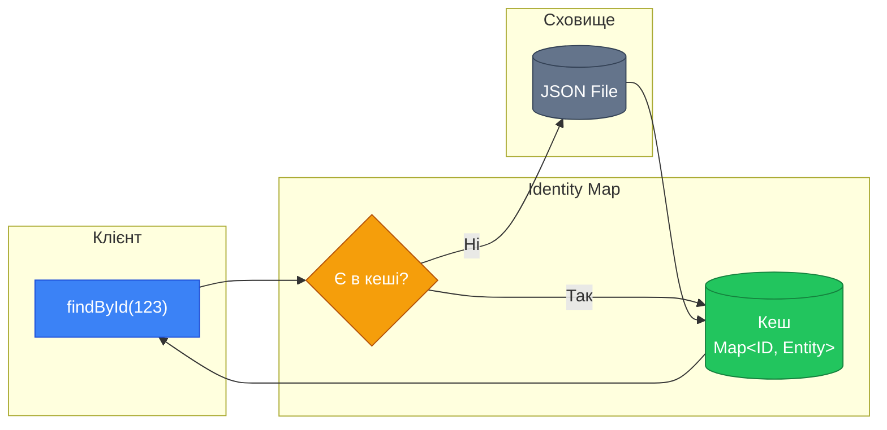
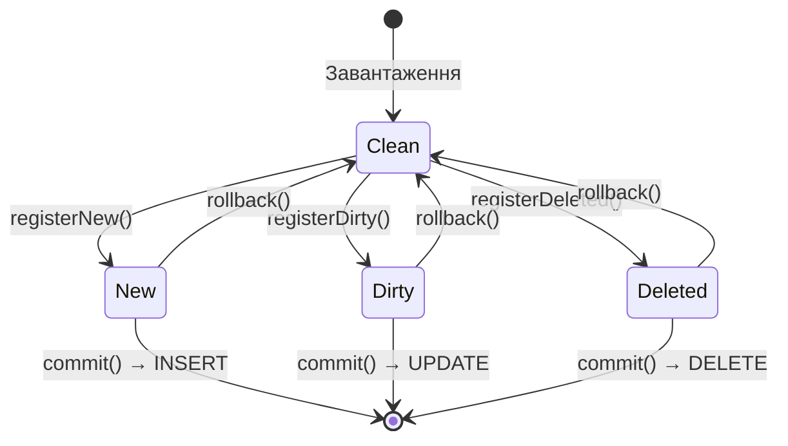
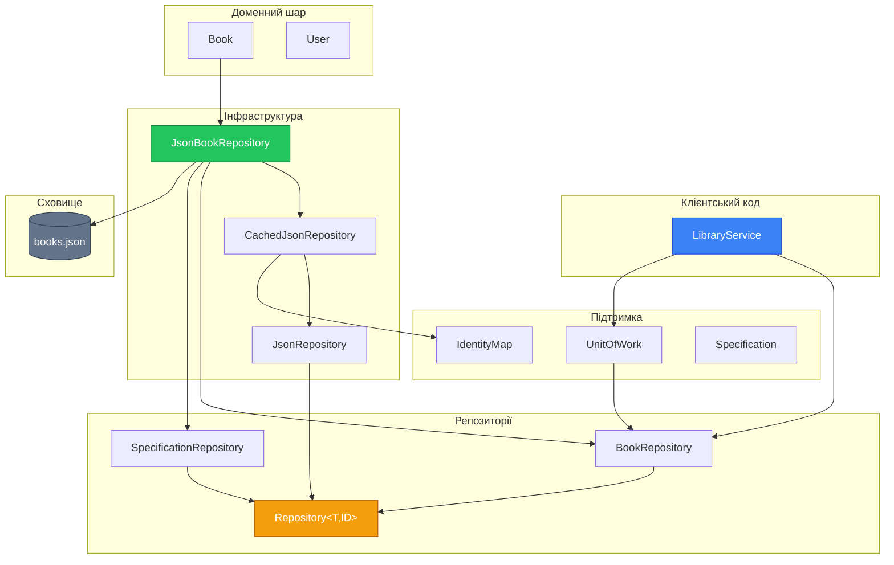

# Data Mapper: Repository та DAO патерни (Частина 2)

## Вступ до другої частини

У [першій частині](./01.data-mapper-part1.md) ми побудували фундамент:

- Розділили доменну модель від логіки персистентності
- Створили ієрархію інтерфейсів Repository
- Реалізували базовий JSON-репозиторій з GSON

Тепер ми підемо глибше та розглянемо додаткові патерни, які роблять нашу архітектуру ще потужнішою.

## Identity Map: Кешування сутностей

### Проблема повторного завантаження

Розглянемо типовий сценарій:

```java showLineNumbers
BookRepository repository = new JsonBookRepository("books.json");

// Перше завантаження
Book book1 = repository.findById("123").orElseThrow();

// Друге завантаження тієї ж книги
Book book2 = repository.findById("123").orElseThrow();

// Питання: book1 == book2 ?
System.out.println(book1 == book2); // false!
```

Кожен виклик `findById` читає файл заново і створює новий об'єкт. Це призводить до:

1. **Зайвих операцій I/O** — читання файлу кожного разу
2. **Неконсистентності** — зміни в `book1` не відобразяться в `book2`
3. **Витрат пам'яті** — дублікати об'єктів

### Рішення: Identity Map

**Identity Map** (Карта ідентичності) — патерн, описаний Мартіном Фаулером, який забезпечує, що кожен об'єкт завантажується зі сховища лише один раз.

> "Ensures that each object gets loaded only once by keeping every loaded object in a map. Looks up objects using the map when referring to them."
> — Martin Fowler, [P of EAA](https://martinfowler.com/eaaCatalog/identityMap.html)

::mermaid



::

### Реалізація Identity Map

```java showLineNumbers
package com.example.repository;

import java.util.HashMap;
import java.util.Map;
import java.util.Optional;

/**
 * Реалізація патерну Identity Map.
 * Кешує завантажені сутності за їх ідентифікаторами.
 *
 * @param <ID> тип ідентифікатора
 * @param <T> тип сутності
 */
public class IdentityMap<ID, T> {

    private final Map<ID, T> cache = new HashMap<>();

    /**
     * Отримує сутність з кешу.
     *
     * @param id ідентифікатор
     * @return Optional з сутністю або порожній Optional
     */
    public Optional<T> get(ID id) {
        return Optional.ofNullable(cache.get(id));
    }

    /**
     * Додає сутність до кешу.
     *
     * @param id ідентифікатор
     * @param entity сутність
     */
    public void put(ID id, T entity) {
        cache.put(id, entity);
    }

    /**
     * Видаляє сутність з кешу.
     *
     * @param id ідентифікатор
     */
    public void remove(ID id) {
        cache.remove(id);
    }

    /**
     * Очищає весь кеш.
     */
    public void clear() {
        cache.clear();
    }

    /**
     * Перевіряє наявність сутності в кеші.
     *
     * @param id ідентифікатор
     * @return true, якщо сутність є в кеші
     */
    public boolean contains(ID id) {
        return cache.containsKey(id);
    }

    /**
     * Повертає кількість закешованих сутностей.
     *
     * @return розмір кешу
     */
    public int size() {
        return cache.size();
    }
}
```

### Інтеграція Identity Map у Repository

Додамо підтримку Identity Map до нашого базового репозиторію:

```java showLineNumbers
package com.example.repository.json;

import com.example.repository.IdentityMap;
import com.example.repository.Repository;
import com.google.gson.Gson;
import com.google.gson.GsonBuilder;

import java.io.*;
import java.lang.reflect.Type;
import java.nio.file.Files;
import java.nio.file.Path;
import java.util.ArrayList;
import java.util.List;
import java.util.Optional;
import java.util.function.Function;
import java.util.function.Predicate;

/**
 * Покращена версія JsonRepository з підтримкою Identity Map.
 */
public abstract class CachedJsonRepository<T, ID> implements Repository<T, ID> {

    protected final Path filePath;
    protected final Gson gson;
    protected final Type listType;
    protected final Function<T, ID> idExtractor;

    // Identity Map для кешування
    protected final IdentityMap<ID, T> identityMap = new IdentityMap<>();

    // Прапорець "брудного" кешу
    private boolean cacheValid = false;
    private List<T> cachedList = null;

    protected CachedJsonRepository(String filename, Type listType, Function<T, ID> idExtractor) {
        this.filePath = Path.of(filename);
        this.listType = listType;
        this.idExtractor = idExtractor;
        this.gson = new GsonBuilder()
                .setPrettyPrinting()
                .create();
        ensureDirectoryExists();
    }

    private void ensureDirectoryExists() {
        Path parent = filePath.getParent();
        if (parent != null && !Files.exists(parent)) {
            try {
                Files.createDirectories(parent);
            } catch (IOException e) {
                throw new RepositoryException("Не вдалося створити директорію: " + parent, e);
            }
        }
    }

    @Override
    public T save(T entity) {
        ID id = idExtractor.apply(entity);

        // Оновлюємо Identity Map
        identityMap.put(id, entity);

        // Інвалідуємо кеш списку
        invalidateCache();

        // Зберігаємо у файл
        List<T> entities = loadFromFile();

        boolean found = false;
        for (int i = 0; i < entities.size(); i++) {
            if (idExtractor.apply(entities.get(i)).equals(id)) {
                entities.set(i, entity);
                found = true;
                break;
            }
        }

        if (!found) {
            entities.add(entity);
        }

        writeToFile(entities);
        return entity;
    }

    @Override
    public Optional<T> findById(ID id) {
        // Спочатку перевіряємо Identity Map
        Optional<T> cached = identityMap.get(id);
        if (cached.isPresent()) {
            return cached;
        }

        // Якщо немає в кеші — шукаємо у файлі
        Optional<T> found = findAllInternal().stream()
                .filter(entity -> idExtractor.apply(entity).equals(id))
                .findFirst();

        // Додаємо знайдене в Identity Map
        found.ifPresent(entity -> identityMap.put(id, entity));

        return found;
    }

    @Override
    public List<T> findAll() {
        return new ArrayList<>(findAllInternal());
    }

    @Override
    public boolean deleteById(ID id) {
        // Видаляємо з Identity Map
        identityMap.remove(id);
        invalidateCache();

        List<T> entities = loadFromFile();
        boolean removed = entities.removeIf(entity ->
            idExtractor.apply(entity).equals(id)
        );

        if (removed) {
            writeToFile(entities);
        }
        return removed;
    }

    @Override
    public boolean delete(T entity) {
        return deleteById(idExtractor.apply(entity));
    }

    @Override
    public boolean existsById(ID id) {
        return identityMap.contains(id) || findById(id).isPresent();
    }

    @Override
    public long count() {
        return findAllInternal().size();
    }

    /**
     * Інвалідує кеш. Викликається при модифікації даних.
     */
    protected void invalidateCache() {
        cacheValid = false;
        cachedList = null;
    }

    /**
     * Очищає Identity Map та кеш. Корисно для тестування.
     */
    public void clearCache() {
        identityMap.clear();
        invalidateCache();
    }

    protected List<T> findBy(Predicate<T> predicate) {
        return findAllInternal().stream()
                .filter(predicate)
                .toList();
    }

    protected Optional<T> findFirstBy(Predicate<T> predicate) {
        return findAllInternal().stream()
                .filter(predicate)
                .findFirst();
    }

    /**
     * Повертає всі сутності з кешу або файлу.
     */
    protected List<T> findAllInternal() {
        if (cacheValid && cachedList != null) {
            return cachedList;
        }

        cachedList = loadFromFile();
        cacheValid = true;

        // Заповнюємо Identity Map
        for (T entity : cachedList) {
            ID id = idExtractor.apply(entity);
            if (!identityMap.contains(id)) {
                identityMap.put(id, entity);
            }
        }

        return cachedList;
    }

    private List<T> loadFromFile() {
        if (!Files.exists(filePath)) {
            return new ArrayList<>();
        }

        try (Reader reader = new FileReader(filePath.toFile())) {
            List<T> entities = gson.fromJson(reader, listType);
            return entities != null ? new ArrayList<>(entities) : new ArrayList<>();
        } catch (IOException e) {
            throw new RepositoryException("Помилка читання: " + filePath, e);
        }
    }

    protected void writeToFile(List<T> entities) {
        try (Writer writer = new FileWriter(filePath.toFile())) {
            gson.toJson(entities, writer);
        } catch (IOException e) {
            throw new RepositoryException("Помилка запису: " + filePath, e);
        }
    }
}
```

**Ключові покращення:**

- **Рядок 28**: Identity Map для кешування окремих сутностей
- **Рядки 31-32**: Кеш усього списку для оптимізації `findAll()`
- **Рядки 85-97**: `findById` спочатку перевіряє кеш
- **Рядки 160-174**: Ліниве завантаження з кешуванням

## Unit of Work: Відстеження змін

### Проблема численних записів

Поточна реалізація записує файл при кожному виклику `save()`:

```java showLineNumbers
// Кожен save() викликає запис файлу
repository.save(book1);  // -> write file
repository.save(book2);  // -> write file
repository.save(book3);  // -> write file
// 3 операції запису!
```

Для файлової системи це може бути прийнятно, але для БД це катастрофа. Патерн **Unit of Work** вирішує цю проблему.

> "Maintains a list of objects affected by a business transaction and coordinates the writing out of changes."
> — Martin Fowler, [P of EAA](https://martinfowler.com/eaaCatalog/unitOfWork.html)

### Концепція Unit of Work

::mermaid



::

### Реалізація Unit of Work

```java showLineNumbers
package com.example.repository;

import java.util.*;
import java.util.function.Function;

/**
 * Реалізація патерну Unit of Work.
 * Відстежує зміни та координує їх збереження.
 *
 * @param <T> тип сутності
 * @param <ID> тип ідентифікатора
 */
public class UnitOfWork<T, ID> {

    private final Set<T> newEntities = new LinkedHashSet<>();
    private final Set<T> dirtyEntities = new LinkedHashSet<>();
    private final Set<ID> deletedIds = new LinkedHashSet<>();

    private final Function<T, ID> idExtractor;
    private final Repository<T, ID> repository;

    public UnitOfWork(Repository<T, ID> repository, Function<T, ID> idExtractor) {
        this.repository = repository;
        this.idExtractor = idExtractor;
    }

    /**
     * Реєструє нову сутність для вставки.
     */
    public void registerNew(T entity) {
        ID id = idExtractor.apply(entity);
        deletedIds.remove(id);
        dirtyEntities.remove(entity);
        newEntities.add(entity);
    }

    /**
     * Реєструє змінену сутність для оновлення.
     */
    public void registerDirty(T entity) {
        ID id = idExtractor.apply(entity);
        if (!newEntities.contains(entity) && !deletedIds.contains(id)) {
            dirtyEntities.add(entity);
        }
    }

    /**
     * Реєструє сутність для видалення.
     */
    public void registerDeleted(T entity) {
        ID id = idExtractor.apply(entity);
        if (newEntities.remove(entity)) {
            return; // Нова сутність — просто видаляємо з черги
        }
        dirtyEntities.remove(entity);
        deletedIds.add(id);
    }

    /**
     * Фіксує всі зміни в репозиторії.
     */
    public void commit() {
        // Спочатку вставляємо нові
        for (T entity : newEntities) {
            repository.save(entity);
        }

        // Потім оновлюємо змінені
        for (T entity : dirtyEntities) {
            repository.save(entity);
        }

        // Нарешті видаляємо
        for (ID id : deletedIds) {
            repository.deleteById(id);
        }

        // Очищаємо черги
        clear();
    }

    /**
     * Відкочує всі незбережені зміни.
     */
    public void rollback() {
        clear();
    }

    /**
     * Очищає всі черги.
     */
    public void clear() {
        newEntities.clear();
        dirtyEntities.clear();
        deletedIds.clear();
    }

    /**
     * Перевіряє, чи є незбережені зміни.
     */
    public boolean hasChanges() {
        return !newEntities.isEmpty() || !dirtyEntities.isEmpty() || !deletedIds.isEmpty();
    }

    /**
     * Повертає статистику змін.
     */
    public String getChangesSummary() {
        return String.format(
            "New: %d, Dirty: %d, Deleted: %d",
            newEntities.size(),
            dirtyEntities.size(),
            deletedIds.size()
        );
    }
}
```

### Використання Unit of Work

```java showLineNumbers
package com.example;

import com.example.domain.Book;
import com.example.repository.BookRepository;
import com.example.repository.UnitOfWork;
import com.example.repository.json.JsonBookRepository;

public class UnitOfWorkDemo {
    public static void main(String[] args) {
        BookRepository repository = new JsonBookRepository("data/books.json");
        UnitOfWork<Book, String> unitOfWork = new UnitOfWork<>(repository, Book::getId);

        // Створюємо кілька книг
        Book book1 = new Book("Книга 1", "Автор 1", 2024, "ISBN-1");
        Book book2 = new Book("Книга 2", "Автор 2", 2024, "ISBN-2");
        Book book3 = new Book("Книга 3", "Автор 3", 2024, "ISBN-3");

        // Реєструємо як нові
        unitOfWork.registerNew(book1);
        unitOfWork.registerNew(book2);
        unitOfWork.registerNew(book3);

        System.out.println("Зміни: " + unitOfWork.getChangesSummary());
        // Output: New: 3, Dirty: 0, Deleted: 0

        // Зміни ще не в файлі!
        System.out.println("Книг у файлі: " + repository.count()); // 0

        // Фіксуємо всі зміни однією операцією
        unitOfWork.commit();

        System.out.println("Після commit: " + repository.count()); // 3
    }
}
```

## Specification Pattern: Гнучкий пошук

### Проблема вибухового росту методів

Подивіться на наш `BookRepository`:

```java
List<Book> findByAuthor(String author);
List<Book> findByYear(int year);
List<Book> findByTitleContaining(String title);
List<Book> findAvailable();
```

А що, якщо потрібно:

- Знайти доступні книги конкретного автора?
- Знайти книги 2020-2024 років з "Java" у назві?

Комбінаторний вибух методів неминучий!

### Рішення: Specification Pattern

**Specification** — патерн, що дозволяє комбінувати умови пошуку як об'єкти.

```java showLineNumbers
package com.example.repository.specification;

import java.util.function.Predicate;

/**
 * Базовий інтерфейс специфікації.
 * Специфікація — це об'єкт, що представляє умову пошуку.
 *
 * @param <T> тип сутності
 */
@FunctionalInterface
public interface Specification<T> {

    /**
     * Перевіряє, чи задовольняє сутність цю специфікацію.
     */
    boolean isSatisfiedBy(T entity);

    /**
     * Комбінує специфікації через AND.
     */
    default Specification<T> and(Specification<T> other) {
        return entity -> this.isSatisfiedBy(entity) && other.isSatisfiedBy(entity);
    }

    /**
     * Комбінує специфікації через OR.
     */
    default Specification<T> or(Specification<T> other) {
        return entity -> this.isSatisfiedBy(entity) || other.isSatisfiedBy(entity);
    }

    /**
     * Інвертує специфікацію (NOT).
     */
    default Specification<T> not() {
        return entity -> !this.isSatisfiedBy(entity);
    }

    /**
     * Конвертує в Predicate для використання зі Stream API.
     */
    default Predicate<T> toPredicate() {
        return this::isSatisfiedBy;
    }
}
```

### Конкретні специфікації для Book

```java showLineNumbers
package com.example.repository.specification;

import com.example.domain.Book;

/**
 * Фабрика специфікацій для книг.
 * Надає статичні методи для створення типових умов пошуку.
 */
public final class BookSpecifications {

    private BookSpecifications() {
        // Приватний конструктор — це утилітний клас
    }

    /**
     * Книги конкретного автора (часткове співпадіння).
     */
    public static Specification<Book> hasAuthor(String author) {
        return book -> book.getAuthor()
                .toLowerCase()
                .contains(author.toLowerCase());
    }

    /**
     * Книги з назвою, що містить текст.
     */
    public static Specification<Book> titleContains(String text) {
        return book -> book.getTitle()
                .toLowerCase()
                .contains(text.toLowerCase());
    }

    /**
     * Книги певного року.
     */
    public static Specification<Book> publishedIn(int year) {
        return book -> book.getYear() == year;
    }

    /**
     * Книги в діапазоні років.
     */
    public static Specification<Book> publishedBetween(int startYear, int endYear) {
        return book -> book.getYear() >= startYear && book.getYear() <= endYear;
    }

    /**
     * Доступні книги.
     */
    public static Specification<Book> isAvailable() {
        return Book::isAvailable;
    }

    /**
     * Видані (недоступні) книги.
     */
    public static Specification<Book> isBorrowed() {
        return book -> !book.isAvailable();
    }

    /**
     * Книги з конкретним ISBN.
     */
    public static Specification<Book> hasIsbn(String isbn) {
        return book -> book.getIsbn().equals(isbn);
    }

    /**
     * Всі книги (порожня специфікація).
     */
    public static Specification<Book> all() {
        return book -> true;
    }

    /**
     * Жодної книги (завжди false).
     */
    public static Specification<Book> none() {
        return book -> false;
    }
}
```

### Інтеграція специфікацій у Repository

Додамо метод пошуку за специфікацією:

```java showLineNumbers
package com.example.repository;

import com.example.repository.specification.Specification;

import java.util.List;
import java.util.Optional;

/**
 * Розширений інтерфейс Repository з підтримкою специфікацій.
 */
public interface SpecificationRepository<T, ID> extends Repository<T, ID> {

    /**
     * Знаходить всі сутності, що задовольняють специфікацію.
     */
    List<T> findAll(Specification<T> spec);

    /**
     * Знаходить першу сутність, що задовольняє специфікацію.
     */
    Optional<T> findOne(Specification<T> spec);

    /**
     * Підраховує сутності, що задовольняють специфікацію.
     */
    long count(Specification<T> spec);

    /**
     * Перевіряє існування сутностей за специфікацією.
     */
    boolean exists(Specification<T> spec);
}
```

### Реалізація у JsonRepository

```java showLineNumbers
// Додаємо до JsonRepository або CachedJsonRepository:

@Override
public List<T> findAll(Specification<T> spec) {
    return findAllInternal().stream()
            .filter(spec::isSatisfiedBy)
            .toList();
}

@Override
public Optional<T> findOne(Specification<T> spec) {
    return findAllInternal().stream()
            .filter(spec::isSatisfiedBy)
            .findFirst();
}

@Override
public long count(Specification<T> spec) {
    return findAllInternal().stream()
            .filter(spec::isSatisfiedBy)
            .count();
}

@Override
public boolean exists(Specification<T> spec) {
    return findAllInternal().stream()
            .anyMatch(spec::isSatisfiedBy);
}
```

### Використання специфікацій

```java showLineNumbers
import static com.example.repository.specification.BookSpecifications.*;

// Прості запити
List<Book> javaBooks = repository.findAll(titleContains("Java"));
List<Book> available = repository.findAll(isAvailable());

// Комбіновані запити
Specification<Book> complexSpec = hasAuthor("Мартін")
        .and(publishedBetween(2000, 2020))
        .and(isAvailable());

List<Book> result = repository.findAll(complexSpec);

// Ще складніший приклад
Specification<Book> eitherSpec =
    titleContains("Clean").or(titleContains("Чистий"))
    .and(isAvailable())
    .and(publishedIn(2008).not()); // НЕ 2008 року

List<Book> filtered = repository.findAll(eitherSpec);
```

**Переваги Specification Pattern:**

- Немає комбінаторного вибуху методів
- Умови можна комбінувати динамічно
- Легко додавати нові специфікації
- Читабельний код: `hasAuthor("X").and(isAvailable())`

## Generic DAO: Альтернативний підхід

Хоча Repository — сучасний стандарт, варто розглянути класичний DAO для порівняння.

### Інтерфейс GenericDao

```java showLineNumbers
package com.example.dao;

import java.util.List;
import java.util.Optional;

/**
 * Generic Data Access Object.
 * Низькорівневий інтерфейс для CRUD-операцій.
 *
 * @param <T> тип сутності
 * @param <ID> тип ідентифікатора
 */
public interface GenericDao<T, ID> {

    /**
     * Вставляє нову сутність.
     */
    void insert(T entity);

    /**
     * Оновлює існуючу сутність.
     */
    void update(T entity);

    /**
     * Видаляє сутність.
     */
    void delete(T entity);

    /**
     * Знаходить за первинним ключем.
     */
    Optional<T> findByPrimaryKey(ID id);

    /**
     * Повертає всі записи.
     */
    List<T> findAll();
}
```

### Конкретний BookDao

```java showLineNumbers
package com.example.dao;

import com.example.domain.Book;

import java.util.List;

/**
 * DAO для роботи з книгами.
 * Зверніть увагу на технічну мову методів.
 */
public interface BookDao extends GenericDao<Book, String> {

    /**
     * Виконує пошук за полем author.
     */
    List<Book> selectByAuthor(String author);

    /**
     * Виконує пошук за полем available.
     */
    List<Book> selectWhereAvailable(boolean available);

    /**
     * Виконує пошук з LIKE по title.
     */
    List<Book> selectByTitleLike(String pattern);
}
```

### Порівняння Repository vs DAO

| Характеристика   | DAO                          | Repository              |
| :--------------- | :--------------------------- | :---------------------- |
| **Мова**         | Технічна: `insert`, `select` | Доменна: `save`, `find` |
| **Абстракція**   | Близько до сховища           | Близько до домену       |
| **Комбінування** | Важко                        | Легко (Specification)   |
| **Семантика**    | "Запис у базу"               | "Колекція об'єктів"     |
| **DDD**          | Не відповідає                | Відповідає              |

::tip
У сучасній розробці рекомендується використовувати Repository Pattern. DAO залишається актуальним для legacy-систем та простих CRUD-застосунків.
::

## Обробка помилок та виключень

### Ієрархія виключень

```java showLineNumbers
package com.example.repository.exception;

/**
 * Базовий виняток для всіх помилок репозиторію.
 */
public class RepositoryException extends RuntimeException {

    public RepositoryException(String message) {
        super(message);
    }

    public RepositoryException(String message, Throwable cause) {
        super(message, cause);
    }
}

/**
 * Виняток при спробі зберегти сутність з дублікатом унікального поля.
 */
public class DuplicateEntityException extends RepositoryException {

    private final String field;
    private final Object value;

    public DuplicateEntityException(String field, Object value) {
        super(String.format("Сутність з %s='%s' вже існує", field, value));
        this.field = field;
        this.value = value;
    }

    public String getField() { return field; }
    public Object getValue() { return value; }
}

/**
 * Виняток, коли сутність не знайдено.
 */
public class EntityNotFoundException extends RepositoryException {

    private final Object id;

    public EntityNotFoundException(Object id) {
        super("Сутність з id='" + id + "' не знайдена");
        this.id = id;
    }

    public Object getId() { return id; }
}

/**
 * Виняток при проблемах з файловою системою.
 */
public class StorageException extends RepositoryException {

    public StorageException(String message, Throwable cause) {
        super(message, cause);
    }
}
```

### Валідація перед збереженням

```java showLineNumbers
package com.example.repository.json;

import com.example.domain.Book;
import com.example.repository.exception.DuplicateEntityException;

public class ValidatingJsonBookRepository extends JsonBookRepository {

    public ValidatingJsonBookRepository(String filename) {
        super(filename);
    }

    @Override
    public Book save(Book book) {
        // Перевірка на дублікат ISBN
        findByIsbn(book.getIsbn()).ifPresent(existing -> {
            if (!existing.getId().equals(book.getId())) {
                throw new DuplicateEntityException("isbn", book.getIsbn());
            }
        });

        return super.save(book);
    }
}
```

## Тестування репозиторіїв

### Модульні тести з тимчасовими файлами

```java showLineNumbers
package com.example.repository.json;

import com.example.domain.Book;
import org.junit.jupiter.api.*;
import org.junit.jupiter.api.io.TempDir;

import java.nio.file.Path;
import java.util.List;

import static org.junit.jupiter.api.Assertions.*;

class JsonBookRepositoryTest {

    @TempDir
    Path tempDir;

    private JsonBookRepository repository;

    @BeforeEach
    void setUp() {
        String testFile = tempDir.resolve("test-books.json").toString();
        repository = new JsonBookRepository(testFile);
    }

    @Test
    @DisplayName("save() повинен зберігати нову книгу")
    void should_save_new_book() {
        // Given
        Book book = new Book("Test Book", "Author", 2024, "ISBN-123");

        // When
        repository.save(book);

        // Then
        assertEquals(1, repository.count());
        assertTrue(repository.existsById(book.getId()));
    }

    @Test
    @DisplayName("save() повинен оновлювати існуючу книгу")
    void should_update_existing_book() {
        // Given
        Book book = new Book("Original Title", "Author", 2024, "ISBN-123");
        repository.save(book);

        // When
        book.setTitle("Updated Title");
        repository.save(book);

        // Then
        assertEquals(1, repository.count());
        Book found = repository.findById(book.getId()).orElseThrow();
        assertEquals("Updated Title", found.getTitle());
    }

    @Test
    @DisplayName("findById() повинен повертати порожній Optional для неіснуючого id")
    void should_return_empty_optional_for_nonexistent_id() {
        // When
        var result = repository.findById("nonexistent-id");

        // Then
        assertTrue(result.isEmpty());
    }

    @Test
    @DisplayName("findByAuthor() повинен знаходити книги за частиною імені автора")
    void should_find_books_by_author() {
        // Given
        repository.save(new Book("Book 1", "Роберт Мартін", 2008, "ISBN-1"));
        repository.save(new Book("Book 2", "Мартін Фаулер", 1999, "ISBN-2"));
        repository.save(new Book("Book 3", "Інший Автор", 2020, "ISBN-3"));

        // When
        List<Book> result = repository.findByAuthor("Мартін");

        // Then
        assertEquals(2, result.size());
    }

    @Test
    @DisplayName("deleteById() повинен видаляти книгу")
    void should_delete_book_by_id() {
        // Given
        Book book = new Book("To Delete", "Author", 2024, "ISBN-123");
        repository.save(book);

        // When
        boolean deleted = repository.deleteById(book.getId());

        // Then
        assertTrue(deleted);
        assertEquals(0, repository.count());
    }

    @Test
    @DisplayName("findAvailable() повинен повертати лише доступні книги")
    void should_find_only_available_books() {
        // Given
        Book available = new Book("Available", "Author", 2024, "ISBN-1");
        Book borrowed = new Book("Borrowed", "Author", 2024, "ISBN-2");
        borrowed.borrow();

        repository.save(available);
        repository.save(borrowed);

        // When
        List<Book> result = repository.findAvailable();

        // Then
        assertEquals(1, result.size());
        assertEquals("Available", result.get(0).getTitle());
    }
}
```

### Тестування специфікацій

```java showLineNumbers
package com.example.repository.specification;

import com.example.domain.Book;
import org.junit.jupiter.api.Test;

import static com.example.repository.specification.BookSpecifications.*;
import static org.junit.jupiter.api.Assertions.*;

class BookSpecificationsTest {

    @Test
    void hasAuthor_should_match_partial_author_name() {
        Book book = new Book("Title", "Роберт Мартін", 2024, "ISBN");

        assertTrue(hasAuthor("Мартін").isSatisfiedBy(book));
        assertTrue(hasAuthor("роберт").isSatisfiedBy(book));
        assertFalse(hasAuthor("Фаулер").isSatisfiedBy(book));
    }

    @Test
    void combined_specification_should_work() {
        Book book = new Book("Clean Code", "Robert Martin", 2008, "ISBN");

        Specification<Book> spec = titleContains("Clean")
                .and(publishedIn(2008))
                .and(isAvailable());

        assertTrue(spec.isSatisfiedBy(book));

        book.borrow();
        assertFalse(spec.isSatisfiedBy(book)); // Вже не доступна
    }

    @Test
    void not_specification_should_invert_result() {
        Book book = new Book("Title", "Author", 2024, "ISBN");

        assertTrue(isAvailable().isSatisfiedBy(book));
        assertFalse(isAvailable().not().isSatisfiedBy(book));
    }
}
```

## Підсумки

У цьому двочастинному матеріалі ми розглянули:

::steps

### Data Mapper Pattern

Розділення доменних об'єктів від логіки персистентності

### Repository Pattern

Абстракція колекції доменних об'єктів з доменною мовою

### Ієрархія репозиторіїв

`Repository<T, ID>` → `BookRepository` → `JsonRepository` → `JsonBookRepository`

### Identity Map

Кешування сутностей для уникнення дублікатів

### Unit of Work

Відстеження та групування змін

### Specification Pattern

Гнучкий та комбінований пошук

### Обробка помилок

Ієрархія виключень для репозиторіїв

### Тестування

Unit-тести з тимчасовими файлами
::

## Архітектурна діаграма повного рішення

::mermaid



::

## Корисні посилання

- [Martin Fowler — Identity Map](https://martinfowler.com/eaaCatalog/identityMap.html)
- [Martin Fowler — Unit of Work](https://martinfowler.com/eaaCatalog/unitOfWork.html)
- [Eric Evans — Domain-Driven Design](https://www.domainlanguage.com/ddd/)
- [GSON GitHub](https://github.com/google/gson)

## Завдання для закріплення

::collapsible{title="Завдання 1: Реалізуйте повну систему бібліотеки"}
Створіть повноцінну систему з:

- `User` (id, name, email, borrowedBooks)
- `UserRepository` з методами `findByEmail`, `findWithOverdueBooks`
- Зв'язок між `User` та `Book` через список ID книг
- `LibraryService` для бізнес-логіки видачі/повернення
  ::

::collapsible{title="Завдання 2: Додайте пагінацію та сортування"}
Розширте `SpecificationRepository`:

```java
List<T> findAll(Specification<T> spec, Sort sort);
Page<T> findAll(Specification<T> spec, Pageable pageable);
```

Реалізуйте `Sort`, `Pageable` та `Page<T>`.
::

::collapsible{title="Завдання 3: Транзакційність"}
Модифікуйте `UnitOfWork`, щоб підтримувати:

- Backup файлу перед commit
- Відновлення з backup при помилці
- Метод `rollback()` для відкату змін
  ::
