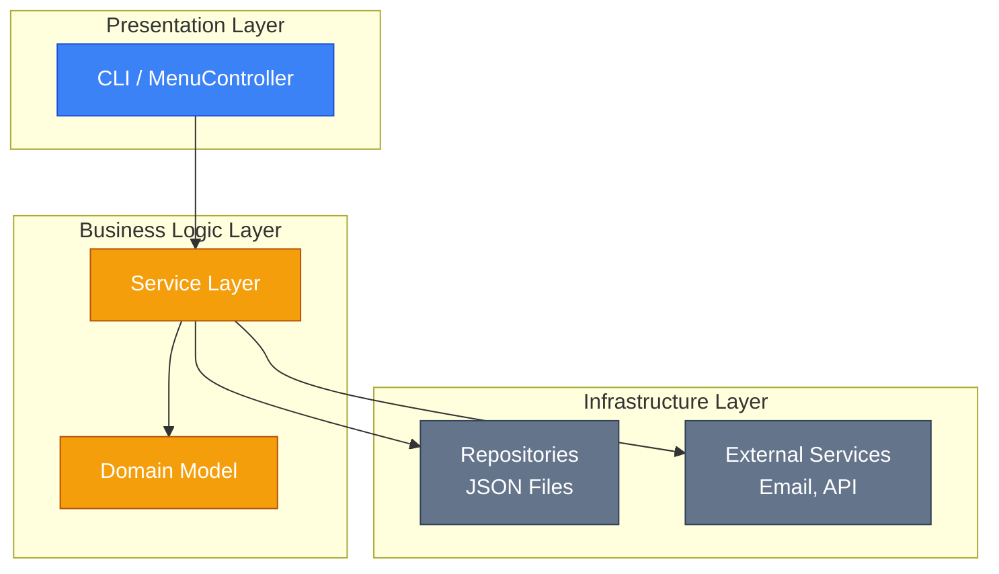
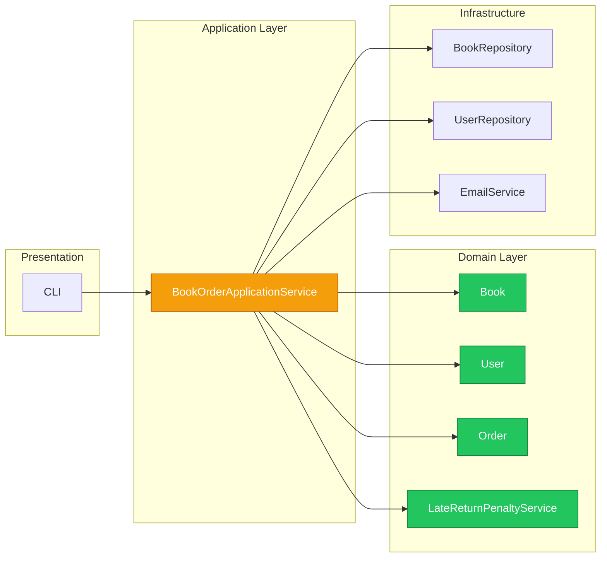

# Service Layer: Організація бізнес-логіки

## Вступ: Де розмістити бізнес-логіку?

Уявіть, що ви розробляєте систему бібліотеки. Користувач натискає кнопку "Замовити книгу" в CLI, і потрібно:

1. Перевірити, чи книга доступна
2. Перевірити, чи користувач не має заборгованостей
3. Створити замовлення
4. Зменшити кількість доступних примірників
5. Надіслати email-підтвердження
6. Зберегти все у JSON-файли

**Де має бути цей код?**

Це фундаментальне питання архітектури. Неправильна відповідь призводить до "спагетті-коду", де логіка розкидана по всьому застосунку.

## Трьохшарова архітектура

Класична відповідь — **трьохшарова архітектура** (Three-Tier Architecture):

::mermaid



::

| Шар                | Відповідальність            | Приклади                      |
| :----------------- | :-------------------------- | :---------------------------- |
| **Presentation**   | Взаємодія з користувачем    | CLI меню, форматування виводу |
| **Business Logic** | Бізнес-правила, координація | Сервіси, доменні об'єкти      |
| **Infrastructure** | Технічні деталі             | Репозиторії, Email, HTTP      |

::tip
**Ключове правило**: залежності спрямовані **вниз**. Presentation знає про Business Logic, але Business Logic **не знає** про Presentation.
::

## Два підходи до бізнес-логіки

Мартін Фаулер у книзі "Patterns of Enterprise Application Architecture" описує два основні підходи:

### 1. Transaction Script

**Transaction Script** — процедурний підхід, де кожна бізнес-операція реалізована як окрема процедура (метод).

```java showLineNumbers
package com.library.service;

import com.library.repository.BookRepository;
import com.library.repository.UserRepository;
import com.library.repository.OrderRepository;

/**
 * Transaction Script: вся логіка в методах сервісу.
 * Доменні об'єкти — просто структури даних.
 */
public class OrderService {

    private final BookRepository bookRepository;
    private final UserRepository userRepository;
    private final OrderRepository orderRepository;

    public OrderService(BookRepository bookRepository,
                        UserRepository userRepository,
                        OrderRepository orderRepository) {
        this.bookRepository = bookRepository;
        this.userRepository = userRepository;
        this.orderRepository = orderRepository;
    }

    /**
     * Transaction Script: одна транзакція = один метод.
     * Вся логіка тут, не в доменних об'єктах.
     */
    public String createOrder(String userId, String bookId) {
        // 1. Завантажуємо дані
        User user = userRepository.findById(userId)
                .orElseThrow(() -> new RuntimeException("User not found"));

        Book book = bookRepository.findById(bookId)
                .orElseThrow(() -> new RuntimeException("Book not found"));

        // 2. Вся бізнес-логіка тут, в сервісі
        if (book.getAvailableCopies() <= 0) {
            throw new RuntimeException("Book not available");
        }

        if (user.getOverdueBooks() > 0) {
            throw new RuntimeException("User has overdue books");
        }

        if (user.getCurrentBorrowedCount() >= user.getMaxBorrowLimit()) {
            throw new RuntimeException("Borrow limit exceeded");
        }

        // 3. Модифікуємо дані
        book.setAvailableCopies(book.getAvailableCopies() - 1);
        user.setCurrentBorrowedCount(user.getCurrentBorrowedCount() + 1);

        // 4. Створюємо замовлення
        Order order = new Order();
        order.setId(generateId());
        order.setUserId(userId);
        order.setBookId(bookId);
        order.setStatus("PENDING");
        order.setCreatedAt(LocalDateTime.now());

        // 5. Зберігаємо
        bookRepository.save(book);
        userRepository.save(user);
        orderRepository.save(order);

        return order.getId();
    }

    private String generateId() {
        return UUID.randomUUID().toString();
    }
}
```

**Характеристики Transaction Script:**

- Вся логіка в методах сервісу
- Доменні об'єкти — "сумки з даними" (тільки геттери/сеттери)
- **Атомарність** — один метод сервісу відповідає одній транзакції в БД
- **Простий для розуміння** — все в одному місці (лінійний код)
- **Погано масштабується** — дублювання логіки між скриптами

::warning
Transaction Script добре працює для **простих** CRUD-застосунків. Для складної бізнес-логіки він швидко перетворюється на "спагетті".
::

### Золоте правило: Межа транзакції

Найважливіший аспект Transaction Script — це **атомарність (atomicity)**.

Оскільки скрипт координує роботу з декількома репозиторіями (як у прикладі вище: `Book`, `User`, `Order`), виникає ризик: що буде, якщо ми успішно оновимо кількість книг, але створення замовлення впаде з помилкою? Дані стануть несумісними.

::important
**Золоте правило**: Один метод сервісу = Одна транзакція.
::

Це означає, що:

1. Весь метод має виконуватися в межах однієї транзакції бази даних.
2. Якщо будь-яка частина скрипта впаде — **всі** зміни мають бути відкочені (rollback).
3. Метод сервісу є **межею транзакції (Transaction Boundary)**. У Presentation Layer транзакцій бути не повинно.

### 2. Domain Model

**Domain Model** — об'єктно-орієнтований підхід, де бізнес-логіка живе в доменних об'єктах.

```java showLineNumbers
package com.library.domain;

/**
 * Rich Domain Model: логіка всередині об'єкта.
 */
public class Book {
    private final String id;
    private String title;
    private String author;
    private int availableCopies;
    private int totalCopies;

    // Конструктор з валідацією
    public Book(String id, String title, String author, int totalCopies) {
        if (totalCopies < 0) {
            throw new IllegalArgumentException("Total copies cannot be negative");
        }
        this.id = id;
        this.title = title;
        this.author = author;
        this.totalCopies = totalCopies;
        this.availableCopies = totalCopies;
    }

    /**
     * Бізнес-логіка всередині доменного об'єкта.
     */
    public void borrow() {
        if (!isAvailable()) {
            throw new IllegalStateException("Book is not available for borrowing");
        }
        this.availableCopies--;
    }

    public void returnCopy() {
        if (availableCopies >= totalCopies) {
            throw new IllegalStateException("All copies already returned");
        }
        this.availableCopies++;
    }

    public boolean isAvailable() {
        return availableCopies > 0;
    }

    // Геттери — немає сеттерів для availableCopies!
    public String getId() { return id; }
    public String getTitle() { return title; }
    public int getAvailableCopies() { return availableCopies; }
}
```

```java showLineNumbers
package com.library.domain;

/**
 * Rich User з бізнес-логікою.
 */
public class User {
    private final String id;
    private String name;
    private String email;
    private UserType type;
    private int currentBorrowedCount;
    private int overdueBooks;

    public User(String id, String name, String email, UserType type) {
        this.id = id;
        this.name = name;
        this.email = email;
        this.type = type;
        this.currentBorrowedCount = 0;
        this.overdueBooks = 0;
    }

    /**
     * Бізнес-логіка: чи може користувач взяти книгу?
     */
    public boolean canBorrow() {
        return overdueBooks == 0 && currentBorrowedCount < getMaxBorrowLimit();
    }

    public int getMaxBorrowLimit() {
        return switch (type) {
            case STUDENT -> 3;
            case REGULAR -> 5;
            case VIP -> 10;
        };
    }

    public void borrowBook() {
        if (!canBorrow()) {
            throw new IllegalStateException("Cannot borrow more books");
        }
        currentBorrowedCount++;
    }

    public void returnBook() {
        if (currentBorrowedCount <= 0) {
            throw new IllegalStateException("No books to return");
        }
        currentBorrowedCount--;
    }

    // Геттери
    public String getId() { return id; }
    public String getName() { return name; }
    public String getEmail() { return email; }
    public UserType getType() { return type; }
    public int getCurrentBorrowedCount() { return currentBorrowedCount; }
    public int getOverdueBooks() { return overdueBooks; }
}

public enum UserType {
    STUDENT, REGULAR, VIP
}
```

Тепер сервіс стає **тонким** — він лише координує:

```java showLineNumbers
package com.library.service;

/**
 * Thin Service Layer: координація, а не логіка.
 */
public class OrderService {

    private final BookRepository bookRepository;
    private final UserRepository userRepository;
    private final OrderRepository orderRepository;

    public OrderService(BookRepository bookRepository,
                        UserRepository userRepository,
                        OrderRepository orderRepository) {
        this.bookRepository = bookRepository;
        this.userRepository = userRepository;
        this.orderRepository = orderRepository;
    }

    public String createOrder(String userId, String bookId) {
        User user = userRepository.findById(userId)
                .orElseThrow(() -> new UserNotFoundException(userId));

        Book book = bookRepository.findById(bookId)
                .orElseThrow(() -> new BookNotFoundException(bookId));

        // Бізнес-логіка ДЕЛЕГОВАНА доменним об'єктам
        if (!user.canBorrow()) {
            throw new CannotBorrowException("User cannot borrow books");
        }

        // Методи самі перевіряють інваріанти
        book.borrow();      // Кине виняток, якщо недоступна
        user.borrowBook();  // Кине виняток, якщо перевищено ліміт

        // Створення замовлення
        Order order = Order.create(user, book);

        // Збереження
        bookRepository.save(book);
        userRepository.save(user);
        orderRepository.save(order);

        return order.getId();
    }
}
```

**Характеристики Domain Model:**

- Логіка інкапсульована в доменних об'єктах
- Сервіс **тонкий** — лише координація
- **Краще масштабується** — логіка не дублюється
- **Складніший** для простих випадків

## Anemic vs Rich Domain Model

### Anemic Domain Model (Антипатерн)

**Anemic Domain Model** — це Domain Model, де об'єкти не мають поведінки, лише дані:

```java showLineNumbers
/**
 * ❌ АНТИПАТЕРН: Anemic Domain Model
 * Об'єкт — просто "сумка з даними".
 */
public class Book {
    private String id;
    private String title;
    private int availableCopies;

    // Тільки геттери та сеттери — нема логіки!
    public String getId() { return id; }
    public void setId(String id) { this.id = id; }

    public String getTitle() { return title; }
    public void setTitle(String title) { this.title = title; }

    public int getAvailableCopies() { return availableCopies; }
    public void setAvailableCopies(int copies) {
        this.availableCopies = copies; // Нема валідації!
    }
}
```

::caution
Мартін Фаулер називає Anemic Domain Model **антипатерном**, бо він порушує базові принципи ООП — інкапсуляцію та поліморфізм.
::

**Проблеми Anemic Model:**

- Порушення інкапсуляції — будь-хто може змінити `availableCopies`
- Дублювання валідації в кожному сервісі
- Процедурний код замість об'єктного

### Rich Domain Model

**Rich Domain Model** — об'єкти з поведінкою та інваріантами:

```java showLineNumbers
/**
 * ✅ Rich Domain Model: логіка та дані разом.
 */
public class Book {
    private final String id;
    private String title;
    private int availableCopies;
    private final int totalCopies;

    public Book(String id, String title, int totalCopies) {
        if (totalCopies <= 0) {
            throw new IllegalArgumentException("Total copies must be positive");
        }
        this.id = id;
        this.title = title;
        this.totalCopies = totalCopies;
        this.availableCopies = totalCopies;
    }

    // Немає setAvailableCopies! Тільки бізнес-методи.

    public void borrow() {
        if (availableCopies <= 0) {
            throw new IllegalStateException("No copies available");
        }
        availableCopies--;
    }

    public void returnCopy() {
        if (availableCopies >= totalCopies) {
            throw new IllegalStateException("All copies returned");
        }
        availableCopies++;
    }

    public boolean isAvailable() {
        return availableCopies > 0;
    }

    public int getAvailableCopies() { return availableCopies; }
}
```

| Аспект       | Anemic Model                 | Rich Model                   |
| :----------- | :--------------------------- | :--------------------------- |
| Інкапсуляція | ❌ Порушена (public setters) | ✅ Дотримана (бізнес-методи) |
| Валідація    | Розкидана по сервісах        | Централізована в об'єкті     |
| Дублювання   | Часте                        | Мінімальне                   |
| Тестування   | Складне (багато mock-ів)     | Просте (ізольовані об'єкти)  |

## Application Services vs Domain Services

У шарі бізнес-логіки існують два типи сервісів:

### Application Services

**Application Service** — оркестрація use case, координація між репозиторіями та доменними об'єктами.

```java showLineNumbers
package com.library.application;

/**
 * Application Service: координатор use case.
 * Не містить бізнес-логіки — тільки flow.
 */
public class BookOrderApplicationService {

    private final BookRepository bookRepository;
    private final UserRepository userRepository;
    private final OrderRepository orderRepository;
    private final NotificationService notificationService;

    public BookOrderApplicationService(
            BookRepository bookRepository,
            UserRepository userRepository,
            OrderRepository orderRepository,
            NotificationService notificationService) {
        this.bookRepository = bookRepository;
        this.userRepository = userRepository;
        this.orderRepository = orderRepository;
        this.notificationService = notificationService;
    }

    /**
     * Use Case: Замовлення книги.
     */
    public OrderResult orderBook(String userId, String bookId) {
        // 1. Завантаження
        User user = userRepository.findById(userId)
                .orElseThrow(() -> new UserNotFoundException(userId));

        Book book = bookRepository.findById(bookId)
                .orElseThrow(() -> new BookNotFoundException(bookId));

        // 2. Делегування бізнес-логіки доменним об'єктам
        if (!user.canBorrow()) {
            return OrderResult.failure("User cannot borrow books");
        }

        if (!book.isAvailable()) {
            return OrderResult.failure("Book is not available");
        }

        // 3. Виконання операцій
        book.borrow();
        user.borrowBook();
        Order order = Order.create(user, book);

        // 4. Збереження
        bookRepository.save(book);
        userRepository.save(user);
        orderRepository.save(order);

        // 5. Побічні ефекти (повідомлення)
        notificationService.sendOrderConfirmation(user, order);

        return OrderResult.success(order);
    }
}
```

**Характеристики Application Service:**

- Координує flow операції
- **Не містить** бізнес-логіки
- Працює з репозиторіями та іншими сервісами
- Один метод = один use case

### Domain Services

**Domain Service** — бізнес-логіка, яка не належить жодному конкретному доменному об'єкту.

```java showLineNumbers
package com.library.domain.service;

/**
 * Domain Service: логіка, що не належить жодній сутності.
 * Приклад: розрахунок штрафу залежить і від User, і від Book, і від часу.
 */
public class LateReturnPenaltyService {

    private static final BigDecimal BASE_PENALTY_PER_DAY = new BigDecimal("5.00");

    /**
     * Бізнес-логіка розрахунку штрафу.
     * Не може належати ні User, ні Book, ні Order окремо.
     */
    public BigDecimal calculatePenalty(Order order, LocalDate returnDate) {
        LocalDate dueDate = order.getDueDate();

        if (!returnDate.isAfter(dueDate)) {
            return BigDecimal.ZERO;
        }

        long daysLate = ChronoUnit.DAYS.between(dueDate, returnDate);
        BigDecimal basePenalty = BASE_PENALTY_PER_DAY.multiply(BigDecimal.valueOf(daysLate));

        // Модифікатор залежно від типу користувача
        User user = order.getUser();
        BigDecimal modifier = switch (user.getType()) {
            case STUDENT -> new BigDecimal("0.5");  // 50% знижка
            case VIP -> new BigDecimal("0.0");      // Без штрафу
            case REGULAR -> new BigDecimal("1.0"); // Повний штраф
        };

        return basePenalty.multiply(modifier);
    }
}
```

```java showLineNumbers
package com.library.domain.service;

/**
 * Domain Service: перевірка унікальності ISBN.
 * Потребує доступу до репозиторію — не може бути в Book.
 */
public class BookUniquenessService {

    private final BookRepository bookRepository;

    public BookUniquenessService(BookRepository bookRepository) {
        this.bookRepository = bookRepository;
    }

    /**
     * Перевіряє, чи ISBN унікальний.
     */
    public boolean isIsbnUnique(String isbn) {
        return bookRepository.findByIsbn(isbn).isEmpty();
    }

    /**
     * Перевіряє унікальність, виключаючи конкретну книгу (для оновлення).
     */
    public boolean isIsbnUnique(String isbn, String excludeBookId) {
        return bookRepository.findByIsbn(isbn)
                .map(book -> book.getId().equals(excludeBookId))
                .orElse(true);
    }
}
```

**Коли використовувати Domain Service:**

- Логіка залежить від **кількох** сутностей
- Потрібен доступ до репозиторію для валідації
- Операція не "належить" жодному конкретному об'єкту

### Порівняння

| Аспект        | Application Service        | Domain Service |
| :------------ | :------------------------- | :------------- |
| Бізнес-логіка | ❌ Не містить              | ✅ Містить     |
| Репозиторії   | ✅ Використовує            | Іноді          |
| Use case      | Один метод = один use case | Одна операція  |
| Залежності    | Багато (координація)       | Мінімальні     |

::mermaid



::

## Практичний приклад: Повна структура

Розглянемо повну структуру проєкту бібліотеки:

::file-tree

- **src/**
    - **domain/** # Доменний шар
        - **model/**
            - Book.java
            - User.java
            - Order.java
            - UserType.java
        - **service/**
            - LateReturnPenaltyService.java
            - BookUniquenessService.java
    - **application/** # Application Services
        - BookOrderApplicationService.java
        - UserRegistrationService.java
        - **dto/**
            - OrderResult.java
            - RegistrationResult.java
    - **infrastructure/** # Інфраструктурний шар
        - **repository/**
            - JsonBookRepository.java
            - JsonUserRepository.java
            - JsonOrderRepository.java
        - **notification/**
            - EmailNotificationService.java
    - **presentation/** # Презентаційний шар - **cli/** - MenuController.java - BookMenu.java - OrderMenu.java - **formatter/** - OutputFormatter.java

::

### Точка входу без DI

Оскільки ми не використовуємо DI-контейнер, залежності створюються вручну:

```java showLineNumbers
package com.library;

import com.library.application.BookOrderApplicationService;
import com.library.domain.service.LateReturnPenaltyService;
import com.library.infrastructure.repository.*;
import com.library.infrastructure.notification.EmailNotificationService;
import com.library.presentation.cli.MenuController;

/**
 * Точка входу: ручне створення графу залежностей.
 */
public class LibraryApplication {

    public static void main(String[] args) {
        // 1. Інфраструктура
        BookRepository bookRepository = new JsonBookRepository("data/books.json");
        UserRepository userRepository = new JsonUserRepository("data/users.json");
        OrderRepository orderRepository = new JsonOrderRepository("data/orders.json");
        NotificationService notificationService = new EmailNotificationService();

        // 2. Domain Services
        LateReturnPenaltyService penaltyService = new LateReturnPenaltyService();

        // 3. Application Services
        BookOrderApplicationService orderService = new BookOrderApplicationService(
                bookRepository,
                userRepository,
                orderRepository,
                notificationService
        );

        // 4. Presentation
        MenuController menuController = new MenuController(
                orderService,
                bookRepository,
                userRepository
        );

        // 5. Запуск
        menuController.run();
    }
}
```

::tip
Цей підхід називається **Pure DI** або **Poor Man's DI**. Він працює для невеликих застосунків і чудово підходить для навчання, бо всі залежності видно явно.
::

## Підсумки

::card-group
::card{title="Transaction Script"}
Процедурний підхід — вся логіка в методах сервісу. Добре для простих CRUD.
::

::card{title="Domain Model"}
Об'єктний підхід — логіка в доменних об'єктах. Краще масштабується.
::

::card{title="Application Service"}
Координатор use case. Не містить бізнес-логіки, лише оркестрація.
::

::card{title="Domain Service"}
Бізнес-логіка, що не належить конкретній сутності.
::

::

У [наступному матеріалі](./04.rich-domain-model.md) ми детально розглянемо **Rich Domain Model** та патерн **State** для управління станами замовлення.

## Корисні посилання

- [Martin Fowler — Service Layer](https://martinfowler.com/eaaCatalog/serviceLayer.html)
- [Martin Fowler — Domain Model](https://martinfowler.com/eaaCatalog/domainModel.html)
- [Martin Fowler — Anemic Domain Model](https://martinfowler.com/bliki/AnemicDomainModel.html)
- [Martin Fowler — Transaction Script](https://martinfowler.com/eaaCatalog/transactionScript.html)
