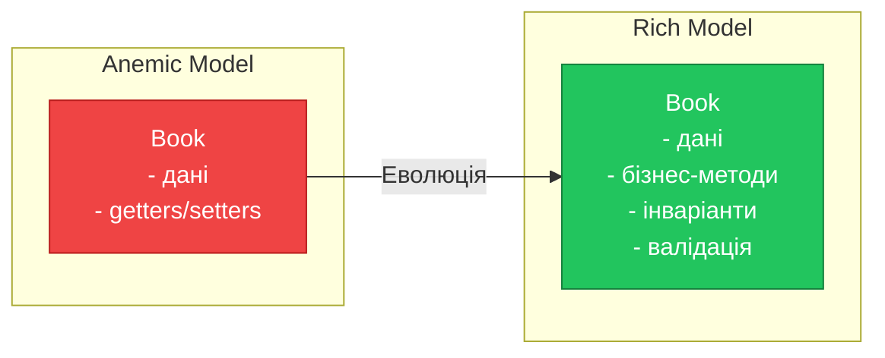
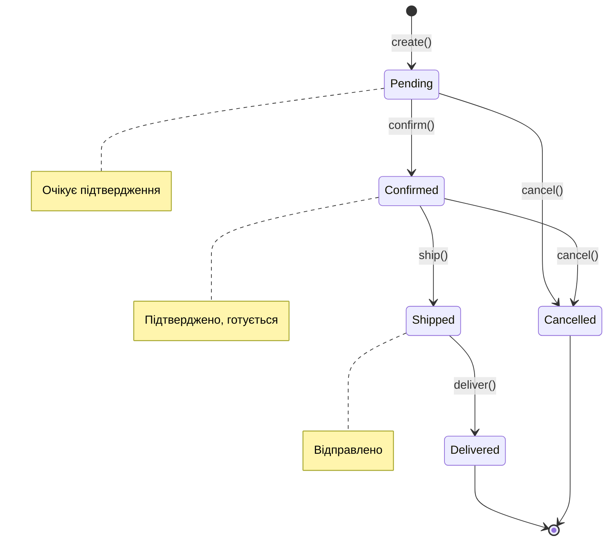

# Rich Domain Model та State Pattern

## Вступ: Від "сумок з даними" до справжніх об'єктів

У [попередньому матеріалі](./03.service-layer.md) ми розглядали різницю між Anemic та Rich Domain Model. Тепер заглибимося в техніки побудови **справжніх** доменних об'єктів, які захищають свої інваріанти та інкапсулюють бізнес-логіку.

::mermaid



::

## Інваріанти: Серце доменного об'єкта

### Що таке інваріант?

**Інваріант** (Invariant) — це умова, яка **завжди** має бути істинною для об'єкта протягом усього його життєвого циклу.

Приклади інваріантів для `Book`:

- Кількість доступних примірників не може бути від'ємною
- Кількість доступних примірників не може перевищувати загальну кількість
- ISBN має бути валідним
- Назва не може бути порожньою

### Реалізація інваріантів

```java showLineNumbers
package com.library.domain.model;

import java.util.Objects;

/**
 * Rich Domain Model з інваріантами.
 * Об'єкт НІКОЛИ не може бути в невалідному стані.
 */
public final class Book {

    private final String id;
    private final String isbn;
    private String title;
    private String author;
    private int availableCopies;
    private final int totalCopies;

    /**
     * Приватний конструктор — контроль створення.
     */
    private Book(String id, String isbn, String title, String author, int totalCopies) {
        this.id = id;
        this.isbn = isbn;
        this.title = title;
        this.author = author;
        this.totalCopies = totalCopies;
        this.availableCopies = totalCopies;
    }

    /**
     * Фабричний метод з повною валідацією.
     * Єдиний спосіб створити Book — через цей метод.
     */
    public static Book create(String id, String isbn, String title, String author, int totalCopies) {
        // Валідація інваріантів
        Objects.requireNonNull(id, "ID cannot be null");
        Objects.requireNonNull(isbn, "ISBN cannot be null");
        Objects.requireNonNull(title, "Title cannot be null");
        Objects.requireNonNull(author, "Author cannot be null");

        if (id.isBlank()) {
            throw new IllegalArgumentException("ID cannot be blank");
        }

        if (!isValidIsbn(isbn)) {
            throw new IllegalArgumentException("Invalid ISBN format: " + isbn);
        }

        if (title.isBlank()) {
            throw new IllegalArgumentException("Title cannot be blank");
        }

        if (totalCopies <= 0) {
            throw new IllegalArgumentException("Total copies must be positive");
        }

        return new Book(id, isbn, title, author, totalCopies);
    }

    /**
     * Фабричний метод для відновлення з персистентного сховища.
     */
    public static Book reconstitute(String id, String isbn, String title,
                                     String author, int totalCopies, int availableCopies) {
        Book book = new Book(id, isbn, title, author, totalCopies);
        book.availableCopies = availableCopies;
        return book;
    }

    // === Бізнес-методи ===

    /**
     * Видача книги. Зменшує кількість доступних примірників.
     *
     * @throws IllegalStateException якщо немає доступних примірників
     */
    public void borrow() {
        if (!isAvailable()) {
            throw new IllegalStateException(
                "Cannot borrow book '" + title + "': no copies available"
            );
        }
        availableCopies--;
    }

    /**
     * Повернення книги. Збільшує кількість доступних примірників.
     *
     * @throws IllegalStateException якщо всі примірники вже повернуті
     */
    public void returnCopy() {
        if (availableCopies >= totalCopies) {
            throw new IllegalStateException(
                "Cannot return book '" + title + "': all copies already returned"
            );
        }
        availableCopies++;
    }

    /**
     * Перевірка доступності книги.
     */
    public boolean isAvailable() {
        return availableCopies > 0;
    }

    /**
     * Оновлення назви з валідацією.
     */
    public void updateTitle(String newTitle) {
        Objects.requireNonNull(newTitle, "Title cannot be null");
        if (newTitle.isBlank()) {
            throw new IllegalArgumentException("Title cannot be blank");
        }
        this.title = newTitle;
    }

    // === Приватні методи валідації ===

    private static boolean isValidIsbn(String isbn) {
        // Спрощена валідація ISBN-13
        if (isbn == null || isbn.length() != 13) {
            return false;
        }
        return isbn.chars().allMatch(Character::isDigit);
    }

    // === Геттери (без сеттерів для критичних полів!) ===

    public String getId() { return id; }
    public String getIsbn() { return isbn; }
    public String getTitle() { return title; }
    public String getAuthor() { return author; }
    public int getAvailableCopies() { return availableCopies; }
    public int getTotalCopies() { return totalCopies; }

    @Override
    public boolean equals(Object o) {
        if (this == o) return true;
        if (o == null || getClass() != o.getClass()) return false;
        Book book = (Book) o;
        return Objects.equals(id, book.id);
    }

    @Override
    public int hashCode() {
        return Objects.hash(id);
    }

    @Override
    public String toString() {
        return String.format("Book[id=%s, title='%s', available=%d/%d]",
                id, title, availableCopies, totalCopies);
    }
}
```

**Ключові аспекти:**

- **Рядок 9**: `final class` — заборона наслідування, захист інваріантів
- **Рядок 21**: Приватний конструктор — контроль створення
- **Рядок 33**: Фабричний метод з повною валідацією
- **Рядок 76-85**: Бізнес-метод `borrow()` з захистом інваріанта
- **Рядки 127-131**: Немає сеттерів для `availableCopies` — тільки бізнес-методи

::tip
**Правило**: Якщо поле є частиною інваріанта, для нього **не має бути** публічного сеттера. Зміна можлива тільки через бізнес-методи.
::

## Value Objects: Незмінні компоненти домену

### Що таке Value Object?

**Value Object** — об'єкт, ідентичність якого визначається його значенням, а не унікальним ID.

```java showLineNumbers
package com.library.domain.model;

import java.util.Objects;

/**
 * Value Object для ISBN.
 * Незмінний, рівність за значенням.
 */
public final class Isbn {

    private final String value;

    private Isbn(String value) {
        this.value = value;
    }

    /**
     * Фабричний метод з валідацією.
     */
    public static Isbn of(String value) {
        Objects.requireNonNull(value, "ISBN cannot be null");

        String normalized = value.replaceAll("-", "");

        if (!isValid(normalized)) {
            throw new IllegalArgumentException("Invalid ISBN: " + value);
        }

        return new Isbn(normalized);
    }

    /**
     * Перевірка валідності ISBN-13.
     */
    private static boolean isValid(String isbn) {
        if (isbn.length() != 13) {
            return false;
        }

        if (!isbn.chars().allMatch(Character::isDigit)) {
            return false;
        }

        // Перевірка контрольної суми ISBN-13
        int sum = 0;
        for (int i = 0; i < 12; i++) {
            int digit = Character.getNumericValue(isbn.charAt(i));
            sum += (i % 2 == 0) ? digit : digit * 3;
        }
        int checkDigit = (10 - (sum % 10)) % 10;

        return checkDigit == Character.getNumericValue(isbn.charAt(12));
    }

    public String getValue() {
        return value;
    }

    public String getFormatted() {
        // Формат: 978-3-16-148410-0
        return String.format("%s-%s-%s-%s-%s",
                value.substring(0, 3),
                value.substring(3, 4),
                value.substring(4, 6),
                value.substring(6, 12),
                value.substring(12));
    }

    @Override
    public boolean equals(Object o) {
        if (this == o) return true;
        if (o == null || getClass() != o.getClass()) return false;
        Isbn isbn = (Isbn) o;
        return Objects.equals(value, isbn.value);
    }

    @Override
    public int hashCode() {
        return Objects.hash(value);
    }

    @Override
    public String toString() {
        return getFormatted();
    }
}
```

```java showLineNumbers
package com.library.domain.model;

import java.util.Objects;
import java.util.regex.Pattern;

/**
 * Value Object для Email.
 */
public final class Email {

    private static final Pattern EMAIL_PATTERN =
        Pattern.compile("^[A-Za-z0-9+_.-]+@[A-Za-z0-9.-]+$");

    private final String value;

    private Email(String value) {
        this.value = value.toLowerCase();
    }

    public static Email of(String value) {
        Objects.requireNonNull(value, "Email cannot be null");

        if (!EMAIL_PATTERN.matcher(value).matches()) {
            throw new IllegalArgumentException("Invalid email format: " + value);
        }

        return new Email(value);
    }

    public String getValue() {
        return value;
    }

    public String getDomain() {
        return value.substring(value.indexOf('@') + 1);
    }

    @Override
    public boolean equals(Object o) {
        if (this == o) return true;
        if (o == null || getClass() != o.getClass()) return false;
        Email email = (Email) o;
        return Objects.equals(value, email.value);
    }

    @Override
    public int hashCode() {
        return Objects.hash(value);
    }

    @Override
    public String toString() {
        return value;
    }
}
```

### Використання Value Objects у Book

```java showLineNumbers
public final class Book {
    private final String id;
    private final Isbn isbn;        // Value Object замість String
    private String title;
    private String author;
    private int availableCopies;
    private final int totalCopies;

    public static Book create(String id, String isbnValue, String title,
                               String author, int totalCopies) {
        Isbn isbn = Isbn.of(isbnValue); // Валідація в Value Object
        // ...
    }

    public Isbn getIsbn() { return isbn; }
}
```

| Аспект       | Примітивний тип               | Value Object                |
| :----------- | :---------------------------- | :-------------------------- |
| Валідація    | Розкидана по коду             | Централізована              |
| Форматування | Дублюється                    | В одному місці              |
| Типобезпека  | String може бути чим завгодно | Isbn — тільки валідний ISBN |
| Доменна мова | `String isbn`                 | `Isbn isbn`                 |

## State Pattern: Управління станами

### Проблема: Замовлення зі станами

Замовлення книги проходить через кілька станів:

```
PENDING → CONFIRMED → SHIPPED → DELIVERED
    ↓         ↓          ↓
 CANCELLED  CANCELLED  (неможливо)
```

Наївна реалізація через `if/switch`:

```java showLineNumbers
// ❌ Антипатерн: спагетті-код
public class Order {
    private String status; // "PENDING", "CONFIRMED", etc.

    public void confirm() {
        if (status.equals("PENDING")) {
            status = "CONFIRMED";
        } else if (status.equals("CANCELLED")) {
            throw new IllegalStateException("Cannot confirm cancelled order");
        } else if (status.equals("CONFIRMED")) {
            throw new IllegalStateException("Already confirmed");
        }
        // і т.д. для кожного стану...
    }

    public void cancel() {
        if (status.equals("PENDING") || status.equals("CONFIRMED")) {
            status = "CANCELLED";
        } else if (status.equals("SHIPPED")) {
            throw new IllegalStateException("Cannot cancel shipped order");
        }
        // і т.д...
    }
}
```

Проблеми:

- Важко додати новий стан
- Легко забути якийсь перехід
- Логіка переходів розкидана

### Рішення: State Pattern

**State Pattern** інкапсулює поведінку, специфічну для кожного стану, в окремих класах.

::mermaid



::

### Інтерфейс стану

```java showLineNumbers
package com.library.domain.model.order;

/**
 * Інтерфейс стану замовлення.
 * Кожен стан реалізує методи по-різному.
 */
public interface OrderState {

    /**
     * Повертає назву стану для відображення/збереження.
     */
    String getName();

    /**
     * Підтвердження замовлення.
     */
    OrderState confirm(Order order);

    /**
     * Відправка замовлення.
     */
    OrderState ship(Order order);

    /**
     * Доставка замовлення.
     */
    OrderState deliver(Order order);

    /**
     * Скасування замовлення.
     */
    OrderState cancel(Order order);

    /**
     * Чи можна редагувати замовлення в цьому стані?
     */
    default boolean canModify() {
        return false;
    }

    /**
     * Чи є замовлення активним (не завершеним)?
     */
    default boolean isActive() {
        return true;
    }
}
```

### Конкретні стани

```java showLineNumbers
package com.library.domain.model.order;

/**
 * Стан: Очікує підтвердження.
 */
public final class PendingState implements OrderState {

    public static final PendingState INSTANCE = new PendingState();

    private PendingState() {}

    @Override
    public String getName() {
        return "PENDING";
    }

    @Override
    public OrderState confirm(Order order) {
        order.recordEvent("Order confirmed");
        return ConfirmedState.INSTANCE;
    }

    @Override
    public OrderState ship(Order order) {
        throw new IllegalStateException("Cannot ship order that is not confirmed");
    }

    @Override
    public OrderState deliver(Order order) {
        throw new IllegalStateException("Cannot deliver order that is not shipped");
    }

    @Override
    public OrderState cancel(Order order) {
        order.recordEvent("Order cancelled");
        return CancelledState.INSTANCE;
    }

    @Override
    public boolean canModify() {
        return true; // Можна змінювати поки не підтверджено
    }
}
```

```java showLineNumbers
package com.library.domain.model.order;

/**
 * Стан: Підтверджено.
 */
public final class ConfirmedState implements OrderState {

    public static final ConfirmedState INSTANCE = new ConfirmedState();

    private ConfirmedState() {}

    @Override
    public String getName() {
        return "CONFIRMED";
    }

    @Override
    public OrderState confirm(Order order) {
        throw new IllegalStateException("Order is already confirmed");
    }

    @Override
    public OrderState ship(Order order) {
        order.recordEvent("Order shipped");
        return ShippedState.INSTANCE;
    }

    @Override
    public OrderState deliver(Order order) {
        throw new IllegalStateException("Cannot deliver order that is not shipped");
    }

    @Override
    public OrderState cancel(Order order) {
        order.recordEvent("Order cancelled after confirmation");
        // Можлива додаткова логіка: повернення книги в наявність
        order.getBook().returnCopy();
        return CancelledState.INSTANCE;
    }
}
```

```java showLineNumbers
package com.library.domain.model.order;

/**
 * Стан: Відправлено.
 */
public final class ShippedState implements OrderState {

    public static final ShippedState INSTANCE = new ShippedState();

    private ShippedState() {}

    @Override
    public String getName() {
        return "SHIPPED";
    }

    @Override
    public OrderState confirm(Order order) {
        throw new IllegalStateException("Order is already past confirmation stage");
    }

    @Override
    public OrderState ship(Order order) {
        throw new IllegalStateException("Order is already shipped");
    }

    @Override
    public OrderState deliver(Order order) {
        order.recordEvent("Order delivered");
        return DeliveredState.INSTANCE;
    }

    @Override
    public OrderState cancel(Order order) {
        throw new IllegalStateException("Cannot cancel shipped order");
    }
}
```

```java showLineNumbers
package com.library.domain.model.order;

/**
 * Стан: Доставлено (фінальний).
 */
public final class DeliveredState implements OrderState {

    public static final DeliveredState INSTANCE = new DeliveredState();

    private DeliveredState() {}

    @Override
    public String getName() {
        return "DELIVERED";
    }

    @Override
    public OrderState confirm(Order order) {
        throw new IllegalStateException("Order is already delivered");
    }

    @Override
    public OrderState ship(Order order) {
        throw new IllegalStateException("Order is already delivered");
    }

    @Override
    public OrderState deliver(Order order) {
        throw new IllegalStateException("Order is already delivered");
    }

    @Override
    public OrderState cancel(Order order) {
        throw new IllegalStateException("Cannot cancel delivered order");
    }

    @Override
    public boolean isActive() {
        return false; // Замовлення завершено
    }
}
```

```java showLineNumbers
package com.library.domain.model.order;

/**
 * Стан: Скасовано (фінальний).
 */
public final class CancelledState implements OrderState {

    public static final CancelledState INSTANCE = new CancelledState();

    private CancelledState() {}

    @Override
    public String getName() {
        return "CANCELLED";
    }

    @Override
    public OrderState confirm(Order order) {
        throw new IllegalStateException("Cannot confirm cancelled order");
    }

    @Override
    public OrderState ship(Order order) {
        throw new IllegalStateException("Cannot ship cancelled order");
    }

    @Override
    public OrderState deliver(Order order) {
        throw new IllegalStateException("Cannot deliver cancelled order");
    }

    @Override
    public OrderState cancel(Order order) {
        throw new IllegalStateException("Order is already cancelled");
    }

    @Override
    public boolean isActive() {
        return false;
    }
}
```

### Клас Order з використанням State Pattern

```java showLineNumbers
package com.library.domain.model.order;

import com.library.domain.model.Book;
import com.library.domain.model.User;

import java.time.LocalDateTime;
import java.util.ArrayList;
import java.util.Collections;
import java.util.List;
import java.util.UUID;

/**
 * Замовлення книги з використанням State Pattern.
 */
public final class Order {

    private final String id;
    private final User user;
    private final Book book;
    private final LocalDateTime createdAt;
    private OrderState state;
    private final List<String> eventLog;

    private Order(String id, User user, Book book) {
        this.id = id;
        this.user = user;
        this.book = book;
        this.createdAt = LocalDateTime.now();
        this.state = PendingState.INSTANCE;
        this.eventLog = new ArrayList<>();
        recordEvent("Order created");
    }

    /**
     * Фабричний метод для створення замовлення.
     */
    public static Order create(User user, Book book) {
        if (!user.canBorrow()) {
            throw new IllegalStateException("User cannot borrow more books");
        }
        if (!book.isAvailable()) {
            throw new IllegalStateException("Book is not available");
        }

        // Резервуємо книгу
        book.borrow();
        user.borrowBook();

        return new Order(UUID.randomUUID().toString(), user, book);
    }

    /**
     * Відновлення замовлення з персистентного сховища.
     */
    public static Order reconstitute(String id, User user, Book book,
                                      String stateName, LocalDateTime createdAt) {
        Order order = new Order(id, user, book);
        order.state = stateFromName(stateName);
        return order;
    }

    private static OrderState stateFromName(String name) {
        return switch (name) {
            case "PENDING" -> PendingState.INSTANCE;
            case "CONFIRMED" -> ConfirmedState.INSTANCE;
            case "SHIPPED" -> ShippedState.INSTANCE;
            case "DELIVERED" -> DeliveredState.INSTANCE;
            case "CANCELLED" -> CancelledState.INSTANCE;
            default -> throw new IllegalArgumentException("Unknown state: " + name);
        };
    }

    // === Методи переходу станів ===

    public void confirm() {
        this.state = state.confirm(this);
    }

    public void ship() {
        this.state = state.ship(this);
    }

    public void deliver() {
        this.state = state.deliver(this);
    }

    public void cancel() {
        this.state = state.cancel(this);
    }

    // === Допоміжні методи ===

    void recordEvent(String event) {
        eventLog.add(LocalDateTime.now() + ": " + event);
    }

    public boolean canModify() {
        return state.canModify();
    }

    public boolean isActive() {
        return state.isActive();
    }

    // === Геттери ===

    public String getId() { return id; }
    public User getUser() { return user; }
    public Book getBook() { return book; }
    public LocalDateTime getCreatedAt() { return createdAt; }
    public String getStateName() { return state.getName(); }
    public List<String> getEventLog() { return Collections.unmodifiableList(eventLog); }

    @Override
    public String toString() {
        return String.format("Order[id=%s, book='%s', user='%s', state=%s]",
                id, book.getTitle(), user.getName(), state.getName());
    }
}
```

### Використання Order

```java showLineNumbers
package com.library;

import com.library.domain.model.*;
import com.library.domain.model.order.Order;

public class OrderDemo {
    public static void main(String[] args) {
        // Створення сутностей
        User user = User.create("1", "Іван Петренко",
                Email.of("ivan@example.com"), UserType.REGULAR);

        Book book = Book.create("1", "9781234567890",
                "Clean Code", "Robert Martin", 3);

        // Створення замовлення
        Order order = Order.create(user, book);
        System.out.println("Створено: " + order);
        System.out.println("Можна змінювати: " + order.canModify());

        // Підтвердження
        order.confirm();
        System.out.println("Після confirm: " + order.getStateName());
        System.out.println("Можна змінювати: " + order.canModify());

        // Відправка
        order.ship();
        System.out.println("Після ship: " + order.getStateName());

        // Спроба скасувати відправлене — помилка!
        try {
            order.cancel();
        } catch (IllegalStateException e) {
            System.out.println("Помилка: " + e.getMessage());
        }

        // Доставка
        order.deliver();
        System.out.println("Після deliver: " + order.getStateName());
        System.out.println("Активне: " + order.isActive());

        // Історія подій
        System.out.println("\nІсторія:");
        order.getEventLog().forEach(System.out::println);
    }
}
```

**Вивід:**

```
Створено: Order[id=..., book='Clean Code', user='Іван Петренко', state=PENDING]
Можна змінювати: true
Після confirm: CONFIRMED
Можна змінювати: false
Після ship: SHIPPED
Помилка: Cannot cancel shipped order
Після deliver: DELIVERED
Активне: false

Історія:
2024-01-22T15:30:00: Order created
2024-01-22T15:30:01: Order confirmed
2024-01-22T15:30:02: Order shipped
2024-01-22T15:30:03: Order delivered
```

## Переваги State Pattern

| Аспект           | Без State Pattern     | З State Pattern        |
| :--------------- | :-------------------- | :--------------------- |
| Додавання стану  | Змінити всі switch/if | Додати новий клас      |
| Логіка переходів | Розкидана             | Централізована в стані |
| Тестування       | Складне               | Кожен стан окремо      |
| Читабельність    | Спагетті              | Чіткі класи            |

::tip
State Pattern особливо корисний, коли:

- Є 4+ станів
- Логіка переходів складна
- Різні стани мають різну поведінку
  ::

## Підсумки

::card-group
::card{title="Інваріанти"}
Умови, що завжди мають бути істинними. Захищаються через приватні конструктори та бізнес-методи.
::

    ::card{title="Value Objects"}
    Незмінні об'єкти, ідентичність яких визначається значенням (Email, ISBN, Money).
    ::

    ::card{title="State Pattern"}
    Інкапсуляція поведінки для кожного стану в окремому класі. Чисті переходи між станами.
    ::

    ::card{title="Фабричні методи"}
    `create()` для нових об'єктів, `reconstitute()` для відновлення з БД. Повна валідація при створенні.
    ::

::

У [наступному матеріалі](./05.business-logic-patterns.md) ми розглянемо додаткові патерни: **Strategy**, **Command** та **Specification**.

## Корисні посилання

- [Martin Fowler — Value Object](https://martinfowler.com/bliki/ValueObject.html)
- [Refactoring Guru — State Pattern](https://refactoring.guru/design-patterns/state)
- [Eric Evans — Domain-Driven Design](https://www.domainlanguage.com/ddd/)
