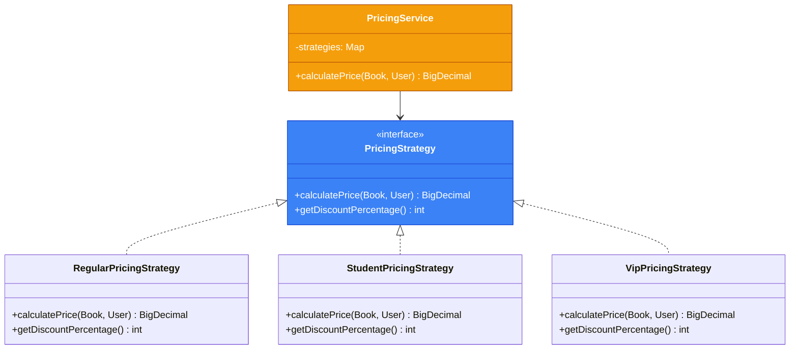
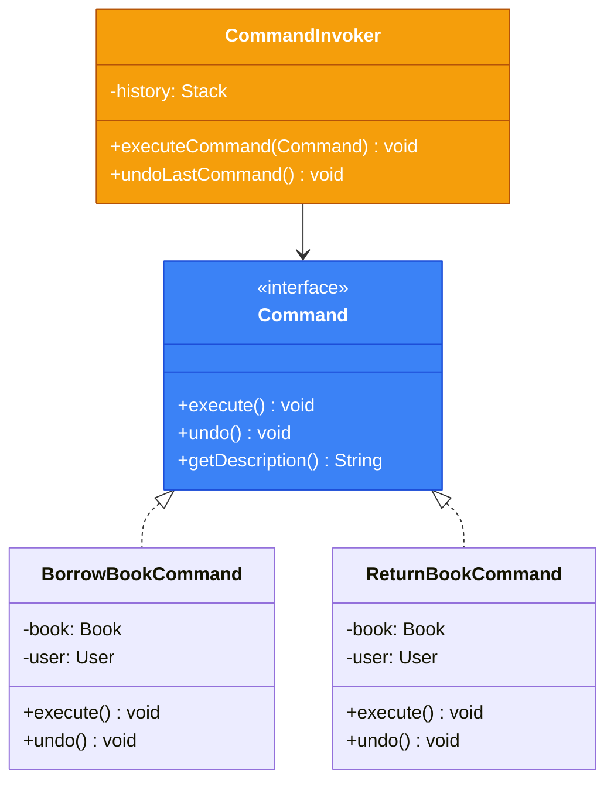

# Патерни для складної бізнес-логіки

## Вступ: Коли базових підходів недостатньо

У попередніх матеріалах ми розглянули [Service Layer](./03.service-layer.md) та [Rich Domain Model](./04.rich-domain-model.md). Але що робити, коли:

- Алгоритм розрахунку залежить від типу користувача?
- Потрібно логувати та відміняти операції?
- Бізнес-правила складні та комбінуються?

Для цих випадків існують перевірені патерни: **Strategy**, **Command** та **Specification**.

## Strategy Pattern: Взаємозамінні алгоритми

### Проблема: Розрахунок ціни залежно від типу користувача

У нашій бібліотеці різні типи користувачів мають різні знижки:

```java showLineNumbers
// ❌ Антипатерн: switch/if у бізнес-логіці
public class PricingService {

    public BigDecimal calculatePrice(Book book, User user) {
        BigDecimal basePrice = book.getPrice();

        return switch (user.getType()) {
            case STUDENT -> basePrice.multiply(new BigDecimal("0.7")); // 30% знижка
            case VIP -> basePrice.multiply(new BigDecimal("0.5"));     // 50% знижка
            case REGULAR -> basePrice;
        };
    }
}
```

Проблеми:

- Кожен новий тип потребує зміни методу
- Логіка знижок дублюється, якщо використовується в інших місцях
- Неможливо легко тестувати окремі стратегії

### Рішення: Strategy Pattern

**Strategy Pattern** винесе кожен алгоритм в окремий клас.

::mermaid



::

### Реалізація

```java showLineNumbers
package com.library.domain.pricing;

import com.library.domain.model.Book;
import com.library.domain.model.User;

import java.math.BigDecimal;

/**
 * Інтерфейс стратегії ціноутворення.
 */
public interface PricingStrategy {

    /**
     * Розраховує ціну для користувача.
     */
    BigDecimal calculatePrice(Book book, User user);

    /**
     * Повертає відсоток знижки для відображення.
     */
    int getDiscountPercentage();

    /**
     * Назва стратегії для логування.
     */
    String getName();
}
```

```java showLineNumbers
package com.library.domain.pricing;

import com.library.domain.model.Book;
import com.library.domain.model.User;

import java.math.BigDecimal;

/**
 * Стратегія для звичайних користувачів — без знижки.
 */
public final class RegularPricingStrategy implements PricingStrategy {

    public static final RegularPricingStrategy INSTANCE = new RegularPricingStrategy();

    private RegularPricingStrategy() {}

    @Override
    public BigDecimal calculatePrice(Book book, User user) {
        return book.getPrice();
    }

    @Override
    public int getDiscountPercentage() {
        return 0;
    }

    @Override
    public String getName() {
        return "Regular Pricing";
    }
}
```

```java showLineNumbers
package com.library.domain.pricing;

import com.library.domain.model.Book;
import com.library.domain.model.User;

import java.math.BigDecimal;
import java.math.RoundingMode;

/**
 * Стратегія для студентів — 30% знижка.
 */
public final class StudentPricingStrategy implements PricingStrategy {

    public static final StudentPricingStrategy INSTANCE = new StudentPricingStrategy();

    private static final BigDecimal DISCOUNT_MULTIPLIER = new BigDecimal("0.70");

    private StudentPricingStrategy() {}

    @Override
    public BigDecimal calculatePrice(Book book, User user) {
        return book.getPrice()
                .multiply(DISCOUNT_MULTIPLIER)
                .setScale(2, RoundingMode.HALF_UP);
    }

    @Override
    public int getDiscountPercentage() {
        return 30;
    }

    @Override
    public String getName() {
        return "Student Pricing (30% off)";
    }
}
```

```java showLineNumbers
package com.library.domain.pricing;

import com.library.domain.model.Book;
import com.library.domain.model.User;

import java.math.BigDecimal;
import java.math.RoundingMode;

/**
 * Стратегія для VIP — 50% знижка.
 */
public final class VipPricingStrategy implements PricingStrategy {

    public static final VipPricingStrategy INSTANCE = new VipPricingStrategy();

    private static final BigDecimal DISCOUNT_MULTIPLIER = new BigDecimal("0.50");

    private VipPricingStrategy() {}

    @Override
    public BigDecimal calculatePrice(Book book, User user) {
        return book.getPrice()
                .multiply(DISCOUNT_MULTIPLIER)
                .setScale(2, RoundingMode.HALF_UP);
    }

    @Override
    public int getDiscountPercentage() {
        return 50;
    }

    @Override
    public String getName() {
        return "VIP Pricing (50% off)";
    }
}
```

### Фабрика стратегій

```java showLineNumbers
package com.library.domain.pricing;

import com.library.domain.model.UserType;

import java.util.EnumMap;
import java.util.Map;

/**
 * Фабрика для отримання стратегії за типом користувача.
 */
public final class PricingStrategyFactory {

    private static final Map<UserType, PricingStrategy> STRATEGIES = new EnumMap<>(UserType.class);

    static {
        STRATEGIES.put(UserType.REGULAR, RegularPricingStrategy.INSTANCE);
        STRATEGIES.put(UserType.STUDENT, StudentPricingStrategy.INSTANCE);
        STRATEGIES.put(UserType.VIP, VipPricingStrategy.INSTANCE);
    }

    private PricingStrategyFactory() {}

    /**
     * Повертає стратегію для типу користувача.
     */
    public static PricingStrategy getStrategy(UserType type) {
        PricingStrategy strategy = STRATEGIES.get(type);
        if (strategy == null) {
            throw new IllegalArgumentException("No pricing strategy for: " + type);
        }
        return strategy;
    }
}
```

### Використання в сервісі

```java showLineNumbers
package com.library.domain.service;

import com.library.domain.model.Book;
import com.library.domain.model.User;
import com.library.domain.pricing.PricingStrategy;
import com.library.domain.pricing.PricingStrategyFactory;

import java.math.BigDecimal;

/**
 * Сервіс ціноутворення з використанням Strategy Pattern.
 */
public class PricingService {

    /**
     * Розраховує ціну з урахуванням знижки користувача.
     */
    public PriceCalculation calculatePrice(Book book, User user) {
        PricingStrategy strategy = PricingStrategyFactory.getStrategy(user.getType());

        BigDecimal originalPrice = book.getPrice();
        BigDecimal finalPrice = strategy.calculatePrice(book, user);
        int discountPercentage = strategy.getDiscountPercentage();

        return new PriceCalculation(originalPrice, finalPrice, discountPercentage, strategy.getName());
    }
}

/**
 * Record для результату розрахунку ціни.
 */
public record PriceCalculation(
        BigDecimal originalPrice,
        BigDecimal finalPrice,
        int discountPercentage,
        String strategyName
) {
    public BigDecimal getSavings() {
        return originalPrice.subtract(finalPrice);
    }

    @Override
    public String toString() {
        if (discountPercentage > 0) {
            return String.format("%s → %s (-%d%%, економія: %s)",
                    originalPrice, finalPrice, discountPercentage, getSavings());
        }
        return originalPrice.toString();
    }
}
```

### Приклад розширення: Сезонна знижка

Тепер додати нову стратегію — тривіально:

```java showLineNumbers
package com.library.domain.pricing;

import com.library.domain.model.Book;
import com.library.domain.model.User;

import java.math.BigDecimal;
import java.time.LocalDate;
import java.time.Month;

/**
 * Стратегія з додатковою сезонною знижкою.
 * Декоратор над іншою стратегією.
 */
public final class SeasonalPricingStrategy implements PricingStrategy {

    private final PricingStrategy baseStrategy;
    private final int additionalDiscountPercent;

    public SeasonalPricingStrategy(PricingStrategy baseStrategy, int additionalDiscountPercent) {
        this.baseStrategy = baseStrategy;
        this.additionalDiscountPercent = additionalDiscountPercent;
    }

    @Override
    public BigDecimal calculatePrice(Book book, User user) {
        BigDecimal basePrice = baseStrategy.calculatePrice(book, user);

        if (isSeasonalPeriod()) {
            BigDecimal multiplier = BigDecimal.valueOf(100 - additionalDiscountPercent)
                    .divide(BigDecimal.valueOf(100));
            return basePrice.multiply(multiplier);
        }

        return basePrice;
    }

    private boolean isSeasonalPeriod() {
        Month currentMonth = LocalDate.now().getMonth();
        return currentMonth == Month.DECEMBER || currentMonth == Month.JANUARY;
    }

    @Override
    public int getDiscountPercentage() {
        if (isSeasonalPeriod()) {
            return baseStrategy.getDiscountPercentage() + additionalDiscountPercent;
        }
        return baseStrategy.getDiscountPercentage();
    }

    @Override
    public String getName() {
        if (isSeasonalPeriod()) {
            return baseStrategy.getName() + " + Seasonal (" + additionalDiscountPercent + "% extra)";
        }
        return baseStrategy.getName();
    }
}
```

## Command Pattern: Інкапсуляція операцій

### Проблема: Логування, Undo та черга операцій

Уявіть вимоги:

- Логувати всі операції з книгами
- Можливість відміняти останню операцію
- Черга операцій для batch-обробки

### Рішення: Command Pattern

**Command Pattern** перетворює запит на об'єкт, що дозволяє:

- Параметризувати клієнтів різними запитами
- Ставити запити в чергу
- Підтримувати операції скасування

::mermaid



::

### Реалізація

```java showLineNumbers
package com.library.domain.command;

/**
 * Інтерфейс команди.
 */
public interface Command {

    /**
     * Виконує команду.
     */
    void execute();

    /**
     * Відміняє команду (якщо можливо).
     */
    void undo();

    /**
     * Чи можна відмінити цю команду?
     */
    default boolean isUndoable() {
        return true;
    }

    /**
     * Опис команди для логування.
     */
    String getDescription();
}
```

```java showLineNumbers
package com.library.domain.command;

import com.library.domain.model.Book;
import com.library.domain.model.User;

/**
 * Команда видачі книги.
 */
public final class BorrowBookCommand implements Command {

    private final Book book;
    private final User user;
    private boolean executed = false;

    public BorrowBookCommand(Book book, User user) {
        this.book = book;
        this.user = user;
    }

    @Override
    public void execute() {
        if (executed) {
            throw new IllegalStateException("Command already executed");
        }

        if (!user.canBorrow()) {
            throw new IllegalStateException("User cannot borrow more books");
        }

        if (!book.isAvailable()) {
            throw new IllegalStateException("Book is not available");
        }

        book.borrow();
        user.borrowBook();
        executed = true;
    }

    @Override
    public void undo() {
        if (!executed) {
            throw new IllegalStateException("Cannot undo: command was not executed");
        }

        book.returnCopy();
        user.returnBook();
        executed = false;
    }

    @Override
    public String getDescription() {
        return String.format("Borrow book '%s' by user '%s'",
                book.getTitle(), user.getName());
    }
}
```

```java showLineNumbers
package com.library.domain.command;

import com.library.domain.model.Book;
import com.library.domain.model.User;

/**
 * Команда повернення книги.
 */
public final class ReturnBookCommand implements Command {

    private final Book book;
    private final User user;
    private boolean executed = false;

    public ReturnBookCommand(Book book, User user) {
        this.book = book;
        this.user = user;
    }

    @Override
    public void execute() {
        if (executed) {
            throw new IllegalStateException("Command already executed");
        }

        book.returnCopy();
        user.returnBook();
        executed = true;
    }

    @Override
    public void undo() {
        if (!executed) {
            throw new IllegalStateException("Cannot undo: command was not executed");
        }

        book.borrow();
        user.borrowBook();
        executed = false;
    }

    @Override
    public String getDescription() {
        return String.format("Return book '%s' by user '%s'",
                book.getTitle(), user.getName());
    }
}
```

### Command Invoker з історією

```java showLineNumbers
package com.library.domain.command;

import java.time.LocalDateTime;
import java.util.*;

/**
 * Виконавець команд з підтримкою історії та undo.
 */
public final class CommandInvoker {

    private final Deque<CommandRecord> history = new ArrayDeque<>();
    private final List<CommandListener> listeners = new ArrayList<>();
    private final int maxHistorySize;

    public CommandInvoker() {
        this(100); // За замовчуванням зберігаємо 100 останніх команд
    }

    public CommandInvoker(int maxHistorySize) {
        this.maxHistorySize = maxHistorySize;
    }

    /**
     * Виконує команду та додає до історії.
     */
    public void execute(Command command) {
        try {
            command.execute();

            CommandRecord record = new CommandRecord(command, LocalDateTime.now());
            history.push(record);

            // Обмежуємо розмір історії
            while (history.size() > maxHistorySize) {
                history.removeLast();
            }

            // Сповіщаємо слухачів
            notifyListeners(record, CommandEventType.EXECUTED);

        } catch (Exception e) {
            notifyListeners(new CommandRecord(command, LocalDateTime.now()),
                          CommandEventType.FAILED);
            throw e;
        }
    }

    /**
     * Відміняє останню команду.
     */
    public boolean undoLast() {
        if (history.isEmpty()) {
            return false;
        }

        CommandRecord lastRecord = history.peek();
        if (!lastRecord.command().isUndoable()) {
            return false;
        }

        try {
            lastRecord.command().undo();
            history.pop();
            notifyListeners(lastRecord, CommandEventType.UNDONE);
            return true;
        } catch (Exception e) {
            notifyListeners(lastRecord, CommandEventType.UNDO_FAILED);
            throw e;
        }
    }

    /**
     * Повертає історію команд.
     */
    public List<CommandRecord> getHistory() {
        return List.copyOf(history);
    }

    /**
     * Додає слухача подій команд.
     */
    public void addListener(CommandListener listener) {
        listeners.add(listener);
    }

    private void notifyListeners(CommandRecord record, CommandEventType eventType) {
        for (CommandListener listener : listeners) {
            listener.onCommandEvent(record, eventType);
        }
    }

    // === Внутрішні типи ===

    public record CommandRecord(Command command, LocalDateTime executedAt) {
        @Override
        public String toString() {
            return String.format("[%s] %s", executedAt, command.getDescription());
        }
    }

    public enum CommandEventType {
        EXECUTED, FAILED, UNDONE, UNDO_FAILED
    }

    @FunctionalInterface
    public interface CommandListener {
        void onCommandEvent(CommandRecord record, CommandEventType eventType);
    }
}
```

### Приклад використання

```java showLineNumbers
package com.library;

import com.library.domain.command.*;
import com.library.domain.model.*;

public class CommandDemo {
    public static void main(String[] args) {
        // Створення сутностей
        Book book = Book.create("1", "9781234567890", "Clean Code", "Robert Martin", 3);
        User user = User.create("1", "Іван", Email.of("ivan@example.com"), UserType.REGULAR);

        // Створення інвокера з логуванням
        CommandInvoker invoker = new CommandInvoker();
        invoker.addListener((record, eventType) ->
            System.out.println(eventType + ": " + record.command().getDescription())
        );

        // Виконання команд
        Command borrow = new BorrowBookCommand(book, user);
        invoker.execute(borrow);
        System.out.println("Доступно копій: " + book.getAvailableCopies()); // 2

        // Undo
        invoker.undoLast();
        System.out.println("Після undo: " + book.getAvailableCopies()); // 3

        // Batch операції
        invoker.execute(new BorrowBookCommand(book, user));
        invoker.execute(new BorrowBookCommand(book, user));
        System.out.println("Після 2 видач: " + book.getAvailableCopies()); // 1

        // Історія
        System.out.println("\nІсторія:");
        invoker.getHistory().forEach(System.out::println);
    }
}
```

## Specification Pattern: Бізнес-правила як об'єкти

### Проблема: Складні та комбіновані правила

У нас є правила для видачі книги:

- Користувач не має прострочених книг
- Користувач не досяг ліміту
- Книга доступна
- Книга не зарезервована іншим

Ці правила потрібно:

- Комбінувати (AND, OR, NOT)
- Повторно використовувати
- Тестувати окремо

### Рішення: Specification Pattern

```java showLineNumbers
package com.library.domain.specification;

/**
 * Базовий інтерфейс специфікації.
 */
@FunctionalInterface
public interface Specification<T> {

    /**
     * Перевіряє, чи задовольняє об'єкт специфікацію.
     */
    boolean isSatisfiedBy(T candidate);

    /**
     * Комбінує специфікації через AND.
     */
    default Specification<T> and(Specification<T> other) {
        return candidate -> this.isSatisfiedBy(candidate) && other.isSatisfiedBy(candidate);
    }

    /**
     * Комбінує специфікації через OR.
     */
    default Specification<T> or(Specification<T> other) {
        return candidate -> this.isSatisfiedBy(candidate) || other.isSatisfiedBy(candidate);
    }

    /**
     * Інвертує специфікацію (NOT).
     */
    default Specification<T> not() {
        return candidate -> !this.isSatisfiedBy(candidate);
    }
}
```

### Специфікації для користувача

```java showLineNumbers
package com.library.domain.specification;

import com.library.domain.model.User;
import com.library.domain.model.UserType;

/**
 * Специфікації для перевірки користувачів.
 */
public final class UserSpecifications {

    private UserSpecifications() {}

    /**
     * Користувач не має прострочених книг.
     */
    public static Specification<User> hasNoOverdueBooks() {
        return user -> user.getOverdueBooks() == 0;
    }

    /**
     * Користувач не досяг ліміту видачі.
     */
    public static Specification<User> notAtBorrowLimit() {
        return user -> user.getCurrentBorrowedCount() < user.getMaxBorrowLimit();
    }

    /**
     * Користувач є VIP.
     */
    public static Specification<User> isVip() {
        return user -> user.getType() == UserType.VIP;
    }

    /**
     * Користувач є студентом.
     */
    public static Specification<User> isStudent() {
        return user -> user.getType() == UserType.STUDENT;
    }

    /**
     * Email належить певному домену.
     */
    public static Specification<User> hasEmailDomain(String domain) {
        return user -> user.getEmail().getDomain().equalsIgnoreCase(domain);
    }

    /**
     * Комплексна специфікація: чи може користувач взяти книгу.
     */
    public static Specification<User> canBorrowBook() {
        return hasNoOverdueBooks().and(notAtBorrowLimit());
    }

    /**
     * VIP або студент університету.
     */
    public static Specification<User> hasSpecialPrivileges() {
        return isVip().or(isStudent().and(hasEmailDomain("university.edu")));
    }
}
```

### Специфікації для книги

```java showLineNumbers
package com.library.domain.specification;

import com.library.domain.model.Book;

import java.math.BigDecimal;

/**
 * Специфікації для книг.
 */
public final class BookSpecifications {

    private BookSpecifications() {}

    /**
     * Книга доступна для видачі.
     */
    public static Specification<Book> isAvailable() {
        return Book::isAvailable;
    }

    /**
     * Книга певного автора.
     */
    public static Specification<Book> byAuthor(String author) {
        return book -> book.getAuthor().toLowerCase().contains(author.toLowerCase());
    }

    /**
     * Книга в ціновому діапазоні.
     */
    public static Specification<Book> priceInRange(BigDecimal min, BigDecimal max) {
        return book -> {
            BigDecimal price = book.getPrice();
            return price.compareTo(min) >= 0 && price.compareTo(max) <= 0;
        };
    }

    /**
     * Книга має достатньо копій.
     */
    public static Specification<Book> hasMinimumCopies(int minCopies) {
        return book -> book.getAvailableCopies() >= minCopies;
    }

    /**
     * Книга видана в певний рік.
     */
    public static Specification<Book> publishedInYear(int year) {
        return book -> book.getYear() == year;
    }
}
```

### Використання специфікацій у сервісі

```java showLineNumbers
package com.library.application;

import com.library.domain.model.Book;
import com.library.domain.model.User;
import com.library.domain.specification.Specification;

import static com.library.domain.specification.UserSpecifications.*;
import static com.library.domain.specification.BookSpecifications.*;

/**
 * Сервіс видачі книг з використанням специфікацій.
 */
public class BookBorrowingService {

    private final BookRepository bookRepository;
    private final UserRepository userRepository;

    public BookBorrowingService(BookRepository bookRepository, UserRepository userRepository) {
        this.bookRepository = bookRepository;
        this.userRepository = userRepository;
    }

    /**
     * Перевіряє можливість видачі та повертає детальний результат.
     */
    public BorrowEligibility checkEligibility(User user, Book book) {
        var userSpec = canBorrowBook();
        var bookSpec = isAvailable();

        boolean userEligible = userSpec.isSatisfiedBy(user);
        boolean bookEligible = bookSpec.isSatisfiedBy(book);

        if (!userEligible) {
            if (!hasNoOverdueBooks().isSatisfiedBy(user)) {
                return BorrowEligibility.rejected("User has overdue books");
            }
            if (!notAtBorrowLimit().isSatisfiedBy(user)) {
                return BorrowEligibility.rejected("User has reached borrow limit");
            }
        }

        if (!bookEligible) {
            return BorrowEligibility.rejected("Book is not available");
        }

        return BorrowEligibility.eligible();
    }

    /**
     * Знаходить книги за складною специфікацією.
     */
    public List<Book> findBooksForPromotion() {
        // Доступні книги в ціновому діапазоні від авторів, що починаються на "М"
        Specification<Book> promoSpec = isAvailable()
                .and(priceInRange(new BigDecimal("10"), new BigDecimal("50")))
                .and(byAuthor("М"));

        return bookRepository.findAll()
                .stream()
                .filter(promoSpec::isSatisfiedBy)
                .toList();
    }
}

public record BorrowEligibility(boolean eligible, String reason) {
    public static BorrowEligibility eligible() {
        return new BorrowEligibility(true, null);
    }

    public static BorrowEligibility rejected(String reason) {
        return new BorrowEligibility(false, reason);
    }
}
```

## Комбінування патернів

Справжня сила виявляється при комбінуванні патернів:

```java showLineNumbers
package com.library.application;

import com.library.domain.command.*;
import com.library.domain.pricing.*;
import com.library.domain.specification.*;

import static com.library.domain.specification.UserSpecifications.*;
import static com.library.domain.specification.BookSpecifications.*;

/**
 * Комплексний сервіс, що використовує всі патерни.
 */
public class LibraryFacade {

    private final CommandInvoker commandInvoker;
    private final PricingService pricingService;
    private final BookRepository bookRepository;
    private final UserRepository userRepository;

    public LibraryFacade(BookRepository bookRepository, UserRepository userRepository) {
        this.bookRepository = bookRepository;
        this.userRepository = userRepository;
        this.commandInvoker = new CommandInvoker();
        this.pricingService = new PricingService();

        // Логування всіх команд
        commandInvoker.addListener((record, eventType) ->
            System.out.printf("[%s] %s%n", eventType, record)
        );
    }

    /**
     * Комплексна операція видачі книги.
     */
    public OrderResult borrowBook(String userId, String bookId) {
        User user = userRepository.findById(userId)
                .orElseThrow(() -> new EntityNotFoundException("User", userId));

        Book book = bookRepository.findById(bookId)
                .orElseThrow(() -> new EntityNotFoundException("Book", bookId));

        // 1. Перевірка через Specification
        Specification<User> userSpec = canBorrowBook();
        if (!userSpec.isSatisfiedBy(user)) {
            return OrderResult.rejected("User is not eligible to borrow");
        }

        if (!isAvailable().isSatisfiedBy(book)) {
            return OrderResult.rejected("Book is not available");
        }

        // 2. Розрахунок ціни через Strategy
        PriceCalculation price = pricingService.calculatePrice(book, user);

        // 3. Виконання через Command
        Command borrowCommand = new BorrowBookCommand(book, user);
        commandInvoker.execute(borrowCommand);

        // 4. Збереження
        bookRepository.save(book);
        userRepository.save(user);

        return OrderResult.success(book, user, price);
    }

    /**
     * Відміна останньої операції.
     */
    public boolean undoLastOperation() {
        return commandInvoker.undoLast();
    }
}
```

## Підсумки

::card-group
::card{title="Strategy Pattern"}
Взаємозамінні алгоритми. Ідеально для варіантів розрахунків, форматування, валідації.
::

    ::card{title="Command Pattern"}
    Операції як об'єкти. Логування, Undo/Redo, черги команд, batch-обробка.
    ::

    ::card{title="Specification Pattern"}
    Бізнес-правила як об'єкти. Комбінування через AND/OR/NOT, перевикористання.
    ::

    ::card{title="Комбінування"}
    Патерни доповнюють один одного. Specification перевіряє, Strategy обчислює, Command виконує.
    ::

::

У [наступному матеріалі](./06.error-handling-validation.md) ми розглянемо **Result Pattern**, **Guard Clauses** та підходи до валідації.

## Корисні посилання

- [Refactoring Guru — Strategy](https://refactoring.guru/design-patterns/strategy)
- [Refactoring Guru — Command](https://refactoring.guru/design-patterns/command)
- [Martin Fowler — Specification](https://martinfowler.com/apsupp/spec.pdf)
