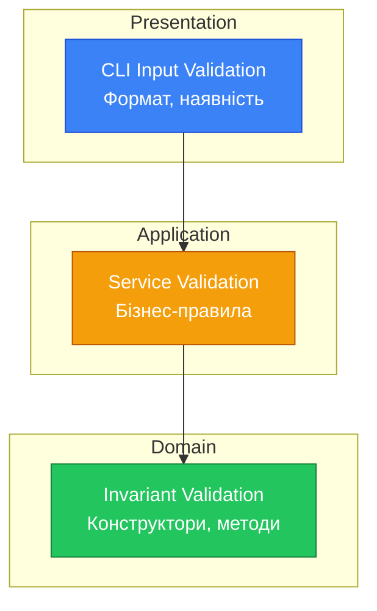

# Обробка помилок та валідація

## Вступ: Помилки — це частина домену

У попередніх матеріалах ми часто використовували `throw new IllegalStateException(...)`. Але виключення — не єдиний спосіб обробки помилок, і не завжди найкращий.

**Питання:**

- Що робити, якщо книга недоступна — це виняткова ситуація чи очікуваний сценарій?
- Як не "проковтнути" помилку?
- Як зробити API методу явним щодо можливих результатів?

## Два підходи до помилок

### 1. Виключення (Exceptions)

```java showLineNumbers
// Традиційний підхід
public Order createOrder(String userId, String bookId) {
    User user = userRepository.findById(userId)
            .orElseThrow(() -> new UserNotFoundException(userId));

    Book book = bookRepository.findById(bookId)
            .orElseThrow(() -> new BookNotFoundException(bookId));

    if (!user.canBorrow()) {
        throw new CannotBorrowException("User has reached limit");
    }

    // ... створення замовлення
}
```

**Проблеми:**

- Клієнт може **забути** обробити виняток
- Неявно, які саме винятки може кинути метод
- Контроль потоку через винятки — антипатерн

### 2. Result Pattern (Either)

```java showLineNumbers
// Функціональний підхід
public Result<Order, OrderError> createOrder(String userId, String bookId) {
    return userRepository.findById(userId)
            .map(user -> processOrder(user, bookId))
            .orElse(Result.failure(OrderError.userNotFound(userId)));
}
```

**Переваги:**

- Явний контракт — метод **завжди** повертає результат
- Компілятор "змушує" обробити обидва випадки
- Ланцюгування операцій без try-catch

## Result Pattern: Детальна реалізація

### Базова структура Result

```java showLineNumbers
package com.library.common;

import java.util.Objects;
import java.util.function.Consumer;
import java.util.function.Function;
import java.util.function.Supplier;

/**
 * Контейнер результату операції: успіх або помилка.
 * Натхненний Either з функціонального програмування.
 *
 * @param <T> тип успішного значення
 * @param <E> тип помилки
 */
public sealed interface Result<T, E> permits Result.Success, Result.Failure {

    // === Фабричні методи ===

    /**
     * Створює успішний результат.
     */
    static <T, E> Result<T, E> success(T value) {
        return new Success<>(value);
    }

    /**
     * Створює результат з помилкою.
     */
    static <T, E> Result<T, E> failure(E error) {
        return new Failure<>(error);
    }

    /**
     * Обгортає операцію, що може кинути виняток.
     */
    static <T> Result<T, Exception> of(Supplier<T> supplier) {
        try {
            return success(supplier.get());
        } catch (Exception e) {
            return failure(e);
        }
    }

    // === Перевірки ===

    boolean isSuccess();

    default boolean isFailure() {
        return !isSuccess();
    }

    // === Доступ до значень ===

    T getValue();

    E getError();

    /**
     * Повертає значення або значення за замовчуванням.
     */
    default T getOrElse(T defaultValue) {
        return isSuccess() ? getValue() : defaultValue;
    }

    /**
     * Повертає значення або обчислює його від помилки.
     */
    default T getOrElse(Function<E, T> fallback) {
        return isSuccess() ? getValue() : fallback.apply(getError());
    }

    /**
     * Повертає значення або кидає виняток.
     */
    default <X extends Throwable> T getOrThrow(Function<E, X> exceptionMapper) throws X {
        if (isSuccess()) {
            return getValue();
        }
        throw exceptionMapper.apply(getError());
    }

    // === Трансформації ===

    /**
     * Трансформує успішне значення.
     */
    default <U> Result<U, E> map(Function<T, U> mapper) {
        if (isSuccess()) {
            return success(mapper.apply(getValue()));
        }
        return failure(getError());
    }

    /**
     * Трансформує успішне значення в інший Result.
     */
    default <U> Result<U, E> flatMap(Function<T, Result<U, E>> mapper) {
        if (isSuccess()) {
            return mapper.apply(getValue());
        }
        return failure(getError());
    }

    /**
     * Трансформує помилку.
     */
    default <F> Result<T, F> mapError(Function<E, F> mapper) {
        if (isFailure()) {
            return failure(mapper.apply(getError()));
        }
        return success(getValue());
    }

    // === Побічні ефекти ===

    /**
     * Виконує дію для успішного значення.
     */
    default Result<T, E> onSuccess(Consumer<T> action) {
        if (isSuccess()) {
            action.accept(getValue());
        }
        return this;
    }

    /**
     * Виконує дію для помилки.
     */
    default Result<T, E> onFailure(Consumer<E> action) {
        if (isFailure()) {
            action.accept(getError());
        }
        return this;
    }

    /**
     * Pattern matching для обробки обох випадків.
     */
    default <U> U fold(Function<T, U> onSuccess, Function<E, U> onFailure) {
        return isSuccess() ? onSuccess.apply(getValue()) : onFailure.apply(getError());
    }

    // === Реалізації ===

    record Success<T, E>(T value) implements Result<T, E> {
        public Success {
            Objects.requireNonNull(value, "Success value cannot be null");
        }

        @Override
        public boolean isSuccess() { return true; }

        @Override
        public T getValue() { return value; }

        @Override
        public E getError() {
            throw new IllegalStateException("No error in Success");
        }
    }

    record Failure<T, E>(E error) implements Result<T, E> {
        public Failure {
            Objects.requireNonNull(error, "Error cannot be null");
        }

        @Override
        public boolean isSuccess() { return false; }

        @Override
        public T getValue() {
            throw new IllegalStateException("No value in Failure");
        }

        @Override
        public E getError() { return error; }
    }
}
```

**Ключові моменти:**

- **Рядок 15**: `sealed interface` — тільки `Success` та `Failure` можуть реалізовувати
- **Рядок 34-41**: Метод `of()` для обгортання небезпечних операцій
- **Рядок 85-95**: `map` та `flatMap` для ланцюгування
- **Рядок 122-124**: `fold` для обробки обох випадків

### Типізовані помилки

```java showLineNumbers
package com.library.domain.error;

/**
 * Sealed hierarchy помилок замовлення.
 */
public sealed interface OrderError {

    String getMessage();

    record UserNotFound(String userId) implements OrderError {
        @Override
        public String getMessage() {
            return "User not found: " + userId;
        }
    }

    record BookNotFound(String bookId) implements OrderError {
        @Override
        public String getMessage() {
            return "Book not found: " + bookId;
        }
    }

    record BookNotAvailable(String bookId, String title) implements OrderError {
        @Override
        public String getMessage() {
            return "Book '" + title + "' is not available";
        }
    }

    record UserCannotBorrow(String userId, String reason) implements OrderError {
        @Override
        public String getMessage() {
            return "User cannot borrow: " + reason;
        }
    }

    record InsufficientFunds(java.math.BigDecimal required, java.math.BigDecimal available)
            implements OrderError {
        @Override
        public String getMessage() {
            return String.format("Insufficient funds: required %s, available %s",
                    required, available);
        }
    }

    // Фабричні методи для зручності
    static OrderError userNotFound(String userId) {
        return new UserNotFound(userId);
    }

    static OrderError bookNotFound(String bookId) {
        return new BookNotFound(bookId);
    }

    static OrderError bookNotAvailable(String bookId, String title) {
        return new BookNotAvailable(bookId, title);
    }

    static OrderError userCannotBorrow(String userId, String reason) {
        return new UserCannotBorrow(userId, reason);
    }
}
```

### Використання Result у сервісі

```java showLineNumbers
package com.library.application;

import com.library.common.Result;
import com.library.domain.error.OrderError;
import com.library.domain.model.*;
import com.library.domain.model.order.Order;

/**
 * Application Service з використанням Result Pattern.
 */
public class OrderApplicationService {

    private final BookRepository bookRepository;
    private final UserRepository userRepository;
    private final OrderRepository orderRepository;

    public OrderApplicationService(BookRepository bookRepository,
                                    UserRepository userRepository,
                                    OrderRepository orderRepository) {
        this.bookRepository = bookRepository;
        this.userRepository = userRepository;
        this.orderRepository = orderRepository;
    }

    /**
     * Створює замовлення.
     * Повертає Result замість кидання винятків.
     */
    public Result<Order, OrderError> createOrder(String userId, String bookId) {
        // Пошук користувача
        return findUser(userId)
                .flatMap(user -> findBook(bookId)
                        .flatMap(book -> validateAndCreate(user, book)));
    }

    private Result<User, OrderError> findUser(String userId) {
        return userRepository.findById(userId)
                .map(Result::<User, OrderError>success)
                .orElseGet(() -> Result.failure(OrderError.userNotFound(userId)));
    }

    private Result<Book, OrderError> findBook(String bookId) {
        return bookRepository.findById(bookId)
                .map(Result::<Book, OrderError>success)
                .orElseGet(() -> Result.failure(OrderError.bookNotFound(bookId)));
    }

    private Result<Order, OrderError> validateAndCreate(User user, Book book) {
        // Перевірка користувача
        if (!user.canBorrow()) {
            String reason = user.getOverdueBooks() > 0
                    ? "Has overdue books"
                    : "Reached borrow limit";
            return Result.failure(OrderError.userCannotBorrow(user.getId(), reason));
        }

        // Перевірка книги
        if (!book.isAvailable()) {
            return Result.failure(OrderError.bookNotAvailable(book.getId(), book.getTitle()));
        }

        // Створення замовлення
        Order order = Order.create(user, book);

        // Збереження
        bookRepository.save(book);
        userRepository.save(user);
        orderRepository.save(order);

        return Result.success(order);
    }
}
```

### Обробка результату в CLI

```java showLineNumbers
package com.library.presentation.cli;

import com.library.application.OrderApplicationService;
import com.library.common.Result;

public class OrderMenu {

    private final OrderApplicationService orderService;

    public OrderMenu(OrderApplicationService orderService) {
        this.orderService = orderService;
    }

    public void handleCreateOrder(String userId, String bookId) {
        orderService.createOrder(userId, bookId)
                .onSuccess(order -> {
                    System.out.println("✅ Замовлення створено!");
                    System.out.println("   ID: " + order.getId());
                    System.out.println("   Книга: " + order.getBook().getTitle());
                })
                .onFailure(error -> {
                    System.out.println("❌ Помилка: " + error.getMessage());
                });

        // Або через fold:
        String message = orderService.createOrder(userId, bookId)
                .fold(
                        order -> "Замовлення " + order.getId() + " створено",
                        error -> "Помилка: " + error.getMessage()
                );
        System.out.println(message);
    }
}
```

## Guard Clauses: Захисні умови

### Проблема: Глибока вкладеність

```java showLineNumbers
// ❌ Антипатерн: Arrow Code / Deep Nesting
public void processOrder(Order order) {
    if (order != null) {
        if (order.getUser() != null) {
            if (order.getBook() != null) {
                if (order.isActive()) {
                    if (order.canModify()) {
                        // Нарешті логіка...
                    } else {
                        throw new IllegalStateException("Cannot modify");
                    }
                } else {
                    throw new IllegalStateException("Order not active");
                }
            } else {
                throw new IllegalArgumentException("Book is null");
            }
        } else {
            throw new IllegalArgumentException("User is null");
        }
    } else {
        throw new IllegalArgumentException("Order is null");
    }
}
```

### Рішення: Guard Clauses

**Guard Clause** — умова, яка перевіряє аргумент і негайно виходить з методу (через return або throw).

```java showLineNumbers
// ✅ Guard Clauses: плоска структура
public void processOrder(Order order) {
    // Guards на початку
    if (order == null) {
        throw new IllegalArgumentException("Order cannot be null");
    }
    if (order.getUser() == null) {
        throw new IllegalArgumentException("Order user cannot be null");
    }
    if (order.getBook() == null) {
        throw new IllegalArgumentException("Order book cannot be null");
    }
    if (!order.isActive()) {
        throw new IllegalStateException("Order is not active");
    }
    if (!order.canModify()) {
        throw new IllegalStateException("Order cannot be modified");
    }

    // Основна логіка — без вкладеності
    performOrderProcessing(order);
}
```

### Утилітний клас Preconditions

```java showLineNumbers
package com.library.common;

import java.util.Collection;
import java.util.Objects;

/**
 * Утилітний клас для захисних умов.
 * Натхненний Guava Preconditions.
 */
public final class Preconditions {

    private Preconditions() {}

    // === Null checks ===

    /**
     * Перевіряє, що об'єкт не null.
     */
    public static <T> T requireNonNull(T obj, String paramName) {
        if (obj == null) {
            throw new IllegalArgumentException(paramName + " cannot be null");
        }
        return obj;
    }

    // === String checks ===

    /**
     * Перевіряє, що рядок не null і не порожній.
     */
    public static String requireNonBlank(String str, String paramName) {
        requireNonNull(str, paramName);
        if (str.isBlank()) {
            throw new IllegalArgumentException(paramName + " cannot be blank");
        }
        return str;
    }

    // === Number checks ===

    /**
     * Перевіряє, що число додатне.
     */
    public static int requirePositive(int value, String paramName) {
        if (value <= 0) {
            throw new IllegalArgumentException(paramName + " must be positive, got: " + value);
        }
        return value;
    }

    /**
     * Перевіряє, що число невід'ємне.
     */
    public static int requireNonNegative(int value, String paramName) {
        if (value < 0) {
            throw new IllegalArgumentException(paramName + " cannot be negative, got: " + value);
        }
        return value;
    }

    /**
     * Перевіряє, що число в діапазоні.
     */
    public static int requireInRange(int value, int min, int max, String paramName) {
        if (value < min || value > max) {
            throw new IllegalArgumentException(
                    String.format("%s must be between %d and %d, got: %d",
                            paramName, min, max, value));
        }
        return value;
    }

    // === Collection checks ===

    /**
     * Перевіряє, що колекція не порожня.
     */
    public static <T extends Collection<?>> T requireNonEmpty(T collection, String paramName) {
        requireNonNull(collection, paramName);
        if (collection.isEmpty()) {
            throw new IllegalArgumentException(paramName + " cannot be empty");
        }
        return collection;
    }

    // === State checks ===

    /**
     * Перевіряє умову стану.
     */
    public static void checkState(boolean condition, String message) {
        if (!condition) {
            throw new IllegalStateException(message);
        }
    }

    /**
     * Перевіряє умову стану з форматуванням.
     */
    public static void checkState(boolean condition, String format, Object... args) {
        if (!condition) {
            throw new IllegalStateException(String.format(format, args));
        }
    }

    /**
     * Перевіряє умову аргументу.
     */
    public static void checkArgument(boolean condition, String message) {
        if (!condition) {
            throw new IllegalArgumentException(message);
        }
    }
}
```

### Використання Preconditions у доменних об'єктах

```java showLineNumbers
package com.library.domain.model;

import static com.library.common.Preconditions.*;

public final class Book {

    private final String id;
    private final String isbn;
    private String title;
    private String author;
    private int availableCopies;
    private final int totalCopies;

    private Book(String id, String isbn, String title, String author, int totalCopies) {
        this.id = id;
        this.isbn = isbn;
        this.title = title;
        this.author = author;
        this.totalCopies = totalCopies;
        this.availableCopies = totalCopies;
    }

    public static Book create(String id, String isbn, String title,
                               String author, int totalCopies) {
        // Guards з зрозумілими повідомленнями
        requireNonBlank(id, "id");
        requireNonBlank(isbn, "isbn");
        requireNonBlank(title, "title");
        requireNonBlank(author, "author");
        requirePositive(totalCopies, "totalCopies");

        checkArgument(isbn.length() == 13, "ISBN must be 13 characters");

        return new Book(id, isbn, title, author, totalCopies);
    }

    public void borrow() {
        checkState(isAvailable(), "Cannot borrow: no copies available");
        availableCopies--;
    }

    public void returnCopy() {
        checkState(availableCopies < totalCopies,
                "Cannot return: all %d copies already returned", totalCopies);
        availableCopies++;
    }

    // ...
}
```

## Ієрархія бізнес-виключень

### Коли виключення доречні?

**Виключення доречні для:**

- Справжніх виняткових ситуацій (помилка I/O, недоступність сервісу)
- Порушення інваріантів (програмна помилка)
- Ситуацій, де відновлення неможливе

**Result доречний для:**

- Очікуваних альтернативних сценаріїв
- Бізнес-помилок (книга недоступна, ліміт досягнуто)
- API, де клієнт має обробити обидва випадки

### Реалізація ієрархії

```java showLineNumbers
package com.library.domain.exception;

/**
 * Базовий виняток для всіх бізнес-помилок.
 */
public abstract class BusinessException extends RuntimeException {

    private final String errorCode;

    protected BusinessException(String errorCode, String message) {
        super(message);
        this.errorCode = errorCode;
    }

    protected BusinessException(String errorCode, String message, Throwable cause) {
        super(message, cause);
        this.errorCode = errorCode;
    }

    public String getErrorCode() {
        return errorCode;
    }
}
```

```java showLineNumbers
package com.library.domain.exception;

/**
 * Виняток, коли сутність не знайдена.
 */
public class EntityNotFoundException extends BusinessException {

    private final String entityType;
    private final String entityId;

    public EntityNotFoundException(String entityType, String entityId) {
        super(
                "ENTITY_NOT_FOUND",
                String.format("%s with id '%s' not found", entityType, entityId)
        );
        this.entityType = entityType;
        this.entityId = entityId;
    }

    public String getEntityType() { return entityType; }
    public String getEntityId() { return entityId; }
}
```

```java showLineNumbers
package com.library.domain.exception;

import java.util.ArrayList;
import java.util.Collections;
import java.util.List;

/**
 * Виняток при помилках валідації.
 */
public class ValidationException extends BusinessException {

    private final List<ValidationError> errors;

    public ValidationException(String message) {
        super("VALIDATION_ERROR", message);
        this.errors = Collections.emptyList();
    }

    public ValidationException(List<ValidationError> errors) {
        super("VALIDATION_ERROR", formatErrors(errors));
        this.errors = new ArrayList<>(errors);
    }

    public List<ValidationError> getErrors() {
        return Collections.unmodifiableList(errors);
    }

    private static String formatErrors(List<ValidationError> errors) {
        return errors.stream()
                .map(ValidationError::toString)
                .reduce((a, b) -> a + "; " + b)
                .orElse("Validation failed");
    }

    /**
     * Record для окремої помилки валідації.
     */
    public record ValidationError(String field, String message) {
        @Override
        public String toString() {
            return field + ": " + message;
        }
    }
}
```

```java showLineNumbers
package com.library.domain.exception;

/**
 * Виняток при конфлікті стану.
 */
public class ConflictException extends BusinessException {

    public ConflictException(String message) {
        super("CONFLICT", message);
    }

    public static ConflictException duplicateEntity(String entityType, String field, Object value) {
        return new ConflictException(
                String.format("%s with %s '%s' already exists", entityType, field, value)
        );
    }

    public static ConflictException invalidStateTransition(String from, String to) {
        return new ConflictException(
                String.format("Cannot transition from %s to %s", from, to)
        );
    }
}
```

```java showLineNumbers
package com.library.domain.exception;

/**
 * Виняток при порушенні бізнес-правила.
 */
public class BusinessRuleViolationException extends BusinessException {

    private final String ruleName;

    public BusinessRuleViolationException(String ruleName, String message) {
        super("BUSINESS_RULE_VIOLATION", message);
        this.ruleName = ruleName;
    }

    public String getRuleName() {
        return ruleName;
    }

    public static BusinessRuleViolationException borrowLimitExceeded(int limit) {
        return new BusinessRuleViolationException(
                "BORROW_LIMIT",
                String.format("Borrow limit of %d books exceeded", limit)
        );
    }

    public static BusinessRuleViolationException hasOverdueBooks(int count) {
        return new BusinessRuleViolationException(
                "OVERDUE_BOOKS",
                String.format("Cannot borrow: %d overdue book(s)", count)
        );
    }
}
```

### Обробка виключень у CLI

```java showLineNumbers
package com.library.presentation.cli;

import com.library.domain.exception.*;

public class ExceptionHandler {

    public void handle(Exception e) {
        switch (e) {
            case EntityNotFoundException ex ->
                System.err.printf("❌ Не знайдено: %s%n", ex.getMessage());

            case ValidationException ex -> {
                System.err.println("❌ Помилки валідації:");
                ex.getErrors().forEach(error ->
                    System.err.printf("   - %s: %s%n", error.field(), error.message())
                );
            }

            case ConflictException ex ->
                System.err.printf("❌ Конфлікт: %s%n", ex.getMessage());

            case BusinessRuleViolationException ex ->
                System.err.printf("❌ Порушення правила '%s': %s%n",
                        ex.getRuleName(), ex.getMessage());

            case BusinessException ex ->
                System.err.printf("❌ Помилка [%s]: %s%n",
                        ex.getErrorCode(), ex.getMessage());

            default ->
                System.err.printf("❌ Невідома помилка: %s%n", e.getMessage());
        }
    }
}
```

## Валідація: Де і як?

### Рівні валідації

::mermaid



::

| Рівень           | Що перевіряємо  | Приклади                         |
| :--------------- | :-------------- | :------------------------------- |
| **Presentation** | Формат вводу    | Email має @, рік — число         |
| **Application**  | Бізнес-контекст | Користувач існує, книга доступна |
| **Domain**       | Інваріанти      | totalCopies > 0, isbn валідний   |

### Validator Pattern

```java showLineNumbers
package com.library.domain.validation;

import com.library.domain.exception.ValidationException;
import com.library.domain.exception.ValidationException.ValidationError;

import java.util.ArrayList;
import java.util.List;
import java.util.function.Predicate;

/**
 * Builder для валідації з накопиченням помилок.
 */
public final class Validator<T> {

    private final T value;
    private final List<ValidationError> errors = new ArrayList<>();

    private Validator(T value) {
        this.value = value;
    }

    public static <T> Validator<T> of(T value) {
        return new Validator<>(value);
    }

    /**
     * Додає правило валідації.
     */
    public Validator<T> validate(Predicate<T> predicate, String field, String message) {
        if (!predicate.test(value)) {
            errors.add(new ValidationError(field, message));
        }
        return this;
    }

    /**
     * Додає правило для поля.
     */
    public <V> Validator<T> validateField(V fieldValue, String field,
                                           Predicate<V> predicate, String message) {
        if (!predicate.test(fieldValue)) {
            errors.add(new ValidationError(field, message));
        }
        return this;
    }

    /**
     * Перевіряє, чи є помилки.
     */
    public boolean hasErrors() {
        return !errors.isEmpty();
    }

    /**
     * Повертає список помилок.
     */
    public List<ValidationError> getErrors() {
        return List.copyOf(errors);
    }

    /**
     * Повертає значення або кидає ValidationException.
     */
    public T getOrThrow() {
        if (hasErrors()) {
            throw new ValidationException(errors);
        }
        return value;
    }

    /**
     * Повертає Result замість виключення.
     */
    public Result<T, List<ValidationError>> toResult() {
        if (hasErrors()) {
            return Result.failure(errors);
        }
        return Result.success(value);
    }
}
```

### Використання Validator

```java showLineNumbers
package com.library.application;

import com.library.domain.validation.Validator;

public class UserRegistrationService {

    public record RegistrationRequest(
            String name,
            String email,
            String password,
            int age
    ) {}

    public Result<User, List<ValidationError>> register(RegistrationRequest request) {
        return Validator.of(request)
                .validateField(request.name(), "name",
                        name -> name != null && !name.isBlank(),
                        "Name is required")
                .validateField(request.name(), "name",
                        name -> name == null || name.length() <= 100,
                        "Name must be at most 100 characters")
                .validateField(request.email(), "email",
                        email -> email != null && email.contains("@"),
                        "Valid email is required")
                .validateField(request.password(), "password",
                        pwd -> pwd != null && pwd.length() >= 8,
                        "Password must be at least 8 characters")
                .validateField(request.age(), "age",
                        age -> age >= 18 && age <= 120,
                        "Age must be between 18 and 120")
                .toResult()
                .flatMap(this::createUser);
    }

    private Result<User, List<ValidationError>> createUser(RegistrationRequest request) {
        // Перевірка унікальності email
        if (userRepository.findByEmail(request.email()).isPresent()) {
            return Result.failure(List.of(
                    new ValidationError("email", "Email already registered")
            ));
        }

        User user = User.create(
                generateId(),
                request.name(),
                Email.of(request.email()),
                UserType.REGULAR
        );

        userRepository.save(user);
        return Result.success(user);
    }
}
```

## Підсумки

::card-group
::card{title="Result Pattern"}
Явний контракт: метод завжди повертає результат. Компілятор змушує обробити обидва випадки.
::

::card{title="Guard Clauses"}
Захисні умови на початку методу. Плоска структура замість глибокої вкладеності.
::

::card{title="Ієрархія виключень"}
Типізовані помилки: EntityNotFoundException, ValidationException, ConflictException.
::

::card{title="Validator Pattern"}
Накопичення помилок замість fail-fast. Зручний builder API.
::

::

## Рекомендації

| Ситуація                    | Рекомендація                                        |
| :-------------------------- | :-------------------------------------------------- |
| Очікувана альтернатива      | `Result<T, E>`                                      |
| Програмна помилка           | `IllegalArgumentException`, `IllegalStateException` |
| Помилка I/O, мережі         | `RuntimeException` або `Result`                     |
| Валідація з кількома полями | `Validator` з накопиченням                          |
| API для зовнішніх клієнтів  | `Result` — явний контракт                           |

## Корисні посилання

- [Railway Oriented Programming](https://fsharpforfunandprofit.com/rop/) — концепція Result
- [Martin Fowler — Fail Fast](https://martinfowler.com/ieeeSoftware/failFast.pdf)
- [Effective Java — Item 72: Exceptions](https://www.oreilly.com/library/view/effective-java-3rd/9780134686097/)
