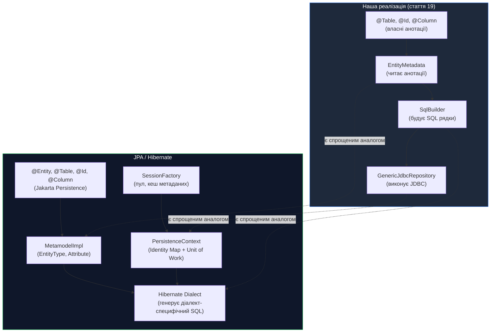
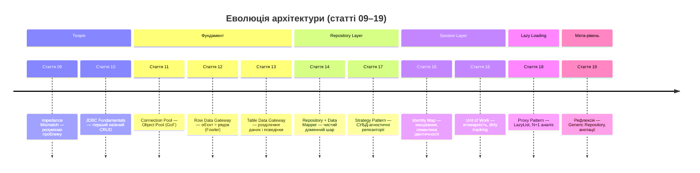

# Generic Repository через Java Reflection: анотації та динамічний SQL

## Вступ: Дублювання як накопичений технічний борг

Упродовж попередніх статей ми розробили розвинену архітектуру доступу до даних: `AbstractJdbcRepository`, `SqlStrategy`, Identity Map, Unit of Work, Lazy Loading. Але один недолік залишається відкритим — **структурне дублювання між конкретними репозиторіями**.

Розглянемо три реалізації `mapRow()` поруч:

```java
// JdbcAuthorRepository.mapRow()
Author author = new Author(rs.getString("first_name"), rs.getString("last_name"));
author.setId(rs.getObject("id", UUID.class));
author.setBio(rs.getString("bio"));
author.setImagePath(rs.getString("image_path"));
return author;

// JdbcGenreRepository.mapRow()
Genre genre = new Genre(rs.getString("name"));
genre.setId(rs.getObject("id", UUID.class));
genre.setDescription(rs.getString("description"));
return genre;

// JdbcAudiobookRepository.mapRow()
Audiobook book = new Audiobook(rs.getString("title"), author, genre);
book.setId(rs.getObject("id", UUID.class));
book.setYear(rs.getInt("year"));
book.setDescription(rs.getString("description"));
// ... ще 5-6 рядків
return book;
```

І три реалізації SQL-стратегій:

```java
// H2AuthorSqlStrategy.getInsertSql()
"INSERT INTO authors (id, first_name, last_name, bio, image_path) VALUES (?, ?, ?, ?, ?)"

// H2GenreSqlStrategy.getInsertSql()
"INSERT INTO genres (id, name, description) VALUES (?, ?, ?)"

// H2AudiobookSqlStrategy.getInsertSql()
"INSERT INTO audiobooks (id, title, author_id, genre_id, year, price, ...) VALUES (?, ?, ?, ...)"
```

**Що у всіх трьох є спільного?** Структура SQL ідентична — відрізняються лише назви таблиць, стовпців та кількість полів. **Що відрізняється?** Саме ці метадані: яка таблиця, які стовпці, яке поле є первинним ключем.

Висновок: ці метадані можна описати **декларативно** — і тоді репозиторій **сам** побудує SQL через рефлексію, без жодного дублювання.

Це саме той підхід, що реалізує JPA: анотації `@Entity`, `@Table`, `@Column`, `@Id` є декларативними метаданими, з яких Hibernate автоматично генерує SQL.

---

## Концепція: Анотації як метадані маппінгу

**Java Annotations** (введені у Java 5, JSR-175) є механізмом приєднання метаданих до програмних елементів (класів, полів, методів). На відміну від звичайного коду, анотації **не виконують дій** — вони лише описують структуру, залишаючи виконання іншому коду (процесорам анотацій або рефлексії у runtime).

Ключова властивість для нашої задачі: анотації можна зчитати у **runtime** через `java.lang.reflect`, побудувати SQL-рядки і виконати їх через JDBC — все без явного написання SQL у репозиторіях.

::mermaid

```mermaid
graph LR
    subgraph Ann ["Анотації (метадані)"]
        TA["@Table(\"authors\")"]
        IA["@Id\nprivate UUID id"]
        CA1["@Column(\"first_name\")\nprivate String firstName"]
        CA2["@Column(\"last_name\")\nprivate String lastName"]
        CA3["@Column(\"bio\")\nprivate String bio"]
    end

    subgraph Ref ["Рефлексія (runtime)"]
        GR["GenericJdbcRepository\nreaAnnotations()"]
        SB["SQL Builder\nbuildInsertSql()\nbuildUpdateSql()\nbuildSelectSql()"]
    end

    DB[("H2 Database")]

    Ann --> Ref
    GR --> SB
    SB --> DB

    style Ann fill:#1e3a5f,stroke:#3b82f6,color:#ffffff
    style Ref fill:#1e3a2f,stroke:#22c55e,color:#ffffff
```

::

---

## Визначення анотацій

Визначимо три анотації — точний аналог JPA, але власні:

```java showLineNumbers
package com.example.audiobook.annotation;

import java.lang.annotation.*;

/**
 * Маркує клас як сутність, що відображається на таблицю БД.
 * <p>
 * Аналог JPA {@code @Table(name = "...")}.
 * <p>
 * Якщо {@code name} не задано — використовується ім'я класу у нижньому регістрі.
 *
 * <b>Приклад:</b>
 * <pre>{@code
 * @Table("authors")
 * public class Author { ... }
 * }</pre>
 */
@Target(ElementType.TYPE)         // застосовується до класів
@Retention(RetentionPolicy.RUNTIME) // видима у runtime для рефлексії
@Documented                        // включається у Javadoc
public @interface Table {
    /**
     * Ім'я таблиці у базі даних.
     */
    String value();
}
```

```java showLineNumbers
package com.example.audiobook.annotation;

import java.lang.annotation.*;

/**
 * Маркує поле як первинний ключ таблиці.
 * <p>
 * Аналог JPA {@code @Id} + {@code @GeneratedValue}.
 * <p>
 * Поле з цією анотацією:
 * <ul>
 *   <li>Використовується у {@code WHERE id = ?} для UPDATE, DELETE, SELECT BY ID;</li>
 *   <li>Ставиться першим у INSERT (конвенція);</li>
 *   <li>Не включається у SET-частину UPDATE.</li>
 * </ul>
 *
 * <b>Підтримувані типи:</b> {@code UUID}, {@code Long}, {@code Integer}.
 */
@Target(ElementType.FIELD)
@Retention(RetentionPolicy.RUNTIME)
@Documented
public @interface Id {
    // Немає атрибутів: поле з @Id завжди є "id" в SQL (або ім'я поля)
}
```

```java showLineNumbers
package com.example.audiobook.annotation;

import java.lang.annotation.*;

/**
 * Маркує поле як стовпець таблиці.
 * <p>
 * Аналог JPA {@code @Column(name = "...")}.
 * <p>
 * Якщо {@code name} не задано — використовується ім'я поля без перетворень.
 * Але для camelCase Java полів зазвичай потрібен snake_case у БД,
 * тому рекомендується завжди задавати {@code name} явно.
 *
 * <b>Приклад:</b>
 * <pre>{@code
 * @Column("first_name")
 * private String firstName;
 *
 * @Column(value = "bio", nullable = true)
 * private String bio;
 * }</pre>
 */
@Target(ElementType.FIELD)
@Retention(RetentionPolicy.RUNTIME)
@Documented
public @interface Column {

    /**
     * Ім'я стовпця у таблиці БД.
     * Якщо порожнє — береться ім'я поля.
     */
    String value() default "";

    /**
     * Чи може стовпець містити {@code NULL}.
     * Не впливає на генерацію SQL у поточній реалізації,
     * але корисний для документації та валідації.
     */
    boolean nullable() default true;

    /**
     * Чи є стовпець лише для читання (виключається з INSERT і UPDATE).
     * Корисно для полів типу {@code created_at}, що встановлюються БД.
     */
    boolean readOnly() default false;
}
```

---

## Анотування сутностей

Тепер анотуємо доменні класи:

```java showLineNumbers
package com.example.audiobook.domain;

import com.example.audiobook.annotation.Column;
import com.example.audiobook.annotation.Id;
import com.example.audiobook.annotation.Table;

import java.util.UUID;

/**
 * Доменна сутність Автор.
 * <p>
 * Анотації {@link Table}, {@link Id}, {@link Column} містять метадані маппінгу:
 * яка таблиця, яке поле є PK, яким стовпцям відповідають поля.
 * {@link com.example.audiobook.repository.GenericJdbcRepository} зчитує ці
 * анотації через рефлексію і будує SQL динамічно.
 */
@Table("authors")                  // ← ім'я таблиці у БД
public class Author {

    @Id                            // ← первинний ключ
    @Column("id")
    private UUID id;

    @Column("first_name")          // ← snake_case ім'я стовпця
    private String firstName;

    @Column("last_name")
    private String lastName;

    @Column(value = "bio", nullable = true)  // ← nullable: може бути NULL
    private String bio;

    @Column(value = "image_path", nullable = true)
    private String imagePath;

    // Поля БЕЗ @Column — не маппляться (наприклад, обчислювані або lazy)
    // private List<Audiobook> audiobooks; ← не анотоване → ігнорується GenericRepository

    public Author() {}  // ← ОБОВ'ЯЗКОВО: GenericRepository потребує no-args конструктор

    public Author(String firstName, String lastName) {
        this.id = UUID.randomUUID();
        this.firstName = firstName;
        this.lastName = lastName;
    }

    // ─── Getters та Setters (всі потрібні для рефлексії через set/getField) ──

    public UUID   getId()          { return id; }
    public void   setId(UUID id)   { this.id = id; }
    public String getFirstName()   { return firstName; }
    public void   setFirstName(String v) { this.firstName = v; }
    public String getLastName()    { return lastName; }
    public void   setLastName(String v)  { this.lastName = v; }
    public String getBio()         { return bio; }
    public void   setBio(String v) { this.bio = v; }
    public String getImagePath()   { return imagePath; }
    public void   setImagePath(String v) { this.imagePath = v; }
}
```

```java showLineNumbers
package com.example.audiobook.domain;

import com.example.audiobook.annotation.*;
import java.util.UUID;

/**
 * Доменна сутність Жанр — мінімальний приклад маппінгу.
 */
@Table("genres")
public class Genre {

    @Id
    @Column("id")
    private UUID id;

    @Column("name")
    private String name;

    @Column(value = "description", nullable = true)
    private String description;

    public Genre() {}

    public Genre(String name) {
        this.id = UUID.randomUUID();
        this.name = name;
    }

    public UUID   getId()          { return id; }
    public void   setId(UUID id)   { this.id = id; }
    public String getName()        { return name; }
    public void   setName(String v){ this.name = v; }
    public String getDescription() { return description; }
    public void   setDescription(String v) { this.description = v; }
}
```

---

## EntityMetadata: Зчитування анотацій

Перш ніж писати сам репозиторій, інкапсулюємо логіку зчитування анотацій у окремий клас `EntityMetadata<T>`. Він є класичним **Value Object**: незмінний, кешований, що містить всю інформацію про маппінг класу.

```java showLineNumbers
package com.example.audiobook.repository.reflection;

import com.example.audiobook.annotation.Column;
import com.example.audiobook.annotation.Id;
import com.example.audiobook.annotation.Table;

import java.lang.reflect.Field;
import java.util.ArrayList;
import java.util.List;
import java.util.Objects;

/**
 * Метадані маппінгу для конкретного класу сутності.
 * <p>
 * При ініціалізації зчитує анотації {@link Table}, {@link Id}, {@link Column}
 * через рефлексію і будує впорядковані списки полів:
 * <ul>
 *   <li>{@link #idField} — поле з {@link Id} (рівно одне);</li>
 *   <li>{@link #columnFields} — поля з {@link Column} без {@link Id}
 *       і без {@code readOnly = true};</li>
 *   <li>{@link #allSelectFields} — всі поля, що читаються з ResultSet.</li>
 * </ul>
 * <p>
 * Об'єкт є незмінним після створення і може кешуватися
 * (наприклад, у {@code static final} або ConcurrentHashMap).
 *
 * @param <T> тип доменної сутності
 */
public class EntityMetadata<T> {

    /**
     * Ім'я таблиці у БД (з анотації {@link Table}).
     */
    public final String tableName;

    /**
     * Клас сутності.
     */
    public final Class<T> entityClass;

    /**
     * Поле-первинний ключ (анотоване {@link Id}).
     * Використовується у WHERE-умовах.
     */
    public final FieldMapping idField;

    /**
     * Поля для INSERT і UPDATE (анотовані {@link Column},
     * крім {@link Id} і полів з {@code readOnly = true}).
     */
    public final List<FieldMapping> columnFields;

    /**
     * Всі поля для SELECT (id + columnFields + readOnly).
     * Порядок: спочатку id, потім решта у порядку оголошення.
     */
    public final List<FieldMapping> allSelectFields;

    /**
     * Зчитує метадані з класу через рефлексію.
     *
     * @param entityClass клас сутності (наприклад, {@code Author.class})
     * @throws IllegalArgumentException якщо анотації відсутні або некоректні
     */
    @SuppressWarnings("unchecked")
    public EntityMetadata(Class<T> entityClass) {
        this.entityClass = entityClass;

        // ── Крок 1: Зчитати @Table ─────────────────────────────────────────
        Table tableAnnotation = entityClass.getAnnotation(Table.class);
        if (tableAnnotation == null) {
            throw new IllegalArgumentException(
                "Клас %s не анотований @Table".formatted(entityClass.getSimpleName()));
        }
        this.tableName = tableAnnotation.value();

        // ── Крок 2: Знайти @Id і @Column поля ─────────────────────────────
        FieldMapping foundId = null;
        List<FieldMapping> columns = new ArrayList<>();
        List<FieldMapping> allSelect = new ArrayList<>();

        // getDeclaredFields() повертає поля даного класу (без успадкованих)
        // Якщо потрібна ієрархія — додатково ітерувати getSuperclass()
        for (Field field : entityClass.getDeclaredFields()) {
            field.setAccessible(true); // дозволити доступ до private-полів

            if (field.isAnnotationPresent(Id.class)) {
                // Поле @Id: може також мати @Column
                String colName = resolveColumnName(field);
                foundId = new FieldMapping(field, colName);
                allSelect.add(foundId);

            } else if (field.isAnnotationPresent(Column.class)) {
                Column col = field.getAnnotation(Column.class);
                String colName = resolveColumnName(field);
                FieldMapping mapping = new FieldMapping(field, colName);

                allSelect.add(mapping);
                if (!col.readOnly()) {
                    columns.add(mapping); // readOnly-поля не в INSERT/UPDATE
                }
            }
            // Поля без @Column і @Id — ігноруються (наприклад, LazyList)
        }

        if (foundId == null) {
            throw new IllegalArgumentException(
                "Клас %s не має поля з @Id".formatted(entityClass.getSimpleName()));
        }

        this.idField = foundId;
        this.columnFields = List.copyOf(columns); // незмінний список
        this.allSelectFields = List.copyOf(allSelect);
    }

    /**
     * Визначає ім'я SQL-стовпця для поля.
     * Якщо {@code @Column(value = "...")} не порожній — використовує його.
     * Якщо порожній або є лише {@code @Id} — використовує ім'я поля Java.
     */
    private String resolveColumnName(Field field) {
        if (field.isAnnotationPresent(Column.class)) {
            String annotatedName = field.getAnnotation(Column.class).value();
            return annotatedName.isEmpty() ? field.getName() : annotatedName;
        }
        return field.getName(); // для @Id без @Column
    }

    // ─── Допоміжні методи ─────────────────────────────────────────────────────

    /**
     * Повертає список імен всіх SQL-стовпців для SELECT.
     * Наприклад: ["id", "first_name", "last_name", "bio", "image_path"]
     */
    public List<String> selectColumnNames() {
        return allSelectFields.stream()
            .map(FieldMapping::columnName)
            .toList();
    }

    /**
     * Повертає список імен стовпців для INSERT/UPDATE (без PK і readOnly).
     */
    public List<String> writableColumnNames() {
        return columnFields.stream()
            .map(FieldMapping::columnName)
            .toList();
    }

    // ─── FieldMapping: Прив'язка Java-поля до SQL-стовпця ────────────────────

    /**
     * Незмінна пара (Java Field → SQL column name).
     * <p>
     * Зберігає посилання на рефлексивне поле для подальшого читання і запису значень.
     */
    public record FieldMapping(Field field, String columnName) {

        /**
         * Читає значення поля у об'єкта.
         *
         * @param entity об'єкт-сутність
         * @return значення поля (може бути {@code null})
         * @throws RuntimeException якщо рефлексивний доступ неможливий
         */
        public Object getValue(Object entity) {
            try {
                return field.get(entity);
            } catch (IllegalAccessException e) {
                throw new RuntimeException("Не вдалося прочитати поле " + field.getName(), e);
            }
        }

        /**
         * Встановлює значення поля у об'єкта.
         *
         * @param entity об'єкт-сутність
         * @param value  нове значення
         * @throws RuntimeException якщо рефлексивний доступ неможливий
         */
        public void setValue(Object entity, Object value) {
            try {
                field.set(entity, value);
            } catch (IllegalAccessException e) {
                throw new RuntimeException("Не вдалося записати поле " + field.getName(), e);
            }
        }

        /**
         * Тип Java-поля (наприклад, {@code UUID.class}, {@code String.class}).
         */
        public Class<?> fieldType() {
            return field.getType();
        }
    }
}
```

---
## SqlBuilder: Динамічна генерація SQL

Виділимо побудову SQL-рядків у окремий компонент `SqlBuilder`. Він використовує `EntityMetadata` і не знає нічого про JDBC:

```java showLineNumbers
package com.example.audiobook.repository.reflection;

import java.util.List;
import java.util.stream.Collectors;

/**
 * Будівник SQL-запитів на основі метаданих сутності.
 * <p>
 * Генерує стандартні CRUD-запити (INSERT, UPDATE, SELECT, DELETE)
 * динамічно, без жодного хардкоду назв таблиць чи стовпців.
 * <p>
 * Всі методи є pure functions: не мають стану, не виконують SQL,
 * повертають рядки, що можна логувати і тестувати ізольовано.
 */
public class SqlBuilder {

    private final EntityMetadata<?> meta;

    public SqlBuilder(EntityMetadata<?> meta) {
        this.meta = meta;
    }

    /**
     * Будує INSERT-запит.
     * <p>
     * Приклад для Author:
     * {@code INSERT INTO authors (id, first_name, last_name, bio, image_path) VALUES (?, ?, ?, ?, ?)}
     * <p>
     * Порядок стовпців: спочатку @Id, потім @Column у порядку оголошення у класі.
     */
    public String buildInsert() {
        // Стовпці для INSERT: PK + всі writeable columns
        List<String> cols = new java.util.ArrayList<>();
        cols.add(meta.idField.columnName()); // id завжди перший
        cols.addAll(meta.writableColumnNames());

        String columnList   = String.join(", ", cols);
        String placeholders = cols.stream().map(c -> "?").collect(Collectors.joining(", "));

        return "INSERT INTO %s (%s) VALUES (%s)".formatted(
            meta.tableName, columnList, placeholders);
    }

    /**
     * Будує UPDATE-запит.
     * <p>
     * Приклад для Author:
     * {@code UPDATE authors SET first_name = ?, last_name = ?, bio = ?, image_path = ? WHERE id = ?}
     * <p>
     * Первинний ключ є останнім параметром (у WHERE).
     */
    public String buildUpdate() {
        String setClause = meta.writableColumnNames().stream()
            .map(col -> col + " = ?")
            .collect(Collectors.joining(", "));

        return "UPDATE %s SET %s WHERE %s = ?".formatted(
            meta.tableName, setClause, meta.idField.columnName());
    }

    /**
     * Будує SELECT-запит для всіх записів.
     * <p>
     * Приклад: {@code SELECT id, first_name, last_name, bio, image_path FROM authors}
     */
    public String buildSelectAll() {
        String cols = String.join(", ", meta.selectColumnNames());
        return "SELECT %s FROM %s".formatted(cols, meta.tableName);
    }

    /**
     * Будує SELECT-запит з WHERE id = ?.
     * <p>
     * Приклад: {@code SELECT id, first_name, last_name FROM authors WHERE id = ?}
     */
    public String buildSelectById() {
        String cols = String.join(", ", meta.selectColumnNames());
        return "SELECT %s FROM %s WHERE %s = ?".formatted(
            cols, meta.tableName, meta.idField.columnName());
    }

    /**
     * Будує DELETE-запит.
     * <p>
     * Приклад: {@code DELETE FROM authors WHERE id = ?}
     */
    public String buildDeleteById() {
        return "DELETE FROM %s WHERE %s = ?".formatted(
            meta.tableName, meta.idField.columnName());
    }

    /**
     * Будує COUNT-запит.
     * <p>
     * Приклад: {@code SELECT COUNT(*) FROM authors}
     */
    public String buildCount() {
        return "SELECT COUNT(*) FROM %s".formatted(meta.tableName);
    }

    /**
     * Будує EXISTS-запит.
     * <p>
     * Приклад: {@code SELECT 1 FROM authors WHERE id = ? LIMIT 1}
     */
    public String buildExistsById() {
        return "SELECT 1 FROM %s WHERE %s = ? LIMIT 1".formatted(
            meta.tableName, meta.idField.columnName());
    }

    /**
     * Будує сторінковий SELECT (LIMIT/OFFSET — для H2 і PostgreSQL).
     */
    public String buildSelectPage(int page, int size) {
        String cols = String.join(", ", meta.selectColumnNames());
        int offset = page * size;
        return "SELECT %s FROM %s LIMIT %d OFFSET %d".formatted(
            cols, meta.tableName, size, offset);
    }
}
```

---

## GenericJdbcRepository: CRUD через рефлексію

Тепер реалізуємо сам Generic Repository. Він поєднує `EntityMetadata`, `SqlBuilder` і JDBC:

```java showLineNumbers
package com.example.audiobook.repository;

import com.example.audiobook.db.ConnectionManager;
import com.example.audiobook.db.DatabaseException;
import com.example.audiobook.repository.reflection.EntityMetadata;
import com.example.audiobook.repository.reflection.EntityMetadata.FieldMapping;
import com.example.audiobook.repository.reflection.SqlBuilder;

import java.sql.*;
import java.util.ArrayList;
import java.util.List;
import java.util.Optional;
import java.util.UUID;

/**
 * Універсальний JDBC-репозиторій на основі Java Reflection.
 * <p>
 * Реалізує повний CRUD для будь-якої сутності, що анотована
 * {@link com.example.audiobook.annotation.Table}, {@link com.example.audiobook.annotation.Id}
 * і {@link com.example.audiobook.annotation.Column}.
 * <p>
 * <b>Як це працює:</b>
 * <ol>
 *   <li>При ініціалізації зчитує анотації класу через {@link EntityMetadata};</li>
 *   <li>{@link SqlBuilder} генерує SQL-рядки на основі метаданих;</li>
 *   <li>При кожній операції встановлює параметри {@link PreparedStatement}
 *       через рефлексивне читання полів сутності;</li>
 *   <li>При читанні з {@link ResultSet} заповнює поля нового екземпляру
 *       через рефлексивний запис.</li>
 * </ol>
 * <p>
 * <b>Вимоги до сутності:</b>
 * <ul>
 *   <li>Повинна мати no-args конструктор (публічний або package-private);</li>
 *   <li>Повинна мати анотації {@code @Table}, {@code @Id}, {@code @Column};</li>
 *   <li>Типи полів: {@code UUID}, {@code String}, {@code int}/{@code Integer},
 *       {@code long}/{@code Long}, {@code BigDecimal}, {@code boolean}.</li>
 * </ul>
 *
 * @param <T>  тип доменної сутності
 * @param <ID> тип первинного ключа ({@code UUID} або {@code Long})
 */
public class GenericJdbcRepository<T, ID> implements Repository<T, ID> {

    protected final ConnectionManager connectionManager;
    protected final EntityMetadata<T> meta;
    protected final SqlBuilder        sqlBuilder;

    // Кешуємо SQL-рядки — вони не змінюються між викликами
    private final String insertSql;
    private final String updateSql;
    private final String selectAllSql;
    private final String selectByIdSql;
    private final String deleteSql;
    private final String countSql;
    private final String existsSql;

    /**
     * @param connectionManager пул з'єднань
     * @param entityClass       клас сутності (наприклад, {@code Author.class})
     */
    public GenericJdbcRepository(ConnectionManager connectionManager,
                                  Class<T> entityClass) {
        this.connectionManager = connectionManager;
        this.meta       = new EntityMetadata<>(entityClass);
        this.sqlBuilder = new SqlBuilder(meta);

        // Будуємо SQL один раз при ініціалізації
        this.insertSql     = sqlBuilder.buildInsert();
        this.updateSql     = sqlBuilder.buildUpdate();
        this.selectAllSql  = sqlBuilder.buildSelectAll();
        this.selectByIdSql = sqlBuilder.buildSelectById();
        this.deleteSql     = sqlBuilder.buildDeleteById();
        this.countSql      = sqlBuilder.buildCount();
        this.existsSql     = sqlBuilder.buildExistsById();

        // Логування згенерованих SQL (для навчання/дебагу)
        System.out.printf("[GenericJdbcRepository<%s>] Ініціалізовано:%n", entityClass.getSimpleName());
        System.out.printf("  INSERT: %s%n", insertSql);
        System.out.printf("  UPDATE: %s%n", updateSql);
        System.out.printf("  SELECT: %s%n", selectByIdSql);
    }

    // ─── INSERT ───────────────────────────────────────────────────────────────

    @Override
    public void save(T entity) {
        try (Connection conn = connectionManager.getConnection();
             PreparedStatement stmt = conn.prepareStatement(insertSql)) {

            setInsertParams(stmt, entity);
            stmt.executeUpdate();
        } catch (SQLException e) {
            throw new DatabaseException("GenericRepo.save() failed", e);
        }
    }

    /**
     * Встановлює параметри INSERT через рефлексію.
     * Порядок: PK (позиція 1) → інші стовпці у порядку {@code columnFields}.
     */
    private void setInsertParams(PreparedStatement stmt, T entity) throws SQLException {
        // Позиція 1: PK
        setParam(stmt, 1, meta.idField.getValue(entity), meta.idField.fieldType());

        // Позиції 2..N: інші поля
        for (int i = 0; i < meta.columnFields.size(); i++) {
            FieldMapping fm = meta.columnFields.get(i);
            setParam(stmt, i + 2, fm.getValue(entity), fm.fieldType());
        }
    }

    // ─── UPDATE ───────────────────────────────────────────────────────────────

    @Override
    public void update(T entity) {
        try (Connection conn = connectionManager.getConnection();
             PreparedStatement stmt = conn.prepareStatement(updateSql)) {

            setUpdateParams(stmt, entity);
            stmt.executeUpdate();
        } catch (SQLException e) {
            throw new DatabaseException("GenericRepo.update() failed", e);
        }
    }

    /**
     * Встановлює параметри UPDATE через рефлексію.
     * Порядок: SET поля (позиції 1..N-1) → WHERE id (позиція N).
     */
    private void setUpdateParams(PreparedStatement stmt, T entity) throws SQLException {
        // SET-поля: позиції 1..columnFields.size()
        for (int i = 0; i < meta.columnFields.size(); i++) {
            FieldMapping fm = meta.columnFields.get(i);
            setParam(stmt, i + 1, fm.getValue(entity), fm.fieldType());
        }
        // WHERE id = ?: остання позиція
        int lastPos = meta.columnFields.size() + 1;
        setParam(stmt, lastPos, meta.idField.getValue(entity), meta.idField.fieldType());
    }

    // ─── SELECT ───────────────────────────────────────────────────────────────

    @Override
    public Optional<T> findById(ID id) {
        try (Connection conn = connectionManager.getConnection();
             PreparedStatement stmt = conn.prepareStatement(selectByIdSql)) {

            stmt.setObject(1, id);
            try (ResultSet rs = stmt.executeQuery()) {
                return rs.next() ? Optional.of(mapRow(rs)) : Optional.empty();
            }
        } catch (SQLException e) {
            throw new DatabaseException("GenericRepo.findById() failed", e);
        }
    }

    @Override
    public List<T> findAll() {
        try (Connection conn = connectionManager.getConnection();
             PreparedStatement stmt = conn.prepareStatement(selectAllSql);
             ResultSet rs = stmt.executeQuery()) {

            List<T> result = new ArrayList<>();
            while (rs.next()) {
                result.add(mapRow(rs));
            }
            return result;
        } catch (SQLException e) {
            throw new DatabaseException("GenericRepo.findAll() failed", e);
        }
    }

    // ─── DELETE ───────────────────────────────────────────────────────────────

    @Override
    public boolean deleteById(ID id) {
        try (Connection conn = connectionManager.getConnection();
             PreparedStatement stmt = conn.prepareStatement(deleteSql)) {

            stmt.setObject(1, id);
            return stmt.executeUpdate() > 0;
        } catch (SQLException e) {
            throw new DatabaseException("GenericRepo.deleteById() failed", e);
        }
    }

    // ─── COUNT / EXISTS ───────────────────────────────────────────────────────

    @Override
    public long count() {
        try (Connection conn = connectionManager.getConnection();
             PreparedStatement stmt = conn.prepareStatement(countSql);
             ResultSet rs = stmt.executeQuery()) {

            return rs.next() ? rs.getLong(1) : 0L;
        } catch (SQLException e) {
            throw new DatabaseException("GenericRepo.count() failed", e);
        }
    }

    @Override
    public boolean existsById(ID id) {
        try (Connection conn = connectionManager.getConnection();
             PreparedStatement stmt = conn.prepareStatement(existsSql)) {

            stmt.setObject(1, id);
            try (ResultSet rs = stmt.executeQuery()) {
                return rs.next();
            }
        } catch (SQLException e) {
            throw new DatabaseException("GenericRepo.existsById() failed", e);
        }
    }

    // ─── ResultSet → Entity (рефлексивний маппінг) ────────────────────────────

    /**
     * Створює екземпляр сутності та заповнює всі анотовані поля з ResultSet.
     * <p>
     * Вимагає no-args конструктор у класі сутності.
     * Для кожного поля метаданих зчитує значення з ResultSet за ім'ям стовпця
     * і встановлює його через рефлексію.
     */
    @SuppressWarnings("unchecked")
    protected T mapRow(ResultSet rs) throws SQLException {
        try {
            // Крок 1: Створити порожній екземпляр через no-args конструктор
            T entity = (T) meta.entityClass.getDeclaredConstructor().newInstance();

            // Крок 2: Заповнити PK
            setFieldFromResultSet(rs, entity, meta.idField);

            // Крок 3: Заповнити всі @Column поля
            for (FieldMapping fm : meta.columnFields) {
                setFieldFromResultSet(rs, entity, fm);
            }

            return entity;
        } catch (ReflectiveOperationException e) {
            throw new RuntimeException(
                "GenericRepo: не вдалося створити %s через рефлексію"
                    .formatted(meta.entityClass.getSimpleName()), e);
        }
    }

    /**
     * Зчитує значення одного стовпця з ResultSet і встановлює у поле сутності.
     * <p>
     * Обробляє основні типи Java: UUID, String, int, long, BigDecimal, boolean.
     */
    private void setFieldFromResultSet(ResultSet rs, T entity, FieldMapping fm)
            throws SQLException {
        Class<?> type = fm.fieldType();
        Object value;

        if (type == UUID.class) {
            // UUID зберігається як рядок або як java.util.UUID залежно від СУБД
            value = rs.getObject(fm.columnName(), UUID.class);
        } else if (type == String.class) {
            value = rs.getString(fm.columnName());
        } else if (type == int.class || type == Integer.class) {
            value = rs.getInt(fm.columnName());
            if (rs.wasNull()) value = null;
        } else if (type == long.class || type == Long.class) {
            value = rs.getLong(fm.columnName());
            if (rs.wasNull()) value = null;
        } else if (type == java.math.BigDecimal.class) {
            value = rs.getBigDecimal(fm.columnName());
        } else if (type == boolean.class || type == Boolean.class) {
            value = rs.getBoolean(fm.columnName());
            if (rs.wasNull()) value = null;
        } else {
            // Fallback: для інших типів — getObject()
            value = rs.getObject(fm.columnName());
        }

        fm.setValue(entity, value);
    }

    // ─── PreparedStatement параметри ──────────────────────────────────────────

    /**
     * Встановлює один параметр {@link PreparedStatement} на позицію {@code pos}.
     * Обробляє null-значення через {@link PreparedStatement#setNull}.
     */
    private void setParam(PreparedStatement stmt, int pos, Object value, Class<?> type)
            throws SQLException {
        if (value == null) {
            // Визначити SQL-тип для setNull
            int sqlType = getSqlType(type);
            stmt.setNull(pos, sqlType);
            return;
        }

        if (type == UUID.class) {
            stmt.setObject(pos, value);          // UUID → java.util.UUID (JDBC 4.2+)
        } else if (type == String.class) {
            stmt.setString(pos, (String) value);
        } else if (type == int.class || type == Integer.class) {
            stmt.setInt(pos, (Integer) value);
        } else if (type == long.class || type == Long.class) {
            stmt.setLong(pos, (Long) value);
        } else if (type == java.math.BigDecimal.class) {
            stmt.setBigDecimal(pos, (java.math.BigDecimal) value);
        } else if (type == boolean.class || type == Boolean.class) {
            stmt.setBoolean(pos, (Boolean) value);
        } else {
            stmt.setObject(pos, value);          // Fallback
        }
    }

    /** Повертає JDBC SQL-тип для null-параметра. */
    private int getSqlType(Class<?> type) {
        if (type == UUID.class)                             return Types.OTHER;
        if (type == String.class)                           return Types.VARCHAR;
        if (type == int.class || type == Integer.class)    return Types.INTEGER;
        if (type == long.class || type == Long.class)      return Types.BIGINT;
        if (type == java.math.BigDecimal.class)            return Types.DECIMAL;
        if (type == boolean.class || type == Boolean.class)return Types.BOOLEAN;
        return Types.OTHER;
    }

    /** Повертає метадані для тестів та діагностики. */
    public EntityMetadata<T> getMetadata() { return meta; }
}
```

## MetadataCache: Оптимізація рефлексії

Кожне створення `EntityMetadata` виконує `getDeclaredFields()`, `getAnnotation()` та `setAccessible()` — операції, що мають певний overhead. Для production-систем слід кешувати метадані:

```java showLineNumbers
package com.example.audiobook.repository.reflection;

import java.util.concurrent.ConcurrentHashMap;
import java.util.Map;

/**
 * Thread-safe кеш метаданих сутностей.
 * <p>
 * Гарантує, що для кожного класу {@link EntityMetadata} створюється
 * рівно один раз — при першому зверненні. Всі наступні запити
 * повертають кешований екземпляр без рефлексії.
 * <p>
 * Аналог {@code MetamodelImpl} у Hibernate, що кешує описи сутностей
 * при запуску {@code SessionFactory}.
 */
public class MetadataCache {

    /**
     * Thread-safe Map: Class → EntityMetadata.
     * ConcurrentHashMap: безпечний для читання з кількох потоків,
     * computeIfAbsent — атомарна операція get-or-create.
     */
    private static final Map<Class<?>, EntityMetadata<?>> cache =
        new ConcurrentHashMap<>();

    /**
     * Повертає (або створює і кешує) {@link EntityMetadata} для класу.
     *
     * @param clazz клас сутності
     * @param <T>   тип сутності
     * @return метадані, зчитані один раз через рефлексію
     */
    @SuppressWarnings("unchecked")
    public static <T> EntityMetadata<T> get(Class<T> clazz) {
        return (EntityMetadata<T>) cache.computeIfAbsent(clazz, EntityMetadata::new);
    }

    /**
     * Очищає кеш — корисно у тестах, де сутності можуть перевизначатися.
     */
    public static void clear() {
        cache.clear();
    }

    /**
     * Попереднє завантаження метаданих для заданих класів при старті додатку.
     * Зменшує час першого звернення до репозиторію.
     *
     * @param classes класи сутностей для завантаження
     */
    public static void preload(Class<?>... classes) {
        for (Class<?> clazz : classes) {
            get(clazz); // викличе computeIfAbsent → одноразова рефлексія
        }
    }
}
```

З кешем `GenericJdbcRepository` використовує:

```java
// Замість: this.meta = new EntityMetadata<>(entityClass);
// Використовуємо:
this.meta = MetadataCache.get(entityClass); // рефлексія → лише при першому GenericJdbcRepository<Author>
```

---

## Демонстрація: Один клас замість трьох

```java showLineNumbers
package com.example.audiobook;

import com.example.audiobook.db.ConnectionManager;
import com.example.audiobook.domain.Author;
import com.example.audiobook.domain.Genre;
import com.example.audiobook.repository.GenericJdbcRepository;

import java.util.List;
import java.util.UUID;

public class Main {

    public static void main(String[] args) {
        ConnectionManager cm = ConnectionManager.forH2("./data/audiobook_db");

        // ── Ніяких JdbcAuthorRepository, JdbcGenreRepository! ────────────────
        // Один GenericJdbcRepository для будь-якої анотованої сутності
        GenericJdbcRepository<Author, UUID> authorRepo =
            new GenericJdbcRepository<>(cm, Author.class);

        GenericJdbcRepository<Genre, UUID> genreRepo =
            new GenericJdbcRepository<>(cm, Genre.class);

        // ── SQL будується автоматично при ініціалізації ───────────────────────
        // [GenericJdbcRepository<Author>] Ініціалізовано:
        //   INSERT: INSERT INTO authors (id, first_name, last_name, bio, image_path) VALUES (?, ?, ?, ?, ?)
        //   UPDATE: UPDATE authors SET first_name = ?, last_name = ?, bio = ?, image_path = ? WHERE id = ?
        //   SELECT: SELECT id, first_name, last_name, bio, image_path FROM authors WHERE id = ?

        // ── CRUD — повністю ідентичний API ───────────────────────────────────
        System.out.println("=== Author CRUD ===");

        Author shevchenko = new Author("Тарас", "Шевченко");
        shevchenko.setBio("Великий кобзар (1814–1861).");
        authorRepo.save(shevchenko);
        System.out.println("Збережено: " + shevchenko.getFirstName() + " " + shevchenko.getLastName());

        Optional<Author> found = authorRepo.findById(shevchenko.getId());
        found.ifPresent(a -> System.out.println("Знайдено: " + a.getFirstName()));

        shevchenko.setBio("Видатний поет, художник і мислитель.");
        authorRepo.update(shevchenko);
        System.out.println("Оновлено: bio = " + shevchenko.getBio());

        long count = authorRepo.count();
        System.out.println("Авторів у БД: " + count);

        boolean exists = authorRepo.existsById(shevchenko.getId());
        System.out.println("Існує: " + exists);

        System.out.println("\n=== Genre CRUD ===");

        Genre poetry = new Genre("Поезія");
        poetry.setDescription("Ліричні та епічні твори у віршованій формі.");
        genreRepo.save(poetry);

        List<Genre> genres = genreRepo.findAll();
        System.out.println("Жанрів у БД: " + genres.size());
        genres.forEach(g -> System.out.println("  - " + g.getName()));

        genreRepo.deleteById(poetry.getId());
        System.out.println("Видалено жанр. Залишилось: " + genreRepo.count());

        System.out.println("\n=== Видалення автора ===");
        boolean deleted = authorRepo.deleteById(shevchenko.getId());
        System.out.println("Видалено: " + deleted);
        System.out.println("Авторів після видалення: " + authorRepo.count());

        cm.close();
    }
}
```

::terminal-preview{title="java Main" :cursor="false"}
<div class="line"><span class="opacity-40">$</span> <strong>java -cp . com.example.audiobook.Main</strong></div>
<div class="line"><span class="text-blue-400 font-bold">[Pool]</span> Ініціалізовано: 2 з'єднань готові</div>
<div class="line"></div>
<div class="line"><span class="text-green-400">[GenericJdbcRepository&lt;Author&gt;]</span> Ініціалізовано:</div>
<div class="line">  INSERT: <span class="text-yellow-400">INSERT INTO authors (id, first_name, last_name, bio, image_path) VALUES (?, ?, ?, ?, ?)</span></div>
<div class="line">  UPDATE: <span class="text-yellow-400">UPDATE authors SET first_name = ?, last_name = ?, bio = ?, image_path = ? WHERE id = ?</span></div>
<div class="line">  SELECT: <span class="text-yellow-400">SELECT id, first_name, last_name, bio, image_path FROM authors WHERE id = ?</span></div>
<div class="line"></div>
<div class="line"><span class="text-green-400">[GenericJdbcRepository&lt;Genre&gt;]</span> Ініціалізовано:</div>
<div class="line">  INSERT: <span class="text-yellow-400">INSERT INTO genres (id, name, description) VALUES (?, ?, ?)</span></div>
<div class="line">  UPDATE: <span class="text-yellow-400">UPDATE genres SET name = ?, description = ? WHERE id = ?</span></div>
<div class="line">  SELECT: <span class="text-yellow-400">SELECT id, name, description FROM genres WHERE id = ?</span></div>
<div class="line"></div>
<div class="line"><span class="font-bold">=== Author CRUD ===</span></div>
<div class="line">Збережено: Тарас Шевченко</div>
<div class="line"><span class="text-yellow-400">[SQL]</span> SELECT id, first_name, last_name, bio, image_path FROM authors WHERE id = ?</div>
<div class="line">Знайдено: Тарас</div>
<div class="line"><span class="text-yellow-400">[SQL]</span> UPDATE authors SET first_name=?, last_name=?, bio=?, image_path=? WHERE id=?</div>
<div class="line">Оновлено: bio = Видатний поет, художник і мислитель.</div>
<div class="line">Авторів у БД: 1</div>
<div class="line">Існує: <span class="text-green-400">true</span></div>
<div class="line"></div>
<div class="line"><span class="font-bold">=== Genre CRUD ===</span></div>
<div class="line">Жанрів у БД: 1</div>
<div class="line">  - Поезія</div>
<div class="line">Видалено жанр. Залишилось: 0</div>
<div class="line"></div>
<div class="line"><span class="font-bold">=== Видалення автора ===</span></div>
<div class="line">Видалено: <span class="text-green-400">true</span></div>
<div class="line">Авторів після видалення: 0</div>
<div class="line"><span class="text-blue-400 font-bold">[Pool]</span> Закрито. Закрито 2 з'єднань</div>
::

---

## Обмеження GenericJdbcRepository

Generic Repository через рефлексію є потужним інструментом для простого CRUD, але має чітко визначені межі застосування. Розуміння цих меж важливе для прийняття архітектурних рішень.

### Обмеження 1: Немає підтримки JOIN і складних запитів

`GenericJdbcRepository` будує лише запити до **однієї таблиці**. Будь-який запит, що потребує `JOIN` (наприклад, `Author` з `Audiobook`, або `Audiobook` з `Author` і `Genre` одночасно), неможливо виразити через наші анотації.

```java
// GenericJdbcRepository НЕ може:
SELECT ab.*, a.first_name, g.name
FROM audiobooks ab
JOIN authors a ON ab.author_id = a.id
JOIN genres  g ON ab.genre_id  = g.id
WHERE a.last_name = ?

// Для цього все ще потрібен конкретний репозиторій!
```

**Рішення:** для простих сутностей без зв'язків — `GenericJdbcRepository`. Для сутностей з асоціаціями — конкретний репозиторій, що успадковує `GenericJdbcRepository` і додає спеціалізовані методи.

### Обмеження 2: Складний маппінг One-To-Many і Many-To-One

Поле `Author author` в `Audiobook` є об'єктним посиланням, не скалярним значенням. `GenericJdbcRepository` не знає, як читати `Author` з ResultSet для поля `author` — це FK, що потребує додаткового `SELECT` або `JOIN`.

Наші анотації не описують зв'язки між таблицями — лише стовпці поточної таблиці. Аналог JPA `@ManyToOne`, `@OneToMany`, `@JoinColumn` є окремою великою задачею, що виходить за рамки базового `GenericRepository`.

### Обмеження 3: Продуктивність рефлексії

`Field.get()` і `Field.set()` є повільнішими за прямий виклик getter/setter приблизно у 2–5 разів. Для більшості додатків цей overhead незначний (кілька мікросекунд на об'єкт), але при обробці великих обсягів даних (десятки тисяч рядків за запит) це може відчутися.

JVM JIT-компілятор оптимізує рефлексійні виклики після певного threshold, але `invokedynamic`-доступ (через MethodHandles) є швидшим:

```java
// Більш продуктивний варіант читання поля через MethodHandles (Java 9+)
MethodHandles.Lookup lookup = MethodHandles.privateLookupIn(entityClass, MethodHandles.lookup());
MethodHandle getter = lookup.findGetter(entityClass, field.getName(), field.getType());
// getter.invoke(entity) → ~швидкість прямого виклику getFirstName()
```

Hibernate використовує саме цей підхід з Java 9+ (через `MethodHandles.privateLookupIn`), а також ByteBuddy для байт-кодової генерації ще швидших accessor-класів.

### Обмеження 4: Відсутність каскадних операцій

При збереженні `Audiobook` з новим `Author` всередині — `GenericJdbcRepository` вставить лише рядок у `audiobooks`, проігнорувавши `Author`. Немає аналога JPA `cascade = CascadeType.ALL`.

---

## Порівняння: Ручний vs Generic vs JPA

| Критерій | Конкретний репозиторій (ст. 14-17) | GenericJdbcRepository (ст. 19) | JPA / Hibernate |
|---|---|---|---|
| **Код сутностей** | Без анотацій | `@Table`, `@Id`, `@Column` | `@Entity`, `@Table`, `@Id`, `@Column` |
| **SQL** | Явний, у стратегії або методах | Динамічний, генерується | Генерується + Criteria API |
| **JOIN / зв'язки** | ✅ повна підтримка | ❌ лише одна таблиця | ✅ `@ManyToOne`, `@OneToMany` |
| **Lazy Loading** | ✅ `LazyList<T>` (ст. 18) | ❌ потребує розширення | ✅ `FetchType.LAZY` |
| **Продуктивність** | Максимальна | Рефлексія (~2-5x overhead) | Оптимізована (ByteBuddy) |
| **Гнучкість** | Максимальна | Середня (лише CRUD) | Максимальна |
| **Крива навчання** | Висока (писати все вручну) | Мінімальна (анотувати + готово) | Середня-висока |
| **Debugging SQL** | Легко — SQL у коді | Середньо — SQL генерується | Складно без налаштування логера |

::tip
Поєднання підходів є найкращою стратегією: використовувати `GenericJdbcRepository` для простих CRUD-операцій над скалярними сутностями (`Genre`, `Tag`, довідники) і конкретні репозиторії для складних запитів (`Audiobook` з `JOIN`). Це і є підхід Spring Data JPA: `JpaRepository<T, ID>` надає CRUD, а `@Query` або `Specification` — складну логіку.
::

---

## Зв'язок з JPA і Hibernate

Реалізований нами `GenericJdbcRepository` є спрощеною версією того, що Hibernate робить при запуску `SessionFactory`. Порівняємо:

::mermaid



::

Ключова відмінність: Hibernate додатково реалізує **ланцюг трансформацій** між нашим `mapRow()` і виконанням SQL:

1. **ByteBuddy / cglib**: замість рефлексивного `field.set()` генерує байт-код, що виконується так само швидко, як прямий виклик setter.
2. **2nd Level Cache**: аналог нашого `IdentityMap`, але shared між сесіями (EhCache, Caffeine).
3. **Batch INSERT/UPDATE**: `session.flush()` групує кілька INSERT в один batch через `addBatch()`/`executeBatch()`.
4. **Schema Validation**: при запуску перевіряє, що `@Column("first_name")` справді є у таблиці `authors`.

---

## Підсумок циклу: Від наївного JDBC до Generic Repository

::mermaid



::

---

## Підсумок статті

::card-group

::card{title="Що вирішує Generic Repository" icon="i-heroicons-check-circle"}

- Усуває дублювання CRUD-коду між однотипними репозиторіями
- Нові сутності отримують повний CRUD через додавання анотацій
- `@Column(readOnly=true)` для created_at/updated_at без змін у репозиторії
- `MetadataCache` — рефлексія один раз на клас, далі без overhead

::

::card{title="Обмеження" icon="i-heroicons-exclamation-triangle"}

- Лише одна таблиця: JOIN та зв'язки потребують конкретного репозиторію
- `mapRow()` не підтримує `@ManyToOne` (FK → об'єктне посилання)
- Рефлексія ~2-5x повільніша за прямий виклик (оптимізується MethodHandles)
- No-args конструктор обов'язковий для всіх сутностей

::

::

Завершений цикл із 11 статей демонструє повну еволюцію архітектури доступу до даних — від першого `ResultSet` у `main()` до самогенерованого SQL через анотації. Кожен крок вирішував конкретну проблему попереднього: Connection Pool усунув вартість створення з'єднань, Repository розділив SQL і домен, Identity Map і Unit of Work додали Session Layer, Strategy зробив репозиторії СУБД-незалежними, Proxy реалізував відкладене завантаження, а GenericRepository — мета-програмування без дублювання.

Цей шлях є **точним відтворенням еволюції ORM**: від JDBC до Hibernate, від Hibernate до Spring Data JPA.

---

## Завдання

::collapsible{title="Рівень 1: Нова сутність без жодного SQL"}

Додайте до схеми нову сутність `Tag` (теги для аудіокниг):

```sql
CREATE TABLE tags (
    id   UUID PRIMARY KEY DEFAULT RANDOM_UUID(),
    name VARCHAR(100) NOT NULL UNIQUE,
    color VARCHAR(7)  -- HEX-код кольору, наприклад #FF5733
);
```

1. Оголосіть клас `Tag` з анотаціями `@Table("tags")`, `@Id`, `@Column`.
2. Створіть `GenericJdbcRepository<Tag, UUID>` — **жодного рядка SQL у вашому коді**.
3. Виконайте повний CRUD: save, findById, findAll, update, deleteById.

Переконайтеся, що `SqlBuilder` автоматично будує правильні SQL-рядки. Виведіть їх на екран при ініціалізації і порівняйте з очікуваними.
::

::collapsible{title="Рівень 2: Розширення GenericJdbcRepository — findByColumn"}

Додайте до `GenericJdbcRepository` метод для пошуку за будь-яким стовпцем:

```java
/**
 * Пошук сутностей за конкретним значенням стовпця.
 *
 * @param columnName ім'я стовпця (з анотації @Column)
 * @param value      значення для пошуку (= у WHERE)
 * @return список знайдених сутностей
 * @throws IllegalArgumentException якщо стовпець не оголошений в анотаціях
 */
public List<T> findByColumn(String columnName, Object value) {
    // Перевірити, що columnName є у meta.selectColumnNames()
    // Побудувати: SELECT ... FROM table WHERE columnName = ?
    // Виконати і змапити через mapRow()
}
```

Протестуйте:
- `authorRepo.findByColumn("last_name", "Шевченко")` → знаходить авторів за прізвищем
- `genreRepo.findByColumn("name", "Поезія")` → знаходить жанр за назвою
- `authorRepo.findByColumn("nonexistent", "x")` → кидає `IllegalArgumentException`
::

::collapsible{title="Рівень 3: Підтримка UUID через MethodHandles"}

Замініть рефлексивний `Field.get()`/`Field.set()` на більш продуктивний `MethodHandle`:

```java
// Поточна (повільна) версія:
Object value = field.get(entity);    // ~100ns
field.set(entity, value);             // ~100ns

// Нова (швидка) версія через MethodHandles:
MethodHandles.Lookup lookup = MethodHandles.privateLookupIn(entityClass, MethodHandles.lookup());
MethodHandle getter = lookup.findGetter(entityClass, field.getName(), field.getType());
MethodHandle setter = lookup.findSetter(entityClass, field.getName(), field.getType());

Object value = getter.invoke(entity); // ~10ns (JIT-оптимізований)
setter.invoke(entity, value);          // ~10ns
```

Модифікуйте `FieldMapping` для зберігання `MethodHandle`-accessor замість `Field`:

```java
public record FieldMapping(
    Field       field,      // для метаданих (назва, тип)
    String      columnName,
    MethodHandle getter,    // для getValue()
    MethodHandle setter     // для setValue()
) { ... }
```

Напишіть benchmark: 1 мільйон викликів `getValue()` через `Field.get()` vs `MethodHandle.invoke()`. Виміряйте час і порівняйте результати.
::

