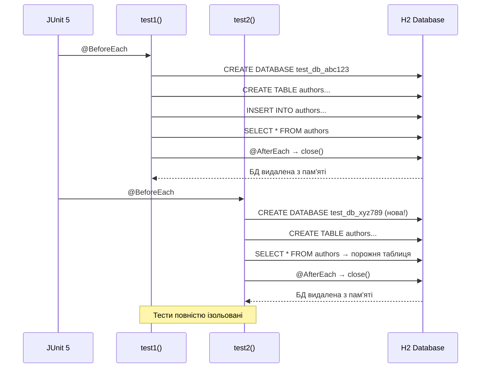

# Інтеграційне тестування JDBC-репозиторіїв: Embedded H2 та патерн AAA

## Вступ: Чому unit-тести недостатні

Повернімося до репозиторіїв зі статті 14. Ми реалізували `JdbcAuthorRepository` з методами `save()`, `findById()`, `update()`, `deleteById()`. Як переконатися, що ці методи працюють коректно?

**Наївний підхід — unit-тести з mock-об'єктами:**

```java
@Test
void save_shouldInsertAuthor() {
    // Arrange
    Connection mockConn = mock(Connection.class);
    PreparedStatement mockStmt = mock(PreparedStatement.class);
    when(mockConn.prepareStatement(anyString())).thenReturn(mockStmt);
    when(mockStmt.executeUpdate()).thenReturn(1);

    ConnectionManager mockCm = mock(ConnectionManager.class);
    when(mockCm.getConnection()).thenReturn(mockConn);

    AuthorRepository repo = new JdbcAuthorRepository(mockCm);
    Author author = new Author("Іван", "Франко");

    // Act
    repo.save(author);

    // Assert
    verify(mockStmt).executeUpdate();
}
```

**Що перевіряє цей тест?** Він перевіряє, що метод `save()` викликає `executeUpdate()` на `PreparedStatement`. Але він **не перевіряє**:

- Чи правильний SQL-запит (синтаксис, назви стовпців)
- Чи коректно встановлені параметри `PreparedStatement`
- Чи дані дійсно збережені у БД
- Чи працюють FK-обмеження
- Чи коректно обробляються SQL-виключення

::warning
**Проблема mock-тестів:** Вони перевіряють **взаємодію з API**, а не **коректність роботи з БД**. Якщо у SQL-запиті помилка (`INSER INTO` замість `INSERT INTO`) — mock-тест пройде успішно, але код не працюватиме у production.
::

**Інтеграційний тест** вирішує цю проблему: він виконує реальний SQL на реальній БД і перевіряє реальний результат.

```java
@Test
void save_shouldInsertNewAuthor_whenValidData() {
    // Arrange: створити реальну БД, виконати DDL
    ConnectionManager cm = ConnectionManager.forH2InMemory();
    executeDdlScript(cm, "ddl_h2.sql");
    AuthorRepository repo = new JdbcAuthorRepository(cm);
    
    Author author = new Author("Іван", "Франко");
    author.setBio("Український письменник");

    // Act: виконати реальний INSERT
    repo.save(author);

    // Assert: перевірити, що дані у БД
    Author loaded = repo.findById(author.getId()).orElseThrow();
    assertThat(loaded.getFirstName()).isEqualTo("Іван");
    assertThat(loaded.getLastName()).isEqualTo("Франко");
    assertThat(loaded.getBio()).isEqualTo("Український письменник");
}
```

**Що перевіряє цей тест?**

- ✅ SQL-запит синтаксично коректний
- ✅ Параметри встановлені правильно
- ✅ Дані збережені у БД
- ✅ Маппінг `ResultSet → Author` працює
- ✅ UUID генерується коректно

---

## Різниця між Unit та Integration тестами

| Критерій | Unit Test | Integration Test |
|---|---|---|
| **Що тестується** | Окремий метод/клас ізольовано | Взаємодія кількох компонентів |
| **Залежності** | Mock-об'єкти (Mockito) | Реальні залежності (БД, файли) |
| **Швидкість** | ⚡ Дуже швидкі (мілісекунди) | 🐢 Повільніші (секунди) |
| **Складність налаштування** | Проста (без зовнішніх ресурсів) | Складніша (потрібна БД) |
| **Що виявляють** | Логічні помилки у коді | Помилки інтеграції (SQL, схема БД) |
| **Коли запускати** | При кожному збереженні файлу | Перед commit, у CI/CD |

::tip
**Піраміда тестування** (Mike Cohn, 2009):

```
        /\
       /  \  E2E Tests (UI, API)
      /____\
     /      \
    / Integr \  Integration Tests
   /__________\
  /            \
 /  Unit Tests  \  Unit Tests
/________________\

70% Unit | 20% Integration | 10% E2E
```

Більшість тестів мають бути unit-тестами (швидкі, ізольовані). Integration тести покривають критичні шляхи взаємодії з БД. E2E тести перевіряють систему цілком.
::

**Для JDBC-репозиторіїв integration тести є критично важливими**, оскільки основна логіка — це SQL-запити, що не можуть бути адекватно протестовані через mock.

---

## Архітектура тестового оточення

Для інтеграційних тестів нам потрібна **реальна БД**. Але використовувати production БД для тестів — небезпечно (можна випадково видалити дані). Рішення — **Embedded H2 Database**.

### Що таке Embedded H2?

**H2** — це легковагова Java-БД, що може працювати у трьох режимах:

1. **Server mode:** Окремий процес, до якого підключаються клієнти (як PostgreSQL)
2. **Embedded mode:** БД працює у тому ж JVM-процесі, що й додаток
3. **In-memory mode:** БД існує лише у RAM, видаляється після завершення JVM

Для тестів ми використовуємо **in-memory mode**:

```java
// Кожен тест отримує нову порожню БД у пам'яті
String url = "jdbc:h2:mem:test_db_" + UUID.randomUUID() + ";DB_CLOSE_DELAY=-1";
Connection conn = DriverManager.getConnection(url);
```

**Переваги in-memory H2 для тестів:**

- ⚡ **Швидкість:** БД у RAM — INSERT/SELECT виконуються за мікросекунди
- 🔒 **Ізоляція:** Кожен тест отримує нову БД — тести не впливають один на одного
- 🧹 **Автоочищення:** БД видаляється після завершення тесту — не потрібно cleanup
- 📦 **Без установки:** H2 — це JAR-файл, додається як Maven-залежність

**Недоліки H2:**

- ⚠️ **Діалектні відмінності:** H2 SQL не на 100% сумісний з PostgreSQL/MySQL
- ⚠️ **Обмежені типи:** Немає ENUM (у H2 2.x є, але з обмеженнями), JSON, масивів
- ⚠️ **Інша продуктивність:** Оптимізатор запитів відрізняється від production СУБД

::note
У наступній статті (23) ми розглянемо **Testcontainers** — підхід, що запускає реальну PostgreSQL у Docker-контейнері для тестів. Це усуває діалектні відмінності, але повільніше за H2.

**Рекомендація:** Використовуйте H2 для швидких тестів базової функціональності, Testcontainers — для тестування PostgreSQL-специфічних функцій (ENUM, JSON, full-text search).
::

---

## Ізоляція тестів: Кожен тест = нова БД

**Золоте правило інтеграційних тестів:** Тести мають бути **незалежними** — порядок виконання не повинен впливати на результат.

**Антипатерн — спільна БД для всіх тестів:**

```java
// ❌ ПОГАНО: всі тести використовують одну БД
static Connection sharedConnection;

@BeforeAll
static void setupDatabase() {
    sharedConnection = DriverManager.getConnection("jdbc:h2:mem:shared_db");
    executeDdl(sharedConnection);
}

@Test
void test1() {
    repo.save(new Author("Автор 1", "Прізвище 1"));
    // БД тепер містить 1 автора
}

@Test
void test2() {
    List<Author> all = repo.findAll();
    // Скільки авторів? Залежить від того, чи виконався test1 перед test2!
    assertThat(all).hasSize(???); // Непередбачувано
}
```

**Правильний підхід — нова БД для кожного тесту:**

```java
// ✅ ДОБРЕ: кожен тест отримує нову порожню БД
ConnectionManager cm;

@BeforeEach
void setupFreshDatabase() {
    // Унікальна назва БД для кожного тесту
    String dbName = "test_db_" + UUID.randomUUID();
    cm = ConnectionManager.forH2InMemory(dbName);
    
    // Виконати DDL (створити таблиці)
    executeDdlScript(cm, "ddl_h2.sql");
}

@AfterEach
void tearDown() {
    cm.close(); // БД видаляється з пам'яті
}

@Test
void test1() {
    repo.save(new Author("Автор 1", "Прізвище 1"));
    // Ця БД існує лише для test1
}

@Test
void test2() {
    List<Author> all = repo.findAll();
    assertThat(all).isEmpty(); // Завжди порожня — нова БД!
}
```

::mermaid



::


---

## Налаштування тестового проєкту

### Maven залежності

Для інтеграційних тестів потрібні наступні бібліотеки:

```xml showLineNumbers
<!-- pom.xml -->
<dependencies>
    <!-- JUnit 5 (Jupiter) — тестовий фреймворк -->
    <dependency>
        <groupId>org.junit.jupiter</groupId>
        <artifactId>junit-jupiter</artifactId>
        <version>5.10.2</version>
        <scope>test</scope>
    </dependency>

    <!-- AssertJ — fluent assertions (читабельніші за JUnit assertions) -->
    <dependency>
        <groupId>org.assertj</groupId>
        <artifactId>assertj-core</artifactId>
        <version>3.25.3</version>
        <scope>test</scope>
    </dependency>

    <!-- H2 Database — embedded БД для тестів -->
    <dependency>
        <groupId>com.h2database</groupId>
        <artifactId>h2</artifactId>
        <version>2.2.224</version>
        <scope>test</scope>
    </dependency>

    <!-- SLF4J Simple — логування для тестів (опціонально) -->
    <dependency>
        <groupId>org.slf4j</groupId>
        <artifactId>slf4j-simple</artifactId>
        <version>2.0.12</version>
        <scope>test</scope>
    </dependency>
</dependencies>
```

**Gradle (альтернатива):**

```groovy
dependencies {
    testImplementation 'org.junit.jupiter:junit-jupiter:5.10.2'
    testImplementation 'org.assertj:assertj-core:3.25.3'
    testImplementation 'com.h2database:h2:2.2.224'
    testImplementation 'org.slf4j:slf4j-simple:2.0.12'
}
```

---

### Структура тестових ресурсів

Організуємо тестові файли за наступною структурою:

```
src/
├── main/
│   └── java/
│       └── com/example/audiobook/
│           ├── domain/
│           ├── repository/
│           └── db/
└── test/
    ├── java/
    │   └── com/example/audiobook/
    │       ├── repository/
    │       │   ├── AbstractRepositoryTest.java      ← базовий клас
    │       │   ├── JdbcAuthorRepositoryTest.java
    │       │   ├── JdbcGenreRepositoryTest.java
    │       │   └── JdbcAudiobookRepositoryTest.java
    │       └── testutil/
    │           ├── TestDataFactory.java              ← фабрика тестових даних
    │           └── DatabaseTestUtil.java             ← утиліти для БД
    └── resources/
        ├── ddl_h2.sql                                ← DDL-скрипт
        ├── test-data-authors.sql                     ← тестові дані (опціонально)
        └── logback-test.xml                          ← конфігурація логування
```

**Файл `src/test/resources/ddl_h2.sql`** (адаптований для H2):

```sql showLineNumbers
-- H2 не підтримує ENUM у старих версіях — використовуємо VARCHAR з CHECK
CREATE TABLE authors (
    id          UUID         PRIMARY KEY,
    first_name  VARCHAR(64)  NOT NULL,
    last_name   VARCHAR(64)  NOT NULL,
    bio         TEXT,
    image_path  VARCHAR(2048)
);

CREATE TABLE genres (
    id          UUID         PRIMARY KEY,
    name        VARCHAR(64)  NOT NULL UNIQUE,
    description TEXT
);

CREATE TABLE audiobooks (
    id               UUID         PRIMARY KEY,
    author_id        UUID         NOT NULL,
    genre_id         UUID         NOT NULL,
    title            VARCHAR(255) NOT NULL,
    duration         INTEGER      NOT NULL CHECK (duration > 0),
    release_year     INTEGER      NOT NULL 
                     CHECK (release_year >= 1900 AND release_year <= YEAR(CURRENT_DATE) + 1),
    description      TEXT,
    cover_image_path VARCHAR(2048),
    
    CONSTRAINT audiobooks_author_fk 
        FOREIGN KEY (author_id) REFERENCES authors(id) ON DELETE CASCADE,
    CONSTRAINT audiobooks_genre_fk 
        FOREIGN KEY (genre_id) REFERENCES genres(id) ON DELETE CASCADE
);

CREATE INDEX audiobooks_author_id_idx ON audiobooks(author_id);
CREATE INDEX audiobooks_genre_id_idx  ON audiobooks(genre_id);

CREATE TABLE users (
    id            UUID         PRIMARY KEY,
    username      VARCHAR(64)  NOT NULL UNIQUE CHECK (LENGTH(TRIM(username)) > 0),
    password_hash VARCHAR(128) NOT NULL,
    email         VARCHAR(376),
    avatar_path   VARCHAR(2048)
);

CREATE INDEX users_email_idx ON users(email);
```

::note
**Відмінності H2 від PostgreSQL:**

- `TEXT` у H2 є аліасом для `VARCHAR` (без обмеження довжини)
- `EXTRACT(YEAR FROM CURRENT_DATE)` → `YEAR(CURRENT_DATE)`
- `ENUM` замінено на `VARCHAR` з `CHECK` constraint (або використовуйте H2 2.x з підтримкою ENUM)
- Синтаксис FK трохи відрізняється (але сумісний)
::

---

## Патерн AAA (Arrange-Act-Assert)

**AAA** (Arrange-Act-Assert) — це структурний патерн організації тестів, що робить їх максимально читабельними.

### Три фази тесту

```java
@Test
void testName() {
    // ═══════════════════════════════════════════════════════════
    // Arrange (Підготовка)
    // ═══════════════════════════════════════════════════════════
    // Створити тестові дані, налаштувати залежності
    
    // ═══════════════════════════════════════════════════════════
    // Act (Дія)
    // ═══════════════════════════════════════════════════════════
    // Виконати метод, що тестується
    
    // ═══════════════════════════════════════════════════════════
    // Assert (Перевірка)
    // ═══════════════════════════════════════════════════════════
    // Перевірити результат
}
```

**Приклад:**

```java showLineNumbers
@Test
void save_shouldInsertNewAuthor_whenValidData() {
    // ═══ Arrange ═══
    AuthorRepository repo = new JdbcAuthorRepository(connectionManager);
    Author author = new Author("Тарас", "Шевченко");
    author.setBio("Український поет і художник");
    
    // ═══ Act ═══
    repo.save(author);
    
    // ═══ Assert ═══
    Author loaded = repo.findById(author.getId()).orElseThrow();
    assertThat(loaded.getFirstName()).isEqualTo("Тарас");
    assertThat(loaded.getLastName()).isEqualTo("Шевченко");
    assertThat(loaded.getBio()).isEqualTo("Український поет і художник");
}
```

**Чому AAA кращий за хаотичний код:**

```java
// ❌ ПОГАНО: незрозуміло, де підготовка, де дія, де перевірка
@Test
void testSave() {
    Author author = new Author("Тарас", "Шевченко");
    repo.save(author);
    assertThat(author.getId()).isNotNull();
    author.setBio("Поет");
    Author loaded = repo.findById(author.getId()).orElseThrow();
    assertThat(loaded.getFirstName()).isEqualTo("Тарас");
    repo.update(author); // Що це тут робить?
}
```

::tip
**Правило одного Act:** Кожен тест має викликати **лише один** метод, що тестується. Якщо потрібно протестувати `save()` і `update()` — створіть два окремих тести.

```java
// ✅ ДОБРЕ: один тест = один метод
@Test
void save_shouldInsertAuthor() { /* тестує save() */ }

@Test
void update_shouldModifyAuthor() { /* тестує update() */ }

// ❌ ПОГАНО: один тест = кілька методів
@Test
void saveAndUpdate() { 
    repo.save(author);
    repo.update(author); // Який метод провалився, якщо тест червоний?
}
```
::

---

### Найменування тестів: Given-When-Then

**Конвенція найменування** (Roy Osherove, "The Art of Unit Testing"):

```
methodName_shouldExpectedBehavior_whenStateUnderTest
```

**Структура:**

- `methodName` — метод, що тестується (`save`, `findById`, `update`)
- `shouldExpectedBehavior` — очікувана поведінка (`shouldInsertNewAuthor`, `shouldReturnEmpty`)
- `whenStateUnderTest` — умова/контекст (`whenValidData`, `whenNotExists`, `whenDuplicateName`)

**Приклади:**

```java
// Позитивні сценарії
save_shouldInsertNewAuthor_whenValidData()
findById_shouldReturnAuthor_whenExists()
update_shouldModifyAllFields_whenAuthorExists()
deleteById_shouldRemoveAuthor_whenExists()

// Негативні сценарії
save_shouldThrowException_whenDuplicateId()
findById_shouldReturnEmpty_whenNotExists()
update_shouldThrowException_whenAuthorNotExists()
deleteById_shouldReturnFalse_whenNotExists()

// Граничні випадки
save_shouldHandleNullBio_whenBioNotProvided()
findByLastName_shouldReturnEmptyList_whenNoMatches()
findAll_shouldReturnEmptyList_whenTableEmpty()

// Складні сценарії
deleteAuthor_shouldCascadeDeleteAudiobooks_whenAuthorHasBooks()
save_shouldThrowException_whenForeignKeyViolation()
```

**Альтернативний стиль (BDD — Behavior-Driven Development):**

```java
@Test
@DisplayName("Given valid author data, when save is called, then author should be inserted")
void givenValidAuthorData_whenSaveIsCalled_thenAuthorShouldBeInserted() {
    // ...
}
```

::note
**Вибір стилю — питання команди.** У цій статті ми використовуємо `methodName_should_when`, оскільки він коротший і природно читається у звітах JUnit:

```
✓ save_shouldInsertNewAuthor_whenValidData
✓ findById_shouldReturnAuthor_whenExists
✗ update_shouldModifyAllFields_whenAuthorExists
```
::


---

## Базовий клас AbstractRepositoryTest

Щоб уникнути дублювання коду ініціалізації БД у кожному тестовому класі, створимо абстрактний базовий клас:

```java showLineNumbers
package com.example.audiobook.repository;

import com.example.audiobook.db.ConnectionManager;
import org.junit.jupiter.api.AfterEach;
import org.junit.jupiter.api.BeforeEach;

import java.io.BufferedReader;
import java.io.IOException;
import java.io.InputStreamReader;
import java.nio.charset.StandardCharsets;
import java.sql.Connection;
import java.sql.SQLException;
import java.sql.Statement;
import java.util.UUID;
import java.util.stream.Collectors;

/**
 * Базовий клас для інтеграційних тестів JDBC-репозиторіїв.
 * <p>
 * Надає спільну логіку:
 * <ul>
 *   <li>Створення нової in-memory H2 БД перед кожним тестом</li>
 *   <li>Виконання DDL-скрипта (створення таблиць)</li>
 *   <li>Закриття з'єднання після тесту</li>
 *   <li>Утилітні методи для роботи з БД</li>
 * </ul>
 * <p>
 * <b>Використання:</b>
 * <pre>{@code
 * class JdbcAuthorRepositoryTest extends AbstractRepositoryTest {
 *     private AuthorRepository repository;
 *
 *     @BeforeEach
 *     void setUp() {
 *         super.setUp(); // викликати базову ініціалізацію
 *         repository = new JdbcAuthorRepository(connectionManager);
 *     }
 *
 *     @Test
 *     void save_shouldInsertAuthor() {
 *         // тест...
 *     }
 * }
 * }</pre>
 */
public abstract class AbstractRepositoryTest {

    /**
     * ConnectionManager для тестової БД.
     * Доступний підкласам для створення репозиторіїв.
     */
    protected ConnectionManager connectionManager;

    /**
     * Ініціалізує нову in-memory H2 БД перед кожним тестом.
     * <p>
     * Кожен тест отримує унікальну порожню БД — це гарантує ізоляцію.
     * DDL-скрипт виконується автоматично.
     */
    @BeforeEach
    void setUp() throws SQLException, IOException {
        // Унікальна назва БД для кожного тесту
        String dbName = "test_db_" + UUID.randomUUID().toString().replace("-", "");
        
        // Створити ConnectionManager для in-memory H2
        // DB_CLOSE_DELAY=-1 → БД не закривається при закритті останнього Connection
        // (потрібно для коректної роботи з пулом з'єднань)
        String url = "jdbc:h2:mem:" + dbName + ";DB_CLOSE_DELAY=-1;MODE=PostgreSQL";
        connectionManager = new ConnectionManager(url, "sa", "");

        // Виконати DDL-скрипт (створити таблиці)
        executeDdlScript("ddl_h2.sql");
    }

    /**
     * Закриває ConnectionManager після кожного тесту.
     * БД автоматично видаляється з пам'яті.
     */
    @AfterEach
    void tearDown() {
        if (connectionManager != null) {
            connectionManager.close();
        }
    }

    // ═══════════════════════════════════════════════════════════════════════
    // Утилітні методи для роботи з БД
    // ═══════════════════════════════════════════════════════════════════════

    /**
     * Виконує SQL-скрипт з ресурсів.
     * <p>
     * Скрипт має знаходитися у {@code src/test/resources/}.
     * Підтримує багаторядкові команди, розділені {@code ;}.
     *
     * @param scriptPath шлях до скрипта відносно resources (наприклад, "ddl_h2.sql")
     */
    protected void executeDdlScript(String scriptPath) throws IOException, SQLException {
        String sql = loadResourceAsString(scriptPath);
        
        try (Connection conn = connectionManager.getConnection();
             Statement stmt = conn.createStatement()) {
            
            // Розділити скрипт на окремі команди (за ;)
            String[] commands = sql.split(";");
            for (String command : commands) {
                String trimmed = command.trim();
                if (!trimmed.isEmpty() && !trimmed.startsWith("--")) {
                    stmt.execute(trimmed);
                }
            }
        }
    }

    /**
     * Завантажує файл з ресурсів як рядок.
     *
     * @param resourcePath шлях до ресурсу (наприклад, "ddl_h2.sql")
     * @return вміст файлу як рядок
     */
    protected String loadResourceAsString(String resourcePath) throws IOException {
        try (BufferedReader reader = new BufferedReader(
                new InputStreamReader(
                    getClass().getClassLoader().getResourceAsStream(resourcePath),
                    StandardCharsets.UTF_8))) {
            return reader.lines().collect(Collectors.joining("\n"));
        }
    }

    /**
     * Виконує довільний SQL-запит (для підготовки тестових даних).
     * <p>
     * Використовується у Arrange-фазі для створення складних сценаріїв.
     *
     * @param sql SQL-команда (INSERT, UPDATE, DELETE)
     */
    protected void executeSql(String sql) throws SQLException {
        try (Connection conn = connectionManager.getConnection();
             Statement stmt = conn.createStatement()) {
            stmt.execute(sql);
        }
    }

    /**
     * Підраховує кількість рядків у таблиці.
     * Корисно для перевірки у Assert-фазі.
     *
     * @param tableName назва таблиці
     * @return кількість рядків
     */
    protected long countRowsInTable(String tableName) throws SQLException {
        String sql = "SELECT COUNT(*) FROM " + tableName;
        try (Connection conn = connectionManager.getConnection();
             Statement stmt = conn.createStatement();
             var rs = stmt.executeQuery(sql)) {
            rs.next();
            return rs.getLong(1);
        }
    }

    /**
     * Очищає всі дані з таблиці (але залишає структуру).
     * Використовується рідко — зазвичай кожен тест отримує нову БД.
     *
     * @param tableName назва таблиці
     */
    protected void truncateTable(String tableName) throws SQLException {
        String sql = "TRUNCATE TABLE " + tableName;
        try (Connection conn = connectionManager.getConnection();
             Statement stmt = conn.createStatement()) {
            stmt.execute(sql);
        }
    }
}
```

**Ключові рішення:**

- **Рядок 68** (`MODE=PostgreSQL`): H2 може емулювати діалект PostgreSQL — це зменшує кількість відмінностей у SQL.
- **Рядок 68** (`DB_CLOSE_DELAY=-1`): Без цього параметра H2 закриває БД одразу після закриття останнього Connection, що може призвести до помилок при використанні пулу з'єднань.
- **Рядки 107–117** (`executeDdlScript`): Розділяє SQL-скрипт на окремі команди за `;`. Це дозволяє виконувати багаторядкові DDL-скрипти.
- **Рядки 154–162** (`countRowsInTable`): Утилітний метод для Assert-фази — перевірити, що у таблиці правильна кількість рядків.

::warning
**SQL Injection у тестах:** Методи `executeSql()` та `countRowsInTable()` використовують конкатенацію рядків, що небезпечно у production. Але у тестах це прийнятно, оскільки:

1. Тести не виконуються у production
2. Назви таблиць контролюються розробником
3. Це спрощує код тестів

**Ніколи не копіюйте цей підхід у production-код!**
::


---

## Тестування AuthorRepository: CRUD-операції

Тепер створимо повний набір тестів для `JdbcAuthorRepository`. Кожен тест покриває один сценарій.

```java showLineNumbers
package com.example.audiobook.repository;

import com.example.audiobook.domain.Author;
import com.example.audiobook.repository.jdbc.JdbcAuthorRepository;
import org.junit.jupiter.api.BeforeEach;
import org.junit.jupiter.api.Test;

import java.util.List;
import java.util.Optional;
import java.util.UUID;

import static org.assertj.core.api.Assertions.*;

/**
 * Інтеграційні тести для {@link JdbcAuthorRepository}.
 * <p>
 * Кожен тест виконується на новій in-memory H2 БД — тести повністю ізольовані.
 * Використовується патерн AAA (Arrange-Act-Assert) та конвенція найменування
 * {@code methodName_shouldBehavior_whenCondition}.
 */
class JdbcAuthorRepositoryTest extends AbstractRepositoryTest {

    private AuthorRepository repository;

    @BeforeEach
    void setUpRepository() {
        // Базовий setUp() вже виконав ініціалізацію БД
        repository = new JdbcAuthorRepository(connectionManager);
    }

    // ═══════════════════════════════════════════════════════════════════════
    // save() — Тести вставки нових авторів
    // ═══════════════════════════════════════════════════════════════════════

    @Test
    void save_shouldInsertNewAuthor_whenValidData() {
        // ═══ Arrange ═══
        Author author = new Author("Іван", "Франко");
        author.setBio("Український письменник, поет, публіцист");
        author.setImagePath("/images/franko.jpg");

        // ═══ Act ═══
        repository.save(author);

        // ═══ Assert ═══
        // Перевірка 1: ID має бути згенерований
        assertThat(author.getId()).isNotNull();

        // Перевірка 2: Автор має бути у БД
        Author loaded = repository.findById(author.getId()).orElseThrow();
        assertThat(loaded.getFirstName()).isEqualTo("Іван");
        assertThat(loaded.getLastName()).isEqualTo("Франко");
        assertThat(loaded.getBio()).isEqualTo("Український письменник, поет, публіцист");
        assertThat(loaded.getImagePath()).isEqualTo("/images/franko.jpg");

        // Перевірка 3: У таблиці має бути рівно 1 рядок
        assertThat(countRowsInTable("authors")).isEqualTo(1);
    }

    @Test
    void save_shouldHandleNullBio_whenBioNotProvided() {
        // ═══ Arrange ═══
        Author author = new Author("Леся", "Українка");
        // bio та imagePath залишаються null

        // ═══ Act ═══
        repository.save(author);

        // ═══ Assert ═══
        Author loaded = repository.findById(author.getId()).orElseThrow();
        assertThat(loaded.getBio()).isNull();
        assertThat(loaded.getImagePath()).isNull();
    }

    @Test
    void save_shouldThrowException_whenDuplicateId() {
        // ═══ Arrange ═══
        UUID sharedId = UUID.randomUUID();
        
        Author author1 = new Author("Тарас", "Шевченко");
        author1.setId(sharedId);
        
        Author author2 = new Author("Іван", "Франко");
        author2.setId(sharedId); // той самий ID!

        repository.save(author1); // перший збережено успішно

        // ═══ Act & Assert ═══
        // Спроба зберегти другого автора з тим самим ID має кинути виключення
        assertThatThrownBy(() -> repository.save(author2))
            .isInstanceOf(com.example.audiobook.db.DatabaseException.class)
            .hasMessageContaining("PRIMARY KEY"); // H2 повідомляє про порушення PK
    }

    // ═══════════════════════════════════════════════════════════════════════
    // findById() — Тести пошуку за ID
    // ═══════════════════════════════════════════════════════════════════════

    @Test
    void findById_shouldReturnAuthor_whenExists() {
        // ═══ Arrange ═══
        Author author = new Author("Михайло", "Коцюбинський");
        repository.save(author);
        UUID authorId = author.getId();

        // ═══ Act ═══
        Optional<Author> result = repository.findById(authorId);

        // ═══ Assert ═══
        assertThat(result).isPresent();
        assertThat(result.get().getFirstName()).isEqualTo("Михайло");
        assertThat(result.get().getLastName()).isEqualTo("Коцюбинський");
    }

    @Test
    void findById_shouldReturnEmpty_whenNotExists() {
        // ═══ Arrange ═══
        UUID nonExistentId = UUID.randomUUID();

        // ═══ Act ═══
        Optional<Author> result = repository.findById(nonExistentId);

        // ═══ Assert ═══
        assertThat(result).isEmpty();
    }

    // ═══════════════════════════════════════════════════════════════════════
    // findAll() — Тести вибірки всіх авторів
    // ═══════════════════════════════════════════════════════════════════════

    @Test
    void findAll_shouldReturnAllAuthors_whenMultipleExist() {
        // ═══ Arrange ═══
        Author author1 = new Author("Тарас", "Шевченко");
        Author author2 = new Author("Іван", "Франко");
        Author author3 = new Author("Леся", "Українка");
        
        repository.save(author1);
        repository.save(author2);
        repository.save(author3);

        // ═══ Act ═══
        List<Author> all = repository.findAll();

        // ═══ Assert ═══
        assertThat(all).hasSize(3);
        assertThat(all)
            .extracting(Author::getLastName)
            .containsExactlyInAnyOrder("Шевченко", "Франко", "Українка");
    }

    @Test
    void findAll_shouldReturnEmptyList_whenTableEmpty() {
        // ═══ Arrange ═══
        // Таблиця порожня (нова БД для кожного тесту)

        // ═══ Act ═══
        List<Author> all = repository.findAll();

        // ═══ Assert ═══
        assertThat(all).isEmpty();
    }

    // ═══════════════════════════════════════════════════════════════════════
    // update() — Тести оновлення існуючих авторів
    // ═══════════════════════════════════════════════════════════════════════

    @Test
    void update_shouldModifyAllFields_whenAuthorExists() {
        // ═══ Arrange ═══
        Author author = new Author("Іван", "Франко");
        author.setBio("Стара біографія");
        repository.save(author);

        // Змінити всі поля
        author.setFirstName("Іван Якович");
        author.setLastName("Франко-Захарченко");
        author.setBio("Нова біографія");
        author.setImagePath("/images/new.jpg");

        // ═══ Act ═══
        repository.update(author);

        // ═══ Assert ═══
        Author loaded = repository.findById(author.getId()).orElseThrow();
        assertThat(loaded.getFirstName()).isEqualTo("Іван Якович");
        assertThat(loaded.getLastName()).isEqualTo("Франко-Захарченко");
        assertThat(loaded.getBio()).isEqualTo("Нова біографія");
        assertThat(loaded.getImagePath()).isEqualTo("/images/new.jpg");
    }

    @Test
    void update_shouldThrowException_whenAuthorNotExists() {
        // ═══ Arrange ═══
        Author author = new Author("Неіснуючий", "Автор");
        author.setId(UUID.randomUUID()); // ID, якого немає у БД

        // ═══ Act & Assert ═══
        assertThatThrownBy(() -> repository.update(author))
            .isInstanceOf(com.example.audiobook.db.DatabaseException.class)
            .hasMessageContaining("не знайдена"); // повідомлення з AbstractJdbcRepository
    }

    // ═══════════════════════════════════════════════════════════════════════
    // deleteById() — Тести видалення авторів
    // ═══════════════════════════════════════════════════════════════════════

    @Test
    void deleteById_shouldRemoveAuthor_whenExists() {
        // ═══ Arrange ═══
        Author author = new Author("Панас", "Мирний");
        repository.save(author);
        UUID authorId = author.getId();

        // ═══ Act ═══
        boolean deleted = repository.deleteById(authorId);

        // ═══ Assert ═══
        assertThat(deleted).isTrue();
        assertThat(repository.findById(authorId)).isEmpty();
        assertThat(countRowsInTable("authors")).isEqualTo(0);
    }

    @Test
    void deleteById_shouldReturnFalse_whenNotExists() {
        // ═══ Arrange ═══
        UUID nonExistentId = UUID.randomUUID();

        // ═══ Act ═══
        boolean deleted = repository.deleteById(nonExistentId);

        // ═══ Assert ═══
        assertThat(deleted).isFalse();
    }

    // ═══════════════════════════════════════════════════════════════════════
    // findByLastName() — Тести пошуку за прізвищем
    // ═══════════════════════════════════════════════════════════════════════

    @Test
    void findByLastName_shouldReturnMatchingAuthors_whenPartialMatch() {
        // ═══ Arrange ═══
        repository.save(new Author("Тарас", "Шевченко"));
        repository.save(new Author("Іван", "Франко"));
        repository.save(new Author("Леся", "Українка"));
        repository.save(new Author("Григорій", "Сковорода"));

        // ═══ Act ═══
        List<Author> result = repository.findByLastName("ко"); // "Франко", "Сковорода"

        // ═══ Assert ═══
        assertThat(result).hasSize(2);
        assertThat(result)
            .extracting(Author::getLastName)
            .containsExactlyInAnyOrder("Франко", "Сковорода");
    }

    @Test
    void findByLastName_shouldBeCaseInsensitive_whenSearching() {
        // ═══ Arrange ═══
        repository.save(new Author("Тарас", "Шевченко"));

        // ═══ Act ═══
        List<Author> result1 = repository.findByLastName("шевч");
        List<Author> result2 = repository.findByLastName("ШЕВЧ");
        List<Author> result3 = repository.findByLastName("ШеВч");

        // ═══ Assert ═══
        assertThat(result1).hasSize(1);
        assertThat(result2).hasSize(1);
        assertThat(result3).hasSize(1);
    }

    @Test
    void findByLastName_shouldReturnEmptyList_whenNoMatches() {
        // ═══ Arrange ═══
        repository.save(new Author("Тарас", "Шевченко"));

        // ═══ Act ═══
        List<Author> result = repository.findByLastName("Неіснуюче");

        // ═══ Assert ═══
        assertThat(result).isEmpty();
    }

    // ═══════════════════════════════════════════════════════════════════════
    // count() та existsById() — Допоміжні методи
    // ═══════════════════════════════════════════════════════════════════════

    @Test
    void count_shouldReturnCorrectNumber_whenMultipleAuthorsExist() {
        // ═══ Arrange ═══
        repository.save(new Author("Автор", "1"));
        repository.save(new Author("Автор", "2"));
        repository.save(new Author("Автор", "3"));

        // ═══ Act ═══
        long count = repository.count();

        // ═══ Assert ═══
        assertThat(count).isEqualTo(3);
    }

    @Test
    void existsById_shouldReturnTrue_whenAuthorExists() {
        // ═══ Arrange ═══
        Author author = new Author("Іван", "Франко");
        repository.save(author);

        // ═══ Act ═══
        boolean exists = repository.existsById(author.getId());

        // ═══ Assert ═══
        assertThat(exists).isTrue();
    }

    @Test
    void existsById_shouldReturnFalse_whenAuthorNotExists() {
        // ═══ Arrange ═══
        UUID nonExistentId = UUID.randomUUID();

        // ═══ Act ═══
        boolean exists = repository.existsById(nonExistentId);

        // ═══ Assert ═══
        assertThat(exists).isFalse();
    }
}
```

**Спостереження:**

- **Рядки 36–60** (`save_shouldInsertNewAuthor_whenValidData`): Найповніший тест — перевіряє ID, всі поля та кількість рядків у таблиці.
- **Рядки 92–102** (`save_shouldThrowException_whenDuplicateId`): Тест негативного сценарію — використовує `assertThatThrownBy()` з AssertJ.
- **Рядки 165–177** (`findAll_shouldReturnAllAuthors_whenMultipleExist`): Використовує `extracting()` для перевірки списку — читабельніше за цикл.
- **Рядки 268–283** (`findByLastName_shouldBeCaseInsensitive_whenSearching`): Перевіряє, що пошук не залежить від регістру.

::tip
**AssertJ vs JUnit Assertions:**

```java
// JUnit (старий стиль)
assertEquals("Іван", author.getFirstName());
assertTrue(result.isPresent());

// AssertJ (fluent, читабельніший)
assertThat(author.getFirstName()).isEqualTo("Іван");
assertThat(result).isPresent();
```

AssertJ надає кращі повідомлення про помилки:

```
JUnit:  expected: <Іван> but was: <Ivan>
AssertJ: Expecting firstName to be "Іван" but was "Ivan"
```
::


---

## Тестування складних сценаріїв: Constraints та каскадне видалення

Інтеграційні тести особливо важливі для перевірки **обмежень БД** (constraints), оскільки mock-тести не можуть їх емулювати.

### Тестування UNIQUE constraint

```java showLineNumbers
package com.example.audiobook.repository;

import com.example.audiobook.domain.Genre;
import com.example.audiobook.repository.jdbc.JdbcGenreRepository;
import org.junit.jupiter.api.BeforeEach;
import org.junit.jupiter.api.Test;

import static org.assertj.core.api.Assertions.*;

/**
 * Інтеграційні тести для {@link JdbcGenreRepository}.
 */
class JdbcGenreRepositoryTest extends AbstractRepositoryTest {

    private GenreRepository repository;

    @BeforeEach
    void setUpRepository() {
        repository = new JdbcGenreRepository(connectionManager);
    }

    @Test
    void save_shouldInsertNewGenre_whenValidData() {
        // ═══ Arrange ═══
        Genre genre = new Genre("Фантастика");
        genre.setDescription("Науково-фантастичні твори");

        // ═══ Act ═══
        repository.save(genre);

        // ═══ Assert ═══
        Genre loaded = repository.findById(genre.getId()).orElseThrow();
        assertThat(loaded.getName()).isEqualTo("Фантастика");
        assertThat(loaded.getDescription()).isEqualTo("Науково-фантастичні твори");
    }

    @Test
    void save_shouldThrowException_whenDuplicateName() {
        // ═══ Arrange ═══
        Genre genre1 = new Genre("Проза");
        Genre genre2 = new Genre("Проза"); // та сама назва!

        repository.save(genre1); // перший збережено успішно

        // ═══ Act & Assert ═══
        // UNIQUE constraint на genres.name має запобігти вставці
        assertThatThrownBy(() -> repository.save(genre2))
            .isInstanceOf(com.example.audiobook.db.DatabaseException.class)
            .hasMessageContaining("UNIQUE"); // H2 повідомляє про порушення UNIQUE
    }

    @Test
    void findByName_shouldReturnGenre_whenExactMatch() {
        // ═══ Arrange ═══
        Genre genre = new Genre("Детектив");
        repository.save(genre);

        // ═══ Act ═══
        var result = repository.findByName("Детектив");

        // ═══ Assert ═══
        assertThat(result).isPresent();
        assertThat(result.get().getName()).isEqualTo("Детектив");
    }

    @Test
    void findByName_shouldReturnEmpty_whenNoMatch() {
        // ═══ Arrange ═══
        repository.save(new Genre("Проза"));

        // ═══ Act ═══
        var result = repository.findByName("Поезія");

        // ═══ Assert ═══
        assertThat(result).isEmpty();
    }
}
```

---

### Тестування FOREIGN KEY constraint та CASCADE

```java showLineNumbers
package com.example.audiobook.repository;

import com.example.audiobook.domain.Author;
import com.example.audiobook.domain.Audiobook;
import com.example.audiobook.domain.Genre;
import com.example.audiobook.repository.jdbc.*;
import org.junit.jupiter.api.BeforeEach;
import org.junit.jupiter.api.Test;

import java.util.List;
import java.util.UUID;

import static org.assertj.core.api.Assertions.*;

/**
 * Інтеграційні тести для {@link JdbcAudiobookRepository}.
 * <p>
 * Особлива увага приділяється тестуванню FK constraints та каскадного видалення.
 */
class JdbcAudiobookRepositoryTest extends AbstractRepositoryTest {

    private AudiobookRepository audiobookRepo;
    private AuthorRepository authorRepo;
    private GenreRepository genreRepo;

    @BeforeEach
    void setUpRepositories() {
        audiobookRepo = new JdbcAudiobookRepository(connectionManager);
        authorRepo = new JdbcAuthorRepository(connectionManager);
        genreRepo = new JdbcGenreRepository(connectionManager);
    }

    @Test
    void save_shouldInsertNewAudiobook_whenValidData() {
        // ═══ Arrange ═══
        // Спочатку створити автора та жанр (батьківські сутності)
        Author author = new Author("Іван", "Франко");
        Genre genre = new Genre("Проза");
        authorRepo.save(author);
        genreRepo.save(genre);

        Audiobook book = new Audiobook("Захар Беркут", author, genre);
        book.setDuration(18000); // 5 годин у секундах
        book.setReleaseYear(1883);
        book.setDescription("Історична повість");

        // ═══ Act ═══
        audiobookRepo.save(book);

        // ═══ Assert ═══
        Audiobook loaded = audiobookRepo.findById(book.getId()).orElseThrow();
        assertThat(loaded.getTitle()).isEqualTo("Захар Беркут");
        assertThat(loaded.getDuration()).isEqualTo(18000);
        assertThat(loaded.getReleaseYear()).isEqualTo(1883);
        assertThat(loaded.getAuthor().getId()).isEqualTo(author.getId());
        assertThat(loaded.getGenre().getId()).isEqualTo(genre.getId());
    }

    @Test
    void save_shouldThrowException_whenAuthorNotExists() {
        // ═══ Arrange ═══
        Genre genre = new Genre("Проза");
        genreRepo.save(genre);

        // Створити автора БЕЗ збереження у БД
        Author nonExistentAuthor = new Author("Неіснуючий", "Автор");
        nonExistentAuthor.setId(UUID.randomUUID());

        Audiobook book = new Audiobook("Книга", nonExistentAuthor, genre);
        book.setDuration(1000);
        book.setReleaseYear(2020);

        // ═══ Act & Assert ═══
        // FK constraint має запобігти вставці (author_id не існує у authors)
        assertThatThrownBy(() -> audiobookRepo.save(book))
            .isInstanceOf(com.example.audiobook.db.DatabaseException.class)
            .hasMessageContaining("FOREIGN KEY"); // або "REFERENTIAL INTEGRITY"
    }

    @Test
    void save_shouldThrowException_whenGenreNotExists() {
        // ═══ Arrange ═══
        Author author = new Author("Іван", "Франко");
        authorRepo.save(author);

        Genre nonExistentGenre = new Genre("Неіснуючий жанр");
        nonExistentGenre.setId(UUID.randomUUID());

        Audiobook book = new Audiobook("Книга", author, nonExistentGenre);
        book.setDuration(1000);
        book.setReleaseYear(2020);

        // ═══ Act & Assert ═══
        assertThatThrownBy(() -> audiobookRepo.save(book))
            .isInstanceOf(com.example.audiobook.db.DatabaseException.class)
            .hasMessageContaining("FOREIGN KEY");
    }

    @Test
    void deleteAuthor_shouldCascadeDeleteAudiobooks_whenAuthorHasBooks() {
        // ═══ Arrange ═══
        Author author = new Author("Тарас", "Шевченко");
        Genre genre = new Genre("Поезія");
        authorRepo.save(author);
        genreRepo.save(genre);

        Audiobook book1 = new Audiobook("Кобзар", author, genre);
        book1.setDuration(10000);
        book1.setReleaseYear(1840);

        Audiobook book2 = new Audiobook("Гайдамаки", author, genre);
        book2.setDuration(8000);
        book2.setReleaseYear(1841);

        audiobookRepo.save(book1);
        audiobookRepo.save(book2);

        // Перевірка: у БД 2 книги
        assertThat(countRowsInTable("audiobooks")).isEqualTo(2);

        // ═══ Act ═══
        // Видалити автора → має каскадно видалити всі його книги (ON DELETE CASCADE)
        authorRepo.deleteById(author.getId());

        // ═══ Assert ═══
        assertThat(authorRepo.findById(author.getId())).isEmpty();
        assertThat(audiobookRepo.findById(book1.getId())).isEmpty();
        assertThat(audiobookRepo.findById(book2.getId())).isEmpty();
        assertThat(countRowsInTable("audiobooks")).isEqualTo(0);
    }

    @Test
    void deleteGenre_shouldCascadeDeleteAudiobooks_whenGenreHasBooks() {
        // ═══ Arrange ═══
        Author author = new Author("Леся", "Українка");
        Genre genre = new Genre("Драма");
        authorRepo.save(author);
        genreRepo.save(genre);

        Audiobook book = new Audiobook("Лісова пісня", author, genre);
        book.setDuration(7200);
        book.setReleaseYear(1911);
        audiobookRepo.save(book);

        // ═══ Act ═══
        genreRepo.deleteById(genre.getId());

        // ═══ Assert ═══
        assertThat(genreRepo.findById(genre.getId())).isEmpty();
        assertThat(audiobookRepo.findById(book.getId())).isEmpty();
    }
}
```

---

### Тестування CHECK constraint

```java showLineNumbers
@Test
void save_shouldThrowException_whenDurationNegative() {
    // ═══ Arrange ═══
    Author author = new Author("Автор", "Тест");
    Genre genre = new Genre("Жанр");
    authorRepo.save(author);
    genreRepo.save(genre);

    Audiobook book = new Audiobook("Книга", author, genre);
    book.setDuration(-100); // негативна тривалість!
    book.setReleaseYear(2020);

    // ═══ Act & Assert ═══
    // CHECK constraint (duration > 0) має запобігти вставці
    assertThatThrownBy(() -> audiobookRepo.save(book))
        .isInstanceOf(com.example.audiobook.db.DatabaseException.class)
        .hasMessageContaining("CHECK"); // або "constraint"
}

@Test
void save_shouldThrowException_whenReleaseYearTooOld() {
    // ═══ Arrange ═══
    Author author = new Author("Автор", "Тест");
    Genre genre = new Genre("Жанр");
    authorRepo.save(author);
    genreRepo.save(genre);

    Audiobook book = new Audiobook("Книга", author, genre);
    book.setDuration(1000);
    book.setReleaseYear(1800); // раніше 1900 — порушення CHECK constraint

    // ═══ Act & Assert ═══
    assertThatThrownBy(() -> audiobookRepo.save(book))
        .isInstanceOf(com.example.audiobook.db.DatabaseException.class)
        .hasMessageContaining("CHECK");
}

@Test
void save_shouldThrowException_whenReleaseYearInFuture() {
    // ═══ Arrange ═══
    Author author = new Author("Автор", "Тест");
    Genre genre = new Genre("Жанр");
    authorRepo.save(author);
    genreRepo.save(genre);

    Audiobook book = new Audiobook("Книга", author, genre);
    book.setDuration(1000);
    book.setReleaseYear(2100); // занадто далеко у майбутньому

    // ═══ Act & Assert ═══
    assertThatThrownBy(() -> audiobookRepo.save(book))
        .isInstanceOf(com.example.audiobook.db.DatabaseException.class)
        .hasMessageContaining("CHECK");
}

@Test
void save_shouldAcceptCurrentYearPlusOne_whenReleaseYearValid() {
    // ═══ Arrange ═══
    Author author = new Author("Автор", "Тест");
    Genre genre = new Genre("Жанр");
    authorRepo.save(author);
    genreRepo.save(genre);

    int nextYear = java.time.Year.now().getValue() + 1;

    Audiobook book = new Audiobook("Майбутня книга", author, genre);
    book.setDuration(1000);
    book.setReleaseYear(nextYear); // наступний рік — допустимо

    // ═══ Act ═══
    audiobookRepo.save(book);

    // ═══ Assert ═══
    Audiobook loaded = audiobookRepo.findById(book.getId()).orElseThrow();
    assertThat(loaded.getReleaseYear()).isEqualTo(nextYear);
}
```

**Ключові спостереження:**

- **Рядки 110–140** (`deleteAuthor_shouldCascadeDeleteAudiobooks`): Перевіряє, що `ON DELETE CASCADE` працює коректно — видалення автора автоматично видаляє всі його книги.
- **Рядки 168–182** (`save_shouldThrowException_whenDurationNegative`): Тест CHECK constraint — БД має відхилити негативну тривалість.
- **Рядки 218–234** (`save_shouldAcceptCurrentYearPlusOne`): Позитивний тест граничного випадку — перевіряє, що наступний рік допустимий.

::tip
**Чому тестувати constraints?**

Constraints — це **бізнес-правила на рівні БД**. Якщо вони не працюють, дані можуть стати некоректними:

- Без UNIQUE на `genres.name` → дублікати жанрів
- Без FK на `audiobooks.author_id` → «сироти» книги без автора
- Без CHECK на `duration > 0` → книги з негативною тривалістю

Інтеграційні тести гарантують, що ці правила дійсно працюють.
::


---

## Test Data Builders: Зменшення дублювання

У тестах вище ми багато разів повторювали код створення тестових об'єктів:

```java
Author author = new Author("Іван", "Франко");
author.setBio("Біографія");
author.setImagePath("/images/franko.jpg");
```

Для складних об'єктів це призводить до значного дублювання. **Test Data Builder** — це патерн, що спрощує створення тестових даних.

### Реалізація AuthorTestBuilder

```java showLineNumbers
package com.example.audiobook.testutil;

import com.example.audiobook.domain.Author;

import java.util.UUID;

/**
 * Builder для створення тестових об'єктів {@link Author}.
 * <p>
 * Надає значення за замовчуванням для всіх полів, що можна перевизначити
 * через fluent API.
 * <p>
 * <b>Використання:</b>
 * <pre>{@code
 * // Автор зі значеннями за замовчуванням
 * Author author = AuthorTestBuilder.anAuthor().build();
 *
 * // Автор з кастомними полями
 * Author author = AuthorTestBuilder.anAuthor()
 *     .withFirstName("Тарас")
 *     .withLastName("Шевченко")
 *     .withBio("Український поет")
 *     .build();
 * }</pre>
 */
public class AuthorTestBuilder {

    private UUID id = UUID.randomUUID();
    private String firstName = "Іван";
    private String lastName = "Франко";
    private String bio = "Тестова біографія автора";
    private String imagePath = "/images/test-author.jpg";

    /**
     * Статичний фабричний метод для початку побудови.
     * Назва {@code anAuthor()} читається природно: "an author with..."
     */
    public static AuthorTestBuilder anAuthor() {
        return new AuthorTestBuilder();
    }

    public AuthorTestBuilder withId(UUID id) {
        this.id = id;
        return this;
    }

    public AuthorTestBuilder withFirstName(String firstName) {
        this.firstName = firstName;
        return this;
    }

    public AuthorTestBuilder withLastName(String lastName) {
        this.lastName = lastName;
        return this;
    }

    public AuthorTestBuilder withBio(String bio) {
        this.bio = bio;
        return this;
    }

    public AuthorTestBuilder withImagePath(String imagePath) {
        this.imagePath = imagePath;
        return this;
    }

    /**
     * Автор без біографії та зображення (null).
     */
    public AuthorTestBuilder withoutBio() {
        this.bio = null;
        return this;
    }

    public AuthorTestBuilder withoutImagePath() {
        this.imagePath = null;
        return this;
    }

    /**
     * Будує об'єкт {@link Author} з налаштованими полями.
     */
    public Author build() {
        Author author = new Author(firstName, lastName);
        author.setId(id);
        author.setBio(bio);
        author.setImagePath(imagePath);
        return author;
    }
}
```

### Використання у тестах

```java showLineNumbers
import static com.example.audiobook.testutil.AuthorTestBuilder.anAuthor;

@Test
void save_shouldInsertNewAuthor_whenValidData() {
    // ═══ Arrange ═══
    // Замість 5 рядків коду — один рядок з builder
    Author author = anAuthor()
        .withFirstName("Тарас")
        .withLastName("Шевченко")
        .build();

    // ═══ Act ═══
    repository.save(author);

    // ═══ Assert ═══
    Author loaded = repository.findById(author.getId()).orElseThrow();
    assertThat(loaded.getFirstName()).isEqualTo("Тарас");
    assertThat(loaded.getLastName()).isEqualTo("Шевченко");
}

@Test
void save_shouldHandleNullBio_whenBioNotProvided() {
    // ═══ Arrange ═══
    Author author = anAuthor()
        .withoutBio()
        .withoutImagePath()
        .build();

    // ═══ Act ═══
    repository.save(author);

    // ═══ Assert ═══
    Author loaded = repository.findById(author.getId()).orElseThrow();
    assertThat(loaded.getBio()).isNull();
}

@Test
void findAll_shouldReturnAllAuthors_whenMultipleExist() {
    // ═══ Arrange ═══
    // Створити 3 авторів одним рядком кожен
    repository.save(anAuthor().withLastName("Шевченко").build());
    repository.save(anAuthor().withLastName("Франко").build());
    repository.save(anAuthor().withLastName("Українка").build());

    // ═══ Act ═══
    List<Author> all = repository.findAll();

    // ═══ Assert ═══
    assertThat(all).hasSize(3);
}
```

**Переваги Test Data Builders:**

- ✅ **Читабельність:** `anAuthor().withFirstName("Тарас")` читається як англійське речення
- ✅ **Значення за замовчуванням:** Не потрібно встановлювати всі поля — лише ті, що важливі для тесту
- ✅ **Зменшення дублювання:** Спільна логіка створення об'єктів в одному місці
- ✅ **Легкість змін:** Якщо додається нове поле до `Author` — змінюється лише builder

### Builders для інших сутностей

```java showLineNumbers
package com.example.audiobook.testutil;

import com.example.audiobook.domain.Genre;

import java.util.UUID;

public class GenreTestBuilder {

    private UUID id = UUID.randomUUID();
    private String name = "Тестовий жанр";
    private String description = "Опис тестового жанру";

    public static GenreTestBuilder aGenre() {
        return new GenreTestBuilder();
    }

    public GenreTestBuilder withId(UUID id) {
        this.id = id;
        return this;
    }

    public GenreTestBuilder withName(String name) {
        this.name = name;
        return this;
    }

    public GenreTestBuilder withDescription(String description) {
        this.description = description;
        return this;
    }

    public Genre build() {
        Genre genre = new Genre(name);
        genre.setId(id);
        genre.setDescription(description);
        return genre;
    }
}
```

```java showLineNumbers
package com.example.audiobook.testutil;

import com.example.audiobook.domain.Author;
import com.example.audiobook.domain.Audiobook;
import com.example.audiobook.domain.Genre;

import java.util.UUID;

import static com.example.audiobook.testutil.AuthorTestBuilder.anAuthor;
import static com.example.audiobook.testutil.GenreTestBuilder.aGenre;

public class AudiobookTestBuilder {

    private UUID id = UUID.randomUUID();
    private String title = "Тестова аудіокнига";
    private Author author = anAuthor().build(); // за замовчуванням — тестовий автор
    private Genre genre = aGenre().build();     // за замовчуванням — тестовий жанр
    private int duration = 3600; // 1 година
    private int releaseYear = 2020;
    private String description = "Опис тестової аудіокниги";
    private String coverImagePath = "/images/test-cover.jpg";

    public static AudiobookTestBuilder anAudiobook() {
        return new AudiobookTestBuilder();
    }

    public AudiobookTestBuilder withId(UUID id) {
        this.id = id;
        return this;
    }

    public AudiobookTestBuilder withTitle(String title) {
        this.title = title;
        return this;
    }

    public AudiobookTestBuilder withAuthor(Author author) {
        this.author = author;
        return this;
    }

    public AudiobookTestBuilder withGenre(Genre genre) {
        this.genre = genre;
        return this;
    }

    public AudiobookTestBuilder withDuration(int duration) {
        this.duration = duration;
        return this;
    }

    public AudiobookTestBuilder withReleaseYear(int releaseYear) {
        this.releaseYear = releaseYear;
        return this;
    }

    public AudiobookTestBuilder withDescription(String description) {
        this.description = description;
        return this;
    }

    public AudiobookTestBuilder withCoverImagePath(String coverImagePath) {
        this.coverImagePath = coverImagePath;
        return this;
    }

    public Audiobook build() {
        Audiobook book = new Audiobook(title, author, genre);
        book.setId(id);
        book.setDuration(duration);
        book.setReleaseYear(releaseYear);
        book.setDescription(description);
        book.setCoverImagePath(coverImagePath);
        return book;
    }
}
```

**Використання у складних тестах:**

```java
import static com.example.audiobook.testutil.AuthorTestBuilder.anAuthor;
import static com.example.audiobook.testutil.GenreTestBuilder.aGenre;
import static com.example.audiobook.testutil.AudiobookTestBuilder.anAudiobook;

@Test
void deleteAuthor_shouldCascadeDeleteAudiobooks_whenAuthorHasBooks() {
    // ═══ Arrange ═══
    Author author = anAuthor().withLastName("Шевченко").build();
    Genre genre = aGenre().withName("Поезія").build();
    
    authorRepo.save(author);
    genreRepo.save(genre);

    Audiobook book1 = anAudiobook()
        .withTitle("Кобзар")
        .withAuthor(author)
        .withGenre(genre)
        .withReleaseYear(1840)
        .build();

    Audiobook book2 = anAudiobook()
        .withTitle("Гайдамаки")
        .withAuthor(author)
        .withGenre(genre)
        .withReleaseYear(1841)
        .build();

    audiobookRepo.save(book1);
    audiobookRepo.save(book2);

    // ═══ Act ═══
    authorRepo.deleteById(author.getId());

    // ═══ Assert ═══
    assertThat(audiobookRepo.findById(book1.getId())).isEmpty();
    assertThat(audiobookRepo.findById(book2.getId())).isEmpty();
}
```

::note
**Object Mother vs Builder:**

Існує альтернативний патерн — **Object Mother** (фабричні методи):

```java
public class AuthorMother {
    public static Author ivanFranko() {
        return new Author("Іван", "Франко");
    }

    public static Author tarasShevchenko() {
        return new Author("Тарас", "Шевченко");
    }
}
```

**Коли використовувати що:**

- **Builder:** Коли потрібна гнучкість (багато комбінацій полів)
- **Object Mother:** Коли є кілька фіксованих «персонажів», що часто використовуються

Для більшості тестів Builder є кращим вибором.
::

---

## Запуск тестів та звіти

### Maven

```bash
# Запустити всі тести
mvn test

# Запустити лише інтеграційні тести (за конвенцією *Test.java)
mvn test -Dtest="*Test"

# Запустити конкретний тестовий клас
mvn test -Dtest=JdbcAuthorRepositoryTest

# Запустити конкретний тест
mvn test -Dtest=JdbcAuthorRepositoryTest#save_shouldInsertNewAuthor_whenValidData
```

### Gradle

```bash
# Запустити всі тести
./gradlew test

# Запустити конкретний клас
./gradlew test --tests JdbcAuthorRepositoryTest

# Запустити конкретний тест
./gradlew test --tests JdbcAuthorRepositoryTest.save_shouldInsertNewAuthor_whenValidData
```

### Звіт JUnit

Після виконання тестів Maven/Gradle генерують HTML-звіт:

```
target/surefire-reports/index.html  (Maven)
build/reports/tests/test/index.html (Gradle)
```

::terminal-preview{title="mvn test" :cursor="false"}
<div class="line"><span class="opacity-40">$</span> <strong>mvn test</strong></div>
<div class="line"><span class="text-blue-400 font-bold">[INFO]</span> Scanning for projects...</div>
<div class="line"><span class="text-blue-400 font-bold">[INFO]</span> Building audiobook-platform 1.0.0</div>
<div class="line"></div>
<div class="line"><span class="text-blue-400 font-bold">[INFO]</span> --- maven-surefire-plugin:3.2.5:test ---</div>
<div class="line"><span class="text-blue-400 font-bold">[INFO]</span> Running com.example.audiobook.repository.JdbcAuthorRepositoryTest</div>
<div class="line"><span class="text-green-400">✓</span> save_shouldInsertNewAuthor_whenValidData <span class="opacity-60">(42ms)</span></div>
<div class="line"><span class="text-green-400">✓</span> save_shouldHandleNullBio_whenBioNotProvided <span class="opacity-60">(38ms)</span></div>
<div class="line"><span class="text-green-400">✓</span> save_shouldThrowException_whenDuplicateId <span class="opacity-60">(35ms)</span></div>
<div class="line"><span class="text-green-400">✓</span> findById_shouldReturnAuthor_whenExists <span class="opacity-60">(40ms)</span></div>
<div class="line"><span class="text-green-400">✓</span> findById_shouldReturnEmpty_whenNotExists <span class="opacity-60">(32ms)</span></div>
<div class="line"><span class="text-green-400">✓</span> findAll_shouldReturnAllAuthors_whenMultipleExist <span class="opacity-60">(45ms)</span></div>
<div class="line"><span class="text-green-400">✓</span> update_shouldModifyAllFields_whenAuthorExists <span class="opacity-60">(41ms)</span></div>
<div class="line"><span class="text-green-400">✓</span> deleteById_shouldRemoveAuthor_whenExists <span class="opacity-60">(39ms)</span></div>
<div class="line"></div>
<div class="line"><span class="text-blue-400 font-bold">[INFO]</span> Running com.example.audiobook.repository.JdbcGenreRepositoryTest</div>
<div class="line"><span class="text-green-400">✓</span> save_shouldThrowException_whenDuplicateName <span class="opacity-60">(37ms)</span></div>
<div class="line"><span class="text-green-400">✓</span> findByName_shouldReturnGenre_whenExactMatch <span class="opacity-60">(34ms)</span></div>
<div class="line"></div>
<div class="line"><span class="text-blue-400 font-bold">[INFO]</span> Running com.example.audiobook.repository.JdbcAudiobookRepositoryTest</div>
<div class="line"><span class="text-green-400">✓</span> save_shouldThrowException_whenAuthorNotExists <span class="opacity-60">(36ms)</span></div>
<div class="line"><span class="text-green-400">✓</span> deleteAuthor_shouldCascadeDeleteAudiobooks_whenAuthorHasBooks <span class="opacity-60">(48ms)</span></div>
<div class="line"><span class="text-green-400">✓</span> save_shouldThrowException_whenDurationNegative <span class="opacity-60">(35ms)</span></div>
<div class="line"></div>
<div class="line"><span class="text-green-400 font-bold">[INFO]</span> Tests run: 13, Failures: 0, Errors: 0, Skipped: 0</div>
<div class="line"><span class="text-green-400 font-bold">[INFO]</span> BUILD SUCCESS</div>
<div class="line"><span class="text-blue-400 font-bold">[INFO]</span> Total time: 2.847 s</div>
::

---

## Висновки

Інтеграційні тести з Embedded H2 є критично важливими для JDBC-репозиторіїв. Ключові висновки:

::steps

### Mock-тести недостатні

Mock-об'єкти не можуть перевірити коректність SQL-запитів, роботу constraints та транзакційну логіку. Інтеграційні тести виконують реальний SQL на реальній БД.

### Ізоляція тестів

Кожен тест має отримувати нову порожню БД. H2 in-memory mode ідеально підходить для цього — швидко, без побічних ефектів.

### Патерн AAA

Структурування тестів за Arrange-Act-Assert робить їх читабельними та підтримуваними. Кожен тест має один Act — один метод, що тестується.

### Найменування тестів

Конвенція `methodName_shouldBehavior_whenCondition` робить тести самодокументованими. Назва тесту описує, що він перевіряє.

### Тестування constraints

FK, UNIQUE, CHECK constraints — це бізнес-правила на рівні БД. Інтеграційні тести гарантують, що вони працюють коректно.

### Test Data Builders

Builders зменшують дублювання коду створення тестових об'єктів та роблять тести читабельнішими.

::

---

## Подальше читання

::card-group

::card{title="Growing Object-Oriented Software" icon="i-heroicons-book-open"}

Steve Freeman, Nat Pryce, 2009

Розділи 19–21 про інтеграційне тестування та Test Data Builders.

::

::card{title="The Art of Unit Testing" icon="i-heroicons-beaker"}

Roy Osherove, 2013

Глава 8 — про організацію тестів, найменування та патерн AAA.

::

::card{title="xUnit Test Patterns" icon="i-heroicons-document-text"}

Gerard Meszaros, 2007

Каталог патернів тестування: Object Mother, Test Data Builder, Fixture Setup.

::

::card{title="H2 Database Documentation" icon="i-heroicons-circle-stack"}

[h2database.com](https://h2database.com)

Офіційна документація H2: режими роботи, сумісність з PostgreSQL, обмеження.

::

::

---

**Наступна стаття серії:** Testcontainers — тестування з реальною PostgreSQL у Docker (стаття 23).

**Попередня стаття:** Асинхронність у JDBC через CompletableFuture (стаття 21).
