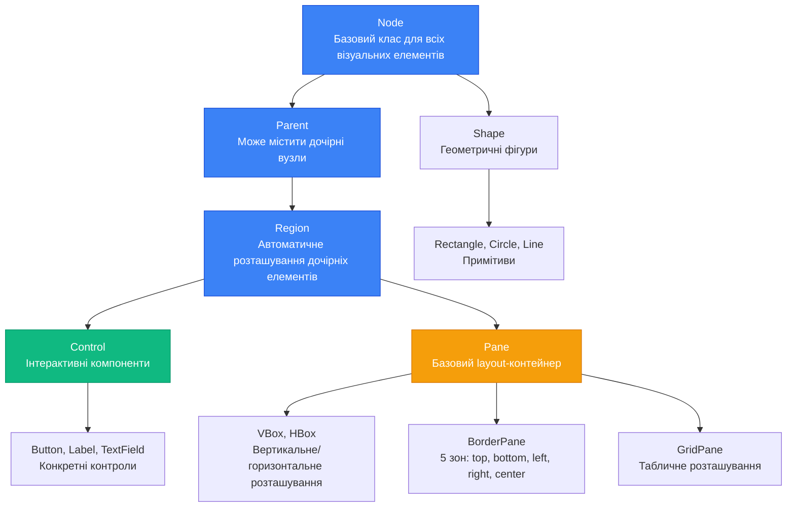
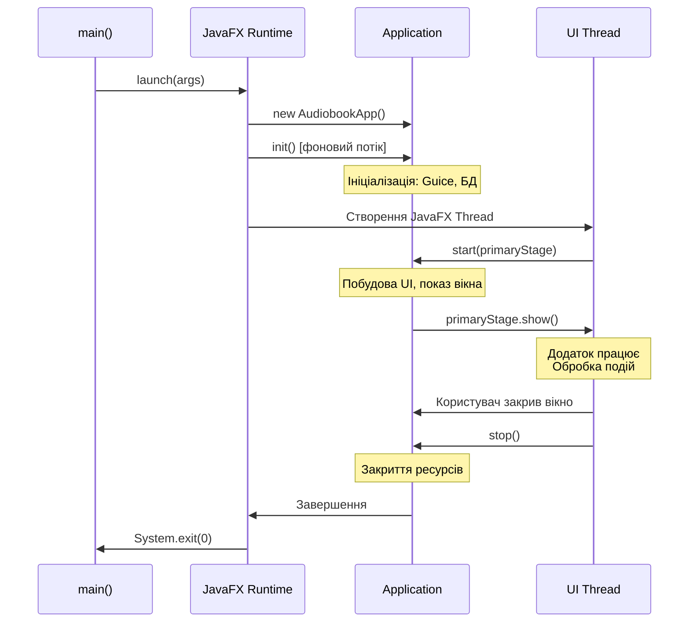

# JavaFX: Основи побудови графічних інтерфейсів

## Вступ: Від консолі до вікон

Уявіть, що ви щойно завершили побудову репозиторіїв для платформи аудіокниг. Ви реалізували `AudiobookRepository`, налаштували `Unit of Work`, інтегрували Google Guice для впровадження залежностей. Ваш код працює бездоганно: дані зберігаються у базі, транзакції виконуються атомарно, тести проходять зелені. Але є одна проблема — **користувач не бачить жодного рядка вашого коду**.

Для нього ваш додаток — це не елегантні патерни проектування чи ретельно спроектована архітектура. Це **вікно з кнопками**, **список аудіокниг**, **форма для додавання нового запису**. Це те, що він бачить на екрані, те, з чим він взаємодіє. І саме тут на сцену виходить **JavaFX** — сучасний фреймворк для побудови графічних інтерфейсів користувача (GUI) у Java-додатках.

Ця стаття — перший крок у світ desktop-розробки. Ми дізнаємося, як перетворити наші репозиторії та сервіси на живий, інтерактивний додаток. Як з'єднати два світи: світ бізнес-логіки (який ми вже побудували) та світ користувацького інтерфейсу (який ми зараз створимо).

::note
**JavaFX** — це платформа для створення багатофункціональних клієнтських додатків на Java. Вона була представлена Sun Microsystems у 2008 році як заміна застарілого Swing. З виходом Java 11 (2018) JavaFX стала окремим проєктом під назвою **OpenJFX**, що розвивається незалежно від JDK. [Офіційна документація OpenJFX](https://openjfx.io/)
::

### Чому JavaFX, а не Swing?

Якщо ви вивчали Java раніше, можливо, чули про **Swing** — попередній стандарт для GUI у Java. Чому ж індустрія перейшла на JavaFX? Відповідь криється у кількох ключових перевагах:

**Сучасна архітектура.** JavaFX побудована на концепції **Scene Graph** — ієрархічного дерева візуальних елементів, подібного до DOM у веб-браузерах. Це робить структуру UI інтуїтивною та легкою для розуміння.

**CSS-стилізація.** На відміну від Swing, де стилізація компонентів вимагала написання Java-коду, JavaFX підтримує **каскадні таблиці стилів** (CSS) — той самий підхід, що використовується у веб-розробці. Ви можете змінити зовнішній вигляд всього додатку, не торкаючись жодного рядка Java-коду.

**FXML — декларативний опис інтерфейсу.** JavaFX дозволяє описувати структуру UI у XML-файлах (FXML), подібно до HTML у веб-додатках. Це розділяє логіку та представлення — фундаментальний принцип, який ми згодом використаємо у патерні MVVM.

**Інтеграція з сучасною Java.** JavaFX повністю підтримує модульну систему Java (Project Jigsaw), лямбда-вирази, Stream API та інші можливості сучасної Java. Swing, натомість, залишився у минулому.

**Апаратне прискорення.** JavaFX використовує графічний конвеєр **Prism**, що забезпечує апаратне прискорення через OpenGL, DirectX або Metal (залежно від платформи). Це робить анімації плавними, а інтерфейс — відгукливим.

::card-group

::card{title="Swing (1997-2018)" icon="i-heroicons-archive-box"}

**Підхід:** Імперативний — кожен компонент створюється та налаштовується через Java-код.

**Стилізація:** Через `UIManager` та `Look and Feel` — складно та обмежено.

**Статус:** Legacy — підтримується, але не розвивається.

::

::card{title="JavaFX (2008-сьогодні)" icon="i-heroicons-sparkles"}

**Підхід:** Декларативний (FXML) + імперативний (Java) — гнучкість вибору.

**Стилізація:** CSS — знайомий веб-розробникам синтаксис, потужні можливості.

**Статус:** Активний розвиток — OpenJFX, регулярні оновлення.

::

::

### Історія та еволюція JavaFX

Розуміння історії технології допомагає усвідомити, чому вона виглядає саме так, а не інакше. JavaFX пройшла довгий шлях від експериментального проєкту до промислового стандарту.

**2008 рік — JavaFX 1.0.** Sun Microsystems представила JavaFX як конкурента Adobe Flash та Microsoft Silverlight. Перша версія використовувала власну мову програмування **JavaFX Script** — спробу зробити розробку UI більш декларативною. Однак ця мова не прижилася: розробники хотіли писати на Java, а не вивчати новий синтаксис.

**2011 рік — JavaFX 2.0.** Революційний реліз. JavaFX Script була повністю видалена, натомість з'явилося **Java API** для побудови інтерфейсів. Саме у цій версії з'явилися FXML, CSS-стилізація та Scene Graph у сучасному вигляді. JavaFX 2.0 стала частиною JDK 7, що означало офіційне визнання від Oracle.

**2014 рік — JavaFX 8.** Інтеграція з Java 8 принесла підтримку лямбда-виразів та Stream API, що зробило код JavaFX значно лаконічнішим. З'явилися нові компоненти: `DatePicker`, `TreeTableView`, вбудована підтримка 3D-графіки. Саме ця версія стала "золотим стандартом" для багатьох enterprise-додатків.

**2018 рік — JavaFX 11 та народження OpenJFX.** Oracle прийняла рішення виключити JavaFX з JDK, перетворивши її на окремий проєкт під егідою OpenJDK. Це було стратегічне рішення: JavaFX отримала незалежний цикл розробки, не прив'язаний до релізів Java. Проєкт перейменували на **OpenJFX**, і з того часу він розвивається як окремий модуль, що підключається до проєкту через Maven або Gradle.

**2020-2026 роки — Сучасність.** OpenJFX регулярно оновлюється, підтримуючи нові версії Java (до Java 21 включно на момент написання цієї статті). З'явилася підтримка нових платформ (включно з ARM-архітектурою для Apple Silicon), покращена продуктивність рендерингу, нові компоненти та API. JavaFX залишається одним з найпопулярніших фреймворків для desktop-розробки на Java, особливо у корпоративному сегменті.

::tip
**Для нашого курсу** ми використовуватимемо JavaFX 21 — останню LTS-версію на момент 2026 року. Всі приклади коду сумісні з Java 17+ та OpenJFX 21+.
::

---

## Архітектура JavaFX: Scene Graph та Application Lifecycle

Перш ніж писати перший рядок коду, необхідно зрозуміти, **як влаштована JavaFX зсередини**. Це не просто набір класів для малювання кнопок — це цілісна архітектура з чіткою ієрархією компонентів та життєвим циклом додатку.

### Scene Graph: Ієрархічне дерево візуальних елементів

Центральна концепція JavaFX — **Scene Graph** (граф сцени). Це ієрархічна структура даних, що представляє всі візуальні елементи вашого додатку у вигляді дерева. Кожен елемент у цьому дереві називається **вузлом** (Node).

Чому саме дерево? Тому що це природний спосіб описати вкладеність UI-компонентів. Вікно містить панель, панель містить кнопки та текстові поля, текстове поле містить текст. Кожен рівень вкладеності — це рівень у дереві.

**Базовий клас — `Node`.** Це абстрактний клас, від якого успадковуються всі візуальні елементи JavaFX. `Node` визначає загальні властивості: позицію (`x`, `y`), розмір (`width`, `height`), видимість (`visible`), прозорість (`opacity`), трансформації (обертання, масштабування), обробники подій.

**Контейнери — `Parent`.** Це підклас `Node`, що може містити інші вузли. Саме `Parent` формує структуру дерева: він має список дочірніх вузлів (`children`), які, у свою чергу, можуть бути контейнерами або листовими вузлами.

**Layout-контейнери — `Region`.** Підклас `Parent`, що додає можливості автоматичного розташування дочірніх елементів. Саме від `Region` успадковуються всі layout-контейнери: `VBox`, `HBox`, `BorderPane`, `GridPane`. Вони не просто містять елементи — вони **організовують їх у просторі** за певними правилами.

**Контроли — `Control`.** Підклас `Region`, що представляє інтерактивні елементи: `Button`, `TextField`, `Label`, `TableView`. Контроли мають не лише візуальне представлення, а й поведінку: кнопка реагує на клік, текстове поле приймає введення.

::mermaid

::

### Stage, Scene та Root Node: Тріада JavaFX

Щоб відобразити Scene Graph на екрані, JavaFX використовує три ключові компоненти: **Stage**, **Scene** та **Root Node**. Розуміння їхніх ролей критично важливе для побудови додатків.

**Stage (Сцена у театральному сенсі) — це вікно.** У JavaFX `Stage` представляє вікно операційної системи: те, що користувач бачить на робочому столі, що можна перетягувати, згортати, закривати. Кожен JavaFX-додаток має принаймні один `Stage` — **primary stage**, що створюється автоматично при запуску додатку та передається у метод `start()`.

`Stage` має властивості вікна: заголовок (`title`), розміри (`width`, `height`), можливість зміни розміру (`resizable`), модальність (`modality`). Ви можете створювати додаткові `Stage` для діалогових вікон або окремих екранів додатку.

**Scene (Сцена у JavaFX-сенсі) — це контейнер для контенту.** `Scene` — це об'єкт, що містить весь візуальний контент, який відображається у вікні. Один `Stage` може показувати лише одну `Scene` у конкретний момент часу, але ви можете змінювати `Scene` динамічно (наприклад, при навігації між екранами).

`Scene` визначає розміри контенту, фоновий колір, таблиці стилів CSS. Саме до `Scene` підключаються обробники глобальних подій (наприклад, натискання клавіш).

**Root Node — це корінь Scene Graph.** Кожна `Scene` має один кореневий вузол — `Parent`, від якого починається дерево всіх візуальних елементів. Зазвичай це layout-контейнер (`VBox`, `BorderPane`), що організовує структуру вашого інтерфейсу.

Ось як ці три компоненти співвідносяться:

```
Stage (вікно ОС)
  └── Scene (контейнер контенту)
        └── Root Node (корінь дерева)
              ├── Child Node 1 (наприклад, VBox)
              │     ├── Button
              │     └── Label
              └── Child Node 2 (наприклад, TableView)
```

<svg viewBox="0 0 800 400" class="w-full h-auto block" xmlns="http://www.w3.org/2000/svg">
  <!-- Stage (вікно) -->
  <rect x="50" y="50" width="700" height="320" rx="8" class="fill-slate-100 dark:fill-slate-800 stroke-slate-300 dark:stroke-slate-600" stroke-width="3"/>
  <text x="400" y="35" text-anchor="middle" class="text-sm font-bold fill-slate-600 dark:fill-slate-300">Stage (вікно операційної системи)</text>
  <!-- Scene -->
  <rect x="80" y="90" width="640" height="260" rx="6" class="fill-blue-50 dark:fill-blue-900/30 stroke-blue-400 dark:stroke-blue-500" stroke-width="2" stroke-dasharray="5,5"/>
  <text x="400" y="115" text-anchor="middle" class="text-xs font-semibold fill-blue-600 dark:fill-blue-400">Scene (контейнер контенту)</text>
  <!-- Root Node (BorderPane) -->
  <rect x="120" y="140" width="560" height="190" rx="4" class="fill-green-50 dark:fill-green-900/30 stroke-green-500 dark:stroke-green-400" stroke-width="2"/>
  <text x="400" y="165" text-anchor="middle" class="text-xs font-semibold fill-green-700 dark:fill-green-300">Root Node (BorderPane)</text>
  <!-- Top: HBox з кнопками -->
  <rect x="140" y="180" width="520" height="40" rx="3" class="fill-amber-100 dark:fill-amber-900/40 stroke-amber-400" stroke-width="1.5"/>
  <text x="400" y="205" text-anchor="middle" class="text-xs fill-amber-800 dark:fill-amber-200">HBox: Button "Add" | Button "Delete"</text>
  <!-- Center: TableView -->
  <rect x="140" y="235" width="520" height="80" rx="3" class="fill-purple-100 dark:fill-purple-900/40 stroke-purple-400" stroke-width="1.5"/>
  <text x="400" y="260" text-anchor="middle" class="text-xs fill-purple-800 dark:fill-purple-200">TableView (список аудіокниг)</text>
  <line x1="160" y1="270" x2="640" y2="270" class="stroke-purple-300 dark:stroke-purple-600" stroke-width="1"/>
  <line x1="160" y1="285" x2="640" y2="285" class="stroke-purple-300 dark:stroke-purple-600" stroke-width="1"/>
  <line x1="160" y1="300" x2="640" y2="300" class="stroke-purple-300 dark:stroke-purple-600" stroke-width="1"/>
  <!-- Стрілки -->
  <defs>
    <marker id="arrowblue" markerWidth="8" markerHeight="8" refX="7" refY="3" orient="auto">
      <path d="M0,0 L0,6 L8,3 z" class="fill-blue-500"/>
    </marker>
    <marker id="arrowgreen" markerWidth="8" markerHeight="8" refX="7" refY="3" orient="auto">
      <path d="M0,0 L0,6 L8,3 z" class="fill-green-500"/>
    </marker>
  </defs>
  <line x1="400" y1="75" x2="400" y2="88" class="stroke-blue-500" stroke-width="2" marker-end="url(#arrowblue)"/>
  <line x1="400" y1="125" x2="400" y2="138" class="stroke-green-500" stroke-width="2" marker-end="url(#arrowgreen)"/>
</svg>
::

### Життєвий цикл Application: init → start → stop

Кожен JavaFX-додаток успадковується від класу `javafx.application.Application` та проходить через три фази життєвого циклу: **ініціалізація**, **запуск** та **завершення**. Розуміння цих фаз допомагає правильно організувати код та уникнути типових помилок.

**Фаза 1: `init()` — підготовка до запуску.** Цей метод викликається **до** створення JavaFX Application Thread — у фоновому потоці. Тут ви можете виконувати важкі операції ініціалізації: завантаження конфігурації, підключення до бази даних, створення Guice Injector. Важливо: у `init()` **не можна** створювати JavaFX-компоненти (Stage, Scene, Node) — вони вимагають JavaFX Application Thread.

```java
@Override
public void init() throws Exception {
    // Виконується у фоновому потоці
    System.out.println("Initializing application...");
    
    // Тут можна: завантажити конфігурацію, створити Injector, підключитися до БД
    this.injector = Guice.createInjector(new AudiobookModule());
    
    // Тут НЕ можна: створювати Stage, Scene, Button, тощо
}
```

**Фаза 2: `start(Stage primaryStage)` — побудова UI.** Це головний метод вашого додатку. Він викликається у **JavaFX Application Thread** — спеціальному потоці, що відповідає за всі UI-операції. Тут ви створюєте Scene, завантажуєте FXML, налаштовуєте вікно та показуєте його користувачу.

```java
@Override
public void start(Stage primaryStage) throws Exception {
    // Виконується у JavaFX Application Thread
    primaryStage.setTitle("Audiobook Platform");
    
    // Створення Scene з Root Node
    VBox root = new VBox();
    root.getChildren().add(new Label("Welcome to Audiobook Platform"));
    
    Scene scene = new Scene(root, 800, 600);
    primaryStage.setScene(scene);
    primaryStage.show(); // Показати вікно
}
```

**Фаза 3: `stop()` — очищення ресурсів.** Цей метод викликається, коли користувач закриває останнє вікно або додаток завершується програмно. Тут ви маєте закрити всі відкриті ресурси: з'єднання з базою даних, файлові дескриптори, мережеві сокети.

```java
@Override
public void stop() throws Exception {
    // Виконується при завершенні додатку
    System.out.println("Shutting down application...");
    
    // Закриття DataSource, відписка від listeners, тощо
    injector.getInstance(DataSource.class).close();
}
```

::warning
**JavaFX Application Thread** — це єдиний потік, у якому можна безпечно працювати з UI-компонентами. Спроба створити `Button` або оновити `Label` з іншого потоку призведе до винятку `IllegalStateException: Not on FX application thread`. Для виконання UI-операцій з фонових потоків використовуйте `Platform.runLater(() -> { /* UI код */ })`.
::

**Запуск додатку: `Application.launch()`.** Щоб запустити JavaFX-додаток, викличте статичний метод `launch()` у методі `main()`:

```java
public class AudiobookApp extends Application {
    
    public static void main(String[] args) {
        launch(args); // Запуск JavaFX Application
    }
    
    @Override
    public void start(Stage primaryStage) {
        // Побудова UI
    }
}
```

Метод `launch()` виконує наступне:
1. Створює екземпляр вашого класу (через рефлексію, викликаючи конструктор без параметрів).
2. Викликає `init()` у фоновому потоці.
3. Створює JavaFX Application Thread та викликає `start(primaryStage)`.
4. Чекає, поки всі вікна будуть закриті.
5. Викликає `stop()` для очищення ресурсів.

::mermaid

::

---

## Перший JavaFX-додаток: Hello Audiobook Platform

Теорія без практики — це лише слова. Настав час написати наш перший JavaFX-додаток. Він буде максимально простим: вікно з написом "Audiobook Platform" та кнопкою "Load Tracks". Але навіть у цій простоті ховається вся архітектура, яку ми щойно вивчили.

### Крок 1: Налаштування проєкту

Перш за все, переконайтеся, що у вашому `pom.xml` (Maven) або `build.gradle` (Gradle) додані залежності JavaFX:

```xml
<!-- Maven: pom.xml -->
<dependencies>
    <dependency>
        <groupId>org.openjfx</groupId>
        <artifactId>javafx-controls</artifactId>
        <version>21</version>
    </dependency>
    <dependency>
        <groupId>org.openjfx</groupId>
        <artifactId>javafx-fxml</artifactId>
        <version>21</version>
    </dependency>
</dependencies>

<build>
    <plugins>
        <plugin>
            <groupId>org.openjfx</groupId>
            <artifactId>javafx-maven-plugin</artifactId>
            <version>0.0.8</version>
            <configuration>
                <mainClass>com.arakviel.AudiobookApp</mainClass>
            </configuration>
        </plugin>
    </plugins>
</build>
```

Для Gradle:

```groovy
// build.gradle
plugins {
    id 'application'
    id 'org.openjfx.javafxplugin' version '0.1.0'
}

javafx {
    version = "21"
    modules = ['javafx.controls', 'javafx.fxml']
}

application {
    mainClass = 'com.arakviel.AudiobookApp'
}

dependencies {
    implementation 'org.openjfx:javafx-controls:21'
    implementation 'org.openjfx:javafx-fxml:21'
}
```

### Запуск JavaFX-додатку

Після налаштування залежностей ви можете запустити додаток різними способами залежно від вашої системи збірки.

**Для Maven:**

```bash
# Запуск через Maven plugin
mvn clean javafx:run

# Або збірка та запуск JAR-файлу
mvn clean package
java --module-path /path/to/javafx-sdk/lib --add-modules javafx.controls,javafx.fxml -jar target/audiobook-app.jar
```

**Для Gradle:**

```bash
# Запуск через Gradle plugin
./gradlew run

# Або збірка та запуск JAR-файлу
./gradlew build
java --module-path /path/to/javafx-sdk/lib --add-modules javafx.controls,javafx.fxml -jar build/libs/audiobook-app.jar
```

::warning
**Важливо:** Без плагіна `javafx-maven-plugin` (для Maven) або `org.openjfx.javafxplugin` (для Gradle) додаток не запуститься, оскільки JavaFX-модулі не будуть автоматично додані до module path. Ви отримаєте помилку:
```
Error: JavaFX runtime components are missing, and are required to run this application
```
Плагіни автоматично налаштовують `--module-path` та `--add-modules` при запуску.
::

::note
**Модульна система Java** вимагає явного оголошення модулів JavaFX. Якщо ви використовуєте `module-info.java`, додайте:
```java
module dev.kostyl.audiobook {
    requires javafx.controls;
    requires javafx.fxml;
}
```
Для простоти, у навчальних прикладах ми не використовуватимемо модульну систему (classpath-based підхід).
::

### Крок 2: Створення класу Application

Створіть клас `AudiobookApp`, що успадковується від `Application`:

```java
package dev.kostyl.audiobook;

import javafx.application.Application;
import javafx.scene.Scene;
import javafx.scene.control.Button;
import javafx.scene.control.Label;
import javafx.scene.layout.VBox;
import javafx.stage.Stage;

public class AudiobookApp extends Application {

    @Override
    public void start(Stage primaryStage) {
        // Крок 1: Створення Root Node (VBox — вертикальний контейнер)
        VBox root = new VBox();
        root.setSpacing(10); // Відступ між елементами: 10 пікселів
        root.setStyle("-fx-padding: 20; -fx-alignment: center;");
        
        // Крок 2: Створення UI-компонентів
        Label titleLabel = new Label("Audiobook Platform");
        titleLabel.setStyle("-fx-font-size: 24px; -fx-font-weight: bold;");
        
        Button loadButton = new Button("Load Tracks");
        loadButton.setOnAction(event -> {
            System.out.println("Load Tracks button clicked!");
        });
        
        // Крок 3: Додавання компонентів до контейнера
        root.getChildren().addAll(titleLabel, loadButton);
        
        // Крок 4: Створення Scene
        Scene scene = new Scene(root, 400, 300);
        
        // Крок 5: Налаштування Stage
        primaryStage.setTitle("Audiobook Platform v1.0");
        primaryStage.setScene(scene);
        primaryStage.show();
    }

    public static void main(String[] args) {
        launch(args);
    }
}
```

### Розбір коду: Анатомія першого додатку

Розглянемо кожен рядок цього коду, щоб зрозуміти, **що** він робить та **чому** саме так.

**Рядок 1-6: Імпорти.** Ми імпортуємо класи з пакетів `javafx.application`, `javafx.scene`, `javafx.scene.control` та `javafx.scene.layout`. Це базові пакети JavaFX, що містять класи для побудови додатків, сцен, контролів та layout-контейнерів.

**Рядок 8: Успадкування від `Application`.** Наш клас `AudiobookApp` успадковується від `javafx.application.Application`. Це робить його точкою входу для JavaFX Runtime. Без цього успадкування метод `launch()` не працюватиме.

**Рядок 11: Метод `start(Stage primaryStage)`.** Це серце нашого додатку. Параметр `primaryStage` — це головне вікно, яке JavaFX створила для нас автоматично. Наше завдання — наповнити його контентом.

**Рядки 13-15: Створення Root Node.** Ми створюємо `VBox` — вертикальний контейнер, що розташовує дочірні елементи один під одним. Метод `setSpacing(10)` встановлює відступ між елементами у 10 пікселів. Метод `setStyle()` застосовує inline CSS: `padding` (внутрішні відступи) та `alignment` (вирівнювання по центру).

**Рядки 18-19: Створення Label.** `Label` — це текстовий елемент, що відображає статичний текст. Ми встановлюємо текст "Audiobook Platform" та застосовуємо стиль: розмір шрифту 24 пікселі, жирний шрифт. Зверніть увагу на префікс `-fx-` у CSS-властивостях — це стандарт JavaFX.

**Рядки 21-24: Створення Button.** `Button` — це інтерактивний елемент, що реагує на клік. Метод `setOnAction()` приймає обробник події — лямбда-вираз, що виконується при натисканні кнопки. У нашому випадку ми просто виводимо повідомлення у консоль. Пізніше тут буде виклик методу ViewModel для завантаження даних.

**Рядок 27: Додавання компонентів до контейнера.** Метод `getChildren()` повертає список дочірніх вузлів `VBox`. Метод `addAll()` додає `Label` та `Button` до цього списку. Порядок додавання визначає порядок відображення: спочатку Label (зверху), потім Button (знизу).

**Рядок 30: Створення Scene.** Ми створюємо `Scene` з кореневим вузлом `root` та розмірами 400×300 пікселів. Ці розміри визначають початковий розмір вікна (користувач зможе змінити його, якщо `resizable` не встановлено у `false`).

**Рядки 33-35: Налаштування Stage.** Ми встановлюємо заголовок вікна (`setTitle`), прив'язуємо `Scene` до `Stage` (`setScene`) та показуємо вікно (`show`). Без виклику `show()` вікно залишиться невидимим.

**Рядки 38-40: Метод `main()`.** Це точка входу Java-програми. Метод `launch(args)` запускає JavaFX Runtime, який, у свою чергу, створює екземпляр `AudiobookApp` та викликає `start()`.

::tip
**Чому `setOnAction()` приймає лямбда-вираз?** До Java 8 ви б писали анонімний клас:
```java
loadButton.setOnAction(new EventHandler<ActionEvent>() {
    @Override
    public void handle(ActionEvent event) {
        System.out.println("Button clicked!");
    }
});
```
Лямбда-вираз `event -> { ... }` — це синтаксичний цукор для того самого коду. JavaFX активно використовує функціональні інтерфейси, що робить код лаконічнішим.
::

### Запуск та результат

Запустіть `AudiobookApp.main()`. Ви побачите вікно з заголовком "Audiobook Platform v1.0", всередині якого — напис "Audiobook Platform" та кнопка "Load Tracks". Натисніть кнопку — у консолі з'явиться повідомлення "Load Tracks button clicked!".

Вітаємо! Ви щойно створили свій перший JavaFX-додаток. Він простий, але містить всі ключові елементи: `Application`, `Stage`, `Scene`, `Root Node`, контроли та обробник подій.

<svg viewBox="0 0 800 500" class="w-full h-auto block" xmlns="http://www.w3.org/2000/svg">
  <!-- Вікно додатку -->
  <rect x="150" y="80" width="500" height="360" rx="8" class="fill-white dark:fill-slate-800 stroke-slate-300 dark:stroke-slate-600" stroke-width="2"/>
  <!-- Заголовок вікна -->
  <rect x="150" y="80" width="500" height="35" rx="8" class="fill-slate-200 dark:fill-slate-700"/>
  <text x="400" y="103" text-anchor="middle" class="text-sm font-semibold fill-slate-700 dark:fill-slate-200">Audiobook Platform v1.0</text>
  <!-- Кнопки вікна macOS -->
  <circle cx="168" cy="97" r="6" class="fill-red-400"/>
  <circle cx="188" cy="97" r="6" class="fill-yellow-400"/>
  <circle cx="208" cy="97" r="6" class="fill-green-400"/>
  <!-- Контент: VBox -->
  <g transform="translate(400, 250)">
    <!-- Label -->
    <text x="0" y="-40" text-anchor="middle" class="text-2xl font-bold fill-slate-800 dark:fill-slate-100">Audiobook Platform</text>
    <!-- Button -->
    <rect x="-80" y="0" width="160" height="40" rx="6" class="fill-blue-500 hover:fill-blue-600 stroke-blue-600" stroke-width="1.5"/>
    <text x="0" y="27" text-anchor="middle" class="text-base font-semibold fill-white">Load Tracks</text>
  </g>
  <!-- Анотації -->
  <line x1="400" y1="210" x2="500" y2="160" class="stroke-green-500 dark:stroke-green-400" stroke-width="1.5" stroke-dasharray="3,3"/>
  <text x="510" y="155" class="text-xs fill-green-700 dark:fill-green-300">Label: заголовок</text>
  <line x1="400" y1="290" x2="500" y2="340" class="stroke-blue-500 dark:stroke-blue-400" stroke-width="1.5" stroke-dasharray="3,3"/>
  <text x="510" y="345" class="text-xs fill-blue-700 dark:fill-blue-300">Button: інтерактивний елемент</text>
</svg>
::

---

## Layout-контейнери: Організація простору

У попередньому прикладі ми використали `VBox` — найпростіший layout-контейнер, що розташовує елементи вертикально. Але JavaFX пропонує набагато більше можливостей для організації UI. Розуміння layout-контейнерів — це ключ до побудови складних, адаптивних інтерфейсів.

### Чому не абсолютне позиціонування?

У деяких UI-фреймворках (наприклад, у Windows Forms) ви можете встановлювати абсолютні координати для кожного елемента: "Кнопка на позиції (100, 50), розміром 80×30 пікселів". Це просто для маленьких додатків, але стає кошмаром при масштабуванні:

- **Різні розміри екранів.** Те, що виглядає добре на екрані 1920×1080, може бути зламаним на 1366×768.
- **Зміна розміру вікна.** Користувач розтягує вікно — елементи залишаються на місці, з'являються порожні простори.
- **Локалізація.** Текст німецькою мовою довший за англійський — кнопка обрізає текст.
- **Підтримка.** Додавання нового елемента вимагає перерахунку позицій усіх інших.

JavaFX вирішує ці проблеми через **layout-контейнери** — компоненти, що автоматично розташовують дочірні елементи за певними правилами. Ви описуєте **логіку розташування** (вертикально, горизонтально, у таблиці), а контейнер сам обчислює координати та розміри.

### VBox та HBox: Лінійне розташування

**VBox (Vertical Box)** розташовує дочірні елементи **вертикально**, один під одним. **HBox (Horizontal Box)** — **горизонтально**, один поруч з одним. Це найпростіші та найчастіше використовувані контейнери.

**Основні властивості VBox/HBox:**

- **`spacing`** — відступ між елементами (у пікселях).
- **`alignment`** — вирівнювання елементів: `TOP_LEFT`, `CENTER`, `BOTTOM_RIGHT`, тощо.
- **`padding`** — внутрішні відступи контейнера (відстань від країв до дочірніх елементів).
- **`fillWidth` (VBox) / `fillHeight` (HBox)** — чи розтягувати дочірні елементи на всю ширину/висоту.

Приклад: панель інструментів з кнопками (HBox):

```java
HBox toolbar = new HBox();
toolbar.setSpacing(10);
toolbar.setPadding(new Insets(10)); // Відступи: 10px з усіх боків
toolbar.setAlignment(Pos.CENTER_LEFT);

Button addButton = new Button("Add");
Button editButton = new Button("Edit");
Button deleteButton = new Button("Delete");

toolbar.getChildren().addAll(addButton, editButton, deleteButton);
```

Результат: три кнопки розташовані горизонтально, з відступом 10 пікселів між ними, вирівняні по лівому краю.

::tabs

::tabs-item{label="VBox (вертикально)" icon="i-heroicons-arrows-up-down"}

```java
VBox vbox = new VBox(10); // spacing = 10
vbox.setPadding(new Insets(20));
vbox.setAlignment(Pos.CENTER);

vbox.getChildren().addAll(
    new Label("Name:"),
    new TextField(),
    new Label("Email:"),
    new TextField(),
    new Button("Submit")
);
```

**Результат:** Label → TextField → Label → TextField → Button (вертикально).

::

::tabs-item{label="HBox (горизонтально)" icon="i-heroicons-arrows-right-left"}

```java
HBox hbox = new HBox(10); // spacing = 10
hbox.setPadding(new Insets(20));
hbox.setAlignment(Pos.CENTER);

hbox.getChildren().addAll(
    new Button("Previous"),
    new Label("Page 1 of 10"),
    new Button("Next")
);
```

**Результат:** Button ← Label ← Button (горизонтально).

::

::

### BorderPane: П'ять зон для класичного layout

**BorderPane** — це один з найпопулярніших контейнерів для побудови додатків. Він ділить простір на **п'ять зон**: `top`, `bottom`, `left`, `right` та `center`. Кожна зона може містити один вузол (зазвичай це інший контейнер, що містить кілька елементів).

Це класичний layout для desktop-додатків:
- **Top** — меню або панель інструментів.
- **Left** — бічна панель навігації або дерево категорій.
- **Center** — основний контент (таблиця, форма, текстовий редактор).
- **Right** — панель властивостей або додаткова інформація.
- **Bottom** — статус-бар або панель прогресу.

```java
BorderPane borderPane = new BorderPane();

// Top: меню
HBox menuBar = new HBox(10);
menuBar.getChildren().addAll(
    new Button("File"),
    new Button("Edit"),
    new Button("View")
);
borderPane.setTop(menuBar);

// Left: навігація
VBox navigation = new VBox(5);
navigation.getChildren().addAll(
    new Button("Audiobooks"),
    new Button("Authors"),
    new Button("Genres")
);
borderPane.setLeft(navigation);

// Center: основний контент
Label content = new Label("Main content area");
borderPane.setCenter(content);

// Bottom: статус-бар
Label statusBar = new Label("Ready");
borderPane.setBottom(statusBar);
```

**Поведінка розмірів:**
- **Top та Bottom** розтягуються на всю ширину, висота визначається контентом.
- **Left та Right** розтягуються на всю висоту (мінус top/bottom), ширина визначається контентом.
- **Center** займає весь залишковий простір.

::note
**BorderPane** не вимагає заповнення всіх зон. Якщо ви не встановите `left`, ця зона просто не буде відображатися, а `center` розшириться на її місце.
::

### GridPane: Табличне розташування

**GridPane** організовує елементи у **таблицю** з рядками та колонками. Це ідеальний вибір для форм, де кожен рядок містить Label (назва поля) та TextField (введення).

```java
GridPane grid = new GridPane();
grid.setHgap(10); // Горизонтальний відступ між колонками
grid.setVgap(10); // Вертикальний відступ між рядками
grid.setPadding(new Insets(20));

// Додавання елементів: (node, columnIndex, rowIndex)
grid.add(new Label("Title:"), 0, 0);
grid.add(new TextField(), 1, 0);

grid.add(new Label("Author:"), 0, 1);
grid.add(new TextField(), 1, 1);

grid.add(new Label("Duration:"), 0, 2);
grid.add(new TextField(), 1, 2);

Button saveButton = new Button("Save");
grid.add(saveButton, 1, 3); // Колонка 1, рядок 3
```

**Результат:** Форма з трьома полями (Title, Author, Duration) та кнопкою Save. Labels у лівій колонці, TextFields у правій.

**Розширені можливості GridPane:**

- **`GridPane.setColumnSpan(node, span)`** — елемент займає кілька колонок.
- **`GridPane.setRowSpan(node, span)`** — елемент займає кілька рядків.
- **`ColumnConstraints` та `RowConstraints`** — точне керування розмірами колонок/рядків.

Приклад: кнопка Save на всю ширину форми:

```java
Button saveButton = new Button("Save Audiobook");
saveButton.setMaxWidth(Double.MAX_VALUE); // Розтягнути на всю доступну ширину
grid.add(saveButton, 0, 3, 2, 1); // columnIndex=0, rowIndex=3, colspan=2, rowspan=1
```

### StackPane: Накладання елементів

**StackPane** розташовує дочірні елементи **один на одному**, як стопку карт. Перший доданий елемент — внизу, останній — зверху. Це корисно для створення оверлеїв, діалогів поверх контенту або іконок поверх зображень.

```java
StackPane stack = new StackPane();

// Фонове зображення
Rectangle background = new Rectangle(300, 200);
background.setFill(Color.LIGHTBLUE);

// Текст поверх фону
Label overlayText = new Label("Loading...");
overlayText.setStyle("-fx-font-size: 24px; -fx-text-fill: white;");

stack.getChildren().addAll(background, overlayText);
```

**Результат:** Синій прямокутник з текстом "Loading..." по центру.

::warning
**StackPane** вирівнює всі елементи по центру за замовчуванням. Якщо вам потрібне інше вирівнювання, використовуйте `StackPane.setAlignment(node, Pos.TOP_LEFT)` для конкретного вузла.
::

### Порівняльна таблиця layout-контейнерів

| Контейнер   | Призначення                          | Коли використовувати                          |
|-------------|--------------------------------------|-----------------------------------------------|
| **VBox**    | Вертикальне розташування             | Списки, форми, меню                           |
| **HBox**    | Горизонтальне розташування           | Панелі інструментів, кнопки дій               |
| **BorderPane** | 5 зон (top, bottom, left, right, center) | Класичний layout додатку (меню + контент)     |
| **GridPane** | Табличне розташування                | Форми з полями, калькулятори                  |
| **StackPane** | Накладання елементів                 | Оверлеї, діалоги, іконки поверх зображень     |
| **FlowPane** | Автоматичне перенесення на новий рядок | Теги, галереї зображень                       |
| **TilePane** | Рівномірні комірки (як плитка)       | Іконки додатків, галереї з фіксованим розміром |
| **AnchorPane** | Прив'язка до країв контейнера        | Складні custom layouts (рідко використовується) |

---

## Controls: Основні компоненти UI

Layout-контейнери організовують простір, але самі по собі вони порожні. Щоб додаток став інтерактивним, потрібні **контроли** (Controls) — компоненти, з якими користувач безпосередньо взаємодіє: кнопки, текстові поля, списки, таблиці.

JavaFX пропонує багатий набір вбудованих контролів, що покривають 90% типових потреб desktop-додатків. Розглянемо найважливіші з них.

### Button: Кнопка для дій

**Button** — найпростіший інтерактивний елемент. Користувач натискає кнопку → виконується дія.

```java
Button saveButton = new Button("Save Audiobook");
saveButton.setOnAction(event -> {
    System.out.println("Saving audiobook...");
    // Тут буде виклик viewModel.saveAudiobook()
});
```

**Властивості Button:**
- **`text`** — текст на кнопці.
- **`graphic`** — іконка (Node, зазвичай ImageView або SVGPath).
- **`disable`** — чи кнопка неактивна (сіра, не реагує на кліки).
- **`defaultButton`** — чи кнопка активується при натисканні Enter.
- **`cancelButton`** — чи кнопка активується при натисканні Esc.

Приклад кнопки з іконкою:

```java
Button addButton = new Button("Add");
ImageView icon = new ImageView(new Image("icons/add.png"));
icon.setFitWidth(16);
icon.setFitHeight(16);
addButton.setGraphic(icon);
```

### Label: Статичний текст

**Label** відображає текст, що не редагується користувачем. Використовується для підписів, заголовків, повідомлень.

```java
Label titleLabel = new Label("Audiobook Details");
titleLabel.setStyle("-fx-font-size: 18px; -fx-font-weight: bold;");
```

**Особливість:** Label може містити не лише текст, а й графіку (іконку) через властивість `graphic`.

### TextField та TextArea: Введення тексту

**TextField** — однорядкове текстове поле. **TextArea** — багаторядкове.

```java
TextField titleField = new TextField();
titleField.setPromptText("Enter audiobook title"); // Placeholder-текст

TextArea descriptionArea = new TextArea();
descriptionArea.setPrefRowCount(5); // Висота: 5 рядків
descriptionArea.setWrapText(true); // Автоматичне перенесення тексту
```

**Отримання введеного тексту:**

```java
String title = titleField.getText();
String description = descriptionArea.getText();
```

**Валідація у реальному часі** (ми детально розглянемо це у статті про MVVM):

```java
titleField.textProperty().addListener((observable, oldValue, newValue) -> {
    if (newValue.length() > 255) {
        titleField.setStyle("-fx-border-color: red;");
    } else {
        titleField.setStyle("");
    }
});
```

### ComboBox: Випадаючий список

**ComboBox** дозволяє користувачу обрати один елемент зі списку.

```java
ComboBox<String> genreComboBox = new ComboBox<>();
genreComboBox.getItems().addAll("Fiction", "Non-Fiction", "Science", "History");
genreComboBox.setValue("Fiction"); // Значення за замовчуванням

// Отримання обраного значення
String selectedGenre = genreComboBox.getValue();
```

**Для об'єктів (не лише String):**

```java
ComboBox<Genre> genreComboBox = new ComboBox<>();
genreComboBox.getItems().addAll(genre1, genre2, genre3);

// Налаштування відображення (за замовчуванням викликається toString())
genreComboBox.setCellFactory(param -> new ListCell<Genre>() {
    @Override
    protected void updateItem(Genre item, boolean empty) {
        super.updateItem(item, empty);
        setText(empty || item == null ? null : item.getName());
    }
});
genreComboBox.setButtonCell(genreComboBox.getCellFactory().call(null));
```

### CheckBox та RadioButton: Вибір опцій

**CheckBox** — незалежний прапорець (можна обрати кілька). **RadioButton** — взаємовиключні опції (лише одна з групи).

```java
// CheckBox
CheckBox notifyCheckBox = new CheckBox("Notify me about new releases");
boolean isChecked = notifyCheckBox.isSelected();

// RadioButton (група)
ToggleGroup formatGroup = new ToggleGroup();

RadioButton mp3Radio = new RadioButton("MP3");
mp3Radio.setToggleGroup(formatGroup);

RadioButton flacRadio = new RadioButton("FLAC");
flacRadio.setToggleGroup(formatGroup);

RadioButton oggRadio = new RadioButton("OGG");
oggRadio.setToggleGroup(formatGroup);

mp3Radio.setSelected(true); // За замовчуванням

// Отримання обраного
RadioButton selected = (RadioButton) formatGroup.getSelectedToggle();
String format = selected.getText();
```

### ListView: Список елементів

**ListView** відображає вертикальний список елементів, з яких користувач може обрати один або кілька.

```java
ListView<String> trackListView = new ListView<>();
trackListView.getItems().addAll("Track 1.mp3", "Track 2.mp3", "Track 3.mp3");

// Режим вибору
trackListView.getSelectionModel().setSelectionMode(SelectionMode.MULTIPLE);

// Отримання обраних елементів
ObservableList<String> selectedTracks = trackListView.getSelectionModel().getSelectedItems();
```

**Для об'єктів:**

```java
ListView<Audiobook> audiobookListView = new ListView<>();
audiobookListView.getItems().addAll(audiobook1, audiobook2, audiobook3);

// Налаштування відображення
audiobookListView.setCellFactory(param -> new ListCell<Audiobook>() {
    @Override
    protected void updateItem(Audiobook item, boolean empty) {
        super.updateItem(item, empty);
        if (empty || item == null) {
            setText(null);
        } else {
            setText(item.getTitle() + " by " + item.getAuthor().getFullName());
        }
    }
});
```

### TableView: Таблиця даних

**TableView** — найпотужніший контрол для відображення табличних даних. Він підтримує сортування, фільтрацію, редагування комірок.

```java
TableView<Audiobook> audiobookTable = new TableView<>();

// Колонка "Title"
TableColumn<Audiobook, String> titleColumn = new TableColumn<>("Title");
titleColumn.setCellValueFactory(new PropertyValueFactory<>("title"));

// Колонка "Author"
TableColumn<Audiobook, String> authorColumn = new TableColumn<>("Author");
authorColumn.setCellValueFactory(cellData -> 
    new SimpleStringProperty(cellData.getValue().getAuthor().getFullName())
);

// Колонка "Duration"
TableColumn<Audiobook, Integer> durationColumn = new TableColumn<>("Duration (min)");
durationColumn.setCellValueFactory(new PropertyValueFactory<>("duration"));

audiobookTable.getColumns().addAll(titleColumn, authorColumn, durationColumn);

// Додавання даних
audiobookTable.getItems().addAll(audiobook1, audiobook2, audiobook3);
```

**Пояснення `PropertyValueFactory`:** Це спрощений спосіб зв'язати колонку з полем об'єкта. `new PropertyValueFactory<>("title")` шукає метод `getTitle()` у класі `Audiobook` та використовує його значення для комірки.

**Для складніших випадків** (наприклад, вкладені об'єкти) використовуйте лямбда-вираз:

```java
authorColumn.setCellValueFactory(cellData -> {
    Audiobook audiobook = cellData.getValue();
    String authorName = audiobook.getAuthor().getFullName();
    return new SimpleStringProperty(authorName);
});
```

::note
**TableView та MVVM:** У наступних статтях ми побачимо, як `TableView` автоматично оновлюється при зміні даних через `ObservableList` у ViewModel. Це ключова перевага JavaFX Properties.
::

### Spinner: Числове введення з кнопками

**Spinner** дозволяє вводити числа з можливістю збільшення/зменшення через кнопки.

```java
Spinner<Integer> durationSpinner = new Spinner<>(0, 1000, 60, 5);
// min=0, max=1000, initialValue=60, step=5

int duration = durationSpinner.getValue();
```

### DatePicker: Вибір дати

**DatePicker** — календар для вибору дати.

```java
DatePicker releaseDatePicker = new DatePicker();
releaseDatePicker.setValue(LocalDate.now());

LocalDate selectedDate = releaseDatePicker.getValue();
```

---

## Event Handling: Реакція на дії користувача

Контроли без обробників подій — це лише статичні картинки. Справжня інтерактивність починається, коли додаток **реагує** на дії користувача: клік миші, натискання клавіші, зміну тексту у полі.

### Обробники подій: EventHandler та лямбда-вирази

У JavaFX події обробляються через інтерфейс `EventHandler<T>`, де `T` — тип події. Найпоширеніша подія — `ActionEvent`, що генерується при натисканні кнопки, виборі елемента у списку, тощо.

**Традиційний підхід (до Java 8):**

```java
button.setOnAction(new EventHandler<ActionEvent>() {
    @Override
    public void handle(ActionEvent event) {
        System.out.println("Button clicked!");
    }
});
```

**Сучасний підхід (лямбда-вираз):**

```java
button.setOnAction(event -> {
    System.out.println("Button clicked!");
});
```

Якщо обробник складається з одного виразу, фігурні дужки можна опустити:

```java
button.setOnAction(event -> System.out.println("Button clicked!"));
```

### Типи подій

JavaFX підтримує широкий спектр подій:

**Події миші:**
- `setOnMouseClicked()` — клік миші.
- `setOnMouseEntered()` — курсор увійшов у межі елемента.
- `setOnMouseExited()` — курсор вийшов з меж елемента.
- `setOnMousePressed()` / `setOnMouseReleased()` — натискання/відпускання кнопки миші.

**Події клавіатури:**
- `setOnKeyPressed()` — клавіша натиснута.
- `setOnKeyReleased()` — клавіша відпущена.
- `setOnKeyTyped()` — символ введено (враховує модифікатори, наприклад Shift).

**Події зміни значення:**
- `textProperty().addListener()` — зміна тексту у TextField.
- `selectedItemProperty().addListener()` — зміна вибору у ComboBox/ListView.

Приклад: підсвічування кнопки при наведенні миші:

```java
Button hoverButton = new Button("Hover me");

hoverButton.setOnMouseEntered(event -> {
    hoverButton.setStyle("-fx-background-color: lightblue;");
});

hoverButton.setOnMouseExited(event -> {
    hoverButton.setStyle("");
});
```

### Делегування до ViewModel: Розділення відповідальностей

У реальних додатках обробник події не повинен містити бізнес-логіку. Його завдання — **делегувати** виклик до ViewModel або Service.

**Антипатерн (вся логіка у Controller):**

```java
saveButton.setOnAction(event -> {
    String title = titleField.getText();
    if (title.isEmpty()) {
        showError("Title is required");
        return;
    }
    
    try (Connection conn = dataSource.getConnection()) {
        PreparedStatement stmt = conn.prepareStatement(
            "INSERT INTO audiobooks (title, author_id) VALUES (?, ?)"
        );
        stmt.setString(1, title);
        stmt.setUUID(2, selectedAuthor.getId());
        stmt.executeUpdate();
        showSuccess("Audiobook saved");
    } catch (SQLException e) {
        showError("Failed to save: " + e.getMessage());
    }
});
```

**Правильний підхід (делегування до ViewModel):**

```java
saveButton.setOnAction(event -> {
    viewModel.saveAudiobook();
});
```

Вся логіка (валідація, виклик Repository, обробка помилок) знаходиться у ViewModel. Controller лише передає подію далі. Це робить код тестованим, повторно використовуваним та відповідає принципу Single Responsibility.

::warning
**Не виконуйте тривалі операції у UI-потоці!** Якщо обробник події виконує JDBC-запит, читання файлу або мережевий запит, додаток "зависне" — користувач не зможе взаємодіяти з інтерфейсом, поки операція не завершиться. Для тривалих операцій використовуйте `Task` (ми розглянемо це у статті про ViewModel).
::

---

## FXML: Декларативний опис інтерфейсу

До цього моменту ми створювали UI **імперативно** — через Java-код: `new VBox()`, `button.setOnAction()`, тощо. Це працює, але має недоліки:

- **Змішування логіки та представлення.** Код побудови UI та бізнес-логіка знаходяться в одному класі.
- **Важко візуалізувати структуру.** Щоб зрозуміти, як виглядає інтерфейс, потрібно читати десятки рядків Java-коду.
- **Неможливість використання візуальних редакторів.** Дизайнери не можуть працювати з Java-кодом.

**FXML** вирішує ці проблеми. Це XML-формат для **декларативного** опису UI, подібний до HTML у веб-розробці. Ви описуєте структуру інтерфейсу у `.fxml` файлі, а Java-код лише завантажує його та підключає логіку.

### Приклад FXML: Форма додавання аудіокниги

Створіть файл `AudiobookForm.fxml`:

```xml
<?xml version="1.0" encoding="UTF-8"?>

<?import javafx.scene.control.*?>
<?import javafx.scene.layout.*?>
<?import javafx.geometry.Insets?>

<VBox xmlns:fx="http://javafx.com/fxml" 
      fx:controller="dev.kostyl.audiobook.controller.AudiobookFormController"
      spacing="10" alignment="CENTER">
    
    <padding>
        <Insets top="20" right="20" bottom="20" left="20"/>
    </padding>
    
    <Label text="Add New Audiobook" style="-fx-font-size: 18px; -fx-font-weight: bold;"/>
    
    <GridPane hgap="10" vgap="10">
        <Label text="Title:" GridPane.columnIndex="0" GridPane.rowIndex="0"/>
        <TextField fx:id="titleField" GridPane.columnIndex="1" GridPane.rowIndex="0"/>
        
        <Label text="Author:" GridPane.columnIndex="0" GridPane.rowIndex="1"/>
        <ComboBox fx:id="authorComboBox" GridPane.columnIndex="1" GridPane.rowIndex="1"/>
        
        <Label text="Duration (min):" GridPane.columnIndex="0" GridPane.rowIndex="2"/>
        <Spinner fx:id="durationSpinner" GridPane.columnIndex="1" GridPane.rowIndex="2"/>
    </GridPane>
    
    <Button fx:id="saveButton" text="Save Audiobook" onAction="#onSaveClicked"/>
    
</VBox>
```

**Розбір FXML:**

- **`<?import ...?>`** — імпорт класів JavaFX (аналог `import` у Java).
- **`<VBox>`** — кореневий елемент, відповідає `new VBox()` у Java.
- **`fx:controller`** — вказує клас Controller, що керує цим FXML.
- **`fx:id`** — унікальний ідентифікатор елемента, що дозволяє звертатися до нього з Java-коду.
- **`onAction="#onSaveClicked"`** — прив'язка події до методу Controller.
- **`GridPane.columnIndex`** — attached property (властивість, що встановлюється батьківським контейнером).

### Controller: Зв'язок FXML з Java-кодом

Створіть клас `AudiobookFormController`:

```java
package dev.kostyl.audiobook.controller;

import javafx.fxml.FXML;
import javafx.scene.control.*;

public class AudiobookFormController {

    @FXML
    private TextField titleField;
    
    @FXML
    private ComboBox<String> authorComboBox;
    
    @FXML
    private Spinner<Integer> durationSpinner;
    
    @FXML
    private Button saveButton;
    
    @FXML
    public void initialize() {
        // Викликається автоматично після завантаження FXML
        authorComboBox.getItems().addAll("Author 1", "Author 2", "Author 3");
        durationSpinner.setValueFactory(new SpinnerValueFactory.IntegerSpinnerValueFactory(0, 1000, 60));
    }
    
    @FXML
    private void onSaveClicked() {
        String title = titleField.getText();
        String author = authorComboBox.getValue();
        int duration = durationSpinner.getValue();
        
        System.out.println("Saving: " + title + " by " + author + ", " + duration + " min");
        // Тут буде виклик viewModel.saveAudiobook()
    }
}
```

**Анотація `@FXML`:**
- На **полях** — зв'язує поле з елементом FXML через `fx:id`.
- На **методах** — дозволяє викликати метод з FXML через `onAction="#methodName"`.

**Метод `initialize()`** — спеціальний метод, що викликається автоматично після завантаження FXML та ін'єкції всіх `@FXML` полів. Тут ви можете ініціалізувати контроли, налаштувати bindings, завантажити дані.

### Завантаження FXML у додатку

Щоб використати FXML, завантажте його через `FXMLLoader`:

```java
public class AudiobookApp extends Application {
    
    @Override
    public void start(Stage primaryStage) throws Exception {
        FXMLLoader loader = new FXMLLoader();
        loader.setLocation(getClass().getResource("/fxml/AudiobookForm.fxml"));
        
        Parent root = loader.load();
        
        Scene scene = new Scene(root, 600, 400);
        primaryStage.setTitle("Audiobook Form");
        primaryStage.setScene(scene);
        primaryStage.show();
    }
    
    public static void main(String[] args) {
        launch(args);
    }
}
```

**Структура проєкту:**

```
src/
├── main/
│   ├── java/
│   │   └── dev/kostyl/audiobook/
│   │       ├── AudiobookApp.java
│   │       └── controller/
│   │           └── AudiobookFormController.java
│   └── resources/
│       └── fxml/
│           └── AudiobookForm.fxml
```

::tip
**Scene Builder** — візуальний редактор для FXML від Gluon. Він дозволяє створювати інтерфейси методом drag-and-drop, як у Figma або Adobe XD, але для JavaFX. Scene Builder генерує FXML-код автоматично. [Завантажити Scene Builder](https://gluonhq.com/products/scene-builder/)
::

### FXML vs Java-код: Коли що використовувати?

| Критерій              | FXML                                  | Java-код                              |
|-----------------------|---------------------------------------|---------------------------------------|
| **Структура UI**      | ✅ Ідеально — декларативно, наочно    | ❌ Багато boilerplate-коду            |
| **Динамічний UI**     | ❌ Складно — потрібен Java-код        | ✅ Легко — повний контроль            |
| **Візуальні редактори** | ✅ Scene Builder                      | ❌ Немає                              |
| **Розділення concerns** | ✅ UI окремо від логіки               | ❌ Все в одному класі                 |
| **Продуктивність**    | ⚠️ Трохи повільніше (парсинг XML)    | ✅ Швидше (прямі виклики конструкторів) |

**Рекомендація:** Використовуйте FXML для **статичних** частин інтерфейсу (форми, діалоги, головні екрани). Використовуйте Java-код для **динамічних** частин (генерація елементів у циклі, складні анімації).

---

## Практичний приклад: Список аудіокниг з BorderPane

Об'єднаємо всі вивчені концепції у один практичний приклад: додаток для перегляду списку аудіокниг з можливістю додавання нових записів.

### Структура інтерфейсу

- **Top:** Панель інструментів з кнопками "Add", "Edit", "Delete".
- **Center:** TableView зі списком аудіокниг (колонки: Title, Author, Duration).
- **Bottom:** Статус-бар з повідомленням "Ready".

### FXML: AudiobookListView.fxml

```xml
<?xml version="1.0" encoding="UTF-8"?>

<?import javafx.scene.control.*?>
<?import javafx.scene.layout.*?>
<?import javafx.geometry.Insets?>

<BorderPane xmlns:fx="http://javafx.com/fxml"
            fx:controller="dev.kostyl.audiobook.controller.AudiobookListController"
            prefWidth="800" prefHeight="600">
    
    <!-- Top: Toolbar -->
    <top>
        <HBox spacing="10" style="-fx-padding: 10; -fx-background-color: #f0f0f0;">
            <Button fx:id="addButton" text="Add Audiobook" onAction="#onAddClicked"/>
            <Button fx:id="editButton" text="Edit" onAction="#onEditClicked"/>
            <Button fx:id="deleteButton" text="Delete" onAction="#onDeleteClicked"/>
            <Region HBox.hgrow="ALWAYS"/> <!-- Spacer -->
            <TextField fx:id="searchField" promptText="Search audiobooks..."/>
        </HBox>
    </top>
    
    <!-- Center: TableView -->
    <center>
        <TableView fx:id="audiobookTable">
            <columns>
                <TableColumn fx:id="titleColumn" text="Title" prefWidth="300"/>
                <TableColumn fx:id="authorColumn" text="Author" prefWidth="200"/>
                <TableColumn fx:id="durationColumn" text="Duration (min)" prefWidth="150"/>
                <TableColumn fx:id="genreColumn" text="Genre" prefWidth="150"/>
            </columns>
        </TableView>
    </center>
    
    <!-- Bottom: Status Bar -->
    <bottom>
        <Label fx:id="statusLabel" text="Ready" style="-fx-padding: 5; -fx-background-color: #e0e0e0;"/>
    </bottom>
    
</BorderPane>
```

### Controller: AudiobookListController.java

```java
package dev.kostyl.audiobook.controller;

import javafx.fxml.FXML;
import javafx.scene.control.*;
import javafx.collections.FXCollections;
import javafx.collections.ObservableList;

public class AudiobookListController {

    @FXML private TableView<AudiobookData> audiobookTable;
    @FXML private TableColumn<AudiobookData, String> titleColumn;
    @FXML private TableColumn<AudiobookData, String> authorColumn;
    @FXML private TableColumn<AudiobookData, Integer> durationColumn;
    @FXML private TableColumn<AudiobookData, String> genreColumn;
    
    @FXML private Button addButton;
    @FXML private Button editButton;
    @FXML private Button deleteButton;
    @FXML private TextField searchField;
    @FXML private Label statusLabel;
    
    private ObservableList<AudiobookData> audiobooks;
    
    @FXML
    public void initialize() {
        // Налаштування колонок
        titleColumn.setCellValueFactory(cellData -> cellData.getValue().titleProperty());
        authorColumn.setCellValueFactory(cellData -> cellData.getValue().authorProperty());
        durationColumn.setCellValueFactory(cellData -> cellData.getValue().durationProperty().asObject());
        genreColumn.setCellValueFactory(cellData -> cellData.getValue().genreProperty());
        
        // Завантаження тестових даних
        audiobooks = FXCollections.observableArrayList(
            new AudiobookData("The Great Gatsby", "F. Scott Fitzgerald", 240, "Fiction"),
            new AudiobookData("1984", "George Orwell", 360, "Dystopian"),
            new AudiobookData("Sapiens", "Yuval Noah Harari", 900, "Non-Fiction")
        );
        
        audiobookTable.setItems(audiobooks);
        
        // Вимкнути кнопки Edit/Delete, якщо нічого не обрано
        editButton.setDisable(true);
        deleteButton.setDisable(true);
        
        audiobookTable.getSelectionModel().selectedItemProperty().addListener((obs, oldSelection, newSelection) -> {
            boolean hasSelection = newSelection != null;
            editButton.setDisable(!hasSelection);
            deleteButton.setDisable(!hasSelection);
        });
    }
    
    @FXML
    private void onAddClicked() {
        statusLabel.setText("Add button clicked");
        // Тут буде відкриття діалогу додавання
    }
    
    @FXML
    private void onEditClicked() {
        AudiobookData selected = audiobookTable.getSelectionModel().getSelectedItem();
        if (selected != null) {
            statusLabel.setText("Editing: " + selected.getTitle());
        }
    }
    
    @FXML
    private void onDeleteClicked() {
        AudiobookData selected = audiobookTable.getSelectionModel().getSelectedItem();
        if (selected != null) {
            audiobooks.remove(selected);
            statusLabel.setText("Deleted: " + selected.getTitle());
        }
    }
}
```

### Модель даних: AudiobookData.java

Для роботи з TableView потрібен клас з JavaFX Properties (ми детально розглянемо Properties у наступній статті):

```java
package dev.kostyl.audiobook.controller;

import javafx.beans.property.*;

public class AudiobookData {
    private final StringProperty title;
    private final StringProperty author;
    private final IntegerProperty duration;
    private final StringProperty genre;
    
    public AudiobookData(String title, String author, int duration, String genre) {
        this.title = new SimpleStringProperty(title);
        this.author = new SimpleStringProperty(author);
        this.duration = new SimpleIntegerProperty(duration);
        this.genre = new SimpleStringProperty(genre);
    }
    
    // Properties (для TableView)
    public StringProperty titleProperty() { return title; }
    public StringProperty authorProperty() { return author; }
    public IntegerProperty durationProperty() { return duration; }
    public StringProperty genreProperty() { return genre; }
    
    // Getters
    public String getTitle() { return title.get(); }
    public String getAuthor() { return author.get(); }
    public int getDuration() { return duration.get(); }
    public String getGenre() { return genre.get(); }
}
```

### Запуск додатку

```java
public class AudiobookApp extends Application {
    
    @Override
    public void start(Stage primaryStage) throws Exception {
        Parent root = FXMLLoader.load(getClass().getResource("/fxml/AudiobookListView.fxml"));
        
        Scene scene = new Scene(root);
        primaryStage.setTitle("Audiobook Platform");
        primaryStage.setScene(scene);
        primaryStage.show();
    }
    
    public static void main(String[] args) {
        launch(args);
    }
}
```

**Результат:** Повноцінний додаток з таблицею аудіокниг, панеллю інструментів та статус-баром. Кнопки "Edit" та "Delete" автоматично вмикаються/вимикаються залежно від вибору у таблиці.

::note
**Чому `AudiobookData`, а не `Audiobook`?** У цьому прикладі ми використовуємо спрощений клас з JavaFX Properties для демонстрації роботи TableView. У реальному додатку з MVVM-архітектурою ми створимо `AudiobookViewModel`, що обгортає Domain-об'єкт `Audiobook` та експонує Properties для UI. Це буде детально розглянуто у статті 28.
::

---

## Практичні завдання

Настав час закріпити вивчений матеріал через практику. Кожне завдання розраховане на поступове ускладнення: від базових операцій до побудови повноцінних екранів.

### Рівень 1: Базові операції (Виправлення та розуміння)

**Завдання 1.1: Виправити помилки у коді**

Наступний код містить кілька помилок. Знайдіть та виправте їх:

```java
public class BrokenApp extends Application {
    
    public void start(Stage stage) {
        VBox root = new VBox();
        Button button = new Button("Click me");
        
        button.setOnAction(event -> {
            Label label = new Label("Button clicked!");
            root.getChildren().add(label);
        });
        
        Scene scene = new Scene(root, 300, 200);
        stage.setScene(scene);
    }
    
    public static void main(String[] args) {
        launch(args);
    }
}
```

**Підказка:** Перевірте сигнатуру методу `start()`, чи додано кнопку до контейнера, чи викликано `stage.show()`.

**Завдання 1.2: Створити форму з валідацією**

Створіть форму реєстрації користувача з полями:
- Username (TextField)
- Email (TextField)
- Password (PasswordField)
- Confirm Password (PasswordField)
- Кнопка "Register"

Додайте просту валідацію: кнопка "Register" має бути неактивною, якщо будь-яке поле порожнє.

**Завдання 1.3: Список з можливістю видалення**

Створіть `ListView` з 5 елементами (назви книг). Додайте кнопку "Remove Selected", що видаляє обраний елемент зі списку.

### Рівень 2: Логіка та колекції (Робота з даними)

**Завдання 2.1: TableView з фільтрацією**

Створіть `TableView` для відображення списку авторів (ім'я, прізвище, кількість книг). Додайте `TextField` для пошуку: при введенні тексту таблиця має показувати лише тих авторів, чиє ім'я або прізвище містить введений текст.

**Підказка:** Використовуйте `FilteredList` з JavaFX Collections.

**Завдання 2.2: Калькулятор тривалості**

Створіть додаток, що обчислює загальну тривалість аудіокниг у колекції:
- `ListView` з аудіокнигами (назва + тривалість у хвилинах).
- `Label`, що показує загальну тривалість у форматі "X годин Y хвилин".
- Кнопка "Add Audiobook" для додавання нових записів через діалог.

**Завдання 2.3: Динамічна форма**

Створіть форму додавання аудіокниги з `ComboBox` для вибору жанру. При виборі жанру "Podcast" має з'являтися додаткове поле "Episode Number". При виборі інших жанрів це поле має ховатися.

**Підказка:** Використовуйте `comboBox.valueProperty().addListener()` та `node.setVisible()` / `node.setManaged()`.

### Рівень 3: Архітектура та створення (Повноцінні екрани)

**Завдання 3.1: Master-Detail інтерфейс**

Створіть додаток з `BorderPane`:
- **Left:** `ListView` зі списком жанрів (Fiction, Non-Fiction, Science, History).
- **Center:** `TableView` з аудіокнигами обраного жанру.
- **Right:** Панель деталей обраної аудіокниги (назва, автор, опис, тривалість).

При виборі жанру зліва — оновлюється таблиця у центрі. При виборі аудіокниги у таблиці — оновлюється панель деталей справа.

**Завдання 3.2: Діалог з поверненням результату**

Створіть головний екран зі списком авторів та кнопкою "Add Author". При натисканні кнопки має відкриватися модальний діалог з формою (First Name, Last Name, Bio). Після натискання "Save" у діалозі — новий автор має з'являтися у списку на головному екрані.

**Підказка:** Використовуйте `Stage` з `initModality(Modality.APPLICATION_MODAL)` та `showAndWait()`.

**Завдання 3.3: Повноцінний CRUD-додаток**

Створіть додаток для управління колекцією аудіокниг з наступним функціоналом:
- Перегляд списку аудіокниг у `TableView` (Title, Author, Genre, Duration).
- Додавання нової аудіокниги через діалог з валідацією всіх полів.
- Редагування обраної аудіокниги (завантаження даних у форму).
- Видалення обраної аудіокниги з підтвердженням через `Alert`.
- Пошук аудіокниг за назвою або автором.
- Збереження даних у файл (JSON або CSV) та завантаження при старті додатку.

**Вимоги:**
- Використовуйте FXML для всіх екранів.
- Розділіть код на Controller (UI-логіка) та Service (бізнес-логіка).
- Додайте обробку помилок (наприклад, при читанні файлу).

---

## Підсумок

У цій статті ми пройшли шлях від базових концепцій JavaFX до побудови повноцінних інтерактивних додатків. Ось що ми вивчили:

**Архітектура JavaFX:** Ми зрозуміли, що JavaFX — це не просто набір класів для малювання кнопок, а цілісна архітектура з Scene Graph (ієрархічне дерево вузлів), життєвим циклом Application (init → start → stop) та спеціалізованим JavaFX Application Thread для всіх UI-операцій.

**Scene Graph та компоненти:** Ми дізналися про ієрархію класів: `Node` → `Parent` → `Region` → `Control`, та про тріаду Stage → Scene → Root Node, що формує структуру кожного JavaFX-додатку.

**Layout-контейнери:** Ми вивчили, як організовувати простір через `VBox`, `HBox`, `BorderPane`, `GridPane` та `StackPane`, замість абсолютного позиціонування. Це робить інтерфейси адаптивними та легкими у підтримці.

**Контроли:** Ми познайомилися з основними UI-компонентами: `Button`, `Label`, `TextField`, `ComboBox`, `ListView`, `TableView` — будівельними блоками будь-якого desktop-додатку.

**Event Handling:** Ми навчилися обробляти події користувача через `EventHandler` та лямбда-вирази, розуміючи важливість делегування логіки до ViewModel замість розміщення всього коду у Controller.

**FXML:** Ми відкрили декларативний підхід до побудови UI через XML-розмітку, що розділяє структуру інтерфейсу та логіку, робить код читабельнішим та дозволяє використовувати візуальні редактори як Scene Builder.

**Практичний досвід:** Ми створили кілька робочих додатків: від простого "Hello World" до повноцінного списку аудіокниг з `TableView`, панеллю інструментів та статус-баром.

Але це лише початок. У наступній статті ми заглибимося у **JavaFX Properties та Bindings** — реактивну систему, що дозволяє автоматично синхронізувати стан UI з даними. Ми дізнаємося, як зробити так, щоб зміна значення у `TextField` автоматично оновлювала `Label`, а кнопка "Save" ставала активною лише при валідних даних — без написання жодного рядка коду для ручного оновлення.

Після цього ми перейдемо до архітектурних патернів (MVC, MVP, MVVM) та побудуємо повноцінний додаток з розділенням відповідальностей, тестованою логікою та інтеграцією з Google Guice для впровадження залежностей.

JavaFX — це потужний інструмент, але його справжня сила розкривається лише у поєднанні з правильною архітектурою. І саме цьому присвячені наступні статті нашого курсу.

::tip
**Корисні ресурси для подальшого вивчення:**
- [Офіційна документація JavaFX](https://openjfx.io/) — API reference та гайди.
- [JavaFX CSS Reference Guide](https://openjfx.io/javadoc/21/javafx.graphics/javafx/scene/doc-files/cssref.html) — повний список CSS-властивостей.
- [ControlsFX](https://controlsfx.github.io/) — бібліотека додаткових контролів (Rating, Notifications, PropertySheet).
- [JFoenix](http://www.jfoenix.com/) — Material Design компоненти для JavaFX.
- [Scene Builder](https://gluonhq.com/products/scene-builder/) — візуальний редактор FXML.
::

