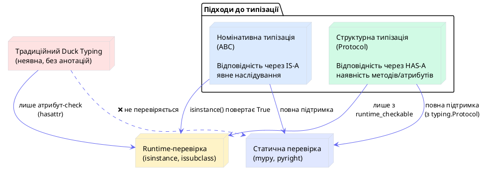
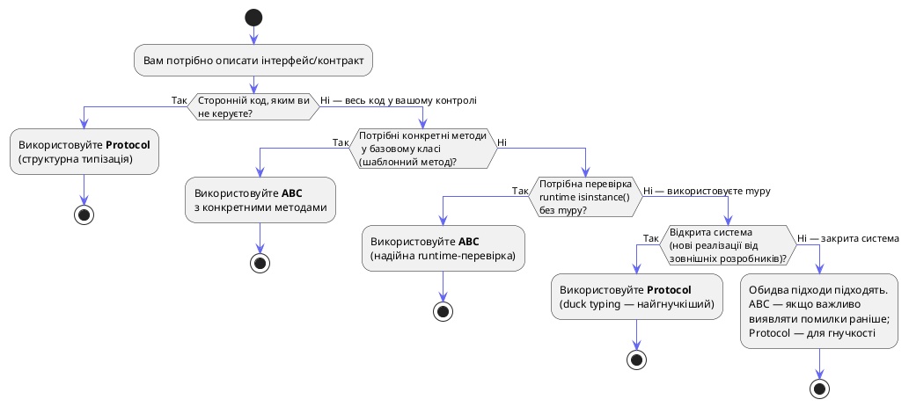

# Абстракція — ABC проти Статичних Протоколів (PEP 544)

## Проблема: Як описати контракт, не прив'язуючись до реалізації

Уявіть, що ви проектуєте систему сповіщень для великого SaaS-сервісу. У вас є кілька транспортів: email, SMS, push-нотифікації, Slack-повідомлення. Логіка надсилання різна, але кожен транспорт виконує одне завдання — відправляє повідомлення.

Ваша перша спроба виглядає так:

```python
# ❌ Погана архітектура: залежність від конкретних класів
class NotificationService:
    def __init__(self, transport):
        self.transport = transport

    def send(self, user_id: int, message: str) -> None:
        # А що якщо transport — це email? А може SMS?
        # Як IDE зрозуміє, які методи є у transport?
        self.transport.send(user_id, message)
```

Код працює, але він крихкий і непрозорий. IDE не підказує автодоповнення. Новий розробник не знає, що саме повинен реалізувати його `CustomTransport`. Тест потребує реального транспорту або складного mock-об'єкта.

**Питання архітектора:** Як описати «контракт» (інтерфейс) об'єкта-транспорту так, щоб:
- IDE та статичний аналізатор `mypy` «розуміли» структуру об'єкта
- Розробник, що пише новий транспорт, чітко знав, що потрібно реалізувати
- Система могла перевірити відповідність контракту хоча б під час тестування

Python надає **два принципово різних** підходи до вирішення цієї проблеми: **Abstract Base Classes (ABC)** та **Protocols (PEP 544)**. Ця стаття — глибокий розбір обох механізмів, їхніх внутрішніх реалізацій і точних сценаріїв застосування.

---

## Частина I: Теоретичний фундамент — два підходи до типізації

### Номінативна типізація: «Ти є те, чим себе називаєш»

У мовах зі **статичною номінативною типізацією** (Java, C#, Go < 1.18) клас вважається відповідним певному типу лише якщо він явно **оголошує** цю відповідність. Наприклад, у Java клас `EmailSender` повинен явно написати `implements INotifier`, щоб вважатися типом `INotifier`.

```java
// Java: явна декларація відповідності
interface INotifier {
    void send(int userId, String message);
}

class EmailSender implements INotifier { // ← явне оголошення
    @Override
    public void send(int userId, String message) { ... }
}
```

Перевага: тип-система є строгою і передбачуваною. Вада: клас у сторонній бібліотеці (яку ви не контролюєте) ніколи не зможе задовольнити ваш інтерфейс, навіть якщо він структурно ідентичний.

Саме цей підхід реалізується через **ABC** у Python: щоб клас вважався `Notifier`, він повинен явно успадкувати від `Notifier` або зареєструватися через спеціальний метод.

### Структурна типізація: «Ти є те, що ти можеш робити»

**Структурна типізація** (Duck Typing, Structural Subtyping) — підхід, за яким відповідність типу визначається **структурою** об'єкта, а не явним оголошенням. Якщо об'єкт має метод `send(user_id, message)`, він задовольняє контракту «нотифікатора» — незалежно від того, чи він успадковує від певного базового класу.

```python
# Python: качині типи (Duck Typing)
class SlackSender:
    def send(self, user_id: int, message: str) -> None:
        print(f"Slack: {message} → user {user_id}")

# SlackSender нічого не успадковує — але його можна передати
# туди, де очікується об'єкт з методом send()
```

::tip
**Походження терміну «Duck Typing»** — від англійського вислову: _«If it walks like a duck and quacks like a duck, it's a duck»_ («Якщо воно ходить як качка і крякає як качка — це качка»). Тобто, якщо об'єкт веде себе як певний тип, Python вважатиме його цим типом.
::

Python традиційно є мовою з динамічною структурною типізацією. Але до Python 3.8 ця типізація була **неявною** — статичні аналізатори не могли перевірити її коректність. `Protocol` (PEP 544) з'явився саме для того, щоб зробити структурну типізацію **явною та статично перевірюваною**.

::plant-uml



::

---

## Частина II: Abstract Base Classes (ABC)

### Що таке ABC і навіщо він існує

Модуль `abc` (Abstract Base Classes) з'явився у Python 2.6 (PEP 3119) і вирішував конкретну проблему: перевірку відповідності об'єктів інтерфейсам без потреби перевіряти наявність кожного методу вручну через `hasattr`.

До появи `abc` розробники перевіряли «тип» об'єкта або через `isinstance(obj, SomeClass)` (жорстка номінативна прив'язка), або через `hasattr(obj, 'send')` (крихко, не масштабується). ABC запропонував третій шлях: **реєстрацію** об'єктів як таких, що реалізують інтерфейс.

### Механіка створення абстрактного класу

Для створення абстрактного класу потрібні два компоненти:

1. **Успадкування від `ABC`** (або використання `ABCMeta` як метакласу)
2. **Декоратор `@abstractmethod`** для позначення методів, що обов'язково мають бути перевизначені

```python
# notifiers.py
from abc import ABC, abstractmethod

class BaseNotifier(ABC):
    """
    Абстрактний базовий клас для всіх транспортів сповіщень.
    Оголошує контракт: будь-який нотифікатор повинен реалізувати send() та close().
    """

    @abstractmethod
    def send(self, user_id: int, message: str) -> bool:
        """
        Надсилає повідомлення користувачу.

        Args:
            user_id: Ідентифікатор отримувача.
            message: Текст повідомлення.

        Returns:
            True — якщо доставлено, False — якщо виникла помилка.
        """
        ...

    @abstractmethod
    def close(self) -> None:
        """Звільняє ресурси транспорту (з'єднання, сесії)."""
        ...

    # Конкретний метод у абстрактному класі — цілком допустимо!
    def send_bulk(self, user_ids: list[int], message: str) -> dict[int, bool]:
        """
        Надсилає повідомлення кільком користувачам.
        Реалізація за замовчуванням: послідовне надсилання.
        Може бути перевизначена для ефективних batch-операцій.
        """
        return {uid: self.send(uid, message) for uid in user_ids}
```

::warning
**Важливо:** Клас, що наслідує `ABC`, стає **абстрактним** лише якщо у ньому є хоча б один `@abstractmethod`. Якщо всі методи конкретні — клас можна інстанціювати, навіть якщо він наслідує від `ABC`. ABC — це інструмент, а не чарівна позначка.
::

### Заборона інстанціювання абстрактних класів

Ключова поведінка ABC: **неможливість створити екземпляр класу, який не реалізував усі абстрактні методи**. Python перевіряє це під час виклику `__init__` метакласу `ABCMeta`.

```python
from abc import ABC, abstractmethod

class BaseNotifier(ABC):
    @abstractmethod
    def send(self, user_id: int, message: str) -> bool: ...

    @abstractmethod
    def close(self) -> None: ...

# ❌ Спроба 1: Інстанціювати абстрактний клас напряму
try:
    notifier = BaseNotifier()
except TypeError as e:
    print(f"TypeError: {e}")
    # TypeError: Can't instantiate abstract class BaseNotifier
    # with abstract methods close, send

# ❌ Спроба 2: Підклас реалізував лише один із двох методів
class IncompleteNotifier(BaseNotifier):
    def send(self, user_id: int, message: str) -> bool:
        return True
    # close() не реалізований!

try:
    incomplete = IncompleteNotifier()
except TypeError as e:
    print(f"TypeError: {e}")
    # TypeError: Can't instantiate abstract class IncompleteNotifier
    # with abstract method close

# ✅ Спроба 3: Повна реалізація
class EmailNotifier(BaseNotifier):
    def __init__(self, smtp_host: str):
        self._host = smtp_host
        self._connected = True

    def send(self, user_id: int, message: str) -> bool:
        print(f"[EMAIL] Надсилання до user {user_id}: {message}")
        return True

    def close(self) -> None:
        self._connected = False
        print("[EMAIL] З'єднання закрито")

email = EmailNotifier("smtp.gmail.com")  # ✅ Працює
print(isinstance(email, BaseNotifier))   # True
```

::terminal-preview{title="Демонстрація захисту ABC"}

<div class="line"><span class="opacity-40">$</span> <strong>python notifiers.py</strong></div>
<div class="line">TypeError: <span class="text-rose-400">Can't instantiate abstract class BaseNotifier with abstract methods close, send</span></div>
<div class="line">TypeError: <span class="text-rose-400">Can't instantiate abstract class IncompleteNotifier with abstract method close</span></div>
<div class="line"><span class="text-green-400">[EMAIL] Надсилання до user 42: Привіт!</span></div>
<div class="line"><span class="text-green-400">True</span></div>

::

### Розширені форми абстрактних оголошень

ABC дозволяє поєднувати `@abstractmethod` з іншими декораторами для опису більш складних контрактів.

::field-group

::field{name="@abstractmethod" type="decorator"}
Базовий декоратор. Позначає метод як такий, що обов'язково має бути перевизначений у конкретному підкласі. При спробі інстанціювати клас з нереалізованими абстрактними методами — викидається `TypeError`.
::

::field{name="@property + @abstractmethod" type="decorator combo"}
Абстрактна властивість. Підклас зобов'язаний реалізувати `@property` з відповідним ім'ям. Порядок декораторів суворий: спочатку `@property`, потім `@abstractmethod`.
::

::field{name="@classmethod + @abstractmethod" type="decorator combo"}
Абстрактний метод класу. Підклас повинен реалізувати метод через `@classmethod`. Ідеальний для абстрактних фабричних методів (`from_config`, `from_dict`).
::

::field{name="@staticmethod + @abstractmethod" type="decorator combo"}
Абстрактний статичний метод. Рідко використовується, але дозволяє описати контракт для `@staticmethod`.
::

::

```python
from abc import ABC, abstractmethod

class DataStore(ABC):
    """Абстракція сховища даних."""

    # ── Абстрактна властивість ────────────────────────────────────────
    @property
    @abstractmethod
    def connection_string(self) -> str:
        """Рядок підключення (лише читання)."""
        ...

    # ── Абстрактний classmethod ───────────────────────────────────────
    @classmethod
    @abstractmethod
    def from_config(cls, config: dict) -> "DataStore":
        """Альтернативний конструктор — з конфігураційного словника."""
        ...

    # ── Абстрактний staticmethod ──────────────────────────────────────
    @staticmethod
    @abstractmethod
    def validate_config(config: dict) -> bool:
        """Валідує конфігурацію перед підключенням."""
        ...

    # ── Абстрактний метод ─────────────────────────────────────────────
    @abstractmethod
    def execute(self, query: str) -> list:
        """Виконує запит і повертає результати."""
        ...


class PostgreSQLStore(DataStore):
    """Конкретна реалізація для PostgreSQL."""

    def __init__(self, host: str, port: int, db: str):
        self._conn_str = f"postgresql://{host}:{port}/{db}"

    @property
    def connection_string(self) -> str:
        return self._conn_str

    @classmethod
    def from_config(cls, config: dict) -> "PostgreSQLStore":
        return cls(config["host"], config.get("port", 5432), config["db"])

    @staticmethod
    def validate_config(config: dict) -> bool:
        return "host" in config and "db" in config

    def execute(self, query: str) -> list:
        print(f"[PG] Виконання: {query}")
        return []


# Тестуємо
if PostgreSQLStore.validate_config({"host": "localhost", "db": "mydb"}):
    store = PostgreSQLStore.from_config({"host": "localhost", "db": "mydb"})
    print(store.connection_string)   # postgresql://localhost:5432/mydb
    store.execute("SELECT 1")        # [PG] Виконання: SELECT 1
```

### Механізм реєстрації: `register()` без наслідування

ABC надає потужний механізм «реєстрації» — клас може бути визнаний підкласом ABC **без явного наслідування**. Це особливо корисно для інтеграції зі сторонніми бібліотеками, вихідний код яких ви не контролюєте.

```python
from abc import ABC, abstractmethod

class Drawable(ABC):
    @abstractmethod
    def draw(self) -> None: ...

# Клас зі сторонньої бібліотеки — ми не можемо змінити його код
class ThirdPartyShape:
    def draw(self) -> None:
        print("Third-party shape rendering")

# Реєструємо як підклас без зміни ThirdPartyShape
Drawable.register(ThirdPartyShape)

shape = ThirdPartyShape()
print(isinstance(shape, Drawable))    # True  ✅
print(issubclass(ThirdPartyShape, Drawable))  # True  ✅

# Але! ABCMeta не перевіряє наявність методів при реєстрації
class Fake:
    pass  # не має методу draw()

Drawable.register(Fake)
fake = Fake()
print(isinstance(fake, Drawable))  # True — навіть без draw()!
```

::warning
**Пастка `register()`:** ABCMeta перевіряє наявність абстрактних методів лише при **наслідуванні**, але не при **реєстрації**. Зареєстрований клас проходить `isinstance`/`issubclass` перевірку, але не гарантує реалізацію методів. Використовуйте `register()` обережно — лише якщо впевнені у сумісності стороннього класу.
::

### Заглянути у механіку ABCMeta

Щоб зрозуміти, як ABC працює «під капотом», розглянемо альтернативний спосіб оголошення абстрактних класів через `metaclass=ABCMeta`:

```python
from abc import ABCMeta, abstractmethod

# Ці два записи абсолютно еквівалентні:

# Спосіб 1 (рекомендований): успадкування від ABC
class MyAbstractA(ABC):
    @abstractmethod
    def do_something(self) -> None: ...

# Спосіб 2 (низькорівневий): явне вказання метакласу
class MyAbstractB(metaclass=ABCMeta):
    @abstractmethod
    def do_something(self) -> None: ...

# ABC — це просто синтаксичний цукор для metaclass=ABCMeta:
# class ABC(metaclass=ABCMeta): pass
```

`ABCMeta` — це метаклас. Під час створення класу він сканує `__dict__` (та `__dict__` батьків) на наявність атрибутів з `__isabstractmethod__ = True`. Список таких атрибутів зберігається у спеціальному атрибуті класу `__abstractmethods__` (тип: `frozenset`). Під час кожного виклику `__call__` (тобто при інстанціюванні) Python перевіряє `__abstractmethods__` — і якщо він не порожній, кидає `TypeError`.

```python
from abc import ABC, abstractmethod

class Shape(ABC):
    @abstractmethod
    def area(self) -> float: ...

    @abstractmethod
    def perimeter(self) -> float: ...

# Перегляд абстрактних методів
print(Shape.__abstractmethods__)  # frozenset({'area', 'perimeter'})

class Circle(Shape):
    def __init__(self, r: float):
        self.r = r

    def area(self) -> float:
        return 3.14159 * self.r ** 2

    # perimeter() ще не реалізовано...

print(Circle.__abstractmethods__)  # frozenset({'perimeter'}) — залишився 1

class FullCircle(Circle):
    def perimeter(self) -> float:
        return 2 * 3.14159 * self.r

print(FullCircle.__abstractmethods__)  # frozenset() — порожній, можна інстанціювати
c = FullCircle(5.0)  # ✅
```

::terminal-preview{title="Дослідження __abstractmethods__"}

<div class="line"><span class="opacity-40">$</span> <strong>python abc_internals.py</strong></div>
<div class="line">Shape.__abstractmethods__ = <span class="text-blue-400">frozenset({'area', 'perimeter'})</span></div>
<div class="line">Circle.__abstractmethods__ = <span class="text-yellow-400">frozenset({'perimeter'})</span></div>
<div class="line">FullCircle.__abstractmethods__ = <span class="text-green-400">frozenset()</span></div>
<div class="line">Площа кола R=5: <span class="text-green-400">78.54</span></div>

::

---

## Частина III: Протоколи (PEP 544) — Структурна типізація

### Передісторія: проблема, яку вирішив PEP 544

До Python 3.8 розробники мали два інструменти для опису типів: `ABC` (занадто жорстко, потрібне наслідування) та рядкові анотації типів `Any` (занадто м'яко, відсутня будь-яка перевірка). Для сторонніх бібліотек ABC взагалі не підходив.

Ситуацію погіршувало те, що традиційне duck typing у Python **не підтримувалося** статичними аналізаторами. Уявіть таку ситуацію:

```python
# Без Protocol: mypy не розуміє, що чекати від 'transport'
def send_notification(transport, user_id: int, message: str) -> bool:
    return transport.send(user_id, message)  # mypy: "transport" has type "Any"
```

`mypy` тут безсилий — він не знає, чи є у `transport` метод `send`. **PEP 544**, прийнятий у Python 3.8, вирішив цю проблему, ввівши клас `Protocol` з модуля `typing`.

### Синтаксис Protocol: опис структури без наслідування

```python
from typing import Protocol

class Notifier(Protocol):
    """
    Протокол для транспортів сповіщень.
    ВАЖЛИВО: Цей клас описує структуру, а не реалізацію.
    Будь-який об'єкт, що має метод send() з такою сигнатурою,
    автоматично відповідає цьому протоколу — без явного наслідування.
    """
    def send(self, user_id: int, message: str) -> bool: ...

    def close(self) -> None: ...
```

Тепер визначимо кілька реалізацій — **жодна з них не успадковує від `Notifier`**:

```python
# email_transport.py — зі своєї бібліотеки
class EmailTransport:
    def send(self, user_id: int, message: str) -> bool:
        print(f"[EMAIL] → user {user_id}: {message}")
        return True

    def close(self) -> None:
        print("[EMAIL] Closed")

# sms_transport.py — з SDK стороннього провайдера (не змінюємо)
class SMSGatewayClient:
    def send(self, user_id: int, message: str) -> bool:
        print(f"[SMS] → user {user_id}: {message}")
        return True

    def close(self) -> None:
        print("[SMS] Session terminated")

# Функція, що приймає будь-який Notifier
def send_notification(transport: Notifier, user_id: int, message: str) -> bool:
    return transport.send(user_id, message)

# Обидва класи відповідають протоколу — mypy це розуміє!
email = EmailTransport()
sms = SMSGatewayClient()

send_notification(email, 1, "Ваш рахунок підтверджено")  # ✅
send_notification(sms,   2, "Код: 4872")                 # ✅
```

Ключовий момент: `mypy` перевіряє сумісність `EmailTransport` з `Notifier` **структурно** — він порівнює сигнатури методів, а не перевіряє дерево наслідування.

### Статична перевірка: mypy та Protocol

Перевага Protocol стає очевидною, коли клас **не** відповідає протоколу:

```python
# broken_transport.py
from typing import Protocol

class Notifier(Protocol):
    def send(self, user_id: int, message: str) -> bool: ...
    def close(self) -> None: ...

class BrokenTransport:
    # Неправильна сигнатура: замість user_id приймає username: str
    def send(self, username: str, message: str) -> bool:
        return True

    # close() взагалі відсутній

def send_notification(transport: Notifier, user_id: int, msg: str) -> bool:
    return transport.send(user_id, msg)

broken = BrokenTransport()
send_notification(broken, 1, "test")  # Runtime: працює (duck typing)
                                       # mypy: ❌ ПОМИЛКА!
```

::terminal-preview{title="mypy: виявлення порушення протоколу"}

<div class="line"><span class="opacity-40">$</span> <strong>mypy broken_transport.py</strong></div>
<div class="line">broken_transport.py:22: <span class="text-rose-400">error: Argument 1 to "send_notification" has incompatible type "BrokenTransport"; expected "Notifier"  [arg-type]</span></div>
<div class="line">broken_transport.py:22: <span class="text-gray-400">note: Following member(s) of "BrokenTransport" have conflicts:</span></div>
<div class="line">broken_transport.py:22: <span class="text-yellow-400">note:     Expected:</span></div>
<div class="line">broken_transport.py:22: <span class="text-yellow-400">note:         def send(self, user_id: int, message: str) -> bool</span></div>
<div class="line">broken_transport.py:22: <span class="text-rose-400">note:     Got:</span></div>
<div class="line">broken_transport.py:22: <span class="text-rose-400">note:         def send(self, username: str, message: str) -> bool</span></div>
<div class="line">broken_transport.py:22: <span class="text-rose-400">note:     "close" not found</span></div>
<div class="line"><span class="text-rose-400">Found 1 error in 1 file (checked 1 source file)</span></div>

::

`mypy` точно вказує на проблему: невідповідність типу параметра (`str` замість `int`) та відсутність методу `close`. Ця помилка виловлюється ще до запуску програми — це і є цінність статичного аналізу.

### `runtime_checkable`: isinstance для протоколів

За замовчуванням `Protocol` **не підтримує** `isinstance()`-перевірки — це навмисне проектне рішення (перевірка структурної сумісності у runtime є дорогою операцією). Але за допомогою декоратора `@runtime_checkable` можна увімкнути підтримку `isinstance`:

```python
from typing import Protocol, runtime_checkable

@runtime_checkable
class Drawable(Protocol):
    def draw(self, x: int, y: int) -> None: ...
    def resize(self, factor: float) -> None: ...

class Circle:
    def draw(self, x: int, y: int) -> None:
        print(f"O @ ({x}, {y})")

    def resize(self, factor: float) -> None:
        self.radius *= factor

class Square:
    def draw(self, x: int, y: int) -> None:
        print(f"□ @ ({x}, {y})")
    # resize() відсутній!

c = Circle()
s = Square()

print(isinstance(c, Drawable))  # True  — Circle має обидва методи
print(isinstance(s, Drawable))  # False — Square не має resize()
```

::warning
**Обмеження `runtime_checkable`:** `isinstance()` перевіряє лише **наявність** атрибутів (через `hasattr`), але **не перевіряє сигнатури** методів. Клас із методом `draw(self)` замість `draw(self, x: int, y: int)` пройде `isinstance`-перевірку, але провалить перевірку `mypy`. Для гарантії сумісності — використовуйте `mypy`.
::

```python
@runtime_checkable
class Notifier(Protocol):
    def send(self, user_id: int, message: str) -> bool: ...

class WrongSignature:
    def send(self) -> None:   # ← неправильна сигнатура!
        pass

obj = WrongSignature()
print(isinstance(obj, Notifier))  # True (!!) — наявність методу є, сигнатура не перевіряється
```

::terminal-preview{title="Демонстрація обмеження runtime_checkable"}

<div class="line"><span class="opacity-40">$</span> <strong>python runtime_check_demo.py</strong></div>
<div class="line">isinstance(c, Drawable): <span class="text-green-400">True</span></div>
<div class="line">isinstance(s, Drawable): <span class="text-rose-400">False</span>  <span class="text-gray-400"># Square не має resize()</span></div>
<div class="line">isinstance(obj, Notifier): <span class="text-yellow-400">True</span>  <span class="text-gray-400"># УВАГА: сигнатура не перевіряється!</span></div>

::

### Protocol з атрибутами даних

`Protocol` може описувати не лише методи, а й **атрибути даних**:

```python
from typing import Protocol

class HasMetadata(Protocol):
    name: str
    version: str
    author: str

    def describe(self) -> str: ...

class PythonPackage:
    def __init__(self, name: str, version: str, author: str):
        self.name = name
        self.version = version
        self.author = author

    def describe(self) -> str:
        return f"{self.name} v{self.version} by {self.author}"

def print_package_info(pkg: HasMetadata) -> None:
    print(f"Package: {pkg.describe()}")

p = PythonPackage("requests", "2.31.0", "Kenneth Reitz")
print_package_info(p)  # mypy: ✅ — PythonPackage структурно відповідає HasMetadata
```

### Наслідування між Protocol-класами

Протоколи можуть успадковувати один одного, будуючи ієрархію контрактів:

```python
from typing import Protocol

class Readable(Protocol):
    def read(self, n: int = -1) -> bytes: ...

class Writable(Protocol):
    def write(self, data: bytes) -> int: ...

class Closeable(Protocol):
    def close(self) -> None: ...

# Комбінований протокол через множинне наслідування
class ReadWriteCloseable(Readable, Writable, Closeable, Protocol):
    """Описує повнофункціональний потік даних (як файловий об'єкт)."""
    ...

import io
buf = io.BytesIO()
# io.BytesIO реалізує read(), write(), close() — відповідає ReadWriteCloseable
def process_stream(stream: ReadWriteCloseable) -> None:
    stream.write(b"data")
    stream.read()
    stream.close()

process_stream(buf)  # mypy: ✅
```

---

## Частина IV: Порівняльний аналіз ABC проти Protocol

### Детальна порівняльна таблиця

| Критерій | ABC | Protocol |
|---|---|---|
| **Механізм відповідності** | Номінативний (IS-A) | Структурний (HAS-A) |
| **Вимога до наслідування** | Обов'язкова | Відсутня |
| **Зв'язування** | Раннє (explicit) | Пізнє (implicit) |
| **Перевірка `isinstance`** | ✅ Завжди | ✅ З `@runtime_checkable` (лише наявність) |
| **Статичний аналіз (mypy)** | ✅ Повна підтримка | ✅ Повна підтримка + сигнатури |
| **Сторонні бібліотеки** | `register()` (без гарантій) | ✅ Повна підтримка (duck typing) |
| **Конкретні методи в базі** | ✅ Підтримуються | ⚠️ Лише за умов |
| **Абстрактні властивості** | ✅ `@property + @abstractmethod` | ✅ Атрибути у класі протоколу |
| **Документація контракту** | Явна, формальна | Явна через сигнатури |
| **Гнучкість** | Низька (жорстка ієрархія) | Висока |
| **Версія Python** | 2.6+ | 3.8+ |

### Схема вибору: що використовувати

::plant-uml



::

---

## Частина V: Глибокий практичний приклад

### Система плагінів: ABC + Protocol разом

Розглянемо реалістичний приклад: система обробки даних, де ми поєднуємо обидва підходи.

```python
# storage_system.py
from abc import ABC, abstractmethod
from typing import Protocol, runtime_checkable
import json


# ── Protocol: Серіалізатор (структурна типізація) ─────────────────────────────
# Будь-який об'єкт з методами dumps/loads відповідає SerializerProtocol.
# Це дозволяє використовувати json, msgpack, pickle без будь-якого наслідування.

@runtime_checkable
class SerializerProtocol(Protocol):
    """Протокол серіалізатора: будь-що, що вміє dumps/loads."""

    def dumps(self, data: object) -> bytes: ...
    def loads(self, raw: bytes) -> object: ...


# ── ABC: Базове сховище (номінативна типізація) ───────────────────────────────
# Всі сховища МАЮ успадковувати від BaseStorage.
# У нас є спільна логіка (save_with_retry, load_or_default) — тому ABC.

class BaseStorage(ABC):
    """
    Абстрактне сховище даних.
    Реалізує патерн «Шаблонний метод»: спільна обгортка, конкретна I/O-логіка.
    """

    def __init__(self, serializer: SerializerProtocol):
        # Перевірка через runtime_checkable Protocol
        if not isinstance(serializer, SerializerProtocol):
            raise TypeError(
                f"serializer повинен реалізувати SerializerProtocol, "
                f"отримано: {type(serializer).__name__}"
            )
        self._serializer = serializer

    @abstractmethod
    def _write_raw(self, key: str, data: bytes) -> None:
        """Низькорівневий запис. Реалізується у конкретних підкласах."""
        ...

    @abstractmethod
    def _read_raw(self, key: str) -> bytes | None:
        """Низькорівневий читання. Повертає None якщо ключ відсутній."""
        ...

    @abstractmethod
    def delete(self, key: str) -> bool:
        """Видаляє запис. Повертає True якщо успішно."""
        ...

    # ── Конкретні методи (шаблонний метод) ──────────────────────────────────

    def save(self, key: str, data: object) -> None:
        """Серіалізує та зберігає об'єкт."""
        raw = self._serializer.dumps(data)
        self._write_raw(key, raw)
        print(f"[Storage] Збережено: '{key}' ({len(raw)} bytes)")

    def load(self, key: str) -> object | None:
        """Завантажує та десеріалізує об'єкт."""
        raw = self._read_raw(key)
        if raw is None:
            return None
        return self._serializer.loads(raw)

    def load_or_default(self, key: str, default: object) -> object:
        """Завантажує або повертає значення за замовчуванням."""
        result = self.load(key)
        return result if result is not None else default

    def save_with_retry(self, key: str, data: object, retries: int = 3) -> bool:
        """Зберігає з повторними спробами у разі помилки."""
        for attempt in range(1, retries + 1):
            try:
                self.save(key, data)
                return True
            except OSError as e:
                print(f"[Storage] Спроба {attempt}/{retries} невдала: {e}")
        return False


# ── Конкретні реалізації сховищ ───────────────────────────────────────────────

class InMemoryStorage(BaseStorage):
    """Сховище у пам'яті — для тестів та кешування."""

    def __init__(self, serializer: SerializerProtocol):
        super().__init__(serializer)
        self._store: dict[str, bytes] = {}

    def _write_raw(self, key: str, data: bytes) -> None:
        self._store[key] = data

    def _read_raw(self, key: str) -> bytes | None:
        return self._store.get(key)

    def delete(self, key: str) -> bool:
        if key in self._store:
            del self._store[key]
            return True
        return False

    @property
    def size(self) -> int:
        return len(self._store)


class FileSystemStorage(BaseStorage):
    """Сховище у файловій системі."""

    def __init__(self, serializer: SerializerProtocol, directory: str = "/tmp"):
        super().__init__(serializer)
        self._dir = directory

    def _write_raw(self, key: str, data: bytes) -> None:
        path = f"{self._dir}/{key}.bin"
        with open(path, "wb") as f:
            f.write(data)

    def _read_raw(self, key: str) -> bytes | None:
        path = f"{self._dir}/{key}.bin"
        try:
            with open(path, "rb") as f:
                return f.read()
        except FileNotFoundError:
            return None

    def delete(self, key: str) -> bool:
        import os
        path = f"{self._dir}/{key}.bin"
        try:
            os.remove(path)
            return True
        except FileNotFoundError:
            return False


# ── Серіалізатори (відповідають Protocol без наслідування) ────────────────────

class JsonSerializer:
    """JSON-серіалізатор. Відповідає SerializerProtocol структурно."""

    def dumps(self, data: object) -> bytes:
        return json.dumps(data, ensure_ascii=False).encode("utf-8")

    def loads(self, raw: bytes) -> object:
        return json.loads(raw.decode("utf-8"))


# Перевіряємо, що JsonSerializer відповідає протоколу
serializer = JsonSerializer()
print(isinstance(serializer, SerializerProtocol))  # True ✅


# ── Використання системи ──────────────────────────────────────────────────────

def demo_storage_system() -> None:
    serializer = JsonSerializer()

    # InMemoryStorage для тестів
    mem_store = InMemoryStorage(serializer)
    mem_store.save("user:1", {"name": "Олена", "age": 28, "active": True})
    mem_store.save("config", {"debug": False, "version": "2.0"})

    user = mem_store.load("user:1")
    print(f"Завантажено: {user}")

    missing = mem_store.load_or_default("user:999", {"name": "Гість"})
    print(f"Відсутній ключ: {missing}")

    print(f"Всього записів: {mem_store.size}")

    deleted = mem_store.delete("config")
    print(f"Видалено 'config': {deleted}")
    print(f"Після видалення: {mem_store.size}")

    # isinstance перевірка — ABC гарантує коректність ієрархії
    print(f"mem_store is BaseStorage: {isinstance(mem_store, BaseStorage)}")


if __name__ == "__main__":
    demo_storage_system()
```

::terminal-preview{title="python storage_system.py"}

<div class="line"><span class="opacity-40">$</span> <strong>python storage_system.py</strong></div>
<div class="line">isinstance(serializer, SerializerProtocol): <span class="text-green-400">True</span></div>
<div class="line">[Storage] Збережено: <span class="text-blue-400">'user:1'</span> (<span class="text-yellow-400">46</span> bytes)</div>
<div class="line">[Storage] Збережено: <span class="text-blue-400">'config'</span> (<span class="text-yellow-400">32</span> bytes)</div>
<div class="line">Завантажено: <span class="text-green-400">{'name': 'Олена', 'age': 28, 'active': True}</span></div>
<div class="line">Відсутній ключ: <span class="text-gray-400">{'name': 'Гість'}</span></div>
<div class="line">Всього записів: <span class="text-yellow-400">2</span></div>
<div class="line">Видалено 'config': <span class="text-green-400">True</span></div>
<div class="line">Після видалення: <span class="text-yellow-400">1</span></div>
<div class="line">mem_store is BaseStorage: <span class="text-green-400">True</span></div>

::

---

## Частина VI: Практичні завдання

### Рівень 1 (Базовий): Абстрактна геометрія

Створіть ієрархію геометричних фігур з використанням ABC.

**Завдання:** Визначте абстрактний клас `Shape` з абстрактними методами `area() -> float` та `perimeter() -> float`, а також конкретним методом `describe() -> str`. Реалізуйте класи `Rectangle`, `Circle` та `Triangle`.

```python
from abc import ABC, abstractmethod
import math

class Shape(ABC):
    """Абстрактна геометрична фігура."""

    @property
    @abstractmethod
    def area(self) -> float:
        """Площа фігури."""
        ...

    @property
    @abstractmethod
    def perimeter(self) -> float:
        """Периметр фігури."""
        ...

    def describe(self) -> str:
        """Конкретний метод: текстовий опис фігури."""
        return (
            f"{self.__class__.__name__}: "
            f"площа={self.area:.2f}, периметр={self.perimeter:.2f}"
        )


class Rectangle(Shape):
    def __init__(self, width: float, height: float):
        self.width = width
        self.height = height

    @property
    def area(self) -> float:
        return self.width * self.height

    @property
    def perimeter(self) -> float:
        return 2 * (self.width + self.height)


class Circle(Shape):
    def __init__(self, radius: float):
        self.radius = radius

    @property
    def area(self) -> float:
        return math.pi * self.radius ** 2

    @property
    def perimeter(self) -> float:
        return 2 * math.pi * self.radius


class Triangle(Shape):
    def __init__(self, a: float, b: float, c: float):
        if a + b <= c or a + c <= b or b + c <= a:
            raise ValueError("Недопустимі сторони трикутника")
        self.a, self.b, self.c = a, b, c

    @property
    def area(self) -> float:
        s = self.perimeter / 2
        return math.sqrt(s * (s - self.a) * (s - self.b) * (s - self.c))

    @property
    def perimeter(self) -> float:
        return self.a + self.b + self.c


# Тест
shapes: list[Shape] = [
    Rectangle(4, 6),
    Circle(5),
    Triangle(3, 4, 5),
]

for shape in shapes:
    print(shape.describe())
    print(f"  isinstance(shape, Shape): {isinstance(shape, Shape)}")
```

::terminal-preview{title="python shapes_abc.py"}

<div class="line"><span class="opacity-40">$</span> <strong>python shapes_abc.py</strong></div>
<div class="line">Rectangle: площа=<span class="text-green-400">24.00</span>, периметр=<span class="text-green-400">20.00</span></div>
<div class="line">  isinstance(shape, Shape): <span class="text-green-400">True</span></div>
<div class="line">Circle: площа=<span class="text-green-400">78.54</span>, периметр=<span class="text-green-400">31.42</span></div>
<div class="line">  isinstance(shape, Shape): <span class="text-green-400">True</span></div>
<div class="line">Triangle: площа=<span class="text-green-400">6.00</span>, периметр=<span class="text-green-400">12.00</span></div>
<div class="line">  isinstance(shape, Shape): <span class="text-green-400">True</span></div>

::

---

### Рівень 2 (Середній): Система кешування з Protocol

**Завдання:** Реалізуйте систему кешування з використанням `Protocol` для описання інтерфейсу кешу. Система повинна підтримувати декілька бекендів (пам'ять, Redis-подібний TTL-кеш) без примусового наслідування.

```python
# cache_system.py
from typing import Protocol, runtime_checkable
from datetime import datetime, timedelta


@runtime_checkable
class CacheBackend(Protocol):
    """
    Протокол кеш-бекенду.
    Будь-який клас з методами get/set/delete/clear
    автоматично відповідає цьому протоколу.
    """

    def get(self, key: str) -> object | None: ...
    def set(self, key: str, value: object, ttl: int | None = None) -> None: ...
    def delete(self, key: str) -> bool: ...
    def clear(self) -> None: ...


class SimpleMemoryCache:
    """Простий кеш у пам'яті без TTL. Відповідає CacheBackend."""

    def __init__(self):
        self._store: dict[str, object] = {}

    def get(self, key: str) -> object | None:
        return self._store.get(key)

    def set(self, key: str, value: object, ttl: int | None = None) -> None:
        self._store[key] = value  # TTL ігнорується

    def delete(self, key: str) -> bool:
        return self._store.pop(key, None) is not None

    def clear(self) -> None:
        self._store.clear()


class TTLMemoryCache:
    """Кеш з підтримкою TTL (Time-To-Live). Відповідає CacheBackend."""

    def __init__(self):
        self._store: dict[str, tuple[object, datetime | None]] = {}

    def get(self, key: str) -> object | None:
        entry = self._store.get(key)
        if entry is None:
            return None
        value, expires_at = entry
        if expires_at is not None and datetime.now() > expires_at:
            del self._store[key]
            return None
        return value

    def set(self, key: str, value: object, ttl: int | None = None) -> None:
        expires_at = datetime.now() + timedelta(seconds=ttl) if ttl else None
        self._store[key] = (value, expires_at)

    def delete(self, key: str) -> bool:
        return self._store.pop(key, None) is not None

    def clear(self) -> None:
        self._store.clear()


# Сервіс кешування — залежить від протоколу, не від конкретного класу
class CacheService:
    """Сервіс кешування — приймає будь-який CacheBackend."""

    def __init__(self, backend: CacheBackend):
        if not isinstance(backend, CacheBackend):
            raise TypeError(f"Очікується CacheBackend, отримано: {type(backend)}")
        self._backend = backend
        self._hits = 0
        self._misses = 0

    def get_or_compute(self, key: str, compute_fn, ttl: int | None = None) -> object:
        """Повертає значення з кешу або обчислює і кешує його."""
        cached = self._backend.get(key)
        if cached is not None:
            self._hits += 1
            return cached
        self._misses += 1
        value = compute_fn()
        self._backend.set(key, value, ttl)
        return value

    @property
    def stats(self) -> dict:
        total = self._hits + self._misses
        hit_rate = self._hits / total * 100 if total > 0 else 0
        return {"hits": self._hits, "misses": self._misses, "hit_rate": f"{hit_rate:.1f}%"}


# Демонстрація
import time

# Використання з TTLMemoryCache
service = CacheService(TTLMemoryCache())

def expensive_query() -> dict:
    print("  [DB] Виконання дорогого запиту...")
    time.sleep(0.01)  # Імітація роботи
    return {"users": 1500, "active": 1200}

print("Перший запит (cache miss):")
result = service.get_or_compute("stats:dashboard", expensive_query, ttl=60)
print(f"  Результат: {result}")

print("Другий запит (cache hit):")
result = service.get_or_compute("stats:dashboard", expensive_query, ttl=60)
print(f"  Результат: {result}")

print(f"Статистика: {service.stats}")

# Перевіряємо відповідність Protocol
print(f"\nisinstance(TTLMemoryCache(), CacheBackend): {isinstance(TTLMemoryCache(), CacheBackend)}")
print(f"isinstance(SimpleMemoryCache(), CacheBackend): {isinstance(SimpleMemoryCache(), CacheBackend)}")
```

::terminal-preview{title="python cache_system.py"}

<div class="line"><span class="opacity-40">$</span> <strong>python cache_system.py</strong></div>
<div class="line">Перший запит (cache miss):</div>
<div class="line">  [DB] <span class="text-yellow-400">Виконання дорогого запиту...</span></div>
<div class="line">  Результат: <span class="text-green-400">{'users': 1500, 'active': 1200}</span></div>
<div class="line">Другий запит (cache hit):</div>
<div class="line">  Результат: <span class="text-green-400">{'users': 1500, 'active': 1200}</span> <span class="text-gray-400"># без запиту до DB!</span></div>
<div class="line">Статистика: <span class="text-blue-400">{'hits': 1, 'misses': 1, 'hit_rate': '50.0%'}</span></div>
<div class="line"></div>
<div class="line">isinstance(TTLMemoryCache(), CacheBackend): <span class="text-green-400">True</span></div>
<div class="line">isinstance(SimpleMemoryCache(), CacheBackend): <span class="text-green-400">True</span></div>

::

---

### Рівень 3 (Advanced): Реєстр плагінів та валідація через mypy

**Завдання:** Побудуйте систему плагінів для обробки файлів різних форматів, що використовує ABC для базового класу плагіна та Protocol для опису можливостей. Додайте автоматичний реєстр плагінів через `__init_subclass__`.

```python
# plugin_system.py
from abc import ABC, abstractmethod
from typing import Protocol, ClassVar, runtime_checkable


# ── Протоколи можливостей ─────────────────────────────────────────────────────

@runtime_checkable
class Streamable(Protocol):
    """Протокол для плагінів, що підтримують потокову обробку."""

    def process_stream(self, chunk_size: int = 1024) -> "Generator[bytes, None, None]": ...


@runtime_checkable
class Compressible(Protocol):
    """Протокол для плагінів, що підтримують стиснення."""

    def compress(self, data: bytes, level: int = 6) -> bytes: ...
    def decompress(self, data: bytes) -> bytes: ...


# ── Базовий клас плагіна (ABC) ────────────────────────────────────────────────

class FileProcessorPlugin(ABC):
    """
    Базовий клас для всіх плагінів обробки файлів.
    Реалізує автоматичну реєстрацію через __init_subclass__.
    """

    # Реєстр усіх зареєстрованих плагінів: {розширення: клас}
    _registry: ClassVar[dict[str, type["FileProcessorPlugin"]]] = {}

    def __init_subclass__(cls, extensions: list[str] | None = None, **kwargs) -> None:
        """
        Викликається автоматично при оголошенні підкласу.
        Реєструє плагін для вказаних розширень файлів.
        """
        super().__init_subclass__(**kwargs)
        if extensions:
            for ext in extensions:
                FileProcessorPlugin._registry[ext.lower()] = cls
                print(f"[Registry] Плагін {cls.__name__!r} зареєстровано для '.{ext}'")

    @classmethod
    def for_extension(cls, ext: str) -> "FileProcessorPlugin | None":
        """Фабричний метод: повертає екземпляр плагіна для розширення."""
        plugin_cls = cls._registry.get(ext.lower())
        return plugin_cls() if plugin_cls else None

    @classmethod
    def supported_extensions(cls) -> list[str]:
        return list(cls._registry.keys())

    @property
    @abstractmethod
    def name(self) -> str:
        """Людиночитана назва плагіна."""
        ...

    @abstractmethod
    def can_process(self, filepath: str) -> bool:
        """Перевіряє, чи може плагін обробити файл."""
        ...

    @abstractmethod
    def process(self, data: bytes) -> bytes:
        """Виконує основну обробку даних."""
        ...

    def get_capabilities(self) -> list[str]:
        """Повертає список підтримуваних можливостей."""
        caps = ["process"]
        if isinstance(self, Streamable):
            caps.append("streaming")
        if isinstance(self, Compressible):
            caps.append("compression")
        return caps


# ── Конкретні плагіни ─────────────────────────────────────────────────────────

class JsonPlugin(FileProcessorPlugin, extensions=["json", "jsonl"]):
    """Плагін для обробки JSON-файлів."""

    @property
    def name(self) -> str:
        return "JSON Processor"

    def can_process(self, filepath: str) -> bool:
        return filepath.endswith((".json", ".jsonl"))

    def process(self, data: bytes) -> bytes:
        import json
        parsed = json.loads(data)
        # Мінімізація: видалення пробілів
        return json.dumps(parsed, separators=(",", ":")).encode()


class CsvPlugin(FileProcessorPlugin, extensions=["csv", "tsv"]):
    """Плагін для обробки CSV-файлів з підтримкою стиснення."""

    @property
    def name(self) -> str:
        return "CSV Processor"

    def can_process(self, filepath: str) -> bool:
        return filepath.endswith((".csv", ".tsv"))

    def process(self, data: bytes) -> bytes:
        lines = data.decode().splitlines()
        cleaned = [line.strip() for line in lines if line.strip()]
        return "\n".join(cleaned).encode()

    def compress(self, data: bytes, level: int = 6) -> bytes:
        import zlib
        return zlib.compress(data, level)

    def decompress(self, data: bytes) -> bytes:
        import zlib
        return zlib.decompress(data)


# ── Демонстрація реєстру ──────────────────────────────────────────────────────

print("\n--- Реєстр плагінів ---")
print(f"Підтримувані розширення: {FileProcessorPlugin.supported_extensions()}")

# Автоматичний вибір плагіна за розширенням
for filename in ["data.json", "report.csv", "image.png"]:
    ext = filename.rsplit(".", 1)[-1]
    plugin = FileProcessorPlugin.for_extension(ext)
    if plugin:
        print(f"\nФайл: {filename}")
        print(f"  Плагін: {plugin.name}")
        print(f"  Можливості: {plugin.get_capabilities()}")
        print(f"  Підтримує стиснення: {isinstance(plugin, Compressible)}")
    else:
        print(f"\nФайл: {filename} → ❌ Плагін не знайдено")
```

::terminal-preview{title="python plugin_system.py"}

<div class="line"><span class="opacity-40">$</span> <strong>python plugin_system.py</strong></div>
<div class="line">[Registry] Плагін <span class="text-blue-400">'JsonPlugin'</span> зареєстровано для '.json'</div>
<div class="line">[Registry] Плагін <span class="text-blue-400">'JsonPlugin'</span> зареєстровано для '.jsonl'</div>
<div class="line">[Registry] Плагін <span class="text-blue-400">'CsvPlugin'</span> зареєстровано для '.csv'</div>
<div class="line">[Registry] Плагін <span class="text-blue-400">'CsvPlugin'</span> зареєстровано для '.tsv'</div>
<div class="line"></div>
<div class="line">--- Реєстр плагінів ---</div>
<div class="line">Підтримувані розширення: <span class="text-green-400">['json', 'jsonl', 'csv', 'tsv']</span></div>
<div class="line"></div>
<div class="line">Файл: <span class="text-blue-400">data.json</span></div>
<div class="line">  Плагін: <span class="text-green-400">JSON Processor</span></div>
<div class="line">  Можливості: <span class="text-green-400">['process']</span></div>
<div class="line">  Підтримує стиснення: <span class="text-rose-400">False</span></div>
<div class="line"></div>
<div class="line">Файл: <span class="text-blue-400">report.csv</span></div>
<div class="line">  Плагін: <span class="text-green-400">CSV Processor</span></div>
<div class="line">  Можливості: <span class="text-green-400">['process', 'compression']</span></div>
<div class="line">  Підтримує стиснення: <span class="text-green-400">True</span></div>
<div class="line"></div>
<div class="line">Файл: image.png → <span class="text-rose-400">❌ Плагін не знайдено</span></div>

::

---

## Підсумок

У цій статті ми дослідили два фундаментально різних підходи до абстракції в Python:

**Abstract Base Classes (ABC)** — це інструмент **номінативної типізації**. Він вимагає явного наслідування, гарантує перевірку реалізації методів на рівні інстанціювання та надає надійну `isinstance`-перевірку. ABC ідеально підходить для замкнених ієрархій у коді, який ви контролюєте, особливо коли базовий клас містить спільну логіку (патерн «Шаблонний метод»).

**Protocol (PEP 544)** — це інструмент **структурної типізації**. Він не вимагає наслідування, інтегрується з будь-яким сторонім кодом та забезпечує повноцінну статичну перевірку через `mypy`. Protocol — це правильний вибір для відкритих систем, плагінів та роботи з бібліотеками, які ви не можете змінити.

На практиці найкращі системи **поєднують обидва підходи**: ABC для основної ієрархії з бізнес-логікою та Protocol для опису зовнішніх залежностей і інтеграційних точок.

::tip
Якщо ви пишете код з Python 3.8+ та використовуєте `mypy` — надавайте перевагу `Protocol` для нових інтерфейсів. Він більш гнучкий і краще описує Python-філософію duck typing. Залишайте `ABC` там, де вам потрібна спільна реалізація або строга runtime-перевірка через `isinstance`.
::
