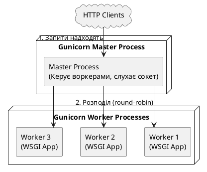
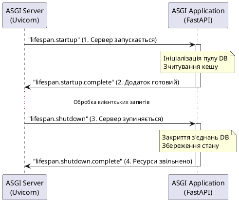
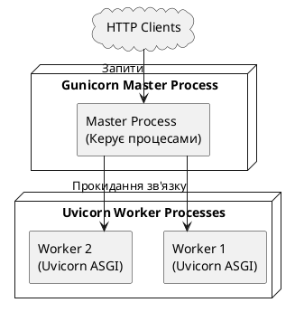
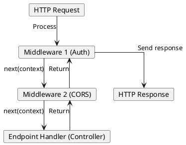
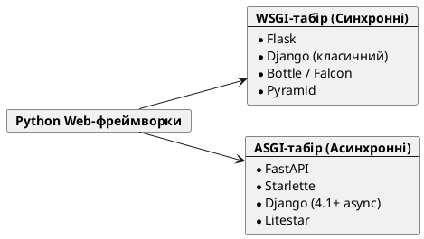

У світі розробки на ASP.NET Core ви зазвичай не задумуєтесь про інтерфейс між сервером і додатком. Вебсервер **Kestrel** є частиною платформи .NET, і конвеєр обробки запитів (Middleware Pipeline) інтегрований безпосередньо у ваш застосунок. У Python-екосистемі розробка розвивалася іншим шляхом: тут існує чітке розділення між **вебсервером** (який приймає TCP-з'єднання, парсить HTTP-запити) та **вебфреймворком** (який реалізує бізнес-логіку та роутинг).

Цей міст між сервером та додатком описується двома специфікаціями: **WSGI** (для синхронного коду) та **ASGI** (для асинхронного). Розуміння цих стандартів є критично важливим, оскільки саме на них базуються всі сучасні фреймворки, включаючи FastAPI та Django.

---

## Чому виникла потреба в інтерфейсах?

В епоху раннього вебу кожен Python-фреймворк (а їх було багато) писався під конкретний вебсервер або протокол обробки запитів: CGI, FastCGI, mod_python для Apache чи вбудовані сервери. Це створювало величезну проблему сумісності: якщо ви написали код на фреймворку `A`, ви могли запустити його лише на сервері `X`. Перейти на сервер `Y` означало переписати частину фреймворку.

Для вирішення цієї проблеми у 2003 році було створено специфікацію **PEP 333 (WSGI)**. Ідея була простою: створити універсальний шар абстракції (інтерфейс), який гарантує сумісність будь-якого вебсервера з будь-яким фреймворком, якщо вони обидва дотримуються цього стандарту.

---

## WSGI (Web Server Gateway Interface)

**WSGI** (визначається у **PEP 3333** для Python 3) — це синхронний стандарт інтерфейсу між вебсервером та Python-додатком. 

У WSGI архітектура запиту є лінійною та послідовною. Коли надходить HTTP-запит, сервер викликає Python-функцію (додаток), передає їй дані запиту, чекає, поки функція виконається, і повертає згенеровану відповідь клієнту.

### Анатомія WSGI-додатка

Згідно зі специфікацією, WSGI-додаток — це звичайний Python-об'єкт, що може бути викликаний (callable: функція або клас із методом `__call__`), який приймає рівно два аргументи:

1. **`environ`** (`dict`): словник, який містить усі CGI-змінні оточення, HTTP-заголовки запиту, шлях URL, метод (GET/POST) та потік вхідних даних (для зчитування тіла запиту `wsgi.input`).
2. **`start_response`** (`Callable`): callback-функція, яку додаток має викликати першою, щоб передати серверу статус відповіді (наприклад, `"200 OK"`) та список HTTP-заголовків (кортежі `(ім'я, значення)`).

Додаток має повернути ітерований об'єкт (зазвичай список байтових рядків), який представляє тіло HTTP-відповіді.

#### Мінімальний сирий WSGI-додаток:

```python
from typing import Callable, Iterable

def simple_wsgi_app(environ: dict, start_response: Callable) -> Iterable[bytes]:
    # 1. Визначаємо HTTP-статус та заголовки
    status = "200 OK"
    response_headers = [
        ("Content-Type", "text/plain; charset=utf-8"),
        ("X-Powered-By", "Pure WSGI")
    ]
    
    # 2. Викликаємо callback-функцію, щоб почати HTTP-відповідь
    start_response(status, response_headers)
    
    # 3. Повертаємо тіло відповіді як ітерований набір байтів
    # Важливо: повертається саме ітерований об'єкт, оскільки сервер 
    # може відправляти дані частинами (streaming)
    return [b"Hello, World from pure WSGI!"]
```

### Вебсервери для WSGI: Gunicorn та Waitress

Для того щоб наш WSGI-додаток став доступним через мережу, нам потрібен WSGI-сервер. Два найбільш популярні рішення в Python-екосистемі:

1. **Gunicorn (Green Unicorn)**:
   * **Що це:** Високопродуктивний WSGI HTTP-сервер, портований з Ruby-проєкту Unicorn. Він використовує модель pre-fork (Master-Worker процеси).
   * **Чому використовується:** Є стандартом де-факто для запуску Django та Flask застосунків у Docker-контейнерах на Linux-серверах у продакшені. Він швидкий, споживає мало ресурсів та чудово справляється з керуванням процесами.
   * **Особливість:** Працює **тільки** на Unix-подібних операційних системах (Linux, macOS, BSD). На Windows запустити його без WSL (Windows Subsystem for Linux) неможливо.

2. **Waitress**:
   * **Що це:** Чисто Python-реалізація продуктивного WSGI-сервера від розробників фреймворку Pyramid.
   * **Чому використовується:** Створений як повністю кросплатформове рішення. Він стабільно працює на Windows, macOS та Linux, не має зовнішніх залежностей (окрім стандартної бібліотеки Python) та чудово підходить як для локальної розробки на будь-якій системі, так і для легковагових deployments.
   * **Особливість:** Працює дещо повільніше за Gunicorn через інтерпретацію Python, проте забезпечує повну кросплатформовість «із коробки».

Для запуску нашого додатка через ці сервери скористайтеся інструкціями нижче:

::tabs
::tabs-item{label="pip"}
```bash
# 1. Створюємо та активуємо віртуальне середовище
python -m venv .venv
source .venv/bin/activate

# 2. Встановлюємо сервери
pip install gunicorn waitress

# 3. Варіант А: Запуск через Gunicorn (тільки для macOS / Linux)
# Формат: gunicorn <назва_файлу>:<назва_функції> --bind <host>:<port>
gunicorn main:simple_wsgi_app --bind 127.0.0.1:8000

# 4. Варіант Б: Запуск через Waitress (кросплатформово, зокрема Windows)
# Формат: waitress-serve --host=<host> --port=<port> <назва_файлу>:<назва_функції>
waitress-serve --host=127.0.0.1 --port=8000 main:simple_wsgi_app
```
::
::tabs-item{label="uv"}
```bash
# Варіант А: Швидкий запуск через Gunicorn (тільки для macOS / Linux)
uv run --with gunicorn gunicorn main:simple_wsgi_app --bind 127.0.0.1:8000

# Варіант Б: Кросплатформовий запуск через Waitress (Windows / macOS / Linux)
uv run --with waitress waitress-serve --host=127.0.0.1 --port=8000 main:simple_wsgi_app
```
::
::tabs-item{label="poetry"}
```bash
# 1. Ініціалізуємо проєкт та додаємо сервери як залежності
poetry init -n
poetry add gunicorn waitress

# 2. Варіант А: Запуск через Gunicorn (тільки для macOS / Linux)
poetry run gunicorn main:simple_wsgi_app --bind 127.0.0.1:8000

# 3. Варіант Б: Запуск через Waitress (Windows / macOS / Linux)
poetry run waitress-serve --host=127.0.0.1 --port=8000 main:simple_wsgi_app
```
::
::


---

### Як працює WSGI-сервер (Gunicorn / Waitress) під капотом?

Помилкою багатьох початківців є запуск WSGI-додатка безпосередньо в середовищі розробки без розуміння ролі вебсервера. 

Коли ви запускаєте додаток через **Gunicorn** (production-grade сервер для Unix-систем), він розгортає класичну модель **Master-Worker (процеси)**:

::plant-uml



::

1. **Master-процес** не обробляє запити безпосередньо. Його завдання — створити (fork) пул дочірніх процесів-воркерів (Worker Processes), стежити за їхнім здоров'ям (health check) та перезапускати їх у разі падіння.
2. **Worker-процеси** містять у своїй оперативній пам'яті завантажений код вашого Python-додатка. Кожен воркер крутить безкінечний цикл, приймає вхідне з'єднання на сокеті, викликає ваш `simple_wsgi_app(environ, start_response)`, отримує результат і записує його назад у сокет.

Кількість воркерів зазвичай вираховується за формулою: `(2 * CPU_cores) + 1`. Це дозволяє утилізувати всі ядра процесора, оскільки Python через GIL не може ефективно паралелити потоки в одному процесі.

---

### Обмеження WSGI: Чому він не підтримує Async?

WSGI — це виключно **синхронний специфікаційний стандарт**, розроблений у часи, коли асинхронне програмування в Python ще не було стандартизоване (задовго до появи `asyncio` у Python 3.4).

Блокуюча природа WSGI проявляється в трьох речах:

1. **Синхронний виклик:** Функція `application` є звичайною синхронною функцією. Сервер викликає її і очікує негайного повернення результату (або генератора). Немає жодного способу всередині WSGI сказати: *"Я чекаю на відповідь від бази даних, переключись на інший запит"*.
2. **Блокуючий ввід/вивід (I/O):** Зчитування тіла запиту відбувається через `environ['wsgi.input'].read()`. Це блокуюча операція читання з сокету. Якщо клієнт повільно завантажує файл, весь процес-воркер блокується і не може обслуговувати інші запити.
3. **Один запит — один потік/процес:** Оскільки воркер є синхронним, він може обробляти рівно один запит в один момент часу. Якщо у вас 4 воркери, і на сервер прийшло 5 одночасних запитів, п'ятий буде чекати в черзі TCP-сокета, поки один із воркерів не звільниться.

Для вирішення проблеми повільного I/O (наприклад, коли клієнти мають повільне з'єднання) перед WSGI-сервером обов'язково ставлять зворотний проксі-сервер на кшталт **Nginx**. Nginx буферизує вхідний запит у себе в пам'яті і віддає його Gunicorn-воркеру лише тоді, коли той повністю завантажився, захищаючи воркери від зависання.

---

### Порівняння архітектур: WSGI ↔ .NET Kestrel

Для .NET розробника синхронна модель WSGI може виглядати як крок назад. Порівняємо, як вирішується конкурентність в обох світах:

| Характеристика | WSGI (Python) | Kestrel (.NET Core) |
| :--- | :--- | :--- |
| **Парадигма виконання** | Синхронна, блокуюча | Асинхронна, неблокуюча (`async/await`) |
| **Паралелізм** | **Multi-process**: Кожен запит обробляється окремим процесом-воркером (через GIL) | **Multi-threading**: Thread Pool з асинхронним перемиканням на рівні CLR |
| **Ефективність I/O** | Низька: тривалі I/O операції (запити до сторонніх API, DB) блокують весь процес | Висока: асинхронні виклики звільняють потік назад у Thread Pool |
| **WebSocket / Real-time** | Практично неможливо (одне WebSocket з'єднання назавжди заблокує процес-воркер) | Нативна підтримка (SignalR використовує асинхронні сокети без блокування потоків) |

У C# запуск довгого завдання (наприклад, запит до зовнішнього сервісу через `await httpClient.GetAsync()`) звільняє системний потік для обробки інших HTTP-запитів. У WSGI аналогічний виклик (наприклад, `requests.get()`) змушує процес-воркер просто висіти і чекати відповіді, повністю блокуючи обслуговування інших клієнтів.

---

## ASGI (Asynchronous Server Gateway Interface)

Зі зростанням популярності асинхронного програмування у Python та виникненням потреби у підтримці сучасних real-time технологій (WebSockets, Server-Sent Events, тривалі HTTP-з'єднання), специфікація WSGI стала вузьким місцем. 

У 2016 році команда розробників Django (на чолі з Andrew Godwin) розробила нову специфікацію — **ASGI**.

**ASGI** — це духовний спадкоємець WSGI, розроблений для підтримки як асинхронних, так і синхронних додатків, що дозволяє обробляти тисячі паралельних з'єднань в межах одного процесу.

### Анатомія ASGI-додатка

ASGI-додаток є асинхронною функцією (або об'єктом з асинхронним методом `__call__`), яка приймає рівно три параметри:

1. **`scope`** (`dict`): словник, який містить всю метаінформацію про поточне з'єднання (протокол `'http'` або `'websocket'`, шлях URL, заголовки, IP-адресу клієнта). Це аналог `environ` у WSGI, але з життєвим циклом всього з'єднання.
2. **`receive`** (`Callable`): асинхронна функція (awaitable), за допомогою якої додаток може отримувати події від клієнта (наприклад, чергову частину тіла POST-запиту або нове повідомлення через WebSocket).
3. **`send`** (`Callable`): асинхронна функція (awaitable), за допомогою якої додаток надсилає відповідь клієнту у вигляді потоку подій (наприклад, заголовки відповіді, частини тіла або WebSocket-повідомлення).

#### Мінімальний сирий ASGI-додаток:

```python
from typing import Callable, Awaitable

async def simple_asgi_app(
    scope: dict, 
    receive: Callable[[], Awaitable[dict]], 
    send: Callable[[dict], Awaitable[None]]
) -> None:
    # 1. ASGI підтримує не лише HTTP, тому спочатку перевіряємо тип протоколу
    if scope["type"] != "http":
        # Якщо тип не http (наприклад, lifespan подія), ігноруємо або обробляємо інакше
        return

    # 2. Очікуємо на вхідну подію від клієнта (наприклад, що запит повністю прийшов)
    # Для GET-запитів це формальність, але для POST-запитів receive дозволяє
    # зчитувати тіло запиту частинами без блокування всього процесу
    event = await receive()
    
    # 3. Відправляємо HTTP-заголовки
    await send({
        "type": "http.response.start",
        "status": 200,
        "headers": [
            (b"content-type", b"text/plain; charset=utf-8"),
            (b"x-powered-by", b"Pure ASGI")
        ]
    })
    
    # 4. Відправляємо тіло відповіді
    await send({
        "type": "http.response.body",
        "body": b"Hello, World from pure ASGI!",
        "more_body": False # Вказуємо, що це фінальна частина тіла відповіді
    })
```

---

### Анатомія подій ASGI HTTP: від запитів до відповідей

Оскільки ASGI є асинхронним подійно-орієнтованим шлюзом, вся передача даних між сервером (наприклад, Uvicorn) та вашим додатком відбувається у вигляді потоку повідомлень (events). Кожна подія є звичайним Python-словником (`dict`) зі строго визначеною структурою.

Для роботи з HTTP-протоколом специфікація ASGI визначає наступні типи подій:

#### 1. Вхідні події (приймаються від сервера через `receive()`)

Коли клієнт робить запит, сервер надсилає додатку події типу `http.request` (та `http.disconnect`, якщо клієнт розірвав з'єднання до завершення запиту).

##### Подія `http.request`

::field-group

::field{name="type" type="Literal['http.request']"}
Унікальний маркер події, за яким додаток визначає її призначення.
::

::field{name="body" type="bytes"}
Частина тіла HTTP-запиту у вигляді сирих байтів.
::

::field{name="more_body" type="bool" default="False"}
Прапорець пакетного завантаження. Якщо клієнт завантажує великий файл або надсилає запит частинами (chunked), це значення дорівнює `True`. Додаток має викликати `receive()` у циклі, доки не отримає подію з `more_body=False`. Це запобігає забиванню оперативної пам'яті сервера гігантськими файлами.
::

::

---

#### 2. Вихідні події (відправляються серверу через `send()`)

Для відповіді клієнту додаток має виконати строгу послідовність дій: спочатку ініціювати відповідь подією `http.response.start`, а потім надіслати контент подією `http.response.body`.

##### Подія `http.response.start`

Ця подія має бути відправлена першою. Вона описує HTTP-метадані відповіді.

::field-group

::field{name="type" type="Literal['http.response.start']"}
Маркер початку HTTP-відповіді.
::

::field{name="status" type="int"}
HTTP-статус код відповіді (наприклад, `200` для успіху, `404` для відсутності ресурсу, `500` для помилки сервера).
::

::field{name="headers" type="Iterable[tuple[bytes, bytes]]"}
Список HTTP-заголовків. Важливо: всі назви та значення заголовків мають бути передані як **сирі байти (`bytes`)**, наприклад, `(b"content-type", b"application/json")`. Це мінімізує оверхед на конвертацію рядків усередині ASGI-сервера.
::

::

##### Подія `http.response.body`

Ця подія передає безпосередньо контент (тіло відповіді) і може викликатися декілька разів, якщо ви використовуєте потокове передавання (streaming).

::field-group

::field{name="type" type="Literal['http.response.body']"}
Маркер передачі тіла відповіді.
::

::field{name="body" type="bytes"}
Сирі байти контенту, який буде надіслано клієнту (наприклад, JSON-рядок або HTML-розмітка, закодована через `.encode('utf-8')`).
::

::field{name="more_body" type="bool" default="False"}
Прапорець продовження. Якщо встановлено `True`, сервер розуміє, що додаток ще буде надсилати байти відповіді, і тримає з'єднання відкритим. Якщо `False` — сервер завершує відправку HTTP-пакету і закриває з'єднання з клієнтом (або повертає його до пулу keep-alive).
::

::

---

### Вебсервери для ASGI: Uvicorn, Hypercorn, Daphne

Для роботи з асинхронним стандартом ASGI потрібні спеціальні вебсервери. Оскільки ASGI підтримує не тільки HTTP, але й постійні з'єднання (WebSockets), ці сервери побудовані на базі асинхронних бібліотек:

1. **Uvicorn**:
   * **Що це:** Надшвидкий ASGI-сервер, побудований на базі `uvloop` та `httptools`.
   * **Чому використовується:** Є золотим стандартом розробки на FastAPI. Щоб зрозуміти, чому Uvicorn є настільки швидким, розберемо його внутрішній стек:
     * **Стандартний Event Loop проти `uvloop`**: У стандартній бібліотеці Python модуль `asyncio` керує чергою асинхронних завдань за допомогою циклу подій (Event Loop), написаного на чистому Python. Через інтерпретацію коду віртуальною машиною Python, цей цикл має помітний оверхед. `uvloop` — це повноцінна заміна стандартного циклу подій, написана на **Cython** (модифікація Python, яка транслюється безпосередньо у високооптимізований C-код).
     * **Роль `libuv`**: Під капотом `uvloop` обгортає системну C-бібліотеку **`libuv`** — ту саму низькорівневу платформу, яка забезпечує асинхронну роботу Node.js. Вона працює безпосередньо з викликами ядра операційної системи (`epoll` на Linux, `kqueue` на macOS/BSD) для неблокуючого мережевого вводу-виводу (I/O multiplexing). Завдяки перенесенню всього життєвого циклу подій у compiled C-код, асинхронні операції в Python починають працювати у 2-4 рази швидше, наближаючись до швидкості Node.js чи Go.
     * **Прискорення парсингу з `httptools`**: Парсинг сирого текстового HTTP-запиту (читання заголовків, параметрів, методів) — це обчислювально важка операція (CPU-bound). Якщо писати парсер на чистому Python, це створює вузьке місце для мережевої продуктивності. Uvicorn використовує бібліотеку `httptools`, яка є тонкою Python-обгорткою над офіційним C-парсером з вебсервера Node.js.
     Таким чином, у зв'язці `Uvicorn + uvloop + httptools` практично всі низькорівневі мережеві операції, керування потоками та парсинг HTTP відбуваються у скомпільованому машинного коді (C/Cython), а ваш Python-код виконує винятково високорівневу бізнес-логіку.

   
2. **Hypercorn**:
   * **Що це:** Кросплатформовий ASGI-сервер, розроблений авторами фреймворку Quart.
   * **Чому використовується:** Він підтримує новітні версії протоколів — HTTP/2 та HTTP/3 (через QUIC) «із коробки», чого наразі не вміє Uvicorn. Також він підтримує не лише бібліотеку `asyncio`, але й альтернативний асинхронний рушій `trio`.

3. **Daphne**:
   * **Що це:** ASGI-сервер, розроблений спеціально для екосистеми Django Channels.
   * **Чому використовується:** Це перший в історії ASGI-сервер. Він адаптований під обробку великої кількості тривалих з'єднань (WebSockets) у Django-проєктах. Сьогодні він поступається Uvicorn у чистій швидкості HTTP, але залишається надійним вибором для Django.

---

Для запуску нашого додатка через ці сервери скористайтеся інструкціями нижче:

::tabs
::tabs-item{label="pip"}
```bash
# 1. Створюємо та активуємо віртуальне середовище
python -m venv .venv
source .venv/bin/activate

# 2. Встановлюємо сервери
pip install uvicorn hypercorn

# 3. Варіант А: Запуск через Uvicorn (використовує uvloop для швидкості)
# Формат: uvicorn <назва_файлу>:<назва_функції> --host <host> --port <port> --reload
uvicorn main:simple_asgi_app --host 127.0.0.1 --port 8000 --reload

# 4. Варіант Б: Запуск через Hypercorn (з підтримкою HTTP/2 та HTTP/3)
# Формат: hypercorn <назва_файлу>:<назва_функції> --bind <host>:<port>
hypercorn main:simple_asgi_app --bind 127.0.0.1:8000
```
::
::tabs-item{label="uv"}
```bash
# Варіант А: Швидкий запуск через Uvicorn
uv run --with uvicorn uvicorn main:simple_asgi_app --host 127.0.0.1 --port 8000

# Варіант Б: Швидкий запуск через Hypercorn
uv run --with hypercorn hypercorn main:simple_asgi_app --bind 127.0.0.1:8000
```
::
::tabs-item{label="poetry"}
```bash
# 1. Ініціалізуємо проєкт та додаємо залежності
poetry init -n
poetry add uvicorn hypercorn

# 2. Варіант А: Запуск через Uvicorn
poetry run uvicorn main:simple_asgi_app --host 127.0.0.1 --port 8000

# 3. Варіант Б: Запуск через Hypercorn
poetry run hypercorn main:simple_asgi_app --bind 127.0.0.1:8000
```
::
::

---

### Три основні протоколи в ASGI

На відміну від WSGI, який знає тільки про «запит-відповідь» HTTP, специфікація ASGI стандартизує три типи життєвих циклів (протоколів):

1. **HTTP Protocol (`scope['type'] == 'http'`)**: стандартний життєвий цикл запит-відповідь. Обробляє класичні REST API запити.
2. **WebSocket Protocol (`scope['type'] == 'websocket'`)**: дозволяє тримати постійне двостороннє з'єднання. Оскільки `receive` та `send` є асинхронними функціями, вони можуть викликатися багаторазово під час одного з'єднання, дозволяючи додатку приймати та надсилати повідомлення в реальному часі без блокування серверних ресурсів.
3. **Lifespan Protocol (`scope['type'] == 'lifespan'`)**: спеціальний системний протокол ASGI, який повідомляє фреймворку, коли сервер стартує та зупиняється. Це дозволяє безпечно ініціалізувати підключення до баз даних, пули клієнтів (наприклад, Redis, HTTP-клієнти) при запуску додатку і коректно закривати їх при вимкненні сервера.

---

### Деталі подій WebSockets та Lifespan в ASGI

Щоб ви розуміли, наскільки гнучкою є специфікація ASGI, коротко розглянемо структуру подій для двох інших протоколів.

#### 1. Події протоколу WebSockets
На відміну від HTTP, де з'єднання відкривається і відразу закривається, WebSocket підтримує постійний двосторонній зв'язок.

* **Вхідні події (від сервера):**
  * `websocket.connect`: надходить, коли клієнт ініціює «рукостискання» (handshake). Додаток має перевірити авторизаційні куки чи заголовки у `scope`.
  * `websocket.receive`: надходить, коли клієнт надсилає повідомлення. Об'єкт події містить ключ `"bytes"` (для бінарних даних) або `"text"` (для JSON/рядків).
  * `websocket.disconnect`: сигналізує, що клієнт закрив вкладку або втратив зв'язок.
* **Вихідні події (від додатка):**
  * `websocket.accept`: відправляється сервером, щоб дозволити підключення.
  * `websocket.send`: відсилає дані клієнту (текст чи байти).
  * `websocket.close`: примусово обриває з'єднання зі сторони сервера.

#### 2. Події протоколу Lifespan (Керування життєвим циклом)
У .NET для запуску коду при старті сервера використовуютьсяHosted Services. В ASGI-світі для цього є події Lifespan:

::plant-uml



::

Це гарантує, що ваш додаток не почне приймати HTTP-запити до того, як успішно з'єднається з базою даних, і не впаде «брудно» під час оновлення коду на сервері.

---

### Гібридна архітектура у продакшені: Gunicorn + Uvicorn

Ми вже з'ясували, що Gunicorn — це чудовий менеджер процесів (Master-Worker), який працює тільки з синхронним WSGI, а Uvicorn — надшвидкий асинхронний ASGI-сервер, який, проте, не має розвиненої логіки керування пулом процесів (він може запускати воркери, але його логіка простіша).

У продакшені (production deployments) стандартною практикою є об'єднання обох інструментів у **гібридну схему**:

::plant-uml



::

Gunicorn запускається як **Master-процес**, який відповідає за моніторинг та перезапуск процесів, але як клас воркерів він використовує не стандартні синхронні воркери, а спеціальний клас **`UvicornWorker`** (що поставляється разом із Uvicorn).

Завдяки цьому кожен воркер є повноцінним екземпляром асинхронного Uvicorn-сервера, який крутить швидкий `uvloop` і не блокується на I/O, а Gunicorn забезпечує стабільність, плавний перезапуск коду без простоїв (Zero Downtime Reload) та збір логів.

#### Команда для запуску в продакшені:

```bash
gunicorn main:simple_asgi_app -w 4 -k uvicorn.workers.UvicornWorker --bind 127.0.0.1:8000
```

---


### Порівняння конвеєрів: ASGI ↔ ASP.NET Middleware Pipeline

В ASP.NET Core запит проходить крізь конвеєр (Pipeline) взаємопов'язаних Middleware-компонентів, кожен з яких може обробити об'єкт `HttpContext`, передати керування наступному делегату `RequestDelegate` або перервати обробку (short-circuiting):

::plant-uml



::

В ASGI концепція конвеєра реалізується дуже схоже — через **ASGI Middleware (обгортки)**. Оскільки ASGI-додаток є просто callable-об'єктом, кожне middleware є класом, який приймає інший ASGI-додаток (наступний у ланцюжку) та обгортає його виклик:

```python
class SimpleASGIMiddleware:
    def __init__(self, app):
        # Зберігаємо посилання на наступний додаток (next)
        self.app = app

    async def __call__(self, scope, receive, send):
        # 1. Логіка ДО виконання наступного кроку
        if scope["type"] == "http":
            print(f"Вхідний запит: {scope['method']} {scope['path']}")

        # 2. Передаємо керування далі по конвеєру
        await self.app(scope, receive, send)

        # 3. Логіка ПІСЛЯ виконання
        print("Запит успішно оброблено конвеєром")
```

#### Ключова відмінність від .NET:
В ASP.NET Core об'єкт `HttpContext` містить у собі весь запит та потік відповіді одночасно. 
В ASGI middleware працює як **перехоплювач потоку подій**. Він може перехоплювати функції `receive` та `send`, модифікуючи події «на льоту». Наприклад, щоб розпакувати GZIP-архів, ASGI-middleware перехоплює функцію `receive` і підміняє її власною функцією, яка зчитує стиснені байти, розпаковує їх і віддає наступному шару вже чистий текст.

---

## Екосистема Python Web-фреймворків: Карта

Завдяки існуванню чітких інтерфейсів (WSGI та ASGI), всі Python-фреймворки можна розділити на два великі табори:

::plant-uml



::

### WSGI-фреймворки (Синхронний світ)
1. **Flask**: Мікрофреймворк, створений у 2010 році. Забезпечує лише базову маршрутизацію запитів та шаблонізатор (Jinja2). Для решти функцій (робота з БД, валідація, авторизація) потребує сторонніх розширень (`Flask-SQLAlchemy`, `Flask-WTF`).
2. **Django**: Повноцінний «batteries-included» фреймворк. Містить власну ORM, адміністративну панель, систему міграцій, авторизацію та шаблони. Ідеально підходить для класичних монолітів, але його ORM і внутрішній конвеєр історично є чисто синхронними.
3. **Falcon / Bottle**: Спеціалізовані мінімалістичні фреймворки для написання легковагових REST API.

### ASGI-фреймворки (Асинхронний світ)
1. **Starlette**: Легковаговий інструментарій (toolkit) та фреймворк для побудови асинхронних ASGI-сервісів.
   * **Зв'язок із Uvicorn**: Важливо розуміти, що Starlette є лише програмним каркасом (додатком), який реалізує інтерфейс ASGI, і він не містить вбудованого вебсервера. Однак, Starlette та Uvicorn мають «спільне коріння»: обидва проєкти розроблені Томом Крісті (автором Django REST Framework) в межах організації Encode. Uvicorn створювався саме як вебсервер для запуску додатків на Starlette, тому вони утворюють ідеальну пару, де Uvicorn слугує вебсервером, а Starlette — програмним ядром додатка. Ви можете запустити додаток Starlette на будь-якому іншому ASGI-сервері (наприклад, Hypercorn), але Uvicorn залишається де-факто стандартом.
   * **Аналог в .NET**: Це аналог ядра `Microsoft.AspNetCore.Http` та Routing Middleware в ASP.NET Core. Starlette реалізує маршрутизацію, роботу з заголовками, куками, сесіями, WebSocket-з'єднаннями та обробку CORS, але не нав'язує жодних інструментів для валідації даних, роботи з формами чи базами даних.
2. **FastAPI**: Найбільш популярний асинхронний фреймворк для розробки API. Він не є низькорівневим ASGI-фреймворком сам по собі — це надбудова.
3. **Litestar**: Сучасний асинхронний фреймворк, конкурент FastAPI, що пропонує схожі можливості, але містить вбудовані сервіси DI, DTO-шар та підтримку каналів.

---

### Формула FastAPI: `FastAPI = Starlette + Pydantic + OpenAPI`

Багато новачків вважають FastAPI монолітним фреймворком. Насправді його архітектура є чудовим прикладом модульності (композиції). Автор FastAPI (Sebastián Ramírez) не створював роутинг чи валідацію з нуля — він об'єднав найкращі інструменти екосистеми:
::math-formula
\text{FastAPI} = \text{Starlette (ASGI Engine)} + \text{Pydantic (Validation)} + \text{OpenAPI (Documentation)}
::

* **Starlette (ASGI Engine)** відповідає за всю веб-частину. Насправді, клас `FastAPI` напряму успадковується від класу `Starlette` (`class FastAPI(Starlette)`). Це означає, що будь-який додаток FastAPI під капотом є повноцінним додатком Starlette. Коли ви реєструєте ендпоінт через `@app.get("/items")`, FastAPI викликає метод додавання маршруту Starlette. Starlette бере на себе:
  * Обробку HTTP-запитів та формування відповідей (`Request` / `Response`).
  * Маршрутизацію (Routing) запитів до відповідних функцій.
  * Роботу з асинхронними WebSocket-з'єднаннями.
  * Систему Middleware (додавання заголовків, стиснення Gzip, CORS).
  * Фонове виконання завдань після повернення відповіді (`BackgroundTasks`).
* **Pydantic** відповідає за типізацію та дані: парсинг вхідних JSON-запитів, приведення типів (наприклад, рядок `"10"` у число `10`) та валідацію вхідних/вихідних полів.
* **OpenAPI (через Swagger UI / Redoc / Scalar)**: FastAPI аналізує Pydantic-моделі та анотації типів функцій-обробників і автоматично генерує стандартизовану JSON-схему OpenAPI. Далі ця схема віддається вбудованим HTML-документаторам.

Завдяки цьому FastAPI фокусується лише на інтеграції: він бере вхідний ASGI-запит від Starlette, валідує його через Pydantic, виконує ваш обробник, валідує вихідні дані через Pydantic response-модель і відправляє ASGI-відповідь назад через Starlette.

---

## Практичний приклад: Ручний ASGI-маршрутизатор з асинхронним I/O

Для закріплення отриманих знань розберемо створення закінченого проєкту «від А до Я»: ми напишемо **сирий ASGI-додаток без використання фреймворків**, який реалізує:
1. Ручну маршрутизацію (Routing) на основі аналізу шляху URL (`scope["path"]`).
2. Неблокуючу обробку I/O-bound операцій за допомогою `asyncio.sleep` (імітація важкого запиту до бази даних).
3. Динамічне повернення HTML та JSON-відповідей.
4. Просте логування часу обробки запитів.

Проєкт матиме наступну структуру:

```
asgi_router/
└── main.py
```

---

### Крок 1: Створення коду застосунку (`main.py`)

Нам потрібно реалізувати три ендпоінти:
* `/` (Home) — повертає просту HTML-сторінку.
* `/api/tasks` (JSON API) — імітує асинхронну затримку в 0.5 секунд (наприклад, запит до БД) та повертає список завдань у форматі JSON.
* Будь-який інший шлях — повертає статус 404 (Not Found).

Створіть файл `main.py`:

```python
import json
import asyncio
import time
from typing import Callable, Awaitable

# 1. Асинхронні хендлери (обробники)
async def home_handler(send: Callable[[dict], Awaitable[None]]) -> None:
    # Відправляємо HTML-відповідь
    await send({
        "type": "http.response.start",
        "status": 200,
        "headers": [(b"content-type", b"text/html; charset=utf-8")]
    })
    
    html_content = """
    <html>
        <head><title>ASGI Home</title></head>
        <body>
            <h1>Welcome to Pure ASGI Web Server!</h1>
            <p>Go to <a href="/api/tasks">/api/tasks</a> to fetch JSON payload.</p>
        </body>
    </html>
    """
    await send({
        "type": "http.response.body",
        "body": html_content.encode("utf-8"),
        "more_body": False
    })

async def api_tasks_handler(send: Callable[[dict], Awaitable[None]]) -> None:
    # Імітуємо неблокуючу I/O операцію (наприклад, читання з Postgres)
    # Поки цей таск засинає, Uvicorn може обробляти інші паралельні HTTP-запити!
    await asyncio.sleep(0.5)
    
    tasks_data = [
        {"id": 1, "title": "Ознайомитися з WSGI", "completed": True},
        {"id": 2, "title": "Написати сирий ASGI-додаток", "completed": False},
        {"id": 3, "title": "Розібратися з uvloop та libuv", "completed": False}
    ]
    
    await send({
        "type": "http.response.start",
        "status": 200,
        "headers": [(b"content-type", b"application/json")]
    })
    
    await send({
        "type": "http.response.body",
        "body": json.dumps(tasks_data, ensure_ascii=False).encode("utf-8"),
        "more_body": False
    })

async def not_found_handler(send: Callable[[dict], Awaitable[None]]) -> None:
    await send({
        "type": "http.response.start",
        "status": 404,
        "headers": [(b"content-type", b"application/json")]
    })
    
    error_message = {"detail": "Resource not found"}
    await send({
        "type": "http.response.body",
        "body": json.dumps(error_message).encode("utf-8"),
        "more_body": False
    })

# 2. Головний ASGI-додаток (Callable)
async def app(
    scope: dict, 
    receive: Callable[[], Awaitable[dict]], 
    send: Callable[[dict], Awaitable[None]]
) -> None:
    # Обробляємо виключно HTTP-протокол
    if scope["type"] != "http":
        return

    path = scope["path"]
    method = scope["method"]
    start_time = time.time()

    # Простий роутер (routing)
    if path == "/" and method == "GET":
        await home_handler(send)
    elif path == "/api/tasks" and method == "GET":
        await api_tasks_handler(send)
    else:
        await not_found_handler(send)

    # Просте логування
    execution_time = (time.time() - start_time) * 1000
    print(f"INFO:  {method} {path} - Completed in {execution_time:.2f}ms")
```

---

### Крок 2: Встановлення залежностей та запуск

Створіть директорію проєкту та запустіть ASGI-сервер.

::tabs
::tabs-item{label="pip"}
```bash
# Створюємо директорію проєкту
mkdir -p asgi_router
cd asgi_router

# Налаштовуємо віртуальне середовище
python -m venv .venv
source .venv/bin/activate
pip install uvicorn

# Запускаємо сервер
uvicorn main:app --host 127.0.0.1 --port 8000 --reload
```
::
::tabs-item{label="uv"}
```bash
# Запуск через uv без ручного налаштування venv
uv run --with uvicorn uvicorn main:app --host 127.0.0.1 --port 8000
```
::
::tabs-item{label="poetry"}
```bash
# Ініціалізація та додавання залежностей
poetry init -n
poetry add uvicorn

# Запуск
poetry run uvicorn main:app --host 127.0.0.1 --port 8000
```
::
::

---

### Крок 3: Тестування та перевірка логів

Запустіть сервер і відкрийте у браузері або через `curl` адреси:
1. `http://127.0.0.1:8000/` — поверне HTML-сторінку.
2. `http://127.0.0.1:8000/api/tasks` — поверне JSON-список задач (обробка триватиме ~500ms).
3. `http://127.0.0.1:8000/invalid-url` — поверне помилку `{"detail": "Resource not found"}` зі статусом 404.

#### Консольні логи Uvicorn:
У терміналі ви побачите наступний вивід, що підтверджує успішну обробку та час виконання:

```text
INFO:     Started server process [12345]
INFO:     Waiting for application startup.
INFO:     ASGI 'lifespan' protocol appears to be supported.
INFO:     Application startup complete.
INFO:     Uvicorn running on http://127.0.0.1:8000 (Press CTRL+C to quit)

INFO:GET / - Completed in 0.12ms
INFO:127.0.0.1:54321 - "GET / HTTP/1.1" 200 OK

INFO:GET /api/tasks - Completed in 501.24ms
INFO:127.0.0.1:54321 - "GET /api/tasks HTTP/1.1" 200 OK

INFO:GET /invalid-url - Completed in 0.08ms
INFO:127.0.0.1:54321 - "GET /invalid-url HTTP/1.1" 404 Not Found
```

---

## Практичні завдання

Для закріплення матеріалу виконайте наступні завдання. Збережіть ваші рішення у окремі файли та перевірте правильність роботи.

### Завдання 1: Створення WSGI-додатка з Waitress (Базовий рівень)
Напишіть сирий WSGI-додаток, який повертає поточний час сервера у форматі JSON (наприклад: `{"server_time": "2026-06-27 19:19:00"}`). Запустіть його за допомогою кросплатформового сервера `waitress-serve` із командного рядка.

### Завдання 2: Розширення ASGI-роутера (Середній рівень)
Додайте до нашого практичного ASGI-роутера (`main.py`) новий POST-ендпоінт `/api/tasks/create`. Обробник має:
- Зчитати тіло запиту (JSON-рядок) за допомогою подій асинхронного колбеку `receive()`.
- Спарсити JSON і перевірити наявність ключа `"title"`.
- Якщо `"title"` порожній або відсутній, повернути статус 400 (Bad Request).
- Якщо все правильно, повернути статус 201 (Created) з копією доданого таска та його новим згенерованим `id`.

### Завдання 3: Порівняння продуктивності I/O-bound (Професійний рівень)
Напишіть тестовий скрипт на Python з використанням бібліотек `httpx` та `asyncio` (або за допомогою інструменту навантажувального тестування на кшталт `bombardier` / `wrk`).
1. Запустіть синхронний WSGI-додаток з одним воркером, який спить `0.5` секунд (через `time.sleep(0.5)`) перед поверненням відповіді.
2. Запустіть асинхронний ASGI-додаток з одним воркером, який спить `0.5` секунд (через `asyncio.sleep(0.5)`).
3. Зробіть 50 паралельних запитів до обох серверів та порівняйте час виконання. Зробіть висновки, чому ASGI впорається з цим завданням майже в 50 разів швидше за однакових умов.
