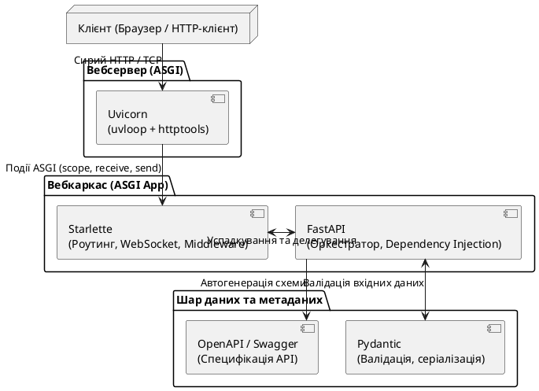
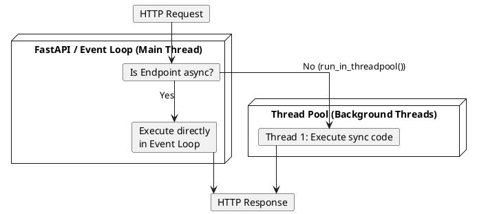

У попередніх статтях ми детально розібрали асинхронну екосистему Python, специфікації WSGI/ASGI та бібліотеку Pydantic. Тепер ми готові перейти до вивчення головного інструменту сучасного Python-вебу — фреймворку **FastAPI**.

Цей матеріал відкриває великий практичний блок, у якому ми не лише розглянемо теоретичні аспекти фреймворку, але й розробимо з нуля реальний продакшен-орієнтований застосунок для управління завданнями — **TaskForge**.

---

## Чому саме FastAPI?

Коли у 2018 році Себастьян Рамірес випустив першу версію FastAPI, ринок Python web-розробки вже був поділений між гігантами: **Django** (потужний моноліт з 2005 року) та **Flask** (гнучкий мікрофреймворк з 2010 року). Проте FastAPI зумів здійснити революцію і стати стандартом для написання високопродуктивних REST API.

Щоб зрозуміти його феномен, порівняємо основні вебфреймворки в екосистемі Python:

| Характеристика           | Django                                                                               | Flask                                                        | Litestar                                 | FastAPI                                                   |
| :----------------------- | :----------------------------------------------------------------------------------- | :----------------------------------------------------------- | :--------------------------------------- | :-------------------------------------------------------- |
| **Парадигма**            | Batteries-included моноліт                                                           | Гнучкий мікрофреймворк                                       | Сучасний асинхронний фреймворк           | Декларативний API-фреймворк                               |
| **Асинхронність (ASGI)** | Додана частково (в нових версіях ORM і в'юшки підтримують async, але ядро синхронне) | Лише через сторонні бібліотеки або костилі (синхронне ядро)  | Нативна, асинхронний event-driven дизайн | Нативна, асинхронна архітектура з повною підтримкою ASGI  |
| **Валідація даних**      | Власна система `Django Forms` (орієнтована на HTML-форми)                            | Відсутня «з коробки» (потребує `Marshmallow` або `Pydantic`) | Вбудована, через класи DTO та Pydantic   | Нативна, побудована на базі Pydantic-моделей              |
| **Автодокументація**     | Відсутня (потребує `drf-spectacular` для Django REST Framework)                      | Відсутня (потребує ручного опису OpenAPI схеми або плагінів) | Вбудована (Swagger / Scalar)             | Вбудована (нативна генерація Swagger UI, ReDoc, Scalar)   |
| **Швидкість обробки**    | Середня (велика кількість внутрішнього оверхеду та middleware)                       | Низька / Середня (синхронна блокуюча I/O модель)             | Дуже висока (порівнянна з FastAPI)       | Надзвичайно висока (завдяки Uvicorn, uvloop та Starlette) |
| **Dependency Injection** | Відсутній (використовуються глобальні імпорти, сервіс-локатори)                      | Відсутній                                                    | Вбудований, потужна DI-система           | Вбудована декларативна система `Depends`                  |

### Концептуальне порівняння: FastAPI ↔ ASP.NET Core Minimal API

Для розробника із досвідом в екосистемі .NET, ідеологія FastAPI є дуже близькою та зрозумілою. По суті, **FastAPI є концептуальним близнюком ASP.NET Core Minimal APIs**.

Обидва фреймворки побудовані навколо трьох головних принципів:

1. **Type-Driven розробка (Декларативність)**: Маршрути визначають типи даних, які вони очікують. В ASP.NET Core ви декларуєте типи параметрів у методі `MapPost`, і CLR автоматично біндить JSON-боді до C# об'єкта. У FastAPI ви робите те саме за допомогою анотацій типів Python та Pydantic-моделей.
2. **Автоматична кодогенерація метаданих**: В .NET підключення Swagger/OpenAPI відбувається через додавання сервісів (`builder.Services.AddOpenApi()`) та аналіз сигнатур методів. У FastAPI генерація OpenAPI JSON-схеми відбувається повністю автоматично «під капотом» шляхом інтроспекції сигнатур функцій.
3. **Мінімалістична структура**: Відсутність обов'язкової складної структури проєктів (як у класичному Django чи ASP.NET MVC з контролерами). Можна написати повноцінний API-сервер в одному файлі.

Приклад порівняння коду:

::code-group

```csharp [Minimal API (C#)]
// dotnet CLI setup
var builder = WebApplication.CreateBuilder(args);
var app = builder.Build();

app.MapGet("/api/greet/{name}", (string name) => new { Message = $"Hello, {name}!" });

app.Run();
```

```python [FastAPI (Python)]
from fastapi import FastAPI

app = FastAPI()

@app.get("/api/greet/{name}")
async def greet(name: str):
    return {"message": f"Hello, {name}!"}
```

::

Для запуску наведеного прикладу на FastAPI:

::tabs
::tabs-item{label="pip"}
```bash
# 1. Створюємо та активуємо віртуальне середовище
python -m venv .venv
source .venv/bin/activate

# 2. Встановлюємо FastAPI та Uvicorn
pip install fastapi uvicorn

# 3. Зберігаємо код у файл main.py та запускаємо сервер
# Формат: uvicorn <назва_файлу>:<назва_додатка> --reload
uvicorn main:app --reload
```
::
::tabs-item{label="uv"}
```bash
# uv автоматично завантажить залежності та запустить додаток в один рядок
uv run --with fastapi,uvicorn uvicorn main:app --reload
```
::
::tabs-item{label="poetry"}
```bash
# 1. Ініціалізуємо проєкт та додаємо залежності
poetry init -n
poetry add fastapi uvicorn

# 2. Запускаємо сервер
poetry run uvicorn main:app --reload
```
::
::

Головна відмінність криється в середовищі виконання: в .NET типізація є строгою на рівні компілятора та CLR, тоді як у Python типізація перевіряється в рантаймі силами Pydantic, оскільки сам Python є динамічно типізованим.

---

## Внутрішня архітектура FastAPI

Як ми вже з'ясували у статті про ASGI-екосистему, FastAPI не намагається побудувати весь стек вебтехнологій з нуля. Він використовує композицію трьох фундаментальних блоків.

Його архітектурний стек можна зобразити наступним чином:

::plant-uml



::

Кожен шар має свою чітку зону відповідальності:

1. **Uvicorn** — це ASGI-сервер. Його завдання — відкрити мережевий сокет, зчитати вхідні TCP-пакети, розпарсити їх як HTTP-запит за допомогою швидкого C-парсеру (`httptools`) та передати ASGI-додатку у вигляді словників подій.
2. **Starlette** — це базовий ASGI-вебфреймворк. Він реалізує маршрутизацію (визначає, яку функцію викликати для конкретного URL), роботу з HTTP-запитами, WebSockets, сесії та Middleware.
3. **FastAPI** — це високорівнева обгортка над Starlette. Він перехоплює процес обробки запитів, додаючи туди перевірку типів через **Pydantic**, ін'єкцію залежностей (Dependency Injection) через механізм `Depends` та автоматичну побудову специфікації **OpenAPI** на основі сигнатур функцій.

---

### Декоратори маршрутів: як FastAPI перетворює `@app.get` на ASGI-маршрути

Згадайте статтю про декоратори (Стаття 06). У FastAPI робота з маршрутами будується виключно навколо декораторів:

```python
@app.get("/items/{item_id}")
async def read_item(item_id: int):
    return {"item_id": item_id}
```

Багато новачків вважають, що декоратор `@app.get` перехоплює виконання функції при кожному HTTP-запиті. Насправді це не так. Декоратори маршрутів у FastAPI виконують **реєстраційну роль** виключно на етапі запуску програми (startup phase).

Коли інтерпретатор Python зчитує файл `main.py`, відбувається наступне:

1. Викликається метод `@app.get("/items/{item_id}")`. Це фабрика декораторів.
2. Цей метод приймає вашу функцію `read_item` і не змінює її внутрішню логіку (вона залишається звичайною функцією).
3. Замість цього FastAPI зчитує сигнатуру функції `read_item`, виявляє типи параметрів (що `item_id` має бути `int`), витягує очікувані Pydantic-моделі та реєструє цей шлях у внутрішньому роутері Starlette (`app.router.add_route(...)`).
4. Після завершення імпорту файлів декоратор більше ніколи не викликається в рантаймі. Коли надходить HTTP-запит, Starlette-роутер просто знаходить зареєстровану функцію у словнику маршрутів і викликає її напряму.

---

## Встановлення та структура проєкту

Для початку роботи з FastAPI нам потрібні сам фреймворк та асинхронний ASGI-сервер (зазвичай Uvicorn).

У сучасній екосистемі Python є два шляхи встановлення FastAPI:

1. **Мінімальний пакет** (`pip install fastapi`): Встановлює виключно ядро FastAPI та його обов'язкову залежність Pydantic. Усі супутні бібліотеки (на кшталт Uvicorn для запуску чи HTTPX для тестування) доведеться встановлювати вручную.
2. **Стандартний пакет** (`pip install "fastapi[standard]"`): Встановлює FastAPI разом із набором рекомендованих інструментів: Uvicorn, логер, `python-multipart` (для обробки форм/файлів), `jinja2` (для шаблонізації) та клієнт для тестування.

### Сучасне управління залежностями (uv / poetry)

Замість застарілого `requirements.txt`, сучасні Python-проєкти описують залежності у файлі `pyproject.toml` (згідно з PEP 621). Для цього використовують інструменти **Poetry** або надшвидкий менеджер **uv** від компанії Astral.

Приклад декларації залежностей у `pyproject.toml` для нашого майбутнього проєкту:

```toml
[project]
name = "taskforge"
version = "0.1.0"
description = "Production-grade task management system"
requires-python = ">=3.11"
dependencies = [
    "fastapi[standard]>=0.110.0",
]
```

### Рекомендована структура проєкту

Для малих та середніх API-серверів ми будемо використовувати модульну структуру, близьку до архітектури ASP.NET Core (де окремо виділені шари моделей, схем, маршрутів та бізнес-сервісів):

```text
taskforge/
├── pyproject.toml         # Конфігурація проєкту та залежностей
├── README.md              # Документація проєкту
├── app/                   # Основний модуль додатку
│   ├── __init__.py        # Робить директорію app пакетом Python
│   ├── main.py            # Точка входу: ініціалізація FastAPI та підключення роутерів
│   ├── config.py          # Налаштування (Pydantic Settings) та змінні оточення
│   ├── routers/           # Шар маршрутизації (аналог Controllers у .NET)
│   │   ├── __init__.py
│   │   ├── tasks.py
│   │   └── projects.py
│   ├── schemas/           # Pydantic-моделі для валідації (аналог DTO у .NET)
│   │   ├── __init__.py
│   │   └── tasks.py
│   ├── models/            # SQLAlchemy ORM моделі (аналог EF Core Entities у .NET)
│   │   ├── __init__.py
│   │   └── tasks.py
│   └── services/          # Бізнес-логіка (аналог Service Layer у .NET)
│       ├── __init__.py
│       └── tasks.py
```

Така декомпозиція дозволяє уникнути перетворення файлу `main.py` на тисячорядковий спагеті-код та спрощує паралельну розробку та покриття тестами.

---

## Перший додаток: Ініціалізація та запуск

Розглянемо класичний Hello World у FastAPI та розберемо кожну стрічку коду під мікроскопом.

```python
# main.py
from fastapi import FastAPI

# 1. Ініціалізація додатка
app = FastAPI(
    title="TaskForge API",
    description="Система управління завданнями",
    version="1.0.0"
)

# 2. Визначення ендпоінту
@app.get("/")
async def root():
    return {"message": "Welcome to TaskForge API!"}
```

### Що тут відбувається?

1. `app = FastAPI(...)`: Ми створюємо екземпляр класу `FastAPI`. Цей об'єкт є повноцінним ASGI-додатком. Uvicorn буде звертатися саме до змінної `app` для обробки мережевих подій. Параметри `title`, `description` та `version` використовуються виключно для автогенерації метаданих OpenAPI.
2. `@app.get("/")`: Ми використовуємо декоратор методу `GET` для реєстрації маршруту на URL `/`.
3. `async def root()`: Ми оголошуємо асинхронну функцію-обробник (handler / action).
4. `return {"message": ...}`: Ми повертаємо звичайний словник. У ASGI-додатках нам доводилося вручну кодувати дані у байти, відправляти заголовок `"content-type"` та викликати `send()`. FastAPI бере це на себе: він автоматично перетворює словник у JSON-рядок, додає заголовок `application/json` та створює правильну вихідну ASGI-чергу подій.

---

## Асинхронні (`async def`) проти синхронних (`def`) ендпоінтів

Однією з найбільш унікальних можливостей FastAPI є те, що він дозволяє визначати ендпоінти двома способами:

```python
# Асинхронний ендпоінт
@app.get("/async")
async def get_async_data():
    await asyncio.sleep(1) # Неблокуюче очікування
    return {"status": "async"}

# Синхронний ендпоінт
@app.get("/sync")
def get_sync_data():
    time.sleep(1) # Блокуюче очікування
    return {"status": "sync"}
```

Для .NET розробника написання синхронного методу контролера, який викликає блокуючий `Thread.Sleep()`, є антипаттерном (Thread Pool Starvation). Проте у FastAPI **синхронні ендпоінти працюють безпечно завдяки унікальному механізму обробки**.

### Як FastAPI обробляє `async def`

Коли ви оголошуєте ендпоінт як `async def`, FastAPI виконує його безпосередньо у **головному циклі подій (Event Loop)** на єдиному потоці.

- **Правило**: Ви повинні використовувати `async def` лише тоді, коли всередині функції ви викликаєте інші асинхронні операції (наприклад, асинхронні запити до БД через `await session.execute()` або HTTP-запити через `await httpx.get()`).
- **Небезпека**: Якщо всередині `async def` ви виконаєте синхронну блокуючу операцію (наприклад, `time.sleep(5)` чи синхронне зчитування великого файлу `open().read()`), ви **повністю заблокуєте головний Event Loop**. Жоден інший користувач не зможе отримати відповідь від сервера протягом цих 5 секунд, сервер просто «зависне».

### Як FastAPI обробляє синхронний `def` (Під капотом)

Якщо ви оголошуєте ендпоінт як звичайний `def`, FastAPI розуміє, що код може містити блокуючі операції (наприклад, стару синхронну ORM, виклики файлової системи чи обчислення).
Щоб не заблокувати головний Event Loop, FastAPI виконує цю функцію не в основному потоці, а **делегує її виконання у фоновий пул потоків (Thread Pool)** за допомогою бібліотеки `anyio` (функція `anyio.to_thread.run_sync`).

::plant-uml



::

### Коли що вибирати? (Золоте правило FastAPI)

- **Використовуйте `async def`**, якщо ваші бібліотеки (ORM, HTTP-клієнт, файловий менеджер) підтримують асинхронність (`async/await`). Це дає максимальну продуктивність і низьке споживання оперативної пам'яті.
- **Використовуйте звичайний `def`**, якщо ви використовуєте синхронні бібліотеки (наприклад, класичний клієнт `requests`, бібліотеку `pika` для RabbitMQ, або стару ORM без підтримки асинхронності). FastAPI сам подбає про те, щоб ці запити виконувалися у паралельних потоках і не ламали асинхронність сервера.

---

## Автоматична документація: OpenAPI та інтерактивний UI

Однією з найкрутіших «кіллер-фіч» FastAPI є повна автоматизація документації. Якщо в ASP.NET Core для додавання Swagger вам потрібно підключати сторонній пакет `Swashbuckle` (чи вбудований `Microsoft.AspNetCore.OpenApi` в .NET 9) та налаштовувати middleware:

```csharp
// ASP.NET Core (Swagger setup)
builder.Services.AddEndpointsApiExplorer();
builder.Services.AddSwaggerGen();
...
app.UseSwagger();
app.UseSwaggerUI();
```

То у FastAPI все це працює **із коробки без жодного рядка додаткового конфігурування**.

Коли ви запускаєте додаток FastAPI, сервер автоматично генерує та обслуговує три системні ендпоінти:

1. **`/openapi.json`**: Динамічно згенерований JSON-файл, що повністю відповідає офіційній специфікації **OpenAPI** (раніше відомої як Swagger). Він містить опис усіх маршрутів, очікуваних параметрів, типів даних, заголовків та відповідей.
2. **`/docs` (Swagger UI)**: Інтерактивна HTML-сторінка, яка зчитує `/openapi.json` та будує зручний інтерфейс для тестування вашого API прямо з браузера. Ви можете відправляти запити («Try it out»), валідувати JSON-боді та переглядати відповіді сервера.
3. **`/redoc` (ReDoc)**: Альтернативний клієнт для читання документації, орієнтований на великі трипанельні інтерфейси. Він чудово підходить для публічного API та великих специфікацій.

### Як це працює під капотом?

FastAPI використовує інтроспекцію (аналіз структури коду в рантаймі). Він зчитує:

- **Python Type Hints**: Наприклад, параметр `item_id: int` перетворюється в опис поля типу `integer` в OpenAPI.
- **Pydantic Models**: Класи моделей автоматично транслюються в OpenAPI JSON-схеми (Schemas) з відповідними правилами валідації (`minimum`, `pattern`, `required` тощо).
- **Docstrings (коментарі функцій)**: Текст всередині потрійних лапок вашої функції автоматично стає описом (description) відповідного ендпоінту у Swagger.

```python
@app.get("/items/{item_id}")
async def read_item(item_id: int):
    """
    Отримати конкретне завдання за його унікальним ідентифікатором.

    - **item_id**: Унікальний ID завдання в системі
    """
    return {"id": item_id}
```

У Swagger цей docstring буде відрендерено як красивий Markdown-опис для цього маршруту!

---

## Життєвий цикл додатка (Lifespan Events)

Досить часто у вебдодатках виникає потреба виконати певний код **до того, як сервер почне приймати вхідні запити** (наприклад, ініціалізувати пул підключень до PostgreSQL, зчитати конфігурацію або завантажити ML-модель у пам'ять), та виконати зачистку **після зупинки сервера** (закрити сокети, зберегти стан, вивільнити пам'ять).

В ASP.NET Core для цього використовуються фонові служби через інтерфейс `IHostedService` або події `IHostApplicationLifetime`.

У FastAPI для цього розроблено концепцію **Lifespan (життєвий цикл)**. Вона базується на стандартному Python-декораторі `@asynccontextmanager` з модуля `contextlib`.

### Приклад Lifespan-менеджера:

```python
from contextlib import asynccontextmanager
from fastapi import FastAPI

# 1. Створюємо асинхронний контекст-менеджер
@asynccontextmanager
async def lifespan(app: FastAPI):
    # Код ТУТ виконується ДО запуску сервера (Startup)
    print("Startup: Connecting to database pool...")
    db_connection = {"pool": "PostgreSQL Connected"} # Імітація підключення

    # Зберігаємо підключення у стані додатка (app.state),
    # щоб воно було доступне в обробниках запитів
    app.state.db = db_connection

    yield  # У цій точці сервер починає приймати HTTP-запити

    # Код ТУТ виконується ПІСЛЯ сигналу зупинки сервера (Shutdown)
    print("Shutdown: Closing database connection pool...")
    app.state.db.clear()

# 2. Передаємо lifespan при ініціалізації
app = FastAPI(lifespan=lifespan)

@app.get("/db-status")
async def get_db_status():
    # Доступ до збереженого стану через request.app.state
    return {"status": app.state.db["pool"]}
```

Це запобігає витоку ресурсів (resource leaks) та робить життєвий цикл максимально наочним.

::note
Детальніше практичне використання Lifespan для керування життєвим циклом пулу підключень до бази даних, клієнтів Redis та реалізації глобальних залежностей (Application-scoped dependencies) ми розберемо у **Статті 20 (Dependency Injection)** та **Статті 22 (SQLAlchemy)**.
::

---

## Практичний приклад: Експеримент продуктивності sync vs async та заміна сирого ASGI на FastAPI

Щоб наочно продемонструвати різницю між типами ендпоінтів та показати, як саме FastAPI полегшує життя порівняно з сирим ASGI, ми проведемо практичний експеримент.

Проєкт матиме наступну структуру:

```text
fastapi_demo/
├── main.py              # Основний код експерименту
└── run_client.py        # Клієнтський скрипт для надсилання паралельних запитів
```

---

### Крок 1: Створення сервера для експериментів (`main.py`)

Створіть файл `main.py`, у якому ми реалізуємо три різні стратегії очікування:

```python
import asyncio
import time
from fastapi import FastAPI

app = FastAPI(title="Concurrency Demo")

# Стратегія 1: Синхронний блокуючий ендпоінт.
# FastAPI має виконати його у Thread Pool.
@app.get("/sync-sleep")
def sync_sleep():
    start = time.time()
    time.sleep(1.0)  # Блокуємо потік на 1 секунду
    duration = time.time() - start
    return {"mode": "sync_sleep", "duration_seconds": round(duration, 2)}

# Стратегія 2: Асинхронний неблокуючий ендпоінт.
# Виконується безпосередньо в Event Loop.
@app.get("/async-sleep")
async def async_sleep():
    start = time.time()
    await asyncio.sleep(1.0)  # Асинхронне неблокуюче очікування
    duration = time.time() - start
    return {"mode": "async_sleep", "duration_seconds": round(duration, 2)}

# Стратегія 3: Асинхронний ендпоінт із помилкою блокування.
# Ми оголосили його як async, але всередині викликали БЛОКУЮЧИЙ time.sleep!
@app.get("/async-blocking-sleep")
async def async_blocking_sleep():
    start = time.time()
    time.sleep(1.0)  # КРИТИЧНО: Блокуємо єдиний потік Event Loop!
    duration = time.time() - start
    return {"mode": "async_blocking_sleep", "duration_seconds": round(duration, 2)}
```

---

### Крок 2: Створення тестового клієнта (`run_client.py`)

Для перевірки конкурентності нам потрібен скрипт, який надішле **5 паралельних HTTP-запитів** на кожен ендпоінт і виміряє загальний час обробки пакета запитів.

Створіть файл `run_client.py`:

```python
import asyncio
import time
import httpx

# Функція для відправки одного запиту
async def send_request(client: httpx.AsyncClient, url: str, request_id: int):
    start = time.time()
    try:
        response = await client.get(url, timeout=10.0)
        duration = time.time() - start
        print(f"Request {request_id}: Status {response.status_code} | Server duration: {response.json()['duration_seconds']}s | Client duration: {duration:.2f}s")
    except Exception as e:
        print(f"Request {request_id} failed: {e}")

# Запуск пачки з 5 паралельних запитів
async def test_endpoint(endpoint_name: str):
    url = f"http://127.0.0.1:8000/{endpoint_name}"
    print(f"\n--- Testing parallel requests to: /{endpoint_name} ---")

    start_batch = time.time()
    async with httpx.AsyncClient() as client:
        # Створюємо 5 паралельних завдань
        tasks = [send_request(client, url, i) for i in range(1, 6)]
        # Виконуємо їх одночасно
        await asyncio.gather(*tasks)

    total_duration = time.time() - start_batch
    print(f"TOTAL BATCH TIME: {total_duration:.2f} seconds")

async def main():
    # По черзі тестуємо наші 3 стратегії
    await test_endpoint("sync-sleep")
    await test_endpoint("async-sleep")
    await test_endpoint("async-blocking-sleep")

if __name__ == "__main__":
    asyncio.run(main())
```

---

### Крок 3: Запуск експерименту та аналіз результатів

Для запуску нам знадобляться два термінали. Спочатку підготуємо оточення та запустимо наш сервер:

::tabs
::tabs-item{label="pip"}

```bash
# Термінал 1: Встановлюємо FastAPI та HTTP-клієнт httpx
pip install "fastapi[standard]" httpx

# Запуск сервера
uvicorn main:app --host 127.0.0.1 --port 8000
```

::
::tabs-item{label="uv"}

```bash
# Термінал 1: Запуск сервера через uv
uv run --with fastapi,httpx uvicorn main:app --host 127.0.0.1 --port 8000
```

::
::tabs-item{label="poetry"}

```bash
# Термінал 1: Налаштування dependencies
poetry init -n
poetry add fastapi httpx uvicorn

# Запуск
poetry run uvicorn main:app --host 127.0.0.1 --port 8000
```

::
::

Тепер у другому терміналі запустимо наш тестовий клієнт:

```bash
# Термінал 2: Запуск клієнта
python run_client.py
```

#### Результати вимірювань у терміналі клієнта:

```text
--- Testing parallel requests to: /sync-sleep ---
Request 1: Status 200 | Server duration: 1.0s | Client duration: 1.02s
Request 2: Status 200 | Server duration: 1.0s | Client duration: 1.03s
Request 3: Status 200 | Server duration: 1.0s | Client duration: 1.03s
Request 4: Status 200 | Server duration: 1.0s | Client duration: 1.03s
Request 5: Status 200 | Server duration: 1.0s | Client duration: 1.04s
TOTAL BATCH TIME: 1.05 seconds

--- Testing parallel requests to: /async-sleep ---
Request 1: Status 200 | Server duration: 1.0s | Client duration: 1.01s
Request 2: Status 200 | Server duration: 1.0s | Client duration: 1.01s
Request 3: Status 200 | Status 200 | Server duration: 1.0s | Client duration: 1.01s
Request 4: Status 200 | Server duration: 1.0s | Client duration: 1.01s
Request 5: Status 200 | Server duration: 1.0s | Client duration: 1.01s
TOTAL BATCH TIME: 1.02 seconds

--- Testing parallel requests to: /async-blocking-sleep ---
Request 1: Status 200 | Server duration: 1.0s | Client duration: 1.01s
Request 2: Status 200 | Server duration: 1.0s | Client duration: 2.02s
Request 3: Status 200 | Server duration: 1.0s | Client duration: 3.03s
Request 4: Status 200 | Server duration: 1.0s | Client duration: 4.04s
Request 5: Status 200 | Server duration: 1.0s | Client duration: 5.04s
TOTAL BATCH TIME: 5.05 seconds
```

### Глибокий аналіз результатів:

1. **`/sync-sleep` (Загальний час: 1.05с)**: Хоча ми використали синхронний `time.sleep`, загальний час обробки всіх 5 запитів склав лише 1 секунду. Чому? Тому що FastAPI перехопив ці синхронні виклики та виконав кожен у власному фоновому потоці з пулу. Вони виконувалися паралельно.
2. **`/async-sleep` (Загальний час: 1.02с)**: Всі 5 запитів обробилися паралельно за 1 секунду на одному єдиному потоці. Коли перший запит дійшов до `await asyncio.sleep(1.0)`, він призупинив своє виконання і передав керування назад Event Loop. Event Loop миттєво почав виконувати другий, третій, четвертий та п'ятий запити. Це найбільш ефективний режим за споживанням ресурсів.
3. **`/async-blocking-sleep` (Загальний час: 5.05с)**: **Катастрофічний сценарій**. Ми обманули FastAPI, написавши `async def`, але всередині використали блокуючий `time.sleep()`. Через це перший запит повністю заблокував єдиний потік Event Loop. Другий запит не міг навіть почати обробку, поки перший не закінчився. Запити вибудувалися в чергу і виконувалися строго послідовно. Загальний час склав 5 секунд.
::caution
**Ніколи не викликайте синхронний блокуючий код всередині `async def` функцій**. Якщо бібліотека, яку ви використовуєте, не підтримує `await`, ви **зобов'язані** оголошувати ендпоінт як звичайний `def`.
::

---

### Порівняння: Код на чистому ASGI проти FastAPI

Щоб ви оцінили рівень абстракції, який надає FastAPI, порівняємо, як виглядає обробка JSON-запиту з валідацією на чистому ASGI (з попередньої статті) та на FastAPI.

Завдання: розпарсити вхідний JSON, що містить поля `title` (рядок) та `priority` (число), перевірити їх типи і повернути відповідь із кодом 201.

::code-group

```python [Чистий ASGI ( main.py )]
import json

async def app(scope, receive, send):
    if scope["type"] == "http" and scope["path"] == "/tasks" and scope["method"] == "POST":
        # 1. Зчитуємо тіло запиту частинами
        body = b""
        more_body = True
        while more_body:
            message = await receive()
            body += message.get("body", b"")
            more_body = message.get("more_body", False)

        # 2. Декодуємо та парсимо JSON
        try:
            data = json.loads(body.decode("utf-8"))
        except json.JSONDecodeError:
            await send_error(send, 400, "Invalid JSON")
            return

        # 3. Валідація типів вручну
        title = data.get("title")
        priority = data.get("priority")
        if not isinstance(title, str) or not isinstance(priority, int):
            await send_error(send, 422, "Validation error")
            return

        # 4. Формуємо успішну відповідь
        response_data = {"status": "created", "title": title, "priority": priority}
        await send({
            "type": "http.response.start",
            "status": 201,
            "headers": [(b"content-type", b"application/json")]
        })
        await send({
            "type": "http.response.body",
            "body": json.dumps(response_data).encode("utf-8"),
            "more_body": False
        })

async def send_error(send, status, message):
    await send({
        "type": "http.response.start",
        "status": status,
        "headers": [(b"content-type", b"application/json")]
    })
    await send({
        "type": "http.response.body",
        "body": json.dumps({"error": message}).encode("utf-8"),
        "more_body": False
    })
```

```python [FastAPI ( main.py )]
from fastapi import FastAPI, status
from pydantic import BaseModel

app = FastAPI()

# 1. Декларуємо очікувану схему
class TaskSchema(BaseModel):
    title: str
    priority: int

# 2. Обробник запиту з автоматичним біндингом
@app.post("/tasks", status_code=status.HTTP_201_CREATED)
async def create_task(task: TaskSchema):
    # Тіло запиту вже зчитано, перевірено та конвертовано у об'єкт task!
    return {"status": "created", "title": task.title, "priority": task.priority}
```

::

Як бачимо, FastAPI скорочує обсяг кодової бази у 5 разів, повністю позбавляючи розробника низькорівневої рутини зчитування байтів, обробки винятків декодування та ручної перевірки типів.

---

## Практична частина: Ініціалізація проєкту TaskForge

Тепер перейдемо до створення нашого головного навчального проєкту — **TaskForge**. Це буде сучасна система управління завданнями та проєктами, яку ми будемо розбудовувати з кожною наступною статтею (додаючи роутинг, валідацію, роботу з БД, міграції, авторизацію та тести).

Виконаємо кроки з ініціалізації проєкту.

### Крок 1: Створення структури папок

Створіть кореневу директорію проєкту та базову структуру каталогів у вашій робочій області:

```bash
mkdir -p taskforge/app/routers taskforge/app/schemas taskforge/app/models taskforge/app/services
touch taskforge/app/__init__.py
touch taskforge/app/routers/__init__.py
touch taskforge/app/schemas/__init__.py
touch taskforge/app/models/__init__.py
touch taskforge/app/services/__init__.py
```

### Крок 2: Створення файлу `pyproject.toml`

У корені директорії `taskforge/` створіть конфігураційний файл `pyproject.toml`, який описує залежності нашого проєкту:

```toml
[project]
name = "taskforge"
version = "0.1.0"
description = "Production-grade task management system"
readme = "README.md"
requires-python = ">=3.11"
dependencies = [
    "fastapi[standard]>=0.115.0",
]

[build-system]
requires = ["hatchling"]
build-backend = "hatchling.build"
```

---

### Крок 3: Встановлення залежностей

Залежно від вашого улюбленого менеджера пакетів, виконайте команди для ініціалізації віртуального середовища та встановлення FastAPI standard:

::tabs
::tabs-item{label="pip"}

```bash
cd taskforge

# Створюємо та активуємо venv
python -m venv .venv
source .venv/bin/activate

# Встановлюємо залежності з нашого pyproject.toml
pip install --upgrade pip
pip install -e .
```

::
::tabs-item{label="uv"}

```bash
cd taskforge

# uv автоматично створить venv та встановить залежності при першому запуску
uv sync
```

::
::tabs-item{label="poetry"}

```bash
cd taskforge

# Поезія сама зчитає pyproject.toml та створить оточення
poetry install
```

::
::

---

### Крок 4: Створення точки входу `app/main.py`

Створіть файл `taskforge/app/main.py` та ініціалізуйте базовий додаток із логуванням життєвого циклу (Lifespan):

```python
import logging
from contextlib import asynccontextmanager
from fastapi import FastAPI

# Налаштовуємо логування
logging.basicConfig(level=logging.INFO)
logger = logging.getLogger("taskforge")

@asynccontextmanager
async def lifespan(app: FastAPI):
    # Код ініціалізації ресурсів
    logger.info("Initializing TaskForge resources (Database pools, Cache)...")
    yield
    # Код очищення ресурсів
    logger.info("Releasing TaskForge resources...")

app = FastAPI(
    title="TaskForge API",
    description="Система управління проєктами та завданнями",
    version="0.1.0",
    lifespan=lifespan
)

@app.get("/")
async def root():
    return {
        "status": "ok",
        "project": "TaskForge",
        "version": "0.1.0"
    }
```

---

### Крок 5: Перший запуск та перевірка

Запустіть додаток через Uvicorn:

::tabs
::tabs-item{label="pip"}

```bash
# Переконайтеся, що віртуальне середовище активоване
uvicorn app.main:app --host 127.0.0.1 --port 8000 --reload
```

::
::tabs-item{label="uv"}

```bash
# Запуск через uv
uv run uvicorn app.main:app --host 127.0.0.1 --port 8000 --reload
```

::
::tabs-item{label="poetry"}

```bash
# Запуск через poetry
poetry run uvicorn app.main:app --host 127.0.0.1 --port 8000 --reload
```

::
::

Відкрийте у браузері адреси:

- `http://127.0.0.1:8000/` — має повернути JSON: `{"status": "ok", "project": "TaskForge", "version": "0.1.0"}`.
- `http://127.0.0.1:8000/docs` — відкриє сторінку Swagger UI, де ви побачите наш Hello World ендпоінт.

Збережіть поточний стан проєкту у Git:

```bash
git add .
git commit -m "feat: init TaskForge project with FastAPI and uvicorn"
```

---

## Практичні завдання

Виконайте завдання для закріплення навичок роботи з FastAPI.

### Завдання 1: Додавання базових ендпоінтів (Базовий рівень)

Додайте у файл `app/main.py` наступні маршрути та перевірте їх роботу через Swagger UI:

1. `GET /api/health` — повертає `{"status": "healthy", "database": "connected"}`.
2. `POST /api/echo` — приймає довільний JSON-документ і повертає його назад клієнту.
3. `DELETE /api/cleanup` — повертає повідомлення про те, що тимчасові файли очищено.

### Завдання 2: Тестування та порівняльний аналіз (Середній рівень)

Скопіюйте коди файлів `main.py` та `run_client.py` з нашого практичного експерименту з порівнянням швидкості `sync` та `async`.

1. Збільшіть кількість паралельних запитів у клієнті з 5 до 30.
2. Проведіть вимірювання часу.
3. Опишіть у письмовому звіті, чому `/sync-sleep` не масштабується нескінченно (підказка: яка стандартна ємність фонового Thread Pool в `anyio`?) та чому `/async-blocking-sleep` повністю паралізує сервер навіть при великій кількості клієнтів.

### Завдання 3: Створення custom middleware для вимірювання часу (Професійний рівень)

Специфікація ASGI дозволяє перехоплювати події. Напишіть простий middleware для FastAPI, який обчислює точний час обробки кожного запиту сервером.

- Використовуйте декоратор `@app.middleware("http")` (більш детально ми розберемо його у статті 21, але спробуйте нагуглити простий приклад).
- Запишіть час старту запиту за допомогою `time.perf_counter()`.
- Передайте обробку далі через `response = await call_next(request)`.
- Обчисліть різницю в мілісекундах.
- Додайте заголовок відповіді `response.headers["X-Process-Time"] = str(process_time)`.
- Переконайтеся у Swagger UI, що кожен запит тепер повертає цей заголовок у секції Responses.
