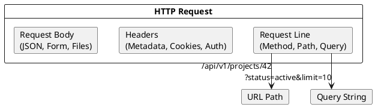
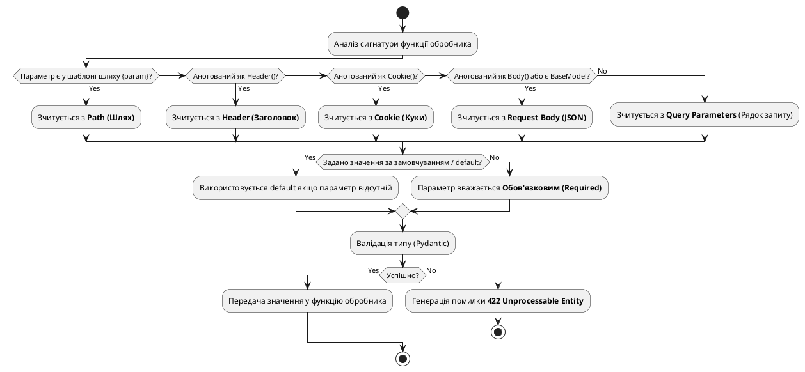

Будь-який вебдодаток чи API-сервіс у своїй основі вирішує дві фундаментальні задачі:
1. **Маршрутизація (Routing)** — визначити, який саме обробник (функція) має зреагувати на певний URL-шлях та HTTP-метод.
2. **Зв'язування даних (Data Binding) та валідація** — отримати сирі текстові дані з HTTP-запиту, конвертувати їх у типізовані структури мови програмування (класи, числа, списки) та перевірити на відповідність правилам бізнес-логіки.

У цій статті ми детально розглянемо, як ці концепції реалізовані у FastAPI, проведемо паралелі з ASP.NET Core та навчимося будувати гнучкі інтерфейси для отримання даних від клієнтів.

---

## «Початок з далека»: Анатомія HTTP-запиту та концепція Data Binding

HTTP-запит клієнта — це звичайний текст, що надсилається по TCP-з'єднанню. Він має чітку структуру, визначену специфікацією RFC. Коли клієнт хоче отримати чи відправити дані, він може структурувати їх у різних частинах запиту:

::plant-uml



::

Розглянемо ці джерела даних детальніше:
* **Path (Шлях)**: використовується для ідентифікації конкретного ресурсу. Наприклад, у шляху `/projects/42` число `42` вказує на конкретний проект. Згідно з REST-стандартами, шлях має містити унікальний ідентифікатор ресурсу.
* **Query String (Параметри запиту)**: йдуть після символу `?` (наприклад, `?status=active&limit=10`). Вони використовуються для фільтрації, сортування, пагінації чи пошуку. Ресурс залишається тим самим, але ми змінюємо його відображення чи кількість.
* **Headers (Заголовки)**: містять системні метадані (наприклад, `Authorization: Bearer <token>`, `Content-Type: application/json` або кастомні заголовки для трекінгу запитів).
* **Body (Тіло запиту)**: містить структуровані дані великого обсягу (зазвичай JSON-документ або файли), які надсилаються методами `POST`, `PUT` чи `PATCH`.

### Що таке Data Binding (Зв'язування даних)?

У класичному низькорівневому програмуванні (як ми це робили у статті про чистий ASGI) розробнику доводилося вручну витягувати рядок запиту, парсити його за допомогою регулярних виразів або функцій обробки рядків, перетворювати символи на числа та обробляти помилки.

Сучасні фреймворки автоматизують цей процес через **Data Binding**. 
* В **ASP.NET Core** ви вказуєте атрибути параметрів методу контролера: `[FromRoute]`, `[FromQuery]`, `[FromBody]`, `[FromHeader]`, або покладаєтеся на конвенції з іменування.
* У **FastAPI** ви робите те саме, використовуючи **анотації типів Python** та спеціальні класи метаданих (`Path`, `Query`, `Body`, `Header`, `Cookie`).

Поглянемо на порівняльну таблицю джерел даних:

| Джерело даних | Атрибут в ASP.NET Core | Клас у FastAPI | Типове використання |
| :--- | :--- | :--- | :--- |
| **Path (Шлях)** | `[FromRoute]` | `Path()` | Ідентифікація ресурсу (ID, UUID, Slug) |
| **Query (Запит)** | `[FromQuery]` | `Query()` | Фільтрація, пагінація, сортування |
| **Body (Тіло)** | `[FromBody]` | `Body()` або Pydantic-модель | Передача складних сутностей (JSON) |
| **Headers (Заголовки)**| `[FromHeader]` | `Header()` | Авторизація, API-ключі, клієнтські метадані |
| **Cookies (Куки)** | `[FromCookie]` | `Cookie()` | Сесії користувача, аналітика |

---

## Параметри шляху (Path Parameters)

Параметри шляху дозволяють зробити динамічні URL-адреси. Замість написання окремого обробника для кожного проекту, ми реєструємо один маршрут з параметром-змінною.

У FastAPI параметри шляху огортаються у фігурні дужки `{}` у декораторі маршруту, а у сигнатурі функції оголошується однойменна змінна із зазначенням типу:

```python
from fastapi import FastAPI

app = FastAPI()

@app.get("/projects/{project_id}")
async def get_project(project_id: int):
    return {"project_id": project_id, "status": "active"}
```

### Автоматична конвертація типів та валідація
Зверніть увагу на анотацію типу `project_id: int`. FastAPI виконує тут величезну роботу:
1. **Парсинг**: Коли приходить запит `GET /projects/42`, FastAPI витягує рядок `"42"`.
2. **Конвертація (Casting)**: Оскільки вказано тип `int`, FastAPI конвертує рядок `"42"` у ціле число `42`. У вашому коді змінна `project_id` вже є числом.
3. **Валідація**: Якщо клієнт надішле запит `GET /projects/not-a-number`, конвертація у `int` завершиться помилкою. FastAPI автоматично зупинить обробку запиту (код вашої функції навіть не запуститься) і відправить клієнту відповідь із кодом **422 Unprocessable Entity**.

#### Структура автоматичної помилки 422:
```json
{
  "detail": [
    {
      "type": "int_parsing",
      "loc": ["path", "project_id"],
      "msg": "Input should be a valid integer, unable to parse string as an integer",
      "input": "not-a-number"
    }
  ]
}
```
Це надзвичайно зручно, оскільки клієнт отримує точний звіт: яке саме поле (`loc: ["path", "project_id"]`) призвело до помилки та чому (`msg`).

---

### Тонке налаштування: використання класу `Path()`

Анотація `project_id: int` вирішує питання типу, але що робити, якщо ідентифікатор проєкту в базі даних не може бути від'ємним числом? Або якщо ви хочемо додати текстовий опис цього поля для Swagger UI?

Для цього у FastAPI є клас **`Path`**, який імпортується з модуля `fastapi`. З його допомогою ми можемо додати метадані та правила числової валідації:

```python
from fastapi import FastAPI, Path

app = FastAPI()

@app.get("/projects/{project_id}")
async def get_project(
    project_id: int = Path(
        title="ID проєкту",
        description="Унікальний числовий ідентифікатор проєкту в системі",
        ge=1, # Greater than or equal (>= 1)
        le=1000 # Less than or equal (<= 1000)
    )
):
    return {"project_id": project_id}
```

#### Доступні параметри у `Path()`:

Для зручності всі параметри конструктора `Path()` можна розділити на дві категорії: метадані та обмеження валідації.

##### 1. Параметри метаданих (Metadata)

Ці параметри використовуються виключно для автогенерації документації OpenAPI та відображення у Swagger UI:

::field-group

::field{name="title" type="str" default="None"}
Коротка людська назва параметра, яка відображатиметься в інтерфейсі Swagger UI поряд із полем введення.
::

::field{name="description" type="str" default="None"}
Детальний опис призначення параметра. Підтримує Markdown-розмітку (наприклад, списки, жирний текст тощо) і рендериться у Swagger UI.
::

::field{name="alias" type="str" default="None"}
Альтернативне ім'я параметра у HTTP-запиті. Використовується, коли назва в URL не сумісна з правилами іменування змінних у Python (наприклад, `alias="project-id"` дозволяє приймати параметр як `project-id`, але в коді мапити його на змінну `project_id`).
::

::field{name="deprecated" type="bool" default="False"}
Якщо встановлено у `True`, позначає цей параметр як застарілий у Swagger UI, візуально перекреслюючи його та попереджаючи клієнтів про майбутнє вилучення.
::

::

##### 2. Параметри валідації (Validation Constraints)

Ці параметри визначають правила, яким має відповідати значення параметра шляху, щоб пройти перевірку Pydantic:

::field-group

::field{name="gt" type="float | int" default="None"}
**Greater Than**: числове обмеження «строго більше» (`>`). Значення параметра має бути строго більшим за вказане.
::

::field{name="ge" type="float | int" default="None"}
**Greater than or Equal**: числове обмеження «більше або дорівнює» (`>=`). Значення має бути не меншим за вказане.
::

::field{name="lt" type="float | int" default="None"}
**Less Than**: числове обмеження «строго менше» (`<`).
::

::field{name="le" type="float | int" default="None"}
**Less than or Equal**: числове обмеження «менше або дорівнює» (`<=`).
::

::field{name="min_length" type="int" default="None"}
Мінімальна довжина рядка (кількість символів). Застосовується, якщо параметр шляху є рядковим (`str`).
::

::field{name="max_length" type="int" default="None"}
Максимально допустима довжина рядка.
::

::field{name="pattern" type="str" default="None"}
Регулярний вираз (regex), якому має повністю відповідати значення параметра шляху (наприклад, `pattern=r"^[A-Z]{2}-\d{4}$"` для формату коду на кшталт `UA-1234`).
::

::

---

### Сучасний підхід: використання `Annotated` (PEP 593)

У попередніх версіях FastAPI конструкція `project_id: int = Path(...)` була єдиним варіантом. Проте вона має суттєвий недолік з точки зору чистоти мови: значення за замовчуванням `= Path(...)` збиває з пантелику лінтери та статичні аналізатори (наприклад, mypy). Вони вважають, що якщо параметру присвоєно якесь значення, то цей параметр є *опціональним* при виклику функції, хоча насправді параметри шляху є *завжди обов'язковими*.

Починаючи з Python 3.9 та впровадження PEP 593, у модулі `typing` з'явився загальний тип **`Annotated`**. Він дозволяє розділити визначення типу та метадані. 

У сучасному FastAPI **наполегливо рекомендується** писати так:

```python
from typing import Annotated
from fastapi import FastAPI, Path

app = FastAPI()

# Визначаємо перевикористовуваний тип для ID проекту
ProjectId = Annotated[
    int, 
    Path(title="ID проєкту", description="Унікальний ID", ge=1)
]

@app.get("/projects/{project_id}")
async def get_project(project_id: ProjectId):
    return {"project_id": project_id}
```

#### Чому `Annotated` кращий?
1. **Сумісність з лінтерами**: Статичний аналізатор бачить чистий тип `int`. Він розуміє, що змінна `project_id` є обов'язковим числовим параметром.
2. **Принцип DRY (Don't Repeat Yourself)**: Ви можете оголосити тип `ProjectId` один раз у файлі `types.py` та перевикористовувати його в десятках різних роутерів. Якщо бізнес-правило зміниться (наприклад, ID стане UUID або ліміт `ge` зміниться на 100), вам доведеться змінити лише один рядок коду.
3. **Чистота сигнатури**: Сигнатури функцій стають набагато коротшими та легшими для зчитування.

---

### Порівняння валідації шляхів: FastAPI ↔ ASP.NET Core

В ASP.NET Core обмеження (constraints) на параметри маршруту прописуються безпосередньо у рядку шаблону маршруту за допомогою синтаксису двокрапки (`:`), або через атрибути:

::code-group

```csharp [ASP.NET Core Minimal API]
// Обмеження min(1) та max(1000) прописуються безпосередньо в рядку шляху
app.MapGet("/projects/{id:int:min(1):max(1000)}", (int id) => {
    return Results.Ok(new { ProjectId = id });
});
```

```python [FastAPI (Annotated)]
# Обмеження ge=1 та le=1000 винесені в анотацію типу
ProjectId = Annotated[int, Path(ge=1, le=1000)]

@app.get("/projects/{project_id}")
async def get_project(project_id: ProjectId):
    return {"project_id": project_id}
```

::

Головна відмінність: в .NET обмеження є частиною системи маршрутизації (якщо ви надішлете запит `/projects/0`, роутер взагалі не зматчить цей шлях і поверне класичний **404 Not Found**). У FastAPI маршрутизатор Starlette зматчить шлях `/projects/0`, але шар валідації Pydantic відхилить запит та поверне **422 Unprocessable Entity** з точним описом помилки (що значення має бути `>= 1`).

---

## Параметри запиту (Query Parameters)

Коли ви оголошуєте у сигнатурі функції-обробника параметри, які **не входять до URL-шляху** (тобто не описані у фігурних дужках декоратора `@app.get(...)`), FastAPI автоматично інтерпретує їх як параметри запиту (Query Parameters). Вони передаються в кінці URL після знаку запитання `?` (наприклад, `?limit=10&status=active`).

```python
from fastapi import FastAPI

app = FastAPI()

# Маршрут не містить параметрів у фігурних дужках
@app.get("/tasks")
async def get_tasks(status: str, limit: int = 10):
    return {"status": status, "limit": limit}
```

### Принципи обробки та обов'язковість
1. **Обов'язковість (Required)**: Якщо у параметра немає значення за замовчуванням (як у змінної `status: str`), цей параметр є обов'язковим. Якщо клієнт надішле запит `GET /tasks`, FastAPI відхилить його та поверне помилку **422 Unprocessable Entity** з детальним описом: `Field required` для поля `status`.
2. **Значення за замовчуванням (Default values)**: Параметр `limit: int = 10` є необов'язковим. Якщо клієнт не передасть його (запит `GET /tasks?status=active`), FastAPI автоматично встановить йому значення `10`.
3. **Типізація**: FastAPI автоматично приведе рядок `?limit=5` до типу `int`. Якщо передати `?limit=five`, клієнт отримає помилку 422 із типом помилки `int_parsing`.

---

### Необов'язкові (Optional) параметри запиту

Якщо параметр запиту не є обов'язковим і не має фіксованого значення за замовчуванням, йому присвоюють значення `None`. 

Згідно з сучасними стандартами Python (PEP 604), для опису типів, які можуть приймати значення `None`, використовується символ вертикальної риски `|`:

```python
from fastapi import FastAPI

app = FastAPI()

@app.get("/tasks")
async def get_tasks(
    status: str | None = None, # Параметр необов'язковий, за замовчуванням None
    limit: int = 10
):
    return {"status": status, "limit": limit}
```

::note
У старішому Python-коді (до версії 3.10) ви часто зустрічатимете використання `typing.Optional[str]` або `typing.Union[str, None]`. У сучасному Python лаконічний синтаксис `str | None` є кращим і повністю підтримується FastAPI.
::

---

### Використання класу `Query()` та валідація

Для детального налаштування параметрів запиту FastAPI пропонує клас **`Query`** з модуля `fastapi`. Використовуючи його разом із `Annotated`, ми можемо додати опис, назву, обмеження довжини чи перевірку регулярним виразом:

```python
from typing import Annotated
from fastapi import FastAPI, Query

app = FastAPI()

# Визначаємо тип з обмеженнями довжини та формату
SearchQuery = Annotated[
    str | None,
    Query(
        min_length=3,
        max_length=50,
        pattern=r"^[a-zA-Z0-9\s]+$", # Лише букви, цифри та пробіли
        title="Пошуковий запит",
        description="Рядок для пошуку завдань за назвою чи описом"
    )
]

@app.get("/tasks/search")
async def search_tasks(q: SearchQuery = None):
    return {"query": q}
```

#### Доступні параметри у `Query()`:

Параметри конструктора `Query()` також логічно діляться на дві основні групи.

##### 1. Параметри метаданих (Metadata)

Ці параметри відповідають за документацію та відображення в інтерфейсі OpenAPI:

::field-group

::field{name="default" type="Any" default="None"}
Значення параметра за замовчуванням. Якщо ви хочете зробити параметр обов'язковим, але налаштувати валідацію через `Query()`, використовуйте константу `...` (Ellipsis): `q: Annotated[str, Query(default=...)]`.
::

::field{name="title" type="str" default="None"}
Коротка назва параметра для інтерактивної документації.
::

::field{name="description" type="str" default="None"}
Детальний опис поля з підтримкою Markdown.
::

::field{name="alias" type="str" default="None"}
Альтернативна назва параметра в HTTP-запиті (наприклад, `alias="user-id"` дозволить приймати `?user-id=12`, маплячи його на змінну Python `user_id`).
::

::field{name="include_in_schema" type="bool" default="True"}
Якщо встановити у `False`, параметр буде працювати, але зникне з інтерфейсу Swagger UI/ReDoc.
::

::field{name="deprecated" type="bool" default="False"}
Візуально позначає параметр як застарілий у документації.
::

::

##### 2. Параметри валідації (Validation Constraints)

Ці параметри визначають обмеження значень, що надходять від клієнта:

::field-group

::field{name="min_length" type="int" default="None"}
Мінімально допустима довжина рядка (кількість символів).
::

::field{name="max_length" type="int" default="None"}
Максимально допустима довжина рядка.
::

::field{name="pattern" type="str" default="None"}
Регулярний вираз для валідації рядкових значень.
::

::field{name="gt / ge / lt / le" type="float | int" default="None"}
Набір числових обмежень (Greater Than, Greater or Equal, Less Than, Less or Equal). Працюють аналогічно до параметрів у `Path()`, якщо тип параметра є числовим (`int`, `float`).
::

::

---

### Приймання списків (Multiple / List values)

HTTP-специфікація дозволяє передавати кілька однойменних параметрів у query string для передачі масивів (наприклад, `?tags=python&tags=fastapi&tags=postgres`).

У FastAPI для цього достатньо використати тип `list[T]` (де `T` — тип елементів списку):

```python
from typing import Annotated
from fastapi import FastAPI, Query

app = FastAPI()

@app.get("/tasks/filter")
async def filter_tasks(
    tags: Annotated[
        list[str], 
        Query(description="Список тегів для фільтрації задач")
    ] = [] # За замовчуванням порожній список
):
    return {"tags": tags}
```

Коли клієнт надішле запит `?tags=python&tags=fastapi`, FastAPI автоматично конвертує його в Python-список `['python', 'fastapi']`.

---

### Порівняння параметрів запиту: FastAPI ↔ ASP.NET Core

Процес зв'язування Query-параметрів та масивів у FastAPI та ASP.NET Core дуже схожий:

::code-group

```csharp [ASP.NET Core Minimal API]
// Біндинг масиву з Query String (?tags=python&tags=fastapi)
app.MapGet("/tasks/filter", ([FromQuery] string[] tags) => {
    return Results.Ok(new { Tags = tags });
});
```

```python [FastAPI (Annotated)]
# Біндинг списку з Query String (?tags=python&tags=fastapi)
@app.get("/tasks/filter")
async def filter_tasks(tags: Annotated[list[str], Query()] = []):
    return {"tags": tags}
```

::

---

## Тіло запиту (Request Body) та Pydantic-моделі

Для створення чи оновлення ресурсів на сервері зазвичай передають складні структуровані дані у форматі JSON всередині тіла HTTP-запиту (Request Body).

У FastAPI для прийому та автоматичної валідації тіла запиту використовуються **Pydantic-моделі** (які ми детально розібрали у статті 15).

### Базовий приклад

Створимо Pydantic-модель, що описує структуру задачі, яку клієнт хоче створити:

```python
from fastapi import FastAPI, status
from pydantic import BaseModel

app = FastAPI()

# 1. Визначаємо схему даних
class TaskCreate(BaseModel):
    title: str
    description: str | None = None
    priority: int = 1

# 2. Використовуємо модель як тип параметра
@app.post("/tasks", status_code=status.HTTP_201_CREATED)
async def create_task(task: TaskCreate):
    # task є повноцінним об'єктом класу TaskCreate
    task_data = task.model_dump() # Конвертація в dict
    return {"status": "created", "data": task_data}
```

### Як FastAPI розуміє, що це Request Body?
Коли FastAPI аналізує сигнатуру функції `create_task(task: TaskCreate)`:
1. Він бачить, що тип параметра `TaskCreate` успадкований від `pydantic.BaseModel`.
2. Оскільки Pydantic-модель не є простим скалярним типом (як `int`, `str`, `float`), FastAPI автоматично робить висновок, що цей параметр має бути зчитаний із **тіла JSON-запиту** (Request Body).
3. Він вичитує сирі байти з потоку подій ASGI, конвертує їх у JSON, пропускає через валідатор Pydantic та створює об'єкт `task`. Якщо у JSON відсутнє обов'язкове поле `title` або `priority` передано як `"high"` (замість числа), FastAPI поверне помилку **422 Unprocessable Entity**.

---

### Вкладені (Nested) моделі

Оскільки Pydantic підтримує складні ієрархічні структури, ви можете приймати вкладені JSON-об'єкти. Наприклад, кожна задача може містити інформацію про виконавця та список підзадач:

```python
from pydantic import BaseModel, Field

class UserInfo(BaseModel):
    username: str
    email: str

class SubTask(BaseModel):
    title: str
    is_completed: bool = False

class TaskComplexCreate(BaseModel):
    title: str
    assignee: UserInfo # Вкладений об'єкт
    subtasks: list[SubTask] = [] # Список вкладених об'єктів
```

FastAPI автоматично розпарсить весь цей JSON-деревоподібний документ та провалідує кожне поле на будь-якій глибині вкладеності.

---

### Тонке налаштування: використання класу `Body()`

Бувають ситуації, коли для створення ресурсу вам не потрібна ціла Pydantic-модель, а потрібно прийняти лише одне або два скалярні значення в JSON (наприклад, просто один рядок `title` або число `priority`).

Якщо ви напишете так:
```python
@app.post("/tasks")
async def create_task(title: str):
    ...
```
FastAPI побачить скалярний тип `str` і за замовчуванням буде шукати його в **Query parameters** (`?title=value`), а не в тілі запиту.

Щоб примусово вказати FastAPI, що скалярне значення має зчитуватися з тіла JSON-запиту, використовується клас **`Body`**:

```python
from typing import Annotated
from fastapi import FastAPI, Body

app = FastAPI()

@app.post("/tasks")
async def create_task(
    title: Annotated[str, Body(min_length=3)],
    priority: Annotated[int, Body(ge=1)] = 1
):
    return {"title": title, "priority": priority}
```

У цьому випадку FastAPI очікуватиме наступний JSON-документ у тілі запиту:
```json
{
  "title": "Купити хліб",
  "priority": 1
}
```

#### Доступні параметри у `Body()`:

Клас `Body()` наслідує всі параметри від `Query()` та `Path()`, але має кілька унікальних конфігурацій.

##### 1. Параметри метаданих (Metadata)

::field-group

::field{name="default" type="Any" default="None"}
Значення за замовчуванням.
::

::field{name="embed" type="bool" default="False"}
Дуже важливий параметр. Якщо встановлено у `True`, FastAPI очікуватиме, що JSON-документ буде обгорнутий у ключ із назвою параметра. 
Наприклад, якщо у нас є `title: Annotated[str, Body(embed=True)]`, то клієнт має надіслати: `{"title": "Значення"}` замість просто `"Значення"`.
::

::field{name="title" type="str" default="None"}
Назва поля для документації.
::

::field{name="description" type="str" default="None"}
Опис поля для документації.
::

::field{name="examples" type="list[Any]" default="None"}
Приклади значень, які відображатимуться у Swagger UI як зразок запиту для клієнтів.
::

::

##### 2. Параметри валідації (Validation Constraints)

::field-group

::field{name="min_length / max_length" type="int" default="None"}
Валідація довжини для рядкових тіл.
::

::field{name="pattern" type="str" default="None"}
Регулярний вираз для валідації рядка.
::

::field{name="gt / ge / lt / le" type="float | int" default="None"}
Числові обмеження для числових полів у тілі запиту.
::

::

---

### Порівняння Request Body: FastAPI ↔ ASP.NET Core

В ASP.NET Core робота з JSON-тілом та класами (DTO/Records) є стандартною практикою:

::code-group

```csharp [ASP.NET Core Minimal API]
// Біндинг об'єкта TaskCreate з JSON-тіла запиту (за замовчуванням [FromBody])
app.MapPost("/tasks", (TaskCreate task) => {
    return Results.Created($"/tasks/{task.Title}", task);
});

// Схема моделі
public record TaskCreate(
    [Required, MinLength(3)] string Title,
    string? Description,
    [Range(1, 5)] int Priority = 1
);
```

```python [FastAPI (Annotated)]
# Біндинг об'єкта TaskCreate з JSON-тіла запиту
@app.post("/tasks", status_code=status.HTTP_201_CREATED)
async def create_task(task: TaskCreate):
    return task

# Схема моделі
class TaskCreate(BaseModel):
    title: str = Field(min_length=3)
    description: str | None = None
    priority: int = Field(default=1, ge=1, le=5)
```

::

Головна відмінність: в .NET валідація моделей зазвичай виконується через Data Annotations (`[Required]`, `[Range]`) і потребує ручної або напівавтоматичної перевірки стану моделі (`ModelState.IsValid` у MVC або вбудовані фільтри у Minimal API). У FastAPI валідація через Pydantic виконується **автоматично до виклику функції**, гарантуючи, що всередині обробника ви завжди отримаєте гарантовано валідовані та типізовані дані.

---

## Множинні джерела даних: комбінування та додаткові джерела

У реальних проєктах розробнику постійно доводиться комбінувати різні джерела в одному маршруті. Наприклад: отримати `project_id` з URL-шляху, параметри фільтрації з Query String, дані для оновлення з JSON-тіла, а також токен авторизації з заголовків чи сесію з cookies.

FastAPI автоматично і безпомилково розділяє ці джерела на основі типів та класів метаданих, які ви використовуєте.

### Комплексний приклад

Створимо ендпоінт оновлення завдання, який приймає дані з 5 різних джерел одночасно:

```python
from typing import Annotated
from fastapi import FastAPI, Path, Query, Body, Header, Cookie, status
from pydantic import BaseModel

app = FastAPI()

class TaskUpdate(BaseModel):
    title: str
    priority: int

@app.put("/projects/{project_id}/tasks/{task_id}", status_code=status.HTTP_200_OK)
async def update_task(
    # 1. Path parameters (з URL)
    project_id: Annotated[int, Path(ge=1)],
    task_id: Annotated[int, Path(ge=1)],
    
    # 2. Request Body (з JSON)
    task: TaskUpdate,
    
    # 3. Query parameter (з query string)
    force: Annotated[bool, Query()] = False,
    
    # 4. Header (з HTTP-заголовків)
    user_agent: Annotated[str | None, Header()] = None,
    
    # 5. Cookie (з HTTP-cookies)
    session_id: Annotated[str | None, Cookie()] = None
):
    return {
        "project_id": project_id,
        "task_id": task_id,
        "task": task,
        "force": force,
        "user_agent": user_agent,
        "session_id": session_id
    }
```

---

### Робота з заголовками: клас `Header()` та особливості Python

Для отримання HTTP-заголовків використовується клас **`Header`**. Проте HTTP-заголовки мають дві специфічні властивості:
1. Вони є **нечутливими до регістру** (case-insensitive) згідно зі специфікацією HTTP (наприклад, `User-Agent`, `user-agent` та `USER-AGENT` — це один і той самий заголовок).
2. Заголовки часто містять символ дефісу (`-`). У Python дефіс є оператором віднімання, тому змінна не може називатися `user-key` або `user-agent`.

#### Автоматична конвертація дефісів (Underscore to Hyphen conversion)
Щоб вирішити цю проблему, FastAPI виконує автоматичну трансформацію:
* Коли ви оголошуєте параметр `user_agent: Annotated[str, Header()]`, FastAPI автоматично перетворює підкреслення `_` на дефіс `-` і шукає в запиті заголовок `User-Agent`.
* Пошук відбувається без урахування регістру.

::warning
Якщо на вашому сервері використовуються кастомні заголовки, які насправді містять символи підкреслення (наприклад, `my_custom_header`), ви повинні вимкнути автоматичну конвертацію, встановивши параметр `convert_underscores=False`:
`my_custom_header: Annotated[str, Header(convert_underscores=False)]`
::

#### Доступні параметри у `Header()`:

::field-group

::field{name="convert_underscores" type="bool" default="True"}
Якщо встановлено у `True`, підкреслення у назві змінної Python будуть автоматично перетворені на дефіси для пошуку заголовка у запиті.
::

::field{name="alias" type="str" default="None"}
Альтернативне ім'я заголовка, якщо ви хочете явно вказати повне ім'я HTTP-заголовка вручну.
::

::field{name="default" type="Any" default="None"}
Значення за замовчуванням (якщо заголовок необов'язковий).
::

::

---

### Робота з Cookies: клас `Cookie()`

Для читання файлів cookie використовується клас **`Cookie`**. Він працює аналогічно до `Query()` та `Header()`, але шукає значення у заголовку `Cookie` HTTP-запиту, де браузер передає збережені пари ключ-значення.

```python
from typing import Annotated
from fastapi import FastAPI, Cookie

app = FastAPI()

@app.get("/items")
async def read_items(
    session_id: Annotated[str | None, Cookie(description="ID поточної сесії")] = None
):
    return {"session_id": session_id}
```

Подібно до інших класів, у `Cookie()` доступні параметри валідації (`min_length`, `max_length`, `pattern`) та метаданих (`title`, `description`, `deprecated`).

---

## Декомпозиція додатку: використання `APIRouter`

У реальних проєктах кількість маршрутів швидко зростає до десятків чи сотень. Якщо тримати всі обробники в одному файлі `main.py`, кодова база перетвориться на непідтримуваний хаос. 

Для вирішення цієї проблеми у FastAPI реалізовано клас **`APIRouter`**. Він працює як «міні-додаток» (routing group), який дозволяє групувати пов'язані маршрути, відокремлювати їх в окремі файли чи модулі, а потім централізовано підключати до основного об'єкта `FastAPI`.

### Приклад побудови структури

Уявімо, що в нашому проєкті **TaskForge** є два логічні блоки: управління користувачами (`users`) та завданнями (`tasks`).

Розподілимо їх по різних файлах:

#### 1. Роутер для задач (`app/routers/tasks.py`)
```python
from fastapi import APIRouter, status

# Створюємо роутер, вказуючи префікс та тег для Swagger
router = APIRouter(
    prefix="/api/v1/tasks",
    tags=["Tasks (Завдання)"]
)

@router.get("/", status_code=status.HTTP_200_OK)
async def get_tasks():
    return [{"id": 1, "title": "Buy milk"}]

@router.post("/", status_code=status.HTTP_201_CREATED)
async def create_task(title: str):
    return {"id": 2, "title": title}
```

#### 2. Роутер для користувачів (`app/routers/users.py`)
```python
from fastapi import APIRouter

router = APIRouter(
    prefix="/api/v1/users",
    tags=["Users (Користувачі)"]
)

@router.get("/")
async def get_users():
    return [{"id": 1, "username": "arakviel"}]
```

#### 3. Об'єднання у точці входу (`app/main.py`)
Тепер імпортуємо створені роутери та реєструємо їх у головному додатку за допомогою методу `include_router()`:

```python
from fastapi import FastAPI
from app.routers import tasks, users

app = FastAPI(title="TaskForge API")

# Підключаємо роутери
app.include_router(tasks.router)
app.include_router(users.router)
```

---

### Налаштування та можливості `APIRouter`

Клас `APIRouter` приймає ряд корисних параметрів при ініціалізації:

::field-group

::field{name="prefix" type="str" default="\"\""}
Шлях-префікс, який автоматично додається до всіх маршрутів роутера. Наприклад, якщо префікс `/tasks`, а маршрут оголошено як `@router.get("/{id}")`, реальний URL буде `/tasks/{id}`. Це дозволяє легко міняти версіювання API (наприклад, `/api/v1`) в одному місці.
::

::field{name="tags" type="list[str | Enum]" default="None"}
Список тегів для групування ендпоінтів. Усі маршрути цього роутера будуть автоматично об'єднані під цими тегами в інтерфейсі Swagger UI / ReDoc.
::

::field{name="dependencies" type="Sequence[Depends]" default="None"}
Список глобальних залежностей (Dependency Injection), які автоматично запускаються для кожного маршруту в межах цього роутера (наприклад, перевірка авторизації чи JWT-токена). Детальніше ми розберемо це у **Статті 20**.
::

::field{name="responses" type="dict[int | str, dict[str, Any]]" default="None"}
Словник із додатковими схемами HTTP-відповідей, які можуть повертати маршрути цього роутера (наприклад, опис структури помилок `401 Unauthorized` чи `403 Forbidden`).
::

::

::note
`APIRouter` також підтримує рекурсивну вкладеність. Ви можете підключати один роутер до іншого за допомогою методу `router.include_router(sub_router)`. Це дозволяє створювати складні ієрархічні структури API.
::

---

### Порівняння групування маршрутів: FastAPI ↔ ASP.NET Core

У сучасному .NET для цього використовуються Route Groups, які працюють за дуже схожим принципом:

::code-group

```csharp [ASP.NET Core Minimal API]
// Створення групи маршрутів із префіксом та тегом
var taskGroup = app.MapGroup("/api/v1/tasks")
                   .WithTags("Tasks");

taskGroup.MapGet("/", () => new[] { new { Id = 1, Title = "Buy milk" } });
taskGroup.MapPost("/", (string title) => new { Id = 2, Title = title });
```

```python [FastAPI (APIRouter)]
# Створення роутера з префіксом та тегом
router = APIRouter(
    prefix="/api/v1/tasks",
    tags=["Tasks"]
)

@router.get("/")
async def get_tasks():
    return [{"id": 1, "title": "Buy milk"}]

@router.post("/")
async def create_task(title: str):
    return {"id": 2, "title": title}
```

::

---

## Контроль серіалізації: `response_model` та статус-коди

Окрім перевірки вхідних даних, сучасний API має суворо контролювати структуру **вихідних даних (HTTP Responses)**. Наприклад:
* Запобігати витоку конфіденційної інформації (таких як хеші паролів, внутрішні токени або службова інформація бази даних).
* Автоматично перетворювати типи даних (наприклад, об'єкти дат `datetime` у форматі ISO, сутності ORM у JSON-структури).
* Гарантувати клієнтам суворий контракт відповідей, що документується в OpenAPI.

У FastAPI для цього використовується параметр декоратора маршруту **`response_model`** разом із механізмом HTTP статус-кодів.

### Базовий приклад фільтрації даних

Спроектуємо сценарій, де з бази даних повертається повний об'єкт користувача (із паролем), але клієнту ми маємо віддати лише безпечні поля:

```python
from fastapi import FastAPI, status
from pydantic import BaseModel, EmailStr

app = FastAPI()

# База даних (імітація) повертає такий словник (або сутність ORM)
db_user = {
    "id": 42,
    "username": "arakviel",
    "email": "arakviel@example.com",
    "hashed_password": "super_secret_hash_12345",
    "is_active": True
}

# Вихідна схема (контракт для клієнта)
class UserRead(BaseModel):
    id: int
    username: str
    email: EmailStr
    is_active: bool

# Вказуємо response_model у декораторі
@app.get("/users/{user_id}", response_model=UserRead, status_code=status.HTTP_200_OK)
async def get_user(user_id: int):
    # Повертаємо об'єкт з паролем, але FastAPI відфільтрує його!
    return db_user
```

### Що відбувається під капотом?
Коли обробник повертає `db_user` (словник чи об'єкт ORM):
1. FastAPI зчитує вказаний `response_model=UserRead`.
2. Він пропускає повернуті дані через валідатор `UserRead` (так само як і вхідні дані).
3. Він виконує **серіалізацію** (перетворює об'єкт на JSON), копіюючи лише ті поля, які явно описані в схемі `UserRead`. Поле `hashed_password` буде автоматично відкинуте сервером. Клієнт отримає чистий JSON-документ без пароля.
4. Swagger UI відобразить схему `UserRead` як успішну відповідь з кодом `200 OK`.

---

### Тонке налаштування серіалізації

Декоратори маршрутів (на кшталт `@app.get` або `@router.post`) пропонують додаткові параметри для конфігурації фільтрації відповідей:

::field-group

::field{name="response_model" type="Type[BaseModel]" default="None"}
Клас Pydantic-моделі, який визначає фінальну структуру JSON-відповіді.
::

::field{name="response_model_exclude_unset" type="bool" default="False"}
Якщо встановлено у `True`, FastAPI вилучить з відповіді всі поля, які не були явно задані під час створення об'єкта (навіть якщо вони мають значення за замовчуванням).
::

::field{name="response_model_exclude_none" type="bool" default="False"}
Якщо встановлено у `True`, всі поля моделі, які мають значення `None`, будуть повністю вилучені з JSON-відповіді, що робить її більш компактною.
::

::field{name="response_model_exclude" type="set[str] | list[str]" default="None"}
Набір назв полів, які потрібно примусово вилучити з відповіді (наприклад, `response_model_exclude={"hashed_password"}`).
::

::field{name="response_model_include" type="set[str] | list[str]" default="None"}
Набір назв полів, які потрібно примусово залишити у відповіді, вилучивши всі інші.
::

::

::important
Хоча FastAPI підтримує параметри `response_model_exclude` та `response_model_include` у вигляді рядків, у великих проєктах **рекомендується створювати окремі Pydantic-моделі** (наприклад, `UserRead` та `UserShortRead`). Це забезпечує кращу підтримку автозаповнення в IDE, полегшує статичний аналіз коду та робить OpenAPI документацію точнішою.
::

---

### Семантичні статус-коди відповідей

За замовчуванням будь-який успішний запит повертає статус-код `200 OK`. Проте згідно з REST-архітектурою кожен тип операції має повертати свій відповідний код:
* **`201 Created`** — після успішного створення нового ресурсу (наприклад, `POST /tasks`).
* **`204 No Content`** — після успішного видалення ресурсу (наприклад, `DELETE /tasks/42`), коли тіло відповіді є порожнім.
* **`200 OK`** — для успішних операцій читання (`GET`) чи оновлення (`PUT` / `PATCH`).

У FastAPI рекомендовано вказувати статус-код через параметр `status_code` у декораторі, використовуючи константи з модуля `status`:

```python
from fastapi import FastAPI, status

app = FastAPI()

@app.delete("/tasks/{task_id}", status_code=status.HTTP_204_NO_CONTENT)
async def delete_task(task_id: int):
    # Код видалення з БД...
    return None # Повертає пусте тіло
```

::tip
Хоча ви можете написати `status_code=204`, використання констант `status.HTTP_204_NO_CONTENT` робить ваш код більш наочним, читабельним і запобігає друкарським помилкам.
::

---

### Порівняння серіалізації: FastAPI ↔ ASP.NET Core

В ASP.NET Core для повернення специфічних відповідей та статусів використовується клас `TypedResults` або кастомні DTO:

::code-group

```csharp [ASP.NET Core Minimal API]
// Повернення статус-коду 201 Created разом із DTO
app.MapPost("/users", (UserCreateDto userDto) => {
    var responseDto = new UserReadDto(42, userDto.Username, userDto.Email);
    return TypedResults.Created($"/users/42", responseDto);
});

public record UserReadDto(int Id, string Username, string Email);
```

```python [FastAPI (Annotated)]
# Повернення статус-коду 201 Created разом із response_model
@app.post("/users", response_model=UserRead, status_code=status.HTTP_201_CREATED)
async def create_user(user: UserCreate):
    # Повертаємо створений об'єкт, FastAPI відфільтрує його за схемою UserRead
    return db_create_user(user)
```

::

Головна відмінність: в .NET вам доводиться вручну ініціалізувати об'єкти вихідних DTO (`new UserReadDto(...)`) в коді методу або використовувати сторонні мапери (як AutoMapper чи Mapster). У FastAPI це відбувається автоматично за рахунок вказання схеми `response_model`, яка сама здійснює мапінг та серіалізацію внутрішніх структур даних.

---

## Важливий нюанс: порядок оголошення маршрутів (Route Precedence)

Під час побудови API ви часто матимете маршрути з однаковими шаблонами шляху. Наприклад, ви хочете отримати профіль поточного авторизованого користувача за адресою `/users/me`, а також профіль будь-якого іншого користувача за його ID — `/users/{user_id}`.

У FastAPI **порядок оголошення функцій-обробників у коді має критичне значення**.

### Чому виникає проблема?
Роутер Starlette (який лежить в основі FastAPI) обробляє вхідні запити **послідовно (зверху вниз)** у порядку реєстрації маршрутів у файлі. Він викликає перший-ліпший маршрут, шаблон якого збігається з URL-адресою запиту.

Якщо ви оголосите маршрути в такому порядку:

```python
# Помилковий порядок!
@app.get("/users/{user_id}")
async def get_user(user_id: int):
    return {"user_id": user_id}

@app.get("/users/me")
async def get_current_user():
    return {"user": "current_logged_in_user"}
```

Коли клієнт надішле запит `GET /users/me`:
1. FastAPI почне перевірку зверху вниз.
2. Перший роут `/users/{user_id}` підходить під шаблон `/users/me`. FastAPI спробує зматчити рядок `"me"` як значення змінної `user_id`.
3. Оскільки тип `user_id` задекларовано як `int`, валідація завершиться помилкою, і клієнт отримає **422 Unprocessable Entity** (не вдалося сконвертувати рядок `"me"` в число). Ендпоінт `get_current_user` навіть не запуститься.

### Правильний порядок:
Завжди розміщуйте статичні, конкретні шляхи (як-от `/users/me`, `/users/search`) **перед** динамічними шляхами з параметрами (`/users/{user_id}`):

```python
# Правильний порядок!
@app.get("/users/me")
async def get_current_user():
    return {"user": "current_logged_in_user"}

@app.get("/users/{user_id}")
async def get_user(user_id: int):
    return {"user_id": user_id}
```

---

### Порівняння з ASP.NET Core: Route Precedence

В ASP.NET Core маршрутизатор побудований інакше. Він не просто перевіряє маршрути зверху вниз у порядку написання коду. Замість цього він використовує дерево маршрутизації та обчислює **вагу маршруту (route precedence / templates weight)**:
* Конкретні статичні шаблони (`/users/me`) завжди мають більший пріоритет (вагу), ніж динамічні параметризовані шаблони (`/users/{id}`).
* Тому в C# ви можете записувати методи контролера у будь-якому порядку — роутер .NET автоматично вибере найбільш специфічний і правильний маршрут.
* У FastAPI розробник **зобов'язаний самостійно контролювати порядок оголошення функцій** у файлі.

---

## Діаграма резолюції параметрів у FastAPI

Для того, щоб чітко розуміти, як саме FastAPI визначає джерело походження кожного параметра під час обробки HTTP-запиту, поглянемо на наступну логічну діаграму:

::plant-uml



::

---

## Практична частина: Робота з APIRouter в TaskForge

Тепер застосуємо отримані знання на практиці у нашому проєкті **TaskForge**. Ми реалізуємо перші повноцінні CRUD-ендпоінти для проєктів (`Projects`) та завдань (`Tasks`), використовуючи `APIRouter` та тимчасове in-memory сховище (звичайні Python-словники).

Змінимо структуру файлів проєкту так, щоб вона виглядала наступним чином:

```text
taskforge/
├── app/
│   ├── __init__.py
│   ├── main.py
│   └── routers/
│       ├── __init__.py
│       ├── projects.py
│       └── tasks.py
└── pyproject.toml
```

---

### Крок 1: Створення роутера проєктів (`app/routers/projects.py`)

Створіть файл `taskforge/app/routers/projects.py`. Тут ми зберігатимемо проєкти в пам'яті та реалізуємо їх отримання, створення та видалення:

```python
from typing import Annotated
from fastapi import APIRouter, Path, Query, HTTPException, status
from pydantic import BaseModel, Field

router = APIRouter(
    prefix="/api/v1/projects",
    tags=["Projects (Проєкти)"]
)

# Тимчасова база даних в оперативній пам'яті
projects_db = {}
project_id_counter = 1

# Pydantic-моделі для валідації контракту
class ProjectCreate(BaseModel):
    name: str = Field(min_length=3, max_length=100, description="Назва проєкту")
    description: str | None = Field(default=None, max_length=500, description="Опис проєкту")

class ProjectRead(BaseModel):
    id: int
    name: str
    description: str | None

# 1. Створення проєкту
@router.post("/", response_model=ProjectRead, status_code=status.HTTP_201_CREATED)
async def create_project(project: ProjectCreate):
    global project_id_counter
    new_project = {
        "id": project_id_counter,
        "name": project.name,
        "description": project.description
    }
    projects_db[project_id_counter] = new_project
    project_id_counter += 1
    return new_project

# 2. Отримання списку проєктів з пагінацією
@router.get("/", response_model=list[ProjectRead])
async def list_projects(
    skip: Annotated[int, Query(ge=0)] = 0,
    limit: Annotated[int, Query(ge=1, le=100)] = 10
):
    projects_list = list(projects_db.values())
    return projects_list[skip : skip + limit]

# 3. Отримання проєкту за ID
@router.get("/{project_id}", response_model=ProjectRead)
async def get_project(project_id: Annotated[int, Path(ge=1)]):
    if project_id not in projects_db:
        raise HTTPException(
            status_code=status.HTTP_404_NOT_FOUND, 
            detail="Проєкт не знайдено"
        )
    return projects_db[project_id]

# 4. Видалення проєкту
@router.delete("/{project_id}", status_code=status.HTTP_204_NO_CONTENT)
async def delete_project(project_id: Annotated[int, Path(ge=1)]):
    if project_id not in projects_db:
        raise HTTPException(
            status_code=status.HTTP_404_NOT_FOUND, 
            detail="Проєкт не знайдено"
        )
    del projects_db[project_id]
    return None
```

---

### Крок 2: Створення роутера задач (`app/routers/tasks.py`)

Створіть файл `taskforge/app/routers/tasks.py`. Тут ми зберігатимемо завдання, які прив'язані до проєктів, та реалізуємо повний CRUD-цикл:

```python
from typing import Annotated
from fastapi import APIRouter, Path, Query, HTTPException, status
from pydantic import BaseModel, Field

router = APIRouter(
    prefix="/api/v1/tasks",
    tags=["Tasks (Завдання)"]
)

# Тимчасова база даних задач в пам'яті
tasks_db = {}
task_id_counter = 1

class TaskCreate(BaseModel):
    project_id: int = Field(ge=1, description="ID проєкту, до якого належить задача")
    title: str = Field(min_length=3, max_length=150, description="Назва задачі")
    description: str | None = Field(default=None, max_length=1000)
    priority: int = Field(default=1, ge=1, le=5, description="Пріоритет (від 1 до 5)")

class TaskRead(BaseModel):
    id: int
    project_id: int
    title: str
    description: str | None
    priority: int

class TaskUpdate(BaseModel):
    title: str = Field(min_length=3, max_length=150)
    description: str | None = None
    priority: int = Field(ge=1, le=5)

# 1. Створення задачі
@router.post("/", response_model=TaskRead, status_code=status.HTTP_201_CREATED)
async def create_task(task: TaskCreate):
    global task_id_counter
    # На реальному проєкті ми б тут перевіряли, чи існує такий project_id у БД
    new_task = {
        "id": task_id_counter,
        "project_id": task.project_id,
        "title": task.title,
        "description": task.description,
        "priority": task.priority
    }
    tasks_db[task_id_counter] = new_task
    task_id_counter += 1
    return new_task

# 2. Отримання списку задач із фільтрацією за project_id та пріоритетом
@router.get("/", response_model=list[TaskRead])
async def list_tasks(
    project_id: Annotated[int | None, Query(ge=1)] = None,
    priority: Annotated[int | None, Query(ge=1, le=5)] = None,
    skip: int = 0,
    limit: int = 10
):
    tasks_list = list(tasks_db.values())
    
    # Застосовуємо фільтри
    if project_id is not None:
        tasks_list = [t for t in tasks_list if t["project_id"] == project_id]
    if priority is not None:
        tasks_list = [t for t in tasks_list if t["priority"] == priority]
        
    return tasks_list[skip : skip + limit]

# 3. Отримання однієї задачі за ID
@router.get("/{task_id}", response_model=TaskRead)
async def get_task(task_id: Annotated[int, Path(ge=1)]):
    if task_id not in tasks_db:
        raise HTTPException(status_code=404, detail="Задачу не знайдено")
    return tasks_db[task_id]

# 4. Оновлення задачі
@router.put("/{task_id}", response_model=TaskRead)
async def update_task(
    task_id: Annotated[int, Path(ge=1)],
    task_data: TaskUpdate
):
    if task_id not in tasks_db:
        raise HTTPException(status_code=404, detail="Задачу не знайдено")
    
    current_task = tasks_db[task_id]
    current_task["title"] = task_data.title
    current_task["description"] = task_data.description
    current_task["priority"] = task_data.priority
    
    tasks_db[task_id] = current_task
    return current_task

# 5. Видалення задачі
@router.delete("/{task_id}", status_code=status.HTTP_204_NO_CONTENT)
async def delete_task(task_id: Annotated[int, Path(ge=1)]):
    if task_id not in tasks_db:
        raise HTTPException(status_code=404, detail="Задачу не знайдено")
    del tasks_db[task_id]
    return None
```

---

### Крок 3: Реєстрація роутерів у `app/main.py`

Оновіть файл `taskforge/app/main.py`, підключивши до нього нові роутери:

```python
import logging
from contextlib import asynccontextmanager
from fastapi import FastAPI
from app.routers import projects, tasks

logging.basicConfig(level=logging.INFO)
logger = logging.getLogger("taskforge")

@asynccontextmanager
async def lifespan(app: FastAPI):
    logger.info("Initializing TaskForge resources...")
    yield
    logger.info("Releasing TaskForge resources...")

app = FastAPI(
    title="TaskForge API",
    description="Система управління проєктами та завданнями",
    version="0.1.0",
    lifespan=lifespan
)

# Підключаємо модулі маршрутів
app.include_router(projects.router)
app.include_router(tasks.router)

@app.get("/")
async def root():
    return {
        "status": "ok",
        "project": "TaskForge",
        "version": "0.1.0"
    }
```

---

### Крок 4: Перевірка роботи через Swagger UI

Запустіть сервер:

::tabs
::tabs-item{label="pip"}
```bash
uvicorn app.main:app --reload
```
::
::tabs-item{label="uv"}
```bash
uv run uvicorn app.main:app --reload
```
::
::tabs-item{label="poetry"}
```bash
poetry run uvicorn app.main:app --reload
```
::
::

Відкрийте браузер за адресою `http://127.0.0.1:8000/docs`. Ви побачите, що:
1. Усі роути розбиті на дві красиві секції: **Projects (Проєкти)** та **Tasks (Завдання)**.
2. Кожен маршрут має свій правильний колір, опис та очікувані структури JSON.
3. Ви можете створити проєкт через `POST /api/v1/projects/`, отримати його ID, а потім створити задачу через `POST /api/v1/tasks/` з цим `project_id`.

Збережіть ваш прогрес:

```bash
git add .
git commit -m "feat: add task and project CRUD endpoints with APIRouter (in-memory)"
```

---

## Практичні завдання

Виконайте завдання для перевірки та закріплення матеріалу статті.

### Завдання 1: CRUD для продуктів (Базовий рівень)
Створіть API для каталогу товарів:
- Спроектуйте модель `Product` з полями: `id` (int), `name` (str, min 3 символи), `price` (float, ge=0.01), `description` (str | None).
- Реалізуйте CRUD-операції в окремому файлі `routers/products.py`.
- Підключіть роутер у `main.py`.

### Завдання 2: Рефакторинг та декомпозиція інтернет-магазину (Середній рівень)
Візьміть великий монолітний файл `main.py` (наприклад, з вашого попереднього проєкту) та переведіть його на модульну структуру:
- Створіть каталог `routers/`.
- Перенесіть логіку авторизації та користувачів у `routers/users.py` (префікс `/api/v1/users`, тег `Users`).
- Перенесіть логіку каталогів товарів у `routers/products.py` (префікс `/api/v1/products`, тег `Products`).
- Перенесіть логіку замовлень у `routers/orders.py` (префікс `/api/v1/orders`, тег `Orders`).
- Зберіть все в `main.py` за допомогою `include_router()`.

### Завдання 3: Реалізація Cursor-Based пагінації (Професійний рівень)
Offset-based пагінація (`skip`/`limit`) є неефективною для великих баз даних (на мільйони записів), оскільки БД доводиться сканувати всі попередні записи.
- Створіть роут `GET /api/v1/tasks/cursor`, який приймає параметри:
  - `cursor: int | None = Query(default=None, description="ID останнього елемента з попередньої сторінки")`.
  - `limit: int = Query(default=10, le=100)`.
- Логіка: якщо `cursor` не передано, повертаються перші `limit` елементів. Якщо `cursor` передано, повертаються елементи, чий `id > cursor` у кількості `limit` штук.
- Відповідь має містити список елементів та поле `next_cursor` (яке є ID останнього елемента у поточному списку). Якщо наступних елементів немає, `next_cursor` має бути `None`.
- Перевірте роботу в Swagger UI.


