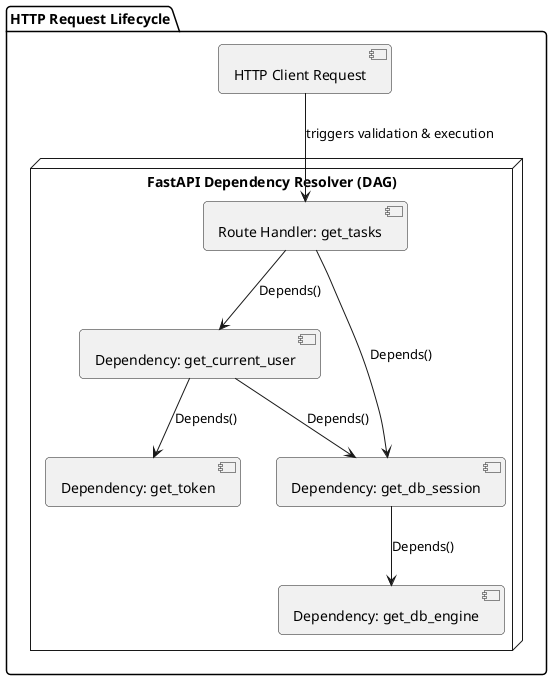

Впровадження залежностей (Dependency Injection, DI) — це один із фундаментальних патернів проєктування сучасного програмного забезпечення. Він забезпечує слабку пов'язаність (loose coupling) компонентів системи, полегшує тестування та дозволяє дотримуватися принципу інверсії залежностей (Dependency Inversion Principle) із набору SOLID.

У багатьох вебфреймворках (наприклад, ASP.NET Core у C# або Spring Boot у Java) DI-контейнери є складними інфраструктурними компонентами, що вимагають попередньої конфігурації. У FastAPI розробники пішли іншим шляхом: впровадження залежностей є лаконічним, декларативним і вбудованим безпосередньо у сигнатури функцій обробників маршрутів (ендпоінтів) за допомогою спеціальної функції **`Depends()`**.

У цій статті ми детально розглянемо теоретичні підвалини DI, порівняємо підхід FastAPI із IoC-контейнерами в ASP.NET Core, заглянемо під капот роботи `Depends()` та розберемося, як будується і вирішується граф залежностей під час обробки HTTP-запитів.

---

## Філософські відмінності: IoC-контейнери ASP.NET Core ↔ Depends() у FastAPI

Щоб зрозуміти унікальність підходу FastAPI, порівняємо його з класичною та знайомою багатьом студентам моделлю DI в ASP.NET Core.

### 1. ASP.NET Core: Централізований IoC-контейнер

В екосистемі .NET впровадження залежностей базується на **IoC-контейнері** (Inversion of Control).

- **Реєстрація**: Усі сервіси обов'язково реєструються на старті програми (у файлі `Program.cs`) із вказанням їхнього часу життя (Service Lifetime):
    - **`Transient`** — новий екземпляр сервісу створюється при кожному запиті до контейнера.
    - **`Scoped`** — один екземпляр створюється на весь життєвий цикл одного HTTP-запиту.
    - **`Singleton`** — один єдиний екземпляр створюється на весь час роботи додатку.
- **Впровадження**: Зазвичай реалізується через **Constructor Injection** (впровадження через конструктор класу). Контейнер автоматично аналізує конструктор контролера та підставляє туди зареєстровані реалізації інтерфейсів.

### 2. FastAPI: Декларативний граф залежностей

У FastAPI концепція центрального IoC-контейнера з конфігураційними файлами або глобальною реєстрацією типів **відсутня**. Замість цього DI працює локально та декларативно безпосередньо в ендпоінтах через функцію `Depends()`.

- **Немає інтерфейсної реєстрації**: Залежністю може бути будь-який об'єкт, що викликається (Callable): звичайна функція, клас, генератор або об'єкт із методом `__call__`. Вам не потрібно реєструвати їх на старті програми — ви просто вказуєте посилання на них у сигнатурі роута.
- **Впровадження через параметри (Parameter Injection)**: Залежності оголошуються як значення за замовчуванням для параметрів функції-ендпоінту.
- **Динамічний граф**: Замість зберігання стану сервісів у глобальному контейнері, FastAPI будує **граф залежностей** безпосередньо під час аналізу коду і вирішує його «на льоту» для кожного вхідного HTTP-запиту.

Порівняємо опис впровадження сесії бази даних та сервісу авторизації в обох екосистемах:

::code-group
```python [FastAPI (Python)]
from fastapi import FastAPI, Depends

app = FastAPI()

# 1. Визначаємо функції-залежності
def get_db():
    db = DatabaseSession()
    try:
        yield db
    finally:
        db.close()

def get_current_user(db = Depends(get_db)):
    # Залежність get_current_user сама залежить від get_db
    return TokenService.verify_user(db)

# 2. Впроваджуємо залежності безпосередньо в параметри ендпоінту
@app.get("/profile")
async def read_profile(
    db = Depends(get_db),
    user = Depends(get_current_user)
):
    return {"user": user, "status": "active"}
```
```csharp [ASP.NET Core (C#)]
// 1. Реєстрація в Program.cs
var builder = WebApplication.CreateBuilder(args);
builder.Services.AddScoped<IDbSession, DatabaseSession>();
builder.Services.AddScoped<IUserService, UserService>();
builder.Services.AddControllers();

// 2. Впровадження через конструктор контролера
[ApiController]
[Route("[controller]")]
public class ProfileController : ControllerBase
{
    private readonly IDbSession _db;
    private readonly IUserService _userService;

    public ProfileController(IDbSession db, IUserService userService)
    {
        _db = db;
        _userService = userService;
    }

    [HttpGet]
    public IActionResult GetProfile()
    {
        var user = _userService.GetCurrentUser();
        return Ok(new { user, status = "active" });
    }
}
```
::

### Порівняльна таблиця концепцій DI

| Характеристика               | ASP.NET Core                                             | FastAPI                                                          |
| :--------------------------- | :------------------------------------------------------- | :--------------------------------------------------------------- |
| **Місце реєстрації**         | Глобально в `Program.cs` (`builder.Services`)            | Локально в місці використання (у функціях або роутерах)          |
| **Спосіб впровадження**      | Constructor Injection (через конструктор класу)          | Parameter Injection (через аргументи функції обробника)          |
| **Головний механізм**        | IoC-контейнер (резолюція типів)                          | Граф викликів (DAG - Directed Acyclic Graph)                     |
| **Життєвий цикл (Lifetime)** | Керований контейнером (`Transient`/`Scoped`/`Singleton`) | Обмежений HTTP-запитом (кешування `use_cache=True` або lifespan) |
| **Тестування/Mocking**       | Перевизначення в контейнері (`ConfigureTestServices`)    | Словник перевизначень (`app.dependency_overrides`)               |

---

## Механіка `Depends()` під капотом

Як саме FastAPI дізнається, що потрібно викликати функцію `get_db` та підставити її результат у параметри ендпоінту?

### 1. Аналіз за допомогою рефлексії (`inspect`)

Коли ви запускаєте FastAPI-додаток, під час старту фреймворк сканує всі зареєстровані маршрути за допомогою модуля стандартної бібліотеки Python **`inspect`**.

Він вивчає сигнатуру кожної функції-ендпоінту:

- Знаходить параметри, які мають значення за замовчуванням типу `Depends(...)` (об'єкт класу `fastapi.params.Depends`).
- Витягує з об'єкта `Depends` внутрішню функцію (callable), яку потрібно викликати.
- Рекурсивно перевіряє сигнатуру цієї внутрішньої функції на наявність інших `Depends`.

На основі цього сканування будується статична карта зв'язків.

Щоб краще зрозуміти цей процес, розглянемо спрощену чисту модель того, як FastAPI сканує функції за допомогою рефлексії Python та витягує з них залежності:

```python [inspect_di_demo.py]
# inspect_di_demo.py
import inspect

class MockDepends:
    """Спрощена імітація класу Depends у FastAPI."""
    def __init__(self, dependency):
        self.dependency = dependency

# --- НАШІ ЗАЛЕЖНОСТІ ---

def get_db():
    return "DatabaseConnection"

def get_current_user(db = MockDepends(get_db)):
    return "UserEntity"

# --- ЕНДПОІНТ (ОБРОБНИК МАРШРУТУ) ---

def read_tasks_endpoint(user = MockDepends(get_current_user)):
    pass

# --- ІМІТАЦІЯ RESOLVER ---

def inspect_dependencies(func, depth=0):
    # Отримуємо сигнатуру функції за допомогою модуля inspect
    signature = inspect.signature(func)
    indent = "  " * depth

    for param_name, param in signature.parameters.items():
        # Перевіряємо, чи є значення за замовчуванням об'єктом MockDepends
        if isinstance(param.default, MockDepends):
            dep_func = param.default.dependency
            print(f"{indent}↳ Параметр '{param_name}' потребує виклику: {dep_func.__name__}()")
            # Рекурсивно скануємо знайдену залежність
            inspect_dependencies(dep_func, depth + 1)

print(f"Аналіз сигнатури ендпоінту '{read_tasks_endpoint.__name__}':")
inspect_dependencies(read_tasks_endpoint)
```

Для запуску цього демонстраційного скрипту виконайте наступну команду:

```bash [terminal]
python3 inspect_di_demo.py
```

::terminal-preview{title="Вивід роботи рефлексії inspect" :cursor="false"}

<div class="line">Аналіз сигнатури ендпоінту 'read_tasks_endpoint':</div>
<div class="line"><span class="text-blue-400 font-bold">↳ Параметр 'user' потребує виклику: get_current_user()</span></div>
<div class="line"><span class="text-blue-400 font-bold">  ↳ Параметр 'db' потребує виклику: get_db()</span></div>
::

### 2. Побудова та вирішення графа залежностей (DAG)

Залежності можуть залежати від інших залежностей. Наприклад, обробник маршруту потребує сервіс користувача, який потребує сесію бази даних, яка потребує підключення до пулу з'єднань.

FastAPI моделює цей ланцюжок як **Орієнтований ациклічний граф (Directed Acyclic Graph, DAG)**. Напрямок ребер у графі вказує черговість виконання залежностей.

Розглянемо візуалізацію вирішення залежностей для типового HTTP-запиту:

::plant-uml



::

Коли надходить HTTP-запит:

1. FastAPI починає вирішувати граф з найглибших вузлів (листя), які не мають власних залежностей (наприклад, `get_db_engine`).
2. Результати піднімаються вгору графом.
3. Коли всі залежності вищого рівня успішно виконані, їхні результати підставляються у параметри обробника маршруту (`Endpoint`), і виконується сам ендпоінт.

---

### Кешування результатів залежностей (`use_cache=True`)

Важливою деталлю роботи резолвера FastAPI є керування часом життя об'єктів у межах одного HTTP-запиту.

За замовчуванням параметр `Depends` приймає конфігурацію `use_cache=True`:

```python [app.py]
db = Depends(get_db, use_cache=True)
```

#### Як працює кешування?

Повернемося до нашого графу: і ендпоінт `get_tasks` безпосередньо, і залежність `get_current_user` потребують сесії бази даних `get_db_session`.

Якщо `use_cache=True` (поведінка за замовчуванням):

1. Коли FastAPI вперше зустрічає `get_db_session` (наприклад, під час валідації `get_current_user`), він викликає цю функцію, отримує сесію бази даних і зберігає її у внутрішньому кеші **поточного HTTP-запиту**.
2. Коли FastAPI переходить до резолюції `db` безпосередньо для ендпоінту `get_tasks`, він **не викликає** `get_db_session` вдруге. Замість цього він бере вже створену сесію з кешу та інжектує її.
3. Після закінчення обробки запиту (Response надіслано клієнту) внутрішній кеш повністю очищається, а ресурси (наприклад, з'єднання з БД) закриваються.

Це архітектурний аналог часу життя **`Scoped`** в ASP.NET Core — один об'єкт створюється рівно один раз на запит та розділяється між усіма споживачами в межах цього запиту.

#### Коли варто вимикати кешування (`use_cache=False`)?

Якщо ви хочете, щоб залежність створювала новий унікальний екземпляр щоразу, коли її потребує інша функція (аналог **`Transient`** у межах одного запиту), встановіть `use_cache=False`:

```python [app.py]
# Отримаємо новий генератор випадкових чисел або логер для кожного виклику
logger = Depends(get_fresh_logger, use_cache=False)
```

У такому разі, скільки б разів логер не вимагався в дереві залежностей поточного запиту, функція `get_fresh_logger` буде викликана заново для кожного параметра.

## Частина II: Функції-генератори та класи-залежності

Впровадження залежностей не обмежується простим поверненням статичних значень або сервісів. Залежності часто вимагають управління життєвим циклом своїх ресурсів (наприклад, відкриття та обов'язкове закриття файлів або з'єднань із базою даних) або збереження стану конфігурації. Для вирішення цих завдань FastAPI пропонує використання функцій-генераторів із ключовим словом `yield` та класів (зокрема, об'єктів, що викликаються — Callable classes).

---

### Управління ресурсами: Функції-залежності з `yield`

Коли залежність створює ресурс, який потребує очищення після завершення обробки запиту, замість оператора `return` використовується **`yield`** (створюючи функцію-генератор).

#### Механізм виконання Yield-залежності

Коли FastAPI зустрічає залежність із `yield`:

1. **Фаза підготовки (Setup)**: Виконується весь код, розташований **до** оператора `yield`.
2. **Фаза передачі контролю**: Виконання призупиняється на рядку `yield`, а значення після нього (наприклад, сесія бази даних) інжектується в обробник маршруту.
3. **Фаза виконання роуту**: Виконується код ендпоінту та інших залежностей.
4. **Фаза очищення (Cleanup)**: Після того, як відповідь клієнту сформована та відправлена, FastAPI повертається до генератора та виконує весь код, розташований **після** `yield`.

::important
Якщо під час виконання ендпоінту або інших залежностей виникає виключення (Exception), FastAPI автоматично прокидає його назад всередину генератора в точку виклику `yield`. Тому код очищення обов'язково має бути обгорнутий у блок `try...except...finally`, щоб гарантувати вивільнення ресурсів навіть при критичних збоях додатку.
::

Розглянемо приклад управління асинхронною сесією бази даних:

```python [yield_di_demo.py]
# yield_di_demo.py
from typing import AsyncGenerator
from fastapi import FastAPI, Depends, HTTPException, status

app = FastAPI()

class DatabaseSession:
    """Імітація з'єднання з базою даних."""
    def __init__(self):
        self.is_connected = True
        print("[DB Connection] З'єднання відкрито")

    def commit(self):
        print("[DB Connection] Зміни збережено (Commit)")

    def rollback(self):
        print("[DB Connection] Помилка! Зміни скасовано (Rollback)")

    def close(self):
        self.is_connected = False
        print("[DB Connection] З'єднання закрито")

# Функція-залежність з yield
async def get_db() -> AsyncGenerator[DatabaseSession, None]:
    db = DatabaseSession()
    try:
        yield db  # Передаємо сесію в ендпоінт
        db.commit()  # Якщо помилок не було, фіксуємо зміни
    except Exception as e:
        db.rollback()  # У разі виключення — відкочуємо транзакцію
        raise e  # Прокидаємо помилку далі для обробки системою
    finally:
        db.close()  # Гарантовано закриваємо з'єднання в будь-якому випадку

@app.get("/items/{item_id}")
async def read_item(item_id: int, db: DatabaseSession = Depends(get_db)):
    if item_id < 1:
        # Спричинить виклик db.rollback() та db.close()
        raise HTTPException(
            status_code=status.HTTP_400_BAD_REQUEST,
            detail="Невалідний ID товару"
        )
    return {"item_id": item_id, "status": "processed"}
```

#### Під капотом: Генератори та контекстні менеджери

Щоб зрозуміти, чому `yield` працює саме так, необхідно звернутися до концепцій генераторів та контекстних менеджерів у Python.

1. **Генератори (Generators)**: У Python функція, яка містить ключове слово `yield`, повертає об'єкт-генератор. Замість повного виконання коду та повернення результату, генератор дозволяє призупиняти виконання функції, зберігаючи весь її локальний стан (значення змінних, точку виконання). Виклик вбудованої функції `next()` (або `anext()` для асинхронних генераторів) змушує Python продовжити виконання генератора до наступного `yield` або до кінця функції.
2. **Контекстні менеджери (Context Managers)**: Протокол контекстного менеджера (методи `__enter__` та `__exit__`) використовується для безпечного управління ресурсами через блок `with`. Стандартний модуль `contextlib` містить декоратор `@contextmanager` (та `@asynccontextmanager`), який автоматично перетворює будь-яку функцію-генератор з одним `yield` на повноцінний контекстний менеджер. Код до `yield` виконується в методі `__enter__`, а код після `yield` — у методі `__exit__`.

Коли FastAPI розпізнає залежність із `yield`, він під капотом адаптує її як асинхронний контекстний менеджер за допомогою бібліотеки `contextlib` або аналогічних внутрішніх ASGI-інструментів.

Спрощено, алгоритм обробки виглядає так:
* Перед викликом ендпоінту FastAPI створює контекст: викликає метод `__enter__` (або `__aenter__` для асинхронних залежностей). Виконання генератора доходить до оператора `yield`.
* Значення, яке повернув `yield` (наприклад, з'єднання з базою даних), передається в аргументи функції-ендпоінту.
* Після надсилання HTTP-відповіді клієнту, FastAPI викликає метод `__exit__` (або `__aexit__`), який відновлює роботу генератора після `yield` та виконує фазу очищення.
* Якщо в ендпоінті виникла помилка, вона передається в метод `__exit__` через аргументи виключення (тип помилки, значення, traceback). Це дозволяє блоку `try...except` всередині вашої залежності перехопити цю помилку, виконати `rollback` транзакції та знову підняти виключення (`raise e`) або виконати фінальні дії в блоці `finally`.

---

### Порівняння архітектурних концепцій: `IDisposable` в C# ↔ Генератори (`yield`) в Python

C# розробники звикли контролювати очищення ресурсів за допомогою інтерфейсу `IDisposable` та конструкції `using`. Коли сфера дії блоку `using` завершується, середовище виконання .NET (CLR) автоматично викликає метод `Dispose()` для очищення некерованих ресурсів.

У Python та FastAPI концепт генераторів з `yield` дозволяє досягти аналогічного ефекту без написання інтерфейсів та обгортання коду ендпоінтів у додаткові конструкції `with` (аналог `using`).

Порівняємо обидва підходи side-by-side:

::code-group
```python [FastAPI (Python)]
# Залежність керує очищенням самостійно
def get_resource():
    resource = Resource()
    try:
        yield resource
    finally:
        resource.close() # Автоматично виконається після завершення роуту
```
```csharp [ASP.NET Core (C#)]
// Ресурс має реалізувати IDisposable
public class Resource : IDisposable
{
    public void Dispose()
    {
        this.Close(); // Викликається контейнером автоматично
    }
}
```
::

---

### Класи-залежності (Class-based Dependencies)

Функції є простим та зручним способом опису залежностей, але іноді виникає потреба групувати логіку валідації або параметризувати поведінку залежності. Для цього FastAPI підтримує класи як залежності.

#### 1. Клас як контейнер параметрів

Якщо передати клас у `Depends`, FastAPI проаналізує параметри конструктора цього класу (`__init__`) і підставить їх як Query або Path параметри запиту.

```python [class_di_params.py]
# class_di_params.py
from fastapi import FastAPI, Depends

app = FastAPI()

class PaginationParams:
    def __init__(self, skip: int = 0, limit: int = 10):
        self.skip = skip
        self.limit = limit

@app.get("/items")
async def get_items(params: PaginationParams = Depends(PaginationParams)):
    # FastAPI зчитав skip та limit з URL-запиту, створив екземпляр класу
    # та підставив його в параметр params
    return {"skip": params.skip, "limit": params.limit}
```

::tip
Завдяки підтримці анотації типів у FastAPI ви можете скоротити запис:
`params: PaginationParams = Depends()`
Якщо дужки `Depends()` залишаються порожніми, фреймворк автоматично візьме тип параметра з лівої частини (`PaginationParams`) як залежність для виклику.
::

#### 2. Callable класи для параметризації залежностей (`__call__`)

Якщо клас реалізує магічний метод `__call__`, його екземпляри стають об'єктами, які можна викликати як звичайні функції. Це дозволяє створювати налаштовувані залежності.

Найбільш поширений приклад — перевірка ролей користувача. Ми створюємо об'єкт класу, конфігуруючи його списком дозволених ролей, а потім використовуємо цей екземпляр у `Depends()`:

```python [class_di_callable.py]
# class_di_callable.py
from fastapi import FastAPI, Depends, HTTPException, status

app = FastAPI()

# Проста імітація авторизованого користувача
class User:
    def __init__(self, username: str, role: str):
        self.username = username
        self.role = role

def get_current_user() -> User:
    # В реальному коді тут буде декодування токена та читання з БД
    return User(username="manager_alex", role="manager")

class RoleChecker:
    """Клас-валідатор ролей."""
    def __init__(self, allowed_roles: list[str]):
        # Конфігуруємо список дозволених ролей при створенні об'єкта
        self.allowed_roles = allowed_roles

    def __call__(self, user: User = Depends(get_current_user)) -> User:
        # Магічний метод __call__ виконує саму перевірку
        if user.role not in self.allowed_roles:
            raise HTTPException(
                status_code=status.HTTP_403_FORBIDDEN,
                detail=f"Доступ обмежено. Необхідна одна з ролей: {self.allowed_roles}"
            )
        return user

# Створюємо налаштовані екземпляри-перевірки
allow_admin = RoleChecker(["admin"])
allow_staff = RoleChecker(["admin", "manager"])

@app.get("/admin/dashboard")
async def admin_dashboard(user: User = Depends(allow_admin)):
    return {"message": "Вітаємо в панелі адміністратора"}

@app.get("/staff/reports")
async def staff_reports(user: User = Depends(allow_staff)):
    return {"message": "Звіти завантажено", "user": user.username}
```

### Запуск та тестування ендпоінтів з ролями

Запустимо веб-сайт за допомогою Uvicorn:

::code-group
```bash [Linux / macOS]
uvicorn class_di_callable:app --reload
```
```powershell [PowerShell]
uvicorn class_di_callable:app --reload
```
::

Тепер перевіримо доступ до роутерів через cURL-запити. Наш імітований користувач має роль `manager`.

#### Сценарій 1: Успішний доступ (роль manager входить у дозволений список allow_staff)

Надішлемо запит на перегляд звітів:

::code-group
```bash [Linux / macOS]
curl -X GET http://127.0.0.1:8000/staff/reports
```
```powershell [PowerShell]
curl.exe -X GET http://127.0.0.1:8000/staff/reports
```
::

::terminal-preview{title="Консольний вивід доступу staff" :cursor="false"}

<div class="line"><span class="text-green-400 font-bold">HTTP/1.1 200 OK</span></div>
<div class="line">Content-Type: application/json</div>
<div class="line"></div>
<div class="line">{"message":"Звіти завантажено","user":"manager_alex"}</div>
::

#### Сценарій 2: Відхилення доступу (користувач не є admin)

Спробуємо отримати доступ до адмін-панелі:

::code-group
```bash [Linux / macOS]
curl -X GET http://127.0.0.1:8000/admin/dashboard
```
```powershell [PowerShell]
curl.exe -X GET http://127.0.0.1:8000/admin/dashboard
```
::

::terminal-preview{title="Консольний вивід відхилення" :cursor="false"}

<div class="line"><span class="text-rose-400 font-bold">HTTP/1.1 403 Forbidden</span></div>
<div class="line">Content-Type: application/json</div>
<div class="line"></div>
<div class="line">{"detail":"Доступ обмежено. Необхідна одна з ролей: ['admin']"}</div>
::
---

## Частина III: Ланцюжки залежностей, глобальні залежності та області видимості

У реальних виробничих проектах структури залежностей рідко складаються з одного рівня. Вони утворюють глибокі ієрархічні структури. Крім того, для забезпечення наскрізної безпеки (Cross-Cutting Concerns) часто необхідно застосовувати залежності глобально для всього додатку або для цілих груп маршрутів. У цій частині ми розберемо побудову складних ланцюжків залежностей, конфігурацію глобальних обмежень та концепцію часу життя ресурсів (Scopes).

---

### Ланцюжки залежностей (Dependency Chains)

FastAPI дозволяє створювати **ланцюжки залежностей**: будь-яка функція, яка сама є залежністю, може приймати інші залежності за допомогою `Depends()`.

При вирішенні запиту FastAPI рекурсивно проходить по всьому дереву, починаючи з найглибших вузлів, і передає результати знизу вгору. Якщо будь-яка залежність у ланцюжку генерує помилку (`HTTPException`), виконання запиту негайно переривається, а всі створені на попередніх кроках ресурси (наприклад, з'єднання з БД) вивільняються через механізми `yield`.

#### Практичний сценарій: Перевірка клієнтського доступу за API-ключем
Створимо ланцюжок:
1. `get_api_key`: Отримує та валідує заголовок `X-API-Key`.
2. `get_db`: Надає підключення до бази даних.
3. `get_active_client`: Залежить від `get_api_key` та `get_db`. Вона шукає клієнта в БД та перевіряє статус його активності.
4. Ендпоінт `/data`: Залежить від `get_active_client` і виконує корисну роботу.

```python [dependency_chains.py]
# dependency_chains.py
from fastapi import FastAPI, Depends, Header, HTTPException, status

app = FastAPI()

# Симульована БД клієнтів
DB_CLIENTS = {
    "key_prod_12345": {"name": "Alpha Corp", "is_active": True},
    "key_temp_67890": {"name": "Beta Startup", "is_active": False},
}

# 1. Перша залежність — витягуємо API-ключ із заголовків
def get_api_key(x_api_key: str = Header(..., description="Ключ доступу API")) -> str:
    if not x_api_key.startswith("key_"):
        raise HTTPException(
            status_code=status.HTTP_401_UNAUTHORIZED,
            detail="Некоректний формат API-ключа"
        )
    return x_api_key

# 2. Друга залежність — імітація підключення до БД
def get_db():
    print("[Chain DB] Підключення відкрито")
    try:
        yield DB_CLIENTS
    finally:
        print("[Chain DB] Підключення закрито")

# 3. Третя залежність (Ланцюжок) — залежить від перших двох
def get_active_client(
    api_key: str = Depends(get_api_key),
    db: dict = Depends(get_db)
) -> dict:
    if api_key not in db:
        raise HTTPException(
            status_code=status.HTTP_403_FORBIDDEN,
            detail="Невалідний API-ключ"
        )
    client = db[api_key]
    if not client["is_active"]:
        raise HTTPException(
            status_code=status.HTTP_403_FORBIDDEN,
            detail="Акаунт клієнта деактивовано"
        )
    return client

# 4. Обробник роуту приймає кінцевий результат ланцюжка
@app.get("/client/data")
async def get_secure_data(client: dict = Depends(get_active_client)):
    return {
        "status": "success",
        "client_name": client["name"],
        "payload": "Секретні комерційні дані"
    }
```

---

### Глобальні та групові залежності (Global & Router Dependencies)

Іноді необхідно застосувати правила (наприклад, логування, авторизацію, перевірку IP-адрес) до всіх ендпоінтів додатку або до окремого модуля (роутера).

У FastAPI для цього не потрібно прописувати `Depends` у параметрах кожного методу. Залежності можна передати списком у параметрі `dependencies`:
* На рівні всього додатку при створенні `FastAPI()`.
* На рівні модуля при створенні `APIRouter()`.

#### Важливе обмеження групових залежностей
Залежності, які оголошуються на рівні додатку чи роутера, виконуються перед запуском ендпоінтів, але **їхні результати не передаються в параметри функцій-ендпоінтів**.

*Для чого вони використовуються?* Для перевірок, які створюють side-effects (побічні ефекти), наприклад:
* Валідація токенів (перервати запит 401 помилкою, якщо токен невалідний).
* Логування метаданих запиту.
* Rate Limiting (обмеження частоти запитів).

Якщо вам потрібен об'єкт, який повертає залежність (наприклад, модель користувача), ви **зобов'язані** явно прописати `Depends` у параметрах вашої функції-ендпоінту.

Приклад конфігурації глобальних та групових залежностей:

```python [global_di_demo.py]
# global_di_demo.py
from fastapi import FastAPI, APIRouter, Depends, Header, HTTPException, status

# Залежність 1: Глобальне логування для всього додатку
def global_request_logger(user_agent: str | None = Header(None)):
    print(f"[Global Logger] Запит від клієнта: {user_agent}")

# Залежність 2: Перевірка прав для адміністративного роутера
def verify_admin_token(x_admin_token: str = Header(...)):
    if x_admin_token != "superadmin123":
        raise HTTPException(
            status_code=status.HTTP_403_FORBIDDEN,
            detail="Невалідний токен адміністратора"
        )

# Реєструємо глобальну залежність при ініціалізації додатка
app = FastAPI(dependencies=[Depends(global_request_logger)])

# Створюємо роутер та реєструємо залежність для всієї групи його маршрутів
admin_router = APIRouter(
    prefix="/admin", 
    dependencies=[Depends(verify_admin_token)]
)

@admin_router.get("/users")
async def list_users():
    return [{"id": 1, "username": "alice"}, {"id": 2, "username": "bob"}]

@admin_router.post("/shutdown")
async def shutdown_system():
    return {"status": "system shutting down"}

# Підключаємо роутер до додатку
app.include_router(admin_router)
```

### Запуск та тестування глобальних і групових залежностей

Запустіть веб-сайт додатку за допомогою Uvicorn:

::code-group
```bash [Linux / macOS]
uvicorn global_di_demo:app --reload
```
```powershell [PowerShell]
uvicorn global_di_demo:app --reload
```
::

Тепер перевіримо поведінку глобальних та групових обмежень за допомогою cURL-запитів.

#### Сценарій 1: Успішний доступ до адміністративного роутера (Передано правильний заголовок)
Надішлемо запит на перегляд користувачів, надавши валідний заголовок `X-Admin-Token`:

::code-group
```bash [Linux / macOS]
curl -X GET http://127.0.0.1:8000/admin/users \
  -H "X-Admin-Token: superadmin123" \
  -H "User-Agent: CurlClient"
```
```powershell [PowerShell]
curl.exe -X GET http://127.0.0.1:8000/admin/users `
  -H "X-Admin-Token: superadmin123" `
  -H "User-Agent: CurlClient"
```
::

::terminal-preview{title="Консольний вивід успіху роутера" :cursor="false"}
<div class="line"><span class="text-green-400 font-bold">HTTP/1.1 200 OK</span></div>
<div class="line">Content-Type: application/json</div>
<div class="line"></div>
<div class="line">[{"id":1,"username":"alice"},{"id":2,"username":"bob"}]</div>
::

У терміналі сервера з'явиться рядок глобального логера, що підтверджує спрацювання обох залежностей:

::terminal-preview{title="Логи сервера при успіху" :cursor="false"}
<div class="line">[Global Logger] Запит від клієнта: CurlClient</div>
<div class="line">INFO:     127.0.0.1:54321 - "GET /admin/users HTTP/1.1" 200 OK</div>
::

#### Сценарій 2: Відмова в доступі (Неправильний або відсутній токен)
Надішлемо запит із невалідним токеном:

::code-group
```bash [Linux / macOS]
curl -X GET http://127.0.0.1:8000/admin/users \
  -H "X-Admin-Token: wrongtoken" \
  -H "User-Agent: CurlClient"
```
```powershell [PowerShell]
curl.exe -X GET http://127.0.0.1:8000/admin/users `
  -H "X-Admin-Token: wrongtoken" `
  -H "User-Agent: CurlClient"
```
::

::terminal-preview{title="Консольний вивід відхилення" :cursor="false"}
<div class="line"><span class="text-rose-400 font-bold">HTTP/1.1 403 Forbidden</span></div>
<div class="line">Content-Type: application/json</div>
<div class="line"></div>
<div class="line">{"detail":"Невалідний токен адміністратора"}</div>
::

А у терміналі сервера ми все одно побачимо виклик глобального логера, оскільки він спрацьовує на рівні всього додатку *до* валідації роутера:

::terminal-preview{title="Логи сервера при помилці" :cursor="false"}
<div class="line">[Global Logger] Запит від клієнта: CurlClient</div>
<div class="line">INFO:     127.0.0.1:54321 - "GET /admin/users HTTP/1.1" 403 Forbidden</div>
::

---

### Області видимості та час життя залежностей (Scopes & Lifetimes)

В ASP.NET Core розробники мають чіткі межі управління життєвим циклом об'єктів (Transient, Scoped, Singleton). Як ці концепції мапуються на FastAPI?

#### 1. Request Scope (За замовчуванням)
Будь-яка залежність, яку ви впроваджуєте через `Depends()`, за замовчуванням має Request Scope (час життя в межах одного HTTP-запиту). Вона ініціалізується під час обробки запиту, кешується (якщо `use_cache=True`), і повністю знищується (разом із очищенням її `yield`-генераторів) після відправки HTTP-відповіді клієнту.

#### 2. Application-Lifetime Scope (Lifespan / Singleton)

У професійній розробці існують важкі об'єкти, створення яких під час обробки кожного HTTP-запиту є недопустимим через великі накладні витрати часу та процесорної пам'яті. До них відносяться:
* Пул з'єднань із базою даних (Database Connection Pool) або клієнт Redis.
* Асинхронний HTTP-клієнт (`httpx.AsyncClient`) для комунікації з іншими мікросервісами.
* Важкі моделі машинного навчання (наприклад, ваги нейромереж, завантажені через PyTorch або TensorFlow).

Ці об'єкти мають створюватися **рівно один раз** при запуску веб-сервера та існувати в пам'яті протягом усього життєвого циклу програми (Singleton). У FastAPI для цього використовується сучасний протокол **Lifespan Events** (події життєвого циклу), який прийшов на заміну застарілим та небезпечним декораторам `@app.on_event("startup")` та `@app.on_event("shutdown")`.

---

##### Чому старі декоратори `@app.on_event` тепер є антипатерном?

Раніше старт і зупинка додатку описувалися різними функціями:
```python [old_events.py]
# ❌ Застарілий підхід (Startup/Shutdown декоратори)
db_client = None

@app.on_event("startup")
async def startup():
    global db_client
    db_client = DatabaseClient()
    await db_client.connect()

@app.on_event("shutdown")
async def shutdown():
    await db_client.disconnect()
```

Цей підхід мав три фундаментальні проблеми:
1. **Глобальний стан**: Змінну `db_client` доводилося робити глобальною (`global`), щоб передати її з функції ініціалізації у функцію очищення. Це порушує модульність і створює ризик перезапису змінної під час запусків тестів.
2. **Витоки ресурсів**: Якщо у функції `startup` виникала помилка, сервер завершував роботу, але подія `shutdown` не викликалася. Через це відкриті сокети або файлові дескриптори залишалися заблокованими в системі.
3. **Проблеми тестування**: При запуску паралельних тестів (наприклад, через `pytest-xdist`) глобальні змінні різних тестів конфліктували між собою, викликаючи ефект "flaky tests" (нестабільних тестів).

---

##### Анатомія Lifespan та ASGI-протоколу під капотом

Сучасний Lifespan-механізм у FastAPI працює на базі стандарту **ASGI (Asynchronous Server Gateway Interface)**. ASGI-сервер (наприклад, Uvicorn) координує старт та зупинку додатка за допомогою спеціального циклу обміну повідомленнями.

На рівні Python це реалізується за допомогою **асинхронного контекстного менеджера** (`@asynccontextmanager`), який поєднує фазу ініціалізації та очищення в межах однієї функції, розділеної ключовим словом `yield`.

Візуалізуємо схему обміну повідомленнями Lifespan між сервером та додатком:

```
[ Uvicorn Server ]                     [ FastAPI App ]
       |                                      |
       | 1. lifespan.startup                  |
       |------------------------------------->|
       |                                      | === [Виконується SETUP код до yield]
       |                                      | === [Створюється пул з'єднань, клієнти]
       | 2. lifespan.startup.complete         |
       |<-------------------------------------|
       |                                      |
       | === [ СЕРВЕР ПРИЙМАЄ HTTP-ЗАПИТИ ] ===|
       |                                      |
       | 3. Зупинка (Ctrl+C / SIGTERM)        |
       |                                      |
       | 4. lifespan.shutdown                 |
       |------------------------------------->|
       |                                      | === [Виконується CLEANUP код після yield]
       |                                      | === [Закриваються пули, файли, сесії]
       | 5. lifespan.shutdown.complete        |
       |<-------------------------------------|
       v                                      v
 [Процес завершено]
```

##### Робота з станом програми (`app.state`)

Щоб уникнути використання глобальних змінних, FastAPI (наслідуючи Starlette) надає об'єкт **`app.state`** (екземпляр класу `State`). 
* `app.state` — це спеціальне динамічне сховище, яке живе стільки ж, скільки й сам екземпляр класу `FastAPI`.
* Будь-які об'єкти (пули, http-клієнти, моделі), які створюються в фазі Setup, записуються безпосередньо в атрибути `app.state.some_resource = resource`.
* Оскільки при тестуванні ми створюємо ізольований об'єкт `app` для кожного тестового прогону, кожен тест отримує власне ізольоване сховище `state`, що повністю вирішує проблему раси ресурсів у тестах.

Щоб отримати доступ до цього стану під час HTTP-запиту, ми інжектуємо залежність `Request` (системний об'єкт запиту FastAPI), яка містить посилання на наш додаток: `request.app.state`.

---

##### Практична реалізація Lifespan Singleton через DI

Розглянемо повноцінний приклад, де ми створюємо один екземпляр асинхронного HTTP-клієнта (`httpx.AsyncClient`) на старті додатка, використовуємо його в роутах через DI та гарантовано закриваємо при зупинці сервера:

```python [lifespan_di_demo.py]
# lifespan_di_demo.py
import httpx
from contextlib import asynccontextmanager
from fastapi import FastAPI, Depends, Request

# 1. Визначаємо асинхронний менеджер життєвого циклу додатка (Lifespan)
@asynccontextmanager
async def lifespan(app: FastAPI):
    # --- SETUP ФАЗА (виконується при запуску додатка) ---
    # Створюємо один клієнт на весь час роботи сервера
    client = httpx.AsyncClient(timeout=5.0)
    app.state.http_client = client
    print("[Lifespan Setup] Асинхронний HTTP-клієнт створено (Singleton)")
    
    yield  # Тут додаток запускається і приймає HTTP-запити
    
    # --- CLEANUP ФАЗА (виконується при вимкненні додатка) ---
    await client.aclose()
    print("[Lifespan Cleanup] Асинхронний HTTP-клієнт успішно закрито")

# Передаємо lifespan в додаток при його ініціалізації
app = FastAPI(lifespan=lifespan)

# 2. Створюємо Request-scoped залежність, яка витягує Singleton із стану додатка
def get_http_client(request: Request) -> httpx.AsyncClient:
    # Звертаємось до app.state через об'єкт HTTP запиту
    return request.app.state.http_client

# 3. Використовуємо залежність в ендпоінті
@app.get("/weather/{city}")
async def get_weather(city: str, client: httpx.AsyncClient = Depends(get_http_client)):
    # Виконуємо асинхронний запит до зовнішнього API
    response = await client.get(f"https://api.weatherapi.com/v1/current.json?q={city}")
    return {"city": city, "status_code": response.status_code}
```

---

##### Інструкція тестування життєвого циклу

Запустимо цей додаток за допомогою Uvicorn:

::code-group
```bash [Linux / macOS]
uvicorn lifespan_di_demo:app --reload
```
```powershell [PowerShell]
uvicorn lifespan_di_demo:app --reload
```
::

У терміналі Uvicorn ми відразу побачимо вивід нашої Setup фази, який виконується **до** початку прослуховування портів:

::terminal-preview{title="Вивід запуска сервера" :cursor="true"}
<div class="line"><span class="text-blue-400 font-bold">INFO:</span>     Started reloader process [12400] using StatReload</div>
<div class="line"><span class="text-blue-400 font-bold">INFO:</span>     Started server process [12401]</div>
<div class="line"><span class="text-blue-400 font-bold">INFO:</span>     Waiting for application startup.</div>
<div class="line">[Lifespan Setup] Асинхронний HTTP-клієнт створено (Singleton)</div>
<div class="line"><span class="text-blue-400 font-bold">INFO:</span>     Application startup complete.</div>
<div class="line"><span class="text-blue-400 font-bold">INFO:</span>     Uvicorn running on <strong class="font-bold">http://127.0.0.1:8000</strong> (Press CTRL+C to quit)</div>
::

Тепер надішлемо тестовий запит для перевірки роботи ендпоінту:

::code-group
```bash [Linux / macOS]
curl -X GET http://127.0.0.1:8000/weather/Kyiv
```
```powershell [PowerShell]
curl.exe -X GET http://127.0.0.1:8000/weather/Kyiv
```
::

::terminal-preview{title="Консольний вивід відповіді клієнта" :cursor="false"}
<div class="line"><span class="text-green-400 font-bold">HTTP/1.1 200 OK</span></div>
<div class="line">Content-Type: application/json</div>
<div class="line"></div>
<div class="line">{"city":"Kyiv","status_code":401}</div>
::
*(Примітка: статус 401 повертає сторонній сервіс WeatherAPI через відсутність валідного API-ключа в нашому демо-запиті, але це підтверджує, що HTTP-клієнт успішно виконав запит).*

Тепер зупинимо сервер, натиснувши `Ctrl+C` в терміналі. Ми побачимо запуск Cleanup фази перед повним завершенням процесу:

::terminal-preview{title="Вивід зупинки сервера" :cursor="true"}
<div class="line"><span class="text-blue-400 font-bold">INFO:</span>     Shutting down</div>
<div class="line"><span class="text-blue-400 font-bold">INFO:</span>     Waiting for application shutdown.</div>
<div class="line">[Lifespan Cleanup] Асинхронний HTTP-клієнт успішно закрито</div>
<div class="line"><span class="text-blue-400 font-bold">INFO:</span>     Application shutdown complete.</div>
<div class="line"><span class="text-blue-400 font-bold">INFO:</span>     Finished server process [12401]</div>
::

Завдяки такому архітектурному патерну:
1. **Економічність**: Мережеві сокети для HTTP-клієнта тримаються відкритими протягом усієї роботи програми, уникаючи оверхеду на встановлення TCP/TLS з'єднання (handshake) для кожного HTTP-запиту.
2. **Гарантія очищення**: Блок після `yield` гарантовано закриє сокети навіть у разі падіння додатку через системні збої.
3. **Сумісність із DI**: Будь-який ендпоінт вимагає `httpx.AsyncClient` декларативно. У тестах нам не потрібно підміняти весь об'єкт `FastAPI`, достатньо замінити функцію `get_http_client` у словнику `dependency_overrides`.

---

## Частина IV: Тестування, перевизначення залежностей та патерн Unit of Work

Однією з головних переваг використання Dependency Injection є значне полегшення процесу тестування додатку. Оскільки всі зовнішні інтеграції (бази даних, сторонні API, черги повідомлень) інжектуються як залежності, їх можна легко підмінити (mock) під час інтеграційного тестування. У цій частині ми розглянемо механізм перевизначення залежностей у FastAPI, порівняємо його з рішеннями в ASP.NET Core та навчимося реалізовувати транзакційний патерн Unit of Work за допомогою DI.

---

### Перевизначення залежностей для тестування (Dependency Overrides)

Для інтеграційного тестування FastAPI пропонує простий і лаконічний механізм — словник **`app.dependency_overrides`**.

Цей словник працює як глобальна таблиця перенаправлень:
* Ключем є оригінальна функція-залежність (наприклад, `get_db`).
* Значенням є тестова залежність (наприклад, `get_test_db`), яка повертає підроблене підключення (in-memory SQLite або mock-об'єкт).

Коли FastAPI будує граф залежностей під час HTTP-запиту, він перевіряє словник `app.dependency_overrides`. Якщо оригінальна залежність присутня в словнику, фреймворк ігнорує оригінальну функцію і викликає тестову.

Після завершення тестів словник необхідно очистити за допомогою методу `.clear()`, щоб повернути систему до вихідного стану.

#### Практичний приклад тестування з перевизначенням
Розглянемо додаток, який перевіряє статус платіжної транзакції через зовнішній банківський шлюз:

```python [test_overrides_demo.py]
# test_overrides_demo.py
from fastapi import FastAPI, Depends, HTTPException, status
from fastapi.testclient import TestClient

app = FastAPI()

# Реальній клієнт банку (важка залежність)
class BankApiClient:
    def get_payment_status(self, tx_id: str) -> str:
        # У реальності тут виконується HTTP-запит до платіжної системи
        raise NotImplementedError("Реальний мережевий запит заборонений у тестах")

def get_bank_client() -> BankApiClient:
    return BankApiClient()

@app.get("/payments/{tx_id}")
async def check_payment(tx_id: str, bank: BankApiClient = Depends(get_bank_client)):
    try:
        status_code = bank.get_payment_status(tx_id)
        return {"tx_id": tx_id, "status": status_code}
    except Exception:
        raise HTTPException(
            status_code=status.HTTP_503_SERVICE_UNAVAILABLE, 
            detail="Платіжний сервіс недоступний"
        )

# --- ТЕСТУВАННЯ ---

# Створюємо фейковий клієнт банку для тестів
class FakeBankApiClient:
    def get_payment_status(self, tx_id: str) -> str:
        if tx_id == "tx_success_123":
            return "SUCCESS"
        return "FAILED"

def get_test_bank_client() -> FakeBankApiClient:
    return FakeBankApiClient()

# Записуємо перевизначення в словник додатку
app.dependency_overrides[get_bank_client] = get_test_bank_client

# Створюємо TestClient для відправки HTTP запитів у пам'яті
client = TestClient(app)

def test_check_payment_success():
    response = client.get("/payments/tx_success_123")
    assert response.status_code == 200
    assert response.json() == {"tx_id": "tx_success_123", "status": "SUCCESS"}

# Після тестів очищаємо перевизначення
app.dependency_overrides.clear()
```

Для запуску тестів за допомогою pytest використовуйте команду:

```bash [terminal]
pytest test_overrides_demo.py
```

::terminal-preview{title="Вивід результатів тестування pytest" :cursor="false"}
<div class="line"><span class="text-green-400 font-bold">============================= test session starts ==============================</span></div>
<div class="line">collected 1 item</div>
<div class="line"></div>
<div class="line">test_overrides_demo.py <span class="text-green-400 font-bold">.                                                 [100%]</span></div>
<div class="line"></div>
<div class="line"><span class="text-green-400 font-bold">============================== 1 passed in 0.12s ===============================</span></div>
::

---

### Порівняння архітектурних концепцій: `ConfigureTestServices` (ASP.NET) ↔ `dependency_overrides` (FastAPI)

В ASP.NET Core інтеграційне тестування виконується через клас `WebApplicationFactory<TEntryPoint>`. Для заміни реальних сервісів на тестові необхідно перевизначити метод `ConfigureWebHost` та сконфігурувати DI-контейнер через `ConfigureTestServices`.

Порівняємо обидва підходи:

::code-group
```python [FastAPI (Python)]
# Заміна робиться простим присвоєнням у словник
app.dependency_overrides[get_real_service] = get_test_service

# Очищення після закінчення тесту
app.dependency_overrides.clear()
```
```csharp [ASP.NET Core (C#)]
// Потребує створення фабрики додатку та конфігурації контейнера
var factory = new WebApplicationFactory<Program>()
    .WithWebHostBuilder(builder =>
    {
        builder.ConfigureTestServices(services =>
        {
            // Видаляємо реальний сервіс та реєструємо мок
            services.RemoveAll<IBankApiClient>();
            services.AddScoped<IBankApiClient, FakeBankApiClient>();
        });
    });

var client = factory.CreateClient();
```
::

Підхід FastAPI є значно простішим через використання стандартних структур даних мови Python (`dict`), тоді як ASP.NET Core вимагає знання методів конфігурації життєвого циклу контейнера та роботи з метаданими типів (`IServiceCollection`).

---

### Патерн Unit of Work (UoW) через Dependency Injection

**Unit of Work** — це патерн проєктування, який групує виконання кількох логічних операцій в одну бізнес-транзакцію. Його головна мета — гарантувати узгодженість даних (принцип ACID): або всі операції завершуються успішно та фіксуються (`commit`), або, у разі будь-якої помилки, жодна з них не записується в базу даних (`rollback`).

За допомогою DI у FastAPI ми можемо побудувати елегантний менеджер Unit of Work, який огортає виконання HTTP-запиту в транзакцію.

```python [unit_of_work_demo.py]
# unit_of_work_demo.py
from fastapi import FastAPI, Depends, HTTPException, status

app = FastAPI()

class DatabaseConnection:
    """Імітація з'єднання та транзакції бази даних."""
    def __init__(self):
        print("[UoW Connection] З'єднання з БД встановлено")
        self.in_transaction = True

    def commit(self):
        print("[UoW Connection] Транзакцію успішно зафіксовано (COMMIT)")
        self.in_transaction = False

    def rollback(self):
        print("[UoW Connection] Помилка в транзакції! Зміни відкочено (ROLLBACK)")
        self.in_transaction = False

    def close(self):
        print("[UoW Connection] З'єднання з БД закрито")

# Клас Unit of Work
class UnitOfWork:
    def __init__(self):
        self.db = DatabaseConnection()

    def save_changes(self):
        self.db.commit()

# Залежність для створення UoW з управлінням життєвим циклом
def get_unit_of_work():
    uow = UnitOfWork()
    try:
        yield uow
        # Якщо ендпоінт завершився успішно — фіксуємо транзакцію
        uow.save_changes()
    except Exception as e:
        # У разі виникнення будь-якої помилки — відкочуємо зміни
        uow.db.rollback()
        raise e
    finally:
        # У будь-якому випадку закриваємо з'єднання
        uow.db.close()

# Сервіс бізнес-логіки
class TaskService:
    def __init__(self, uow: UnitOfWork):
        self.uow = uow

    def create_task(self, title: str):
        # Імітуємо запис в БД через об'єкт UoW
        print(f"[TaskService] Запис задачі '{title}' в БД...")
        if len(title) < 3:
            raise ValueError("Назва задачі занадто коротка")
        return {"title": title, "status": "saved"}

# Залежність для створення сервісу
def get_task_service(uow: UnitOfWork = Depends(get_unit_of_work)) -> TaskService:
    return TaskService(uow)

# Ендпоінт інжектує сервіс
@app.post("/tasks")
async def create_task(title: str, service: TaskService = Depends(get_task_service)):
    try:
        return service.create_task(title)
    except ValueError as e:
        raise HTTPException(
            status_code=status.HTTP_422_UNPROCESSABLE_ENTITY, 
            detail=str(e)
        )
```

### Запуск та тестування Unit of Work транзакції

Запустимо веб-сайт за допомогою Uvicorn:

::code-group
```bash [Linux / macOS]
uvicorn unit_of_work_demo:app --reload
```
```powershell [PowerShell]
uvicorn unit_of_work_demo:app --reload
```
::

#### Сценарій 1: Успішний запит (Транзакція підтверджується)
Надішлемо коректну назву задачі:

::code-group
```bash [Linux / macOS]
curl -X POST "http://127.0.0.1:8000/tasks?title=Написати%20тести"
```
```powershell [PowerShell]
curl.exe -X POST "http://127.0.0.1:8000/tasks?title=Написати%20тести"
```
::

::terminal-preview{title="Консольний вивід успішного UoW" :cursor="false"}
<div class="line"><span class="text-green-400 font-bold">HTTP/1.1 200 OK</span></div>
<div class="line">Content-Type: application/json</div>
<div class="line"></div>
<div class="line">{"title":"Написати тести","status":"saved"}</div>
::

А на сервері в терміналі ми побачимо наступні лог-повідомлення, що підтверджують роботу UoW:

::terminal-preview{title="Логи UoW успіху на сервері" :cursor="false"}
<div class="line">[UoW Connection] З'єднання з БД встановлено</div>
<div class="line">[TaskService] Запис задачі 'Написати тести' в БД...</div>
<div class="line">[UoW Connection] Транзакцію успішно зафіксовано (COMMIT)</div>
<div class="line">[UoW Connection] З'єднання з БД закрито</div>
::

#### Сценарій 2: Виникнення помилки валідації (Транзакція відкочується)
Надішлемо назву довжиною менше 3 символів:

::code-group
```bash [Linux / macOS]
curl -X POST "http://127.0.0.1:8000/tasks?title=Ok"
```
```powershell [PowerShell]
curl.exe -X POST "http://127.0.0.1:8000/tasks?title=Ok"
```
::

::terminal-preview{title="Консольний вивід помилки UoW" :cursor="false"}
<div class="line"><span class="text-rose-400 font-bold">HTTP/1.1 422 Unprocessable Entity</span></div>
<div class="line">Content-Type: application/json</div>
<div class="line"></div>
<div class="line">{"detail":"Назва задачі занадто коротка"}</div>
::

Логи на сервері покажуть автоматичне скасування транзакції:

::terminal-preview{title="Логи UoW помилки на сервері" :cursor="false"}
<div class="line">[UoW Connection] З'єднання з БД встановлено</div>
<div class="line">[TaskService] Запис задачі 'Ok' в БД...</div>
<div class="line">[UoW Connection] Помилка в транзакції! Зміни відкочено (ROLLBACK)</div>
<div class="line">[UoW Connection] З'єднання з БД закрито</div>
::
---

## Частина V: Практичні завдання та інтеграція в TaskForge

Для закріплення матеріалу розберемо практичні вправи різного рівня складності: від базових залежностей пагінації до побудови багаторівневого DI-контейнера для Clean Architecture, а також розробимо самодостатній мікропроєкт сейфу документів та рефакторинг TaskForge.

---

### Практичні вправи

#### Вправа 1: Залежність для пагінації (Pagination Dependency)
**Завдання**: Написати клас-залежність `PaginationParams`, яка зчитує необов'язкові query-параметри `skip` та `limit`. Додати валідацію: `skip` має бути $\ge 0$, а `limit` — у діапазоні від $1$ до $100$. Якщо валідація провалена, повернути помилку `400 Bad Request`.

```python [pagination_dependency.py]
# pagination_dependency.py
from fastapi import FastAPI, Depends, HTTPException, status

app = FastAPI()

class PaginationParams:
    def __init__(self, skip: int = 0, limit: int = 10):
        if skip < 0:
            raise HTTPException(
                status_code=status.HTTP_400_BAD_REQUEST,
                detail="Параметр skip не може бути від'ємним"
            )
        if limit < 1 or limit > 100:
            raise HTTPException(
                status_code=status.HTTP_400_BAD_REQUEST,
                detail="Параметр limit має бути в межах від 1 до 100"
            )
        self.skip = skip
        self.limit = limit

@app.get("/items")
async def read_items(params: PaginationParams = Depends()):
    return {"skip": params.skip, "limit": params.limit}
```

#### Вправа 2: Ланцюжок отримання поточного користувача (Current User Resolution)
**Завдання**: Побудувати ланцюжок залежностей для авторизації користувача:
1. `get_token` — зчитує заголовок `Authorization`. Перевіряє формат `Bearer <token>`. Якщо формат невірний, повертає `401 Unauthorized`.
2. `get_current_user` — залежить від `get_token`. Розкодовує токен (імітація) та перевіряє користувача у базі даних. Якщо користувача не знайдено — повертає `404 Not Found`.

```python [user_resolution.py]
# user_resolution.py
from fastapi import FastAPI, Depends, Header, HTTPException, status

app = FastAPI()

# База користувачів у пам'яті
MOCK_USERS = {
    "token_user1": {"username": "developer_ivan", "email": "ivan@example.com"},
    "token_user2": {"username": "tester_anna", "email": "anna@example.com"},
}

def get_token(authorization: str | None = Header(None, description="Bearer токен авторизації")) -> str:
    if not authorization or not authorization.startswith("Bearer "):
        raise HTTPException(
            status_code=status.HTTP_401_UNAUTHORIZED,
            detail="Відсутній або невалідний заголовок Authorization"
        )
    return authorization.split(" ")[1]

def get_current_user(token: str = Depends(get_token)) -> dict:
    if token not in MOCK_USERS:
        raise HTTPException(
            status_code=status.HTTP_404_NOT_FOUND,
            detail="Користувача за цим токеном не знайдено"
        )
    return MOCK_USERS[token]

@app.get("/users/me")
async def read_current_user(user: dict = Depends(get_current_user)):
    return user
```

#### Вправа 3: Побудова архітектури DI-контейнера для тестування (DI-Container Architecture)
**Завдання**: Реалізувати трирівневу Clean Architecture за допомогою DI: `DatabaseConnection` $\to$ `UserRepository` $\to$ `UserService`. Забезпечити можливість мокінгу бази даних для тестів без зміни бізнес-логіки.

```python [clean_di_container.py]
# clean_di_container.py
from fastapi import FastAPI, Depends

app = FastAPI()

# 1. Низький рівень — Підключення до БД
class DbConnection:
    def execute_query(self) -> str:
        return "Дані з реальної PostgreSQL бази"

def get_db_connection() -> DbConnection:
    return DbConnection()

# 2. Середній рівень — Репозиторій
class UserRepository:
    def __init__(self, db: DbConnection):
        self.db = db

    def fetch_user_data(self) -> str:
        return f"Репозиторій отримав: {self.db.execute_query()}"

def get_user_repository(db: DbConnection = Depends(get_db_connection)) -> UserRepository:
    return UserRepository(db)

# 3. Високий рівень — Сервіс бізнес-логіки
class UserService:
    def __init__(self, repo: UserRepository):
        self.repo = repo

    def get_profile(self) -> dict:
        return {"profile": self.repo.fetch_user_data(), "status": "active"}

def get_user_service(repo: UserRepository = Depends(get_user_repository)) -> UserService:
    return UserService(repo)

# Ендпоінт інжектує тільки UserService
@app.get("/profile")
async def profile(service: UserService = Depends(get_user_service)):
    return service.get_profile()
```

---

### Самостійний проект: Сейф Секретних Документів (Secure Document Vault)

Створимо завершений асинхронний мікросервіс, який виконує роль захищеного сейфу документів із перевіркою API-ключа, логуванням IP-адрес через ланцюжок залежностей та наданням HTML-інтерфейсу для перегляду.

#### Функціонал проекту:
1. **HTML-інтерфейс**: GET роут `/` віддає просту сторінку для завантаження документів за ID.
2. **Ланцюжок DI**:
   * `get_client_ip` — отримує IP-адресу клієнта з об'єкта `Request`.
   * `verify_vault_token` — зчитує та перевіряє заголовок `X-Vault-Token`.
   * `audit_access_log` — залежить від IP та токена. Записує лог доступу на сервері.
   * `get_vault_service` — інжектує сервіс документів.

Створимо та запустимо цей додаток:

```python [secure_vault.py]
# secure_vault.py
from typing import Generator
from fastapi import FastAPI, Depends, Request, Header, HTTPException, status
from fastapi.responses import HTMLResponse

app = FastAPI(title="Secure Document Vault")

# Симульовані документи
VAULT_DOCUMENTS = {
    "doc_1": "План розвитку компанії на 2026 рік (СЕКРЕТНО)",
    "doc_2": "Фінансовий звіт за Q2 (КОНФІДЕНЦІЙНО)",
}

# --- СЕРВІСНИЙ ШАР ---
class VaultService:
    def get_document(self, doc_id: str) -> str:
        if doc_id not in VAULT_DOCUMENTS:
            raise KeyError("Документ не знайдено в сховищі")
        return VAULT_DOCUMENTS[doc_id]

def get_vault_service() -> VaultService:
    return VaultService()

# --- ЗАЛЕЖНОСТІ DI ---

def get_client_ip(request: Request) -> str:
    """Витягує IP-адресу відправника."""
    return request.client.host if request.client else "unknown"

def verify_vault_token(x_vault_token: str = Header(..., description="Токен доступу до сейфу")) -> str:
    """Перевіряє наявність секретного токена."""
    if x_vault_token != "vault_secret_token_123":
        raise HTTPException(
            status_code=status.HTTP_403_FORBIDDEN,
            detail="Невірний токен доступу до сейфу документів"
        )
    return x_vault_token

def audit_access_log(
    ip: str = Depends(get_client_ip),
    token: str = Depends(verify_vault_token)
) -> Generator[None, None, None]:
    """Ланцюгова залежність для аудиту логів."""
    print(f"[AUDIT START] Спроба доступу з IP: {ip} за допомогою токена")
    try:
        yield
        print(f"[AUDIT SUCCESS] Успішний доступ з IP: {ip}")
    except Exception as e:
        print(f"[AUDIT FAILED] Збій доступу з IP: {ip} через помилку: {e}")
        raise e

# --- МАРШРУТИ ---

@app.get("/", response_class=HTMLResponse)
async def index():
    content = """
    <!DOCTYPE html>
    <html>
    <head>
        <title>Document Vault</title>
        <style>
            body { font-family: sans-serif; background-color: #f3f4f6; display: flex; justify-content: center; align-items: center; height: 100vh; margin: 0; }
            .card { background: white; padding: 2rem; border-radius: 12px; box-shadow: 0 4px 6px rgba(0,0,0,0.1); width: 400px; text-align: center; }
            input { width: 100%; padding: 0.5rem; margin: 0.5rem 0; border: 1px solid #d1d5db; border-radius: 6px; box-sizing: border-box; }
            button { background: #3b82f6; color: white; border: none; padding: 0.75rem; width: 100%; border-radius: 6px; font-weight: bold; cursor: pointer; }
            button:hover { background: #2563eb; }
            #output { margin-top: 1rem; padding: 0.5rem; background: #f9fafb; border-radius: 6px; text-align: left; display: none; white-space: pre-wrap; font-size: 0.9rem; }
        </style>
    </head>
    <body>
        <div class="card">
            <h2>Сейф документів</h2>
            <input id="token" type="text" placeholder="X-Vault-Token" value="vault_secret_token_123">
            <input id="docId" type="text" placeholder="ID документа (напр. doc_1)">
            <button onclick="fetchDocument()">Отримати документ</button>
            <div id="output"></div>
        </div>
        <script>
            async function fetchDocument() {
                const token = document.getElementById('token').value;
                const docId = document.getElementById('docId').value;
                const outDiv = document.getElementById('output');
                outDiv.style.display = 'block';
                outDiv.innerText = 'Завантаження...';
                
                try {
                    const res = await fetch(`/documents/${docId}`, {
                        method: 'POST',
                        headers: { 'X-Vault-Token': token }
                    });
                    const data = await res.json();
                    outDiv.innerText = JSON.stringify(data, null, 2);
                } catch (err) {
                    outDiv.innerText = 'Помилка з\'єднання: ' + err;
                }
            }
        </script>
    </body>
    </html>
    """
    return HTMLResponse(content=content)

@app.post("/documents/{doc_id}", dependencies=[Depends(audit_access_log)])
async def get_document(
    doc_id: str, 
    service: VaultService = Depends(get_vault_service)
):
    try:
        doc_content = service.get_document(doc_id)
        return {"doc_id": doc_id, "content": doc_content}
    except KeyError as e:
        raise HTTPException(
            status_code=status.HTTP_404_NOT_FOUND,
            detail=str(e).strip("'")
        )
```

#### Запуск та тестування мікросервісу

Запустіть додаток через Uvicorn:

::code-group
```bash [Linux / macOS]
uvicorn secure_vault:app --reload
```
```powershell [PowerShell]
uvicorn secure_vault:app --reload
```
::

Надішлемо POST запит із валідним ключем для читання документа `doc_1`:

::code-group
```bash [Linux / macOS]
curl -X POST http://127.0.0.1:8000/documents/doc_1 \
  -H "X-Vault-Token: vault_secret_token_123"
```
```powershell [PowerShell]
curl.exe -X POST http://127.0.0.1:8000/documents/doc_1 `
  -H "X-Vault-Token: vault_secret_token_123"
```
::

::terminal-preview{title="Консольний вивід успіху" :cursor="false"}
<div class="line"><span class="text-green-400 font-bold">HTTP/1.1 200 OK</span></div>
<div class="line">Content-Type: application/json</div>
<div class="line"></div>
<div class="line">{"doc_id":"doc_1","content":"План розвитку компанії на 2026 рік (СЕКРЕТНО)"}</div>
::

У логах сервера ми побачимо послідовне виконання ланцюжка DI:

::terminal-preview{title="Логи аудиту успіху на сервері" :cursor="false"}
<div class="line">[AUDIT START] Спроба доступу з IP: 127.0.0.1 за допомогою токена</div>
<div class="line">[AUDIT SUCCESS] Успішний доступ з IP: 127.0.0.1</div>
<div class="line">INFO:     127.0.0.1:54322 - "POST /documents/doc_1 HTTP/1.1" 200 OK</div>
::

А тепер надішлемо запит із невалідним токеном:

::code-group
```bash [Linux / macOS]
curl -X POST http://127.0.0.1:8000/documents/doc_1 \
  -H "X-Vault-Token: wrong_token"
```
```powershell [PowerShell]
curl.exe -X POST http://127.0.0.1:8000/documents/doc_1 `
  -H "X-Vault-Token: wrong_token"
```
::

::terminal-preview{title="Консольний вивід помилки" :cursor="false"}
<div class="line"><span class="text-rose-400 font-bold">HTTP/1.1 403 Forbidden</span></div>
<div class="line">Content-Type: application/json</div>
<div class="line"></div>
<div class="line">{"detail":"Невірний токен доступу до сейфу документів"}</div>
::

Оскільки перевірка токена провалилася всередині ланцюжка, бізнес-код ендпоінту та фаза очищення аудиту взагалі не запускалися.

---

### Практика в TaskForge: Сервісний шар та DI

Тепер застосуємо отримані знання для рефакторингу нашого основного проекту **TaskForge**. Ваша задача — винести бізнес-логіку з контролерів у сервісний шар та інжектувати сервіси за допомогою `Depends()`. Це концептуально наблизить структуру проекту до сервісно-орієнтованої архітектури ASP.NET Core контролерів.

#### Крок 1: Створення файлів сервісів
Створіть у проекті директорію `app/services/` та додайте два сервіси:

```python [app/services/project_service.py]
# app/services/project_service.py

# Симуляція БД
db_projects = []

class ProjectService:
    def create_project(self, name: str, description: str | None) -> dict:
        new_project = {
            "id": len(db_projects) + 1,
            "name": name,
            "description": description,
            "created_at": "2026-07-01T12:00:00Z"
        }
        db_projects.append(new_project)
        return new_project

    def get_all_projects(self) -> list[dict]:
        return db_projects

def get_project_service() -> ProjectService:
    return ProjectService()
```

```python [app/services/task_service.py]
# app/services/task_service.py

# Симуляція БД
db_tasks = []

class TaskService:
    def create_task(self, title: str, description: str | None, project_id: int) -> dict:
        new_task = {
            "id": len(db_tasks) + 1,
            "title": title,
            "description": description,
            "project_id": project_id,
            "created_at": "2026-07-01T12:05:00Z"
        }
        db_tasks.append(new_task)
        return new_task

    def get_tasks_by_project(self, project_id: int) -> list[dict]:
        return [task for task in db_tasks if task["project_id"] == project_id]

def get_task_service() -> TaskService:
    return TaskService()
```

#### Крок 2: Оновлення роутера задач
Перепишемо роутер задач, щоб він отримував залежність `TaskService` через `Depends()` і повністю делегував йому бізнес-операції:

```python [app/routers/tasks.py]
# app/routers/tasks.py
from fastapi import APIRouter, Depends, status, HTTPException
from app.schemas.task import TaskCreate, TaskRead
from app.services.task_service import TaskService, get_task_service

router = APIRouter(prefix="/tasks", tags=["Tasks"])

@router.post("", response_model=TaskRead, status_code=status.HTTP_201_CREATED)
async def create_task(
    task_in: TaskCreate, 
    service: TaskService = Depends(get_task_service)
):
    # Вся логіка збереження та генерації ID тепер винесена у сервіс
    try:
        return service.create_task(
            title=task_in.title, 
            description=task_in.description, 
            project_id=task_in.project_id
        )
    except Exception as e:
        raise HTTPException(
            status_code=status.HTTP_400_BAD_REQUEST,
            detail=f"Не вдалося створити задачу: {e}"
        )
```

Завдяки цьому ми розділили обов'язки: роутер відповідає за HTTP-протокол, маршрутизацію та серіалізацію JSON-схем, а сервіс — за обробку даних. Крім того, під час тестування ми можемо з легкістю замінити `get_task_service` на тестовий мок у словнику `app.dependency_overrides`.

Збережіть ваш прогрес у Git:

```bash [terminal]
git add .
git commit -m "feat: add dependency injection and service layer"
```


