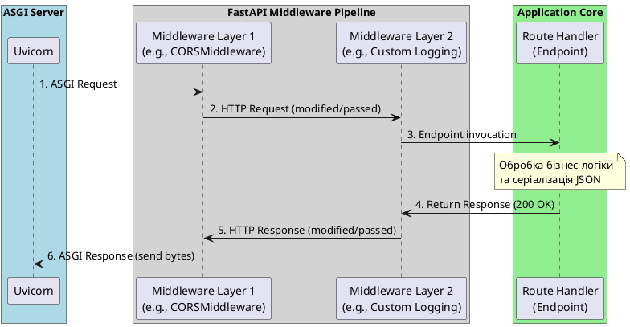

Створення надійного веб-додатку вимагає не лише реалізації його основної бізнес-логіки, але й побудови зрілої системи обробки виключень, надійної системи наскрізного логування/аудиту (через Middleware) та конфігурації безпеки крос-доменних запитів (CORS). У екосистемі FastAPI ці механізми реалізовані на базі стандартів ASGI та інтегровані з Pydantic.

У цій статті ми детально розглянемо обробку виключень у FastAPI, навчимося створювати глобальні обробники (Exception Handlers) для кастомізації помилок валідації, розберемо структуру ASGI Middleware та налаштуємо CORS для взаємодії з клієнтськими SPA-додатками.

---

## Частина I: Обробка помилок (HTTPException та Custom Exception Handlers)

Клієнтські додатки очікують від API передбачуваних, структурованих та семантично коректних відповідей про помилки. У разі критичної ситуації (наприклад, відсутність ресурсу або порушення бізнес-правила) сервер повинен повернути відповідний HTTP статус-код (наприклад, 404 або 400) та JSON-документ із детальним описом проблеми, уникаючи витоку внутрішніх трасувань стеків (stack trace) у клієнтську мережу.

---

### HTTPException: стандартні та структуровані помилки

Базовим інструментом для переривання обробки запиту у FastAPI є виключення **`fastapi.HTTPException`**.

На відміну від стандартного Python-виключення `Exception`, `HTTPException` є особливим класом, який FastAPI вміє автоматично перехоплювати під час виконання роуту та конвертувати в HTTP-відповідь.

Клас `HTTPException` приймає такі ключові параметри:

- `status_code` — ціле число (HTTP статус-код). Рекомендується використовувати константи з модуля `fastapi.status`.
- `detail` — опис помилки. Це може бути як звичайний рядок (`str`), так і будь-яка структура даних, що серіалізується в JSON (наприклад, `dict` або `list`).
- `headers` — необов'язковий словник додаткових HTTP-заголовків відповіді (наприклад, заголовок `WWW-Authenticate` для статус-коду 401).

#### Порівняння архітектурних концепцій: C# `ProblemDetails` (RFC 7807) ↔ FastAPI `HTTPException`

В екосистемі .NET Core загальноприйнятим стандартом для повернення помилок є специфікація **RFC 7807 (Problem Details for HTTP APIs)**. В ASP.NET Core для цього використовується клас `ProblemDetails` (або `ValidationProblemDetails`), який повертає стандартизований JSON-об'єкт.

За замовчуванням `HTTPException` у FastAPI повертає простіший словник типу `{"detail": "Повідомлення"}`. Проте розробник може легко структурувати параметр `detail`, щоб повністю відповідати стандарту `ProblemDetails`.

Порівняємо структури відповідей обох платформ:

::code-group

```json [FastAPI (RFC 7807 сумісний)]
{
    "detail": {
        "type": "https://kostyl.dev/errors/insufficient-funds",
        "title": "Недостатньо коштів на балансі",
        "status": 400,
        "detail": "На вашому рахунку 150.00 UAH. Спроба списання: 500.00 UAH",
        "instance": "/api/v1/accounts/123/withdraw"
    }
}
```

```json [ASP.NET Core (ProblemDetails)]
{
    "type": "https://kostyl.dev/errors/insufficient-funds",
    "title": "Недостатньо коштів на балансі",
    "status": 400,
    "detail": "На вашому рахунку 150.00 UAH. Спроба списання: 500.00 UAH",
    "instance": "/api/v1/accounts/123/withdraw"
}
```

::

Щоб реалізувати таку структуру у FastAPI, ми передаємо словник у параметр `detail`:

```python [main.py]
from fastapi import FastAPI, HTTPException, status

app = FastAPI()

@app.post("/accounts/{account_id}/withdraw")
async def withdraw(account_id: int, amount: float):
    user_balance = 150.00
    if amount > user_balance:
        # Передаємо структурований словник у detail
        raise HTTPException(
            status_code=status.HTTP_400_BAD_REQUEST,
            detail={
                "type": "https://kostyl.dev/errors/insufficient-funds",
                "title": "Недостатньо коштів на балансі",
                "status": 400,
                "detail": f"На вашому рахунку {user_balance:.2f} UAH. Спроба списання: {amount:.2f} UAH",
                "instance": f"/accounts/{account_id}/withdraw"
            }
        )
    return {"status": "success", "withdrawn": amount}
```

---

### Глобальні обробники помилок (`exception_handler`)

Пряме використання `raise HTTPException(...)` всередині сервісів бізнес-логіки є архітектурним антипатерном (leakage of concerns), оскільки прив'язує чистий код до конкретного веб-протоколу та статус-кодів HTTP.

Правильним підходом є:

1. Визначення власних чистих класів виключень на рівні домену (наприклад, `ProjectNotFoundError(Exception)`).
2. Створення глобальних **Exception Handlers** (обробників виключень) на рівні веб-інтерфейсу, які перехоплюють доменні помилки та трансформують їх на HTTP відповіді з потрібними статус-кодами.

У FastAPI глобальні обробники реєструються за допомогою декоратора `@app.exception_handler(ExceptionClass)`.

#### Порівняння концепцій: `IExceptionHandler` в C# ↔ `@app.exception_handler` у FastAPI

В ASP.NET Core (починаючи з .NET 8) для централізованої обробки виключень реалізують інтерфейс `IExceptionHandler` та підключають його в конвеєр middleware через `app.UseExceptionHandler()`.

У FastAPI механізм є більш декларативним: ми створюємо асинхронні функції, які приймають об'єкт запиту `Request` та об'єкт виниклого виключення `Exception`, а повертають об'єкт `JSONResponse`.

Порівняємо обидва підходи:

::code-group

```python [app_exception.py]
# Реєстрація обробника для кастомного класу помилки
@app.exception_handler(ProjectNotFoundError)
async def project_not_found_handler(request: Request, exc: ProjectNotFoundError):
    return JSONResponse(
        status_code=404,
        content={"error": "ProjectNotFound", "message": str(exc)}
    )
```

```csharp [ProjectNotFoundExceptionHandler.cs]
// Реалізація інтерфейсу в C#
public class ProjectNotFoundExceptionHandler : IExceptionHandler
{
    public async ValueTask<bool> TryHandleAsync(
        HttpContext httpContext, Exception exception, CancellationToken cancellationToken)
    {
        if (exception is not ProjectNotFoundException) return false;

        httpContext.Response.StatusCode = StatusCodes.Status404NotFound;
        await httpContext.Response.WriteAsJsonAsync(new {
            error = "ProjectNotFound",
            message = exception.Message
        }, cancellationToken);

        return true;
    }
}
```

::

#### Повний приклад використання кастомних обробників

Напишемо повністю робочу демонстраційну систему обробки доменних виключень:

```python [custom_exceptions_demo.py]
# custom_exceptions_demo.py
from fastapi import FastAPI, Request, status
from fastapi.responses import JSONResponse

app = FastAPI()

# --- ДОМЕННІ ВИКЛЮЧЕННЯ ---

class DomainException(Exception):
    """Базове виключення домену."""
    pass

class ProjectNotFoundError(DomainException):
    """Помилка: Проєкт не знайдено."""
    pass

class AccessDeniedError(DomainException):
    """Помилка: Відсутні права доступу."""
    pass

# --- ГЛОБАЛЬНІ ОБРОБНИКИ (EXCEPTION HANDLERS) ---

@app.exception_handler(ProjectNotFoundError)
async def project_not_found_handler(request: Request, exc: ProjectNotFoundError):
    # Повертаємо 404 статус
    return JSONResponse(
        status_code=status.HTTP_404_NOT_FOUND,
        content={
            "error_code": "PROJECT_NOT_FOUND",
            "message": str(exc),
            "path": request.url.path
        }
    )

@app.exception_handler(AccessDeniedError)
async def access_denied_handler(request: Request, exc: AccessDeniedError):
    # Повертаємо 403 статус
    return JSONResponse(
        status_code=status.HTTP_403_FORBIDDEN,
        content={
            "error_code": "FORBIDDEN",
            "message": str(exc),
            "path": request.url.path
        }
    )

@app.exception_handler(DomainException)
async def generic_domain_handler(request: Request, exc: DomainException):
    # Обробник для всіх інших доменних помилок (наприклад, 400 Bad Request)
    return JSONResponse(
        status_code=status.HTTP_400_BAD_REQUEST,
        content={
            "error_code": "BAD_REQUEST",
            "message": str(exc)
        }
    )

# --- БІЗНЕС-ЛОГІКА ТА МАРШРУТИ ---

# Симульовані дані
PROJECTS = {1: {"title": "TaskForge Backend", "owner_id": 10}}

@app.get("/projects/{project_id}")
async def get_project(project_id: int, current_user_id: int = 99):
    # 1. Ендпоінт не думає про статус-коди HTTP — він оперує виключеннями домену
    if project_id not in PROJECTS:
        raise ProjectNotFoundError(f"Проєкт із ID {project_id} не існує")

    project = PROJECTS[project_id]
    if project["owner_id"] != current_user_id:
        raise AccessDeniedError("У вас немає прав для перегляду цього проєкту")

    return project
```

### Запуск та тестування кастомних обробників

Запустимо веб-сайт додатка за допомогою Uvicorn:

::code-group

```bash [Linux / macOS]
uvicorn custom_exceptions_demo:app --reload
```

```powershell [PowerShell]
uvicorn custom_exceptions_demo:app --reload
```

::

Тепер перевіримо різні варіанти обробки помилок за допомогою cURL-запитів.

#### Сценарій 1: Проєкт не знайдено (Повернення 404 Status)

Надішлемо запит на отримання неіснуючого проєкту з ID `999`:

::code-group

```bash [Linux / macOS]
curl -X GET http://127.0.0.1:8000/projects/999
```

```powershell [PowerShell]
curl.exe -X GET http://127.0.0.1:8000/projects/999
```

::

::terminal-preview{title="Консольний вивід 404 помилки" :cursor="false"}

<div class="line"><span class="text-rose-400 font-bold">HTTP/1.1 404 Not Found</span></div>
<div class="line">Content-Type: application/json</div>
<div class="line"></div>
<div class="line">{"error_code":"PROJECT_NOT_FOUND","message":"Проєкт із ID 999 не існує","path":"/projects/999"}</div>
::

#### Сценарій 2: Доступ заборонено (Повернення 403 Status)

Надішлемо запит на отримання проєкту `1` без передачі `current_user_id` (за замовчуванням буде використано ID `99`):

::code-group

```bash [Linux / macOS]
curl -X GET http://127.0.0.1:8000/projects/1
```

```powershell [PowerShell]
curl.exe -X GET http://127.0.0.1:8000/projects/1
```

::

::terminal-preview{title="Консольний вивід 403 помилки" :cursor="false"}

<div class="line"><span class="text-rose-400 font-bold">HTTP/1.1 403 Forbidden</span></div>
<div class="line">Content-Type: application/json</div>
<div class="line"></div>
<div class="line">{"error_code":"FORBIDDEN","message":"У вас немає прав для перегляду цього проєкту","path":"/projects/1"}</div>
::

#### Сценарій 3: Успішне отримання проєкту (Повернення 200 OK)

Надішлемо запит на отримання проєкту `1`, передавши правильний `current_user_id=10`, який є власником проєкту:

::code-group

```bash [Linux / macOS]
curl -X GET "http://127.0.0.1:8000/projects/1?current_user_id=10"
```

```powershell [PowerShell]
curl.exe -X GET "http://127.0.0.1:8000/projects/1?current_user_id=10"
```

::

::terminal-preview{title="Консольний вивід успішного запиту" :cursor="false"}

<div class="line"><span class="text-green-400 font-bold">HTTP/1.1 200 OK</span></div>
<div class="line">Content-Type: application/json</div>
<div class="line"></div>
<div class="line">{"title":"TaskForge Backend","owner_id":10}</div>
::

---

### Помилки валідації Pydantic (RequestValidationError)

Коли вхідний запит не відповідає очікуваному типу даних (наприклад, передано рядок замість цілого числа або відсутнє обов'язкове поле моделі Pydantic), FastAPI під капотом перехоплює виключення Pydantic `ValidationError` та піднімає власне виключення **`fastapi.exceptions.RequestValidationError`**.

За замовчуванням вбудований обробник `RequestValidationError` повертає статус-код `422 Unprocessable Entity` із детальним списком помилок у форматі:

```json
{
    "detail": [
        {
            "type": "missing",
            "loc": ["body", "title"],
            "msg": "Field required",
            "input": null
        }
    ]
}
```

Проте для реальних SPA-додатків (React, Vue) такий складний вкладений список обробляти незручно. Клієнти зазвичай очікують плаский словник помилок, де ключем є назва поля, а значенням — текстова помилка:

```json
{
    "errors": {
        "title": "Поле є обов'язковим",
        "budget": "Значення має бути більшим за 0"
    }
}
```

Ми можемо перевизначити обробник `RequestValidationError` глобально для всього додатку, щоб змінити структуру вихідної помилки:

```python [validation_errors_demo.py]
# validation_errors_demo.py
from fastapi import FastAPI, Request, status
from fastapi.exceptions import RequestValidationError
from fastapi.responses import JSONResponse
from pydantic import BaseModel, Field

app = FastAPI()

# Глобально перевизначаємо обробник для RequestValidationError
@app.exception_handler(RequestValidationError)
async def custom_validation_exception_handler(request: Request, exc: RequestValidationError):
    errors_dict = {}

    # Проходимо по всьому списку помилок валідації
    for error in exc.errors():
        # loc містить шлях до поля, наприклад ["body", "title"] або ["body", "items", 2, "price"]
        # Візьмемо останній елемент шляху як назву поля
        field_name = error["loc"][-1] if error["loc"] else "custom_error"
        errors_dict[str(field_name)] = error["msg"]

    return JSONResponse(
        status_code=status.HTTP_422_UNPROCESSABLE_ENTITY,
        content={"errors": errors_dict}
    )

# --- МОДЕЛЬ ДЛЯ ПЕРЕВІРКИ ---

class ProjectSchema(BaseModel):
    title: str = Field(..., min_length=3)
    budget: float = Field(..., gt=0.0)

@app.post("/projects")
async def create_project(project: ProjectSchema):
    return {"status": "created", "project": project}
```

### Запуск та тестування кастомізації валідації

Запустимо веб-сайт додатка за допомогою Uvicorn:

::code-group

```bash [Linux / macOS]
uvicorn validation_errors_demo:app --reload
```

```powershell [PowerShell]
uvicorn validation_errors_demo:app --reload
```

::

Тепер надішлемо некоректний POST запит із занадто коротким `title` та нульовим `budget` за допомогою cURL:

::code-group

```bash [Linux / macOS]
curl -X POST http://127.0.0.1:8000/projects \
  -H "Content-Type: application/json" \
  -d '{"title": "Ab", "budget": 0.0}'
```

```powershell [PowerShell]
curl.exe -X POST http://127.0.0.1:8000/projects `
  -H "Content-Type: application/json" `
  -d '{"title": "Ab", "budget": 0.0}'
```

::

::terminal-preview{title="Консольний вивід кастомних помилок валідації" :cursor="false"}

<div class="line"><span class="text-rose-400 font-bold">HTTP/1.1 422 Unprocessable Entity</span></div>
<div class="line">Content-Type: application/json</div>
<div class="line"></div>
<div class="line">{"errors":{"title":"String should have at least 3 characters","budget":"Input should be greater than 0"}}</div>
::

Тепер клієнт отримує чистий плаский словник помилок, придатний для швидкого рендерингу підказок під полями вводу форми.

## Частина II: Конвеєр ASGI Middleware та вбудовані посередники

У сучасній веб-розробці виникає велика кількість наскрізних завдань (cross-cutting concerns), які мають виконуватися для кожного HTTP-запиту ще до того, як він потрапить у конкретний ендпоінт. Це логування запитів, автентифікація, вимірювання продуктивності, обробка CORS-заголовків, стиснення відповідей (Gzip), додавання заголовків безпеки тощо.

Для розв'язання цих завдань використовується патерн **Middleware (проміжне програмне забезпечення або посередники)**.

---

### ASGI Middleware Pipeline: як це працює під капотом

У FastAPI конвеєр посередників побудований на базі специфікації **ASGI** та архітектури **Onion Architecture (цибулева архітектура)**.

Кожен посередник загортає наступного посередника (або фінальний обробник маршруту) у ланцюжок. Запит проходить крізь усі шари конвеєра ззовні всередину, досягає ендпоінту, а сформована відповідь повертається назад тим самим шляхом зсередини назовні.

Візуалізуємо цей життєвий цикл запиту та відповіді за допомогою послідовності викликів у конвеєрі:

::plant-uml



::

Коли запит надходить на сервер Uvicorn:

1. Він потрапляє в перший (найбільш зовнішній) шар `Middleware Stack`.
2. Кожен посередник може:
    - Проаналізувати або модифікувати вхідний `Request` (наприклад, зчитати заголовок або перевірити токен).
    - Заблокувати запит і повернути відповідь самостійно (наприклад, повернути 401 Unauthorized, не передаючи запит далі).
    - Передати управління наступному посереднику за допомогою виклику `call_next`.
3. Після виконання ендпоінту відповідь `Response` піднімається вгору через той самий ланцюжок посередників. На цьому етапі вони можуть модифікувати заголовки або тіло відповіді (наприклад, додати час обробки).

---

### Порівняння конвеєрів: ASP.NET Core Middleware ↔ FastAPI Middleware Stack

В ASP.NET Core конвеєр обробки запитів будується у методі `Configure` (або безпосередньо у `Program.cs` у стилі Minimal API) через серію викликів розширень `app.Use...()` (наприклад, `UseRouting()`, `UseAuthentication()`, `UseAuthorization()`, `UseEndpoints()`). Порядок реєстрації є критично важливим.

У FastAPI механізм конвеєра працює аналогічно: перший доданий посередник виконується першим під час отримання запиту та останнім під час відправки відповіді.

Порівняємо реєстрацію ланцюжка посередників на обох платформах:

::code-group

```python [main.py]
# Реєстрація посередників у FastAPI (виконується в зворотному порядку реєстрації)
app.add_middleware(FirstMiddleware)
app.add_middleware(SecondMiddleware)

# Порядок виконання:
# Request -> SecondMiddleware -> FirstMiddleware -> Endpoint -> FirstMiddleware -> SecondMiddleware -> Response
```

```csharp [Program.cs]
// Реєстрація посередників в ASP.NET Core
app.UseMiddleware<FirstMiddleware>();
app.UseMiddleware<SecondMiddleware>();

// Порядок виконання:
// Request -> FirstMiddleware -> SecondMiddleware -> Endpoint -> SecondMiddleware -> FirstMiddleware -> Response
```

::

::warning
**Важлива відмінність у порядку виконання**:

В ASP.NET Core посередники виконуються у прямому порядку їхньої реєстрації (`First -> Second -> Endpoint`).

У FastAPI (через особливості реалізації стек-конвеєра у Starlette) посередники обгортають один одного рекурсивно. Тому останній зареєстрований посередник через `app.add_middleware` стає найбільш **зовнішнім** і виконується **першим** на фазі запиту!

::

---

### Три рівні імплементації Middleware у FastAPI

У FastAPI є три способи написання кастомних посередників, кожен із яких має свій баланс між простотою написання та швидкодією.

#### Рівень 1: Функція-декоратор `@app.middleware("http")`

Найпростіший та найбільш декларативний спосіб створення HTTP-посередника. Ідеально підходить для швидких завдань, таких як вимірювання часу запиту або додавання простих заголовків.

```python [decorator_middleware.py]
import time
from fastapi import FastAPI, Request

app = FastAPI()

@app.middleware("http")
async def add_process_time_header(request: Request, call_next):
    # 1. SETUP ФАЗА (до виконання роуту)
    start_time = time.perf_counter()

    # 2. Передача контролю далі в конвеєр
    response = await call_next(request)

    # 3. CLEANUP ФАЗА (після виконання роуту)
    process_time = time.perf_counter() - start_time
    response.headers["X-Process-Time"] = f"{process_time:.6f}"

    return response
```

#### Рівень 2: Клас, що успадковує `BaseHTTPMiddleware`

Дозволяє реалізувати посередника в ООП-стилі. Це спрощує передачу конфігураційних параметрів під час реєстрації посередника та полегшує структурування коду.

```python [class_middleware.py]
from fastapi import FastAPI, Request
from starlette.middleware.base import BaseHTTPMiddleware
from starlette.responses import Response

class CustomHeaderMiddleware(BaseHTTPMiddleware):
    def __init__(self, app, header_name: str, header_value: str):
        # Обов'язково викликаємо конструктор базового класу
        super().__init__(app)
        self.header_name = header_name
        self.header_value = header_value

    async def dispatch(self, request: Request, call_next) -> Response:
        # Викликаємо наступний посередник
        response = await call_next(request)
        # Додаємо сконфігурований заголовок
        response.headers[self.header_name] = self.header_value
        return response

app = FastAPI()

# Реєструємо клас-посередник та передаємо додаткові аргументи
app.add_middleware(
    CustomHeaderMiddleware,
    header_name="X-Custom-System",
    header_value="TaskForgeEngine-1.0"
)
```

#### Рівень 3: Чистий ASGI-посередник (Pure ASGI Middleware)

Найбільш низькорівневий, але **найшвидший** тип посередника.

##### Чому `@app.middleware("http")` та `BaseHTTPMiddleware` є повільними?

Під капотом `BaseHTTPMiddleware` створює асинхронні задачі (`asyncio.create_task`) та обгортає потоки отримання/відправки тіла запиту, щоб перетворити низькорівневі ASGI-потоки на високорівневі об'єкти `Request` та `Response`. Це додає значний оверхед на процесорний час та виділення пам'яті (memory allocation) на кожен HTTP-запит. Для високопродуктивних систем (Highload) це може стати вузьким місцем.

**Pure ASGI Middleware** взаємодіє з сервером напряму через ASGI-інтерфейс: функцію, яка приймає три параметри: `scope` (словник метаданих з'єднання), `receive` (асинхронний метод читання тіла запиту) та `send` (асинхронний метод відправки відповіді).

Розглянемо приклад чистого ASGI посередника для додавання заголовка безпеки:

```python [pure_asgi_middleware.py]
# pure_asgi_middleware.py
from fastapi import FastAPI

class PureASGIHeaderMiddleware:
    def __init__(self, app):
        self.app = app

    async def __call__(self, scope, receive, send):
        # Ми обробляємо лише HTTP-запити (ігноруємо WebSocket або Lifespan)
        if scope["type"] != "http":
            await self.app(scope, receive, send)
            return

        # Декоруємо функцію відправки відповідей send
        async def custom_send(message):
            # Якщо повідомлення є стартом HTTP-відповіді, додаємо заголовок
            if message["type"] == "http.response.start":
                # Перетворюємо headers на список кортежів байт (вимога ASGI специфікації)
                headers = list(message.get("headers", []))
                headers.append((b"x-pure-asgi", b"true"))
                message["headers"] = headers

            # Передаємо повідомлення далі ASGI-серверу
            await send(message)

        # Викликаємо додаток, передаючи оригінальний scope, receive та модифікований send
        await self.app(scope, receive, custom_send)

app = FastAPI()

# Підключаємо чистий ASGI посередник
app.add_middleware(PureASGIHeaderMiddleware)

@app.get("/")
async def index():
    return {"message": "Hello from Pure ASGI Middleware!"}
```

::tip
Усі вбудовані критично важливі посередники у FastAPI (наприклад, `CORSMiddleware`, `GZipMiddleware`) написані як **Pure ASGI Middleware** для досягнення максимальної пропускної спроможності. Використовуйте цей підхід для критичних для продуктивності компонентів.

::

---

## Частина III: Створення практичних кастомних Middleware та конфігурація CORS

Концептуальне розуміння конвеєра дозволяє перейти до вирішення реальних інженерних задач: побудови системи наскрізного трасування запитів (Correlation ID), вимірювання продуктивності та налаштування безпеки міждоменних запитів (CORS) для SPA-клієнтів.

---

### Трасування запитів (Correlation ID) через ContextVars

У складних розподілених системах (мікросервісах) критично важливо мати можливість простежити весь шлях виконання запиту через усі шари додатка та бази даних. Для цього кожному вхідному запиту присвоюється унікальний ідентифікатор — **Request ID** або **Correlation ID** (зазвичай UUID).

Цей ідентифікатор має автоматично:
1. Додаватися до кожного логу, який записується під час обробки поточного запиту.
2. Повертатися клієнту у відповіді в заголовку `X-Request-ID`.

#### Важлива проблема асинхронності: Чому не можна використовувати глобальні змінні?

В асинхронних додатках один потік процесора (OS thread) паралельно обробляє тисячі запитів клієнтів, швидко перемикаючись між ними при кожній асинхронній операції (`await`). 
* Якщо ми збережемо Request ID у звичайній глобальній змінній модуля, при перемиканні контексту (context switch) ідентифікатор одного користувача перезапише ідентифікатор іншого.
* В ASP.NET Core для зберігання контексту запиту використовується клас `AsyncLocal<T>`, який ізолює дані в межах логічного потоку виконання.
* У Python аналогом є стандартна бібліотека **`contextvars`** (PEP 567). Створена в ній змінна `ContextVar` зберігає власне унікальне значення для кожної асинхронної задачі (Task), гарантуючи ізоляцію та безпеку виконання запитів (Concurrency Safety).

Створимо комплексний приклад посередника, який генерує Request ID, зберігає його в `ContextVar`, логує час обробки та повертає заголовки клієнту:

```python [custom_middlewares_demo.py]
# custom_middlewares_demo.py
import time
import uuid
from contextvars import ContextVar
from fastapi import FastAPI, Request

# 1. Створюємо контекстну змінну для збереження Request ID (аналог AsyncLocal в C#)
request_id_var: ContextVar[str] = ContextVar("request_id", default="")

# Функція-помічник для отримання Request ID у будь-якому місці коду (наприклад, у логері)
def get_current_request_id() -> str:
    return request_id_var.get()

app = FastAPI()

# 2. Посередник для трасування та логування запитів
@app.middleware("http")
async def audit_and_tracing_middleware(request: Request, call_next):
    # А. Зчитуємо Request ID від клієнта або генеруємо новий UUID
    client_request_id = request.headers.get("X-Request-ID")
    request_id = client_request_id if client_request_id else str(uuid.uuid4())
    
    # Б. Встановлюємо значення в ContextVar (ізольоване для поточного асинхронного таска)
    token = request_id_var.set(request_id)
    
    start_time = time.perf_counter()
    
    # Виводимо структурований лог початку запиту
    print(f"[LOG] [{request_id}] START: {request.method} {request.url.path}")
    
    try:
        # В. Передаємо запит далі в конвеєр
        response = await call_next(request)
        
        # Г. Додаємо заголовок з Request ID у відповідь клієнту
        response.headers["X-Request-ID"] = request_id
        
        # Обчислюємо час обробки запиту
        process_time = time.perf_counter() - start_time
        response.headers["X-Process-Time"] = f"{process_time:.6f}"
        
        # Виводимо структурований лог завершення запиту
        print(f"[LOG] [{request_id}] END: {request.method} {request.url.path} | Status: {response.status_code} | Time: {process_time:.6f}s")
        
        return response
        
    finally:
        # Д. Обов'язково скидаємо значення контексту до початкового стану після завершення
        request_id_var.reset(token)

# --- ЕНДПОІНТИ ---

@app.get("/items/{item_id}")
async def read_item(item_id: int):
    # Звертаємося до нашої контекстної змінної
    current_rid = get_current_request_id()
    
    # Будь-який внутрішній сервіс тепер може отримати цей ID без прокидання через параметри!
    print(f"[LOG] [{current_rid}] Бізнес-логіка: обробляємо товар з ID {item_id}")
    
    return {"item_id": item_id, "name": f"Product {item_id}", "request_id": current_rid}
```

---

##### Запуск та тестування трасування

Запустимо веб-сайт додатка за допомогою Uvicorn:

::code-group
```bash [Linux / macOS]
uvicorn custom_middlewares_demo:app --reload
```
```powershell [PowerShell]
uvicorn custom_middlewares_demo:app --reload
```
::

Надішлемо тестовий GET запит за допомогою cURL, передавши власний заголовок `X-Request-ID`:

::code-group
```bash [Linux / macOS]
curl -i -X GET http://127.0.0.1:8000/items/42 \
  -H "X-Request-ID: my-custom-correlation-123"
```
```powershell [PowerShell]
curl.exe -i -X GET http://127.0.0.1:8000/items/42 `
  -H "X-Request-ID: my-custom-correlation-123"
```
::

::terminal-preview{title="Консольний вивід відповіді з заголовками трасування" :cursor="false"}
<div class="line"><span class="text-green-400 font-bold">HTTP/1.1 200 OK</span></div>
<div class="line">content-length: 83</div>
<div class="line">content-type: application/json</div>
<div class="line"><strong class="font-bold">x-request-id:</strong> my-custom-correlation-123</div>
<div class="line"><strong class="font-bold">x-process-time:</strong> 0.001254</div>
<div class="line"></div>
<div class="line">{"item_id":42,"name":"Product 42","request_id":"my-custom-correlation-123"}</div>
::

У терміналі сервера ми побачимо наскрізний лаг, де кожен рядок (початок, середина бізнес-логіки та завершення) містить однаковий Correlation ID:

::terminal-preview{title="Наскрізні логи сервера" :cursor="false"}
<div class="line">[LOG] [my-custom-correlation-123] START: GET /items/42</div>
<div class="line">[LOG] [my-custom-correlation-123] Бізнес-логіка: обробляємо товар з ID 42</div>
<div class="line">[LOG] [my-custom-correlation-123] END: GET /items/42 | Status: 200 | Time: 0.001254s</div>
<div class="line">INFO:     127.0.0.1:54323 - "GET /items/42 HTTP/1.1" 200 OK</div>
::

Завдяки цьому ми отримуємо повну простежуваність логів (observability) без передачі `request_id` як параметру у кожну функцію чи сервіс.

---

### CORS (Cross-Origin Resource Sharing)

Коли сучасний веб-додаток (наприклад, React або Vue SPA, запущений на `http://localhost:3000`) робить HTTP-запит до нашого FastAPI сервера (що працює на `http://localhost:8000`), браузер з міркувань безпеки блокує відповідь, якщо сервер явно не дозволив взаємодію з цим походженням (Origin).

Для налаштування доступу використовується специфікація CORS. 

Перед відправкою важких запитів (наприклад, POST, PUT або запитів із кастомними заголовками) браузер автоматично надсилає попередній легкий запит **Preflight Request** із методом `OPTIONS`, перевіряючи дозволи сервера.

#### Порівняння конфігурацій CORS: ASP.NET Core ↔ FastAPI

В ASP.NET Core для CORS створюється іменована або дефолтна політика у сервісах, яка потім підключається в конвеєр через `app.UseCors("MyPolicy")`.

У FastAPI конфігурація CORS реалізована через вбудований ASGI-посередник **`fastapi.middleware.cors.CORSMiddleware`**.

Порівняємо налаштування дозволів на обох платформах:

::code-group
```python [cors_setup.py]
from fastapi import FastAPI
from fastapi.middleware.cors import CORSMiddleware

app = FastAPI()

# 1. Визначаємо список дозволених джерел (Origins)
origins = [
    "http://localhost:3000",      # Локальний React/Vue
    "https://taskforge.kostyl.dev" # Production SPA
]

# 2. Підключаємо CORSMiddleware
app.add_middleware(
    CORSMiddleware,
    allow_origins=origins,            # Дозволені домени
    allow_credentials=True,           # Дозволити передачу Cookies/Auth headers
    allow_methods=["GET", "POST", "PUT", "DELETE"], # Дозволені HTTP методи
    allow_headers=["Content-Type", "X-Request-ID", "Authorization"], # Дозволені заголовки
)
```
```csharp [Program.cs]
var builder = WebApplication.CreateBuilder(args);

// Реєструємо сервіс політики CORS
builder.Services.AddCors(options =>
{
    options.AddPolicy("AllowSPA", policy =>
    {
        policy.WithOrigins("http://localhost:3000", "https://taskforge.kostyl.dev")
              .AllowAnyMethod()
              .AllowAnyHeader()
              .AllowCredentials();
    });
});

var app = builder.Build();

// Підключаємо в конвеєр
app.UseCors("AllowSPA");
```
::

::caution
**Продакшн безпека**:

Ніколи не залишайте конфігурацію `allow_origins=["*"]` у робочому середовищі (Production), якщо ваш додаток використовує авторизацію через Cookies або заголовки Bearer. Це створює серйозну вразливість для атак типу CSRF (Cross-Site Request Forgery). Дозволяйте лише перевірені домени.

::

---

## Частина IV: Довідник Middleware та лімітування запитів (Rate Limiting)

Окрім налаштування CORS та Correlation ID, будь-який публічний API потребує захисту інфраструктурного рівня від спаму, DDoS-атак, а також підміни системних заголовків. Розглянемо детальний опис усіх вбудованих посередників (Middleware) у FastAPI та розберемо архітектуру лімітування запитів за допомогою бібліотеки `slowapi`.

---

### Довідник вбудованих Middleware у FastAPI

FastAPI базується на Starlette, тому успадковує повний набір високоефективних вбудованих ASGI-посередників. Нижче наведено детальний опис кожного з них у стилі технічної документації.

#### 1. `CORSMiddleware`

Керує дозволами міждоменного обміну ресурсами. Додає необхідні заголовки (`Access-Control-Allow-Origin` тощо) до відповідей та автоматично обробляє preflight-запити `OPTIONS`.

::field-group
::field{name="allow_origins" type="list[str]" default="[]"}
Список походжень (Origins), яким дозволено робити запити. Наприклад, `["http://localhost:3000"]`. Можна використовувати `["*"]` для публічних API.
::

::field{name="allow_credentials" type="bool" default="False"}
Вказує, чи підтримуються запити з використанням Cookies, авторизаційних заголовків або клієнтських SSL-сертифікатів.
::

::field{name="allow_methods" type="list[str]" default="['GET']"}
Список дозволених HTTP-методів. Наприклад, `["GET", "POST", "DELETE"]`. Можна використовувати `["*"]`.
::

::field{name="allow_headers" type="list[str]" default="[]"}
Список дозволених HTTP-заголовків запиту. Можна використовувати `["*"]`.
::

::field{name="expose_headers" type="list[str]" default="[]"}
Заголовки відповіді, до яких браузер клієнта може мати доступ.
::

::field{name="max_age" type="int" default="600"}
Максимальний час (у секундах), протягом якого браузер може кешувати результати preflight OPTIONS запиту.
::
::

---

#### 2. `TrustedHostMiddleware`

Захищає додаток від **Host Header Attacks** шляхом валідації відповідності заголовка `Host` білому списку.

::field-group
::field{name="allowed_hosts" type="list[str]" required="True"}
Список дозволених доменних імен. Підтримує символи підстановки (wildcards) на початку хоста, наприклад `["*.kostyl.dev", "localhost"]`. Якщо хост не відповідає списку, повертається `400 Bad Request`.
::
::

---

#### 3. `HTTPSRedirectMiddleware`

Примусово перенаправляє весь нешифрований HTTP-трафік на захищений протокол HTTPS.

::field-group
::field{name="Опис" type="без параметрів"}
Автоматично перехоплює будь-які запити до `http://` та повертає редірект `307 Temporary Redirect` на відповідний `https://` URL.
::
::

::note
На практиці в архітектурі мікросервісів примусовий редірект на HTTPS часто налаштовують на рівні Reverse Proxy (Nginx, Traefik, AWS ALB) або Ingress-контролера в Kubernetes, щоб звільнити додаток FastAPI від зайвої роботи з шифрування трафіку.

::

---

#### 4. `GZipMiddleware`

Автоматично стискає відповіді сервера за допомогою алгоритму `gzip`, якщо клієнт надіслав відповідний заголовок `Accept-Encoding: gzip`. Це суттєво зменшує обсяг переданих мережею даних.

::field-group
::field{name="minimum_size" type="int" default="500"}
Мінімальний розмір відповіді у байтах, починаючи з якого застосовується стиснення. Менші відповіді стискати неефективно через додаткові витрати процесора.
::

::field{name="compresslevel" type="int" default="9"}
Рівень стиснення (від 1 до 9). Рівень 9 дає максимальне стиснення, але споживає найбільше ресурсів CPU.
::
::

---

#### 5. `SessionMiddleware`

Додає підтримку підписаних Cookies-сесій. Весь стан сесії зберігається безпосередньо у клієнта у зашифрованій Cookie-змінній, а сервер розкодовує її за допомогою секретного ключа.

::field-group
::field{name="secret_key" type="str" required="True"}
Секретний ключ для підпису сесійних кук. Має бути криптографічно стійким.
::

::field{name="session_cookie" type="str" default="'session'"}
Назва Cookie-файлу, в якому зберігатиметься сесія.
::

::field{name="max_age" type="int | None" default="1209600"}
Час життя сесії в секундах (за замовчуванням 14 днів). Якщо встановлено `None`, кука живе до закриття браузера.
::

::field{name="same_site" type="str" default="'lax'"}
Стратегія SameSite для куки (`'lax'`, `'strict'` або `'none'`) для захисту від CSRF-атак.
::

::field{name="https_only" type="bool" default="False"}
Вказує, чи надсилати куку сесії тільки по захищеному каналу HTTPS.
::
::

---

#### 6. `WSGIMiddleware`

Дозволяє інтегрувати старі класичні WSGI-додатки (наприклад, Flask або Django) безпосередньо всередину вашого асинхронного FastAPI (ASGI) додатка.

::field-group
::field{name="app" type="WSGIApplication" required="True"}
Екземпляр Flask, Django чи іншого WSGI додатку, який монтується в окремий шлях.
::
::

---

### Детальний розбір бібліотеки `slowapi`

Бібліотека **`slowapi`** — це адаптація популярного Python-пакета `limits` для FastAPI, яка надає інструменти декларативного та програмного лімітування частоти запитів.

#### 1. Архітектура класу `Limiter`

Створення лімітера починається з ініціалізації об'єкта класу `Limiter`.

::field-group
::field{name="key_func" type="Callable" required="True"}
Функція, яка приймає `Request` та повертає рядок-ідентифікатор клієнта (наприклад, IP-адресу чи ID користувача). Стандартна функція — `slowapi.util.get_remote_address`.
::

::field{name="default_limits" type="list[str]" default="[]"}
Глобальні ліміти, які будуть застосовані до **всіх** ендпоінтів у додатку за замовчуванням (наприклад, `["100/minute"]`).
::

::field{name="application_limits" type="list[str]" default="[]"}
Ліміти на весь додаток в цілому (незалежно від клієнта). Наприклад, захист від перевантаження всього API.
::

::field{name="headers_enabled" type="bool" default="False"}
Якщо встановлено `True`, бібліотека автоматично додаватиме HTTP-заголовки лімітування до кожної відповіді:

- `X-RateLimit-Limit` — загальний ліміт.
- `X-RateLimit-Remaining` — кількість доступних запитів, що залишилися.
- `X-RateLimit-Reset` — час UNIX-епохи, коли ліміт буде скинуто.

::

::field{name="strategy" type="str" default="'fixed-window'"}
Алгоритм підрахунку лімітів (див. стратегії нижче).
::

::field{name="storage_uri" type="str" default="'memory://'"}
Адреса сховища для збереження лічильників запитів. За замовчуванням використовується локальна пам'ять процесу. Для кластерів або мікросервісів у продакшені налаштовують Redis: `redis://localhost:6379/0`.
::
::

---

#### 2. Стратегії лімітування запитів

`slowapi` підтримує три стратегії віконного підрахунку запитів:

1. **Fixed Window (Фіксоване вікно)**:
    - Найпростіша стратегія. Час життя вікна прив'язаний до фіксованих границь часу (наприклад, від `12:00:00` до `12:01:00`).
    - _Проблема_: Клієнт може надіслати 5 запитів о `12:00:59` та ще 5 запитів о `12:01:01`. Технічно за 2 секунди відбулося 10 запитів, що вдвічі перевищує ліміт `5/minute`, але стратегія фіксованого вікна пропустить цей сплеск.

2. **Fixed Window with Elastic Expiry (Еластичне фіксоване вікно)**:
    - Подібне до фіксованого вікна, але час скидання ліміту зсувається вперед при кожному перевищенні ліміту. Це блокує спам-ботів на довший час, якщо вони продовжують атакувати сервер.

3. **Moving Window (Ковзне вікно)**:
    - Найбільш точний алгоритм. Він зберігає точний час кожного запиту в базі даних (Redis) і перевіряє інтервал динамічно назад у часі. Якщо ліміт `5/minute`, то при кожному запиті перевіряється остання 60-секундна секунда. Цей алгоритм виключає можливість сплесків на межах хвилин, але потребує більше пам'яті для збереження часових міток.

---

#### 3. Використання декораторів

`slowapi` надає декоратори для керування лімітами на рівні окремих роутів:

- **`@limiter.limit("5/minute")`** — застосовує локальне обмеження до роуту. Можна комбінувати кілька обмежень: `@limiter.limit("100/day;5/minute")`.
- **`@limiter.shared_limit("10/minute", scope="auth")`** — ліміт розділяється між групою ендпоінтів (наприклад, однакові обмеження на `/login` та `/register` сумарно).
- **`@limiter.exempt`** — повністю виключає роут із глобальних лімітів `default_limits`.

---

#### 4. Кастомна функція ключа: лімітування авторизованих користувачів

Замість використання простої IP-адреси, у реальних системах краще лімітувати запити за унікальним ID авторизованого користувача, а для анонімів — за IP:

```python [custom_rate_limiter.py]
# custom_rate_limiter.py
from fastapi import Request
from slowapi.util import get_remote_address

def get_user_or_ip_limit_key(request: Request) -> str:
    """
    Повертає ключ лімітування: ID користувача, якщо він авторизований,
    або IP-адресу для анонімних запитів.
    """
    # Припускаємо, що попередній middleware записав об'єкт користувача у request.state.user
    user = getattr(request.state, "user", None)
    if user and hasattr(user, "id"):
        return f"user_id:{user.id}"

    # Резервний варіант — IP-адреса клієнта
    return get_remote_address(request)
```

---

#### Порівняльна таблиця архітектурних концепцій

```
┌──────────────────────────────────────┬──────────────────────────────────────┐
│        ASP.NET Rate Limiting         │           slowapi (FastAPI)          │
├──────────────────────────────────────┼──────────────────────────────────────┤
│ ✅ Вбудовано в фреймворк (.NET 7+)    │ ❌ Потребує зовнішньої бібліотеки    │
│ ✅ Складні алгоритми (Token Bucket)  │ ✅ Простий синтаксис декларацій      │
│ ✅ Конфігурація через C# DI          │ ✅ Інтеграція через декоратори       │
│ ✅ Підтримка черг запитів (Queuing)  │ ❌ Запити відхиляються миттєво        │
└──────────────────────────────────────┴──────────────────────────────────────┘
```

---

#### Повний робочий приклад: Безпека та Rate Limiter у FastAPI

Напишемо повністю робочу демонстраційну систему, яка обмежує кількість запитів клієнта до 5 запитів на хвилину, а при перевищенні ліміту повертає структуровану помилку:

```python [security_and_rate_limit_demo.py]
# security_and_rate_limit_demo.py
from fastapi import FastAPI, Request, status
from fastapi.responses import JSONResponse
from fastapi.middleware.trustedhost import TrustedHostMiddleware
from slowapi import Limiter
from slowapi.util import get_remote_address
from slowapi.errors import RateLimitExceeded

# 1. Ініціалізуємо лімітер (ідентифікація за IP-адресою відправника)
limiter = Limiter(key_func=get_remote_address)
app = FastAPI(title="Security & Rate Limiting Demo")
app.state.limiter = limiter

# 2. Додаємо кастомний обробник перевищення ліміту для повернення гарного JSON
@app.exception_handler(RateLimitExceeded)
async def custom_rate_limit_handler(request: Request, exc: RateLimitExceeded):
    return JSONResponse(
        status_code=status.HTTP_429_TOO_MANY_REQUESTS,
        content={
            "error": "TOO_MANY_REQUESTS",
            "message": "Ви перевищили ліміт запитів. Спробуйте пізніше.",
            "limit": exc.detail
        }
    )

# 3. Додаємо TrustedHostMiddleware (дозволяємо лише localhost та 127.0.0.1)
app.add_middleware(
    TrustedHostMiddleware,
    allowed_hosts=["localhost", "127.0.0.1"]
)

# 4. Захищаємо ендпоінт правилом: максимум 5 запитів на хвилину
@app.get("/ping")
@limiter.limit("5/minute")
async def ping(request: Request):
    return {"message": "pong"}
```

---

##### Запуск та тестування лімітування запитів

Запустимо веб-сайт додатка за допомогою Uvicorn:

::code-group
```bash [Linux / macOS]
uvicorn security_and_rate_limit_demo:app --reload
```
```powershell [PowerShell]
uvicorn security_and_rate_limit_demo:app --reload
```
::

Тепер надішлемо швидку серію запитів до ендпоінту `/ping` через cURL. Перші 5 запитів пройдуть успішно:

::code-group
```bash [Linux / macOS]
curl -i -X GET http://127.0.0.1:8000/ping
```
```powershell [PowerShell]
curl.exe -i -X GET http://127.0.0.1:8000/ping
```
::

::terminal-preview{title="Консольний вивід успішного запиту" :cursor="false"}
<div class="line"><span class="text-green-400 font-bold">HTTP/1.1 200 OK</span></div>
<div class="line">Content-Type: application/json</div>
<div class="line"></div>
<div class="line">{"message":"pong"}</div>
::

Шостий запит, надісланий протягом тієї ж хвилини, буде негайно відхилений лімітером:

::terminal-preview{title="Консольний вивід перевищення ліміту (429)" :cursor="false"}
<div class="line"><span class="text-rose-400 font-bold">HTTP/1.1 429 Too Many Requests</span></div>
<div class="line">Content-Type: application/json</div>
<div class="line"></div>
<div class="line">{"error":"TOO_MANY_REQUESTS","message":"Ви перевищили ліміт запитів. Спробуйте пізніше.","limit":"5 per 1 minute"}</div>
::

Спробуємо також звернутися до сервера, підмінивши заголовок `Host` на недозволений домен:

::code-group
```bash [Linux / macOS]
curl -i -X GET http://127.0.0.1:8000/ping -H "Host: malicious-domain.com"
```
```powershell [PowerShell]
curl.exe -i -X GET http://127.0.0.1:8000/ping -H "Host: malicious-domain.com"
```
::

::terminal-preview{title="Консольний вивід відхилення хоста (400)" :cursor="false"}
<div class="line"><span class="text-rose-400 font-bold">HTTP/1.1 400 Bad Request</span></div>
<div class="line">Content-Type: text/plain; charset=utf-8</div>
<div class="line">Content-Length: 11</div>
<div class="line"></div>
<div class="line">Invalid host</div>
::

`TrustedHostMiddleware` миттєво відхилив запит, убезпечивши наш додаток від потенційних атак підміни хоста.

---

## Частина V: Практичні вправи та інтеграція в TaskForge

Для закріплення знань про обробку помилок, конвеєр посередників та механізми безпеки (CORS, Rate Limiting) у FastAPI, виконаємо серію практичних вправ різного рівня складності. Після цього ми розробимо самодостатній мікросервіс для збереження конфіденційних даних та інтегруємо обробку помилок і посередники у наш основний проєкт **TaskForge**.

---

### Практичні вправи

#### Вправа 1: Глобальний конверт помилок (Global Custom Envelope Exception Handler)

**Завдання**: Написати глобальний обробник для непередбачених помилок (`Exception`), який перехоплює будь-які необроблені виключення, логує їх за допомогою стандартного логера `logging` (включаючи повний стек-трейс) та повертає JSON-відповідь зі статус-кодом `500 Internal Server Error`. Формат відповіді має відповідати єдиному шаблону:

```json
{
    "error": "INTERNAL_SERVER_ERROR",
    "message": "Внутрішня помилка сервера. Будь ласка, зверніться до служби підтримки.",
    "details": null
}
```

##### Концептуальне порівняння з C# / ASP.NET Core

В ASP.NET Core 8 для глобального перехоплення виключень ми створюємо клас, що реалізує інтерфейс `IExceptionHandler` (метод `TryWriteAsync`), та реєструємо його за допомогою `builder.Services.AddExceptionHandler<GlobalExceptionHandler>()` та `app.UseExceptionHandler()`.
У FastAPI аналогом є реєстрація глобального обробника для базового класу `Exception` за допомогою декоратора `@app.exception_handler(Exception)`.

Реалізуємо це рішення:

```python [global_envelope_exception.py]
# global_envelope_exception.py
import logging
import traceback
from fastapi import FastAPI, Request, status
from fastapi.responses import JSONResponse

# Налаштовуємо стандартне логування
logging.basicConfig(level=logging.ERROR, format="%(asctime)s - %(levelname)s - %(message)s")
logger = logging.getLogger("GlobalLogger")

app = FastAPI(title="Global Error Envelope Demo")

# Глобальний обробник усіх непередбачених помилок
@app.exception_handler(Exception)
async def global_exception_handler(request: Request, exc: Exception):
    # Логуємо помилку разом зі стек-трейсом
    logger.error(f"Необроблена помилка під час обробки {request.method} {request.url.path}: {str(exc)}")
    logger.error(traceback.format_exc())

    # Повертаємо уніфіковану відповідь
    return JSONResponse(
        status_code=status.HTTP_500_INTERNAL_SERVER_ERROR,
        content={
            "error": "INTERNAL_SERVER_ERROR",
            "message": "Внутрішня помилка сервера. Будь ласка, зверніться до служби підтримки.",
            "details": None
        }
    )

@app.get("/trigger-error")
async def trigger_error():
    # Симулюємо непередбачену помилку (наприклад, ZeroDivisionError)
    result = 1 / 0
    return {"result": result}
```

---

#### Вправа 2: Кастомний Middleware для логування та трасування (Correlation ID Middleware)

**Завдання**: Створити посередник на основі `BaseHTTPMiddleware`, який генерує унікальний `Correlation-ID` (UUID) для кожного запиту, зберігає його в асинхронно-безпечному контексті `contextvars.ContextVar`, додає заголовок `X-Correlation-ID` до HTTP-відповіді, а також логує час початку, завершення та тривалість виконання запиту.

##### Концептуальне порівняння з C# / ASP.NET Core

В .NET для передачі контексту крізь асинхронні виклики використовується `AsyncLocal<T>`. Для трасування ми зчитуємо `HttpContext.TraceIdentifier` або налаштовуємо логування через Serilog (використовуючи `LogContext.PushProperty`).
У Python аналогом `AsyncLocal<T>` є модуль `contextvars`. Він гарантує, що значення унікального ID не змішається між різними конкурентними асинхронними тасками в межах одного Event Loop.

Реалізуємо цей посередник:

```python [trace_logging_middleware.py]
# trace_logging_middleware.py
import time
import uuid
import logging
from contextvars import ContextVar
from fastapi import FastAPI, Request
from starlette.middleware.base import BaseHTTPMiddleware

# Асинхронно-безпечний контекст для збереження Correlation ID
correlation_id_var: ContextVar[str] = ContextVar("correlation_id", default="")

# Налаштовуємо логування, додаючи correlation_id до кожного запису
logging.basicConfig(level=logging.INFO, format="[%(asctime)s] [%(levelname)s] [ID: %(correlation_id)s] %(message)s")
logger = logging.getLogger("TraceLogger")

# Спеціальний фільтр для логера, який підтягує значення з contextvars
class CorrelationIdFilter(logging.Filter):
    def filter(self, record):
        record.correlation_id = correlation_id_var.get()
        return True

logger.addFilter(CorrelationIdFilter())

app = FastAPI(title="Correlation ID Tracing Demo")

class CorrelationIdMiddleware(BaseHTTPMiddleware):
    async def dispatch(self, request: Request, call_next):
        # 1. Генеруємо або зчитуємо існуючий Correlation ID із заголовків
        corr_id = request.headers.get("X-Correlation-ID", str(uuid.uuid4()))

        # 2. Встановлюємо значення у contextvars
        token = correlation_id_var.set(corr_id)

        start_time = time.perf_counter()
        logger.info(f"Початок запиту: {request.method} {request.url.path}")

        try:
            # 3. Передаємо запит далі по конвеєру
            response = await call_next(request)
        finally:
            # 4. Вимірюємо тривалість обробки
            process_time = time.perf_counter() - start_time
            logger.info(f"Завершення запиту: {request.method} {request.url.path} зі статусом {response.status_code}. Час: {process_time:.4f}s")

            # 5. Додаємо Correlation ID до заголовків відповіді
            response.headers["X-Correlation-ID"] = corr_id

            # 6. Скидаємо значення contextvars до попереднього
            correlation_id_var.reset(token)

        return response

# Додаємо посередник до конвеєра
app.add_middleware(CorrelationIdMiddleware)

@app.get("/data")
async def get_data():
    logger.info("Виконання бізнес-логіки ендпоінту...")
    return {"status": "success", "data": "Деякі конфіденційні дані"}
```

---

#### Вправа 3: Кастомний Rate Limiter на основі ковзного вікна (Sliding Window Rate Limiter)

**Завдання**: Реалізувати кастомний посередник для лімітування запитів, що використовує алгоритм ковзного вікна (Sliding Window) у пам'яті додатка без використання зовнішніх бібліотек. Обмежити кількість запитів з однієї IP-адреси до максимум 3 запитів за 10 секунд. При перевищенні ліміту посередник повинен негайно перервати виконання запиту та повернути `429 Too Many Requests`.

##### Концептуальне порівняння з C# / ASP.NET Core

В ASP.NET Core 7+ ковзне вікно реалізується через вбудований `SlidingWindowRateLimiterOptions` (де вказуються `PermitLimit`, `Window` та `SegmentsPerWindow`).
У FastAPI ми можемо самостійно написати чистий ASGI посередник або `BaseHTTPMiddleware`, використовуючи словник зі списками міток часу (`timestamps`) для кожного IP та блокування `asyncio.Lock()` для запобігання race conditions при одночасному оновленні даних у пам'яті.

Реалізуємо це рішення:

```python [custom_sliding_window.py]
# custom_sliding_window.py
import time
import asyncio
from collections import defaultdict
from fastapi import FastAPI, Request, status
from fastapi.responses import JSONResponse
from starlette.middleware.base import BaseHTTPMiddleware

app = FastAPI(title="Custom Sliding Window Rate Limiter")

class SlidingWindowRateLimiter(BaseHTTPMiddleware):
    def __init__(self, app, limit: int, window_seconds: int):
        super().__init__(app)
        self.limit = limit
        self.window_seconds = window_seconds
        # Зберігає мітки часу запитів для кожної IP-адреси: {ip: [timestamp1, timestamp2, ...]}
        self.requests_history = defaultdict(list)
        # Блокування для безпечного конкурентного оновлення словника
        self.lock = asyncio.Lock()

    async def dispatch(self, request: Request, call_next):
        client_ip = request.client.host if request.client else "unknown-ip"
        current_time = time.time()

        async with self.lock:
            # Очищуємо застарілі мітки часу, які вийшли за межі часового вікна
            valid_timestamps = [
                t for t in self.requests_history[client_ip]
                if current_time - t <= self.window_seconds
            ]
            self.requests_history[client_ip] = valid_timestamps

            # Перевіряємо перевищення ліміту запитів
            if len(valid_timestamps) >= self.limit:
                return JSONResponse(
                    status_code=status.HTTP_429_TOO_MANY_REQUESTS,
                    content={
                        "error": "TOO_MANY_REQUESTS",
                        "message": f"Перевищено ліміт запитів: максимум {self.limit} запитів за {self.window_seconds} секунд."
                    }
                )

            # Реєструємо поточний запит
            self.requests_history[client_ip].append(current_time)

        return await call_next(request)

# Дозволяємо максимум 3 запити за 10 секунд
app.add_middleware(SlidingWindowRateLimiter, limit=3, window_seconds=10)

@app.get("/fast-route")
async def fast_route():
    return {"message": "Запит успішно оброблено!"}
```

---

### Самостійний проєкт: Безпечний мікросервіс збереження чутливих даних (Secure Vault)

Для демонстрації повноцінної інтеграції всіх розглянутих механізмів (CORS, Trusted Host, Rate Limiting, Correlation ID та кастомних помилок) побудуємо повністю робочий мікросервіс збереження зашифрованих нотаток **Secure Vault**.

#### Архітектурні вимоги до сервісу:

1. **Host Header Validation**: дозволяти лише `localhost` та `127.0.0.1`.
2. **CORS Policies**: дозволити доступ лише SPA-клієнту за адресою `https://vault-spa.com`.
3. **Correlation ID**: генерувати та логувати Correlation ID для кожного HTTP-запиту, повертати його у заголовках відповіді.
4. **Rate Limiting**: захистити сервіс від перевантаження за допомогою `slowapi` — обмежити отримання секретів до максимум 5 запитів на хвилину.
5. **Structured Error Handling**: створити кастомну помилку `SecretNotFoundError` та глобально повертати структуровану відповідь 404 у випадку відсутності секрету.

Створимо такий додаток:

```python [secure_vault_app.py]
# secure_vault_app.py
import time
import uuid
import logging
from contextvars import ContextVar
from fastapi import FastAPI, Request, status, HTTPException
from fastapi.responses import JSONResponse
from fastapi.middleware.cors import CORSMiddleware
from fastapi.middleware.trustedhost import TrustedHostMiddleware
from pydantic import BaseModel, Field
from slowapi import Limiter
from slowapi.util import get_remote_address
from slowapi.errors import RateLimitExceeded

# 1. Налаштування контексту трасування та логування
correlation_id_var: ContextVar[str] = ContextVar("correlation_id", default="")

logging.basicConfig(level=logging.INFO, format="[%(asctime)s] [ID: %(correlation_id)s] %(message)s")
logger = logging.getLogger("VaultLogger")

class CorrelationIdFilter(logging.Filter):
    def filter(self, record):
        record.correlation_id = correlation_id_var.get()
        return True

logger.addFilter(CorrelationIdFilter())

# 2. Ініціалізація Rate Limiter
limiter = Limiter(key_func=get_remote_address)
app = FastAPI(title="Secure Vault Microservice")
app.state.limiter = limiter

# 3. Визначення доменних помилок
class SecretNotFoundError(Exception):
    def __init__(self, secret_id: str):
        self.secret_id = secret_id

# 4. Реєстрація кастомних обробників виключень
@app.exception_handler(SecretNotFoundError)
async def secret_not_found_handler(request: Request, exc: SecretNotFoundError):
    logger.warning(f"Спроба отримати неіснуючий секрет: {exc.secret_id}")
    return JSONResponse(
        status_code=status.HTTP_404_NOT_FOUND,
        content={
            "error": "SECRET_NOT_FOUND",
            "message": f"Секрет із ідентифікатором '{exc.secret_id}' не знайдено в системі.",
            "details": {"requested_id": exc.secret_id}
        }
    )

@app.exception_handler(RateLimitExceeded)
async def rate_limit_exceeded_handler(request: Request, exc: RateLimitExceeded):
    logger.warning("Клієнт перевищив ліміт запитів!")
    return JSONResponse(
        status_code=status.HTTP_429_TOO_MANY_REQUESTS,
        content={
            "error": "TOO_MANY_REQUESTS",
            "message": "Ви надсилаєте забагато запитів. Будь ласка, зачекайте.",
            "limit": exc.detail
        }
    )

# 5. Підключення посередника трасування (Correlation ID)
@app.middleware("http")
async def add_correlation_id(request: Request, call_next):
    corr_id = request.headers.get("X-Correlation-ID", str(uuid.uuid4()))
    token = correlation_id_var.set(corr_id)

    start_time = time.perf_counter()
    logger.info(f"Запит: {request.method} {request.url.path}")

    try:
        response = await call_next(request)
    finally:
        process_time = time.perf_counter() - start_time
        logger.info(f"Відповідь: {request.method} {request.url.path} | Статус: {response.status_code} | Час: {process_time:.4f}s")
        response.headers["X-Correlation-ID"] = corr_id
        correlation_id_var.reset(token)

    return response

# 6. Налаштування TrustedHostMiddleware
app.add_middleware(
    TrustedHostMiddleware,
    allowed_hosts=["localhost", "127.0.0.1"]
)

# 7. Налаштування CORSMiddleware
app.add_middleware(
    CORSMiddleware,
    allow_origins=["https://vault-spa.com"],  # Тільки дозволений SPA-домен
    allow_credentials=True,
    allow_methods=["GET", "POST", "OPTIONS"],
    allow_headers=["Content-Type", "Authorization", "X-Correlation-ID"],
)

# 8. Схеми даних Pydantic
class SecretCreate(BaseModel):
    title: str = Field(..., min_length=3, max_length=100)
    payload: str = Field(..., description="Зашифрований вміст секрету")

class SecretResponse(BaseModel):
    id: str
    title: str
    payload: str

# Симульована база даних у пам'яті
VAULT_DB: dict[str, dict] = {}

# 9. Маршрути додатку
@app.post("/secrets", response_model=SecretResponse, status_code=status.HTTP_201_CREATED)
async def create_secret(secret: SecretCreate):
    secret_id = str(uuid.uuid4())[:8]  # Короткий ID для зручності демонстрації
    new_secret = {
        "id": secret_id,
        "title": secret.title,
        "payload": secret.payload
    }
    VAULT_DB[secret_id] = new_secret
    logger.info(f"Створено новий секрет з ID: {secret_id}")
    return new_secret

@app.get("/secrets/{id}", response_model=SecretResponse)
@limiter.limit("5/minute")
async def get_secret(id: str, request: Request):
    logger.info(f"Запит на отримання секрету: {id}")
    if id not in VAULT_DB:
        raise SecretNotFoundError(id)
    return VAULT_DB[id]
```

---

##### Запуск та тестування мікросервісу Secure Vault

Для запуску демонстраційного мікросервісу Secure Vault необхідно встановити бібліотеки `fastapi`, `uvicorn` та `slowapi`. Скористайтеся однією з систем керування залежностями:

::tabs
::tabs-item{label="pip"}
```bash
pip install fastapi uvicorn slowapi
uvicorn secure_vault_app:app --reload
```
::
::tabs-item{label="uv"}
```bash
uv pip install fastapi uvicorn slowapi
# або безпосередній запуск:
uv run uvicorn secure_vault_app:app --reload
```
::
::tabs-item{label="poetry"}
```bash
poetry add fastapi uvicorn slowapi
poetry run uvicorn secure_vault_app:app --reload
```
::
::

Тепер перевіримо роботу всіх налаштованих обмежень та логування за допомогою інструменту cURL.

###### Сценарій 1: Створення секрету та отримання заголовку Correlation ID

Надішлемо POST-запит для створення нового секрету:

::code-group

```bash [Linux / macOS]
curl -i -X POST http://127.0.0.1:8000/secrets \
  -H "Content-Type: application/json" \
  -d '{"title": "API_KEY_PROD", "payload": "U2VjcmV0S2V5MTIz"}'
```

```powershell [PowerShell]
curl.exe -i -X POST http://127.0.0.1:8000/secrets `
  -H "Content-Type: application/json" `
  -d '{"title": "API_KEY_PROD", "payload": "U2VjcmV0S2V5MTIz"}'
```

::

::terminal-preview{title="Консольний вивід створення секрету" :cursor="false"}

<div class="line"><span class="text-green-400 font-bold">HTTP/1.1 201 Created</span></div>
<div class="line">Content-Type: application/json</div>
<div class="line"><span class="text-blue-400 font-bold">X-Correlation-ID: 7d6c6e7f-4427-4bf7-9d7b-bc43d09a56c4</span></div>
<div class="line">Content-Length: 72</div>
<div class="line"></div>
<div class="line">{"id":"e8a3b1","title":"API_KEY_PROD","payload":"U2VjcmV0S2V5MTIz"}</div>
::

###### Сценарій 2: Отримання неіснуючого секрету (404 Error Envelope)

Спробуємо запросити секрет із неіснуючим ID:

::code-group

```bash [Linux / macOS]
curl -i -X GET http://127.0.0.1:8000/secrets/invalid_id
```

```powershell [PowerShell]
curl.exe -i -X GET http://127.0.0.1:8000/secrets/invalid_id
```

::

::terminal-preview{title="Консольний вивід помилки 404" :cursor="false"}

<div class="line"><span class="text-rose-400 font-bold">HTTP/1.1 404 Not Found</span></div>
<div class="line">Content-Type: application/json</div>
<div class="line"></div>
<div class="line">{"error":"SECRET_NOT_FOUND","message":"Секрет із ідентифікатором 'invalid_id' не знайдено в системі.","details":{"requested_id":"invalid_id"}}</div>
::

###### Сценарій 3: Перевищення ліміту запитів (Rate Limiting 429)

Надішлемо більше 5 запитів на хвилину до маршруту `/secrets/{id}`:

::terminal-preview{title="Консольний вивід обмеження запитів" :cursor="false"}

<div class="line"><span class="text-rose-400 font-bold">HTTP/1.1 429 Too Many Requests</span></div>
<div class="line">Content-Type: application/json</div>
<div class="line"></div>
<div class="line">{"error":"TOO_MANY_REQUESTS","message":"Ви надсилаєте забагато запитів. Будь ласка, зачекайте.","limit":"5 per 1 minute"}</div>
::

###### Сценарій 4: Тестування CORS політик (Preflight Request)

Виконаємо CORS-запит типу `OPTIONS` для імітації браузерного preflight-запиту від недозволеного джерела:

::code-group

```bash [Linux / macOS]
curl -i -X OPTIONS http://127.0.0.1:8000/secrets \
  -H "Origin: https://unknown-spa.com" \
  -H "Access-Control-Request-Method: POST"
```

```powershell [PowerShell]
curl.exe -i -X OPTIONS http://127.0.0.1:8000/secrets `
  -H "Origin: https://unknown-spa.com" `
  -H "Access-Control-Request-Method: POST"
```

::

::terminal-preview{title="Консольний вивід CORS блокування" :cursor="false"}

<div class="line"><span class="text-green-400 font-bold">HTTP/1.1 200 OK</span></div>
<div class="line">Content-Length: 0</div>
<div class="line"></div>
::

---

### Практика в TaskForge: Обробка помилок та безпека

Застосуємо ці підходи до нашого основного проєкту **TaskForge**. Ми налаштуємо єдину систему доменних виключень, підключимо логування, Correlation ID та налаштуємо CORS.

#### Крок 1: Створення файлу доменних виключень

Створіть файл `app/core/exceptions.py`, де визначте базовий клас `DomainException` та специфічні виключення бізнес-логіки:

```python [app/core/exceptions.py]
# app/core/exceptions.py

class DomainException(Exception):
    """Базове доменне виключення для всього додатка TaskForge"""
    def __init__(self, message: str, code: str):
        self.message = message
        self.code = code
        super().__init__(self.message)

class ProjectNotFoundError(DomainException):
    def __init__(self, project_id: int):
        super().__init__(
            message=f"Проєкт із ідентифікатором {project_id} не знайдено.",
            code="PROJECT_NOT_FOUND"
        )

class TaskNotFoundError(DomainException):
    def __init__(self, task_id: int):
        super().__init__(
            message=f"Таску з ідентифікатором {task_id} не знайдено.",
            code="TASK_NOT_FOUND"
        )

class ForbiddenError(DomainException):
    def __init__(self, action: str):
        super().__init__(
            message=f"У вас немає прав для виконання дії: {action}.",
            code="ACCESS_FORBIDDEN"
        )
```

---

#### Крок 2: Інтеграція виключень, CORS та логування в `main.py`

Відкрийте файл `main.py` проєкту та налаштуйте:

1. Реєстрацію глобального обробника для `DomainException`.
2. Конфігурацію дозволених CORS джерел.
3. Посередник логування та Correlation ID.

```python [main.py]
# main.py
import time
import uuid
import logging
from contextvars import ContextVar
from fastapi import FastAPI, Request, status
from fastapi.responses import JSONResponse
from fastapi.middleware.cors import CORSMiddleware

# Імпортуємо доменні помилки
from app.core.exceptions import DomainException, ProjectNotFoundError, ForbiddenError

# Налаштовуємо контекст Correlation ID
correlation_id_var: ContextVar[str] = ContextVar("correlation_id", default="")
logging.basicConfig(level=logging.INFO, format="[%(asctime)s] [ID: %(correlation_id)s] %(message)s")
logger = logging.getLogger("TaskForgeLogger")

class CorrelationIdFilter(logging.Filter):
    def filter(self, record):
        record.correlation_id = correlation_id_var.get()
        return True

logger.addFilter(CorrelationIdFilter())

app = FastAPI(
    title="TaskForge API",
    description="Система управління проєктами та тасками"
)

# 1. Глобальний обробник доменних помилок
@app.exception_handler(DomainException)
async def domain_exception_handler(request: Request, exc: DomainException):
    status_code = status.HTTP_400_BAD_REQUEST

    if "NOT_FOUND" in exc.code:
        status_code = status.HTTP_404_NOT_FOUND
    elif "ACCESS_FORBIDDEN" in exc.code:
        status_code = status.HTTP_403_FORBIDDEN

    logger.warning(f"Доменне виключення [{exc.code}] на {request.method} {request.url.path}: {exc.message}")

    return JSONResponse(
        status_code=status_code,
        content={
            "error": exc.code,
            "message": exc.message,
            "details": None
        }
    )

# 2. Посередник трасування Correlation ID та часу виконання
@app.middleware("http")
async def audit_logging_middleware(request: Request, call_next):
    corr_id = request.headers.get("X-Correlation-ID", str(uuid.uuid4()))
    token = correlation_id_var.set(corr_id)

    start_time = time.perf_counter()
    logger.info(f"TaskForge запит: {request.method} {request.url.path}")

    try:
        response = await call_next(request)
    finally:
        process_time = time.perf_counter() - start_time
        logger.info(f"TaskForge відповідь: {request.method} {request.url.path} | Статус: {response.status_code} | Час: {process_time:.4f}s")
        response.headers["X-Correlation-ID"] = corr_id
        correlation_id_var.reset(token)

    return response

# 3. Конфігурація CORS для локальної розробки SPA
app.add_middleware(
    CORSMiddleware,
    allow_origins=["http://localhost:3000"],  # Дозволяємо SPA на Nuxt/React
    allow_credentials=True,
    allow_methods=["*"],
    allow_headers=["*"],
)

# Простий приклад маршруту для демонстрації
@app.get("/projects/{project_id}")
async def get_project(project_id: int):
    # Симулюємо помилку "не знайдено" для демонстрації роботи обробника
    if project_id == 999:
        raise ProjectNotFoundError(project_id)
    return {"id": project_id, "name": "Демонстраційний проєкт TaskForge"}
```

Завдяки такій структурі, будь-який розробник, що пише бізнес-сервіси, може просто викликати `raise ProjectNotFoundError(project_id)` з будь-якого рівня стеку викликів. Глобальний обробник `domain_exception_handler` автоматично перетворить його на структуровану відповідь `404 Not Found`, зберігаючи чистоту коду контролерів та сервісів без нагромадження блоків `try-except`.

---

#### Крок 3: Фіксація змін у репозиторії

Збережіть усі внесені зміни та виконайте фіксацію у вашому сховищі Git:

::code-group

```bash [terminal]
git add .
git commit -m "feat: add error handling, logging middleware and CORS"
```

::
