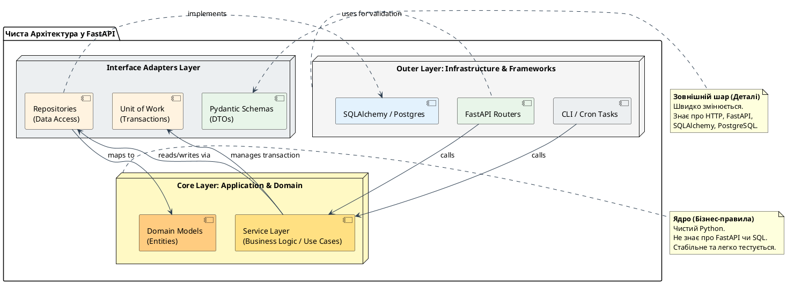

# Repository Pattern та Clean Architecture у FastAPI

У попередній статті ми навчилися керувати еволюцією схеми бази даних за допомогою Alembic, завершивши формування базового інфраструктурного шару для роботи з даними. Тепер наш застосунок має повноцінні ORM-моделі SQLAlchemy, асинхронне підключення до PostgreSQL та механізм міграцій.

На етапі прототипування або при розробці невеликих сервісів найпростішим рішенням здається виконання запитів до бази даних безпосередньо у функціях-обробниках маршрутів (маршрутизаторах або ендпоінтах) FastAPI. Проте, у міру зростання бізнес-вимог, такий підхід швидко перетворює кодову базу на заплутаний моноліт, де логіка HTTP-запитів тісно переплетена з SQL-запитами, валідацією, транзакціями та системними повідомленнями.

У цій статті ми розберемо, як побудувати архітектуру застосунку на основі **чистої архітектури (Clean Architecture)** та **патерну Репозиторій (Repository Pattern)**. Ми навчимося відокремлювати бізнес-логіку від деталей інфраструктури, керувати транзакціями за допомогою патерну **Unit of Work** та будувати гнучкі й придатні для тестування системи.

---

## Проблема «товстих» роутерів у FastAPI

Коли розробник тільки починає працювати з FastAPI, офіційна документація демонструє лаконічні та прості приклади, де асинхронна сесія бази даних інжектується безпосередньо в ендпоінт, і там же виконуються запити `select()`, `execute()` чи `commit()`.

Розглянемо типовий приклад «товстого» обробника маршруту для створення завдання у нашому проєкті **TaskForge**:

```python
# Поки що не копіюйте цей код, це приклад того, як робити НЕ треба!
@router.post("/tasks", response_model=TaskRead, status_code=201)
async def create_task(
    payload: TaskCreate,
    db: AsyncSession = Depends(get_async_session),
    current_user: User = Depends(get_current_user)
):
    # 1. Перевірка бізнес-правила: чи є користувач учасником проєкту
    project_member = await db.scalar(
        select(ProjectMember).where(
            ProjectMember.project_id == payload.project_id,
            ProjectMember.user_id == current_user.id
        )
    )
    if not project_member:
        raise HTTPException(status_code=403, detail="Ви не є учасником цього проєкту")

    # 2. Перевірка бізнес-правила: ліміт відкритих завдань у проєкті (не більше 50)
    active_tasks_count = await db.scalar(
        select(func.count(Task.id)).where(
            Task.project_id == payload.project_id,
            Task.status != TaskStatus.DONE
        )
    )
    if active_tasks_count >= 50:
        raise HTTPException(
            status_code=400,
            detail="Проєкт досяг ліміту активних завдань (макс. 50)"
        )

    # 3. Створення об'єкта та збереження в БД
    new_task = Task(**payload.model_dump())
    db.add(new_task)
    try:
        await db.commit()
        await db.refresh(new_task)
    except IntegrityError:
        await db.rollback()
        raise HTTPException(status_code=400, detail="Помилка цілісності даних")

    return new_task
```

З першого погляду код виглядає робочим і зрозумілим. Проте, якщо проаналізувати його з точки зору довгострокової підтримки та масштабування, виявляється ціла низка серйозних проблем.

### Проблема 1: Порушення принципу єдиної відповідальності (Single Responsibility Principle)

Ендпоінт (функція маршрутизатора) у FastAPI за своєю природою відповідає за **транспортний рівень (HTTP)**. Його завдання:

- Прийняти HTTP-запит.
- Перевірити авторизацію та автентифікацію (через залежності `Depends`).
- Десеріалізувати та провалідувати вхідні дані (Pydantic-моделі).
- Викликати необхідну бізнес-логіку.
- Повернути HTTP-відповідь із відповідним статус-кодом.

У наведеному вище коді роутер бере на себе занадто багато додаткових ролей: він знає структуру таблиць бази даних, самостійно будує SQL-запити, виконує бізнес-перевірки (ліміти завдань, членство в проєкті), керує життєвим циклом транзакції (`commit`, `rollback`, `refresh`) та вирішує, які HTTP-виключення викидати при збоях у БД.

### Проблема 2: Неможливість ізольованого тестування (Hard to Test)

Для того щоб протестувати бізнес-логіку створення завдання (наприклад, перевірити, чи дійсно система заблокує створення 51-го завдання), вам доведеться писати повноцінний інтеграційний тест:

- Піднімати реальну або тестову базу даних (Docker-контейнер).
- Створювати підключення до неї.
- Робити імітаційні HTTP-запити через `AsyncClient` бібліотеки `httpx`.

Ви не можете протестувати правила бізнесу в ізоляції від HTTP-рівня та бази даних. Якщо база даних працює повільно або недоступна, ваші юніт-тести впадуть. Написання mock-ів для такого ендпоінту перетворюється на пекло, оскільки доведеться мокувати методи об'єкта `AsyncSession` (`db.scalar`, `db.add`, `db.commit`, `db.rollback`), які є деталями реалізації SQLAlchemy, а не вашого домену.

### Проблема 3: Жорстка прив'язка до інфраструктури (Infrastructure Coupling)

Уявіть, що через деякий час вимоги змінилися, і вам потрібно:

1. Замінити SQLAlchemy на інший ORM-інструмент (наприклад, Tortoise ORM або SQLModel), або взагалі перейти на NoSQL базу даних (MongoDB) для збереження завдань.
2. Викликати логіку створення завдання не тільки через HTTP API, а й з інших інтерфейсів: наприклад, через CLI-команду (запуск скрипта в консолі), чергу повідомлень (Celery/RabbitMQ) або Telegram-бота.

Оскільки вся логіка створення завдання жорстко зашита всередині функції `@router.post`, ви не зможете перевикористати її. Вам доведеться копіювати блоки SQL-запитів та бізнес-перевірок в CLI-скрипт або обробник черги, дублюючи код і створюючи ризик неузгодженості бізнес-правил у майбутньому.

::note
**Аналогія з ASP.NET Core**
Для розробників, які мають досвід роботи з .NET, ця проблема є добре знайомою. Написання SQL-запитів або пряме звернення до `DbContext` (Entity Framework) всередині методів дій (Action Methods) контролера `ControllerBase` вважається грубим порушенням архітектурних стандартів.
В екосистемі .NET контролер завжди делегує виконання бізнес-сценаріїв сервісам (Use Cases / Application Services), які взаємодіють з базою даних через абстракцію репозиторіїв (`IRepository`), залишаючи контролер тонким та сфокусованим виключно на протоколі HTTP.
::

---

## Чиста архітектура (Clean Architecture) та її шари

Для вирішення описаних проблем використовується **Чиста архітектура (Clean Architecture)**, популяризована Робертом Мартіном (Uncle Bob), або її близький аналог — **Гексагональна архітектура (Ports and Adapters)** чи **Цибулева архітектура (Onion Architecture)**.

Головна ідея цих підходів полягає у **розділенні відповідальності** та **інверсії залежностей**. Програма ділиться на концентричні кола (шари), де внутрішні шари містять бізнес-правила системи, а зовнішні — деталі реалізації (фреймворки, бази даних, транспортні протоколи, інтерфейси користувача).

::plant-uml



::

### Головне правило залежностей (The Dependency Rule)

Залежності в коді мають бути спрямовані **тільки ззовні всередину**. Це означає, що код у внутрішньому колі (наприклад, бізнес-сервіс) не повинен знати нічого про код у зовнішньому колі (наприклад, про те, яка база даних використовується чи який веб-фреймворк обробляє запити).

Якщо вашому бізнес-сервісу потрібно зберегти користувача в базу даних, він не повинен безпосередньо звертатися до SQLAlchemy. Замість цього він має викликати абстрактний метод інтерфейсу репозиторію. Конкретна реалізація цього репозиторію знаходиться на зовнішньому шарі й підставляється у сервіс за допомогою Dependency Injection.

Давайте детально опишемо призначення кожного шару в архітектурі нашого проєкту:

| Назва шару                          | Роль у застосунку                                                                                | Інструменти / Елементи коду                                                              |
| :---------------------------------- | :----------------------------------------------------------------------------------------------- | :--------------------------------------------------------------------------------------- |
| **Domain Layer (Ядро)**             | Описує основні сутності та правила предметної області (бізнес-об'єкти).                          | Чисті класи Python, Dataclasses, ORM-моделі (у прагматичному підході).                   |
| **Service Layer (Бізнес-логіка)**   | Реалізує сценарії використання системи (Use Cases). Оркеструє роботу репозиторіїв та транзакцій. | Класи сервісів (наприклад, `TaskService`, `ProjectService`).                             |
| **Data Access Layer (Репозиторії)** | Абстрагує роботу з базою даних. Надає інтерфейс для отримання та збереження сутностей.           | Абстрактні репозиторії (інтерфейси) та їх конкретні реалізації (`SQLAlchemyRepository`). |
| **API Layer (Транспорт)**           | Приймає запити від клієнтів, керує маршрутизацією, автентифікацією та форматуванням відповідей.  | FastAPI Routers, Pydantic Schemas, HTTP-виключення (`HTTPException`).                    |

::tip
**Прагматичний підхід у Python-екосистемі**
У класичній теорії Clean Architecture ORM-моделі (наприклад, класи SQLAlchemy з декларативним описом таблиць) вважаються деталями інфраструктури й не повинні перебувати в ядрі (Domain Layer). В ідеалі, ядро має містити виключно чисті класи Python (Plain Old Python Objects, або POPO), а репозиторій повинен конвертувати моделі бази даних у ці доменні об'єкти.

Проте в Python-спільноті такий рівень абстракції часто вважають надлишковим (Overengineering), оскільки він вимагає написання великої кількості маперів-трансформаторів (модель БД ↔ доменна модель ↔ DTO). Тому мы будемо використовувати **прагматичний підхід**: ORM-моделі SQLAlchemy гратимуть роль сутностей (Entities) у нашій системі, але ми жорстко обмежимо їх використання — вони не повинні виходити за межі шару сервісів до транспортного шару без конвертації у Pydantic-схеми.
::

---

## Розділ 3: Патерн Репозиторій (Repository Pattern)

**Репозиторій (Repository)** — це патерн проектування, який виступає посередником між шаром бізнес-логіки (Service Layer) та шаром доступу до даних (Data Access Layer). Він представляє колекцію об'єктів у базі даних так, ніби вони є звичайною колекцією об'єктів у пам'яті (наприклад, списком `list` у Python).

### Роль та завдання шару Репозиторіїв

Основна мета репозиторію — **ізолювати запити до бази даних**. 
Клієнтський код (сервіс) не повинен знати, як саме об'єкти зберігаються, оновлюються чи вибираються: через сирі SQL-запити, ORM-вирази SQLAlchemy, NoSQL-драйвери чи навіть текстові файли. Сервіс просто викликає методи репозиторію: `add()`, `get()`, `list()`, `delete()`.

::card-group

::card{title="Ізоляція технологій" icon="i-heroicons-shield-check"}
Якщо ви захочете змінити структуру бази даних, додати індекси, оптимізувати SQL-запит чи переписати його на сирий SQL для швидкодії — вам потрібно буде змінити код **тільки** у конкретному репозиторії. Шар бізнес-логіки залишиться абсолютно незмінним.
::

::card{title="Спрощення тестування" icon="i-heroicons-beaker"}
Оскільки сервіс взаємодіє з абстрактним інтерфейсом репозиторію, у юніт-тестах ви можете легко замінити реальний репозиторій на фейковий (Fake/Mock), який просто зберігає дані в списку `list` в пам'яті, без потреби піднімати реальну базу даних.
::

::

---

### Абстрактний репозиторій (Abstract Interface)

В екосистемі Python інтерфейси зазвичай описуються двома шляхами:
1. За допомогою абстрактних базових класів (модуль `abc.ABC` — номінальна типізація).
2. За допомогою протоколів (`typing.Protocol` — структурна типізація, "duck typing").

У Clean Architecture ми прагнемо явної архітектурної декларації, тому будемо використовувати абстрактні базові класи з явним наслідуванням. 

Давайте створимо загальний абстрактний клас для репозиторію, який використовує Generics (параметричний поліморфізм), щоб визначити загальні CRUD-операції:

```python
from abc import ABC, abstractmethod
from typing import Generic, TypeVar, Sequence, Any

# Generic-тип для сутності (Entity)
T = TypeVar("T")

class AbstractRepository(ABC, Generic[T]):
    
    @abstractmethod
    async def add(self, entity: T) -> T:
        """Додати нову сутність до сховища."""
        raise NotImplementedError

    @abstractmethod
    async def get(self, id: Any) -> T | None:
        """Отримати сутність за її первинним ключем (ID)."""
        raise NotImplementedError

    @abstractmethod
    async def list(self, **filters) -> Sequence[T]:
        """Отримати список сутностей за вказаними фільтрами."""
        raise NotImplementedError

    @abstractmethod
    async def update(self, entity: T, **attrs) -> T:
        """Оновити атрибути існуючої сутності."""
        raise NotImplementedError

    @abstractmethod
    async def delete(self, id: Any) -> bool:
        """Видалити сутність за її первинним ключем."""
        raise NotImplementedError
```

::note
**Чому `Sequence[T]` замінь `list[T]`?**
У типізації Python тип `Sequence` описує будь-яку послідовність об'єктів, яка підтримує ітерацію та доступ за індексом, але є read-only (не дозволяє додавати чи видаляти елементи напряму). SQLAlchemy повертає результати саме як об'єкти типу `Sequence`, і повернення цього типу замість конкретного `list` робить сигнатуру інтерфейсу гнучкішою та стійкішою до деталей реалізації ORM.
::

---

### Конкретна реалізація: Generic `SQLAlchemyRepository[T]`

Тепер реалізуємо цей інтерфейс для SQLAlchemy 2.0. Цей репозиторій прийматиме асинхронну сесію `AsyncSession` та тип ORM-моделі, з якою він повинен працювати:

```python
from sqlalchemy import select, delete
from sqlalchemy.ext.asyncio import AsyncSession
from sqlalchemy.exc import NoResultFound

class SQLAlchemyRepository(AbstractRepository[T]):
    
    def __init__(self, session: AsyncSession, model: type[T]):
        self.session = session
        self.model = model

    async def add(self, entity: T) -> T:
        self.session.add(entity)
        return entity

    async def get(self, id: Any) -> T | None:
        # get() у SQLAlchemy автоматично шукає об'єкт у Identity Map сесії, 
        # і якщо не знаходить — робить оптимізований запит за PK
        return await self.session.get(self.model, id)

    async def list(self, **filters) -> Sequence[T]:
        # filter_by() використовує kwargs для простої фільтрації за рівністю (наприклад, status="NEW")
        query = select(self.model).filter_by(**filters)
        result = await self.session.execute(query)
        return result.scalars().all()

    async def update(self, entity: T, **attrs) -> T:
        for key, value in attrs.items():
            if hasattr(entity, key):
                setattr(entity, key, value)
        return entity

    async def delete(self, id: Any) -> bool:
        query = delete(self.model).where(self.model.id == id)
        result = await self.session.execute(query)
        # Повертає True, якщо кількість видалених рядків більша за 0
        return result.rowcount > 0
```

::tip
**Як працює `update` у SQLAlchemyRepository?**
Зверніть увагу, що у методі `update` ми не викликаємо жодних `commit()` чи `flush()`. 
Оскільки SQLAlchemy працює на основі патерну **Unit of Work** (через об'єкт `Session`), будь-який об'єкт, завантажений у сесію через `get()` або доданий через `add()`, перебуває у стані `persistent`. Його зміни відстежуються автоматично. Ми просто змінюємо його атрибути за допомогою `setattr()`. Збереження цих змін у базу даних відбудеться пізніше, коли сесія буде зафіксована (`committed`) на рівні Unit of Work.
::

---

### Порівняння з ASP.NET Core & EF Core

Для кращого розуміння зіставимо підходи до роботи з даними в обох екосистемах:

```csharp
// Еквівалент Generic Repository в C# (EF Core)
public interface IRepository<T> where T : class
{
    Task<T> AddAsync(T entity);
    Task<T?> GetByIdAsync(object id);
    Task<IEnumerable<T>> ListAsync(Expression<Func<T, bool>> filter);
    Task UpdateAsync(T entity);
    Task<bool> DeleteAsync(object id);
}
```

У .NET Entity Framework Core надає клас `DbSet<TEntity>`, який під капотом вже реалізує патерни *Repository* та *Query Object*. Проте у великих корпоративних архітектурах розробники все одно часто створюють власний шар `IRepository<T>` поверх `DbContext`. 
У Python/SQLAlchemy немає такого вбудованого інтерфейсу як `DbSet` (хоча є об'єкт `session.query` або `select(Model)`), тому написання явного `SQLAlchemyRepository[T]` є стандартною практикою для розв'язання проблеми жорсткої прив'язки бізнес-коду до діалекту SQLAlchemy.

---

## Розділ 4: Патерн Unit of Work (UoW)

Уявімо класичний бізнес-сценарій: користувач створює новий проєкт, і система має автоматично виконати три кроки:
1. Записати проєкт у таблицю `projects`.
2. Додати користувача до таблиці `project_members` із роллю `OWNER`.
3. Створити вітальне завдання "Налаштувати робоче середовище" у таблиці `tasks`.

Якщо ми просто інжектуємо окремі репозиторії (`ProjectRepository`, `MemberRepository`, `TaskRepository`) у наш сервіс, виникає серйозне архітектурне питання: **як забезпечити транзакційність цієї операції?**

### Проблема транзакційності кількох репозиторіїв

Якщо кожен репозиторій буде самостійно створювати та закривати власну сесію бази даних і викликати `commit()` після завершення своєї операції:
- Що відбудеться, якщо кроки 1 та 2 пройдуть успішно, а крок 3 впаде через помилку в БД?
- Ми отримаємо неузгоджений стан даних: проєкт та членство створені, але завдання немає. Оскільки крок 1 та 2 вже зафіксували свої транзакції, ми не зможемо зробити автоматичний відкат (`rollback`).

Щоб забезпечити виконання принципу атомарності (Atomicity з ACID), всі три репозиторії повинні використовувати **одну й ту саму сесію бази даних**, а фіксація транзакції (`commit`) або її відкат (`rollback`) мають відбуватися централізовано в кінці всього бізнес-сценарію.

Саме для вирішення цієї проблеми призначений патерн **Unit of Work (Одиниця роботи)**.

---

### Реалізація UoW у Python через Context Manager

В екосистемі Python найкращим інструментом для виділення меж транзакцій є **Context Manager (менеджер контексту)**, який використовує конструкцію `async with`. Це забезпечує чистий синтаксис та гарантований відкат змін при виникненні будь-яких виключень.

Спроектуємо абстрактний інтерфейс Unit of Work:

```python
from abc import ABC, abstractmethod

class AbstractUnitOfWork(ABC):
    # Кожен UoW надає доступ до необхідних репозиторіїв
    users: AbstractRepository[User]
    projects: AbstractRepository[Project]
    tasks: AbstractRepository[Task]

    async def __aenter__(self) -> "AbstractUnitOfWork":
        return self

    async def __aexit__(self, exc_type, exc_val, exc_tb):
        # Якщо блок `async with` завершився з помилкою (exc_type не None),
        # ми автоматично робимо rollback для безпеки
        if exc_type is not None:
            await self.rollback()
        else:
            # Якщо виключень не було, розробник має явно викликати commit(),
            # але про всяк випадок ми страхуємося rollback()
            await self.rollback()

    @abstractmethod
    async def commit(self):
        """Фіксація транзакції."""
        raise NotImplementedError

    @abstractmethod
    async def rollback(self):
        """Відкат транзакції."""
        raise NotImplementedError
```

Тепер реалізуємо конкретний `SQLAlchemyUnitOfWork`. Він прийматиме фабрику сесій `async_sessionmaker`, яка створюватиме нову асинхронну сесію при вході в контекст:

```python
from sqlalchemy.ext.asyncio import async_sessionmaker, AsyncSession

class SQLAlchemyUnitOfWork(AbstractUnitOfWork):
    
    def __init__(self, session_factory: async_sessionmaker[AsyncSession]):
        self.session_factory = session_factory

    async def __aenter__(self) -> "SQLAlchemyUnitOfWork":
        # Створюємо сесію бази даних при вході в блок `async with`
        self.session = self.session_factory()
        
        # Ініціалізуємо конкретні репозиторії, передаючи їм СПІЛЬНУ сесію
        self.users = SQLAlchemyRepository(self.session, User)
        self.projects = SQLAlchemyRepository(self.session, Project)
        self.tasks = SQLAlchemyRepository(self.session, Task)
        
        return await super().__aenter__()

    async def __aexit__(self, exc_type, exc_val, exc_tb):
        try:
            # Викликаємо базовий __aexit__ для виконання rollback у разі помилки
            await super().__aexit__(exc_type, exc_val, exc_tb)
        finally:
            # Гарантовано закриваємо сесію та повертаємо підключення в pool
            await self.session.close()

    async def commit(self):
        await self.session.commit()

    async def rollback(self):
        # Відкат змін у базі даних
        # Якщо сесія вже закрита або коміт відбувся — rollback не зашкодить
        await self.session.rollback()
```

::note
**Джерело патерну**
Ця реалізація патернів Repository та Unit of Work є класичною для Python. Вона детально описана у відомій книзі **"Architecture Patterns with Python"** (автори Harry Percival та Bob Gregory), яка є неофіційним стандартом побудови чистих систем на Python.
::

---

### Інтеграція UoW з Dependency Injection у FastAPI

Для того, щоб використовувати `SQLAlchemyUnitOfWork` у наших обробниках маршрутів, ми створимо залежність FastAPI (dependency), яка керуватиме його життєвим циклом:

```python
from typing import AsyncGenerator
from app.core.database import async_session_maker # імпорт фабрики сесій

async def get_uow() -> AsyncGenerator[AbstractUnitOfWork, None]:
    # Створюємо екземпляр UoW
    uow = SQLAlchemyUnitOfWork(async_session_maker)
    try:
        yield uow
    finally:
        # Додаткові очищення (за потреби), 
        # хоча UoW сам закриває сесію у __aexit__
        pass
```

Тепер, інжектуючи `AbstractUnitOfWork` (або конкретний UoW) в ендпоінт через `Depends(get_uow)`, ми отримуємо повний контроль над транзакційністю нашої бізнес-логіки.

---

### Порівняння з ASP.NET Core & EF Core

В екосистемі .NET об'єкт `DbContext` в Entity Framework Core реалізує патерни **Unit of Work** та **Repository** одночасно:
- Кожен `DbSet<T>` є репозиторієм.
- Сам `DbContext` накопичує зміни та фіксує їх одним викликом `await dbContext.SaveChangesAsync()`, виступаючи як Unit of Work.

Тому розробникам на ASP.NET не обов'язково писати власний клас UoW. 
Проте в Python-екосистемі, хоча `AsyncSession` в SQLAlchemy також має схожі властивості, створення окремого об'єкта `UnitOfWork` дозволяє нам повністю **видалити імпорти SQLAlchemy** із шару бізнес-логіки. Наш сервіс працюватиме лише з методами UoW, що робить його 100% незалежним від інфраструктури.

---

## Розділ 5: Шар сервісів (Service Layer / Use Cases)

**Шар сервісів (Service Layer)**, також відомий як шар сценаріїв використання (Use Cases), є ядром нашого застосунку. Тут зосереджена вся бізнес-логіка системи: перевірки бізнес-правил, розрахунки, оркестрація викликів різних репозиторіїв та відправка повідомлень.

Сервіси мають бути **абсолютно незалежними від фреймворків** (Framework-Agnostic). Вони не повинні знати про HTTP-запити, FastAPI, заголовки, куки або статус-коди відповідей. Вони оперують чистими даними (рядки, числа, об'єкти сутностей) та викидають доменні виключення при порушенні бізнес-правил.

### Реалізація класу сервісу

Створимо сервіс `TaskService`, який відповідає за бізнес-сценарії роботи із завданнями. Сервіс приймає `AbstractUnitOfWork` через конструктор (Dependency Injection):

```python
class TaskService:
    
    def __init__(self, uow: AbstractUnitOfWork):
        self.uow = uow

    async def create_task(
        self, 
        project_id: int, 
        title: str, 
        description: str | None = None,
        assignee_id: int | None = None
    ) -> Task:
        # Починаємо одиницю роботи (транзакцію)
        async with self.uow:
            # 1. Перевірка бізнес-правила: чи існує проєкт
            project = await self.uow.projects.get(project_id)
            if not project:
                raise ProjectNotFoundError(f"Проєкт з ID {project_id} не знайдено")

            # 2. Перевірка бізнес-правила: ліміт активних завдань
            active_tasks = await self.uow.tasks.list(
                project_id=project_id, 
                status=TaskStatus.IN_PROGRESS # або інші незавершені статуси
            )
            if len(active_tasks) >= 50:
                raise ProjectLimitExceededException("Досягнуто ліміт активних завдань у проєкті")

            # 3. Створення сутності
            new_task = Task(
                project_id=project_id,
                title=title,
                description=description,
                assignee_id=assignee_id,
                status=TaskStatus.TODO
            )

            # 4. Додавання через репозиторій
            await self.uow.tasks.add(new_task)
            
            # 5. Фіксація транзакції
            await self.uow.commit()
            
            return new_task
```

Зверніть увагу, наскільки чистим став цей код порівняно з початковим прикладом "товстого" роутера. Тут немає жодного рядка SQL, немає `AsyncSession` чи `HTTPException`. Це чисті правила нашого бізнесу.

---

### Доменні виключення та їх мапування на транспортному рівні

Оскільки сервіс не має права знати про HTTP, виникає питання: як повернути клієнту правильний HTTP-код (наприклад, 404 чи 400), якщо проєкт не знайдено або ліміт перевищено?

Антипатерном є імпортування `HTTPException` із FastAPI всередину сервісу:

```python
# АНТИПАТЕРН! Не робіть так у сервісах!
from fastapi import HTTPException
raise HTTPException(status_code=404, detail="Project not found")
```

Правильне рішення — використовувати **доменні виключення (Domain Exceptions)**. Це звичайні класи помилок Python, які описують бізнес-збої.

Створимо файл `app/core/exceptions.py`:

```python
class DomainException(Exception):
    """Базовий клас для всіх помилок бізнес-логіки."""
    pass

class EntityNotFoundError(DomainException):
    """Помилка, коли сутність не знайдено в базі даних."""
    pass

class BusinessRuleViolationError(DomainException):
    """Помилка порушення бізнес-правил."""
    pass

# Специфічні помилки
class ProjectNotFoundError(EntityNotFoundError):
    pass

class ProjectLimitExceededException(BusinessRuleViolationError):
    pass
```

Тепер, на рівні транспортного шару (у FastAPI), ми реєструємо глобальні обробники виключень (`exception handlers`), які будуть перехоплювати ці доменні помилки та автоматично конвертувати їх у відповідні HTTP-коди:

```python
# app/main.py
from fastapi import FastAPI, Request
from fastapi.responses import JSONResponse
from app.core.exceptions import EntityNotFoundError, BusinessRuleViolationError

app = FastAPI()

@app.exception_handler(EntityNotFoundError)
async def entity_not_found_handler(request: Request, exc: EntityNotFoundError):
    return JSONResponse(
        status_code=404,
        content={"detail": str(exc)}
    )

@app.exception_handler(BusinessRuleViolationError)
async def business_rule_violation_handler(request: Request, exc: BusinessRuleViolationError):
    return JSONResponse(
        status_code=400,
        content={"detail": str(exc)}
    )
```

Завдяки цьому підходу:
- Шар бізнес-логіки залишається абсолютно чистим і може перевикористовуватися будь-де.
- Транспортний шар (FastAPI) централізовано відповідає за форматування відповідей при помилках, підтримуючи єдиний стиль (наприклад, RFC 7807 Problem Details).

---

## Розділ 6: Повна структура проєкту у стилі Clean Architecture

При переході на Clean Architecture структура каталогів проєкту суттєво розширюється. Замість звичної для початківців структури, де всі файли лежать в одній директорії, ми розбиваємо застосунок на чіткі шари.

Нижче наведено рекомендовану структуру каталогів для нашого проєкту **TaskForge**:

```text
app/
├── api/                     # API Layer (Транспортний рівень)
│   ├── v1/                  # Версіонування API
│   │   ├── projects.py      # Маршрути для проєктів
│   │   ├── tasks.py         # Маршрути для завдань
│   │   └── users.py         # Маршрути для користувачів
│   ├── deps.py              # Спільні залежності FastAPI (get_uow, auth)
│   └── routers.py           # Об'єднання всіх роутерів v1
│
├── core/                    # Інфраструктурне ядро (Config, DB, Security)
│   ├── config.py            # Налаштування застосунку (Pydantic Settings)
│   ├── database.py          # Ініціалізація Engine, sessionmaker, get_db
│   └── exceptions.py        # Глобальні та доменні виключення
│
├── models/                  # Domain Layer: ORM-моделі (Entities)
│   ├── base.py              # Декларативна база (Base Class)
│   ├── user.py              # Модель User
│   ├── project.py           # Моделі Project та ProjectMember
│   └── task.py              # Моделі Task та Comment
│
├── schemas/                 # DTO Layer: Pydantic-схеми (Data Transfer Objects)
│   ├── user.py              # Схеми для валідації користувачів
│   ├── project.py           # Схеми для валідації проєктів
│   └── task.py              # Схеми для валідації завдань
│
├── repositories/            # Data Access Layer (Репозиторії)
│   ├── base.py              # Абстрактний та базовий SQLAlchemy репозиторії
│   ├── user.py              # Специфічний репозиторій для користувачів
│   ├── project.py           # Специфічний репозиторій для проєктів
│   └── task.py              # Специфічний репозиторій для завдань
│
├── services/                # Use Cases / Application Layer (Бізнес-сервіси)
│   ├── user.py              # Сервіс для управління користувачами
│   ├── project.py           # Сервіс для управління проєктами
│   └── task.py              # Сервіс для управління завданнями
│
└── main.py                  # Точка входу: ініціалізація FastAPI та запуск
```

### Декомпозиція відповідальності шарів:

::field-group

::field{name="app/api/" type="шар"}
Веб-інтерфейс нашого API. Роутери приймають запити, серіалізують їх у Pydantic-схеми, викликають сервіси, передаючи їм потрібні параметри, та повертають результати. **Ніяких SQL-запитів чи транзакцій тут немає**.
::

::field{name="app/services/" type="шар"}
Серце бізнес-логіки. Сервіси викликають методи репозиторіїв та координують транзакції через `UnitOfWork`. Вони не знають про існування FastAPI чи HTTP.
::

::field{name="app/repositories/" type="шар"}
Шар роботи з базою даних. Репозиторії виконують SQL-запити, фільтрують дані та повертають об'єкти моделей. Базовий репозиторій містить стандартні CRUD-методи, а специфічні репозиторії (наприклад, `TaskRepository`) додають унікальні методи (наприклад, `get_overdue_tasks()`).
::

::field{name="app/models/" type="шар"}
Декларативні класи SQLAlchemy. Вони описують структуру таблиць баз даних та зв'язки (relationships) між ними.
::

::field{name="app/schemas/" type="шар"}
Схеми Pydantic. Вони визначають правила валідації вхідних JSON-запитів (`TaskCreate`) та структуру вихідних JSON-відповідей (`TaskRead`).
::

::

---

## Розділ 7: Окремий закінчений практичний приклад «від А до Я»

Для закріплення матеріалу створимо повністю працездатний міні-додаток **книжкового інтернет-магазину**, реалізований за правилами Clean Architecture в межах одного файлу. Це дозволить вам запустити та протестувати всю логіку локально.

В якості бази даних ми використаємо асинхронний **SQLite** в пам'яті (`aiosqlite`), що позбавляє необхідності розгортати повноцінний PostgreSQL для запуску цього демо.

### Залежності та запуск проєкту

Для запуску цього коду вам знадобиться встановити пакети `fastapi`, `uvicorn`, `sqlalchemy` та `aiosqlite`.

::tabs
::tabs-item{label="pip"}
```bash
# Встановлення необхідних бібліотек
pip install fastapi uvicorn sqlalchemy aiosqlite

# Запуск демо-сервера (файл названо main.py)
uvicorn main:app --reload
```
::
::tabs-item{label="uv"}
```bash
# Створення віртуального середовища та встановлення залежностей через uv
uv venv
uv pip install fastapi uvicorn sqlalchemy aiosqlite

# Запуск демо-сервера
uv run uvicorn main:app --reload
```
::
::tabs-item{label="poetry"}
```bash
# Ініціалізація проєкту та додавання залежностей
poetry init -n
poetry add fastapi uvicorn sqlalchemy aiosqlite

# Запуск демо-сервера в оточенні poetry
poetry run uvicorn main:app --reload
```
::
::

### Повний лістинг файлу `main.py`

Створіть файл `main.py` та скопіюйте туди наступний код:

```python
import anyio
from abc import ABC, abstractmethod
from contextlib import asynccontextmanager
from typing import Generic, TypeVar, Sequence, Any, AsyncGenerator

from fastapi import FastAPI, Depends, Request, status
from fastapi.responses import JSONResponse
from pydantic import BaseModel, Field

from sqlalchemy import select, delete, String, Integer
from sqlalchemy.ext.asyncio import create_async_engine, async_sessionmaker, AsyncSession
from sqlalchemy.orm import DeclarativeBase, Mapped, mapped_column

# ==============================================================================
# 1. ДОМЕННІ ВИКЛЮЧЕННЯ (DOMAIN EXCEPTIONS)
# ==============================================================================
class DomainException(Exception):
    """Базове виключення бізнес-логіки."""
    pass

class EntityNotFoundError(DomainException):
    """Виникає, коли об'єкт не знайдено."""
    pass

class OutOfStockError(DomainException):
    """Виникає, коли на складі немає потрібної кількості книг."""
    pass


# ==============================================================================
# 2. INFRASTRUCTURE: BAZA DANIKH (SQLALCHEMY MODELS)
# ==============================================================================
class Base(DeclarativeBase):
    pass

class BookModel(Base):
    __tablename__ = "books"

    id: Mapped[int] = mapped_column(Integer, primary_key=True, autoincrement=True)
    title: Mapped[str] = mapped_column(String(200), nullable=False)
    author: Mapped[str] = mapped_column(String(100), nullable=False)
    stock: Mapped[int] = mapped_column(Integer, default=0)
    price: Mapped[int] = mapped_column(Integer) # Ціна в копійках/центах


# ==============================================================================
# 3. DTO LAYER: PYDANTIC SCHEMAS
# ==============================================================================
class BookCreate(BaseModel):
    title: str = Field(..., min_length=1, max_length=200)
    author: str = Field(..., min_length=1, max_length=100)
    stock: int = Field(..., ge=0)
    price: int = Field(..., gt=0) # Ціна в копійках має бути більша за 0

class BookRead(BaseModel):
    id: int
    title: str
    author: str
    stock: int
    price: int

    class Config:
        from_attributes = True

class PurchaseRequest(BaseModel):
    quantity: int = Field(..., gt=0)


# ==============================================================================
# 4. DATA ACCESS LAYER: REPOSITORIES
# ==============================================================================
T = TypeVar("T")

class AbstractRepository(ABC, Generic[T]):
    @abstractmethod
    async def add(self, entity: T) -> T: raise NotImplementedError
    @abstractmethod
    async def get(self, id: Any) -> T | None: raise NotImplementedError
    @abstractmethod
    async def list(self, **filters) -> Sequence[T]: raise NotImplementedError
    @abstractmethod
    async def update(self, entity: T, **attrs) -> T: raise NotImplementedError

class SQLAlchemyRepository(AbstractRepository[T]):
    def __init__(self, session: AsyncSession, model: type[T]):
        self.session = session
        self.model = model

    async def add(self, entity: T) -> T:
        self.session.add(entity)
        return entity

    async def get(self, id: Any) -> T | None:
        return await self.session.get(self.model, id)

    async def list(self, **filters) -> Sequence[T]:
        query = select(self.model).filter_by(**filters)
        result = await self.session.execute(query)
        return result.scalars().all()

    async def update(self, entity: T, **attrs) -> T:
        for key, value in attrs.items():
            if hasattr(entity, key):
                setattr(entity, key, value)
        return entity


# ==============================================================================
# 5. DATA ACCESS LAYER: UNIT OF WORK (UOW)
# ==============================================================================
class AbstractUnitOfWork(ABC):
    books: AbstractRepository[BookModel]

    async def __aenter__(self) -> "AbstractUnitOfWork":
        return self

    async def __aexit__(self, exc_type, exc_val, exc_tb):
        await self.rollback()

    @abstractmethod
    async def commit(self): raise NotImplementedError
    @abstractmethod
    async def rollback(self): raise NotImplementedError

class SQLAlchemyUnitOfWork(AbstractUnitOfWork):
    def __init__(self, session_factory: async_sessionmaker[AsyncSession]):
        self.session_factory = session_factory

    async def __aenter__(self) -> "SQLAlchemyUnitOfWork":
        self.session = self.session_factory()
        self.books = SQLAlchemyRepository(self.session, BookModel)
        return await super().__aenter__()

    async def __aexit__(self, exc_type, exc_val, exc_tb):
        try:
            await super().__aexit__(exc_type, exc_val, exc_tb)
        finally:
            await self.session.close()

    async def commit(self):
        await self.session.commit()

    async def rollback(self):
        await self.session.rollback()


# ==============================================================================
# 6. APPLICATION LAYER: SERVICE (USE CASES)
# ==============================================================================
class BookStoreService:
    def __init__(self, uow: AbstractUnitOfWork):
        self.uow = uow

    async def add_book_to_store(self, book_data: BookCreate) -> BookModel:
        async with self.uow:
            new_book = BookModel(
                title=book_data.title,
                author=book_data.author,
                stock=book_data.stock,
                price=book_data.price
            )
            await self.uow.books.add(new_book)
            await self.uow.commit()
            return new_book

    async def get_all_books(self) -> Sequence[BookModel]:
        async with self.uow:
            return await self.uow.books.list()

    async def purchase_book(self, book_id: int, quantity: int) -> BookModel:
        async with self.uow:
            # 1. Завантажуємо книгу з БД
            book = await self.uow.books.get(book_id)
            if not book:
                raise EntityNotFoundError(f"Книгу з ID {book_id} не знайдено")

            # 2. Перевіряємо бізнес-правило наявності потрібної кількості на складі
            if book.stock < quantity:
                raise OutOfStockError(
                    f"Недостатньо книг на складі. Запитувано: {quantity}, в наявності: {book.stock}"
                )

            # 3. Виконуємо бізнес-операцію: зменшуємо залишок на складі
            new_stock = book.stock - quantity
            await self.uow.books.update(book, stock=new_stock)

            # 4. Завершуємо транзакцію
            await self.uow.commit()
            return book


# ==============================================================================
# 7. INFRASTRUCTURE: DATABASE SETUP & LIFESPAN
# ==============================================================================
# SQLite база даних в пам'яті
DATABASE_URL = "sqlite+aiosqlite:///:memory:"
engine = create_async_engine(DATABASE_URL, echo=True)
async_session_maker = async_sessionmaker(engine, expire_on_commit=False)

@asynccontextmanager
async def lifespan(app: FastAPI):
    # При старті застосунку автоматично створюємо таблиці в пам'яті
    async with engine.begin() as conn:
        await conn.run_sync(Base.metadata.create_all)
    yield
    # При вимкненні очищуємо з'єднання
    await engine.dispose()


# ==============================================================================
# 8. API LAYER: FASTAPI ROUTERS & EXCEPTION HANDLERS
# ==============================================================================
app = FastAPI(
    title="Clean Architecture Bookstore API", 
    version="1.0",
    lifespan=lifespan
)

# Залежність для отримання UoW
async def get_uow() -> AsyncGenerator[AbstractUnitOfWork, None]:
    uow = SQLAlchemyUnitOfWork(async_session_maker)
    try:
        yield uow
    finally:
        pass

# Залежність для отримання Сервісу
def get_book_service(uow: AbstractUnitOfWork = Depends(get_uow)) -> BookStoreService:
    return BookStoreService(uow)


# --- ОБРОБНИКИ ДОМЕННИХ ПОМИЛОК (Exception Handlers) ---
@app.exception_handler(EntityNotFoundError)
async def entity_not_found_handler(request: Request, exc: EntityNotFoundError):
    return JSONResponse(
        status_code=status.HTTP_404_NOT_FOUND,
        content={"error": "Not Found", "message": str(exc)}
    )

@app.exception_handler(OutOfStockError)
async def out_of_stock_handler(request: Request, exc: OutOfStockError):
    return JSONResponse(
        status_code=status.HTTP_400_BAD_REQUEST,
        content={"error": "Business Rule Violation", "message": str(exc)}
    )


# --- МАРШРУТИ API (API Endpoints) ---
@app.get("/books", response_model=list[BookRead])
async def get_books(service: BookStoreService = Depends(get_book_service)):
    """Отримати список усіх книг у крамниці."""
    return await service.get_all_books()

@app.post("/books", response_model=BookRead, status_code=status.HTTP_201_CREATED)
async def add_book(
    payload: BookCreate,
    service: BookStoreService = Depends(get_book_service)
):
    """Додати нову книгу до асортименту."""
    return await service.add_book_to_store(payload)

@app.post("/books/{book_id}/purchase", response_model=BookRead)
async def buy_book(
    book_id: int,
    payload: PurchaseRequest,
    service: BookStoreService = Depends(get_book_service)
):
    """Придбати книгу, зменшивши її залишок на складі."""
    return await service.purchase_book(book_id, payload.quantity)
```

### Runtime-демо: Тестування роботи застосунку

Запустіть застосунок за допомогою uvicorn. Ми можемо перевірити весь життєвий цикл через Swagger UI (`http://127.0.0.1:8000/docs`) або виконати наступні запити через `curl` в іншому терміналі:

::terminal-preview{title="Тестування роботи API Bookstore"}

<div class="line"><span class="opacity-40"># 1. Перевіряємо порожній список книг</span></div>
<div class="line"><span class="opacity-40">$</span> <strong>curl -s http://127.0.0.1:8000/books</strong></div>
<div class="line">[]</div>
<div class="line"></div>
<div class="line"><span class="opacity-40"># 2. Додаємо книгу до асортименту (ціна 1500 копійок / $15.00)</span></div>
<div class="line"><span class="opacity-40">$</span> <strong>curl -s -X POST http://127.0.0.1:8000/books \</strong></div>
<div class="line">  <strong>-H "Content-Type: application/json" \</strong></div>
<div class="line">  <strong>-d '{"title": "Clean Code", "author": "Robert Martin", "stock": 10, "price": 1500}'</strong></div>
<div class="line"><span class="text-green-400">{"id":1,"title":"Clean Code","author":"Robert Martin","stock":10,"price":1500}</span></div>
<div class="line"></div>
<div class="line"><span class="opacity-40"># 3. Робимо успішну покупку 3-х книг</span></div>
<div class="line"><span class="opacity-40">$</span> <strong>curl -s -X POST http://127.0.0.1:8000/books/1/purchase \</strong></div>
<div class="line">  <strong>-H "Content-Type: application/json" \</strong></div>
<div class="line">  <strong>-d '{"quantity": 3}'</strong></div>
<div class="line"><span class="text-green-400">{"id":1,"title":"Clean Code","author":"Robert Martin","stock":7,"price":1500}</span></div>
<div class="line"></div>
<div class="line"><span class="opacity-40"># 4. Намагаємося купити ще 8 книг (на складі залишилось 7)</span></div>
<div class="line"><span class="opacity-40">$</span> <strong>curl -s -X POST http://127.0.0.1:8000/books/1/purchase \</strong></div>
<div class="line">  <strong>-H "Content-Type: application/json" \</strong></div>
<div class="line">  <strong>-d '{"quantity": 8}'</strong></div>
<div class="line"><span class="text-red-400">{"error":"Business Rule Violation","message":"Недостатньо книг на складі. Запитувано: 8, в наявності: 7"}</span></div>
<div class="line"></div>
<div class="line"><span class="opacity-40"># 5. Робимо запит на книгу, якої не існує</span></div>
<div class="line"><span class="opacity-40">$</span> <strong>curl -s -X POST http://127.0.0.1:8000/books/999/purchase \</strong></div>
<div class="line">  <strong>-H "Content-Type: application/json" \</strong></div>
<div class="line">  <strong>-d '{"quantity": 1}'</strong></div>
<div class="line"><span class="text-red-400">{"error":"Not Found","message":"Книгу з ID 999 не знайдено"}</span></div>
 
::

Цей приклад наочно ілюструє, як шари репозиторію, Unit of Work та сервісу утворюють послідовний ланцюг обробки, повністю відокремлюючи бізнес-логіку від деталей роботи бази даних та HTTP-транспорту.

---

## Розділ 8: Практична інтеграція в TaskForge (наскрізний проєкт)

Тепер перенесемо отримані знання про Clean Architecture у наш наскрізний проєкт **TaskForge**. Ми повністю реструктуруємо код роботи з проєктами та завданнями, позбувшись від прямого використання SQLAlchemy-сесій у роутерах.

### Крок 1: Створення бази репозиторіїв (`app/repositories/base.py`)

Створимо файл `app/repositories/base.py`, де опишемо інтерфейс `AbstractRepository` та його конкретну generic-реалізацію для SQLAlchemy:

```python
# app/repositories/base.py
from abc import ABC, abstractmethod
from typing import Generic, TypeVar, Sequence, Any
from sqlalchemy import select, delete
from sqlalchemy.ext.asyncio import AsyncSession

T = TypeVar("T")

class AbstractRepository(ABC, Generic[T]):
    @abstractmethod
    async def add(self, entity: T) -> T: raise NotImplementedError
    
    @abstractmethod
    async def get(self, id: Any) -> T | None: raise NotImplementedError
    
    @abstractmethod
    async def list(self, **filters) -> Sequence[T]: raise NotImplementedError
    
    @abstractmethod
    async def update(self, entity: T, **attrs) -> T: raise NotImplementedError
    
    @abstractmethod
    async def delete(self, id: Any) -> bool: raise NotImplementedError

class SQLAlchemyRepository(AbstractRepository[T]):
    def __init__(self, session: AsyncSession, model: type[T]):
        self.session = session
        self.model = model

    async def add(self, entity: T) -> T:
        self.session.add(entity)
        return entity

    async def get(self, id: Any) -> T | None:
        return await self.session.get(self.model, id)

    async def list(self, **filters) -> Sequence[T]:
        query = select(self.model).filter_by(**filters)
        result = await self.session.execute(query)
        return result.scalars().all()

    async def update(self, entity: T, **attrs) -> T:
        for key, value in attrs.items():
            if hasattr(entity, key):
                setattr(entity, key, value)
        return entity

    async def delete(self, id: Any) -> bool:
        query = delete(self.model).where(self.model.id == id)
        result = await self.session.execute(query)
        return result.rowcount > 0
```

### Крок 2: Опис доменних виключень (`app/core/exceptions.py`)

Нам потрібен єдиний реєстр доменних виключень, який не залежить від FastAPI. Створіть файл `app/core/exceptions.py`:

```python
# app/core/exceptions.py
class DomainException(Exception):
    """Базова доменна помилка."""
    pass

class EntityNotFoundError(DomainException):
    """Виникає, коли сутність не знайдено."""
    pass

class BusinessRuleViolationError(DomainException):
    """Виникає при порушенні бізнес-правил."""
    pass

# Специфічні виключення TaskForge
class ProjectNotFoundError(EntityNotFoundError):
    def __init__(self, project_id: Any):
        super().__init__(f"Проєкт з ID {project_id} не знайдено.")

class TaskNotFoundError(EntityNotFoundError):
    def __init__(self, task_id: Any):
        super().__init__(f"Завдання з ID {task_id} не знайдено.")

class ProjectLimitExceededException(BusinessRuleViolationError):
    def __init__(self, limit: int = 50):
        super().__init__(f"Проєкт досяг ліміту активних завдань (макс. {limit}).")

class CannotDeleteProjectWithActiveTasks(BusinessRuleViolationError):
    def __init__(self):
        super().__init__("Неможливо видалити проєкт, який містить незавершені завдання.")
```

### Крок 3: Створення специфічних репозиторіїв

Для кожної сутності ми наслідуємо generic-репозиторій. Це дозволить у майбутньому додавати специфічні методи роботи з базою даних, які не покриваються стандартним CRUD.

Створіть `app/repositories/project.py`:

```python
# app/repositories/project.py
from app.repositories.base import SQLAlchemyRepository
from app.models.project import Project

class ProjectRepository(SQLAlchemyRepository[Project]):
    def __init__(self, session):
        super().__init__(session, Project)
    
    # Тут можна описати специфічні SQL-запити для проєктів, наприклад:
    # async def get_projects_with_members_count(self) -> ...
```

Створіть `app/repositories/task.py`:

```python
# app/repositories/task.py
from app.repositories.base import SQLAlchemyRepository
from app.models.task import Task

class TaskRepository(SQLAlchemyRepository[Task]):
    def __init__(self, session):
        super().__init__(session, Task)
    
    # Специфічний метод для пошуку протермінованих завдань
    # async def get_overdue_tasks(self) -> Sequence[Task]: ...
```

### Крок 4: Створення Unit of Work (`app/core/unit_of_work.py`)

Опишемо Unit of Work, який об'єднує наші специфічні репозиторії під контролем однієї сесії SQLAlchemy:

```python
# app/core/unit_of_work.py
from abc import ABC, abstractmethod
from sqlalchemy.ext.asyncio import async_sessionmaker, AsyncSession

from app.repositories.project import ProjectRepository
from app.repositories.task import TaskRepository

class AbstractUnitOfWork(ABC):
    projects: ProjectRepository
    tasks: TaskRepository

    async def __aenter__(self) -> "AbstractUnitOfWork":
        return self

    async def __aexit__(self, exc_type, exc_val, exc_tb):
        await self.rollback()

    @abstractmethod
    async def commit(self): raise NotImplementedError

    @abstractmethod
    async def rollback(self): raise NotImplementedError


class SQLAlchemyUnitOfWork(AbstractUnitOfWork):
    def __init__(self, session_factory: async_sessionmaker[AsyncSession]):
        self.session_factory = session_factory

    async def __aenter__(self) -> "SQLAlchemyUnitOfWork":
        self.session = self.session_factory()
        # Створюємо репозиторії, передаючи їм одну й ту саму сесію
        self.projects = ProjectRepository(self.session)
        self.tasks = TaskRepository(self.session)
        return await super().__aenter__()

    async def __aexit__(self, exc_type, exc_val, exc_tb):
        try:
            await super().__aexit__(exc_type, exc_val, exc_tb)
        finally:
            await self.session.close()

    async def commit(self):
        await self.session.commit()

    async def rollback(self):
        await self.session.rollback()
```

### Крок 5: Реалізація шару сервісів

Створимо сервіси, де опишемо бізнес-правила створення та видалення об'єктів.

Створіть `app/services/project.py` з правилом: "не можна видалити проєкт, якщо в ньому є незавершені завдання".

```python
# app/services/project.py
from app.core.unit_of_work import AbstractUnitOfWork
from app.models.project import Project
from app.models.task import TaskStatus
from app.core.exceptions import ProjectNotFoundError, CannotDeleteProjectWithActiveTasks

class ProjectService:
    def __init__(self, uow: AbstractUnitOfWork):
        self.uow = uow

    async def create_project(self, name: str, description: str | None, owner_id: str) -> Project:
        async with self.uow:
            project = Project(name=name, description=description, owner_id=owner_id)
            await self.uow.projects.add(project)
            await self.uow.commit()
            return project

    async def delete_project(self, project_id: str) -> None:
        async with self.uow:
            project = await self.uow.projects.get(project_id)
            if not project:
                raise ProjectNotFoundError(project_id)

            # Перевірка бізнес-правила: чи є в проєкті активні завдання
            active_tasks = await self.uow.tasks.list(
                project_id=project_id, 
                status=TaskStatus.IN_PROGRESS
            )
            if len(active_tasks) > 0:
                raise CannotDeleteProjectWithActiveTasks()

            await self.uow.projects.delete(project_id)
            await self.uow.commit()
```

Створіть `app/services/task.py` з логікою перевірки лімітів:

```python
# app/services/task.py
from app.core.unit_of_work import AbstractUnitOfWork
from app.models.task import Task, TaskStatus
from app.core.exceptions import ProjectNotFoundError, ProjectLimitExceededException

class TaskService:
    def __init__(self, uow: AbstractUnitOfWork):
        self.uow = uow

    async def create_task(self, title: str, description: str | None, project_id: str) -> Task:
        async with self.uow:
            project = await self.uow.projects.get(project_id)
            if not project:
                raise ProjectNotFoundError(project_id)

            active_tasks = await self.uow.tasks.list(project_id=project_id, status=TaskStatus.IN_PROGRESS)
            if len(active_tasks) >= 50:
                raise ProjectLimitExceededException(limit=50)

            task = Task(title=title, description=description, project_id=project_id, status=TaskStatus.TODO)
            await self.uow.tasks.add(task)
            await self.uow.commit()
            return task
```

### Крок 6: Налаштування DI та роутерів

Оновимо `app/api/deps.py` для постачання Unit of Work та сервісів:

```python
# app/api/deps.py
from typing import AsyncGenerator
from app.core.database import async_session_maker
from app.core.unit_of_work import AbstractUnitOfWork, SQLAlchemyUnitOfWork
from app.services.project import ProjectService
from app.services.task import TaskService
from fastapi import Depends

async def get_uow() -> AsyncGenerator[AbstractUnitOfWork, None]:
    uow = SQLAlchemyUnitOfWork(async_session_maker)
    try:
        yield uow
    finally:
        pass

def get_project_service(uow: AbstractUnitOfWork = Depends(get_uow)) -> ProjectService:
    return ProjectService(uow)

def get_task_service(uow: AbstractUnitOfWork = Depends(get_uow)) -> TaskService:
    return TaskService(uow)
```

Тепер наш роутер для проєктів (`app/api/v1/projects.py`) виглядає надзвичайно лаконічно та чисто:

```python
# app/api/v1/projects.py
from fastapi import APIRouter, Depends, status
from app.schemas.project import ProjectCreate, ProjectRead
from app.services.project import ProjectService
from app.api.deps import get_project_service
from app.models.user import User
from app.api.deps import get_current_user # Залежність аутентифікації

router = APIRouter(prefix="/projects", tags=["projects"])

@router.post("/", response_model=ProjectRead, status_code=status.HTTP_201_CREATED)
async def create_project(
    payload: ProjectCreate,
    service: ProjectService = Depends(get_project_service),
    current_user: User = Depends(get_current_user)
):
    """Створити новий проєкт через сервісний шар."""
    return await service.create_project(
        name=payload.name,
        description=payload.description,
        owner_id=current_user.id
    )

@router.delete("/{project_id}", status_code=status.HTTP_204_NO_CONTENT)
async def delete_project(
    project_id: str,
    service: ProjectService = Depends(get_project_service),
    current_user: User = Depends(get_current_user)
):
    """Видалити проєкт, перевіривши бізнес-правила."""
    await service.delete_project(project_id)
```

Збережемо виконані зміни у системі контролю версій Git:

```bash
git commit -m "feat: implement repository pattern, service layer and clean architecture"
```

---

## Розділ 9: Практичні завдання

Для закріплення навичок роботи з чистими архітектурними патернами виконайте наступні завдання.

### Рівень 1: Базовий
Перенесіть логіку роботи з **коментарями** у нашому наскрізному проєкті TaskForge на Clean Architecture:
1. Створіть абстрактний та конкретний `CommentRepository`.
2. Додайте репозиторій коментарів до інтерфейсу `AbstractUnitOfWork` та його реалізації `SQLAlchemyUnitOfWork`.
3. Створіть `CommentService` для обробки бізнес-сценарію додавання коментаря до завдання.
4. Оновіть роутер коментарів для виклику `CommentService`.

### Рівень 2: Середній
Реалізуйте нове бізнес-правило на шарі сервісів: **«Призначати завдання можна тільки учасникам проєкту»**.
1. У `TaskService` при призначенні або зміні виконавця завдання (`assignee_id`) перевірте, чи є цей користувач учасником проєкту (`ProjectMember`).
2. Якщо користувача немає серед учасників проєкту, сервіс повинен викидати кастомну доменну помилку `UserIsNotProjectMemberError`.
3. Змапуйте цю помилку на HTTP 400 Bad Request на рівні FastAPI `exception_handler`.

### Рівень 3: Професійний
Реалізуйте транзакційний сценарій **Архівування проєкту**:
1. Коли проєкт переводиться в статус `ARCHIVED`, всі відкриті завдання у цьому проєкті також мають автоматично змінити статус на `ARCHIVED`.
2. До кожного з цих завдань автоматично додається системний коментар: *«Завдання заархівовано у зв'язку з архівацією проєкту»*.
3. Оскільки ця операція оновлює кілька таблиць (`projects`, `tasks`, `comments`), вона повинна виконуватися **суворо в межах однієї транзакції** через ваш `UnitOfWork`.
4. Напишіть юніт-тест, використовуючи `dependency_overrides` з імітаційним (Mock) репозиторієм завдань, який викидає помилку при оновленні третього завдання. Переконайтеся, що при виникненні цієї помилки транзакція повністю відкочується, статус проєкту залишається активним і жоден коментар не зберігається в базу даних.


