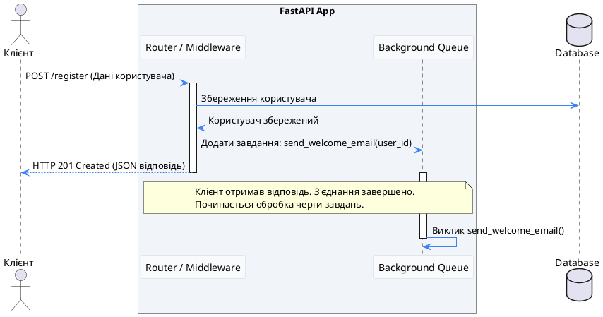
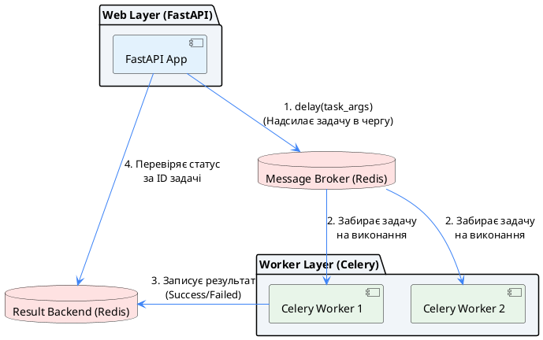
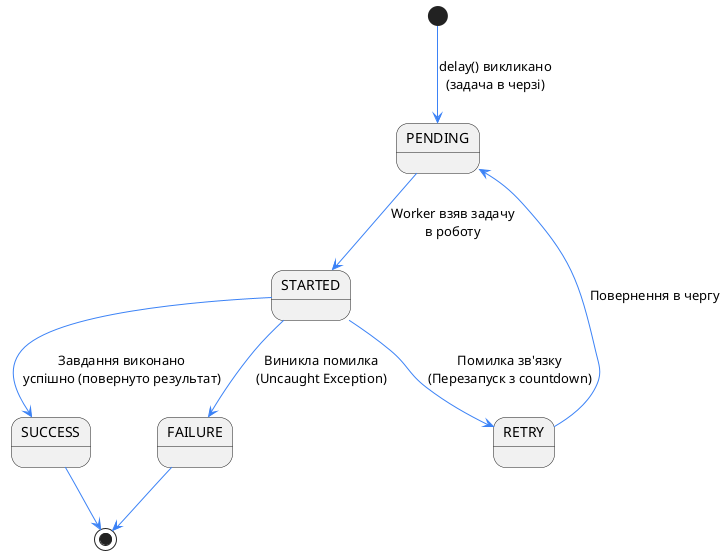
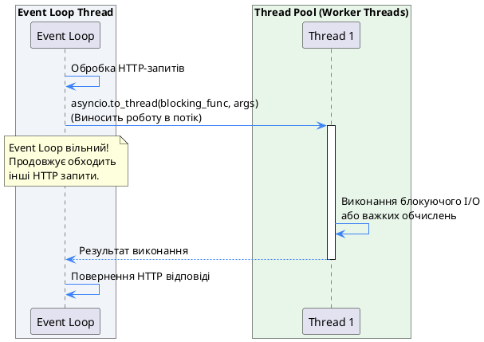

# Async на повну — Background Tasks, WebSockets, SSE та Celery

У попередніх статтях ми розібралися, як FastAPI використовує асинхронність для ефективного оброблення великої кількість HTTP-запитів. Завдяки архітектурі ASGI та вебсерверу Uvicorn, FastAPI здатний тримати тисячі з'єднань одночасно, використовуючи лише один системний потік. Проте реальні вебдодатки рідко обмежуються простою схемою «отримав HTTP-запит — зробив запит до БД — повернув JSON».

У сучасному вебі часто виникають завдання, які виходять за межі класичного синхронного HTTP-циклу:

1. **Тривалі фонові процеси** — відправка листів підтвердження, генерація PDF-звітів, очищення тимчасових файлів, оновлення пошукового індексу. Клієнт не повинен чекати завершення цих дій, щоб отримати відповідь `200 OK`.
2. **Двостороння комунікація в реальному часі (Real-Time)** — чати, системи сповіщень, інтерактивні панелі керування (dashboards). Тут класичні HTTP-запити від клієнта стають неефективними.
3. **Потокове передавання даних (Streaming)** — відправка великих медіафайлів або динамічне надсилання даних у міру їхньої генерації.

Цей розділ присвячений інструментам, які роблять FastAPI по-справжньому потужним інструментом для розробки високонавантажених сервісів. Ми розберемося з вбудованими `BackgroundTasks`, навчимося будувати двосторонній зв'язок через WebSockets, реалізуємо потокові сповіщення через Server-Sent Events (SSE) та розгорнемо розподілену чергу завдань на базі Celery та Redis.

---

## 1. Вбудовані фонові завдання: BackgroundTasks

Найпростіший спосіб виконати роботу поза основним HTTP-запитом — це використання вбудованого у FastAPI класу `BackgroundTasks` (який під капотом є прямим спадкоємцем `BackgroundTask` з бібліотеки Starlette).

### Що таке BackgroundTasks і як це працює?

Коли клієнт робить запит до ендпоінту, FastAPI обробляє його, формує об'єкт відповіді (Response) і віддає його вебсерверу Uvicorn для відправки назад клієнту. Тільки **після того**, як з'єднання з клієнтом завершено (або розпочато передачу фінальних байтів відповіді), FastAPI починає виконувати функції, додані до черги `BackgroundTasks`.

Це ідеально підходить для швидких, некритичних завдань:

- Відправка email або SMS після успішної реєстрації.
- Запис логів у файл або відправка метрик у сторонню аналітику.
- Оновлення локального кешу.

Погляньмо на схему життєвого циклу запиту з фоновим завданням:

::plant-uml



::

### Практична реалізація фонового завдання

Для використання фонових завдань достатньо оголосити параметр з типом `BackgroundTasks` у вашому ендпоінті. FastAPI автоматично ін'єктує цей об'єкт.

Почнемо з налаштування середовища. Оскільки FastAPI є асинхронним фреймворком, нам знадобляться також інструменти для його запуску.

::tabs
::tabs-item{label="pip"}

```bash
pip install fastapi uvicorn
```

::
::tabs-item{label="uv"}

```bash
uv add fastapi uvicorn
```

::
::tabs-item{label="poetry"}

```bash
poetry add fastapi uvicorn
```

::
::

Створимо файл `main.py`, в якому реалізуємо відправку email-нотифікації у фоновому режимі:

```python [main.py]
import asyncio
import logging
from fastapi import FastAPI, BackgroundTasks

# Налаштування логування для демонстрації черговості виконання
logging.basicConfig(level=logging.INFO, format="%(asctime)s - %(levelname)s - %(message)s")
logger = logging.getLogger(__name__)

app = FastAPI(title="Background Tasks Demo")

# Симуляція тривалого процесу (наприклад, відправки листа через SMTP)
async def send_welcome_email(email: str, username: str):
    logger.info(f"Початок відправки листа для {username} ({email})...")
    # Імітуємо затримку мережі при роботі з поштовим сервером
    await asyncio.sleep(5)
    logger.info(f"Лист для {username} успішно відправлено на {email}!")

@app.post("/register")
async def register_user(email: str, username: str, background_tasks: BackgroundTasks):
    logger.info("Ендпоінт /register викликано. Починаємо реєстрацію...")

    # Тут могла бути логіка збереження в базу даних
    logger.info(f"Користувача {username} збережено в БД.")

    # Додаємо завдання до фонової черги
    background_tasks.add_task(send_welcome_email, email, username)

    logger.info("Завдання додано до BackgroundTasks. Повертаємо відповідь клієнту.")
    return {"status": "success", "message": "Користувача зареєстровано. Лист буде надіслано у фоні."}
```

Запустимо застосунок за допомогою Uvicorn:

::terminal-preview{title="uvicorn main:app"}

<div class="line"><span class="opacity-40">$</span> <strong>uvicorn main:app --reload</strong></div>
<div class="line"><span class="text-blue-400">INFO:</span>     Started server process [29452]</div>
<div class="line"><span class="text-blue-400">INFO:</span>     Waiting for application startup.</div>
<div class="line"><span class="text-blue-400">INFO:</span>     Application startup complete.</div>
<div class="line"><span class="text-blue-400">INFO:</span>     Uvicorn running on <b>http://127.0.0.1:8000</b> (Press CTRL+C to quit)</div>

::

Якщо тепер надіслати `POST` запит на `/register` (наприклад, через вбудований Swagger UI на `http://127.0.0.1:8000/docs`), у терміналі ми побачимо таку послідовність логів:

::terminal-preview{title="Uvicorn Output Logs"}

<div class="line">2026-07-16 10:00:00 - INFO - Ендпоінт /register викликано. Починаємо реєстрацію...</div>
<div class="line">2026-07-16 10:00:00 - INFO - Користувача admin збережено в БД.</div>
<div class="line">2026-07-16 10:00:00 - INFO - Завдання додано до BackgroundTasks. Повертаємо відповідь клієнту.</div>
<div class="line"><span class="text-green-400">INFO:</span>     127.0.0.1:54321 - "POST /register?email=admin@test.com&username=admin HTTP/1.1" 200 OK</div>
<div class="line">2026-07-16 10:00:00 - INFO - Початок відправки листа для admin (admin@test.com)...</div>
<div class="line">2026-07-16 10:00:05 - INFO - Лист для admin успішно відправлено на admin@test.com!</div>

::

Зверніть увагу: HTTP-відповідь повернулася клієнту зі статусом `200 OK` рівно в `10:00:00`. Тільки після цього розпочалося виконання функції `send_welcome_email`, яка завершилася через 5 секунд (о `10:00:05`). Клієнт не чекав ці 5 секунд.

---

## 2. Критично важлива деталь: `def` чи `async def` у фонових завданнях?

Одне з найпоширеніших джерел багів у початківців при роботі з `BackgroundTasks` — це нерозуміння того, як саме FastAPI запускає ці функції. Тут діють абсолютно ті самі правила, що й для звичайних path operations (ендпоінтів).

### Сценарій 1: Фонова функція оголошена через `async def`

Якщо ви реєструєте завдання як `async def`, FastAPI запускає його безпосередньо в основному Event Loop (асинхронному циклі подій), який обслуговує всі HTTP-запити.

::warning
**Небезпека блокування Event Loop!**
Якщо всередині `async def` фонової функції ви виконаєте синхронну (блокуючу) операцію — наприклад, надішлете запит через синхронну бібліотеку `requests` чи виконаєте важкі математичні обчислення — ви заблокуєте весь Event Loop. У цей час сервер **не зможе** обробляти інші HTTP-запити. Для всіх інших клієнтів додаток просто "зависне".
::

### Сценарій 2: Фонова функція оголошена через звичайний `def`

Якщо ви реєструєте завдання як звичайну синхронну функцію (`def`), FastAPI автоматично запускає її в окремому потоці з вбудованого Thread Pool (використовуючи під капотом `anyio.to_thread.run_sync`).

Це безпечно для блокуючих I/O операцій (наприклад, читання файлу чи запит до стороннього API через `requests`). Проте створення додаткових потоків несе накладні витрати на контекстне перемикання (context switching).

Порівняймо ці два підходи:

| Параметр порівняння    | Фонова функція `async def`                                                    | Фонова функція `def`                                                                 |
| :--------------------- | :---------------------------------------------------------------------------- | :----------------------------------------------------------------------------------- |
| **Де виконується**     | В основному потоці (Event Loop)                                               | В окремому потоці (Thread Pool)                                                      |
| **Підходить для**      | Асинхронних операцій (`await httpx.AsyncClient()`, `await aiosmtplib.send()`) | Синхронних блокуючих операцій (`requests.post()`, робота з диском, важкі обчислення) |
| **Блокування сервера** | Так, якщо використати синхронний код (`time.sleep()`)                         | Ні, потоки ізольовані від Event Loop                                                 |
| **Витрати ресурсів**   | Мінімальні (корутини дуже легкі)                                              | Середні (потоки потребують пам'яті та CPU)                                           |

::tip
**Золоте правило:**
Якщо ваша фонова задача робить запити до мережі або бази даних — використовуйте асинхронні бібліотеки та оголошуйте її як `async def`. Якщо ви змушені використовувати застарілі синхронні бібліотеки — використовуйте `def`, щоб FastAPI самостійно виніс їх у Thread Pool.
::

---

## 3. Обмеження та недоліки `BackgroundTasks`

Хоча `BackgroundTasks` є чудовим і простим інструментом, він не підходить для серйозних фонових задач у великих проектах. Чому?

::field-group

::field{name="Пам'ять (In-Memory)" type="Архітектурне обмеження"}
Черга фонових завдань живе виключно в оперативній пам'яті процесу вашого вебдодатка. Якщо ваш сервер перезавантажиться, впаде через помилку Out Of Memory або ви просто випустите нову версію коду (CI/CD redeploy) — усі завдання, які стояли в черзі, будуть **втрачені назавжди**.
::

::field{name="Обмеження ресурсів (In-Process)" type="Продуктивність"}
Фонові завдання виконуються на тому самому сервері (і в тому самому процесі), що й основний вебдодаток. Якщо ви запустите важку генерацію звітів або стиснення зображень, вони почнуть споживати CPU та оперативну пам'ять, які потрібні для швидкої обробки HTTP-запитів клієнтів.
::

::field{name="Відсутність моніторингу" type="Керування"}
Ви не можете легко відстежити статус виконання фонової задачі: чи завершилась вона успішно, на якому етапі виникла помилка, скільки часу це зайняло. Немає вбудованого механізму повторних спроб (retry) при помилках мережі.
::

::field{name="Масштабування" type="Інфраструктура"}
Ви не можете масштабувати кількість фонових обробників окремо від вебсервера. Якщо вам потрібно більше ресурсів для фонових задач, вам доведеться запускати додаткові копії всього FastAPI додатка.
::

::

Для вирішення цих проблем використовують спеціалізовані розподілені черги завдань (Task Queues), такі як **Celery**, **Dramatiq** або **ARQ**, з якими ми познайомимося в наступних розділах.

---

## 4. WebSockets у FastAPI: Real-Time зв'язок

Коли вашому додатку потрібно отримувати оновлення миттєво (наприклад, повідомлення в чаті, зміна статусу задачі іншим користувачем або графік котирувань), класична модель HTTP-запитів стає неефективною. Постійне опитування сервера клієнтом (polling) створює величезне навантаження на систему та мережу.

Для вирішення цієї проблеми було створено протокол **WebSocket**.

### Що таке WebSocket і як він працює?

На відміну від HTTP, де клієнт завжди є ініціатором запиту, а після відповіді з'єднання закривається, WebSocket надає **постійне, двостороннє (full-duplex) з'єднання** по одному TCP-каналу.

Процес встановлення з'єднання (Handshake) виглядає так:

1. Клієнт надсилає звичайний HTTP-запит на сервер із заголовком `Upgrade: websocket`.
2. Сервер погоджується та повертає статус `101 Switching Protocols`.
3. HTTP-з'єднання "апгрейдиться" до TCP-каналу WebSocket.
4. Тепер і клієнт, і сервер можуть надсилати повідомлення один одному в будь-який момент без додаткових заголовків і рукостискань.

::note
**Особливість протоколу:**
Оскільки WebSocket працює поверх TCP, повідомлення доставляються гарантовано та в правильному порядку. Однак, на відміну від HTTP, тут немає концепції статусів відповідей (на кшталт 200, 404, 500). Все спілкування відбувається у вигляді фреймів — текстових (Text) або бінарних (Binary). Якщо виникає помилка, з'єднання просто розривається з певним кодом закриття (Close Code).
::

### Базовий WebSocket ендпоінт у FastAPI

Для підтримки WebSockets у FastAPI під капотом використовується пакет `websockets` (або `anyio` для асинхронного введення-виведення). Переконайтеся, що пакет встановлено.

::tabs
::tabs-item{label="pip"}

```bash
pip install websockets
```

::
::tabs-item{label="uv"}

```bash
uv add websockets
```

::
::tabs-item{label="poetry"}

```bash
poetry add websockets
```

::
::

У FastAPI робота з WebSocket реалізується через декоратор `@app.websocket`. Створимо повноцінний працездатний приклад з інтегрованим HTML-клієнтом, щоб ви могли відразу протестувати його в браузері:

```python [ws_app.py]
from fastapi import FastAPI, WebSocket, WebSocketDisconnect
from fastapi.responses import HTMLResponse

app = FastAPI(title="WebSocket Echo Demo")

# Простий HTML-інтерфейс із JavaScript-клієнтом WebSocket
html_content = """
<!DOCTYPE html>
<html>
    <head>
        <title>WebSocket Demo</title>
        <meta charset="utf-8">
        <meta name="viewport" content="width=device-width, initial-scale=1">
        <style>
            body {
                font-family: system-ui, -apple-system, sans-serif;
                background: #0f172a;
                color: #f8fafc;
                display: flex;
                flex-direction: column;
                align-items: center;
                justify-content: center;
                min-height: 100vh;
                margin: 0;
            }
            .chat-card {
                background: #1e293b;
                padding: 24px;
                border-radius: 16px;
                box-shadow: 0 10px 25px -5px rgba(0,0,0,0.3);
                width: 100%;
                max-width: 440px;
                box-sizing: border-box;
            }
            h1 {
                font-size: 1.5rem;
                margin: 0 0 8px 0;
                color: #3b82f6;
            }
            .status {
                font-size: 0.85rem;
                color: #94a3b8;
                margin-bottom: 20px;
            }
            .input-group {
                display: flex;
                gap: 8px;
                margin-bottom: 16px;
            }
            input {
                flex: 1;
                padding: 10px 14px;
                border-radius: 8px;
                border: 1px solid #475569;
                background: #0f172a;
                color: #fff;
                font-size: 0.95rem;
            }
            input:focus {
                outline: 2px solid #3b82f6;
            }
            button {
                background: #3b82f6;
                color: white;
                border: none;
                padding: 10px 18px;
                border-radius: 8px;
                font-weight: 600;
                cursor: pointer;
                transition: background 0.2s;
            }
            button:hover {
                background: #2563eb;
            }
            .messages {
                border: 1px solid #334155;
                background: #0f172a;
                height: 200px;
                border-radius: 8px;
                padding: 12px;
                overflow-y: auto;
                display: flex;
                flex-direction: column;
                gap: 8px;
            }
            .msg {
                padding: 8px 12px;
                border-radius: 8px;
                max-width: 80%;
                font-size: 0.9rem;
                word-break: break-all;
            }
            .msg-sent {
                background: #1e3a8a;
                color: #93c5fd;
                align-self: flex-end;
            }
            .msg-received {
                background: #065f46;
                color: #a7f3d0;
                align-self: flex-start;
            }
        </style>
    </head>
    <body>
        <div class="chat-card">
            <h1>WebSocket Echo</h1>
            <div class="status" id="status">Статус: Підключення...</div>
            <div class="messages" id="messages"></div>
            <br />
            <div class="input-group">
                <input type="text" id="messageInput" placeholder="Напишіть щось..." autocomplete="off"/>
                <button onclick="sendMessage()">Надіслати</button>
            </div>
        </div>

        <script>
            // Встановлюємо WebSocket-з'єднання з нашим FastAPI сервером
            const ws = new WebSocket("ws://localhost:8000/ws");
            const statusEl = document.getElementById("status");
            const messagesEl = document.getElementById("messages");
            const inputEl = document.getElementById("messageInput");

            ws.onopen = () => {
                statusEl.innerHTML = 'Статус: <span style="color: #4ade80; font-weight: bold;">З’єднано 🟢</span>';
            };

            ws.onmessage = (event) => {
                const message = document.createElement("div");
                message.className = "msg msg-received";
                message.textContent = event.data;
                messagesEl.appendChild(message);
                messagesEl.scrollTop = messagesEl.scrollHeight;
            };

            ws.onclose = () => {
                statusEl.innerHTML = 'Статус: <span style="color: #f87171; font-weight: bold;">Від’єднано 🔴</span>';
            };

            function sendMessage() {
                const text = inputEl.value.trim();
                if (!text) return;

                // Відображаємо повідомлення відправника локально
                const message = document.createElement("div");
                message.className = "msg msg-sent";
                message.textContent = "Ви: " + text;
                messagesEl.appendChild(message);

                // Надсилаємо повідомлення через WebSocket на сервер
                ws.send(text);

                inputEl.value = "";
                messagesEl.scrollTop = messagesEl.scrollHeight;
            }

            inputEl.addEventListener("keypress", (e) => {
                if (e.key === "Enter") sendMessage();
            });
        </script>
    </body>
</html>
"""

@app.get("/")
async def get_client():
    return HTMLResponse(content=html_content)

@app.websocket("/ws")
async def websocket_endpoint(websocket: WebSocket):
    # 1. Приймаємо WebSocket-з'єднання
    await websocket.accept()

    try:
        while True:
            # 2. Очікуємо текстове повідомлення від клієнта
            data = await websocket.receive_text()

            # 3. Відправляємо відповідь назад (Ехо-відповідь)
            await websocket.send_text(f"Сервер відповів на: '{data}'")

    except WebSocketDisconnect:
        # 4. Обробляємо відключення клієнта
        pass
```

Щоб запустити та протестувати цей приклад самостійно:

::terminal-preview{title="Запуск та перевірка WebSocket"}

<div class="line"><span class="opacity-40">$</span> <strong>uvicorn ws_app:app --reload --port 8000</strong></div>
<div class="line"><span class="text-blue-400">INFO:</span>     Uvicorn running on <b>http://127.0.0.1:8000</b> (Press CTRL+C to quit)</div>
<div class="line"><span class="text-blue-400">INFO:</span>     127.0.0.1:58432 - "GET / HTTP/1.1" 200 OK</div>
<div class="line"><span class="text-blue-400">INFO:</span>     127.0.0.1:58433 - "WebSocket /ws" [Accepted]</div>

::

Відкрийте у браузері `http://127.0.0.1:8000`. Ви побачите візуальний інтерфейс чату, який миттєво підключається до сервера. Спробуйте надіслати повідомлення — ви побачите, як сервер миттєво повертає ехо-відповідь без перезавантаження сторінки або надсилання традиційних HTTP-запитів.

### Керування з'єднаннями: ConnectionManager

У реальних додатках недостатньо просто приймати з'єднання. Нам потрібно:

- Знати, які користувачі зараз онлайн.
- Відправляти повідомлення конкретному користувачу (Personal Message).
- Відправляти повідомлення всім підключеним клієнтам одночасно (Broadcast).
- Групувати користувачів за кімнатами/кімнатами проектів (Room-based routing).

Для цього створюють спеціальний клас-менеджер. Нижче наведено повноцінний працездатний приклад `ConnectionManager`, який дозволяє групувати користувачів за кімнатами (наприклад, для коментарів до конкретної задачі чи проекту). Додаток автоматично розділяє трафік: користувачі в кімнаті `room1` не бачитимуть повідомлень із кімнати `room2`.

```python [room_app.py]
from fastapi import FastAPI, WebSocket, WebSocketDisconnect
from fastapi.responses import HTMLResponse

app = FastAPI(title="WebSocket Rooms Demo")

class ConnectionManager:
    def __init__(self):
        # Зберігаємо підключення у форматі: {room_id: [websocket_1, websocket_2]}
        self.active_connections: dict[str, list[WebSocket]] = {}

    async def connect(self, websocket: WebSocket, room_id: str):
        # 1. Приймаємо з'єднання від клієнта
        await websocket.accept()
        if room_id not in self.active_connections:
            self.active_connections[room_id] = []
        # 2. Реєструємо його в кімнаті
        self.active_connections[room_id].append(websocket)

    def disconnect(self, websocket: WebSocket, room_id: str):
        # 3. Видаляємо з'єднання при відключенні
        if room_id in self.active_connections:
            self.active_connections[room_id].remove(websocket)
            # Якщо в кімнаті не залишилось активних клієнтів — видаляємо саму кімнату з пам'яті
            if not self.active_connections[room_id]:
                del self.active_connections[room_id]

    async def send_personal_message(self, message: str, websocket: WebSocket):
        # Відправка повідомлення конкретному клієнту
        await websocket.send_text(message)

    async def broadcast_to_room(self, message: str, room_id: str):
        # 4. Розсилаємо повідомлення усім активним клієнтам у вказаній кімнаті
        if room_id in self.active_connections:
            for connection in self.active_connections[room_id]:
                try:
                    await connection.send_text(message)
                except Exception:
                    # Ігноруємо помилки відправки для клієнтів, які "відвалилися" раніше
                    pass

manager = ConnectionManager()

# Генеруємо HTML клієнт динамічно для вказаної кімнати
def get_room_html(room_id: str) -> str:
    return f"""
<!DOCTYPE html>
<html>
    <head>
        <title>Чат кімнати {room_id}</title>
        <meta charset="utf-8">
        <meta name="viewport" content="width=device-width, initial-scale=1">
        <style>
            body {{
                font-family: system-ui, -apple-system, sans-serif;
                background: #0f172a;
                color: #f8fafc;
                display: flex;
                flex-direction: column;
                align-items: center;
                justify-content: center;
                min-height: 100vh;
                margin: 0;
            }}
            .chat-card {{
                background: #1e293b;
                padding: 24px;
                border-radius: 16px;
                box-shadow: 0 10px 25px -5px rgba(0,0,0,0.3);
                width: 100%;
                max-width: 460px;
                box-sizing: border-box;
            }}
            h1 {{
                font-size: 1.4rem;
                margin: 0 0 4px 0;
                color: #f59e0b;
            }}
            .room-badge {{
                font-size: 0.8rem;
                color: #f59e0b;
                background: rgba(245, 158, 11, 0.15);
                border: 1px solid rgba(245, 158, 11, 0.3);
                display: inline-block;
                padding: 4px 8px;
                border-radius: 6px;
                margin-bottom: 20px;
                font-weight: 600;
            }}
            .messages {{
                border: 1px solid #334155;
                background: #0f172a;
                height: 220px;
                border-radius: 8px;
                padding: 12px;
                overflow-y: auto;
                display: flex;
                flex-direction: column;
                gap: 8px;
            }}
            .msg {{
                padding: 8px 12px;
                border-radius: 8px;
                max-width: 85%;
                font-size: 0.9rem;
            }}
            .msg-system {{
                background: #334155;
                color: #cbd5e1;
                align-self: center;
                font-size: 0.75rem;
                font-style: italic;
            }}
            .msg-user {{
                background: #1e3a8a;
                color: #93c5fd;
                align-self: flex-start;
            }}
            .input-group {{
                display: flex;
                gap: 8px;
                margin-top: 16px;
            }}
            input {{
                flex: 1;
                padding: 10px 14px;
                border-radius: 8px;
                border: 1px solid #475569;
                background: #0f172a;
                color: #fff;
                font-size: 0.95rem;
            }}
            button {{
                background: #f59e0b;
                color: #0f172a;
                border: none;
                padding: 10px 16px;
                border-radius: 8px;
                font-weight: bold;
                cursor: pointer;
            }}
            button:hover {{
                background: #d97706;
            }}
        </style>
    </head>
    <body>
        <div class="chat-card">
            <h1>Кімната обговорення</h1>
            <div class="room-badge">Кімната: {room_id}</div>
            <div class="messages" id="messages"></div>
            <div class="input-group">
                <input type="text" id="messageInput" placeholder="Напишіть коментар..." autocomplete="off"/>
                <button onclick="sendMessage()">Надіслати</button>
            </div>
        </div>

        <script>
            const roomId = "{room_id}";
            // Підключаємось до кімнати
            const ws = new WebSocket(`ws://localhost:8000/ws/${roomId}`);
            const messagesEl = document.getElementById("messages");
            const inputEl = document.getElementById("messageInput");

            ws.onmessage = (event) => {{
                const message = document.createElement("div");
                // Визначаємо тип повідомлення
                if (event.data.startsWith("Системне повідомлення:")) {{
                    message.className = "msg msg-system";
                    message.textContent = event.data.replace("Системне повідомлення: ", "");
                }} else {{
                    message.className = "msg msg-user";
                    message.textContent = event.data;
                }}
                messagesEl.appendChild(message);
                messagesEl.scrollTop = messagesEl.scrollHeight;
            }};

            function sendMessage() {{
                const text = inputEl.value.trim();
                if (!text) return;
                ws.send(text);
                inputEl.value = "";
            }}

            inputEl.addEventListener("keypress", (e) => {{
                if (e.key === "Enter") sendMessage();
            }});
        </script>
    </body>
</html>
"""

@app.get("/room/{room_id}")
async def get_room_page(room_id: str):
    return HTMLResponse(content=get_room_html(room_id))

@app.websocket("/ws/{room_id}")
async def websocket_room_endpoint(websocket: WebSocket, room_id: str):
    await manager.connect(websocket, room_id)
    # Оповіщаємо інших, що хтось під'єднався
    await manager.broadcast_to_room(f"Системне повідомлення: Користувач приєднався до обговорення {room_id}", room_id)

    try:
        while True:
            # Очікуємо повідомлення
            data = await websocket.receive_text()
            # Транслюємо повідомлення усім учасникам цієї кімнати
            await manager.broadcast_to_room(f"Анонім: {data}", room_id)
    except WebSocketDisconnect:
        manager.disconnect(websocket, room_id)
        # Оповіщаємо інших про вихід користувача
        await manager.broadcast_to_room(f"Системне повідомлення: Користувач залишив обговорення {room_id}", room_id)
```

**Як протестувати кімнати:**

1. Запустіть скрипт: `uvicorn room_app:app --reload`
2. Відкрийте дві вкладки браузера:
    - Вкладка А: `http://127.0.0.1:8000/room/1`
    - Вкладка Б: `http://127.0.0.1:8000/room/2`
3. Спробуйте написати повідомлення у Вкладці А. Ви побачите повідомлення у цій же вкладці.
4. Подивіться на Вкладку Б — вона залишиться пустою, адже кімнати повністю ізольовані.
5. Тепер відкрийте третю вкладку на `http://127.0.0.1:8000/room/1`. Надішліть повідомлення звідти — ви побачите, як воно миттєво з'явиться в обох вкладках кімнати `1`.

### Авторизація WebSocket з'єднань

Авторизація WebSocket — це окрема проблема. Браузерний API `new WebSocket(url)` **не дозволяє** додавати кастомні HTTP-заголовки (на кшталт `Authorization: Bearer <token>`) під час ініціалізації з'єднання.

Тому використовують два основних підходи:

1. **Query Parameters**: Передача токена в URL з'єднання: `ws://localhost:8000/ws?token=JWT_TOKEN`.
2. **Handshake via Cookies**: Використання HTTP-only Cookies, які браузер автоматично прикріплює до HTTP-запиту рукостискання.

Найбільш універсальним і простим для API є використання query-параметрів. Реалізуємо валідацію токена:

```python
from fastapi import Query, status

# Функція валідації токена (спрощена версія)
def get_user_from_token(token: str) -> str:
    if token == "super-secret-token":
        return "admin"
    raise ValueError("Invalid token")

@app.websocket("/ws-secure")
async def secure_websocket(
    websocket: WebSocket,
    token: str = Query(...)
):
    try:
        user = get_user_from_token(token)
    except ValueError:
        # Відхиляємо з'єднання з кодом 4003 (forbidden)
        await websocket.close(code=status.WS_1008_POLICY_VIOLATION)
        return

    await websocket.accept()
    await websocket.send_text(f"Привіт, {user}! Ти успішно авторизувався.")
    await websocket.close()
```

### Порівняльний аналіз: FastAPI WebSockets ↔ .NET SignalR

Для розробників, які звикли до **ASP.NET Core SignalR**, підхід у FastAPI може здатися занадто низькорівневим. Давайте проведемо паралель:

| Характеристика                  | ASP.NET Core SignalR                                            | FastAPI WebSockets                                                                  |
| :------------------------------ | :-------------------------------------------------------------- | :---------------------------------------------------------------------------------- |
| **Рівень абстракції**           | Високий (Hubs, RPC, Groups, автоматичний JSON-RPC протокол)     | Низький (Сирі текстові/бінарні фрейми WebSocket)                                    |
| **Fallback транспорт**          | Автоматичний (WebSockets → SSE → Long Polling)                  | Відсутній (Тільки WebSocket. Якщо він не підтримується — з'єднання не встановиться) |
| **Управління групами**          | Вбудоване (`Groups.AddToGroupAsync`)                            | Кастомне (Створюємо свій `ConnectionManager` та `dict`)                             |
| **Автентифікація**              | Вбудована інтеграція з ASP.NET Auth (Query String / Headers)    | Ручна валідація через `Query` параметри чи `Cookies`                                |
| **Швидкість та споживання RAM** | Нижча (через складнішу абстракцію та оверхед протоколу SignalR) | Надзвичайно висока (мінімальний оверхед, прямий доступ до TCP фреймів)              |

::tip
**Висновок:**
SignalR надає готовий "комбайн" з автоматичним вибором найкращого транспорту та вбудованим RPC. У FastAPI ви працюєте з чистим стандартом RFC 6455. Якщо вам потрібні фічі SignalR (на кшталт RPC чи Fallbacks) у Python, доведеться писати власний протокол поверх WebSocket або використовувати сторонні рішення (наприклад, Socket.io / Socket.io-python).
::

---

## 5. Server-Sent Events (SSE): Односторонній Real-Time

Іноді двосторонній зв'язок (як у WebSocket) є надлишковим. Якщо вашому додатку потрібно лише отримувати дані від сервера в режимі реального часу (наприклад, стрічка новин, оновлення статусу виконання довгої задачі чи прогрес-бар імпорту даних), простішим і надійнішим вибором є **Server-Sent Events (SSE)**.

### Що таке Server-Sent Events?

**SSE** (Server-Sent Events) — це технологія, яка дозволяє серверу асинхронно надсилати текстові дані клієнту через одне довготривале HTTP-з'єднання. Цей стандарт описує як протокол передачі даних від сервера, так і клієнтський API `EventSource` для браузерів.

На відміну від WebSockets, які працюють поверх власного бінарного протоколу (RFC 6455), SSE базується на стандартному протоколі **HTTP** (як HTTP/1.1, так і HTTP/2). Це робить його простим у реалізації, адже він не потребує спеціальних проксі-серверів та працює через звичайні порти 80 або 443.

---

### Як SSE працює на рівні HTTP-протоколу?

Коли клієнт ініціює SSE-з'єднання, відбувається звичайний HTTP-обмін заголовками. Однак сервер замість того, щоб надіслати відповідь і закрити з'єднання, тримає TCP-сокет відкритим і поступово записує туди дані в міру їх появи.

#### 1. Заголовки запиту (Request Headers)

Браузер автоматично надсилає такі заголовки під час створення об'єкта `EventSource`:

```http
GET /stream HTTP/1.1
Host: example.com
Accept: text/event-stream
Cache-Control: no-cache
Connection: keep-alive
```

- `Accept: text/event-stream`: Вказує серверу, що клієнт очікує відповідь у форматі потоку подій.
- `Connection: keep-alive`: Просить вебсервер не закривати TCP-з'єднання після відправки першого фрагмента даних (актуально для HTTP/1.1).

#### 2. Заголовки відповіді (Response Headers)

Сервер підтверджує встановлення потокового каналу наступними заголовками:

```http
HTTP/1.1 200 OK
Content-Type: text/event-stream
Cache-Control: no-cache
Connection: keep-alive
Transfer-Encoding: chunked
```

- `Content-Type: text/event-stream`: Це обов'язковий MIME-тип для SSE. Він сигналізує браузеру, що дані потрібно обробляти частинами, а не накопичувати весь буфер відповіді перед показом.
- `Cache-Control: no-cache`: Забороняє проміжним проксі-серверам та самому браузеру кешувати відповіді, щоб події доходили до клієнта без затримок.
- `Transfer-Encoding: chunked`: У протоколі HTTP/1.1 цей заголовок повідомляє клієнту, що розмір тіла відповіді заздалегідь невідомий, і дані надходитимуть динамічними блоками (chunks).

::warning
**Важливо для Nginx та зворотних проксі:**
Деякі вебсервери та проксі-сервери (наприклад, Nginx) за замовчуванням буферизують відповіді від бекенду. Це означає, що Nginx накопичуватиме SSE-повідомлення у своєму буфері й віддасть їх клієнту лише тоді, коли буфер заповниться (або з'єднання закриється). Це ламає всю логіку Real-Time.
Щоб вимкнути буферизацію для SSE в Nginx, потрібно додати у конфігурацію заголовок `X-Accel-Buffering: no` на рівні FastAPI застосунку або прописати `proxy_buffering off;` у конфігу самого Nginx.
::

---

### Формат текстового потоку SSE (Wire Format)

Потік SSE — це звичайний текст у кодуванні UTF-8. Кожне повідомлення (подія) складається з одного або кількох полів, записаних як рядок виду `назва_поля: значення`, і закінчується обов'язковим символом перенесення рядка `\n`.
Блоки повідомлень відокремлюються один від одного **двома послідовними символами перенесення рядка (`\n\n`)**. Це критично для парсера браузера — саме за подвійним `\n` він розуміє, що повідомлення сформовано повністю й готове до обробки.

Специфікація визначає чотири типи полів:

::field-group

::field{name="data" type="рядок payload" required="true"}
Основні корисні дані повідомлення. Якщо повідомлення велике або містить структурований JSON, його можна розділити на кілька рядків, кожен з яких має починатися з `data: `. Браузер автоматично об'єднає їх, додавши перенесення рядка між ними.

```http
data: Перша лінія тексту
data: Друга лінія тексту\n\n
```

::

::field{name="event" type="назва події" required="false"}
Визначає тип події (кастомний канал). Якщо поле відсутнє, браузер згенерує стандартну подію `message`. Якщо вказати `event: user-logged-in`, у JavaScript можна підписатися саме на цей тип подій.

```http
event: task_created
data: {"id": 123, "title": "Test"}\n\n
```

::

::field{name="id" type="ідентифікатор" required="false"}
Встановлює унікальний ID для поточної події. Браузер запам'ятовує останній отриманий ID. Якщо з'єднання розривається, під час перепідключення браузер автоматично надішле HTTP-заголовок `Last-Event-ID: <останній_id>`. Це дозволяє серверу зрозуміти, які події клієнт пропустив через збій мережі, та дослати їх.

```http
id: 42
data: Повідомлення номер 42\n\n
```

::

::field{name="retry" type="час у мс" required="false"}
Вказує браузеру час очікування (у мілісекундах) перед спробою перепідключитися, якщо з'єднання було втрачено. За замовчуванням цей ліміт зазвичай становить 3000 мс (3 секунди). Сервер може динамічно керувати цим часом.

```http
retry: 5000
data: Наступна спроба підключення через 5 секунд\n\n
```

::

::

#### Коментарі в SSE потоці

Будь-який рядок, що починається з двокрапки (`:`), вважається коментарем та ігнорується клієнтським парсером:

```http
: це системний коментар, браузер його проігнорує\n\n
```

Коментарі використовуються для реалізації **Heartbeat** (пінг-повідомлень). Якщо сервер довгий час не надсилає корисних даних, проміжні сервери (роутери, мобільні оператори, проксі) можуть закрити з'єднання через неактивність. Надсилання порожнього коментаря кожні 15-30 секунд (наприклад, `: ping\n\n`) підтримує з'єднання живим.

---

### Клієнтський JavaScript API: `EventSource`

У браузері робота з SSE реалізована через об'єкт `EventSource`. Він надає дуже просту подієву модель:

```javascript
// 1. Створюємо з'єднання
const evtSource = new EventSource('/stream')

// 2. Стан підключення (readyState)
// 0 — CONNECTING (підключення)
// 1 — OPEN (з'єднано, отримуємо дані)
// 2 — CLOSED (зачинено)
console.log(evtSource.readyState)

// 3. Підписка на стандартні повідомлення (де немає поля event)
evtSource.onmessage = (event) => {
    console.log('Отримано data:', event.data)
}

// 4. Підписка на кастомні типи подій (поле event: user-updated)
evtSource.addEventListener('user-updated', (event) => {
    const data = JSON.parse(event.data)
    console.log('Користувача оновлено:', data)
})

// 5. Обробка помилок та перепідключення
evtSource.onerror = (error) => {
    if (evtSource.readyState === EventSource.CLOSED) {
        console.log("З'єднання закрите остаточно.")
    } else {
        console.log("Помилка з'єднання. Очікуємо автоматичного перепідключення...")
    }
}

// 6. Закриття з'єднання з боку клієнта
// evtSource.close();
```

---

### Обмеження та недоліки SSE

Попри простоту, SSE має кілька критичних обмежень, про які обов'язково треба знати перед проектуванням архітектури:

1. **Тільки GET-запити**: Стандартний браузерний API `EventSource` підтримує надсилання запитів виключно методом `GET`. Ви не можете надіслати складне тіло запиту (POST JSON) під час відкриття з'єднання.
2. **Неможливо передати кастомні заголовки**: `EventSource` не дозволяє вказати кастомні HTTP-заголовки (наприклад, `Authorization: Bearer ...`). Для авторизації доводиться передавати токени через Query String (`/stream?token=JWT`) або через Cookies.
3. **Ліміт на кількість з'єднань в HTTP/1.1**: Це найнебезпечніше обмеження. При використанні HTTP/1.1 браузери мають жорсткий ліміт — максимум **6 одночасних з'єднань** на один домен. Якщо користувач відкриє ваш додаток у 6 вкладках браузера і кожна вкладка підключиться до SSE, то 7-ма вкладка просто "зависне", чекаючи на закриття попередніх.

::tip
**Рішення ліміту з'єднань:**
Проблема ліміту 6 з'єднань повністю вирішується переходом на протокол **HTTP/2** (або HTTP/3). В HTTP/2 використовується мультиплексування, тому всі SSE-потоки передаються в межах одного єдиного TCP-з'єднання з сервером, знімаючи будь-які обмеження на кількість вкладок.
::

4. **Альтернатива для складних сценаріїв (Fetch + ReadableStream)**:
   Якщо вам критично потрібні POST-запити або кастомні заголовки авторизації для отримання текстового стріму (наприклад, при інтеграції з API штучного інтелекту, такими як OpenAI, де потрібно передати великий контекст чату в POST і отримувати токени по черзі), стандартний `EventSource` не підійде.
   У цьому випадку розробники використовують стандартний `fetch()`, читаючи його тіло як потік (`response.body.getReader()`), або готові бібліотеки (наприклад, `@microsoft/fetch-event-source`).

---

### Практична реалізація SSE у FastAPI

У FastAPI потокова передача реалізується за допомогою класу `StreamingResponse`, який приймає асинхронний генератор.

Створимо повний робочий приклад, який імітує процес генерації PDF-звіту та оновлює прогрес-бар на клієнтській стороні:

```python [sse_app.py]
import asyncio
import json
from fastapi import FastAPI
from fastapi.responses import HTMLResponse, StreamingResponse

app = FastAPI(title="SSE Progress Demo")

# HTML-інтерфейс із прогрес-баром, що підключається до SSE
html_content = """
<!DOCTYPE html>
<html>
    <head>
        <title>SSE Progress Demo</title>
        <meta charset="utf-8">
        <meta name="viewport" content="width=device-width, initial-scale=1">
        <style>
            body {
                font-family: system-ui, -apple-system, sans-serif;
                background: #0f172a;
                color: #f8fafc;
                display: flex;
                flex-direction: column;
                align-items: center;
                justify-content: center;
                min-height: 100vh;
                margin: 0;
            }
            .card {
                background: #1e293b;
                padding: 32px;
                border-radius: 16px;
                box-shadow: 0 10px 25px -5px rgba(0,0,0,0.3);
                width: 100%;
                max-width: 400px;
                text-align: center;
                box-sizing: border-box;
            }
            h1 {
                font-size: 1.4rem;
                margin: 0 0 8px 0;
                color: #10b981;
            }
            .progress-container {
                background: #334155;
                height: 16px;
                border-radius: 8px;
                overflow: hidden;
                margin: 20px 0;
            }
            .progress-bar {
                background: #10b981;
                height: 100%;
                width: 0%;
                transition: width 0.4s ease-out;
            }
            .status {
                font-size: 0.9rem;
                color: #94a3b8;
                min-height: 40px;
            }
            button {
                background: #10b981;
                color: #0f172a;
                border: none;
                padding: 12px 24px;
                border-radius: 8px;
                font-weight: bold;
                cursor: pointer;
                font-size: 0.95rem;
                transition: background 0.2s;
            }
            button:hover {
                background: #059669;
            }
            button:disabled {
                opacity: 0.5;
                cursor: not-allowed;
            }
        </style>
    </head>
    <body>
        <div class="card">
            <h1>Генерація PDF звіту</h1>
            <div class="progress-container">
                <div class="progress-bar" id="progressBar"></div>
            </div>
            <div class="status" id="statusText">Натисніть кнопку нижче, щоб почати...</div>
            <button id="startBtn" onclick="startStream()">Запустити генерацію</button>
        </div>

        <script>
            let eventSource = null;
            const progressBar = document.getElementById("progressBar");
            const statusText = document.getElementById("statusText");
            const startBtn = document.getElementById("startBtn");

            function startStream() {
                // Деактивуємо кнопку на час генерації
                startBtn.disabled = true;
                progressBar.style.width = "0%";
                statusText.textContent = "Ініціалізація...";

                if (eventSource) {
                    eventSource.close();
                }

                // Відкриваємо з'єднання до SSE-ендпоінту
                eventSource = new EventSource("/stream-progress");

                // Обробляємо нові повідомлення від сервера
                eventSource.onmessage = (event) => {
                    const step = JSON.parse(event.data);

                    // Оновлюємо інтерфейс
                    progressBar.style.width = step.progress + "%";
                    statusText.textContent = step.message;

                    // Якщо досягли 100% — закриваємо потік
                    if (step.progress >= 100) {
                        eventSource.close();
                        startBtn.disabled = false;
                        statusText.innerHTML = '<span style="color: #4ade80; font-weight: bold;">Звіт успішно сформовано! 🎉</span>';
                    }
                };

                eventSource.onerror = (error) => {
                    console.error("SSE error:", error);
                    statusText.textContent = "Помилка з'єднання з сервером.";
                    eventSource.close();
                    startBtn.disabled = false;
                };
            }
        </script>
    </body>
</html>
"""

@app.get("/")
async def get_index():
    return HTMLResponse(content=html_content)

@app.get("/stream-progress")
async def stream_progress():
    # Асинхронний генератор подій
    async def event_generator():
        # Описуємо фази процесу
        tasks = [
            {"progress": 10, "message": "Отримання списку задач із БД..."},
            {"progress": 35, "message": "Розрахунок часу виконання та KPI..."},
            {"progress": 65, "message": "Збірка PDF документа..."},
            {"progress": 90, "message": "Завантаження звіту у хмару S3..."},
            {"progress": 100, "message": "Генерацію завершено!"}
        ]

        for task in tasks:
            # Імітуємо виконання реальної роботи
            await asyncio.sleep(1.2)

            # Форматуємо відповідно до специфікації SSE: data: <payload>\n\n
            yield f"data: {json.dumps(task)}\n\n"

    # Повертаємо потокову відповідь з типом text/event-stream
    return StreamingResponse(event_generator(), media_type="text/event-stream")
```

Щоб перевірити роботу SSE:

::terminal-preview{title="Запуск та перевірка SSE"}

<div class="line"><span class="opacity-40">$</span> <strong>uvicorn sse_app:app --reload --port 8000</strong></div>
<div class="line"><span class="text-blue-400">INFO:</span>     Uvicorn running on <b>http://127.0.0.1:8000</b> (Press CTRL+C to quit)</div>
<div class="line"><span class="text-blue-400">INFO:</span>     127.0.0.1:60233 - "GET / HTTP/1.1" 200 OK</div>
<div class="line"><span class="text-blue-400">INFO:</span>     127.0.0.1:60234 - "GET /stream-progress HTTP/1.1" 200 OK</div>

::

Відкрийте `http://127.0.0.1:8000` у браузері, натисніть кнопку "Запустити генерацію" й спостерігайте за плавною анімацією прогрес-бару. На відміну від WebSockets, ми не налаштовували складне рукостискання, не створювали менеджерів з'єднань і працювали через звичайний протокол HTTP.

| **Складність коду** | Вища (вимагає ручного трекінгу підключень) | Дуже низька |

---

## 6. Celery + Redis: Розподілена черга важких завдань

Коли у додатку з'являються завдання, які вимагають значних ресурсів CPU (наприклад, обробка відео, стиснення великої кількості зображень, навчання ML-моделей) або тривають хвилинами й годинами (наприклад, парсинг великих сайтів), жоден вбудований інструмент на кшталт `BackgroundTasks` не допоможе.

Для надійної та масштабованої обробки таких завдань використовують архітектурний патерн **Task Queue** (Черга завдань) на базі **Celery** та **Redis**.

### Чому не BackgroundTasks?

- **Процеси CPU-bound**: Python через наявність Global Interpreter Lock (GIL) не може ефективно паралелити CPU-bound завдання в межах одного процесу. Важкий розрахунок у фоновому потоці повністю заблокує обробку нових HTTP-запитів.
- **Гарантія доставки (Resilience)**: Якщо вебсервер перезапуститься або впаде, всі завдання в Celery збережуться у брокері (Redis) і будуть виконані після відновлення. З `BackgroundTasks` вони зникнуть назавжди.
- **Масштабування (Scaling)**: Celery-воркери працюють як окремі процеси або навіть на окремих фізичних серверах. Ви можете легко масштабувати потужність обробки фонових задач незалежно від самого API.

---

### Архітектура Celery

Celery працює за моделлю "Producer-Consumer" (Виробник-Споживач) і складається з чотирьох основних компонентів:

1. **Producer (Джерело / FastAPI)**: Додаток, який створює завдання й відправляє їх у чергу (наприклад, користувач натиснув кнопку "Згенерувати звіт").
2. **Message Broker (Брокер повідомлень / Redis)**: Тимчасове сховище для завдань. FastAPI записує опис завдання (назву функції та аргументи) у брокер, а Celery-воркери забирають їх звідти. Найчастіше використовують Redis або RabbitMQ.
3. **Worker (Обробник / Celery Worker)**: Окремий системний процес Python, який постійно опитує брокер, забирає завдання та виконує їх.
4. **Result Backend (Сховище результатів / Redis)**: Сховище, куди воркери записують результати виконання завдань (статус, повернуте значення або інформацію про помилку). FastAPI може зробити запит до Result Backend за унікальним ID завдання, щоб дізнатися, чи виконано воно.

::plant-uml



::

---

### Практична реалізація: Celery + Redis + FastAPI

Створимо повноцінний автономний проект від А до Я. Наш проект складатиметься з двох файлів: один описуватиме фонові завдання Celery, а другий — API на FastAPI, яке запускає ці завдання та перевіряє їхній статус.

---

### Глибоке занурення в роботу Celery

Щоб побудувати надійну production-ready систему на базі Celery, недостатньо просто викликати `.delay()`. Потрібно розуміти внутрішні механізми керування завданнями, серіалізацію, обробку помилок та масштабування.

#### 1. Серіалізація та безпека (Pickle vs JSON)

Оскільки FastAPI додаток та Celery Worker працюють у різних процесах (і часто на різних серверах), вони не можуть обмінюватися живими об'єктами Python у пам'яті. Вхідні аргументи та результати виконання завдань мають бути перетворені на послідовність байтів (серіалізовані) для збереження у брокері (Redis).

Celery підтримує кілька серіалізаторів:

- **`json`**: Стандарт де-факто. Безпечний, легко читається, підтримується іншими мовами. Проте він підтримує лише базові типи даних (dict, list, str, int, float, bool). Спроба передати об'єкт datetime або Pydantic-модель призведе до помилки.
- **`pickle`**: Специфічний для Python серіалізатор. Може закодувати майже будь-який об'єкт Python.

::warning
**Критична небезпека вразливості:**
`pickle` дозволяє виконувати довільний код під час десеріалізації. Якщо зловмисник отримає доступ до вашого брокера повідомлень (Redis) і запише туди підроблене завдання, зашифроване через `pickle`, ваш Celery Worker виконає будь-який шкідливий код на сервері під час читання черги. З міркувань безпеки, починаючи з версії Celery 4.0, серіалізатор `json` встановлено за замовчуванням, а `pickle` повністю заблоковано, поки ви явно не дозволите його в налаштуваннях.
::

#### 2. Життєвий цикл та стани завдання (Task Lifecycle States)

Коли завдання відправляється до черги, воно проходить через ряд внутрішніх станів:

::plant-uml



::

- **`PENDING`**: Завдання очікує в черзі на обробку воркером.
- **`STARTED`**: Воркер розпочав виконання (вимагає увімкнення опції `track_started` у конфігу).
- **`RETRY`**: Завдання впало з очікуваною помилкою та було відправлено на повторну спробу через певний проміжок часу.
- **`SUCCESS`**: Завдання успішно виконано. Результат записано в Result Backend.
- **`FAILURE`**: Під час виконання виник виняток (Exception). Інформація про помилку та трейсбек збережені у Result Backend.

#### 3. Пули конкурентності воркерів (Concurrency Pools)

Коли ви запускаєте Celery Worker, ви можете вказати, як саме він має паралелити виконання завдань (за допомогою прапорця `-P` або `--pool`):

- **`prefork`**: Режим за замовчуванням. Створює пул процесів Python (використовує модуль `multiprocessing`). Ідеально підходить для **CPU-bound** завдань, оскільки кожен процес має свій GIL і може повністю завантажити окреме ядро процесора.
- **`solo`**: Запуск в один потік без паралелізму. Використовується виключно для налагодження та тестування локально.
- **`eventlet` / `gevent`**: Корутинні пули (greenlet). Вони працюють як асинхронні легковагові потоки в межах одного процесу. Ідеально підходять для **I/O-bound** завдань (наприклад, надсилання 10 000 HTTP-запитів, розсилка SMS). Один такий воркер може обробляти тисячі завдань паралельно на одному ядрі CPU, але будь-яка CPU-bound операція або блокуючий системний виклик «заморозить» увесь воркер.
- **`threads`**: Пул стандартних системних потоків OS.

#### 4. Обробка помилок та повторні спроби (Retries)

У реальному житті зовнішні API падають, а бази даних бувають тимчасово недоступні. Celery надає потужний механізм автоматичних повторних спроб (Retry). Для цього потрібно зв'язати таск із об'єктом завдання через аргумент `bind=True`:

```python
import requests
from celery_worker import celery_app

@celery_app.task(
    bind=True,
    max_retries=5,
    default_retry_delay=60, # очікування 1 хвилина перед ретраєм
    autoretry_for=(requests.exceptions.RequestException,) # автоматичний ретрай при цих помилках
)
def send_webhook_task(self, url: str, data: dict):
    # self вказує на поточний екземпляр Task
    try:
        response = requests.post(url, json=data, timeout=10)
        response.raise_for_status()
    except requests.exceptions.HTTPError as exc:
        if response.status_code == 400:
            # Немає сенсу повторювати запит, якщо клієнт надіслав некоректні дані
            raise
        # Для помилок 5xx робимо ручний ретрай з експоненційною затримкою
        # countdown збільшується з кожною спробою (self.request.retries)
        raise self.retry(exc=exc, countdown=2 ** self.request.retries)
```

#### 5. Періодичні завдання: Celery Beat

Якщо вам потрібно запускати завдання не за запитом користувача, а за розкладом (наприклад, кожну ніч о 03:00 очищати кошик, кожні 10 хвилин перевіряти курси валют), використовується планувальник **Celery Beat**.

Celery Beat — це окремий сервіс (демон), який працює поруч з воркерами. Він читає конфігурацію розкладу й у потрібний момент відправляє звичайну задачу в чергу Redis, яку потім підхоплює будь-який вільний воркер.

Приклад конфігурації періодичних завдань у `celery_worker.py`:

```python
from celery.schedules import crontab

celery_app.conf.beat_schedule = {
    # Запуск задачі кожні 30 секунд
    "clear-temp-files-every-30-seconds": {
        "task": "clear_temp_files",
        "schedule": 30.0,
    },
    # Запуск щодня о 3:30 ранку
    "generate-daily-reports": {
        "task": "build_reports",
        "schedule": crontab(hour=3, minute=30),
        "args": ("daily",), # позиційні аргументи для функції
    },
}
```

#### 6. Маршрутизація завдань та кілька черг (Task Routing)

За замовчуванням усі завдання пишуться в одну загальну чергу Redis з назвою `celery`. Якщо ваш додаток робить і важкі завдання (генерація відео на 30 хвилин), і легкі швидкі завдання (надсилання SMS-коду авторизації за 1 секунду), виникне проблема: важкі завдання заб'ють усю чергу, а користувач чекатиме SMS-код 20 хвилин.

Рішення — розділення завдань на різні черги:

```python
# Конфігурація маршрутизації в celery_worker.py
celery_app.conf.task_routes = {
    # Легкі завдання йдуть в чергу 'high_priority'
    "send_sms_task": {"queue": "high_priority"},
    "send_email_task": {"queue": "high_priority"},
    # Важкі завдання йдуть в чергу 'low_priority'
    "heavy_calculation": {"queue": "low_priority"},
}
```

Тепер ми можемо запустити окремі воркери для кожної черги на різних серверах:

- Воркер для швидких задач (швидкий відгук): `celery -A celery_worker.celery_app worker -Q high_priority --concurrency=8`
- Воркер для важких задач (використовує менше потоків, щоб не забити CPU): `celery -A celery_worker.celery_app worker -Q low_priority --concurrency=2`

---

### Практична реалізація: Celery + Redis + FastAPI

Спочатку встановимо потрібні залежності. Для роботи з Celery та Redis нам знадобляться відповідні пакети.

::tabs
::tabs-item{label="pip"}

```bash
pip install fastapi uvicorn celery redis
```

::
::tabs-item{label="uv"}

```bash
uv add fastapi uvicorn celery redis
```

::
::tabs-item{label="poetry"}

```bash
poetry add fastapi uvicorn celery redis
```

::
::

#### Крок 1: Запуск Redis

Найпростіший спосіб запустити брокер повідомлень Redis локально — використати Docker:

::terminal-preview{title="Запуск Redis через Docker"}

<div class="line"><span class="opacity-40">$</span> <strong>docker run -d -p 6379:6379 --name fastapi-redis redis:alpine</strong></div>
<div class="line"><span class="text-green-400">8c7fdfa79a... (контейнер успішно запущено)</span></div>

::

#### Крок 2: Опис структури файлів проекту

Створимо структуру проекту для демонстрації:

::code-tree

```python [celery_worker.py]
import time
from celery import Celery

# Ініціалізуємо додаток Celery
# Перший аргумент — ім'я поточного модуля
# broker — URL брокера повідомлень (Redis база 0)
# backend — URL сховища результатів (Redis база 0)
celery_app = Celery(
    "tasks",
    broker="redis://localhost:6379/0",
    backend="redis://localhost:6379/0"
)

# Описуємо завдання, яке виконуватиметься у фоні
@celery_app.task(name="heavy_calculation")
def heavy_calculation_task(x: int, y: int) -> int:
    print(f"[Worker] Початок обчислення для {x} та {y}...")

    # Імітуємо важкі обчислення або довгий I/O процес
    time.sleep(8)

    result = x + y
    print(f"[Worker] Обчислення завершено. Результат: {result}")
    return result
```

```python [celery_main.py]
from fastapi import FastAPI, HTTPException
from celery.result import AsyncResult
from celery_worker import heavy_calculation_task

app = FastAPI(title="FastAPI + Celery Integration")

@app.post("/calculate", status_code=201)
async def start_calculation(x: int, y: int):
    # Запускаємо задачу асинхронно через метод .delay()
    # Цей виклик миттєво віддає керування назад та повертає об'єкт AsyncResult
    task = heavy_calculation_task.delay(x, y)

    return {
        "status": "Task submitted to queue",
        "task_id": task.id
    }

@app.get("/task/{task_id}")
async def get_task_status(task_id: str):
    # Отримуємо об'єкт задачі з Result Backend за її унікальним ID
    task_result = AsyncResult(task_id)

    # Перевіряємо поточний статус
    # Статуси можуть бути: PENDING, STARTED, SUCCESS, FAILURE, RETRY
    if task_result.status == "PENDING":
        return {
            "task_id": task_id,
            "status": "In Queue / Processing",
            "result": None
        }
    elif task_result.status == "FAILURE":
        return {
            "task_id": task_id,
            "status": "Failed",
            "error": str(task_result.result) # містить виняток (exception)
        }

    # Якщо SUCCESS — повертаємо результат
    return {
        "task_id": task_id,
        "status": task_result.status,
        "result": task_result.result # Повернуте функцією heavy_calculation_task значення
    }
```

::

#### Крок 3: Запуск Celery Worker

Воркер запускається через CLI утиліту `celery`. Переконайтеся, що ви знаходитесь у папці з файлом `celery_worker.py`:

::terminal-preview{title="Запуск Celery Worker"}

<div class="line"><span class="opacity-40">$</span> <strong>celery -A celery_worker.celery_app worker --loglevel=info</strong></div>
<div class="line">-------------- celery@hostname v5.4.0 (singularity)</div>
<div class="line">--- * ***  --- </div>
<div class="line">-- * - *-  --- Linux-x86_64</div>
<div class="line">- ** ---------- [config]</div>
<div class="line">- ** ---------- . broker:      redis://localhost:6379/0</div>
<div class="line">- ** ---------- . virtues:     celery_worker.celery_app</div>
<div class="line">- ** ---------- . backend:    redis://localhost:6379/0</div>
<div class="line">-[tasks]</div>
<div class="line">  . heavy_calculation</div>
<div class="line"></div>
<div class="line"><span class="text-green-400">INFO:</span> celery@hostname ready.</div>

::

#### Крок 4: Запуск FastAPI

В окремому вікні терміналу запустіть ваш вебсервер:

::terminal-preview{title="Запуск FastAPI"}

<div class="line"><span class="opacity-40">$</span> <strong>uvicorn celery_main:app --reload --port 8000</strong></div>
<div class="line"><span class="text-blue-400">INFO:</span>     Uvicorn running on <b>http://127.0.0.1:8000</b></div>

::

---

### Тестування інтеграції

Надішлемо POST запит на `/calculate` через `curl` або Swagger UI, щоб додати задачу до черги:

::terminal-preview{title="Створення фонової задачі"}

<div class="line"><span class="opacity-40">$</span> <strong>curl -X 'POST' 'http://127.0.0.1:8000/calculate?x=15&y=27'</strong></div>
<div class="line">{"status":"Task submitted to queue","task_id":"d1e44f8e-d98c-4f7d-815d-318e8749d012"}</div>

::

Ми миттєво отримали відповідь із унікальним `task_id`. У терміналі Celery воркера з'явиться запис:

::terminal-preview{title="Логи Celery Worker"}

<div class="line">[2026-07-16 10:20:00,105: INFO/MainProcess] Task heavy_calculation[d1e44f8e...] received</div>
<div class="line">[Worker] Початок обчислення для 15 та 27...</div>

::

Поки вокер спить свої 8 секунд, перевіримо статус задачі через GET запит:

::terminal-preview{title="Перевірка статусу (В процесі)"}

<div class="line"><span class="opacity-40">$</span> <strong>curl http://127.0.0.1:8000/task/d1e44f8e-d98c-4f7d-815d-318e8749d012</strong></div>
<div class="line">{"task_id":"d1e44f8e-d98c-4f7d-815d-318e8749d012","status":"In Queue / Processing","result":null}</div>

::

Через 8 секунд воркер закінчить обчислення:

::terminal-preview{title="Логи Celery Worker (Завершення)"}

<div class="line">[Worker] Обчислення завершено. Результат: 42</div>
<div class="line">[2026-07-16 10:20:08,120: INFO/ForkPoolWorker-1] Task heavy_calculation[d1e44f8e...] succeeded in 8.01s: 42</div>

::

Якщо знову надіслати запит на перевірку статусу, ми отримаємо фінальний результат:

::terminal-preview{title="Перевірка статусу (Завершено успішно)"}

<div class="line"><span class="opacity-40">$</span> <strong>curl http://127.0.0.1:8000/task/d1e44f8e-d98c-4f7d-815d-318e8749d012</strong></div>
<div class="line">{"task_id":"d1e44f8e-d98c-4f7d-815d-318e8749d012","status":"SUCCESS","result":42}</div>

::

---

### Порівняльний аналіз: Celery ↔ .NET Hangfire

Для розробників, які прийшли з екосистеми .NET, черги фонових задач часто асоціюються з **Hangfire** або стандартними `IHostedService` (`BackgroundService`).

Порівняймо ці підходи:

| Параметр порівняння                     | .NET Hangfire                                                                                             | Python Celery                                                              |
| :-------------------------------------- | :-------------------------------------------------------------------------------------------------------- | :------------------------------------------------------------------------- |
| **Місце виконання**                     | Зазвичай inside-process (ті самі потоки вебсервера IIS/Kestrel, хоча можна винести в окремий Console App) | Завжди outside-process (окремі процеси-воркери Celery)                     |
| **Брокер (Storage)**                    | SQL Server, PostgreSQL, Redis (потребує платну ліцензію для просунутих функцій)                           | Redis, RabbitMQ, SQlAlchemy (Redis/RabbitMQ є стандартом де-факто)         |
| **Dashboard (Панель керування)**        | Вбудований безкоштовний дашборд "з коробки" (`/hangfire`)                                                 | Окрема утиліта **Flower** (потребує запуску додаткового сервісу)           |
| **Синхронізація з кодом**               | Прямий доступ до C# DI контейнера та класів додатку                                                       | Потрібно імпортувати модулі Python. Воркери мають містити весь код проекту |
| **Cron планувальник (Scheduled Tasks)** | Вбудована підтримка Recurring Tasks                                                                       | Окремий додатковий демон **Celery Beat**                                   |

::tip
**Ключова різниця архітектури:**
У .NET Hangfire дуже часто запускають безпосередньо всередині вебдодатка ASP.NET Core, де він використовує пули потоків вебсервера. Це зручно для розгортання, але небезпечно для стабільності API при високих навантаженнях.
У Python-світі Celery з самого початку розробляється як **ізольована система**. Вебсервер FastAPI та воркери Celery — це різні процеси, які можуть масштабуватися незалежно на різних контейнерах у Kubernetes.
::

---

### Порівняння асинхронних черг у Python: Celery vs Dramatiq vs ARQ

Celery є класичним і найбільш поширеним інструментом, але в Python-спільноті є чудові альтернативи.

| Характеристика       | Celery                                                                     | Dramatiq                              | ARQ                                       |
| :------------------- | :------------------------------------------------------------------------- | :------------------------------------ | :---------------------------------------- |
| **Складність**       | Висока (дуже багато конфігурацій, велика кодова база)                      | Середня (простіший API, менше магії)  | Низька (мінімалістична async-first черга) |
| **Асинхронність**    | Синхронні воркери за замовчуванням (використовують мультипроцесинг/потоки) | Багатопотокові воркери (thread-based) | Повністю асинхронна (asyncio-native)      |
| **Брокери**          | Redis, RabbitMQ, SQS                                                       | RabbitMQ, Redis                       | Тільки Redis                              |
| **Швидкість старту** | Потребує детального налаштування                                           | Швидкий старт                         | Налаштовується за кілька хвилин           |

- **Celery**: Обирайте для великих корпоративних проектів, де потрібні складні ланцюжки задач (Chains, Groups, Chords), моніторинг через Flower та підтримка багатьох типів брокерів.
- **Dramatiq**: Чудова альтернатива Celery, якщо вам потрібен надійний інструмент з меншим рівнем конфігураційного пекла.
- **ARQ**: Ідеальний вибір для FastAPI додатків, оскільки він повністю побудований на `asyncio` та `async/await`. Якщо ваші фонові задачі роблять виключно асинхронний I/O (наприклад, асинхронні запити до сторонніх API) — ARQ покаже найкращу швидкість роботи при мінімальному споживанні пам'яті.

---

## 7. Streaming Responses: Ефективна передача великих даних

При розробці API розробники часто стикаються з необхідністю віддавати великі обсяги даних. Наприклад:

- Величезні файли (відео, архіви, образи дисків).
- Результати важких вибірок з бази даних (експорт 500 000 користувачів у форматі CSV або Excel).

Якщо використовувати класичну відповідь `Response` або JSONResponse, вам доведеться завантажити **весь обсяг даних в оперативну пам'ять** вебсервера, сформувати один гігантський рядок та віддати його клієнту.

::warning
**Небезпека вичерпання пам'яті (Out Of Memory):**
Якщо ваш API одночасно викличуть 10 користувачів, і для кожного сервер спробує завантажити в пам'ять файл розміром 500 МБ, ваш додаток споживатиме понад 5 ГБ оперативної пам'яті. Якщо ліміт хостингу чи контейнера менший — операційна система просто вб'є процес вашого застосунку (OOM Kill), спричинивши Downtime для всіх інших клієнтів.
::

Для запобігання цьому використовують **StreamingResponse** (Потокова відповідь). Сервер не завантажує дані повністю, а читає їх маленькими порціями (чанками, наприклад, по 64 КБ) і відразу відправляє клієнту через відкрите з'єднання. Пам'ять сервера при цьому залишається практично вільною.

### Практичний приклад: Генерація CSV файлу "на льоту"

Створимо повний робочий приклад API, яке генерує великий звіт CSV без збереження файлу на диск та без забивання оперативної пам'яті. Ми використаємо асинхронний генератор подій.

```python [streaming_app.py]
import asyncio
from fastapi import FastAPI
from fastapi.responses import HTMLResponse, StreamingResponse

app = FastAPI(title="Streaming Response Demo")

html_content = """
<!DOCTYPE html>
<html>
    <head>
        <title>Streaming Demo</title>
        <meta charset="utf-8">
        <style>
            body {
                font-family: system-ui, -apple-system, sans-serif;
                background: #0f172a;
                color: #f8fafc;
                display: flex;
                flex-direction: column;
                align-items: center;
                justify-content: center;
                min-height: 100vh;
                margin: 0;
            }
            .card {
                background: #1e293b;
                padding: 32px;
                border-radius: 16px;
                box-shadow: 0 10px 25px -5px rgba(0,0,0,0.3);
                width: 100%;
                max-width: 400px;
                text-align: center;
            }
            h1 {
                font-size: 1.5rem;
                margin-bottom: 24px;
                color: #38bdf8;
            }
            a {
                display: inline-block;
                background: #38bdf8;
                color: #0f172a;
                text-decoration: none;
                padding: 12px 24px;
                border-radius: 8px;
                font-weight: bold;
                transition: background 0.2s;
            }
            a:hover {
                background: #0ea5e9;
            }
        </style>
    </head>
    <body>
        <div class="card">
            <h1>Експорт великого звіту</h1>
            <p style="color: #94a3b8; font-size: 0.9rem; margin-bottom: 24px;">
                Генерація файлу відбувається динамічно, порціями, без завантаження всього звіту в пам'ять сервера.
            </p>
            <a href="/download-report" download>Завантажити CSV Звіт</a>
        </div>
    </body>
</html>
"""

@app.get("/")
async def index():
    return HTMLResponse(html_content)

@app.get("/download-report")
async def download_report():
    # Асинхронний генератор даних
    async def csv_data_generator():
        # Відправляємо заголовок таблиці
        yield "ID,Task Name,Status,Score\n"

        # Імітуємо генерацію великої кількості рядків (наприклад, 100 000)
        # У реальному проекті тут міг бути курсор з бази даних
        for i in range(1, 1001):
            # Імітуємо невелику затримку (наприклад, читання з диска чи БД)
            # Якщо затримка непотрібна — приберіть sleep, але для демонстрації це круто
            await asyncio.sleep(0.01)

            # Віддаємо рядок
            yield f"{i},Task Number {i},COMPLETED,{i * 1.5}\n"

    # Створюємо StreamingResponse
    # Вказуємо media_type="text/csv"
    # Додаємо заголовки, щоб браузер сприймав це як завантаження файлу (Attachment)
    headers = {
        "Content-Disposition": "attachment; filename=large_report.csv"
    }

    return StreamingResponse(
        csv_data_generator(),
        media_type="text/csv",
        headers=headers
    )
```

Запустіть застосунок: `uvicorn streaming_app:app --reload` та відкрийте `http://127.0.0.1:8000`. При натисканні на посилання браузер почне завантаження файлу. Оскільки сервер надсилає дані частинами, завантаження почнеться миттєво, навіть якщо генерація всього файлу займає багато часу.

---

## 8. Запуск синхронного коду в асинхронному FastAPI: `run_in_executor`

Як ви вже знаєте зі [Статті 14 про asyncio](file:///Users/arakviel/Work/kostyl.dev/content/05.python/14.asyncio.md), в основі асинхронності Python лежить один системний потік, на якому працює Event Loop.
Якщо ви викликаєте блокуючу синхронну функцію безпосередньо всередині асинхронного ендпоінту (`async def`), ви заморожуєте Event Loop. Увесь додаток зависає для інших користувачів.

Але що робити, якщо у вас є сторонні бібліотеки, які не мають асинхронного інтерфейсу (наприклад, робота з графікою через `Pillow`, старі клієнти баз даних, або важкі алгоритми обчислень)?

### Рішення: `asyncio.to_thread` та `run_in_executor`

Для безпечного виконання синхронного коду в асинхронних додатках Event Loop надає можливість винести цю роботу в окремий пул потоків (**ThreadPoolExecutor**).

Починаючи з Python 3.9, для цього є дуже простий асинхронний метод: **`asyncio.to_thread()`**. Він під капотом забирає вашу синхронну функцію, переносить її виконання в окремий потік та повертає асинхронний `Awaitable` об'єкт.

Погляньмо на схему:

::plant-uml



::

### Практичний приклад: Безпечний запуск синхронного коду

Створимо API, яке демонструє роботу `asyncio.to_thread` для запуску важкої синхронної функції:

```python [sync_safe_app.py]
import asyncio
import time
from fastapi import FastAPI

app = FastAPI(title="Async Executor Demo")

# Блокуюча синхронна функція (наприклад, важка математика чи робота з диском)
def heavy_sync_computation(name: str, duration: int) -> str:
    print(f"[Thread] Початок обчислення '{name}' у фоновому потоці...")
    # time.sleep є синхронним і заблокував би Event Loop, якби його викликали прямо
    time.sleep(duration)
    print(f"[Thread] Завершення обчислення '{name}'")
    return f"Task '{name}' completed in {duration}s"

@app.get("/sync-blocking")
async def run_blocking_sync():
    # НЕПРАВИЛЬНО: Це заблокує сервер для ВСІХ користувачів на 5 секунд!
    result = heavy_sync_computation("blocking", 5)
    return {"result": result}

@app.get("/sync-safe")
async def run_safe_sync():
    # ПРАВИЛЬНО: Виносимо синхронну функцію в окремий потік
    # Перший аргумент — сама функція (без дужок!), далі — її аргументи
    result = await asyncio.to_thread(heavy_sync_computation, "safe", 5)
    return {"result": result}

# Низькорівневий варіант (для Python < 3.9 або кастомних Executor-ів)
@app.get("/sync-safe-lowlevel")
async def run_safe_sync_lowlevel():
    loop = asyncio.get_running_loop()

    # None вказує на використання дефолтного ThreadPoolExecutor
    # Якщо потрібно обмежити кількість потоків, можна передати свій concurrent.futures.ThreadPoolExecutor
    result = await loop.run_in_executor(None, heavy_sync_computation, "low-level", 5)
    return {"result": result}
```

### Перевірка поведінки сервера

Запустіть цей скрипт: `uvicorn sync_safe_app:app --reload` та спробуйте відкрити у двох різних вкладках браузера спочатку `/sync-safe` кілька разів поспіль. Ви побачите, що запити виконуються паралельно (Event Loop не блокується, кожен запит обслуговується окремим потоком з пулу).

Тепер спробуйте відкрити `/sync-blocking`. Ви помітите, що під час його виконання сервер повністю "замерзає" — ви навіть не зможете відкрити звичайну сторінку документації `/docs`, поки не спливуть ці 5 секунд.

---

## 9. Практичні завдання (Practice)

### Рівень 1: Відправка email у background після реєстрації

Реалізуйте асинхронну відправку вітального листа за допомогою FastAPI `BackgroundTasks`.

1. Створіть ендпоінт `POST /register`, який приймає email та пароль.
2. Додайте фонову функцію `send_welcome_email(email: str)`, яка імітує відправку листа (використовуйте `asyncio.sleep(3)` для імітації затримки SMTP).
3. Перевірте, що відповідь клієнту повертається миттєво, а повідомлення про відправку з'являється в логах сервера через 3 секунди.

### Рівень 2: WebSocket чат для коментарів до задачі

Побудуйте інтерактивний чат обговорення конкретної задачі.

1. Реалізуйте WebSocket ендпоінт `/ws/task/{task_id}`, де `task_id` — це ідентифікатор задачі.
2. Використайте `ConnectionManager` з розподілом по кімнатах (кімната — це `task_id`), щоб користувачі, які переглядають різні задачі, не бачили повідомлень один одного.
3. Додайте просту HTML-сторінку для тестування, де користувач може вибрати ID задачі, написати коментар та побачити його в списку.

### Рівень 3: Celery для PDF-звіту та SSE для прогресу (Складна інтеграція)

Створіть інтегровану систему генерації великих звітів.

1. Клієнт робить `POST` запит на `/reports/generate`, який запускає фонову задачу Celery для рендерингу PDF (імітуйте роботу через 5 кроків за допомогою `time.sleep(2)` на кожному кроці).
2. Завдання Celery на кожному кроці має оновлювати свій прогрес (наприклад, записуючи його в Redis або оновлюючи кастомний статус Celery).
3. Ендпоінт `GET /reports/status/{task_id}` має віддавати SSE потік (`StreamingResponse` з типом `text/event-stream`), який читає прогрес задачі з Celery (`AsyncResult(task_id)`) кожну секунду і відправляє його клієнту, поки задача не завершиться.

---

## Домашнє завдання (TaskForge Practice)

Для успішного завершення цієї теми виконайте наступні зміни у вашому проекті **TaskForge**:

1. **WebSocket оновлення задач**:
    - Додайте WebSocket ендпоінт `/ws/tasks`, який триматиме з'єднання відкритим.
    - Коли будь-який користувач змінює статус задачі (наприклад, через `PATCH /tasks/{id}`), сервер має сповістити всіх інших підключених користувачів про оновлення.

2. **ConnectionManager з кімнатами**:
    - Модернізуйте WebSocket-менеджер так, щоб він підтримував кімнати на основі проектів (`/ws/projects/{project_id}`).
    - Користувачі мають отримувати оновлення про завдання лише у тих проектах, які вони зараз переглядають (тобто знаходяться у відповідній кімнаті).

3. **Background Tasks для нотифікацій**:
    - Додайте `BackgroundTasks` до ендпоінту створення/призначення завдання.
    - Після призначення завдання конкретному користувачу (Assignee) система повинна у фоновому режимі відправити йому email-сповіщення (імітуйте функцію відправки).

> **Git Commit:** `feat: add WebSocket notifications and background email tasks`
