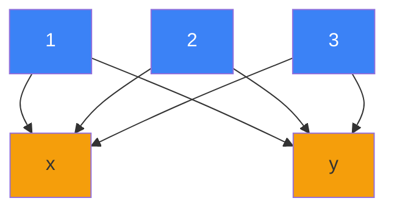
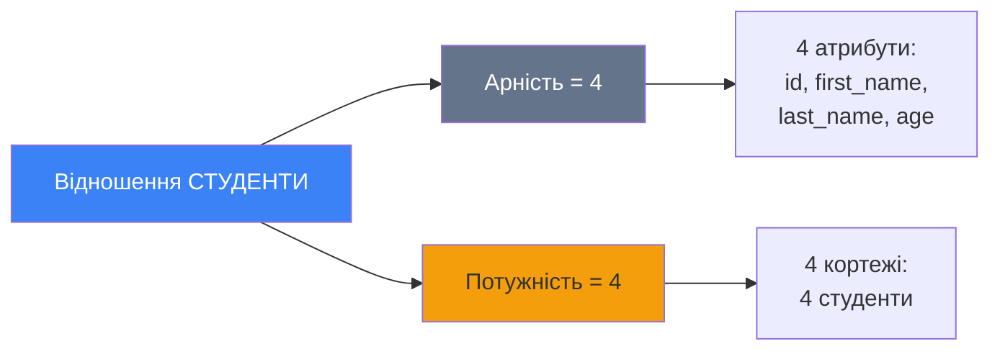
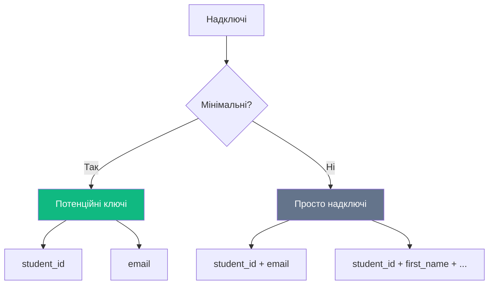

# Реляційна модель даних

::note{title="Мета уроку"}
У цьому уроці ми поглиблено вивчимо **математичні основи** реляційної моделі даних, зрозуміємо еволюцію від абстрактних відношень до практичних таблиць, та ознайомимося з основами реляційної алгебри.
::

## Вступ: Чому математика?

У попередньому уроці ми дізналися, що Едгар Кодд у 1970 році запропонував революційну ідею - використовувати прості таблиці замість складних ієрархічних та мережевих структур. Але що робить реляційну модель по-справжньому потужною?

**Відповідь: Математична строгість!**

::note{title="Фундамент реляційної моделі"}
Реляційна модель базується на **теорії множин** та **математичній логіці**. Завдяки цьому:

- Поведінка системи передбачувана
- Можна формально доводити правильність операцій
- Оптимізація запитів має математичне обґрунтування
- Є чіткі правила для роботи з даними

::

### Від життя до математики

Розглянемо звичайну життєву ситуацію:

**Приклад:** У бібліотеці є картотека з книгами. Кожна картка містить:

- Назву книги
- Автора
- Рік видання
- ISBN

**Питання:** Як це описати математично?

::mermaid


::

**Еволюція понять:**

1. **Реальний світ** - картотека з картками
2. **Математика** - відношення (relation)
3. **Практика** - таблиця (table)

---

## Математичні основи

### Теорія множин: базові поняття

::note
**Множина** (_Set_) - це сукупність **різних** об'єк тів, яких розглядають як єдине ціле.
::

**Приклади множин:**

::code-group

```txt [Множина країн]
КРАЇНИ = {Україна, Польща, Німеччина, Франція}
```

```txt [Множина чисел]
ПАРНІ = {2, 4, 6, 8, 10, ...}
```

```txt [Множина прізвищ]
АВТОРИ = {Шевченко, Франко, Леся Українка}
```

::

**Важливі властивості множин:**

::tabs
::tabs-item{label="Унікальність"}
Кожен елемент може бути в множині **тільки один раз**.

```
{1, 2, 3, 2, 1} = {1, 2, 3}
```

Дублікати автоматично видаляються!
::

::tabs-item{label="Порядок не важливий"}
Порядок елементів не має значення.

```
{A, B, C} = {C, A, B} = {B, C, A}
```

Всі ці множини однакові!
::

::tabs-item{label="Членство"}
Елемент або **належить** множині (∈), або **не належить** (∉).

```
Україна ∈ КРАЇНИ
Марс ∉ КРАЇНИ
```

::
::

### Декартів добуток

::note
**Декартів добуток** (_Cartesian Product_) двох множин A і B - це множина всіх можливих **упорядкованих пар** (a, b), де a ∈ A і b ∈ B.

**Позначення:** A × B
::

**Математична формула:**

```
A × B = {(a, b) | a ∈ A ∧ b ∈ B}
```

Читається: "Множина всіх пар (a, b) таких, що a належить A **та** b належить B"

**Приклад 1: Прості множини**

```
A = {1, 2, 3}
B = {x, y}

A × B = {
    (1, x), (1, y),
    (2, x), (2, y),
    (3, x), (3, y)
}
```

**Візуалізація:**

::mermaid



::

**Кількість елементів:**

```
|A × B| = |A| × |B| = 3 × 2 = 6 pairs
```

**Приклад 2: Бази даних**

```
СТУДЕНТИ = {Іван, Марія, Петро}
ПРЕДМЕТИ = {Математика, Фізика}

СТУДЕНТИ × ПРЕДМЕТИ = {
    (Іван, Математика),
    (Іван, Фізика),
    (Марія, Математика),
    (Марія, Фізика),
    (Петро, Математика),
    (Петро, Фізика)
}
```

Це всі **можливі комбінації** студентів та предметів!

**Приклад 3: Множинний декартів добуток**

```
A = {a, b}
B = {1, 2}
C = {x, y}

A × B × C = {
    (a, 1, x), (a, 1, y),
    (a, 2, x), (a, 2, y),
    (b, 1, x), (b, 1, y),
    (b, 2, x), (b, 2, y)
}
```

Кількість: 2 × 2 × 2 = **8 елементів**

::tip{title="Застосування в БД"}
Декартів добуток - це основа для операції **JOIN** у SQL! Коли ви з'єднуєте дві таблиці без умови, отримуєте Декартів добуток.

```sql
-- Це Декартів добуток!
SELECT * FROM Students, Subjects;
```

::

---

## Відношення (Relation)

### Що таке відношення?

::note
**Відношення** (_Relation_) - це **підмножина** Декартового добутку одного або більше доменів.
::

**Простими словами:** Відношення - це вибрані пари з декартового добутку, які мають сенс у нашому контексті.

**Математично:**

```
R ⊆ D₁ × D₂ × ... × Dₙ
```

Де:

- R - відношення
- D₁, D₂, ..., Dₙ - домени (множини можливих значень)
- ⊆ - знак "є підмножиною"

**Приклад:**

```
ДОМЕН_СТУДЕНТИ = {Іван, Марія, Петро, Оля}
ДОМЕН_ОЦІНКИ = {2, 3, 4, 5}

ДЕКАРТІВ_ДОБУТОК має 4 × 4 = 16 пар

ВІДНОШЕННЯ_ОЦІНКИ = {
    (Іван, 5),
    (Марія, 4),
    (Петро, 3),
    (Оля, 5)
}

ВІДНОШЕННЯ_ОЦІНКИ ⊆ ДОМЕН_СТУДЕНТИ × ДОМЕН_ОЦІНКИ
```

**Важливо:** Відношення містить **тільки осмислені** комбінації!

### Властивості відношень

::tabs
::tabs-item{label="Порядок кортежів не важливий"}

```
{(Іван, 5), (Марія, 4)} = {(Марія, 4), (Іван, 5)}
```

Рядки в таблиці можна переставляти!
::

::tabs-item{label="Немає дублікатів"}

```
{(Іван, 5), (Іван, 5)} = {(Іван, 5)}
```

Кожен кортеж унікальний!
::

::tabs-item{label="Порядок атрибутів важливий"}

```
(Іван, 5) ≠ (5, Іван)
```

У парі порядок має значення!
::

::tabs-item{label="Атомарність значень"}

```
✅ (Іван, 5)
❌ (Іван, {3, 4, 5})
```

Значення має бути простим, не множиною!
::
::

### Приклад відношення

**Відношення СТУДЕНТИ:**

Математичний запис:

```
СТУДЕНТИ = {
    (1, "Іван", "Іваненко", 20),
    (2, "Марія", "Коваленко", 19),
    (3, "Петро", "Сидоренко", 21)
}
```

Табличне представлення:

| student_id | first_name | last_name | age |
| ---------- | ---------- | --------- | --- |
| 1          | Іван       | Іваненко  | 20  |
| 2          | Марія      | Коваленко | 19  |
| 3          | Петро      | Сидоренко | 21  |

::warning{title="Відношення ≠ Таблиця"}
**Відношення** - це математичний об'єкт (множина кортежів).  
**Таблиця** - це візуальне представлення відношення.

Відношення - теорія, таблиця - практика!
::

---

## Домени (Domains)

::note
**Домен** (_Domain_) - це множина **допустимих значень** для певного атрибута.
::

### Приклади доменів

::code-group

```txt [Числові домени]
ВІКСТУДЕНТА = {16, 17, 18, ..., 99}
ОЦІНКИ = {2, 3, 4, 5}
ЦІНА = {0.00, 0.01, 0.02, ..., 999999.99}
```

```txt [Текстові домени]
ІМ'Я = {всі можливі імена}
EMAIL = {рядки виду "user@domain.com"}
ТЕЛЕФОН = {рядки виду "+380XXXXXXXXX"}
```

```txt [Дати  та логічні]
ДАТА = {1900-01-01, ..., 2100-12-31}
BOOLEAN = {TRUE, FALSE}
СТАТЬ = {Ч, Ж}
```

::

### Властивості доменів

::note

- Домен має **ім'я**
- Домен має **тип даних**
- Домен має **можливі значення**
- Різні атрибути можуть використовувати **один домен**

::

**Приклад:**

```
ДОМЕН_ВІК = INTEGER, діапазон [0..150]

АТРИБУТИ:
- вік_студента використовує ДОМЕН_ВІК
- вік_викладача використовує ДОМЕН_ВІК
- вік_батька використовує ДОМЕН_ВІК
```

Всі три атрибути мають **однаковий домен**!

### Чому домени важливі?

::tip{title="Переваги використання доменів"}

1. **Цілісність даних** - неможливо вставити неправильне значення
2. **Повторне використання** - один домен для багатьох атрибутів
3. **Зрозумілість** - чітко видно, які значення допустимі
4. **Оптимізація** - СУБД може оптимізувати зберігання

::

**Приклад порушення цілісності:**

```
ДОМЕН_ОЦІНКИ = {2, 3, 4, 5}

❌ INSERT INTO Grades VALUES (1, 'Іван', 10);  -- 10 не в домені!
✅ INSERT INTO Grades VALUES (1, 'Іван', 5);   -- 5 в домені
```

---

## Кортежі (Tuples)

::note
**Кортеж** (_Tuple_) - це **впорядкований набір** значень, де кожне значення належить відповідному домену.
::

### Структура кортежу

**Приклад кортежу:**

```
t = (1, "Іван", "Іваненко", 20, "КНТ-21")
```

**Розбір за позиціями:**

| Позиція | Значення   | Домен       | Атрибут    |
| ------- | ---------- | ----------- | ---------- |
| 1       | 1          | INTEGER     | student_id |
| 2       | "Іван"     | VARCHAR(50) | first_name |
| 3       | "Іваненко" | VARCHAR(50) | last_name  |
| 4       | 20         | INTEGER     | age        |
| 5       | "КНТ-21"   | VARCHAR(10) | group_code |

### Арність відношення

::note
**Арність** (_Arity, Degree_) - це **кількість атрибутів** у відношенні (кількість елементів у кортежі).
::

**Приклади:**

::tabs
::tabs-item{label="Унарне відношення (Арність = 1)"}

```
КРАЇНИ = {
    (Україна),
    (Польща),
    (Німеччина)
}
```

Таблиця:
| country_name |
|--------------|
| Україна |
| Польща |
| Німеччина |
::

::tabs-item{label="Бінарне відношення (Арність = 2)"}

```
С ТУДЕНТ_ГРУПА = {
    (Іван, КНТ-21),
    (Марія, КНТ-21),
    (Петро, КНТ-22)
}
```

Таблиця:
| student_name | group_code |
|--------------|------------|
| Іван | КНТ-21 |
| Марія | КНТ-21 |
| Петро | КНТ-22 |
::

::tabs-item{label="n-арне відношення (Арність = 5)"}

```
СТУДЕНТИ = {
    (1, Іван, Іваненко, 20, КНТ-21),
    (2, Марія, Коваленко, 19, КНТ-21)
}
```

Таблиця:
| id | first_name | last_name | age | group |
|----|------------|-----------|-----|-------|
| 1 | Іван | Іваненко | 20 | КНТ-21 |
| 2 | Марія | Коваленко | 19 | КНТ-21 |
::
::

### Потужність відношення

::note
**Потужність** (_Cardinality_) - це **кількість кортежів** у відношенні (кількість рядків у таблиці).
::

**Приклад:**

```
СТУДЕНТИ = {
    (1, Іван, Іваненко, 20),
    (2, Марія, Коваленко, 19),
    (3, Петро, Сидоренко, 21),
    (4, Оля, Петренко, 20)
}

Арність = 4 (чотири атрибути)
Потужність = 4 (чотири кортежі/рядки)
```

**Візуалізація:**

::mermaid



::

---

## Атрибути (Attributes)

::note
**Атрибут** (_Attribute_) - це **іменована колонка** відношення, яка представляє певну характеристику сутності.
::

### Типи атрибутів

::tabs
::tabs-item{label="Прості атрибути"}
**Прості** (_Simple, Atomic_) атрибути **не можна** розділити на частини.

**Приклади:**

- `age` - вік (число)
- `email` - адреса електронної пошти
- `rating` - рейтинг

```
student_id: 1
age: 20
email: "ivan@example.com"
```

::

::tabs-item{label="Складені атрибути"}
**Складені** (_Composite_) атрибути **можна** розділити на частини.

**Приклад - ім'я:**

```
full_name = {
    first_name: "Іван",
    middle_name: "Петрович",
    last_name: "Іваненко"
}
```

**У реляційній моделі розбиваємо:**
| first_name | middle_name | last_name |
|------------|-------------|-----------|
| Іван | Петрович | Іваненко |
::

::tabs-item{label="Похідні атрибути"}
**Похідні** (_Derived_) атрибути **обчислюються** на основі інших.

**Приклад - вік:**

```
birth_date: 2004-03-15
current_date: 2024-03-15

age = current_date.year - birth_date.year = 20
```

Зберігаємо `birth_date`, обчислюємо `age`!
::

::tabs-item{label="Багатозначні атрибути"}
**Багатозначні** (_Multivalued_) атрибути мають **кілька значень**.

**Приклад - телефони:**

```
student: Іван
phones: {+380501234567, +380672345678, +380931111111}
```

**У реляційній моделі - окрема таблиця:**
| student_id | phone |
|------------|---------------|
| 1 | +380501234567 |
| 1 | +380672345678 |
| 1 | +380931111111 |
::
::

### Правила атрибутів у реляційній моделі

::warning{title="1NF (Перша нормальна форма)"}
В реляційній моделі **всі атрибути мають бути атомарними**!

❌ **Неправильно:**
| student_id | phones |
|------------|-------------------------------------|
| 1 | +380501234567, +380672345678 |

✅ **Правильно:**
| student_id | phone |
|------------|---------------|
| 1 | +380501234567 |
| 1 | +380672345678 |
::

---

## Ключі (Keys)

Ключі - це **фундаментальна концепція** реляційноїмоделі. Вони забезпечують унікальність та зв'язки між відношеннями.

### Надключ (Superkey)

::note
**Надключ** (_Superkey_) - це **набір атрибутів**, значення яких **унікально визначають** кожен кортеж у відношенні.
::

**Приклад:**

Таблиця СТУДЕНТИ:
| student_id | email | first_name | last_name |
|------------|-------------------|------------|-----------|
| 1 | ivan@example.com | Іван | Іваненко |
| 2 | maria@example.com | Марія | Коваленко |
| 3 | petro@example.com | Петро | Сидоренко |

**Надключі:**

```
{student_id}
{email}
{student_id, email}
{student_id, first_name}
{student_id, last_name}
{student_id, email, first_name, last_name}
...
```

**Чому це надключі?**

Кожна з цих комбінацій **унікально** ідентифікує рядок!

::note{title="Правило"}
Якщо {A} - надключ, то {A, B}, {A, B, C}, ... - теж надключі!
::

### Candidate Key (Потенційний ключ)

::note
**Потенційний ключ** (_Candidate Key_) - це **мінімальний надключ**, тобто надключ, з якого **не можна** видалити жодного атрибута без втрати унікальності.
::

**Приклад:**

З попередньої таблиці:

**Надключі:**

```
{student_id}                               ← CANDIDATE KEY ✅
{email}                                    ← CANDIDATE KEY ✅
{student_id, email}                        ← НЕ candidate (можна видалити email)
{student_id, first_name, last_name}        ← НЕ candidate (можна видалити first_name і last_name)
```

**Потенційні ключі:**

```
{student_id}  - мінімальний
{email}       - мінімальний
```

**Візуалізація:**

::mermaid



::

### Primary Key (Первинний ключ)

::note
**Первинний ключ** (_Primary Key_) - це **обраний** потенційний ключ, який використовується для ідентифікації кортежів.
::

**Правила первинного ключа:**

::warning

- **Унікальність** - кожне значення унікальне
- **Незмінність** - не змінюється після створення
- **NOT NULL** - не може бути NULL
- **Один на таблицю** - тільки один первинний ключ

::

**Приклад:**

```sql
CREATE TABLE Students (
    student_id INT PRIMARY KEY,  -- ← Первинний ключ
    email VARCHAR(100) UNIQUE,   -- ← Потенційний ключ (альтернативний)
    first_name VARCHAR(50),
    last_name VARCHAR(50)
);
```

**Потенційні ключі:** `{student_id}`, `{email}`  
**Первинний ключ:** `student_id`  
**Альтернативний ключ:** `email`

**Чому обрали `student_id`?**

::tabs
::tabs-item{label="Переваги student_id"}

- Коротший (INT vs VARCHAR(100))
- Швидший для індексування
- Стабільний (email може змінитися)
- Зручний для посилань з інших таблиць

::

::tabs-item{label="Недоліки email"}

- Довший
- Може змінитися
- Повільніший для JOIN операцій

::

::

### Composite Key (Складений ключ)

::note
**Складений ключ** (_Composite Key_) - це ключ, що складається з **двох або більше** атрибутів.
::

**Приклад - зв'язок багато-до-багатьох:**

Таблиця ENROLLMENT (студенти та курси):

| student_id | course_id | semester | grade |
| ---------- | --------- | -------- | ----- |
| 1          | 101       | 2024-1   | 5     |
| 1          | 102       | 2024-1   | 4     |
| 2          | 101       | 2024-1   | 5     |
| 2          | 102       | 2024-1   | 3     |

**Первинний ключ:**

```sql
PRIMARY KEY (student_id, course_id, semester)
```

Чому потрібні всі три?

- `(student_id)` - не унікально (студент бере багато курсів)
- `(course_id)` - не унікально (курс беруть багато студентів)
- `(semester)` - не унікально (багато записів за семестр)
- `(student_id, course_id, semester)` - **унікально**! ✅

### Foreign Key (Зовнішній ключ)

::note
**Зовнішній ключ** (_Foreign Key_) - це атрибут (або набір атрибутів), який **посилається** на первинний ключ **іншої таблиці**.
::

**Приклад:**

**Таблиця Students:**
| student_id (PK) | first_name | last_name |
|-----------------|------------|-----------|
| 1 | Іван | Іваненко |
| 2 | Марія | Коваленко |

**Таблиця Enrollments:**
| enrollment_id (PK) | student_id (FK) | course_name |
|--------------------|-----------------|-------------|
| 101 | 1 | Математика |
| 102 | 1 | Фізика |
| 103 | 2 | Математика |

```sql
CREATE TABLE Enrollments (
    enrollment_id INT PRIMARY KEY,
    student_id INT,
    course_name VARCHAR(100),
    FOREIGN KEY (student_id) REFERENCES Students(student_id)
);
```

**Візуалізація зв'язку:**

::mermaid


::

**Правила зовнішніх ключів:**

::warning

- Значення FK має **існувати** в PK батьківської таблиці, або бути NULL
- При видаленні батьківського запису: - **CASCADE** - видалити всі дочірні - **SET NULL** - встановити NULL у дочірніх - **RESTRICT** - заборонити видалення

::

### Alternate Key (Альтернативний ключ)

::note
**Альтернативний ключ** (_Alternate Key, Unique Key_) - це потенційний ключ, який **не обраний** як первинний.
::

**Приклад:**

```sql
CREATE TABLE Users (
    user_id INT PRIMARY KEY,          -- Первинний ключ
    email VARCHAR(100) UNIQUE,        -- Альтернативний ключ
    phone VARCHAR(20) UNIQUE,         -- Альтернативний ключ
    username VARCHAR(50) UNIQUE       -- Альтернативний ключ
);
```

**Потенційні ключі:** `{user_id}`, `{email}`, `{phone}`, `{username}`  
**Первинний:** `user_id`  
**Альтернативні:** `email`, `phone`, `username`

In практику:

```sql
-- Можна знайти користувача будь-яким способом:
SELECT * FROM Users WHERE user_id = 1;
SELECT * FROM Users WHERE email = 'ivan@example.com';
SELECT * FROM Users WHERE phone = '+380501234567';
SELECT * FROM Users WHERE username = 'ivan_ua';
```

### Порівняльна таблиця ключів

| Тип ключа     | Унікан льність | Кількість | NULL дозволений | Використання                       |
| ------------- | -------------- | --------- | --------------- | ---------------------------------- |
| **Superkey**  | ✅ Так         | Багато    | ✅ Можливо      | Теоретичне поняття                 |
| **Candidate** | ✅ Так         | 1+        | ❌ Ні           | Потенційні ідентифікатори          |
| **Primary**   | ✅ Так         | 1         | ❌ Ні           | Основний ідентифікатор             |
| **Alternate** | ✅ Так         | 0+        | ❌ Ні           | Додаткові унікальні ідентифікатори |
| **Foreign**   | ❌ Ні          | 0+        | ⚠️ Залежить     | Зв'язки між таблицями              |
| **Composite** | ✅ Так         | Залежить  | ❌ Ні           | Багатостовпцеві ключі              |

---

## Від відношень до таблиць

### Еволюція термінології

Едгар Кодд використовував **математичні терміни**, але на практиці вони еволюціонували:

| Математичний термін          | Термін у СУБД                | Візуальне представлення         |
| ---------------------------- | ---------------------------- | ------------------------------- |
| **Відношення** (Relation)    | **Таблиця** (Table)          | Сітка з рядками та стовпцями    |
| **Кортеж** (Tuple)           | **Рядок** (Row, Record)      | Горизонтальний рядок у таблиці  |
| **Атрибут** (Attribute)      | **Стовпець** (Column, Field) | Вертикальний стовпець у таблиці |
| **Домен** (Domain)           | **Тип даних** (Data Type)    | INT, VARCHAR, DATE, etc.        |
| **Арність** (Degree)         | **Кількість стовпців**       | Число колонок                   |
| **Потужність** (Cardinality) | **Кількість рядків**         | Число записів                   |

**Приклад еволюції:**

::tabs
::tabs-item{label="Математична модель"}

```
СТУДЕНТИ = {
    t₁ = (1, "Іван", "Іваненко", 20),
    t₂ = (2, "Марія", "Коваленко", 19),
    t₃ = (3, "Петро", "Сидоренко", 21)
}

Арність = 4
Потужність = 3
```

::

::tabs-item{label="SQL реалізація"}

```sql
CREATE TABLE Students (
    student_id INT PRIMARY KEY,
    first_name VARCHAR(50),
    last_name VARCHAR(50),
    age INT
);

-- 4 стовпці, 3 рядки
```

::

::tabs-item{label="Візуалізація"}
| student_id | first_name | last_name | age |
|------------|------------|-----------|-----|
| 1 | Іван | Іваненко | 20 |
| 2 | Марія | Коваленко | 19 |
| 3 | Петро | Сидоренко | 21 |
::
::

### Чому зміна термінології?

::note{title="Історичні причини"}
**1970-ті:** Математики та теоретики використовували терміни "відношення", "кортеж"  
**1980-ті:** Розробники СУБД почали використовувати "таблиця", "рядок"  
**Сьогодні:** Обидві термінології співіснують

**Причини зміни:**

- "Таблиця" інтуїтивно зрозуміліша
- Легше пояснювати клієнтам
- Візуальна аналогія очевидна

::

**Важливо розуміти обидві:**

- **Математична** - для розуміння теорії
- **Практична** - для роботи з SQL

---

## NULL значення

::note
**NULL** - це спеціальне значення, яке означає **"невідомо"** або **"не застосовується"**.
::

### NULL ≠ Порожнє значення

::tabs
::tabs-item{label="NULL"}

```sql
age = NULL
```

Значення **невідоме**. Може бути 20, 30, 50 - ми не знаємо!
::

::tabs-item{label="0 (нуль)"}

```sql
age = 0
```

Значення **відоме** і дорівнює нулю (немовля).
::

::tabs-item{label="Порожній рядок"}

```sql
email = ''
```

Значення **відоме** - це порожній рядок.
::

::tabs-item{label="Пробіл"}

```sql
name = ' '
```

Значення **відоме** - це рядок з пробілом.
::
::

### Три-значна логіка (Three-Valued Logic)

У реляційній моделі логічні вирази можуть мати **три значення:**

::tabs
::tabs-item{label="TRUE"}
Вираз **істинний**.

```sql
SELECT * FROM Students WHERE age > 18;
-- Повертає студентів старше 18
```

::

::tabs-item{label="FALSE"}
Вираз **хибний**.

```sql
SELECT * FROM Students WHERE age < 16;
-- Не повертає нікого, якщо всі старші
```

::

::tabs-item{label="UNKNOWN"}
Вираз **невідомий** (через NULL).

```sql
SELECT * FROM Students WHERE age > 18;
-- Якщо age = NULL, результат UNKNOWN
-- Рядок НЕ буде включено в результат!
```

::
::

**Правила обчислення:**

| Вираз             | age = 20 | age = 15 | age = NULL  |
| ----------------- | -------- | -------- | ----------- |
| `age > 18`        | TRUE     | FALSE    | **UNKNOWN** |
| `age < 25`        | TRUE     | TRUE     | **UNKNOWN** |
| `age = NULL`      | FALSE    | FALSE    | **UNKNOWN** |
| `age IS NULL`     | FALSE    | FALSE    | **TRUE**    |
| `age IS NOT NULL` | TRUE     | TRUE     | **FALSE**   |

::warning{title="Важливо!"}
**Ніколи не використовуйте** `= NULL` або `!= NULL`!

❌ **Неправильно:**

```sql
SELECT * FROM Students WHERE age = NULL;  -- завжди порожній результат!
```

✅ **Правильно:**

```sql
SELECT * FROM Students WHERE age IS NULL;
```

::

### Логічні операції з NULL

**AND (І):**

| A       | B       | A AND B |
| ------- | ------- | ------- |
| TRUE    | TRUE    | TRUE    |
| TRUE    | FALSE   | FALSE   |
| TRUE    | UNKNOWN | UNKNOWN |
| FALSE   | UNKNOWN | FALSE   |
| UNKNOWN | UNKNOWN | UNKNOWN |

**OR (АБО):**

| A       | B       | A OR B  |
| ------- | ------- | ------- |
| TRUE    | TRUE    | TRUE    |
| TRUE    | FALSE   | TRUE    |
| TRUE    | UNKNOWN | TRUE    |
| FALSE   | UNKNOWN | UNKNOWN |
| UNKNOWN | UNKNOWN | UNKNOWN |

**NOT (НЕ):**

| A       | NOT A   |
| ------- | ------- |
| TRUE    | FALSE   |
| FALSE   | TRUE    |
| UNKNOWN | UNKNOWN |

**Приклад:**

```sql
-- age = NULL, grade = 5

SELECT * FROM Students
WHERE age > 18 AND grade > 4;
-- age > 18 = UNKNOWN
-- grade > 4 = TRUE
-- UNKNOWN AND TRUE = UNKNOWN
-- Рядок НЕ буде включено!
```

---

## Реляційна алгебра

::note
**Реляційна алгебра** (_Relational Algebra_) - це формальна мова для виконання операцій над відношеннями.
::

Реляційна алгебра - це **математична основа SQL**!

### Основні операції

::tabs
::tabs-item{label="Projection (Проекція) π"}
**Вибір стовпців**

**Позначення:** π (грецька літера "пі")

**Синтаксис:**

```
π_{A₁, A₂, ..., Aₙ}(R)
```

**Приклад:**

```
СТУДЕНТИ:
| student_id | first_name | last_name | age |
|------------|------------|-----------|-----|
| 1          | Іван       | Іваненко  | 20  |
| 2          | Марія      | Коваленко | 19  |

π_{first_name, age}(СТУДЕНТИ) =

| first_name | age |
|------------|-----|
| Іван       | 20  |
| Марія      | 19  |
```

**SQL еквівалент:**

```sql
SELECT first_name, age FROM Students;
```

::

::tabs-item{label="Selection (Вибірка) σ"}
**Вибір рядків за умовою**

**Позначення:** σ (грецька літера "сігма")

**Синтаксис:**

```
σ_{умова}(R)
```

**Приклад:**

```
σ_{age > 19}(СТУДЕНТИ) =

| student_id | first_name | last_name | age |
|------------|------------|-----------|-----|
| 1          | Іван       | Іваненко  | 20  |
| 3          | Петро      | Сидоренко | 21  |
```

**SQL еквівалент:**

```sql
SELECT * FROM Students WHERE age > 19;
```

::

::tabs-item{label="Union (Об'єднання) ∪"}
**Об'єднання двох відношень**

**Позначення:** ∪

**Умова:** Відношення мають **однакову структуру**

**Приклад:**

```
СТУДЕНТИ_КНТ21:
| name  |
|-------|
| Іван  |
| Марія |

СТУДЕНТИ_КНТ22:
| name  |
|-------|
| Петро |
| Марія |

СТУДЕНТИ_КНТ21 ∪ СТУДЕНТИ_КНТ22 =

| name  |
|-------|
| Іван  |
| Марія |  ← дублікат видалено!
| Петро |
```

**SQL еквівалент:**

```sql
SELECT name FROM Students_KNT21
UNION
SELECT name FROM Students_KNT22;
```

::

::tabs-item{label="Difference (Різниця) −"}
**Видалення з першого відношення рядків, які є в другому**

**Позначення:** − або \

**Приклад:**

```
ВСІСТУДЕНТИ:
| name  |
|-------|
| Іван  |
| Марія |
| Петро |

ВИПУСКНИКИ:
| name  |
|-------|
| Марія |

ВСІСТУДЕНТИ − ВИПУСКНИКИ =

| name  |
|-------|
| Іван  |
| Петро |
```

**SQL еквівалент:**

```sql
SELECT name FROM AllStudents
EXCEPT
SELECT name FROM Graduates;
```

::

::tabs-item{label="Cartesian Product (Декартів добуток) ×"}
**Всі можливі комбінації рядків двох відношень**

**Позначення:** ×

**Приклад:**

```
СТУДЕНТИ:
| name  |
|-------|
| Іван  |
| Марія |

ПРЕДМЕТИ:
| subject     |
|-------------|
| Математика  |
| Фізика      |

СТУДЕНТИ × ПРЕДМЕТИ =

| name  | subject    |
|-------|------------|
| Іван  | Математика |
| Іван  | Фізика     |
| Марія | Математика |
| Марія | Фізика     |
```

**SQL еквівалент:**

```sql
SELECT * FROM Students, Subjects;
-- або
SELECT * FROM Students CROSS JOIN Subjects;
```

::

::tabs-item{label="Join (З'єднання) ⋈"}
**Поєднання рядків за умовою**

**Позначення:** ⋈

**Синтаксис:**

```
R ⋈_{умова} S
```

**Приклад:**

```
СТУДЕНТИ:
| student_id | name  |
|------------|-------|
| 1          | Іван  |
| 2          | Марія |

ОЦІНКИ:
| student_id | subject    | grade |
|------------|------------|-------|
| 1          | Математика | 5     |
| 1          | Фізика     | 4     |
| 2          | Математика | 5     |

СТУДЕНТИ ⋈_{студенти.student_id = оцінки.student_id} ОЦІНКИ =

| student_id | name  | subject    | grade |
|------------|-------|------------|-------|
| 1          | Іван  | Математика | 5     |
| 1          | Іван  | Фізика     | 4     |
| 2          | Марія | Математика | 5     |
```

**SQL еквівалент:**

```sql
SELECT s.student_id, s.name, g.subject, g.grade
FROM Students s
JOIN Grades g ON s.student_id = g.student_id;
```

::
::

### Композиція операцій

Операції можна **комбінувати**!

**Приклад:** Знайти імена студентів старше 19 років

**Реляційна алгебра:**

```
π_{first_name}(σ_{age > 19}(СТУДЕНТИ))
```

**Крок 1:** σ*{age > 19}(СТУДЕНТИ) - вибрати студентів старше 19  
**Крок 2:** π*{first_name}(...) - взяти тільки імена

**SQL:**

```sql
SELECT first_name
FROM Students
WHERE age > 19;
```

**Складніший приклад:**

**Завдання:** Знайти імена студентів, які отримали оцінку 5 з математики

**Реляційна алгебра:**

```
π_{name}(
    σ_{grade = 5 AND subject = 'Математика'}(
        СТУДЕНТИ ⋈_{student_id} ОЦІНКИ
    )
)
```

**SQL:**

```sql
SELECT s.name
FROM Students s
JOIN Grades g ON s.student_id = g.student_id
WHERE g.grade = 5 AND g.subject = 'Математика';
```

---

## Практичні приклади

### Приклад 1: Бібліотека

**Відношення BOOKS:**

```
BOOKS = {
    (1, "Кобзар", "Тарас Шевченко", 1840),
    (2, "Лісова пісня", "Леся Українка", 1911),
    (3, "Захар Беркут", "Іван Франко", 1883)
}
```

**Домени:**

- book_id ∈ INTEGER
- title ∈ VARCHAR(200)
- author ∈ VARCHAR(100)
- year ∈ INTEGER [1000..2100]

**Таблиця:**

| book_id (PK) | title        | author         | year |
| ------------ | ------------ | -------------- | ---- |
| 1            | Кобзар       | Тарас Шевченко | 1840 |
| 2            | Лісова пісня | Леся Українка  | 1911 |
| 3            | Захар Беркут | Іван Франко    | 1883 |

**Операції:**

::code-group

```txt [Проекція - назви книг]
π_{title}(BOOKS) =

| title         |
|---------------|
| Кобзар        |
| Лісова пісня  |
| Захар Беркут  |
```

```txt [Вибірка - книги після 1900]
σ_{year > 1900}(BOOKS) =

| book_id | title        | author        | year |
|---------|--------------|---------------|------|
| 2       | Лісова пісня | Леся Українка | 1911 |
```

```txt [Композиція - автори книг після 1900]
π_{author}(σ_{year > 1900}(BOOKS)) =

| author        |
|---------------|
| Леся Українка |
```

::

### Приклад 2: Університет

**Три відношення:**

**STUDENTS:**
| student_id (PK) | name | group_id (FK) |
|-----------------|-------|---------------|
| 1 | Іван | 101 |
| 2 | Марія | 101 |
| 3 | Петро | 102 |

**GROUPS:**
| group_id (PK) | group_name | faculty |
|---------------|------------|-----------|
| 101 | КНТ-21 | КН |
| 102 | КНТ-22 | КН |

**ENROLLMENTS:**
| student_id (FK) | course | grade |
|-----------------|----------|-------|
| 1 | Math | 5 |
| 1 | Physics | 4 |
| 2 | Math | 5 |
| 3 | Physics | 3 |

**Запит:** Знайти назви груп студентів, які отрим али 5 з математики

**Реляційна алгебра:**

```
π_{group_name}(
    GROUPS ⋈_{group_id} (
        STUDENTS ⋈_{student_id} (
            σ_{course='Math' AND grade=5}(ENROLLMENTS)
        )
    )
)
```

**Крок 1:** Вибрати оцінки 5 з Math

```
σ_{course='Math' AND grade=5}(ENROLLMENTS)
| student_id | course | grade |
|------------|--------|-------|
| 1          | Math   | 5     |
| 2          | Math   | 5     |
```

**Крок 2:** Приєднати студентів

```
| student_id | name  | group_id |
|------------|-------|----------|
| 1          | Іван  | 101      |
| 2          | Марія | 101      |
```

**Крок 3:** Приєднати групи

```
| student_id | name  | group_id | group_name |
|------------|-------|----------|------------|
| 1          | Іван  | 101      | КНТ-21     |
| 2          | Марія | 101      | КНТ-21     |
```

**Крок 4:** Проекція (тільки назви груп)

```
| group_name |
|------------|
| КНТ-21     |
```

**SQL:**

```sql
SELECT DISTINCT g.group_name
FROM Groups g
JOIN Students s ON g.group_id = s.group_id
JOIN Enrollments e ON s.student_id = e.student_id
WHERE e.course = 'Math' AND e.grade = 5;
```

---

## Висновки

::note{title="Що ми вивчили"}
У цьому уроці ми розглянули:

✅ **Математичні основи:** теорія множин, Декартів добуток  
✅ **Відношення:** структура, властивості, домени  
✅ **Кортежі та атрибути:** арність, потужність, типи атрибутів  
✅ **Ключі:** надключ, потенційний, первинний, зовнішній, складений  
✅ **NULL значення:** три-значна логіка  
✅ **Реляційна алгебра:** проекція, вибірка, об'єднання, з'єднання  
✅ **Еволюція:** від відношень до таблиць
::

**Ключові концепції:**

1. **Математична строгість** - основа надійності реляційної моделі
2. **Ключі** - забезпечують унікальність та зв'язки
3. **NULL** - потребує особливої уваги (три-значна логіка)
4. **Реляційна алгебра** - теоретична основа SQL

### Навіщо це все?

::tip{title="Практична цінність"}
Розуміння математичних основ допомагає:

- **Проектувати** правильні структури БД
- **Оптимізувати** запити
- **Розуміти** роботу СУБД "під капотом"
- **Уникати** помилок з NULL
- **Обирати** правильні ключі

::

**У наступному уроці:**

Ми вивчимо **ER-моделювання** - як від вимог до проєкту перейти до структури бази даних!

---

## Практичні завдання

::note{title="Закріплення знань"}
Виконайте ці завдання для закріплення матеріалу:
::

### Завдання 1: Домени та відношення

Створіть відношення EMPLOYEES зі структурою:

**Домени:**

- employee_id: INTEGER [1..9999]
- full_name: VARCHAR(100)
- position: {Менеджер, Розробник, Дизайнер, Тестувальник}
- salary: DECIMAL [0..999999.99]
- hire_date: DATE [2000-01-01..2100-12-31]

**Оберіть:**

1. Які атрибути є потенційними ключами?
2. Який атрибут обрати як первинний ключ?
3. Чи можуть атрибути мати NULL?

### Завдання 2: Ключі

Дано таблиця ORDERS:

| order_id | customer_email    | order_date | total |
| -------- | ----------------- | ---------- | ----- |
| 1        | ivan@example.com  | 2024-01-15 | 500   |
| 2        | maria@example.com | 2024-01-16 | 750   |
| 3        | ivan@example.com  | 2024-01-17 | 300   |

**Питання:**

1. Які надключі існують?
2. Які потенційні ключі?
3. Який первинний ключ обрати?
4. Чи є складені ключі?

### Завдання 3: Реляційна алгебра

Дані дві таблиці:

**STUDENTS:**
| student_id | name | age |
|------------|-------|-----|
| 1 | Іван | 20 |
| 2 | Марія | 19 |
| 3 | Петро | 21 |

**GRADES:**
| student_id | subject | grade |
|------------|------------|-------|
| 1 | Math | 5 |
| 2 | Math | 4 |
| 1 | Physics | 4 |
| 3 | Math | 5 |

**Напишіть в реляційній алгебрі:**

1. Імена студентів старше 19
2. Предмети, з яких хтось отримав 5
3. Імена студентів, які отримали 5 з Math

### Завдання 4: NULL логіка

Обчисліть результат:

```sql
age = NULL
grade = 5

1. age > 18 AND grade > 4 = ?
2. age <20 OR grade = 5 = ?
3. NOT (age IS NULL) = ?
4. age = NULL AND grade = 5 = ?
```

::tip{title="Перевірте себе"}
Правильні відповіді:

1. UNKNOWN (UNKNOWN AND TRUE = UNKNOWN)
2. TRUE (UNKNOWN OR TRUE = TRUE)
3. FALSE (NOT TRUE = FALSE, бо age IS NULL = TRUE)
4. UNKNOWN (UNKNOWN AND TRUE = UNKNOWN)

::
