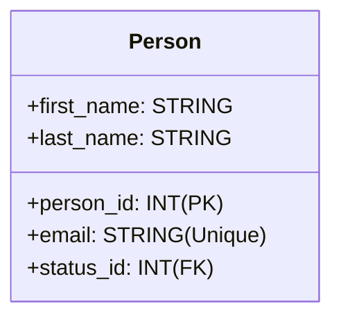
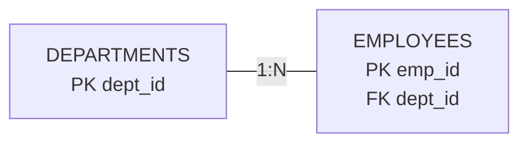
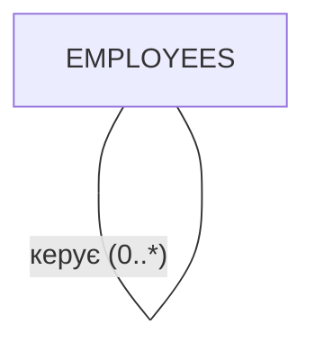
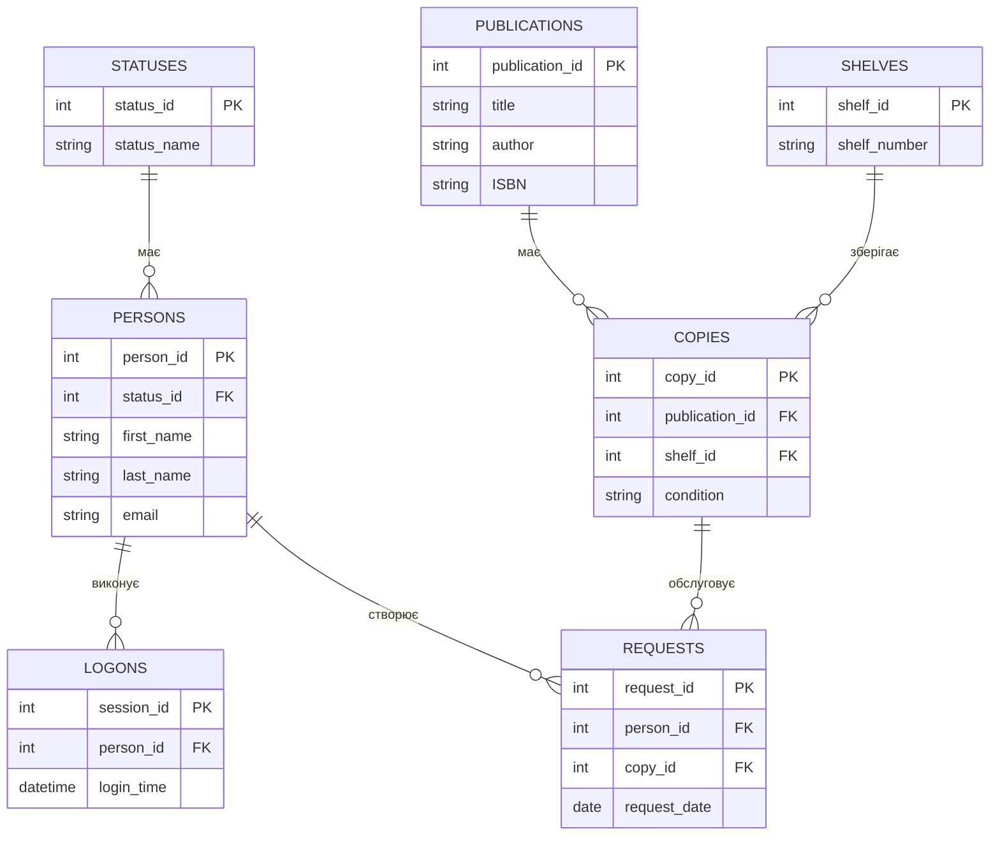
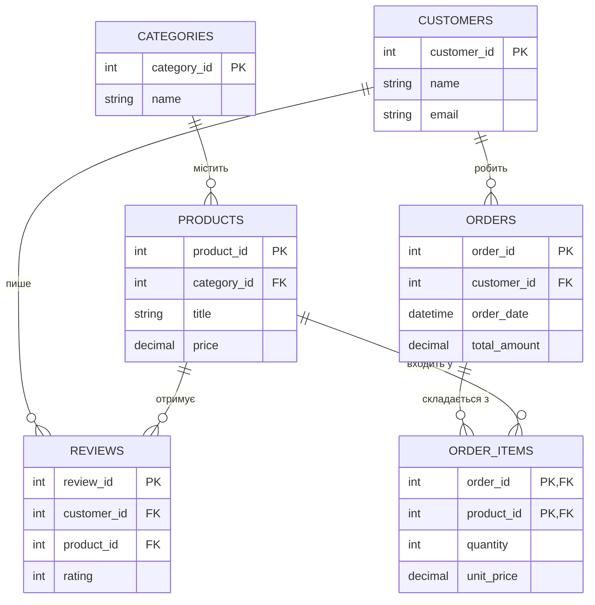

# Логічне проектування: Від концепції до реляційної схеми

::note{title="Мета уроку"}
У цьому уроці ми навчимося перетворювати абстрактні **ER-діаграми** на структуровані **логічні схеми** реляційної моделі даних. Ми вивчимо правила відображення сутностей, атрибутів та зв'язків у таблиці, а також зрозуміємо роль ключів у забезпеченні цілісності даних.
::

## Вступ: Що таке логічне проектування?

Логічне проектування — це міст між "ідеальним" світом вимог та "реальним" світом баз даних.

::mermaid


::

::tabs
::tabs-item{label="🧠 Концептуальний рівень (ER)"}
**Фокус:** Предметна область.
**Об'єкти:** Сутності, зв'язки, атрибути.
**Питання:** Що ми хочемо зберігати?
::

::tabs-item{label="⚙️ Логічний рівень (Relational)"}
**Фокус:** Структура даних.
**Об'єкти:** Таблиці, стовпці, типи даних, ключі.
**Питання:** Як саме ми це організуємо в реляційній моделі?
::
::

---

## Реляційне відношення як таблиця

Перш ніж переходити до трансформації, згадаємо, що таке **відношення** (Relation) у логічному контексті.

::note
**Відношення** — це множина кортежів, де кожен кортеж складається з набору атрибутів певних доменів (типів).
::

### Математична анатомія відношення

Формально відношення $R$ ступеня $n$ можна представити як:
$R \subseteq D_1 \times D_2 \times \dots \times D_n$

Де:

- $n$ — ступінь відношення (кількість атрибутів).
- $D_1, D_2, \dots, D_n$ — домени (типи значень).
- Кортеж $t = \langle a_1, a_2, \dots, a_n \rangle$ — набір значень $a_i \in D_i$.

### Правила інтерпретації відношення як таблиці

Щоб ми могли називати математичне відношення "таблицею", мають виконуватися такі правила:

| Правило                | Опис                                                    | Чому це важливо?          |
| ---------------------- | ------------------------------------------------------- | ------------------------- |
| **Типи стовпців**      | Кожен стовпець має чітко визначений тип.                | Передбачуваність даних.   |
| **Атомарність**        | Кожне значення в комірці — неподільне (1NF).            | Спрощення запитів.        |
| **Порядок неважливий** | Зміна порядку рядків або стовпців не змінює суть даних. | Гнучкість зберігання.     |
| **Без дублікатів**     | Кожен рядок (кортеж) має бути унікальним.               | Уникнення надмірності.    |
| **Унікальні назви**    | В межах однієї таблиці назви стовпців не повторюються.  | Відсутність двозначності. |

**Візуалізація відношення "Person" як таблиці:**

::mermaid



::

---

## Ключі: Фундамент цілісності

У логічній схемі ключі — це не просто "ідентифікатори", це інструменти, що забезпечують коректність зв'язків.

### 1. Первинні ключі (Primary Keys - PK)

::note
**Первинний ключ** — це один або кілька атрибутів, які однозначно ідентифікують кожен кортеж (рядок) у відношенні.
::

**Властивості PK:**

1. **Унікальність:** Немає двох рядків з однаковим значенням ключа.
2. **Нескоротність (мінімальність):** Жодна частина ключа не може бути видалена без втрати унікальності.
3. **NOT NULL:** Значення ключа обов'язково має існувати.

**Приклад вибору ключа:**
Для таблиці "Студенти" ми можемо обрати:

- `student_id` (штучний ключ, надійно) — ✅ **Найкращий вибір**
- `passport_number` (природний ключ, може змінитися) — ⚠️ Ризиковано
- `email` (природний ключ, унікальний) — ⚠️ Може змінитися

### 2. Зовнішні ключі (Foreign Keys - FK)

::note
**Зовнішній ключ** — це атрибут (або набір атрибутів) одного відношення, значення якого посилається на первинний ключ іншого відношення.
::

Механізм FK реалізує **зв'язки** між сутностями. Він гарантує **референційну цілісність** (якщо посилання існує, то об'єкт, на який воно вказує, теж має існувати).

---

## Правила трансформації: ER → Реляційна схема

Це систематичний алгоритм перетворення концептуальної моделі на набір таблиць.

### Крок 1: Відображення сильних сутностей

Кожна сильна сутність перетворюється на окрему таблицю.

::code-group

```txt [ER-модель]
ENTITY: Product
ATTRIBUTES:
  - product_id (PK)
  - title
  - price
```

```sql [Логічна схема (SQL)]
CREATE TABLE Products (
    product_id INT PRIMARY KEY,
    title NVARCHAR(200) NOT NULL,
    price DECIMAL(10, 2)
);
```

::

### Крок 2: Відображення слабких сутностей

Слабка сутність перетворюється на таблицю, яка включає атрибути слабкої сутності ПЛЮС первинний ключ "батьківської" сутності як **зовнішній ключ**.

::code-group

```txt [ER-модель]
PARENT: User (user_id PK)
WEAK ENTITY: Session
ATTRIBUTES: session_id, login_time
```

```sql [Логічна схема]
CREATE TABLE Users (
    user_id INT PRIMARY KEY,
    name NVARCHAR(100)
);

CREATE TABLE Sessions (
    session_id INT,
    user_id INT,  -- FK від батька
    login_time DATETIME,
    PRIMARY KEY (session_id, user_id),
    FOREIGN KEY (user_id) REFERENCES Users(user_id)
        ON DELETE CASCADE
);
```

::

### Крок 3: Відображення атрибутів

| Тип атрибута      | Дія при трансформації                                  | Приклад                              |
| ----------------- | ------------------------------------------------------ | ------------------------------------ |
| **Простий**       | Стає стовпцем таблиці.                                 | `age INT`                            |
| **Складений**     | Розбивається на окремі стовпці (**декомпозиція**).     | `name` → `first_name`, `last_name`   |
| **Похідний**      | НЕ включається в схему (або як обчислюваний стовпець). | `age` (з `birth_date`)               |
| **Багатозначний** | Створюється **окрема таблиця** зі зв'язком 1:N.        | `PersonPhones` для сутності `Person` |

### Крок 4: Відображення зв'язків

Тут правила залежать від кардинальності (типу зв'язку).

#### 1. Зв'язок 1:1 (Один-до-одного)

Є три стратегії:

1. **Зовнішній ключ:** Додати PK однієї таблиці як FK в іншу.
2. **Унікальний зовнішній ключ:** Як пункт 1, але з умовою `UNIQUE` на FK.
3. **Об'єднання:** Якщо участь обох сторін повна, можна об'єднати в одну таблицю.

#### 2. Зв'язок 1:N (Один-до-багатьох)

Первинний ключ сторони "Один" додається як зовнішній ключ у таблицю сторони "Багато".

::mermaid



::

#### 3. Зв'язок M:M (Багато-до-багатьох)

Завжди вимагає створення **проміжної таблиці** (Junction Table).

::tip{title="Структура Junction Table"}

1. ВКЛЮЧАЄ первинні ключі обох пов'язаних таблиць.
2. Ця пара зазвичай стає **складеним первинним ключем**.
3. Може містити додаткові атрибути (оцінка, дата запису тощо).

::

---

## Просунуті типи зв'язків

У реальних предметних областях часто зустрічаються складніші типи зв'язків, які вимагають особливого підходу при трансформації.

### 1. Рекурсивні (унарні) зв'язки

Це зв'язок сутності з самою собою.

**Приклад: Співробітники та Керівники**
Кожен співробітник має керівника, який також є співробітником.

::mermaid



::

**Трансформація:**
Додаємо FK у ту саму таблицю, який посилається на PK цієї ж таблиці.

```sql
CREATE TABLE Employees (
    employee_id INT PRIMARY KEY,
    name NVARCHAR(100),
    manager_id INT, -- FK посилається на employee_id
    FOREIGN KEY (manager_id) REFERENCES Employees(employee_id)
);
```

**Приклад даних:**
| employee_id | name | manager_id |
|-------------|------|------------|
| 1 | Бос | NULL |
| 2 | Іван | 1 |
| 3 | Марія| 1 |

### 2. Тернарні зв'язки

Зв'язок між трьома сутностями одночасно.

**Приклад: Викладач, Предмет та Група**
Викладач веде певний предмет у конкретної групи.

**Трансформація:**
Тернарний зв'язок ЗАВЖДИ перетворюється на окрему таблицю, яка містить три зовнішні ключі.

```sql
CREATE TABLE Teaching (
    teacher_id INT,
    subject_id INT,
    group_id INT,
    semester NVARCHAR(20),
    PRIMARY KEY (teacher_id, subject_id, group_id),
    FOREIGN KEY (teacher_id) REFERENCES Teachers(teacher_id),
    FOREIGN KEY (subject_id) REFERENCES Subjects(subject_id),
    FOREIGN KEY (group_id) REFERENCES Groups(group_id)
);
```

---

## Обробка ієрархій (Супертипи та Підтипи)

Коли в ER-моделі є успадкування, ми маємо обрати одну з логічних стратегій. Розглянемо їх детально на прикладі сутності `User` та підтипів `Student` і `Teacher`.

### Стратегія 1: Одна таблиця на ієрархію (Single Table per Hierarchy)

Всі атрибути супертипу та всіх підтипів зберігаються в одній великій таблиці. Додається стовпець-дискримінатор (`user_type`).

```sql
CREATE TABLE AllUsers (
    user_id INT PRIMARY KEY,
    name NVARCHAR(100),
    email NVARCHAR(100),
    user_type NVARCHAR(10), -- 'STUDENT' or 'TEACHER'
    -- Атрибути студента
    student_card_number NVARCHAR(20) NULL,
    -- Атрибути викладача
    degree NVARCHAR(50) NULL
);
```

✅ **Переваги:** Висока швидкість вибірки (немає `JOIN`). Легко додавати нові підтипи.
❌ **Недоліки:** Багато `NULL` значень (стовпці студента порожні для викладача). Порушення 3NF.

### Стратегія 2: Таблиця на підтип (Table per Concrete Class)

Кожен підтип має свою таблицю з усіма атрибутами (і своїми, і успадкованими). Базової таблиці не існує.

```sql
CREATE TABLE Students (
    student_id INT PRIMARY KEY,
    name NVARCHAR(100),
    email NVARCHAR(100),
    student_card_number NVARCHAR(20)
);

CREATE TABLE Teachers (
    teacher_id INT PRIMARY KEY,
    name NVARCHAR(100),
    email NVARCHAR(100),
    degree NVARCHAR(50)
);
```

✅ **Переваги:** Немає `NULL`. Об'єкти підтипів повністю незалежні.
❌ **Недоліки:** Дублювання структури атрибутів супертипу (`name`, `email`). Складно зробити універсальний пошук по всіх користувачах.

### Стратегія 3: Таблиця на кожен рівень (Table per Class)

Створюється таблиця для супертипу і по таблиці для кожного підтипу. Зв'язок 1:1 за первинним ключем.

```sql
CREATE TABLE BaseUsers (
    user_id INT PRIMARY KEY,
    name NVARCHAR(100),
    email NVARCHAR(100)
);

CREATE TABLE Students (
    user_id INT PRIMARY KEY, -- також FK
    student_card_number NVARCHAR(20),
    FOREIGN KEY (user_id) REFERENCES BaseUsers(user_id)
);

CREATE TABLE Teachers (
    user_id INT PRIMARY KEY, -- також FK
    degree NVARCHAR(50),
    FOREIGN KEY (user_id) REFERENCES BaseUsers(user_id)
);
```

✅ **Переваги:** Найбільш правильна з точки зору реляційної теорії. Чиста структура, немає дублювання даних.
❌ **Недоліки:** Потребує багато `JOIN` для отримання повної інформації про об'єкт.

---

## Цілісність даних при трансформації

При створенні зовнішніх ключів ми маємо визначити правила поведінки системи при зміні або видаленні батьківських даних.

::note
**Правила цілісності** (_Referential Integrity Rules_) визначають, що станеться з дочірніми рядками, якщо видалити або змінити батьківський рядок.
::

### Основні типи дій (Actions):

1. **CASCADE (Каскадно):**
    - Видалення батька → Видалення всіх дітей.
    - Оновлення PK батька → Оновлення всіх FK дітей.
    - _Приклад:_ Видалення `Order` видаляє всі `OrderItems`.

2. **SET NULL (Встановити в NULL):**
    - Видалення батька → FK дітей стає `NULL`.
    - _Приклад:_ Видалення `Category` робить товари "без категорії".

3. **RESTRICT / NO ACTION (Заборонити):**
    - Не дозволяє видалити батька, поки існують пов'язані діти.
    - _Приклад:_ Не можна видалити `Student`, поки у нього є `Grades`.

4. **SET DEFAULT (Встановити за замовчуванням):**
    - При видаленні батька FK стає стандартним значенням.

**SQL приклад з правилами:**

```sql
CREATE TABLE OrderItems (
    item_id INT PRIMARY KEY,
    order_id INT,
    product_id INT,
    FOREIGN KEY (order_id) REFERENCES Orders(order_id)
        ON DELETE CASCADE,     -- Видаляємо замовлення -> видаляємо деталі
    FOREIGN KEY (product_id) REFERENCES Products(product_id)
        ON DELETE RESTRICT    -- Не видаляємо товар, якщо він є в замовленнях
);
```

---

## Масштабування назв та стандартів

Для великих проєктів важливо мати чіткий **Data Dictionary** та стандарти типів даних.

### Порівняння типів даних у різних СУБД

| Логічний тип    | MS SQL Server   | Oracle           | PostgreSQL      | MySQL           |
| --------------- | --------------- | ---------------- | --------------- | --------------- |
| Ціле число      | `INT`           | `NUMBER(10)`     | `INTEGER`       | `INT`           |
| Велике ціле     | `BIGINT`        | `NUMBER(19)`     | `BIGINT`        | `BIGINT`        |
| Текст (змінний) | `NVARCHAR(MAX)` | `VARCHAR2(4000)` | `TEXT`          | `LONGTEXT`      |
| Текст (обмеж.)  | `NVARCHAR(100)` | `VARCHAR2(100)`  | `VARCHAR(100)`  | `VARCHAR(100)`  |
| Дата та час     | `DATETIME2`     | `TIMESTAMP`      | `TIMESTAMP`     | `DATETIME`      |
| Ціна / Гроші    | `DECIMAL(18,2)` | `NUMBER(18,2)`   | `DECIMAL(18,2)` | `DECIMAL(18,2)` |

### Глибоке іменування (Naming Standards)

| Об'єкт             | Шаблон назви                    | Приклад            |
| ------------------ | ------------------------------- | ------------------ |
| **Таблиця**        | `AppName_ModuleName_ObjectName` | `ERP_Sales_Orders` |
| **Первинний ключ** | `PK_TableName`                  | `PK_Orders`        |
| **Зовнішній ключ** | `FK_SourceTable_TargetTable`    | `FK_Orders_Users`  |
| **Унікальність**   | `UC_TableName_ColumnName`       | `UC_Users_Email`   |
| **Індекс**         | `IX_TableName_ColumnName`       | `IX_Orders_Date`   |

---

## Повний приклад: "Особиста бібліотека"

Трансформуємо концептуальну модель, яку ми створили в минулому уроці, у логічну схему.

### Етап 1: Аналіз сутностей та їх атрибутів

| Сутність        | Тип    | Таблиця        | Стовпці (Атрибути)                                           | Обґрунтування                |
| --------------- | ------ | -------------- | ------------------------------------------------------------ | ---------------------------- |
| **Person**      | Сильна | `Persons`      | person_id (PK), first_name, last_name, email, status_id (FK) | Системні користувачі         |
| **Status**      | Сильна | `Statuses`     | status_id (PK), status_name, description                     | Словник ролей                |
| **Publication** | Сильна | `Publications` | publication_id (PK), title, author, ISBN, year               | Каталог видань               |
| **Shelf**       | Сильна | `Shelves`      | shelf_id (PK), shelf_number, room                            | Сховище                      |
| **Copy**        | Слабка | `Copies`       | copy_id (PK), publication_id (FK), shelf_id (FK)             | Фізичні екземпляри           |
| **LogOn**       | Слабка | `LogOns`       | session_id (PK), person_id (FK), login_time                  | Базується на Person          |
| **Request**     | M:M    | `Requests`     | request_id (PK), person_id (FK), copy_id (FK)                | Зв'язок між читачем і книгою |

### Етап 2: Аналіз зв'язків та модальності

1. **Person ← Status (N:1, повна)**:
    - В `Persons` обов'язковий `status_id` (`NOT NULL`).
    - `ON DELETE RESTRICT` (не видаляємо статуси, якщо є люди).
2. **Publication → Copy (1:N, повна)**:
    - В `Copies` обов'язковий `publication_id`.
    - `ON DELETE CASCADE` (видалили опис книги -> видаляємо екземпляри).
3. **Shelf → Copy (1:N, часткова)**:
    - В `Copies` `shelf_id` дозволяє `NULL` (книга може бути не на полиці, а в дорозі).
4. **LogOn (1:N від Person)**:
    - `ON DELETE CASCADE` (видалили акаунт -> видалили логи).

### Етап 3: Фінальна логічна схема

::mermaid



::

---

## Бізнес-правила та обмеження (Business Rules)

Логічна схема має не лише структурувати дані, а й обмежувати їх згідно з бізнес-правилами.

### 1. Обмеження домену (Domain Constraints)

- Перевірка типу та діапазону.
- _Приклад:_ `price >= 0`, `age BETWEEN 16 AND 100`.

### 2. Обмеження кортежу (Tuple Constraints)

- Перевірка значень у межах одного рядка.
- _Приклад:_ `end_date >= start_date`.

### 3. Цілісність відношення (Relation Integrity)

- Унікальність PK.
- Унікальність альтернативних ключів (Unique Indexes).

---

## Типові підводні камені трансформації

::warning{title="На що звернути увагу"}

1. **Циклічні залежності:** Таблиця А посилається на Б, а Б на А. Це часто виникає при спробі реалізувати зв'язок "Головний офіс" <-> "Співробітники" (один із них керівник).
    - _Рішення:_ Використовувати необов'язкові FK (NULL) або тригери.
2. **Надмірна кількість таблиць:** Іноді розбиття сутності на підтипи дає занадто багато дрібних таблиць.
    - _Порада:_ Якщо атрибутів у підтипах мало, використовуйте стратегію Single Table.
3. **Пропуск Junction Table:** Початківці часто намагаються реалізувати зв'язок "Багато-до-багатьох" за допомогою масиву ID в одному стовпці.
    - _Результат:_ Неможливо фільтрувати, неможливо дотримуватись цілісності.

::

---

## Практичні вправи

### Завдання 1: Трансформація складеного атрибута

Маємо сутність `Customer` з атрибутом `address` (city, street, zip). Напишіть SQL-структуру таблиці після декомпозиції.

### Завдання 2: Зв'язок M:M

Перетворіть зв'язок між `Teacher` та `Subject` у набір таблиць логічної схеми. Вкажіть первинні та зовнішні ключі.

### Завдання 3: Іменування

Запропонуйте назви стовпців та ключів для системи "Аптека", де є рецепти, ліки та пацієнти.

### Завдання 4: Рекурсія

Створіть логічну схему для "Меню сайту", де кожен пункт може мати багато вкладених підпунктів.

---

## Порівняння моделей проектування

При проектуванні логічної схеми корисно розуміти, як реляційний підхід співвідноситься з іншими популярними моделями.

| Характеристика    | Реляційна модель (SQL)        | Об'єктна модель (OOD) | NoSQL (Document)          |
| ----------------- | ----------------------------- | --------------------- | ------------------------- |
| **Одиниця даних** | Таблиця (Відношення)          | Об'єкт (Екземпляр)    | Документ (JSON/BSON)      |
| **Структура**     | Жорстка, фіксована            | Ієрархічна            | Гнучка (Schema-less)      |
| **Зв'язки**       | Ключі (PK/FK)                 | Посилання (Reference) | Вкладеність або посилання |
| **Цілісність**    | Забезпечується СУБД           | Забезпечується кодом  | Забезпечується кодом      |
| **Масштабування** | Вертикальне (більше ресурсів) | Вертикальне           | Горизонтальне (шардінг)   |
| **Мова запитів**  | SQL                           | Методи об'єктів       | API СУБД (напр. MQL)      |

---

## Глибокий розбір типів даних (Data Types Deep Dive)

Вибір правильного типу даних на логічному рівні критично впливає на продуктивність та обсяг сховища.

### 1. Текстові типи: VARCHAR vs NVARCHAR

::tabs
::tabs-item{label="VARCHAR (Non-Unicode)"}
Зберігає 1 байт на символ (ASCII/ANSI).
✅ **Займає менше місця.**
❌ **Не підтримує багатомовність (напр. українську кирилицю в деяких кодуваннях або емодзі).**
::

::tabs-item{label="NVARCHAR (Unicode)"}
Зберігає 2+ байти на символ.
✅ **Підтримує будь-яку мову та спецсимволи.**
❌ **Займає у 2 рази більше пам'яті.**
::
::

### 2. Числові типи: DECIMAL vs FLOAT

::tabs
::tabs-item{label="DECIMAL / NUMERIC"}
Точне представлення чисел. Використовує фіксовану кому.
✅ **Ідеально для фінансів (грошей).**
❌ **Повільніше за операції з плаваючою комою.**
::

::tabs-item{label="FLOAT / REAL"}
Приблизне представлення чисел. Використовує плаваючу кому.
✅ **Дуже швидкі математичні розрахунки (наукові дані).**
❌ **Помилки округлення (0.1 + 0.2 може не дорівнювати 0.3).**
::
::

### 3. Цілі числа: Коли використовувати BIGINT?

Завжди використовуйте **найменший можливий тип**:

- `TINYINT` (0-255) — статуси, вік.
- `SMALLINT` (-32k to 32k) — кількість товарів у невеликому магазині.
- `INT` (до 2 млрд) — стандарт для ID.
- `BIGINT` (понад 2 млрд) — лічильники переглядів YouTube, транзакції глобальних платіжних систем.

---

## Кейс-стаді: Проектування онлайн-магазину

Пройдемо повний шлях трансформації для складного сценарію.

### 1. Бізнес-аналіз

Магазин продає **Товари**. Товари мають **Категорії**. Клієнти роблять **Замовлення**. Кожне замовлення містить кілька **Позицій**. Клієнти можуть залишати **Відгуки**.

### 2. ER-діаграма (Концептуальна)

- **Сутності:** `Customer`, `Product`, `Category`, `Order`, `Review`.
- **Зв'язки:**
    - `Category` 1:N `Product` (У кожній категорії багато товарів).
    - `Customer` 1:N `Order` (Клієнт робить багато замовлень).
    - `Order` M:M `Product` (У замовленні багато товарів, товар у багатьох замовленнях).
    - `Customer` 1:N `Review` (Клієнт пише багато відгуків).
    - `Product` 1:N `Review` (У товару багато відгуків).

### 3. Трансформація в логічну схему

#### А. Обробка M:M (Order <-> Product)

Створюємо таблицю `OrderItems`:

```sql
CREATE TABLE OrderItems (
    order_id INT,
    product_id INT,
    quantity INT NOT NULL,
    unit_price DECIMAL(10,2) NOT NULL,
    PRIMARY KEY (order_id, product_id),
    FOREIGN KEY (order_id) REFERENCES Orders(order_id),
    FOREIGN KEY (product_id) REFERENCES Products(product_id)
);
```

#### Б. Обробка категорій (1:N)

Додаємо `category_id` у таблицю `Products`:

```sql
CREATE TABLE Products (
    product_id INT PRIMARY KEY,
    category_id INT NOT NULL,
    title NVARCHAR(200),
    description NVARCHAR(MAX),
    price DECIMAL(10,2),
    stock_quantity INT,
    FOREIGN KEY (category_id) REFERENCES Categories(category_id)
);
```

#### В. Обробка відгуків

Відгук пов'язаний і з Клієнтом, і з Товаром.

```sql
CREATE TABLE Reviews (
    review_id INT PRIMARY KEY,
    customer_id INT NOT NULL,
    product_id INT NOT NULL,
    rating TINYINT CHECK (rating BETWEEN 1 AND 5),
    comment NVARCHAR(1000),
    created_at DATETIME2,
    FOREIGN KEY (customer_id) REFERENCES Customers(customer_id),
    FOREIGN KEY (product_id) REFERENCES Products(product_id)
);
```

---

## Візуальне представлення логічної схеми (Schema Diagram)

::mermaid



::

---

## Документування бізнес-логіки на рівні схеми

Окрім таблиць, логічна схема має описувати **обмеження цілісності**:

::note

1. **Правило ціни:** `Products.price` завжди більше 0.
2. **Правило замовлення:** `Orders.total_amount` має дорівнювати сумі всіх `OrderItems.unit_price * quantity`.
3. **Правило видалення:** Якщо видаляємо `Customer`, замовлення мають залишитися (для бухгалтерії), але посилання на клієнта стає `NULL` або посилається на спец-запис "Видалений користувач".
4. **Правило унікальності:** `Customers.email` не може дублюватися.

::

---

## Глибоке занурення в стратегії первинних ключів (PK)

Вибір стратегії PK на логічному рівні має довгострокові наслідки для продуктивності та зручності розробки.

### 1. Автоінкремент (Serial / Auto-increment)

Найпопулярніший вибір для більшості систем.

| ✅ Переваги                                   | ❌ Недоліки                                            |
| --------------------------------------------- | ------------------------------------------------------ |
| Простий у реалізації.                         | Прогнозований (можна "вгадати" ID іншого користувача). |
| Висока продуктивність вставки (B-Tree index). | Складно об'єднувати дані з різних БД.                  |
| Компактний обсяг (4 байта для INT).           | Залежність від конкретної БД.                          |

### 2. UUID (Universally Unique Identifier)

128-бітне випадкове число.

| ✅ Переваги                                 | ❌ Недоліки                                       |
| ------------------------------------------- | ------------------------------------------------- |
| Унікальність у масштабі всього всесвіту.    | Займає 16 байтів (в 4 рази більше за INT).        |
| Можна генерувати на клієнті без БД.         | Фрагментація індексів (якщо UUID не послідовний). |
| Безпечний (неможливо вгадати наступний ID). | Повільніша вставка у порівнянні з INT.            |

::tip{title="Порада експерта"}
Якщо ви обираєте UUID, використовуйте **Ordered UUIDs** (UUID v7 або спеціальні механізми СУБД). Це дозволяє зберегти "послідовність" вставок, що критично для продуктивності індексації.
::

---

## Продуктивність зв'язків: Чи потрібно індексувати Foreign Keys?

Це питання часто виникає на етапі переходу до фізичного проектування.

1. **Багато-до-багатьох:** Проміжні таблиці ЗАВЖДИ вимагають індексів на обох FK для швидкого пошуку.
2. **Багато-до-одного:** Більшість СУБД (як Oracle або SQL Server) **НЕ створюють** індекси на FK автоматично.
3. **Чому це важливо?** Без індексу на FK будь-який `JOIN` або перевірка цілісності при видаленні батька вимагатиме повного сканування (Full Table Scan) дочірньої таблиці.

---

## Концептуальна різниця: Відношення vs. Таблиця

Хоча ми часто використовуємо ці терміни як синоніми, між ними є тонка теоретична різниця, яку важливо розуміти професіоналу.

| Характеристика       | Реляційне відношення (Теорія)       | Таблиця (Реалізація)                                       |
| -------------------- | ----------------------------------- | ---------------------------------------------------------- |
| **Дублікати**        | Категорично заборонені (множина).   | Дозволені, якщо не визначено PK.                           |
| **Порядок рядків**   | Математично відсутній.              | Фізично існує (хоча логічно не гарантується без ORDER BY). |
| **Порядок стовпців** | Відсутній (доступ за іменами).      | Існує (можна звертатися за індексом стовпця).              |
| **NULL значення**    | Суворо обмежені в класичній теорії. | Широко використовуються в SQL.                             |

::note
На етапі логічного проектування ми намагаємося максимально наблизити наші **Таблиці** до математичних **Відношень**, щоб мінімізувати аномалії даних.
::

---

## Глосарій логічного проектування

::tabs
::tabs-item{label="🇺🇦 Українською"}

- **Логічна схема** — Опис структури даних у термінах таблиць та ключів.
- **Первинний ключ (PK)** — Унікальний ідентифікатор рядка.
- **Зовнішній ключ (FK)** — Посилання на іншу таблицю.
- **Кортеж** — Рядок у відношенні.
- **Атрибут** — Стовпець або властивість.
- **Кардинальність** — Тип кількісного зв'язку (1:1, 1:N, M:M).
- **Декомпозиція** — Розбиття складного об'єкта на простіші (напр. атрибута).

::

::tabs-item{label="🇺🇸 English"}

- **Logical Schema** — Data structure description in terms of tables and keys.
- **Primary Key (PK)** — Unique identifier of a row.
- **Foreign Key (FK)** — Reference to another table.
- **Tuple** — A row in a relation.
- **Attribute** — A column or property.
- **Cardinality** — type of relationship quantity (1:1, 1:N, M:M).
- **Decomposition** — Breaking a complex object into simpler ones (e.g. attribute).

::
::

---

## Типові підводні камені трансформації

::warning{title="На що звернути увагу"}

1. **Циклічні залежності:** Таблиця А посилається на Б, а Б на А. Це часто виникає при спробі реалізувати зв'язок "Головний офіс" <-> "Співробітники" (один із них керівник).
    - _Рішення:_ Використовувати необов'язкові FK (NULL) або тригери.
2. **Надмірна кількість таблиць:** Іноді розбиття сутності на підтипи дає занадто багато дрібних таблиць.
    - _Порада:_ Якщо атрибутів у підтипах мало, використовуйте стратегію Single Table.
3. **Пропуск Junction Table:** Початківці часто намагаються реалізувати зв'язок "Багато-до-багатьох" за допомогою масиву ID в одному стовпці.
    - _Результат:_ Неможливо фільтрувати, неможливо дотримуватись цілісності.
4. **Ігнорування NULL:** Невміння визначити, де стовпець може бути порожнім, призводить до помилок при вставці даних.

::

---

## Практичні вправи

### Завдання 1: Трансформація складеного атрибута

Маємо сутність `Customer` з атрибутом `address` (city, street, zip). Напишіть SQL-структуру таблиці після декомпозиції.

### Завдання 2: Зв'язок M:M

Перетворіть зв'язок між `Teacher` та `Subject` у набір таблиць логічної схеми. Вкажіть первинні та зовнішні ключі.

### Завдання 3: Іменування

Запропонуйте назви стовпців та ключів для системи "Аптека", де є рецепти, ліки та пацієнти.

### Завдання 4: Рекурсія

Створіть логічну схему для "Меню сайту", де кожен пункт може мати багато вкладених підпунктів.

### Завдання 5: Ієрархія

Для системи "Транспорт" (суспільний транспорт: Автобус, Трамвай, Тролейбус) оберіть оптимальну стратегію трансформації підтипів та обґрунтуйте вибір.

---

## Інструменти підтримки логічної цілісності

Окрім ключів та обмежень, СУБД надають активні інструменти для забезпечення бізнес-логіки.

### 1. Тригери (Triggers)

::note
**Тригер** — це збережена процедура, яка автоматично виконується при певній події (INSERT, UPDATE, DELETE).
::

У контексті логічного проектування тригери використовуються для:

- Складної валідації, яку неможливо описати через `CHECK`.
- Аудиту змін (запис у таблицю `AuditLogs` при зміні ціни).
- Підтримання денормалізованих полів (автоматичний перерахунок `total_amount` у замовленні).

### 2. Збережені процедури (Stored Procedures)

Це інкапсульована логіка на боці БД. Вони дозволяють:

- Виконувати складні операції в межах однієї транзакції.
- Сховати складність логічної схеми від прикладного програміста.
- Посилити безпеку (заборона прямого доступу до таблиць, тільки через процедури).

---

## Логічний vs. Фізичний дизайн: Де межа?

Коли ми завершуємо логічну схему, ми передаємо її системному адміністратору або DBA для фізичного впровадження.

| Логічний рівень        | Фізичний рівень                    |
| ---------------------- | ---------------------------------- |
| **Таблиця**            | Файл даних (.mdf, .dbf)            |
| **Стовпець**           | Байти на диску                     |
| **Зв'язок (FK)**       | Індекс + перевірка в коді СУБД     |
| **Індекс (IX)**        | B-Tree або Hash структура          |
| **Вигляд (View)**      | Збережений запит                   |
| **Логічне групування** | **Табличний простір (Tablespace)** |

---

## Рішення до практичних вправ

Нижче наведено варіанти відповідей, щоб ви могли перевірити себе.

### Завдання 1: Трансформація складеного атрибута

**Рішення:**

```sql
CREATE TABLE Customers (
    customer_id INT PRIMARY KEY,
    name NVARCHAR(100),
    addr_city NVARCHAR(50),      -- декомпозиція
    addr_street NVARCHAR(100),   -- декомпозиція
    addr_zip_code NVARCHAR(10)   -- декомпозиція
);
```

### Завдання 2: Зв'язок M:M (Teacher & Subject)

**Рішення:**
Вимагає Junction Table `TeacherSubjects`.

```sql
CREATE TABLE TeacherSubjects (
    teacher_id INT,
    subject_id INT,
    PRIMARY KEY (teacher_id, subject_id),
    FOREIGN KEY (teacher_id) REFERENCES Teachers(teacher_id),
    FOREIGN KEY (subject_id) REFERENCES Subjects(subject_id)
);
```

### Завдання 4: Рекурсія (Меню сайту)

**Рішення:**

```sql
CREATE TABLE MenuItems (
    item_id INT PRIMARY KEY,
    title NVARCHAR(100),
    url NVARCHAR(200),
    parent_item_id INT NULL, -- FK на item_id цієї ж таблиці
    FOREIGN KEY (parent_item_id) REFERENCES MenuItems(item_id)
);
```

### Завдання 6: Проектування FK з CASCADE

**Рішення:**

```sql
CREATE TABLE Books (
    book_id INT PRIMARY KEY,
    title NVARCHAR(200),
    author_id INT,
    FOREIGN KEY (author_id) REFERENCES Authors(author_id)
        ON DELETE CASCADE -- Ключова частина завдання
);
```

### Завдання 7: Дизайн для продуктивності

Уявіть таблицю `BigLog`, яка отримує 1000 записів на секунду. Який PK ви оберете (INT vs UUID vs Sequential UUID) та як обґрунтуєте це з точки зору структури B-Tree індексу на диску?

---

## Фінальна порада: Простота проти Складності

::tip{title="Правило Оккама в моделюванні"}
Не множте сутності без потреби. Якщо зв'язок 1:1 містить лише пару атрибутів з обох боків — об'єднайте їх в одну таблицю. Логічна схема має бути настільки простою, настільки це можливо, але не простішою за вимоги бізнесу.
::

---

## Висновки

::note{title="Що ми вивчили"}

- **Логічне проектування** перетворює концептуальну модель на реляційну.
- **Відношення** у логічній схемі стають таблицями.
- **Ключі (PK, FK)** забезпечують ідентифікацію та зв'язок.
- **Правила трансформації** чітко визначають, як обробляти сутності, атрибути та зв'язків різного типу.
- **Стратегії ієрархій** дозволяють моделювати успадкування в реляційному світі.
- **Рекурсивні та тернарні зв'язки** вимагають спеціальних підходів до проектування.
- **Referential Integrity** керує поведінкою системи при видаленні даних.
- **Типи даних** мають обиратися на основі точності та обсягу інформації.
- **Первинні ключі** (INT vs UUID) мають свої плюси та мінуси залежно від навантаження.
- **Тригери та процедури** — це "активна" частина логічної схеми для захисту даних.

::

**У наступному уроці:**
Ми вивчимо **класифікацію таблиць**, зрозуміємо різницю між довідниками, транзакційними та історичними таблицями!
