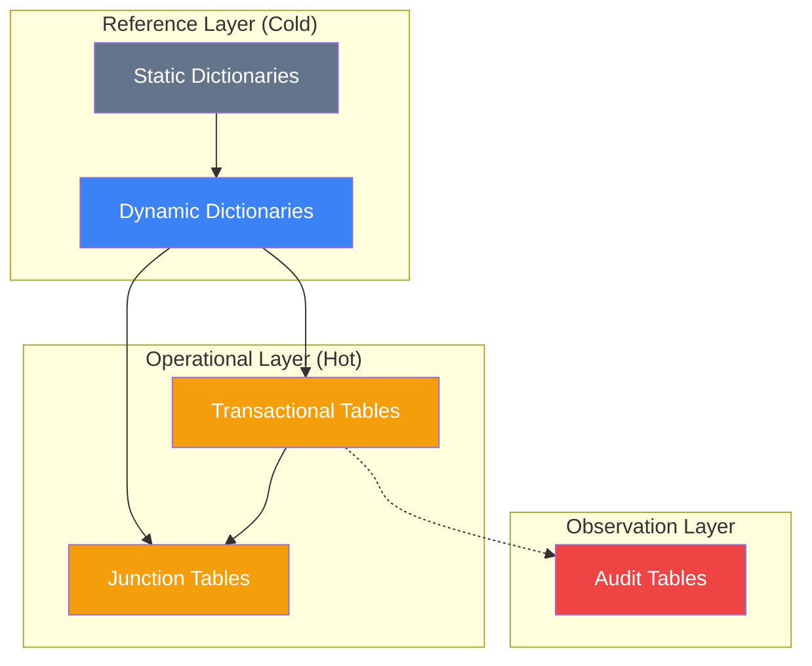
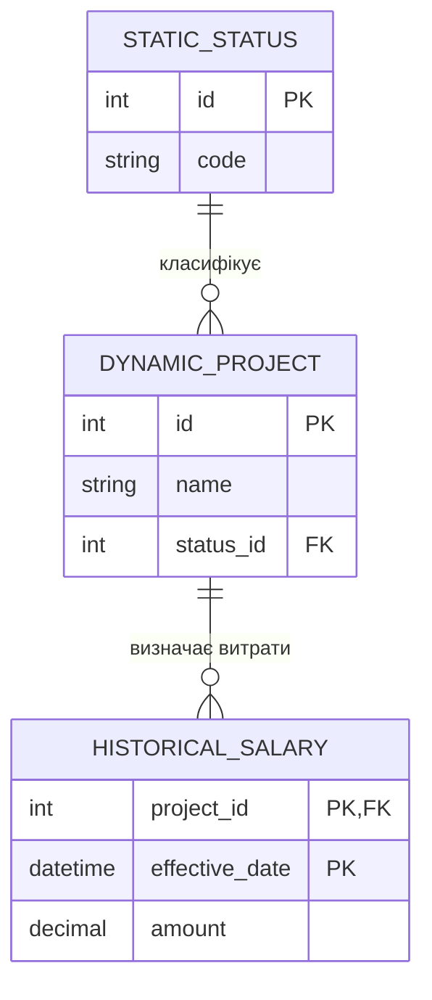
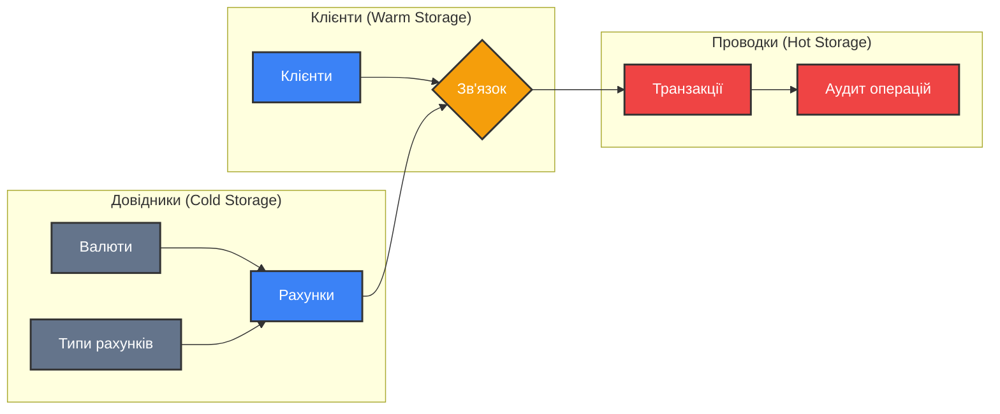

# Класифікація таблиць у реляційних БД

Проектування бази даних не закінчується на створенні логічної схеми. Коли ми переходимо від абстрактних відношень до реальних таблиць, ми стикаємося з необхідністю розуміти **роль** кожної таблиці в екосистемі даних.

Не всі таблиці однакові. Деякі зберігають "залізні" правила (наприклад, список країн), інші — тисячі транзакцій на секунду (замовлення), а деякі існують лише для того, щоб пов'язати інші таблиці між собою.

::note{title="Чому це важливо?"}
Розуміння класифікації таблиць дозволяє:

1. **Оптимізувати продуктивність:** Різні типи таблиць вимагають різних стратегій індексування та зберігання.
2. **Забезпечити цілісність:** Правила підтримки даних у довідниках відрізняються від правил у журналах подій.
3. **Полегшити масштабування:** Розділення "гарячих" та "холодних" даних — основа високонавантажених систем.

::

---

## Цілісність vs. Надмірність: Вічне протистояння

Перед тим як зануритися в типи таблиць, згадаємо два фундаментальні поняття, які визначають структуру будь-якої БД.

::definition
**Цілісність даних (Data Integrity)** — це властивість, що гарантує правильність, повноту та несуперечливість даних у будь-який момент часу. Це здатність за одними даними відновлювати інші, не втрачаючи семантичну єдність.
::

::definition
**Надмірність даних (Data Redundancy)** — це стан бази даних, у якому одні й ті самі факти повторюються в різних місцях без необхідності.
::

### Проблема вибору

У класичній теорії (3НФ+) ми прагнемо до **мінімізації надмірності** для захисту від аномалій. Однак у реальному світі іноді ми свідомо йдемо на надмірність:

- **Для швидкості:** Наприклад, зберігаємо ціну товару безпосередньо в замовленні, навіть якщо вона є в довіднику (бо ціна може змінитися в майбутньому).
- **Для історії:** Щоб знати, скільки коштував товар саме в момент покупки.

Класифікація таблиць допомагає нам вирішити, де цілісність є критичною, а де невелика надмірність є необхідною "ціною за швидкість".

---

## 1. Статичні довідники (Static Reference Tables)

Це таблиці, дані в яких або ніколи не змінюються після створення, або змінюються настільки рідко, що цим можна знехтувати.

### Характеристики:

- **Обсяг:** Зазвичай невеликий (від 2 до 500 записів).
- **Частота оновлення:** Майже нульова.
- **Використання:** Використовуються у випадаючих списках інтерфейсу та як домени для зовнішніх ключів.

### Приклади:

::list{type="info"}

- **Календарні константи:** Список місяців (id, name), дні тижня.
- **Географія:** Список океанів, материків.
- **Стандарти:** Коди валют (ISO 4217), коди країн.
- **Системні статуси:** `OrderStatus` (New, Paid, Shipped, Cancelled).

::

### Логічна структура (Анатомія):

Зазвичай такі таблиці мають максимально просту структуру:

```sql
CREATE TABLE OrderStatuses (
    status_id TINYINT PRIMARY KEY, -- Дуже компактний тип (0-255)
    code_name VARCHAR(20) UNIQUE,  -- 'NEW', 'PAID', etc.
    display_title NVARCHAR(50)     -- 'Нове', 'Оплачено'
);
```

### Чому ми виносимо це в таблицю?

Замість того, щоб писати в таблиці `Orders` слово "Нове" (що займає місце і дозволяє помилки на кшталт "Новее"), ми пишемо цифру `1`, яка посилається на статичний довідник.

---

## 2. Статично-динамічні довідники (Historical Reference)

Це більш складний тип довідників. Тут зберігаються дані, які носять довідковий характер, але мають **часовий вимір**.

::tip{title="Основна ідея"}
Дані в таких таблицях не просто оновлюються, вони **накопичуються**, зберігаючи історію станів.
::

### Класичний приклад: Таблиця окладів (Salaries)

Посада "Senior Developer" у січні могла мати оклад 100,000, а в лютому — 120,000. Ми не повинні просто стерти старе значення, бо бухгалтерія має знати, скільки нарахували в січні.

### Структура прикладу:

| Посада_ID | Оклад | Дата_оновлення |
| --------- | ----- | -------------- |
| 1001      | 12000 | 05.02.2015     |
| 1001      | 15000 | 01.07.2015     |
| 1002      | 17000 | 01.02.2015     |

### Особливості:

1. **Усвідомлена надмірність:** Ми повторюємо `Посада_ID`, але з різними датами та значеннями.
2. **Складний ключ:** Первинним ключем часто є пара `(Посада_ID, Дата_оновлення)`.
3. **Повна історія:** Це дозволяє відтворити стан системи на будь-яку дату в минулому.

---

## 3. Динамічні довідники (Dynamic Master Data)

Це таблиці об'єктів або суб'єктів предметної області, дані в яких змінюються регулярно, але все ще використовуються як основа для інших таблиць.

### Характеристики:

- **Обсяг:** Від середнього до великого (тисячі або мільйони записів).
- **Частота оновлення:** Регулярна (щодня, щогодини).
- **Приклади:** Список користувачів, каталог товарів, перелік проектів.

### Кейс: Динамічний довідник проектів

| Код проекту | Назва      | Термін (днів) | Користувач_ID | Дата_додавання |
| ----------- | ---------- | ------------- | ------------- | -------------- |
| PT102       | Фарбування | 15            | 1547          | 03.01.2024     |
| PT103       | Установка  | 10            | 9874          | 04.01.2024     |

### Проблема цілісності:

Якщо ми в цьому ж довіднику будемо зберігати поточний статус проекту (наприклад, "Завершено"), це може бути не зовсім вірним. Краще зберігати історію змін статусів в окремій таблиці, а тут — лише актуальну інформацію про саму сутність "Проект".

---

## 4. Таблиці-зв'язки (Junction / Linkage Tables)

Коли ми говорили про [логічну схему](./04.logical-schema), ми згадували, що зв'язок "Багато-до-багатьох" (M:M) вимагає проміжної таблиці. У класифікації ми ділимо такі таблиці на дві підгрупи.

### А. Чисте зв'язування (Pure Linkage)

Це таблиця, яка містить **тільки** зовнішні ключі (FK), що утворюють складений первинний ключ (PK). Вона не несе власної семантичної інформації, окрім самого факту зв'язку.

::list{type="success"}

- **Приклад:** `UserRoles` (user_id, role_id).
- **Мета:** Просто сказати, що "Користувач А має Роль Б".
- **Надмірність:** Мінімальна.

::

### Б. Довідник-зв'язок (Reference-Linkage / Enriched)

Це набагато частіший випадок. Таблиця не просто пов'язує два об'єкти, а описує **властивості цього зв'язку**.

::important
Вона називається "довідник-зв'язок", тому що дані в ній (як-от сума або дата) самі по собі не є довідковими, але разом вони утворюють запис, на який можуть посилатися інші таблиці.
::

**Приклад: Платіжні транзакції**
Транзакція пов'язує **Платника** та **Одержувача**, але вона має власні критичні дані:
| Код транзакції | Платник_ID | Одержувач_ID | Сума | Дата | Коментар |
|----------------|------------|--------------|--------|------------|------------|
| EEVS-doodi4 | 100045 | 57457 | 10000 | 25.07.2024 | На чоботи |
| UDFD-ioeed9 | 455780 | 10024 | 900 | 24.06.2024 | NULL |

**Чому це не "чисте зв'язування"?** Тому що без поля `Сума` цей зв'язок втрачає сенс для бізнесу.

---

## 5. Транзакційні таблиці (Operational / Fact Tables)

Це "серце" будь-якої інформаційної системи. Тут накопичуються дані про операційну діяльність бізнесу.

### Характеристики:

- **Швидкість росту:** Найвища. Тисячі записів щохвилини.
- **Природа даних:** Факти, що відбулися в часі (події).
- **Зв'язки:** Мають багато FK, що посилаються на довідники (хто купив, що купив, у якій валюті).
- **Приклади:** `Orders`, `Payments`, `SensorReadings`, `CallLogs`.

### Порівняння з довідниками:

| Ознака            | Довідник            | Транзакційна таблиця             |
| ----------------- | ------------------- | -------------------------------- |
| **Змінюваність**  | Рідко               | Ніколи (записи тільки додаються) |
| **Життєвий цикл** | Довгий              | Можуть архівуватися за віком     |
| **Ключі**         | Зазвичай простий ID | Часто складений або UUID         |

---

## 6. Допоміжні типи таблиць

### А. Таблиці аудиту (Audit Logs)

Фіксують "хто, коли і що" змінив у системі. Зазвичай вони відокремлені від основних даних, щоб не уповільнювати запити.

### Б. Таблиці черг (Queues / Staging)

Тимчасові таблиці для обробки даних (наприклад, імпорт з Excel або черга листів на відправку). Після успішної обробки записи звідси видаляються.

### В. Віртуальні таблиці (Views)

Це не фізичні таблиці на диску, а збережені в БД запити. Вони виглядають як таблиці для користувача, але дані в них "збираються" на льоту з інших типів таблиць.

---

## Архітектурний паттерн: Взаємодія типів

::mermaid



::

## Візуалізація зв'язків довідників

::mermaid



::

---

## Кейс-стаді: Класифікація таблиць в E-commerce

Розглянемо архітектуру великого інтернет-магазину. Нам потрібно розподілити всі таблиці за категоріями, щоб зрозуміти, як ними керувати.

### 1. Каталог та Довідники (Cold/Warm Data)

::tabs
::tabs-item{label="Статичні"}

- **`Countries`**: (id, iso_code, name). Змінюється раз на кілька років.
- **`Currencies`**: (id, code, symbol).
- **`OrderStatuses`**: (id, label).

::

::tabs-item{label="Динамічні"}

- **`Products`**: Головний реєстр товарів. Оновлюється щодня (нові надходження, зміна опису).
- **`Categories`**: Дерево категорій.
- **`Brands`**: Список виробників.

::

::tabs-item{label="Статично-динамічні"}

- **`ProductPrices`**: Історія змін цін. Містить `product_id`, `price`, `start_date`, `end_date`.
- **`StockBalances`**: Історія залишків на складі.

::
::

### 2. Користувачі та Профілі (Warm Data)

- **`Customers`**: Динамічний довідник клієнтів (email, hash, name).
- **`CustomerAddresses`**: Чисте зв'язування + атрибути (customer_id, address_details).
- **`Roles`**: Статичний довідник (Admin, Manager, Customer).
- **`CustomerRoles`**: **Чисте зв'язування** (customer_id, role_id).

### 3. Операції та Транзакції (Hot Data)

- **`Orders`**: **Транзакційна таблиця**. Основний запис про покупку.
- **`OrderItems`**: **Довідник-зв'язок**. Поєднує `Orders` та `Products`, але додає `buy_price` та `quantity`.
- **`Payments`**: Транзакційна таблиця платежів.
- **`CartItems`**: Тимчасова таблиця (Staging). Може очищуватися автоматично через 30 днів.

---

## Стратегії управління життєвим циклом (Data Lifecycle)

Залежно від типу таблиці, ми обираємо різні підходи до технічного обслуговування.

| Тип таблиці             | Стратегія бекапу     | Індексація                 | Доля старих даних                         |
| ----------------------- | -------------------- | -------------------------- | ----------------------------------------- |
| **Статичний довідник**  | Раз на місяць        | Мінімальна (тільки PK)     | Завжди зберігаються                       |
| **Динамічний довідник** | Кожен день           | Багато індексів для пошуку | Тільки актуальні (архівування видалених)  |
| **Транзакційна**        | Щогодини / Real-time | Індекси на FK + Дати       | Перенесення в Cold Storage через 1-3 роки |
| **Аудит/Логи**          | Раз на добу          | Тільки на Дату             | Видалення через 6-12 місяців              |

---

## Помилки класифікації: Чому "змішувати" типи — погано?

::warning{title="Антипатерн: Все в одній таблиці"}
Часто розробники намагаються запхнути в динамічний довідник `Products` поле `CurrentStock`.

- **Проблема:** Поле `CurrentStock` змінюється при кожному продажі (транзакційна природа), а опис товару — раз на місяць.
- **Наслідок:** Таблиця `Products` стає "гарячою", постійно блокується (Lock), що уповільнює звичайний перегляд каталогу користувачами.
- **Рішення:** Винести `Stock` в окрему транзакційну або статично-динамічну таблицю.

::

---

## Проектування для масштабування: Поділ даних

Коли база даних стає величезною, ми використовуємо класифікацію для фізичного розподілу:

1. **Довідники** — можна кешувати в пам'яті (Redis), бо вони рідко змінюються.
2. **Транзакції** — можна розбивати на частини (Partitioning) за роками або місяцями.
3. **Логи** — можна виносити в окрему "дешеву" базу даних (Columnar DB), бо вони не потребують JOIN-ів.

---

## Вправи на закріплення матеріалу

### Завдання 1: Визначення типу

До якого типу ви віднесете таблицю `BloodPressureHistory` у системі моніторингу пацієнтів? Обґрунтуйте свою відповідь.

### Завдання 2: Проектування зв'язку

Спроектуйте таблицю для зв'язку "Студент" та "Курс". Який це буде підтип (Чисте зв'язування чи Довідник-зв'язок), якщо ми хочемо зберігати дату запису на курс та фінальну оцінку?

### Завдання 3: Аналіз антипатерну

Таблиця `Employees` містить поле `LastLoginTimestamp`. До якого типу таблиць за своєю природою належить ця інформація? Чи варто тримати її в основній таблиці співробітників?

### Завдання 4: Архітектура логування

Запропонуйте структуру таблиці `AuditLog` для відстеження змін у зарплатах. Які поля там обов'язково мають бути?

### Завдання 5: Географічний довідник

Маємо таблицю `Cities`. Вона динамічна чи статична у контексті системи доставки піци в межах одного міста? А в контексті глобальної системи бронювання готелів?

---

## Практичне завдання: Побудова схеми класифікації

Створіть Mermaid діаграму (Class Diagram), де для системи "Авіакомпанія" відобразіть мінімум 6 таблиць і позначте їхній тип за допомогою стереотипів (наприклад, `<<static>>`, `<<transactional>>`).

**Сутності для підказки:** Літак, Рейс, Квиток, Аеропорт, Пасажир, Тип_харчування.

---

## Стандарти іменування за типом таблиць

Для великих проектів критично важливо з першого погляду розуміти, до якого типу належить таблиця. Один із найкращих підходів — використання префіксів.

::tabs
::tabs-item{label="Префіксна система"}

- **`ref_`** (Reference): Для статичних та динамічних довідників.
    - Приклад: `ref_countries`, `ref_order_statuses`.
- **`dict_`** (Dictionary): Альтернатива для `ref_`.
- **`fact_`** (Fact): Для транзакційних таблиць.
    - Приклад: `fact_orders`, `fact_payments`.
- **`link_`** (Link): Для таблиць-зв'язків (junction).
    - Приклад: `link_customer_roles`, `link_order_items`.
- **`log_`** (Log): Для таблиць аудиту та логування.
    - Приклад: `log_price_changes`.
- **`tmp_`** (Temporary): Для проміжних таблиць імпорту/експорту.

::

::tabs-item{label="Суфіксна система"}

- **`_hst`** (History): Для статично-динамічних таблиць історії.
    - Приклад: `prices_hst`.
- **`_map`** (Mapping): Для проміжних таблиць.
    - Приклад: `user_role_map`.

::
::

### Переваги префіксів:

1. **Групування:** У базі даних таблиці одного типу будуть знаходитися поруч у списку.
2. **Безпека:** Можна легше налаштувати права доступу (наприклад, заборонити редагування всіх таблиць `ref_%`).
3. **Читаність:** Програміст одразу розуміє, чи можна кешувати дані з цієї таблиці.

---

## Оптимізація типів даних за класифікацією

Вибір малого типу даних у довідниках — це не тільки економія місця, а й прискорення індексів.

### 1. Довідники (ID-стовпці)

Якщо у вас всього 10 статусів замовлення, використовувати `BIGINT` (8 байтів) для ID — це злочин.

- Використовуйте **`TINYINT`** (1 байт, до 255 значень).
- Це зменшить розмір зовнішнього ключа в кожному з мільйонів рядків транзакційної таблиці `Orders`.

### 2. Транзакційні таблиці (Дата та Сума)

- Завжди використовуйте **`DECIMAL`** для грошей, ніколи — `FLOAT`.
- Для дат у транзакціях краще використовувати **`DATETIME2`** або **`TIMESTAMP`**, щоб мати точність до мілісекунд (важливо для логів).

---

## Глосарій класифікації таблиць

::tabs
::tabs-item{label="🇺🇦 Українською"}

- **Статичний довідник** — Таблиця з константами, що майже не змінюються.
- **Динамічний довідник** — Основний реєстр сутностей (Майстер-дані).
- **Транзакційна таблиця** — Таблиця фактів або подій, що відбуваються в часі.
- **Таблиця-зв'язок (Junction)** — Таблиця для реалізації M:M.
- **Аудит** — Журнал змін даних.
- **Денормалізація** — Свідоме введення надмірності для швидкості.

::

::tabs-item{label="🇺🇸 English"}

- **Static Dictionary** — A table with constants that rarely change.
- **Dynamic Master Data** — Main registry of entities.
- **Transactional Table** — Fact or event table capturing real-time data.
- **Junction Table** — A table specifically for M:M relationships.
- **Audit Log** — A record of data modifications.
- **Denormalization** — Intentional redundancy for performance.

::
::

---

## Рішення до вправ

### Завдання 1: BloodPressureHistory

**Відповідь:** Це **Транзакційна таблиця** (або статично-динамічна, якщо ми розглядаємо це як історію станів). Вона накопичує факти вимірювання в часі. Вона ніколи не оновлюється (тільки вставляються нові записи).

### Завдання 2: Студент та Курс (оцінка)

**Відповідь:** Це **Довідник-зв'язок**.

```sql
CREATE TABLE link_student_courses (
    student_id INT,
    course_id INT,
    enrollment_date DATE,
    final_grade TINYINT,
    PRIMARY KEY (student_id, course_id)
);
```

### Завдання 4: AuditLog для зарплат

**Відповідь:**

```sql
CREATE TABLE log_salary_audit (
    audit_id BIGINT PRIMARY KEY,
    employee_id INT,
    old_salary DECIMAL(10,2),
    new_salary DECIMAL(10,2),
    changed_by_user_id INT,
    changed_at DATETIME2
);
```

---

## Еволюція ролі таблиці: Від статики до динаміки

Рідко коли роль таблиці залишається незмінною протягом усього життя системи. Розуміння цієї еволюції допомагає проектувати гнучкі схеми.

### Сценарій 1: Становлення довідника

На початку проекту список категорій товарів може бути **статичним довідником** (просто перелік у коді або маленька таблиця).
З часом бізнес розширюється, і категорії стають **динамічним довідником** з ієрархією, мета-тегами для SEO та окремими правами доступу.

### Сценарій 2: Коли довідник стає транзакційним

Уявіть таблицю `Prices`. Спочатку це може бути просто стовпець у таблиці `Products` (динамічний довідник). Потім виникає потреба зберігати історію змін — таблиця стає **статично-динамічною**.
Якщо ж компанія переходить на динамічне ціноутворення (ціна змінюється кожну хвилину залежно від попиту), ця таблиця за своєю природою перетворюється на **транзакційну**.

---

## Глибокий розбір транзакційних таблиць (Operational Deep Dive)

Транзакційні таблиці — це місце, де "вмирає" продуктивність при неправильному проектуванні.

### 1. Проблема безкінечного росту

На відміну від довідників, транзакційні таблиці ростуть лінійно або експоненціально.
::tip{title="Стратегія 'Гаряче/Холодне'"}
Розділяйте дані на:

- **Hot:** Замовлення за останні 3 місяці (потрібні для швидкого доступу).
- **Warm:** Замовлення за останній рік (потрібні для звітів).
- **Cold:** Замовлення старше 5 років (архів, можна перенести в іншу базу).

::

### 2. Індексація: Баланс між читанням та записом

Кожен індекс на транзакційній таблиці уповільнює вставку (INSERT), бо СУБД має оновити дерево індексу.

- **Правило:** Мінімум індексів. Тільки на ті поля, за якими реально шукають (наприклад, `customer_id` або `order_date`).

---

## Порівняння ролей таблиць у різних доменах

Одна і та сама сутність може мати різний тип таблиці залежно від бізнес-моделі.

| Сутність       | Домен: Логістика                     | Домен: Соцмережа             | Домен: Банкінг                          |
| -------------- | ------------------------------------ | ---------------------------- | --------------------------------------- |
| **Адреса**     | Динамічний довідник (місця доставки) | Атрибут профілю (незначний)  | Статично-динамічна (історія реєстрації) |
| **Ціна**       | Транзакційна (тариф рейсу)           | Відсутня                     | Об'єкт аудиту (курси валют)             |
| **Користувач** | Довідник водіїв                      | Транзакційна (активні сесії) | Майстер-дані (клієнти)                  |

---

## Взаємодія класифікації з Нормальними формами

Ви можете запитати: "Чи не суперечить класифікація таблиць нормалізації?".
Навпаки, вони доповнюють один одного:

1. **1НФ-3НФ** — дають нам структуру.
2. **Класифікація** — дає нам розуміння, як ці форми будуть поводитися під навантаженням.

Наприклад, перехід до **4НФ** (винесення багатозначних залежностей) часто перетворює звичайний стовпець на **чисте зв'язування** або **довідник-зв'язок**.

---

## Додаткові практичні вправи

### Завдання 6: Аналіз "Розумного будинку"

У системі IoT є таблиця `SensorReadings` (sensor_id, value, timestamp). До якого типу вона належить? Яка стратегія очищення даних підійде для неї через 2 роки роботи?

### Завдання 7: Від користувача до профілю

Ми маємо таблицю `Users`. Ми вирішили додати `AvatarHistory` (посилання на старі фото профілю). Який тип таблиці ми створили?

### Завдання 8: Моделювання "Спортивної ліги"

Спроектуйте таблиці для "Матчу" між двома командами. Де тут транзакційна частина, а де зв'язок? Які поля ви винесете в довідник-зв'язок `MatchDetails`?

---

## Рішення до додаткових вправ

### Завдання 6: SensorReadings

**Відповідь:** Це типична **Транзакційна таблиця** (або таблиця подій). Стратегія: **Агрегація**. Через 2 роки можна видалити секундні дані, залишивши тільки середні значення за кожну годину (денормалізація для звітності).

### Завдання 7: AvatarHistory

**Відповідь:** Це **Статично-динамічна таблиця**. Ми накопичуємо історію одного атрибута (`avatar_url`) для конкретного користувача.

---

## Глосарій класифікації таблиць (Advanced)

::tabs
::tabs-item{label="🇺🇦 Українською"}

- **Статичний довідник** — Таблиця з константами, що майже не змінюються (напр. місяці).
- **Динамічний довідник** — Основний реєстр сутностей, що регулярно оновлюється (напр. товари).
- **Транзакційна таблиця** — Таблиця фактів або подій, що відбуваються в часі (напр. замовлення).
- **Таблиця-зв'язок (Junction)** — Таблиця для реалізації M:M (напр. ролі користувачів).
- **Аудит** — Журнал змін даних для безпеки та контролю.
- **Денормалізація** — Свідоме введення надмірності для оптимізації швидкості читання.
- **Статично-динамічна таблиця** — Довідник, що зберігає історію станів (напр. прайс-лист).

::

::tabs-item{label="🇺🇸 English"}

- **Static Dictionary** — Constants that rarely change.
- **Dynamic Master Data** — Main registries of core entities.
- **Transactional Table** — Immutable records of events or facts.
- **Junction Table** — Implements many-to-many relationships.
- **Audit Log** — Tracking changes for accountability.
- **Denormalization** — Intentional redundancy to improve read performance.
- **Historical Table** — A reference table capturing state changes over time.

::
::

---

## Гранд-кейс: Класифікація таблиць АБС (Автоматизованої Банківської Системи)

Банківська система — це вершина складності в управлінні даними. Тут класифікація таблиць є критичною для виживання бізнесу. Розглянемо приклад архітектури ядра банку (Core Banking).

### 1. Довідники (Reference Data)

::tabs
::tabs-item{label="Статичні (ref\_\*)"}

- **`ref_currencies`**: ISO-коди валют (UAH, USD, EUR).
- **`ref_account_types`**: (Поточний, Депозитний, Картковий, Овердрафт).
- **`ref_branch_types`**: (Відділення, Банкомат, Термінал).
- **`ref_gender`**: (Чоловіча, Жіноча).
- **`ref_document_types`**: (Паспорт, ID-картка, ІПН).

::

::tabs-item{label="Динамічні (dict\_\*)"}

- **`dict_clients`**: Повний реєстр клієнтів (Майстер-дані). Містить сотні полів. Оновлюється при кожному візиті.
- **`dict_accounts`**: Реєстр номерів рахунків (IBAN).
- **`dict_staff`**: Реєстр співробітників банку та їхніх ролей.
- **`dict_partners`**: Реєстр сторонніх сервісів та мерчантів.

::
::

### 2. Історичні дані (Historical Reference)

- **`ref_exchange_rates`**: **Статично-динамічна таблиця**. Курси валют на кожен день.
    - Поля: `currency_id`, `rate`, `effective_date`.
- **`dict_client_history`**: Зміни адрес або прізвищ клієнтів.

### 3. Транзакційні таблиці (Operational Data)

- **`fact_transactions`**: **Головна транзакційна таблиця**. Мільярди записів.
    - Це "серце" банку. Кожен рух коштів фіксується тут.
    - Поля: `tx_id`, `from_acc_id`, `to_acc_id`, `amount`, `tx_type_id`, `timestamp`.
- **`fact_atm_logs`**: Технічні логи роботи банкоматів.
- **`fact_auth_attempts`**: Спроби входу в онлайн-банкінг.

### 4. Зв'язки (Linkage/Junction)

- **`link_client_accounts`**: Поєднує клієнта з його численними рахунками.
    - Тип: **Довідник-зв'язок**. Додає роль клієнта в рахунку (Власник, Довірена особа).
- **`link_card_accounts`**: Поєднує пластикову картку з рахунком IBAN.
- **`link_staff_branches`**: Який менеджер у якому відділенні працює сьогодні.

---

## Архітектура потоків даних у Банку

::mermaid



::

### Чому ми ділимо їх так? (Філософія банку)

1. **Транзакції (`fact_transactions`)** не можна змінювати. Якщо сталася помилка — робиться сторнуюча транзакція (нова подія). Це основа цілісності.
2. **Довідники (`ref_currencies`)** мають бути супер-швидкими, тому що вони беруть участь у кожному JOIN-і при перегляді виписки.
3. **Аудит** виноситься в окремий шар, щоб служба безпеки могла працювати, не заважаючи клієнтам переказувати гроші.

---

## Універсальний чеклист класифікації

Якщо ви не знаєте, до якого типу віднести таблицю, пройдіть цей тест:

1. **Чи видаляємо ми колись звідси записи?**
    - Так (через завершення обробки) -> **Черга (Queue)**.
    - Ні (тільки архівуємо) -> **Транзакційна**.
2. **Як часто змінюються дані в одному рядку?**
    - Майже ніколи -> **Статичний довідник**.
    - Кожен день -> **Динамічний довідник**.
    - Один раз (при створенні) -> **Транзакційна**.
3. **Чи є у цієї таблиці "власна сутність"?**
    - Ні, вона лише з'єднує А та Б -> **Junction**.
    - Так, у неї є унікальний опис -> **Entity Table**.

---

## Додаткові виклики для студентів (Expert Level)

### Завдання 9: Класифікація в GameDev

Ви проектуєте базу даних для MMORPG. Куди ви віднесете:

1. `Items` (список усіх можливих мечів у грі).
2. `PlayerInventory` (який меч у якого гравця зараз).
3. `DamageLogs` (хто кого вдарив і на скільки).
4. `PlayerStats` (рівень, сила, інтелект).

### Завдання 10: Зміна типу "на льоту"

У системі `SmartCity` таблиця `ParkingSlots` спочатку була статичним довідником (просто перелік місць). Ми встановили датчики, які передають статус (вільно/зайнято) кожну хвилину. Як змінилася класифікація цієї таблиці? Чи варто її тепер розділити на дві?

---

## Рішення до Expert Level

### Завдання 9: GameDev

**Відповідь:**

- `Items` — **Статичний довідник**.
- `PlayerInventory` — **Довідник-зв'язок**.
- `DamageLogs` — **Транзакційна таблиця** (подієва).
- `PlayerStats` — **Динамічний довідник** (профілі гравців).

### Завдання 10: ParkingSlots

**Відповідь:** Таблиця стала **"гарячою"**. Правильне рішення: залишити `ParkingSlots` як довідник (де знаходиться місце), а статус винести в окрему транзакційну таблицю `ParkingSensorEvents`. Це дозволить зберігати історію завантаженості парковки.

---

## Фінальне слово про архітектурну інтуїцію

Проектування БД — це не тільки про Normal Forms. Це про розуміння **життя даних**. Якщо ви бачите, що таблиця "пухне" від записів — це транзакція. Якщо вона маленька, але "всюдисуща" (у кожному `JOIN`) — це довідник.

::tip{title="Золоте правило"}
Класифікуйте дані до того, як почнете писати код. Це зекономить вам місяці рефакторингу в майбутньому.
::

---

## Технічне обслуговування за типом таблиць

Розуміння класифікації дозволяє адміністраторам БД (DBA) правильно налаштовувати регламентні роботи.

### 1. Статистика та плани запитів

СУБД використовує "Статистику" для вибору найкращого способу виконання запиту.

- **Для довідників:** Статистика майже не змінюється. Її можна оновлювати раз на тиждень.
- **Для транзакційних таблиць:** Статистика застаріває миттєво. Якщо банк провів 1 млн транзакцій за ранок, старий план запиту може призвести до Full Table Scan.
    - **Рішення:** Автоматичне оновлення статистики при зміні 10% даних.

### 2. Фрагментація індексів

- **Довідники:** Індекси майже не фрагментуються, бо немає постійних вставок/видалень.
- **Транзакції:** Якщо ви використовуєте UUID як PK, індекси фрагментуються дуже швидко ("розриви" в B-Tree).
    - **Рекомендація:** Регулярний Rebuild індексів для `fact_` таблиць.

---

## Порівняння: Реляційна класифікація vs. NoSQL підходи

Чи існують ці типи таблиць у світі NoSQL (MongoDB, Cassandra, Redis)?

| Тип таблиці (SQL)       | Аналог у NoSQL             | Примітки                                                         |
| ----------------------- | -------------------------- | ---------------------------------------------------------------- |
| **Статичний довідник**  | Config Files / Redis       | Часто зберігаються в пам'яті для швидкості.                      |
| **Динамічний довідник** | Document (MongoDB)         | Дані сутності зберігаються як один великий JSON.                 |
| **Транзакційна**        | Log-Structured (Cassandra) | Сховище, оптимізоване для запису (LSM-tree).                     |
| **Junction Table**      | Embedding (Вкладеність)    | Замість окремої таблиці, дані "вкладаються" в основний документ. |

::note{title="Висновок для розробника"}
Навіть якщо ви переходите на NoSQL, ви повинні розуміти **природу** своїх даних. Якщо ваші дані мають транзакційну природу, NoSQL дасть вам швидкість, але може погіршити цілісність, яку гарантує SQL.
::

---

## Повний словник архітектора БД (Deep English)

Щоб спілкуватися з колегами на міжнародному рівні, важливо знати ці терміни:

1. **Master Data Management (MDM)** — Стратегія керування динамічними довідниками (клієнти, товари).
2. **Online Transactional Processing (OLTP)** — Системи, орієнтовані на транзакційні таблиці.
3. **Data Warehousing (OLAP)** — Системи, де дані з різних таблиць збираються для звітності.
4. **Referential Integrity** — Правила, які забезпечують зв'язки між довідниками та транзакціями.
5. **Slowly Changing Dimensions (SCD)** — Термін з Data Warehouse для статично-динамічних таблиць.
    - **SCD Type 1:** Просто перезаписуємо дані.
    - **SCD Type 2:** Створюємо новий рядок (наша історія цін).

---

## Фінальна перевірка знань: Підсумковий тест

::tabs
::tabs-item{label="Питання 1"}
Який тип таблиці найчастіше використовується для реалізації зв'язку "Багато-до-багатьох" з додатковими атрибутами?
A) Чисте зв'язування
B) Довідник-зв'язок
C) Транзакційна таблиця

::

::tabs-item{label="Питання 2"}
Чому для ID у таблиці `Countries` краще обрати `TINYINT`, а не `INT`?
A) Це підвищує безпеку
B) Це економить місце в усіх таблицях, що посилаються на країни
C) `INT` не підтримує кириличні назви

::

::tabs-item{label="Питання 3"}
Коли денормалізація (введення надмірності) є виправданою?
A) Коли програміст лінується писати JOIN
B) Коли JOIN на гарячих транзакційних даних уповільнює систему
C) Коли в базі даних занадто багато місця

::
::

---

## Епілог: Бази Даних як Мистецтво

База даних — це не просто сховище байтів. Це цифрове відображення реальності. Кожна таблиця, яку ви класифікували, кожен ключ, який ви обрали, — це рішення, яке впливає на те, наскільки зручним буде життя користувачів вашої програми.

::tip{title="Головна порада"}
Завжди запитуйте себе: "Яка природа цих даних?". Якщо ви відчуєте цей ритм — статика чи динаміка, факт чи опис — ви станете не просто кодером, а справжнім Архітектором Інформації.
::

**Дякуємо за увагу! Цей курс був створений, щоб зробити складне простим, а теорію — практичною.**
Попереду на вас чекає найцікавіше — реалізація цих ідей у коді SQL!

---

## Пастки класифікації: Чого варто уникати

Навіть досвідчені архітектори іноді роблять помилки, які "вилазять боком" через роки експлуатації.

::warning{title="Критичні помилки"}

- **Плутанина між Логом та Станом:** Зберігання поточного статусу (напр. `is_online`) у транзакційній таблиці логів замість динамічного довідника користувачів. Це призводить до вибухового росту таблиці профілів.
- **Відсутність декомпозиції довідників:** Коли статичні дані (країни) змішуються з динамічними (адреси користувачів) в одну таблицю.
- **Ігнорування часового виміру:** Спроба перетворити транзакційну таблицю на довідник шляхом оновлення (UPDATE) замість вставки (INSERT). Це вбиває історію операцій.

::

---

## Міграція між типами: Як змінювати архітектуру

Жодна система не є статичною. Ось як правильно мігрувати дані, коли бізнес-вимоги змінюються:

### 1. З Атрибута в Довідник

Якщо поле `Category` (рядок) стало занадто великим, винесіть його в `ref_categories`.

- **Процес:** Створити нову таблицю -> Заповнити унікальними значеннями -> Додати FK в основну таблицю -> Видалити старе текстове поле.

### 2. З Довідника в Транзакцію

Якщо вам потрібно не просто знати поточну ціну, а всі ціни за рік.

- **Процес:** Створити таблицю `prices_hst` -> Налаштувати тригер на кожну зміну в основній таблиці, який буде "скидати" стару ціну в історію.

---

## Творчий проект: "База даних для Місії на Марс"

Розподіліть наступні сутності за типами таблиць для керування колонією на Марсі.

1. **`ref_oxygen_standards`**: Мінімальні норми кисню для різних типів приміщень.
2. **`dict_colonists`**: Список усіх людей на базі (ім'я, спеціалізація).
3. **`fact_telemetry`**: Показники тиску та температури кожну секунду.
4. **`link_crew_dorms`**: Хто в якій житловій капсулі спить.
5. **`log_airlock_events`**: Хто і коли виходив у відкритий космос.
6. **`tmp_supply_sync`**: Дані про вантаж, що прибуває з Землі, до моменту його перевірки.

### Питання до проекту:

- Яка з цих таблиць буде мати найбільший обсяг через рік?
- Де критично важливо використовувати `TINYINT` для економії енергії сервера?
- Яку таблицю можна архівувати щомісяця?

---

## Швидка шпаргалка: "Що обрати?"

| Якщо ваша мета...          | Обирайте тип таблиці    | Приклад         |
| -------------------------- | ----------------------- | --------------- |
| Зберегти фіксовані правила | **Статичний довідник**  | `ref_tax_rates` |
| Описати основний об'єкт    | **Динамічний довідник** | `dict_products` |
| Зафіксувати подію          | **Транзакційна**        | `fact_invoices` |
| Пов'язати А та Б           | **Junction Table**      | `link_tags`     |
| Слідкувати за змінами      | **Audit Log**           | `log_security`  |

---

## Заключне слово

Світ баз даних — це не тільки про технології. Це про **структурування мислення**. Коли ви бачите хаос інформації та перетворюєте його на чітку мережу класифікованих таблиць, — ви створюєте порядок із хаосу.

::important
Цей курс дав вам інструменти. Але майстерність приходить із практикою. Пробуйте, помиляйтеся, рефакторте — і ви станете справжніми гуру баз даних.
::

**Кінець уроку та всього курсу "Основи реляційної теорії та проектування БД".**
До зустрічі на практичних заняттях з SQL!

---

## Про автора

Цей матеріал підготований у межах курсу з фундаментальної підготовки розробників. Мета — дати глибоке розуміння того, **чому** ми проектуємо бази даних саме так, а не інакше.

© 2024 Бази Даних: Від Математики до Таблиць.

---

## Технічне обслуговування за типом таблиць (Maintenance)

Розуміння класифікації дозволяє адміністраторам БД (DBA) правильно налаштовувати регламентні роботи та забезпечувати високу доступність системи.

### 1. Статистика та плани запитів

СУБД використовує "Статистику" для вибору найкращого способу виконання запиту.

- **Для довідників:** Статистика майже не змінюється. Її можна оновлювати раз на тиждень або після масового імпорту нових товарів.
- **Для транзакційних таблиць:** Статистика застаріває миттєво. Якщо банк провів 1 млн транзакцій за ранок, старий план запиту може призвести до Full Table Scan.
    - **Рішення:** Автоматичне оновлення статистики при зміні 5-10% даних. Це критично для продуктивності JOIN-ів.

### 2. Фрагментація індексів та B-Tree

- **Довідники:** Індекси майже не фрагментуються, бо немає постійних вставок/видалень. Їх можна не чіпати місяцями.
- **Транзакції:** Якщо ви використовуєте UUID як PK, індекси фрагментуються дуже швидко ("розриви" в сторінках B-Tree).
    - **Рекомендація:** Регулярний Rebuild або Reorganize індексів для `fact_` таблиць під час "технічного вікна" (вночі).

---

## Детальне порівняння: RDBMS vs. NoSQL за типом даних

Класифікація таблиць допомагає обрати правильну технологію для кожного шару архітектури.

| Аспект             | Традиційна RDBMS (SQL)       | NoSQL системи                   |
| ------------------ | ---------------------------- | ------------------------------- |
| **Цілісність**     | Сувора (FK, Transactions)    | Базова (Eventual Consistency)   |
| **Масштабування**  | Вертикальне (більше RAM/CPU) | Горизонтальне (більше серверів) |
| **Обслуговування** | Vacuum/Reindex/Statistics    | Compaction/Repair/Rebalancing   |
| **Схема**          | Schema-on-Write (фіксована)  | Schema-on-Read (гнучка)         |
| **Довідники**      | Ідеально для JOIN            | Потребують дублювання даних     |

---

## Фінальний чеклист архітектора баз даних

Перед тим як фіналізувати свою схему, пройдіть цей "екзамен" з 15 пунктів:

1. [ ] Чи кожна таблиця має чітко визначений префікс (`ref_`, `fact_`, `link_`)?
2. [ ] Чи використано `TINYINT` або `SMALLINT` для довідників замість `BIGINT`?
3. [ ] Чи мають транзакційні таблиці індекси на поля дат та зовнішні ключі?
4. [ ] Чи винесені довгі текстові описи в окремі довідники, щоб не роздувати "гарячі" таблиці?
5. [ ] Чи передбачена таблиця для збереження історії змін критичних даних (ціни, статуси)?
6. [ ] Чи реалізовано зв'язок M:M через junction table, а не через масив ID в одному полі?
7. [ ] Чи встановлені `NOT NULL` обмеження для всіх полів, що є "якорями" логіки?
8. [ ] Чи мають назви таблиць та стовпців єдиний стиль (snake_case)?
9. [ ] Чи задокументовані складні зв'язки в описі схеми або коментарях?
10. [ ] Чи обрано правильну стратегію PK (Sequential UUID vs BigInt) для транзакцій?
11. [ ] Чи відокремлено логування (Audit) від операційних даних?
12. [ ] Чи передбачено стратегію очищення (TTL) або архівування старих транзакцій?
13. [ ] Чи немає циклічних залежностей між таблицями (Table A -> B -> A)?
14. [ ] Чи використовуються `CHECK` константи для обмеження значень у довідниках?
15. [ ] Чи знаєте ви, яка таблиця буде "вузьким місцем" при 100-кратному рості даних?

---

## Повний глосарій курсу (Final Review)

::tabs
::tabs-item{label="Логіка та Математика"}

- **Відношення (Relation)** — Математична множина унікальних кортежів.
- **Кортеж (Tuple)** — Набір атрибутів, що представляють один факт.
- **Атрибут (Attribute)** — Названа властивість відношення.
- **Домен (Domain)** — Набір допустимих атомарних значень для атрибута.

::

::tabs-item{label="Проектування та ER"}

- **Сутність (Entity)** — Об'єкт реального світу, про який ми зберігаємо дані.
- **Зв'язок (Relationship)** — Асоціація між сутностями.
- **Кардинальність (Cardinality)** — Тип кількісного співвідношення (1:1, 1:N, M:M).
- **Слабка сутність** — Об'єкт, що залежить від ідентифікації іншого об'єкта.

::

::tabs-item{label="Реалізація та Схеми"}

- **Первинний ключ (PK)** — Набір атрибутів, що однозначно ідентифікує рядок.
- **Зовнішній ключ (FK)** — Механізм посилальної цілісності між таблицями.
- **Junction Table** — Таблиця для реалізації складних зв'язків.
- **Транзакція** — Послідовність операцій, що виконується як єдине ціле.

::
::

---

## Замість епілогу: Ваша роль у світі даних

Бази даних — це не просто IT-технологія. Це мистецтво впорядкування людських знань. Коли ви дивитесь на хаос інформації та створюєте для неї чітку структуру, ви даруєте цій інформації життя та сенс.

::important{title="Порада майбутнім архітекторам"}
Код вашої програми зміниться завтра. Фреймворки застаріють через рік. Але структура ваших даних (ваша Schema) може жити десятиліттями. Проектуйте її так, щоб ваші нащадки-розробники не згадували вас поганим словом.
::
