# PlantUML для баз даних

## Вступ: Навіщо потрібен PlantUML?

Якщо ви працювали з ER-діаграмами у попередніх уроках, ви помітили, що **візуалізація** структури бази даних критично важлива. Але що, якщо вам потрібно:

- 📊 **Складні ER-діаграми** з десятками таблиць?
- 🔄 **Автогенерація** діаграм з коду?
- 📝 **Версіонування** діаграм у Git разом з кодом?
- 🎨 **Професійна** візуалізація для документації?

**PlantUML** - це рішення всіх цих проблем!

::note
**PlantUML** - це інструмент створення UML та інших діаграм з **текстового опису**. Замість малювання мишкою ви **пишете код**, який перетворюється на діаграму.
::

### Порівняння підходів

::tabs
::tabs-item{label="❌ Графічні редактори"}

**draw.io, Lucidchart, Visio**

```
✅ Інтуїтивно
✅ WYSIWYG
❌ Важко підтримувати версії
❌ Складно синхронізувати з кодом
❌ Неможливо автогенерувати
❌ Важко робити code review
```

::

::tabs-item{label="✅ PlantUML (код → діаграма)"}

**Текстовий опис → SVG/PNG**

```
✅ Версіонування в Git
✅ Code review діаграм
✅ Автогенерація з коду
✅ Консистентний стиль
✅ Швидке оновлення
⚠️ Потрібно вивчити синтаксис
```

::
::

---

## Встановлення та налаштування

### Використання на цьому сайті

На цьому сайті PlantUML вже інтегрований! Використовуйте компонент `::plant-uml`:

```markdown
::plant-uml

\`\`\`plantuml
@startuml
entity Student {
\*id : int
--
name : string
}
@enduml
\`\`\`

::
```

### Локальна робота (опціонально)

::tabs
::tabs-item{label="Online редактор"}

**Найпростіший спосіб для тестування:**

[https://www.plantuml.com/plantuml/](https://www.plantuml.com/plantuml/)

::

::tabs-item{label="VS Code"}

**Розширення:**

1. Встановіть: [PlantUML Extension](https://marketplace.visualstudio.com/items?itemName=jebbs.plantuml)
2. Встановіть Java (потрібно для PlantUML)
3. Створіть файл `.puml` та натисніть `Alt+D` для preview

::

::tabs-item{label="Docker"}

**Локальний PlantUML сервер:**

```bash
docker run -d -p 8080:8080 plantuml/plantuml-server:jetty
```

Тепер доступно на `http://localhost:8080`

::
::

---

## Базовий синтаксис

### Структура PlantUML файлу

**Кожна діаграма починається з `@startuml` та закінчується `@enduml`:**

```plantuml
@startuml
' Це коментар

' Тут ваша діаграма

@enduml
```

::tip
**Коментарі:**

- Одинарна лінія: `' коментар` або `// коментар`
- Багаторядковий: `/' коментар '/`

::

---

## ER-діаграми (Entity-Relationship)

### Основний синтаксис

::plant-uml

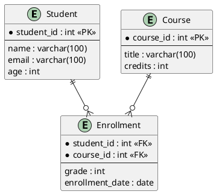

::

### Пояснення синтаксису

```plantuml
entity "Назва таблиці" as псевдонім {
  *ключове_поле : тип <<PK>>    // Первинний ключ
  *зовнішній_ключ : тип <<FK>>  // Зовнішній ключ
  --                             // Розділювач
  звичайне_поле : тип
}
```

::note
**Позначення полів:**

- `*` - обов'язкове поле (NOT NULL)
- `<<PK>>` - Primary Key
- `<<FK>>` - Foreign Key
- `--` - розділювач між ключами та звичайними полями

::

### Типи зв'язків

| Синтаксис PlantUML | Кардинальність    | Значення               | Приклад             |
| :----------------- | :---------------- | :--------------------- | :------------------ |
| `\|\|--\|\|`       | 1:1               | Один до одного         | Країна ↔ Столиця    |
| `\|\|--o{`         | 1:N               | Один до багатьох       | Автор → Книги       |
| `}o--o{`           | M:N               | Багато до багатьох     | Студенти ↔ Курси    |
| `\|\|..o{`         | 1:N (опціонально) | Необов'язковий зв'язок | Клієнт → Замовлення |

**Легенда символів:**

- `||` - **точно один** (обов'язковий)
- `o{` - **нуль або багато** (опціонально)
- `|{` - **один або багато** (обов'язково хоч один)

### Приклад: E-commerce система

::plant-uml

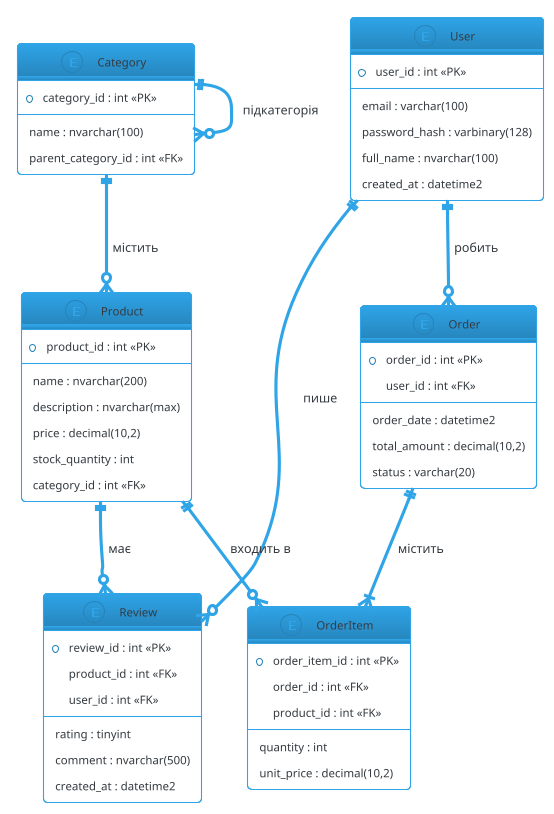

::

::tip{title="Тема діаграми"}
Рядок `!theme cerulean-outline` застосовує готову тему. Інші теми:

- `sketchy` - ескізний стиль
- `vibrant` - яскраві кольори
- `toy` - іграшковий стиль
- `mars` - темна тема

::

---

## Class Diagram (Діаграми класів для ORM)

Якщо ви використовуєте ORM (Entity Framework, Hibernate), діаграми класів ідеально відображають вашу модель:

::plant-uml

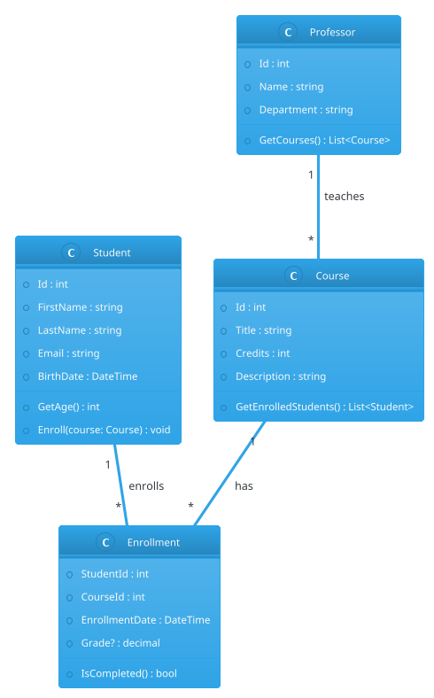

::

### Модифікатори доступу

| Символ | Модифікатор      | C#          | Java            |
| :----- | :--------------- | :---------- | :-------------- |
| `+`    | Public           | `public`    | `public`        |
| `-`    | Private          | `private`   | `private`       |
| `#`    | Protected        | `protected` | `protected`     |
| `~`    | Package/Internal | `internal`  | package-private |

---

## Component Diagram (Архітектура системи)

**Використовуйте для відображення архітектури вашого застосунку:**

::plant-uml

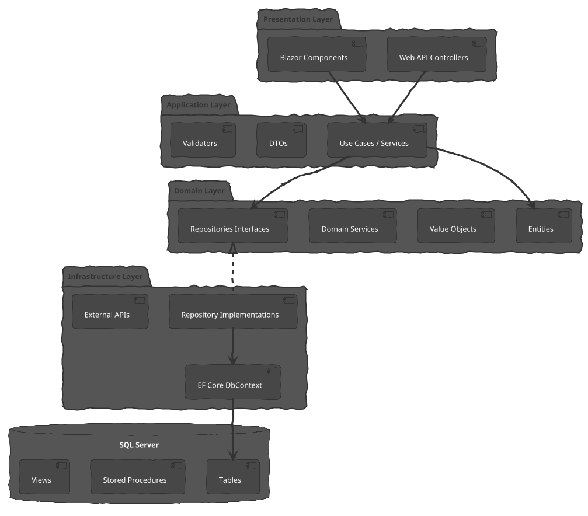

::

---

## Sequence Diagram (Діаграми послідовності)

**Ідеально для документування бізнес-процесів та API flows:**

::plant-uml

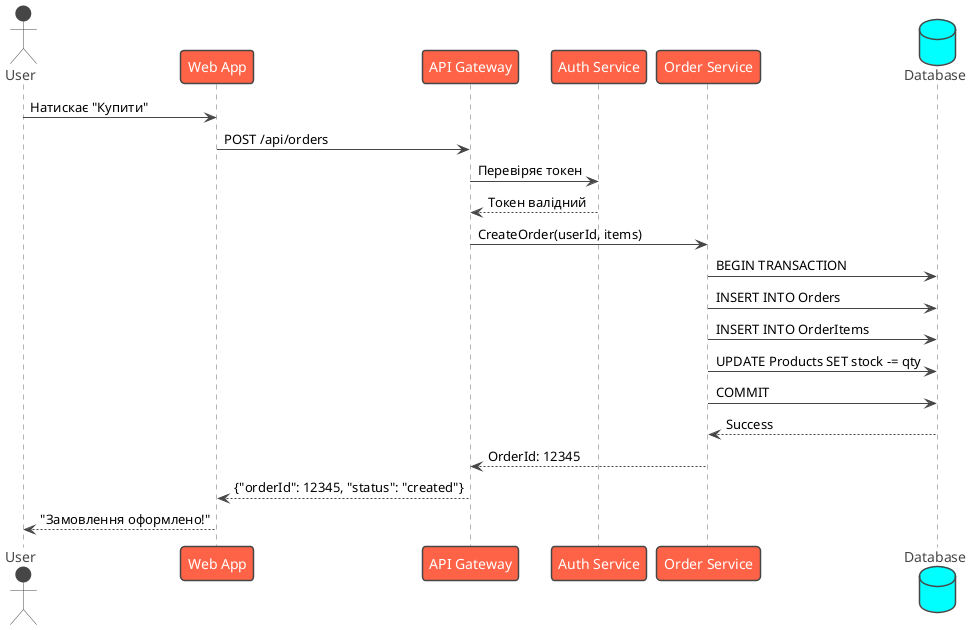

::

### Практичний кейс: Database Transaction

::plant-uml

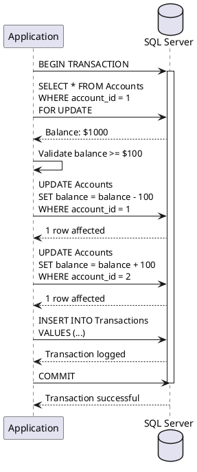

::

---

## Deployment Diagram (Діаграма розгортання)

**Показує фізичну інфраструктуру та розміщення компонентів:**

::plant-uml

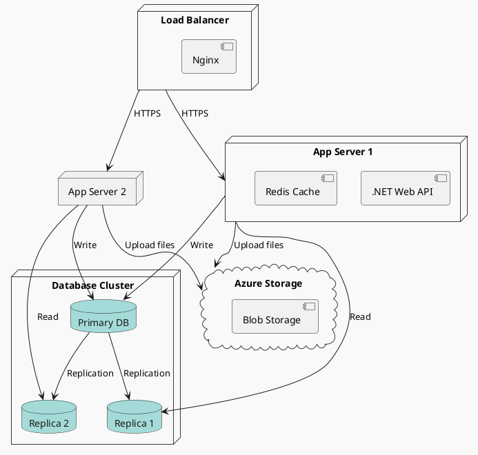

::

---

## Стилізація та кастомізація

### Кольори та стилі

::plant-uml

```plantuml
@startuml
skinparam backgroundColor #F0F0F0
skinparam shadowing false

skinparam entity {
  BackgroundColor LightBlue
  BorderColor DarkBlue
  FontSize 14
}

skinparam arrow {
  Color DarkGreen
  Thickness 2
}

entity "User" as user {
  *user_id : int
  --
  name : string
}

entity "Order" as order {
  *order_id : int
  --
  total : decimal
}

user ||--o{ order
@enduml
```

::

### Підсвічування критичних елементів

::plant-uml

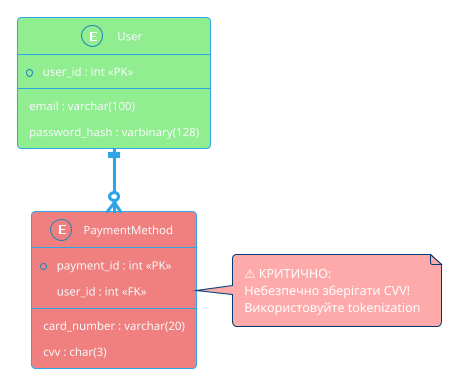

::

---

## Практичні приклади

### Приклад 1: Університет (повна ER-модель)

::plant-uml

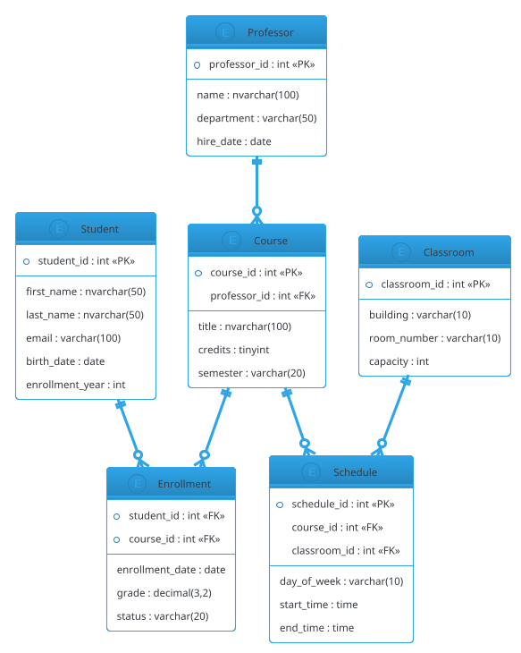

::

### Приклад 2: Бібліотека

::plant-uml

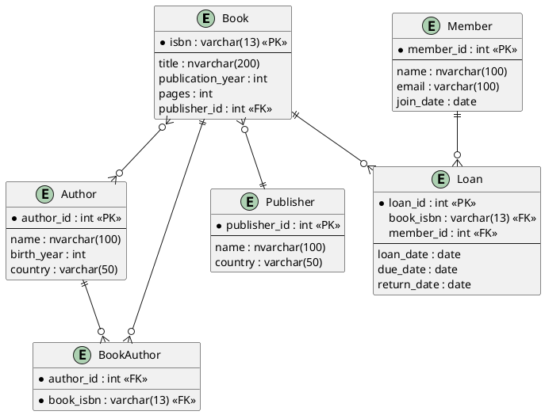

::

---

## Генерація PlantUML з бази даних

### З SQL Server

**PowerShell скрипт для генерації ER-діаграми:**

```powershell
# GetPlantUMLFromDatabase.ps1
$server = "localhost"
$database = "MyDatabase"

$query = @"
SELECT
    t.name AS TableName,
    c.name AS ColumnName,
    ty.name AS DataType,
    c.is_nullable AS IsNullable,
    CASE WHEN pk.column_id IS NOT NULL THEN 1 ELSE 0 END AS IsPK,
    CASE WHEN fk.parent_column_id IS NOT NULL THEN 1 ELSE 0 END AS IsFK
FROM sys.tables t
INNER JOIN sys.columns c ON t.object_id = c.object_id
INNER JOIN sys.types ty ON c.user_type_id = ty.user_type_id
LEFT JOIN (
    SELECT ic.object_id, ic.column_id
    FROM sys.indexes i
    INNER JOIN sys.index_columns ic ON i.object_id = ic.object_id AND i.index_id = ic.index_id
    WHERE i.is_primary_key = 1
) pk ON c.object_id = pk.object_id AND c.column_id = pk.column_id
LEFT JOIN sys.foreign_key_columns fk ON c.object_id = fk.parent_object_id AND c.column_id = fk.parent_column_id
ORDER BY t.name, c.column_id
"@

# Виконати запит та згенерувати PlantUML
# (код спрощено для прикладу)
```

### З Entity Framework Core

**C# код для генерації з DbContext:**

```csharp
using Microsoft.EntityFrameworkCore;
using System.Text;

public static class PlantUmlGenerator
{
    public static string GenerateFromDbContext(DbContext context)
    {
        var sb = new StringBuilder();
        sb.AppendLine("@startuml");
        sb.AppendLine("!theme cerulean-outline");
        sb.AppendLine();

        var entityTypes = context.Model.GetEntityTypes();

        foreach (var entityType in entityTypes)
        {
            sb.AppendLine($"entity \"{entityType.ClrType.Name}\" as {entityType.ClrType.Name.ToLower()} {{");

            var properties = entityType.GetProperties();
            foreach (var prop in properties)
            {
                var isPK = prop.IsPrimaryKey() ? " <<PK>>" : "";
                var isFK = prop.IsForeignKey() ? " <<FK>>" : "";
                var asterisk = !prop.IsNullable ? "*" : " ";

                sb.AppendLine($"  {asterisk}{prop.Name} : {prop.ClrType.Name}{isPK}{isFK}");
            }

            sb.AppendLine("}");
            sb.AppendLine();
        }

        // Генерація зв'язків
        foreach (var entityType in entityTypes)
        {
            var navigations = entityType.GetNavigations();
            foreach (var nav in navigations)
            {
                if (nav.IsCollection)
                {
                    sb.AppendLine($"{entityType.ClrType.Name.ToLower()} ||--o{{ {nav.TargetEntityType.ClrType.Name.ToLower()}");
                }
            }
        }

        sb.AppendLine("@enduml");
        return sb.ToString();
    }
}
```

---

## Поради та best practices

::tip{title="1. Використовуйте псевдоніми"}
Для довгих назв таблиць використовуйте короткі псевдоніми:

```plantuml
entity "UserAuthenticationHistory" as uah {
  ...
}

user ||--o{ uah : "має історію"
```

::

::tip{title="2. Групуйте пов'язані сутності"}

```plantuml
package "User Management" {
  entity User
  entity Role
  entity Permission
}

package "E-commerce" {
  entity Product
  entity Order
}
```

::

::tip{title="3. Додавайте коментарі"}

```plantuml
' === CORE ENTITIES ===
entity User { ... }

' === JUNCTION TABLES ===
entity UserRole { ... }
```

::

::tip{title="4. Використовуйте notes для пояснень"}

```plantuml
entity User {
  password_hash : varbinary(128)
}

note right of User
  Використовується bcrypt
  з work factor = 12
end note
```

::

::warning{title="5. Не перевантажуйте діаграму"}

- Максимум **10-15 сутностей** на одній діаграмі
- Розбивайте велику систему на модулі
- Створюйте окремі діаграми для різних bounded contexts

::

---

## Експорт та інтеграція

### Формати експорту

PlantUML підтримує:

- **SVG** - векторна графіка (рекомендовано для web)
- **PNG** - растрова графіка
- **PDF** - для документації
- **LaTeX** - для наукових робіт
- **ASCII Art** - текстове представлення

### Інтеграція з Git

**Додайте `.puml` файли у версіонування:**

```
project/
├── docs/
│   ├── diagrams/
│   │   ├── database-er.puml
│   │   ├── architecture.puml
│   │   └── api-flow.puml
│   └── README.md
├── src/
└── .gitignore
```

### CI/CD генерація діаграм

**GitHub Actions приклад:**

```yaml
name: Generate Diagrams

on: [push]

jobs:
    generate:
        runs-on: ubuntu-latest
        steps:
            - uses: actions/checkout@v2
            - name: Generate PlantUML diagrams
              uses: cloudbees/plantuml-github-action@master
              with:
                  args: -v -tsvg docs/diagrams/*.puml
            - name: Commit diagrams
              run: |
                  git config user.name "GitHub Actions"
                  git add docs/diagrams/*.svg
                  git commit -m "Update diagrams" || true
                  git push
```

---

## Ресурси та інструменти

### Онлайн інструменти

- **PlantUML Online**: [plantuml.com](https://www.plantuml.com/plantuml/)
- **PlantText**: [planttext.com](https://www.planttext.com/)
- **Gravizo**: [gravizo.com](http://www.gravizo.com/)

### Документація

- **Офіційний сайт**: [plantuml.com](https://plantuml.com/)
- **Довідник з ER-діаграм**: [plantuml.com/ie-diagram](https://plantuml.com/ie-diagram)
- **Всі типи діаграм**: [plantuml.com/sitemap](https://plantuml.com/sitemap)

### Інтеграції

- **VS Code**: PlantUML Extension
- **IntelliJ IDEA**: PlantUML integration plugin
- **Confluence**: PlantUML macro
- **GitLab**: Підтримка `.puml` у markdown
- **Notion**: Через PlantUML сервер

---

## Завдання для практики

::note{title="Практичне завдання 1"}
**Створіть ER-діаграму для системи управління проєктами:**

Сутності:

- Project (назва, опис, дата початку)
- Task (назва, опис, статус, пріоритет)
- User (ім'я, email, роль)
- Comment (текст, дата створення)

Зв'язки:

- Проєкт має багато задач
- Користувач може бути призначений на багато задач
- Задача може мати багато коментарів
- Користувач може писати багато коментарів

::

::note{title="Практичне завдання 2"}
**Створіть діаграму архітектури для:**

- Web API (.NET)
- PostgreSQL база даних
- Redis кеш
- RabbitMQ черга повідомлень
- S3 сховище файлів

Покажіть взаємодію між компонентами.
::

---

## Висновок

PlantUML - це **потужний** інструмент для:

✅ Документування структури БД  
✅ Проектування нових систем  
✅ Комунікації в команді  
✅ Автоматизації генерації діаграм  
✅ Підтримки документації в актуальному стані

::tip
**Золоте правило**: Діаграма має бути **зрозумілою** без додаткових пояснень. Якщо вона занадто складна - розбийте на кілька простіших!
::

**Наступні кроки:**

1. Спробуйте створити ER-діаграму для вашого проєкту
2. Інтегруйте PlantUML у вашу документацію
3. Налаштуйте автогенерацію діаграм у CI/CD
4. Поділіться досвідом з командою!
