# Введення в теорію баз даних

::note
**Мета уроку:** Зрозуміти навіщо потрібні бази даних, вивчити історію їх розвитку, порівняти різні моделі зберігання даних та освоїти базові поняття СУБД.
::

## Навіщо потрібні бази даних?

**Уявіть ситуацію:** Ви працюєте в невеликій бібліотеці. У вас є тисячі книг, сотні читачів, щоденні видачі та повернення. Як ви будете зберігати всю цю інформацію?

### Еволюція зберігання даних

#### Паперові картотеки (до 1950-х років)

У минулому бібліотекарі використовували **картотечні шафи** з папками та картками:

- 📁 Картка на кожну книгу
- 📝 Окрема картка для кожного читача
- 📋 Журнал видач

**Проблеми паперового підходу:**

::caution

- **Дублювання даних** - інформацію про одного автора треба записувати багато разів
- **Пошук інформації** - щоб знайти всі книги автора, треба переглянути всі картки
- **Помилки при оновленні** - якщо автор змінив прізвище, треба виправити всі картки
- **Обмежений простір** - шафи займають багато місця
- **Відсутність захисту** - картки можна загубити або пошкодити

::

#### Файлова система (1950-1960-ті роки)

З появою комп'ютерів дані почали зберігати у файлах:

```
library_books.txt
library_readers.txt
library_loans.txt
```

**Покращення:**

::tip

- Електронне зберігання замість паперу
- Швидший пошук текстовими редакторами
- Можливість резервного копіювання

::

**Але нові проблеми:**

::warning

- Кожна програма створює свій формат файлів
- Складно синхронізувати дані між різними файлами
- Немає контролю цілісності даних
- Складно організувати паралельний доступ

::

#### Системи управління базами даних (1970-ті - сьогодення)

**СУБД** вирішує всі попередні проблеми, надаючи:

::mermaid

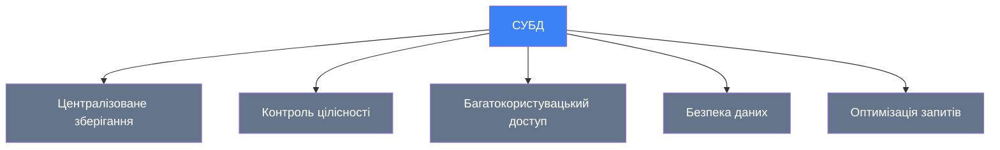

::

::tip{title="Чому це важливо?"}
Натан Ротшільд казав: **"Хто володіє інформацією, той володіє світом"**. У сучасному світі ця інформація зберігається саме в базах даних. Фахівці з баз даних будуть затребувані завжди!
::

---

## Історія та етапи розвитку баз даних

### Хронологія ключових подій

::mermaid

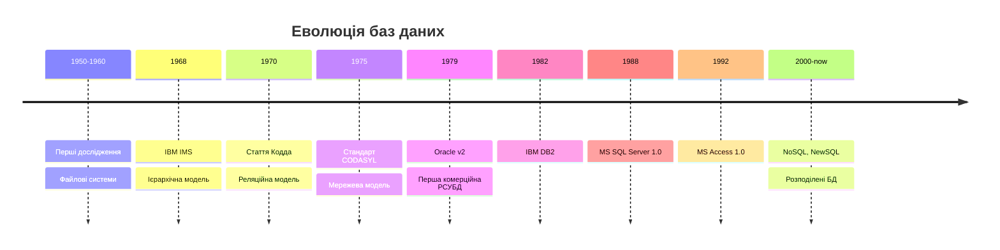

::

### Початок досліджень (кінець 1950-х)

Дослідження по створенню баз даних стали можливими завдяки появі програмного забезпечення обробки записів і почалися **наприкінці 50-х років** минулого століття.

**Основна ідея:** Автоматизація офісної роботи, пов'язаної зі зберіганням та обліком даних, яка виконувалася вручну та потребувала великих витрат праці.

::note{title="Чому саме тоді?"}
Завдяки **здешевленню обчислювальних потужностей** для вирішення цих завдань стало можливим використання комп'ютерів. До цього часу комп'ютери були занадто дорогими для таких завдань.
::

### IBM IMS (1968) - Ієрархічна модель

**Лідер досліджень:** Компанія IBM

У **1968 році** IBM випустила свою першу систему управління базами даних **IMS** (_IBM Information Management System_), засновану на **ієрархічній моделі** даних.

**Особливості IMS:**

- Дані організовані у вигляді дерева
- Зв'язки типу "батько-нащадок"
- Використовувалася для систем резервування авіаквитків

### System R та SQL (середина 1970-х)

**Революція від IBM:**

В середині 70-х років компанія IBM створила першу **реляційну** систему управління базами даних — **IBM System R**.

::warning{title="Народження SQL"}
У System R вперше було реалізовано мову запитів для реляційних баз даних — **SQL** (_Structured Query Language_), яка стала стандартом де-факто і використовується досі!
::

### Комерційні продукти (1979-1992)

#### Oracle v2 (1979)

У **1979 році** компанія Oracle випустила **першу комерційну РСУБД Oracle v2**. Це був переломний момент - реляційні бази даних вийшли за межі дослідницьких лабораторій.

::tip{title="Цікавий факт"}
Компанія Oracle випустила відразу версію 2, щоб створити враження стабільного продукту. Версії 1 ніколи не існувало!
::

#### IBM DB2 (1982)

У **1982 році** з'явилася РСУБД **DB2** від IBM - потужна корпоративна система, яка використовується досі.

#### Microsoft SQL Server 1.0 (1988)

В **1988 році** фірми **Microsoft** і **Ashton-Tate** випустили спільний продукт **Ashton-Tate/Microsoft SQL Server 1.0**.

#### Microsoft Access (1992)

**1992 рік** - з'явилася перша версія РСУБД **Access** від компанії Microsoft - настільна база даних для малого бізнесу та персонального використання.

---

## Основні поняття

### База даних (БД)

::note
**База даних** (_Database_) — це колекція пов'язаних даних, згрупованих в єдиний об'єкт.
::

**Приклад:** При створенні бази даних навчального закладу ми розміщуємо в ній необхідні набори даних:

::mermaid

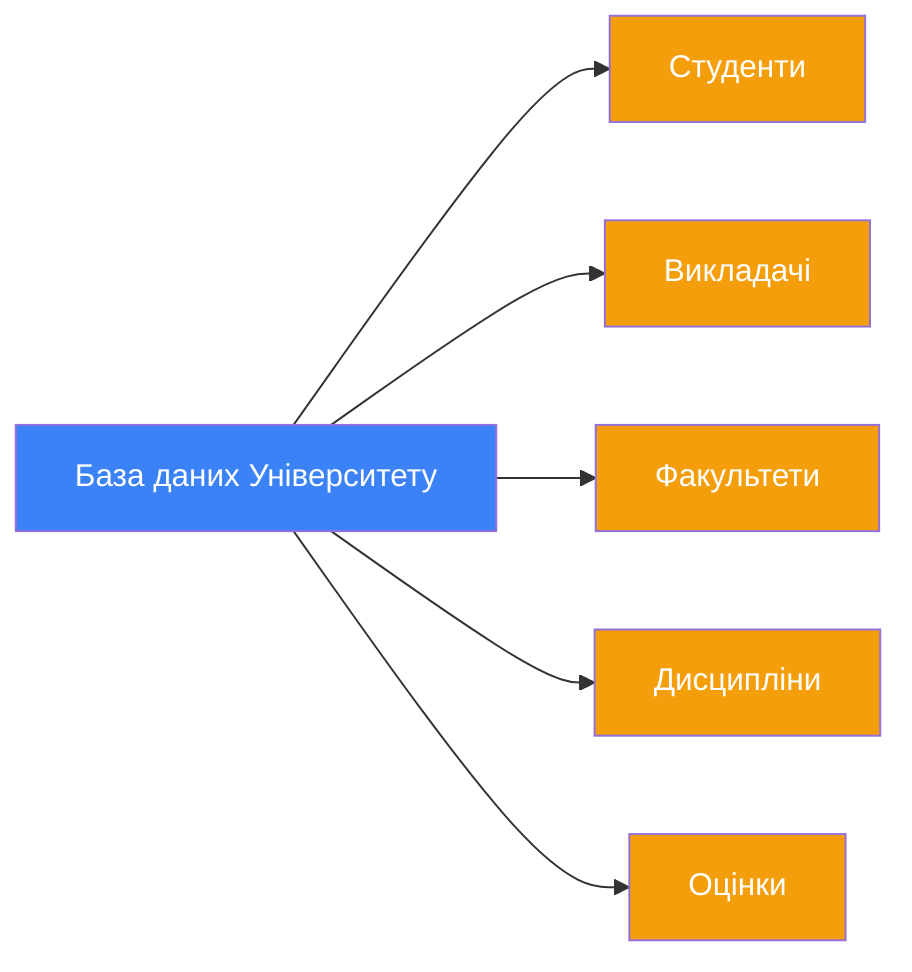

::

Згодом ми керуємо отриманою БД за допомогою програмного забезпечення **як єдиним цілим**.

### Система управління базами даних (СУБД)

::note
**СУБД** (_Database Management System, DBMS_) — спеціалізоване програмне забезпечення, що дозволяє працювати з базами даних: створювати, оновлювати, вилучати дані тощо.
::

**Приклади СУБД:**

- Microsoft SQL Server
- Oracle Database
- PostgreSQL
- MySQL
- SQLite
- MongoDB (NoSQL)

### Компоненти СУБД

СУБД складається з низки **серверних** та **клієнтських засобів**:

::mermaid

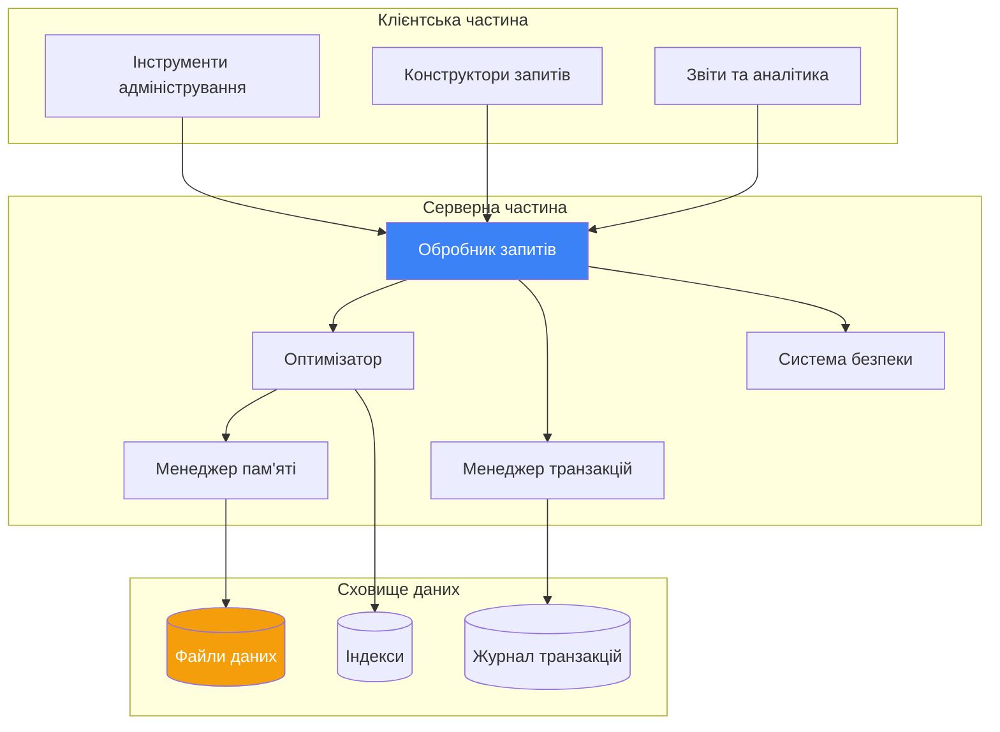

::

**Функції СУБД:**

::note

- **Обробка запитів** - вилучення та зміна даних
- **Резервне копіювання** - збереження копій даних
- **Відновлення даних** - повернення до попереднього стану
- **Оптимізація** - підвищення продуктивності виконання запитів
- **Керування пам'яттю** - ефективне використання ресурсів
- **Контроль доступу** - безпека та права користувачів

::

### Предметна область

::note
**Предметна область** (_Domain_) — частина реального світу, інформація про яку зберігається в базі даних.
::

**Приклади предметних областей:**

| Предметна область   | Що зберігається              | Приклад БД          |
| ------------------- | ---------------------------- | ------------------- |
| Освіта              | Студенти, викладачі, оцінки  | Університетська БД  |
| Медицина            | Пацієнти, діагнози, лікарі   | Електронна медкарта |
| Електронна комерція | Товари, замовлення, клієнти  | Інтернет-магазин    |
| Банківська справа   | Рахунки, транзакції, клієнти | Банківська система  |
| Логістика           | Склади, транспорт, маршрути  | Система доставки    |

### Дані vs. Інформація vs. Знання

Важливо розуміти різницю між цими поняттями:

::mermaid


::

::tabs
::tabs-item{label="Дані"}
**Дані** (_Data_) - сирі факти без контексту.

**Приклад:**

```
25, "Київ", 2024
```

Це просто числа та text, які самі по собі нічого не означають.
::

::tabs-item{label="Інформація"}
**Інформація** (_Information_) - дані з контекстом та значенням.

**Приклад:**

```
Температура: 25°C
Місто: Київ
Рік: 2024
```

Тепер ми розуміємо, що означають ці значення.
::

::tabs-item{label="Знання"}
**Знання** (_Knowledge_) - інформація, проаналізована та осмислена.

**Приклад:**

```
У Києві в 2024 році середня температура влітку - 25°C.
Це на 2 градуси вище, ніж 10 років тому.
```

Ми можемо робити висновки та приймати рішення.
::
::

---

## Порівняння моделей баз даних

Моделі баз даних відрізняються **правилами взаємозв'язку** основних типів структур даних та **операціями** над ними. Кожна СУБД використовує логічну структуру зберігання даних, яка залежить від конкретної моделі.

### Огляд моделей

::mermaid

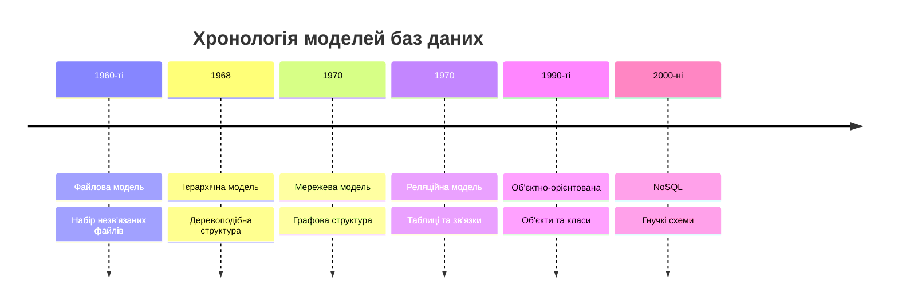

::

### Файлова модель

::note
**Файлова модель** - це модель зберігання даних, яка характеризується певним набором файлів, які **не пов'язані між собою**.
::

#### Структура файлової моделі

Основні типи структур даних:

::mermaid

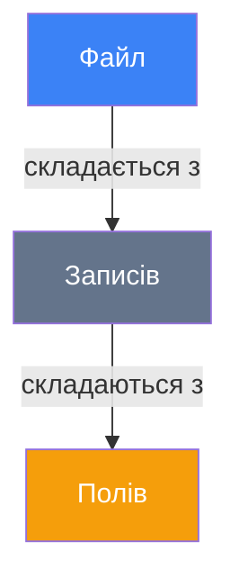

::

**Компоненти:**

::tabs
::tabs-item{label="Поле"}
**Поле** (_Field_) - елементарна, неподільна одиниця даних.

**Приклад:** `"Іванов"`, `25`, `"2024-01-15"`
::

::tabs-item{label="Запис"}
**Запис** (_Record_) - сукупність логічно пов'язаних полів.

**Приклад:**

```
ISBN: 978-966-498-123-4
Назва: "Кобзар"
Автор: "Тарас Шевченко"
Рік: 1840
```

::

::tabs-item{label="Файл"}
**Файл** (_File_) - безліч записів, однакових за структурою.

**Приклад:** `books.dat` з 1000 записами про книги
::
::

#### Приклад файлової структури

**Файл: students.txt**

```
1|Іваненко Петро|20|КНТ-21
2|Коваленко Марія|19|КНТ-21
3|Сидоренко Олег|21|КНТ-22
```

**Файл: groups.txt**

```
КНТ-21|Комп'ютерні науки|2021
КНТ-22|Комп'ютерні науки|2022
```

**Файл: grades.txt**

```
1|Математика|95
1|Фізика|87
2|Математика|92
```

#### Історичний контекст

Файлова модель була **першою моделлю** зберігання даних. Її можна вважати **моделю без СУБД**, адже:

::warning

- Внутрішня структура файлів була відома лише розробнику
- Кожна програма мала свій унікальний формат
- Не було стандартизації

::

**Чому це проблема?**

Уявіть, що програміст Іван створив програму для обліку книг у бібліотеці. Він зберігає дані у файлі `books.dat` у своєму власному форматі. Через рік програміст Марія отримує завдання написати іншу програму для цієї ж бібліотеки. Вона **не може** просто прочитати файл Івана, бо не знає його структури!

#### Недоліки файлової моделі

::caution

1. **Залежність від програмного забезпечення**
    - Алгоритм управління базою даних повністю закладено у ПЗ
    - При зміні структури даних необхідно вносити правки до програми
    - Важко підтримувати та масштабувати

2. **Несумісність форматів**
    - Файли, створені на C++, не можна легко прочитати програмою на Java
    - Різниця у структурах даних між мовами програмування
    - Проблеми з переносимістю

3. **Складність міграції**
    - Перенесення даних з однієї БД в іншу - складний процес
    - Розбіжність структур даних
    - Ручне перетворення форматів

4. **Дублювання даних** - Відсутність централізованого зберігання - Одні й ті самі дані зберігаються в різних файлах - Складно підтримувати узгодженість

::

**Приклад проблеми дублювання:**

У бібліотеці є три файли:

- `books.txt` - містить автора кожної книги
- `loans.txt` - містить автора взятої книги
- `reservations.txt` - містить автора зарезервованої книги

Якщо автор змінив прізвище (наприклад, одружилася), треба змінити дані в **трьох місцях**. Легко пропустити одне з них!

---

### Ієрархічна модель

::note
**Ієрархічна модель** - модель даних, у якій окремі записи поєднуються у відносини типу **"батько-нащадок"** і утворюють зв'язане дерево.
::

#### Структура ієрархічної моделі

::mermaid

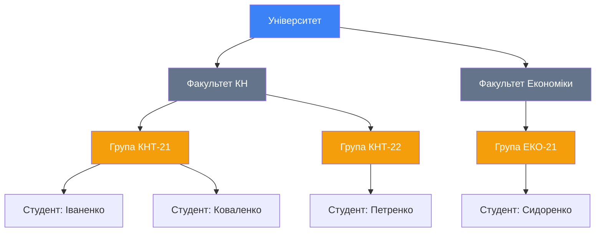

::

#### Характеристики

**Переваги:**

::tip

- Простота структури
- Зручність для уявлення деяких відносин реального світу
- Швидкий доступ від батька до нащадків
- Природне відображення ієрархічних структур

::

**Приклад природної ієрархії:**

- Організаційна структура компанії
- Файлова система операційної системи
- Класифікація живих організмів (царство → тип → клас → рід → вид)

**Недоліки:**

::caution

1. **Не підтримує складні зв'язки М:N**
    - Дочірній запис може належати тільки одному батьківському
    - Проблема: студент може вивчати дисципліни з різних факультетів
2. **Громіздка навігація**
    - Для доступу до запису треба переміщатися по всьому дереву
    - Не можна "перестрибнути" з одної гілки в іншу

3. **Надмірність даних** - Дані часто дублюються в різних гілках дерева

::

**Приклад проблеми:**

Студент Іван вивчає дисципліну "Бази даних", яку викладають на двох факультетах. У ієрархічній моделі доведеться створити **два записи** для цієї дисципліни - по одному в кожній гілці дерева!

::mermaid

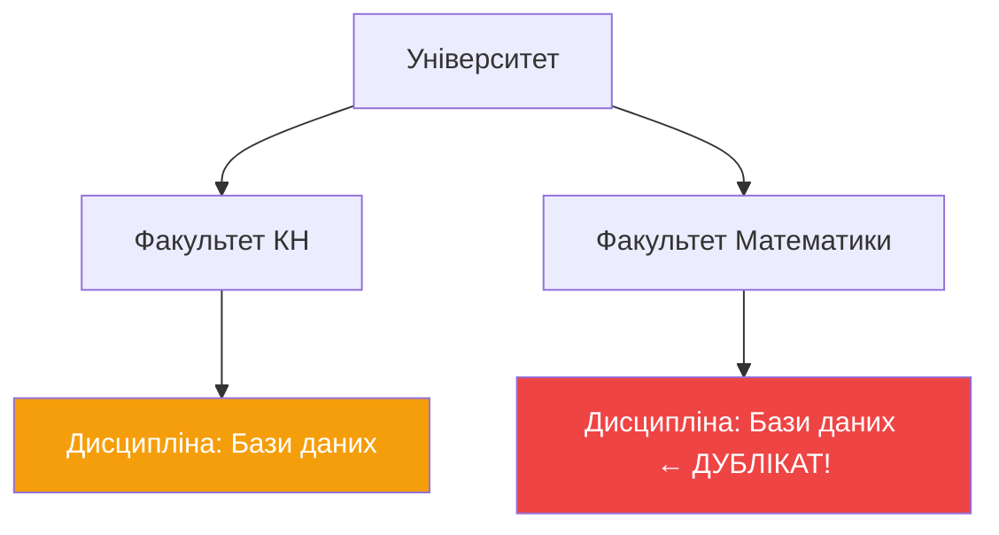

::

#### IBM IMS

**Найвідоміша СУБД:** IBM IMS (_Information Management System_)

**Застосування:**

- Системи бронювання авіаквитків
- Банківські системи
- Облік запасів на складах

**Сучасність:**

Хоча ієрархічна модель як окрема СУБД майже не використовується, ієрархічні структури застосовуються в:

- Файлових системах (папки та підпапки)
- XML/JSON документах
- Організаційних структурах

---

### Мережева модель

::note
**Мережева модель** - удосконалена ієрархічна модель, яка дозволяє записам брати участь у **багатьох відносинах** типу "батько-нащадок" (зв'язки М:N).
::

#### Історична довідка: Чарльз Бахман

::note{title="Піонер баз даних"}
**Чарльз Бахман** (_Charles Bachman_, 1924-2017) був одним із основоположників мережевої моделі баз даних.

**Досягнення:**

- У 1963 році розробив **IDS** (_Integrated Data Store_) - одну з перших мережевих СУБД
- У 1973 році отримав **премію Тюрінга** за розробки в технологіях баз даних
- Створив діаграми Бахмана для моделювання даних

::

#### Структура мережевої моделі

На відміну від ієрархічної моделі, у мережевій моделі вузол може мати **кілька батьків**:

::mermaid

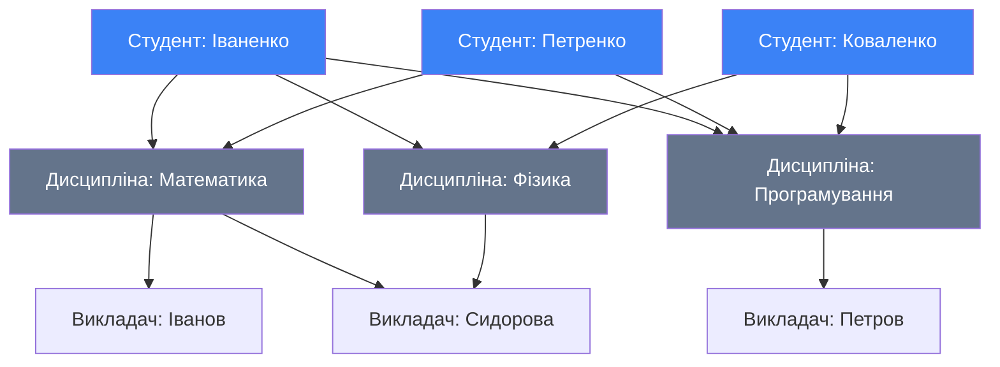

::

#### Стандартизація CODASYL

У **1975 році** організація **CODASYL** (_Conference of Data System Languages_) стандартизувала мережеву модель:

**Базові поняття:**

- **Set** (набір) - зв'язок між записами
- **Owner** (власник) - батьківський запис
- **Member** (член) - дочірній запис
- **Record type** (тип запису) - схема структури даних

#### Переваги та недоліки

**Переваги:**

::tip

- Більша гнучкість порівняно з ієрархічною моделлю
- Підтримка складних зв'язків М:N
- Менше дублювання даних
- Ефективна для складних структур

::

**Недоліки:**

::caution

1. **Складність навігації**
    - Розробники повинні самі здійснювати навігацію між записами
    - Треба знати всю структуру БД
    - Код стає складним та важким у підтримці

2. **Великі вимоги до пам'яті**
    - Кожен елемент повинен зберігати посилання на інші елементи
    - Багато службової інформації
    - Неефективне використання ресурсів

3. **Складність змін** - Внесення будь-яких змін у структуру - Може призвести до складних операцій оновлення - Важко масштабувати

::

**Порівняння з ієрархічною:**

| Критерій             | Ієрархічна | Мережева |
| -------------------- | ---------- | -------- |
| Батьківських записів | 1          | Багато   |
| Складність навігації | Середня    | Висока   |
| Гнучкість            | Низька     | Середня  |
| Зв'язки М:N          | ❌ Ні      | ✅ Так   |
| Дублювання даних     | Високе     | Середнє  |

---

### Реляційна модель

::note
**Реляційна модель** - модель даних, заснована на взаємодії рядків та стовпців, які утворюють **таблиці** з даними, пов'язаними між собою.
::

#### Історична довідка: Едгар Кодд

::note{title="Батько реляційних баз даних"}
**Едгар Франк Кодд** (_Edgar Frank "Ted" Codd_, 1923-2003) - британський вчений, співробітник IBM.

**Революція в базах даних:**

- **1970 рік** - опублікував статтю **"A Relational Model of Data for Large Shared Data Banks"**
- **1981 рік** - отримав **премію Тюрінга** за дослідження в галузі баз даних
- Створив 12 правил для реляційних СУБД
- Розробив реляційну алгебру та реляційне числення

::

#### Основна ідея

**Революційна концепція Кодда:** Відмовитися від складних зв'язків типу "батько-нащадок" та використовувати **прості таблиці**!

::mermaid

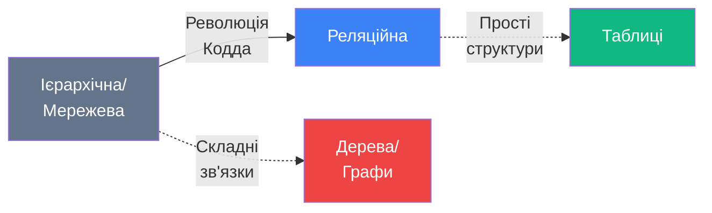

::

#### Структура реляційної моделі

**Замість деревоподібних структур - звичайні таблиці:**

**Таблиця Students:**

| student_id | first_name | last_name | group_id |
| ---------- | ---------- | --------- | -------- |
| 1          | Петро      | Іваненко  | 101      |
| 2          | Марія      | Коваленко | 101      |
| 3          | Олег       | Сидоренко | 102      |

**Таблиця Groups:**

| group_id | group_name | faculty_id |
| -------- | ---------- | ---------- |
| 101      | КНТ-21     | 10         |
| 102      | КНТ-22     | 10         |

**Зв'язок:** Через `group_id` ми знаємо, до якої групи належить студент!

#### Ключові особливості

::tabs
::tabs-item{label="Таблиці"}
Дані організовані у вигляді **таблиць** (relations):

- Рядки = записи (кортежі)
- Стовпці = поля (атрибути)
- Кожна таблиця має унікальну назву

::

::tabs-item{label="Зв'язки"}
Таблиці пов'язуються через **спільні поля**:

- Без фізичних покажчиків
- Через значення ключів
- Гнучкі та прості

::

::tabs-item{label="Незалежність"}
::note
**Правило 8 (Фізична незалежність даних):** Прикладні програми не повинні залежати від того, як дані фізично зберігаються на диску.
::

- Не треба писати код навігації
- СУБД сама знаходить потрібні дані

::

::tabs-item{label="SQL"}
Для роботи використовується **декларативна мова SQL**:

- Описуємо ЩО потрібно, а не ЯК це отримати
- СУБД сама оптимізує запити
- Простота використання

::

::

#### Переваги реляційної моделі

::tip

1. **Зручність**
    - Дані організовані у таблиці
    - Використання мови SQL
    - Не потрібно розуміти складні структури

2. **Гнучкість**
    - Легко додавати нові зв'язки
    - Підтримка всіх типів відносин (1:1, 1:N, M:M)
    - Зручна реорганізація даних

3. **Математична основа**
    - Базується на теорії множин
    - Формальні правила та докази
    - Передбачувана поведінка

4. **Незалежність**
    - Програма не залежить від фізичного зберігання
    - Зміна структури не завжди ламає програму
    - Високий рівень абстракції
5. **Незалежність даних** - Фізична структура не впливає на логічну - Можна змінювати зберігання без зміни програм - Оптимізація прозора для користувачів

::

#### Приклади РСУБД

**Комерційні:**

- **Oracle Database** - найпотужніша корпоративна СУБД
- **Microsoft SQL Server** - популярна у Windows-середовищі
- **IBM DB2** - для великих підприємств

**Відкриті:**

- **PostgreSQL** - найпросунутіша open-source СУБД
- **MySQL** - найпопулярніша для веб
- **MariaDB** - форк MySQL
- **SQLite** - вбудована БД для мобільних додатків

**Хмарні:**

- **Amazon RDS** - керована база даних AWS
- **Google Cloud SQL** - від Google
- **Azure SQL Database** - від Microsoft

---

### Об'єктно-орієнтована модель

::note
**Об'єктно-орієнтована модель** - модель даних, у якій інформація зберігається у вигляді **об'єктів**, як у об'єктно-орієнтованому програмуванні (C#, Java, Python).
::

#### Основна концепція

**Ідея:** Якщо ми програмуємо об'єктно-орієнтованими мовами (Java, C++, Python), чому б не зберігати дані також як об'єкти?

::mermaid

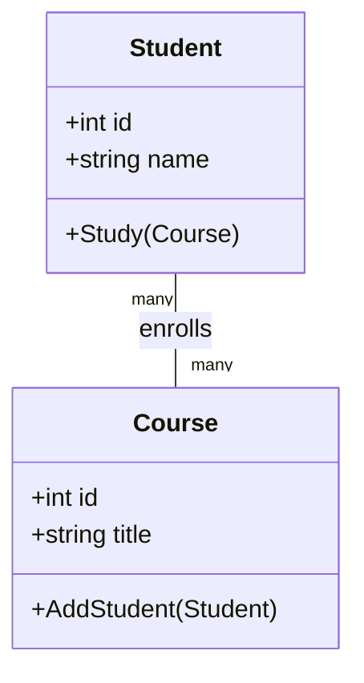

::

#### Базові поняття ООП у БД

::tabs
::tabs-item{label="Клас"}
**Клас** (_Class_) - опис структури об'єкта та його поведінки.

**Аналогія:** Креслення автомобіля.
::

::tabs-item{label="Об'єкт"}
**Об'єкт** (_Object_) - конкретний екземпляр класу з даними.

**Аналогія:** Конкретний автомобіль, виготовлений за кресленням.
::

::tabs-item{label="Метод"}
**Метод** (_Method_) - функція, яку може виконувати об'єкт.

**Приклад:** `student.Study()`, `car.Drive()`.
::

::tabs-item{label="Спадкування"}
**Спадкування** (_Inheritance_) - створення нових класів на основі існуючих.

**Приклад:** Клас `Magistrate` успадковує властивості класу `Student`.
::

::tabs-item{label="Поліморфізм"}
**Поліморфізм** (_Polymorphism_) - можливість об'єктів різних класів відповідати на одні й ті самі операції.

**Приклад:** Метод `print()` діє по-різному для книг і журналів.
::

::tabs-item{label="Агрегація"}
**Агрегація** (_Aggregation_) - об'єкт може містити інші об'єкти.

**Приклад:** Бібліотека містить колекцію книг.
::
::

#### Переваги

::tip

- Відсутність розриву між програмою та базою даних (немає потреби в ORM)
- Можливість зберігати складні типи даних та методи
- Підтримка спадкування та поліморфізму

::

#### Недоліки

::caution

- **Низька продуктивність** на великих обсягах даних
- **Складність стандартів** та відсутність єдиної мови запитів (подібної SQL)
- **Важкість аналітичних запитів** порівняно з реляційною моделлю

::

#### Об'єктно-реляційні СУБД

Багато сучасних РСУБД доповнюються елементами ООП:

**Oracle Database:**

- Підтримка об'єктних типів
- Методи в таблицях
- Наслідування типів

**PostgreSQL:**

- Користувацькі типи даних
- Наслідування таблиць
- Об'єктні можливості

**Приклад (PostgreSQL):**

```sql
-- Створення користувацького типу
CREATE TYPE address AS (
    street VARCHAR(100),
    city VARCHAR(50),
    zip_code VARCHAR(10)
);

-- Використання в таблиці
CREATE TABLE customers (
    id SERIAL PRIMARY KEY,
    name VARCHAR(100),
    home_address address,
    work_address address
);
```

---

## Порівняльна таблиця моделей

| Критерій                  | Файлова         | Ієрархічна           | Мережева     | Реляційна          | ООП                |
| ------------------------- | --------------- | -------------------- | ------------ | ------------------ | ------------------ |
| **Рік появи**             | 1960            | 1968                 | 1970         | 1970               | 1990               |
| **Структура**             | Файли           | Дерево               | Граф         | Таблиці            | Об'єкти            |
| **Складність**            | Низька          | Середня              | Висока       | Низька             | Висока             |
| **Гнучкість**             | ❌ Дуже низька  | ⚠️ Низька            | ⚠️ Середня   | ✅ Висока          | ✅ Висока          |
| **Зв'язки М:N**           | ❌ Ні           | ❌ Ні                | ✅ Так       | ✅ Так             | ✅ Так             |
| **Стандартизація**        | ❌ Ні           | ⚠️ Частково          | ⚠️ Частково  | ✅ SQL             | ❌ Ні              |
| **Швидкість**             | ✅ Висока       | ✅ Висока            | ⚠️ Середня   | ✅ Висока          | ⚠️ Середня         |
| **Популярність**          | ❌ Застаріла    | ❌ Застаріла         | ❌ Застаріла | ✅✅✅ Дуже висока | ⚠️ Нішова          |
| **Використання сьогодні** | Файлові системи | XML, файлові системи | Рідко        | Повсюдно           | Спеціальні випадки |

---

## Висновок по моделях

::note{title="Чому перемогла реляційна модель?"}
Реляційна модель стала найпопулярнішою завдяки:

1. **Простоті** - кожен розуміє концепцію таблиці
2. **Математичній строгості** - формальна теорія гарантує передбачуваність
3. **Гнучкості** - легко додавати нові зв'язки
4. **Стандартизації** - SQL став універсальною мовою
5. **Незалежності даних** - програми не залежать від фізичного зберігання

**Реляційні бази даних використовуються у 90%+ систем сьогодні!**
::

Початок 70-х років минулого століття став переломним моментом - реляційна модель Едгара Кодда змінила світ баз даних назавжди.

## Дванадцять правил Кодда

У процесі розробки реляційної моделі баз даних, **Едгар Кодд** сформулював вимоги, яким має відповідати будь-яка реляційна СУБД. Він опублікував їх у **1985 році**.

::warning{title="13 правил, а не 12?"}
Едгар Кодд опублікував список з **13 правил** (пронумерованих від 0 до 12), які визначають, чи є СУБД реляційною.
::

### Правило 0: Основне правило

::note
**Правило 0 (Основне):** Система повинна бути здатною керувати базами даних виключно за допомогою своїх **реляційних можливостей**.
::

**Що це означає?**

Система може називатися "реляційна СУБД" тільки якщо вона використовує виключно таблиці та реляційні операції. Не можна "хитрувати" та використовувати нереляційні механізми для основних функцій.

**Приклад порушення:**

```
❌ Погано: Зберігати дані в таблицях, але використовувати
          файлові покаж чики для зв'язування записів

✅ Добре: Використовувати виключно таблиці та зовнішні
         ключі для всіх операцій
```

---

### Правило 1: Правило інформації

::note
**Правило 1 (Інформаційне):** Вся інформація в реляційній базі даних повинна бути представлена виключно на логічному рівні у вигляді **таблиць**.
::

**Пояснення:**

Дані можуть зберігатися ТІЛЬКИ в комірках таблиць. Ніякої додаткової інформації за межами таблиць!

**Візуалізація:**

::mermaid

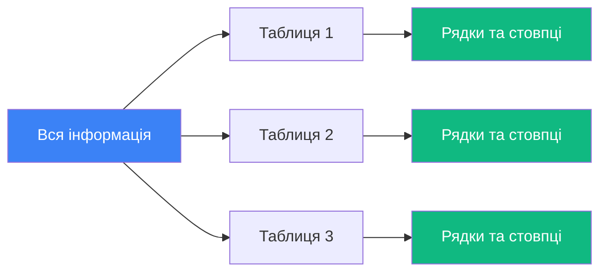

::

**Приклади:**

::code-group

```txt [✅ Правильно]
Таблиця: Users
+----+-----------+----------+
| id | name      | age      |
+----+-----------+----------+
| 1  | Іван      | 25       |
| 2  | Марія     | 30       |
+----+-----------+----------+

Вся інформація в комірках!
```

```txt [❌ Неправильно]
Таблиця + окремі мета-дані в файлі config.txt:
"Користувач Іван - адміністратор"

Інформація поза таблицею!
```

::

---

### Правило 2: Правило гарантованого доступу

::note
**Правило 2 (Гарантований доступ):** Кожен елемент даних (значення) повинен бути доступним за допомогою комбінації: **назви таблиці**, **значення первинного ключа** та **назви стовпця**.
::

**Формула доступу:**

```
Значення = Таблиця[Первинний_Ключ].Стовпець
```

**Приклад:**

Таблиця `Students`:

| student_id | first_name | last_name | age |
| ---------- | ---------- | --------- | --- |
| 1          | Петро      | Іваненко  | 20  |
| 2          | Марія      | Коваленко | 19  |
| 3          | Олег       | Сидоренко | 21  |

**Доступ до даних:**

```sql
-- Щоб отримати ім'я студента з ID=2:
Таблиця: Students
Ключ: student_id = 2
Стовпець: first_name
Результат: "Марія"
```

**Чому це важливо?**

::list{type="success"}

- Гарантує унікальний шлях до кожного значення
- Не потрібно знати фізичне розташування даних
- Не потрібно писати складний код навігації

::

---

### Правило 3: Правило підтримки недійсних значень

::note
**Правило 3 (Підтримка NULL значень):** СУБД повинна забезпечувати системну підтримку відсутньої та невідомої інформації.
::

**Що таке NULL?**

`NULL` - це **не нуль**, не порожній рядок, а спеціальне значення, що означає "невідомо" або "не застосовується".

::tabs
::tabs-item{label="NULL vs 0"}

```sql
age = NULL  -- Вік невідомий
age = 0     -- Вік - 0 років

Різні речі!
```

::

::tabs-item{label="NULL vs ''"}

```sql
email = NULL  -- Email невідомий
email = ''    -- Email - порожній рядок

Різні речі!
```

::

::tabs-item{label="Приклад використання"}

```sql
CREATE TABLE Employees (
    id INT PRIMARY KEY,
    name VARCHAR(100) NOT NULL,    -- Обов'язкове
    middle_name VARCHAR(100) NULL, -- Можна NULL
    phone VARCHAR(20) NULL         -- Можна NULL
);

-- Іван без по-батькові
INSERT INTO Employees VALUES (1, 'Іван', NULL, '0501234567');

-- Марія без телефону
INSERT INTO Employees VALUES (2, 'Марія', 'Петрівна', NULL);
```

::
::

**Чому NULL потрібен?**

::note

- У реальному світі інформація часто невідома
- Не всі поля завжди мають значення
- NULL відрізняється від "значення за замовчуванням"

::

---

### Правило 4: Правило динамічного каталогу

::note
**Правило 4 (Динамічний каталог):** Опис бази даних (системний каталог) повинен зберігатися у самій базі як набір звичайних таблиць.
::

**Що таке метадані?**

Метадані - це "дані про дані":

- Які таблиці існують?
- Які стовпці в кожній таблиці?
- Які є обмеження (constraints)?
- Які індекси створені?

**Ключова ідея:** Метадані = такі ж таблиці, як і звичайні дані!

**Приклад (SQL Server):**

```sql
-- Переглянути всі таблиці в БД
SELECT * FROM sys.tables;

-- Переглянути стовпці конкретної таблиці
SELECT * FROM sys.columns WHERE object_id = OBJECT_ID('Students');

-- Переглянути зовнішні ключі
SELECT * FROM sys.foreign_keys;
```

**Системні таблиці (приклад структури):**

| Таблиця            | Що зберігає            |
| ------------------ | ---------------------- |
| `sys.tables`       | Список всіх таблиць    |
| `sys.columns`      | Інформація про стовпці |
| `sys.indexes`      | Інформація про індекси |
| `sys.foreign_keys` | Зовнішні ключів        |
| `sys.procedures`   | Збережені процедури    |

**Чому це важливо?**

::list{type="success"}

- Можна запитувати структуру БД звичайними SQL-запитами
- Інструменти адміністрування можуть автоматично аналізувати БД
- Метадані завжди актуальні

::

---

### Правило 5: Правило вичерпної підмови даних

::note
**Правило 5 (Вичерпна мова даних):** Система повинна підтримувати принаймні одну мову, яка дозволяє виконувати всі операції з БД.
::

**Що має робити ця мова?**

::list

- Створення бази даних (DDL)
- Маніпулювання даними (DML)
- Управління доступом (DCL)
- Контроль транзакцій (TCL)
- Запити даних (DQL)

::

**У реляційних БД це SQL:**

::code-group

```sql [DDL - Визначення даних]
-- Створення таблиці
CREATE TABLE Students (
    id INT PRIMARY KEY,
    name VARCHAR(100)
);

-- Зміна структури
ALTER TABLE Students ADD age INT;

-- Видалення
DROP TABLE Students;
```

```sql [DML - Маніпуляція]
-- Вставка
INSERT INTO Students VALUES (1, 'Іван', 20);

-- Оновлення
UPDATE Students SET age = 21 WHERE id = 1;

-- Видалення
DELETE FROM Students WHERE id = 1;
```

```sql [DQL - Запити]
-- Вибірка даних
SELECT name, age
FROM Students
WHERE age > 18;

-- З'єднання таблиць
SELECT s.name, g.group_name
FROM Students s
JOIN Groups g ON s.group_id = g.id;
```

```sql [DCL - Контроль доступу]
-- Надати права
GRANT SELECT ON Students TO user_name;

-- Відібрати права
REVOKE INSERT ON Students FROM user_name;
```

::

**Важливо:** Не можна вимагати використання спеціальних інструментів для базових операцій. Все через мову!

---

### Правило 6: Правило оновлення представлень

::note
**Правило 6 (Оновлення представлень):** Всі представлення (_Views_), які теоретично можна оновити, повинні оновлюватися системою.
::

**Що таке представлення (view)?**

View - це "віртуальна таблиця", що є результатом запиту.

**Приклад:**

```sql
-- Створення представлення
CREATE VIEW ActiveStudents AS
SELECT id, name, age
FROM Students
WHERE is_active = 1;

-- Представлення повинно працювати як таблиця
SELECT * FROM ActiveStudents;           -- ✅ Читання
INSERT INTO ActiveStudents VALUES(...);  -- ✅ Вставка (якщо можливо)
UPDATE ActiveStudents SET age = 21;      -- ✅ Оновлення (якщо можливо)
DELETE FROM ActiveStudents WHERE id = 1; -- ✅ Видалення (якщо можливо)
```

**Реальність:**

На практиці не всі view можна оновлювати. Наприклад:

```sql
-- Складне представлення з агрегацією
CREATE VIEW GroupStats AS
SELECT group_id, COUNT(*) as student_count, AVG(age) as avg_age
FROM Students
GROUP BY group_id;

-- Як тут вставити запис? Неможливо!
```

---

### Правило 7: Правило додавання, оновлення та видалення

::note
**Правило 7 (Високорівневі вставка, оновлення та видалення):** Система повинна підтримувати операції над множинами записів одночасно.
::

**Приклад:**

::code-group

```sql [Один запис]
-- Видалити одного студента
DELETE FROM Students WHERE id = 1;

-- Оновити одного студента
UPDATE Students SET age = 21 WHERE id = 1;
```

```sql [Багато записів]
-- Видалити всіх студентів старше 25
DELETE FROM Students WHERE age > 25;

-- Оновити всіх студентів групи
UPDATE Students SET group_id = 102 WHERE group_id = 101;
```

```sql [Всі записи]
-- Видалити ВСІ записи
DELETE FROM Students;

-- Оновити ВСІ записи
UPDATE Students SET is_active = 0;
```

::

**Чому це важливо?**

::list{type="success"}

- Одна і та ж команда для 1 або 1000 записів
- Не треба писати цикли
- СУБД сама оптимізує операцію

::

---

### Правило 8: Правило незалежності фізичних даних

::note
**Правило 8 (Фізична незалежність даних):** Прикладні програми не повинні залежати від того, як дані фізично зберігаються на диску.
::

**Що це означає?**

Ваша програма не повинна знати:

- На якому диску зберігаються файли БД
- Яка файлова система використовується
- Скільки RAM у сервера
- Який процесор встановлено

**Приклад:**

::mermaid

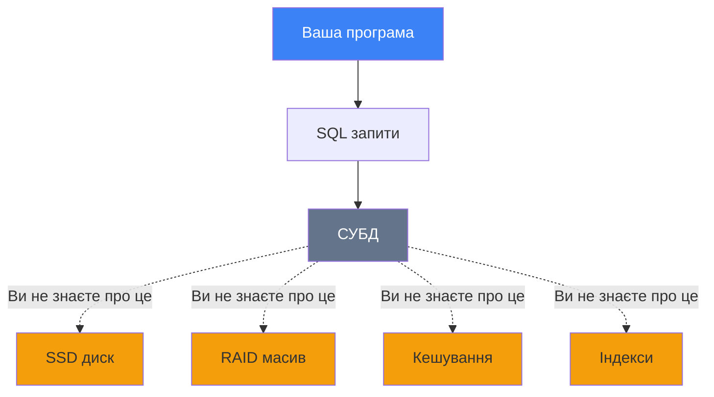

::

**Переваги:**

::list{type="success"}

- Адміністратор може змінити фізичне зберігання без зміни програм
- Можна оновити обладнання без переписування коду
- Додаток працює однаково на різних серверах

::

---

### Правило 9: Правило незалежності логічних даних

::note
**Правило 9 (Логічна незалежність даних):** Прикладні програми не повинні залежати від змін структури таблиць, якщо ці зміни не стосуються їх даних.
::

**Приклад:**

Була таблиця:

```sql
CREATE TABLE Users (
    id INT,
    full_name VARCHAR(200)  -- Повне ім'я в одному полі
);
```

Змінили на:

```sql
CREATE TABLE Users (
    id INT,
    first_name VARCHAR(100),  -- Розділили на частини
    last_name VARCHAR(100)
);

-- Створили view для сумісності
CREATE VIEW Users_Old AS
SELECT id,
       first_name + ' ' + last_name AS full_name
FROM Users;
```

Старі програми продовжують працювати з `Users_Old`!

---

### Правило 10: Правило незалежності умов цілісності

::note
**Правило 10 (Незалежність цілісності):** Мова СУБД має підтримувати перевірку вхідних даних та забезпечувати їхню **цілісність**.
::

**Типи перевірок:**

::code-group

```sql [CHECK constraint]
CREATE TABLE Students (
    id INT PRIMARY KEY,
    age INT CHECK (age >= 16 AND age <= 100),
    email VARCHAR(100) CHECK (email LIKE '%@%')
);
```

```sql [NOT NULL]
CREATE TABLE Users (
    id INT PRIMARY KEY,
    name VARCHAR(100) NOT NULL,  -- Обов'язкове поле
    email VARCHAR(100) NOT NULL
);
```

```sql [UNIQUE]
CREATE TABLE Users (
    id INT PRIMARY KEY,
    email VARCHAR(100) UNIQUE  -- Унікальне значення
);
```

```sql [FOREIGN KEY]
CREATE TABLE Students (
    id INT PRIMARY KEY,
    group_id INT,
    FOREIGN KEY (group_id) REFERENCES Groups(id)
);
-- Не можна вказати group_id, якого немає в Groups!
```

::

---

### Правило 11: Правило незалежності поширення

::note
**Правило 11 (Незалежність розподілу):** База даних може бути на **різних комп'ютерах**, і мова СУБД повинна підтримувати можливість роботи з розподіленими даними.
::

**Розподілена БД:**

::mermaid

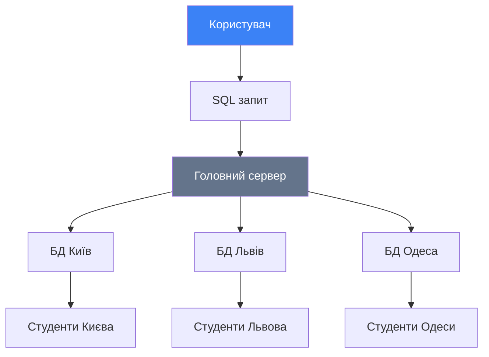

::

**Приклад запиту:**

```sql
-- Користувач не знає, що дані на різних серверах!
SELECT name, city
FROM Students
WHERE age > 20;

-- СУБД сама:
-- 1. Відправляє запит на всі сервери
-- 2. Збирає результати
-- 3. Повертає об'єднаний результат
```

---

### Правило 12: Правило єдності

::note
**Правило 12:** Не повинно бути можливості порушити безпеку та цілісність даних **в обхід мови СУБД**.
::

**Що це означає?**

Не можна:

- Редагувати файли БД напряму (блокнотом)
- Змінювати дані через низькорівневі API
- Обходити перевірки прав доступу

**Приклад порушення:**

```bash
❌ ПОГАНО:
# Відкрити файл БД і змінити байти
hexedit /var/lib/mysql/students.ibd

✅ ДОБРЕ:
# Використовувати тільки SQL
UPDATE Students SET age = 21 WHERE id = 1;
```

**Чому це важливо?**

::caution

- Обхід мови = обхід всіх перевірок
- Можна зламати цілісність даних
- Можна обійти права доступу
- Можна пошкодити БД

::

---

## Підсумок правил Кодда

| №   | Правило                | Суть                         |
| --- | ---------------------- | ---------------------------- |
| 0   | Основне                | Тільки реляційні можливості  |
| 1   | Інформація             | Всі дані - в таблицях        |
| 2   | Гарантований доступ    | Таблиця + Ключ + Стовпець    |
| 3   | NULL                   | Підтримка невідомих значень  |
| 4   | Динамічний каталог     | Метадані - теж таблиці       |
| 5   | Вичерпна мова          | Одна мова для всього         |
| 6   | Оновлення представлень | View = таблиці               |
| 7   | Масові операції        | Один або багато - однаково   |
| 8   | Фізична незалежність   | Незалежність від апаратури   |
| 9   | Логічна незалежність   | Незалежність від структури   |
| 10  | Цілісність             | Перевірки в мові СУБД        |
| 11  | Розподілення           | Підтримка розподілених даних |
| 12  | Єдність                | Тільки через мову СУБД       |

::note{title="Реальність"}
**Жодна** сучасна СУБД не виконує всі 12 правил Кодда на 100%! Це ідеал, до якого треба прагнути. Але правила Кодда залишаються фундаментом для розуміння, що таке "правильна" реляційна база даних.
::

---

## Порівняння сучасних СУБД

На сьогоднішній день існує велика кількість систем керування базами даних. Для порівняння візьмемо чотири популярні РСУБД: **MS SQL Server**, **Oracle**, **PostgreSQL** і **MySQL**.

::note{title="Об'єктивність"}
Кожна СУБД має свої переваги та недоліки. Спробуємо бути максимально об'єктивними у порівнянні.
::

### Microsoft SQL Server

**Розробник:** Microsoft Corporation

**Перша версія:** 1988 рік (SQL Server 1.0)

**Остання версія:** SQL Server 2022

**Ліцензія:** Комерційна (є безкоштовна Express редакція)

### Oracle Database

**Розробник:** Oracle Corporation

**Перша версія:** 1979 рік (Oracle v2)

**Ліцензія:** Комерційна

### PostgreSQL

**Розробник:** Спільнота розробників

**Перша версія:** 1996 рік

**Ліцензія:** Open Source (безкоштовна)

### MySQL

**Розробник:** Oracle Corporation (раніше MySQL AB)

**Перша версія:** 1995 рік

**Ліцензія:** Open Source / Комерційна

---

## Детальне порівняння

### Oracle Database

**Переваги:**

::tip

- Найпотужніша корпоративна СУБД
- Найкраща продуктивність для складних запитів
- Підтримка величезних обсягів даних (петабайти)
- Підтримка багатьох платформ (Linux, Windows, AIX, Solaris)
- Розширені можливості безпеки
- Кластеризація та високий рівень доступності

::

**Недоліки:**

::caution

- Дуже висока вартість ліцензій
- Високі вимоги до апаратного забезпечення
- Складність адміністрування - потрібні висококваліфіковані фахівці
- Надмірна для простих проєктів

::

**Коли використовувати:**

::tabs
::tabs-item{label="Ідеально"}

- Великі корпоративні системи
- Критично важливі додатки (банки, телеком)
- Обробка величезних обсягів даних
- Потрібна максимальна надійність

::

::tabs-item{label="Не підходить"}

- Малий бізнес
- Стартапи з обмеженим бюджетом
- Прості веб-додатки
- Навчальні проєкти

::

::

---

### Microsoft SQL Server

**Переваги:**

::tip

- Чудова інтеграція з екосистемою Microsoft (.NET, Azure, Windows)
- Зручні інструменти адміністрування (SSMS)
- Хороша продуктивність
- Стабільність та надійність
- Є безкоштовна Express версія для навчання
- Багато навчальних матеріалів та спільнота

::

**Недоліки:**

::warning

- Працює переважно на Windows (Linux підтримка з'явилась недавно)
- Комерційна ліцензія для великих проєктів
- Менш гнучка для нестандартних завдань порівняно з PostgreSQL

::

**Редакції:**

| Редакція   | Призначення              | Вартість    |
| ---------- | ------------------------ | ----------- |
| Express    | Навчання, малі додатки   | Безкоштовно |
| Standard   | Малий та середній бізнес | Середня     |
| Enterprise | Великі корпорації        | Висока      |
| Developer  | Розробка та тестування   | Безкоштовно |

**Коли використовувати:**

::tabs
::tabs-item{label="Ідеально"}

- .NET додатки
- Windows-середовище
- Середній та великий бізнес
- Хмарні рішення на Azure

::

::tabs-item{label="Не підходить"}

- Проєкти на Linux (хоча підтримка є)
- Обмежений бюджет без варіанту Express
- Потрібна максимальна кастомізація

::

::

---

### PostgreSQL

**Переваги:**

::tip

- Повністю безкоштовна (Open Source)
- Максимальна відповідність стандартам SQL
- Об'єктно-реляційна модель
- Розширювана архітектура (плагіни, розширення)
- Підтримка JSON, XML, масивів, геоданих
- Чудова для складних запитів
- Працює на всіх платформах (Windows, Linux, macOS)

::

**Недоліки:**

::warning

- Складність налаштування для початківців
- Менша продуктивність порівняно з MySQL на простих запитах
- Менша популярність у веб-хостингу
- Споживає більше ресурсів

::

**Унікальні можливості:**

::code-group

```sql [JSON підтримка]
-- Зберігання JSON
CREATE TABLE products (
    id SERIAL PRIMARY KEY,
    data JSONB
);

-- Запити до JSON
SELECT data->>'name' FROM products
WHERE data @> '{"category": "books"}';
```

```sql [Масиви]
-- Стовпець-масив
CREATE TABLE posts (
    id INT,
    tags TEXT[]
);

INSERT INTO posts VALUES (1, ARRAY['sql', 'database', 'tutorial']);
```

```sql [Геодані]
-- Розширення PostGIS
CREATE EXTENSION postgis;

-- Робота з координатами
SELECT name FROM cities
WHERE ST_Distance(location, 'POINT(30.5 50.5)') < 10000;
```

::

**Коли використовувати:**

::tabs
::tabs-item{label="Ідеально"}

- Складні аналітичні запити
- Потрібна відповідність стандартам SQL
- Обмежений бюджет
- Геоінформаційні системи (PostGIS)
- Зберігання JSON даних

::

::tabs-item{label="Не підходить"}

- Потрібна максимальна швидкість для простих запитів
- Немає досвідних адміністраторів
- Дешевий shared хостинг

::

::

---

### MySQL

**Переваги:**

::tip

- Найпопулярніша Open Source СУБД
- Дуже висока швидкість на простих запитах
- Простота встановлення та налаштування
- Підтримка майже на всіх веб-хостингах
- Велика спільн ота та багато навчальних матеріалів
- Ідеальна для веб-додатків

::

**Недоліки:**

::caution

- Обмежена функціональність порівняно з PostgreSQL ma Oracle
- Деякі проблеми з надійністю в минулому
- Менше підтримки складних типів даних
- Не всі типи JOIN оптимізовані

::

**Популярні форки:**

| Форк        | Особливості                              |
| ----------- | ---------------------------------------- |
| **MariaDB** | Покращена версія MySQL, повністю сумісна |
| **Percona** | Оптимізована для великих навантажень     |

**Коли використовувати:**

::tabs
::tabs-item{label="Ідеально"}

- Веб-додатки (LAMP/LEMP stack)
- Блоги, CMS (WordPress, Drupal)
- Невеликі та середні проєкти
- Потрібна максимальна швидкість читання

::

::tabs-item{label="Не підходить"}

- Складні транзакційні системи
- Потрібні розширені можливості SQL
- Критична надійність

::

::

---

## Порівняльна таблиця

| Критерій              | Oracle      | MS SQL Server   | PostgreSQL     | MySQL               |
| --------------------- | ----------- | --------------- | -------------- | ------------------- |
| **Вартість**          | 💰💰💰💰💰  | 💰💰💰 (є Free) | 🆓 Безкоштовно | 🆓 Безкоштовно      |
| **Продуктивність**    | ⭐⭐⭐⭐⭐  | ⭐⭐⭐⭐        | ⭐⭐⭐⭐       | ⭐⭐⭐⭐⭐ (прості) |
| **Платформи**         | Всі         | Windows (Linux) | Всі            | Всі                 |
| **Складність**        | Дуже висока | Середня         | Середня        | Низька              |
| **Спільнота**         | Середня     | Велика          | Велика         | Найбільша           |
| **Відповідність SQL** | Висока      | Висока          | Найвища        | Середня             |
| **Популярність веб**  | Низька      | Середня         | Зростає        | Найвища             |
| **Розширюваність**    | Середня     | Низька          | Найвища        | Середня             |
| **JSON підтримка**    | Хороша      | Хороша          | Найкраща       | Базова              |

---

## Висновок: Яку СУБД обрати?

### MS SQL Server - "Золота середина"

::note{title="Чому SQL Server?"}
Microsoft SQL Server є **золотою серединою** серед СУБД:

✅ **Переваги:**

- Не така дорога як Oracle
- Простіша в адмініструванні
- Чудова для .NET екосистеми
- Є безкоштовна версія для навчання
- Багато навчальних матеріалів

⚠️ **Недоліки:**

- Комерційна ліцензія для production
- Прив'язка до Windows (переважно)

::

**Для навчання ми обрали MS SQL Server!**

Ця СУБД:

1. Широко використовується в індустрії
2. Має зручні інструменти
3. Добре документована
4. Безкоштовна для навчання (Express)
5. Чудовий баланс між функціональністю та складністю

---

## Рекомендації вибору

::mermaid

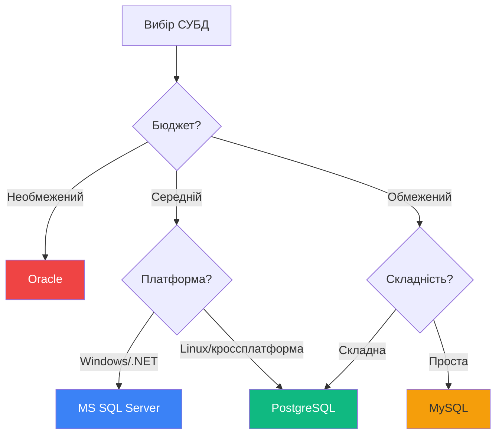

::

::tip{title="Практична порада"}
**Для веб-стартапу:** Почніть з MySQL або PostgreSQL

**Для корпоративного додатку:** MS SQL Server або Oracle

**Для навчання:** MS SQL Server Express або PostgreSQL

**Для складної аналітики:** PostgreSQL або Oracle
::

## Встановлення Microsoft SQL Server

У цьому розділі ми детально розглянемо процес встановлення MS SQL Server 2016 Express та інструментів управління.

### Версії та редакції Microsoft SQL Server

Перша версія **MS SQL Server** (SQL Server 1.0) з'явилася в **1988 році**. Наступна версія — SQL Server 1.1 — вийшла у 1990 році.

**Хронологія основних версій:**

| Рік  | Версія          | Особливості             |
| ---- | --------------- | ----------------------- |
| 1988 | SQL Server 1.0  | Перша версія            |
| 1990 | SQL Server 1.1  | Покращення стабільності |
| 1993 | SQL Server 4.2  | Windows NT підтримка    |
| 1996 | SQL Server 6.5  | Інтернет підтримка      |
| 2000 | SQL Server 2000 | XML підтримка           |
| 2005 | SQL Server 2005 | CLR інтеграція          |
| 2008 | SQL Server 2008 | Filestream              |
| 2012 | SQL Server 2012 | AlwaysOn                |
| 2014 | SQL Server 2014 | In-Memory OLTP          |
| 2016 | SQL Server 2016 | JSON, R підтримка       |
| 2017 | SQL Server 2017 | Linux підтримка         |
| 2019 | SQL Server 2019 | Big Data Clusters       |
| 2022 | SQL Server 2022 | Найновіша версія        |

::note{title="Для нав чання"}
Ми будемо використовувати **SQL Server 2016** або новішу версію. Для навчання достатньо безкоштовної редакції **Express**.
::

### Редакції SQL Server 2016

**Доступні редакції:**

::tabs
::tabs-item{label="Express"}
**Призначення:** Навчання, малі додатки, розробка  
**Вартість:** 🆓 Безкоштовно  
**Обмеження:**

- Максимум 1 процесор
- Максимум 1 ГБ RAM для буфера
- Максимум 10 ГБ розмір БД

**Ідеально для:** Студентів, малих додатків, розробки
::

::tabs-item{label="Developer"}
**Призначення:** Розробка та тестування  
**Вартість:** 🆓 Безкоштовно  
**Обмеження:** Тільки для розробки, НЕ для production

**Особливості:** Повна функціональність Enterprise версії
::

::tabs-item{label="Standard"}
**Призначення:** Середній бізнес  
**Вартість:** 💰💰 Комерційна ліцензія

**Особливості:** Більшість функцій для типових завдань
::

::tabs-item{label="Enterprise"}
**Призначення:** Великі корпорації  
**Вартість:** 💰💰💰💰 Дорога комерційна ліцензія

**Особливості:** Всі функції, необмежена продуктивність
::
::

---

## Інсталяція Microsoft SQL Server 2016 Express

### Системні вимоги

Перш ніж розпочати встановлення, переконайтеся, що ваш комп'ютер відповідає вимогам:

::warning

- **Операційна система:** Windows 10, Windows 8/8.1, Windows Server 2012/2012 R2/2016
- **Процесор:** Мінімум 1 ГГц (рекомендовано 2 ГГц або швидше)
- **Оперативна пам'ять:** Мінімум 512 МБ (рекомендовано 2 ГБ або більше)
- **Вільне місце:** Мінімум 4.2 ГБ на жорсткому диску
- **Екран:** Мінімум 1024x768 пікселів

::

### Завантаження інсталятора

1. Перейдіть на офіційний сайт Microsoft:  
   [https://www.microsoft.com/en-us/sql-server/sql-server-downloads](https://www.microsoft.com/en-us/sql-server/sql-server-downloads)

2. Знайдіть секцію **Express** edition

3. Натисніть кнопку **Download**

::tip{title="Новіші версії"}
Якщо доступна новіша версія (2017, 2019, 2022), можете використовувати її. Процес встановлення дуже схожий.
::

---

### Крок 1: Вибір типу установки

Після запуску інсталятора з'явиться вікно вибору типу установки.

**Доступні варіанти:**

::tabs
::tabs-item{label="Basic (Базова)"}

- Швидка установка
- Налаштування за замовчуванням
- Займає менше часу

**Недоліки:** Немає контролю над параметрами
::

::tabs-item{label="Custom (Користувацька)"}

- Повний контроль над процесом
- Вибір компонентів
- Налаштування шляхів

**Рекомендовано для навчання!**
::

::tabs-item{label="Download Media"}

- Завантаження для офлайн установки
- Створення образу

::

::

**Виберіть Custom (Користувацька установка)** для повного контролю.

{.diagram-img}

::note
На скріншоті показано вікно вибору типу установки. Натисніть **Custom** для розширеного встановлення.
::

---

### Крок 2: Вибір розташування

У наступному вікні відображається:

- Необхідний вільний простір на диску
- Розмір завантаження
- Папка встановлення

**Рекомендація:** Залишіть розташування за замовчуванням або виберіть диск з достатнім вільним місцем.

{.diagram-img}

Натисніть кнопку **Install** для початку завантаження.

---

### Крок 3: Завантаження пакету

Розпочнеться завантаження пакету установки. Цей процес може зайняти кілька хвилин залежно від швидкості інтернету.

{.diagram-img}

::tip{title="Терпіння"}
Завантаження може зайняти 5-15 хвилин. Не переривайте процес!
::

---

### Крок 4: Початок нової установки

Після завантаження з'явиться вікно **SQL Server Installation Center**.

Виберіть перший пункт: **"New SQL Server stand-alone installation or add features to an existing installation"**

{.diagram-img}

---

### Крок 5: Ліцензійна угода

Ознайомтеся з ліцензійною угодою від Microsoft.

**Важливо:**

- Прочитайте умови використання
- Поставте галочку **"I accept the license terms"**
- Натисніть **Next**

{.diagram-img}

---

### Крок 6: Встановлення файлів інсталяції

Програма здійснить:

- Пошук оновлень
- Завантаження необхідних файлів
- Підготовку до установки

{.diagram-img}

Зачекайте завершення цього етапу.

---

### Крок 7: Правила встановлення

Програма перевірить систему на потенційні проблеми.

**Можливі попередження:**

::warning

- Windows Firewall - потрібно буде відкрити порти для віддаленого доступу
- Програми, що конфліктують - можливо треба закрити
- Недостатньо місця - звільніть місце на диску

::

{.diagram-img}

::note{title="Попередження про брандмауер"}
Попередження про Windows Firewall - це нормально. Ми налаштуємо порти пізніше, коли це буде потрібно.
::

Натисніть **Next** для продовження.

---

### Крок 8: Вибір компонентів

**Основні компоненти для вибору:**

::code-group

```txt [Рекомендовані компоненти]
✅ Database Engine Services (ОБОВ'ЯЗКОВО)
   └─ SQL Server Replication

✅ Full-Text and Semantic Extractions

⚠️  Analysis Services (опціонально)

⚠️  Reporting Services (опціонально)

❌ Machine Learning Services (не потрібно для початку)
```

```txt [Мінімальна установка]
✅ Database Engine Services

Цього достатньо для навчання!
```

::

{.diagram-img}

**Рекомендація для навчання:** Виберіть **Database Engine Services** та **Reporting Services**.

---

### Крок 9: Встановлення компонентів

Розпочнеться встановлення вибраних компонентів.

{.diagram-img}

Прогрес установки відображається для кожного компонента. Цей процес може зайняти 5-10 хвилин.

Після успішного встановлення натисніть **Next**.

---

### Крок 10: Налаштування екземпляру

**Що таке екземпляр (Instance)?**

::note
**Екземпляр SQL Server** - це окрема копія SQL Server зі своїми базами даних, налаштуваннями та службами.
::

**Типи екземплярів:**

::tabs
::tabs-item{label="Default Instance"}
**Іменування:** `(local)` або `.\` або назва комп'ютера

**Особливості:**

- Може бути тільки один
- Простіше підключатися
- Рекомендовано для початківців

::

::tabs-item{label="Named Instance"}
**Іменування:** `COMPUTERNAME\INSTANCENAME`

**Особливості:**

- Можна створити кілька
- Ізольовані один від одного
- Для складних сценаріїв

**Приклад:** `DESKTOP-ABC123\SQLEXPRESS`
::
::

{.diagram-img}

**Рекомендація:** Виберіть **Named instance** з ім'ям **SQLEXPRESS** (за замовчуванням).

---

### Крок 11: Конфігурація сервера

Налаштування облікових записів служб та параметрів сортування.

**Служби SQL Server:**

| Служба             | Призначення            | Автозапуск |
| ------------------ | ---------------------- | ---------- |
| SQL Server         | Основна служба БД      | Automatic  |
| SQL Server Agent   | Планувальник завдань   | Manual     |
| SQL Server Browser | Допомога в підключенні | Automatic  |

{.diagram-img}

**Рекомендація:** Залишіть налаштування за замовчуванням та натисніть **Next**.

---

### Крок 12: Database Engine Configuration

Це **найважливіший крок установки**!

#### Вкладка "Server Configuration"

**Режим автентифікації:**

::tabs
::tabs-item{label="Windows Authentication Mode"}
**Що це:**  
Використання облікових записів Windows для входу.

**Переваги:**

- Простіше для локальної роботи
- Інтеграція з Active Directory
- Безпечніше (Kerberos)

**Рекомендовано для навчання!**
::

::tabs-item{label="Mixed Mode"}
**Що це:**
Windows автентифікація + SQL Server автентифікація

**Особливості:**

- Потрібно встановити пароль для облікового запису `sa`
- Більше гнучкості
- Для веб-додатків

**Пароль sa:**  
Обліковий запис адміністратора SQL Server. Встановіть складний пароль!
::
::

{.diagram-img}

**Налаштування адміністраторів:**

Додайте поточного користувача Windows як адміністратора:

1. Натисніть кнопку **Add Current User**
2. Або **Add...** для додавання інших користувачів

::warning{title="Важливо"}
Обов'язково додайте хоча б одного адміністратора! Без цього ви не зможете підключитися до SQL Server.
::

---

#### Вкладка "Data Directories"

Налаштування розташування файлів бази даних.

**Типи каталогів:**

::code-group

```txt [Структура каталогів]
Data root directory
├── User database directory     (.mdf файли даних)
├── User database log directory (.ldf файли журналів)
├── Backup directory            (Резервні копії)
└── TempDB directory            (Тимчасові дані)
```

```txt [Рекомендовані шляхи]
C:\SQLDB\                     ← Data root
├── C:\SQLDB\Data\           ← User databases
├── C:\SQLDB\Logs\           ← Log files
├── C:\SQLDB\Backup\         ← Backups
└── C:\SQLDB\TempDB\         ← Temporary
```

::

{.diagram-img}

::tip{title="Найкраща практика"}
**Рекомендація для Production:**

- Дані на окремому **фізичному диску** (швидкий SSD)
- Журнали на **іншому фізичному диску**
- Резервні копії на **третьому диску** або мережевому сховищі

**Для навчання:** Можна залишити за замовчуванням або створити окрему папку.
::

{.diagram-img}

---

#### Інші вкладки

**TempDB:**

- Налаштування тимчасової бази даних
- Можна залишити за замовчуванням

**User Instances:**

- Дозвіл користувачам запускати екземпляр
- За замовчуванням увімкнено

**FILESTREAM:**

- Зберігання великих бінарних даних (файли, зображення)
- За замовчуванням вимкнено
- Можна увімкнути пізніше

Натисніть **Next** для продовження.

---

### Крок 13: Reporting Services Configuration

Якщо ви встановили Reporting Services, з'явиться це вікно.

**Варіанти:**

::tabs
::tabs-item{label="Install and configure"}

- Автоматичне налаштування
- Рекомендовано

::

::tabs-item{label="Install only"}

- Тільки встановлення
- Налаштування вручну пізніше

::

::

{.diagram-img}

Виберіть **Install and configure** та натисніть **Next**.

---

### Крок 14: Microsoft R Open (опціонально)

SQL Server 2016 включає підтримку R для статистичного аналізу.

{.diagram-img}

::note{title="R Services"}
**Microsoft R Open** - це розширення для інтелектуального моделювання та роботи зі статистичними даними.

**Для навчання баз даних:** Не обов'язково, але можна встановити.
::

Натисніть **Accept** (або **Skip** якщо не потрібно).

---

### Крок 15: Процес установки

Розпочнеться основна установка SQL Server. Це найдовший етап!

{.diagram-img}

**Що відбувається:**

- Копіювання файлів
- Створення служб Windows
- Налаштування Database Engine
- Встановлення Reporting Services
- Конфігурація безпеки

::tip{title="Терпіння"}
Цей процес може зайняти **10-20 хвилин**. Не вимикайте комп'ютер і не переривайте процес!
::

---

### Крок 16: Завершення установки

Успіх! SQL Server встановлено.

{.diagram-img}

Вікно показує:

- ✅ Успішно встановлені компоненти
- ⚠️ Попередження (якщо є)
- ❌ Помилки (якщо є)

Натисніть **Close** для завершення.

---

### Крок 17: Перевірка встановлення

Відкрийте **Панель керування** → **Програми та компоненти**

Ви повинні побачити **Microsoft SQL Server 2016** у списку встановлених програм.

{.diagram-img}

::tip{title="Встановлені компоненти"}
Розкрийте список та переконайтеся, що встановлені:

- SQL Server Database Engine
- SQL Server Reporting Services
- Configuration Manager
- SQL Server Documentation (опціонально)

::

**Важливо:** Перезавантажте комп'ютер після установки!

---

## Встановлення SQL Server Management Studio (SSMS)

**SQL Server Management Studio (SSMS)** - це **візуальне середовище** для роботи з SQL Server.

::warning{title="SSMS не входить в основну установку!"}
Починаючи з SQL Server 2016, SSMS встановлюється окремо.
::

### Навіщо потрібен SSMS?

**Без SSMS:**

```bash
# Робота через командний рядок
sqlcmd -S localhost\SQLEXPRESS
1> SELECT * FROM Users;
2> GO
```

**З SSMS:**

- 🖱️ Графічний інтерфейс
- 📝 Редактор запитів з підсвічуванням
- 🗂️ Object Explorer для перегляду структури
- 📊 Візуальні діаграми
- 🔧 Інструменти налаштування

---

### Завантаження SSMS

**Варіант 1: Через Installation Center**

1. Запустіть **SQL Server 2016 Installation Center**
2. Виберіть **Install SQL Server Management Tools**

{.diagram-img}

3. Відкриється браузер з сторінкою завантаження

**Варіант 2: Пряме завантаження**

Перейдіть на:  
[https://docs.microsoft.com/en-us/sql/ssms/download-sql-server-management-studio-ssms](https://docs.microsoft.com/en-us/sql/ssms/download-sql-server-management-studio-ssms)

Натисніть **Download SQL Server Management Studio**

::note{title="Версії SSMS"}
SSMS випускається окремо від SQL Server. Остання версія SSMS працює з усіма версіями SQL Server, починаючи з 2008.
::

---

### Встановлення SSMS

Після завантаження запустіть інсталятор.

**Крок 1:** Початок установки

{.diagram-img}

Натисніть **Install** для початку.

---

**Крок 2:** Завантаження пакетів

{.diagram-img}

SSMS завантажить необхідні компоненти.

---

**Крок 3:** Процес установки

{.diagram-img}

Установка може зайняти 5-10 хвилин.

---

**Крок 4:** Перезавантаження

{.diagram-img}

Після установки **рекомендується перезавантажити** комп'ютер.

Натисніть **Restart** або **Close** (якщо перезавантаження пізніше).

---

### Перевірка встановлення SSMS

Після перезавантаження знайдіть у меню Пуск:

**Microsoft SQL Server Tools 17**  
└─ **Microsoft SQL Server Management Studio 17**

{.diagram-img}

---

## Перше підключення до SQL Server

### Запуск SSMS

Запустіть **SQL Server Management Studio** з меню Пуск.

При першому запуску:

1. Завантаження налаштувань користувача
2. Ініціалізація середовища
3. Вікно підключення до сервера

---

### Вікно підключення

{.diagram-img}

**Параметри підключення:**

#### 1. Server type (Тип сервера)

::code-group

```txt [Database Engine]
✅ Основна служба БД
Використовуйте це для роботи з даними
```

```txt [Analysis Services]
⚠️ Аналітична обробка даних
OLAP, бізнес-аналітика
```

```txt [Reporting Services]
⚠️ Створення звітів
Публікація звітів
```

```txt [Integration Services]
⚠️ ETL процеси
Інтеграція даних
```

::

{.diagram-img}

**Для роботи з даними:** Виберіть **Database Engine**.

---

#### 2. Server name (Ім'я сервера)

**Формат:**

::tabs
::tabs-item{label="Default Instance"}

```
localhost
.
(local)
COMPUTER_NAME
```

::

::tabs-item{label="Named Instance"}

```
localhost\SQLEXPRESS
.\SQLEXPRESS
COMPUTER_NAME\SQLEXPRESS
```

::
::

{.diagram-img}

SSMS автоматично знаходить локальні сервери. Виберіть зі списку:

- `(local)\SQLEXPRESS` - ваш локальний екземпляр
- `.` - скорочена форма localhost

::tip{title="Не знаєте ім'я?"}
Натисніть на випадаючий список - SSMS покаже доступні сервери.

Якщо список порожній, введіть вручну: `localhost\SQLEXPRESS`
::

---

#### 3. Authentication (Автентифікація)

**Режими автентифікації:**

::tabs
::tabs-item{label="Windows Authentication"}
**Що використовується:** Поточний обліковий запис Windows

**Переваги:**

- Не потрібно вводити пароль
- Безпечніше (Kerberos)
- Інтеграція з Active Directory

**Коли використовувати:** Локальна робота, корпоративне середовище
::

::tabs-item{label="SQL Server Authentication"}
**Що використовується:** Ім'я користувача та пароль SQL Server

**Приклад:**

- Login: `sa`
- Password: [той, що встановили під час інсталяції]

**Коли використовувати:** Віддалене підключення, веб-додатки
::

::tabs-item{label="Azure Active Directory"}
**Для хмарних баз даних** Azure SQL Database
::
::

**Для локального SQL Server Express:** Виберіть **Windows Authentication**.

---

### Успішне підключення!

Після натискання **Connect** ви побачите:

::mermaid

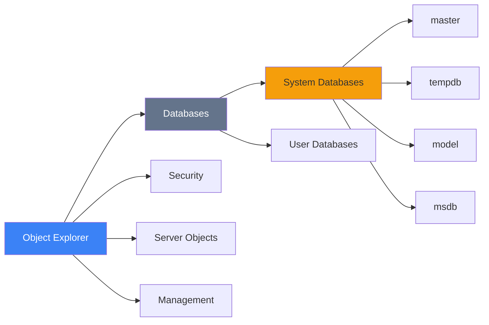

::

**Перевірте підключення:**

- У **Object Explorer** розкрийте **Databases**
- Ви повинні побачити системні бази даних: `master`, `tempdb`, `model`, `msdb`

::tip{title="Вітаємо!"}
Якщо ви бачите цю структуру - SQL Server встановлено та працює правильно! 🎉
::

---

## Інструменти SQL Server

Давайте розглянемо встановлені компоненти та утиліти.

### SQL Server Configuration Manager

**Призначення:** Керування службами та мережевими налаштуваннями

**Можливості:**

::note

- Запуск/зупинка служб SQL Server
- Налаштування автозапуску служб
- Конфігурація мережевих протоколів (TCP/IP, Named Pipes)
- Управління портами
- Налаштування псевдонімів (aliases)

::

**Як запустити:**

```
Start Menu → SQL Server 2016 Configuration Manager
```

**Основні служби:**

| Служба                        | Опис                   | Рекомендований режим                |
| ----------------------------- | ---------------------- | ----------------------------------- |
| SQL Server (SQLEXPRESS)       | Основна служба БД      | Automatic                           |
| SQL Server Agent (SQLEXPRESS) | Планувальник завдань   | Manual (Auto у Standard/Enterprise) |
| SQL Server Browser            | Допомога в підключенні | Automatic                           |

---

### Reporting Services Configuration Manager

**Призначення:** Налаштування сервера звітів

**Що можна налаштувати:**

::tabs
::tabs-item{label="Database"}

- База даних каталогу звітів
- Connection strings

::

::tabs-item{label="Service Account"}

- Обліковий запис служби
- Права доступу

::

::tabs-item{label="Web Service URL"}

- URL веб-служби
- Порт (за замовчуванням 80)

::

::tabs-item{label="E-mail Settings"}

- SMTP сервер для розсилки звітів

::

::

---

### SQL Server Import and Export Data

**Призначення:** Копіювання даних між джерелами

**Підтримувані формати:**

::code-group

```txt [Бази даних]
✅ SQL Server
✅ Oracle
✅ MySQL
✅ PostgreSQL
✅ Access
✅ Excel
```

```txt [Файли]
✅ CSV, TXT
✅ Excel (.xlsx, .xls)
✅ XML
✅ JSON
```

```txt [Хмарні сервіси]
✅ Azure SQL Database
✅ Azure Blob Storage
✅ Amazon RDS
```

::

**Коли використовувати:**

- Міграція даних
- Імпорт з Excel в SQL
- Експорт даних для аналізу
- Регулярне копіювання

---

## Практичне завдання

::note{title="Перевірте свої знання"}
Виконайте наступні кроки для перевірки установки:
::

### Завдання 1: Створення тестової бази даних

1. Відкрийте **SSMS**
2. Підключіться до сервера
3. У **Object Explorer** → правою кнопкою на **Databases** → **New Database...**
4. Введіть ім'я: `TestDB`
5. Натисніть **OK**

**Результат:** База даних `TestDB` з'явилася у списку.

---

### Завдання 2: Створення таблиці

1. Розкрийте **TestDB** → **Tables**
2. Правою кнопкою → **New** → **Table...**
3. Додайте стовпці:

| Column Name | Data Type     | Allow Nulls |
| ----------- | ------------- | ----------- |
| id          | int           | ❌          |
| name        | nvarchar(100) | ❌          |
| age         | int           | ✅          |

4. Зробіть `id` первинним ключем (правою кнопкою на `id` → **Set Primary Key**)
5. Збережіть таблицю (Ctrl+S) з ім'ям `Users`

---

### Завдання 3: Вставка даних

1. Правою кнопкою на таблиці `Users` → **Edit Top 200 Rows**
2. Введіть дані:

| id  | name  | age |
| --- | ----- | --- |
| 1   | Іван  | 25  |
| 2   | Марія | 22  |
| 3   | Петро | 30  |

3. Натисніть в іншому місці для збереження

---

### Завдання 4: Запит даних

1. Натисніть **New Query**
2. Введіть SQL:

```sql
SELECT * FROM TestDB.dbo.Users;
```

3. Натисніть **Execute** (F5)

**Очікуваний результат:**

```
id    name      age
1     Іван      25
2     Марія     22
3     Петро     30
```

::tip{title="Вітаємо!"}
Якщо ви побачили цей результат - установка пройшла успішно, і ви готові до вивчення баз даних! 🎉
::

---

## Поширені проблеми та рішення

### Проблема 1: Не можу підключитися до SQL Server

**Симптоми:**

```
A network-related or instance-specific error occurred while establishing
a connection to SQL Server.
```

**Рішення:**

::tabs
::tabs-item{label="Перевірка служб"}

1. Відкрийте **Services** (Win+R → `services.msc`)
2. Знайдіть **SQL Server (SQLEXPRESS)**
3. Переконайтеся, що служба **Running**
4. Якщо ні - натисніть **Start**

::

::tabs-item{label="Перевірка імені"}

1. Переконайтеся, що використовуєте правильне ім'я
2. Спробуйте: `localhost\SQLEXPRESS` або `.\SQLEXPRESS`
3. Або просто `.` якщо це Default Instance

::

::tabs-item{label="Брандмауер"}

1. Додайте SQL Server до виключень Windows Firewall
2. Або тимчасово вимкніть брандмауер для тесту

::

::

---

### Проблема 2: SQL Server Authentication не працює

**Симптоми:**

```
Login failed for user 'sa'.
```

**Причина:** Можливо, під час установки вибрали тільки Windows Authentication.

**Рішення:**

1. Підключіться через Windows Authentication
2. Object Explorer → правою кнопкою на сервері → **Properties**
3. **Security** → виберіть **SQL Server and Windows Authentication mode**
4. Натисніть **OK**
5. Перезапустіть службу SQL Server

---

### Проблема 3: Недостатньо прав

**Симптоми:**

```
The user does not have permission to perform this action.
```

**Рішення:**

1. Переконайтеся, що ваш обліковий запис Windows - адміністратор
2. Або додайте себе до ролі `sysadmin`:

```sql
-- Виконайте під обліковим записом з правами
USE master;
GO
CREATE LOGIN [DOMAIN\Username] FROM WINDOWS;
GO
ALTER SERVER ROLE sysadmin ADD MEMBER [DOMAIN\Username];
GO
```

---

## Висновок

::note{title="Що ми зробили"}
У цьому розділі ми:

✅ Розгля нули версії та редакції SQL Server  
✅ Встановили SQL Server 2016 Express  
✅ Встановили SQL Server Management Studio  
✅ Навчилися підключатися до сервера  
✅ Створили тестову базу даних  
✅ Познайомилися з інструментами SQL Server  
::

**Ви готові до вивчення баз даних!**

У наступних уроках ми детально розглянемо:

- Реляційну модель та математичні основи
- ER-моделювання
- Проектування логічної схеми
- Класифікацію таблиць

::tip{title="Практика"}
Не поспішайте видаляти `TestDB`! Використовуйте цю базу для експериментів під час вивчення наступних тем.
::
