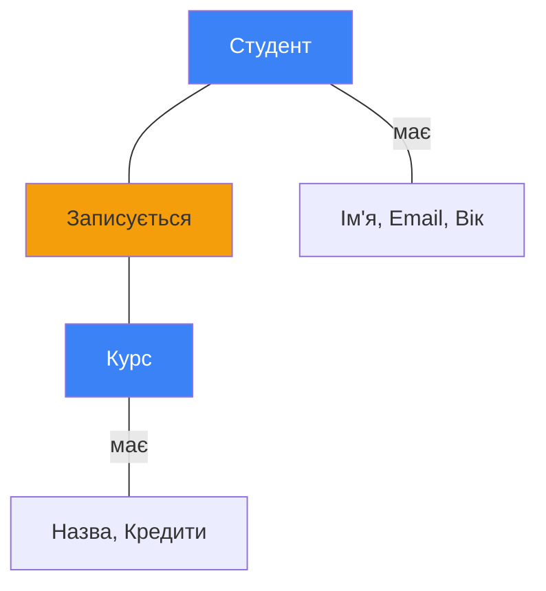
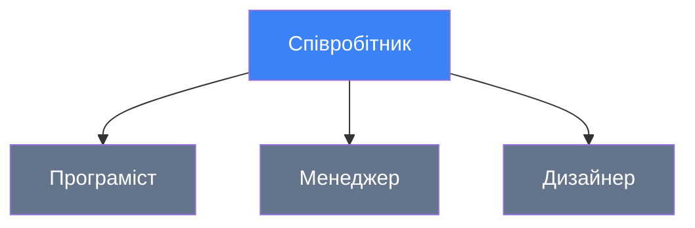
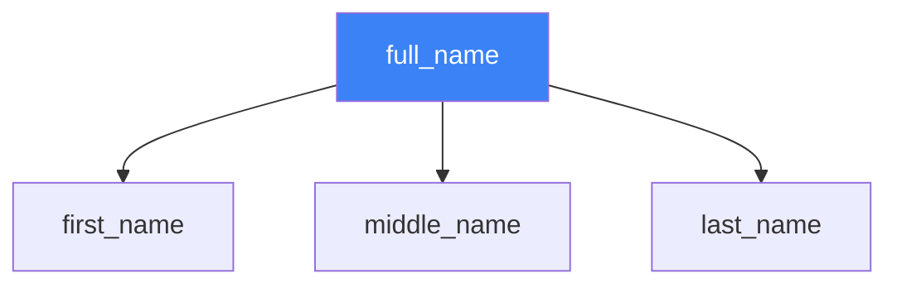
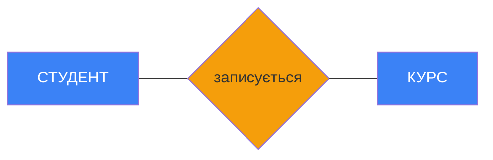
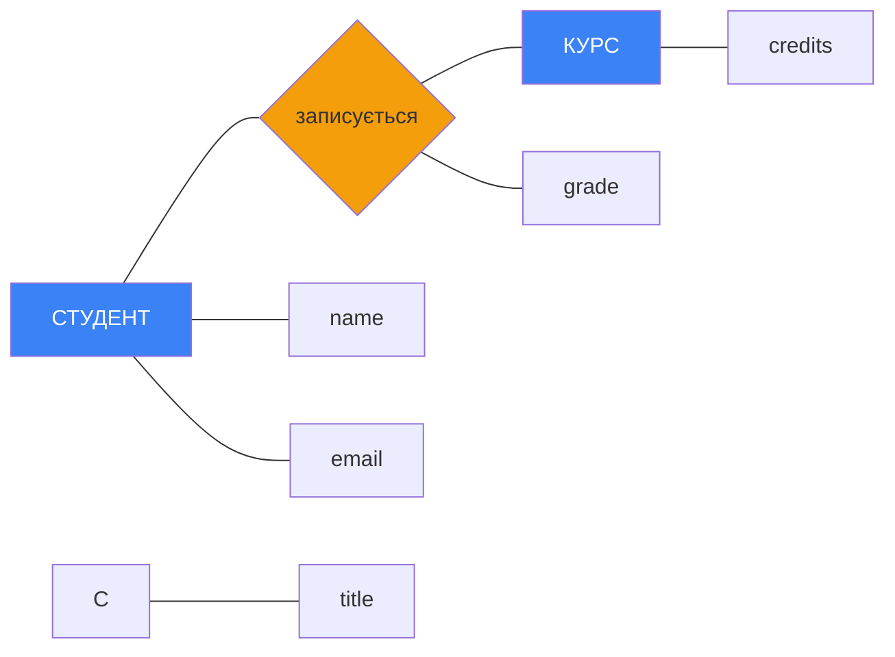

# ER-моделювання: Від ідеї до структури

::note{title="Мета уроку"}
У цьому уроці ми вивчимо **концептуальне моделювання** баз даних за допомогою **ER-діаграм** (Entity-Relationship Diagrams). Ми дізнаємося, як перетворити бізнес-вимоги на структуровану модель даних.
::

## Вступ: Навіщо потрібне проектування?

Уявіть, що ви будуєте будинок. Ви не почнете зразу класти цеглу - спочатку потрібен **план**, **креслення**, **схема**!

Так само з базами даних:

::tabs
::tabs-item{label="❌ Без проектування"}

```
"Давайте просто створимо таблиці!"
→ Дублювання даних
→ Неконсистентність
→ Складні запити
→ Проблеми при розширенні
```

::

::tabs-item{label="✅ З проектуванням"}

```
1. Зрозуміти предметну область
2. Виділити сутності та зв'язки
3. Створити ER-діаграму
4. Перетворити на таблиці
5. Оптимізувати структуру
```

::
::

**ER-моделювання** - це перший крок, **концептуальна схема**, яка допомагає:

- Зрозуміти предметну область
- Виявити всі сутності та зв'язки
- Обговорити структуру з клієнтом (без технічних деталей!)
- Уникнути помилок на ранніх етапах

::mermaid


::

---

## Етапи проектування БД

::note{title="Три рівні проектування"}
Процес створення БД складається з **трьох етапів**:

1. **Концептуальна схема** (ER-діаграма) - "ЩО" моделюємо
2. **Логічна схема** (Таблиці, ключі) - "ЯК" організуємо
3. **Фізична схема** (SQL, індекси) - "ДЕ" зберігаємо

::

### 1. Концептуальна схема (ER-діаграма)

**Мета:** Зрозуміти предметну область **без технічних деталей**.

**Інструменти:**

- Сутності (Entities)
- Атрибути (Attributes)
- Зв'язки (Relationships)

**Приклад для "Університету":**

::mermaid



::

**Результат:** Діаграма, зрозуміла **всім** (програмістам, менеджерам, клієнтам)!

### 2. Логічна схема

**Мета:** Перетворити ER-діаграму в **таблиці реляційної моделі**.

**Результат:**

```
STUDENTS(student_id PK, name, email, age)
COURSES(course_id PK, title, credits)
ENROLLMENTS(student_id FK, course_id FK, grade)
```

### 3. Фізична схема

**Мета:** Реалізувати в конкретній СУБД (MS SQL, PostgreSQL, MySQL).

**Результат:**

```sql
CREATE TABLE Students (
    student_id INT PRIMARY KEY IDENTITY(1,1),
    name NVARCHAR(100) NOT NULL,
    email NVARCHAR(100) UNIQUE,
    age INT CHECK (age >= 16 AND age <= 99)
);

CREATE INDEX idx_students_email ON Students(email);
```

**Порівняльна таблиця:**

| Рівень             | Фокус           | Нотація            | Аудиторія             |
| ------------------ | --------------- | ------------------ | --------------------- |
| **Концептуальний** | ЩО моделюємо    | ER-діаграми        | Всі stakeholders      |
| **Логічний**       | ЯК організувати | Таблиці, FK/PK     | Аналітики, розробники |
| **Фізичний**       | ДЕ зберігати    | SQL, типи, індекси | Розробники, DBA       |

---

## Що таке ER-модель?

::note
**ER-модель** (_Entity-Relationship Model_) - це **графічна нотація** для концептуального опису предметної області за допомогою сутностей, атрибутів та зв'язків між ними.
::

**Автор:** Пітер Чен (Peter Chen), 1976 рік

**Ключові концепції:**

1. **Entity** (Сутність) - об'єкт реального світу
2. **Attribute** (Атрибут) - характеристика сутності
3. **Relationship** (Зв'язок) - взаємодія між сутностями

### Чому ER-модель?

::tip{title="Переваги ER-моделювання"}

1. **Наочність** - легко зрозуміти структуру
2. **Абстракція** - не прив'язані до технологій (SQL, NoSQL)
3. **Комунікація** - спільна мова для всіх учасників
4. **Документація** - ER-діаграма = документ проєкту
5. **Виявлення помилок** - проблеми видно ДО написання коду

::

---

## Сутності (Entities)

::note
**Сутність** (_Entity_) - це об'єкт реального світу, який можна **чітко ідентифікувати** та який має **значення** для предметної області.
::

### Як розпізнати сутність?

**Правило 1: Іменник**

У тексті вимог сутності зазвичай є **іменниками**:

> "**Студенти** записуються на **курси**. **Викладачі** ведуть **курси**."

Сутності: Студент, Курс, Викладач

**Правило 2: Множинність**

Сутність має допускати **багато екземплярів**:

✅ Студент - може бути багато студентів  
✅ Книга - може бути багато книг  
❌ Університет - якщо університет один (це властивість!)

**Правило 3: Атрибути**

Сутність має мати **кілька властивостей**:

✅ Студент: ім'я, email, вік, група  
❌ Статус: тільки назва (можливо, це атрибутстудента?)

**Правило 4: Зв'язки**

Сутність бере участь у **зв'язках** з іншими:

✅ Студент **записується** на Курс  
✅ Автор **пише** Книгу

### Типи сутностей

::tabs
::tabs-item{label="Сильні сутності"}
**Сильна сутність** (_Strong Entity_) - існує **незалежно** від інших.

**Ознаки:**

- Має власний ідентифікатор (PK)
- Може існувати сама по собі
- **Не залежить** від інших сутностей

**Приклади:**

- Студент (має student_id)
- Книга (має ISBN)
- Країна (має код країни)

**Позначення:**

```
┌─────────────┐
│   СТУДЕНТ   │  ← одинарна рамка
└─────────────┘
```

::

::tabs-item{label="Слабкі сутності"}
**Слабка сутність** (_Weak Entity_) - **залежить** від іншої сутності.

**Ознаки:**

- НЕ має власного повного ідентифікатора
- Існує тільки разом з "батьківською" сутністю
- При видаленні батька - видаляється і слабка сутність

**Приклад:**

```
┌═════════════┐
║   СЕАНС     ║  ← подвійна рамка
╚═════════════╝
     ↑
     │ залежить від
     │
┌─────────────┐
│ КОРИСТУВАЧ  │
└─────────────┘
```

Сеанс (LogOn) не може існувати без Користувача!

**SQL реалізація:**

```sql
CREATE TABLE Users (
    user_id INT PRIMARY KEY,
    name NVARCHAR(100)
);

CREATE TABLE Sessions (
    session_id INT,
    user_id INT,  -- FK до Users
    login_time DATETIME,
    PRIMARY KEY (session_id, user_id),
    FOREIGN KEY (user_id) REFERENCES Users(user_id)
        ON DELETE CASCADE  -- при видаленні користувача → видалити сеанси
);
```

::

::tabs-item{label="Супертипи та підтипи"}
**Супертип/підтип** (_Supertype/Subtype_) - ієрархія сутностей (успадкування).

**Приклад - Співробітники:**

::mermaid



::

**Супертип:** Співробітник  
**Підтипи:** Програміст, Менеджер, Дизайнер

**Властивості:**

- Підтип **успадковує** атрибути супертипу
- Підтип може мати **власні** атрибути

**Структура:**

```
СПІВРОБІТНИК:
- employee_id (PK)
- name
- email
- salary

ПРОГРАМІСТ (підтип):
- programming_languages
- github_username

МЕНЕДЖЕР (підтип):
- department
- team_size
```

::
::

### Приклад: Особиста бібліотека

**Сутності системи:**

::note

- **Person** (Особа) - **сильна** - користувачі системи
- **Status** (Статус) - **сильна** - ролі користувачів (admin, user)
- **Publication** (Видання) - **сильна** - книги в каталозі
- **Shelf** (Полиця) - **сильна** - фізичні полиці
- **Request** (Запит) - **слабка** - залежить від Person
- **LogOn** (Сеанс) - **слабка** - залежить від Person

::

---

## Атрибути (Attributes)

::note
**Атрибут** (_Attribute_) - це **властивість** або **характеристика** сутності, яка описує її стан.
::

### Типи атрибутів

::tabs
== Прості (атомарні)
**Прості атрибути** **не можна** розділити на частини.

**Приклади:**

- `age` - вік (20)
- `email` - пошта (ivan@example.com)
- `rating` - рейтинг (4.5)
- `isActive` - активний (true/false)

**Позначення (Chen):**

```
    ┌──────┐
    │  age │  ← простий атрибут (овал)
    └───┼──┘
        │
  ┌─────┴──────┐
  │  СТУДЕНТ   │
  └────────────┘
```

== Складені
**Складені атрибути** можна розділити на частини.

**Приклад - Повне ім'я:**

```
full_name
├── first_name: "Іван"
├── middle_name: "Петрович"
└── last_name: "Іваненко"
```

**Приклад - Адреса:**

```
address
├── country: "Україна"
├── city: "Київ"
├── street: "Хрещатик"
├── building: "1"
└── apartment: "5"
```

**У ER-діаграмі:**

::mermaid



::

**У таблиці розбиваємо:**

```sql
CREATE TABLE Person (
    person_id INT PRIMARY KEY,
    first_name NVARCHAR(50),
    middle_name NVARCHAR(50),
    last_name NVARCHAR(50)
);
```

== Похідні
**Похідні атрибути** **обчислюються** на основі інших.

**Приклади:**

1. **Вік з дати народження:**

```
birth_date: 2000-03-15
current_date: 2024-03-15
→ age = 24 (обчислюється!)
```

2. **Загальна вартість:**

```
price: 100
quantity: 5
→ total = price × quantity = 500
```

3. **Повних років навчання:**

```
enrollment_date: 2020-09-01
current_date: 2024-03-15
→ study_years = 3.5
```

**Позначення (Chen):**

```
    ┌┈┈┈┈┈┈┐
    ┆  age ┆  ← пунктирний овал
    └┈┈┈┼┈┈┘
        │
  ┌─────┴──────┐
  │   PERSON   │
  └────────────┘
```

::tip{title="Зберігати чи обчислювати?"}
**Варіант 1: Обчислювати (рекомендовано)**

```sql
SELECT
    name,
    birth_date,
    DATEDIFF(YEAR, birth_date, GETDATE()) AS age
FROM Person;
```

✅ Завжди актуально  
✅ Немає дублювання  
⚠️ Потрібно обчислювати при кожному запиті

**Варіант 2: Зберігати**

```sql
ALTER TABLE Person ADD age INT;
-- Потрібно оновлювати щороку!
```

❌ Може бути неактуальним  
❌ Дублювання даних  
✅ Швидкий доступ
::

== Багатозначні
**Багатозначні атрибути** мають **кілька значень**.

**Приклади:**

1. **Телефони:**

```
person: Іван
phones:
  - +380501234567
  - +380672345678
  - +380931111111
```

2. **Email адреси:**

```
company: TechCorp
emails:
  - info@techcorp.com
  - support@techcorp.com
  - sales@techcorp.com
```

**Позначення (Chen):**

```
    ╔══════════╗
    ║  phones  ║  ← подвійний овал
    ╚════╤═════╝
         │
   ┌─────┴──────┐
   │   PERSON   │
   └────────────┘
```

**У реляційній моделі → окрема таблиця:**

```sql
-- Основна таблиця
CREATE TABLE Person (
    person_id INT PRIMARY KEY,
    name NVARCHAR(100)
);

-- Окрема таблиця для телефонів
CREATE TABLE PersonPhones (
    phone_id INT PRIMARY KEY,
    person_id INT,
    phone_number NVARCHAR(20),
    phone_type NVARCHAR(20),  -- mobile, home, work
    FOREIGN KEY (person_id) REFERENCES Person(person_id)
);
```

**Приклад даних:**

```
PERSON:
| person_id | name  |
|-----------|-------|
| 1         | Іван  |

PERSONPHONES:
| phone_id | person_id | phone_number    | phone_type |
|----------|-----------|-----------------|------------|
| 101      | 1         | +380501234567   | mobile     |
| 102      | 1         | +380672345678   | work       |
| 103      | 1         | +380931111111   | home       |
```

== Ключові
**Ключові атрибути** використовуються для **ідентифікації** екземплярів.

**Приклади:**

- `student_id` - ідентифікатор студента
- `ISBN` - міжнародний номер книги
- `passport_number` - номер паспорта
- `email` - електронна пошта (якщо унікальна)

**Позначення (Chen):**

```
    ┌──────────┐
    │ email id │  ← підкреслений текст
    └────┼─────┘
         │
   ┌─────┴──────┐
   │   PERSON   │
   └────────────┘
```

**Складений ключ:**

```
    ┌────────────┐  ┌────────────┐
    │ student_id │  │ course_id  │  ← обидва підкреслені
    └─────┼──────┘  └──────┼─────┘
          │                │
          └────────┬───────┘
             ┌─────┴──────────┐
             │   ENROLLMENT   │
             └────────────────┘
```

::

### Порівняльна таблиця атрибутів

| Тип               | Опис            | Приклад                | ER-позначення      | У БД                     |
| ----------------- | --------------- | ---------------------- | ------------------ | ------------------------ |
| **Простий**       | Неподільний     | age, email             | Звичайний овал     | Один стовпець            |
| **Складений**     | Можна розділити | full_name → first+last | Овал з під-овалами | Кілька стовпців          |
| **Похідний**      | Обчислюється    | age з birth_date       | Пунктирний овал    | Зазвичай не зберігається |
| **Багатозначний** | Кілька значень  | phones                 | Подвійний овал     | Окрема таблиця           |
| **Ключовий**      | Ідентифікатор   | student_id             | Підкреслений текст | PRIMARY KEY              |

---

## Зв'язки (Relationships)

::note
**Зв'язок** (_Relationship_) - це **асоціація** між двома або більше сутностями, яка має певний **смисл** у предметній області.
::

### Основні поняття

**Учасники зв'язку:**

- Сутності, які беруть участь у зв'язку

**Ступінь зв'язку:**

- Кількість учасників зв'язку (зазвичай 2)

**Типи зв'язків:**

- Один-до-одного (1:1)
- Один-до-багатьох (1:N)
- Багато-до-багатьох (M:M)

### Кардинальність (Cardinality)

::note
**Кардинальність** показує **скільки** екземплярів одної сутності може бути пов'язано з екземпляром іншої.
::

**Позначення:**

- **1** - один
- **M** або **N** - багато

::tabs
::tabs-item{label="Один-до-одного (1:1)"}
**Один екземпляр A** пов'язаний з **одним екземпляром B**.

**Приклад 1: Країна ← → Столиця**

```
Кожна країна має ОДНУ столицю
Кожна столиця належить ОДНІЙ країні
```

**Приклад 2: Особа ← → Паспорт**

```
У кожної особи ОДИН паспорт
Кожен паспорт належить ОДНІЙ особі
```

**ER-діаграма:**

```
┌────────┐    1    ┌──────────┐    1    ┌──────────┐
│ КРАЇНА │─────────│ має_стол │─────────│ СТОЛИЦЯ  │
└────────┘         └──────────┘         └──────────┘
```

**Таблиці:**

```sql
-- Варіант 1: Об'єднати в одну таблицю
CREATE TABLE Country (
    country_id INT PRIMARY KEY,
    country_name NVARCHAR(100),
    capital_name NVARCHAR(100)
);

-- Варіант 2: Окремі таблиці
CREATE TABLE Country (
    country_id INT PRIMARY KEY,
    country_name NVARCHAR(100)
);

CREATE TABLE Capital (
    capital_id INT PRIMARY KEY REFERENCES Country(country_id),
    capital_name NVARCHAR(100)
);
```

**Дані:**

```
COUNTRY:
| country_id | country_name | capital_name |
|------------|--------------|--------------|
| 1          | Україна      | Київ         |
| 2          | Польща       | Варшава      |
```

::tabs-item{label="Багато-до-багатьох (M:M)"}
**Багато екземплярів A** пов'язані з **багатьма екземплярами B**.

**Приклад 1: Студенти ←→ Курси**

```
Один студент може бути записаний на БАГАТО курсів
На один курс можуть записатись БАГАТО студентів
```

**Приклад 2: Актори ←→ Фільми**

```
Один актор може грати в БАГАТЬОХ фільмах
В одному фільмі можуть грати БАГАТО акторів
```

**ER-діаграма:**

::mermaid



::

**Таблиці (потрібна проміжна таблиця!):**

```sql
CREATE TABLE Students (
    student_id INT PRIMARY KEY,
    name NVARCHAR(100)
);

CREATE TABLE Courses (
    course_id INT PRIMARY KEY,
    title NVARCHAR(100)
);

-- Проміжна таблиця (Junction Table)
CREATE TABLE Enrollments (
    student_id INT,
    course_id INT,
    grade INT,
    enrollment_date DATE,
    PRIMARY KEY (student_id, course_id),
    FOREIGN KEY (student_id) REFERENCES Students(student_id),
    FOREIGN KEY (course_id) REFERENCES Courses(course_id)
);
```

::
::

**Дані:**

```
STUDENTS:
| student_id | name  |
|------------|-------|
| 1          | Іван  |
| 2          | Марія |

COURSES:
| course_id | title       |
|-----------|-------------|
| 101       | Математика  |
| 102       | Фізика      |

ENROLLMENTS:
| student_id | course_id | grade | enrollment_date |
|------------|-----------|-------|-----------------|
| 1          | 101       | 5     | 2024-09-01      |
| 1          | 102       | 4     | 2024-09-01      |
| 2          | 101       | 5     | 2024-09-01      |
```

Іван записаний на Математику та Фізику  
Марія записана на Математику

### Модальність (Participation)

::note
**Модальність** (_Participation, Optionality_) показує, чи **обов'язкова** участь сутності у зв'язку.
::

::tabs
::tabs-item{label="Обов'язкова (повна)"}
**Кожен екземпляр** сутності **має** брати участь у зв'язку.

**Приклад:**

```
Кожен студент ОБОВ'ЯЗКОВО належить до групи
```

**Позначення:**

```
┌─────────┐         ┌────────┐
│ СТУДЕНТ │═════════│  ГРУПА │  ← подвійна лінія
└─────────┘         └────────┘
```

**SQL:**

```sql
CREATE TABLE Students (
    student_id INT PRIMARY KEY,
    name NVARCHAR(100),
    group_id INT NOT NULL,  -- NOT NULL = обов'язково!
    FOREIGN KEY (group_id) REFERENCES Groups(group_id)
);
```

::

::tabs-item{label="Необов'язкова (часткова)"}
**Екземпляр** сутності **може** (але не обов'язково) брати участь у зв'язку.

**Приклад:**

```
Студент МОЖЕ (але не обов'язково) мати науковогоkeрівника
```

**Позначення:**

```
┌─────────┐         ┌───────────┐
│ СТУДЕНТ │─ ─ ─ ─ ─│ КЕРІВНИК  │  ← пунктирна лінія
└─────────┘         └───────────┘
```

**SQL:**

```sql
CREATE TABLE Students (
    student_id INT PRIMARY KEY,
    name NVARCHAR(100),
    supervisor_id INT NULL,  -- NULL = необов'язково
    FOREIGN KEY (supervisor_id) REFERENCES Supervisors(supervisor_id)
);
```

::
::

### Властивості зв'язків

Зв'язки також можуть мати **властивості** (атрибути)!

**Приклад: Студент ←→ Курс**

Зв'язок "Записується" має атрибути:

- `enrollment_date` - дата запису
- `grade` - оцінка
- `attendance` - відвідуваність

**ER-діаграма:**

```
┌─────────┐         ┌─────────────┐         ┌────────┐
│ СТУДЕНТ │─────────│ ENROLLMENT  │─────────│  КУРС  │
└─────────┘         └──────┬──────┘         └────────┘
                           │
                    ┌──────┴──────┐
                    │    grade    │
                    │   en_date   │
                    └─────────────┘
```

**SQL:**

```sql
CREATE TABLE Enrollments (
    student_id INT,
    course_id INT,
    grade INT,                -- атрибут зв'язку
    enrollment_date DATE,     -- атрибут зв'язку
    attendance_percent INT,   -- атрибут зв'язку
    PRIMARY KEY (student_id, course_id),
    FOREIGN KEY (student_id) REFERENCES Students(student_id),
    FOREIGN KEY (course_id) REFERENCES Courses(course_id)
);
```

---

## Нотації ER-діаграм

Існує кілька способів зображення ER-діаграм. Розглянемо два найпопулярніші:

### 1. Нотація Пітера Чена (Chen Notation)

**Автор:** Пітер Чен, 1976  
**Особливості:** Класична, деталізована, багато символів

**Елементи:**

::tabs
::tabs-item{label="Сутності"}
**Прямокутник з назвою**

```
┌─────────────┐
│   СТУДЕНТ   │  ← сильна сутність
└─────────────┘

┌═════════════┐
║   СЕАНС     ║  ← слабка" сутність
╚═════════════╝
```

::

::tabs-item{label="Атрибути"}
**Овал, з'єднаний з сутністю**

```
    ┌──────┐
    │ name │  ← простий
    └───┼──┘
        │
  ┌─────┴──────┐
  │  СТУДЕНТ   │
  └─────┬──────┘
        │
    ┌┈┈┈┼┈┈┈┐
    ┆  age  ┆  ← похідний (пунктир)
    └┈┈┈┈┈┈┈┘
```

::

::tabs-item{label="Зв'язки"}
**Ромб з назвою**

```
┌─────────┐         ╱╲         ┌────────┐
│ СТУДЕНТ │─────────╱  ╲────────│  КУРС  │
└─────────┘         ╲  ╱        └────────┘
                     ╲/
                  записується
```

::

::tabs-item{label="Кардинальність"}
**Числа біля ліній**

```
┌─────────┐    1    ╱╲    N    ┌────────┐
│  ГРУПА  │─────────╱  ╲────────│ СТУДЕНТ│
└─────────┘         ╲  ╱        └────────┘
                     ╲/
```

::
::

**Повний приклад (Chen):**

::mermaid



::

### 2. Нотація "Crow's Foot" (Вороняча лапка)

**Автор:** Гордон Еверест  
**Особливості:** Компактна, зрозуміла, широко використовується

**Елементи:**

::tabs
::tabs-item{label="Сутності"}
**Прямокутник з переліком атрибутів**

```
┌─────────────────┐
│ СТУДЕНТ         │
├─────────────────│
│ PK student_id   │ ← PK = Primary Key
│    name         │
│    email        │
│ FK group_id     │ ← FK = Foreign Key
└─────────────────┘
```

::

::tabs-item{label="Кардинальність"}
**Символи біля кінців ліній:**

```
│   - обов'язково один (1)
○   - необов'язково (0)
<   - багато (many)
```

**Комбінації:**

```
│─   - рівно 1
○─   - 0 або 1
│<   - 1 або більше
○<   - 0 або більше (найпоширеніший)
```

::

::tabs-item{label="Приклади зв'язків"}
**1:N (один-до-багатьох):**

```
┌────────┐        ┌─────────┐
│  ГРУПА ││───────○<СТУДЕНТ │
└────────┘        └─────────┘
```

Читається: "Одна група містить 0 або більше студентів"

**M:M (багато-до-багатьох):**

```
┌─────────┐        ┌────────┐
│ СТУДЕНТ │○<──────>○│  КУРС  │
└─────────┘        └────────┘
```

Варіант через проміжну таблицю:

```
┌─────────┐    ┌────────────┐    ┌────────┐
│ СТУДЕНТ ││───○<ENROLLMENT >○───││  КУРС  │
└─────────┘    └────────────┘    └────────┘
```

::
::

**Повний приклад (Crow's Foot):**

```
┌──────────────────┐        ┌──────────────────┐
│ GROUPS          │        │ STUDENTS         │
├──────────────────│        ├──────────────────│
│ PK group_id      ││───────○<FK group_id     │
│    group_name    │        │ PK student_id    │
│    faculty       │        │    name          │
└──────────────────┘        │    email         │
                            └──────────────────┘

┌──────────────────┐        ┌──────────────────────┐        ┌──────────────────┐
│ STUDENTS         │        │ ENROLLMENTS          │        │ COURSES          │
├──────────────────│        ├──────────────────────│        ├──────────────────│
│ PK student_id    ││───────○<FK student_id        >○───────││ PK course_id     │
│    name          │        │ FK course_id         │        │    title         │
│    email         │        │    grade             │        │    credits       │
└──────────────────┘        │    enrollment_date   │        └──────────────────┘
                            └──────────────────────┘
```

### Порівняння нотацій

| Критерій         | Chen             | Crow's Foot                          |
| ---------------- | ---------------- | ------------------------------------ |
| **Деталізація**  | Висока           | Середня                              |
| **Компактність** | Низька           | Висока                               |
| **Атрибути**     | Окремі овали     | Список в прямокутнику                |
| **Зв'язки**      | Ромби            | Лінії з символами                    |
| **Популярність** | Академічні курси | Реальні проєкти                      |
| **Зручність**    | Для навчання     | Для роботи                           |
| **Інструменти**  | Всі              | MySQL Workbench, draw.io, Lucidchart |

::tip{title="Яку обрати?"}

- **Chen** - для навчання, презентацій, наукових робіт
- **Crow's Foot** - для реальних проєктів, документації, команд розробки

У цьому курсі ми використовуємо **обидві**, щоб ви розуміли і ту, і іншу!
::

---

## Практичний приклад: Особиста бібліотека

Розглянемо повний приклад проектування системи "Особиста бібліотека".

### Бізнес-вимоги

**Система має підтримувати:**

1. Облік осіб (користувачів)
2. Ролі користувачів (адміністратор, читач)
3. Каталог видань (книг)
4. Фізичні екземпляри книг
5. Полиці для зберігання
6. Запити на видачу книг
7. Історію сеансів роботи

### Виявлення сутностей

**Аналіз тексту (іменники):**

> "**Особи** з різними **статусами** можуть переглядати **видання** в каталозі. Кожне видання може мати кілька **екземплярів**, розміщених на **полицях**. Користувачі створюють **запити** на книги. Система веде **лог сеансів** входу."

**Сутності:**

1. **Person** - особи (користувачі)
2. **Status** - статуси/ролі
3. **Publication** - видання
4. **Copy** - екземпляри
5. **Shelf** - полиці
6. **Request** - запити
7. **LogOn** - сеанси

### Виявлення атрибутів

::code-group

```txt [Person]
Person:
- person_id (PK)
- first_name
- last_name
- middle_name
- birth_date
- email
- phone
- status (FK → Status)
```

```txt [Status]
Status:
- status_id (PK)
- status_name (admin, librarian, reader)
- description
```

```txt [Publication]
Publication:
- publication_id (PK)
- title
- author
- ISBN
- publisher
- year
- category
```

```txt [Copy]
Copy:
- copy_id (PK)
- publication_id (FK → Publication)
- shelf_id (FK → Shelf)
- condition (нова, добра, зношена)
- acquisition_date
```

```txt [Shelf]
Shelf:
- shelf_id (PK)
- shelf_number
- room
- capacity
```

```txt [Request]
Request:
- request_id (PK)
- person_id (FK → Person)
- copy_id (FK → Copy)
- request_date
- return_date
- status (active, completed)
```

```txt [LogOn]
LogOn:
- session_id (PK)
- person_id (FK → Person)
- login_time
- logout_time
- ip_address
```

::

### Виявлення зв'язків

| Зв'язок            | Тип | Опис                                |
| ------------------ | --- | ----------------------------------- |
| Person ← Status    | N:1 | Багато осіб мають один статус       |
| Person → LogOn     | 1:N | Одна особа має багато сеансів       |
| Person → Request   | 1:N | Одна особа має багато запитів       |
| Publication → Copy | 1:N | Одне видання має багато екземплярів |
| Shelf → Copy       | 1:N | На одній полиці багато екземплярів  |
| Request ← Copy     | N:1 | Багато запитів на один екземпляр    |

### ER-діаграма (Crow's Foot)

```
          ┌──────────────┐
          │ STATUSES     │
          ├──────────────│
          │ PK status_id │
          │    name      │
          └──────┬───────┘
                 │
                 │1
                 │
                 │N
          ┌──────┴───────────┐
          │ PERSONS          │
          ├──────────────────│
          │ PK person_id     │───┐
          │ FK status_id     │   │1
          │    first_name    │   │
          │    last_name     │   │
          │    email         │   │N
          └──────────────────┘   │
                 │                │
          ┌──────┴────┬─────────┐│
          │1          │1        ││
          │           │         ││
          │N          │N        ││
   ┌──────┴──────┐┌──┴───────┐ ││
   │ LOGONS      ││ REQUESTS │ ││
   ├─────────────│├──────────│ ││
   │ PK sess_id  ││ PK req_id│ ││
   │ FK pers_id  ││ FK pers_id│││
   │    login_t  ││ FK copy_id││
   └─────────────┘│    req_date││
                  │    status  ││
                  └────┬───────┘│
                       │N       │
                       │        │
                       │1       │
                  ┌────┴────────┴─┐
                  │ COPIES        │
                  ├───────────────│
                  │ PK copy_id    │
                  │ FK publ_id    │────┐
                  │ FK shelf_id   │──┐ │
                  │    condition  │  │ │
                  └───────────────┘  │ │
                       │1            │1│1
                       │             │ │
                       │N           │N│N
                  ┌────┴──────┐ ┌───┴─┴──────┐
                  │ SHELVES   │ │PUBLICATIONS│
                  ├───────────│ ├────────────│
                  │ PK sh_id  │ │ PK publ_id │
                  │    number │ │    title   │
                  │    room   │ │    author  │
                  └───────────┘ │    ISBN    │
                                └────────────┘
```

### SQL реалізація

::code-group

```sql [Створення таблиць]
-- Довідкова таблиця статусів
CREATE TABLE Statuses (
    status_id INT PRIMARY KEY,
    status_name NVARCHAR(50) NOT NULL UNIQUE,
    description NVARCHAR(200)
);

-- Сильна сутність - особи
CREATE TABLE Persons (
    person_id INT PRIMARY KEY IDENTITY(1,1),
    first_name NVARCHAR(50) NOT NULL,
    last_name NVARCHAR(50) NOT NULL,
    middle_name NVARCHAR(50),
    birth_date DATE,
    email NVARCHAR(100) UNIQUE,
    phone NVARCHAR(20),
    status_id INT NOT NULL,
    FOREIGN KEY (status_id) REFERENCES Statuses(status_id)
);

-- Видання
CREATE TABLE Publications (
    publication_id INT PRIMARY KEY IDENTITY(1,1),
    title NVARCHAR(200) NOT NULL,
    author NVARCHAR(100),
    ISBN NVARCHAR(20) UNIQUE,
    publisher NVARCHAR(100),
    year INT,
    category NVARCHAR(50)
);

-- Полиці
CREATE TABLE Shelves (
    shelf_id INT PRIMARY KEY IDENTITY(1,1),
    shelf_number NVARCHAR(10) NOT NULL UNIQUE,
    room NVARCHAR(50),
    capacity INT DEFAULT 100
);

-- Екземпляри
CREATE TABLE Copies (
    copy_id INT PRIMARY KEY IDENTITY(1,1),
    publication_id INT NOT NULL,
    shelf_id INT,
    condition NVARCHAR(20) DEFAULT 'нова',
    acquisition_date DATE DEFAULT GETDATE(),
    FOREIGN KEY (publication_id) REFERENCES Publications(publication_id),
    FOREIGN KEY (shelf_id) REFERENCES Shelves(shelf_id)
);

-- Запити (залежить від Person)
CREATE TABLE Requests (
    request_id INT PRIMARY KEY IDENTITY(1,1),
    person_id INT NOT NULL,
    copy_id INT NOT NULL,
    request_date DATE DEFAULT GETDATE(),
    return_date DATE,
    status NVARCHAR(20) DEFAULT 'active',
    FOREIGN KEY (person_id) REFERENCES Persons(person_id),
    FOREIGN KEY (copy_id) REFERENCES Copies(copy_id)
);

-- Сеанси (слабка сутність)
CREATE TABLE LogOns (
    session_id INT PRIMARY KEY IDENTITY(1,1),
    person_id INT NOT NULL,
    login_time DATETIME DEFAULT GETDATE(),
    logout_time DATETIME,
    ip_address NVARCHAR(45),
    FOREIGN KEY (person_id) REFERENCES Persons(person_id)
        ON DELETE CASCADE  -- при видаленні особи видаляємо сеанси
);
```

```sql [Тестові дані]
-- Статуси
INSERT INTO Statuses VALUES
(1, 'admin', 'Адміністратор системи'),
(2, 'librarian', 'Бібліотекар'),
(3, 'reader', 'Читач');

-- Особи
INSERT INTO Persons (first_name, last_name, email, status_id) VALUES
('Іван', 'Іваненко', 'ivan@lib.com', 1),
('Марія', 'Коваленко', 'maria@lib.com', 3),
('Петро', 'Сидоренко', 'petro@lib.com', 3);

-- Видання
INSERT INTO Publications (title, author, ISBN, year) VALUES
('Кобзар', 'Тарас Шевченко', '978-966-03-4960-1', 1840),
('Лісова пісня', 'Леся Українка', '978-966-03-7209-8', 1911);

-- Полиці
INSERT INTO Shelves (shelf_number, room) VALUES
('A-001', 'Зала 1'),
('A-002', 'Зала 1');

-- Екземпляри
INSERT INTO Copies (publication_id, shelf_id) VALUES
(1, 1), (1, 1), (1, 2),  -- 3 екземпляри Кобзаря
(2, 2);                   -- 1 екземпляр Лісової пісні

-- Запити
INSERT INTO Requests (person_id, copy_id, request_date) VALUES
(2, 1, '2024-03-01'),  -- Марія взяла Кобзаря
(3, 4, '2024-03-05');  -- Петро взяв Лісову пісню
```

```sql [Типові запити]
-- 1. Всі книги певного автора
SELECT p.title, p.year, COUNT(c.copy_id) AS copies_count
FROM Publications p
LEFT JOIN Copies c ON p.publication_id = c.publication_id
WHERE p.author = 'Тарас Шевченко'
GROUP BY p.title, p.year;

-- 2. Активні запити користувача
SELECT
    per.first_name + ' ' + per.last_name AS full_name,
    pub.title,
    r.request_date,
    r.return_date
FROM Requests r
JOIN Persons per ON r.person_id = per.person_id
JOIN Copies c ON r.copy_id = c.copy_id
JOIN Publications pub ON c.publication_id = pub.publication_id
WHERE per.email = 'maria@lib.com'
  AND r.status = 'active';

-- 3. Доступність книг на полицях
SELECT
    s.shelf_number,
    pub.title,
    COUNT(c.copy_id) AS available_copies
FROM Shelves s
JOIN Copies c ON s.shelf_id = c.shelf_id
JOIN Publications pub ON c.publication_id = pub.publication_id
LEFT JOIN Requests r ON c.copy_id = r.copy_id AND r.status = 'active'
WHERE r.request_id IS NULL  -- не взяті
GROUP BY s.shelf_number, pub.title;
```

::

---

## Типові помилки при ER-моделюванні

::warning{title="Частоуустрічувані помилки"}
Навіть досвідчені розробники допускають їх!
::

### 1. Плутанина: Сут"ність чи Атрибут?

**Помилка:**

```
СТУДЕНТ має атрибут "університет" (текст)
```

**Чому погано?**

- Дублювання назви університету
- Неможливо зберегти додаткову інформацію (адресу, ректора)
- Складно змінювати назву

**Правильно:**

```
СТУДЕНТ пов'язаний з сутністю УНІВЕРСИТЕТ (1:N)
```

**SQL:**

```sql
-- ❌ Погано
CREATE TABLE Students (
    student_id INT PRIMARY KEY,
    name NVARCHAR(100),
    university_name NVARCHAR(200)  -- дублювання!
);

-- ✅ Добре
CREATE TABLE Universities (
    university_id INT PRIMARY KEY,
    name NVARCHAR(200),
    address NVARCHAR(300),
    rector NVARCHAR(100)
);

CREATE TABLE Students (
    student_id INT PRIMARY KEY,
    name NVARCHAR(100),
    university_id INT,
    FOREIGN KEY (university_id) REFERENCES Universities(university_id)
);
```

### 2. Багатозначні атрибути в одному полі

**Помилка:**

```sql
CREATE TABLE Person (
    person_id INT PRIMARY KEY,
    name NVARCHAR(100),
    phones NVARCHAR(500)  -- "+380501234567, +380672345678"
);
```

**Чому погано?**

- Неможливо шукати за конкретним телефоном
- Складно додавати/видаляти телефон
- Порушення атомарності (1NF)

**Правильно:**

```sql
CREATE TABLE Person (
    person_id INT PRIMARY KEY,
    name NVARCHAR(100)
);

CREATE TABLE PersonPhones (
    phone_id INT PRIMARY KEY,
    person_id INT,
    phone_number NVARCHAR(20),
    phone_type NVARCHAR(20),
    FOREIGN KEY (person_id) REFERENCES Person(person_id)
);
```

### 3. Пропуск проміжної таблиці для M:M

**Помилка:**

```sql
CREATE TABLE Students (
    student_id INT PRIMARY KEY,
    course_ids NVARCHAR(100)  -- "101,102,103"
);
```

**Правильно:**

```sql
CREATE TABLE Students (
    student_id INT PRIMARY KEY,
    name NVARCHAR(100)
);

CREATE TABLE Courses (
    course_id INT PRIMARY KEY,
    title NVARCHAR(100)
);

CREATE TABLE Enrollments (
    student_id INT,
    course_id INT,
    enrollment_date DATE,
    grade INT,
    PRIMARY KEY (student_id, course_id),
    FOREIGN KEY (student_id) REFERENCES Students(student_id),
    FOREIGN KEY (course_id) REFERENCES Courses(course_id)
);
```

### 4. Зберігання похідних атрибутів

**Помилка:**

```sql
CREATE TABLE Person (
    person_id INT PRIMARY KEY,
    birth_date DATE,
    age INT  -- ← зберігається та може застаріти!
);
```

**Правильно:**

```sql
CREATE TABLE Person (
    person_id INT PRIMARY KEY,
    birth_date DATE
    -- age обчислюється при запиті
);

SELECT
    name,
    birth_date,
    DATEDIFF(YEAR, birth_date, GETDATE()) AS age
FROM Person;
```

---

## Висновки

::note{title="Що ми вивчили"}
✅ **ER-моделювання** - метод концептуального проектування БД  
✅ **Сутності** - об'єкти реального світу (сильні, слабкі, супертипи/підтипи)  
✅ **Атрибути** - властивості сутностей (прості, складені, похідні, багатозначні, ключові)  
✅ **Зв'язки** - асоціації між сутностями (1:1, 1:N, M:M)  
✅ **Нотації** - Chen та Crow's Foot  
✅ **Практика** - система "Особиста бібліотека"  
::

**Ключові правила:**

::note{title="Висновок"}

- Починайте з бізнес-вимог, не з таблиць
- Сутності - це іменники, зв'язки - дієслова
- Багатозначні атрибути → окрема таблиця
- Похідні атрибути - обчислювати, не зберігати
- M:M завжди потребує проміжної таблиці

::

**У наступному уроці:**

Ми вивчимо, як перетворити ER-діаграму в **логічну схему** (таблиці з PRIMARY KEY та FOREIGN KEY)!

---

## Практичні завдання

### Завдання 1: Інтернет-магазин

**Опис предметної області:**

> Інтернет-магазин продає товари. Кожен товар належить до певної категорії. Клієнти реєструються в системі та робля ть замовлення. Одне замов лення може містити кілька товарів. Кожне замовлення має статус (нове, оплачене, відправлене, доставлене).

**Завдання:**

1. Виділіть сутності
2. Визначте атрибути для кожної сутності
3. Виявіть зв'язки та їх типи (1:1, 1:N, M:M)
4. Намалюйте ER-діаграму (Chen або Crow's Foot)

::tip{title="Підказка"}
Сутності: Customer, Order, Product, Category, OrderItem, OrderStatus
::

### Завдання 2: Університет

**Опис:**

> Університет має факультети. Кожен факультет має кілька кафедр. Викладачі працюють на кафедрах. Студенти навчаються на факультетах у групах. Викладачі ведуть курси. Студенти записуються на курси та отримують оцінки.

**Завдання:**

1. Створіть повну ER-діаграму
2. Визначте первинні ключі
3. Визначте зовнішні ключі
4. Напишіть SQL для створення таблиць

### Завдання 3: Виправлення помилок

**Дано невірну структуру:**

```sql
CREATE TABLE Employees (
    emp_id INT PRIMARY KEY,
    name NVARCHAR(100),
    skills NVARCHAR(500),  -- "Java, Python, SQL"
    project_names NVARCHAR(500),  -- "Proj1, Proj2"
    age INT,
    birth_date DATE
);
```

**Завдання:**

1. Знайдіть всі помилки
2. Створіть правильну ER-діаграму
3. Напишіть правильний SQL

::tip{title="Помічтмилки"}

- Багатозначні атрибути в одному полі
- Похідний атрибут (age)
- Відсутність окремих сутностей для Skills та Projects

::
