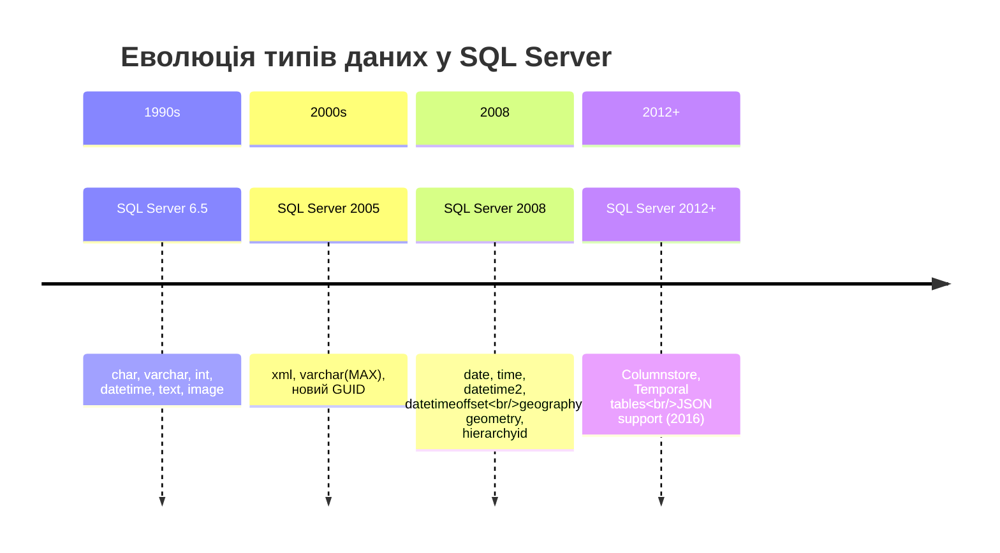
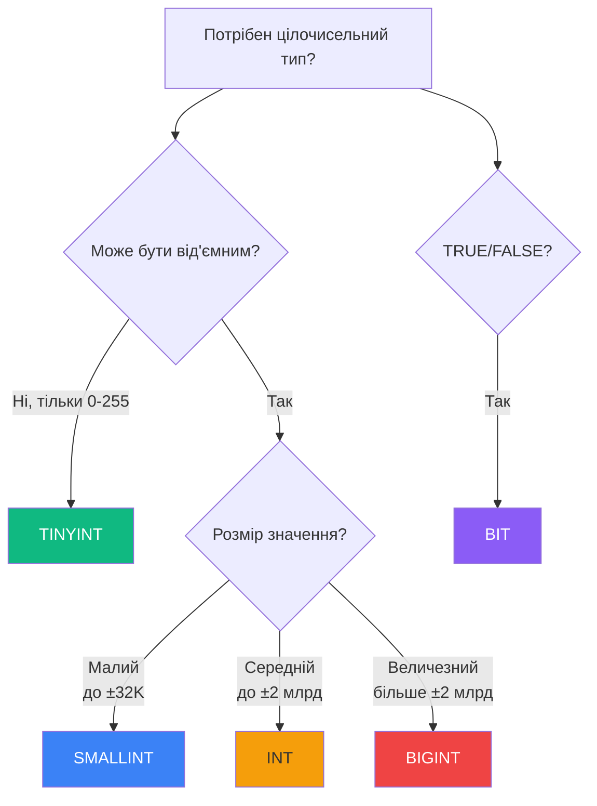
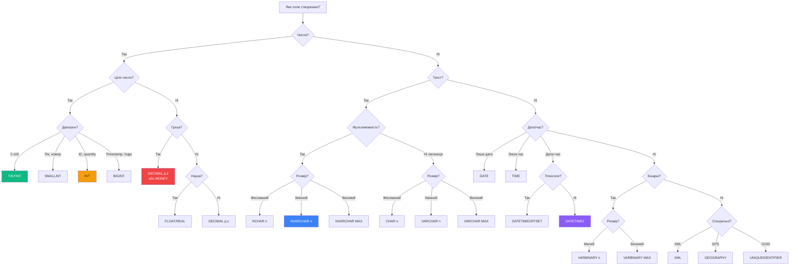
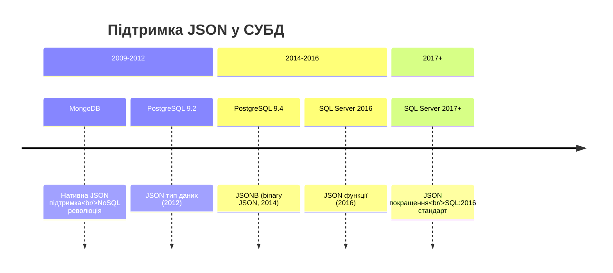

# Типи даних у MS SQL Server

## Вступ: Навіщо потрібні різні типи даних?

Уявіть, що ви будуєте будинок. Чи використовували б ви однаковий матеріал для фундаменту, стін та даху? Звичайно ні — кожна частина будівлі потребує матеріалу з конкретними властивостями. Так само і з базами даних: різні типи даних існують не просто для різноманітності, а для **оптимізації продуктивності, економії пам'яті та забезпечення точності**.

::note
**Ключова ідея**: Правильний вибір типу даних — це не просто "щоб працювало". Це рішення, яке впливає на:

- **Продуктивність** — швидкість виконання запитів
- **Розмір бази даних** — використання дискового простору
- **Точність** — коректність обчислень
- **Цілісність** — валідація даних на рівні БД

::

### Реальний сценарій: E-commerce система

Припустимо, ми розробляємо інтернет-магазин. Подивимося, як вибір типу даних впливає на різні поля:

| Поле           | Неправильний вибір | Наслідки                                | Правильний вибір   |
| :------------- | :----------------- | :-------------------------------------- | :----------------- |
| `product_id`   | `VARCHAR(50)`      | Повільні JOIN'и, 50 байт на ID          | `INT` (4 байти)    |
| `price`        | `FLOAT`            | Помилки округлення ($0.1 + $0.2 ≠ $0.3) | `DECIMAL(10,2)`    |
| `product_name` | `NVARCHAR(MAX)`    | 2 ГБ на назву товару!                   | `NVARCHAR(200)`    |
| `in_stock`     | `TINYINT`          | Незрозуміле значення (0/1/2/3?)         | `BIT` (TRUE/FALSE) |

::warning
**Розмір має значення**: Якщо у вас 10 мільйонів товарів, і ви використовуєте `VARCHAR(50)` замість `INT` для ID, ви витратите додатково **460 МБ** лише на один стовпець!
::

---

## Історична еволюція типів даних

Типи даних у SQL Server еволюціонували разом з потребами індустрії:

::mermaid



::

::tip
**Про deprecated типи**: `TEXT`, `NTEXT` та `IMAGE` застаріли з SQL Server 2005. Замість них використовуйте `VARCHAR(MAX)`, `NVARCHAR(MAX)` та `VARBINARY(MAX)` відповідно.
::

---

## Цілочисельні типи даних

### Навіщо потрібні різні розміри цілих чисел?

**Проблема**: Якби існував лише один цілочисельний тип, ми б або:

1. Витрачали надто багато пам'яті на маленькі числа
2. Або не мали б достатньо місця для великих чисел

**Рішення**: SQL Server надає **5 цілочисельних типів** різних розмірів.

### Таблиця цілочисельних типів

| Тип        | Діапазон                                                | Пам'ять | Типове використання                                   |
| :--------- | :------------------------------------------------------ | :------ | :---------------------------------------------------- |
| `TINYINT`  | 0 до 255                                                | 1 байт  | Вік людини, кількість днів у місяці, відсотки (0-100) |
| `SMALLINT` | -32,768 до 32,767                                       | 2 байти | Рік народження, номер кімнати                         |
| `INT`      | -2,147,483,648 до 2,147,483,647                         | 4 байти | **Primary Keys**, кількість товарів, ціна в копійках  |
| `BIGINT`   | -9,223,372,036,854,775,808 до 9,223,372,036,854,775,807 | 8 байт  | Timestamps (Unix time), великі суми грошей            |
| `BIT`      | 0, 1 або NULL                                           | 1 біт\* | Boolean значення (так/ні, активний/неактивний)        |

::note
**Особливість BIT**: SQL Server оптимізує зберігання — перші 8 `BIT` стовпців займають 1 байт разом, наступні 8 — ще 1 байт, і так далі.
::

### Практичний приклад: Вибір правильного типу

```sql
-- ❌ НЕПРАВИЛЬНО: Використання BIGINT для всього
CREATE TABLE Products_Bad (
    product_id BIGINT,           -- 8 байт (надлишок!)
    category_id BIGINT,          -- 8 байт (надлишок!)
    stock_quantity BIGINT,       -- 8 байт (навряд чи буде 9 квінтильйонів товарів)
    is_active BIGINT             -- 8 байт для TRUE/FALSE?!
);
```

**Проблема**: Для 1 млн товарів ця таблиця займе **32 МБ** лише на ці 4 поля.

```sql
-- ✅ ПРАВИЛЬНО: Оптимізоване використання
CREATE TABLE Products_Good (
    product_id INT,              -- 4 байти (до 2 млрд товарів)
    category_id SMALLINT,        -- 2 байти (до 32K категорій)
    stock_quantity INT,          -- 4 байти (достатньо для складу)
    is_active BIT                -- 1 біт
);
```

**Виграш**: Для 1 млн товарів ця таблиця займе лише **10 МБ** — економія **68%**!

### Анатомія коду: IDENTITY та автоінкремент

```sql {2,9-10} showLineNumbers
CREATE TABLE Students (
    Id INT IDENTITY(1,1) PRIMARY KEY,  -- Починається з 1, збільшується на 1
    LastName NVARCHAR(50),
    FirstName NVARCHAR(50)
);
```

**Пояснення конструкції `IDENTITY(1,1)`**:

- `IDENTITY` — вказує, що це автоінкрементне поле
- Перший параметр `(1, ...)` — **SEED** (початкове значення): з якого числа починати (1)
- Другий параметр `(..., 1)` — **INCREMENT** (крок): на скільки збільшувати (1)

::tip
**Практичний кейс**: Якщо ви імпортуєте дані і хочете уникнути конфліктів ID, можете використати `IDENTITY(10000, 1)` — нові записи почнуться з 10,000.
::

**Приклад з різним кроком**:

```sql
-- Парні номери замовлень для філії A
CREATE TABLE Orders_BranchA (
    order_id INT IDENTITY(2, 2)  -- 2, 4, 6, 8, 10...
);

-- Непарні номери замовлень для філії B
CREATE TABLE Orders_BranchB (
    order_id INT IDENTITY(1, 2)  -- 1, 3, 5, 7, 9...
);
```

### Коли використовувати кожен тип: Decision Tree

::mermaid



::

---

## Текстові типи даних

### Проблема: Фіксована vs Змінна довжина

**Сценарій**: Ми зберігаємо коди країн (наприклад, "UA", "US", "GB").

::tabs
::tabs-item{label="CHAR (фіксована)"}

```sql
CREATE TABLE Countries (
    code CHAR(2)  -- Завжди виділяє 2 байти
);
INSERT INTO Countries VALUES ('UA');  -- Зберігається як 'UA'
```

**Пам'ять**: Завжди **2 байти**, навіть якщо код з 1 символу.  
**Переваги**: Швидше (передбачуваний розмір)  
**Недоліки**: Втрата місця при коротких значеннях
::

::tabs-item{label="VARCHAR (змінна)"}

```sql
CREATE TABLE Countries (
    code VARCHAR(2)  -- Виділяє стільки, скільки потрібно
);
INSERT INTO Countries VALUES ('UA');  -- Зберігається як 'UA' (2 байти)
INSERT INTO Countries VALUES ('U');   -- Зберігається як 'U' (1 байт)
```

**Пам'ять**: Від **1 до N байт** + 2 байти на зберігання довжини  
**Переваги**: Економія місця  
**Недоліки**: Overhead для зберігання довжини
::
::

### Unicode vs Non-Unicode: NVARCHAR vs VARCHAR

**Що таке Unicode?**  
Unicode (UTF-16) — це стандарт кодування, що підтримує **всі мови світу**: кирилицю, ієрогліфи, арабську, емодзі тощо.

| Тип           | Кодування  | Байт на символ | Підтримує                       | Коли використовувати                                |
| :------------ | :--------- | :------------- | :------------------------------ | :-------------------------------------------------- |
| `CHAR(n)`     | ASCII/ANSI | 1              | Лише латиницю та базові символи | Коди, MD5 хеші, старі англомовні системи            |
| `VARCHAR(n)`  | ASCII/ANSI | 1              | Лише латиницю та базові символи | Email, URL (якщо точно лише латиниця)               |
| `NCHAR(n)`    | Unicode    | 2              | **Всі мови**                    | Міжнародні коди з символами                         |
| `NVARCHAR(n)` | Unicode    | 2              | **Всі мови**                    | **Імена, адреси, будь-який текст від користувачів** |

::warning
**Критична помилка**: Використання `VARCHAR` для українських імен призведе до "кракозябр" (���) або втрати даних!
::

**Приклад проблеми з VARCHAR**:

```sql
-- ❌ НЕПРАВИЛЬНО для української мови
CREATE TABLE Users (
    name VARCHAR(100)
);
INSERT INTO Users VALUES ('Тарас Шевченко');
-- Може зберегтися як "????? ????????" або взагалі пусто!
```

```sql
-- ✅ ПРАВИЛЬНО для будь-якої мови
CREATE TABLE Users (
    name NVARCHAR(100)
);
INSERT INTO Users VALUES ('Тарас Шевченко');  -- Зберігається коректно
INSERT INTO Users VALUES ('田中太郎');        -- Також працює!
INSERT INTO Users VALUES ('محمد');           -- І це теж!
```

### VARCHAR(MAX) vs VARCHAR(8000)

SQL Server має обмеження: `VARCHAR(n)` може бути максимум **8000 байт**, `NVARCHAR(n)` — **4000 символів**.

::tabs
::tabs-item{label="VARCHAR(8000)"}
**Зберігання**: В основній сторінці даних (8 КБ)  
**Продуктивність**: Швидка  
**Коли використовувати**: Короткі описи, коментарі до 8000 символів
::

::tabs-item{label="VARCHAR(MAX)"}
**Зберігання**: До **2 ГБ**! Великі значення зберігаються окремо (LOB)  
**Продуктивність**: Повільніша для великих значень  
**Коли використовувати**: Статті блогу, JSON, XML, логи
::
::

**Deprecated типи (не використовуйте!)**:

```sql
-- ❌ ЗАСТАРІЛО з SQL Server 2005
CREATE TABLE Articles_Old (
    content TEXT        -- Замініть на VARCHAR(MAX)
);

-- ✅ СУЧАСНИЙ ПІДХІД
CREATE TABLE Articles_New (
    content VARCHAR(MAX)  -- До 2 ГБ, кращі функції, підтримка JSON
);
```

---

## Дійсні типи даних

### FLOAT vs REAL: Швидкість чи точність?

**Проблема**: Нам потрібно зберігати числа з комою. Як вибрати між `FLOAT` та `DECIMAL`?

| Тип     | Діапазон   | Точність   | Пам'ять | Використання                                   |
| :------ | :--------- | :--------- | :------ | :--------------------------------------------- |
| `REAL`  | ±3.40E+38  | ~7 знаків  | 4 байти | Наукові розрахунки, сенсорні дані              |
| `FLOAT` | ±1.79E+308 | ~15 знаків | 8 байт  | GPS координати, складні математичні обчислення |

::warning
**Критична проблема з FLOAT**: Це **наближені** числа! Можуть бути помилки округлення.
::

**Демонстрація проблеми**:

```sql
DECLARE @a FLOAT = 0.1;
DECLARE @b FLOAT = 0.2;
DECLARE @sum FLOAT = @a + @b;

SELECT @sum;  -- Очікуємо 0.3
-- Результат: 0.30000000000000004  ❌
```

**Чому так відбувається?**  
`FLOAT` використовує **бінарне** представлення. Деякі десяткові дроби (як 0.1) не можуть бути точно представлені в бінарній формі, так само як 1/3 не можна точно записати в десятковій (0.333...).

### Коли використовувати FLOAT

::tip
**Золоте правило**: Використовуйте `FLOAT` лише для наукових даних, де потрібна **швидкість**, а не **абсолютна точність**.
::

**Приклади правильного використання**:

```sql
-- ✅ Метео станція (температура, тиск)
CREATE TABLE SensorData (
    temperature REAL,      -- Точність ±0.01°C достатня
    pressure REAL,
    humidity REAL
);

-- ✅ GPS координати
CREATE TABLE Locations (
    latitude FLOAT,        -- Точність 15 знаків достатня
    longitude FLOAT
);
```

**Приклади НЕПРАВИЛЬНОГО використання**:

```sql
-- ❌ НЕ використовуйте для фінансів!
CREATE TABLE Invoices_Bad (
    total_amount FLOAT     -- Помилки округлення накопичуються!
);
```

---

## Типи даних для дати та часу

### Еволюція типів дати

До SQL Server 2008 існував лише `DATETIME`. Але він мав проблеми:

- Занадто велика точність для простих дат
- Відсутність підтримки часових поясів
- Неможливість зберігати лише час або лише дату

SQL Server 2008 вирішив це, додавши **5 нових типів**!

### Порівняльна таблиця

| Тип              | Формат                             | Діапазон                 | Точність       | Пам'ять  | Timezone |
| :--------------- | :--------------------------------- | :----------------------- | :------------- | :------- | :------- |
| `DATE`           | YYYY-MM-DD                         | 0001-01-01 до 9999-12-31 | День           | 3 байти  | ❌       |
| `TIME`           | HH:MM:SS.nnnnnnn                   | 00:00:00 до 23:59:59     | 100 наносекунд | 3-5 байт | ❌       |
| `SMALLDATETIME`  | YYYY-MM-DD HH:MM                   | 1900-01-01 до 2079-06-06 | Хвилина        | 4 байти  | ❌       |
| `DATETIME`       | YYYY-MM-DD HH:MM:SS.nnn            | 1753-01-01 до 9999-12-31 | 3.33 мс        | 8 байт   | ❌       |
| `DATETIME2`      | YYYY-MM-DD HH:MM:SS.nnnnnnn        | 0001-01-01 до 9999-12-31 | 100 наносекунд | 6-8 байт | ❌       |
| `DATETIMEOFFSET` | YYYY-MM-DD HH:MM:SS.nnnnnnn +HH:MM | 0001-01-01 до 9999-12-31 | 100 наносекунд | 10 байт  | ✅       |

### Практичні сценарії використання

::code-group

```sql [Дата народження]
CREATE TABLE Employees (
    employee_id INT PRIMARY KEY,
    birth_date DATE  -- Не потрібен час!
);
INSERT INTO Employees VALUES (1, '1985-05-15');
```

```sql [Робочий час]
CREATE TABLE WorkSchedule (
    shift_start TIME,  -- Лише час
    shift_end TIME
);
INSERT INTO WorkSchedule VALUES ('09:00', '17:00');
```

```sql [Історія замовлень]
CREATE TABLE Orders (
    order_date DATETIME2  -- Точний час + широкий діапазон
);
```

```sql [Глобальна система]
CREATE TABLE EventLog (
    event_time DATETIMEOFFSET  -- Зберігає часовий пояс!
);
INSERT INTO EventLog VALUES ('2024-02-06 14:30:00 +02:00');  -- Київ
INSERT INTO EventLog VALUES ('2024-02-06 05:30:00 -07:00');  -- Лос-Анджелес
```

::

### Проблема часових поясів

**Сценарій**: Компанія має офіси в Києві, Лондоні та Нью-Йорку. Зустріч призначена на "14:00".

::tabs
::tabs-item{label="❌ Без Timezone (DATETIME2)"}

```sql
CREATE TABLE Meetings (
    meeting_time DATETIME2
);
INSERT INTO Meetings VALUES ('2024-02-06 14:00:00');
```

**Проблема**: 14:00 **де**? У Києві це 12:00 у Лондоні і 07:00 у Нью-Йорку!
::

::tabs-item{label="✅ З Timezone (DATETIMEOFFSET)"}

```sql
CREATE TABLE Meetings (
    meeting_time DATETIMEOFFSET
);
-- Київський час
INSERT INTO Meetings VALUES ('2024-02-06 14:00:00 +02:00');

-- Запит покаже правильний час для кожного офісу
SELECT meeting_time AT TIME ZONE 'GMT Standard Time' AS London_Time;
-- Результат: 2024-02-06 12:00:00
```

::
::

---

## DECIMAL та NUMERIC: Фінансові дані

### DECIMAL(p, s) — Анатомія параметрів

```sql
DECIMAL(10, 2)
        ↑   ↑
        │   └─ Scale (s): кількість цифр ПІСЛЯ коми (0-2)
        └───── Precision (p): ЗАГАЛЬНА кількість цифр (0-38)
```

**Приклад декодування**:

- `DECIMAL(10, 2)` означає: максимум **10 цифр загалом**, з них **2 після коми**
    - Максимальне число: `99999999.99` (8 цифр до коми + 2 після)
    - Мінімальне: `-99999999.99`

### Практичні приклади

```sql
-- Ціни в магазині (до 999,999.99 грн)
CREATE TABLE Products (
    price DECIMAL(8, 2)  -- 6 цифр до коми, 2 після
);
INSERT INTO Products VALUES (1299.99);    -- ✅ OK
INSERT INTO Products VALUES (1000000.00); -- ❌ Помилка! Перевищено precision
```

```sql
-- Відсотки (0.00% до 100.00%)
CREATE TABLE Discounts (
    discount_percent DECIMAL(5, 2)  -- Макс 100.00
);
INSERT INTO Discounts VALUES (15.50);  -- ✅ 15.50%
INSERT INTO Discounts VALUES (100.00); -- ✅ 100%
INSERT INTO Discounts VALUES (100.01); -- ❌ Помилка!
```

### DECIMAL vs FLOAT для фінансів

::code-group

```sql [❌ FLOAT - КАТАСТРОФА]
DECLARE @balance FLOAT = 1000.00;
DECLARE @withdrawal FLOAT = 999.90;
DECLARE @remaining FLOAT = @balance - @withdrawal;

SELECT @remaining;
-- Очікуємо: 0.10
-- Отримуємо: 0.09999999999999964 😱
-- На банківському рахунку це неприпустимо!
```

```sql [✅ DECIMAL - ТОЧНО]
DECLARE @balance DECIMAL(10, 2) = 1000.00;
DECLARE @withdrawal DECIMAL(10, 2) = 999.90;
DECLARE @remaining DECIMAL(10, 2) = @balance - @withdrawal;

SELECT @remaining;
-- Результат: 0.10 ✅
-- Саме те, що потрібно!
```

::

::warning
**Золоте правило фінансів**: ЗАВЖДИ використовуйте `DECIMAL` або `MONEY` для грошових сум. НІКОЛИ не використовуйте `FLOAT`!
::

---

## MONEY та SMALLMONEY

### Спеціалізовані типи для валют

| Тип          | Діапазон                  | Точність           | Пам'ять |
| :----------- | :------------------------ | :----------------- | :------ |
| `SMALLMONEY` | ±214,748.3648             | 4 знаки після коми | 4 байти |
| `MONEY`      | ±922,337,203,685,477.5807 | 4 знаки після коми | 8 байт  |

```sql
-- Покупки в магазині
CREATE TABLE Transactions (
    amount MONEY
);
INSERT INTO Transactions VALUES ($1299.99);
INSERT INTO Transactions VALUES (1299.99);  -- Символ $ опціональний
```

### MONEY vs DECIMAL: Що вибрати?

::tabs
::tabs-item{label="MONEY"}
**Переваги**:

- Оптимізований для валют
- Автоматичне округлення до 4 знаків

**Недоліки**:

- Фіксовані 4 знаки після коми
- Прив'язаний до однієї валюти

::

::tabs-item{label="DECIMAL"}
**Переваги**:

- Гнучкість precision/scale
- Підходить для мультивалютних систем

**Недоліки**:

- Потрібно вручну задавати параметри

::

::

**Рекомендація**: Для сучасних систем краще використовувати `DECIMAL(19, 4)` — це дає більше контролю.

---

## Binary типи даних

### Коли потрібні бінарні дані?

Бінарні типи використовуються для зберігання:

- **Безпечних хешів паролів** (bcrypt, Argon2, PBKDF2)
- Файлів (зображення, PDF, документи)
- Криптографічних ключів та сертифікатів
- Цифрових підписів
- Бінарних протоколів та токенів

| Тип              | Максимальний розмір | Пам'ять            | Використання                        |
| :--------------- | :------------------ | :----------------- | :---------------------------------- |
| `BINARY(n)`      | 8000 байт           | Фіксована (n байт) | Хеші фіксованої довжини, токени     |
| `VARBINARY(n)`   | 8000 байт           | Змінна             | Хеші паролів, невеликі файли, ключі |
| `VARBINARY(MAX)` | 2 ГБ                | Змінна             | Великі файли, зображення, документи |

::warning
**Deprecated**: Тип `IMAGE` застарілий з SQL Server 2005. Використовуйте `VARBINARY(MAX)`.
::

### Практичні приклади

::tabs
::tabs-item{label="✅ Безпечне хешування паролів"}

```sql
-- ПРАВИЛЬНО: Використання bcrypt/Argon2 на рівні застосунку
CREATE TABLE Users (
    user_id INT PRIMARY KEY,
    username NVARCHAR(50) UNIQUE NOT NULL,
    -- bcrypt створює хеш ~60 символів (залежно від версії)
    password_hash VARBINARY(128) NOT NULL,  -- Достатньо місця для bcrypt/Argon2
    salt VARBINARY(32),                     -- Salt зберігається окремо (опційно)
    created_at DATETIME2 DEFAULT SYSDATETIME()
);
```

::warning
**КРИТИЧНО**: SQL Server НЕ має вбудованого bcrypt або Argon2!  
Хешування паролів **ЗАВЖДИ** має відбуватися на рівні застосунку (C#, Python, Node.js).
::

**C# приклад (з BCrypt.Net)**:

```csharp
using BCrypt.Net;

// Хешування пароля (автоматично генерує salt)
string password = "MySecurePassword123";
string passwordHash = BCrypt.HashPassword(password, workFactor: 12);
// Результат: $2a$12$R9h/cIPz0gi.URNNX3kh2O... (60 байт)

// Збереження в БД
byte[] hashBytes = Encoding.UTF8.GetBytes(passwordHash);
// INSERT INTO Users (username, password_hash) VALUES ('john_doe', @hashBytes);

// Перевірка пароля
bool isValid = BCrypt.Verify(password, passwordHash);  // true
```

::

::tabs-item{label="❌ НЕБЕЗПЕЧНО: SHA-256/MD5"}

```sql
-- ❌ НІКОЛИ НЕ РОБІТЬ ТАК ДЛЯ ПАРОЛІВ!
DECLARE @password NVARCHAR(50) = 'MySecurePassword123';
DECLARE @hash BINARY(32) = HASHBYTES('SHA2_256', @password);

-- ПРОБЛЕМИ:
-- 1. SHA-256 занадто ШВИДКИЙ → можна перебрати мільярди паролів/сек
-- 2. Без SALT → однакові паролі мають однаковий хеш
-- 3. Вразливий до rainbow tables
-- 4. MD5 взагалі зламаний, не використовуйте!
```

::caution
**Чому SHA-256 небезпечний для паролів?**

Сучасна відеокарта може обчислити **~10 млрд SHA-256 хешів/секунду**.  
Це означає, що 8-символьний пароль можна зламати за **хвилини**.

Натомість, **bcrypt** навмисно повільний (керований work factor):

- bcrypt з work factor 12: ~3-5 хешів/секунду
- Той самий пароль зламати буде **роки** замість хвилин

::

::

::tabs-item{label="Файли та зображення"}

```sql
-- Аватарки користувачів
CREATE TABLE UserProfiles (
    user_id INT PRIMARY KEY,
    avatar VARBINARY(MAX),              -- До 2 ГБ
    avatar_mime_type VARCHAR(50),        -- 'image/jpeg', 'image/png'
    avatar_size_bytes INT,
    uploaded_at DATETIME2 DEFAULT SYSDATETIME()
);

-- Вставка зображення
INSERT INTO UserProfiles (user_id, avatar, avatar_mime_type)
VALUES (
    1,
    (SELECT * FROM OPENROWSET(BULK 'C:\images\avatar.jpg', SINGLE_BLOB) AS img),
    'image/jpeg'
);
```

::

::tabs-item{label="Криптографічні токени"}

```sql
-- Токени для відновлення пароля або API keys
CREATE TABLE PasswordResetTokens (
    token_id UNIQUEIDENTIFIER DEFAULT NEWID(),
    user_id INT FOREIGN KEY REFERENCES Users(user_id),
    -- Хеш токену (для безпеки не зберігаємо plain text)
    token_hash BINARY(32) NOT NULL,      -- SHA-256 прийнятний для токенів!
    expires_at DATETIME2 NOT NULL,
    created_at DATETIME2 DEFAULT SYSDATETIME()
);
```

::note
**Для токенів SHA-256 прийнятний**, бо:

- Токени генеруються криптографічно випадково (не паролі користувачів)
- Токени одноразові та короткотермінові
- Атака перебором неможлива через високу ентропію

::

::

::

### Рекомендовані алгоритми для паролів (2024+)

| Алгоритм     | Рік  | Безпечність          | Work Factor                    | Використання            |
| :----------- | :--- | :------------------- | :----------------------------- | :---------------------- |
| **Argon2id** | 2015 | ⭐⭐⭐⭐⭐ Найкращий | Налаштовується (memory + time) | Рекомендовано OWASP     |
| **bcrypt**   | 1999 | ⭐⭐⭐⭐ Дуже добрий | 10-12 (2024)                   | Широко використовується |
| **scrypt**   | 2009 | ⭐⭐⭐⭐ Дуже добрий | Налаштовується                 | Memory-hard             |
| **PBKDF2**   | 2000 | ⭐⭐⭐ Прийнятний    | 600,000+ ітерацій              | Застарілий, але OK      |
| ~~SHA-256~~  | 2001 | ⭐ НЕБЕЗПЕЧНО        | N/A                            | ❌ НЕ для паролів       |
| ~~MD5~~      | 1991 | ☠️ ЗЛАМАНИЙ          | N/A                            | ❌ НЕ використовувати   |

::tip
**OWASP Рекомендація 2024**:

1. **Перший вибір**: Argon2id (memory cost: 19MB, time cost: 2, parallelism: 1)
2. **Альтернатива**: bcrypt з work factor ≥ 12
3. **Legacy системи**: PBKDF2-SHA256 з ≥600,000 ітераціями

::

### Приклад: Правильна архітектура

```sql
-- Таблиця користувачів
CREATE TABLE Users (
    user_id INT IDENTITY(1,1) PRIMARY KEY,
    email NVARCHAR(100) UNIQUE NOT NULL,
    username NVARCHAR(50) UNIQUE NOT NULL,

    -- Хеш створений bcrypt/Argon2 на рівні застосунку
    password_hash VARBINARY(128) NOT NULL,

    -- Метадані безпеки
    password_changed_at DATETIME2,
    failed_login_attempts TINYINT DEFAULT 0,
    account_locked_until DATETIME2,

    created_at DATETIME2 DEFAULT SYSDATETIME(),
    updated_at DATETIME2 DEFAULT SYSDATETIME()
);

-- Аудит спроб авторизації
CREATE TABLE LoginAttempts (
    attempt_id BIGINT IDENTITY(1,1) PRIMARY KEY,
    user_id INT FOREIGN KEY REFERENCES Users(user_id),
    success BIT NOT NULL,
    ip_address VARCHAR(45),  -- IPv6 підтримка
    user_agent NVARCHAR(500),
    attempted_at DATETIME2 DEFAULT SYSDATETIME()
);
```

---

## Спеціальні типи даних

### XML — Структуровані документи

SQL Server має вбудовану підтримку XML з можливістю індексування та querying!

```sql
CREATE TABLE ProductCatalog (
    product_id INT PRIMARY KEY,
    specifications XML
);

INSERT INTO ProductCatalog VALUES (1,
'<product>
    <name>Laptop</name>
    <specs>
        <cpu>Intel i7</cpu>
        <ram>16GB</ram>
    </specs>
</product>');

-- XQuery для пошуку
SELECT specifications.query('/product/specs/cpu')
FROM ProductCatalog
WHERE product_id = 1;
```

### GEOGRAPHY та GEOMETRY — Просторові дані

**GEOGRAPHY**: Для реальних координат на Землі (широта/довгота).  
**GEOMETRY**: Для двовимірних координат на площині.

```sql
-- Локації ресторанів
CREATE TABLE Restaurants (
    restaurant_id INT PRIMARY KEY,
    name NVARCHAR(100),
    location GEOGRAPHY
);

-- Київ, Майдан Незалежності
INSERT INTO Restaurants VALUES (
    1,
    'Центральне кафе',
    GEOGRAPHY::Point(50.4501, 30.5234, 4326)  -- SRID 4326 = WGS84
);

-- Знайти ресторани в радіусі 5 км
DECLARE @myLocation GEOGRAPHY = GEOGRAPHY::Point(50.4547, 30.5238, 4326);

SELECT name, location.STDistance(@myLocation) / 1000 AS distance_km
FROM Restaurants
WHERE location.STDistance(@myLocation) <= 5000;
```

### UNIQUEIDENTIFIER — Глобально унікальні ідентифікатори

```sql
CREATE TABLE Orders (
    order_guid UNIQUEIDENTIFIER DEFAULT NEWID(),  -- Автогенерація GUID
    customer_id INT
);

-- GUID: 6F9619FF-8B86-D011-B42D-00C04FC964FF
-- Унікальний в УСЬОМУ СВІТІ, ймовірність колізії практично 0
```

::tip
**Коли використовувати GUID**:

- Розподілені системи (мікросервіси)
- Реплікація між серверами
- Безпека (непередбачувані ID)

**Недоліки**:

- 16 байт (проти 4 байт у INT)
- Повільніші індекси

::

---

## Вибір правильного типу даних: Decision Matrix

### Алгоритм прийняття рішення

::mermaid



::

### Чеклист оптимізації

::note
**Перед створенням поля запитайте себе**:

1. **Який діапазон значень?** (вибір між INT, SMALLINT, BIGINT)
2. **Потрібна точність чи швидкість?** (DECIMAL vs FLOAT)
3. **Мультимовність?** (NVARCHAR vs VARCHAR)
4. **Фіксований чи змінний розмір?** (CHAR vs VARCHAR)
5. **Чи змінюватиметься це поле часто?** (вплив на індекси)
6. **Скільки таких записів буде?** (1000 vs 1 млн — різниця у впливі на розмір БД)

::

---

## Практичні завдання

### Завдання 1: Оптимізація таблиці

Дано неоптимальна таблиця:

```sql
CREATE TABLE Students_Bad (
    id BIGINT,
    first_name VARCHAR(MAX),
    last_name VARCHAR(MAX),
    age BIGINT,
    gpa FLOAT,
    is_active BIGINT,
    birth_date DATETIME
);
```

**Завдання**: Переробіть таблицю, вибравши оптимальні типи даних. Поясніть кожне рішення.

<details>
<summary>💡 Розв'язок</summary>

```sql
CREATE TABLE Students_Good (
    id INT IDENTITY(1,1) PRIMARY KEY,     -- INT достатньо, автоінкремент
    first_name NVARCHAR(50),              -- Unicode для імен, розумна довжина
    last_name NVARCHAR(50),               -- Unicode для прізвищ
    age TINYINT,                          -- 0-255, вік не перевищить
    gpa DECIMAL(3, 2),                    -- Фіксована точка: 0.00-4.00
    is_active BIT,                        -- TRUE/FALSE
    birth_date DATE                       -- Не потрібен час
);
```

**Економія пам'яті на 1 млн студентів**:

- `id`: 4 МБ замість 8 МБ
- `first_name`/`last_name`: динамічна економія
- `age`: 1 МБ замість 8 МБ
- `gpa`: 5 МБ замість 8 МБ
- `is_active`: 0.125 МБ замість 8 МБ
- `birth_date`: 3 МБ замість 8 МБ

**Загальна економія**: ~30+ МБ на мільйон записів!

</details>

### Завдання 2: E-commerce БД

Створіть таблиці для інтернет-магазину з полями:

1. **Products**: ID, назва, опис, ціна, кількість на складі, активність
2. **Orders**: ID замовлення, дата/час, загальна сума, статус
3. **Customers**: ID, ім'я, email, дата реєстрації, адреса

<details>
<summary>💡 Розв'язок</summary>

```sql
CREATE TABLE Products (
    product_id INT IDENTITY(1,1) PRIMARY KEY,
    name NVARCHAR(200) NOT NULL,
    description NVARCHAR(MAX),
    price DECIMAL(10, 2) NOT NULL,
    stock_quantity INT DEFAULT 0,
    is_active BIT DEFAULT 1
);

CREATE TABLE Customers (
    customer_id INT IDENTITY(1,1) PRIMARY KEY,
    first_name NVARCHAR(50) NOT NULL,
    last_name NVARCHAR(50) NOT NULL,
    email VARCHAR(100) UNIQUE NOT NULL,  -- Email лише латиниця
    registered_at DATETIME2 DEFAULT SYSDATETIME(),
    shipping_address NVARCHAR(500)
);

CREATE TABLE Orders (
    order_id UNIQUEIDENTIFIER DEFAULT NEWID() PRIMARY KEY,  -- GUID для безпеки
    customer_id INT FOREIGN KEY REFERENCES Customers(customer_id),
    order_date DATETIMEOFFSET DEFAULT SYSDATETIMEOFFSET(),  -- З timezone
    total_amount DECIMAL(12, 2) NOT NULL,
    status NVARCHAR(20) DEFAULT 'Pending'
);
```

</details>

---

## JSON у MS SQL Server

### Історія підтримки JSON

JSON (JavaScript Object Notation) став де-факто стандартом для обміну даними між системами. Microsoft додала підтримку JSON у **SQL Server 2016**, щоб конкурувати з NoSQL базами даних та PostgreSQL.

::mermaid



::

### Ключова особливість: Немає окремого типу JSON!

::warning
**На відміну від PostgreSQL та SQL:2016 стандарту**, SQL Server **НЕ має окремого типу даних JSON**.  
JSON зберігається як звичайний **NVARCHAR(MAX)** текст.
::

| СУБД           | Тип даних JSON  | Зберігання                   | Валідація                   |
| :------------- | :-------------- | :--------------------------- | :-------------------------- |
| **PostgreSQL** | `JSON`, `JSONB` | Бінарний формат (JSONB)      | ✅ Автоматична              |
| **SQL Server** | ❌ Немає        | `NVARCHAR(MAX)` (текст)      | ✅ Через функції `ISJSON()` |
| **MySQL**      | `JSON`          | Бінарний формат              | ✅ Автоматична              |
| **Oracle**     | `JSON`          | Різні (BLOB, CLOB, VARCHAR2) | ✅ Через constraints        |

### Зберігання JSON у SQL Server

```sql
-- JSON зберігається як звичайний текст
CREATE TABLE Products (
    product_id INT PRIMARY KEY,
    name NVARCHAR(100),
    -- JSON атрибути (колір, розмір, матеріал)
    attributes NVARCHAR(MAX),
    -- Валідація через CHECK constraint
    CONSTRAINT CK_ValidJSON CHECK (ISJSON(attributes) = 1)
);

-- Вставка JSON даних
INSERT INTO Products (product_id, name, attributes)
VALUES (
    1,
    'T-Shirt',
    '{"color": "blue", "size": "M", "material": "cotton", "tags": ["casual", "summer"]}'
);
```

::note
**Переваги NVARCHAR(MAX)**:

- Гнучкість (можна зберігати будь-який текст)
- Сумісність з існуючими інструментами
- Менше змін у структурі БД

**Недоліки**:

- Більший розмір (текст vs бінарний формат)
- Повільніше парсинг
- Можливість зберегти невалідний JSON (без CHECK constraint)

::

### Вбудовані функції для роботи з JSON

SQL Server надає **багатий набір функцій** для роботи з JSON:

::tabs
::tabs-item{label="JSON_VALUE - Отримати значення"}

```sql
-- Отримати скалярне значення з JSON
DECLARE @json NVARCHAR(MAX) = N'{
    "product": {
        "name": "Laptop",
        "price": 1299.99,
        "specs": {
            "cpu": "Intel i7",
            "ram": "16GB"
        }
    }
}';

-- Простий шлях
SELECT JSON_VALUE(@json, '$.product.name') AS ProductName;
-- Результат: 'Laptop'

-- Вкладений шлях
SELECT JSON_VALUE(@json, '$.product.specs.cpu') AS CPU;
-- Результат: 'Intel i7'

-- З реальної таблиці
SELECT
    product_id,
    name,
    JSON_VALUE(attributes, '$.color') AS Color,
    JSON_VALUE(attributes, '$.size') AS Size
FROM Products;
```

::

::tabs-item{label="JSON_QUERY - Отримати об'єкт/масив"}

```sql
-- JSON_QUERY повертає JSON об'єкт або масив (не скаляр!)
DECLARE @json NVARCHAR(MAX) = N'{
    "product": {
        "name": "Laptop",
        "tags": ["electronics", "computers", "portable"]
    }
}';

-- Отримати весь об'єкт product
SELECT JSON_QUERY(@json, '$.product') AS Product;
-- Результат: {"name": "Laptop", "tags": ["electronics", "computers", "portable"]}

-- Отримати масив tags
SELECT JSON_QUERY(@json, '$.product.tags') AS Tags;
-- Результат: ["electronics", "computers", "portable"]

-- ❌ Помилка: JSON_VALUE не працює з масивами/об'єктами
SELECT JSON_VALUE(@json, '$.product.tags');  -- NULL
```

::

::tabs-item{label="OPENJSON - Парсинг у таблицю"}

```sql
-- Перетворити JSON масив у табличний формат
DECLARE @json NVARCHAR(MAX) = N'[
    {"id": 1, "name": "Alice", "age": 25},
    {"id": 2, "name": "Bob", "age": 30},
    {"id": 3, "name": "Charlie", "age": 35}
]';

-- Автоматичне парсинг
SELECT *
FROM OPENJSON(@json)
WITH (
    id INT '$.id',
    name NVARCHAR(50) '$.name',
    age INT '$.age'
);

-- Результат:
-- id  name     age
-- 1   Alice    25
-- 2   Bob      30
-- 3   Charlie  35
```

**Практичний кейс: Розпакувати вкладений JSON**

```sql
SELECT
    product_id,
    name,
    tag.value AS Tag
FROM Products
CROSS APPLY OPENJSON(attributes, '$.tags') AS tag;

-- Якщо у продукту tags: ["casual", "summer", "cotton"]
-- product_id  name      Tag
-- 1           T-Shirt   casual
-- 1           T-Shirt   summer
-- 1           T-Shirt   cotton
```

::

::tabs-item{label="FOR JSON - Генерація JSON"}

```sql
-- Перетворити результати SELECT у JSON
SELECT product_id, name, price
FROM Products
WHERE price > 100
FOR JSON PATH;

-- Результат:
-- [{"product_id":1,"name":"Laptop","price":1299.99},
--  {"product_id":2,"name":"Phone","price":899.00}]

-- З вкладеною структурою
SELECT
    o.order_id,
    o.order_date,
    (
        SELECT p.product_id, p.name, p.price
        FROM OrderItems oi
        INNER JOIN Products p ON oi.product_id = p.product_id
        WHERE oi.order_id = o.order_id
        FOR JSON PATH
    ) AS items
FROM Orders o
FOR JSON PATH;

-- Результат: JSON з вкладеними масивами items
```

::

::tabs-item{label="ISJSON - Валідація"}

```sql
-- Перевірка валідності JSON
SELECT ISJSON('{"name": "test"}');  -- 1 (TRUE)
SELECT ISJSON('{invalid json}');    -- 0 (FALSE)
SELECT ISJSON('plain text');        -- 0 (FALSE)

-- Використання в WHERE
SELECT product_id, name
FROM Products
WHERE ISJSON(attributes) = 1;  -- Лише валідні JSON

-- У CHECK constraint (див. вище)
ALTER TABLE Products
ADD CONSTRAINT CK_ValidJSON CHECK (ISJSON(attributes) = 1);
```

::

::tabs-item{label="JSON_MODIFY - Зміна JSON"}

```sql
-- Додати або змінити значення в JSON
DECLARE @json NVARCHAR(MAX) = N'{"name": "Laptop", "price": 1299.99}';

-- Змінити існуюче значення
SET @json = JSON_MODIFY(@json, '$.price', 1199.99);
-- Результат: {"name":"Laptop","price":1199.99}

-- Додати нове поле
SET @json = JSON_MODIFY(@json, '$.discount', 10);
-- Результат: {"name":"Laptop","price":1199.99,"discount":10}

-- Видалити поле (встановити NULL)
SET @json = JSON_MODIFY(@json, '$.discount', NULL);
-- Результат: {"name":"Laptop","price":1199.99}

-- UPDATE в таблиці
UPDATE Products
SET attributes = JSON_MODIFY(attributes, '$.color', 'red')
WHERE product_id = 1;
```

::
::

### Індексування JSON даних

**Проблема**: Пошук по JSON полям повільний, бо SQL Server робить **full table scan**.

**Рішення**: Створити **computed columns** з індексами!

```sql
-- Створити обчислювані стовпці з JSON
ALTER TABLE Products
ADD
    color AS JSON_VALUE(attributes, '$.color') PERSISTED,
    size AS JSON_VALUE(attributes, '$.size') PERSISTED,
    price_json AS CAST(JSON_VALUE(attributes, '$.price') AS DECIMAL(10,2)) PERSISTED;

-- Індексувати обчислювані стовпці
CREATE INDEX IX_Products_Color ON Products(color);
CREATE INDEX IX_Products_Size ON Products(size);
CREATE INDEX IX_Products_Price ON Products(price_json);

-- Тепер запити швидкі!
SELECT product_id, name, attributes
FROM Products
WHERE color = 'blue';  -- Використає індекс IX_Products_Color ⚡
```

::tip
**Best Practice**: Якщо часто фільтруєте по певним JSON полям, створіть computed columns з індексами.
::

### Повнотекстовий пошук у JSON

```sql
-- Створити Full-Text Index для пошуку всередині JSON
CREATE FULLTEXT INDEX ON Products(attributes)
KEY INDEX PK_Products;

-- Пошук по JSON тексту
SELECT product_id, name, attributes
FROM Products
WHERE CONTAINS(attributes, 'cotton OR polyester');
```

---

### SQL Server vs PostgreSQL: Порівняння JSON

::code-group

```sql [SQL Server]
-- Тип даних: NVARCHAR(MAX)
CREATE TABLE Products (
    id INT PRIMARY KEY,
    data NVARCHAR(MAX),
    CONSTRAINT CK_JSON CHECK (ISJSON(data) = 1)
);

-- Отримати значення
SELECT JSON_VALUE(data, '$.name') FROM Products;

-- Computed column для індексування
ALTER TABLE Products
ADD name AS JSON_VALUE(data, '$.name') PERSISTED;
CREATE INDEX IX_Name ON Products(name);
```

```sql [PostgreSQL]
-- Нативний тип JSONB (binary JSON)
CREATE TABLE products (
    id INT PRIMARY KEY,
    data JSONB  -- Автоматична валідація
);

-- Отримати значення (простіший синтаксис)
SELECT data->>'name' FROM products;

-- GIN index (Generalized Inverted Index)
CREATE INDEX idx_data ON products USING GIN(data);

-- Пошук по вкладеним полям (дуже швидко)
SELECT * FROM products WHERE data @> '{"category": "electronics"}';
```

::

**Порівняльна таблиця можливостей**:

| Функція            | SQL Server              | PostgreSQL           | Переможець |
| :----------------- | :---------------------- | :------------------- | :--------- |
| **Нативний тип**   | ❌ NVARCHAR(MAX)        | ✅ JSON, JSONB       | PostgreSQL |
| **Продуктивність** | ⭕ Середня (текст)      | ✅ Висока (бінарний) | PostgreSQL |
| **Індексування**   | ⭕ Computed columns     | ✅ GIN indexes       | PostgreSQL |
| **Валідація**      | ✅ ISJSON()             | ✅ Автоматична       | Нічия      |
| **Функції**        | ✅ JSON_VALUE, OPENJSON | ✅ ->, ->>, @>       | Нічия      |
| **FOR JSON**       | ✅ Вбудовано            | ✅ row_to_json()     | Нічия      |
| **Екосистема**     | ⭕ Microsoft only       | ✅ Open-source       | PostgreSQL |

::note
**Чому SQL Server не зробив окремий тип?**

Microsoft пояснює це **зворотною сумісністю** та **простотою інтеграції**. Використання NVARCHAR(MAX) означає:

- Працює з існуючими backup/restore
- Сумісно зі старими клієнтськими бібліотеками
- Не потрібна міграція даних

Але в результаті PostgreSQL **швидший для JSON workloads**.
::

---

### Коли використовувати JSON у SQL Server?

::tabs
::tabs-item{label="✅ Добрі кейси"}
**1. Flexible schema (гнучка схема)**

```sql
-- Різні продукти мають різні атрибути
-- Laptop: cpu, ram, storage
-- T-Shirt: size, color, material
-- Без JSON потрібні окремі таблиці або EAV pattern
CREATE TABLE Products (
    product_id INT PRIMARY KEY,
    category NVARCHAR(50),  -- 'Electronics', 'Clothing'
    attributes NVARCHAR(MAX)  -- Різні для кожної категорії
);
```

**2. Audit logs / Event sourcing**

```sql
CREATE TABLE ActivityLog (
    log_id BIGINT IDENTITY PRIMARY KEY,
    event_type NVARCHAR(50),
    event_data NVARCHAR(MAX),  -- Деталі події у JSON
    created_at DATETIME2 DEFAULT SYSDATETIME()
);
```

**3. Налаштування/конфігурації**

```sql
CREATE TABLE UserSettings (
    user_id INT PRIMARY KEY,
    preferences NVARCHAR(MAX)  -- {"theme": "dark", "language": "uk", ...}
);
```

**4. API responses / Кешування**

```sql
CREATE TABLE APICache (
    cache_key VARCHAR(100) PRIMARY KEY,
    response_json NVARCHAR(MAX),
    expires_at DATETIME2
);
```

::

::tabs-item{label="❌ Погані кейси"}
**1. Часті запити за специфічними полями**

```sql
-- ❌ Погано: WHERE по JSON (повільно)
SELECT * FROM Products
WHERE JSON_VALUE(attributes, '$.price') > 100;

-- ✅ Краще: Normalized schema
CREATE TABLE Products (
    product_id INT PRIMARY KEY,
    price DECIMAL(10,2) -- Індексується швидко
);
```

**2. Складні JOIN'и**

```sql
-- ❌ Неможливо зробити ефективний JOIN по JSON полю
```

**3. Транзакційні дані з чіткою схемою**

```sql
-- ❌ Погано для Orders, Invoices, Transactions
-- ✅ Використовуйте нормалізовані таблиці
```

**4. Великі об'єми даних для аналітики**

```sql
-- ❌ JSON повільний для aggregations
-- ✅ Використовуйте columnstore indexes + normalized data
```

::
::

---

### Практичний приклад: E-commerce з JSON

```sql
-- Продукти з різними атрибутами
CREATE TABLE Products (
    product_id INT IDENTITY(1,1) PRIMARY KEY,
    category NVARCHAR(50) NOT NULL,
    name NVARCHAR(200) NOT NULL,
    base_price DECIMAL(10,2) NOT NULL,  -- Індексується

    -- Гнучкі атрибути у JSON
    attributes NVARCHAR(MAX),
    CONSTRAINT CK_Attributes_Valid CHECK (ISJSON(attributes) = 1),

    created_at DATETIME2 DEFAULT SYSDATETIME()
);

-- Computed columns для популярних фільтрів
ALTER TABLE Products ADD
    color AS JSON_VALUE(attributes, '$.color') PERSISTED,
    size AS JSON_VALUE(attributes, '$.size') PERSISTED;

CREATE INDEX IX_Products_Color ON Products(color)
    WHERE color IS NOT NULL;
CREATE INDEX IX_Products_Size ON Products(size)
    WHERE size IS NOT NULL;

-- Вставка різних типів продуктів
INSERT INTO Products (category, name, base_price, attributes)
VALUES
    ('Electronics', 'Gaming Laptop', 1499.99,
     '{"brand": "ASUS", "cpu": "Intel i7", "ram": "32GB", "storage": "1TB SSD", "gpu": "RTX 4070"}'),

    ('Clothing', 'Cotton T-Shirt', 29.99,
     '{"brand": "Nike", "color": "blue", "size": "M", "material": "100% cotton", "tags": ["casual", "summer"]}'),

    ('Books', 'SQL Server 2022 Guide', 59.99,
     '{"author": "John Doe", "pages": 500, "isbn": "978-1234567890", "format": "Hardcover"}');

-- Запити
-- 1. Знайти сині футболки розміру M
SELECT product_id, name, base_price, attributes
FROM Products
WHERE category = 'Clothing'
  AND color = 'blue'      -- Використає індекс
  AND size = 'M';         -- Використає індекс

-- 2. Отримати всі ноутбуки з характеристиками у зручному форматі
SELECT
    product_id,
    name,
    base_price,
    JSON_VALUE(attributes, '$.brand') AS Brand,
    JSON_VALUE(attributes, '$.cpu') AS CPU,
    JSON_VALUE(attributes, '$.ram') AS RAM,
    JSON_VALUE(attributes, '$.gpu') AS GPU
FROM Products
WHERE category = 'Electronics';

-- 3. Знайти продукти з певним тегом
SELECT product_id, name, category
FROM Products
CROSS APPLY OPENJSON(attributes, '$.tags') AS tags
WHERE tags.value = 'summer';
```

---

### Резюме: JSON у SQL Server

::tip
**Ключові висновки**:

1. **Немає окремого типу**: JSON зберігається як `NVARCHAR(MAX)`
2. **Валідація**: Використовуйте `ISJSON()` у CHECK constraints
3. **Функції**: `JSON_VALUE`, `JSON_QUERY`, `OPENJSON`, `FOR JSON`, `JSON_MODIFY`
4. **Індексування**: Створюйте **computed columns** з індексами для популярних фільтрів
5. **Коли використовувати**: Flexible schemas, configurations, не для transactional data
6. **VS PostgreSQL**: PostgreSQL швидший для JSON завдяки JSONB, але SQL Server цілком прийнятний

::

::warning
**Альтернатива**: Якщо вам потрібна **висока продуктивність JSON**, розгляньте:

- PostgreSQL з JSONB
- MongoDB (нативний JSON/BSON)
- SQL Server з нормалізованою схемою + materialized views

::

## Перевірка знань

Закріпіть отримані знання, пройшовши короткий тест:

::tally-embed{id="mLQBJX" title="Тест: Типи даних MS SQL Server"}
::

::note
**Примітка**: Якщо тест не відображається, перейдіть за [прямим посиланням](https://tally.so/r/mLQBJX).
::

---

## Резюме

::tip
**Ключові висновки**:

1. **Цілі числа**: Використовуйте мінімальний достатній тип (TINYINT → SMALLINT → INT → BIGINT)
2. **Текст**: NVARCHAR для мультимовності, VARCHAR лише для гарантовано латиниці
3. **Гроші**: DECIMAL або MONEY, НІКОЛИ FLOAT
4. **Дати**: DATE для дат, DATETIME2 для timestamps, DATETIMEOFFSET для глобальних систем
5. **Оптимізація**: Правильний вибір типу економить пам'ять і покращує продуктивність

::

**Наступна тема**: [Індекси у MS SQL Server](./03.indexes.md) — дізнаємося, як прискорити запити в сотні разів!
