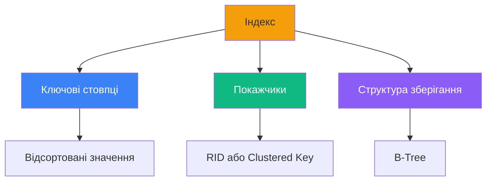
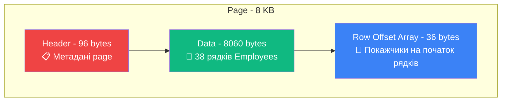
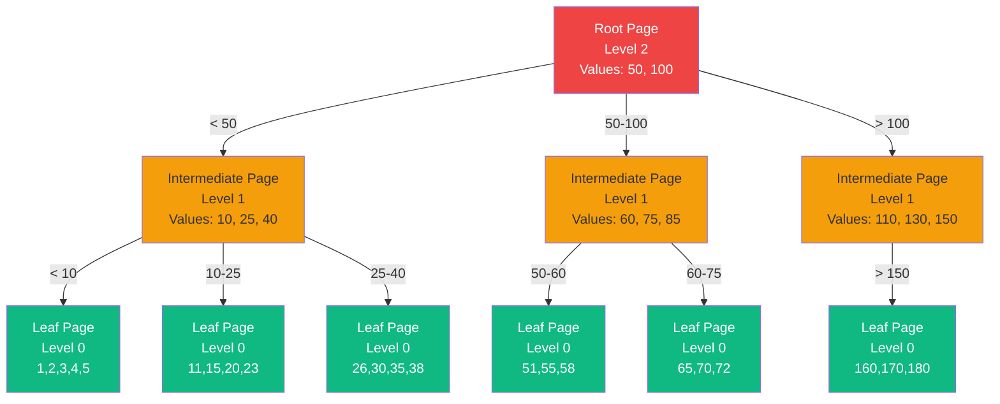
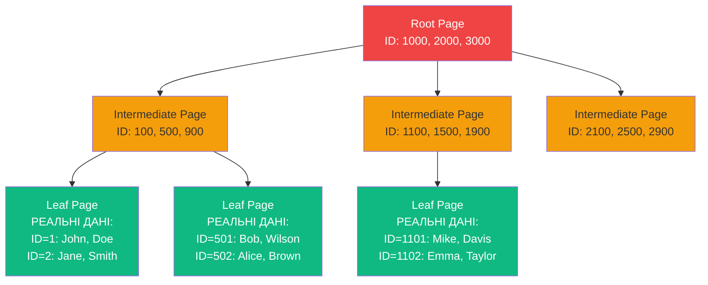
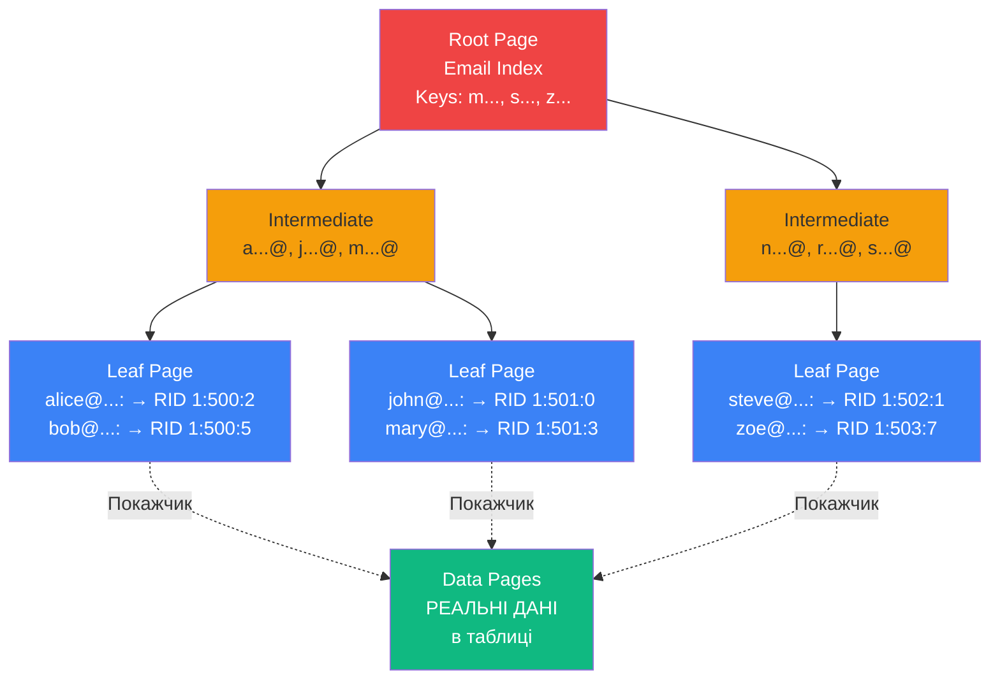
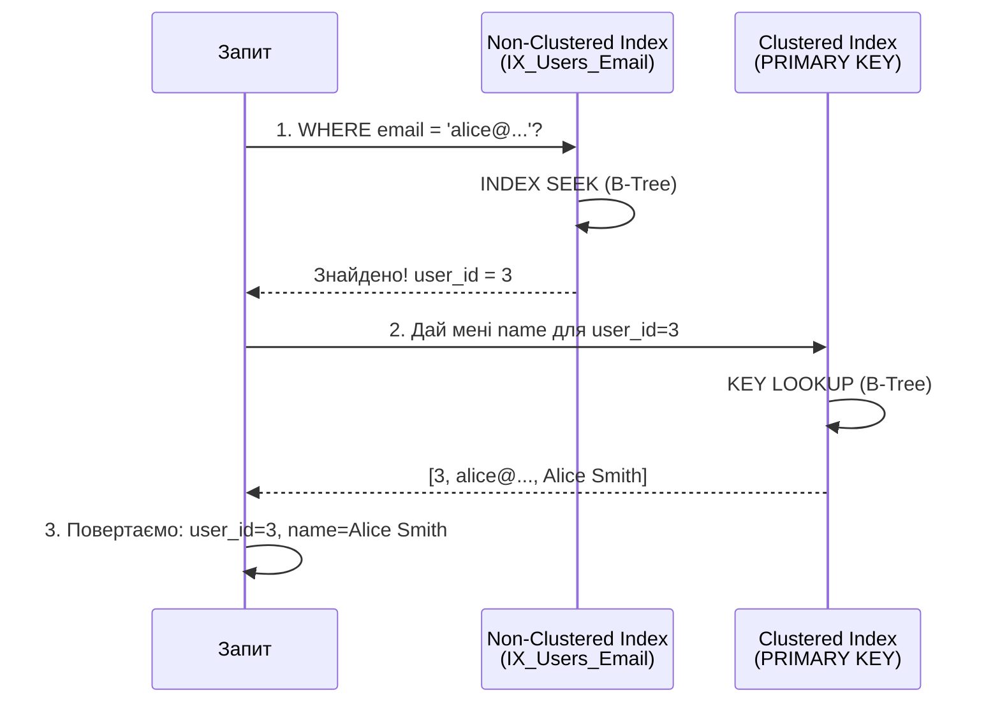
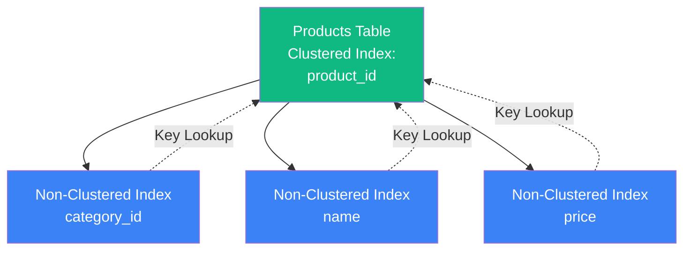
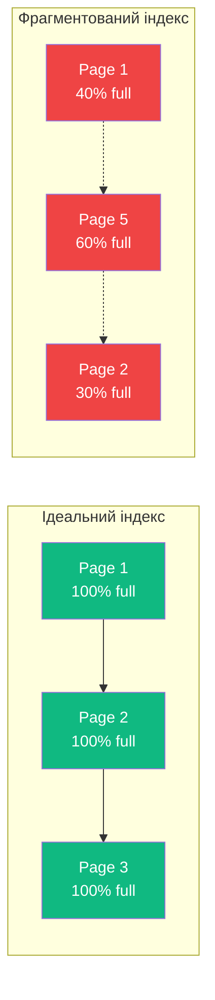

# Індекси у MS SQL Server

## Проблема: Повільні запити

Уявіть бібліотеку з **мільйоном книг**, розставлених у випадковому порядку. Вам потрібно знайти книгу "Кобзар" Тараса Шевченка. Скільки часу це займе?

**Без каталогу (індексу)**: Ви переглядаєте КОЖНУ книгу по черзі. У гіршому випадку — всі мільйон книг.  
**З каталогом (індексом)**: Ви шукаєте в алфавітному каталозі "Шевченко" → отримуєте номер полиці → знаходите книгу за хвилини.

Так само працюють індекси в базі даних!

### Демонстрація проблеми

```sql
-- Таблиця з 10 мільйонами користувачів БЕЗ індексу
CREATE TABLE Users (
    user_id INT PRIMARY KEY,
    email NVARCHAR(100),
    first_name NVARCHAR(50),
    last_name NVARCHAR(50),
    registration_date DATE
);

-- Пошук користувача за email
SELECT * FROM Users WHERE email = 'ivan@example.com';
-- ⏱️ Час виконання: ~15 секунд
-- 🔍 Метод: TABLE SCAN (перегляд ВСІХ 10 млн рядків)
```

**Що відбувається під капотом?**  
SQL Server **послідовно перевіряє КОЖЕН рядок** таблиці, поки не знайде потрібний email. Це називається **Table Scan** (повне сканування таблиці).

::warning
**Critical Performance Problem**: Table Scan на великих таблицях — це катастрофа для продуктивності!
::

Тепер додамо індекс:

```sql
-- Створюємо індекс на стовпець email
CREATE INDEX IX_Users_Email ON Users(email);

-- Той самий запит
SELECT * FROM Users WHERE email = 'ivan@example.com';
-- ⏱️ Час виконання: ~0.001 секунди (у тисячі разів швидше!)
-- 🔍 Метод: INDEX SEEK (використання індексу)
```

::tip
**Прискорення у 15,000 разів** — це не магія, це просто правильне використання індексів!
::

---

## Що таке індекс?

::note
**Індекс (Index)** — це додаткова структура даних, яка містить копію певних стовпців таблиці, відсортовану особливим чином для швидкого пошуку.
::

### Аналогія з книгою

| Елемент книги       | Елемент БД           | Пояснення                                           |
| :------------------ | :------------------- | :-------------------------------------------------- |
| Зміст               | Індекс               | Вказує, де знайти потрібну інформацію               |
| Номери сторінок     | Покажчики (Pointers) | Посилання на реальні дані                           |
| Сторінки з текстом  | Дані таблиці         | Реальна інформація                                  |
| Алфавітний покажчик | Non-Clustered Index  | Додаткова структура для пошуку за ключовими словами |

### Ключові компоненти індексу

::mermaid



::

---

## Внутрішня структура: Pages та Extents

### Навіщо розробнику знати про Pages?

**Питання**: "Чому SQL Server читає 8 KB даних, навіть якщо мені потрібен лише 1 рядок розміром 100 байт?"

**Відповідь**: Бо SQL Server читає дані **цілими сторінками (pages)**, а не окремими рядками!

::warning
**Це критично для продуктивності!** Розуміння pages пояснює:

- Чому широкі рядки сповільнюють запити
- Чому `SELECT *` погана практика
- Як індекси насправді працюють на диску
- Чому фрагментація — це проблема

::

---

### Що таке Page (Сторінка)?

::note
**Page** — це **атомарна одиниця вводу/виводу (I/O)** у SQL Server.  
Розмір: **8 KB (8192 байти)**.  
SQL Server **ЗАВЖДИ** читає та пише дані цілими pages, навіть для 1 рядка!
::

#### Візуалізація Page з реальними даними

Уявімо таблицю `Employees`:

```sql
CREATE TABLE Employees (
    employee_id INT,          -- 4 байти
    first_name NVARCHAR(50),  -- до 100 байт (Unicode)
    last_name NVARCHAR(50),   -- до 100 байт
    salary DECIMAL(10,2),     -- 5 байт
    hire_date DATE            -- 3 байти
);
-- Приблизно 212 байт на рядок
```

**Скільки рядків влізе в одну page?**

```
Page size = 8192 байти
- Header = 96 байт
- Row Offset Array = 36 байт
= 8060 байт для даних

Рядків на page: 8060 / 212 ≈ 38 рядків
```

::mermaid



::

#### Що зберігає Header (96 байт)?

```
┌──────────────────────────────────┐
│  PAGE HEADER (96 bytes)          │
├──────────────────────────────────┤
│ • Page Type (data/index)         │ ← Тип сторінки
│ • Object ID                      │ ← Якій таблиці належить
│ • Free Space (bytes)             │ ← Скільки вільного місця
│ • Previous Page ID               │ ← Подвійно зв'язаний список
│ • Next Page ID                   │ ← для швидкого сканування
│ • Slot Count                     │ ← Кількість рядків
└──────────────────────────────────┘
```

---

### Реальний приклад: Вплив на продуктивність

::tabs
::tabs-item{label="Проблема: SELECT \*"}

```sql
-- ❌ ПОГАНО: Читає всі 212 байт * 38 рядків = 8060 байт
SELECT * FROM Employees WHERE employee_id = 123;

-- SQL Server:
-- 1. Читає ПОВНУ page (8 KB) з диска
-- 2. Шукає потрібний рядок
-- 3. Повертає ВСІ стовпці (навіть ті, що не потрібні)

-- Час: ~15ms (включаючи I/O з диска)
```

::

::tabs-item{label="✅ Оптимізовано"}

```sql
-- ✅ ДОБРЕ: Читає лише потрібні стовпці
SELECT employee_id, first_name, last_name
FROM Employees
WHERE employee_id = 123;

-- SQL Server:
-- 1. Все одно читає повну page (8 KB) - це фізичне обмеження
-- 2. Але НЕ передає зайві дані через мережу
-- 3. Якщо є covering index - може взагалі не читати data page!

-- Час: ~5ms (якщо data page вже в пам'яті)
--       ~0.1ms (якщо використовує covering index)
```

::
::

::tip
**Чому covering index швидший?**  
Index page може містити **більше рядків**, бо зберігає лише ключові стовпці:

Data page: 38 рядків (212 байт кожен)  
Index page: ~200 рядків (40 байт кожен, лише email + ID)

**У 5 разів менше I/O операцій!**
::

---

### Що таке Extent (Екстент)?

::note
**Extent** — це **група з 8 сусідніх pages** = **64 KB**.  
SQL Server виділяє дисковий простір **екстентами**, а не окремими pages.
::

```
┌─────────────────────────────────────────────────┐
│  EXTENT = 64 KB                                 │
├──────┬──────┬──────┬──────┬──────┬──────┬──────┤
│ Page │ Page │ Page │ Page │ Page │ Page │ Page │
│  1   │  2   │  3   │  4   │  5   │  6   │  7   │
│ 8KB  │ 8KB  │ 8KB  │ 8KB  │ 8KB  │ 8KB  │ 8KB  │
└──────┴──────┴──────┴──────┴──────┴──────┴──────┘
```

#### Навіщо потрібні Extents?

**Швидше виділення пам'яті**: Замість виділяти 8 KB → 8 KB → 8 KB, SQL Server виділяє одразу 64 KB блоком.

---

### Mixed vs Uniform Extents: Практичний сценарій

::tabs
::tabs-item{label="Mixed Extent (малі таблиці)"}
**Коли**: Таблиця займає **менше 64 KB** (менше 8 pages).

```sql
-- Невелика таблиця настройок
CREATE TABLE AppSettings (
    setting_name NVARCHAR(50),
    setting_value NVARCHAR(200)
);

-- Вставлено 10 рядків ≈ 2 KB
INSERT INTO AppSettings VALUES ...;
```

**Що відбувається**:

```
┌─────────────── MIXED EXTENT ───────────────┐
│ Page 1: AppSettings (частина)             │
│ Page 2: UserSettings (інша таблиця)       │
│ Page 3: LogSettings (ще одна)             │
│ Page 4: AppSettings (продовження)         │
│ ...                                        │
└────────────────────────────────────────────┘
```

**Переваги**: Економія місця (багато малих таблиць не марнують простір).  
**Недоліки**: Фрагментація (потрібно читати pages з різних місць диска).
::

::tabs-item{label="Uniform Extent (великі таблиці)"}
**Коли**: Таблиця займає **більше 64 KB** (більше 8 pages).

```sql
-- Велика таблиця користувачів
CREATE TABLE Users (
    user_id INT PRIMARY KEY,
    email NVARCHAR(100),
    ...
);

-- Вставлено 1,000,000 рядків
```

**Що відбувається**:

```
┌─────────── UNIFORM EXTENT #1 ──────────────┐
│ Page 1: Users row 1-38                     │
│ Page 2: Users row 39-76                    │
│ Page 3: Users row 77-114                   │
│ ... ВСІ 8 pages лише для Users             │
└────────────────────────────────────────────┘

┌─────────── UNIFORM EXTENT #2 ──────────────┐
│ Page 9:  Users row 305-342                 │
│ Page 10: Users row 343-380                 │
│ ...                                        │
└────────────────────────────────────────────┘
```

**Переваги**: Швидке читання (сусідні pages на диску).  
**Недоліки**: Навіть для 65 KB даних виділиться повних 128 KB (2 extents).
::
::

---

### Практичний кейс: Чому широкі рядки — це погано?

**Проблема**: У вас є таблиця з великими стовпцями.

```sql
CREATE TABLE Products (
    product_id INT,
    name NVARCHAR(100),
    description NVARCHAR(MAX),  -- ⚠️ До 2 ГБ!
    specs NVARCHAR(MAX),        -- ⚠️ До 2 ГБ!
    price DECIMAL(10,2)
);
```

**Що відбувається**:

```
Рядок з NVARCHAR(MAX):
- Маленька description (500 байт) → зберігається IN-ROW (в page)
- Велика description (10 KB)      → зберігається OFF-ROW (окремо)

┌──────── DATA PAGE ────────┐    ┌─── LOB PAGES ────┐
│ product_id: 1             │    │ description:     │
│ name: "Laptop"            │───→│ (10 KB текст)    │
│ description: [pointer]    │    │                  │
│ price: 1299.99            │    └──────────────────┘
└───────────────────────────┘
```

**Проблеми**:

1. **Фрагментація**: Дані розкидані по різних pages
2. **Повільний пошук**: Потрібно читати data page + LOB pages
3. **Index не допоможе**: Covering index НЕ може включити NVARCHAR(MAX)

::warning
**Best Practice**: Винесіть великі стовпці в окрему таблицю!

```sql
-- ✅ Оптимізована структура
CREATE TABLE Products (
    product_id INT PRIMARY KEY,
    name NVARCHAR(100),
    price DECIMAL(10,2)
);

CREATE TABLE ProductDetails (
    product_id INT PRIMARY KEY,
    description NVARCHAR(MAX),
    specs NVARCHAR(MAX),
    FOREIGN KEY (product_id) REFERENCES Products(product_id)
);

-- Тепер швидкий запит НЕ читає LOB pages:
SELECT product_id, name, price
FROM Products
WHERE price > 1000;  -- ⚡ Швидко!
```

::

---

### Як перевірити використання Pages?

```sql
-- Скільки pages займає таблиця?
SELECT
    t.name AS TableName,
    p.rows AS RowCount,
    SUM(a.used_pages) AS UsedPages,
    SUM(a.used_pages) * 8 / 1024.0 AS UsedMB,
    SUM(a.used_pages) / 8.0 AS UsedExtents
FROM sys.tables t
INNER JOIN sys.partitions p ON t.object_id = p.object_id
INNER JOIN sys.allocation_units a ON p.partition_id = a.container_id
WHERE t.name = 'Users'
GROUP BY t.name, p.rows;
```

**Приклад результату**:

```
TableName  RowCount  UsedPages  UsedMB   UsedExtents
Users      1,000,000 26,316     205.28   3,289
```

**Розрахунок**:

- 1,000,000 рядків / 38 рядків на page ≈ 26,316 pages ✅
- 26,316 pages × 8 KB = 205 MB ✅
- 26,316 pages / 8 pages на extent ≈ 3,289 extents ✅

---

### Чому це важливо для розробника: Резюме

::tip
**5 практичних висновків**:

1. **SELECT \* — повільно**: Навіть якщо потрібен 1 стовпець, SQL Server читає всю page (8 KB)
2. **Широкі рядки — погано**: Менше рядків на page = більше I/O = повільніше
3. **Covering indexes — швидко**: Менші рядки в index pages = більше рядків = менше I/O
4. **Нормалізація допомагає**: NVARCHAR(MAX) у окремій таблиці = швидші основні запити
5. **Фрагментація = проблема**: Розкидані pages по диску = повільне читання

**Запам'ятайте**: SQL Server працює з pages (8 KB), не з рядками!
::

---

## B-Tree: Серце індексів

**B-Tree (Balanced Tree)** — це структура даних у вигляді **збалансованого дерева**, яка забезпечує швидкий пошук, вставку та видалення.

### Властивості B-Tree

1. **Збалансованість**: Всі листові вузли знаходяться на одній відстані від кореня
2. **Відсортованість**: Ключі в кожному вузлі відсортовані
3. **Logarithmic Search**: Пошук займає O(log N) часу

### Структура B-Tree в SQL Server

::mermaid



::

**Рівні дерева**:

- **Root Level (Level 2)**: Корінь дерева, точка входу
- **Intermediate Levels (Level 1)**: Проміжні вузли для навігації
- **Leaf Level (Level 0)**: Листові вузли з реальними даними або покажчиками

### Приклад пошуку: Знайти значення 72

```
Крок 1: Root Page
        → 72 > 50 AND 72 < 100
        → Іде middle child (L1B)

Крок 2: Intermediate Page (L1B)
        → 72 > 60 AND 72 < 75
        → Іде right child (Leaf5)

Крок 3: Leaf Page (Leaf5)
        → Знайдено: 72 ✅

Всього операцій читання: 3 pages (замість сканування всіх pages!)
```

::tip
**Глибина дерева**: Для **1 мільярда рядків** B-Tree має глибину лише **4-5 рівнів**!  
Це означає **максимум 5 операцій читання** для знаходження будь-якого рядка.
::

---

## Кластерний індекс (Clustered Index)

### Аналогія з реального життя: Енциклопедія

::note
**Уявіть енциклопедію** з 1000 статей:

- Статті **фізично впорядковані** за алфавітом (А → Я)
- Щоб знайти "Київ", відкриваєте розділ "К" — стаття **реально там**
- Не потрібен окремий покажчик — **сама книга вже впорядкована**
- Ви **НЕ можете** мати ту саму енциклопедію впорядковану і за алфавітом, і за датами одночасно

**Так само працює Clustered Index!**
::

### Що таке Clustered Index?

::note
**Clustered Index** — це спосіб **фізичного зберігання даних таблиці** у відсортованому порядку.  
Leaf level B-Tree містить **реальні рядки таблиці**, а не покажчики на них.
::

### Ключові особливості

1. **Один на таблицю**: Може бути лише ОДИН clustered index (дані можна фізично впорядкувати лише одним способом)
2. **Таблиця = Індекс**: Дані таблиці **І Є** clustered index (не окрема структура!)
3. **Фізичний порядок**: Рядки фізично зберігаються у порядку ключа індексу
4. **Автоматично створюється**: На PRIMARY KEY (якщо не вказано інакше)

### Структура Clustered Index

::mermaid



::

**Ключова відмінність**: Leaf pages містять **ВСІ стовпці таблиці** (ID, ім'я, прізвище, зарплата), а не лише ключ індексу!

---

### Практичний приклад: Таблиця працівників

::tabs
::tabs-item{label="HEAP (без індексу)"}

```sql
-- Таблиця без Clustered Index = HEAP (купа)
CREATE TABLE Employees (
    employee_id INT,
    first_name NVARCHAR(50),
    last_name NVARCHAR(50),
    salary DECIMAL(10,2)
);

INSERT INTO Employees VALUES
    (105, 'Alice', 'Brown', 75000),
    (12, 'Bob', 'Smith', 65000),
    (501, 'Charlie', 'Davis', 85000),
    (7, 'Diana', 'Wilson', 70000);
```

**Як зберігається на диску** (випадковий порядок):

```
Page 1: [ID=105: Alice Brown]  [ID=12: Bob Smith]
Page 2: [ID=501: Charlie Davis]  [ID=7: Diana Wilson]
```

**Пошук `WHERE employee_id = 501`**:

```
❌ TABLE SCAN: Сканує ВСІ pages послідовно
Page 1: ID=105? ❌  ID=12? ❌
Page 2: ID=501? ✅ ЗНАЙДЕНО!

Читання: 2 pages
```

::

::tabs-item{label="✅ З Clustered Index"}

```sql
-- Створення Clustered Index
CREATE CLUSTERED INDEX IX_Employees_ID
ON Employees(employee_id);

-- SQL Server РЕОРГАНІЗУЄ дані!
```

**Як тепер зберігається** (відсортовано за employee_id):

```
Page 1: [ID=7: Diana Wilson]  [ID=12: Bob Smith]
Page 2: [ID=105: Alice Brown]  [ID=501: Charlie Davis]
```

**Той самий пошук `WHERE employee_id = 501`**:

```
✅ INDEX SEEK: B-Tree навігація
Root: 501 > 100? → йде вправо
Leaf: Прямо знаходить Page 2, Slot 2

Читання: 2-3 pages (залежно від глибини дерева)
Швидкість: O(log N) замість O(N)
```

::
::

::warning
**КРИТИЧНО**: Після створення clustered index таблиця **більше не HEAP**.  
SQL Server **фізично переміщує всі рядки** на диску для впорядкування!  
Це може зайняти години для великих таблиць (> 100 млн рядків).
::

---

### Чому «кластерний»?

**Назва пояснює поведінку**: Рядки з близькими значеннями ключа **фізично згруповані (clustered) разом**.

```sql
-- Приклад: Замовлення за датами
CREATE CLUSTERED INDEX IX_Orders_Date ON Orders(order_date);

-- Дані на диску:
Page 1: [2024-01-01] [2024-01-01] [2024-01-02]  ← січневі разом
Page 2: [2024-01-15] [2024-01-16] [2024-01-20]
Page 3: [2024-02-01] [2024-02-02] [2024-02-05]  ← лютневі разом
```

**Range queries надшвидкі**:

```sql
SELECT * FROM Orders
WHERE order_date BETWEEN '2024-01-01' AND '2024-01-31';

-- SQL Server:
-- 1. Знаходить першу січневу page (B-Tree)
-- 2. Читає pages ПОСЛІДОВНО доки order_date <= '2024-01-31'
-- 3. Зупиняється на лютневій page

-- Результат: Читаємо лише релевантні pages! ⚡
```

### Heap vs Clustered Table

::tabs
::tabs-item{label="HEAP (без clustered index)"}
**Переваги**:

- Швидка вставка (INSERT) — додає в кінець
- Не потребує підтримки індексу

**Недоліки**:

- Повільний пошук (Table Scan)
- Фрагментація з часом

::

::tabs-item{label="Clustered Table"}
**Переваги**:

- Швидкий пошук за ключем (Index Seek)
- Range queries дуже швидкі
- Фізична впорядкованість

**Недоліки**:

- Вставка може бути повільнішою (потрібно підтримувати порядок)
- Можлива фрагментація при частих INSERT/UPDATE

::

::

---

## Некластерний індекс (Non-Clustered Index)

### Аналогія з реального життя: Бібліотечний каталог

::note
**Уявіть бібліотеку** з книгами:

- **Книги** впорядковані за інвентарним номером (Clustered Index)
- Але вам потрібна книга за автором "Шевченко"
- Ви йдете до **алфавітного каталогу** (картки з іменами авторів)
- Знаходите картку "Шевченко" → на ній написано **номер полиці: 5-B-12**
- З номером йдете до полиці і **беретє саму книгу**

**Картковий каталог = Non-Clustered Index!**  
Він не містить самих книг, лише **покажчики** (номери полиць).
::

### Що таке Non-Clustered Index?

::note
**Non-Clustered Index** — це **окрема структура даних**, яка містить:

1. Відсортовані значення індексованих стовпців (наприклад, email)
2. **Покажчики** на реальні рядки в таблиці (RID або Clustered Key)

Leaf level містить **НЕ самі дані**, а лише адреси, де їх знайти!
::

### Структура Non-Clustered Index

::mermaid



::

---

### Практичний приклад: Пошук за Email

::tabs
::tabs-item{label="Без Non-Clustered Index"}

```sql
CREATE TABLE Users (
    user_id INT PRIMARY KEY CLUSTERED,  -- Впорядковано за ID
    email NVARCHAR(100),
    name NVARCHAR(50)
);

-- Пошук за email
SELECT * FROM Users WHERE email = 'alice@example.com';
```

**Що робить SQL Server**:

```
❌ CLUSTERED INDEX SCAN (TABLE SCAN)
Сканує ВСІ рядки таблиці (впорядковані за user_id):
ID=1: john@...   ❌
ID=2: bob@...    ❌
ID=3: alice@...  ✅ ЗНАЙДЕНО!
ID=4: mary@...   (продовжує до кінця)

Читання: ВСІ pages таблиці
```

::

::tabs-item{label="✅ З Non-Clustered Index"}

```sql
-- Створення індексу на email
CREATE NONCLUSTERED INDEX IX_Users_Email ON Users(email);
```

**Структура індексу** (окрема B-Tree):

```
Leaf Level (відсортовано за email):
alice@example.com  → user_id: 3  ← покажчик!
bob@example.com    → user_id: 2
john@example.com   → user_id: 1
mary@example.com   → user_id: 4
```

**Той самий запит**:

```
✅ INDEX SEEK + KEY LOOKUP

Крок 1: INDEX SEEK в IX_Users_Email
  alice@example.com → user_id = 3 ✅ (швидко!)

Крок 2: KEY LOOKUP в Clustered Index
  user_id = 3 → [3, alice@..., Alice Smith] ✅

Читання: 2-3 pages (індекс) + 1 page (дані)
Швидкість: O(log N) замість O(N)
```

::
::

::tip
**Чому два кроки?**

Non-Clustered Index містить лише `email` + `user_id`.  
Але запит хоче `SELECT *` (всі стовпці: email, name).  
`name` немає в індексі → потрібен **Key Lookup** до таблиці.

**Рішення**: Covering Index! (див. нижче)
::

---

### RID vs Clustered Key: Що зберігає покажчик?

::tabs
::tabs-item{label="HEAP таблиця → RID"}

```sql
-- Таблиця БЕЗ Clustered Index
CREATE TABLE Products (
    product_id INT,
    name NVARCHAR(100)
);

CREATE NONCLUSTERED INDEX IX_Products_Name ON Products(name);
```

**Leaf level індексу містить RID** (Row Identifier):

```
┌────────────────────────────────┐
│ IX_Products_Name (Non-Clust)  │
├────────────────────────────────┤
│ name            RID            │
│ "Laptop"     → 1:500:2         │  FileID:PageID:SlotID
│ "Mouse"      → 1:500:5         │
│ "Keyboard"   → 1:501:0         │
└────────────────────────────────┘
```

**RID = Фізична адреса**:

```
RID = 1 : 500 : 2
      ↓   ↓     ↓
  File  Page  Slot (позиція на page)
```

::

::tabs-item{label="Clustered таблиця → Clustered Key"}

```sql
-- Таблиця З Clustered Index
CREATE TABLE Products (
    product_id INT PRIMARY KEY CLUSTERED,
    name NVARCHAR(100)
);

CREATE NONCLUSTERED INDEX IX_Products_Name ON Products(name);
```

**Leaf level індексу містить Clustered Key**:

```
┌────────────────────────────────┐
│ IX_Products_Name (Non-Clust)  │
├────────────────────────────────┤
│ name            product_id     │  ← Clustered Key!
│ "Laptop"     → 101             │
│ "Mouse"      → 205             │
│ "Keyboard"   → 89              │
└────────────────────────────────┘
```

**Процес Key Lookup**:

```
1. Non-Clustered Index: name="Laptop" → product_id=101
2. Clustered Index B-Tree: шукаємо product_id=101
3. Знаходимо повний рядок: [101, "Laptop", 1299.99, ...]
```

::
::

::warning
**Чому Clustered Key краще за RID?**

- **RID**: Фізична адреса може змінитися (page split, reorganize)
- **Clustered Key**: Логічний ключ, завжди стабільний

**Але**: Clustered Key займає більше місця в індексі!  
Якщо Clustered Index на UNIQUEIDENTIFIER (16 байт) → всі Non-Clustered індекси «роздуваються».
::

---

### Візуалізація: Один запит, два індекси

```sql
SELECT user_id, name FROM Users WHERE email = 'alice@example.com';
```

::mermaid



::

::caution
**Key Lookup = Performance Hit!**

Для **кожного рядка** результату потрібен окремий Key Lookup.  
Якщо запит повертає 10,000 рядків → 10,000 Key Lookups! 😱

**Рішення**: Covering Index (включити `name` в індекс через `INCLUDE`).
::

---

## Множинні індекси на одній таблиці

```sql
CREATE TABLE Products (
    product_id INT PRIMARY KEY CLUSTERED,         -- Clustered Index #1
    category_id INT,
    name NVARCHAR(200),
    price DECIMAL(10,2),
    stock_quantity INT
);

-- Non-Clustered Indexes
CREATE NONCLUSTERED INDEX IX_Products_Category
    ON Products(category_id);                     -- Index #2

CREATE NONCLUSTERED INDEX IX_Products_Name
    ON Products(name);                            -- Index #3

CREATE NONCLUSTERED INDEX IX_Products_Price
    ON Products(price);                           -- Index #4
```

**Візуалізація**:

::mermaid



::

---

## Composite Indexes (Складені індекси)

**Composite Index** — це індекс на **декілька стовпців** одночасно.

```sql
CREATE INDEX IX_Users_LastName_FirstName
ON Users(last_name, first_name);
```

### Порядок стовпців має значення!

::tabs
::tabs-item{label="last_name, first_name"}

```sql
-- ✅ Використає індекс
SELECT * FROM Users
WHERE last_name = 'Smith';

-- ✅ Використає індекс
SELECT * FROM Users
WHERE last_name = 'Smith' AND first_name = 'John';

-- ❌ НЕ використає індекс (first_name не перший!)
SELECT * FROM Users
WHERE first_name = 'John';
```

::

::tabs-item{label="first_name, last_name"}

```sql
-- ✅ Використає індекс
SELECT * FROM Users
WHERE first_name = 'John';

-- ✅ Використає індекс
SELECT * FROM Users
WHERE first_name = 'John' AND last_name = 'Smith';

-- ❌ НЕ використає індекс
SELECT * FROM Users
WHERE last_name = 'Smith';
```

::
::

**Правило лівої руки** (Leftmost Prefix Rule):  
Індекс можна використати, якщо запит фільтрує за **першим стовпцем** в індексі (або першим + другим, або всіма).

---

## Covering Index (Включений індекс)

**Проблема**: Key Lookup повільний, бо потрібно 2 операції (non-clustered index → clustered index).

**Рішення**: Включити додаткові стовпці в індекс через `INCLUDE`.

```sql
-- Запит, який часто виконується
SELECT email, first_name, last_name
FROM Users
WHERE email = 'ivan@example.com';

-- ❌ Без INCLUDE
CREATE INDEX IX_Users_Email ON Users(email);
-- Процес: Index Seek (email) → Key Lookup (first_name, last_name) 💥 ПОВІЛЬНО
```

```sql
-- ✅ З INCLUDE (Covering Index)
CREATE INDEX IX_Users_Email_Covering
ON Users(email)
INCLUDE (first_name, last_name);

-- Процес: Index Seek (email) → ВСІ ДАНІ в індексі! ⚡ ШВИДКО
-- Не потрібен Key Lookup!
```

::tip
**Covering Index**: Індекс містить **ВСІ** стовпці, які потрібні запиту. Query Optimizer може отримати результат **лише з індексу**, не звертаючись до таблиці.
::

---

## Unique Index

**Unique Index** гарантує унікальність значень у стовпці.

```sql
CREATE UNIQUE INDEX IX_Users_Email_Unique
ON Users(email);

-- Тепер неможливо вставити дублікат
INSERT INTO Users (email) VALUES ('test@example.com');  -- ✅ OK
INSERT INTO Users (email) VALUES ('test@example.com');  -- ❌ ERROR!
```

::note
**PRIMARY KEY автоматично створює UNIQUE CLUSTERED INDEX**.  
**UNIQUE constraint автоматично створює UNIQUE INDEX**.
::

---

## Filtered Index

**Filtered Index** — це індекс з `WHERE` умовою, який індексує лише **частину рядків**.

```sql
-- Проблема: тільки 1% замовлень активні, але ми часто їх шукаємо
CREATE TABLE Orders (
    order_id INT PRIMARY KEY,
    customer_id INT,
    status NVARCHAR(20),  -- 'Active', 'Completed', 'Cancelled'
    order_date DATE
);

-- ❌ Звичайний індекс (індексує ВСІ 10 млн рядків)
CREATE INDEX IX_Orders_Status ON Orders(status);
```

```sql
-- ✅ Filtered Index (індексує лише активні ~ 100K рядків)
CREATE INDEX IX_Orders_Active
ON Orders(customer_id, order_date)
WHERE status = 'Active';

-- Виграш: менший розмір індексу, швидше обслуговування
```

::tip
**Коли використовувати Filtered Index**:

- Коли потрібна підмножина рядків (напр., `is_deleted = 0`)
- Для часткових даних (напр., `created_date >= '2024-01-01'`)
- Економія місця та швидше обслуговування

::

---

## Index Fragmentation (Фрагментація)

### Що таке фрагментація?

З часом, через INSERT/UPDATE/DELETE, сторінки індексу стають **неоптимально заповненими** або **розкиданими** по диску.

::mermaid



::

**Проблеми**:

- Більше операцій читання (потрібно більше pages)
- Повільніші range queries
- Марнування дискового простору

### Перевірка фрагментації

```sql
SELECT
    OBJECT_NAME(ips.object_id) AS TableName,
    i.name AS IndexName,
    ips.avg_fragmentation_in_percent,
    ips.page_count
FROM sys.dm_db_index_physical_stats(
    DB_ID(), NULL, NULL, NULL, 'DETAILED'
) AS ips
INNER JOIN sys.indexes AS i
    ON ips.object_id = i.object_id
    AND ips.index_id = i.index_id
WHERE ips.avg_fragmentation_in_percent > 10  -- Більше 10% фрагментації
ORDER BY ips.avg_fragmentation_in_percent DESC;
```

### Виправлення фрагментації

::tabs
::tabs-item{label="REORGANIZE (5-30%)"}

```sql
-- Дефрагментація online (не блокує таблицю)
ALTER INDEX IX_Users_Email ON Users REORGANIZE;
```

**Коли**: Фрагментація 5-30%  
**Переваги**: Online, не блокує  
**Недоліки**: Повільніше, не завжди ефективно
::

::tabs-item{label="REBUILD (>30%)"}

```sql
-- Повна перебудова індексу
ALTER INDEX IX_Users_Email ON Users REBUILD;
```

**Коли**: Фрагментація >30%  
**Переваги**: Повні оптимізація, оновлює статистику  
**Недоліки**: Блокує таблицю (якщо не ONLINE)
::

::tabs-item{label="REBUILD ONLINE"}

```sql
-- Перебудова без блокування (Enterprise Edition)
ALTER INDEX IX_Users_Email ON Users
REBUILD WITH (ONLINE = ON);
```

**Enterprise Edition only**  
Дозволяє перебудову без блокування таблиці
::
::

---

## Best Practices: Коли створювати індекси

### ✅ Створюйте індекси на:

1. **Primary Keys** (автоматично)
2. **Foreign Keys** (для JOIN queries)
3. **WHERE clauses** (часті фільтри)
4. **ORDER BY** (сортування)
5. **GROUP BY** (агрегація)

### ❌ НЕ створюйте індекси на:

1. **Малі таблиці** (<1000 рядків) — table scan швидше
2. **Стовпці з малою селективністю** (напр., `gender` з 2 значеннями)
3. **Часті UPDATE/INSERT таблиці** — індекси уповільнюють зміни
4. **Широкі стовпці** (`NVARCHAR(MAX)`, `XML`) — індекс буде величезним

### Приклад: Аналіз запиту

```sql
-- Часто виконуваний запит
SELECT product_id, name, price
FROM Products
WHERE category_id = 5
  AND price > 100
ORDER BY price DESC;

-- ✅ Оптимальний індекс
CREATE INDEX IX_Products_Category_Price
ON Products(category_id, price DESC)
INCLUDE (name);
```

**Чому саме такий індекс?**

- `category_id` — перший, бо фільтруємо за ним (`WHERE`)
- `price DESC` — другий, бо сортуємо (`ORDER BY DESC`)
- `INCLUDE (name)` — covering index (не потрібен key lookup)

---

## Практичні завдання

### Завдання 1: Оптимізація повільного запиту

```sql
-- Таблиця
CREATE TABLE Orders (
    order_id INT PRIMARY KEY,
    customer_id INT,
    order_date DATE,
    total_amount DECIMAL(10,2),
    status NVARCHAR(20)
);

-- Повільний запит (10 секунд на 10 млн рядків)
SELECT order_id, customer_id, total_amount
FROM Orders
WHERE customer_id = 12345
  AND order_date >= '2024-01-01'
  AND status = 'Completed';
```

**Завдання**: Створіть оптимальний індекс для цього запиту.

<details>
<summary>💡 Розв'язок</summary>

```sql
CREATE INDEX IX_Orders_Customer_Date_Status
ON Orders(customer_id, order_date, status)
INCLUDE (total_amount);
```

**Пояснення**:

- `customer_id` — перший (найселективніший фільтр)
- `order_date` — другий (range filter)
- `status` — третій (equality filter)
- `INCLUDE (total_amount)` — covering index
      </details>

### Завдання 2: Фрагментація

Перевірте фрагментацію індексів вашої бази даних та виконайте reorganize/rebuild де потрібно.

---

## Перевірка знань

::tally-embed{id="mLQBJY" title="Тест: Індекси MS SQL Server"}
::

::note
**Примітка**: Якщо тест не відображається, перейдіть за [прямим посиланням](https://tally.so/r/mLQBJY).
::

---

## Резюме

::tip
**Ключові висновки**:

1. **Індекси == Швидкість**: Правильні індекси можуть прискорити запити в тисячі разів
2. **B-Tree структура**: Забезпечує O(log N) пошук
3. **Clustered Index**: Один на таблицю, містить реальні дані
4. **Non-Clustered Index**: Множинні, містять покажчики
5. **Composite Indexes**: Порядок стовпців критичний
6. **Covering Index**: Включає всі потрібні стовпці (INCLUDE)
7. **Фрагментація**: Регулярне обслуговування індексів необхідне

::

**Наступна тема**: [Системні бази даних MS SQL Server](./04.system-databases.md)
