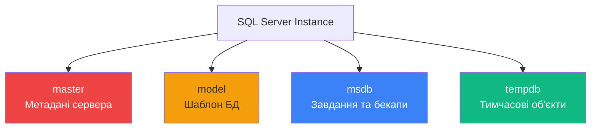
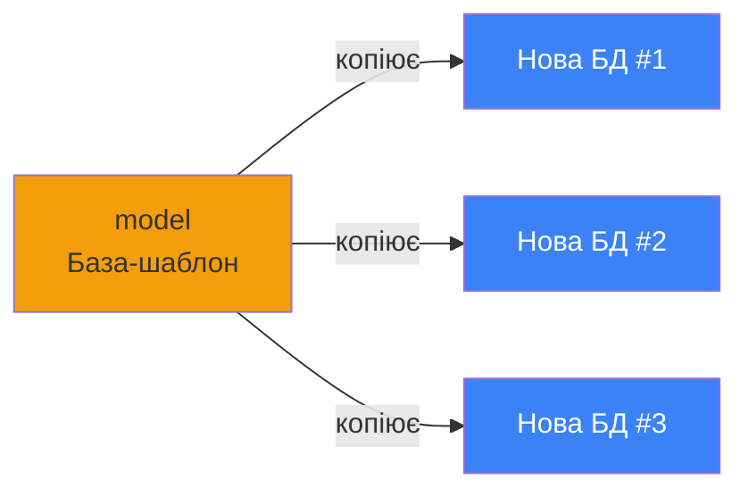

# Системні бази даних MS SQL Server

## Навіщо потрібні системні бази даних?

Коли ви встановлюєте SQL Server, автоматично створюються **4 спеціальні бази даних**, які забезпечують коректну роботу всього сервера. Без них SQL Server просто не запуститься!

::note
**Системні бази даних (System Databases)** — це службові БД, які зберігають метадані, конфігурацію та тимчасові об'єкти. Вони є "операційною системою" для SQL Server.
::

---

##Огляд системних баз даних

### Список системних БД

У папці **System Databases** в Object Explorer ви знайдете:

::mermaid



::

---

## 1. Master — "Мозок" SQL Server

::note
**master** — найважливіша системна база даних, яка містить **всю інформацію про сервер** та всі інші бази даних.
::

### Що зберігає master?

| Категорія                | Що містить                  | Приклад                                  |
| :----------------------- | :-------------------------- | :--------------------------------------- |
| **Конфігурація сервера** | Налаштування SQL Server     | Collation, memory limits, network config |
| **Логіни**               | Усі облікові записи сервера | `sa`, `DOMAIN\User`                      |
| **Бази даних**           | Метадані всіх БД            | Назви, шляхи до файлів, статус           |
| **Системні процедури**   | Вбудовані stored procedures | `sp_configure`, `sp_who`                 |

### Практичний приклад

```sql
-- Отримати список всіх баз даних на сервері
SELECT name, database_id, create_date, state_desc
FROM master.sys.databases;
```

**Результат**:

```
name         database_id  create_date              state_desc
------------ ------------ ----------------------- ----------
master       1            2003-04-08 09:13:36     ONLINE
tempdb       2            2024-02-06 08:00:00     ONLINE
model        3            2003-04-08 09:13:36     ONLINE
msdb         4            2005-10-14 17:21:38     ONLINE
University   5            2024-02-06 10:30:00     ONLINE
```

### Критична важливість

::warning
**БЕЗ master SQL Server НЕ ЗАПУСТИТЬСЯ!**

Якщо база master пошкоджена або видалена:

- SQL Server не стартує
- Втрачено всі метадані про інші БД
- Потрібне відновлення з бекапу або повне переінсталювання

::

**Best Practice**: Регулярно робіть бекап master!

```sql
BACKUP DATABASE master
TO DISK = 'C:\Backups\master_backup.bak'
WITH FORMAT, INIT;
```

---

## 2. Model — Шаблон для нових БД

::note
**model** — база даних-шаблон, яка використовується як **зразок** при створенні будь-якої нової БД.
::

### Як працює model?

Коли ви виконуєте `CREATE DATABASE`, SQL Server:

1. **Копіює структуру model** → нова БД
2. **Застосовує налаштування model** → до нової БД

::mermaid



::

### Практичне використання

**Сценарій**: Всі ваші БД повинні мати таблицю `AuditLog`.

```sql
-- Створюємо таблицю в model
USE model;
GO

CREATE TABLE AuditLog (
    log_id INT IDENTITY(1,1) PRIMARY KEY,
    event_type NVARCHAR(50),
    event_time DATETIME2 DEFAULT SYSDATETIME(),
    username NVARCHAR(100)
);
GO
```

Тепер **кожна нова БД** автоматично матиме цю таблицю!

```sql
-- Створюємо нову БД
CREATE DATABASE TestDB;
GO

-- Перевіряємо
USE TestDB;
SELECT * FROM AuditLog;  -- ✅ Таблиця вже існує!
```

::tip
**Корпоративний стандарт**: Використовуйте model для:

- Стандартних таблиць (audit, logging)
- Типових stored procedures
- Налаштувань за замовчуванням (recovery model, compatibility level)

::

---

## 3. MSDB — Автоматизація та обслуговування

::note
**msdb** — база даних для зберігання інформації про **завдання**, **бекапи**, **повідомлення** та **реплікацію**.
::

### Що зберігає msdb?

| Компонент                 | Призначення              | Таблиці                                     |
| :------------------------ | :----------------------- | :------------------------------------------ |
| **SQL Server Agent Jobs** | Розклад завдань          | `sysjobs`, `sysjobsteps`, `sysjobhistory`   |
| **Backups**               | Історія бекапів          | `backupset`, `backupfile`, `restorehistory` |
| **Alerts**                | Сповіщення про події     | `sysalerts`                                 |
| **Operators**             | Контакти для повідомлень | `sysoperators`                              |
| **Database Mail**         | Email з SQL Server       | `sysmail_mailitems`                         |

### Приклад: Історія бекапів

```sql
-- Отримати історію всіх бекапів за останній місяць
SELECT
    database_name,
    backup_start_date,
    backup_finish_date,
    CASE type
        WHEN 'D' THEN 'Full'
        WHEN 'I' THEN 'Differential'
        WHEN 'L' THEN 'Log'
    END AS backup_type,
    backup_size / 1024 / 1024 AS size_mb,
    physical_device_name
FROM msdb.dbo.backupset bs
INNER JOIN msdb.dbo.backupmediafamily bmf
    ON bs.media_set_id = bmf.media_set_id
WHERE backup_start_date >= DATEADD(MONTH, -1, GETDATE())
ORDER BY backup_start_date DESC;
```

### SQL Server Agent Jobs

**Приклад**: Автоматичний бекап щоночі о 2:00

```sql
USE msdb;
GO

-- Створення завдання
EXEC sp_add_job
    @job_name = 'Nightly Backup',
    @enabled = 1;

-- Додавання кроку
EXEC sp_add_jobstep
    @job_name = 'Nightly Backup',
    @step_name = 'Backup University DB',
    @subsystem = 'TSQL',
    @command = N'
        BACKUP DATABASE University
        TO DISK = N''C:\Backups\University_backup.bak''
        WITH INIT, COMPRESSION;
    ';

-- Розклад: щодня о 02:00
EXEC sp_add_schedule
    @schedule_name = 'Daily at 2 AM',
    @freq_type = 4,  -- Daily
    @active_start_time = 020000;  -- 02:00:00

-- Прив'язка розкладу до завдання
EXEC sp_attach_schedule
    @job_name = 'Nightly Backup',
    @schedule_name = 'Daily at 2 AM';

-- Прив'язка завдання до сервера
EXEC sp_add_jobserver
    @job_name = 'Nightly Backup';
```

---

## 4. TempDB — Тимчасові об'єкти

::note
**tempdb** — база даних для зберігання **тимчасових таблиць**, **змінних table**, **результатів сортування** та інших проміжних даних.
::

### Особливості tempdb

1. **Пересоздається при кожному перезапуску** SQL Server
2. **Спільна для ВСІХ користувачів** та всіх БД
3. **Автоматично очищується**

::warning
**КРИТИЧНО**: tempdb — це вузьке місце продуктивності! Правильна конфігурація важлива.
::

### Що зберігається в tempdb?

::tabs
::tabs-item{label="Тимчасові таблиці"}

```sql
-- Локальна тимчасова таблиця (#)
CREATE TABLE #TempProducts (
    product_id INT,
    name NVARCHAR(100)
);
-- Видаляється автоматично при закритті сесії

-- Глобальна тимчасова таблиця (##)
CREATE TABLE ##GlobalTemp (
    data NVARCHAR(50)
);
-- Доступна всім сесіям, видаляється при закритті останньої сесії
```

::

::tabs-item{label="Змінні TABLE"}

```sql
DECLARE @ProductsTable TABLE (
    product_id INT,
    name NVARCHAR(100)
);

INSERT INTO @ProductsTable VALUES (1, 'Laptop');
-- Видаляється після завершення batch
```

::

::tabs-item{label="Внутрішні операції"}

- **Сортування великих наборів** (`ORDER BY` без індексів)
- **Хеш-таблиці** для JOIN
- **Spool операції**
- **Версії рядків** (snapshot isolation)

::

::

### Оптимізація tempdb

::code-group

```sql [Перевірка використання]
-- Використання tempdb по об'єктах
SELECT
    OBJECT_NAME(object_id) AS object_name,
    SUM(user_object_reserved_page_count) * 8 / 1024 AS user_objects_mb,
    SUM(internal_object_reserved_page_count) * 8 / 1024 AS internal_objects_mb
FROM tempdb.sys.dm_db_session_space_usage
GROUP BY object_id
ORDER BY user_objects_mb DESC;
```

```sql [Best Practices]
-- 1. Множинні файли (= кількість CPU cores)
-- Зменшує конфліктність PFS/GAM pages

-- 2. Однаковий розмір файлів
-- Забезпечує пропорційне заповнення

-- 3. Pre-size tempdb
ALTER DATABASE tempdb
MODIFY FILE (NAME = tempdev, SIZE = 8192MB);

-- 4. Розміщення на швидкому диску (SSD)
```

::

---

## Системні таблиці

Кожна системна БД містить спеціальні таблиці з метаданими.

### Важливі системні таблиці в msdb

```sql
-- Таблиці бекапів
USE msdb;
GO

SELECT TABLE_NAME
FROM INFORMATION_SCHEMA.TABLES
WHERE TABLE_NAME LIKE '%backup%'
ORDER BY TABLE_NAME;
```

**Результат**:

- `backupfile` — файли бекапів
- `backupfilegroup` — filegroups в бекапах
- `backupmediafamily` — медіа-сім'ї бекапів
- `backupmediaset` — медіа-набори
- `backupset` — основна інформація про бекапи
- `restorefile` — відновлені файли
- `restorefilegroup` — відновлені filegroups
- `restorehistory` — історія відновлень

### Системні views (sys.\*)

SQL Server надає спеціальні **system views** для отримання метаданих:

```sql
-- Всі таблиці в поточній БД
SELECT name, object_id, create_date
FROM sys.tables
ORDER BY name;

-- Всі стовпці таблиці
SELECT
    c.name AS column_name,
    t.name AS data_type,
    c.max_length,
    c.is_nullable
FROM sys.columns c
INNER JOIN sys.types t ON c.user_type_id = t.user_type_id
WHERE object_id = OBJECT_ID('Students')
ORDER BY c.column_id;

-- Всі індекси
SELECT
    OBJECT_NAME(object_id) AS table_name,
    name AS index_name,
    type_desc,
    is_unique,
    is_primary_key
FROM sys.indexes
WHERE object_id = OBJECT_ID('Students');
```

---

## DMVs (Dynamic Management Views)

**DMV** — це спеціальні views, які показують **поточний стан** SQL Server.

### Популярні DMVs

::code-group

```sql [Активні запити]
-- Що зараз виконується на сервері?
SELECT
    session_id,
    status,
    command,
    cpu_time,
    total_elapsed_time,
    reads,
    writes,
    TEXT
FROM sys.dm_exec_requests
CROSS APPLY sys.dm_exec_sql_text(sql_handle);
```

```sql [Статистика очікувань]
-- На що чекає SQL Server?
SELECT
    wait_type,
    waiting_tasks_count,
    wait_time_ms / 1000.0 AS wait_time_sec,
    max_wait_time_ms / 1000.0 AS max_wait_sec
FROM sys.dm_os_wait_stats
WHERE wait_time_ms > 0
ORDER BY wait_time_ms DESC;
```

```sql [Кеш запитів]
-- Найповільніші запити
SELECT TOP 10
    creation_time,
    last_execution_time,
    execution_count,
    total_worker_time / execution_count AS avg_cpu_time,
    TEXT
FROM sys.dm_exec_query_stats
CROSS APPLY sys.dm_exec_sql_text(sql_handle)
ORDER BY total_worker_time DESC;
```

::

---

## Best Practices для системних БД

::tip
**Золоті правила**:

1. **.НІКОЛИ не видаляйте системні БД**
2. **НЕ створюйте користувацькі об'єкти** в master, model, msdb
3. **Регулярно робіть бекапи**:
    - `master` — після кожної зміни конфігурації
    - `msdb` — щотижня (завдання, історія бекапів)
    - `model` — після змін шаблону
4. **Моніторте tempdb** — часто стає вузьким місцем
5. **Налаштуйте автоочистку історії** в msdb

::

### Автоочистка історії бекапів

```sql
-- Очистити історію старше 30 днів
EXEC msdb.dbo.sp_delete_backuphistory
    @oldest_date = DATEADD(DAY, -30, GETDATE());

-- Очистити історію завдань старше 90 днів
EXEC msdb.dbo.sp_purge_jobhistory
    @oldest_date = DATEADD(DAY, -90, GETDATE());
```

---

## Практичне завдання

### Завдання 1: Моніторинг бекапів

Створіть запит, який показує:

- Які БД не мали full backup останні 7 днів
- Коли був останній бекап для кожної БД

<details>
<summary>💡 Розв'язок</summary>

```sql
SELECT
    d.name AS database_name,
    MAX(bs.backup_finish_date) AS last_backup,
    DATEDIFF(DAY, MAX(bs.backup_finish_date), GETDATE()) AS days_since_backup
FROM master.sys.databases d
LEFT JOIN msdb.dbo.backupset bs
    ON d.name = bs.database_name
    AND bs.type = 'D'  -- Full backup
WHERE d.database_id > 4  -- Exclude system databases
GROUP BY d.name
HAVING MAX(bs.backup_finish_date) < DATEADD(DAY, -7, GETDATE())
    OR MAX(bs.backup_finish_date) IS NULL
ORDER BY days_since_backup DESC;
```

</details>

### Завдання 2: Використання tempdb

Знайдіть топ-5 сесій, які найбільше використовують tempdb.

<details>
<summary>💡 Розв'язок</summary>

```sql
SELECT TOP 5
    session_id,
    DB_NAME(database_id) AS database_name,
    user_objects_alloc_page_count * 8 / 1024 AS user_objects_mb,
    internal_objects_alloc_page_count * 8 / 1024 AS internal_objects_mb,
    (user_objects_alloc_page_count + internal_objects_alloc_page_count) * 8 / 1024 AS total_mb
FROM tempdb.sys.dm_db_session_space_usage
WHERE session_id > 50  -- Exclude system sessions
ORDER BY total_mb DESC;
```

</details>

---

## Резюме

::tip
**Ключові висновки**:

1. **master** — метадані сервера, КРИТИЧНО для роботи
2. **model** — шаблон для нових БД, використовуйте для стандартизації
3. **msdb** — завдання, бекапи, сповіщення
4. **tempdb** — тимчасові об'єкти, потребує оптимізації
5. **Системні таблиці та DMVs** — джерело інформації про стан сервера

::

**Наступна тема**: [Огляд мови SQL та запитів](./05.sql-queries-overview.md)
