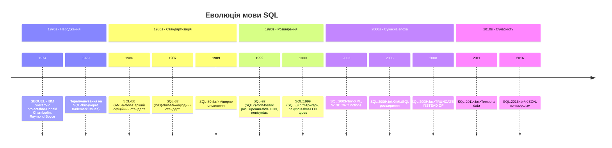
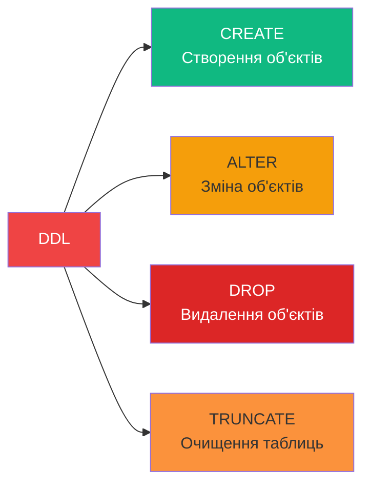
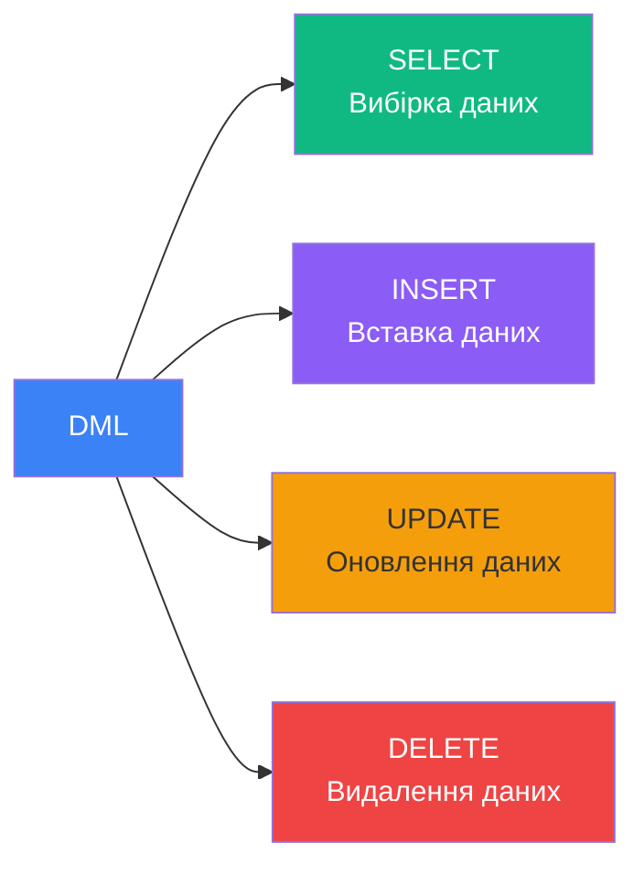
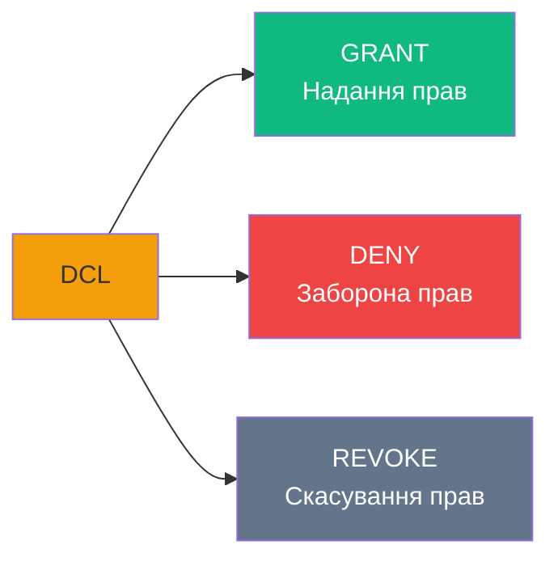

# Огляд мови SQL та запитів

## Навіщо нам потрібна спеціалізована мова?

Уявіть, що ви в бібліотеці і хочете знайти книгу. Ви могли б:

1. **Написати програму на C#/Java**, яка:
    - Відкриє файл з каталогом
    - Прочитає кожен рядок
    - Порівняє з назвою книги
    - Поверне результат

2. **Або просто сказати бібліотекарю**: "Дайте мені Кобзар Шевченка"

SQL — це і є та "мова спілкування з бібліотекарем" (базою даних). Ви кажете **ЩО** потрібно, а не **ЯК** це отримати.

::note
**SQL (Structured Query Language)** — це **декларативна мова** для роботи з реляційними базами даних. Ви описуєте результат, який хочете отримати, а СУБД сама вирішує, як його отримати оптимально.
::

---

## Імперативна vs Декларативна парадигма

::tabs
::tabs-item{label="Імперативна (C#, Java)"}

```csharp
// Ви ВКА "ЯК" отримати дані
List<Student> result = new List<Student>();

foreach (var student in students)
{
    if (student.Age > 18 && student.Grade >= 90)
    {
        result.Add(student);
    }
}

return result.OrderBy(s => s.LastName).ToList();
```

**Ви контролюєте**:

- Як перебирати дані (foreach)
- Як фільтрувати (if)
- Як сортувати (OrderBy)

::

::tabs-item{label="Декларативна (SQL)"}

```sql
-- Ви вказуєте "ЩО" потрібно
SELECT *
FROM Students
WHERE Age > 18 AND Grade >= 90
ORDER BY LastName;
```

**СУБД вирішує**:

- Використати індекси чи ні
- У якому порядку фільтрувати
- Який алгоритм сортування

::

::

::tip
**Перевага декларативності**: SQL Server має **query optimizer**, який автоматично обирає найоптимальніший план виконання запиту. У імперативній мові ви повинні самі це робити!
::

---

## Історія SQL: Від SEQUEL до SQL:2016

### Часова лінія розвитку

::mermaid



::

### Ключові віхи

**SQL-86 (1986)** — Перший стандарт:

- SELECT, INSERT, UPDATE, DELETE
- CREATE TABLE, DROP TABLE
- Базовий WHERE, GROUP BY

**SQL-92 (1992)** — Найважливіша версія:

- JOIN syntax (INNER, LEFT, RIGHT, FULL)
- Subqueries
- UNION
- Стала основою для більшості СУБД

**SQL:1999 (1999)** — Об'єктно-орієнтовані features:

- Triggers
- Recursive queries (WITH)
- BOOLEAN type

**SQL:2003 (2003)** — XML та аналітика:

- XML data type
- WINDOW functions (ROW_NUMBER, RANK)
- MERGE statement

**SQL:2016 (2016)** — JSON та Big Data:

- JSON support
- Pattern matching
- Полі­морфні table functions

---

## Діалекти SQL: Різні виробники

Хоча існують стандарти, кожен виробник СУБД має свій **діалект** SQL із унікальними розширеннями.

### Порівняння діалектів

| СУБД           | Діалект | Виробник                            | Особливості                                                   |
| :------------- | :------ | :---------------------------------- | :------------------------------------------------------------ |
| **SQL Server** | T-SQL   | Microsoft                           | Дуже багатофункціональний, stored procedures, CLR integration |
| **Oracle**     | PL/SQL  | Oracle                              | Найстаріший, найпотужніший для ентерпрайзу                    |
| **MySQL**      | SQL/PSM | Oracle (раніше Sun)                 | Простий, популярний у веб-розробці                            |
| **PostgreSQL** | PLpgSQL | PostgreSQL Global Development Group | Open-source, стандарто­сумісний                               |
| **DB2**        | SQLPL   | IBM                                 | Enterprise-oriented, mainframe roots                          |
| **MS Access**  | Jet SQL | Microsoft                           | Спрощений для desktop БД                                      |

### Приклад відмінностей

::code-group

```sql [T-SQL (MS SQL Server)]
-- Обмеження результату
SELECT TOP 10 * FROM Products;

-- Змінні
DECLARE @count INT = 0;

-- String concatenation
SELECT FirstName + ' ' + LastName AS FullName;

-- Auto-increment
CREATE TABLE Users (
    Id INT IDENTITY(1,1)
);
```

```sql [PL/SQL (Oracle)]
-- Обмеження результату
SELECT * FROM Products WHERE ROWNUM <= 10;

-- Змінні
DECLARE
    v_count NUMBER := 0;
BEGIN
END;

-- String concatenation
SELECT FirstName || ' ' || LastName AS FullName;

-- Auto-increment (manual, or use SEQUENCE)
CREATE SEQUENCE user_seq;
```

```sql [MySQL]
-- Обмеження результату
SELECT * FROM Products LIMIT 10;

-- Змінні
SET @count = 0;

-- String concatenation
SELECT CONCAT(FirstName, ' ', LastName) AS FullName;

-- Auto-increment
CREATE TABLE Users (
    Id INT AUTO_INCREMENT
);
```

::

::warning
**Переносимість коду**: Через різницю діалектів **SQL код НЕ завжди портабельний** між різними СУБД!
::

---

## T-SQL: Діалект Microsoft SQL Server

::note
**Transact-SQL (T-SQL)** — розширення SQL, розроблене Microsoft та Sybase, яке додає програмні конструкції та процедурну логіку.
::

### Основні можливості T-SQL

1. **Змінні та присвоєння**
2. **Контрольні структури** (IF, WHILE, CASE)
3. **Обробка помилок** (TRY...CATCH)
4. **Stored Procedures та Functions**
5. **Тригери**
6. **Курсори**
7. **Динамічний SQL**

### Синтаксис змінних

```sql
-- Оголошення змінної
DECLARE @studentName NVARCHAR(50);
DECLARE @age INT = 20;

-- Множинне оголошення
DECLARE
    @firstName NVARCHAR(50),
    @lastName NVARCHAR(50),
    @fullName NVARCHAR(100);

-- Присвоєння через SET
SET @studentName = 'Іван';

-- Присвоєння через SELECT
SELECT @fullName = FirstName + ' ' + LastName
FROM Students
WHERE StudentId = 1;
```

### Контрольні структури

::code-group

```sql [IF...ELSE]
DECLARE @grade INT = 85;

IF @grade >= 90
    PRINT 'Відмінно!';
ELSE IF @grade >= 75
    PRINT 'Добре!';
ELSE
    PRINT 'Потрібно поліпшити';
```

```sql [WHILE loop]
DECLARE @counter INT = 1;

WHILE @counter <= 10
BEGIN
    PRINT 'Iteration: ' + CAST(@counter AS NVARCHAR);
    SET @counter = @counter + 1;
END;
```

```sql [CASE expression]
SELECT
    ProductName,
    Price,
    CASE
        WHEN Price < 100 THEN 'Budget'
        WHEN Price < 500 THEN 'Mid-range'
        ELSE 'Premium'
    END AS PriceCategory
FROM Products;
```

::

### Оператори

::tabs
::tabs-item{label="Арифметичні"}
| Оператор | Значення | Приклад |
|:---------|:---------|:--------|
| `+` | Додавання | `SELECT 5 + 3` → 8 |
| `-` | Віднімання | `SELECT 10 - 4` → 6 |
| `*` | Множення | `SELECT 6 * 7` → 42 |
| `/` | Ділення | `SELECT 20 / 4` → 5 |
| `%` | Остача | `SELECT 17 % 5` → 2 |
::

::tabs-item{label="Порівняння"}
| Оператор | Значення | Приклад |
|:---------|:---------|:--------|
| `=` | Дорівнює | `WHERE Age = 18` |
| `>` | Більше | `WHERE Price > 100` |
| `<` | Менше | `WHERE Quantity < 10` |
| `>=` | Більше або дорівнює | `WHERE Grade >= 90` |
| `<=` | Менше або дорівнює | `WHERE Age <= 65` |
| `<>` або `!=` | Не дорівнює | `WHERE Status <> 'Deleted'` |
::

::tabs-item{label="Логічні"}
| Оператор | Значення | Приклад |
|:---------|:---------|:--------|
| `AND` | Логічне І | `WHERE Age > 18 AND Grade >= 90` |
| `OR` | Логічне АБО | `WHERE City = 'Kyiv' OR City = 'Lviv'` |
| `NOT` | Логічне НІ | `WHERE NOT IsDeleted` |
| `IN` | У множині | `WHERE Status IN ('Active', 'Pending')` |
| `BETWEEN` | У діапазоні | `WHERE Price BETWEEN 100 AND 500` |
| `LIKE` | Шаблон | `WHERE Email LIKE '%@gmail.com'` |
::
::

### Функції T-SQL

::code-group

```sql [Агрегатні]
-- Підрахунок
SELECT COUNT(*) FROM Students;

-- Сума
SELECT SUM(Price) FROM Orders;

-- Середнє
SELECT AVG(Grade) FROM Exams;

-- Мінімум/Максимум
SELECT MIN(Price), MAX(Price) FROM Products;
```

```sql [Рядкові]
-- Об'єднання
SELECT CONCAT(FirstName, ' ', LastName);

-- Довжина
SELECT LEN('Hello');  -- 5

-- Підрядок
SELECT SUBSTRING('Hello World', 1, 5);  -- 'Hello'

-- Заміна
SELECT REPLACE('Hello World', 'World', 'SQL');
```

```sql [Дати і часу]
-- Поточна дата/час
SELECT GETDATE();  -- 2024-02-06 14:30:00

-- Додати дні
SELECT DATEADD(DAY, 7, GETDATE());

-- Різниця в днях
SELECT DATEDIFF(DAY, '2024-01-01', '2024-02-06');  -- 36

-- Частина дати
SELECT YEAR(GETDATE()), MONTH(GETDATE()), DAY(GETDATE());
```

::

### Коментарі

```sql
-- Однорядковий коментар

/*
   Багаторядковий
   коментар
*/

SELECT
    ProductName,  -- Назва товару
    Price         -- Ціна
FROM Products;
```

---

## DDL, DML, DCL: Категорії операторів

SQL оператори поділяються на **три основні категорії** залежно від призначення.

### DDL (Data Definition Language) — Мова опису даних

**Призначення**: Робота зі **структурою** бази даних.

::mermaid



::

**Приклади**:

```sql
-- CREATE: Створення таблиці
CREATE TABLE Students (
    StudentId INT PRIMARY KEY,
    FirstName NVARCHAR(50),
    LastName NVARCHAR(50)
);

-- ALTER: Додавання стовпця
ALTER TABLE Students
ADD Email NVARCHAR(100);

-- ALTER: Зміна типу даних
ALTER TABLE Students
ALTER COLUMN Email NVARCHAR(150);

-- DROP: Видалення таблиці
DROP TABLE OldData;

-- TRUNCATE: Очищення таблиці (залишає структуру)
TRUNCATE TABLE TempData;
```

::warning
**DROP видаляє об'єкт НАЗАВЖДИ!** Будьте обережні.
::

---

### DML (Data Manipulation Language) — Мова керування даними

**Призначення**: Робота з **даними** всередині таблиць.

::mermaid



::

**Приклади**:

```sql
-- SELECT: Вибірка даних
SELECT FirstName, LastName, Grade
FROM Students
WHERE Grade >= 90;

-- INSERT: Вставка нового запису
INSERT INTO Students (FirstName, LastName, Grade)
VALUES ('Іван', 'Петренко', 95);

-- UPDATE: Оновлення існуючих записів
UPDATE Students
SET Grade = 100
WHERE StudentId = 1;

-- DELETE: Видалення записів
DELETE FROM Students
WHERE Grade < 60;
```

::tip
**SELECT** — найчастіше використовується оператор у SQL (до 90% всіх запитів у production БД).
::

---

### DCL (Data Control Language) — Мова керування доступом

**Призначення**: Керування **правами доступу** до об'єктів БД.

::mermaid



::

**Приклади**:

```sql
-- GRANT: Надати права на SELECT
GRANT SELECT ON Students TO [UserName];

-- GRANT: Надати повні права
GRANT ALL PRIVILEGES ON DATABASE::University TO [AdminUser];

-- DENY: Явна заборона (перекриває GRANT!)
DENY DELETE ON Students TO [UserName];

-- REVOKE: Забрати надані права
REVOKE SELECT ON Students FROM [UserName];
```

::note
**DENY сильніше за GRANT**: Якщо користувач має GRANT через роль, але DENY особисто — він НЕ зможе виконати операцію.
::

---

## Базовий синтаксис SELECT

Хоча детальний розбір SQL запитів буде в наступних темах, розглянемо базову структуру:

```sql
SELECT <стовпці>
FROM <таблиця>
WHERE <умови>
ORDER BY <сортування>;
```

**Приклад**:

```sql
SELECT LastName, FirstName, BirthDate
FROM Students
WHERE MONTH(BirthDate) = 11
ORDER BY LastName ASC;
```

**Анатомія запиту**:

- `SELECT LastName, FirstName, BirthDate` — які стовпці вибрати
- `FROM Students` — з якої таблиці
- `WHERE MONTH(BirthDate) = 11` — умова фільтрації (листопад)
- `ORDER BY LastName ASC` — сортування за прізвищем (A→Z)

---

## Практичні завдання

### Завдання 1: Теоретичне розуміння

Поясніть різницю між:

1. DDL та DML
2. DELETE та TRUNCATE
3. GRANT та DENY

<details>
<summary>💡 Розв'язок</summary>

**1. DDL vs DML**:

- DDL змінює структуру (CREATE TABLE)
- DML змінює дані (INSERT, UPDATE)

**2. DELETE vs TRUNCATE**:

- DELETE — DML, видаляє рядки (можна з WHERE), можна відкотити
- TRUNCATE — DDL, очищує всю таблицю, неможливо відкотити, швидше

**3. GRANT vs DENY**:

- GRANT надає права
- DENY явно забороняє (має пріоритет над GRANT)
      </details>

### Завдання 2: Визначення категорії

До якої категорії (DDL/DML/DCL) належать ці команди?

```sql
1. CREATE INDEX IX_Students_Email ON Students(Email);
2. UPDATE Products SET Price = Price * 1.1;
3. REVOKE INSERT ON Orders FROM [User];
4. ALTER TABLE Customers ADD Phone NVARCHAR(20);
5. SELECT * FROM Employees WHERE Salary > 50000;
```

<details>
<summary>💡 Розв'язок</summary>

1. **DDL** (CREATE INDEX — структура)
2. **DML** (UPDATE — дані)
3. **DCL** (REVOKE — права)
4. **DDL** (ALTER — структура)
5. **DML** (SELECT — дані)
 </details>

---

## Резюме

::tip
**Ключові висновки**:

1. **SQL — декларативна мова**: Ви описуєте ЧО потрібно, не ЯК
2. **Історія**: SQL-86 → SQL-92 (JOIN) → SQL:1999 (triggers) → SQL:2016 (JSON)
3. **Діалекти**: T-SQL (MS SQL Server), PL/SQL (Oracle), кожен має особливості
4. **T-SQL розширення**: Змінні, IF/WHILE, функції, процедури
5. **Три категорії**:
    - **DDL**: структура (CREATE, ALTER, DROP)
    - **DML**: дані (SELECT, INSERT, UPDATE, DELETE)
    - **DCL**: права (GRANT, DENY, REVOKE)

::

::note
**Important**: У цій темі ми НЕ розглядали детальний синтаксис SELECT, JOIN, підзапити тощо. Це буде в наступних матеріалах курсу!
::

---

**Попередні теми**:

- [Типи даних MS SQL Server](./02.data-types.md)
- [Індекси у MS SQL Server](./03.indexes.md)
- [Системні бази даних](./04.system-databases.md)
