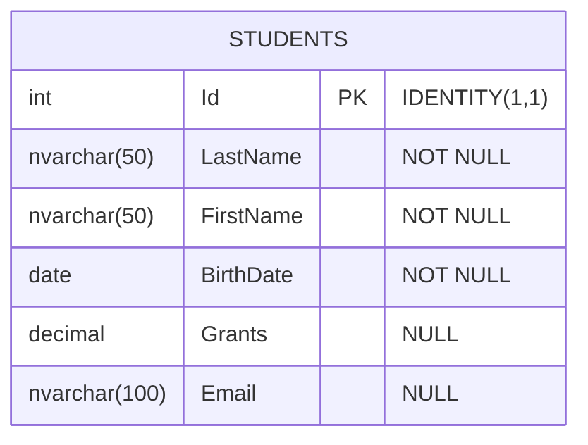

# Налаштування демонстраційної бази даних

## Навіщо потрібна демонстраційна база даних?

Для того, щоб навчитися писати SQL-запити, необхідно мати робоче середовище з даними, на яких можна практикуватися. У цій темі ми створимо демонстраційну базу даних **University** (Університет) з таблицею **Students** (Студенти), яка буде використовуватися в усіх наступних прикладах курсу.

::note
**Важливо**: Всі приклади в наступних темах базуються на цій БД. Переконайтеся, що ви створили її перед початком вивчення матеріалу.
::

---

## Передумови

Перед початком роботи переконайтеся, що у вас встановлено:

- **Microsoft SQL Server** (будь-яка версія: Express, Developer, Standard)
- **SQL Server Management Studio (SSMS)** - графічний інструмент для роботи з SQL Server

::tip
**Рекомендація**: Якщо ви ще не встановили SQL Server, використовуйте безкоштовну версію **SQL Server Express** або **Developer Edition**.
::

---

## Крок 1: Створення бази даних University

### Графічний спосіб (через SSMS)

::steps

### Підключення до сервера

Відкрийте SQL Server Management Studio та підключіться до вашого екземпляру SQL Server.

{.diagram-img}

<!-- Search Query: SQL Server Management Studio connection dialog screenshot -->

### Створення бази даних

1. У вікні **Object Explorer** клацніть правою кнопкою миші на папці **Databases**
2. Виберіть **New Database...**
3. У полі **Database name** введіть `University`
4. Натисніть **OK**

{.diagram-img}

<!-- Search Query: SQL Server Management Studio create new database dialog -->

::

### SQL скрипт створення бази даних

Альтернативно, ви можете створити базу даних за допомогою SQL-запиту:

```sql
-- Створення бази даних University
CREATE DATABASE University;
GO

-- Перемикання на створену базу даних
USE University;
GO
```

**Анатомія запиту**:

- `CREATE DATABASE University;` — створює нову базу даних з назвою University
- `GO` — роздільник пакетів команд у T-SQL (не є частиною SQL стандарту, це команда SSMS)
- `USE University;` — встановлює University як поточну базу даних для наступних команд

::warning
**Примітка про GO**: Команда `GO` не є частиною T-SQL, це спеціальна команда SQL Server Management Studio, яка вказує на кінець пакету інструкцій. Вона не потрібна при виконанні SQL з коду програми.
::

---

## Крок 2: Створення таблиці Students

Тепер створимо таблицю **Students**, яка буде зберігати інформацію про студентів університету.

### Структура таблиці

Таблиця Students матиме наступні стовпці:

| Стовпець    | Тип даних      | Опис                              | Обмеження             |
| :---------- | :------------- | :-------------------------------- | :-------------------- |
| `Id`        | INT            | Унікальний ідентифікатор студента | PRIMARY KEY, IDENTITY |
| `LastName`  | NVARCHAR(50)   | Прізвище студента                 | NOT NULL              |
| `FirstName` | NVARCHAR(50)   | Ім'я студента                     | NOT NULL              |
| `BirthDate` | DATE           | Дата народження                   | NOT NULL              |
| `Grants`    | DECIMAL(10, 2) | Розмір стипендії (у грн)          | NULL (можливо)        |
| `Email`     | NVARCHAR(100)  | Електронна пошта                  | NULL (можливо)        |

::mermaid



::

### SQL скрипт створення таблиці

```sql
-- Переконайтеся, що ви використовуєте правильну БД
USE University;
GO

-- Створення таблиці Students
CREATE TABLE Students (
    Id INT PRIMARY KEY IDENTITY(1, 1),
    LastName NVARCHAR(50) NOT NULL,
    FirstName NVARCHAR(50) NOT NULL,
    BirthDate DATE NOT NULL,
    Grants DECIMAL(10, 2) NULL,
    Email NVARCHAR(100) NULL
);
GO
```

**Розбір коду по рядках**:

1. `USE University;` — переключаємося на базу даних University
2. `CREATE TABLE Students (` — початок визначення таблиці
3. `Id INT PRIMARY KEY IDENTITY(1, 1),` — стовпець Id:
    - `INT` — цілочисельний тип
    - `PRIMARY KEY` — первинний ключ (унікальний ідентифікатор)
    - `IDENTITY(1, 1)` — автоматичне збільшення: починаємо з 1, крок 1
4. `LastName NVARCHAR(50) NOT NULL,` — стовпець LastName:
    - `NVARCHAR(50)` — текстовий тип до 50 символів (Unicode)
    - `NOT NULL` — значення обов'язкове, не може бути NULL
5. `FirstName NVARCHAR(50) NOT NULL,` — аналогічно для імені
6. `BirthDate DATE NOT NULL,` — дата народження, обов'язкове поле
7. `Grants DECIMAL(10, 2) NULL,` — стипендія:
    - `DECIMAL(10, 2)` — дробове число: 10 цифр загалом, 2 після коми
    - `NULL` — може бути невизначеним (не всі студенти отримують стипендію)
8. `Email NVARCHAR(100) NULL` — електронна пошта, необов'язкове поле

::note
**Чому NVARCHAR а не VARCHAR?**

- `NVARCHAR` підтримує **Unicode** (UTF-16), що дозволяє зберігати символи будь-яких мов, включно з українською кирилицею
- `VARCHAR` підтримує лише **ASCII/ANSI** кодування
- Для міжнародних додатків завжди використовуйте `NVARCHAR`

::

---

## Крок 3: Заповнення таблиці тестовими даними

Тепер додамо тестові дані до таблиці Students. Ми створимо 12 записів студентів з різними характеристиками для демонстрації різних SQL-запитів.

```sql
USE University;
GO

-- Вставка тестових даних
INSERT INTO Students (LastName, FirstName, BirthDate, Grants, Email)
VALUES
    ('Петренко', 'Іван', '1998-03-15', 1200.00, 'ivan.petrenko@example.com'),
    ('Коваленко', 'Марія', '1997-07-22', 1500.00, 'maria.kovalenko@example.com'),
    ('Шевченко', 'Олександр', '1999-11-08', NULL, 'oleksandr.shevchenko@example.com'),
    ('Мельник', 'Анна', '1998-05-30', 1200.00, NULL),
    ('Бойко', 'Дмитро', '1997-12-10', 1800.00, 'dmytro.boyko@example.com'),
    ('Ткаченко', 'Олена', '1999-02-18', NULL, 'olena.tkachenko@example.com'),
    ('Мороз', 'Андрій', '1998-09-25', 1350.00, 'andriy.moroz@example.com'),
    ('Сидоренко', 'Катерина', '1997-04-12', 1650.00, NULL),
    ('Коваль', 'Сергій', '1999-06-07', NULL, 'serhiy.koval@example.com'),
    ('Литвиненко', 'Юлія', '1998-10-29', 1450.00, 'yulia.lytvynenko@example.com'),
    ('Павленко', 'Максим', '1997-08-14', 1750.00, 'maxym.pavlenko@example.com'),
    ('Савченко', 'Вікторія', '1999-01-21', 1550.00, 'victoria.savchenko@example.com');
GO
```

**Особливості тестових даних**:

- **12 студентів** — достатньо для демонстрації різних запитів
- **Різні роки народження**: 1997, 1998, 1999 — для практики з датами
- **Різні місяці народження** — для демонстрації функцій MONTH(), YEAR()
- **NULL значення в Grants** — 3 студенти не отримують стипендії (для практики IS NULL)
- **NULL значення в Email** — 2 студенти без Email (для практики NOT NULL фільтрів)
- **Різні розміри стипендій** — від 1200 до 1800 грн (для практики порівнянь, агрегацій)

::tip
**Порада**: Ці тестові дані спеціально підібрані так, щоб продемонструвати всі можливості SQL-запитів, які ми вивчатимемо далі.
::

---

## Крок 4: Перевірка створення

Давайте переконаємося, що все створено правильно.

### Перевірка структури таблиці

```sql
-- Отримання інформації про структуру таблиці
EXEC sp_help 'Students';
```

Ця системна процедура поверне детальну інформацію про таблицю Students, включаючи стовпці, типи даних та constraints.

### Перевірка даних

```sql
-- Перегляд усіх даних з таблиці
SELECT * FROM Students;
```

Цей запит має повернути всі 12 записів студентів:

{.diagram-img}

<!-- Search Query: SQL Server SSMS results grid with student data -->

### Підрахунок кількості записів

```sql
-- Підрахунок кількості студентів
SELECT COUNT(*) AS TotalStudents
FROM Students;
```

Результат має показати: **TotalStudents = 12**

---

## Повний скрипт створення БД

Для вашої зручності, ось повний скрипт, який створює базу даних, таблицю та заповнює її даними:

::code-collapse

```sql [CreateUniversityDatabase.sql]
-- ============================================
-- Скрипт створення демонстраційної БД University
-- ============================================

-- Крок 1: Створення бази даних
IF NOT EXISTS (SELECT name FROM sys.databases WHERE name = 'University')
BEGIN
    CREATE DATABASE University;
END
GO

USE University;
GO

-- Крок 2: Видалення таблиці якщо вона існує (для повторного запуску)
IF OBJECT_ID('Students', 'U') IS NOT NULL
BEGIN
    DROP TABLE Students;
END
GO

-- Крок 3: Створення таблиці Students
CREATE TABLE Students (
    Id INT PRIMARY KEY IDENTITY(1, 1),
    LastName NVARCHAR(50) NOT NULL,
    FirstName NVARCHAR(50) NOT NULL,
    BirthDate DATE NOT NULL,
    Grants DECIMAL(10, 2) NULL,
    Email NVARCHAR(100) NULL
);
GO

-- Крок 4: Заповнення тестовими даними
INSERT INTO Students (LastName, FirstName, BirthDate, Grants, Email)
VALUES
    ('Петренко', 'Іван', '1998-03-15', 1200.00, 'ivan.petrenko@example.com'),
    ('Коваленко', 'Марія', '1997-07-22', 1500.00, 'maria.kovalenko@example.com'),
    ('Шевченко', 'Олександр', '1999-11-08', NULL, 'oleksandr.shevchenko@example.com'),
    ('Мельник', 'Анна', '1998-05-30', 1200.00, NULL),
    ('Бойко', 'Дмитро', '1997-12-10', 1800.00, 'dmytro.boyko@example.com'),
    ('Ткаченко', 'Олена', '1999-02-18', NULL, 'olena.tkachenko@example.com'),
    ('Мороз', 'Андрій', '1998-09-25', 1350.00, 'andriy.moroz@example.com'),
    ('Сидоренко', 'Катерина', '1997-04-12', 1650.00, NULL),
    ('Коваль', 'Сергій', '1999-06-07', NULL, 'serhiy.koval@example.com'),
    ('Литвиненко', 'Юлія', '1998-10-29', 1450.00, 'yulia.lytvynenko@example.com'),
    ('Павленко', 'Максим', '1997-08-14', 1750.00, 'maxym.pavlenko@example.com'),
    ('Савченко', 'Вікторія', '1999-01-21', 1550.00, 'victoria.savchenko@example.com');
GO

-- Крок 5: Перевірка
SELECT COUNT(*) AS TotalStudents FROM Students;
SELECT * FROM Students ORDER BY Id;
GO

PRINT 'База даних University успішно створена та заповнена!';
GO
```

::

::note
**Збережіть цей скрипт**: Рекомендується зберегти цей SQL-скрипт у файл (наприклад, `CreateUniversityDatabase.sql`), щоб ви могли легко відновити демонстраційну БД у будь-який момент.
::

---

## Як виконати скрипт у SSMS

::steps

### Відкрийте новий запит

У SQL Server Management Studio натисніть кнопку **New Query** або використайте комбінацію клавіш :kbd{value="Ctrl"} + :kbd{value="N"}

### Скопіюйте скрипт

Скопіюйте повний скрипт створення БД (з секції вище) та вставте його у вікно запиту

### Виконайте скрипт

Натисніть кнопку **Execute** або клавішу :kbd{value="F5"}

### Перевірте результат

У вікні **Messages** ви побачите підтвердження про успішне виконання. У вікні **Results** відобразяться дані з таблиці Students

::

---

## Типові помилки та їх вирішення

::accordion

::accordion-item{label="Помилка: Database 'University' already exists" icon="i-lucide-alert-circle"}

**Причина**: База даних University вже існує

**Рішення**: Використайте один з варіантів:

```sql
-- Варіант 1: Видалити існуючу БД (ОБЕРЕЖНО - видалить всі дані!)
DROP DATABASE University;
GO
CREATE DATABASE University;
GO

-- Варіант 2: Використати існуючу БД
USE University;
GO
```

::

::accordion-item{label="Помилка: There is already an object named 'Students'" icon="i-lucide-alert-circle"}

**Причина**: Таблиця Students вже існує

**Рішення**:

```sql
-- Видалити існуючу таблицю
DROP TABLE Students;
GO

-- Потім створити її знову
CREATE TABLE Students (...);
GO
```

::

::accordion-item{label="Помилка: Cannot insert the value NULL into column 'LastName'" icon="i-lucide-alert-circle"}

**Причина**: Ви намагаєтеся вставити NULL у стовпець, який має обмеження NOT NULL

**Рішення**: Завжди вказуйте значення для стовпців з NOT NULL:

```sql
-- НЕПРАВИЛЬНО
INSERT INTO Students (LastName, FirstName)
VALUES ('Іваненко', NULL); -- FirstName має NOT NULL!

-- ПРАВИЛЬНО
INSERT INTO Students (LastName, FirstName, BirthDate)
VALUES ('Іваненко', 'Петро', '1998-01-01');
```

::

::accordion-item{label="Помилка: Invalid column name 'Ім'я'" icon="i-lucide-alert-circle"}

**Причина**: Використання українських назв стовпців без квадратних дужок

**Рішення**: У нашій таблиці ми використовуємо англійські назви стовпців (LastName, FirstName). Якщо ви хочете використовувати українські назви, обгортайте їх у квадратні дужки:

```sql
SELECT [Ім'я], [Прізвище] FROM Students; -- правильно
SELECT Ім'я, Прізвище FROM Students;     -- помилка
```

::

::

---

## Наступні кроки

Тепер, коли ваша демонстраційна база даних готова, ви можете переходити до вивчення SQL-запитів:

::card-group

::card{title="DDL: CREATE TABLE" icon="i-lucide-table" to="./01.ddl-create-table.md"}
Детальне вивчення створення таблиць та constraints
::

::card{title="SELECT запити" icon="i-lucide-search" to="./03.select-queries-fundamentals.md"}
Вибірка даних з бази даних
::

::card{title="INSERT запити" icon="i-lucide-plus-circle" to="./05.insert-queries.md"}
Додавання нових даних до таблиць
::

::

---

## Резюме

::tip
**Ключові моменти**:

1. Створили базу даних **University** для практичних прикладів
2. Створили таблицю **Students** з 6 стовпцями
3. Використали різні типи даних: INT, NVARCHAR, DATE, DECIMAL
4. Застосували constraints: PRIMARY KEY, IDENTITY, NOT NULL
5. Заповнили таблицю 12 тестовими записами з різними характеристиками
6. Навчилися перевіряти структуру та дані таблиці

Ця база даних буде використовуватися в усіх наступних темах!
::
