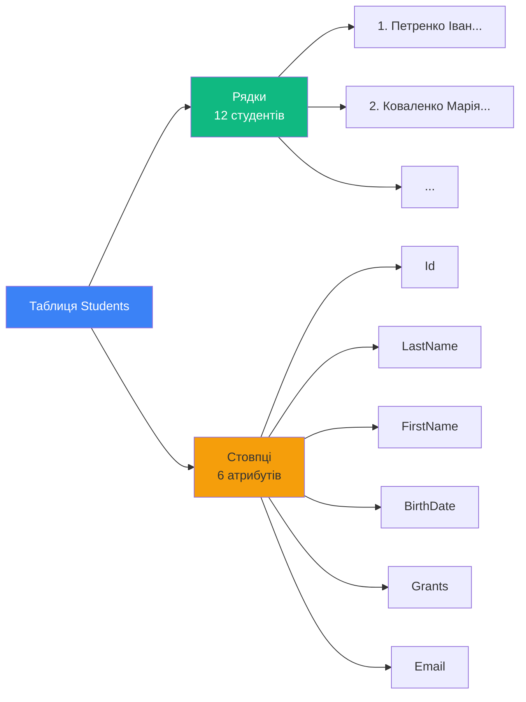
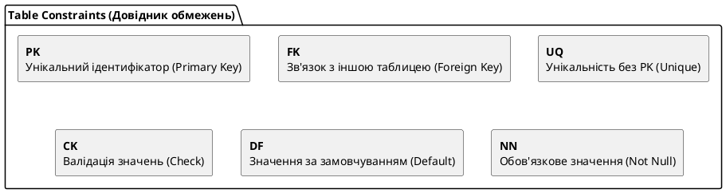
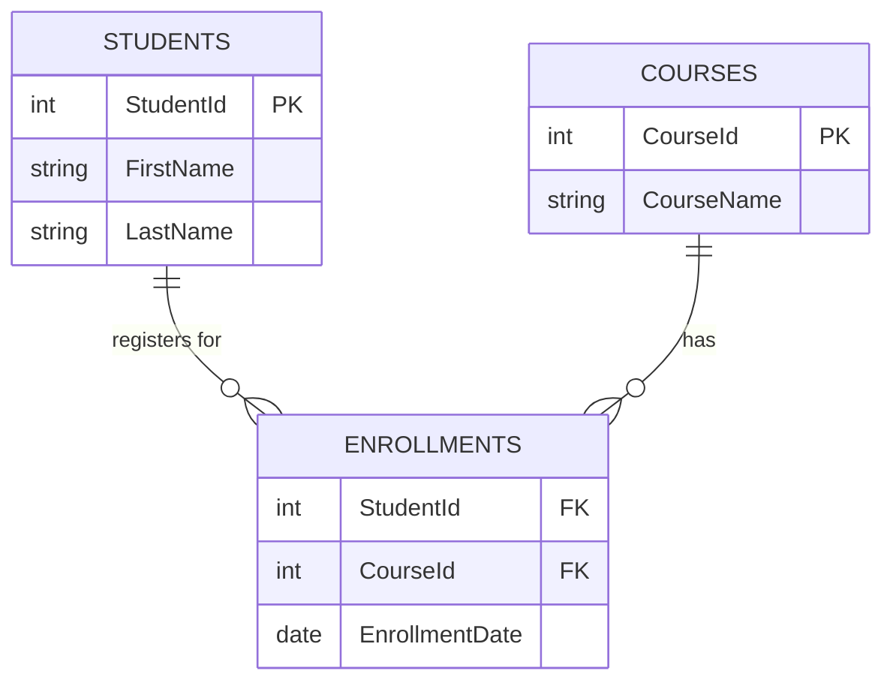

# DDL - Створення таблиць (CREATE TABLE)

## Навіщо нам потрібні таблиці?

Уявіть, що вам потрібно організувати інформацію про студентів університету. Ви могли б:

1. **Зберігати в текстовому файлі**: Важко шукати, редагувати, підтримувати цілісність
2. **Зберігати в Excel**: Обмежені можливості для складних зв'язків між даними
3. **Створити таблицю в БД**: :icon{name="i-lucide-check-circle" class="text-green-500"} Структурованість, швидкість, цілісність, безпека

**Таблиці** — це основний спосіб організації даних у реляційних базах даних. Вони надають структуру, в якій кожен фрагмент інформації має своє чітко визначене місце.

::note
**Таблиця (Table)** — це структурована колекція даних, організована у вигляді рядків і стовпців, де кожен рядок представляє окремий запис, а кожен стовпець — атрибут цього запису.
::

---

## DDL vs DML: Розуміння категорій

Перед тим як заглибитися в CREATE TABLE, важливо розуміти різницю між **DDL** та **DML**:

::tabs

::tabs-item{label="DDL (Data Definition Language)"}

**Мова опису даних** — команди для роботи зі **структурою** бази даних:

- `CREATE` — створення об'єктів (таблиць, індексів, БД)
- `ALTER` — зміна структури existing об'єктів
- `DROP` — видалення об'єктів
- `TRUNCATE` — очищення таблиць

```sql
-- Приклад DDL
CREATE TABLE Products (
    ProductId INT PRIMARY KEY,
    ProductName NVARCHAR(100)
);
```

**Характеристики DDL**:

- Змінює **metadata** (опис структури)
- Впливає на схему БД
- Auto-commit (зміни відбуваються негайно)

::

::tabs-item{label="DML (Data Manipulation Language)"}

**Мова керування даними** — команди для роботи з **even** всередині таблиць:

- `SELECT` — вибірка даних
- `INSERT` — вставка нових записів
- `UPDATE` — оновлення існуючих записів
- `DELETE` — видалення записів

```sql
-- Приклад DML
INSERT INTO Products (ProductId, ProductName)
VALUES (1, 'Laptop');
```

**Характеристики DML**:

- Змінює **дані**
- НЕ впливає на схему
- Може бути частиною транзакції

::

::

::warning
**Критична відмінність**: DDL команди (як CREATE TABLE) змінюють структуру БД і не можуть бути легко скасовані. DML команди працюють з даними і можуть бути скасовані через транзакції.
::

---

## Фундаментальні концепції

### Що таке таблиця?

Таблиця складається з:

1. **Рядків (Rows/Records)** — кожен рядок представляє окремий об'єкт
2. **Стовпців (Columns/Fields)** — кожен стовпець представляє атрибут об'єкта

::mermaid



::

### Схема таблиці

**Схема (Schema)** — це опис структури таблиці: які стовпці, яких типів, які обмеження.

```sql
-- Схема таблиці Students
CREATE TABLE Students (
    Id INT,              -- Стовпець: Id, Тип: INT
    LastName NVARCHAR(50),    -- Стовпець: LastName, Тип: NVARCHAR(50)
    ...
);
```

### Metadata

**Metadata** — це "дані про дані". Коли ви створюєте таблицю, SQL Server зберігає інформацію про неї в системних таблицях:

```sql
-- Переглянути metadata про таблицю
SELECT
    COLUMN_NAME,
    DATA_TYPE,
    CHARACTER_MAXIMUM_LENGTH,
    IS_NULLABLE
FROM INFORMATION_SCHEMA.COLUMNS
WHERE TABLE_NAME = 'Students';
```

---

## Базовий синтаксис CREATE TABLE

Загальна форма команди CREATE TABLE:

```sql
CREATE TABLE table_name (
    column1 datatype [constraints],
    column2 datatype [constraints],
    ...
    columnN datatype [constraints],
    [table_constraints]
);
```

### Мінімальний приклад

Найпростіша таблиця без жодних обмежень:

```sql
CREATE TABLE SimpleProducts (
    ProductId INT,
    ProductName NVARCHAR(100)
);
```

**Що відбувається**:

1. SQL Server створює нову таблицю з назвою `SimpleProducts`
2. Створюється 2 стовпці: `ProductId` типу INT та `ProductName` типу NVARCHAR(100)
3. Обидва стовпці можуть зберігати NULL значення (немає NOT NULL)
4. Немає первинного ключа (можуть бути дублікати)

::caution
**Проблема**: Така таблиця НЕ має constraints — немає гарантій унікальності чи цілісності даних!
::

### Naming Conventions (правила найменування)

Дотримуйтесь правил для назв таблиць та стовпців:

::field-group

::field{name="PascalCase" type="рекомендовано"}
Кожне слово з великої літери: `Students`, `OrderDetails`, `UserProfiles`
::

::field{name="Plural vs Singular" type="дискусійно"}

- **Singular**: `Student` (одна таблиця = один тип сутності)
- **Plural**: `Students` (таблиця містить багато записів)

Microsoft рекомендує **Plural**, але обидва підходи прийнятні. **Головне — консистентність!**
::

::field{name="Уникайте" type="заборонено"}

- Пробілів: ~~`User Profiles`~~ → `UserProfiles`
- Спецсимволів: ~~`Users@Data`~~
- Зарезервованих слів: ~~`SELECT`~~, ~~`Table`~~, ~~`Order`~~
- Кирилиці (якщо працюєте в міжнародній команді)

::

::

---

## Типи даних (короткий огляд)

SQL Server підтримує багато типів даних. Ось найважливіші:

### Числові типи

| Тип            | Діапазон                            | Розмір     | Використання       |
| :------------- | :---------------------------------- | :--------- | :----------------- |
| `INT`          | -2,147,483,648 до 2,147,483,647     | 4 байти    | ID, кількості      |
| `BIGINT`       | -9 квінтильйонів до 9 квінтильйонів | 8 байтів   | Великі ID          |
| `SMALLINT`     | -32,768 до 32,767                   | 2 байти    | Малі числа         |
| `TINYINT`      | 0 до 255                            | 1 байт     | Вік, статуси       |
| `DECIMAL(p,s)` | Точне число                         | Варіюється | Гроші, ціни        |
| `FLOAT`        | Приблизне число                     | 8 байтів   | Наукові обчислення |

### Текстові типи

| Тип             | Максимальний розмір | Unicode | Використання                 |
| :-------------- | :------------------ | :------ | :--------------------------- |
| `CHAR(n)`       | 8,000 символів      | Ні      | Фіксована довжина (рідко)    |
| `VARCHAR(n)`    | 8,000 символів      | Ні      | Змінна довжина ASCII         |
| `NCHAR(n)`      | 4,000 символів      | Так     | Фіксована Unicode            |
| `NVARCHAR(n)`   | 4,000 символів      | Так     | **Рекомендовано** для тексту |
| `NVARCHAR(MAX)` | 2 ГБ                | Так     | Великі тексти                |

::tip
**Рекомендація**: Для української мови завжди використовуйте `NVARCHAR`, оскільки він підтримує Unicode (кирилицю).
::

### Дати і час

| Тип              | Діапазон                             | Точність       | Використання      |
| :--------------- | :----------------------------------- | :------------- | :---------------- |
| `DATE`           | 0001-01-01 до 9999-12-31             | День           | Дати народження   |
| `TIME`           | 00:00:00.0000000 до 23:59:59.9999999 | 100 наносекунд | Час               |
| `DATETIME`       | 1753-01-01 до 9999-12-31             | 3.33 мс        | Дата+час (legacy) |
| `DATETIME2`      | 0001-01-01 до 9999-12-31             | 100 наносекунд | **Рекомендовано** |
| `DATETIMEOFFSET` | Як DATETIME2 + timezone              | 100 наносекунд | Глобальні додатки |

### Інші важливі типи

| Тип                | Опис                             |
| :----------------- | :------------------------------- |
| `BIT`              | 0, 1, або NULL (Boolean)         |
| `UNIQUEIDENTIFIER` | GUID (глобально унікальний ID)   |
| `VARBINARY(n)`     | Бінарні дані (файли, зображення) |

::note
**Детальніше про типи даних**: Ця тема заслуговує окремого матеріалу. Посилання на детальну документацію: [Типи даних MS SQL Server](../02.ms-sql-server-start/01.data-types.md)
::

### Вибір правильного типу даних

::code-group

```sql [Погано ❌]
CREATE TABLE BadExample (
    -- Використання VARCHAR(MAX) для всього
    Age VARCHAR(MAX),        -- Надмірний розмір для віку!
    Price VARCHAR(MAX),      -- Текст для ціни - неможливо підраховувати!
    Name VARCHAR(MAX)        -- MAX без потреби
);
```

```sql [Добре ✅]
CREATE TABLE GoodExample (
    -- Підбір правильних типів
    Age TINYINT,                    -- 0-255, достатньо для віку
    Price DECIMAL(10, 2),           -- Точне число для ціни
    Name NVARCHAR(100)              -- Unicode, розумна довжина
);
```

::

---

## NULL vs NOT NULL

**NULL** — це спеціальне значення, яке позначає **відсутність даних**. Це не те саме, що 0, порожній рядок '' або пробіл ' '.

::tabs

::tabs-item{label="NULL (дозволено)"}

Стовпець **може** зберігати NULL:

```sql
CREATE TABLE Users (
    UserId INT,
    Email NVARCHAR(100) NULL  -- Явно вказано NULL
);

-- Або просто (NULL за замовчуванням)
CREATE TABLE Users (
    UserId INT,
    Email NVARCHAR(100)  -- NULL неявно
);
```

**Коли використовувати NULL**:

- Необов'язкові дані (Email, телефон)
- Дані, які можуть бути невідомі на момент створення запису
- Опціональні атрибути

::

::tabs-item{label="NOT NULL (обов'язково)"}

Стовпець **НЕ може** зберігати NULL:

```sql
CREATE TABLE Users (
    UserId INT NOT NULL,
    FirstName NVARCHAR(50) NOT NULL,  -- Обов'язкове поле
    Email NVARCHAR(100) NULL          -- Необов'язкове
);
```

**Коли використовувати NOT NULL**:

- Обов'язкові дані (ім'я, дата народження)
- Primary keys та Foreign keys
- Поля, критичні для бізнес-логіки

::

::

**Приклад помилки при порушенні NOT NULL**:

```sql
CREATE TABLE Products (
    ProductId INT NOT NULL,
    ProductName NVARCHAR(100) NOT NULL
);

-- Спроба вставити NULL
INSERT INTO Products (ProductId, ProductName)
VALUES (1, NULL);  -- ❌ ПОМИЛКА!

-- Msg 515: Cannot insert the value NULL into column 'ProductName'
```

::tip
**Best Practice**: За замовчуванням робіть стовпці NOT NULL, якщо немає явної причини дозволити NULL. Це покращує цілісність даних.
::

---

## Constraints (обмеження): Гарантії цілісності

**Constraints** — це правила, які забезпечують коректність та цілісність даних у таблиці. Вони запобігають вставці некоректних даних.

::plant-uml



::

---

## PRIMARY KEY: Унікальний ідентифікатор

**PRIMARY KEY (первинний ключ)** — це стовпець (або комбінація стовпців), який **унікально ідентифікує** кожен рядок у таблиці.

### Характеристики PRIMARY KEY

- :icon{name="i-lucide-check"} **Унікальність**: Немає двох рядків з однаковим PK
- :icon{name="i-lucide-check"} **NOT NULL**: PK не може бути NULL
- :icon{name="i-lucide-check"} **Один на таблицю**: Лише один PK на таблицю
- :icon{name="i-lucide-check"} **Індекс**: Автоматично створюється CLUSTERED INDEX

### Синтаксис

::code-group

```sql [Inline constraint]
CREATE TABLE Students (
    Id INT PRIMARY KEY,  -- Первинний ключ inline
    FirstName NVARCHAR(50)
);
```

```sql [Named constraint (рекомендовано)]
CREATE TABLE Students (
    Id INT CONSTRAINT PK_Students PRIMARY KEY,
    FirstName NVARCHAR(50)
);
```

```sql [Table-level constraint]
CREATE TABLE Students (
    Id INT,
    FirstName NVARCHAR(50),
    CONSTRAINT PK_Students PRIMARY KEY (Id)  -- На рівні таблиці
);
```

::

::tip
**Naming Convention для constraints**: Використовуйте префікс (PK*, FK*, UQ*, CK*, DF\_) + назву таблиці. Приклад: `PK_Students`, `FK_Orders_Customers`
::

### IDENTITY: Автоматичне збільшення

Часто потрібно, щоб primary key **автоматично генерувався**. Для цього використовується `IDENTITY`:

```sql
CREATE TABLE Products (
    ProductId INT IDENTITY(1, 1) PRIMARY KEY,
    --           ^^^^^^^^^^^^^^^^
    --           початкове значення: 1, крок: 1
    ProductName NVARCHAR(100)
);
```

**Параметри IDENTITY**:

- `IDENTITY(seed, increment)`
    - `seed` — початкове значення (зазвичай 1)
    - `increment` — крок збільшення (зазвичай 1)

**Приклад використання**:

```sql
INSERT INTO Products (ProductName) VALUES ('Laptop');
-- ProductId автоматично = 1

INSERT INTO Products (ProductName) VALUES ('Mouse');
-- ProductId автоматично = 2

SELECT * FROM Products;
```

Результат:

| ProductId | ProductName |
| :-------- | :---------- |
| 1         | Laptop      |
| 2         | Mouse       |

::warning
**Важливо**: Ви **НЕ можете** явно вставити значення в IDENTITY стовпець (за замовчуванням). Якщо потрібно, використовуйте `SET IDENTITY_INSERT ON`.
::

### Композитні PRIMARY KEY

Іноді потрібно, щоб **комбінація стовпців** була унікальною:

```sql
-- Таблиця: Реєстрація студентів на курси
CREATE TABLE Enrollments (
    StudentId INT,
    CourseId INT,
    EnrollmentDate DATE,
    CONSTRAINT PK_Enrollments PRIMARY KEY (StudentId, CourseId)
    --                                      ^^^^^^^^^^^^^^^^^^^^^
    --                                      Композитний ключ
);
```

**Значення**: Студент може бути зареєстрований на кожен курс **лише один раз**.

---

## FOREIGN KEY: Зв'язки між таблицями

**FOREIGN KEY (зовнішній ключ)** — це стовпець, який **посилається** на PRIMARY KEY іншої таблиці, створюючи зв'язок між таблицями.

### Навіщо потрібні зв'язки?

::mermaid



::

### Синтаксис

```sql
-- Спочатку створюємо "батьківську" таблицю
CREATE TABLE Courses (
    CourseId INT PRIMARY KEY,
    CourseName NVARCHAR(100) NOT NULL
);

-- Потім створюємо "дочірню" таблицю з FK
CREATE TABLE Enrollments (
    EnrollmentId INT PRIMARY KEY IDENTITY(1, 1),
    StudentId INT,
    CourseId INT,
    EnrollmentDate DATE,

    -- Foreign Key constraint
    CONSTRAINT FK_Enrollments_Students
        FOREIGN KEY (StudentId) REFERENCES Students(Id),

    CONSTRAINT FK_Enrollments_Courses
        FOREIGN KEY (CourseId) REFERENCES Courses(CourseId)
);
```

**Анатомія FOREIGN KEY**:

```sql
CONSTRAINT FK_Enrollments_Students    -- Назва constraint
    FOREIGN KEY (StudentId)           -- Стовпець у поточній таблиці
    REFERENCES Students(Id)           -- Посилання на таблицю та стовпець
```

### Referential Integrity (референційна цілісність)

FOREIGN KEY забезпечує **референційну цілісність** — неможливо вставити значення, яке не існує в батьківській таблиці:

```sql
-- Припустимо, student з ID=999 НЕ існує в таблиці Students

INSERT INTO Enrollments (StudentId, CourseId, EnrollmentDate)
VALUES (999, 1, '2024-01-15');  -- ❌ ПОМИЛКА!

-- Msg 547: The INSERT statement conflicted with the FOREIGN KEY constraint
```

### Каскадні дії

Що відбувається, коли ми намагаємося **видалити або оновити** запис у батьківській таблиці, на який посилаються дочірні записи?

::tabs

::tabs-item{label="NO ACTION (за замовчуванням)"}

**Заборонити** видалення/оновлення, якщо щось посилається:

```sql
CONSTRAINT FK_Enrollments_Students
    FOREIGN KEY (StudentId)
    REFERENCES Students(Id)
    ON DELETE NO ACTION  -- За замовчуванням
    ON UPDATE NO ACTION;
```

**Приклад**:

```sql
DELETE FROM Students WHERE Id = 1;  -- ❌ ПОМИЛКА, якщо є enrollments
```

::

::tabs-item{label="CASCADE"}

**Автоматично видалити/оновити** пов'язані записи:

```sql
CONSTRAINT FK_Enrollments_Students
    FOREIGN KEY (StudentId)
    REFERENCES Students(Id)
    ON DELETE CASCADE  -- Видалити всі enrollments студента
    ON UPDATE CASCADE; -- Оновити всі enrollments при зміні ID
```

**Приклад**:

```sql
DELETE FROM Students WHERE Id = 1;
--  Студента видалено
-- ✅ ВСІ enrollments цього студента також видалено автоматично
```

::

::tabs-item{label="SET NULL"}

**Встановити NULL** у дочірніх записах:

```sql
CONSTRAINT FK_Enrollments_Students
    FOREIGN KEY (StudentId)
    REFERENCES Students(Id)
    ON DELETE SET NULL;
```

**Приклад**:

```sql
DELETE FROM Students WHERE Id = 1;
-- ✅ StudentId в enrollments встановлено в NULL
```

::

::tabs-item{label="SET DEFAULT"}

**Встановити значення за замовчуванням**:

```sql
ALTER TABLE Enrollments
ADD StudentId INT DEFAULT 0;

CONSTRAINT FK_Enrollments_Students
    FOREIGN KEY (StudentId)
    REFERENCES Students(Id)
    ON DELETE SET DEFAULT;
```

::

::

::caution
**Увага з CASCADE**: ON DELETE CASCADE може призвести до **небажаного масового видалення** даних. Використовуйте обережно!
::

---

## UNIQUE: Унікальність без PRIMARY KEY

**UNIQUE constraint** гарантує, що всі значення у стовпці (або комбінації стовпців) є **унікальними**.

### Відмінність від PRIMARY KEY

| Характеристика       | PRIMARY KEY | UNIQUE              |
| :------------------- | :---------- | :------------------ |
| Унікальність         | Так         | Так                 |
| NULL дозволено       | Ні          | **Так** (один NULL) |
| Кількість на таблицю | 1           | Необмежено          |
| Автоматичний індекс  | CLUSTERED   | NONCLUSTERED        |

### Синтаксис

```sql
CREATE TABLE Users (
    UserId INT PRIMARY KEY,
    Email NVARCHAR(100) UNIQUE,  -- Inline
    PhoneNumber NVARCHAR(20),

    CONSTRAINT UQ_Users_PhoneNumber UNIQUE (PhoneNumber)  -- Named
);
```

### Приклад використання

```sql
INSERT INTO Users (UserId, Email, PhoneNumber)
VALUES (1, 'user1@example.com', '+380501234567');  -- ✅ OK

INSERT INTO Users (UserId, Email, PhoneNumber)
VALUES (2, 'user1@example.com', '+380509999999');  -- ❌ ПОМИЛКА!
-- Violation of UNIQUE constraint 'UQ_Users_Email'
```

### Композитний UNIQUE

```sql
CREATE TABLE ProductReviews (
    ReviewId INT PRIMARY KEY,
    ProductId INT,
    UserId INT,
    Rating INT,

    -- Користувач може залишити лише ОДИН відгук на кожен продукт
    CONSTRAINT UQ_ProductReviews_ProductUser
        UNIQUE (ProductId, UserId)
);
```

---

## CHECK: Валідація значень

**CHECK constraint** дозволяє визначити **умову**, яку має задовольняти значення стовпця.

### Синтаксис

```sql
CREATE TABLE Products (
    ProductId INT PRIMARY KEY,
    ProductName NVARCHAR(100),
    Price DECIMAL(10, 2) CHECK (Price > 0),  -- Ціна має бути більше 0
    Stock INT CHECK (Stock >= 0)             -- Залишок не може бути негативним
);
```

### Приклади CHECK constraints

::code-group

```sql [Числові діапазони]
CREATE TABLE Employees (
    EmployeeId INT PRIMARY KEY,
    Age INT CHECK (Age BETWEEN 18 AND 65),
    Salary DECIMAL(10, 2) CHECK (Salary > 0)
);
```

```sql [Перелік значень]
CREATE TABLE Orders (
    OrderId INT PRIMARY KEY,
    Status NVARCHAR(20) CHECK (Status IN ('Pending', 'Processing', 'Shipped', 'Delivered', 'Cancelled'))
);
```

```sql [Порівняння полів]
CREATE TABLE Events (
    EventId INT PRIMARY KEY,
    StartDate DATE,
    EndDate DATE,
    CHECK (EndDate >= StartDate)  -- Кінець не раніше початку
);
```

```sql [Складні умови]
CREATE TABLE Employees (
    EmployeeId INT PRIMARY KEY,
    BaseSalary DECIMAL(10, 2),
    Bonus DECIMAL(10, 2),
    CHECK (Bonus <= BaseSalary * 0.5)  -- Бонус не більше 50% зарплати
);
```

::

### Named CHECK constraints

```sql
CREATE TABLE Products (
    ProductId INT PRIMARY KEY,
    Price DECIMAL(10, 2),
    DiscountPrice DECIMAL(10, 2),

    CONSTRAINT CK_Products_PricePositive CHECK (Price > 0),
    CONSTRAINT CK_Products_DiscountValid CHECK (DiscountPrice < Price)
);
```

**Переваги іменованих constraints**:

- Легше ідентифікувати помилки
- Простіше видалити/змінити constraint пізніше

**Приклад помилки**:

```sql
INSERT INTO Products (ProductId, Price, DiscountPrice)
VALUES (1, 100, 150);  -- ❌ ПОМИЛКА!

-- Violation of CHECK constraint 'CK_Products_DiscountValid'
-- ✅ Зрозуміло, яке саме правило порушено!
```

---

## DEFAULT: Значення за замовчуванням

**DEFAULT constraint** встановлює значення, яке буде автоматично вставлено, якщо користувач не вказав значення.

### Синтаксис

```sql
CREATE TABLE Orders (
    OrderId INT PRIMARY KEY IDENTITY(1, 1),
    OrderDate DATETIME DEFAULT GETDATE(),  -- Поточна дата за замовчуванням
    Status NVARCHAR(20) DEFAULT 'Pending',
    Quantity INT DEFAULT 1
);
```

### Приклади використання

::code-group

```sql [Константи]
CREATE TABLE Users (
    UserId INT PRIMARY KEY,
    IsActive BIT DEFAULT 1,           -- За замовчуванням активний
    Role NVARCHAR(20) DEFAULT 'User'  -- За замовчуванням звичайний користувач
);
```

```sql [Функції]
CREATE TABLE Logs (
    LogId INT PRIMARY KEY IDENTITY(1, 1),
    CreatedAt DATETIME DEFAULT GETDATE(),      -- Поточна дата/час
    CreatedBy NVARCHAR(50) DEFAULT SUSER_NAME() -- Поточний користувач
);
```

```sql [Обчислення]
CREATE TABLE Invoices (
    InvoiceId INT PRIMARY KEY,
    Amount DECIMAL(10, 2),
    TaxRate DECIMAL(5, 4) DEFAULT 0.20,  -- ПДВ 20%
    TotalAmount AS (Amount * (1 + TaxRate))  -- Computed column
);
```

::

### Вставка з DEFAULT

```sql
-- Явне використання DEFAULT
INSERT INTO Orders (OrderId, OrderDate)
VALUES (1, DEFAULT);  -- Використати значення за замовчуванням

-- Пропуск стовпця (автоматично DEFAULT)
INSERT INTO Orders (OrderId)
VALUES (2);  -- OrderDate автоматично = GETDATE()
```

::tip
**Best Practice**: Використовуйте DEFAULT для:

- Дат створення (CreatedAt)
- Статусів за замовчуванням
- Булевих флагів (IsActive, IsDeleted)
- Значень, які рідко змінюються

::

---

## Computed Columns: Обчислювані стовпці

**Computed Column** — це стовпець, значення якого **автоматично обчислюється** на основі інших стовпців.

### Синтаксис

```sql
CREATE TABLE Employees (
    EmployeeId INT PRIMARY KEY,
    FirstName NVARCHAR(50),
    LastName NVARCHAR(50),
    BaseSalary DECIMAL(10, 2),
    Bonus DECIMAL(10, 2),

    -- Computed columns
    FullName AS (FirstName + ' ' + LastName),  -- Конкатенація
    TotalSalary AS (BaseSalary + Bonus)         -- Арифметика
);
```

### Приклади

::code-group

```sql [Конкатенація рядків]
CREATE TABLE Students (
    StudentId INT PRIMARY KEY,
    FirstName NVARCHAR(50),
    LastName NVARCHAR(50),
    FullName AS ( LastName + ' ' + FirstName)
);

INSERT INTO Students (StudentId, FirstName, LastName)
VALUES (1, 'Іван', 'Петренко');

SELECT FullName FROM Students;
-- Результат: "Петренко Іван"
```

```sql [Арифметичні обчислення]
CREATE TABLE Products (
    ProductId INT PRIMARY KEY,
    Price DECIMAL(10, 2),
    Quantity INT,
    TotalValue AS (Price * Quantity)  -- Автоматично обчислюється
);
```

```sql [Використання функцій]
CREATE TABLE Orders (
    OrderId INT PRIMARY KEY,
    OrderDate DATE,
    YearOrdered AS (YEAR(OrderDate)),
    MonthOrdered AS (MONTH(OrderDate))
);
```

::

### PERSISTED: Зберігання обчислених значень

За замовчуванням, computed columns **не зберігаються** фізично — вони обчислюються щоразу при SELECT. Для покращення performance можна використати `PERSISTED`:

```sql
CREATE TABLE Invoices (
    InvoiceId INT PRIMARY KEY,
    Amount DECIMAL(10, 2),
    TaxRate DECIMAL(5, 4),
    TotalAmount AS (Amount * (1 + TaxRate)) PERSISTED  -- Зберігається!
);
```

**Переваги PERSISTED**:

- :icon{name="i-lucide-zap"} Швидше читання (не потрібно обчислювати)
- :icon{name="i-lucide-search"} Можна створити індекс на цьому стовпці

**Недоліки**:

- :icon{name="i-lucide-hard-drive"} Займає місце на диску
- :icon{name="i-lucide-clock"} Повільніше вставка/оновлення

---

## Практичні приклади

### Приклад 1: Проста таблиця Students

```sql
CREATE TABLE Students (
    Id INT PRIMARY KEY IDENTITY(1, 1),
    FirstName NVARCHAR(50) NOT NULL,
    LastName NVARCHAR(50) NOT NULL,
    BirthDate DATE NOT NULL,
    Email NVARCHAR(100) UNIQUE,
    PhoneNumber NVARCHAR(20),
    CreatedAt DATETIME DEFAULT GETDATE()
);
```

**Розбір**:

- `Id` — PRIMARY KEY з автоматичним збільшенням
- `FirstName`, `LastName`, `BirthDate` — обов'язкові поля
- `Email` — унікальне (не може бути дублікатів)
- `PhoneNumber` — опціональне
- `CreatedAt` — автоматично записується дата створення

### Приклад 2: Таблиця з Foreign Keys

```sql
-- Батьківська таблиця
CREATE TABLE Departments (
    DepartmentId INT PRIMARY KEY,
    DepartmentName NVARCHAR(100) NOT NULL
);

-- Дочірня таблиця
CREATE TABLE Employees (
    EmployeeId INT PRIMARY KEY IDENTITY(1, 1),
    FirstName NVARCHAR(50) NOT NULL,
    LastName NVARCHAR(50) NOT NULL,
    DepartmentId INT NOT NULL,
    Salary DECIMAL(10, 2) CHECK (Salary > 0),
    HireDate DATE DEFAULT GETDATE(),

    -- Foreign Key
    CONSTRAINT FK_Employees_Departments
        FOREIGN KEY (DepartmentId)
        REFERENCES Departments(DepartmentId)
        ON DELETE NO ACTION  -- Заборонити видалення department, якщо є працівники
);
```

### Приклад 3: Складна таблиця з усіма constraints

```sql
CREATE TABLE Orders (
    -- PRIMARY KEY
    OrderId INT PRIMARY KEY IDENTITY(1, 1),

    -- FOREIGN KEYS
    CustomerId INT NOT NULL,
    ProductId INT NOT NULL,

    -- Обов'язкові поля з CHECK
    Quantity INT NOT NULL CHECK (Quantity > 0),
    UnitPrice DECIMAL(10, 2) NOT NULL CHECK (UnitPrice > 0),

    -- Computed column
    TotalPrice AS (Quantity * UnitPrice) PERSISTED,

    -- DEFAULT values
    OrderDate DATETIME NOT NULL DEFAULT GETDATE(),
    Status NVARCHAR(20) NOT NULL DEFAULT 'Pending',

    -- CHECK constraint для статусу
    CONSTRAINT CK_Orders_Status CHECK (Status IN ('Pending', 'Processing', 'Shipped', 'Delivered', 'Cancelled')),

    -- FOREIGN KEY constraints
    CONSTRAINT FK_Orders_Customers
        FOREIGN KEY (CustomerId) REFERENCES Customers(CustomerId)
        ON DELETE NO ACTION,

    CONSTRAINT FK_Orders_Products
        FOREIGN KEY (ProductId) REFERENCES Products(ProductId)
        ON DELETE NO ACTION,

    -- UNIQUE constraint (один замовлення на продукт від клієєнта)
    CONSTRAINT UQ_Orders_CustomerProduct UNIQUE (CustomerId, ProductId)
);
```

---

## Best Practices: Кращі практики

::card-group

::card{title="1. Завжди використовуйте PRIMARY KEY" icon="i-lucide-key"}
Кожна таблиця має мати primary key для унікальної ідентифікації рядків.

```sql
-- ✅ Добре
CREATE TABLE Products (
    ProductId INT PRIMARY KEY
);

-- ❌ Погано (немає PK)
CREATE TABLE Products (
    ProductName NVARCHAR(100)
);
```

::

::card{title="2. Використовуйте IDENTITY для PK" icon="i-lucide-hash"}
Дозвольте SQL Server генерувати унікальні ID автоматично.

```sql
-- ✅ Рекомендовано
CREATE TABLE Orders (
    OrderId INT PRIMARY KEY IDENTITY(1, 1)
);
```

::

::card{title="3. Давайте імена constraints" icon="i-lucide-tag"}
Іменовані constraints легше ідентифікувати при помилках.

```sql
-- ✅ Добре
CONSTRAINT PK_Students PRIMARY KEY (Id),
CONSTRAINT FK_Orders_Customers FOREIGN KEY ...

-- ❌ Погано (без назви)
PRIMARY KEY (Id),
FOREIGN KEY ...
```

::

::card{title="4. Використовуйте NVARCHAR для Unicode" icon="i-lucide-globe"}
Для підтримки української та інших мов.

```sql
-- ✅ Для української
FirstName NVARCHAR(50)

-- ❌ Не підтримує кирилицю
FirstName VARCHAR(50)
```

::

::card{title="5. Обирайте правильний розмір типів" icon="i-lucide-ruler"}
Не використовувайте надмірні розміри.

```sql
-- ✅ Оптимально
Age TINYINT,            -- 0-255
Price DECIMAL(10, 2),   -- До 99,999,999.99

-- ❌ Надмірно
Age INT,                -- -2.1 млрд до 2.1 млрд
Price DECIMAL(38, 10)   -- Занадто точно
```

::

::card{title="6. Використовуйте CHECK для валідації" icon="i-lucide-shield-check"}
Забезпечте коректність даних на рівні БД.

```sql
CREATE TABLE Products (
    Price DECIMAL(10, 2) CHECK (Price > 0),
    Status NVARCHAR(20) CHECK (Status IN ('Active', 'Inactive'))
);
```

::

::card{title="7. DEFAULT для обов'язкових значень" icon="i-lucide-settings"}
Спростіть вставку даних.

````sql
CREATE TABLE Users (
    IsActive BIT DEFAULT 1,
    CreatedAt DATETIME DEFAULT GETDATE()
);
```;
::

::card{title="8. Обережно з CASCADE" icon="i-lucide-alert-triangle"}
ON DELETE CASCADE може видалити багато даних непередбачено.

```sql
-- ⚠️ Використовуйте обережно
ON DELETE CASCADE

-- ✅ Безпечніше
ON DELETE NO ACTION
````

::

::

---

## Практичні завдання

::accordion

::accordion-item{label="Завдання 1: Створення таблиці Courses" icon="i-lucide-graduation-cap"}

**Створіть таблицю `Courses` з наступними вимогами**:

- `CourseId` — PRIMARY KEY, автоматичне збільшення
- `CourseName` — обов'язкове поле, до 100 символів
- `Credits` — кількість кредитів, від 1 до 10
- `Description` — опис курсу (опціонально), до 500 символів
- `CreatedAt` — дата створення за замовчуванням

<details>
<summary>💡 Розв'язок</summary>

```sql
CREATE TABLE Courses (
    CourseId INT PRIMARY KEY IDENTITY(1, 1),
    CourseName NVARCHAR(100) NOT NULL,
    Credits INT NOT NULL CHECK (Credits BETWEEN 1 AND 10),
    Description NVARCHAR(500) NULL,
    CreatedAt DATETIME DEFAULT GETDATE()
);
```

</details>

::

::accordion-item{label="Завдання 2: Таблиця з Foreign Key" icon="i-lucide-link"}

**Створіть таблицю `Enrollments`**, яка зв'язує студентів та курси:

- `EnrollmentId` — PRIMARY KEY, автоматичне збільшення
- `StudentId` — посилання на `Students(Id)`
- `CourseId` — посилання на `Courses(CourseId)`
- `EnrollmentDate` — дата реєстрації за замовчуванням
- `Grade` — оцінка від 0 до 100 (опціонально)
- Один студент може бути зареєстрований на один курс лише один раз

<details>
<summary>💡 Розв'язок</summary>

```sql
CREATE TABLE Enrollments (
    EnrollmentId INT PRIMARY KEY IDENTITY(1, 1),
    StudentId INT NOT NULL,
    CourseId INT NOT NULL,
    EnrollmentDate DATE DEFAULT GETDATE(),
    Grade INT NULL CHECK (Grade BETWEEN 0 AND 100),

    CONSTRAINT FK_Enrollments_Students
        FOREIGN KEY (StudentId) REFERENCES Students(Id),

    CONSTRAINT FK_Enrollments_Courses
        FOREIGN KEY (CourseId) REFERENCES Courses(CourseId),

    CONSTRAINT UQ_Enrollments_StudentCourse
        UNIQUE (StudentId, CourseId)
);
```

</details>

::

::accordion-item{label="Завдання 3: Таблиця з Computed Column" icon="i-lucide-calculator"}

**Створіть таблицю `Products`**:

- `ProductId` — PRIMARY KEY
- `ProductName` — обов'язкове поле
- `Price` — ціна без ПДВ, має бути > 0
- `TaxRate` — ставка ПДВ за замовчуванням 0.20 (20%)
- `PriceWithTax` — обчислюване поле (Price \* (1 + TaxRate)), збережене

<details>
<summary>💡 Розв'язок</summary>

```sql
CREATE TABLE Products (
    ProductId INT PRIMARY KEY IDENTITY(1, 1),
    ProductName NVARCHAR(100) NOT NULL,
    Price DECIMAL(10, 2) NOT NULL CHECK (Price > 0),
    TaxRate DECIMAL(5, 4) DEFAULT 0.20,
    PriceWithTax AS (Price * (1 + TaxRate)) PERSISTED
);
```

</details>

::

::accordion-item{label="Завдання 4: Створіть таблицю для зберігання інформації про книги" icon="i-lucide-book"}

**Вимоги**:

- ISBN — унікальний код книги (13 символів), PRIMARY KEY
- Title — назва книги (обов'язкове)
- Author — автор (обов'язкове)
- PublishedYear — рік видання (від 1900 до поточного року)
- Price — ціна (більше 0)
- PagesCount — кількість сторінок (більше 0)
- IsAvailable — доступність (за замовчуванням True)

<details>
<summary>💡 Розв'язок</summary>

```sql
CREATE TABLE Books (
    ISBN CHAR(13) PRIMARY KEY,
    Title NVARCHAR(200) NOT NULL,
    Author NVARCHAR(100) NOT NULL,
    PublishedYear INT CHECK (PublishedYear BETWEEN 1900 AND YEAR(GETDATE())),
    Price DECIMAL(10, 2) CHECK (Price > 0),
    PagesCount INT CHECK (PagesCount > 0),
    IsAvailable BIT DEFAULT 1
);
```

</details>

::

::

---

## Резюме

::tip
**Ключові моменти створення таблиць**:

1. **CREATE TABLE** — DDL команда для створення структури таблиці
2. **Типи даних** — обирайте відповідно до характеру даних (INT, NVARCHAR, DATE, DECIMAL)
3. **NULL vs NOT NULL** — за замовчуванням використовуйте NOT NULL для критичних полів
4. **PRIMARY KEY** — обов'язковий унікальний ідентифікатор кожної таблиці + IDENTITY для автогенерації
5. **FOREIGN KEY** — зв'язки між таблицями + каскадні дії (CASCADE, SET NULL)
6. **UNIQUE** — унікальність без primary key
7. **CHECK** — валідація значень на рівні БД
8. **DEFAULT** — значення за замовчуванням для спрощення вставки
9. **Computed Columns** — автоматично обчислювані значення + PERSISTED для performance
10. **Naming Conventions** — давайте зрозумілі імена constraints (PK*, FK*, UQ*, CK*)

**Наступний крок**: Вивчіть, як змінювати існуючі таблиці за допомогою ALTER TABLE і видаляти їх через DROP TABLE.
::

---

**Пов'язані теми**:

- [Попередня: Налаштування БД](./00.sample-database-setup.md)
- [Наступна: ALTER та DROP TABLE](./02.ddl-alter-drop-table.md)
- [SELECT запити](./03.select-queries-fundamentals.md)
