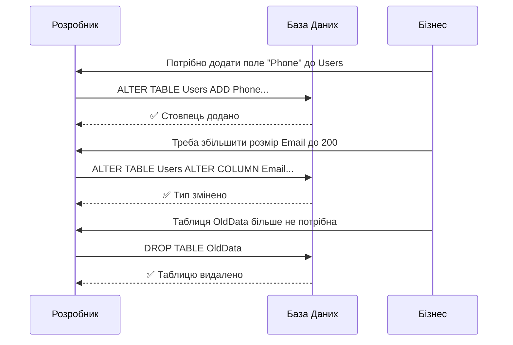

# DDL - Зміна та видалення таблиць (ALTER, DROP)

## Навіщо змінювати існуючі таблиці?

У реальних проектах вимоги змінюються з часом:

::mermaid



::

**Типові сценарії**:

- Додавання нових функцій (нові стовпці)
- Виправлення помилок проектування
- Оптимізація performance
- Видалення застарілих структур

::caution
**КРИТИЧНО ВАЖЛИВО**: ALTER та DROP команди змінюють структуру БД **назавжди**. На production середовищі завжди робіть backup перед виконанням DDL команд!
::

---

## ALTER TABLE: Зміна структури таблиці

**ALTER TABLE** — це потужна команда, яка дозволяє змінювати існуючі таблиці без втрати даних.

### Загальний синтаксис

```sql
ALTER TABLE table_name
{
    ADD column_definition |
    ALTER COLUMN column_name new_data_type |
    DROP COLUMN column_name |
    ADD CONSTRAINT constraint_definition |
    DROP CONSTRAINT constraint_name
};
```

---

## ADD COLUMN: Додавання стовпців

### Базовий синтаксис

```sql
ALTER TABLE table_name
ADD column_name data_type [constraints];
```

### Приклад 1: Додавання простого стовпця

```sql
-- Додаємо стовпець PhoneNumber до таблиці Students
ALTER TABLE Students
ADD PhoneNumber NVARCHAR(20) NULL;
```

**Що відбувається**:

1. SQL Server додає новий стовпець `PhoneNumber` до таблиці
2. Для **всіх існуючих записів** значення цього стовпця буде `NULL`
3. Структура таблиці змінюється, але дані зберігаються

**Перевірка**:

```sql
-- Подивимося на оновлену структуру
SELECT COLUMN_NAME, DATA_TYPE, IS_NULLABLE
FROM INFORMATION_SCHEMA.COLUMNS
WHERE TABLE_NAME = 'Students';
```

### Приклад 2: Додавання стовпця з DEFAULT

Якщо додаємо **NOT NULL** стовпець до таблиці з даними, потрібно вказати DEFAULT:

```sql
-- ❌ ПОМИЛКА - NOT NULL без DEFAULT для існуючих записів
ALTER TABLE Students
ADD IsActive BIT NOT NULL;
-- Msg 515: Cannot insert NULL into column 'IsActive'

-- ✅ ПРАВИЛЬНО - з DEFAULT значенням
ALTER TABLE Students
ADD IsActive BIT NOT NULL DEFAULT 1;
```

**Пояснення**:

- Існуючі записи отримають значення `1` (за замовчуванням)
- Нові записи також матимуть `1`, якщо не вказано інше

### Приклад 3: Додавання обчислюваного стовпця

```sql
-- Додаємо обчислюваний стовпець Age (вік на основі дати народження)
ALTER TABLE Students
ADD Age AS (DATEDIFF(YEAR, BirthDate, GETDATE())) PERSISTED;
```

### Додавання кількох стовпців одночасно

```sql
-- Додаємо декілька стовпців за один раз
ALTER TABLE Students
ADD
    PhoneNumber NVARCHAR(20) NULL,
    Address NVARCHAR(200) NULL,
    City NVARCHAR(50) NULL,
    PostalCode NVARCHAR(10) NULL;
```

::tip
**Best Practice**: Додавайте кілька стовпців одним запитом для кращої performance та логування.
::

---

## ALTER COLUMN: Зміна типу даних

### Базовий синтаксис

```sql
ALTER TABLE table_name
ALTER COLUMN column_name new_data_type [NULL | NOT NULL];
```

### Приклад 1: Збільшення розміру текстового поля

```sql
-- Збільшуємо розмір FirstName з 50 до 100 символів
ALTER TABLE Students
ALTER COLUMN FirstName NVARCHAR(100) NOT NULL;
```

::note
**Безпечна операція**: Збільшення розміру VARCHAR/NVARCHAR завжди безпечне - дані не втрачаються.
::

### Приклад 2: Зменшення розміру (НЕБЕЗПЕЧНО!)

```sql
-- ⚠️ НЕБЕЗПЕЧНО - зменшуємо розмір Email з 100 до 50
ALTER TABLE Students
ALTER COLUMN Email NVARCHAR(50) NULL;
```

::warning
**Ризик втрати даних**: Якщо існують записи з Email довше 50 символів, операція **FAILНЕ ВИКОНАЄТЬСЯ**!

```sql
-- Msg 8152: String or binary data would be truncated
```

**Що робити**:

1. Перевірте максимальну довжину ПЕРЕД зміною:
    ```sql
    SELECT MAX(LEN(Email)) AS MaxEmailLength FROM Students;
    ```
2. Якщо потрібно, очистіть/скоротіть дані спочатку

::

### Приклад 3: Зміна типу даних з конверсією

```sql
-- Припустимо, Age зараз NVARCHAR (помилка проектування)
-- Хочемо змінити на INT

-- Крок 1: Перевіряємо, чи всі значення можна конвертувати
SELECT Age
FROM Students
WHERE ISNUMERIC(Age) = 0;  -- Знайти некоректні значення

-- Крок 2: Виправляємо некоректні значення (якщо є)
UPDATE Students
SET Age = NULL
WHERE ISNUMERIC(Age) = 0;

-- Крок 3: Змінюємо тип
ALTER TABLE Students
ALTER COLUMN Age INT NULL;
```

### Обмеження при зміні типу

**НЕ МОЖНА** змінити тип, якщо:

::field-group

::field{name="Стовпець є частиною індексу" type="error"}
Спочатку видаліть індекс, потім зміність тип, потім створіть індекс знову
::

::field{name="Стовпець є частиною PRIMARY KEY або FOREIGN KEY" type="error"}
Видаліть constraint, змініть тип, додайте constraint знову
::

::field{name="Стовпець має DEFAULT constraint" type="error"}
Видаліть DEFAULT, змініть тип, додайте DEFAULT знову
::

::field{name="Стовпець використовується в computed column" type="error"}
Видаліть computed column або змініть його визначення
::

::

---

## DROP COLUMN: Видалення стовпців

### Базовий синтаксис

```sql
ALTER TABLE table_name
DROP COLUMN column_name;
```

::caution
**НЕЗВОРОТНА ОПЕРАЦІЯ**: Після видалення стовпця **ВСІ ДАНІ** в ньому втрачаються назавжди (без backup)!
::

### Приклад 1: Видалення одного стовпця

```sql
-- Видаляємо стовпець PhoneNumber
ALTER TABLE Students
DROP COLUMN PhoneNumber;
```

### Приклад 2: Видалення кількох стовпців

```sql
-- Видаляємо кілька стовпців одночасно
ALTER TABLE Students
DROP COLUMN Address, City, PostalCode;
```

### Обмеження при видаленні

**НЕ МОЖНА** видалити стовпець, якщо:

```sql
-- ❌ Стовпець є PRIMARY KEY
ALTER TABLE Students
DROP COLUMN Id;
-- Msg 5074: The object 'PK_Students' is dependent on column 'Id'

-- ❌ Стовпець є FOREIGN KEY
ALTER TABLE Enrollments
DROP COLUMN StudentId;
-- Msg 5074: The object 'FK_Enrollments_Students' is dependent on column 'StudentId'

-- ❌ Стовпець має індекс
-- ❌ Стовпець використовується в computed column
-- ❌ Стовпець має constraint
```

**Розв'язок**: Спочатку видаліть залежності, потім стовпець:

```sql
-- Крок 1: Видалити constraint
ALTER TABLE Students
DROP CONSTRAINT UQ_Students_Email;

-- Крок 2: Видалити стовпець
ALTER TABLE Students
DROP COLUMN Email;
```

---

## ADD CONSTRAINT: Додавання обмежень

Ви можете додавати constraints до існуючих таблиць.

### PRIMARY KEY

```sql
-- Додаємо PRIMARY KEY до існуючої таблиці
ALTER TABLE Products
ADD CONSTRAINT PK_Products PRIMARY KEY (ProductId);
```

::warning
**Вимога**: Стовпець має бути **NOT NULL** і містити **унікальні** значення.
::

### FOREIGN KEY

```sql
-- Додаємо зв'язок між Enrollments та Students
ALTER TABLE Enrollments
ADD CONSTRAINT FK_Enrollments_Students
    FOREIGN KEY (StudentId) REFERENCES Students(Id)
    ON DELETE CASCADE
    ON UPDATE CASCADE;
```

**Що перевіряється при додаванні FK**:

- Всі значення `StudentId` в `Enrollments` мають існувати в `Students.Id`
- Якщо є "orphan" записи (посилання на неіснуючі ID), операція не виконається

**Приклад помилки**:

```sql
-- Якщо є StudentId = 999, але такого студента немає
ALTER TABLE Enrollments
ADD CONSTRAINT FK_Enrollments_Students...
-- ❌ Msg 547: The ALTER TABLE statement conflicted with the FOREIGN KEY constraint
```

**Виправлення**:

```sql
-- Знайти orphan записи
SELECT DISTINCT StudentId
FROM Enrollments
WHERE StudentId NOT IN (SELECT Id FROM Students);

-- Видалити або виправити їх
DELETE FROM Enrollments WHERE StudentId NOT IN (SELECT Id FROM Students);
```

### UNIQUE

```sql
-- Додаємо унікальність Email
ALTER TABLE Students
ADD CONSTRAINT UQ_Students_Email UNIQUE (Email);
```

### CHECK

```sql
-- Додаємо валідацію для віку
ALTER TABLE Students
ADD CONSTRAINT CK_Students_Age CHECK (Age >= 16 AND Age <= 100);

-- Додаємо валідацію для грантів
ALTER TABLE Students
ADD CONSTRAINT CK_Students_Grants CHECK (Grants >= 0);
```

::note
**Перевірка існуючих даних**: При додаванні CHECK constraint SQL Server перевіряє **ВСІ** існуючі записи. Якщо хоча б один запис порушує умову - операція не виконається.
::

### DEFAULT

```sql
-- Додаємо значення за замовчуванням
ALTER TABLE Students
ADD CONSTRAINT DF_Students_IsActive DEFAULT 1 FOR IsActive;
```

**З WITH VALUES** (застосувати до існуючих NULL записів):

```sql
-- Застосувати DEFAULT до існуючих записів з NULL
ALTER TABLE Students
ADD CONSTRAINT DF_Students_Country DEFAULT 'Ukraine' FOR Country WITH VALUES;
```

---

## DROP CONSTRAINT: Видалення обмежень

### Базовий синтаксис

```sql
ALTER TABLE table_name
DROP CONSTRAINT constraint_name;
```

### Приклади

```sql
-- Видалити PRIMARY KEY
ALTER TABLE Products
DROP CONSTRAINT PK_Products;

-- Видалити FOREIGN KEY
ALTER TABLE Enrollments
DROP CONSTRAINT FK_Enrollments_Students;

-- Видалити UNIQUE
ALTER TABLE Students
DROP CONSTRAINT UQ_Students_Email;

-- Видалити CHECK
ALTER TABLE Students
DROP CONSTRAINT CK_Students_Age;

-- Видалити DEFAULT
ALTER TABLE Students
DROP CONSTRAINT DF_Students_IsActive;
```

### Як знайти назву constraint?

Якщо ви не пам'ятаєте назву constraint:

```sql
-- Знайти всі constraints для таблиці Students
SELECT
    CONSTRAINT_NAME,
    CONSTRAINT_TYPE
FROM INFORMATION_SCHEMA.TABLE_CONSTRAINTS
WHERE TABLE_NAME = 'Students';

-- Результат:
-- PK_Students        PRIMARY KEY
-- FK_Enrollments_S...  FOREIGN KEY
-- UQ_Students_Email  UNIQUE
-- CK_Students_Age    CHECK
```

Або для детальнішої інформації:

```sql
-- Детальна інформація про constraints
EXEC sp_helpconstraint 'Students';
```

---

## Робота з індексами (короткий огляд)

Індекси - це окрема велика тема, але ось базові операції:

### CREATE INDEX

```sql
-- Створити індекс на стовпці LastName для швидшого пошуку
CREATE INDEX IX_Students_LastName
ON Students(LastName);

-- Створити composite індекс
CREATE INDEX IX_Students_Name
ON Students(LastName, FirstName);

-- Створити UNIQUE індекс
CREATE UNIQUE INDEX IX_Students_Email
ON Students(Email);
```

### DROP INDEX

```sql
-- Видалити індекс
DROP INDEX IX_Students_LastName ON Students;
```

::note
**Детальніше про індекси**: Для повного розуміння індексів, їх типів (CLUSTERED, NONCLUSTERED), стратегій оптимізації та best practices дивіться окрему тему: [Індекси в MS SQL Server](../02.ms-sql-server-start/02.sql-indexes.md)
::

---

## DROP TABLE: Видалення таблиці

### Базовий синтаксис

```sql
DROP TABLE table_name;
```

::caution
**КРИТИЧНО**: DROP TABLE **назавжди видаляє**:

- Структуру таблиці
- ВСІ дані
- Всі індекси
- Всі constraints
- Всі triggers

**Без можливості відновлення** (окрім backup)!
::

### Приклад

```sql
-- Видалити таблицю OldData
DROP TABLE OldData;
```

### Проблема: Foreign Key блокує видалення

```sql
-- Спроба видалити Students
DROP TABLE Students;
-- ❌ Msg 3726: Could not drop object 'Students' because it is referenced by a FOREIGN KEY constraint

-- Розв'язок 1: Спочатку видалити дочірню таблицю
DROP TABLE Enrollments;  -- Має FK на Students
DROP TABLE Students;      -- Тепер можна

-- Розв'язок 2: Видалити FK constraint
ALTER TABLE Enrollments DROP CONSTRAINT FK_Enrollments_Students;
DROP TABLE Students;
```

### DROP TABLE IF EXISTS (SQL Server 2016+)

Безпечна версія, яка не генерує помилку, якщо таблиці немає:

```sql
-- SQL Server 2016+
DROP TABLE IF EXISTS OldData;

-- Для старіших версій
IF OBJECT_ID('OldData', 'U') IS NOT NULL
BEGIN
    DROP TABLE OldData;
END
```

### Видалення кількох таблиць

```sql
-- Видалити кілька таблиць одночасно
DROP TABLE Table1, Table2, Table3;
```

---

## TRUNCATE TABLE: Очищення даних

**TRUNCATE TABLE** — швидке видалення **ВСІХ** даних з таблиці, але зберігає структуру.

### Синтаксис

```sql
TRUNCATE TABLE table_name;
```

### Приклад

```sql
-- Видалити всі дані з таблиці Logs
TRUNCATE TABLE Logs;
-- Таблиця існує, але порожня
```

### TRUNCATE vs DELETE

::tabs

::tabs-item{label="TRUNCATE TABLE"}

**Характеристики**:

- :icon{name="i-lucide-zap"} **Дуже швидко** (мінімальне логування)
- :icon{name="i-lucide-trash-2"} Видаляє **ВСІ** дані (не можна вказати WHERE)
- :icon{name="i-lucide-rotate-ccw"} **Скидає IDENTITY** counter до початкового значення
- :icon{name="i-lucide-shield-off"} **НЕ можна відкотити** (rollback) в транзакції (в більшості випадків)
- :icon{name="i-lucide-lock"} Блокує всю таблицю

```sql
TRUNCATE TABLE Students;
-- Всі студенти видалені, наступний Id почнеться з 1
```

::

::tabs-item{label="DELETE"}

**Характеристики**:

- :icon{name="i-lucide-clock"} Повільніше (повне логування кожного рядка)
- :icon{name="i-lucide-filter"} Можна вказати **WHERE** для вибіркового видалення
- :icon{name="i-lucide-hash"} **НЕ скидає IDENTITY** counter
- :icon{name="i-lucide-rotate-ccw"} **Можна відкотити** (rollback) в транзакції
- :icon{name="i-lucide-unlock"} Блокує окремі рядки

```sql
DELETE FROM Students;
-- Всі студенти видалені, але наступний Id продовжить нумерацію
-- (якщо останній був 100, наступний буде 101)
```

::

::

### Порівняльна таблиця

| Характеристика    | TRUNCATE TABLE                                                | DELETE (без WHERE)                                            | DROP TABLE                                               |
| :---------------- | :------------------------------------------------------------ | :------------------------------------------------------------ | :------------------------------------------------------- |
| Швидкість         | :icon{name="i-lucide-zap" class="text-green-500"} Дуже швидко | :icon{name="i-lucide-clock" class="text-yellow-500"} Повільно | :icon{name="i-lucide-zap" class="text-green-500"} Швидко |
| Логування         | Мінімальне                                                    | Повне (кожен рядок)                                           | Мінімальне                                               |
| WHERE clause      | :icon{name="i-lucide-x" class="text-red-500"} Ні              | :icon{name="i-lucide-check" class="text-green-500"} Так       | N/A                                                      |
| IDENTITY reset    | :icon{name="i-lucide-check" class="text-green-500"} Так       | :icon{name="i-lucide-x" class="text-red-500"} Ні              | :icon{name="i-lucide-check" class="text-green-500"} Так  |
| Rollback          | Обмежено                                                      | :icon{name="i-lucide-check" class="text-green-500"} Так       | Обмежено                                                 |
| Структура таблиці | Зберігається                                                  | Зберігається                                                  | **Видаляється**                                          |
| Constraints       | Зберігаються                                                  | Зберігаються                                                  | **Видаляються**                                          |
| Triggers          | НЕ спрацьовують                                               | Спрацьовують                                                  | НЕ спрацьовують                                          |
| З FK references   | :icon{name="i-lucide-x" class="text-red-500"} Помилка         | :icon{name="i-lucide-check" class="text-green-500"} Можливо\* | :icon{name="i-lucide-x" class="text-red-500"} Помилка    |

_\* Якщо є ON DELETE CASCADE або дочірні таблиці порожні_

### Коли використовувати TRUNCATE

::code-group

```sql [Очищення тестових даних ✅]
-- Швидко очистити таблицю після тестів
TRUNCATE TABLE TestResults;
```

```sql [Очищення тимчасових таблиць ✅]
-- Підготувати таблицю до нового завантаження
TRUNCATE TABLE StagingData;
```

```sql [Скидання счетчика IDENTITY ✅]
-- Почати нумерацію з 1 знову
TRUNCATE TABLE NewTable;
```

```sql [Вибіркове видалення ❌]
-- ПОМИЛКА - TRUNCATE не підтримує WHERE
TRUNCATE TABLE Students WHERE Age < 18;
-- Використовуйте DELETE
DELETE FROM Students WHERE Age < 18;
```

::

---

## Практичні сценарії

### Сценарій 1: Міграція схеми (додавання поля)

**Завдання**: Додати поле `CreatedAt` до існуючої таблиці `Users`.

```sql
-- Крок 1: Додати стовпець з DEFAULT для існуючих записів
ALTER TABLE Users
ADD CreatedAt DATETIME NOT NULL DEFAULT GETDATE();

-- Крок 2: Оновити DEFAULT для майбутніх вставок (опціонально)
-- За замовчуванням DEFAULT вже встановлено

-- Крок 3: Перевірка
SELECT TOP 5 UserId, Username, CreatedAt FROM Users;
```

### Сценарій 2: Рефакторинг БД (розділення стовпця)

**Завдання**: Розділити поле `FullName` на `FirstName` та `LastName`.

```sql
-- Припустимо, FullName = "Петренко Іван"

-- Крок 1: Додати нові стовпці
ALTER TABLE Users
ADD
    FirstName NVARCHAR(50) NULL,
    LastName NVARCHAR(50) NULL;

-- Крок 2: Заповнити нові стовпці з існуючих даних
UPDATE Users
SET
    LastName = LEFT(FullName, CHARINDEX(' ', FullName) - 1),
    FirstName = SUBSTRING(FullName, CHARINDEX(' ', FullName) + 1, LEN(FullName));

-- Крок 3: Перевірити результат
SELECT FullName, FirstName, LastName FROM Users;

-- Крок 4: Зробити нові стовпці обов'язковими (якщо потрібно)
ALTER TABLE Users
ALTER COLUMN FirstName NVARCHAR(50) NOT NULL;

ALTER TABLE Users
ALTER COLUMN LastName NVARCHAR(50) NOT NULL;

-- Крок 5: Видалити старий стовпець (після підтвердження)
ALTER TABLE Users
DROP COLUMN FullName;
```

### Сценарій 3: Додавання Foreign Key до існуючих таблиць

**Завдання**: Встановити зв'язок між `Orders` та `Customers`.

```sql
-- Крок 1: Перевірити orphan записи (замовлення без клієнтів)
SELECT DISTINCT CustomerId
FROM Orders
WHERE CustomerId NOT IN (SELECT CustomerId FROM Customers);

-- Крок 2: Виправити orphan записи
-- Варіант A: Видалити orphan records
DELETE FROM Orders
WHERE CustomerId NOT IN (SELECT CustomerId FROM Customers);

-- Варіант B: Встановити CustomerID в NULL або default значення
UPDATE Orders
SET CustomerId = NULL  -- або якесь default значення
WHERE CustomerId NOT IN (SELECT CustomerId FROM Customers);

-- Крок 3: Додати Foreign Key
ALTER TABLE Orders
ADD CONSTRAINT FK_Orders_Customers
    FOREIGN KEY (CustomerId) REFERENCES Customers(CustomerId)
    ON DELETE NO ACTION;

-- Крок 4: Перевірка
EXEC sp_helpconstraint 'Orders';
```

### Сценарій 4: Версіонування схеми БД

Профес approach до міграцій:

```sql
-- Файл: Migration_001_AddUserPreferences.sql

BEGIN TRANSACTION;

-- Перевірити, чи міграція вже виконана
IF NOT EXISTS (
    SELECT 1 FROM INFORMATION_SCHEMA.COLUMNS
    WHERE TABLE_NAME = 'Users' AND COLUMN_NAME = 'PreferredLanguage'
)
BEGIN
    PRINT 'Applying migration 001: Adding user preferences';

    -- Додати стовпці
    ALTER TABLE Users
    ADD
        PreferredLanguage NVARCHAR(10) DEFAULT 'uk' NOT NULL,
        Theme NVARCHAR(20) DEFAULT 'light' NOT NULL,
        NotificationsEnabled BIT DEFAULT 1 NOT NULL;

    -- Створити індекс
    CREATE INDEX IX_Users_Language ON Users(PreferredLanguage);

    PRINT 'Migration 001 completed successfully';
END
ELSE
BEGIN
    PRINT 'Migration 001 already applied, skipping';
END

COMMIT TRANSACTION;
```

---

## Best Practices для ALTER TABLE

::card-group

::card{title="1. Завжди робіть BACKUP перед DDL" icon="i-lucide-database"}

```sql
-- Перед виконанням ALTER на production
BACKUP DATABASE YourDatabase
TO DISK = 'C:\\Backups\\YourDB_BeforeAlter.bak';
```

::

::card{title="2. Тестуйте на копії БД" icon="i-lucide-test-tube"}

Ніколи не запускайте DDL команди на production без тестування на dev/staging:

```sql
-- 1. Створити копію структури
SELECT * INTO Students_BACKUP FROM Students;

-- 2. Протестувати ALTER
ALTER TABLE Students_BACKUP ADD NewColumn INT;

-- 3. Якщо все добре - застосувати на Students
```

::

::card{title="3. Використовуйте транзакції (де можливо)" icon="i-lucide-git-branch"}

```sql
BEGIN TRANSACTION;

ALTER TABLE Users ADD NewColumn INT;
-- Перевірити результат
SELECT TOP 5 * FROM Users;

-- Якщо все добре
COMMIT;
-- Якщо щось не так
-- ROLLBACK;
```

::

::card{title="4. Додавайте стовпці з DEFAULT" icon="i-lucide-plus-circle"}

Для NOT NULL стовпців завжди вказуйте DEFAULT:

```sql
-- ✅ Добре
ALTER TABLE Users
ADD CreatedAt DATETIME NOT NULL DEFAULT GETDATE();

-- ❌ Погано (помилка для існуючих записів)
ALTER TABLE Users
ADD CreatedAt DATETIME NOT NULL;
```

::

::card{title="5. Перевіряйте залежності" icon="i-lucide-link"}

Перед видаленням стовпців/constraints:

```sql
-- Знайти всі залежності стовпця
EXEC sp_depends 'Students.Email';

-- Знайти всі FK що посилаються на таблицю
SELECT
    OBJECT_NAME(parent_object_id) AS ReferencingTable,
    name AS ForeignKeyName
FROM sys.foreign_keys
WHERE referenced_object_id = OBJECT_ID('Students');
```

::

::card{title="6. Документуйте зміни" icon="i-lucide-file-text"}

Зберігайте всі DDL скрипти в системі контролю версій (Git):

```
migrations/
  001_add_user_preferences.sql
  002_refactor_full_name.sql
  003_add_email_index.sql
```

::

::

---

## Практичні завдання

::accordion

::accordion-item{label="Завдання 1: Розширення таблиці Students" icon="i-lucide-user-plus"}

Додайте до таблиці `Students` наступні поля:

- `Gender` - стать ('M', 'F', 'Other'), NOT NULL з DEFAULT 'Other'
- `EnrollmentDate` - дата зарахування, NOT NULL з DEFAULT поточною датою
- `GPA` - середній бал (0.00 - 5.00), NULL, з CHECK constraint

<details>
<summary>💡 Розв'язок</summary>

```sql
ALTER TABLE Students
ADD
    Gender NVARCHAR(10) NOT NULL DEFAULT 'Other',
    EnrollmentDate DATE NOT NULL DEFAULT GETDATE(),
    GPA DECIMAL(3, 2) NULL;

-- Додати CHECK constraint
ALTER TABLE Students
ADD CONSTRAINT CK_Students_GPA CHECK (GPA BETWEEN 0.00 AND 5.00);

-- Додати CHECK для Gender
ALTER TABLE Students
ADD CONSTRAINT CK_Students_Gender CHECK (Gender IN ('M', 'F', 'Other'));
```

</details>

::

::accordion-item{label="Завдання 2: Зміна розміру Email" icon="i-lucide-mail"}

Збільшіть розмір поля `Email` в таблиці `Students` з 100 до 255 символів.

<details>
<summary>💡 Розв'язок</summary>

```sql
-- Спочатку перевіримо поточну максимальну довжину
SELECT MAX(LEN(Email)) AS MaxEmailLength FROM Students;

-- Збільшимо розмір
ALTER TABLE Students
ALTER COLUMN Email NVARCHAR(255) NULL;

-- Перевіримо зміну
SELECT COLUMN_NAME, DATA_TYPE, CHARACTER_MAXIMUM_LENGTH
FROM INFORMATION_SCHEMA.COLUMNS
WHERE TABLE_NAME = 'Students' AND COLUMN_NAME = 'Email';
```

</details>

::

::accordion-item{label="Завдання 3: Видалення застарілого поля" icon="i-lucide-trash-2"}

Видаліть поле `Grants` з таблиці `Students`, якщо воно існує. Але спочатку перевірте, чи немає залежностей.

<details>
<summary>💡 Розв'язок</summary>

```sql
-- Крок 1: Перевірити залежності
EXEC sp_depends 'Students.Grants';

-- Крок 2: Перевірити constraints
SELECT CONSTRAINT_NAME
FROM INFORMATION_SCHEMA.CONSTRAINT_COLUMN_USAGE
WHERE TABLE_NAME = 'Students' AND COLUMN_NAME = 'Grants';

-- Крок 3: Видалити constraint (якщо є)
-- ALTER TABLE Students DROP CONSTRAINT CK_Students_Grants;

-- Крок 4: Видалити стовпець
ALTER TABLE Students
DROP COLUMN Grants;

-- Крок 5: Перевірка
SELECT * FROM INFORMATION_SCHEMA.COLUMNS WHERE TABLE_NAME = 'Students';
```

</details>

::

::accordion-item{label="Завдання 4: Додавання та налаштування Foreign Key" icon="i-lucide-link"}

Створіть таблицю `Departments` та додайте foreign key зв'язок з `Students`.

<details>
<summary>💡 Розв'язок</summary>

```sql
-- Крок 1: Створити таблицю Departments
CREATE TABLE Departments (
    DepartmentId INT PRIMARY KEY IDENTITY(1, 1),
    DepartmentName NVARCHAR(100) NOT NULL,
    Faculty NVARCHAR(100) NOT NULL
);

-- Крок 2: Додати DepartmentId до Students
ALTER TABLE Students
ADD DepartmentId INT NULL;

-- Крок 3: Заповнити тестовими даними
INSERT INTO Departments (DepartmentName, Faculty)
VALUES
    ('Computer Science', 'Engineering'),
    ('Mathematics', 'Science');

-- Крок 4: Встановити DepartmentId для існуючих студентів
UPDATE Students SET DepartmentId = 1;

-- Крок 5: Зробити поле обов'язковим
ALTER TABLE Students
ALTER COLUMN DepartmentId INT NOT NULL;

-- Крок 6: Додати Foreign Key
ALTER TABLE Students
ADD CONSTRAINT FK_Students_Departments
    FOREIGN KEY (DepartmentId) REFERENCES Departments(DepartmentId)
    ON DELETE NO ACTION
    ON UPDATE CASCADE;

-- Перевірка
EXEC sp_helpconstraint 'Students';
```

</details>

::

::

---

## Резюме

::tip
**Ключові моменти ALTER TABLE та DROP**:

**ALTER TABLE** - зміна структури:

1. **ADD COLUMN** — додавання нових стовпців (з DEFAULT для NOT NULL)
2. **ALTER COLUMN** — зміна типу даних (обережно з зменшенням розміру!)
3. **DROP COLUMN** — видалення стовпців (незворотно, видаліть залежності спочатку)
4. **ADD/DROP CONSTRAINT** — керування обмеженнями

**DROP TABLE**:

- Повне видалення таблиці (структура + дані)
- Використовуйте `IF EXISTS` для безпеки
- Foreign Keys блокують видалення

**TRUNCATE TABLE**:

- Швидке очищення всіх даних
- Скидає IDENTITY counter
- Не підтримує WHERE
- Швидше за DELETE, але менш гнучке

**Best Practices**:

1. Завжди робіть backup перед DDL на production
2. Тестуйте зміни на копії БД
3. Документуйте всі міграції схеми
4. Перевіряйте залежності перед видаленням
5. Використовуйте версіонування для міграцій

::

---

**Пов'язані теми**:

- [Попередня: CREATE TABLE](./01.ddl-create-table.md)
- [Наступна: SELECT запити - Основи](./03.select-queries-fundamentals.md)
- [Індекси в SQL Server](../02.ms-sql-server-start/02.indexes.md)
