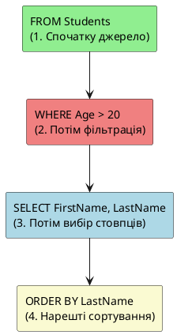

# SELECT запити - Основи

## Проблема: Як отримати дані з бази?

Ви створили таблицю Students, заповнили її даними. Але як тепер **витягнути** (retrieve) ці дані? Як знайти конкретного студента? Як відсортувати список за прізвищем?

::mermaid


::

**SELECT** — це найважлив найважливіша команда в SQL, яка дозволяє **читати** дані з таблиць.

::note
**Статистика**: В реальних проектах близько **90%** всіх SQL-запитів — це SELECT. Тому дуже важливо розуміти його детально!

::

---

## Чому SELECT - це DML, а не DDL?

Пригадаймо різницю:

::tabs

::tabs-item{label="DDL (Data Definition Language)"}
Робота зі **структурою** БД:

- CREATE TABLE
- ALTER TABLE
- DROP TABLE

**НЕ працює з даними всередині таблиць**

::

::tabs-item{label="DML (Data Manipulation Language)"}
Робота з **даними** всередині таблиць:

- **SELECT** — читання даних
- INSERT — додавання даних
- UPDATE — оновлення даних
- DELETE — видалення даних

**НЕ змінює структуру таблиць**

::

::

SELECT відноситься до **DML**, оскільки працює з даними, а не зі structure.

---

## Фундаментальні концепції

### Декларативна природа SQL

SQL — це **декларативна** мова програмування. Ви описуєте **ЩО** потрібно отримати, а не **ЯК** це зробити.

::code-group

```txt [Імперативно (як в C#/Java)]
// Ви описуєте КРОКИ
1. Відкрити таблицю Students
2. Пройтися по кожному рядку
3. Для кожного рядка перевірити: Age > 20?
4. Якщо так - додати до результату
5. Повернути результат
```

```sql [Декларативно (SQL)]
-- Ви описуєте РЕЗУЛЬТАТ
SELECT *
FROM Students
WHERE Age > 20;

-- SQL Server сам вирішує ЯК це зробити
-- (індекси, план виконання, оптимізація)
```

::

### Result Set: Віртуальна таблиця

Результат SELECT — це **result set** (набір результатів) — віртуальна таблиця в пам'яті:

```sql
SELECT FirstName, LastName FROM Students;
```

Result Set:

| FirstName | LastName  |
| :-------- | :-------- |
| Іван      | Петренко  |
| Марія     | Коваленко |
| ...       | ...       |

::tip
**Ключова відмінність**: Result Set існує тільки на час виконання запиту. Це **НЕ** реальна таблиця в БД!

::

### Порядок логічного виконання

SQL запит виконується **НЕ** в тому порядку, в якому ви його пишете!

::plant-uml



::

**Логічний порядок виконання**:

1. **FROM** — визначити джерело даних (таблицю)
2. **WHERE** — відфільтрувати рядки
3. **SELECT** — вибрати стовпці
4. **ORDER BY** — відсортувати результат

::warning
**Важливо**: Це **логічний** порядок обробки запиту SQL Server. Фізичний порядок може відрізнятися через оптимізацію.

::

---

## Базовий синтаксис SELECT

### Мінімальний запит

```sql
SELECT * FROM Students;
```

**Анатомія**:

- `SELECT` — ключове слово команди
- `*` — вибрати **всі** стовпці
- `FROM Students` — з таблиці Students

**Результат**: Всі рядки і всі стовпці таблиці Students.

### SELECT конкретних стовпців

```sql
SELECT FirstName, LastName FROM Students;
```

**Результат**: Тільки два стовпці (FirstName, LastName) для всіх студентів.

::tip
**Best Practice**: **Уникайте SELECT \*** в production коді:

- Повертає зайві дані (погіршує performance)
- Код стає менш читабельним
- Зміни в структурі таблиці можуть зламати код

**Виняток**: SELECT \* прийнятний для швидкого тестування/дебагу.

::

### Порядок стовпців

Порядок стовпців в SELECT визначає порядок в result set:

```sql
SELECT LastName, FirstName, BirthDate FROM Students;
```

Result Set:

| LastName | FirstName | BirthDate  |
| :------- | :-------- | :--------- |
| Петренко | Іван      | 1998-03-15 |
| ...      | ...       | ...        |

---

## Псевдоніми (AS - Aliases)

Псевдоніми дозволяють **перейменувати** стовпці або таблиці в result set.

### Псевдоніми для стовпців

```sql
SELECT
    FirstName AS "Ім'я",
    LastName AS Прізвище,
    BirthDate AS ДатаНародження
FROM Students;
```

Result Set:

| Ім'я | Прізвище | ДатаНародження |
| :--- | :------- | :------------- |
| Іван | Петренко | 1998-03-15     |
| ...  | ...      | ...            |

**Варіанти синтаксису**:

::code-group

```sql [З ключовим словом AS (рекомендовано)]
SELECT FirstName AS Name FROM Students;
```

```sql [Без AS (допустимо)]
SELECT FirstName Name FROM Students;
```

```sql [З квадратними дужками (для спецсимволів)]
SELECT FirstName AS [Student Name] FROM Students;
```

::

::note
Використовуйте квадратні дужки `[]` для псевдонімів з пробілами або спецсимволамиімів з пробілами.

::

### Псевдоніми для таблиць

Корисно для коротких назв або при JOIN (який розглянемо пізніше):

```sql
SELECT s.FirstName, s.LastName
FROM Students AS s;
--             ^^^^
--             Псевдонім таблиці
```

---

## Конкатенація та арифметичні операції

### Конкатенація рядків

Об'єднання текстових полів в одне:

```sql
SELECT
    FirstName + ' ' + LastName AS FullName
FROM Students;
```

Result Set:

| FullName        |
| :-------------- |
| Іван Петренко   |
| Марія Коваленко |
| ...             |

**Приклад з форматуванням**:

```sql
SELECT
    'Student: ' + LastName + ', ' + FirstName + ' (ID: ' + CAST(Id AS NVARCHAR) + ')' AS StudentInfo
FROM Students;
```

Result Set:

```
Student: Петренко, Іван (ID: 1)
Student: Коваленко, Марія (ID: 2)
```

::warning
**Проблема з NULL**: Якщо хоча б одне поле NULL, результат конкатенації буде NULL!

```sql
SELECT 'Email: ' + Email FROM Students WHERE Id = 4;
-- Email поле може бути NULL
-- Результат: NULL (не "Email: NULL")
```

**Розв'язок**: Використовуйте `ISNULL()` або `COALESCE()`:

```sql
SELECT 'Email: ' + ISNULL(Email, 'Not provided') FROM Students;
```

::

### Арифметичні операції

```sql
SELECT
    Grants,
    Grants * 1.1 AS GrantsWithIncrease,
    Grants * 12 AS YearlyGrants
FROM Students
WHERE Grants IS NOT NULL;
```

Result Set:

| Grants  | GrantsWithIncrease | YearlyGrants |
| :------ | :----------------- | :----------- |
| 1200.00 | 1320.00            | 14400.00     |
| 1500.00 | 1650.00            | 18000.00     |

**Доступні оператори**:

- `+` — додавання
- `-` — віднімання
- `*` — множення
- `/` — ділення
- `%` — остача від ділення (modulo)

---

## Функції перетворення: CAST та CONVERT

Інодіколи потрібно **перетворити** один тип даних в інший.

### CAST Function

**Стандартний SQL спосіб** (рекомендовано):

```sql
SELECT
    Id,
    CAST(Id AS NVARCHAR(10)) AS IdAsString,
    CAST(Grants AS INT) AS GrantsRounded
FROM Students;
```

**Синтаксис**: `CAST(expression AS data_type)`

### CONVERT Function

**T-SQL специфічний спосіб** з додатковими можливостями форматування:

```sql
SELECT
    BirthDate,
    CONVERT(NVARCHAR, BirthDate, 104) AS DateGerman,  -- DD.MM.YYYY
    CONVERT(NVARCHAR, BirthDate, 103) AS DateBritish, -- DD/MM/YYYY
    CONVERT(NVARCHAR, BirthDate, 101) AS DateUSA      -- MM/DD/YYYY
FROM Students;
```

Result Set:

| BirthDate  | DateGerman | DateBritish | DateUSA    |
| :--------- | :--------- | :---------- | :--------- |
| 1998-03-15 | 15.03.1998 | 15/03/1998  | 03/15/1998 |

**Синтаксис**: `CONVERT(data_type, expression, style)`

::tip
**Коли використовувати що**:

- **CAST** — для простих перетворень (портабельніше)
- **CONVERT** — коли потрібен специфічний формат дат

::

### Приклади перетворення

::code-group

```sql [Число в текст]
SELECT CAST(1234 AS NVARCHAR) AS NumberAsString;
-- Результат: '1234'
```

```sql [Текст в число]
SELECT CAST('1234' AS INT) AS StringAsNumber;
-- Результат: 1234
```

```sql [Дата в текст]
SELECT CAST(GETDATE() AS NVARCHAR) AS DateAsString;
-- Результат: 'Feb  7 2026 10:30PM'
```

```sql [DECIMAL в INT (з округленням)]
SELECT
    1234.56 AS Original,
    CAST(1234.56 AS INT) AS Truncated,
    ROUND(1234.56, 0) AS Rounded;
-- Original: 1234.56
-- Truncated: 1234 (обрізає дробову частину)
-- Rounded: 1235 (округлює)
```

::

---

## WHERE: Фільтрація рядків

**WHERE clause** дозволяє вибрати **тільки ті рядки**, які задовольняють певну умову.

### Базовий синтаксис

```sql
SELECT column1, column2
FROM table_name
WHERE condition;
```

### Оператори порівняння

| Оператор      | Значення            | Приклад     |
| :------------ | :------------------ | :---------- |
| `=`           | Дорівнює            | `Age = 20`  |
| `<>` або `!=` | Не дорівнює         | `Age <> 20` |
| `>`           | Більше              | `Age > 20`  |
| `<`           | Менше               | `Age < 20`  |
| `>=`          | Більше або дорівнює | `Age >= 20` |
| `<=`          | Менше або дорівнює  | `Age <= 20` |

### Приклади з WHERE

```sql
-- Студенти народжені в 1998 році
SELECT * FROM Students
WHERE YEAR(BirthDate) = 1998;

-- Студенти зі стипендією більше 1400
SELECT FirstName, LastName, Grants
FROM Students
WHERE Grants > 1400;

-- Конкретний студент за прізвищем
SELECT * FROM Students
WHERE LastName = 'Петренко';
```

::warning
**Регістр та порівняння рядків**:

- В SQL Server порівняння рядків за замовчуванням **case-insensitive** (не враховує регістр):

```sql
WHERE LastName = 'петренко'  -- Знайде "Петренко", "петренко", "ПЕТРЕНКО"
```

Для case-sensitive порівняння використовуйте COLLATE:

```sql
WHERE LastName COLLATE Latin1_General_CS_AS = 'Петренко'
```

::

---

## Логічні оператори: AND, OR, NOT

Комбінуйте кілька умов за допомогою логічних операторів.

### AND (І) - Обидві умови мають бути TRUE

```sql
-- Студенти народжені в 1998 році ЗІ стипендією
SELECT * FROM Students
WHERE YEAR(BirthDate) = 1998 AND Grants IS NOT NULL;
```

### OR (АБО) - Хоча б одна умова TRUE

```sql
-- Студенти народжені в 1997 АБО 1999 році
SELECT * FROM Students
WHERE YEAR(BirthDate) = 1997 OR YEAR(BirthDate) = 1999;
```

### NOT (НЕ) - Інверсія умови

```sql
-- Студенти НЕ народжені в 1998 році
SELECT * FROM Students
WHERE NOT YEAR(BirthDate) = 1998;

-- Еквівалентно:
WHERE YEAR(BirthDate) <> 1998;
```

### Пріоритет операторів

**Порядок виконання** (від вищого до нижчого):

1. `NOT`
2. `AND`
3. `OR`

**Приклад**:

```sql
-- Хто народився в 1998 ЗІ стипендією > 1300 АБО будь-хто з 1997
SELECT * FROM Students
WHERE YEAR(BirthDate) = 1998 AND Grants > 1300 OR YEAR(BirthDate) = 1997;

-- Логіка: (1998 AND Grants>1300) OR (1997)
--         ^^^^^^^^^^^^^^^^^^^^^^     ^^^^^
--               Група 1             Група 2
```

### Використання дужок для clarity

Завжди використовуйте дужки для складних умов:

```sql
SELECT * FROM Students
WHERE (YEAR(BirthDate) = 1998 AND Grants > 1300)
   OR YEAR(BirthDate) = 1997;
```

**Складний приклад**:

```sql
-- Студенти які:
-- - Народилися в 1997-1998 І мають стипендію > 1400
-- АБО
-- - Народилися в 1999 І НЕ мають Email
SELECT * FROM Students
WHERE (
        (YEAR(BirthDate) IN (1997, 1998) AND Grants > 1400)
        OR
        (YEAR(BirthDate) = 1999 AND Email IS NULL)
      );
```

---

## NULL значення: IS NULL та IS NOT NULL

**NULL** — це спеціальне значення "невідомо" або "відсутнє". Робота з NULL має свої особливості.

### Перевірка на NULL

::warning
**НЕПРАВИЛЬНО**:

```sql
SELECT * FROM Students WHERE Email = NULL;   -- ❌ Поверне 0 рядків!
SELECT * FROM Students WHERE Email <> NULL;  -- ❌ Також 0 рядків!
```

**Причина**: NULL не дорівнює нічому, навіть іншому NULL. Будь-яке порівняння з NULL дає UNKNOWN (не TRUE, не FALSE).

::

**ПРАВИЛЬНО**:

```sql
-- Студенти БЕЗ Email
SELECT * FROM Students
WHERE Email IS NULL;

-- Студенти З Email
SELECT * FROM Students
WHERE Email IS NOT NULL;
```

### NULL в арифметиці

Будь-яка операція з NULL дає NULL:

```sql
SELECT
    Grants,
    Grants + 100 AS GrantsPlusBonus
FROM Students;

-- Якщо Grants = NULL, то GrantsPlusBonus = NULL (не 100!)
```

**Розв'язок**: Використовуйте `ISNULL()` або `COALESCE()`:

```sql
SELECT
    Grants,
    ISNULL(Grants, 0) + 100 AS GrantsPlusBonus
FROM Students;
-- Якщо Grants = NULL, то ISNULL поверне 0, результат: 0 + 100 = 100
```

---

## ORDER BY: Сортування результатів

**ORDER BY** дозволяє **відсортувати** result set за одним або кількома стовпцями.

### Базовий синтаксис

```sql
SELECT columns
FROM table
ORDER BY column1 [ASC | DESC], column2 [ASC | DESC];
```

- `ASC` (Ascending) — за зростанням (за замовчуванням)
- `DESC` (Descending) — за спаданням

### Приклади

::code-group

```sql [Сортування за прізвищем (А→Я)]
SELECT FirstName, LastName
FROM Students
ORDER BY LastName ASC;  -- ASC можна не писати (за замовчуванням)
```

```sql [Сортування за стипендією (від більшої до меншої)]
SELECT FirstName, Grants
FROM Students
WHERE Grants IS NOT NULL
ORDER BY Grants DESC;
```

```sql [Множинне сортування]
-- Спочатку за прізвищем, потім за ім'ям
SELECT FirstName, LastName, BirthDate
FROM Students
ORDER BY LastName ASC, FirstName ASC;
```

```sql [Сортування за обчисленим полем]
SELECT
    FirstName,
    LastName,
    YEAR(GETDATE()) - YEAR(BirthDate) AS Age
FROM Students
ORDER BY Age DESC;
```

::

### NULL значення в сортуванні

В SQL Server NULL values сортуються **першими** при ASC і **останніми** при DESC:

```sql
SELECT FirstName, Email
FROM Students
ORDER BY Email ASC;

-- Порядок результату:
-- 1. Студенти з Email = NULL (спочатку)
-- 2. Студенти з Email (відсортовані А→Я)
```

### Сортування за номером стовпця

Можна вказувати номер стовпця замість назви:

```sql
SELECT FirstName, LastName, BirthDate
FROM Students
ORDER BY 2, 1;  -- 2 = LastName, 1 = FirstName
```

::caution
**Не рекомендовано**: Код стає менш читабельним. Використовуйте тільки в інтерактивних запитах, не в production коді.

::

---

## TOP: Обмеження кількості результатів

**TOP** дозволяє вибрати **перші N рядків** з result set.

### Базовий синтаксис

```sql
SELECT TOP (n) columns
FROM table
[ORDER BY column];
```

### Приклади

```sql
-- 5 найстаріших студентів
SELECT TOP (5) FirstName, LastName, BirthDate
FROM Students
ORDER BY BirthDate ASC;

-- 3 студенти з найбільшою стипендією
SELECT TOP (3) FirstName, Grants
FROM Students
ORDER BY Grants DESC;
```

::warning
**Без ORDER BY** — результат непередбачуваний!

```sql
SELECT TOP (5) * FROM Students;
-- Поверне 5 рядків, але НЕПЕРЕДБАЧУВАНО які саме
```

**Завжди використовуйте TOP з ORDER BY** для передбачуваних результатів!

::

### TOP з відсотками (PERCENT)

```sql
-- 10% студентів з найвищою стипендією
SELECT TOP (10) PERCENT FirstName, Grants
FROM Students
ORDER BY Grants DESC;
```

### TOP WITH TIES

Включити всі рядки з однаковим значенням останнього рядка:

```sql
-- Топ 3, але включити всіх з однаковою стипендією
SELECT TOP (3) WITH TIES FirstName, Grants
FROM Students
ORDER BY Grants DESC;
```

Якщо 3-й та 4-й студенти мають однакову стипендію, обидва будуть включені:

| FirstName | Grants  | Статус                        |
| :-------- | :------ | ----------------------------- |
| Дмитро    | 1800.00 | Попадає в TOP 3               |
| Максим    | 1750.00 | Попадає в TOP 3               |
| Катерина  | 1650.00 | Останній в рядок TOP 3        |
| Вікторія  | 1650.00 | ← WITH TIES включає цей рядок |

---

## DISTINCT: Видалення дублікатів

**DISTINCT** видаляє **дублікати** з result set.

### Базовий синтаксис

```sql
SELECT DISTINCT column1, column2
FROM table;
```

### Приклади

```sql
-- Унікальні роки народження
SELECT DISTINCT YEAR(BirthDate) AS BirthYear
FROM Students
ORDER BY BirthYear;

-- Результат: 1997, 1998, 1999 (без повторень)
```

**Без DISTINCT**:

```sql
SELECT YEAR(BirthDate) AS BirthYear
FROM Students;

-- Результат: 1998, 1997, 1999, 1998, 1997, 1998, 1999... (з повтореннями)
```

### DISTINCT на кількох стовпцях

DISTINCT працює на **комбінації** всіх вказаних стовпців:

```sql
SELECT DISTINCT LastName, FirstName
FROM Students;

-- Унікальні комбінації (LastName, FirstName)
```

### COUNT з DISTINCT

Підрахунок унікальних значень:

```sql
-- Скільки різних років народження?
SELECT COUNT(DISTINCT YEAR(BirthDate)) AS UniqueYears
FROM Students;

-- Результат: 3 (1997, 1998, 1999)
```

::tip
**Performance note**: DISTINCT може бути вимогливим до ресурсів на великих таблицях. Використовуйте тільки коли дійсно потрібно.

::

---

## Практичні приклади

### Приклад 1: Список студентів зі стипендією, відсортований

```sql
SELECT
    LastName + ' ' + FirstName AS FullName,
    Grants AS GrantAmount,
    Grants * 12 AS YearlyAmount
FROM Students
WHERE Grants IS NOT NULL
ORDER BY Grants DESC;
```

### Приклад 2: Студенти без Email

```sql
SELECT
    Id,
    FirstName,
    LastName,
    'No email provided' AS EmailStatus
FROM Students
WHERE Email IS NULL;
```

### Приклад 3: Топ 5 наймолодших студентів

```sql
SELECT TOP (5)
    FirstName,
    LastName,
    BirthDate,
    YEAR(GETDATE()) - YEAR(BirthDate) AS ApproximateAge
FROM Students
ORDER BY BirthDate DESC;
```

### Приклад 4: Унікальні місяці народження

```sql
SELECT DISTINCT
    MONTH(BirthDate) AS BirthMonth,
    DATENAME(MONTH, BirthDate) AS MonthName
FROM Students
ORDER BY BirthMonth;
```

---

## Практичні завдання

::accordion

::accordion-item{label="Завдання 1: Вибірка з форматуванням" icon="i-lucide-list"}

Виберіть FirstName, LastName та Email всіх студентів. Для поля Email: якщо NULL, показати текст "Email відсутній".

<details>
<summary>💡 Розв'язок</summary>

```sql
SELECT
    FirstName,
    LastName,
    ISNULL(Email, 'Email відсутній') AS Email
FROM Students;
```

</details>

::

::accordion-item{label="Завдання 2: Фільтрація та сортування" icon="i-lucide-filter"}

Знайдіть всіх студентів народжених у лютому, відсортуйте за прізвищем.

<details>
<summary>💡 Розв'язок</summary>

```sql
SELECT
    FirstName,
    LastName,
    BirthDate
FROM Students
WHERE MONTH(BirthDate) = 2
ORDER BY LastName ASC;
```

</details>

::

::accordion-item{label="Завдання 3: TOP з умовою" icon="i-lucide-trophy"}

Знайдіть 3 студенти з найменшою стипендією (які мають стипендію).

<details>
<summary>💡 Розв'язок</summary>

```sql
SELECT TOP (3)
    FirstName,
    LastName,
    Grants
FROM Students
WHERE Grants IS NOT NULL
ORDER BY Grants ASC;
```

</details>

::

::accordion-item{label="Завдання 4: Складна фільтрація" icon="i-lucide-search"}

Знайдіть студентів які:

- Народилися після 1997 року
- І мають Email
- І стипендія більше середньої (1400)

Відсортуйте за стипендією (від більшої).

<details>
<summary>💡 Розв'язок</summary>

```sql
SELECT
    FirstName,
    LastName,
    BirthDate,
    Email,
    Grants
FROM Students
WHERE YEAR(BirthDate) > 1997
  AND Email IS NOT NULL
  AND Grants > 1400
ORDER BY Grants DESC;
```

</details>

::

::

---

## Резюме

::tip
**Ключові моменти SELECT запитів**:

1. **SELECT** — найважливіша DML команда для читання даних
2. **Логічний порядок**: FROM → WHERE → SELECT → ORDER BY
3. **SELECT vs SELECT \***: Завжди вказуйте конкретні стовпці в production
4. **Псевдоніми (AS)**: Роблять код читабельнішим
5. **Конкатенація (+)**: Об'єднання рядків (увага на NULL!)
6. **CAST/CONVERT**: Перетворення типів даних
7. **WHERE**: Фільтрація рядків (=, <>, >, <, >=, <=)
8. **AND/OR/NOT**: Логічні оператори для складних умов
9. **IS NULL / IS NOT NULL**: Єдиний правильний спосіб перевірки NULL
10. **ORDER BY**: Сортування (ASC/DESC), завжди з TOP!
11. **TOP**: Обмеження результатів (n рядків або PERCENT)
12. **DISTINCT**: Видалення дублікатів

**Наступний крок**: Вивчіть розширені можливості SELECT (IN, BETWEEN, LIKE, функції дат/рядків).

::

---

[Вправи](https://sqlbolt.com/)
[Вправи](https://sqlzoo.net/wiki/SQL_Tutorial)
