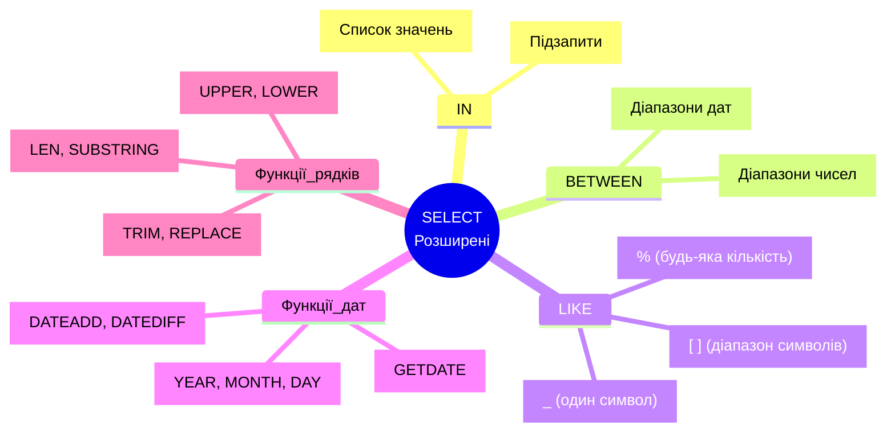

# SELECT запити - Розширені можливості

## Від базових до складних запитів

У попередній темі ми вивчили основи SELECT. Тепер розглянемо **розширені можливості** для більш гнучкої та потужної роботи з даними.

::mermaid



::

---

## Оператор IN: Перевірка на список значень

**IN** дозволяє перевірити, чи value міститься в **списку** значень.

### Базовий синтаксис

```sql
WHERE column IN (value1, value2, value3, ...)
```

### Приклади

::code-group

```sql [IN замість множинних OR]
-- ❌ Довгий спосіб (з OR)
SELECT * FROM Students
WHERE YEAR(BirthDate) = 1997
   OR YEAR(BirthDate) = 1998
   OR YEAR(BirthDate) = 1999;

-- ✅ Коротший спосіб (з IN)
SELECT * FROM Students
WHERE YEAR(BirthDate) IN (1997, 1998, 1999);
```

```sql [IN з текстовими значеннями]
SELECT * FROM Students
WHERE LastName IN ('Петренко', 'Коваленко', 'Шевченко');
```

```sql [NOT IN (виключення)]
-- Студенти НЕ народжені в 1997 та 1999
SELECT * FROM Students
WHERE YEAR(BirthDate) NOT IN (1997, 1999);
```

::

### IN з підзапитами

IN може використовувати результат іншого SELECT:

```sql
-- Студенти зі стипендією вище середньої
SELECT * FROM Students
WHERE Grants IN (
    SELECT Grants
    FROM Students
    WHERE Grants > (SELECT AVG(Grants) FROM Students)
);
```

::tip
**Performance**: IN з невеликим списком констант (до 10-20 значень) - швидко. Для великих списків або складних підзапитів розгляньте альтернативи (JOIN, EXISTS).

::

---

## Оператор BETWEEN: Діапазони значень

**BETWEEN** перевіряє, чи значення знаходиться в **діапазоні** (включно з межами).

### Базовий синтаксис

```sql
WHERE column BETWEEN value1 AND value2
-- Еквівалентно: column >= value1 AND column <= value2
```

### Приклади з числами

```sql
-- Студенти зі стипендією від 1300 до 1500
SELECT FirstName, LastName, Grants
FROM Students
WHERE Grants BETWEEN 1300 AND 1500;

-- Еквівалентно:
WHERE Grants >= 1300 AND Grants <= 1500;
```

::warning
**BETWEEN включає обидві межі**:

- `BETWEEN 1300 AND 1500` означає `>= 1300 AND <= 1500`
- Включає як 1300, так і 1500

::

### BETWEEN з датами

```sql
-- Студенти народжені в 1998 році
SELECT * FROM Students
WHERE BirthDate BETWEEN '1998-01-01' AND '1998-12-31';

-- Студенти народжені в першому півріччі 1998
SELECT * FROM Students
WHERE BirthDate BETWEEN '1998-01-01' AND '1998-06-30';
```

### NOT BETWEEN

```sql
-- Студенти зі стипендією НЕ в діапазоні 1300-1500
SELECT * FROM Students
WHERE Grants NOT BETWEEN 1300 AND 1500;

-- Еквівалентно:
WHERE Grants < 1300 OR Grants > 1500;
```

### BETWEEN vs операторів порівняння

::tabs

::tabs-item{label="BETWEEN (читабельніше)"}

```sql
WHERE Age BETWEEN 18 AND 25
WHERE Price BETWEEN 100 AND 500
WHERE OrderDate BETWEEN '2024-01-01' AND '2024-12-31'
```

**Переваги**: Коротше, зрозуміліше

::

::tabs-item{label="AND (гнучкіше)"}

```sql
WHERE Age >= 18 AND Age < 25         -- Виключити 25!
WHERE Price > 100 AND Price <= 500   -- Виключити 100!
```

**Переваги**: Більше контролю над межами

::

::

---

## LIKE: Pattern Matching (пошук за шаблоном)

**LIKE** дозволяє шукати текст за **шаблоном** з використанням wildcards.

### Wildcards (спеціальні символи)

| Wildcard | Значення                         | Приклад   | Знайде                       |
| :------- | :------------------------------- | :-------- | :--------------------------- |
| `%`      | Будь-яка кількість символів (0+) | `'%енко'` | Петр**енко**, Ковал**енко**  |
| `_`      | Рівно один символ                | `'А___'`  | **Анна**, **Алла** (4 букви) |
| `[]`     | Один символ зі списку            | `'[МА]%'` | **М**арія, **А**нна          |
| `[^]`    | Один символ НЕ зі списку         | `'[^М]%'` | **І**ван, **А**нна (не М)    |

### Приклади з % (будь-яка кількість)

::code-group

```sql [Починається з...]
-- Прізвища що починаються з "Пет"
SELECT * FROM Students
WHERE LastName LIKE 'Пет%';
-- Знайде: Петренко, Петров, ...
```

```sql [Закінчується на...]
-- Прізвища що закінчуються на "енко"
SELECT * FROM Students
WHERE LastName LIKE '%енко';
-- Знайде: Петренко, Коваленко, Ткаченко, ...
```

```sql [Містить...]
-- Прізвища що містять "ов"
SELECT * FROM Students
WHERE LastName LIKE '%ов%';
-- Знайде: Мороз [немає], Коваль [немає], але знайде якби був Петров
```

```sql [Починається і закінчується]
-- Email з Gmail
SELECT * FROM Students
WHERE Email LIKE '%@gmail.com';
```

::

### Приклади з \_ (один символ)

```sql
-- Імена з 4 літер
SELECT * FROM Students
WHERE FirstName LIKE '____';  -- 4 підкреслення
-- Знайде: Іван (4 букви), НЕ знайде: Марія (5 букв)

-- Другаа літера 'а'
SELECT * FROM Students
WHERE FirstName LIKE '_а%';
-- Знайде: Марія (М-а-...), NOT Іван
```

### Приклади з [] (список символів)

```sql
-- Прізвища що починаються з М або К
SELECT * FROM Students
WHERE LastName LIKE '[МК]%';
-- Знайде: Мороз, Мельник, Коваленко, Коваль

-- Email з цифрами на початку
SELECT * FROM Students
WHERE Email LIKE '[0-9]%';
-- Знайде: 123test@..., 5user@..., НЕ знайде: user123@...

-- Імена що починаються з голосної
SELECT * FROM Students
WHERE FirstName LIKE '[АЕИІОУЯЮЄЇаеиоуяюєї]%';
```

### Приклади з [^] (НЕ зі списку)

```sql
-- Прізвища що НЕ починаються з П або К
SELECT * FROM Students
WHERE LastName LIKE '[^ПК]%';
-- Знайде: Мороз, Шевченко, НЕ знайде: Петренко, Коваленко

-- Імена БЕЗ цифр
SELECT * FROM Students
WHERE FirstName NOT LIKE '%[0-9]%';
```

### ESCAPE: Екранування спецсимволів

Що робити, якщо потрібно знайти сам символ `%` або `_`?

```sql
-- Знайти email що містить підкреслення
SELECT * FROM Students
WHERE Email LIKE '%!_%' ESCAPE '!';
--                    ^         ^^^
--              екранували _    символ escape

-- Знайти продукти з % у назві "50% discount"
SELECT * FROM Products
WHERE ProductName LIKE '%!%%' ESCAPE '!';
```

### Case Sensitivity

За замовчуванням LIKE **case-insensitive**:

```sql
WHERE LastName LIKE 'петренко'  -- Знайде "Петренко", "ПЕТРЕНКО"
```

Для case-sensitive:

```sql
WHERE LastName COLLATE Latin1_General_CS_AS LIKE 'Петренко'
```

::tip
**Performance попередження**: LIKE з `%` на початку (`'%value'`) **НЕ використовує індекси** і може бути повільним на великих таблицях. По можливості уникайте patterns типу `'%value%'`.

::

---

## Робота з датами

SQL Server надає багато функцій для роботи з датами.

### Функції витягування компонентів

::code-group

```sql [Рік, місяць, день]
SELECT
    FirstName,
    BirthDate,
    YEAR(BirthDate) AS BirthYear,
    MONTH(BirthDate) AS BirthMonth,
    DAY(BirthDate) AS BirthDay
FROM Students;
```

```sql [Назва місяця]
SELECT
    FirstName,
    BirthDate,
    DATENAME(MONTH, BirthDate) AS MonthName,
    DATENAME(WEEKDAY, BirthDate) AS DayOfWeek
FROM Students;
-- Результат: 'January', 'Monday'
```

```sql [Номер дня тижня]
SELECT
    FirstName,
    DATEPART(WEEKDAY, BirthDate) AS DayNumber
FROM Students;
-- Результат: 1 = Sunday, 2 = Monday, ...
```

::

### Поточна дата і час

```sql
SELECT
    GETDATE() AS CurrentDateTime,          -- 2024-02-07 22:30:45.123
    SYSDATETIME() AS HighPrecision,        -- Більше точності
    GETUTCDATE() AS UTC;                   -- UTC час
```

### DATEADD: Додавання до дати

```sql
-- Формат: DATEADD(datepart, number, date)

SELECT
    BirthDate,
    DATEADD(YEAR, 18, BirthDate) AS AdultDate,      -- +18 років
    DATEADD(MONTH, 6, BirthDate) AS HalfYearLater,  -- +6 місяців
    DATEADD(DAY, -30, GETDATE()) AS MonthAgo        -- -30 днів від сьогодні
FROM Students;
```

**datepart** може бути:

- `YEAR`, `MONTH`, `DAY`
- `HOUR`, `MINUTE`, `SECOND`
- `WEEK`, `QUARTER`

### DATEDIFF: Різниця між датами

```sql
-- Формат: DATEDIFF(datepart, startdate, enddate)

SELECT
    FirstName,
    BirthDate,
    DATEDIFF(YEAR, BirthDate, GETDATE()) AS ApproximateAge,
    DATEDIFF(DAY, BirthDate, GETDATE()) AS DaysOld,
    DATEDIFF(MONTH, BirthDate, GETDATE()) AS MonthsOld
FROM Students;
```

::warning
**DATEDIFF(YEAR, ...)** НЕ дає точний вік!

```sql
DATEDIFF(YEAR, '1998-12-31', '1999-01-01') = 1
-- Але різниця лише 1 день!

-- Для точного віку:
DATEDIFF(YEAR, BirthDate, GETDATE()) -
    CASE
        WHEN MONTH(BirthDate) > MONTH(GETDATE()) OR
             (MONTH(BirthDate) = MONTH(GETDATE()) AND DAY(BirthDate) > DAY(GETDATE()))
        THEN 1
        ELSE 0
    END AS ExactAge
```

::

### Практичні приклади з датами

```sql
-- Студенти народжені в січні
SELECT * FROM Students
WHERE MONTH(BirthDate) = 1;

-- Студенти народжені в останні 25 років
SELECT * FROM Students
WHERE BirthDate >= DATEADD(YEAR, -25, GETDATE());

-- Студенти народжені у вівторок
SELECT * FROM Students
WHERE DATENAME(WEEKDAY, BirthDate) = 'Tuesday';

-- Студенти у яких день народження цього місяця
SELECT * FROM Students
WHERE MONTH(BirthDate) = MONTH(GETDATE());
```

---

## Рядкові функції

SQL Server має багато функцій для обробки тексту.

### LEN: Довжина рядка

```sql
SELECT
    FirstName,
    LEN(FirstName) AS NameLength,
    LEN(Email) AS EmailLength
FROM Students;
```

::note
`LEN()` **не рахує** trailing пробіли: `LEN(' text ') = 4`, не 6!

- Для підрахунку з пробілами: `DATALENGTH(column)`

::

### SUBSTRING: Витягування підрядка

```sql
-- SUBSTRING(string, start, length)

SELECT
    FirstName,
    SUBSTRING(FirstName, 1, 3) AS First3Chars,
    SUBSTRING(Email, 1, CHARINDEX('@', Email) - 1) AS EmailUsername
FROM Students;
```

**Приклади**:

- `SUBSTRING('Іван', 1, 2)` → `'Ів'`
- `SUBSTRING('Петренко', 4, 3)` → `'рен'`

### LEFT і RIGHT

```sql
SELECT
    FirstName,
    LEFT(FirstName, 2) AS First2,      -- Перші 2 символи
    RIGHT(FirstName, 2) AS Last2       -- Останні 2 символи
FROM Students;
```

### UPPER, LOWER: Зміна регістру

```sql
SELECT
    FirstName,
    UPPER(FirstName) AS Uppercase,     -- ІВАН
    LOWER(FirstName) AS Lowercase,     -- іван
    UPPER(LEFT(FirstName, 1)) + LOWER(SUBSTRING(FirstName, 2, LEN(FirstName))) AS Capitalized
FROM Students;
```

### TRIM, LTRIM, RTRIM: Видалення пробілів

```sql
SELECT
    LTRIM('  text  ') AS LeftTrimmed,    -- 'text  '
    RTRIM('  text  ') AS RightTrimmed,   -- '  text'
    TRIM('  text  ') AS BothTrimmed;     -- 'text'
```

### REPLACE: Заміна підрядка

```sql
SELECT
    Email,
    REPLACE(Email, '@example.com', '@newdomain.com') AS NewEmail
FROM Students;

-- 'ivan@example.com' → 'ivan@newdomain.com'
```

### CHARINDEX: Пошук підрядка

```sql
-- CHARINDEX(substring, string) - повертає позицію або 0

SELECT
    Email,
    CHARINDEX('@', Email) AS AtPosition,
    CASE
        WHEN CHARINDEX('@gmail', Email) > 0 THEN 'Gmail'
        WHEN CHARINDEX('@example', Email) > 0 THEN 'Example'
        ELSE 'Other'
    END AS EmailProvider
FROM Students;
```

### CONCAT: Об'єднання рядків

```sql
-- CONCAT ігнорує NULL (на відміну від +)

SELECT
    CONCAT(FirstName, ' ', LastName) AS FullName,
    CONCAT('Email: ', Email, ' (verified)') AS EmailInfo
FROM Students;
-- Якщо Email = NULL, результат: 'Email:  (verified)' (не NULL!)
```

### Практичні приклади з рядками

```sql
-- Email username (до @)
SELECT
    Email,
    SUBSTRING(Email, 1, CHARINDEX('@', Email) - 1) AS Username
FROM Students
WHERE Email IS NOT NULL;

-- Перша літера прізвища
SELECT
    FirstName,
    LEFT(LastName, 1) + '.' AS LastInitial
FROM Students;

-- Пошук студентів з довгими іменами
SELECT * FROM Students
WHERE LEN(FirstName) > 6;

-- Заміна домену email
SELECT
    FirstName,
    REPLACE(Email, 'example.com', 'university.edu') AS UniversityEmail
FROM Students;
```

---

## Комбінування складних умов

Тепер, коли ми знаємо всі ці оператори та функції, можемо створювати дуже складні запити.

### Приклад 1: Множинні умови

```sql
SELECT
    FirstName,
    LastName,
    BirthDate,
    Grants,
    Email
FROM Students
WHERE
    (
        -- Група 1: Народжені в 1998 зі стипендією
        (YEAR(BirthDate) = 1998 AND Grants > 1300)
        OR
        -- Група 2: Прізвище на "енко" з Email
        (LastName LIKE '%енко' AND Email IS NOT NULL)
    )
    AND
    -- Додаткова умова для всіх
    MONTH(BirthDate) NOT IN (1, 12)  -- Не січень і не грудень
ORDER BY Grants DESC, LastName ASC;
```

### Приклад 2: Пошук з pattern matching

```sql
-- Знайти студентів:
-- - З Gmail email
-- - АБО прізвище містить "ов" або "ев"
-- - АБО ім'я починається з голосної
SELECT * FROM Students
WHERE
    Email LIKE '%@gmail.com'
    OR LastName LIKE '%[ое]в%'
    OR FirstName LIKE '[АЕИІОУаеиоу]%';
```

### Приклад 3: Складна робота з датами

```sql
-- Студенти у яких:
-- - День народження в наступні 30 днів
SELECT
    FirstName,
    LastName,
    BirthDate,
    DATENAME(MONTH, BirthDate) + ' ' + CAST(DAY(BirthDate) AS NVARCHAR) AS Birthday
FROM Students
WHERE
    (
        -- Цього року ще не було ДН
        MONTH(BirthDate) > MONTH(GETDATE())
        OR (MONTH(BirthDate) = MONTH(GETDATE()) AND DAY(BirthDate) >= DAY(GETDATE()))
    )
    AND
    -- В наступні 30 днів
    DATEADD(YEAR, YEAR(GETDATE()) - YEAR(BirthDate), BirthDate)
        BETWEEN GETDATE() AND DATEADD(DAY, 30, GETDATE());
```

---

## Практичні завдання

::accordion

::accordion-item{label="Завдання 1: IN та BETWEEN" icon="i-lucide-list-filter"}

Знайдіть студентів які:

- Народилися в лютому, березні або квітні (використайте IN)
- АБО стипендія в діапазоні 1400-1600

<details>
<summary>💡 Розв'язок</summary>

```sql
SELECT FirstName, LastName, BirthDate, Grants
FROM Students
WHERE MONTH(BirthDate) IN (2, 3, 4)
   OR Grants BETWEEN 1400 AND 1600;
```

</details>

::

::accordion-item{label="Завдання 2: LIKE wildcards" icon="i-lucide-search"}

Знайдіть студентів у яких:

- Прізвище закінчується на "енко"
- І Email НЕ містить цифр
- І ім'я містить літеру 'а'

<details>
<summary>💡 Розв'язок</summary>

```sql
SELECT FirstName, LastName, Email
FROM Students
WHERE LastName LIKE '%енко'
  AND Email NOT LIKE '%[0-9]%'
  AND FirstName LIKE '%а%';
```

</details>

::

::accordion-item{label="Завдання 3: Функції дат" icon="i-lucide-calendar"}

Знайдіть студентів старших за 25 років, відсортуйте від старшого до молодшого.

<details>
<summary>💡 Розв'язок</summary>

```sql
SELECT
    FirstName,
    LastName,
    BirthDate,
    DATEDIFF(YEAR, BirthDate, GETDATE()) AS ApproximateAge
FROM Students
WHERE DATEDIFF(YEAR, BirthDate, GETDATE()) > 25
ORDER BY BirthDate ASC;  -- Раніше народження = старший
```

</details>

::

::accordion-item{label="Завдання 4: Рядкові функції" icon="i-lucide-type"}

Створіть звіт який показує:

- Повне ім'я (Прізвище І.)
- Email username (частина до @)
- Довжину імені

<details>
<summary>💡 Розв'язок</summary>

```sql
SELECT
    LastName + ' ' + LEFT(FirstName, 1) + '.' AS ShortName,
    SUBSTRING(Email, 1, CHARINDEX('@', Email) - 1) AS EmailUsername,
    LEN(FirstName) AS NameLength
FROM Students
WHERE Email IS NOT NULL;
```

</details>

::

::

---

## Резюме

::tip
**Ключові моменти розширених SELECT**:

1. **IN** — перевірка на список значень (замість множинних OR)
2. **BETWEEN** — діапазони (включає обидві межі)
3. **LIKE** з wildcards:
    - `%` — будь-яка кількість символів
    - `_` — рівно 1 символ
    - `[]` — символ зі списку
    - `[^]` — символ НЕ зі списку
4. **Функції дат**:
    - `YEAR`, `MONTH`, `DAY` — витягування компонентів
    - `GETDATE()` — поточна дата/час
    - `DATEADD` — додавання до дати
    - `DATEDIFF` — різниця між датами
5. **Рядкові функції**:
    - `LEN`, `SUBSTRING`, `LEFT`, `RIGHT`
    - `UPPER`, `LOWER`, `TRIM`
    - `REPLACE`, `CHARINDEX`, `CONCAT`
6. **Комбінування** — використовуйте дужки для складних умов

**Наступний крок**: Навчіться додавати дані за допомогою INSERT запитів.

::

---

**Пов'язані теми**:

- [Попередня: SELECT - Основи](./03.select-queries-fundamentals.md)
- [Наступна: INSERT запити](./05.insert-queries.md)
- [UPDATE та DELETE](./06.update-delete-queries.md)
