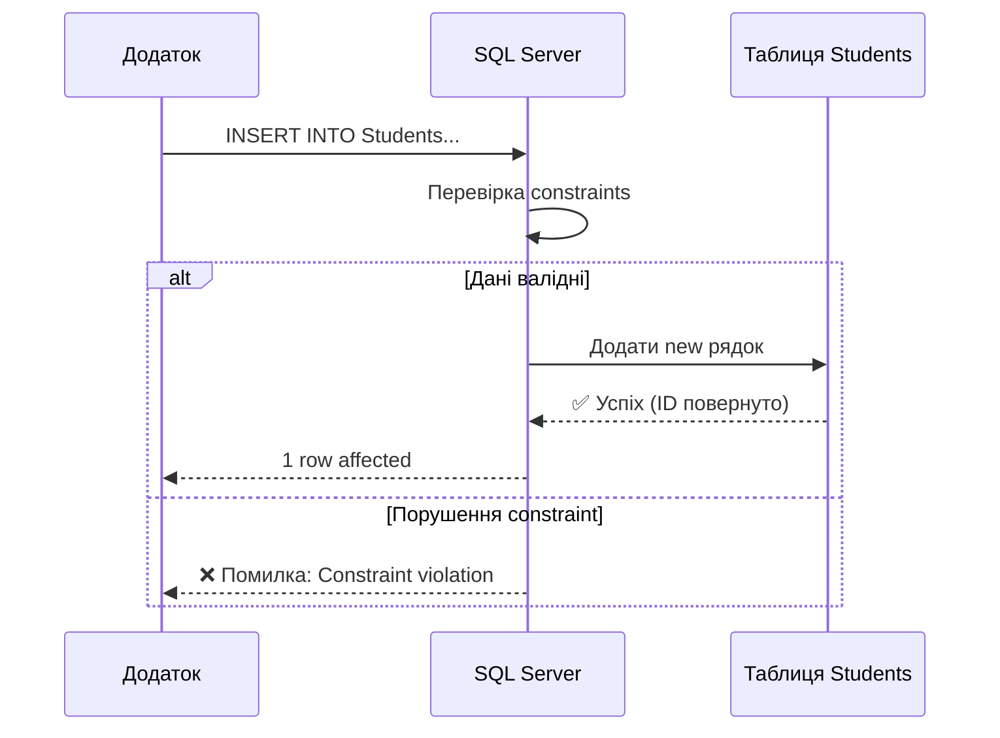

# INSERT запити - Додавання даних

## Проблема: Як додати дані в таблицю?

Ми створили таблицю `Students`, визначили її структуру. Тепер потрібно **наповнити** її даними. Як це зробити?

::mermaid



::

**INSERT** — це DML команда для **додавання** (вставки) нових рядків в таблицю.

---

## Базовий синтаксис INSERT

### Формат 1: З явним вказуванням стовпців (рекомендовано)

```sql
INSERT INTO table_name (column1, column2, column3, ...)
VALUES (value1, value2, value3, ...);
```

### Формат 2: Без вказування стовпців (не рекомендовано)

```sql
INSERT INTO table_name
VALUES (value1, value2, value3, ...);  -- Для ВСІХ стовпців по порядку
```

::warning
**Не рекомендується**: Якщо структура таблиці зміниться (додасться/видалиться стовпець), запит зламається!

**Best Practice**: Завжди вказуйте стовпці явно.
::

---

## Додавання одного рядка

### Приклад 1: Базовий INSERT

```sql
INSERT INTO Students (FirstName, LastName, BirthDate, Grants, Email)
VALUES ('Олександр', 'Мельник', '1999-05-20', 1350.00, 'oleksandr.m@example.com');
```

**Що відбувається**:

1. SQL Server перевіряє constraints (NOT NULL, CHECK, FOREIGN KEY)
2. Генерує автоматичний `Id` (IDENTITY)
3. Застосовує DEFAULT значення (якщо є)
4. Вставляє рядок у таблицю
5. Повертає кількість вставлених рядків: `(1 row affected)`

### Приклад 2: З NULL значеннями

```sql
-- Grants та Email можуть бути NULL
INSERT INTO Students (FirstName, LastName, BirthDate, Grants, Email)
VALUES ('Наталія', 'Сидоренко', '1998-08-15', NULL, NULL);
```

### Приклад 3: З DEFAULT значеннями

Якщо стовпець має DEFAULT і ви НЕ вказуєте значення:

```sql
-- Стовпець IsActive має DEFAULT 1
INSERT INTO Students (FirstName, LastName, BirthDate)
VALUES ('Сергій', 'Бондаренко', '1997-12-10');
-- IsActive автоматично отримає значення 1
```

Або явно вказати DEFAULT:

```sql
INSERT INTO Students (FirstName, LastName, BirthDate, IsActive)
VALUES ('Сергій', 'Бондаренко', '1997-12-10', DEFAULT);
--                                                ^^^^^^
```

---

## IDENTITY: Автоматична генерація ID

**IDENTITY** — це спеціальний атрибут стовпця, який автоматично генерує унікальні числа.

### Як працює IDENTITY

```sql
-- Id має IDENTITY(1, 1) - початок з 1, крок 1
INSERT INTO Students (FirstName, LastName, BirthDate)
VALUES ('Тест1', 'Тестов', '2000-01-01');
-- Id = 1

INSERT INTO Students (FirstName, LastName, BirthDate)
VALUES ('Тест2', 'Тестова', '2000-01-02');
-- Id = 2

INSERT INTO Students (FirstName, LastName, BirthDate)
VALUES ('Тест3', 'Тестов', '2000-01-03');
-- Id = 3
```

::note
**НЕ можна** вставити значення в IDENTITY стовпець:

```sql
INSERT INTO Students (Id, FirstName, LastName, BirthDate)
VALUES (100, 'Тест', 'Тестов', '2000-01-01');
-- ❌ Помилка: Cannot insert explicit value for identity column
```

**Виняток**: Використення `SET IDENTITY_INSERT` (розглянемо нижче).
::

### Отримання щойно вставленого ID

Після INSERT часто потрібно дізнатися, який ID був присвоєний:

::code-group

```sql [SCOPE_IDENTITY() (рекомендовано)]
INSERT INTO Students (FirstName, LastName, BirthDate)
VALUES ('Іван', 'Новий', '2000-01-01');

SELECT SCOPE_IDENTITY() AS NewId;
-- Повертає: 13 (якщо це був 13-й рядок)
```

```sql [@@IDENTITY (не рекомендовано)]
INSERT INTO Students (FirstName, LastName, BirthDate)
VALUES ('Марія', 'Нова', '2000-01-02');

SELECT @@IDENTITY AS NewId;
-- Може повернути неправильний ID якщо є triggers!
```

```sql [OUTPUT clause (найкращий спосіб)]
INSERT INTO Students (FirstName, LastName, BirthDate)
OUTPUT INSERTED.Id, INSERTED.FirstName
VALUES ('Олег', 'Новий', '2000-01-03');

-- Результат:
-- Id | FirstName
-- 14 | Олег
```

::

**Різниця**:

- `SCOPE_IDENTITY()` — ID в поточному scope (ігнорує triggers)
- `@@IDENTITY` — останній згенерований ID (включно з triggers)
- `OUTPUT` — найпотужніший, показує вставлені дані

::tip
**Best Practice**: Використовуйте `SCOPE_IDENTITY()` або `OUTPUT` для отримання ID.
::

### SET IDENTITY_INSERT: Вставка конкретних ID

Іноді потрібно вставити конкретні значення ID (наприклад, при міграції даних):

```sql
-- Увімкнути можливість вставки в IDENTITY
SET IDENTITY_INSERT Students ON;

INSERT INTO Students (Id, FirstName, LastName, BirthDate)
VALUES (100, 'Спеціальний', 'Студент', '2000-01-01');

-- Вимкнути назад
SET IDENTITY_INSERT Students OFF;
```

::caution
**Обмеження**:

- Можна увімкнути тільки для **однієї** таблиці за раз
- Після вимкнення IDENTITY продовжить з останнього максимального значення
- Використовуйте обережно (може порушити послідовність)

::

---

## Множинні INSERT: Додавання багатьох рядків

### Синтаксис (SQL Server 2008+)

```sql
INSERT INTO table_name (column1, column2, ...)
VALUES
    (value1_1, value1_2, ...),
    (value2_1, value2_2, ...),
    (value3_1, value3_2, ...);
```

### Приклад: 3 студенти за один запит

```sql
INSERT INTO Students (FirstName, LastName, BirthDate, Grants, Email)
VALUES
    ('Андрій', 'Ковальчук', '1998-03-22', 1450.00, 'andriy.k@example.com'),
    ('Вікторія', 'Литвин', '1999-07-11', 1500.00, 'viktoria.l@example.com'),
    ('Богдан', 'Гриценко', '1997-11-30', 1380.00, NULL);

-- Результат: (3 rows affected)
```

::tip
**Performance**: Множинний INSERT **значно швидший** за окремі запити:

```sql
-- ❌ Повільно (3 окремі запити)
INSERT INTO Students (...) VALUES (...);
INSERT INTO Students (...) VALUES (...);
INSERT INTO Students (...) VALUES (...);

-- ✅ Швидко (1 запит для 3 рядків)
INSERT INTO Students (...)
VALUES (...), (...), (...);
```

Економія особливо відчутна при вставці сотень/тисяч рядків!
::

### Обмеження

SQL Server дозволяє до **1000 рядків** в одному VALUES:

```sql
INSERT INTO Students (...)
VALUES
    (...),  -- рядок 1
    (...),  -- рядок 2
    ...
    (...);  -- рядок 1000 - максимум
```

Для більше рядків використовуйте кілька INSERT або BULK INSERT.

---

## INSERT SELECT: Копіювання даних

**INSERT SELECT** дозволяє вставити результат SELECT запиту в таблицю.

### Базовий синтаксис

```sql
INSERT INTO target_table (column1, column2, ...)
SELECT column1, column2, ...
FROM source_table
WHERE condition;
```

### Приклад 1: Копіювання студентів

```sql
-- Створимо архівну таблицю
CREATE TABLE StudentsArchive (
    Id INT PRIMARY KEY IDENTITY(1, 1),
    FirstName NVARCHAR(50) NOT NULL,
    LastName NVARCHAR(50) NOT NULL,
    BirthDate DATE NOT NULL,
    ArchivedDate DATE DEFAULT GETDATE()
);

-- Скопіюємо студентів народжених до 1998
INSERT INTO StudentsArchive (FirstName, LastName, BirthDate)
SELECT FirstName, LastName, BirthDate
FROM Students
WHERE YEAR(BirthDate) < 1998;

-- Результат: (N rows affected) - скільки студентів скопійовано
```

### Приклад 2: Вставка з обчисленнями

```sql
-- Таблиця статистики
CREATE TABLE StudentStats (
    StudentId INT,
    FullName NVARCHAR(100),
    ApproximateAge INT,
    HasScholarship BIT
);

-- Заповнити статистику
INSERT INTO StudentStats (StudentId, FullName, ApproximateAge, HasScholarship)
SELECT
    Id,
    FirstName + ' ' + LastName,
    DATEDIFF(YEAR, BirthDate, GETDATE()),
    CASE WHEN Grants IS NOT NULL THEN 1 ELSE 0 END
FROM Students;
```

### Приклад 3: Вставка всіх стовпців

```sql
-- Створити точну копію таблиці (структура + дані)
SELECT * INTO Students_Backup FROM Students;  -- Створить нову таблицю

-- АБО вставити в існуючу таблицю
INSERT INTO Students_Backup
SELECT * FROM Students;  -- Таблиця вже має існувати
```

::warning
Будьте обережні з SELECT \* — вставка відбудеться у порядку стовпців в source таблиці. Якщо структури відрізняються - будуть помилки!
::

---

## Робота з Constraints при INSERT

### NOT NULL перевірка

```sql
-- ❌ Помилка - LastName є NOT NULL
INSERT INTO Students (FirstName, BirthDate)
VALUES ('Тест', '2000-01-01');
-- Msg 515: Cannot insert NULL into column 'LastName'
```

### CHECK constraint перевірка

```sql
-- Якщо є CHECK (Grants >= 0)
INSERT INTO Students (FirstName, LastName, BirthDate, Grants)
VALUES ('Тест', 'Тестов', '2000-01-01', -100);
-- ❌ Msg 547: The INSERT statement conflicted with the CHECK constraint
```

### UNIQUE constraint перевірка

```sql
-- Якщо Email має UNIQUE constraint
INSERT INTO Students (FirstName, LastName, BirthDate, Email)
VALUES ('Іван', 'Петров', '2000-01-01', 'existing@example.com');
-- ❌ Msg 2627: Violation of UNIQUE KEY constraint (якщо email вже існує)
```

### FOREIGN KEY перевірка

```sql
-- Якщо DepartmentId має FK на Departments.DepartmentId
INSERT INTO Students (FirstName, LastName, BirthDate, DepartmentId)
VALUES ('Тест', 'Тестов', '2000-01-01', 999);
-- ❌ Msg 547: The INSERT statement conflicted with the FOREIGN KEY constraint
-- (якщо Departments з Id=999 не існує)
```

---

## OUTPUT Clause: Повернення вставлених даних

**OUTPUT** дозволяє побачити, які дані були вставлені.

### Базовий синтаксис

```sql
INSERT INTO table_name (columns)
OUTPUT INSERTED.column1, INSERTED.column2, ...
VALUES (...);
```

### Приклад 1: Повернути ID та ім'я

```sql
INSERT INTO Students (FirstName, LastName, BirthDate)
OUTPUT INSERTED.Id, INSERTED.FirstName, INSERTED.LastName
VALUES
    ('Олена', 'Ткач', '1999-04-15'),
    ('Михайло', 'Соловей', '1998-09-22');

-- Результат:
-- Id | FirstName | LastName
-- 20 | Олена     | Ткач
-- 21 | Михайло   | Соловей
```

### Приклад 2: Зберегти OUTPUT в таблицю

```sql
-- Тимчасова таблиця для ID
DECLARE @InsertedIds TABLE (NewId INT, StudentName NVARCHAR(100));

INSERT INTO Students (FirstName, LastName, BirthDate)
OUTPUT INSERTED.Id, INSERTED.FirstName + ' ' + INSERTED.LastName
INTO @InsertedIds
VALUES
    ('Анна', 'Мороз', '1999-01-20'),
    ('Дмитро', 'Коваль', '1998-06-30');

-- Тепер можемо використати ID
SELECT * FROM @InsertedIds;
```

::tip
**Практичне використання OUTPUT**:

- Отримання згенерованих IDENTITY значень
- Логування вставлених записів
- Повернення даних в додаток після INSERT

::

---

## Практичні сценарії

### Сценарій 1: Реєстрація нового студента

```sql
-- Реєстрація з отриманням ID
DECLARE @NewStudentId INT;

INSERT INTO Students (FirstName, LastName, BirthDate, Email)
VALUES ('Катерина', 'Петрова', '1999-03-15', 'kateryna.p@university.edu');

SET @NewStudentId = SCOPE_IDENTITY();

PRINT 'New student registered with ID: ' + CAST(@NewStudentId AS NVARCHAR);
-- New student registered with ID: 22
```

### Сценарій 2: Імпорт даних з іншої таблиці

```sql
-- Імпорт тільки активних юзерів з oldusers таблиці
INSERT INTO Students (FirstName, LastName, BirthDate, Email)
SELECT
    Name AS FirstName,
    Surname AS LastName,
    DateOfBirth,
    ContactEmail
FROM ImportedUsers
WHERE IsActive = 1 AND Type = 'Student';
```

### Сценарій 3: Batch INSERT

```sql
-- Пакетна вставка 5 студентів
BEGIN TRANSACTION;

INSERT INTO Students (FirstName, LastName, BirthDate, Grants)
VALUES
    ('С1', 'Прізвище1', '1998-01-01', 1200),
    ('С2', 'Прізвище2', '1998-01-02', 1300),
    ('С3', 'Прізвище3', '1998-01-03', 1400),
    ('С4', 'Прізвище4', '1998-01-04', 1500),
    ('С5', 'Прізвище5', '1998-01-05', 1600);

-- Перевірити результат
IF @@ROWCOUNT = 5
BEGIN
    COMMIT;
    PRINT 'Всі 5 студентів додані успішно';
END
ELSE
BEGIN
    ROLLBACK;
    PRINT 'Помилка при вставці';
END
```

---

## Best Practices

::card-group

::card{title="1. Завжди вказуйте стовпці" icon="i-lucide-list"}

```sql
-- ✅ Добре
INSERT INTO Students (FirstName, LastName, BirthDate)
VALUES ('Іван', 'Іванов', '2000-01-01');

-- ❌ Погано
INSERT INTO Students VALUES ('Іван', 'Іванов', '2000-01-01', NULL, NULL);
```

::

::card{title="2. Використовуйте множинні VALUES" icon="i-lucide-zap"}

Для кількох рядків - один INSERT:

```sql
-- ✅ Швидко
INSERT INTO Students (...)
VALUES (...), (...), (...);

-- ❌ Повільно
INSERT INTO Students (...) VALUES (...);
INSERT INTO Students (...) VALUES (...);
INSERT INTO Students (...) VALUES (...);
```

::

::card{title="3. Використовуйте транзакції" icon="i-lucide-shield"}

Для критичних операцій:

```sql
BEGIN TRANSACTION;
    INSERT INTO Students (...) VALUES (...);
    INSERT INTO Enrollments (...) VALUES (...);
COMMIT;
```

::

::card{title="4. Перевіряйте результат" icon="i-lucide-check-circle"}

```sql
INSERT INTO Students (...) VALUES (...);

IF @@ROWCOUNT = 0
BEGIN
    PRINT 'Нічого не вставлено!';
END
```

::

::

---

## Практичні завдання

::accordion

::accordion-item{label="Завдання 1: Базовий INSERT" icon="i-lucide-plus-circle"}

Додайте нового студента:

- FirstName: Ваше ім'я
- LastName: Ваше прізвище
- BirthDate: 2000-06-15
- Grants: 1550
- Email: ваш email

<details>
<summary>💡 Розв'язок</summary>

```sql
INSERT INTO Students (FirstName, LastName, BirthDate, Grants, Email)
VALUES ('Ваше', 'Прізвище', '2000-06-15', 1550, 'yourname@example.com');

-- Перевірка
SELECT * FROM Students WHERE LastName = 'Прізвище';
```

</details>

::

::accordion-item{label="Завдання 2: Множинний INSERT" icon="i-lucide-users"}

Додайте 3 студентів за один запит з різними даними.

<details>
<summary>💡 Розв'язок</summary>

```sql
INSERT INTO Students (FirstName, LastName, BirthDate, Grants, Email)
VALUES
    ('Тарас', 'Шевченко', '1999-03-09', 1700, 'taras.sh@example.com'),
    ('Леся', 'Українка', '1998-02-25', 1800, 'lesya.u@example.com'),
    ('Іван', 'Франко', '1997-08-27', 1600, NULL);

SELECT * FROM Students WHERE LastName IN ('Шевченко', 'Українка', 'Франко');
```

</details>

::

::accordion-item{label="Завдання 3: INSERT SELECT" icon="i-lucide-copy"}

Створіть таблицю `TopStudents` та скопіюйте туди студентів зі стипендією більше 1500.

<details>
<summary>💡 Розв'язок</summary>

```sql
-- Крок 1: Створити таблицю
CREATE TABLE TopStudents (
    Id INT PRIMARY KEY IDENTITY(1, 1),
    FullName NVARCHAR(100),
    Scholarship DECIMAL(10, 2),
    Year INT
);

-- Крок 2: Вставити топ студентів
INSERT INTO TopStudents (FullName, Scholarship, Year)
SELECT
    FirstName + ' ' + LastName,
    Grants,
    YEAR(BirthDate)
FROM Students
WHERE Grants > 1500;

-- Перевірка
SELECT * FROM TopStudents;
```

</details>

::

::accordion-item{label="Завдання 4: OUTPUT clause" icon="i-lucide-arrow-right"}

Додайте 2 студентів і поверніть їхні ID та повні імена.

<details>
<summary>💡 Розв'язок</summary>

```sql
INSERT INTO Students (FirstName, LastName, BirthDate, Grants)
OUTPUT
    INSERTED.Id,
    INSERTED.FirstName + ' ' + INSERTED.LastName AS FullName,
    INSERTED.Grants
VALUES
    ('Олег', 'Савченко', '1999-05-10', 1450),
    ('Ірина', 'Ковальова', '1998-11-22', 1520);
```

</details>

::

::

---

## Резюме

::tip
**Ключові моменти INSERT запитів**:

1. **Базовий синтаксис**: `INSERT INTO table (columns) VALUES (values)`
2. **Завжди вказуйте стовпці** для стабільності коду
3. **IDENTITY** генерує ID автоматично (не вказуйте в INSERT)
4. **Множинні VALUES** — швидше за окремі INSERT
5. **INSERT SELECT** — копіювання даних з інших таблиць
6. **OUTPUT** — повернення вставлених даних
7. **SCOPE_IDENTITY()** — отримання згенерованого ID
8. **Constraints** перевіряються автоматично (NOT NULL, CHECK, UNIQUE, FK)
9. **Транзакції** — для критичних операцій
10. **@@ROWCOUNT** — перевірка кількості вставлених рядків

**Наступний крок**: Навчіться оновлювати та видаляти дані за допомогою UPDATE та DELETE.
::

---

**Пов'язані теми**:

- [Попередня: SELECT - Розширені](./04.select-queries-advanced.md)
- [Наступна: UPDATE та DELETE запити](./06.update-delete-queries.md)
- [Транзакції](./07.transactions.md)
- [CREATE TABLE та Constraints](./01.ddl-create-table.md)
