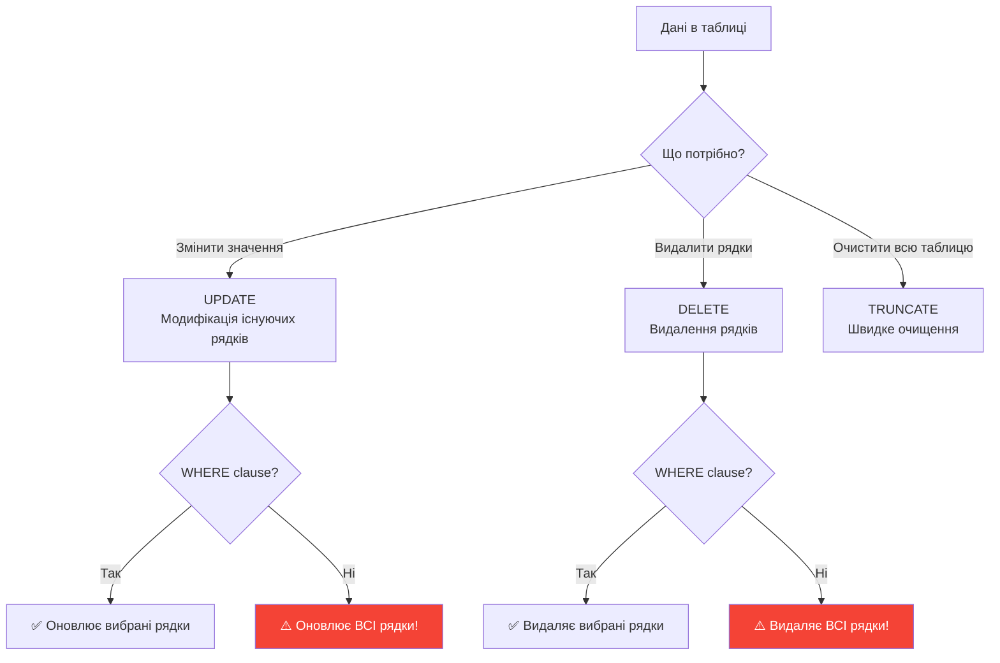

# UPDATE та DELETE запити

## Зміна та видалення даних

Після того як дані додано в таблицю (INSERT), часто потрібно їх **оновити** (UPDATE) або **видалити** (DELETE).

::mermaid



::

::caution
**КРИТИЧНО ВАЖЛИВО**: UPDATE та DELETE **БЕЗ WHERE** змінять/видалять **ВСІ** рядки в таблиці! Завжди перевіряйте WHERE clause перед виконанням!
::

---

## UPDATE: Оновлення даних

**UPDATE** змінює значення стовпців в **існуючих** рядках.

### Базовий синтаксис

```sql
UPDATE table_name
SET column1 = value1, column2 = value2, ...
WHERE condition;
```

### Приклад 1: Оновлення одного рядка

```sql
-- Змінити email студента з Id = 1
UPDATE Students
SET Email = 'new.email@example.com'
WHERE Id = 1;

-- Результат: (1 row affected)
```

**Що відбувається**:

1. SQL Server знаходить рядки що задовольняють WHERE (Id = 1)
2. Для знайдених рядків змінює Email
3. Перевіряє constraints (NOT NULL, CHECK, UNIQUE, FK)
4. Якщо все ОК - зберігає зміни
5. Повертає кількість змінених рядків

### Приклад 2: Оновлення кількох стовпців

```sql
-- Оновити стипендію та email
UPDATE Students
SET
    Grants = 1600,
    Email = 'ivan.petrenko@university.edu'
WHERE Id = 1;
```

### Приклад 3: Оновлення кількох рядків

```sql
-- Збільшити стипендію на 10% для всіх студентів 1998 року
UPDATE Students
SET Grants = Grants * 1.1
WHERE YEAR(BirthDate) = 1998 AND Grants IS NOT NULL;

-- Результат: (5 rows affected) - якщо 5 студентів
```

---

## UPDATE з обчисленнями

### Приклад 1: Арифметичні операції

```sql
-- Збільшити стипендію на 200
UPDATE Students
SET Grants = Grants + 200
WHERE Grants < 1500;

-- Подвоїти стипендію
UPDATE Students
SET Grants = Grants * 2
WHERE LastName = 'Петренко';
```

### Приклад 2: Рядкові функції

```sql
-- Змінити email на lowercase
UPDATE Students
SET Email = LOWER(Email)
WHERE Email IS NOT NULL;

-- Додати префікс до прізвища
UPDATE Students
SET LastName = 'Ms. ' + LastName
WHERE FirstName LIKE '[АЕИІОУаеиоу]%';  -- Починається з голосної
```

### Приклад 3: Функції дат

```sql
-- Встановити дату реєстрації на рік назад від дня народження
UPDATE Students
SET EnrollmentDate = DATEADD(YEAR, -1, BirthDate)
WHERE EnrollmentDate IS NULL;
```

---

## UPDATE з CASE: Умовне оновлення

**CASE** дозволяє застосувати різні значення залежно від умови.

### Синтаксис

```sql
UPDATE table_name
SET column = CASE
    WHEN condition1 THEN value1
    WHEN condition2 THEN value2
    ELSE default_value
END
WHERE condition;
```

### Приклад 1: Диференційоване збільшення

```sql
-- Різне збільшення стипендії залежно від року народження
UPDATE Students
SET Grants = CASE
    WHEN YEAR(BirthDate) = 1997 THEN Grants * 1.15  -- +15%
    WHEN YEAR(BirthDate) = 1998 THEN Grants * 1.10  -- +10%
    WHEN YEAR(BirthDate) = 1999 THEN Grants * 1.05  -- +5%
    ELSE Grants  -- Без змін
END
WHERE Grants IS NOT NULL;
```

### Приклад 2: Категоризація

```sql
-- Додаємо стовпець Category
ALTER TABLE Students ADD Category NVARCHAR(20);

-- Встановлюємо категорію на основі стипендії
UPDATE Students
SET Category = CASE
    WHEN Grants >= 1700 THEN 'Excellent'
    WHEN Grants >= 1400 THEN 'Good'
    WHEN Grants >= 1200 THEN 'Average'
    ELSE 'No scholarship'
END;
```

---

## UPDATE з JOIN: Оновлення з іншої таблиці

Можна оновлювати дані на основі значень з **іншої** таблиці.

### Синтаксис

```sql
UPDATE t1
SET t1.column = t2.column
FROM table1 AS t1
INNER JOIN table2 AS t2 ON t1.key = t2.key
WHERE condition;
```

### Приклад

```sql
-- Припустимо є таблиця DepartmentBudgets
CREATE TABLE DepartmentBudgets (
    DepartmentId INT PRIMARY KEY,
    ScholarshipIncrease DECIMAL(5, 2)  -- Відсоток збільшення
);

INSERT INTO DepartmentBudgets VALUES (1, 15.5), (2, 10.0);

-- Оновити стипендії на основі бюджету департаменту
UPDATE Students
SET Grants = Grants * (1 + db.ScholarshipIncrease / 100)
FROM Students AS s
INNER JOIN DepartmentBudgets AS db ON s.DepartmentId = db.DepartmentId
WHERE s.Grants IS NOT NULL;
```

---

## OUTPUT в UPDATE

**OUTPUT** дозволяє побачити, які дані були **до** та **після** оновлення.

### Синтаксис

```sql
UPDATE table_name
SET column = value
OUTPUT
    DELETED.column AS OldValue,  -- Старе значення
    INSERTED.column AS NewValue  -- Нове значення
WHERE condition;
```

### Приклад 1: Показати зміни

```sql
UPDATE Students
SET Grants = Grants * 1.1
OUTPUT
    INSERTED.Id,
    INSERTED.FirstName,
    DELETED.Grants AS OldGrants,
    INSERTED.Grants AS NewGrants
WHERE Id IN (1, 2, 3);

-- Результат:
-- Id | FirstName | OldGrants | NewGrants
-- 1  | Іван      | 1200.00   | 1320.00
-- 2  | Марія     | 1500.00   | 1650.00
-- 3  | Дмитро    | 1350.00   | 1485.00
```

### Приклад 2: Зберегти лог змін

```sql
-- Таблиця для логування
CREATE TABLE UpdateLog (
    LogId INT IDENTITY PRIMARY KEY,
    StudentId INT,
    OldGrants DECIMAL(10, 2),
    NewGrants DECIMAL(10, 2),
    UpdatedAt DATETIME DEFAULT GETDATE()
);

-- UPDATE з логуванням
UPDATE Students
SET Grants = Grants + 100
OUTPUT
    INSERTED.Id,
    DELETED.Grants,
    INSERTED.Grants,
    GETDATE()
INTO UpdateLog (StudentId, OldGrants, NewGrants, UpdatedAt)
WHERE Grants < 1500;

-- Перевірити лог
SELECT * FROM UpdateLog;
```

---

## DELETE: Видалення даних

**DELETE** видаляє рядки з таблиці **назавжди** (без можливості відновлення без backup).

### Базовий синтаксис

```sql
DELETE FROM table_name
WHERE condition;
```

::caution
**DELETE БЕЗ WHERE** видалить **ВСІ** рядки!

```sql
DELETE FROM Students;  -- ⚠️ Видалить ВСІХ студентів!
```

::

### Приклад 1: Видалення одного рядка

```sql
-- Видалити студента з Id = 100
DELETE FROM Students
WHERE Id = 100;

-- Результат: (1 row affected)
```

### Приклад 2: Видалення кількох рядків

```sql
-- Видалити студентів без email
DELETE FROM Students
WHERE Email IS NULL;

-- Результат: (3 rows affected)
```

### Приклад 3: Видалення з умовою

```sql
-- Видалити студентів народжених після 1999 року без стипендії
DELETE FROM Students
WHERE YEAR(BirthDate) > 1999 AND Grants IS NULL;
```

---

## DELETE з OUTPUT

Подібно до UPDATE, можна побачити видалені дані.

### Приклад 1: Показати видалені рядки

```sql
DELETE FROM Students
OUTPUT
    DELETED.Id,
    DELETED.FirstName,
    DELETED.LastName,
    DELETED.Email
WHERE Grants IS NULL AND Email IS NULL;

-- Результат показує видалених студентів:
-- Id | FirstName | LastName | Email
-- 15 | Тест1     | Тестов   | NULL
-- 16 | Тест2     | Тестова  | NULL
```

### Приклад 2: Архівування перед видаленням

```sql
-- Таблиця архіву
CREATE TABLE DeletedStudents (
    Id INT,
    FirstName NVARCHAR(50),
    LastName NVARCHAR(50),
    DeletedAt DATETIME DEFAULT GETDATE()
);

-- Видалення з архівуванням
DELETE FROM Students
OUTPUT
    DELETED.Id,
    DELETED.FirstName,
    DELETED.LastName,
    GETDATE()
INTO DeletedStudents
WHERE YEAR(BirthDate) < 1995;

-- Перевірити архів
SELECT * FROM DeletedStudents;
```

---

## DELETE з JOIN

Видалення на основі даних з іншої таблиці.

### Синтаксис

```sql
DELETE t1
FROM table1 AS t1
INNER JOIN table2 AS t2 ON t1.key = t2.key
WHERE condition;
```

### Приклад

```sql
-- Видалити студентів з неактивних департаментів
DELETE s
FROM Students AS s
INNER JOIN Departments AS d ON s.DepartmentId = d.DepartmentId
WHERE d.IsActive = 0;
```

---

## TRUNCATE TABLE vs DELETE

Обидві команди видаляють дані, але мають **значні відмінності**.

### Порівняння

| Характеристика  | DELETE                                                  | TRUNCATE                                                              |
| :-------------- | :------------------------------------------------------ | :-------------------------------------------------------------------- |
| Синтаксис WHERE | :icon{name="i-lucide-check" class="text-green-500"} Так | :icon{name="i-lucide-x" class="text-red-500"} Ні (тільки вся таблиця) |
| Швидкість       | Повільніше                                              | :icon{name="i-lucide-zap" class="text-green-500"} Дуже швидко         |
| Логування       | Кожен рядок                                             | Мінімальне                                                            |
| IDENTITY reset  | Ні                                                      | :icon{name="i-lucide-check" class="text-green-500"} Так               |
| Triggers        | Спрацьовують                                            | НЕ спрацьовують                                                       |
| Rollback        | Можливий                                                | Обмежений                                                             |
| З Foreign Keys  | Можливо\*                                               | :icon{name="i-lucide-x" class="text-red-500"} Помилка                 |

_\* Якщо немає посилань або ON DELETE CASCADE_

### Приклади

::code-group

```sql [DELETE (з WHERE)]
-- Видалити старих студентів
DELETE FROM Students
WHERE YEAR(BirthDate) < 1995;
```

```sql [DELETE (всі)]
-- Видалити всіх студентів (повільно)
DELETE FROM Students;
-- IDENTITY продовжить: був 100, новий буде 101
```

```sql [TRUNCATE]
-- Очистити таблицю (швидко)
TRUNCATE TABLE Students;
-- IDENTITY скинеться: новий буде 1
```

::

::tip
**Коли використовувати що**:

- **DELETE** — коли потрібен WHERE, або таблиця має FK references
- **TRUNCATE** — для швидкого очищення всєї таблиці (тестові дані, staging)
  ::

---

## Безпечні практики

### 1. ЗАВЖДИ перевіряйте WHERE з SELECT

**Золоте правило**: Перед UPDATE/DELETE спочатку виконайте SELECT!

```sql
-- ❌ НЕБЕЗПЕЧНО - одразу UPDATE
UPDATE Students SET Grants = 2000 WHERE LastName = 'Петренко';

-- ✅ БЕЗПЕЧНО - спочатку SELECT
SELECT * FROM Students WHERE LastName = 'Петренко';
-- Перевіряємо: так, це той студент
UPDATE Students SET Grants = 2000 WHERE LastName = 'Петренко';
```

### 2. Використовуйте транзакції

```sql
BEGIN TRANSACTION;

UPDATE Students SET Grants = Grants * 1.5 WHERE Id = 1;

-- Перевірити зміни
SELECT * FROM Students WHERE Id = 1;

-- Якщо все добре:
COMMIT;

-- Якщо помилка:
-- ROLLBACK;
```

### 3. Перевіряйте @@ROWCOUNT

```sql
UPDATE Students
SET Email = 'newemail@example.com'
WHERE Id = 999;

IF @@ROWCOUNT = 0
BEGIN
    PRINT 'Жоден рядок не оновлено - студент не знайдений!';
END
ELSE
BEGIN
    PRINT CAST(@@ROWCOUNT AS NVARCHAR) + ' рядків оновлено';
END
```

### 4. Backup перед масовими змінами

```sql
-- Створити backup таблиці
SELECT * INTO Students_Backup_20240207 FROM Students;

-- Тепер можна безпечно робити UPDATE/DELETE
UPDATE Students SET Grants = Grants * 1.2;

-- Якщо щось пішло не так:
-- DELETE FROM Students;
-- INSERT INTO Students SELECT * FROM Students_Backup_20240207;
```

---

## Практичні сценарії

### Сценарій 1: Масове оновлення з перевіркою

```sql
BEGIN TRANSACTION;

-- Оновити email домен для всіх
UPDATE Students
SET Email = REPLACE(Email, '@example.com', '@university.edu')
OUTPUT
    INSERTED.Id,
    DELETED.Email AS OldEmail,
    INSERTED.Email AS NewEmail
WHERE Email LIKE '%@example.com';

-- Перевірити
SELECT COUNT(*) AS UpdatedCount
FROM Students
WHERE Email LIKE '%@university.edu';

COMMIT;
```

### Сценарій 2: Soft Delete (м'яке видалення)

Замість фізичного видалення - позначити як видалений:

```sql
-- Додати стовпець
ALTER TABLE Students ADD IsDeleted BIT DEFAULT 0;

-- "Видалити" студента (насправді просто позначити)
UPDATE Students
SET IsDeleted = 1, DeletedAt = GETDATE()
WHERE Id = 100;

-- При SELECT ігнорувати "видалених"
SELECT * FROM Students WHERE IsDeleted = 0;
```

### Сценарій 3: Каскадне видалення вручну

```sql
BEGIN TRANSACTION;

-- Спочатку видалити залежні записи
DELETE FROM Enrollments WHERE StudentId = 100;

-- Потім самого студента
DELETE FROM Students WHERE Id = 100;

COMMIT;
```

---

## Практичні завдання

::accordion

::accordion-item{label="Завдання 1: Базовий UPDATE" icon="i-lucide-edit"}

Збільшіть стипендію на 15% для студентів з прізвищем "Петренко".

<details>
<summary>💡 Розв'язок</summary>

```sql
-- Спочатку перевірка
SELECT * FROM Students WHERE LastName = 'Петренко';

-- UPDATE
UPDATE Students
SET Grants = Grants * 1.15
WHERE LastName = 'Петренко';

-- Повторна перевірка
SELECT * FROM Students WHERE LastName = 'Петренко';
```

</details>

::

::accordion-item{label="Завдання 2: UPDATE з CASE" icon="i-lucide-git-branch"}

Встановіть категорію студентів:

- 'Top' якщо стипендія >= 1600
- 'Medium' якщо >= 1300
- 'Low' інакше

<details>
<summary>💡 Розв'язок</summary>

```sql
-- Додати стовпець
ALTER TABLE Students ADD Category NVARCHAR(20);

-- Оновити категорії
UPDATE Students
SET Category = CASE
    WHEN Grants >= 1600 THEN 'Top'
    WHEN Grants >= 1300 THEN 'Medium'
    ELSE 'Low'
END;

-- Перевірка
SELECT FirstName, LastName, Grants, Category FROM Students;
```

</details>

::

::accordion-item{label="Завдання 3: DELETE з умовою" icon="i-lucide-trash-2"}

Видаліть студентів без email та без стипендії, але спочатку збережіть їх в архівну таблицю.

<details>
<summary>💡 Розв'язок</summary>

```sql
-- Створити архів
CREATE TABLE StudentsArchive (
    Id INT,
    FirstName NVARCHAR(50),
    LastName NVARCHAR(50),
    ArchivedAt DATETIME
);

-- Видалити з архівуванням
DELETE FROM Students
OUTPUT
    DELETED.Id,
    DELETED.FirstName,
    DELETED.LastName,
    GETDATE()
INTO StudentsArchive
WHERE Email IS NULL AND Grants IS NULL;

-- Перевірити архів
SELECT * FROM StudentsArchive;
```

</details>

::

::accordion-item{label="Завдання 4: UPDATE з OUTPUT" icon="i-lucide-eye"}

Подвойте стипендію для студентів народжених в 1998, покажіть старі та нові значення.

<details>
<summary>💡 Розв'язок</summary>

```sql
UPDATE Students
SET Grants = Grants * 2
OUTPUT
    INSERTED.Id,
    INSERTED.FirstName,
    INSERTED.LastName,
    DELETED.Grants AS OldGrants,
    INSERTED.Grants AS NewGrants,
    INSERTED.Grants - DELETED.Grants AS Increase
WHERE YEAR(BirthDate) = 1998 AND Grants IS NOT NULL;
```

</details>

::

::

---

## Резюме

::tip
**Ключові моменти UPDATE та DELETE**:

1. **UPDATE синтаксис**: `UPDATE table SET col=val WHERE condition`
2. **DELETE синтаксис**: `DELETE FROM table WHERE condition`
3. **ЗАВЖДИ використовуйте WHERE** (інакше зміняться/видаляться ВСІ рядки!)
4. **Спочатку SELECT** — перевірте WHERE перед UPDATE/DELETE
5. **OUTPUT clause** — показує старі (DELETED) та нові (INSERTED) значення
6. **@@ROWCOUNT** — кількість змінених/видалених рядків
7. **CASE в UPDATE** — умовне оновлення
8. **JOIN в UPDATE/DELETE** — оновлення/видалення на основі інших таблиць
9. **TRUNCATE vs DELETE** — TRUNCATE швидший, але без WHERE
10. **Транзакції** — для безпечних масових операцій
11. **Soft Delete** — альтернатива фізичному видаленню

**Наступний крок**: Вивчіть транзакції для забезпечення цілісності даних.
::

---

**Пов'язані теми**:

- [Попередня: INSERT запити](./05.insert-queries.md)
- [Наступна: Транзакції](./07.transactions.md)
- [SELECT запити - Основи](./03.select-queries-fundamentals.md)
- [ALTER TABLE](./02.ddl-alter-drop-table.md)
