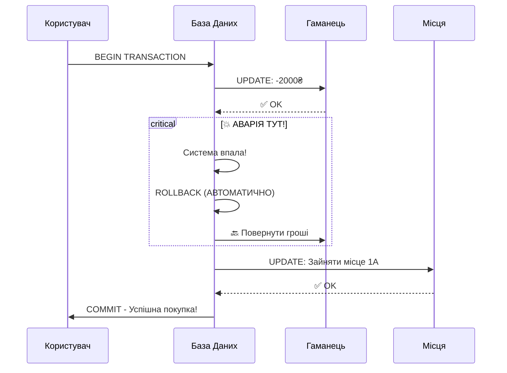

# Транзакції в SQL

## Проблема: Купівля останнього квитка

Уявіть, що ви купуєте **останній квиток** на концерт улюбленого гурту. Ваша покупка складається з двох кроків:

1.  💸 **Списати гроші** з вашого балансу.
2.  🎟️ **Забронювати місце** в залі.

**Сценарій жаху**: Гроші списалися, але перед бронюванням місця **сервер вимкнувся** (зникло світло, помилка мережі).
**Результат**: Ви без грошей і без квитка. 😱

::mermaid



::

**Транзакція** — це **група операцій**, які виконуються як **одне ціле**: або **всі успішно**, або **жодна**.

::tip
**Реальні приклади транзакцій**:

- Переказ грошей між рахунками
- Оформлення замовлення (створити Order + OrderItems + зменшити Stock)
- Реєстрація користувача (створити User + Profile + відправити Email)

::

---

## ACID властивості

## ACID властивості

Щоб гарантувати надійність, кожна транзакція повинна відповідати 4 принципам (**ACID**).

Уявіть, що ви замовляєте **лате в кав'ярні**:

::card-group

::card{title="A - Atomicity (Атомарність)" icon="i-lucide-atom"}

**Принцип**: "Все або нічого".

**Аналогія**: Не можна "трошки купити каву". Або ви платите і отримуєте напій, або ви не платите і не отримуєте нічого. Якщо кавомашина зламалася посеред приготування, бариста повертає гроші.

**В SQL**:

```sql
BEGIN TRANSACTION;
    -- Спроба створити студента
    INSERT INTO Students (LastName) VALUES ('Test'); -- Помилка! (NOT NULL)
    -- Якщо одна частина впала, скасовується ВСЕ
ROLLBACK;
```

::

::card{title="C - Consistency (Узгодженість)" icon="i-lucide-check-circle"}

**Принцип**: "Тільки правильні стани".

**Аналогія**: Кава не може коштувати -50 грн. Кількість молока не може бути "синім". Транзакція переводить систему з одного правильного стану в інший.

**В SQL**:

```sql
-- `Grants` (Стипендія) не може бути від'ємною (CHECK constraint)
BEGIN TRANSACTION;
    UPDATE Students SET Grants = -100 WHERE Id = 1; -- ❌ Помилка БД!
    -- Транзакція не дозволить порушити правила
ROLLBACK;
```

::

::card{title="I - Isolation (Ізоляція)" icon="i-lucide-shield"}

**Принцип**: "Ніхто не підглядає".

**Аналогія**: Поки бариста готує ваше лате, інший клієнт не може забрати ваше молоко чи випити половину напою. Кожне замовлення обробляється так, ніби воно єдине в світі.

**В SQL**:

```sql
-- Транзакція 1 змінює прізвище студента
UPDATE Students SET LastName = 'Нове' WHERE Id = 1;

-- Транзакція 2 (паралельно) читає Id = 1
-- Вона НЕ побачить 'Нове', поки Транзакція 1 не скаже COMMIT
```

::

::card{title="D - Durability (Довговічність)" icon="i-lucide-database"}

**Принцип**: "Записано — значить записано".

**Аналогія**: Якщо чек надруковано (COMMIT), то навіть якщо в кав'ярні вимкнеться світло через секунду, ваша покупка зафіксована. Коли світло увімкнуть, запис про продаж все одно буде в системі.

**В SQL**:

```sql
COMMIT;
-- ✅ Все. Навіть якщо сервер згорить, дані на диску.
```

::

::

---

## Базовий синтаксис транзакцій

### Структура транзакції

```sql
BEGIN TRANSACTION;  -- Або просто BEGIN TRAN

    -- SQL операції (INSERT, UPDATE, DELETE)

    IF <умова_успіху>
        COMMIT;  -- Зберегти всі зміни
    ELSE
        ROLLBACK;  -- Скасувати всі зміни
```

### Приклад 1: Успішна транзакція

```sql
BEGIN TRANSACTION;

    INSERT INTO Students (FirstName, LastName, BirthDate)
    VALUES ('Тест', 'Тестов', '2000-01-01');

    UPDATE Students SET Grants = Grants * 1.1
    WHERE LastName = 'Петренко';

COMMIT;  -- ✅ Обидві операції збережено
```

### Приклад 2: Скасування транзакції

```sql
BEGIN TRANSACTION;

    DELETE FROM Students WHERE Id = 1;

    -- Помилка! Передумали

ROLLBACK;  -- ❌ DELETE скасовано, студент залишився
```

---

## Практичний приклад: Індексація стипендій

Уявіть ситуацію: ректор наказав **підняти всім стипендію на 10%**.
Але є умова: **максимальна стипендія не може перевищувати 3000₴**.

Якщо хоча б один студент після підвищення отримає > 3000₴ — **скасувати підвищення для ВСІХ**.

```sql
use University;

-- Перевіримо поточні дані
SELECT * FROM Students;

BEGIN TRANSACTION;

    DECLARE @MaxGrantAllowed DECIMAL(10, 2) = 3000.00;

    -- Крок 1: Піднімаємо стипендію всім на 10%
    UPDATE Students
    SET Grants = Grants * 1.10
    WHERE Grants IS NOT NULL;

    -- Крок 2: Перевірка "Чи не порушили ми ліміт?"
    IF EXISTS (SELECT 1 FROM Students WHERE Grants > @MaxGrantAllowed)
    BEGIN
        -- О ні! Хтось отримав забагато.
        ROLLBACK;
        PRINT '❌ Помилка: Індексацію скасовано. Перевищено ліміт бюджету.';
    END
    ELSE
    BEGIN
        -- Все, добре, ліміт не порушено
        COMMIT;
        PRINT '✅ Успіх: Стипендії проіндексовано.';
    END

-- Перевіримо результат (змінилось або ні)
SELECT * FROM Students;
```

---

## TRY...CATCH з транзакціями

**Best Practice**: Завжди використовуйте TRY...CATCH для обробки помилок в транзакціях.

### Синтаксис

```sql
BEGIN TRY
    BEGIN TRANSACTION;

        -- SQL операції

    COMMIT;
END TRY
BEGIN CATCH
    -- Якщо сталася помилка
    IF @@TRANCOUNT > 0
        ROLLBACK;  -- Скасувати транзакцію

    -- Показати помилку
    PRINT ERROR_MESSAGE();
END CATCH
```

### Приклад: Безпечна вставка

```sql
BEGIN TRY
    BEGIN TRANSACTION;

        -- Додати студента
        INSERT INTO Students (FirstName, LastName, BirthDate, Email)
        VALUES ('Новий', 'Студент', '2000-01-01', 'test@example.com');

        -- Додати зарахування
        INSERT INTO Enrollments (StudentId, CourseId, EnrollmentDate)
        VALUES (SCOPE_IDENTITY(), 1, GETDATE());

        -- Якщо обидві операції успішні
    COMMIT;
    PRINT 'Студент успішно зареєстрований';
END TRY
BEGIN CATCH
    -- Якщо щось пішло не так (duplicate email, неіснуючий CourseId тощо)
    IF @@TRANCOUNT > 0
        ROLLBACK;

    PRINT 'Помилка: ' + ERROR_MESSAGE();
END CATCH
```

### Корисні функції помилок

```sql
BEGIN CATCH
    SELECT
        ERROR_NUMBER() AS ErrorNumber,
        ERROR_MESSAGE() AS ErrorMessage,
        ERROR_LINE() AS ErrorLine,
        ERROR_PROCEDURE() AS ErrorProcedure,
        ERROR_SEVERITY() AS ErrorSeverity,
        ERROR_STATE() AS ErrorState;

    ROLLBACK;
END CATCH
```

---

## SAVEPOINT: Часткове відкочування

**SAVEPOINT** (або **SAVE TRANSACTION**) дозволяє створити "checkpoint" всередині транзакції.

### Синтаксис

```sql
BEGIN TRANSACTION;

    -- Операція 1
    INSERT INTO Table1 VALUES (...);

    SAVE TRANSACTION SavePoint1;  -- Checkpoint

    -- Операція 2
    UPDATE Table2 SET ...;

    -- Щось пішло не так з Операцією 2
    ROLLBACK TRANSACTION SavePoint1;  -- Відкотити до checkpoint
    -- Операція 1 залишається, Операція 2 скасована

COMMIT;
```

### Приклад: Пакетна вставка з частковим откатом

```sql
BEGIN TRANSACTION;

    -- Вставка студента 1
    INSERT INTO Students (FirstName, LastName, BirthDate)
    VALUES ('Студент1', 'Прізвище1', '1998-01-01');

    SAVE TRANSACTION AfterStudent1;

    -- Спроба вставки студента 2
    BEGIN TRY
        INSERT INTO Students (FirstName, LastName, BirthDate)
        VALUES ('Студент2', 'Прізвище2', 'INVALID_DATE');  -- Помилка!
    END TRY
    BEGIN CATCH
        -- Відкотити тільки студента 2
        ROLLBACK TRANSACTION AfterStudent1;
        PRINT 'Студент 2 не додано через помилку';
    END CATCH

    -- Вставка студента 3
    INSERT INTO Students (FirstName, LastName, BirthDate)
    VALUES ('Студент3', 'Прізвище3', '1999-03-03');

COMMIT;

-- Результат: Студенти 1 та 3 додані, студент 2 - ні
```

---

## Рівні ізоляції (Isolation Levels)

Рівень ізоляції відповідає на питання: **"Наскільки ми дозволяємо іншим транзакціям заважати нам?"**

Уявіть, що ви читаєте книгу у бібліотеці, а хтось інший намагається виправити в ній текст олівцем.

### 4 рівні ізоляції (від хаосу до порядку)

::tabs

::tabs-item{label="1. READ UNCOMMITTED (Чернетка)"}

**Аналогія**: Ви читаєте статтю в блозі, яку автор **прямо зараз пише**. Ви бачите помилки, недописані речення. Автор може все стерти (ROLLBACK), а ви вже прочитали і повірили.

**В SQL**: Дозволяє "брудне читання" (Dirty Read). Найшвидший, але найнебезпечніший.

```sql
SET TRANSACTION ISOLATION LEVEL READ UNCOMMITTED;

BEGIN TRANSACTION;
    -- Ми бачимо зміни інших транзакцій, навіть якщо вони ще не COMMIT!
    -- Наприклад, хтось змінив стипендію на 99999, але ще не зберіг.
    SELECT * FROM Students;
COMMIT;
```

**Коли використовувати**: Для приблизної аналітики (наприклад, "Скільки приблизно людей зараз на сайті?"), де точність 100% не критична.

::

::tabs-item{label="2. READ COMMITTED (Опубліковане)"}

**Аналогія**: Ви читаєте тільки **опубліковані** статті. Якщо автор пише нову версію, ви бачите стару, поки він не натисне "Опублікувати" (COMMIT). Це стандарт поведінки у більшості БД.

**В SQL**: Ви не бачите незавершених транзакцій. Але якщо ви прочитаєте рядок двічі, він може змінитися між читаннями (бо хтось встиг зробити COMMIT).

```sql
SET TRANSACTION ISOLATION LEVEL READ COMMITTED; -- Default

BEGIN TRANSACTION;
    -- Читання 1: Стипендія = 1000
    SELECT Grants FROM Students WHERE Id = 1;

    -- ... тут хтось інший встиг змінити на 2000 і зробити COMMIT ...

    -- Читання 2: Стипендія = 2000 (дані змінилися прямо під час нашої роботи!)
    SELECT Grants FROM Students WHERE Id = 1;
COMMIT;
```

::

::tabs-item{label="3. REPEATABLE READ (Заморожене)"}

**Аналогія**: Ви берете книгу і **тримаєте її в руках**. Ніхто не може вирвати її у вас чи дописати щось, поки ви не покладете її назад (COMMIT).

**В SQL**: Гарантує, що якщо ви прочитали рядок, він **не зміниться** до кінця вашої транзакції. Інші транзакції, які хочуть змінити цей рядок, будуть **чекати** (висіти), поки ви не закінчите.

```sql
SET TRANSACTION ISOLATION LEVEL REPEATABLE READ;

BEGIN TRANSACTION;
    SELECT * FROM Students WHERE Id = 1;
    -- Тепер рядок Id=1 "заблокований" для змін іншими.
    -- Ніхто не може зробити UPDATE/DELETE для Id=1.

    -- ... робимо довгі обчислення ...

    SELECT * FROM Students WHERE Id = 1; -- Гарантовано ті ж дані
COMMIT;
```

::

::tabs-item{label="4. SERIALIZABLE (Повна блокада)"}

**Аналогія**: Ви зачиняєте бібліотеку на ключ. Ви там один. Ніхто не може увійти, ніхто не може нічого змінити чи додати, поки ви не вийдете.

**В SQL**: Найсуворіший рівень. Запобігає навіть появі _нових_ рядків (Phantom Reads), які відповідають вашій умові.

```sql
SET TRANSACTION ISOLATION LEVEL SERIALIZABLE;

BEGIN TRANSACTION;
    SELECT * FROM Students WHERE Grants > 1000;
    -- Ніхто не може навіть ДОДАТИ (INSERT) нового студента зі стипендією > 1000,
    -- поки ми не закінчимо.
COMMIT;
```

::

::

### Підсумок ризиків

| Рівень               | Dirty Read<br/>(Читання сміття) | Non-Repeatable Read<br/>(Зміна даних під попою) | Phantom Read<br/>(Поява нових даних) | Швидкість        |
| :------------------- | :-----------------------------: | :---------------------------------------------: | :----------------------------------: | :--------------- |
| **READ UNCOMMITTED** |             🔴 Так              |                     🔴 Так                      |                🔴 Так                | 🚀 Макс          |
| **READ COMMITTED**   |              🟢 Ні              |                     🔴 Так                      |                🔴 Так                | ⚡ Швидко        |
| **REPEATABLE READ**  |              🟢 Ні              |                      🟢 Ні                      |                🔴 Так                | 🐢 Повільніше    |
| **SERIALIZABLE**     |              🟢 Ні              |                      🟢 Ні                      |                🟢 Ні                 | 🐌 Дуже повільно |

---

## @@TRANCOUNT: Перевірка активних транзакцій

**@@TRANCOUNT** показує кількість активних (незакритих) транзакцій.

```sql
PRINT @@TRANCOUNT;  -- 0 (немає активних)

BEGIN TRANSACTION;
PRINT @@TRANCOUNT;  -- 1

    BEGIN TRANSACTION;  -- Вкладена
    PRINT @@TRANCOUNT;  -- 2

    COMMIT;
    PRINT @@TRANCOUNT;  -- 1

COMMIT;
PRINT @@TRANCOUNT;  -- 0
```

### Використання в помилках

```sql
BEGIN TRY
    BEGIN TRANSACTION;
        -- Операції
    COMMIT;
END TRY
BEGIN CATCH
    -- Перевірити, чи є активна транзакція
    IF @@TRANCOUNT > 0
        ROLLBACK;

    PRINT ERROR_MESSAGE();
END CATCH
```

---

## Deadlocks (Взаємні блокування)

**Deadlock** — це ситуація "клінч", коли дві транзакції чекають одна на одну і жодна не може продовжити.

### Приклад із життя

Два студенти хочуть обмінятися місцями в гуртожитку:

- Студент А зайняв кімнату 101 і чекає, поки звільниться 102.
- Студент Б зайняв кімнату 102 і чекає, поки звільниться 101.
  **Результат**: Вони чекатимуть вічно.

### Приклад в SQL (з таблицею Students)

::code-group

```sql [Транзакція 1]
BEGIN TRANSACTION;
    -- 1. Блокуємо Студента 1
    UPDATE Students SET Grants = 2000 WHERE Id = 1;

    WAITFOR DELAY '00:00:05'; -- Імітація думки...

    -- 2. Хочемо заблокувати Студента 2 (але він зайнятий Транзакцією 2!)
    UPDATE Students SET Grants = 2000 WHERE Id = 2;
COMMIT;
```

```sql [Транзакція 2]
BEGIN TRANSACTION;
    -- 1. Блокуємо Студента 2
    UPDATE Students SET Grants = 3000 WHERE Id = 2;

    WAITFOR DELAY '00:00:05'; -- Імітація думки...

    -- 2. Хочемо заблокувати Студента 1 (але він зайнятий Транзакцією 1!)
    UPDATE Students SET Grants = 3000 WHERE Id = 1;
COMMIT;

-- ❌ Deadlock! SQL Server вб'є одну з транзакцій (жертву).
```

::

### Як уникнути deadlocks

::card-group

::card{title="1. Однаковий порядок" icon="i-lucide-arrow-right"}
**Правило**: Завжди блокуйте ресурси в одному порядку (наприклад, за зростанням ID).

```sql
-- ✅ Завжди спочатку Id=1, потім Id=2
BEGIN TRANSACTION;
    UPDATE Students ... WHERE Id = 1;
    UPDATE Students ... WHERE Id = 2;
COMMIT;
```

::

::card{title="2. Коротші транзакції" icon="i-lucide-clock"}
Чим швидше ви зробите COMMIT, тим менше шансів, що хтось інший вклиниться.
::

::card{title="3. NOLOCK (читання без блокувань)" icon="i-lucide-unlock"}
Якщо вам лише _почитати_ і не важлива супер-точність:

```sql
SELECT * FROM Students WITH (NOLOCK);
```

::

::

---

## Практичні сценарії

### Сценарій 1: Безпечна реєстрація студента

Задача: Зареєструвати студента. Якщо такий Email вже є — не вставляти, а повернути помилку. Якщо студенту < 16 років — не реєструвати.

```sql
BEGIN TRY
    BEGIN TRANSACTION;

        DECLARE @Email NVARCHAR(100) = 'new.student@example.com';
        DECLARE @BirthDate DATE = '2010-01-01';

        -- 1. Перевірка Email
        IF EXISTS (SELECT 1 FROM Students WHERE Email = @Email)
        BEGIN
            THROW 51000, 'Такий Email вже існує!', 1;
        END

        -- 2. Перевірка віку
        IF DATEDIFF(YEAR, @BirthDate, GETDATE()) < 16
        BEGIN
             THROW 51000, 'Студент занадто молодий!', 1;
        END

        -- 3. Вставка
        INSERT INTO Students (LastName, FirstName, BirthDate, Email)
        VALUES ('Новий', 'Студент', @BirthDate, @Email);

    COMMIT;
    PRINT 'Студент успішно доданий!';
END TRY
BEGIN CATCH
    IF @@TRANCOUNT > 0
        ROLLBACK;
    PRINT 'Помилка: ' + ERROR_MESSAGE();
END CATCH
```

### Сценарій 2: Пакетне оновлення з логуванням

```sql
BEGIN TRY
    BEGIN TRANSACTION;

        -- Таблиця для логу (тимчасова змінна)
        DECLARE @UpdateLog TABLE (
            StudentId INT,
            OldGrants DECIMAL(10, 2),
            NewGrants DECIMAL(10, 2)
        );

        -- Оновити стипендії з логуванням
        UPDATE Students
        SET Grants = Grants * 1.15
        OUTPUT
            INSERTED.Id,
            DELETED.Grants,
            INSERTED.Grants
        INTO @UpdateLog
        WHERE YEAR(BirthDate) = 1998;

        -- Перевірити кількість оновлених
        DECLARE @UpdatedCount INT = (SELECT COUNT(*) FROM @UpdateLog);

        IF @UpdatedCount = 0
        BEGIN
            -- Якщо нікого не оновили - можна і закоммітити (нічого не змінилось),
            -- або відкотити, якщо це вважається помилкою бізнес-логіки.
            PRINT 'Жоден студент не підпав під критерії.';
            COMMIT;
        END
        ELSE
        BEGIN
            COMMIT;
            PRINT CAST(@UpdatedCount AS NVARCHAR) + ' студентів оновлено';

            -- Показати лог
            SELECT * FROM @UpdateLog;
        END

END TRY
BEGIN CATCH
    IF @@TRANCOUNT > 0
        ROLLBACK;
    PRINT ERROR_MESSAGE();
END CATCH
```

---

## Best Practices

::card-group

::card{title="1. Коротші транзакції" icon="i-lucide-zap"}

```sql
-- ❌ Погано - довга транзакція
BEGIN TRANSACTION;
    -- Довгий звіт, який блокує таблицю
    SELECT * FROM Students WHERE Grants > 0;
    -- Оновлення
    UPDATE Students SET Grants = 0 WHERE Id = 1;
COMMIT;

-- ✅ Добре - коротка транзакція
-- Звіт робимо БЕЗ транзакції (або з NOLOCK)
SELECT * FROM Students WITH(NOLOCK) WHERE Grants > 0;

-- А оновлення - швидко в транзакції
BEGIN TRANSACTION;
    UPDATE Students SET Grants = 0 WHERE Id = 1;
COMMIT;
```

::

::card{title="2. Завжди TRY...CATCH" icon="i-lucide-shield"}

```sql
BEGIN TRY
    BEGIN TRANSACTION;
        -- Операції
    COMMIT;
END TRY
BEGIN CATCH
    IF @@TRANCOUNT > 0
        ROLLBACK;
    -- Обробка помилки
END CATCH
```

::

::card{title="3. Явний COMMIT/ROLLBACK" icon="i-lucide-check"}

```sql
-- ✅ Добре - явний COMMIT
BEGIN TRANSACTION;
    UPDATE Students ...;
COMMIT;

-- ❌ Погано - забули COMMIT
BEGIN TRANSACTION;
    UPDATE Students ...;
-- Транзакція висить і блокує таблицю!
```

::

::card{title="4. Мінімум операцій" icon="i-lucide-minimize-2"}

Тримайте в транзакції **тільки** те, що **має** бути атомарним:

```sql
-- ✅ Добре
BEGIN TRANSACTION;
    INSERT INTO Students ...;
    INSERT INTO StudentLog ...;
COMMIT;

-- ❌ Погано
BEGIN TRANSACTION;
    INSERT INTO Students ...;
    -- Відправка email (це повільно і не стосується БД!)
    -- Генерація PDF звіту
    INSERT INTO StudentLog ...;
COMMIT;
```

::

::

::

---

## Практичні завдання

::accordion

::accordion-item{label="Завдання 1: Базова транзакція" icon="i-lucide-database"}

Створіть транзакцію що:

1. Додає нового студента
2. Встановлює йому стипендію 1500
3. Використовує TRY...CATCH

<details>
<summary>💡 Розв'язок</summary>

```sql
BEGIN TRY
    BEGIN TRANSACTION;

        INSERT INTO Students (FirstName, LastName, BirthDate, Grants)
        VALUES ('Новий', 'Студент', '2000-05-15', 1500);

        PRINT 'Студент успішно доданий з ID: ' + CAST(SCOPE_IDENTITY() AS NVARCHAR);

    COMMIT;
END TRY
BEGIN CATCH
    IF @@TRANCOUNT > 0
        ROLLBACK;
    PRINT 'Помилка: ' + ERROR_MESSAGE();
END CATCH
```

</details>

::

::accordion-item{label="Завдання 2: Транзакція з перевіркою" icon="i-lucide-check-circle"}

Створіть транзакцію що збільшує стипендію на 20%, але тільки якщо студентів з Email більше 5. Інакше - ROLLBACK.

<details>
<summary>💡 Розв'язок</summary>

```sql
BEGIN TRY
    BEGIN TRANSACTION;

        DECLARE @StudentCount INT = (SELECT COUNT(*) FROM Students WHERE Email IS NOT NULL);

        IF @StudentCount < 5
        BEGIN
            ROLLBACK;
            PRINT 'Недостатньо студентів з email (' + CAST(@StudentCount AS NVARCHAR) + ')';
        END
        ELSE
        BEGIN
            UPDATE Students
            SET Grants = Grants * 1.2
            WHERE Email IS NOT NULL;

            COMMIT;
            PRINT CAST(@@ROWCOUNT AS NVARCHAR) + ' студентів оновлено';
        END

END TRY
BEGIN CATCH
    IF @@TRANCOUNT > 0
        ROLLBACK;
    PRINT ERROR_MESSAGE();
END CATCH
```

</details>

::

::accordion-item{label="Завдання 3: SAVEPOINT" icon="i-lucide-bookmark"}

Створіть транзакцію з SAVEPOINT:

1. Додати студента 1
2. SAVEPOINT
3. Спроба додати студента 2 (може бути помилка)
4. Якщо помилка - ROLLBACK до SAVEPOINT
5. Додати студента 3
6. COMMIT

<details>
<summary>💡 Розв'язок</summary>

```sql
BEGIN TRANSACTION;

    -- Студент 1
    INSERT INTO Students (FirstName, LastName, BirthDate)
    VALUES ('Студент1', 'Тест', '1998-01-01');
    PRINT 'Студент 1 додано';

    SAVE TRANSACTION SP1;

    -- Студент 2 (може бути помилка)
    BEGIN TRY
        INSERT INTO Students (FirstName, LastName, BirthDate)
        VALUES ('Студент2', 'Тест', 'INVALID');  -- Помилка!
        PRINT 'Студент 2 додано';
    END TRY
    BEGIN CATCH
        ROLLBACK TRANSACTION SP1;
        PRINT 'Студент 2 НЕ додано: ' + ERROR_MESSAGE();
    END CATCH

    -- Студент 3
    INSERT INTO Students (FirstName, LastName, BirthDate)
    VALUES ('Студент3', 'Тест', '1999-03-03');
    PRINT 'Студент 3 додано';

COMMIT;
PRINT 'Транзакція завершена';
```

</details>

::

::

---

## Резюме

::tip
**Ключові моменти транзакцій**:

1. **ACID властивості**: Atomicity, Consistency, Isolation, Durability
2. **Синтаксис**: `BEGIN TRANSACTION` → операції → `COMMIT` або `ROLLBACK`
3. **TRY...CATCH** — обов'язково для production коду
4. **@@TRANCOUNT** — перевірка активних транзакцій
5. **SAVEPOINT** — часткове відкочування в транзакції
6. **Рівні ізоляції**:
    - READ UNCOMMITTED (найшвидший, найменш безпечний)
    - READ COMMITTED (за замовчуванням)
    - REPEATABLE READ
    - SERIALIZABLE (найповільніший, найбезпечніший)
7. **Deadlocks** — уникайте однаковим порядком доступу до таблиць
8. **Best Practices**:
    - Коротші транзакції
    - Мінімум операцій в транзакції
    - Завжди явний COMMIT/ROLLBACK
    - Обробка помилок через TRY...CATCH

**Вітаємо!** Ви завершили вивчення основ SQL!
::

---

**Пов'язані теми**:

- [Попередня: UPDATE та DELETE](./06.update-delete-queries.md)
- [Повернутися до початку: Sample Database Setup](./00.sample-database-setup.md)
- [CREATE TABLE](./01.ddl-create-table.md)
- [INSERT запити](./05.insert-queries.md)
