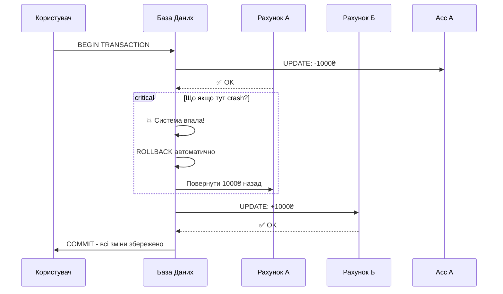

# Транзакції в SQL

## Проблема: Як забезпечити цілісність даних?

Уявіть банківську операцію переказу грошей:

1. Зняти 1000₴ з рахунку А
2. Додати 1000₴ на рахунок Б

Що станеться, якщо система впаде **між** цими двома операціями? Гроші зникнуть!

::mermaid



::

**Транзакція** — це **група операцій**, які виконуються як **одне ціле**: або **всі успішно**, або **жодна**.

::tip
**Реальні приклади транзакцій**:

- Переказ грошей між рахунками
- Оформлення замовлення (створити Order + OrderItems + зменшити Stock)
- Реєстрація користувача (створити User + Profile + відправити Email)
  ::

---

## ACID властивості

Транзакції мають 4 ключові властивості (**ACID**):

::card-group

::card{title="A - Atomicity (Атомарність)" icon="i-lucide-atom"}

**Все або нічого**: Транзакція або виконується повністю, або не виконується взагалі.

```sql
BEGIN TRANSACTION;
    UPDATE AccountA SET Balance = Balance - 1000;
    UPDATE AccountB SET Balance = Balance + 1000;
COMMIT;

-- Або обидва UPDATE виконаються, або жоден
```

::

::card{title="C - Consistency (Узгодженість)" icon="i-lucide-check-circle"}

**Дані завжди коректні**: Транзакція переводить БД з одного валідного стану в інший.

```sql
-- Баланси до: A=5000, B=3000, Сума=8000
BEGIN TRANSACTION;
    UPDATE AccountA SET Balance = Balance - 1000;  -- A=4000
    UPDATE AccountB SET Balance = Balance + 1000;  -- B=4000
COMMIT;
-- Баланси після: A=4000, B=4000, Сума=8000 ✅
```

::

::card{title="I - Isolation (Ізоляція)" icon="i-lucide-shield"}

**Незалежність**: Транзакції не заважають одна одній (не бачать проміжні результати).

```sql
-- Транзакція 1 (ще не COMMIT)
BEGIN TRANSACTION;
    UPDATE Products SET Price = 100 WHERE Id = 1;
    -- Інші транзакції ще бачать стару ціну!

-- Транзакція 2 (паралельно)
SELECT Price FROM Products WHERE Id = 1;
-- Результат: стара ціна (поки не COMMIT в транзакції 1)
```

::

::card{title="D - Durability (Довговічність)" icon="i-lucide-database"}

**Збереження назавжди**: Після COMMIT зміни **гарантовано збережені** (навіть якщо сервер впаде).

```sql
BEGIN TRANSACTION;
    INSERT INTO Orders (...) VALUES (...);
COMMIT;  -- ✅ З цього моменту запис ГАРАНТОВАНО в БД
-- Навіть якщо наступної секунди вимкнути сервер - дані збережуться
```

::

::

---

## Базовий синтаксис транзакцій

### Структура транзакції

```sql
BEGIN TRANSACTION;  -- Або просто BEGIN TRAN

    -- SQL операції (INSERT, UPDATE, DELETE)

    IF <умова_успіху>
        COMMIT;  -- Зберегти всі зміни
    ELSE
        ROLLBACK;  -- Скасувати всі зміни
```

### Приклад 1: Успішна транзакція

```sql
BEGIN TRANSACTION;

    INSERT INTO Students (FirstName, LastName, BirthDate)
    VALUES ('Тест', 'Тестов', '2000-01-01');

    UPDATE Students SET Grants = Grants * 1.1
    WHERE LastName = 'Петренко';

COMMIT;  -- ✅ Обидві операції збережено
```

### Приклад 2: Скасування транзакції

```sql
BEGIN TRANSACTION;

    DELETE FROM Students WHERE Id = 1;

    -- Помилка! Передумали

ROLLBACK;  -- ❌ DELETE скасовано, студент залишився
```

---

## Практичний приклад: Переказ грошей

```sql
-- Таблиця рахунків
CREATE TABLE Accounts (
    AccountId INT PRIMARY KEY,
    Balance DECIMAL(18, 2) NOT NULL CHECK (Balance >= 0)
);

INSERT INTO Accounts VALUES (1, 5000), (2, 3000);

-- Переказ 1000 з рахунку 1 на рахунок 2
BEGIN TRANSACTION;

    DECLARE @Amount DECIMAL(18, 2) = 1000;
    DECLARE @FromAccount INT = 1;
    DECLARE @ToAccount INT = 2;

    -- Крок 1: Зняти гроші
    UPDATE Accounts
    SET Balance = Balance - @Amount
    WHERE AccountId = @FromAccount;

    -- Перевірка: чи достатньо грошей?
    IF (SELECT Balance FROM Accounts WHERE AccountId = @FromAccount) < 0
    BEGIN
        ROLLBACK;  -- Скасувати! Недостатньо грошей
        PRINT 'Помилка: недостатньо коштів';
    END
    ELSE
    BEGIN
        -- Крок 2: Додати гроші
        UPDATE Accounts
        SET Balance = Balance + @Amount
        WHERE AccountId = @ToAccount;

        COMMIT;  -- ✅ Переказ успішний
        PRINT 'Переказ виконано успішно';
    END

-- Перевірка
SELECT * FROM Accounts;
-- AccountId | Balance
-- 1         | 4000.00
-- 2         | 4000.00
```

---

## TRY...CATCH з транзакціями

**Best Practice**: Завжди використовуйте TRY...CATCH для обробки помилок в транзакціях.

### Синтаксис

```sql
BEGIN TRY
    BEGIN TRANSACTION;

        -- SQL операції

    COMMIT;
END TRY
BEGIN CATCH
    -- Якщо сталася помилка
    IF @@TRANCOUNT > 0
        ROLLBACK;  -- Скасувати транзакцію

    -- Показати помилку
    PRINT ERROR_MESSAGE();
END CATCH
```

### Приклад: Безпечна вставка

```sql
BEGIN TRY
    BEGIN TRANSACTION;

        -- Додати студента
        INSERT INTO Students (FirstName, LastName, BirthDate, Email)
        VALUES ('Новий', 'Студент', '2000-01-01', 'test@example.com');

        -- Додати зарахування
        INSERT INTO Enrollments (StudentId, CourseId, EnrollmentDate)
        VALUES (SCOPE_IDENTITY(), 1, GETDATE());

        -- Якщо обидві операції успішні
    COMMIT;
    PRINT 'Студент успішно зареєстрований';
END TRY
BEGIN CATCH
    -- Якщо щось пішло не так (duplicate email, неіснуючий CourseId тощо)
    IF @@TRANCOUNT > 0
        ROLLBACK;

    PRINT 'Помилка: ' + ERROR_MESSAGE();
END CATCH
```

### Корисні функції помилок

```sql
BEGIN CATCH
    SELECT
        ERROR_NUMBER() AS ErrorNumber,
        ERROR_MESSAGE() AS ErrorMessage,
        ERROR_LINE() AS ErrorLine,
        ERROR_PROCEDURE() AS ErrorProcedure,
        ERROR_SEVERITY() AS ErrorSeverity,
        ERROR_STATE() AS ErrorState;

    ROLLBACK;
END CATCH
```

---

## SAVEPOINT: Часткове відкочування

**SAVEPOINT** (або **SAVE TRANSACTION**) дозволяє створити "checkpoint" всередині транзакції.

### Синтаксис

```sql
BEGIN TRANSACTION;

    -- Операція 1
    INSERT INTO Table1 VALUES (...);

    SAVE TRANSACTION SavePoint1;  -- Checkpoint

    -- Операція 2
    UPDATE Table2 SET ...;

    -- Щось пішло не так з Операцією 2
    ROLLBACK TRANSACTION SavePoint1;  -- Відкотити до checkpoint
    -- Операція 1 залишається, Операція 2 скасована

COMMIT;
```

### Приклад: Пакетна вставка з частковим откатом

```sql
BEGIN TRANSACTION;

    -- Вставка студента 1
    INSERT INTO Students (FirstName, LastName, BirthDate)
    VALUES ('Студент1', 'Прізвище1', '1998-01-01');

    SAVE TRANSACTION AfterStudent1;

    -- Спроба вставки студента 2
    BEGIN TRY
        INSERT INTO Students (FirstName, LastName, BirthDate)
        VALUES ('Студент2', 'Прізвище2', 'INVALID_DATE');  -- Помилка!
    END TRY
    BEGIN CATCH
        -- Відкотити тільки студента 2
        ROLLBACK TRANSACTION AfterStudent1;
        PRINT 'Студент 2 не додано через помилку';
    END CATCH

    -- Вставка студента 3
    INSERT INTO Students (FirstName, LastName, BirthDate)
    VALUES ('Студент3', 'Прізвище3', '1999-03-03');

COMMIT;

-- Результат: Студенти 1 та 3 додані, студент 2 - ні
```

---

## Рівні ізоляції (Isolation Levels)

Рівень ізоляції визначає, **як** транзакції впливають одна на одну.

### 4 основні рівні

::tabs

::tabs-item{label="READ UNCOMMITTED (найнижчий)"}

**Дозволяє**: Читати **незбережені** дані інших транзакцій (dirty reads).

```sql
SET TRANSACTION ISOLATION LEVEL READ UNCOMMITTED;

BEGIN TRANSACTION;
    -- Може побачити зміни, які ще не COMMIT у іншій транзакції
    SELECT * FROM Products;
COMMIT;
```

**Проблеми**: Dirty reads (читання "брудних" даних)

**Використання**: Звіти, де точність не критична

::

::tabs-item{label="READ COMMITTED (за замовчуванням)"}

**Дозволяє**: Читати тільки **збережені** дані (після COMMIT).

```sql
SET TRANSACTION ISOLATION LEVEL READ COMMITTED;

BEGIN TRANSACTION;
    -- Бачить тільки дані після COMMIT
    SELECT * FROM Products;
COMMIT;
```

**Проблеми**: Non-repeatable reads (дані можуть змінитися між двома SELECT)

**Використання**: Більшість звичайних операцій

::

::tabs-item{label="REPEATABLE READ"}

**Гарантує**: Ті ж дані при повторному читанні в одній транзакції.

```sql
SET TRANSACTION ISOLATION LEVEL REPEATABLE READ;

BEGIN TRANSACTION;
    SELECT * FROM Products WHERE Id = 1;  -- Price = 100
    -- Інша транзакція UPDATE Price = 200 (блокується!)
    SELECT * FROM Products WHERE Id = 1;  -- Price = 100 (те ж саме)
COMMIT;
```

**Проблеми**: Phantom reads (можуть з'явитися нові рядки)

**Використання**: Коли потрібна стабільність даних

::

::tabs-item{label="SERIALIZABLE (найвищий)"}

**Гарантує**: Повна ізоляція, ніби транзакції виконуються послідовно.

```sql
SET TRANSACTION ISOLATION LEVEL SERIALIZABLE;

BEGIN TRANSACTION;
    SELECT * FROM Products;
    -- Інші транзакції НЕ можуть INSERT/UPDATE/DELETE в Products
    SELECT * FROM Products;  -- Гарантовано ті ж дані
COMMIT;
```

**Проблеми**: Найповільніший, багато блокувань

**Використання**: Критичні фінансові операції

::

::

### Порівняльна таблиця

| Рівень           | Dirty Reads                                                | Non-Repeatable Reads                                       | Phantom Reads                                              | Performance                                                   |
| :--------------- | :--------------------------------------------------------- | :--------------------------------------------------------- | :--------------------------------------------------------- | :------------------------------------------------------------ |
| READ UNCOMMITTED | :icon{name="i-lucide-x" class="text-red-500"} Можливі      | :icon{name="i-lucide-x" class="text-red-500"} Можливі      | :icon{name="i-lucide-x" class="text-red-500"} Можливі      | :icon{name="i-lucide-zap" class="text-green-500"} Найшвидший  |
| READ COMMITTED   | :icon{name="i-lucide-check" class="text-green-500"} Захист | :icon{name="i-lucide-x" class="text-red-500"} Можливі      | :icon{name="i-lucide-x" class="text-red-500"} Можливі      | :icon{name="i-lucide-zap" class="text-green-500"} Швидкий     |
| REPEATABLE READ  | :icon{name="i-lucide-check" class="text-green-500"} Захист | :icon{name="i-lucide-check" class="text-green-500"} Захист | :icon{name="i-lucide-x" class="text-red-500"} Можливі      | :icon{name="i-lucide-clock" class="text-yellow-500"} Середній |
| SERIALIZABLE     | :icon{name="i-lucide-check" class="text-green-500"} Захист | :icon{name="i-lucide-check" class="text-green-500"} Захист | :icon{name="i-lucide-check" class="text-green-500"} Захист | :icon{name="i-lucide-turtle" class="text-red-500"} Повільний  |

---

## @@TRANCOUNT: Перевірка активних транзакцій

**@@TRANCOUNT** показує кількість активних (незакритих) транзакцій.

```sql
PRINT @@TRANCOUNT;  -- 0 (немає активних)

BEGIN TRANSACTION;
PRINT @@TRANCOUNT;  -- 1

    BEGIN TRANSACTION;  -- Вкладена
    PRINT @@TRANCOUNT;  -- 2

    COMMIT;
    PRINT @@TRANCOUNT;  -- 1

COMMIT;
PRINT @@TRANCOUNT;  -- 0
```

### Використання в помилках

```sql
BEGIN TRY
    BEGIN TRANSACTION;
        -- Операції
    COMMIT;
END TRY
BEGIN CATCH
    -- Перевірити, чи є активна транзакція
    IF @@TRANCOUNT > 0
        ROLLBACK;

    PRINT ERROR_MESSAGE();
END CATCH
```

---

## Deadlocks (Взаємні блокування)

**Deadlock** виникає, коли дві транзакції чекають одна на одну і жодна не може продовжити.

### Приклад deadlock

::code-group

```sql [Транзакція 1]
BEGIN TRANSACTION;
    -- Блокує таблицю A
    UPDATE TableA SET Value = 1 WHERE Id = 1;

    WAITFOR DELAY '00:00:02';  -- Чекаємо 2 сек

    -- Намагається заблокувати таблицю B (чекає на транзакцію 2)
    UPDATE TableB SET Value = 1 WHERE Id = 1;
COMMIT;
```

```sql [Транзакція 2 (паралельно)]
BEGIN TRANSACTION;
    -- Блокує таблицю B
    UPDATE TableB SET Value = 2 WHERE Id = 1;

    WAITFOR DELAY '00:00:02';  -- Чекаємо 2 сек

    -- Намагається заблокувати таблицю A (чекає на транзакцію 1)
    UPDATE TableA SET Value = 2 WHERE Id = 1;
COMMIT;

-- ❌ Deadlock! SQL Server вибере "жертву" і відкотить її транзакцію
```

::

### Як уникнути deadlocks

::card-group

::card{title="1. Однаковий порядок доступу" icon="i-lucide-arrow-right"}

```sql
-- ✅ Завжди доступ в порядку: TableA → TableB
BEGIN TRANSACTION;
    UPDATE TableA ...;
    UPDATE TableB ...;
COMMIT;
```

::

::card{title="2. Коротші транзакції" icon="i-lucide-clock"}

```sql
-- ❌ Довга транзакція
BEGIN TRANSACTION;
    UPDATE ...;
    -- Складна обробка даних
    COMMIT;

-- ✅ Коротка транзакція
-- Обробка даних ДО транзакції
BEGIN TRANSACTION;
    UPDATE ...;
COMMIT;
```

::

::card{title="3. Використання NOLOCK" icon="i-lucide-unlock"}

```sql
-- Для SELECT що не потребують точності
SELECT * FROM Products WITH (NOLOCK);
```

::

::

---

## Практичні сценарії

### Сценарій 1: Оформлення замовлення

```sql
BEGIN TRY
    BEGIN TRANSACTION;

        -- 1. Створити замовлення
        DECLARE @OrderId INT;
        INSERT INTO Orders (CustomerId, OrderDate, TotalAmount)
        VALUES (123, GETDATE(), 2500);
        SET @OrderId = SCOPE_IDENTITY();

        -- 2. Додати товари до замовлення
        INSERT INTO OrderItems (OrderId, ProductId, Quantity, Price)
        VALUES
            (@OrderId, 1, 2, 1000),
            (@OrderId, 2, 1, 500);

        -- 3. Зменшити кількість товарів на складі
        UPDATE Products SET Stock = Stock - 2 WHERE ProductId = 1;
        UPDATE Products SET Stock = Stock - 1 WHERE ProductId = 2;

        -- 4. Перевірити, чи залишився товар
        IF EXISTS (SELECT 1 FROM Products WHERE ProductId IN (1, 2) AND Stock < 0)
        BEGIN
            RAISERROR('Недостатньо товару на складі', 16, 1);
        END

    COMMIT;
    PRINT 'Замовлення #' + CAST(@OrderId AS NVARCHAR) + ' успішно оформлено';
END TRY
BEGIN CATCH
    IF @@TRANCOUNT > 0
        ROLLBACK;
    PRINT 'Помилка: ' + ERROR_MESSAGE();
END CATCH
```

### Сценарій 2: Пакетне оновлення з логуванням

```sql
BEGIN TRY
    BEGIN TRANSACTION;

        -- Таблиця для логу
        DECLARE @UpdateLog TABLE (
            StudentId INT,
            OldGrants DECIMAL(10, 2),
            NewGrants DECIMAL(10, 2)
        );

        -- Оновити стипендії з логуванням
        UPDATE Students
        SET Grants = Grants * 1.15
        OUTPUT
            INSERTED.Id,
            DELETED.Grants,
            INSERTED.Grants
        INTO @UpdateLog
        WHERE YEAR(BirthDate) = 1998;

        -- Перевірити кількість оновлених
        DECLARE @UpdatedCount INT = (SELECT COUNT(*) FROM @UpdateLog);

        IF @UpdatedCount = 0
        BEGIN
            ROLLBACK;
            PRINT 'Жоден студент не оновлений - відміна транзакції';
        END
        ELSE
        BEGIN
            COMMIT;
            PRINT CAST(@UpdatedCount AS NVARCHAR) + ' студентів оновлено';

            -- Показати лог
            SELECT * FROM @UpdateLog;
        END

END TRY
BEGIN CATCH
    IF @@TRANCOUNT > 0
        ROLLBACK;
    PRINT ERROR_MESSAGE();
END CATCH
```

---

## Best Practices

::card-group

::card{title="1. Коротші транзакції" icon="i-lucide-zap"}

```sql
-- ❌ Погано - довга транзакція
BEGIN TRANSACTION;
    SELECT * FROM BigTable;  -- Повільний запит
    -- Обробка даних в коді
    UPDATE ...;
COMMIT;

-- ✅ Добре - коротка транзакція
-- SELECT поза транзакцією
-- Обробка даних
BEGIN TRANSACTION;
    UPDATE ...;
COMMIT;
```

::

::card{title="2. Завжди TRY...CATCH" icon="i-lucide-shield"}

```sql
BEGIN TRY
    BEGIN TRANSACTION;
        -- Операції
    COMMIT;
END TRY
BEGIN CATCH
    IF @@TRANCOUNT > 0
        ROLLBACK;
    -- Обробка помилки
END CATCH
```

::

::card{title="3. Явний COMMIT/ROLLBACK" icon="i-lucide-check"}

```sql
-- ✅ Добре - явний COMMIT
BEGIN TRANSACTION;
    UPDATE ...;
COMMIT;

-- ❌ Погано - забули COMMIT
BEGIN TRANSACTION;
    UPDATE ...;
-- Транзакція залишається відкритою!
```

::

::card{title="4. Мінімум операцій" icon="i-lucide-minimize-2"}

Тримайте в транзакції **тільки** те, що **маєть** бути атомарним:

```sql
-- ✅ Добре
BEGIN TRANSACTION;
    UPDATE AccountA SET Balance = Balance - 1000;
    UPDATE AccountB SET Balance = Balance + 1000;
COMMIT;

-- ❌ Погано
BEGIN TRANSACTION;
    UPDATE AccountA ...;
    -- Відправка email (повільно!)
    -- Логування
    UPDATE AccountB ...;
COMMIT;
```

::

::

---

## Практичні завдання

::accordion

::accordion-item{label="Завдання 1: Базова транзакція" icon="i-lucide-database"}

Створіть транзакцію що:

1. Додає нового студента
2. Встановлює йому стипендію 1500
3. Використовує TRY...CATCH

<details>
<summary>💡 Розв'язок</summary>

```sql
BEGIN TRY
    BEGIN TRANSACTION;

        INSERT INTO Students (FirstName, LastName, BirthDate, Grants)
        VALUES ('Новий', 'Студент', '2000-05-15', 1500);

        PRINT 'Студент успішно доданий з ID: ' + CAST(SCOPE_IDENTITY() AS NVARCHAR);

    COMMIT;
END TRY
BEGIN CATCH
    IF @@TRANCOUNT > 0
        ROLLBACK;
    PRINT 'Помилка: ' + ERROR_MESSAGE();
END CATCH
```

</details>

::

::accordion-item{label="Завдання 2: Транзакція з перевіркою" icon="i-lucide-check-circle"}

Створіть транзакцію що збільшує стипендію на 20%, але тільки якщо студентів з Email більше 5. Інакше - ROLLBACK.

<details>
<summary>💡 Розв'язок</summary>

```sql
BEGIN TRY
    BEGIN TRANSACTION;

        DECLARE @StudentCount INT = (SELECT COUNT(*) FROM Students WHERE Email IS NOT NULL);

        IF @StudentCount < 5
        BEGIN
            ROLLBACK;
            PRINT 'Недостатньо студентів з email (' + CAST(@StudentCount AS NVARCHAR) + ')';
        END
        ELSE
        BEGIN
            UPDATE Students
            SET Grants = Grants * 1.2
            WHERE Email IS NOT NULL;

            COMMIT;
            PRINT CAST(@@ROWCOUNT AS NVARCHAR) + ' студентів оновлено';
        END

END TRY
BEGIN CATCH
    IF @@TRANCOUNT > 0
        ROLLBACK;
    PRINT ERROR_MESSAGE();
END CATCH
```

</details>

::

::accordion-item{label="Завдання 3: SAVEPOINT" icon="i-lucide-bookmark"}

Створіть транзакцію з SAVEPOINT:

1. Додати студента 1
2. SAVEPOINT
3. Спроба додати студента 2 (може бути помилка)
4. Якщо помилка - ROLLBACK до SAVEPOINT
5. Додати студента 3
6. COMMIT

<details>
<summary>💡 Розв'язок</summary>

```sql
BEGIN TRANSACTION;

    -- Студент 1
    INSERT INTO Students (FirstName, LastName, BirthDate)
    VALUES ('Студент1', 'Тест', '1998-01-01');
    PRINT 'Студент 1 додано';

    SAVE TRANSACTION SP1;

    -- Студент 2 (може бути помилка)
    BEGIN TRY
        INSERT INTO Students (FirstName, LastName, BirthDate)
        VALUES ('Студент2', 'Тест', 'INVALID');  -- Помилка!
        PRINT 'Студент 2 додано';
    END TRY
    BEGIN CATCH
        ROLLBACK TRANSACTION SP1;
        PRINT 'Студент 2 НЕ додано: ' + ERROR_MESSAGE();
    END CATCH

    -- Студент 3
    INSERT INTO Students (FirstName, LastName, BirthDate)
    VALUES ('Студент3', 'Тест', '1999-03-03');
    PRINT 'Студент 3 додано';

COMMIT;
PRINT 'Транзакція завершена';
```

</details>

::

::

---

## Резюме

::tip
**Ключові моменти транзакцій**:

1. **ACID властивості**: Atomicity, Consistency, Isolation, Durability
2. **Синтаксис**: `BEGIN TRANSACTION` → операції → `COMMIT` або `ROLLBACK`
3. **TRY...CATCH** — обов'язково для production коду
4. **@@TRANCOUNT** — перевірка активних транзакцій
5. **SAVEPOINT** — часткове відкочування в транзакції
6. **Рівні ізоляції**:
    - READ UNCOMMITTED (найшвидший, найменш безпечний)
    - READ COMMITTED (за замовчуванням)
    - REPEATABLE READ
    - SERIALIZABLE (найповільніший, найбезпечніший)
7. **Deadlocks** — уникайте однаковим порядком доступу до таблиць
8. **Best Practices**:
    - Коротші транзакції
    - Мінімум операцій в транзакції
    - Завжди явний COMMIT/ROLLBACK
    - Обробка помилок через TRY...CATCH

**Вітаємо!** Ви завершили вивчення основ SQL!
::

---

**Пов'язані теми**:

- [Попередня: UPDATE та DELETE](./06.update-delete-queries.md)
- [Повернутися до початку: Sample Database Setup](./00.sample-database-setup.md)
- [CREATE TABLE](./01.ddl-create-table.md)
- [INSERT запити](./05.insert-queries.md)
