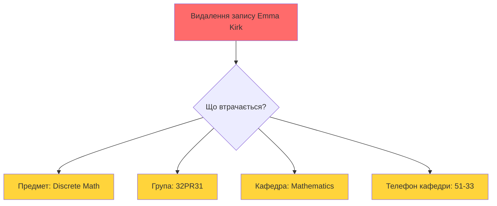
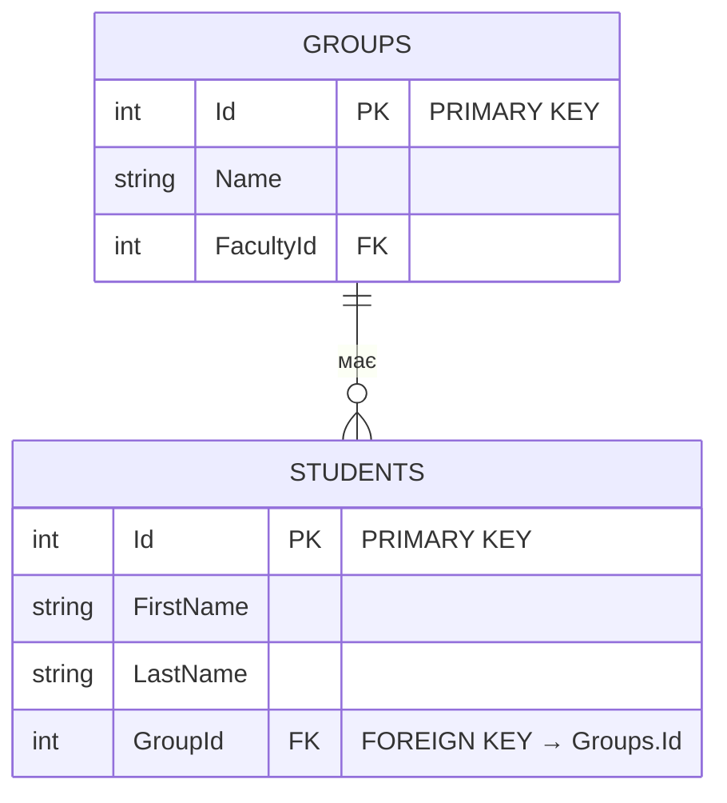
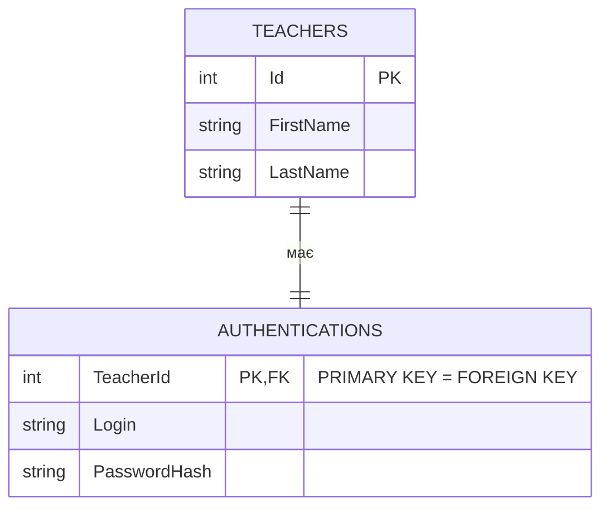
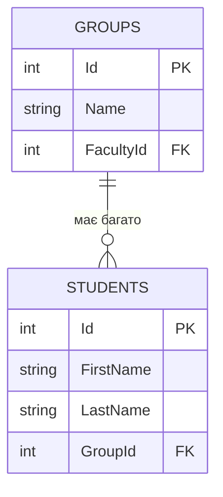
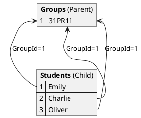
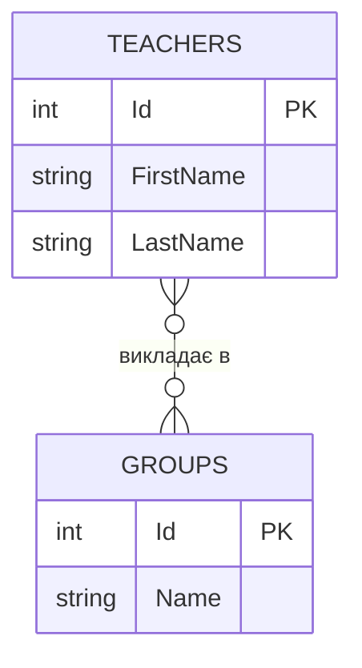
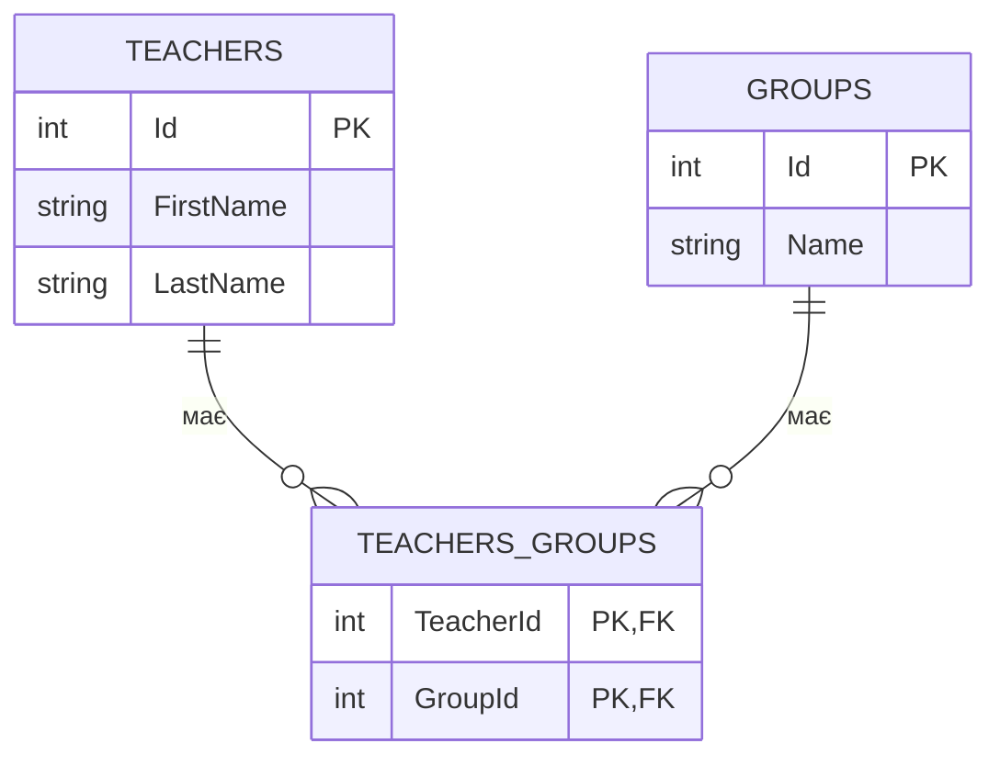
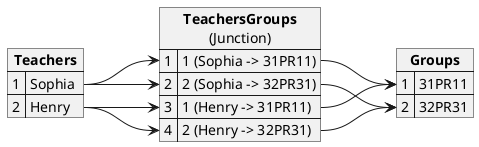
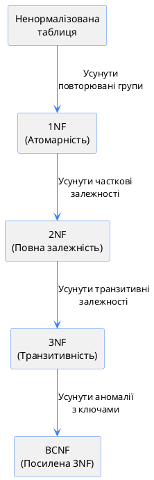

# Зв'язки та нормалізація баз даних

## Проблема: Чому однотабличні БД - це погано?

Уявіть таблицю `Teachers`, що містить інформацію про викладачів, кафедри, предмети та групи:

| Id  | FirstName | LastName   | Department   | DeptPhone | Subject       | Group  |
| :-- | :-------- | :--------- | :----------- | :-------- | :------------ | :----- |
| 1   | Sophia    | Nelson     | Software Dev | 48-21     | C#            | 31PR11 |
| 2   | Sophia    | Nelson     | Software Dev | 48-21     | Java          | 32PR31 |
| 3   | Henry     | MacAlister | Software Dev | 48-21     | Databases     | 31PR11 |
| 4   | Michael   | Cooper     | Software Dev | 48-21     | Web Dev       | 32PR31 |
| 5   | Emma      | Kirk       | Mathematics  | 51-33     | Discrete Math | 32PR31 |

::warning
**Проблема**: Величезна кількість дублювання даних! Інформація про кафедру "Software Dev" повторюється 4 рази.
::

---

## 1. Аномалії однотабличних БД

### 1.1. Аномалія оновлення (Update Anomaly)

**Проблема**: Якщо змінюється телефон кафедри Software Dev з `48-21` на `48-22`, потрібно оновити **всі** записи викладачів цієї кафедри.

::code-group

```sql [❌ Проблема]
-- Оновили тільки один запис
UPDATE Teachers
SET DeptPhone = '48-22'
WHERE Id = 1;

-- Результат: СУПЕРЕЧЛИВІ ДАНІ!
-- Записи 1 має номер 48-22
-- Записи 2,3,4 мають номер 48-21
-- Який правильний? ❓
```

```sql [✅ Потрібно оновити ВСІ]
-- Правильно: оновити всі записи
UPDATE Teachers
SET DeptPhone = '48-22'
WHERE Department = 'Software Dev';

-- Але це неефективно та небезпечно!
```

::

**Види надмірності**:

::card-group

::card{title="Явна надмірність" icon="i-lucide-copy"}
Одна й та сама інформація повторюється verbatim:

- Ім'я "Sophia Nelson" повторюється 2 рази
- "Software Dev" повторюється 4 рази

::

::card{title="Неявна надмірність" icon="i-lucide-link"}
Неявна залежність між записами:

- Телефон `48-21` залежить від кафедри
- Якщо не оновити всі записи → суперечливість

::

::

---

### 1.2. Аномалія вставки (Insert Anomaly)

**Проблема**: Неможливо додати викладача, поки не з'ясуємо, які предмети він викладає та в яких групах.

```sql
-- Спроба додати нового викладача без предмету/групи
INSERT INTO Teachers (FirstName, LastName, Department, DeptPhone)
VALUES ('John', 'Doe', 'Software Dev', '48-21');

-- ❌ Помилка!
-- Cannot insert NULL into Subject, Group (якщо вони NOT NULL)
```

**Чому це погано?**

- Не можемо "прийняти на роботу" викладача до призначення предметів
- Втрачаємо гнучкість

---

### 1.3. Аномалія видалення (Delete Anomaly)

**Проблема**: Видалення запису може призвести до **втрати унікальної інформації**.

```sql
-- Emma Kirk - єдиний викладач предмету "Discrete Math"
DELETE FROM Teachers WHERE Id = 5;

-- ❌ Втрачено інформацію про:
-- - Предмет "Discrete Math"
-- - Групу "32PR31" (якщо вона унікальна)
-- - Кафедру "Mathematics"
```

::mermaid



::

::caution
**Критична проблема**: Однотабличні БД не забезпечують цілісність даних!
::

---

## 2. Рішення: Багатотаблична БД

**Багатотаблична БД** — структура з кількох зв'язаних таблиць, кожна з яких зберігає специфічну інформацію.

### 2.1. Переваги багатотабличних БД

::card-group

::card{title="1. Усунення дублювання" icon="i-lucide-trash-2"}
Кожен факт зберігається **один раз**:

- Кафедра тільки в таблиці `Departments`
- Предмет тільки в таблиці `Subjects`

::

::card{title="2. Цілісність даних" icon="i-lucide-shield-check"}
FOREIGN KEY constraints забезпечують коректність посилань
::

::card{title="3. Гнучкість" icon="i-lucide-zap"}
Можна додавати викладачів, кафедри, предмети незалежно
::

::card{title="4. Продуктивність" icon="i-lucide-rocket"}
Менше дублювання = менше даних = швидші запити
::

::

---

## 3. FOREIGN KEY: Механізм зв'язків

### 3.1. Що таке FOREIGN KEY?

**Зовнішній ключ (Foreign Key)** — стовпець (або комбінація стовпців) в таблиці, що посилається на PRIMARY KEY іншої таблиці.

::mermaid



::

### 3.2. Синтаксис FOREIGN KEY

```sql
CREATE TABLE Students (
    Id INT PRIMARY KEY IDENTITY(1,1),
    FirstName NVARCHAR(50) NOT NULL,
    LastName NVARCHAR(50) NOT NULL,
    GroupId INT NOT NULL,  -- Зовнішній ключ

    -- Визначення FOREIGN KEY constraint
    CONSTRAINT FK_Students_Groups
        FOREIGN KEY (GroupId)
        REFERENCES Groups(Id)
);
```

**Анатомія FOREIGN KEY**:

::field-group
::field{name="CONSTRAINT FK_Students_Groups"}
Ім'я constraint (naming convention: `FK_ChildTable_ParentTable`)
::
::field{name="FOREIGN KEY (GroupId)"}
Стовпець у **поточній** таблиці (child)
::
::field{name="REFERENCES Groups(Id)"}
Посилання на PRIMARY KEY у **іншій** таблиці (parent)
::
::

### 3.3. Референційна цілісність (Referential Integrity)

FOREIGN KEY забезпечує **референційну цілісність**:

```sql
-- ✅ Можна вставити студента з існуючою групою
INSERT INTO Students (FirstName, LastName, GroupId)
VALUES ('John', 'Doe', 1);  -- Група з Id=1 існує

-- ❌ НЕ можна вставити студента з неіснуючою групою
INSERT INTO Students (FirstName, LastName, GroupId)
VALUES ('Jane', 'Smith', 999);  -- Групи з Id=999 НЕ існує

-- Помилка: The INSERT statement conflicted with the FOREIGN KEY constraint
```

::tip
**Золоте правило**: Не можна вставити запис з FK, що посилається на неіснуючий PK!
::

---

## 4. Типи зв'язків між таблицями

### 4.1. Зв'язок "Один до одного" (1:1)

**One-to-One**: Один запис в таблиці A відповідає **рівно одному** запису в таблиці B.

::mermaid



::

**Приклад**: Кожен викладач має **один** набір облікових даних (логін/пароль).

```sql
CREATE TABLE Teachers (
    Id INT PRIMARY KEY IDENTITY(1,1),
    FirstName NVARCHAR(50) NOT NULL,
    LastName NVARCHAR(50) NOT NULL
);

CREATE TABLE Authentications (
    TeacherId INT PRIMARY KEY,  -- Одразу PK і FK!
    Login NVARCHAR(50) UNIQUE NOT NULL,
    PasswordHash NVARCHAR(255) NOT NULL,

    CONSTRAINT FK_Authentications_Teachers
        FOREIGN KEY (TeacherId)
        REFERENCES Teachers(Id)
);
```

**Коли використовувати 1:1?**

::tabs

::tabs-item{label="Секретні дані"}

Виносимо конфіденційну інформацію в окрему таблицю з вищим рівнем безпеки:

```sql
-- Публічна інформація
CREATE TABLE Employees (
    Id INT PRIMARY KEY,
    FirstName NVARCHAR(50),
    LastName NVARCHAR(50),
    Position NVARCHAR(50)
);

-- Секретні дані (обмежений доступ)
CREATE TABLE EmployeeSalaries (
    EmployeeId INT PRIMARY KEY,
    Salary DECIMAL(18,2),
    BankAccount NVARCHAR(50),

    FOREIGN KEY (EmployeeId) REFERENCES Employees(Id)
);
```

::

::tabs-item{label="Оптимізація"}

Розбиваємо велику таблицю, якщо частина даних потрібна рідко:

```sql
-- Часто використовувані дані
CREATE TABLE Products (
    Id INT PRIMARY KEY,
    Name NVARCHAR(100),
    Price DECIMAL(10,2)
);

-- Рідко використовувані дані (детальні специфікації)
CREATE TABLE ProductDetails (
    ProductId INT PRIMARY KEY,
    LongDescription NVARCHAR(MAX),
    TechnicalSpecs XML,

    FOREIGN KEY (ProductId) REFERENCES Products(Id)
);
```

::

::

::note
Зв'язок 1:1 використовується **рідко** - зазвичай дані можна зберігати в одній таблиці.
::

---

### 4.2. Зв'язок "Один до багатьох" (1:N)

**One-to-Many**: Один запис в таблиці A відповідає **багатьом** записам в таблиці B, але запис у B пов'язаний **тільки з одним** записом в A.

::mermaid



::

**Приклад**: Одна група має **багато** студентів, але кожен студент навчається в **одній** групі.

```sql
CREATE TABLE Groups (
    Id INT PRIMARY KEY IDENTITY(1,1),
    Name NVARCHAR(10) NOT NULL
);

CREATE TABLE Students (
    Id INT PRIMARY KEY IDENTITY(1,1),
    FirstName NVARCHAR(50) NOT NULL,
    LastName NVARCHAR(50) NOT NULL,
    GroupId INT NOT NULL,  -- FK до Groups

    CONSTRAINT FK_Students_Groups
        FOREIGN KEY (GroupId)
        REFERENCES Groups(Id)
);

-- Вставка даних
INSERT INTO Groups (Name) VALUES ('31PR11'), ('32PR31');

INSERT INTO Students (FirstName, LastName, GroupId) VALUES
('Emily', 'Taylor', 1),   -- Група 31PR11
('Charlie', 'Thomas', 1), -- Група 31PR11
('Oliver', 'Moore', 1);   -- Група 31PR11
```

**Візуалізація зв'язку**:

::plant-uml



::

::tip
**Найпопулярніший тип зв'язку**: 90% зв'язків у реляційних БД - це 1:N!
::

**Реальні приклади 1:N**:

- **Кафедра** → Викладачі (одна кафедра - багато викладачів)
- **Категорія** → Товари (одна категорія - багато товарів)
- **Автор** → Книги (один автор - багато книг)
- **Замовлення** → Рядки замовлення (одне замовлення - багато позицій)

---

### 4.3. Зв'язок "Багато до багатьох" (N:M)

**Many-to-Many**: Один запис в таблиці A відповідає **багатьом** записам в таблиці B, **і навпаки**.

**Проблема**: Неможливо реалізувати напряму в реляційній БД!

::mermaid



::

**Приклад**: Один викладач веде заняття в **багатьох** групах, і в одній групі викладають **багато** викладачів.

### 4.4. Реалізація N:M через junction table

**Рішення**: Створити **проміжну таблицю** (junction table / associative table / bridge table).

::mermaid



::

```sql
CREATE TABLE Teachers (
    Id INT PRIMARY KEY IDENTITY(1,1),
    FirstName NVARCHAR(50) NOT NULL,
    LastName NVARCHAR(50) NOT NULL
);

CREATE TABLE Groups (
    Id INT PRIMARY KEY IDENTITY(1,1),
    Name NVARCHAR(10) NOT NULL
);

-- Junction table (проміжна таблиця)
CREATE TABLE TeachersGroups (
    TeacherId INT NOT NULL,
    GroupId INT NOT NULL,

    -- Composite PRIMARY KEY (обидва стовпці разом)
    CONSTRAINT PK_TeachersGroups
        PRIMARY KEY (TeacherId, GroupId),

    -- FK до Teachers
    CONSTRAINT FK_TeachersGroups_Teachers
        FOREIGN KEY (TeacherId)
        REFERENCES Teachers(Id),

    -- FK до Groups
    CONSTRAINT FK_TeachersGroups_Groups
        FOREIGN KEY (GroupId)
        REFERENCES Groups(Id)
);
```

**Вставка даних**:

```sql
-- Викладачі
INSERT INTO Teachers (FirstName, LastName) VALUES
('Sophia', 'Nelson'),   -- Id = 1
('Henry', 'MacAlister'); -- Id = 2

-- Групи
INSERT INTO Groups (Name) VALUES
('31PR11'),  -- Id = 1
('32PR31');  -- Id = 2

-- Зв'язки (хто в яких групах викладає)
INSERT INTO TeachersGroups (TeacherId, GroupId) VALUES
(1, 1),  -- Sophia викладає в 31PR11
(1, 2),  -- Sophia викладає в 32PR31
(2, 1),  -- Henry викладає в 31PR11
(2, 2);  -- Henry викладає в 32PR31
```

**Візуалізація**:

::plant-uml



::

::warning
**Важливо**: Composite PRIMARY KEY `(TeacherId, GroupId)` забезпечує uniqueness - викладач не може бути призначений до однієї групи двічі!
::

**Розширена junction table**:

Часто junction table містить додаткові поля:

```sql
CREATE TABLE TeachersSubjects (
    TeacherId INT NOT NULL,
    SubjectId INT NOT NULL,
    AcademicYear INT NOT NULL,        -- Додаткове поле
    HoursPerWeek INT DEFAULT 2,       -- Додаткове поле

    PRIMARY KEY (TeacherId, SubjectId, AcademicYear),
    FOREIGN KEY (TeacherId) REFERENCES Teachers(Id),
    FOREIGN KEY (SubjectId) REFERENCES Subjects(Id)
);
```

---

## 5. Нормалізація: Теорія

**Нормалізація** — процес організації даних у БД для **мінімізації дублювання** та забезпечення **цілісності**.

### 5.1. Навіщо потрібна нормалізація?

::card-group

::card{title="Економія пам'яті" icon="i-lucide-hard-drive"}
Кожен факт зберігається один раз
::

::card{title="Цілісність даних" icon="i-lucide-shield"}
Уникнення аномалій (update, insert, delete)
::

::card{title="Гнучкість" icon="i-lucide-workflow"}
Легше додавати нові сутності
::

::card{title="Спрощення запитів" icon="i-lucide-search"}
Логічна структура = зрозуміліші JOIN
::

::

### 5.2. Нормальні форми (Normal Forms)

Існує 8 нормальних форм, але на практиці використовуються **перші 4**:

1. **1NF** (First Normal Form)
2. **2NF** (Second Normal Form)
3. **3NF** (Third Normal Form)
4. **BCNF** (Boyce-Codd Normal Form)

::plant-uml



::

::tip
**Балланс**: Нормалізація vs Продуктивність. Зазвичай достатньо 3NF або BCNF.
::

---

## 6. Перша нормальна форма (1NF)

### 6.1. Вимоги 1NF

Таблиця у 1NF має задовольняти:

1. **Атомарність**: Кожне значення має бути **неподільним** (atomic)
2. **Унікальність**: Кожен запис має бути **унікальним** (потрібен PRIMARY KEY)

### 6.2. Приклад порушення 1NF

::code-group

```sql [❌ НЕ 1NF]
-- Таблиця Teachers (порушує 1NF)
CREATE TABLE Teachers (
    Name NVARCHAR(100),           -- НЕ атомарне (ім'я + прізвище)
    Department NVARCHAR(50),
    DeptPhone NVARCHAR(20),
    Subject NVARCHAR(50),
    GroupName NVARCHAR(10)
);

INSERT INTO Teachers VALUES
('Sophia Nelson', 'Software Dev', '48-21', 'C#', '31PR11'),
('Sophia Nelson', 'Software Dev', '48-21', 'Java', '32PR31');
-- Немає PRIMARY KEY - записи ідентичні крім Subject/Group!
```

```sql [✅ 1NF]
-- Приведено до 1NF
CREATE TABLE Teachers (
    Id INT PRIMARY KEY IDENTITY(1,1),  -- PRIMARY KEY!
    FirstName NVARCHAR(50),             -- Атомарне
    LastName NVARCHAR(50),              -- Атомарне
    Department NVARCHAR(50),
    DeptPhone NVARCHAR(20),
    Subject NVARCHAR(50),
    GroupName NVARCHAR(10)
);

INSERT INTO Teachers VALUES
(1, 'Sophia', 'Nelson', 'Software Dev', '48-21', 'C#', '31PR11'),
(2, 'Sophia', 'Nelson', 'Software Dev', '48-21', 'Java', '32PR31');
-- Кожен запис унікальний завдяки Id
```

::

**Що змінили?**

1. ✅ Додали `Id` як PRIMARY KEY
2. ✅ Розбили `Name` на `FirstName` та `LastName` (атомарність)

::note
**1NF - фундамент**: Без 1NF неможливо досягти інших нормальних форм!
::

---

## 7. Друга нормальна форма (2NF)

### 7.1. Поняття функціональної залежності

**Функціональна залежність** (X → Y): Поле Y **однозначно визначається** полем X.

Приклади:

- `StudentId → FirstName` (за Id студента визначаємо ім'я)
- `Department → DeptPhone` (за кафедрою визначаємо телефон)
- `ISBN → BookTitle` (за ISBN визначаємо назву книги)

### 7.2. Повна функціональна залежність

**Повна ФЗ**: Якщо PRIMARY KEY **складений** (composite), то **неключові** стовпці мають залежати від **усього ключа**, а не його частини.

**Часткова ФЗ**: Неключовий стовпець залежить тільки від **частини** складеного ключа.

### 7.3. Вимоги 2NF

1. ✅ Таблиця має бути в 1NF
2. ✅ Відсутні **часткові функціональні залежності**

### 7.4. Приклад порушення 2NF

Припустимо PRIMARY KEY = `(LastName, Group, Subject)`:

```sql
CREATE TABLE Teachers (
    LastName NVARCHAR(50),
    FirstName NVARCHAR(50),
    BirthDate DATE,
    Department NVARCHAR(50),
    DeptPhone NVARCHAR(20),
    Subject NVARCHAR(50),
    GroupName NVARCHAR(10),

    PRIMARY KEY (LastName, GroupName, Subject)
);
```

**Проблема**: Стовпці `FirstName`, `BirthDate`, `Department`, `DeptPhone` залежать тільки від `LastName`, а **НЕ** від повного ключа!

```
LastName → FirstName ❌ (часткова залежність)
LastName → BirthDate ❌ (часткова залежність)
LastName → Department ❌ (часткова залежність)
```

### 7.5. Приведення до 2NF

**Рішення**: Розбити таблицю на дві:

::code-group

```sql [Таблиця 1: Teachers]
CREATE TABLE Teachers (
    Id INT PRIMARY KEY IDENTITY(1,1),
    LastName NVARCHAR(50) NOT NULL,
    FirstName NVARCHAR(50) NOT NULL,
    BirthDate DATE,
    DepartmentId INT NOT NULL,

    FOREIGN KEY (DepartmentId) REFERENCES Departments(Id)
);
-- Тепер FirstName, BirthDate залежать від простого ключа Id
```

```sql [Таблиця 2: TeachersGroupsSubjects]
CREATE TABLE TeachersGroupsSubjects (
    TeacherId INT NOT NULL,
    GroupId INT NOT NULL,
    SubjectId INT NOT NULL,

    PRIMARY KEY (TeacherId, GroupId, SubjectId),
    FOREIGN KEY (TeacherId) REFERENCES Teachers(Id),
    FOREIGN KEY (GroupId) REFERENCES Groups(Id),
    FOREIGN KEY (SubjectId) REFERENCES Subjects(Id)
);
-- Складений ключ, але немає часткових залежностей
```

::

---

## 8. Третя нормальна форма (3NF)

### 8.1. Транзитивна функціональна залежність

**Транзитивна ФЗ**: Якщо `A → B` і `B → C`, то `A → C` (через B).

Приклад:

```
Id → Department       (знаючи Id, знаємо Department)
Department → Phone    (знаючи Department, знаємо Phone)
───────────────────
Id → Phone            (транзитивна залежність!)
```

### 8.2. Вимоги 3NF

1. ✅ Таблиця має бути в 2NF
2. ✅ Відсутні **транзитивні залежності** від PRIMARY KEY

### 8.3. Приклад порушення 3NF

```sql
CREATE TABLE Teachers (
    Id INT PRIMARY KEY,
    FirstName NVARCHAR(50),
    LastName NVARCHAR(50),
    Department NVARCHAR(50),  -- Id → Department
    DeptPhone NVARCHAR(20)     -- Department → Phone, отже Id → Phone (транзитивно!)
);
```

**Проблема**:

- `Id → Department` (пряма залежність)
- `Department → DeptPhone` (пряма залежність)
- `Id → DeptPhone` (** транзитивна залежність через Department!**)

### 8.4. Приведення до 3NF

**Рішення**: Винести `Department` та `DeptPhone` в окрему таблицю:

::code-group

```sql [Таблиця 1: Departments]
CREATE TABLE Departments (
    Id INT PRIMARY KEY IDENTITY(1,1),
    Name NVARCHAR(50) UNIQUE NOT NULL,
    Phone NVARCHAR(20)
);

INSERT INTO Departments VALUES
(1, 'Software Development', '48-21'),
(2, 'Mathematics', '51-33');
```

```sql [Таблиця 2: Teachers]
CREATE TABLE Teachers (
    Id INT PRIMARY KEY IDENTITY(1,1),
    FirstName NVARCHAR(50) NOT NULL,
    LastName NVARCHAR(50) NOT NULL,
    DepartmentId INT NOT NULL,  -- FK замість назви кафедри

    CONSTRAINT FK_Teachers_Departments
        FOREIGN KEY (DepartmentId)
        REFERENCES Departments(Id)
);

INSERT INTO Teachers VALUES
(1, 'Sophia', 'Nelson', 1),   -- DepartmentId = 1
(2, 'Henry', 'MacAlister', 1),
(3, 'Emma', 'Kirk', 2);       -- DepartmentId = 2
```

::

**Результат**: Немає транзитивних залежностей!

- `Teachers.Id → Teachers.DepartmentId` (пряма)
- `Departments.Id → Departments.Phone` (пряма, але в іншій таблиці)

---

## 9. Нормальна форма Бойса-Кодда (BCNF)

### 9.1. Коли потрібна BCNF?

BCNF — це **посилена 3NF**, потрібна коли:

- У таблиці **2 або більше** складених потенційних ключів
- Ці ключі **перекриваються** (мають спільні стовпці)

::note
Якщо цих умов немає, то **BCNF = 3NF**.
::

### 9.2. Вимоги BCNF

1. ✅ Таблиця має бути в 3NF
2. ✅ Стовпці з ключів **НЕ залежать** від неключових стовпців

### 9.3. Приклад порушення BCNF

```sql
CREATE TABLE Achievements (
    StudentId INT NOT NULL,
    RecordBookNumber INT NOT NULL,
    Subject NVARCHAR(50) NOT NULL,
    Grade INT,

    -- Потенційні ключі (обидва унікальні):
    -- 1) (StudentId, RecordBookNumber)
    -- 2) (StudentId, Subject)
    -- Вони перекриваються (StudentId є в обох!)
);
```

**Проблема**: `RecordBookNumber` (частина ключа) залежить від `StudentId`.

### 9.4. Приведення до BCNF

**Рішення**: Розбити на дві таблиці:

::code-group

```sql [Таблиця 1: RecordBooks]
CREATE TABLE RecordBooks (
    StudentId INT PRIMARY KEY,
    RecordBookNumber INT UNIQUE NOT NULL,

    FOREIGN KEY (StudentId) REFERENCES Students(Id)
);
```

```sql [Таблиця 2: Assessments]
CREATE TABLE Assessments (
    StudentId INT NOT NULL,
    Subject NVARCHAR(50) NOT NULL,
    Grade INT,

    PRIMARY KEY (StudentId, Subject),
    FOREIGN KEY (StudentId) REFERENCES Students(Id)
);
```

::

---

## 10. Порівняльна таблиця нормальних форм

| Нормальна форма | Що забезпечує                               | Що усуває                          |
| :-------------- | :------------------------------------------ | :--------------------------------- |
| **1NF**         | Атомарність значень<br>PRIMARY KEY існує    | Повторювані групи<br>Складені поля |
| **2NF**         | Повна залежність від ключа                  | Часткові функціональні залежності  |
| **3NF**         | Пряма залежність від ключа                  | Транзитивні залежності             |
| **BCNF**        | Відсутність залежностей ключів від неключів | Аномалії з перекриваючими ключами  |

---

## Резюме

::tip
**Ключові концепції**:

1. **PRIMARY KEY** — унікальний ідентифікатор запису
2. **FOREIGN KEY** — посилання на PRIMARY KEY іншої таблиці
3. **Типи зв'язків**:
    - **1:1** (один до одного) - рідко
    - **1:N** (один до багатьох) - найпопулярніший
    - **N:M** (багато до багатьох) - через junction table
4. **Нормалізація**:
    - **1NF**: Атомарність + PRIMARY KEY
    - **2NF**: Повна функціональна залежність
    - **3NF**: Без транзитивних залежностей
    - **BCNF**: Без аномалій з ключами
5. **Цілісність даних**: FOREIGN KEY constraints

**Переваги багатотабличних БД**:

- Усунення дублювання
- Забезпечення цілісності
- Гнучкість та масштабованість

::

---

**Наступна тема**: [INNER JOIN - З'єднання таблиць](./01.inner-join.md)
